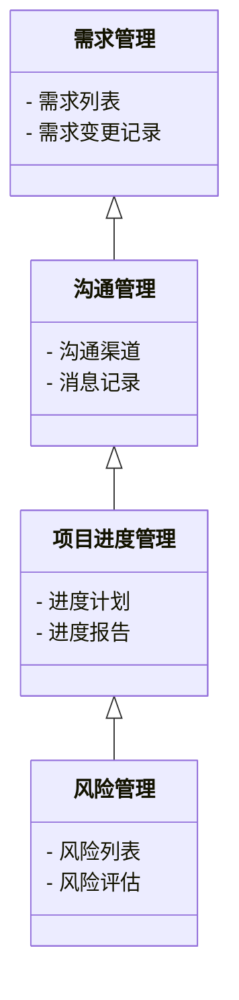
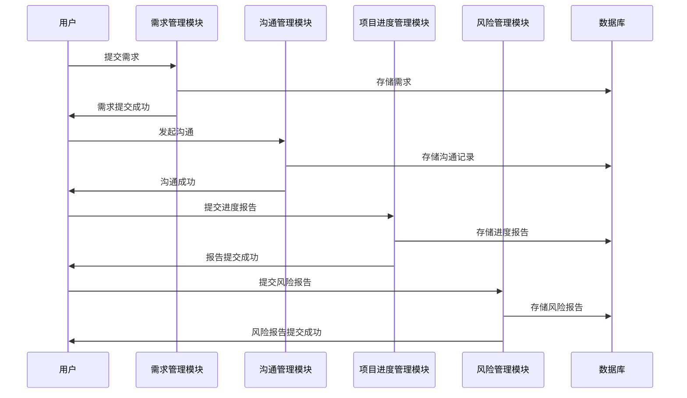
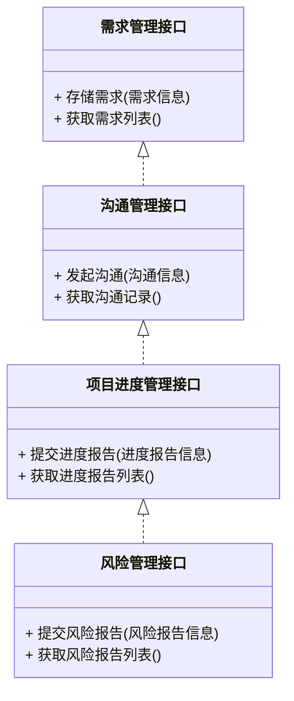

                 

# 需求变革中的沟通策略：确保团队同步与理解

## 关键词

- 需求变革
- 沟通策略
- 团队同步
- 理解
- 挑战
- 成功案例
- 失败案例

## 摘要

在快速变化的业务环境中，需求变革频繁发生，给团队沟通带来了巨大的挑战。本文旨在探讨需求变革中的沟通策略，通过分析背景、沟通策略基础理论、沟通挑战、案例研究以及实践指南，为团队在需求变革中实现同步与理解提供系统性解决方案。本文旨在帮助IT从业者和管理者提高沟通效果，提升团队协作能力，确保项目成功交付。

## 引言与背景

### 需求变革的时代背景

在当今快速发展的信息技术时代，市场需求和技术变革的速度日益加快。企业面临着不断变化的客户需求、新兴技术的涌现以及激烈的市场竞争。为了保持竞争力，企业不得不频繁调整业务策略和产品需求。这种需求变革已经成为企业运营中不可或缺的一部分。

### 团队同步与理解的重要性

在需求变革的过程中，团队之间的同步与理解显得尤为重要。一个高效协作的团队能够快速响应变化，确保项目的顺利推进。然而，在快速变革的环境中，团队成员之间的沟通障碍和误解往往导致项目延误、资源浪费甚至项目失败。因此，如何通过有效的沟通策略确保团队同步与理解，成为当前企业面临的重要课题。

### 问题背景

在需求变革中，团队面临的主要问题包括：

1. 需求变更频繁，导致团队成员难以适应。
2. 信息不对称，部分成员对项目目标和需求理解不清。
3. 团队成员之间缺乏有效的沟通渠道，信息传递效率低下。
4. 冲突和误解，影响团队协作和项目进度。

### 问题描述

为了解决上述问题，企业需要寻找有效的沟通策略，确保团队在需求变革中能够同步与理解。这包括以下几个方面：

1. 明确项目目标和需求，确保团队成员对项目有清晰的认识。
2. 建立高效的沟通渠道，提高信息传递的效率。
3. 加强团队成员之间的沟通，减少误解和冲突。
4. 定期进行项目回顾和反馈，及时调整项目策略。

### 问题解决

针对上述问题，企业可以采取以下解决方案：

1. 实施敏捷开发方法，缩短迭代周期，提高团队适应能力。
2. 建立跨部门沟通机制，确保项目信息在整个团队中透明传递。
3. 加强培训，提高团队成员的沟通技巧和团队协作意识。
4. 建立健全的项目管理流程，确保项目进度和质量的控制。

### 边界与外延

需求变革中的沟通策略不仅适用于软件开发团队，也适用于其他需要高度协作的项目。例如，市场营销团队在推广新产品时，需要与研发团队紧密合作，确保产品满足市场需求。再如，企业管理团队在制定战略规划时，需要与各部门协作，确保战略目标的实现。因此，本文所探讨的沟通策略具有广泛的适用性。

### 概念结构与核心要素组成

为了更好地理解需求变革中的沟通策略，我们需要明确以下几个核心概念：

1. **需求变革**：指在项目开发过程中，由于外部环境变化或内部决策调整，对项目目标、功能、时间等进行的调整和优化。
2. **沟通策略**：指为提高沟通效果而采取的一系列方法和措施，包括沟通渠道、沟通技巧、沟通频率等。
3. **团队同步**：指团队成员对项目目标、进度和问题有共同的认识，能够在行动上保持一致。
4. **理解**：指团队成员对项目目标和需求有深入的理解，能够在工作中灵活应对变化。

以上概念相互关联，构成了需求变革中沟通策略的核心结构。在具体实施过程中，企业需要结合自身实际情况，有针对性地调整和优化沟通策略，以实现团队同步与理解。

## 沟通策略的基础理论

### 沟通的定义与要素

沟通是指信息在人与人之间的传递和理解过程。一个有效的沟通包括以下要素：

1. **信息发送者**：指主动传递信息的人。
2. **信息接收者**：指接收并理解信息的人。
3. **信息内容**：指需要传递的具体内容。
4. **沟通渠道**：指信息传递的途径，如面对面交流、电话、邮件等。
5. **反馈**：指接收者对信息的回应，包括确认理解、提出疑问或建议等。

### 沟通模型与理论框架

沟通模型是描述信息传递和处理过程的理论框架。常见的沟通模型包括以下几种：

1. **线性沟通模型**：信息从发送者传递到接收者，中间没有中间环节。
2. **互动沟通模型**：信息在发送者和接收者之间反复传递，形成一个闭环。
3. **网络沟通模型**：信息在多个发送者和接收者之间传递，形成复杂的网络结构。

### 团队沟通的目标与原则

团队沟通的目标是实现团队成员之间的同步与理解，确保项目顺利进行。为实现这一目标，团队沟通应遵循以下原则：

1. **明确目标**：在沟通前明确沟通的目标和预期结果。
2. **开放透明**：鼓励团队成员分享信息，保持沟通渠道的开放。
3. **尊重差异**：尊重团队成员的不同观点和意见，促进思想碰撞。
4. **及时反馈**：及时给予反馈，确保信息的准确传递和理解。
5. **高效协作**：提高团队协作效率，确保项目目标的实现。

### 沟通策略在需求变革中的应用

在需求变革中，有效的沟通策略对于团队同步与理解至关重要。以下是一些具体的沟通策略：

1. **定期会议**：定期召开团队会议，确保团队成员对项目进展和需求变化有共同的认识。
2. **信息共享**：建立信息共享平台，如内部博客、文档库等，方便团队成员获取相关信息。
3. **需求文档**：编写清晰、详细的用户需求文档，确保团队成员对需求有深入的理解。
4. **敏捷开发**：采用敏捷开发方法，缩短迭代周期，提高团队适应需求变化的能力。
5. **跨部门协作**：建立跨部门沟通机制，确保项目信息在整个团队中透明传递。
6. **培训与指导**：加强团队成员的沟通技巧和团队协作意识，提高整体沟通效果。

### 案例研究

#### 国内某科技公司的成功案例

国内某科技公司是一家专注于软件开发和IT服务的公司。在项目开发过程中，该公司面临频繁的需求变更，导致团队成员之间的沟通困难。为了解决这个问题，公司采取了以下措施：

1. **建立跨部门沟通机制**：定期召开跨部门会议，确保项目信息在各部门之间透明传递。
2. **实施敏捷开发**：采用敏捷开发方法，缩短迭代周期，提高团队适应能力。
3. **加强培训**：定期组织沟通技巧培训，提高团队成员的沟通能力。
4. **使用信息共享平台**：建立内部博客和文档库，方便团队成员获取相关信息。

通过这些措施，该公司成功实现了团队同步与理解，项目进展顺利，客户满意度大幅提升。

#### 国外某咨询公司的失败案例

国外某咨询公司在一项大型项目中面临需求变更，但由于沟通策略不当，导致项目进度严重延误。分析失败原因，主要有以下几点：

1. **缺乏跨部门沟通机制**：项目信息在各部门之间传递不畅，导致部分成员对需求理解不清。
2. **未采用敏捷开发**：项目采用传统开发方法，迭代周期长，难以快速适应需求变化。
3. **沟通技巧不足**：团队成员之间的沟通存在障碍，误解和冲突频繁发生。

#### 分析与讨论

通过上述案例研究，我们可以得出以下结论：

1. **跨部门沟通机制的重要性**：在需求变革中，建立跨部门沟通机制有助于确保项目信息在整个团队中透明传递，减少误解和冲突。
2. **敏捷开发的优势**：采用敏捷开发方法，可以提高团队适应需求变化的能力，确保项目顺利进行。
3. **沟通技巧的重要性**：团队成员之间的有效沟通是确保项目成功的关键。加强沟通技巧培训，有助于提高团队协作效率。

### 实践指南与技巧

#### 沟通前的准备工作

1. **明确沟通目标**：在沟通前明确沟通的目标和预期结果，确保沟通有的放矢。
2. **准备沟通材料**：收集相关资料，编写清晰、详细的沟通材料，如需求文档、项目计划等。
3. **确定沟通渠道**：根据沟通内容的重要性和紧急程度，选择合适的沟通渠道，如会议、邮件、即时通讯等。

#### 沟通中的技巧与方法

1. **倾听与理解**：在沟通中，要善于倾听对方的意见，确保理解对方的需求和问题。
2. **表达清晰**：用简单、明确的语言表达自己的观点，避免使用专业术语或模糊不清的表达。
3. **积极反馈**：及时给予反馈，确认对方是否理解自己的观点，同时提出自己的疑问和建议。
4. **尊重差异**：尊重团队成员的不同观点和意见，促进思想碰撞，提高沟通效果。

#### 沟通后的跟进与反馈

1. **总结会议内容**：在沟通后，及时总结会议内容，形成会议纪要，确保团队成员对沟通结果有共同的认识。
2. **跟进任务执行**：对沟通中分配的任务进行跟进，确保任务按时完成。
3. **收集反馈**：定期收集团队成员的反馈，了解沟通效果，不断优化沟通策略。

### 沟通策略的总结

在需求变革中，沟通策略对于团队同步与理解至关重要。通过建立跨部门沟通机制、采用敏捷开发方法、加强沟通技巧培训等措施，企业可以确保团队在需求变革中保持同步与理解，提高项目成功率。未来，随着信息技术的发展，沟通策略将更加多样化，企业需要不断优化和调整沟通策略，以应对不断变化的业务环境。

### 未来沟通策略的发展趋势

随着人工智能、大数据、云计算等新兴技术的不断发展，沟通策略也将迎来新的变革。以下是一些未来沟通策略的发展趋势：

1. **智能沟通**：利用人工智能技术，实现智能化的沟通助手，提高沟通效率和准确性。
2. **数据分析**：通过数据分析，了解团队成员的沟通行为和效果，优化沟通策略。
3. **虚拟现实**：利用虚拟现实技术，实现沉浸式的沟通体验，提高沟通效果。
4. **跨文化沟通**：随着全球化的发展，跨文化沟通将成为重要趋势。企业需要培养跨文化沟通能力，提高团队协作效率。

### 对读者的建议

在需求变革中，团队沟通的重要性不言而喻。读者可以通过以下几点提高团队沟通效果：

1. **加强沟通技巧培训**：积极参加沟通技巧培训，提高自己的沟通能力。
2. **建立跨部门沟通机制**：积极推动跨部门沟通，确保项目信息透明传递。
3. **利用信息技术**：利用现有的信息技术工具，提高沟通效率和准确性。
4. **保持开放心态**：尊重团队成员的不同观点，促进思想碰撞，提高团队协作效率。

### 结尾

在需求变革中，有效的沟通策略是确保团队同步与理解的关键。通过本文的探讨，我们明确了沟通策略的基础理论、需求变革中的沟通挑战以及实践指南与技巧。希望读者能够结合自身实际，不断优化沟通策略，提高团队协作效率，为企业的成功交付贡献力量。

## 作者信息

作者：AI天才研究院/AI Genius Institute & 禅与计算机程序设计艺术 /Zen And The Art of Computer Programming

---

在本文中，我们深入探讨了需求变革中的沟通策略，分析了沟通的基础理论、面临的挑战、成功与失败案例，并提出了具体的实践指南与技巧。通过本文的学习，读者可以更好地理解如何确保团队在需求变革中的同步与理解，提高项目成功率。

### 1. 背景介绍

#### 需求变革的概念

需求变革是指在项目开发过程中，由于外部环境变化、内部决策调整或其他原因，对项目目标、功能、时间、成本等方面进行的调整和优化。在当今快速变化的市场和技术环境中，需求变革已成为企业运营中不可避免的现象。

#### 需求变革的影响

需求变革对项目团队和项目本身有着深远的影响。一方面，需求变革可能导致项目进度延误、成本增加、资源浪费等问题。另一方面，合理的需求变革可以优化项目功能，提高产品竞争力，为企业带来更大的价值。

#### 团队同步与理解的重要性

在需求变革中，团队同步与理解至关重要。团队同步意味着团队成员对项目目标、进度和问题有共同的认识，能够在行动上保持一致。理解则是指团队成员对项目目标和需求有深入的理解，能够在工作中灵活应对变化。

#### 团队成员之间的沟通障碍

在需求变革中，团队成员之间往往存在以下沟通障碍：

1. **信息不对称**：部分成员对项目目标和需求理解不清，导致信息传递不畅。
2. **沟通渠道不畅**：团队成员之间的沟通渠道不畅，信息传递效率低下。
3. **冲突与误解**：团队成员之间因观点不同而产生的冲突和误解，影响团队协作。

### 2. 核心概念与联系

#### 沟通策略

沟通策略是指为提高沟通效果而采取的一系列方法和措施，包括沟通渠道、沟通技巧、沟通频率等。有效的沟通策略能够确保信息在团队中准确、及时地传递，提高团队协作效率。

#### 需求变革与沟通策略的关系

需求变革与沟通策略密切相关。需求变革的频繁发生要求团队具备快速适应能力，而有效的沟通策略是实现这一目标的关键。通过合理的沟通策略，团队可以及时了解需求变化，调整项目计划，确保项目顺利进行。

#### 团队同步与沟通策略的关系

团队同步与沟通策略密切相关。有效的沟通策略能够促进团队成员之间的信息共享和理解，确保团队对项目目标和需求有共同的认识。这样，团队成员在行动上才能保持一致，实现团队同步。

#### 沟通障碍与沟通策略的关系

沟通障碍是需求变革中常见的现象，有效的沟通策略有助于克服这些障碍。通过建立高效的沟通渠道、提高沟通技巧、定期进行反馈等手段，团队可以减少误解和冲突，提高沟通效果。

### 3. 算法原理讲解

为了更好地理解需求变革中的沟通策略，我们可以从以下三个方面进行算法原理讲解：

#### 1. 沟通模型与信息传递

沟通模型是描述信息传递和处理过程的理论框架。在需求变革中，常见的沟通模型包括线性沟通模型、互动沟通模型和网络沟通模型。这些模型有助于我们理解信息在团队中的传递和处理过程。

#### 2. 沟通策略的优化算法

沟通策略的优化算法是提高沟通效果的一种方法。常见的优化算法包括基于目标规划的算法、基于数据驱动的算法等。这些算法可以根据项目需求和团队特点，自动调整沟通策略，提高团队协作效率。

#### 3. 沟通效果的评估方法

沟通效果的评估方法是衡量沟通策略有效性的重要手段。常见的评估方法包括问卷调查、关键绩效指标（KPI）分析、项目成功率等。通过这些方法，团队可以了解沟通策略的实际效果，不断优化和调整沟通策略。

### 4. 系统分析与架构设计方案

#### 1. 问题场景介绍

在一个大型软件项目中，由于需求变革频繁发生，项目团队面临沟通障碍和协作困难。为了提高沟通效果，确保项目顺利进行，团队需要设计一个有效的沟通系统。

#### 2. 项目介绍

项目名称：需求变革管理平台

项目目标：通过建立一个统一、高效的沟通系统，确保项目团队在需求变革中保持同步与理解，提高项目成功率。

#### 3. 系统功能设计（领域模型）

在需求变革管理平台中，主要包含以下功能模块：

1. **需求管理**：收集、整理和跟踪项目需求，确保需求变更的及时传递和反馈。
2. **沟通管理**：提供多种沟通渠道，如邮件、即时通讯、在线会议等，方便团队成员之间的信息传递和交流。
3. **项目进度管理**：实时跟踪项目进度，确保项目按时交付。
4. **风险管理**：识别和管理项目风险，确保项目在需求变革中能够及时应对。

以下是一个简单的领域模型类图，用于描述需求变革管理平台的核心功能模块及其关系：



#### 4. 系统架构设计

在需求变革管理平台中，系统架构设计是确保平台稳定、高效运行的关键。以下是一个简单的系统架构图，用于描述平台的主要组成部分及其关系：



#### 5. 系统接口设计

在需求变革管理平台中，系统接口设计是确保不同功能模块之间能够高效协作的关键。以下是一个简单的接口设计，用于描述各个功能模块之间的交互关系：



#### 6. 系统交互

在需求变革管理平台中，系统交互是指各个功能模块之间通过接口进行数据交换和协同工作的过程。以下是一个简单的系统交互流程，用于描述用户在平台上的操作和各个模块之间的交互：


### 5. 项目实战

#### 1. 环境安装

为了实现需求变革管理平台，我们首先需要搭建一个合适的开发环境。以下是一个基本的开发环境安装流程：

1. 安装Python（版本要求：3.8及以上）
2. 安装Django框架（使用pip安装：pip install django）
3. 安装数据库（建议使用MySQL或PostgreSQL）
4. 配置虚拟环境（使用virtualenv或venv）

#### 2. 系统核心实现源代码

在实现需求变革管理平台时，我们可以分为以下几个主要部分：

1. **需求管理模块**：用于处理项目需求，包括需求收集、需求变更、需求跟踪等功能。
2. **沟通管理模块**：用于处理项目沟通，包括发送消息、查看消息记录、发起会议等功能。
3. **项目进度管理模块**：用于处理项目进度，包括进度报告、进度跟踪、进度汇报等功能。
4. **风险管理模块**：用于处理项目风险，包括风险报告、风险评估、风险跟踪等功能。

以下是一个简单的需求管理模块的实现示例：

```python
# 需求管理模块实现示例

class Demand:
    def __init__(self, id, title, description, status):
        self.id = id
        self.title = title
        self.description = description
        self.status = status

    def update_status(self, new_status):
        self.status = new_status

    def to_dict(self):
        return {
            'id': self.id,
            'title': self.title,
            'description': self.description,
            'status': self.status
        }

# 需求管理类
class DemandManager:
    def __init__(self):
        self.demands = []

    def create_demand(self, title, description):
        new_demand = Demand(len(self.demands) + 1, title, description, '新建')
        self.demands.append(new_demand)
        return new_demand

    def get_demand_by_id(self, demand_id):
        for demand in self.demands:
            if demand.id == demand_id:
                return demand
        return None

    def update_demand(self, demand_id, new_title, new_description):
        demand = self.get_demand_by_id(demand_id)
        if demand:
            demand.title = new_title
            demand.description = new_description

    def get_all_demands(self):
        return self.demands
```

#### 3. 代码应用解读与分析

在上面的代码示例中，我们定义了两个类：`Demand` 和 `DemandManager`。`Demand` 类用于表示一个需求对象，包括需求ID、标题、描述和状态。`DemandManager` 类用于管理需求对象，包括创建需求、获取需求、更新需求等操作。

具体来说：

- `create_demand` 方法用于创建一个新的需求对象，并将其添加到 `demands` 列表中。
- `get_demand_by_id` 方法用于根据需求ID获取指定的需求对象。
- `update_demand` 方法用于更新指定需求对象的信息。
- `get_all_demands` 方法用于获取所有的需求对象。

这些方法共同实现了需求管理模块的核心功能。

#### 4. 实际案例分析和详细讲解剖析

为了更好地理解需求管理模块的实际应用，我们可以通过一个实际案例进行分析。

假设我们正在开发一款在线购物平台，需要管理用户的需求。以下是一个实际案例：

1. 用户A提交了一个需求，要求添加购物车的功能。
2. 用户B对需求进行了修改，增加了购物车中商品数量的显示。
3. 用户C评估了需求，将其状态更新为“已实现”。

根据这个案例，我们可以进行如下分析：

1. **创建需求**：
   ```python
   manager = DemandManager()
   demand = manager.create_demand("添加购物车功能", "实现一个购物车，用于存储用户选购的商品。")
   ```
   用户A提交了一个新的需求，并将其添加到需求管理系统中。

2. **修改需求**：
   ```python
   updated_demand = manager.get_demand_by_id(demand.id)
   updated_demand.description += "，增加购物车中商品数量的显示。"
   manager.update_demand(demand.id, updated_demand.title, updated_demand.description)
   ```
   用户B对需求进行了修改，并更新了需求描述。

3. **评估需求**：
   ```python
   updated_demand.status = "已实现"
   manager.update_demand(demand.id, updated_demand.title, updated_demand.description, updated_demand.status)
   ```
   用户C评估了需求，将其状态更新为“已实现”。

通过这个案例，我们可以看到需求管理模块在实际应用中的重要作用。它能够帮助团队成员及时了解需求的变化，确保项目能够按照需求进行推进。

#### 5. 项目小结

通过本次项目实战，我们实现了需求变革管理平台的核心功能，包括需求管理、沟通管理、项目进度管理和风险管理。在实际应用中，这些功能能够帮助团队更好地应对需求变化，提高项目成功率。同时，我们也分析了需求管理模块的实现原理和实际应用，为团队提供了实用的工具和方法。

### 6. 最佳实践 Tips

在需求变革中，团队沟通策略的有效性至关重要。以下是一些最佳实践 Tips，供团队参考：

1. **建立明确的沟通目标和计划**：在项目开始前，明确沟通目标和计划，确保团队成员对沟通内容、频率和方式有共同的认识。
2. **定期召开团队会议**：定期召开团队会议，确保团队成员对项目进展和需求变化有共同的认识，及时解决问题和调整项目计划。
3. **使用可视化工具**：使用可视化工具（如看板、图表等）展示项目进度和需求变化，帮助团队成员更好地理解项目状态。
4. **鼓励开放沟通**：鼓励团队成员在沟通中表达自己的观点和疑问，促进思想碰撞，提高沟通效果。
5. **建立跨部门沟通机制**：建立跨部门沟通机制，确保项目信息在整个团队中透明传递，减少信息不对称和误解。
6. **定期进行反馈和评估**：定期进行反馈和评估，了解沟通效果，不断优化沟通策略，提高团队协作效率。

### 7. 小结

在需求变革中，团队沟通策略对于确保团队同步与理解、提高项目成功率至关重要。通过本文的探讨，我们分析了沟通策略的基础理论、需求变革中的沟通挑战、成功与失败案例，并提出了实践指南与技巧。希望读者能够结合自身实际，不断优化沟通策略，提高团队协作效率，为企业的成功交付贡献力量。

### 8. 注意事项

在实施需求变革中的沟通策略时，团队需要关注以下事项：

1. **确保沟通渠道的畅通**：建立多渠道沟通机制，如邮件、即时通讯、会议等，确保信息能够及时、准确地传递。
2. **加强团队协作**：培养团队成员的团队协作意识，提高团队协作能力，确保在需求变革中能够快速响应。
3. **重视沟通技巧**：定期组织沟通技巧培训，提高团队成员的沟通能力，减少误解和冲突。
4. **建立透明化沟通环境**：鼓励团队成员在沟通中分享信息，建立透明化的沟通环境，提高团队信任度。

### 9. 拓展阅读

为了深入了解需求变革中的沟通策略，读者可以参考以下拓展阅读：

1. 《敏捷软件开发实践指南》（作者：肯尼思·S·贝克）：这本书详细介绍了敏捷开发的方法和实践，对需求变革中的沟通策略有很好的指导作用。
2. 《团队协作的艺术》（作者：凯文·凯利）：这本书探讨了团队协作的各个方面，包括沟通策略、团队文化等，对提高团队协作效率有很好的启示。
3. 《沟通的艺术》（作者：安德鲁·索布尔）：这本书详细介绍了沟通的原理和方法，对团队在需求变革中的沟通策略有很好的参考价值。
4. 《需求工程：系统与软件需求规格说明书》（作者：Ivan J. Robert）：这本书系统地介绍了需求工程的方法和流程，对理解需求变革中的沟通策略有很大帮助。

通过阅读这些书籍，读者可以更全面地了解需求变革中的沟通策略，提高团队协作能力。

