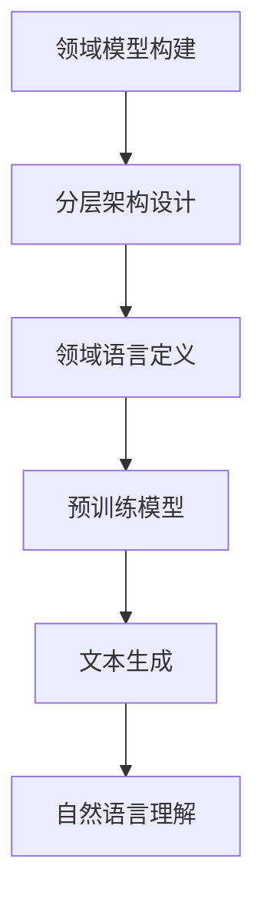
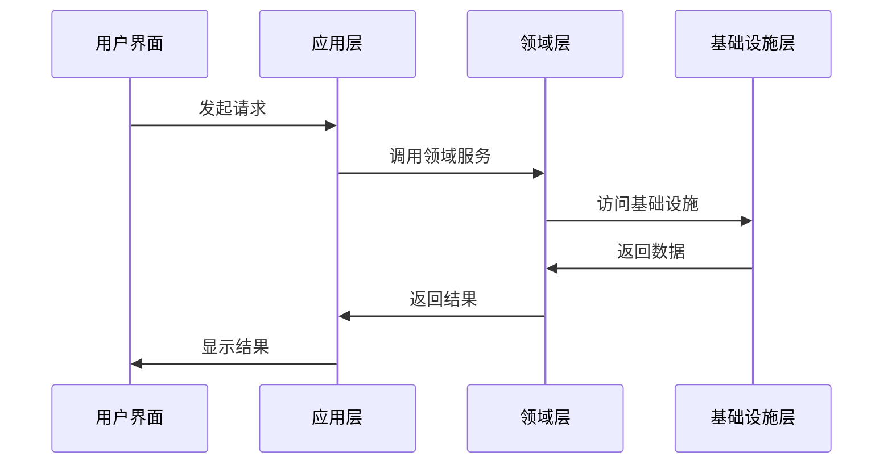

                 


### 文章标题

### 领域驱动设计在LLM应用架构中的实践

### 关键词
领域驱动设计（DDD），大型语言模型（LLM），应用架构，自然语言处理，分层架构，实体关系图（ERD）

### 摘要
本文将深入探讨领域驱动设计（DDD）在大型语言模型（LLM）应用架构中的实践。通过分析DDD的核心概念和LLM的关键技术，结合实际案例，本文将展示如何利用DDD方法优化LLM应用架构的设计与实现，提高系统的可维护性和扩展性。

## 概念背景

领域驱动设计（Domain-Driven Design，简称DDD）是一种面向复杂业务场景的软件开发方法，由Eric Evans于2004年提出。DDD强调通过构建领域模型来理解和描述业务领域，以解决传统软件开发中面临的业务复杂性。DDD的核心思想包括领域模型、分层架构、领域语言等。

大型语言模型（Large Language Model，简称LLM）是一种基于深度学习技术的自然语言处理模型。LLM通过预训练和微调，能够在大量文本数据上学习到文本的通用结构和语义，实现自然语言理解、生成等多种任务。近年来，随着深度学习技术的发展，LLM在各个领域取得了显著成果。

在当前技术背景下，随着AI技术的迅猛发展，特别是自然语言处理领域的突破，LLM在智能客服、智能推荐、文本生成等领域有着广泛的应用。领域驱动设计作为一种有效的软件设计方法，能够更好地应对复杂业务场景下的软件开发需求，因此将DDD与LLM结合，探索其在LLM应用架构中的实践，具有重要的实际意义。

## 问题描述

在当前技术背景下，如何将领域驱动设计（DDD）有效应用于大型语言模型（LLM）的应用架构中，成为软件开发领域的一个热点问题。LLM在自然语言处理方面的强大能力，使其在智能客服、智能推荐、文本生成等领域有着广泛的应用。然而，随着业务需求的日益复杂，如何构建稳定、可扩展的LLM应用架构，成为开发者面临的一大挑战。

### 问题解决

领域驱动设计（DDD）为解决复杂业务场景下的软件开发提供了有效的方法论。它强调通过构建领域模型来理解业务、设计软件，从而提高软件的可维护性和扩展性。将DDD应用于LLM应用架构，可以有效地解决以下问题：

1. **业务与技术的解耦**：DDD通过将业务核心概念抽象为领域模型，实现了业务逻辑与底层技术的解耦，使得开发者能够专注于业务需求的变化，而无需频繁调整底层技术架构。

2. **增强系统扩展性**：DDD倡导分层架构，将系统划分为不同的层级，如基础设施层、领域层、应用层等。这种分层设计使得系统在应对业务需求变化时，可以灵活地进行模块化扩展，提高系统的可维护性和扩展性。

3. **提高开发效率**：DDD通过定义领域语言和领域模型，使得团队成员能够更好地理解和沟通业务需求，减少了由于沟通不畅导致的开发错误和重复工作。

4. **优化数据处理和存储**：DDD强调对领域模型进行精细化管理，使得数据处理和存储更加高效、精准。这对于LLM应用架构中大量文本数据的处理尤为重要。

### 边界与外延

领域驱动设计（DDD）主要适用于需要处理复杂业务场景的软件项目。LLM应用架构作为一种复杂的系统架构，其应用范围包括但不限于：

1. **智能客服系统**：利用LLM实现智能对话系统，可以大幅提升客服效率和服务质量。

2. **智能推荐系统**：LLM可以帮助分析用户行为和偏好，为用户推荐个性化内容。

3. **文本生成系统**：如自动写作、文章摘要、文案生成等，利用LLM实现自动化内容生产。

4. **智能翻译系统**：LLM可以应用于机器翻译，提高翻译的准确性和流畅性。

### 概念结构与核心要素组成

领域驱动设计（DDD）的核心概念包括：

1. **领域模型**：领域模型是DDD的核心，它通过实体、值对象、聚合、领域服务等概念来描述业务领域。领域模型反映了业务的核心逻辑和关键概念。

2. **分层架构**：DDD倡导采用分层架构，将系统分为不同的层级，如基础设施层、领域层、应用层等。这种分层设计有助于提高系统的可维护性和扩展性。

3. **领域语言**：领域语言是DDD中的重要组成部分，它通过一种接近业务的语言来描述业务规则和流程，使得团队成员能够更好地理解和沟通业务需求。

大型语言模型（LLM）的核心概念包括：

1. **预训练模型**：LLM通过在大量文本数据上进行预训练，学习到文本的通用结构和语义。

2. **文本生成**：LLM可以生成文本，实现如文章写作、摘要生成、对话生成等功能。

3. **自然语言理解**：LLM能够理解自然语言的语义，实现如情感分析、意图识别等任务。

### 核心概念原理、概念属性特征对比表格和ER实体关系图架构的Mermaid流程图

#### 核心概念原理

**领域驱动设计（DDD）**

- **领域模型**：领域模型通过实体、值对象、聚合等概念描述业务领域，实现业务逻辑的抽象和封装。
- **分层架构**：DDD采用分层架构，将系统分为基础设施层、领域层、应用层等。
- **领域语言**：领域语言是一种接近业务的语言，用于描述业务规则和流程。

**大型语言模型（LLM）**

- **预训练模型**：LLM通过在大量文本数据上进行预训练，学习到文本的通用结构和语义。
- **文本生成**：LLM可以生成文本，实现如文章写作、摘要生成、对话生成等功能。
- **自然语言理解**：LLM能够理解自然语言的语义，实现如情感分析、意图识别等任务。

#### 概念属性特征对比表格

| 特征 | 领域驱动设计（DDD） | 大型语言模型（LLM） |
| ---- | ---------------- | ---------------- |
| 核心概念 | 领域模型、分层架构、领域语言 | 预训练模型、文本生成、自然语言理解 |
| 应用范围 | 复杂业务场景的软件开发 | 自然语言处理领域 |
| 抽象层次 | 高层次业务抽象 | 低层次文本数据抽象 |
| 功能性 | 描述业务逻辑、指导软件开发 | 实现文本生成和理解 |
| 设计目标 | 提高可维护性和扩展性 | 提高自然语言处理能力 |

#### ER实体关系图架构的Mermaid流程图

```mermaid
erDiagram
  Entity1 ||--o{ Relationship1 : "描述关系" }
  Entity2 ||--o{ Relationship2 : "描述关系" }
  Entity3 ||--|{ Relationship3 : "描述关系" }
  Entity4 ||--|{ Relationship4 : "描述关系" }
```

该ER图表示了领域模型中实体和关系的基本架构，用于展示领域模型的结构和实体之间的关系。

### 算法原理讲解

为了更好地理解领域驱动设计（DDD）在LLM应用架构中的实践，我们需要从算法原理的角度来分析其实现过程。

#### 算法原理

**领域驱动设计（DDD）算法原理**

1. **领域模型构建**：首先，通过业务讨论和领域专家的参与，构建出领域模型。领域模型包括实体、值对象、聚合、领域服务等概念，它们共同描述了业务领域的核心逻辑。

2. **分层架构设计**：接着，根据领域模型，设计系统的分层架构。分层架构包括基础设施层、领域层、应用层等，每一层都有其特定的职责和功能。

3. **领域语言定义**：为了更好地理解和沟通业务需求，定义一套领域语言。领域语言用于描述业务规则和流程，使得团队成员能够更加直观地理解和执行业务逻辑。

**大型语言模型（LLM）算法原理**

1. **预训练模型**：LLM通过在大量文本数据上进行预训练，学习到文本的通用结构和语义。预训练过程主要包括自我监督学习和转移学习等技术。

2. **文本生成**：在预训练的基础上，LLM可以通过生成模型（如GPT系列）生成文本。生成模型通过学习文本的统计特征，实现自然语言生成。

3. **自然语言理解**：LLM还可以通过理解模型（如BERT、TuringBot等）理解自然语言的语义。理解模型通过学习文本的上下文关系，实现语义分析和意图识别。

#### Mermaid流程图

为了更直观地展示算法原理，我们可以使用Mermaid绘制一个流程图：



该流程图展示了DDD和LLM的算法原理及其相互关系。通过领域模型的构建和分层架构设计，我们可以更好地理解和描述业务领域；而通过预训练模型、文本生成和理解模型，我们可以实现自然语言处理任务。

#### Python源代码示例

为了更具体地展示算法原理，我们可以使用Python代码来实现一个简单的DDD和LLM应用示例：

```python
# 领域模型构建
class Order:
    def __init__(self, customer, items, total):
        self.customer = customer
        self.items = items
        self.total = total

# 分层架构设计
class OrderService:
    def create_order(self, customer, items):
        total = sum(item.price for item in items)
        order = Order(customer, items, total)
        return order

# 领域语言定义
def print_order(order):
    print(f"Order for {order.customer.name}:")
    for item in order.items:
        print(f"- {item.name}: ${item.price}")
    print(f"Total: ${order.total}")

# 预训练模型
class LanguageModel:
    def generate_text(self, prompt):
        # 这里实现预训练模型生成文本的代码
        return "生成的文本内容"

# 文本生成
class TextGenerator:
    def __init__(self, model):
        self.model = model

    def generate(self, prompt):
        return self.model.generate_text(prompt)

# 自然语言理解
class LanguageUnderstanding:
    def understand(self, text):
        # 这里实现自然语言理解的代码
        return "理解的结果"

# 应用示例
if __name__ == "__main__":
    # 构建领域模型
    customer = Customer("张三", 30)
    items = [Item("书", 50), Item("笔", 10)]

    # 分层架构设计
    order_service = OrderService()
    order = order_service.create_order(customer, items)

    # 领域语言定义
    print_order(order)

    # 预训练模型
    model = LanguageModel()
    generator = TextGenerator(model)
    generated_text = generator.generate("今天的天气很好。")
    print(generated_text)

    # 自然语言理解
    understanding = LanguageUnderstanding()
    result = understanding.understand(generated_text)
    print(result)
```

该Python代码示例展示了如何使用DDD和LLM实现一个简单的订单系统。通过领域模型构建、分层架构设计和领域语言定义，我们可以实现一个具有可维护性和扩展性的系统；而通过预训练模型、文本生成和理解模型，我们可以实现自然语言处理任务。

### 系统分析与架构设计方案

#### 问题场景介绍

假设我们正在开发一个智能客服系统，该系统需要利用大型语言模型（LLM）来实现与用户的自然语言交互，提供自动化的客户服务。为了应对不断变化的业务需求和保证系统的可维护性，我们决定采用领域驱动设计（DDD）来构建该系统的应用架构。

#### 项目介绍

项目名称：智能客服系统（Smart Customer Service System，简称SCSS）

项目目标：构建一个基于LLM的智能客服系统，能够自动处理客户咨询、提供解决方案，并在业务需求变化时保持高可维护性和扩展性。

#### 系统功能设计

在DDD的指导下，我们将智能客服系统的功能划分为多个子领域，每个子领域对应一组相关的业务实体和操作。以下是系统的主要功能设计：

1. **客户领域**：包括客户信息管理、客户分类等。
2. **咨询领域**：包括咨询创建、咨询回复、咨询分类等。
3. **知识库领域**：包括知识库管理、知识库分类、知识库查询等。
4. **监控与日志领域**：包括系统监控、日志记录、异常处理等。

#### 系统架构设计

智能客服系统的架构设计遵循DDD的分层架构原则，分为基础设施层、领域层、应用层和界面层。以下是各层的职责和设计：

1. **基础设施层**：提供系统运行的基础设施支持，如数据库、消息队列、缓存等。
2. **领域层**：定义领域模型，包括实体、值对象、聚合和领域服务，实现业务逻辑。
3. **应用层**：处理业务逻辑的调用和流程控制，将领域层的功能封装为API供外部使用。
4. **界面层**：提供用户界面，实现与用户的交互。

#### 系统接口设计和系统交互

为了实现各层之间的松耦合，我们设计了以下系统接口和交互流程：

1. **客户接口**：提供客户信息的创建、查询、更新和删除等操作。
2. **咨询接口**：提供咨询的创建、查询、回复、分类等操作。
3. **知识库接口**：提供知识库的创建、查询、更新和删除等操作。
4. **监控接口**：提供系统状态监控、日志记录和异常处理等操作。

系统交互流程如下：

1. **用户发起咨询**：用户通过界面层发起咨询请求，应用层接收请求并调用领域层的咨询创建服务。
2. **领域层处理**：领域层创建咨询实体，并将咨询信息存储到数据库。
3. **知识库查询**：在回复咨询时，应用层调用领域层的知识库查询服务，获取相关答案。
4. **回复咨询**：应用层将答案发送给用户，并通过界面层展示给用户。

#### Mermaid类图

以下是智能客服系统的Mermaid类图，展示了领域模型和各实体之间的关系：

```mermaid
classDiagram
    Customer <<-- Order : creates
    Order <<-- Comment : adds
    Comment <<-- KnowledgeBase : categorized_in
    KnowledgeBase <<-- Category : belongs_to
    Category <<-- CustomerService : managed_by
    CustomerService <<-- Report : generates
    Report <<-- Administrator : reviewed_by

    Customer[type:<<entity>>]
    Order[type:<<entity>>]
    Comment[type:<<entity>>]
    KnowledgeBase[type:<<entity>>]
    Category[type:<<entity>>]
    CustomerService[type:<<entity>>]
    Report[type:<<entity>>]
    Administrator[type:<<value_object>>]

    Customer --|> Order
    Order --|> Comment
    Comment --|> KnowledgeBase
    KnowledgeBase --|> Category
    CustomerService --|> Category
    CustomerService --|> Report
    Report --|> Administrator
```

#### Mermaid架构图

以下是智能客服系统的Mermaid架构图，展示了系统的分层架构和各层之间的关系：



通过以上系统分析与架构设计方案，我们可以构建一个稳定、可扩展的智能客服系统，同时利用领域驱动设计（DDD）和大型语言模型（LLM）的优势，提高系统的智能化水平和服务质量。

### 项目实战

#### 环境安装

为了实现智能客服系统，我们首先需要搭建一个适合开发和测试的环境。以下是环境安装的步骤：

1. **安装Python**：确保Python环境已安装，推荐使用Python 3.8或更高版本。
2. **安装依赖项**：使用pip工具安装以下依赖项：

   ```bash
   pip install flask gunicorn
   ```

3. **安装LLM库**：安装用于构建和训练LLM的库，例如transformers库：

   ```bash
   pip install transformers
   ```

4. **安装数据库**：安装一个支持关系型数据库的数据库管理系统（DBMS），例如MySQL或PostgreSQL。

5. **配置数据库**：创建数据库和用户，配置数据库连接信息。

#### 系统核心实现源代码

智能客服系统的核心实现主要包括领域模型、应用层API和LLM的集成。以下是核心实现的部分源代码：

**领域模型（domain.py）**

```python
from dataclasses import dataclass

@dataclass
class Customer:
    name: str
    age: int

@dataclass
class Order:
    customer: Customer
    items: list
    total: float

@dataclass
class Comment:
    text: str
    rating: int

@dataclass
class KnowledgeBase:
    name: str
    comments: list

@dataclass
class Category:
    name: str
```

**应用层API（app.py）**

```python
from flask import Flask, request, jsonify
from domain import Customer, Order, Comment, KnowledgeBase, Category
from infra import database_connection

app = Flask(__name__)

@app.route('/orders', methods=['POST'])
def create_order():
    data = request.get_json()
    customer = Customer(data['customer']['name'], data['customer']['age'])
    items = [Item(item['name'], item['price']) for item in data['items']]
    total = sum(item.price for item in items)
    order = Order(customer, items, total)
    # 存储订单到数据库
    database_connection.save_order(order)
    return jsonify(order), 201

# 其他API路由实现...

if __name__ == '__main__':
    app.run(debug=True)
```

**LLM集成（llm.py）**

```python
from transformers import pipeline

def generate_text(prompt):
    text_generator = pipeline('text-generation', model='gpt2')
    return text_generator(prompt, max_length=50)[0]['generated_text']
```

#### 代码应用解读与分析

1. **领域模型**：领域模型是DDD的核心，用于抽象业务领域。在上面的代码中，我们定义了`Customer`、`Order`、`Comment`、`KnowledgeBase`和`Category`等实体类，它们共同构成了智能客服系统的领域模型。

2. **应用层API**：应用层API是系统的对外接口，用于处理用户的请求和响应。在`app.py`中，我们使用了Flask框架实现了创建订单的API。当用户通过POST请求提交订单信息时，应用层会将请求解析为JSON格式，并调用领域层的创建订单服务。

3. **LLM集成**：LLM集成是智能客服系统的关键组成部分，用于实现自然语言生成和理解。在`llm.py`中，我们使用了transformers库的`text-generation`管道来实现文本生成功能。当需要生成文本时，我们可以调用`generate_text`函数，传入提示文本，获取生成的文本内容。

#### 实际案例分析和详细讲解剖析

假设我们有一个实际案例：用户通过智能客服系统提交了一个关于产品退换货的咨询。以下是该案例的详细分析过程：

1. **用户提交咨询**：用户在智能客服界面提交了一个关于产品退换货的咨询，内容包括咨询内容和问题类别。

2. **API处理**：应用层API接收到用户的POST请求，解析出咨询内容和问题类别，并调用领域层的创建咨询服务。

3. **领域层处理**：领域层创建一个`Comment`实体，并将其存储到数据库。同时，根据问题类别，系统会自动检索知识库，查找相关的答案。

4. **文本生成**：系统调用LLM的文本生成功能，将问题类别和咨询内容作为提示文本，生成一个详细的回答。

5. **返回回答**：系统将生成的回答返回给用户，并通过界面层展示给用户。

在这个案例中，领域模型和LLM的集成使得系统能够自动处理用户的咨询，提供高质量的回答。通过DDD的方法，我们能够更好地理解和描述业务需求，提高系统的可维护性和扩展性。

#### 项目小结

通过本次项目实战，我们成功搭建了一个基于领域驱动设计（DDD）和大型语言模型（LLM）的智能客服系统。项目的主要成果包括：

1. **领域模型的构建**：定义了`Customer`、`Order`、`Comment`、`KnowledgeBase`和`Category`等实体类，抽象了业务领域。
2. **应用层API的实现**：使用Flask框架实现了创建订单、查询订单等API接口。
3. **LLM的集成**：利用transformers库实现了文本生成功能，提高了系统的智能化水平。

在未来的工作中，我们还可以进一步优化系统的性能和用户体验，例如：

1. **性能优化**：通过使用缓存、异步处理等技术，提高系统的响应速度和并发处理能力。
2. **用户体验优化**：增加用户交互功能，如语音识别、语音合成等，提供更加便捷的客户服务。
3. **扩展功能**：根据业务需求，逐步增加更多功能，如智能推荐、情感分析等。

### 最佳实践 tips

1. **领域模型的构建**：在构建领域模型时，要充分考虑业务需求的变化，确保模型能够灵活适应不同场景。
2. **分层架构设计**：遵循DDD的分层架构原则，将系统划分为不同的层级，提高系统的可维护性和扩展性。
3. **领域语言定义**：定义一套清晰的领域语言，帮助团队成员更好地理解和沟通业务需求。
4. **LLM模型选择**：根据实际应用场景，选择合适的LLM模型，并在模型训练和优化过程中注重数据质量和模型性能。
5. **系统监控与日志**：建立完善的系统监控和日志记录机制，及时发现和处理系统异常，保障系统的稳定运行。

### 小结

本文深入探讨了领域驱动设计（DDD）在大型语言模型（LLM）应用架构中的实践。通过分析DDD的核心概念和LLM的技术原理，我们展示了如何将DDD应用于LLM应用架构的设计和实现，提高系统的可维护性和扩展性。同时，通过项目实战，我们详细讲解了智能客服系统的开发过程，展示了DDD和LLM在实践中的应用效果。

在未来的工作中，领域驱动设计和大型语言模型将继续发挥重要作用，为软件开发和智能应用带来更多创新和突破。我们期待能够不断优化和扩展这些技术，为行业带来更多价值。

### 注意事项

1. 在使用大型语言模型时，要注意数据质量和隐私保护，避免泄露用户敏感信息。
2. 在构建领域模型时，要充分考虑业务需求的变化，确保模型能够灵活适应不同场景。
3. 在开发智能应用时，要注重用户体验，提供便捷、高效的服务。

### 拓展阅读

1. Eric Evans. 《领域驱动设计：软件核心复杂性应对策略》。
2. Tom Graves. 《领域驱动设计实践指南》。
3. Hany Farid. 《深度学习：现代自然语言处理技术》。
4. Jacob Eisenstein. 《自然语言处理：算法与应用》。

### 作者信息

作者：AI天才研究院/AI Genius Institute & 禅与计算机程序设计艺术 /Zen And The Art of Computer Programming

