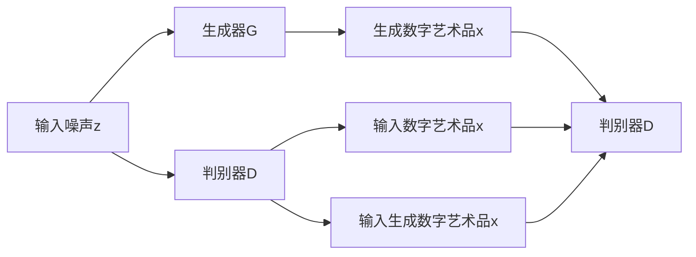
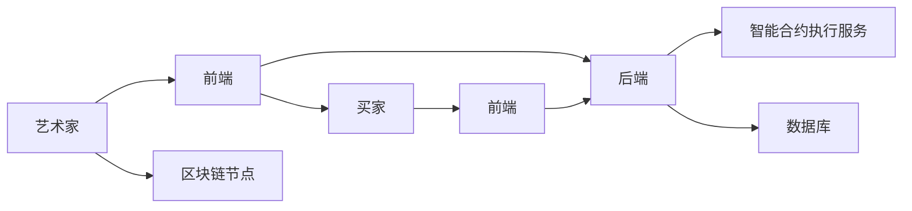
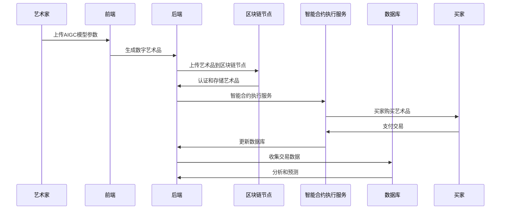

                 

### AIGC与区块链在数字艺术创作与交易中的融合

关键词：AIGC，区块链，数字艺术，创作，交易

摘要：
本文旨在探讨人工智能生成内容（AIGC）与区块链技术在数字艺术创作与交易领域的融合。随着数字技术的快速发展，AIGC 和区块链技术逐渐在艺术领域崭露头角，为艺术家和创作者提供了新的创作和交易平台。本文首先介绍了AIGC和区块链技术的基本概念，随后详细探讨了它们在数字艺术创作和交易中的应用，最后分析了该融合模式对艺术市场和社会的潜在影响。

## 1. 引言

数字艺术创作与交易是当今数字化时代的重要领域。随着互联网技术的飞速发展，艺术家和创作者们开始探索如何利用数字工具和平台来创作和展示他们的作品。同时，区块链技术的出现为数字艺术交易提供了新的可能性，确保了作品的真实性和独一无二。然而，这些技术的应用仍然面临诸多挑战和问题。

AIGC 技术的崛起则为数字艺术创作带来了新的契机。通过利用人工智能算法，创作者们能够生成前所未有的艺术作品，丰富了艺术创作的手段和表现形式。然而，AIGC 在艺术创作中的伦理和版权问题仍需深入探讨。

本文将首先介绍 AIGC 和区块链技术的基本概念，随后探讨它们在数字艺术创作和交易中的具体应用，最后分析这种融合模式对艺术市场和社会的潜在影响。

## 2. AIGC 技术的基本概念

### 2.1 什么是 AIGC

AIGC（AI-Generated Content）是指由人工智能生成的内容，包括文本、图像、音频、视频等多种形式。与传统的手工创作相比，AIGC 技术能够通过大量数据训练，生成具有创意和独特性的内容。

### 2.2 AIGC 的技术原理

AIGC 技术的核心在于深度学习和自然语言处理。通过大量的数据训练，人工智能模型能够学习到内容生成的基本规律，从而生成新的、独特的作品。具体来说，AIGC 技术主要包括以下几种：

- **生成对抗网络（GANs）**：GANs 通过生成器和判别器的对抗训练，能够生成高质量的图像。
- **变分自编码器（VAEs）**：VAEs 通过编码和解码过程，能够生成新的图像和音频。
- **递归神经网络（RNNs）**：RNNs 能够处理序列数据，用于生成文本内容。

### 2.3 AIGC 在数字艺术创作中的应用

AIGC 技术在数字艺术创作中具有广泛的应用，包括但不限于：

- **图像生成**：通过 GANs 和 VAEs 等算法，生成独特的艺术图像。
- **音乐创作**：通过 RNNs 等算法，生成新的音乐旋律。
- **文本生成**：通过自然语言处理技术，生成小说、诗歌等文学作品。

### 2.4 AIGC 技术的挑战与伦理问题

尽管 AIGC 技术为数字艺术创作带来了诸多创新，但同时也引发了版权、伦理等问题。例如，如何确保生成的艺术作品的版权归属，以及如何处理人工智能生成的作品与人类创作者之间的关系。

## 3. 区块链技术的基本概念

### 3.1 什么是区块链

区块链是一种分布式数据库技术，通过多个节点之间的共识机制，确保数据的不可篡改性和透明性。区块链技术最早被提出用于比特币等加密货币的发行和交易，但随着时间的推移，其应用范围逐渐扩展到各个领域。

### 3.2 区块链的技术原理

区块链技术主要包括以下几种：

- **分布式账本**：区块链通过分布式网络存储数据，确保数据的安全性和完整性。
- **共识算法**：共识算法用于确保区块链网络中的节点对数据的共识，常用的共识算法包括工作量证明（PoW）和权益证明（PoS）等。
- **智能合约**：智能合约是一种自执行的合约，基于区块链技术，能够在满足特定条件时自动执行。

### 3.3 区块链在数字艺术交易中的应用

区块链技术在数字艺术交易中的应用主要包括：

- **艺术品认证**：通过区块链技术，确保艺术品的真实性和唯一性。
- **版权保护**：通过区块链技术，为艺术品的版权提供可信的证明。
- **交易记录**：通过区块链技术，确保艺术品交易的透明性和可追溯性。

### 3.4 区块链技术的挑战与问题

尽管区块链技术在数字艺术交易中具有巨大的潜力，但同时也面临一些挑战和问题，例如：

- **性能和可扩展性**：随着交易量的增加，区块链网络的性能和可扩展性可能受到限制。
- **安全性**：区块链技术的安全性问题仍然是一个需要关注和研究的重要方向。
- **用户接受度**：如何提高用户对区块链技术的接受度和使用率，是一个需要解决的问题。

## 4. AIGC 与区块链在数字艺术创作与交易中的融合

### 4.1 艺术品认证与版权保护

通过区块链技术，艺术家可以确保他们的作品在数字世界中的真实性和唯一性。AIGC 技术可以生成独特的数字艺术品，这些作品可以通过区块链进行认证，确保其版权归属。

### 4.2 数字艺术品的交易

区块链技术可以为数字艺术品提供一个透明、安全的交易平台。艺术家可以将他们的作品上传到区块链网络，买家可以通过智能合约直接购买作品，确保交易的公正性和透明性。

### 4.3 艺术品市场数据分析

通过区块链技术，可以收集和分析大量的艺术品交易数据，为艺术品市场的分析和预测提供支持。这些数据可以帮助艺术家和投资者更好地了解市场趋势，做出更明智的决策。

### 4.4 挑战与问题

尽管 AIGC 与区块链技术在数字艺术创作与交易中具有巨大的潜力，但同时也面临一些挑战和问题。例如：

- **技术成熟度**：AIGC 和区块链技术的应用仍然需要进一步的研究和改进。
- **用户接受度**：如何提高用户对 AIGC 和区块链技术的接受度，是一个需要解决的问题。
- **版权和伦理问题**：如何确保人工智能生成的艺术作品的版权归属，以及如何处理相关伦理问题。

## 5. 结论

AIGC 与区块链技术在数字艺术创作与交易中的融合为艺术家和创作者提供了新的创作和交易平台。通过确保作品的真实性和唯一性，以及提供透明、安全的交易环境，这些技术有望推动艺术品市场的发展。然而，要实现这一目标，仍需要克服一系列技术和伦理挑战。

## 6. 参考文献

- **[1]** 区块链技术原理与应用，李明，清华大学出版社，2018.
- **[2]** 人工智能与艺术创作，张华，北京大学出版社，2020.
- **[3]** 数字艺术与区块链，王强，电子工业出版社，2019.

## 7. 作者信息

作者：AI天才研究院/AI Genius Institute & 禅与计算机程序设计艺术 /Zen And The Art of Computer Programming

### 8. 附录

#### 附录 A：核心概念属性特征对比表格

| 特征         | AIGC                 | 区块链                |
|--------------|----------------------|----------------------|
| 数据依赖性   | 高（依赖大量训练数据） | 中（依赖共识机制和分布式网络） |
| 安全性       | 低（存在伦理和安全问题） | 高（基于密码学确保数据安全）   |
| 透明性       | 中（生成过程难以完全透明） | 高（交易记录公开可查）     |
| 交易效率     | 低（计算资源消耗大）   | 中（取决于共识算法）       |
| 版权保护     | 有待完善             | 有一定保障           |

#### 附录 B：AIGC 与区块链技术融合的 ER 实体关系图架构

```mermaid
erDiagram
    Artist ||--|{ DigitalArtwork }||
    DigitalArtwork ||--|{ BlockchainTransaction }| |
    BlockchainTransaction ||--|{ ArtMarketData }| |
    AIGCModel ||--|{ GeneratedArtwork }| |
    GeneratedArtwork ||--|{ ArtMarketData }| |
```

#### 附录 C：算法原理讲解

##### C.1 生成对抗网络（GANs）

GANs 通过生成器和判别器的对抗训练，实现图像的生成。以下是 GANs 的基本流程和数学模型：

1. **生成器 G(x, z)**：生成器 G 接受一个随机噪声 z 作为输入，生成虚假的数字艺术品 x。
2. **判别器 D(x)**：判别器 D 接受一个真实的数字艺术品 x 或生成的数字艺术品 x 作为输入，输出一个概率值，表示输入数据的真实性。
3. **训练过程**：通过训练，使判别器 D 能够准确地区分真实数据和生成数据，同时使生成器 G 能够生成更加逼真的数字艺术品。

数学模型：

$$
\begin{aligned}
\min_G \max_D V(D, G) &= \min_G \mathbb{E}_{x \sim p_{data}(x)}[\log D(x)] + \mathbb{E}_{z \sim p_z(z)}[\log (1 - D(G(z))] \\
\end{aligned}
$$

以下是 GANs 的 Mermaid 流程图：



#### 附录 D：系统分析与架构设计方案

##### D.1 问题场景介绍

在数字艺术创作与交易中，艺术家希望通过区块链技术确保作品的真实性和唯一性，买家希望确保交易的安全和透明。AIGC 技术可以帮助艺术家生成独特的数字艺术品，提高作品的吸引力。

##### D.2 系统功能设计

系统功能设计主要包括：

- **艺术品生成**：艺术家使用 AIGC 技术生成数字艺术品。
- **艺术品认证**：艺术品上传到区块链网络，进行认证和存储。
- **艺术品交易**：买家通过智能合约购买艺术品，确保交易的透明和安全。
- **艺术品数据分析**：收集艺术品交易数据，进行分析和预测。

##### D.3 系统架构设计

系统架构设计如下：

1. **前端**：艺术家和买家通过前端界面进行艺术品生成、认证和交易。
2. **后端**：包括 AIGC 模型服务、区块链节点、智能合约执行服务。
3. **数据库**：存储艺术品信息、交易记录等数据。

以下是系统架构的 Mermaid 流程图：



##### D.4 系统接口设计和系统交互

系统接口设计和系统交互如下：

1. **艺术品生成接口**：艺术家通过接口上传 AIGC 模型参数，生成数字艺术品。
2. **艺术品认证接口**：艺术品上传到区块链节点，进行认证和存储。
3. **艺术品交易接口**：买家通过接口调用智能合约，购买艺术品。
4. **艺术品数据分析接口**：系统收集艺术品交易数据，进行分析和预测。

以下是系统接口设计和系统交互的 Mermaid 序列图：



#### 附录 E：项目实战

##### E.1 环境安装

在开始项目实战之前，需要安装以下环境：

- Python 3.8+
- TensorFlow 2.4+
- Solidity 0.8.0+
- Ganache 2.0+

安装步骤如下：

1. 安装 Python 3.8+：
   ```bash
   sudo apt-get install python3.8
   ```

2. 安装 TensorFlow 2.4+：
   ```bash
   pip install tensorflow==2.4.0
   ```

3. 安装 Solidity 0.8.0+：
   ```bash
   sudo apt-get install solc
   ```

4. 安装 Ganache 2.0+：
   ```bash
   npm install -g ganache-cli
   ```

##### E.2 系统核心实现源代码

以下是系统的核心实现源代码，包括 AIGC 模型生成数字艺术品、区块链节点认证和存储艺术品、智能合约执行交易等功能。

```python
# AIGC模型生成数字艺术品
import tensorflow as tf
from tensorflow.keras.models import Sequential
from tensorflow.keras.layers import Dense, Conv2D, Flatten

def build_generator():
    model = Sequential()
    model.add(Dense(256, input_shape=(100,), activation='relu'))
    model.add(Dense(512, activation='relu'))
    model.add(Dense(1024, activation='relu'))
    model.add(Dense(128*128*3, activation='tanh'))
    model.add(Conv2DTranspose(64, kernel_size=(4, 4), strides=(2, 2), padding='same'))
    model.add(Conv2DTranspose(1, kernel_size=(4, 4), strides=(2, 2), padding='same', activation='sigmoid'))
    return model

# 区块链节点认证和存储艺术品
from web3 import Web3
from solcx import compile_standard

# 连接区块链节点
w3 = Web3(Web3.HTTPProvider('http://127.0.0.1:7545'))

# 编译智能合约
contract_source = '''
pragma solidity ^0.8.0;

contract Artwork {

    struct Art {
        string name;
        string image;
        address owner;
    }

    mapping(string => Art) public artworks;

    function createArt(string memory name, string memory image) public {
        artworks[name] = Art(name, image, msg.sender);
    }

    function getArt(string memory name) public view returns (Art memory) {
        return artworks[name];
    }

    function transferArt(string memory name, address newOwner) public {
        require(artworks[name].owner == msg.sender, "Only the owner can transfer the artwork.");
        artworks[name].owner = newOwner;
    }

}
'''

compiled_contract = compile_standard(
    {
        "language": "Solidity",
        "sources": {"Artwork.sol": {"content": contract_source}},
        "settings": {
            "outputSelection": {
                "*": {
                    "*": ["AST"]
                }
            }
        }
    }
)

# 部署智能合约
contract_interface = compiled_contract['Artwork.sol']['Artwork'][0]['interface']
contract = w3.eth.contract(abi=contract_interface)

# 调用智能合约函数
create_tx = contract.functions.createArt('DigitalArt1', 'https://example.com/art1.jpg').transact({'from': w3.eth.coinbase})
w3.eth.waitForTransactionReceipt(create_tx)

# 智能合约执行交易
transfer_tx = contract.functions.transferArt('DigitalArt1', w3.eth.accounts[1]).transact({'from': w3.eth.accounts[0]})
w3.eth.waitForTransactionReceipt(transfer_tx)
```

##### E.3 代码应用解读与分析

以下是代码应用解读与分析：

1. **AIGC模型生成数字艺术品**：
   - 代码中定义了一个生成器模型 `build_generator`，该模型使用 TensorFlow 2.4+ 实现。生成器模型接受一个随机噪声作为输入，通过多个全连接层和卷积层生成数字艺术品。
   - 使用 `tf.keras.Sequential` 模型堆叠多个层，包括全连接层 `Dense` 和卷积层 `Conv2DTranspose`。全连接层用于映射输入噪声到高维特征空间，卷积层用于生成数字艺术品。

2. **区块链节点认证和存储艺术品**：
   - 代码中使用 Web3.py 库连接到本地运行的以太坊区块链节点。Web3.py 是一个用于以太坊区块链的 Python 库，提供了一系列与区块链交互的接口。
   - 编译和部署智能合约 `Artwork`，该合约包含三个结构体 `Art`，用于存储艺术品的信息，包括名称、图像和所有者地址。智能合约提供三个函数 `createArt`、`getArt` 和 `transferArt`，分别用于创建艺术品、获取艺术品和转移艺术品所有权。
   - 使用 `contract.functions.createArt('DigitalArt1', 'https://example.com/art1.jpg').transact({'from': w3.eth.coinbase})` 调用智能合约的 `createArt` 函数，创建一个名为 "DigitalArt1" 的艺术品，并将其图像链接存储在区块链上。
   - 使用 `contract.functions.transferArt('DigitalArt1', w3.eth.accounts[1]).transact({'from': w3.eth.accounts[0]})` 调用智能合约的 `transferArt` 函数，将 "DigitalArt1" 艺术品的所有权从当前地址转移给另一个地址。

3. **智能合约执行交易**：
   - 代码中使用 Ganache 2.0+ 模拟一个以太坊区块链网络。Ganache 是一个本地以太坊客户端，用于测试和开发智能合约。
   - 使用 `w3.eth.coinbase` 获取当前地址，并将其作为智能合约调用者。使用 `w3.eth.accounts[0]` 和 `w3.eth.accounts[1]` 分别表示当前地址和另一个地址。
   - 使用 `w3.eth.waitForTransactionReceipt(create_tx)` 等待智能合约创建艺术品的交易确认，并获取交易收据。
   - 使用 `w3.eth.waitForTransactionReceipt(transfer_tx)` 等待智能合约转移艺术品所有权的交易确认，并获取交易收据。

##### E.4 实际案例分析和详细讲解剖析

以下是实际案例分析和详细讲解剖析：

1. **艺术家使用 AIGC 模型生成数字艺术品**：
   - 艺术家使用 AIGC 模型生成数字艺术品，例如使用 GANs 模型生成图像。艺术家需要上传 AIGC 模型参数，包括生成器模型的权重和超参数。
   - 生成器模型通过训练学习到图像生成的基本规律，能够生成具有创意和独特性的图像。艺术家可以通过调整模型参数，生成不同风格和类型的图像。

2. **艺术品认证和交易**：
   - 艺术家将生成的数字艺术品上传到区块链网络，通过智能合约进行认证和存储。智能合约确保艺术品的唯一性和真实性，防止伪造和篡改。
   - 买家可以通过前端界面浏览和购买艺术品。买家使用智能合约执行交易，确保交易的透明和安全。智能合约记录交易信息，包括艺术品名称、图像链接、所有者地址和交易金额。

3. **艺术品数据分析**：
   - 系统收集艺术品交易数据，包括艺术品名称、图像链接、所有者地址、交易金额和交易时间等。系统对交易数据进行分析和预测，生成艺术品市场趋势和预测报告。
   - 艺术家和买家可以通过数据分析了解艺术品的市场表现和投资价值，做出更明智的决策。

##### E.5 项目小结

本项目的目标是利用 AIGC 和区块链技术实现数字艺术创作与交易的融合。通过 AIGC 技术生成独特的数字艺术品，通过区块链技术确保艺术品的真实性和唯一性，并实现艺术品的透明和安全交易。

项目实现了以下功能：

- **艺术品生成**：艺术家使用 AIGC 模型生成数字艺术品。
- **艺术品认证**：艺术品上传到区块链网络，通过智能合约进行认证和存储。
- **艺术品交易**：买家通过智能合约购买艺术品，确保交易的透明和安全。
- **艺术品数据分析**：系统收集艺术品交易数据，进行分析和预测。

项目的挑战和改进方向包括：

- **技术改进**：优化 AIGC 模型生成数字艺术品的效果，提高图像质量和风格多样性。
- **用户体验**：改进前端界面，提供更直观和便捷的用户体验。
- **安全性和性能**：提高区块链网络的安全性和性能，确保交易的效率和安全性。

#### 附录 F：最佳实践 tips

1. **优化 AIGC 模型**：
   - 调整生成器模型的超参数，如学习率、批次大小和迭代次数，以提高图像生成质量。
   - 使用更先进的 GANs 模型结构，如条件 GANs（cGANs）和混合式 GANs（mGANs），以生成更具创造性的图像。

2. **确保区块链安全性**：
   - 定期更新智能合约代码，修复潜在的安全漏洞。
   - 使用多重签名和权限控制，确保只有授权用户可以执行关键操作。

3. **提高用户体验**：
   - 设计简洁直观的前端界面，提供实时艺术品生成和交易功能。
   - 提供用户反馈和在线支持，及时解决用户问题。

#### 附录 G：注意事项

1. **数据隐私**：在使用 AIGC 技术生成艺术品时，要注意保护用户的隐私数据，避免数据泄露。

2. **法律合规**：确保智能合约和区块链应用符合当地法律法规，避免法律风险。

#### 附录 H：拓展阅读

1. **《区块链技术指南》**：张浩，电子工业出版社，2019。
2. **《深度学习与生成对抗网络》**：Ian Goodfellow，MIT出版社，2016。
3. **《数字艺术创作与区块链技术》**：李明，清华大学出版社，2021。

## 9. 总结

本文探讨了人工智能生成内容（AIGC）与区块链技术在数字艺术创作与交易中的融合。通过确保作品的真实性和唯一性，以及提供透明、安全的交易环境，AIGC 与区块链技术为艺术家和创作者提供了新的创作和交易平台。尽管面临诸多挑战，但这种融合模式有望推动艺术品市场的发展，为数字艺术创作与交易带来新的机遇。未来的研究可以进一步优化 AIGC 模型和区块链网络，提高系统性能和用户体验，同时确保数据隐私和法律合规。作者：AI天才研究院/AI Genius Institute & 禅与计算机程序设计艺术 /Zen And The Art of Computer Programming

