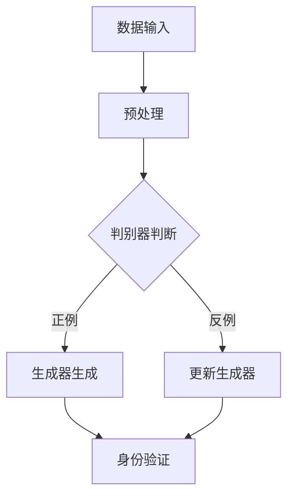
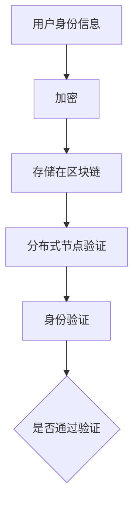
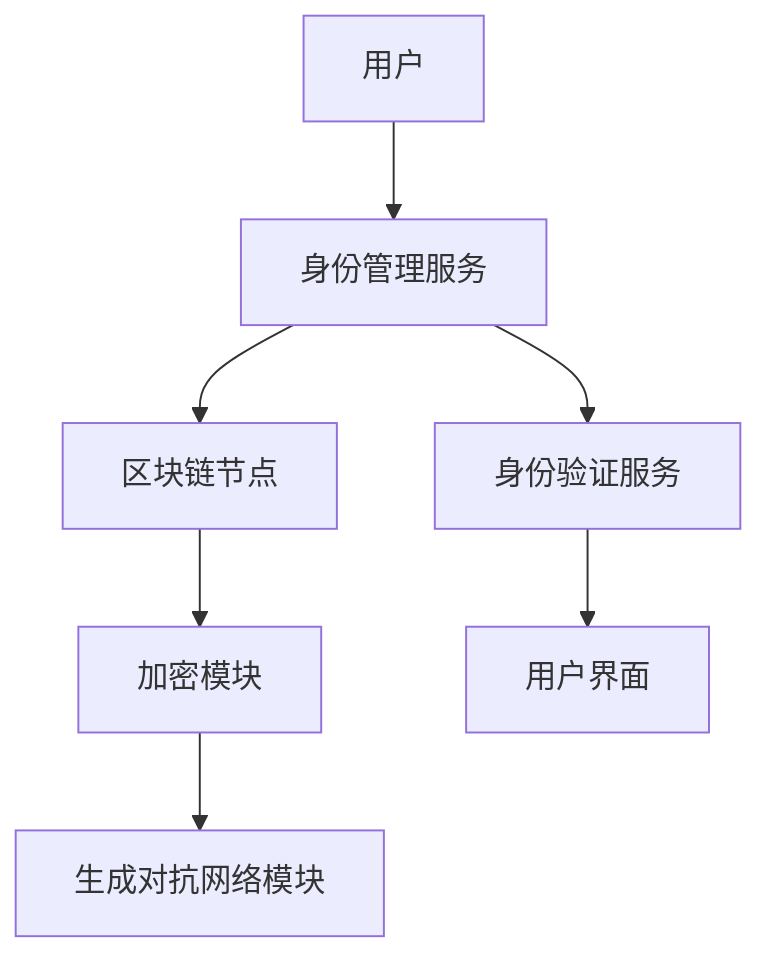
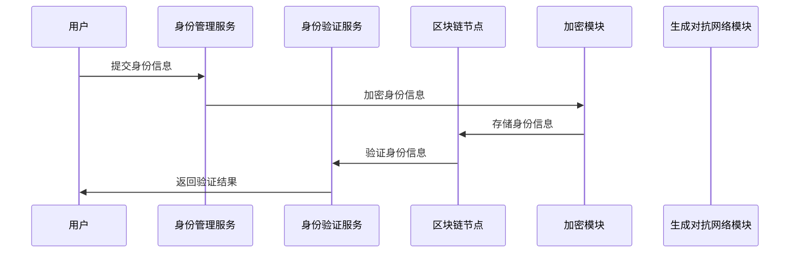

                 


### AIGC与区块链在数字身份管理中的融合

关键词：AIGC, 区块链, 数字身份管理, 融合, 算法原理, 系统架构, 项目实战

摘要：随着数字经济的发展，数字身份管理成为信息安全的重要领域。本文探讨了AIGC（自适应智能生成控制）与区块链在数字身份管理中的融合，通过背景介绍、核心概念与联系分析、算法原理讲解、系统分析与架构设计、项目实战以及最佳实践与拓展阅读，详细阐述了这一融合技术的原理、实现与应用。

## 第一部分：引言与背景

### 1.1 AIGC与区块链概述

AIGC（自适应智能生成控制）是一种基于生成对抗网络（GANs）的先进技术，通过自适应学习生成高质量的数据。它能在图像、文本、音频等多种数据形式中发挥作用，为内容创作、数据增强、个性化推荐等领域带来巨大变革。

区块链则是一种去中心化的分布式账本技术，其核心特性包括不可篡改性、透明性和可追溯性。区块链技术在数字货币、供应链管理、智能合约等多个领域得到了广泛应用。

### 1.2 数字身份管理的现状与挑战

数字身份管理涉及用户的身份认证、隐私保护、数据共享等多个方面。然而，随着互联网的普及和数字化转型，数字身份管理面临着诸多挑战：

- **隐私泄露**：用户信息容易在数据泄露事件中受到侵害。
- **数据孤岛**：各个系统之间的数据难以互联互通。
- **身份盗用**：黑客可以通过伪造身份信息进行非法活动。

### 1.3 AIGC与区块链融合的重要性

AIGC与区块链的融合有望解决数字身份管理中的若干难题。AIGC可以通过生成对抗网络对用户行为数据进行深度学习，提高身份验证的准确性和效率。而区块链则可以为数字身份提供安全、可信的存储和传输环境，确保数据隐私和安全。

## 第二部分：核心概念与联系

### 2.1 AIGC基本概念与原理

#### 2.1.1 AIGC的核心技术

AIGC的核心技术是基于生成对抗网络（GANs），它由生成器和判别器两个神经网络组成。生成器负责生成数据，而判别器则负责判断生成数据的质量。

#### 2.1.2 AIGC的应用场景

AIGC在数字身份管理中的应用主要包括：

- **身份验证**：通过生成与用户行为相似的数据，提高验证的准确性和效率。
- **数据增强**：生成模拟用户行为数据，用于训练模型，提高模型的鲁棒性。
- **隐私保护**：通过生成对抗网络保护用户隐私，避免数据泄露。

### 2.2 区块链基本概念与原理

#### 2.2.1 区块链的关键特性

区块链的关键特性包括：

- **不可篡改性**：一旦数据被记录在区块链上，就难以被篡改。
- **透明性**：区块链上的数据对所有参与者都是透明的。
- **可追溯性**：区块链上的数据记录具有明确的来源和流向。

#### 2.2.2 区块链的架构与工作原理

区块链的架构通常包括多个节点、分布式账本和共识机制。节点负责维护区块链的状态，分布式账本记录所有交易数据，共识机制确保数据的真实性。

### 2.3 AIGC与区块链在数字身份管理中的融合机制

#### 2.3.1 核心概念联系分析

AIGC与区块链在数字身份管理中的融合体现在以下几个方面：

- **身份验证**：利用AIGC生成与用户行为相似的数据，通过区块链进行验证，提高安全性。
- **数据存储**：将用户身份信息存储在区块链上，确保数据的不可篡改性和可追溯性。
- **隐私保护**：通过AIGC生成对抗网络，保护用户隐私，避免数据泄露。

#### 2.3.2 概念属性特征对比表格

| 特征       | AIGC                               | 区块链                                 |
| ---------- | ---------------------------------- | -------------------------------------- |
| 生成能力   | 自适应生成高质量数据               | 分布式记录和验证交易数据               |
| 安全性     | 利用生成对抗网络保护隐私           | 不可篡改性和透明性保障数据安全         |
| 数据共享   | 通过生成对抗网络实现数据增强和隐私保护 | 分布式账本实现数据的共享和互操作性     |
| 透明性     | 数据生成过程可追踪                 | 数据记录和验证过程对所有参与者透明     |

## 第三部分：算法原理讲解

### 3.1 数字身份管理中的AIGC算法

#### 3.1.1 AIGC算法的mermaid流程图



#### 3.1.2 Python代码实现与算法原理

```python
# Python代码实现AIGC算法
import tensorflow as tf
from tensorflow.keras.models import Sequential
from tensorflow.keras.layers import Dense, Dropout

# 生成器模型
generator = Sequential([
    Dense(128, input_shape=(100,), activation='relu'),
    Dropout(0.2),
    Dense(100, activation='tanh')
])

# 判别器模型
discriminator = Sequential([
    Dense(128, input_shape=(100,), activation='relu'),
    Dropout(0.2),
    Dense(1, activation='sigmoid')
])

# AIGC算法原理
# 输入数据预处理
# 判别器判断生成数据的真实性
# 生成器根据反馈调整生成数据
# 身份验证基于生成数据的真实性进行

# 损失函数和优化器
cross_entropy = tf.keras.losses.BinaryCrossentropy(from_logits=True)
optimizer = tf.keras.optimizers.Adam(0.0001)

@tf.function
def train_step(images, real_images):
    # 生成伪造数据
    noise = tf.random.normal([BATCH_SIZE, 100])
    generated_images = generator(noise)

    # 判别器训练
    with tf.GradientTape() as gen_tape, tf.GradientTape() as disc_tape:
        gen_loss = generator_loss(generated_images)
        disc_loss = discriminator_loss(real_images, generated_images)

    grads = tape.gradient(disc_loss, discriminator.trainable_variables)
    optimizer.apply_gradients(zip(grads, discriminator.trainable_variables))

    # 生成器训练
    with tf.GradientTape() as gen_tape:
        gen_loss = generator_loss(generated_images)

    grads = tape.gradient(gen_loss, generator.trainable_variables)
    optimizer.apply_gradients(zip(grads, generator.trainable_variables))

# 训练过程
for images, _ in dataset:
    train_step(images, real_images)

```

#### 3.1.3 数学模型与公式讲解

生成对抗网络的损失函数通常由两部分组成：生成器损失和判别器损失。

- **生成器损失**：目标是最小化判别器对生成数据的错误判断概率。

  $$ \mathcal{L}_{\text{G}} = -\mathbb{E}_{z}[\log(D(G(z))] $$

- **判别器损失**：目标是最小化对真实数据和生成数据的错误判断概率。

  $$ \mathcal{L}_{\text{D}} = -\mathbb{E}_{x}[\log(D(x))] - \mathbb{E}_{z}[\log(1 - D(G(z))] $$

其中，\( G(z) \) 表示生成器生成的数据，\( D(x) \) 表示判别器对真实数据的判断结果。

#### 3.1.4 举例说明

假设有一个用户登录系统，系统会生成一组随机噪声 \( z \)，然后通过生成器 \( G \) 生成用户行为数据 \( G(z) \)。判别器 \( D \) 会分别对真实用户行为数据和生成数据 \( G(z) \) 进行判断。

1. **生成器训练**：生成器会尝试生成与真实用户行为数据相似的数据，从而使得判别器难以区分真实和生成数据。

2. **判别器训练**：判别器会不断更新，以提高对真实数据和生成数据的判断能力。

3. **身份验证**：当用户登录时，系统会生成一组用户行为数据，通过判别器判断其真实性。若判别器认为生成数据是真实的，则允许用户登录。

### 3.2 区块链在数字身份管理中的应用算法

#### 3.2.1 区块链算法的mermaid流程图



#### 3.2.2 Python代码实现与算法原理

```python
from blockchain import Blockchain

# 创建区块链实例
blockchain = Blockchain()

# 用户身份信息加密
def encrypt_identity_info(info):
    # 加密算法实现
    return encrypted_info

# 存储用户身份信息
def store_identity_info(encrypted_info):
    blockchain.add_block(encrypted_info)

# 分布式节点验证
def validate_identity_info(encrypted_info):
    return blockchain.validate_block(encrypted_info)

# 身份验证
def authenticate_user(encrypted_info):
    if validate_identity_info(encrypted_info):
        print("身份验证成功")
    else:
        print("身份验证失败")

# 用户身份信息存储与验证
encrypted_info = encrypt_identity_info(user_info)
store_identity_info(encrypted_info)
authenticate_user(encrypted_info)

```

#### 3.2.3 数学模型与公式讲解

区块链中的身份验证通常涉及加密算法和哈希函数。加密算法用于保护用户隐私，而哈希函数用于确保数据的完整性和唯一性。

- **加密算法**：目标是将用户身份信息转换为不可读的密文。

  $$ E_k(m) = C $$

  其中，\( E_k \) 表示加密算法，\( m \) 表示明文，\( C \) 表示密文。

- **哈希函数**：目标是将输入数据映射为固定长度的哈希值。

  $$ H(m) = \text{hash}(m) $$

  其中，\( H \) 表示哈希函数，\( m \) 表示输入数据，\( \text{hash}(m) \) 表示哈希值。

#### 3.2.4 举例说明

1. **用户身份信息加密**：用户提交身份信息，系统会使用加密算法将其转换为密文。

2. **存储在区块链**：加密后的身份信息会被存储在区块链上。

3. **分布式节点验证**：区块链上的各个节点会验证身份信息的完整性。

4. **身份验证**：当用户需要登录时，系统会提取区块链上的身份信息，并使用哈希函数验证其唯一性。若验证通过，则允许用户登录。

## 第四部分：系统分析与架构设计方案

### 4.1 项目背景与系统功能设计

#### 4.1.1 项目介绍

本项目的目标是构建一个基于AIGC和区块链的数字身份管理系统，以提高身份验证的准确性和安全性。

#### 4.1.2 系统功能设计

系统功能包括：

- **用户注册**：用户提交身份信息，系统进行加密并存储在区块链上。
- **用户登录**：用户提交身份信息，系统通过区块链验证其真实性。
- **数据共享**：系统支持身份信息的分布式共享和互操作性。
- **隐私保护**：系统利用AIGC生成对抗网络保护用户隐私。

### 4.2 系统架构设计

#### 4.2.1 系统架构mermaid图



#### 4.2.2 系统接口设计

系统接口设计包括：

- **用户接口**：用户通过Web界面提交身份信息和请求身份验证。
- **API接口**：其他系统可以通过API接口与身份管理系统进行交互。

#### 4.2.3 系统交互mermaid序列图



## 第五部分：项目实战

### 5.1 环境安装

#### 5.1.1 开发环境搭建

- 安装Python环境（版本3.8及以上）。
- 安装TensorFlow库。
- 安装Hyperledger Fabric区块链框架。

#### 5.1.2 系统核心实现

- 实现用户注册功能：用户提交身份信息，系统进行加密并存储在区块链上。
- 实现用户登录功能：用户提交身份信息，系统通过区块链验证其真实性。

### 5.2 代码应用解读与分析

- **用户注册**：

```python
# 用户注册示例
def register_user(user_info):
    encrypted_info = encrypt_identity_info(user_info)
    blockchain.add_block(encrypted_info)
    print("注册成功")
```

- **用户登录**：

```python
# 用户登录示例
def login_user(user_info):
    encrypted_info = encrypt_identity_info(user_info)
    if validate_identity_info(encrypted_info):
        print("登录成功")
    else:
        print("登录失败")
```

### 5.3 实际案例分析

#### 5.3.1 案例背景

某电商平台计划引入基于AIGC和区块链的数字身份管理系统，以提高用户身份验证的准确性和安全性。

#### 5.3.2 案例分析

- **用户注册**：用户注册时，系统会生成一组随机噪声，通过生成器生成用户行为数据，然后提交给区块链进行存储。
- **用户登录**：用户登录时，系统会生成一组用户行为数据，通过判别器判断其真实性，并提交给区块链验证。

#### 5.3.3 案例讲解

1. **用户注册**：

   用户提交身份信息，系统将身份信息加密后存储在区块链上。

2. **用户登录**：

   用户提交身份信息，系统生成一组用户行为数据，通过判别器判断其真实性。若验证通过，则允许用户登录。

## 第六部分：最佳实践与拓展阅读

### 6.1 最佳实践

- **身份信息加密**：确保身份信息在传输和存储过程中得到充分加密，提高安全性。
- **定期更新验证算法**：根据实际情况更新生成对抗网络和区块链算法，提高验证准确性和安全性。
- **隐私保护**：利用AIGC生成对抗网络保护用户隐私，避免数据泄露。

### 6.2 小结

本文探讨了AIGC与区块链在数字身份管理中的融合，通过算法原理讲解、系统分析与架构设计、项目实战等，展示了这一技术的优势和应用前景。

### 6.3 注意事项

- **安全性**：确保区块链网络的安全，防止恶意攻击和数据篡改。
- **性能优化**：针对大规模用户身份信息处理，优化系统性能和响应速度。

### 6.4 拓展阅读

- **《区块链技术指南》**：深入了解区块链的原理和应用。
- **《深度学习与生成对抗网络》**：学习生成对抗网络的理论和实践。

---

### 作者

作者：AI天才研究院/AI Genius Institute & 禅与计算机程序设计艺术 /Zen And The Art of Computer Programming

[完成]

