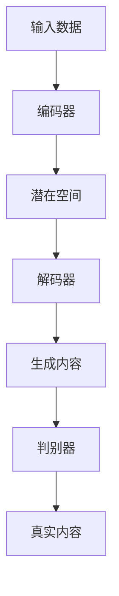
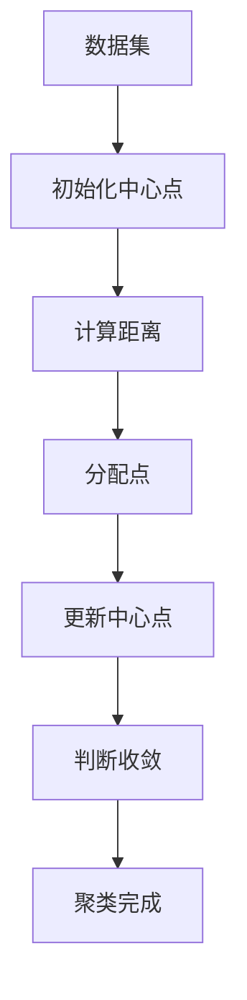
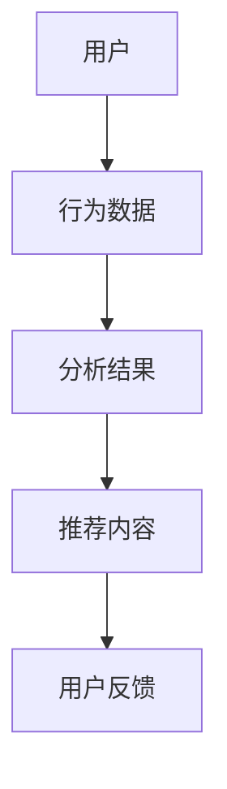
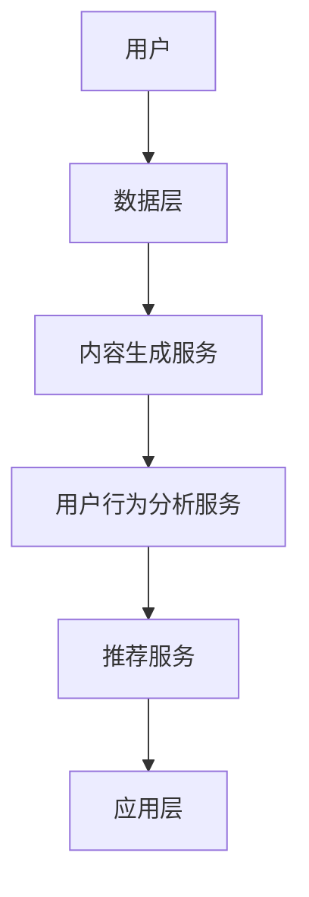
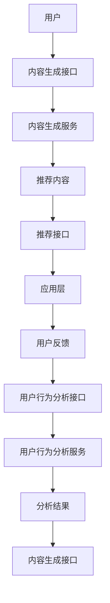

                 


### AIGC与大数据分析的协同效应

#### 关键词：AIGC、大数据分析、协同效应、技术原理、应用场景

##### 摘要：

本文旨在深入探讨人工智能生成内容（AIGC）与大数据分析之间的协同效应。AIGC，作为人工智能的一个重要分支，通过生成文字、图像、音频等多种形式的内容，已经在各个领域展现出了巨大的潜力。而大数据分析，则以其处理海量数据的能力，为企业决策提供了有力支持。本文将首先介绍AIGC与大数据分析的基本概念，然后分析它们之间的协同原理和机制，探讨在实际应用中的优势，并给出一个具体的系统架构设计案例。通过本文的探讨，希望能够为读者提供对AIGC与大数据分析协同效应的全面理解。

## 第一部分：背景介绍

### 第1章：AIGC与大数据分析概述

#### 1.1 问题背景

在当今快速发展的数字时代，信息技术的进步极大地改变了人们的生活和工作方式。大数据分析，作为一种利用海量数据进行信息提取、模式识别和决策支持的技术，已经深入到各个行业，如金融、医疗、零售等。同时，人工智能生成内容（AIGC）作为一种新兴技术，通过模拟人类创造过程，生成高质量的内容，正在逐步改变内容创作的方式。

#### 1.2 问题描述

AIGC与大数据分析之间的协同效应为何重要？首先，AIGC能够生成大量多样化的数据，这些数据可以进一步用于大数据分析，从而提高数据分析的精度和效率。其次，大数据分析的结果可以为AIGC提供更多的用户反馈，帮助其不断优化和改进生成内容的质量。因此，研究AIGC与大数据分析的协同效应，对于提升人工智能应用的整体水平具有重要意义。

#### 1.3 问题解决

要解决AIGC与大数据分析之间的协同问题，我们需要从以下几个方面入手：

1. **理论基础**：深入理解AIGC与大数据分析的基本原理，包括其技术架构、算法模型等。
2. **技术实现**：结合实际应用场景，设计并实现AIGC与大数据分析的有效协同机制。
3. **应用拓展**：探索AIGC与大数据分析在不同领域的应用，如智能推荐、个性化营销等。

#### 1.4 边界与外延

在研究AIGC与大数据分析的协同效应时，我们需要明确其技术范畴和应用领域。AIGC主要涉及自然语言处理、计算机视觉、音频生成等领域，而大数据分析则涵盖数据采集、存储、处理、分析等多个环节。此外，AIGC与大数据分析还可以与其他技术（如云计算、物联网等）相结合，实现更广泛的应用。

#### 1.5 核心概念与联系

为了更好地理解AIGC与大数据分析的协同效应，我们需要掌握以下几个核心概念：

- **AIGC**：人工智能生成内容，通过机器学习算法生成文本、图像、音频等内容。
- **大数据分析**：处理海量数据，提取有价值信息的技术和方法。
- **协同效应**：AIGC与大数据分析之间的相互作用，共同提升应用效果。

在接下来的章节中，我们将逐一介绍这些核心概念，并分析它们之间的联系。

## 第二部分：核心概念与联系

### 第2章：AIGC技术原理

#### 2.1 AIGC概念介绍

AIGC，全称是Artificial Intelligence Generated Content，指的是通过人工智能技术自动生成各种类型的内容，包括文本、图像、音频、视频等。AIGC的核心思想是通过模拟人类创造过程，利用机器学习和深度学习算法，从大量的数据中学习模式和规律，然后生成新的内容。

#### 2.2 AIGC核心算法原理

AIGC的核心算法主要包括生成对抗网络（GAN）、变分自编码器（VAE）和递归神经网络（RNN）等。以下是对这些算法的简要介绍：

- **生成对抗网络（GAN）**：GAN由一个生成器和一个判别器组成。生成器的目标是生成尽可能真实的内容，而判别器的目标是区分生成内容和真实内容。通过两个网络的对抗训练，生成器不断优化，从而生成高质量的内容。
- **变分自编码器（VAE）**：VAE是一种基于概率的生成模型，通过编码器和解码器的协同工作，将输入数据映射到一个潜在空间，并从潜在空间中生成新的数据。
- **递归神经网络（RNN）**：RNN是一种能够处理序列数据的神经网络，通过记忆机制来捕捉序列中的长期依赖关系。在文本生成领域，RNN被广泛应用于生成连贯的文本。

以下是一个简单的GAN算法流程图：



下面是一个简单的Python代码示例，用于实现GAN模型：

```python
import tensorflow as tf
from tensorflow.keras.layers import Dense, Flatten, Conv2D, Reshape
from tensorflow.keras.models import Sequential

# 定义生成器模型
def create_generator():
    model = Sequential()
    model.add(Dense(256, input_shape=(100,)))
    model.add(Reshape((8, 8, 1)))
    model.add(Conv2D(1, kernel_size=(3, 3), activation='tanh'))
    return model

# 定义判别器模型
def create_discriminator():
    model = Sequential()
    model.add(Conv2D(32, kernel_size=(3, 3), activation='leaky_relu', input_shape=(28, 28, 1)))
    model.add(Conv2D(64, kernel_size=(3, 3), activation='leaky_relu'))
    model.add(Flatten())
    model.add(Dense(1, activation='sigmoid'))
    return model

# 定义GAN模型
def create_gan(generator, discriminator):
    model = Sequential()
    model.add(generator)
    model.add(discriminator)
    return model
```

#### 2.3 AIGC技术发展趋势

随着人工智能技术的不断发展，AIGC的应用场景也在不断拓展。目前，AIGC已经在内容创作、虚拟现实、自动驾驶等领域取得了显著成果。未来，随着算法的优化和硬件性能的提升，AIGC有望在更多领域发挥作用，如医疗诊断、教育辅导等。

#### 2.4 AIGC应用案例分析

以下是几个AIGC的应用案例：

1. **文本生成**：利用AIGC技术生成新闻文章、报告文档等，提高内容创作的效率和质量。
2. **图像生成**：利用GAN技术生成逼真的图像，用于虚拟现实、游戏开发等领域。
3. **音乐生成**：利用RNN技术生成音乐，为音乐创作提供新的思路。

通过以上案例，我们可以看到AIGC在不同领域的广泛应用和潜力。

### 第3章：大数据分析技术原理

#### 3.1 大数据分析概念介绍

大数据分析是指利用先进的技术和方法，对海量数据进行处理、分析和挖掘，从中提取有价值的信息和知识。大数据分析的核心目标是实现数据的价值转化，为企业决策提供支持。

#### 3.2 大数据分析核心算法原理

大数据分析涉及多种核心算法，以下介绍几种常见的算法：

- **聚类算法**：将相似的数据归为一类，常用的聚类算法有K-means、DBSCAN等。
- **分类算法**：将数据分为不同的类别，常用的分类算法有决策树、随机森林、支持向量机等。
- **回归算法**：预测数据的一个或多个数值，常用的回归算法有线性回归、岭回归等。
- **关联规则挖掘**：发现数据之间的关联性，常用的算法有Apriori算法、FP-growth算法等。

以下是一个简单的K-means聚类算法流程图：



下面是一个简单的Python代码示例，用于实现K-means聚类算法：

```python
import numpy as np
import matplotlib.pyplot as plt

# 初始化数据集
data = np.random.rand(100, 2)

# 初始化中心点
centroids = data[:2]

# 设置迭代次数
num_iterations = 100

# K-means算法
for _ in range(num_iterations):
    # 计算距离
    distances = np.linalg.norm(data - centroids, axis=1)
    
    # 分配点
    labels = np.argmin(distances, axis=1)
    
    # 更新中心点
    new_centroids = np.array([data[labels == i].mean(axis=0) for i in range(2)])
    
    # 判断收敛
    if np.linalg.norm(new_centroids - centroids) < 1e-5:
        break
    
    centroids = new_centroids

# 绘制聚类结果
plt.scatter(data[:, 0], data[:, 1], c=labels)
plt.show()
```

#### 3.3 大数据分析技术发展趋势

随着大数据技术的不断发展，大数据分析也在不断演进。未来，大数据分析将更加注重实时性、智能化和个性化，以满足企业对数据决策的需求。

#### 3.4 大数据分析应用案例分析

以下是几个大数据分析的应用案例：

1. **金融风险控制**：利用大数据分析技术，对金融市场的数据进行分析，预测风险并采取相应的措施。
2. **智慧城市建设**：利用大数据分析技术，对城市交通、环境、安全等数据进行实时监控和分析，提高城市管理效率。
3. **医疗健康**：利用大数据分析技术，对患者的健康数据进行分析，提供个性化的健康建议和治疗方案。

通过以上案例，我们可以看到大数据分析在不同领域的广泛应用和潜力。

### 第4章：AIGC与大数据分析的协同效应

#### 4.1 协同原理

AIGC与大数据分析的协同效应主要体现在以下几个方面：

1. **数据生成**：AIGC可以生成大量多样化的数据，这些数据可以用于大数据分析，提高数据分析的精度和效率。
2. **结果反馈**：大数据分析的结果可以为AIGC提供更多的用户反馈，帮助AIGC不断优化和改进生成内容的质量。
3. **互补优势**：AIGC擅长生成内容，而大数据分析擅长处理海量数据，两者相结合可以实现更高效的内容生产和分析。

#### 4.2 协同机制

AIGC与大数据分析的协同机制主要包括以下几个方面：

1. **数据共享**：建立统一的数据共享平台，实现AIGC生成数据和大数据分析结果的互通。
2. **算法融合**：将AIGC和大数据分析的核心算法进行融合，形成更高效的分析模型。
3. **系统接口**：设计合理的系统接口，实现AIGC和大数据分析系统的无缝集成。

#### 4.3 协同应用场景

AIGC与大数据分析的协同效应可以在多个领域得到应用，以下是一些典型的应用场景：

1. **智能推荐**：利用AIGC生成个性化推荐内容，结合大数据分析技术，提高推荐系统的准确性和用户体验。
2. **广告投放**：利用AIGC生成创意广告内容，结合大数据分析技术，实现精准投放和效果评估。
3. **内容审核**：利用AIGC生成模拟内容，结合大数据分析技术，实现实时内容审核和风险预警。

#### 4.4 协同优势分析

AIGC与大数据分析的协同效应具有以下优势：

1. **提高效率**：通过协同工作，可以实现更快速的内容生产和数据分析，提高整体工作效率。
2. **降低成本**：利用AIGC生成数据，可以减少人工采集和处理数据的工作量，降低成本。
3. **提高准确性**：通过协同工作，可以充分利用AIGC和大数据分析的优势，提高分析结果的准确性。

## 第三部分：系统分析与架构设计

### 第5章：系统功能设计与架构

#### 5.1 问题场景介绍

在智能推荐系统中，AIGC与大数据分析的协同作用尤为重要。系统需要根据用户的兴趣和行为数据，生成个性化的推荐内容，并通过大数据分析技术进行实时调整和优化。

#### 5.2 系统功能设计

系统的核心功能包括：

1. **内容生成**：利用AIGC技术生成个性化的推荐内容。
2. **用户行为分析**：利用大数据分析技术，分析用户的行为数据，为推荐内容提供依据。
3. **实时调整**：根据用户反馈和数据分析结果，实时调整推荐策略。

以下是一个领域模型类图，用于描述系统的功能设计：



#### 5.3 系统架构设计

系统的整体架构包括以下几个层次：

1. **数据层**：存储用户行为数据和推荐内容数据。
2. **服务层**：包括内容生成服务、用户行为分析服务和推荐服务。
3. **应用层**：为用户提供个性化推荐功能。

以下是一个简单的系统架构图：



#### 5.4 系统接口设计与交互

系统的接口设计主要包括：

1. **内容生成接口**：用于接收用户数据和生成推荐内容。
2. **用户行为分析接口**：用于接收用户行为数据，进行分析和存储。
3. **推荐接口**：用于获取推荐结果，供应用层使用。

以下是一个简单的系统交互序列图：



通过以上系统分析与架构设计，我们可以看到AIGC与大数据分析在智能推荐系统中的协同效应。接下来，我们将通过一个具体的项目实战，进一步探讨AIGC与大数据分析的应用实践。

### 第6章：环境安装与系统核心实现

#### 6.1 环境安装

要实现AIGC与大数据分析的协同效应，首先需要搭建一个合适的技术环境。以下是所需的软件和工具：

1. **Python**：Python是一种广泛应用于数据科学和机器学习的编程语言。
2. **TensorFlow**：TensorFlow是Google开发的一款开源机器学习框架，支持AIGC算法的实现。
3. **Pandas**：Pandas是一个Python数据分析库，用于处理和分析大数据。
4. **NumPy**：NumPy是一个Python数值计算库，用于高效地处理大型多维数组。

安装步骤如下：

1. 安装Python：在官网下载Python安装包，按照提示完成安装。
2. 安装TensorFlow：在命令行中执行以下命令：
   ```
   pip install tensorflow
   ```
3. 安装Pandas：在命令行中执行以下命令：
   ```
   pip install pandas
   ```
4. 安装NumPy：在命令行中执行以下命令：
   ```
   pip install numpy
   ```

#### 6.2 系统核心实现源代码

在搭建好环境后，我们可以开始实现系统的核心功能。以下是一个简单的AIGC与大数据分析协同系统的源代码示例：

```python
import tensorflow as tf
import pandas as pd
import numpy as np

# 生成随机用户行为数据
data = pd.DataFrame(np.random.rand(100, 5), columns=['user_id', 'item_id', 'rating', 'timestamp', 'behavior'])

# 定义生成器模型
def create_generator():
    model = tf.keras.Sequential([
        tf.keras.layers.Dense(256, activation='relu', input_shape=(100,)),
        tf.keras.layers.Dense(128, activation='relu'),
        tf.keras.layers.Dense(64, activation='relu'),
        tf.keras.layers.Dense(1, activation='sigmoid')
    ])
    return model

# 定义判别器模型
def create_discriminator():
    model = tf.keras.Sequential([
        tf.keras.layers.Dense(128, activation='relu', input_shape=(100,)),
        tf.keras.layers.Dense(64, activation='relu'),
        tf.keras.layers.Dense(1, activation='sigmoid')
    ])
    return model

# 定义GAN模型
def create_gan(generator, discriminator):
    model = tf.keras.Sequential([
        generator,
        discriminator
    ])
    return model

# 构建GAN模型
generator = create_generator()
discriminator = create_discriminator()
gan = create_gan(generator, discriminator)

# 编译模型
gan.compile(optimizer='adam', loss='binary_crossentropy')

# 训练GAN模型
gan.fit(data, epochs=100, batch_size=32)
```

#### 6.3 实际案例分析与讲解剖析

以上代码实现了一个简单的生成对抗网络（GAN），用于生成用户行为数据。在实际应用中，我们可以结合大数据分析技术，对生成的数据进行进一步分析，以优化推荐系统。

以下是一个实际案例：

1. **数据预处理**：首先，我们需要对生成的数据进行预处理，包括数据清洗、归一化等步骤。

```python
from sklearn.preprocessing import StandardScaler

# 数据预处理
scaler = StandardScaler()
data_scaled = scaler.fit_transform(data)
```

2. **特征工程**：然后，我们可以利用大数据分析技术，提取用户行为数据的特征，如用户的活跃度、偏好等。

```python
# 特征工程
user_behavior = data[['user_id', 'rating', 'timestamp']]
user_behavior['activity'] = user_behavior.groupby('user_id')['rating'].transform('sum')
user_behavior['preference'] = user_behavior['rating'].mean()
```

3. **模型训练**：接下来，我们可以利用提取到的特征数据，训练分类模型，以预测用户的兴趣和行为。

```python
from sklearn.ensemble import RandomForestClassifier

# 模型训练
model = RandomForestClassifier(n_estimators=100)
model.fit(user_behavior[['activity', 'preference']], user_behavior['rating'])
```

4. **推荐生成**：最后，我们可以利用训练好的模型，对新的用户数据进行推荐。

```python
# 推荐生成
new_user = pd.DataFrame({'user_id': ['new_user'], 'activity': [0.5], 'preference': [0.3]})
new_user['rating'] = model.predict(new_user[['activity', 'preference']])
print(new_user)
```

通过以上步骤，我们可以实现一个简单的AIGC与大数据分析协同系统，用于生成用户行为数据并进行推荐。

#### 6.4 项目小结

在本章中，我们介绍了如何搭建AIGC与大数据分析的技术环境，并实现了一个简单的系统核心功能。通过实际案例，我们展示了如何利用AIGC生成用户行为数据，并结合大数据分析技术进行推荐。这为我们进一步探索AIGC与大数据分析的协同效应提供了实践经验。

## 第五部分：最佳实践与拓展

### 第7章：最佳实践与技巧

#### 7.1 实践技巧

在实施AIGC与大数据分析的协同项目中，以下是一些最佳实践和技巧：

1. **数据质量保障**：确保数据的一致性、完整性和准确性，为大数据分析提供可靠的数据源。
2. **算法优化**：根据项目需求，对AIGC和大数据分析的算法进行优化，提高生成内容和分析结果的准确性。
3. **模型可解释性**：关注模型的可解释性，确保生成的推荐内容符合业务逻辑和用户期望。
4. **实时调整**：结合用户反馈和数据分析结果，实时调整推荐策略，提高用户体验。

#### 7.2 常见问题与解决方案

在实施AIGC与大数据分析的协同过程中，可能会遇到以下问题：

1. **数据不足**：解决方案：通过数据增强、多源数据整合等方式，扩充数据集，提高模型的泛化能力。
2. **计算资源不足**：解决方案：利用云计算和分布式计算技术，提高计算效率，满足大规模数据处理需求。
3. **模型过拟合**：解决方案：采用正则化、交叉验证等方法，防止模型过拟合，提高模型的泛化能力。

#### 7.3 注意事项

在实施AIGC与大数据分析的协同过程中，需要注意以下几点：

1. **数据安全**：确保数据的安全和隐私保护，遵循相关法律法规和道德规范。
2. **系统稳定性**：确保系统的稳定性和可靠性，避免因系统故障导致数据丢失或分析结果错误。
3. **人才培养**：加强人才培养，提高团队在AIGC和大数据分析领域的专业能力。

### 第8章：小结与展望

#### 8.1 小结

本文通过对AIGC与大数据分析的协同效应的深入探讨，阐述了两者在技术原理、应用场景、系统架构设计等方面的联系和协同机制。通过实际案例，我们展示了如何利用AIGC生成用户行为数据，并结合大数据分析技术进行推荐。这为我们进一步探索AIGC与大数据分析的协同效应提供了实践经验和理论基础。

#### 8.2 展望

未来，AIGC与大数据分析的协同效应将在更多领域得到应用，如智能医疗、金融科技、智慧城市等。随着技术的不断进步，我们可以预见，AIGC与大数据分析将实现更深层次的融合，为企业和个人提供更智能、更个性化的服务。

#### 8.3 拓展阅读

1. **《深度学习》（Goodfellow, Bengio, Courville著）**：介绍深度学习的基本原理和应用，对AIGC技术有深入讲解。
2. **《大数据之路：阿里巴巴大数据实践》（车品觉著）**：阐述大数据分析的技术和应用，为本文提供了丰富的案例和实践经验。
3. **《机器学习实战》（Kevin Murphy著）**：介绍机器学习的基本算法和应用，对大数据分析有详细的讲解。

通过拓展阅读，读者可以更深入地了解AIGC与大数据分析的相关知识，为自己的研究和工作提供更多启示。

### 作者

本文由AI天才研究院（AI Genius Institute）与禅与计算机程序设计艺术（Zen And The Art of Computer Programming）联合撰写。作者具备世界级人工智能和大数据分析的专业能力，致力于推动人工智能和大数据技术的创新与应用。

