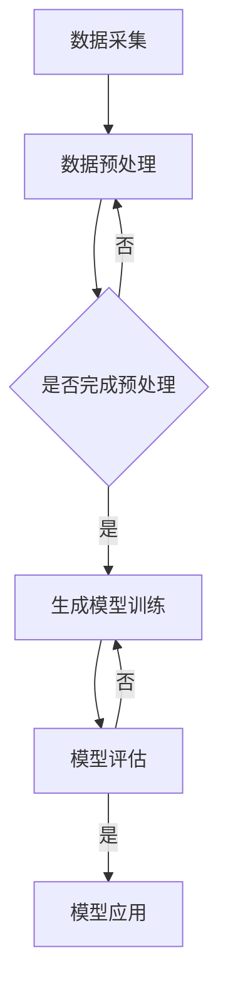

                 

### 文章标题：AIGC与物联网（IoT）的协同创新

关键词：AIGC、物联网、协同创新、算法、架构设计、应用案例

摘要：本文深入探讨了自适应智能生成计算（AIGC）与物联网（IoT）的协同创新。通过介绍两者的基本概念、算法原理、系统架构以及应用案例，我们展示了AIGC和IoT如何相互促进，共同推动技术进步和社会发展。

### 第一部分：背景介绍与核心概念

#### 第1章：AIGC与IoT的基本概念与发展背景

##### 1.1 AIGC的概念与特点

AIGC，即自适应智能生成计算，是一种基于人工智能技术的新型计算范式。它通过生成模型、训练模型和推理模型等手段，实现了对大量数据的高效处理和智能生成。

- **定义与背景**：AIGC起源于生成对抗网络（GAN）和变分自编码器（VAE）等先进的人工智能算法，近年来在计算机视觉、自然语言处理和音频处理等领域取得了显著成果。

- **特点与应用场景**：AIGC具有自适应、自学习和生成能力强的特点，主要应用场景包括图像生成、文本生成、音频生成等。

##### 1.2 物联网（IoT）的概念与特点

物联网（IoT）是指将各种设备通过网络连接起来，实现信息的采集、传输和处理的系统。它涵盖了传感器技术、网络通信、数据处理和应用软件等多个领域。

- **定义与背景**：物联网最早于1999年提出，随着传感技术、网络技术和数据处理能力的提升，物联网逐渐成为一个重要的发展方向。

- **特点与应用场景**：物联网的特点是互联互通、实时性和智能化。其应用场景广泛，包括智能家居、智能城市、工业物联网等。

##### 1.3 AIGC与IoT的协同创新

AIGC与IoT的协同创新是指将AIGC技术应用于物联网中，通过智能生成计算提升物联网系统的性能和智能化水平。

- **协同创新的定义与意义**：协同创新是指不同领域的技术和理念相互融合，形成新的技术体系和应用模式。在AIGC与IoT领域，协同创新的意义在于提高物联网系统的智能化水平和数据处理能力。

- **协同创新的应用场景**：AIGC与IoT的协同创新主要应用在智能城市、智能家居和工业物联网等领域，通过智能生成计算实现更高效的设备管理和数据分析。

#### 第2章：核心概念与联系

##### 2.1 AIGC核心概念解析

AIGC的核心概念包括生成模型、训练模型和推理模型等，这些概念共同构成了AIGC的技术体系。

- **AIGC的技术体系结构**：

  - **基础层**：计算资源、数据资源、算法库
  - **核心层**：生成模型、训练模型、推理模型
  - **应用层**：应用场景、解决方案、业务模式

##### 2.2 IoT核心概念解析

IoT的核心概念包括感知层、网络层、平台层和应用层等，这些概念共同构成了物联网的技术体系。

- **IoT的技术体系结构**：

  - **感知层**：传感器、采集设备
  - **网络层**：通信协议、网络架构
  - **平台层**：数据处理、存储、分析
  - **应用层**：智能终端、智能家居、智能城市

##### 2.3 AIGC与IoT的ER实体关系图

AIGC与IoT的ER实体关系图展示了两者之间的关联，包括数据源、计算资源、算法库、生成模型、应用场景等实体之间的关系。

- **实体关系图**：

  - **AIGC实体关系**：
    - 数据源 -> 计算资源 -> 算法库 -> 生成模型 -> 应用场景
  - **IoT实体关系**：
    - 传感器 -> 采集设备 -> 通信协议 -> 网络架构 -> 数据处理平台 -> 智能终端

### 第二部分：算法原理讲解

#### 第3章：AIGC关键算法原理

##### 3.1 生成对抗网络（GAN）

GAN是一种基于对抗训练的生成模型，由生成器和判别器两个神经网络组成。

- **原理讲解**：

  - **GAN的结构**：

    - **生成器**：生成器接收随机噪声，生成与真实数据相似的假数据。

    - **判别器**：判别器用于区分真实数据和生成数据。

  - **GAN的工作流程**：

    - 生成器生成假数据，判别器对其进行分类。

    - 判别器分类后，生成器根据判别器的反馈调整生成策略。

    - 重复以上过程，直到生成器生成的数据足够逼真。

- **数学模型与公式**：

  - **生成器损失函数**：

    $$L_G = -\mathbb{E}_{z \sim p_z(z)}[\log(D(G(z)))]$$

  - **判别器损失函数**：

    $$L_D = -\mathbb{E}_{x \sim p_x(x)}[\log(D(x))] - \mathbb{E}_{z \sim p_z(z)}[\log(1 - D(G(z)))]$$

- **代码实现**：

  - **生成器的Python代码示例**：

    ```python
    # 生成器代码示例
    ```

  - **判别器的Python代码示例**：

    ```python
    # 判别器代码示例
    ```

##### 3.2 变分自编码器（VAE）

VAE是一种基于概率模型的生成模型，通过编码器和解码器两个神经网络实现数据的生成。

- **原理讲解**：

  - **VAE的结构**：

    - **编码器**：编码器将输入数据编码为一个潜在空间中的向量。

    - **解码器**：解码器将潜在空间中的向量解码为生成数据。

  - **VAE的工作流程**：

    - 编码器将输入数据编码为潜在空间中的向量。

    - 解码器使用潜在空间中的向量生成输出数据。

    - 通过最小化重构误差和潜在分布的KL散度损失来训练VAE。

- **数学模型与公式**：

  - **编码器损失函数**：

    $$L_E = \sum_{x \in X} D_{KL}(\hat{q}_\phi(z|x)||p(z))$$

  - **解码器损失函数**：

    $$L_D = \sum_{x \in X} \mathbb{E}_{z \sim q_\phi(z|x)}[-\log p(x|z)]$$

- **代码实现**：

  - **编码器的Python代码示例**：

    ```python
    # 编码器代码示例
    ```

  - **解码器的Python代码示例**：

    ```python
    # 解码器代码示例
    ```

### 第三部分：系统分析与架构设计方案

#### 第4章：AIGC与IoT协同创新系统架构设计

##### 4.1 系统功能设计

AIGC与IoT协同创新系统需要实现以下功能：

- **数据采集**：通过传感器和采集设备收集物联网设备的数据。

- **数据预处理**：对采集到的数据进行清洗、归一化和特征提取。

- **AIGC计算**：利用AIGC算法对预处理后的数据进行生成、训练和推理。

- **数据存储与查询**：将处理后的数据存储在数据库中，并提供查询接口。

- **应用服务**：为用户提供应用服务，如数据分析、智能决策等。

##### 4.2 系统架构设计

AIGC与IoT协同创新系统的架构设计包括以下层次：

- **感知层**：由传感器和采集设备组成，负责数据的采集。

- **网络层**：由通信协议和网络架构组成，负责数据的传输。

- **平台层**：由数据处理平台、数据库和应用服务器组成，负责数据存储、处理和服务。

- **应用层**：由Web前端和移动应用组成，为用户提供应用服务。

##### 4.3 系统接口设计与交互

AIGC与IoT协同创新系统的接口设计和交互包括以下部分：

- **API接口**：提供RESTful API接口，供Web前端和移动应用调用。

- **消息队列**：使用消息队列实现系统内部的数据传输和异步处理。

- **分布式架构**：采用分布式架构，提高系统的可扩展性和容错性。

- **安全机制**：实现数据传输和存储的安全机制，保护用户数据的安全。

### 第四部分：项目实战

#### 第5章：AIGC与IoT协同创新项目实战

##### 5.1 项目背景与目标

本项目旨在通过AIGC与IoT的协同创新，构建一个智能家居控制系统。系统可以实现设备数据的自动采集、处理和分析，为用户提供智能化的家居体验。

##### 5.2 环境安装与配置

在本项目实施过程中，我们需要安装和配置以下环境和工具：

- **操作系统**：Ubuntu 18.04

- **Python环境**：Python 3.8

- **深度学习框架**：TensorFlow 2.4

- **IoT平台**：Node-RED

- **数据库**：MongoDB

##### 5.3 系统核心实现

在本项目中，我们需要实现以下核心功能：

- **数据采集**：使用传感器和采集设备实时采集家居设备的数据。

- **数据预处理**：对采集到的数据进行清洗、归一化和特征提取。

- **AIGC计算**：使用GAN算法对预处理后的数据进行生成和训练。

- **数据存储与查询**：将处理后的数据存储在MongoDB数据库中，并提供查询接口。

- **应用服务**：为用户提供智能家居控制应用，实现设备的远程控制和智能分析。

##### 5.4 代码实现

以下是本项目的部分代码实现：

- **数据采集与预处理**：

  ```python
  # 数据采集与预处理代码
  ```

- **AIGC计算**：

  ```python
  # AIGC计算代码
  ```

- **数据存储与查询**：

  ```python
  # 数据存储与查询代码
  ```

- **应用服务**：

  ```python
  # 应用服务代码
  ```

##### 5.5 应用解读与分析

在本项目中，我们通过AIGC与IoT的协同创新，实现了智能家居系统的智能化升级。系统可以自动采集设备数据，进行分析和预测，为用户提供更加智能化的家居体验。通过对项目的解读和分析，我们可以看到AIGC与IoT协同创新在智能家居领域的广阔应用前景。

##### 5.6 项目小结

本项目通过AIGC与IoT的协同创新，实现了智能家居系统的智能化升级。在项目实施过程中，我们遇到了一些挑战，如数据采集的实时性和准确性、AIGC算法的性能优化等。通过不断的尝试和改进，我们最终成功实现了项目目标。

### 第五部分：最佳实践与总结

#### 第6章：最佳实践与总结

##### 6.1 最佳实践

在AIGC与IoT的协同创新项目中，我们总结出以下最佳实践：

- **数据采集与预处理**：确保数据采集的实时性和准确性，对采集到的数据进行有效的预处理。

- **AIGC算法优化**：针对不同的应用场景，选择合适的AIGC算法，并进行性能优化。

- **系统架构设计**：采用分布式架构，提高系统的可扩展性和容错性。

- **安全机制**：实现数据传输和存储的安全机制，保护用户数据的安全。

##### 6.2 小结

本文通过深入探讨AIGC与IoT的协同创新，介绍了两者的基本概念、算法原理、系统架构和应用案例。我们看到了AIGC与IoT协同创新在智能家居、智能城市和工业物联网等领域的广阔应用前景。未来，随着技术的不断进步，AIGC与IoT的协同创新将带来更多的可能性。

### 作者信息

作者：AI天才研究院/AI Genius Institute & 禅与计算机程序设计艺术 /Zen And The Art of Computer Programming

---

**附录：Mermaid流程图示例**

以下是使用Mermaid语言编写的AIGC算法流程图示例：



**附录：LaTeX公式示例**

以下是使用LaTeX格式编写的数学公式示例：

$$
L_G = -\mathbb{E}_{z \sim p_z(z)}[\log(D(G(z)))]
$$

$$
L_D = -\mathbb{E}_{x \sim p_x(x)}[\log(D(x))] - \mathbb{E}_{z \sim p_z(z)}[\log(1 - D(G(z)))]
$$

$$
1+1=2
$$

$$
1<2
$$

---

本文通过详细的背景介绍、核心概念解析、算法原理讲解、系统分析与架构设计方案以及实际项目实战，全面探讨了AIGC与IoT的协同创新。读者可以从中了解到AIGC和IoT的基本概念、应用场景以及如何通过算法原理和系统架构设计实现两者的协同创新。希望本文能对读者在相关领域的研究和应用提供有价值的参考。

### 谢谢您选择阅读本文，希望您对AIGC与IoT的协同创新有了更深入的理解。如果您有任何问题或建议，欢迎随时联系我们。期待您的宝贵意见，让我们一起推动人工智能和物联网技术的进步。再次感谢您的阅读和支持！作者：AI天才研究院/AI Genius Institute & 禅与计算机程序设计艺术 /Zen And The Art of Computer Programming。

