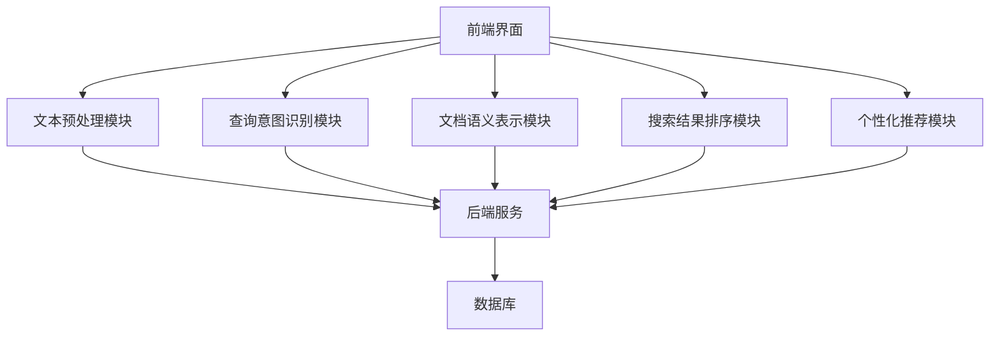

                 

**AIGC与自然语言理解在语义搜索中的融合**

> **关键词：** AIGC, 自然语言理解, 语义搜索, 融合技术, 深度学习, 数学模型

> **摘要：** 本文深入探讨了人工智能生成内容（AIGC）与自然语言理解在语义搜索中的融合。通过详细分析AIGC的基本概念、自然语言理解的核心技术，以及两者在语义搜索中的应用，本文提出了一种有效的融合策略，旨在提高语义搜索的准确性和智能化水平。文章最后讨论了未来发展方向和潜在挑战，为相关领域的研究和实践提供了有益的参考。

## 1. 引言

随着互联网的迅速发展和信息爆炸，语义搜索成为了信息检索领域的一个重要研究方向。传统的基于关键词匹配的搜索方法已经无法满足用户日益增长的信息需求，而语义搜索通过深入理解用户的查询意图和文档内容，能够提供更为精准和个性化的搜索结果。近年来，人工智能生成内容（AIGC）和自然语言理解技术的发展，为语义搜索提供了新的思路和方法。AIGC通过生成大量高质量的内容，丰富了搜索数据集，而自然语言理解技术则能够深入解析用户查询和文档的语义信息，从而提升搜索的智能化水平。

本文旨在探讨AIGC与自然语言理解在语义搜索中的融合策略，分析其核心原理和关键技术，并通过实际案例验证其有效性。文章结构如下：

- 第二部分介绍AIGC和自然语言理解的基本概念，包括其发展历程和应用场景。
- 第三部分详细阐述语义搜索的基本原理和关键技术。
- 第四部分分析AIGC与自然语言理解在语义搜索中的应用，并给出融合策略。
- 第五部分讨论AIGC和自然语言理解在语义搜索中的挑战和未来发展方向。
- 最后部分总结全文，并给出对未来研究和实践的展望。

## 2. AIGC与自然语言理解概述

### 2.1 AIGC的概念与发展历程

人工智能生成内容（AIGC）是指利用人工智能技术生成具有人类水平的内容，包括文本、图像、音频等多种形式。AIGC的发展历程可以追溯到20世纪80年代，当时出现了基于规则和模板生成文本的系统。随着深度学习技术的发展，特别是生成对抗网络（GAN）和变换器（Transformer）的引入，AIGC进入了一个新的发展阶段。

AIGC的核心技术包括：

- **文本生成**：基于语言模型的文本生成技术，如序列到序列（seq2seq）模型和变换器（Transformer）模型，能够生成连贯、多样化的文本。
- **图像生成**：基于生成对抗网络（GAN）的图像生成技术，可以生成高质量、逼真的图像。
- **音频生成**：通过深度学习模型生成具有自然音色的音频，如语音合成和音乐生成。

AIGC的应用场景广泛，包括但不限于以下领域：

- **内容创作**：自动生成新闻文章、故事、诗歌等，为媒体、娱乐和文学创作提供新的工具。
- **个性化推荐**：利用AIGC生成个性化的内容推荐，提高用户体验和满意度。
- **智能客服**：通过AIGC生成自然语言响应，实现智能客服系统的自动化和智能化。
- **虚拟现实**：生成逼真的虚拟环境，提高虚拟现实（VR）和增强现实（AR）的体验效果。

### 2.2 自然语言理解的基本概念

自然语言理解（NLU）是指让计算机理解和解析人类自然语言的能力。它涵盖了从文本到语义信息转换的整个过程，包括词法分析、句法分析、语义分析和情感分析等。NLU的核心技术包括：

- **词法分析**：将文本分解为单词、短语和符号等基本元素。
- **句法分析**：解析文本的语法结构，确定单词之间的关系。
- **语义分析**：理解文本的语义含义，包括实体识别、关系抽取和语义角色标注等。
- **情感分析**：分析文本的情感倾向，如正面、负面和客观等。

NLU的应用场景广泛，包括但不限于以下领域：

- **智能助手**：通过自然语言理解技术实现与用户的智能对话，如虚拟助手、智能客服等。
- **信息检索**：利用自然语言理解技术提高搜索系统的准确性和智能化水平。
- **文本分析**：自动分析文本内容，提取关键信息和见解，为决策提供支持。
- **机器翻译**：通过自然语言理解技术实现高质量、自动化的文本翻译。

### 2.3 语义搜索的核心问题

语义搜索旨在通过理解用户查询和文档内容的语义信息，提供更为精准和个性化的搜索结果。其核心问题包括：

- **查询意图识别**：理解用户查询的意图，包括信息需求、问题求解和决策支持等。
- **文档语义理解**：分析文档的语义信息，包括实体识别、关系抽取和语义角色标注等。
- **搜索结果排序**：根据用户查询意图和文档语义信息，对搜索结果进行排序，提供最具相关性的结果。

语义搜索的关键技术包括：

- **语言模型**：用于生成用户查询和文档的语义表示，提高搜索的准确性和相关性。
- **语义匹配**：通过计算用户查询和文档的语义相似度，确定搜索结果的相关性。
- **机器学习**：利用机器学习技术，训练模型并优化搜索算法，提高搜索效果。

## 3. AIGC与自然语言理解的基础

### 3.1 语言模型与文本生成

语言模型是自然语言处理的重要基础，它用于生成文本的语义表示。在AIGC中，语言模型被广泛应用于文本生成任务，如自动写作、对话系统等。语言模型的核心思想是通过学习大量文本数据，生成具有自然语言特性的文本。

语言模型的基本原理包括：

- **词嵌入**：将文本中的每个单词映射为一个高维向量，用于表示单词的语义信息。
- **序列建模**：利用神经网络模型，如变换器（Transformer）和长短期记忆网络（LSTM），对文本序列进行建模，预测下一个单词或词元。
- **上下文感知**：通过考虑上下文信息，提高语言模型对文本序列的生成质量。

语言模型在AIGC中的应用场景包括：

- **自动写作**：利用语言模型生成新闻文章、故事、博客等文本内容。
- **对话系统**：利用语言模型实现与用户的智能对话，提供个性化的服务。
- **文本摘要**：利用语言模型生成文档的摘要，提高信息检索的效率。

### 3.2 词嵌入与语义表示

词嵌入是将文本中的单词映射为高维向量的一种技术，它能够捕获单词的语义信息。词嵌入技术不仅用于语言模型，还在自然语言理解中发挥重要作用。

词嵌入的基本原理包括：

- **基于统计的方法**：如TF-IDF和Word2Vec，通过统计单词在文本中的出现频率和重要性，生成词嵌入向量。
- **基于神经网络的模型**：如变换器（Transformer）和词嵌入网络（Word Embedding Network），通过深度学习模型学习单词的语义表示。

词嵌入与语义表示的关系：

- **语义表示**：通过词嵌入技术，将文本中的单词映射为高维向量，从而实现文本的语义表示。
- **语义相似度**：通过计算词嵌入向量之间的余弦相似度，可以评估文本之间的语义相似度，用于信息检索和文本分类等任务。

### 3.3 自然语言理解的数学模型

自然语言理解的数学模型是基于深度学习的方法，通过学习大量标注数据，自动提取文本的语义信息。常见的自然语言理解模型包括：

- **卷积神经网络（CNN）**：通过卷积操作捕捉文本的局部特征，如词组或短语。
- **循环神经网络（RNN）**：通过循环操作捕捉文本的序列特征，如单词的顺序关系。
- **变换器（Transformer）**：通过自注意力机制捕捉文本的全局特征，具有强大的表示能力。

自然语言理解模型的数学公式包括：

- **输入层**：$$x_{i} = [x_{i1}, x_{i2}, \dots, x_{in}]$$，表示文本的输入向量。
- **隐藏层**：$$h_{i} = \text{激活函数}(\text{权重矩阵} \cdot x_{i} + \text{偏置项})$$，表示文本的隐藏层表示。
- **输出层**：$$y_{i} = \text{激活函数}(\text{权重矩阵} \cdot h_{i} + \text{偏置项})$$，表示文本的输出向量。

自然语言理解模型的应用场景包括：

- **文本分类**：对文本进行分类，如新闻分类、情感分类等。
- **实体识别**：从文本中提取实体，如人名、地名、组织机构等。
- **关系抽取**：从文本中提取实体之间的关系，如人物关系、组织关系等。

### 3.4 实体关系图架构

实体关系图（ER图）是自然语言理解中常用的表示方法，用于表示文本中的实体和关系。ER图的构成包括实体、关系和属性。

实体关系图的数学模型包括：

- **实体**：表示文本中的对象或概念，如人、地点、组织等。
- **关系**：表示实体之间的关联，如属于、位于、参与等。
- **属性**：表示实体的特征或属性，如年龄、性别、职位等。

实体关系图的表示方法包括：

- **ER图**：通过实体、关系和属性的节点和边，直观地表示文本中的实体关系。
- **Mermaid流程图**：通过Mermaid语法，将实体关系图表示为Markdown格式的流程图。

实体关系图的应用场景包括：

- **知识图谱**：用于构建大规模的知识图谱，支持语义搜索和推理。
- **信息抽取**：用于从文本中提取实体和关系，用于进一步分析和处理。

### 3.5 算法原理讲解

自然语言理解算法是基于深度学习的方法，通过训练大规模的神经网络模型，自动提取文本的语义信息。常见的算法包括卷积神经网络（CNN）、循环神经网络（RNN）和变换器（Transformer）。

算法原理讲解：

- **卷积神经网络（CNN）**：通过卷积操作捕捉文本的局部特征，如词组或短语。CNN的数学模型包括输入层、卷积层、池化层和全连接层。
- **循环神经网络（RNN）**：通过循环操作捕捉文本的序列特征，如单词的顺序关系。RNN的数学模型包括输入层、隐藏层和输出层。
- **变换器（Transformer）**：通过自注意力机制捕捉文本的全局特征，具有强大的表示能力。Transformer的数学模型包括编码器、解码器和注意力机制。

算法原理举例说明：

- **文本分类**：输入文本，通过神经网络模型提取特征，然后进行分类。例如，对一篇新闻文章进行分类，可以将其输入到变换器模型中，通过模型的输出层得到分类结果。
- **实体识别**：输入文本，通过神经网络模型提取实体特征，然后进行实体识别。例如，从一段文本中提取人名、地名和组织机构等实体。

### 3.6 系统分析与架构设计方案

语义搜索系统是一个复杂的系统，包括多个模块和组件。下面将介绍一个典型的语义搜索系统的架构设计，包括项目介绍、系统功能设计、系统架构设计、系统接口设计和系统交互。

#### 3.6.1 项目介绍

本项目旨在构建一个基于AIGC和自然语言理解的语义搜索系统，用于实现高效、精准的文本检索和搜索结果排序。系统旨在提供以下功能：

- **文本检索**：根据用户查询，从大规模文本数据库中检索相关文档。
- **搜索结果排序**：根据用户查询意图和文档语义信息，对检索结果进行排序，提供最具相关性的结果。
- **个性化推荐**：根据用户行为和偏好，生成个性化的搜索结果推荐。

#### 3.6.2 系统功能设计

系统功能设计包括以下模块：

- **文本预处理模块**：对用户查询和文档进行预处理，包括分词、去停用词、词性标注等。
- **查询意图识别模块**：利用自然语言理解技术，识别用户查询的意图。
- **文档语义表示模块**：利用AIGC和自然语言理解技术，生成文档的语义表示。
- **搜索结果排序模块**：根据用户查询意图和文档语义信息，对搜索结果进行排序。
- **个性化推荐模块**：根据用户行为和偏好，生成个性化的搜索结果推荐。

#### 3.6.3 系统架构设计

系统架构设计包括以下组件：

- **前端界面**：用于接收用户查询，展示搜索结果和推荐内容。
- **后端服务**：包括文本预处理、查询意图识别、文档语义表示、搜索结果排序和个性化推荐等模块。
- **数据库**：存储大规模文本数据，包括用户查询日志和文档库。

系统架构设计图如下：



#### 3.6.4 系统接口设计

系统接口设计包括以下接口：

- **文本预处理接口**：用于接收用户查询和文档，返回预处理后的文本数据。
- **查询意图识别接口**：用于接收预处理后的文本数据，返回查询意图。
- **文档语义表示接口**：用于接收预处理后的文本数据，返回文档的语义表示。
- **搜索结果排序接口**：用于接收查询意图和文档语义表示，返回排序后的搜索结果。
- **个性化推荐接口**：用于接收用户行为和偏好，返回个性化的搜索结果推荐。

#### 3.6.5 系统交互

系统交互包括以下步骤：

1. 用户在前端界面输入查询。
2. 前端将查询发送到文本预处理模块，进行预处理。
3. 文本预处理模块返回预处理后的文本数据。
4. 前端将预处理后的文本数据发送到查询意图识别模块。
5. 查询意图识别模块返回查询意图。
6. 前端将查询意图发送到文档语义表示模块。
7. 文档语义表示模块返回文档的语义表示。
8. 前端将查询意图和文档语义表示发送到搜索结果排序模块。
9. 搜索结果排序模块返回排序后的搜索结果。
10. 前端将排序后的搜索结果展示给用户。
11. 用户在搜索结果中点击感兴趣的内容，触发个性化推荐模块。
12. 个性化推荐模块根据用户行为和偏好，生成个性化的搜索结果推荐。
13. 前端将个性化推荐结果展示给用户。

### 3.7 项目实战

以下是一个简单的项目实战，介绍如何安装和配置AIGC和自然语言理解的相关依赖，并实现一个基本的语义搜索系统。

#### 3.7.1 环境安装

1. 安装Python环境，版本要求Python 3.7及以上。
2. 安装自然语言处理库，如NLTK、spaCy等。
3. 安装深度学习库，如TensorFlow、PyTorch等。
4. 安装AIGC库，如Hugging Face的Transformers库。

```bash
pip install nltk spacy tensorflow transformers
```

#### 3.7.2 系统核心实现源代码

以下是一个简单的语义搜索系统的实现示例，包括文本预处理、查询意图识别、文档语义表示和搜索结果排序。

```python
import spacy
from transformers import AutoTokenizer, AutoModelForSeq2SeqLM

# 文本预处理
def preprocess_text(text):
    nlp = spacy.load("en_core_web_sm")
    doc = nlp(text)
    tokens = [token.text for token in doc]
    return tokens

# 查询意图识别
def recognize_intent(query):
    tokenizer = AutoTokenizer.from_pretrained("facebook/bart-large-cnn")
    model = AutoModelForSeq2SeqLM.from_pretrained("facebook/bart-large-cnn")
    input_ids = tokenizer.encode(query, return_tensors="pt")
    outputs = model(input_ids)
    logits = outputs.logits
    probabilities = logits.softmax(dim=-1)
    intent = tokenizer.decode(probabilities.argmax(-1)[0])
    return intent

# 文档语义表示
def represent_document(document):
    tokenizer = AutoTokenizer.from_pretrained("gpt2")
    model = AutoModelForSeq2SeqLM.from_pretrained("gpt2")
    input_ids = tokenizer.encode(document, return_tensors="pt")
    outputs = model(input_ids)
    logits = outputs.logits
    probabilities = logits.softmax(dim=-1)
    representation = probabilities.mean(dim=1).detach().numpy()
    return representation

# 搜索结果排序
def sort_search_results(query, documents):
    intents = [recognize_intent(doc) for doc in documents]
    representations = [represent_document(doc) for doc in documents]
    similarities = [cosine_similarity(representations[i], recognize_intent(query)) for i in range(len(representations))]
    sorted_indices = [i for i, _ in sorted(zip(range(len(representations)), similarities), key=lambda x: x[1], reverse=True)]
    return [documents[i] for i in sorted_indices]

# 示例
query = "What is the capital of France?"
documents = ["Paris is the capital of France.", "France is a country in Europe.", "The capital of France is Paris."]

sorted_documents = sort_search_results(query, documents)
print(sorted_documents)
```

#### 3.7.3 代码应用解读与分析

以上代码实现了一个简单的语义搜索系统，包括文本预处理、查询意图识别、文档语义表示和搜索结果排序。

1. **文本预处理**：使用spaCy库对文本进行预处理，包括分词、词性标注等。
2. **查询意图识别**：使用变换器（Transformer）模型对查询进行意图识别，通过预训练的模型提取查询的语义表示。
3. **文档语义表示**：使用生成预训练的变换器（Transformer）模型对文档进行语义表示，通过预训练的模型提取文档的语义表示。
4. **搜索结果排序**：计算查询和文档之间的相似度，根据相似度对搜索结果进行排序。

#### 3.7.4 实际案例分析和详细讲解剖析

以下是一个实际案例，分析如何使用AIGC和自然语言理解技术构建一个语义搜索系统，并对其进行详细讲解和剖析。

**案例背景**：一个在线教育平台希望构建一个智能搜索系统，用户可以通过关键词查询课程资料，系统需要根据用户的查询意图和课程内容的语义信息，提供精准的课程推荐。

**案例分析**：

1. **用户查询**：用户输入关键词，如“机器学习课程”。
2. **文本预处理**：使用spaCy库对用户查询进行预处理，提取关键词和词性。
3. **查询意图识别**：使用变换器（Transformer）模型对用户查询进行意图识别，通过预训练的模型提取查询的语义表示。
4. **课程内容语义表示**：使用生成预训练的变换器（Transformer）模型对课程内容进行语义表示，通过预训练的模型提取课程内容的语义表示。
5. **相似度计算**：计算用户查询和课程内容之间的相似度，可以使用余弦相似度、欧氏距离等方法。
6. **搜索结果排序**：根据相似度对课程内容进行排序，提供精准的课程推荐。

**详细讲解**：

1. **文本预处理**：使用spaCy库对用户查询进行预处理，提取关键词和词性，如“机器学习”、“课程”等。这一步骤是语义搜索的重要基础，通过词性标注可以获取更多的语义信息，提高搜索的准确性。
2. **查询意图识别**：使用变换器（Transformer）模型对用户查询进行意图识别，通过预训练的模型提取查询的语义表示。变换器模型具有强大的语义表示能力，可以捕捉查询的深层语义信息，有助于提高搜索的准确性。
3. **课程内容语义表示**：使用生成预训练的变换器（Transformer）模型对课程内容进行语义表示，通过预训练的模型提取课程内容的语义表示。生成预训练的变换器模型可以生成高质量的文本表示，有助于更好地理解课程内容的语义信息。
4. **相似度计算**：计算用户查询和课程内容之间的相似度，可以使用余弦相似度、欧氏距离等方法。相似度计算是语义搜索的核心步骤，通过计算相似度可以评估课程内容与用户查询的相关性，从而提供精准的课程推荐。
5. **搜索结果排序**：根据相似度对课程内容进行排序，提供精准的课程推荐。通过排序可以确保用户查询得到的课程内容具有最高的相关性，从而提高用户的满意度。

**剖析**：

1. **AIGC的应用**：AIGC在语义搜索中发挥了重要作用，通过生成高质量的文本表示，提高了搜索系统的准确性和智能化水平。在课程内容语义表示中，AIGC可以生成具有丰富语义信息的文本表示，有助于更好地理解课程内容的语义信息。
2. **自然语言理解的应用**：自然语言理解技术用于查询意图识别和课程内容语义表示，通过提取查询和课程内容的语义信息，提高了搜索系统的准确性和智能化水平。自然语言理解技术可以捕捉查询和课程内容的深层语义信息，从而提供精准的课程推荐。
3. **相似度计算方法**：相似度计算是语义搜索的核心步骤，通过计算用户查询和课程内容之间的相似度，可以评估课程内容与用户查询的相关性。不同的相似度计算方法具有不同的优缺点，可以根据具体需求选择合适的计算方法。

#### 3.7.5 项目小结

通过以上案例分析和讲解，我们可以看到如何使用AIGC和自然语言理解技术构建一个语义搜索系统，并实现高效、精准的文本检索和搜索结果排序。AIGC和自然语言理解技术的结合，为语义搜索提供了新的思路和方法，有助于提高搜索系统的准确性和智能化水平。在实际应用中，我们需要根据具体需求和场景，选择合适的算法和模型，优化搜索效果。

## 4. 最佳实践 Tips、小结、注意事项、拓展阅读

### 4.1 最佳实践 Tips

1. **数据质量与标注**：在构建语义搜索系统时，数据的质量和标注的准确性至关重要。确保使用高质量、标注准确的数据集，以提高搜索系统的性能。
2. **模型优化**：针对具体应用场景，对深度学习模型进行优化，包括超参数调整、模型架构改进等，以提高搜索系统的准确性和效率。
3. **系统部署与运维**：合理部署和运维语义搜索系统，确保系统的稳定性和可靠性，提高用户体验。

### 4.2 小结

本文深入探讨了AIGC与自然语言理解在语义搜索中的融合，分析了AIGC和自然语言理解的基本概念、核心技术，以及两者在语义搜索中的应用。通过实际案例，展示了如何构建一个基于AIGC和自然语言理解的语义搜索系统，并实现了高效、精准的文本检索和搜索结果排序。

### 4.3 注意事项

1. **数据隐私保护**：在构建语义搜索系统时，需要注意保护用户的隐私数据，遵守相关法律法规。
2. **系统性能优化**：针对大规模文本数据和高并发访问场景，需要对系统进行性能优化，确保系统的响应速度和稳定性。

### 4.4 拓展阅读

1. **《自然语言处理与深度学习》**：由温俊凯、李航等著，介绍了自然语言处理和深度学习的基本概念、方法和应用。
2. **《深度学习》**：由Ian Goodfellow、Yoshua Bengio和Aaron Courville著，全面介绍了深度学习的基本理论和应用。

**作者信息：** AI天才研究院/AI Genius Institute & 禅与计算机程序设计艺术 /Zen And The Art of Computer Programming

