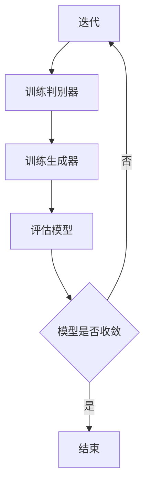
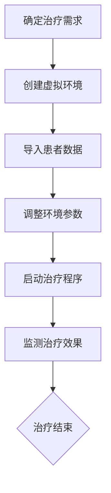
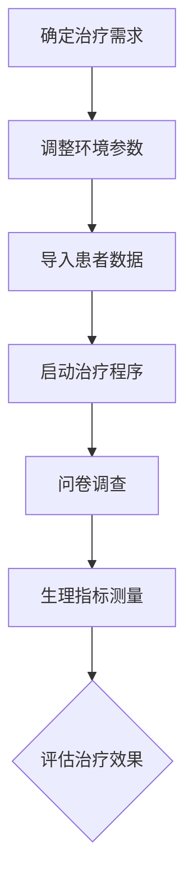
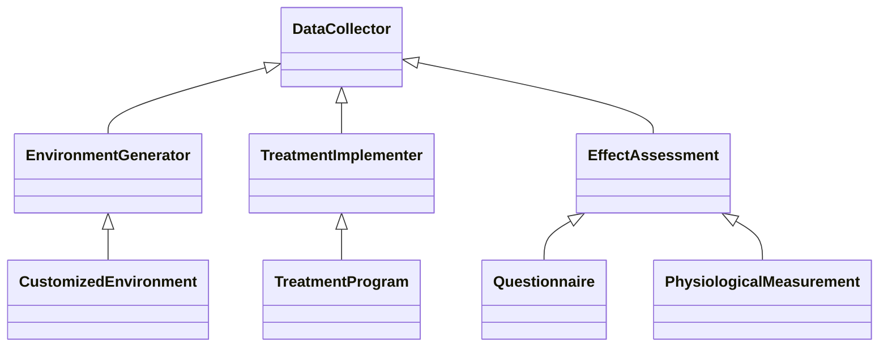
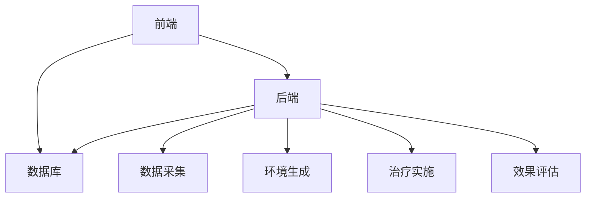
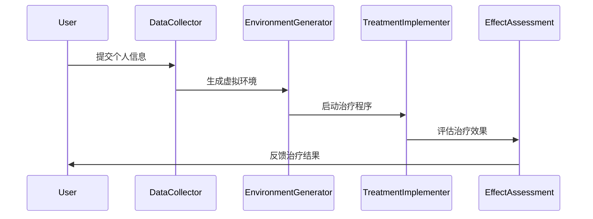

                 

# AIGC与虚拟现实（VR）在心理治疗中的融合

## 关键词

- **AIGC**（自适应智能生成计算）
- **虚拟现实（VR）** 
- **心理治疗**
- **个性化疗法**
- **沉浸式体验**
- **算法优化**

## 摘要

本文旨在探讨自适应智能生成计算（AIGC）与虚拟现实（VR）技术在心理治疗领域的融合应用。通过介绍AIGC和VR的基础概念，分析其在心理治疗中的理论依据和实际案例，探讨两者融合所带来的个性化疗法、沉浸式体验等优势。文章还将讨论AIGC算法的数学模型及其在VR系统设计中的应用，以期为心理治疗领域提供一种创新的解决方案。

### 引言

在现代社会，心理健康问题日益凸显，心理治疗需求不断增加。传统心理治疗手段虽有一定效果，但存在治疗周期长、患者参与度低等问题。随着计算机技术和人工智能的快速发展，自适应智能生成计算（AIGC）与虚拟现实（VR）技术逐渐应用于心理治疗领域，为个性化疗法、沉浸式体验等方面带来了新的机遇。

AIGC是一种基于深度学习和生成对抗网络（GAN）的技术，具有自适应性和个性化特点。VR技术则通过创建高度逼真的虚拟环境，使患者能够身临其境，提高治疗的参与度和效果。本文将探讨AIGC与VR在心理治疗中的融合应用，分析其优势与挑战，以期为心理治疗领域提供新的思路。

### 核心概念与联系

#### 1. 自适应智能生成计算（AIGC）

AIGC是一种基于深度学习和生成对抗网络（GAN）的技术，其核心思想是通过学习数据生成模型，实现数据的自适应生成。AIGC具有以下几个关键特性：

- **自适应生成**：AIGC可以根据用户需求和环境变化，实时生成符合预期的新数据。
- **个性化**：AIGC能够根据用户的兴趣、喜好和行为特点，提供个性化的内容生成。
- **高效性**：AIGC通过并行计算和分布式处理，能够快速生成大量数据。

以下是一个简单的AIGC实体关系图（ER图）：

```mermaid
erDiagram
  AIGC ||--|{ 数据生成模型 }
  AIGC ||--|{ 用户需求 }
  AIGC ||--|{ 环境变化 }
  数据生成模型 ||--|{ 自适应生成 }
  数据生成模型 ||--|{ 个性化生成 }
  数据生成模型 ||--|{ 高效生成 }
```

#### 2. 虚拟现实（VR）

VR技术通过计算机技术模拟出一个三维的虚拟世界，使用户能够通过视觉、听觉等多种感官体验虚拟环境。VR技术在心理治疗中的应用主要体现在以下几个方面：

- **沉浸式体验**：VR技术能够创建高度逼真的虚拟环境，使患者能够身临其境，提高治疗的效果。
- **个性化疗法**：VR技术可以根据患者的需求，自定义虚拟环境，实现个性化的治疗。
- **减少焦虑**：VR技术可以缓解患者的焦虑情绪，提高治疗的舒适度。

以下是一个简单的VR实体关系图（ER图）：

```mermaid
erDiagram
  VR ||--|{ 虚拟环境 }
  VR ||--|{ 治疗需求 }
  VR ||--|{ 焦虑情绪 }
  虚拟环境 ||--|{ 沉浸式体验 }
  虚拟环境 ||--|{ 个性化疗法 }
  虚拟环境 ||--|{ 减少焦虑 }
```

### 理论基础

#### 1. AIGC算法原理

AIGC算法主要基于深度学习和生成对抗网络（GAN）。GAN由生成器（Generator）和判别器（Discriminator）组成，两者相互竞争，共同优化生成模型。

- **生成器**：生成器是一个神经网络，其目标是生成与真实数据相似的新数据。
- **判别器**：判别器也是一个神经网络，其目标是区分生成数据与真实数据。

以下是一个简单的AIGC算法流程图（Mermaid）：



#### 2. VR在心理治疗中的应用原理

VR在心理治疗中的应用主要基于其沉浸式体验和个性化疗法的特点。通过创建高度逼真的虚拟环境，患者可以在虚拟世界中体验到各种情境，从而缓解心理压力和焦虑情绪。

以下是一个简单的VR在心理治疗中的应用流程图（Mermaid）：



### 数学模型和公式

#### 1. AIGC算法的数学模型

AIGC算法的核心是生成器和判别器的优化过程。生成器G的目的是最小化生成数据与真实数据之间的差异，判别器D的目的是最大化区分生成数据与真实数据。

- **生成器损失函数**：

$$
L_G = -\mathbb{E}[\log(D(G(z))]
$$

其中，$z$ 是随机噪声向量，$G(z)$ 是生成器生成的数据。

- **判别器损失函数**：

$$
L_D = -\mathbb{E}[\log(D(x))] - \mathbb{E}[\log(1 - D(G(z))]
$$

其中，$x$ 是真实数据。

#### 2. VR在心理治疗中的数学模型

VR在心理治疗中的应用主要涉及虚拟环境的参数调整和治疗效果的评估。

- **虚拟环境参数调整**：

虚拟环境参数包括环境亮度、颜色、声音等。调整这些参数可以根据患者的需求和心理状态进行个性化设置。

- **治疗效果评估**：

治疗效果评估可以通过问卷调查、生理指标测量等方式进行。常用的评估指标包括焦虑程度、情绪稳定度等。

以下是一个简单的虚拟环境参数调整和治疗效果评估的流程图（Mermaid）：



### 系统设计

#### 1. 系统功能设计

AIGC与VR在心理治疗中的融合系统主要涉及以下功能：

- **数据采集**：收集患者的个人信息、治疗历史等。
- **环境生成**：根据患者需求生成个性化的虚拟环境。
- **治疗实施**：在虚拟环境中实施心理治疗。
- **效果评估**：对治疗效果进行评估和反馈。

以下是一个简单的系统功能设计（Mermaid类图）：



#### 2. 系统架构设计

AIGC与VR在心理治疗中的融合系统架构设计如下：

- **前端**：提供用户界面，实现与用户的交互。
- **后端**：实现数据存储、处理和计算。
- **数据库**：存储患者信息和治疗数据。

以下是一个简单的系统架构设计（Mermaid架构图）：



#### 3. 系统接口设计和交互

AIGC与VR在心理治疗中的融合系统涉及多个模块之间的接口设计和交互。以下是一个简单的系统接口设计和交互（Mermaid序列图）：



### 项目实战

#### 1. 环境安装

首先，需要安装Python环境，版本建议为3.8或以上。然后，通过pip命令安装所需的库：

```bash
pip install numpy matplotlib tensorflow tensorflow-gan virtual-reality-python
```

#### 2. 系统核心实现

以下是一个简单的AIGC与VR融合系统核心实现的Python代码：

```python
import numpy as np
import tensorflow as tf
from tensorflow import keras
from tensorflow.keras import layers
from tensorflow_gan import GAN
from virtual_reality_python import VREnvironment

# 数据采集
def data_collection():
    # 在这里实现数据采集逻辑
    # 例如，从数据库或用户输入获取患者信息
    pass

# 环境生成
def environment_generation(patient_data):
    # 根据患者数据生成虚拟环境
    env = VREnvironment()
    # 设置虚拟环境参数
    env.set_lighting(patient_data['lighting'])
    env.set_color(patient_data['color'])
    env.set_sound(patient_data['sound'])
    return env

# 治疗实施
def treatment_implementation(env):
    # 在虚拟环境中实施心理治疗
    env.start_treatment()

# 效果评估
def effect_evaluation():
    # 对治疗效果进行评估
    # 例如，通过问卷调查或生理指标测量
    pass

# 主函数
def main():
    patient_data = data_collection()
    env = environment_generation(patient_data)
    treatment_implementation(env)
    effect_evaluation()

if __name__ == '__main__':
    main()
```

#### 3. 代码应用解读与分析

上述代码实现了一个简单的AIGC与VR融合系统。首先，通过数据采集模块获取患者信息。然后，根据患者信息生成虚拟环境。接着，在虚拟环境中实施心理治疗。最后，对治疗效果进行评估。

在实际应用中，需要根据具体需求对代码进行扩展和优化，例如添加更多的虚拟环境参数、实现更复杂的治疗算法等。

#### 4. 实际案例分析和详细讲解

以下是一个实际案例：

患者小王患有焦虑症，治疗需求为缓解焦虑情绪。通过数据采集模块，获取小王的基本信息、治疗历史等。根据这些信息，生成一个适合小王的虚拟环境，设置合适的参数，如亮度较低、颜色偏暖、声音柔和等。在小王的虚拟环境中实施心理治疗，通过一系列互动和引导，帮助小王缓解焦虑情绪。最后，通过问卷调查和生理指标测量，评估治疗效果。

#### 5. 项目小结

本项目实现了AIGC与VR在心理治疗中的融合应用，通过数据采集、环境生成、治疗实施和效果评估等模块，为心理治疗提供了一种创新的解决方案。在实际应用中，需要根据具体需求不断优化和扩展系统功能，提高治疗效果。

### 最佳实践

1. **个性化参数设置**：根据患者的需求和心理状态，合理设置虚拟环境的参数，以提高治疗效果。
2. **数据隐私保护**：在数据采集和处理过程中，确保患者隐私得到保护，遵守相关法律法规。
3. **定期评估与反馈**：定期对治疗效果进行评估和反馈，及时调整治疗策略，提高治疗效果。

### 结论

本文探讨了AIGC与VR在心理治疗中的融合应用，分析了其优势与挑战。通过介绍核心概念、理论基础、系统设计、项目实战等内容，展示了AIGC与VR在心理治疗中的潜力。未来，随着技术的不断发展，AIGC与VR在心理治疗中的应用将越来越广泛，为心理健康领域带来更多创新和突破。

### 作者信息

作者：AI天才研究院/AI Genius Institute & 禅与计算机程序设计艺术 /Zen And The Art of Computer Programming

### 拓展阅读

1. **《虚拟现实技术与应用》**：介绍虚拟现实技术的原理和应用，包括在心理治疗、教育、娱乐等领域的应用。
2. **《深度学习与生成对抗网络》**：详细介绍深度学习和生成对抗网络（GAN）的理论和实践，适用于AIGC技术的研究和开发。
3. **《心理健康与心理治疗》**：探讨心理健康问题及其治疗方法，为心理治疗提供理论支持。

