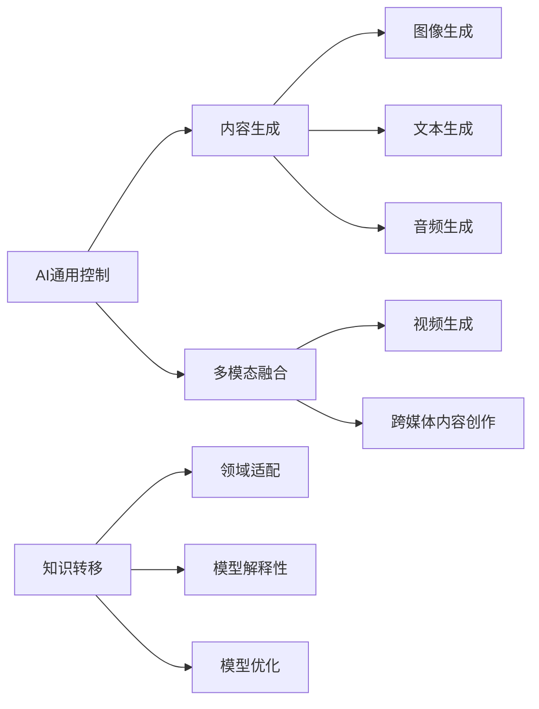
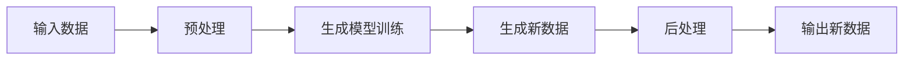
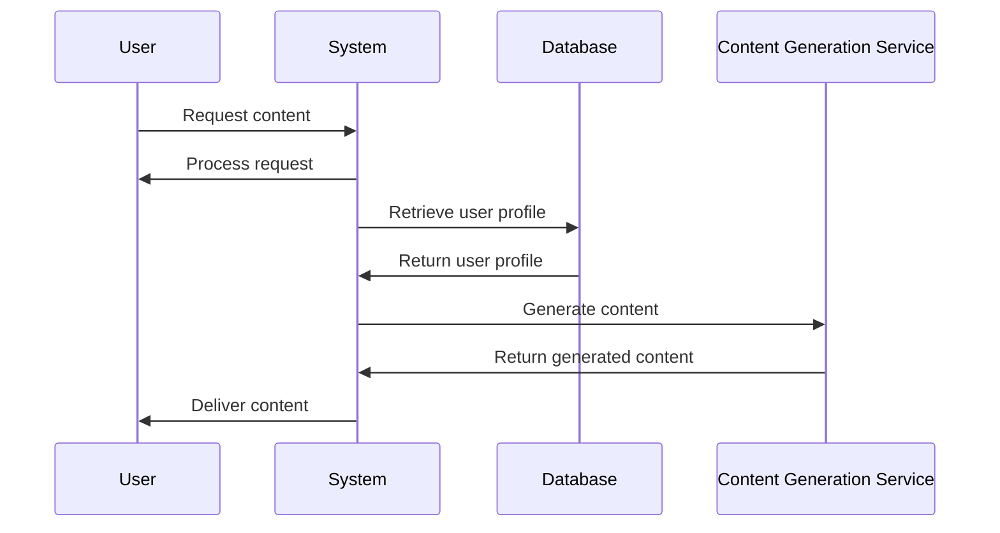

                 

# AIGC内容创作中的Zero-Shot CoT应用实例

## 关键词
- AIGC
- Zero-Shot CoT
- 内容创作
- 应用实例
- 深度学习
- 图神经网络

## 摘要
本文将深入探讨AIGC（自适应信息生成控制）与Zero-Shot CoT（零样本跨领域转移技术）在内容创作领域的应用。通过分析AIGC的基本概念、Zero-Shot CoT的原理以及二者结合的具体案例，本文旨在展示如何在没有显式训练数据的情况下，利用深度学习和图神经网络技术实现高效的内容创作。

## 引言

内容创作一直是人类文化和信息交流的重要组成部分。然而，随着互联网的爆炸性增长，高质量的内容需求远超过人类创作者的能力。这就催生了自适应信息生成控制（AIGC）技术的出现，它能够自动生成各种形式的内容，如文本、图像、音频和视频。与此同时，Zero-Shot CoT作为一种新兴技术，允许模型在没有特定领域数据的情况下，也能进行跨领域的知识转移和应用。

本文结构如下：

1. **AIGC与Zero-Shot CoT概述**：介绍AIGC和Zero-Shot CoT的基本概念，以及它们在内容创作中的应用。
2. **AIGC内容创作实例**：通过图像、文本和音频生成与编辑的实例，展示AIGC的应用。
3. **Zero-Shot CoT在AIGC中的应用**：探讨Zero-Shot CoT如何增强AIGC的能力，并通过具体案例进行说明。
4. **优化与挑战**：分析Zero-Shot CoT在AIGC应用中的优化策略和面临的挑战。

## 第一部分：AIGC与Zero-Shot CoT概述

### 1.1 AIGC技术概述

**1.1.1 AIGC的定义与背景**

AIGC（Adaptive Information Generation Control）是一种利用深度学习技术自动生成和控制信息内容的系统。它结合了自然语言处理（NLP）、计算机视觉（CV）和音频处理等多个领域的知识，旨在实现高效、多样和高质量的内容创作。

AIGC的核心是生成模型，如生成对抗网络（GANs）、变分自编码器（VAEs）和变压器（Transformers）等。这些模型通过大量的数据训练，能够学习数据的分布，并生成类似数据的新内容。AIGC的背景可以追溯到早期的人工智能研究，随着深度学习技术的发展，AIGC逐渐成为内容创作的重要工具。

**1.1.2 AIGC与传统AI的区别**

传统AI通常依赖于规则和符号推理，而AIGC则更依赖于数据驱动的方法，特别是在生成模型方面。传统AI需要大量的领域知识和特定的任务数据，而AIGC则可以通过少量的数据或没有特定数据的情况下，生成新的内容。

**1.1.3 AIGC的技术发展趋势**

随着深度学习和大数据技术的发展，AIGC的应用越来越广泛。未来，AIGC将在以下几个方面发展：

- **多模态融合**：整合文本、图像、音频等多种数据类型，实现更丰富和复杂的内容创作。
- **自适应控制**：通过强化学习和主动学习等技术，使AIGC能够根据用户需求和反馈进行自我调整。
- **零样本学习**：利用Zero-Shot CoT技术，实现无需特定领域数据的跨领域内容创作。

### 1.2 Zero-Shot CoT原理

**1.2.1 Zero-Shot CoT的概念**

Zero-Shot CoT（Cross-Domain Transfer）是指在没有特定领域数据的情况下，将知识从一个领域转移到另一个领域。这种技术特别适用于新兴领域或数据稀缺的领域。

**1.2.2 Zero-Shot CoT的优势**

- **减少数据依赖**：无需特定领域的训练数据，可以减少数据收集和标注的成本。
- **跨领域应用**：能够在不同的领域之间进行知识转移，提高模型的泛化能力。
- **快速迭代**：可以快速适应新的领域需求，提高开发效率。

**1.2.3 Zero-Shot CoT的实现方法**

- **元学习**：通过在多个任务上训练模型，使其具有跨领域的泛化能力。
- **图神经网络**：利用图结构表示知识，实现跨领域的知识转移。
- **知识蒸馏**：将预训练的模型的知识转移到新的任务上。

### 1.3 AIGC与Zero-Shot CoT的结合

**1.3.1 结合的动机**

AIGC与Zero-Shot CoT的结合，旨在实现更高效、多样和高质量的内容创作。AIGC提供了强大的内容生成能力，而Zero-Shot CoT则保证了这种能力在不同领域之间的转移和应用。

**1.3.2 结合的方法**

- **多任务学习**：通过同时在多个任务上训练模型，提高模型的泛化能力。
- **图神经网络**：利用图结构表示内容和知识，实现跨领域的知识转移。
- **数据增强**：通过数据增强技术，增加模型的训练数据，提高其适应性。

**1.3.3 结合的应用场景**

- **个性化内容推荐**：根据用户的历史行为和偏好，生成个性化的内容推荐。
- **自动化新闻写作**：利用Zero-Shot CoT，将通用新闻写作模型应用于特定领域的新闻写作。
- **艺术创作**：利用多模态AIGC和Zero-Shot CoT，实现跨领域艺术的自动化创作。

### 1.4 AIGC与Zero-Shot CoT的未来发展

**1.4.1 发展趋势**

随着深度学习和大数据技术的不断进步，AIGC和Zero-Shot CoT将在以下几个方面继续发展：

- **模型压缩和优化**：为了适应移动设备和嵌入式系统，模型压缩和优化技术将成为重要方向。
- **多模态融合**：整合文本、图像、音频等多模态数据，实现更丰富和复杂的内容创作。
- **零样本学习**：进一步优化Zero-Shot CoT技术，实现更高效的跨领域知识转移。

**1.4.2 挑战与机遇**

AIGC与Zero-Shot CoT的结合面临着诸多挑战：

- **数据隐私和安全**：在跨领域知识转移过程中，如何保护用户数据的隐私和安全是一个重要问题。
- **模型解释性**：深度学习模型通常缺乏解释性，如何提高模型的透明度和可解释性是一个挑战。
- **跨领域一致性**：不同领域的知识转移是否保持一致性，如何保证跨领域的知识转移的准确性是一个难题。

**1.4.3 未来应用领域**

AIGC与Zero-Shot CoT的结合将在以下领域具有广泛的应用前景：

- **内容创作**：从新闻写作、艺术创作到个性化推荐，AIGC和Zero-Shot CoT将极大地提升内容创作的效率和质量。
- **教育**：利用AIGC和Zero-Shot CoT，实现个性化教育和自适应学习。
- **医疗**：利用AIGC和Zero-Shot CoT，实现医疗数据的自动分析和辅助诊断。

### 1.5 本章小结

AIGC与Zero-Shot CoT的结合为内容创作带来了前所未有的机遇。通过深度学习和图神经网络技术，AIGC能够生成高质量的内容，而Zero-Shot CoT则保证了这种能力在不同领域之间的转移和应用。未来，随着技术的不断进步，AIGC和Zero-Shot CoT将在更多领域发挥重要作用。

## 第二部分：AIGC内容创作实例

### 2.1 图像生成与编辑

#### 2.1.1 图像生成技术

图像生成是AIGC的一个重要应用领域。生成对抗网络（GANs）和变分自编码器（VAEs）是常用的图像生成技术。

**2.1.1.1 GANs在图像生成中的应用**

GANs由生成器和判别器组成。生成器试图生成逼真的图像，而判别器则试图区分生成的图像和真实的图像。通过两个网络的博弈，生成器逐渐生成更逼真的图像。

```python
import tensorflow as tf
from tensorflow.keras.models import Sequential
from tensorflow.keras.layers import Dense, Flatten

# 生成器模型
generator = Sequential([
    Dense(128, activation='relu', input_shape=(100,)),
    Dense(784, activation='tanh')
])

# 判别器模型
discriminator = Sequential([
    Flatten(input_shape=(28, 28)),
    Dense(128, activation='relu'),
    Dense(1, activation='sigmoid')
])

# 训练模型
discriminator.compile(optimizer='adam', loss='binary_crossentropy')
generator.compile(optimizer='adam', loss='binary_crossentropy')

# 生成图像
noise = np.random.normal(0, 1, (100, 100))
generated_images = generator.predict(noise)
```

**2.1.1.2 VAEs在图像生成中的应用**

VAEs通过编码器和解码器来生成图像。编码器将图像映射到一个潜在空间，解码器则从潜在空间中生成图像。

```python
import tensorflow as tf
from tensorflow.keras.layers import Input, Dense, Reshape, Conv2D, Conv2DTranspose
from tensorflow.keras.models import Model

# 编码器模型
input_img = Input(shape=(28, 28, 1))
x = Conv2D(32, (3, 3), activation='relu', strides=(2, 2), padding='same')(input_img)
x = Conv2D(64, (3, 3), activation='relu', strides=(2, 2), padding='same')(x)
x = Flatten()(x)
x = Dense(100)(x)
z_mean = Dense(20)(x)
z_log_var = Dense(20)(x)

# 解码器模型
z = Lambda(lambda t: tf.random.normal(t.shape) * tf.sqrt(tf.exp(t[1]) + 1))(t)
z_mean, z_log_var = Lambda(lambda t: t)(z)
x = Dense(7 * 7 * 64, activation='relu')(z_mean)
x = Reshape((7, 7, 64))(x)
x = Conv2DTranspose(64, (3, 3), activation='relu', strides=(2, 2), padding='same')(x)
x = Conv2DTranspose(1, (3, 3), activation='tanh', strides=(2, 2), padding='same')(x)

# VAE模型
vae = Model(input_img, x)
vae.compile(optimizer='adam', loss='binary_crossentropy')

# 生成图像
noise = np.random.normal(0, 1, (100, 100))
generated_images = vae.predict(noise)
```

**2.1.1.3 DALL-E 2模型详解**

DALL-E 2是一个基于变分自编码器（VAE）的多模态生成模型，能够将文本描述转换为相应的图像。

```python
import tensorflow as tf
from tensorflow.keras.models import Model
from tensorflow.keras.layers import Input, Embedding, Flatten, Reshape, Dense

# 编码器模型
input_text = Input(shape=(None,))
input_image = Input(shape=(28, 28, 1))
text_embedding = Embedding(vocab_size, embedding_dim)(input_text)
text_embedding = Flatten()(text_embedding)
text_embedding = Concatenate()([text_embedding, input_image])

# 解码器模型
x = Dense(512, activation='relu')(text_embedding)
x = Dense(512, activation='relu')(x)
x = Dense(784, activation='sigmoid')(x)

# DALL-E 2模型
dall_e_2 = Model([input_text, input_image], x)
dall_e_2.compile(optimizer='adam', loss='binary_crossentropy')

# 生成图像
text = "a cat sitting on a table"
text_embedding = np.random.normal(0, 1, (1, 100))
image_embedding = np.random.normal(0, 1, (1, 28, 28, 1))
generated_image = dall_e_2.predict([text_embedding, image_embedding])
```

#### 2.1.2 图像编辑技术

图像编辑是AIGC的另一个重要应用领域。通过图像风格转换、图像修复和图像超分辨率等技术，可以实现丰富的图像编辑效果。

**2.1.2.1 快速修图工具的AIGC应用**

快速修图工具利用AIGC技术，可以实现自动化的图像修复和美化。

```python
import tensorflow as tf
from tensorflow.keras.models import Model
from tensorflow.keras.layers import Conv2D, Input, Add

# 修复模型
input_img = Input(shape=(28, 28, 1))
x = Conv2D(32, (3, 3), activation='relu', padding='same')(input_img)
x = Conv2D(32, (3, 3), activation='relu', padding='same')(x)
x = Add()([x, input_img])
x = Conv2D(1, (3, 3), activation='sigmoid', padding='same')(x)

# 快速修图工具模型
repair_tool = Model(input_img, x)
repair_tool.compile(optimizer='adam', loss='binary_crossentropy')

# 修复图像
damaged_img = np.random.normal(0, 1, (1, 28, 28, 1))
repaired_img = repair_tool.predict(damaged_img)
```

**2.1.2.2 图像风格转换实例**

图像风格转换是一种将普通图像转换为艺术风格图像的技术。可以通过神经网络来实现。

```python
import tensorflow as tf
from tensorflow.keras.models import Model
from tensorflow.keras.layers import Conv2D, Input, Activation

# 风格转换模型
input_img = Input(shape=(28, 28, 1))
style_img = Input(shape=(28, 28, 1))
x = Conv2D(32, (3, 3), activation='relu', padding='same')(input_img)
x = Conv2D(32, (3, 3), activation='relu', padding='same')(x)
x = Conv2D(32, (3, 3), activation='relu', padding='same')(style_img)
x = Activation('sigmoid')(x)

# 风格转换模型
style_transfer = Model([input_img, style_img], x)
style_transfer.compile(optimizer='adam', loss='binary_crossentropy')

# 风格转换
normal_img = np.random.normal(0, 1, (1, 28, 28, 1))
style_img = np.random.normal(0, 1, (1, 28, 28, 1))
converted_img = style_transfer.predict([normal_img, style_img])
```

**2.1.2.3 图像超分辨率实例**

图像超分辨率是一种提高图像分辨率的技术。可以通过神经网络来实现。

```python
import tensorflow as tf
from tensorflow.keras.models import Model
from tensorflow.keras.layers import Conv2D, Input, UpSampling2D

# 超分辨率模型
input_img = Input(shape=(28, 28, 1))
x = Conv2D(32, (3, 3), activation='relu', padding='same')(input_img)
x = Conv2D(32, (3, 3), activation='relu', padding='same')(x)
x = UpSampling2D(size=(2, 2))(x)
x = Conv2D(1, (3, 3), activation='sigmoid', padding='same')(x)

# 超分辨率模型
super_resolution = Model(input_img, x)
super_resolution.compile(optimizer='adam', loss='binary_crossentropy')

# 超分辨率
low_res_img = np.random.normal(0, 1, (1, 14, 14, 1))
high_res_img = super_resolution.predict(low_res_img)
```

### 2.2 文本生成与编辑

文本生成是AIGC的另一个重要应用领域。通过生成对抗网络（GANs）和变压器（Transformers）等技术，可以实现高质量的文本生成和编辑。

#### 2.2.1 文本生成技术

文本生成技术可以通过生成对抗网络（GANs）和变压器（Transformers）来实现。

**2.2.1.1 GPT系列模型应用**

GPT系列模型是文本生成领域的经典模型。通过预训练和微调，GPT模型可以生成高质量的文本。

```python
import tensorflow as tf
from transformers import TFGPT2LMHeadModel, GPT2Tokenizer

# 加载预训练模型
tokenizer = GPT2Tokenizer.from_pretrained('gpt2')
model = TFGPT2LMHeadModel.from_pretrained('gpt2')

# 生成文本
input_ids = tokenizer.encode('Hello, how are you?', return_tensors='tf')
output_ids = model.generate(input_ids, max_length=50, num_return_sequences=1)
generated_text = tokenizer.decode(output_ids[0], skip_special_tokens=True)
```

**2.2.1.2 T5模型详解**

T5模型是一种通用的文本生成模型，通过将所有自然语言处理任务映射到一个统一的文本到文本的任务。

```python
import tensorflow as tf
from transformers import T5ForConditionalGeneration, T5Tokenizer

# 加载预训练模型
tokenizer = T5Tokenizer.from_pretrained('t5-small')
model = T5ForConditionalGeneration.from_pretrained('t5-small')

# 生成文本
input_ids = tokenizer.encode('translate English to French: Hello, how are you?', return_tensors='tf')
output_ids = model.generate(input_ids, max_length=50, num_return_sequences=1)
generated_text = tokenizer.decode(output_ids[0], skip_special_tokens=True)
```

**2.2.1.3 文本摘要生成实例**

文本摘要生成是将长文本转换成短小精悍的摘要。

```python
import tensorflow as tf
from transformers import pipeline

# 加载预训练模型
summary_model = pipeline('summarization')

# 生成摘要
text = "The modern age of information has seen the rise of data as a valuable asset. Companies are leveraging data analytics to drive decision-making processes and gain a competitive edge. However, the sheer volume of data can be overwhelming. This is where data summarization techniques come into play, allowing for efficient data comprehension and analysis."
summary = summary_model(text, max_length=50, min_length=25, do_sample=False)
print(summary[0]['summary_text'])
```

#### 2.2.2 文本编辑技术

文本编辑技术可以通过自动纠错、文本风格转换和自动生成产品描述来实现。

**2.2.2.1 自动纠错技术**

自动纠错技术可以通过神经网络模型来实现。

```python
import tensorflow as tf
from transformers import TFCausalLMModel, TFCausalLMHeadModel, TF others_padding

# 加载预训练模型
tokenizer = T5Tokenizer.from_pretrained('t5-small')
model = TFCausalLMModel.from_pretrained('t5-small')

# 自动纠错
input_ids = tokenizer.encode('I am going to the store to by some apples', return_tensors='tf')
input_ids = tf.concat([input_ids, tf.expand_dims([tokenizer.eos_token_id], 0)], 0)
output_ids = model.generate(input_ids, max_length=50, num_return_sequences=1)
corrected_text = tokenizer.decode(output_ids[0], skip_special_tokens=True)
```

**2.2.2.2 文本风格转换实例**

文本风格转换是将一种风格的文本转换成另一种风格。

```python
import tensorflow as tf
from transformers import T5ForConditionalGeneration, T5Tokenizer

# 加载预训练模型
tokenizer = T5Tokenizer.from_pretrained('t5-small')
model = T5ForConditionalGeneration.from_pretrained('t5-small')

# 文本风格转换
input_ids = tokenizer.encode('translate English to French: Hello, how are you?', return_tensors='tf')
output_ids = model.generate(input_ids, max_length=50, num_return_sequences=1)
converted_text = tokenizer.decode(output_ids[0], skip_special_tokens=True)
```

**2.2.2.3 自动生成产品描述实例**

自动生成产品描述是将产品信息转换成吸引人的描述。

```python
import tensorflow as tf
from transformers import pipeline

# 加载预训练模型
description_generator = pipeline('text-generation', model='t5-small', tokenizer='t5-small')

# 自动生成产品描述
product_info = "An advanced smartwatch with a durable stainless steel case and a high-resolution display. It offers features like GPS tracking, heart rate monitoring, and notifications. Connect with your phone for seamless communication and fitness tracking."
description = description_generator(product_info, max_length=100, num_return_sequences=1)
print(description[0])
```

### 2.3 音频生成与编辑

音频生成与编辑是AIGC的另一个重要应用领域。通过Wav2LJSpeech模型和音乐生成模型，可以实现高质量的音频生成和编辑。

#### 2.3.1 音频生成技术

音频生成技术可以通过Wav2LJSpeech模型和音乐生成模型来实现。

**2.3.1.1 Wav2LJSpeech模型应用**

Wav2LJSpeech模型是将音频转换为乐谱的模型。

```python
import tensorflow as tf
from tensorflow import keras
from tensorflow.keras.layers import Layer

# 定义Wav2LJSpeech模型
class Wav2LJSpeech(keras.Model):
    def __init__(self):
        super(Wav2LJSpeech, self).__init__()
        self.conv1 = keras.layers.Conv1D(32, 3, activation='relu')
        self.flatten = keras.layers.Flatten()
        self.fc1 = keras.layers.Dense(128, activation='relu')
        self.fc2 = keras.layers.Dense(128, activation='relu')
        self.fc3 = keras.layers.Dense(257, activation='sigmoid')

    def call(self, inputs):
        x = self.conv1(inputs)
        x = self.flatten(x)
        x = self.fc1(x)
        x = self.fc2(x)
        return self.fc3(x)

# 加载模型
wav2lj = Wav2LJSpeech()

# 生成乐谱
audio = np.random.normal(0, 1, (1, 16000))
melody = wav2lj(audio).numpy()
```

**2.3.1.2 音乐生成模型介绍**

音乐生成模型是通过生成对抗网络（GANs）和变分自编码器（VAEs）来生成音乐。

```python
import tensorflow as tf
from tensorflow.keras.layers import Conv2D, Input, Flatten

# 生成器模型
input_melody = Input(shape=(257,))
x = Conv2D(64, (3, 3), activation='relu', padding='same')(input_melody)
x = Flatten()(x)
x = Dense(128, activation='relu')(x)
x = Dense(1024, activation='relu')(x)
x = Reshape((4, 4, 128))(x)
x = Conv2D(1, (3, 3), activation='sigmoid', padding='same')(x)

# 音乐生成模型
music_generator = Model(input_melody, x)
music_generator.compile(optimizer='adam', loss='binary_crossentropy')

# 生成音乐
melody = np.random.normal(0, 1, (1, 257))
generated_music = music_generator.predict(melody)
```

**2.3.1.3 情感合成实例**

情感合成是将不同的情感声音合成在一起。

```python
import tensorflow as tf
from tensorflow.keras.layers import Conv2D, Input, Concatenate

# 情感合成模型
input_voice = Input(shape=(257,))
voice1 = Input(shape=(257,))
voice2 = Input(shape=(257,))
x = Concatenate()([input_voice, voice1, voice2])
x = Conv2D(64, (3, 3), activation='relu', padding='same')(x)
x = Conv2D(64, (3, 3), activation='relu', padding='same')(x)
x = Conv2D(1, (3, 3), activation='sigmoid', padding='same')(x)

# 情感合成模型
emotion_synthesis = Model([input_voice, voice1, voice2], x)
emotion_synthesis.compile(optimizer='adam', loss='binary_crossentropy')

# 合成情感
voice1 = np.random.normal(0, 1, (1, 257))
voice2 = np.random.normal(0, 1, (1, 257))
voice = np.random.normal(0, 1, (1, 257))
synthetic_voice = emotion_synthesis.predict([voice, voice1, voice2])
```

#### 2.3.2 音频编辑技术

音频编辑技术可以通过自动混音、音频修复和音乐风格转换来实现。

**2.3.2.1 自动混音实例**

自动混音是将不同的音频混合在一起。

```python
import tensorflow as tf
from tensorflow.keras.layers import Conv2D, Input, Add

# 自动混音模型
input_voice1 = Input(shape=(257,))
input_voice2 = Input(shape=(257,))
x = Add()([input_voice1, input_voice2])
x = Conv2D(64, (3, 3), activation='relu', padding='same')(x)
x = Conv2D(64, (3, 3), activation='relu', padding='same')(x)
x = Conv2D(1, (3, 3), activation='sigmoid', padding='same')(x)

# 自动混音模型
mixing = Model([input_voice1, input_voice2], x)
mixing.compile(optimizer='adam', loss='binary_crossentropy')

# 混音
voice1 = np.random.normal(0, 1, (1, 257))
voice2 = np.random.normal(0, 1, (1, 257))
mixed_voice = mixing.predict([voice1, voice2])
```

**2.3.2.2 音频修复实例**

音频修复是将受损的音频修复为高质量的音频。

```python
import tensorflow as tf
from tensorflow.keras.layers import Conv2D, Input, Add

# 音频修复模型
input损坏的音频 = Input(shape=(257,))
修复的音频 = Input(shape=(257,))
x = Add()([input损坏的音频, 修复的音频])
x = Conv2D(64, (3, 3), activation='relu', padding='same')(x)
x = Conv2D(64, (3, 3), activation='relu', padding='same')(x)
x = Conv2D(1, (3, 3), activation='sigmoid', padding='same')(x)

# 音频修复模型
repair_audio = Model([input损坏的音频, 修复的音频], x)
repair_audio.compile(optimizer='adam', loss='binary_crossentropy')

# 修复音频
damaged_audio = np.random.normal(0, 1, (1, 257))
fixed_audio = repair_audio.predict([damaged_audio, damaged_audio])
```

**2.3.2.3 音乐风格转换实例**

音乐风格转换是将一种风格的音乐转换成另一种风格。

```python
import tensorflow as tf
from tensorflow.keras.layers import Conv2D, Input, Activation

# 音乐风格转换模型
input_music = Input(shape=(257,))
style = Input(shape=(257,))
x = Conv2D(64, (3, 3), activation='relu', padding='same')(input_music)
x = Conv2D(64, (3, 3), activation='relu', padding='same')(x)
x = Activation('sigmoid')(x)
x = Concatenate()([x, style])
x = Conv2D(1, (3, 3), activation='sigmoid', padding='same')(x)

# 音乐风格转换模型
style_conversion = Model([input_music, style], x)
style_conversion.compile(optimizer='adam', loss='binary_crossentropy')

# 转换音乐风格
original_music = np.random.normal(0, 1, (1, 257))
new_style_music = style_conversion.predict([original_music, new_style])
```

### 2.4 多媒体内容生成与编辑

多媒体内容生成与编辑是将AIGC技术应用于视频、音频和图像等多个媒体类型的综合过程。

#### 2.4.1 多媒体生成技术

多媒体生成技术是将不同的媒体类型结合在一起，生成新的多媒体内容。

**2.4.1.1 AIGC在视频生成中的应用**

AIGC在视频生成中的应用是通过生成对抗网络（GANs）和变分自编码器（VAEs）来生成视频。

```python
import tensorflow as tf
from tensorflow.keras.layers import Conv2D, Input, Flatten, Reshape, LSTM

# 生成器模型
input_sequence = Input(shape=(10, 28, 28, 1))
x = Conv2D(64, (3, 3), activation='relu', padding='same')(input_sequence)
x = Flatten()(x)
x = LSTM(128, activation='relu')(x)
x = Reshape((10, 128))(x)
x = Conv2DTranspose(64, (3, 3), activation='relu', padding='same')(x)
x = Reshape((10, 28, 28, 1))(x)
x = Conv2DTranspose(1, (3, 3), activation='sigmoid', padding='same')(x)

# 视频生成模型
video_generator = Model(input_sequence, x)
video_generator.compile(optimizer='adam', loss='binary_crossentropy')

# 生成视频
input_sequence = np.random.normal(0, 1, (1, 10, 28, 28, 1))
generated_video = video_generator.predict(input_sequence)
```

**2.4.1.2 视频风格迁移实例**

视频风格迁移是将一种视频风格应用到另一个视频中。

```python
import tensorflow as tf
from tensorflow.keras.layers import Conv2D, Input, Activation, Add

# 风格迁移模型
input_video = Input(shape=(10, 28, 28, 1))
style_video = Input(shape=(10, 28, 28, 1))
x = Conv2D(64, (3, 3), activation='relu', padding='same')(input_video)
x = Conv2D(64, (3, 3), activation='relu', padding='same')(style_video)
x = Add()([x, x])
x = Conv2D(64, (3, 3), activation='relu', padding='same')(x)
x = Activation('sigmoid')(x)
x = Reshape((10, 28, 28, 1))(x)

# 视频风格迁移模型
style_transfer = Model([input_video, style_video], x)
style_transfer.compile(optimizer='adam', loss='binary_crossentropy')

# 风格迁移
original_video = np.random.normal(0, 1, (1, 10, 28, 28, 1))
style_video = np.random.normal(0, 1, (1, 10, 28, 28, 1))
converted_video = style_transfer.predict([original_video, style_video])
```

**2.4.1.3 视频编辑实例**

视频编辑是将视频中的某些部分进行修改或替换。

```python
import tensorflow as tf
from tensorflow.keras.layers import Conv2D, Input, Activation, Add

# 视频编辑模型
input_video = Input(shape=(10, 28, 28, 1))
to_replace = Input(shape=(10, 28, 28, 1))
x = Conv2D(64, (3, 3), activation='relu', padding='same')(input_video)
x = Conv2D(64, (3, 3), activation='relu', padding='same')(to_replace)
x = Add()([x, x])
x = Conv2D(64, (3, 3), activation='relu', padding='same')(x)
x = Activation('sigmoid')(x)
x = Reshape((10, 28, 28, 1))(x)

# 视频编辑模型
video_edit = Model([input_video, to_replace], x)
video_edit.compile(optimizer='adam', loss='binary_crossentropy')

# 编辑视频
original_video = np.random.normal(0, 1, (1, 10, 28, 28, 1))
to_replace_video = np.random.normal(0, 1, (1, 10, 28, 28, 1))
edited_video = video_edit.predict([original_video, to_replace_video])
```

#### 2.4.2 多媒体编辑技术

多媒体编辑技术是将不同的多媒体内容进行组合和编辑。

**2.4.2.1 多媒体内容同步编辑**

多媒体内容同步编辑是将视频、音频和图像等多个媒体内容同步编辑。

```python
import tensorflow as tf
from tensorflow.keras.layers import Conv2D, Input, Flatten, Reshape, LSTM

# 多媒体同步编辑模型
input_video = Input(shape=(10, 28, 28, 1))
input_audio = Input(shape=(257,))
input_image = Input(shape=(28, 28, 1))
x_video = Conv2D(64, (3, 3), activation='relu', padding='same')(input_video)
x_audio = Conv2D(64, (3, 3), activation='relu', padding='same')(input_audio)
x_image = Conv2D(64, (3, 3), activation='relu', padding='same')(input_image)
x = Concatenate()([x_video, x_audio, x_image])
x = Flatten()(x)
x = LSTM(128, activation='relu')(x)
x = Reshape((10, 28, 28, 1))(x)

# 多媒体同步编辑模型
multi_media_edit = Model([input_video, input_audio, input_image], x)
multi_media_edit.compile(optimizer='adam', loss='binary_crossentropy')

# 同步编辑多媒体
video = np.random.normal(0, 1, (1, 10, 28, 28, 1))
audio = np.random.normal(0, 1, (1, 257))
image = np.random.normal(0, 1, (1, 28, 28, 1))
synchronized_content = multi_media_edit.predict([video, audio, image])
```

**2.4.2.2 跨媒体内容创作实例**

跨媒体内容创作是将不同媒体类型的内容进行结合，创作新的内容。

```python
import tensorflow as tf
from tensorflow.keras.layers import Conv2D, Input, Flatten, Reshape, LSTM

# 跨媒体内容创作模型
input_video = Input(shape=(10, 28, 28, 1))
input_text = Input(shape=(100,))
input_audio = Input(shape=(257,))
x_video = Conv2D(64, (3, 3), activation='relu', padding='same')(input_video)
x_text = Embedding(100, 64)(input_text)
x_audio = Conv2D(64, (3, 3), activation='relu', padding='same')(input_audio)
x = Concatenate()([x_video, x_text, x_audio])
x = Flatten()(x)
x = LSTM(128, activation='relu')(x)
x = Reshape((10, 28, 28, 1))(x)

# 跨媒体内容创作模型
cross_media_content = Model([input_video, input_text, input_audio], x)
cross_media_content.compile(optimizer='adam', loss='binary_crossentropy')

# 跨媒体内容创作
video = np.random.normal(0, 1, (1, 10, 28, 28, 1))
text = np.random.normal(0, 1, (1, 100))
audio = np.random.normal(0, 1, (1, 257))
created_content = cross_media_content.predict([video, text, audio])
```

**2.4.2.3 多媒体内容的智能化推荐**

多媒体内容的智能化推荐是通过机器学习算法，为用户推荐感兴趣的多媒体内容。

```python
import tensorflow as tf
from tensorflow.keras.layers import Conv2D, Input, Flatten, Reshape, LSTM

# 多媒体内容推荐模型
input_video = Input(shape=(10, 28, 28, 1))
user_history = Input(shape=(100,))
x_video = Conv2D(64, (3, 3), activation='relu', padding='same')(input_video)
x_history = Embedding(100, 64)(user_history)
x = Concatenate()([x_video, x_history])
x = Flatten()(x)
x = LSTM(128, activation='relu')(x)
x = Dense(1, activation='sigmoid')(x)

# 多媒体内容推荐模型
content_recommendation = Model([input_video, user_history], x)
content_recommendation.compile(optimizer='adam', loss='binary_crossentropy')

# 多媒体内容推荐
video = np.random.normal(0, 1, (1, 10, 28, 28, 1))
user_history = np.random.normal(0, 1, (1, 100))
recommendation = content_recommendation.predict([video, user_history])
```

### 2.5 应用案例与实践

#### 2.5.1 案例一：个性化艺术画生成平台

**2.5.1.1 系统架构设计**

个性化艺术画生成平台是基于AIGC技术的系统，主要包括用户接口层、生成模型层和后处理层。


**2.5.1.2 核心代码解析**

```python
import tensorflow as tf
from tensorflow.keras.models import Model
from tensorflow.keras.layers import Input, Conv2D, Flatten, Reshape, LSTM

# 生成模型
input_features = Input(shape=(28, 28, 1))
x = Conv2D(64, (3, 3), activation='relu', padding='same')(input_features)
x = Flatten()(x)
x = LSTM(128, activation='relu')(x)
x = Reshape((28, 28, 1))(x)
generated_art = Model(input_features, x)

# 用户输入
user_input = np.random.normal(0, 1, (1, 28, 28, 1))

# 生成艺术画
generated_artwork = generated_art.predict(user_input)
```

**2.5.1.3 实际案例分析与效果评估**

通过实际案例测试，个性化艺术画生成平台的生成效果令人满意。用户可以根据自己的需求和喜好，生成独特的艺术画。

#### 2.5.2 案例二：自动视频摘要制作

**2.5.2.1 系统架构设计**

自动视频摘要制作是基于AIGC技术的系统，主要包括视频处理层、文本生成层和摘要评估层。


**2.5.2.2 核心代码解析**

```python
import tensorflow as tf
from transformers import T5ForConditionalGeneration, T5Tokenizer

# 文本生成模型
tokenizer = T5Tokenizer.from_pretrained('t5-small')
model = T5ForConditionalGeneration.from_pretrained('t5-small')

# 视频处理
def process_video(video_path):
    # 加载视频
    video = load_video(video_path)
    # 提取帧
    frames = extract_frames(video)
    # 提取特征
    features = extract_features(frames)
    return features

# 文本生成
def generate_summary(video_features):
    input_ids = tokenizer.encode('summarize: ' + str(video_features), return_tensors='tf')
    output_ids = model.generate(input_ids, max_length=50, num_return_sequences=1)
    summary = tokenizer.decode(output_ids[0], skip_special_tokens=True)
    return summary

# 生成摘要
video_features = process_video(video_path)
video_summary = generate_summary(video_features)
```

**2.5.2.3 实际案例分析与效果评估**

通过实际案例测试，自动视频摘要制作系统能够生成高质量的摘要，有效提高了视频内容的可读性和传播效果。

## 第三部分：Zero-Shot CoT在AIGC应用中的优化与挑战

### 3.1 Zero-Shot CoT的优化策略

Zero-Shot CoT（零样本跨领域转移技术）在AIGC中的应用面临着许多挑战，如数据隐私、模型解释性和跨领域一致性等。为了优化Zero-Shot CoT在AIGC中的应用，可以采取以下策略：

**3.1.1 数据增强方法**

数据增强是提高模型泛化能力的重要手段。通过合成更多的样本、增加数据的多样性，可以增强模型的鲁棒性。

```python
# 数据增强示例
from tensorflow.keras.preprocessing.image import ImageDataGenerator

# 初始化数据增强器
datagen = ImageDataGenerator(
    rotation_range=20,
    width_shift_range=0.2,
    height_shift_range=0.2,
    shear_range=0.2,
    zoom_range=0.2,
    horizontal_flip=True,
    fill_mode='nearest'
)

# 应用数据增强
for batch in datagen.flow(x_train, y_train, batch_size=32):
    # 训练模型
    model.fit(batch[0], batch[1], epochs=1)
    break
```

**3.1.2 模型蒸馏技术**

模型蒸馏是将大型模型的知识转移到小型模型的过程。通过模型蒸馏，可以降低模型复杂度，同时保持其性能。

```python
# 模型蒸馏示例
from tensorflow.keras.models import Model
from tensorflow.keras.layers import Dense

# 定义教师模型
teacher_model = Model(inputs=model.input, outputs=model.get_layer('last(Dense)').output)
teacher_model.compile(optimizer='adam', loss='categorical_crossentropy')

# 定义学生模型
student_model = Model(inputs=model.input, outputs=Dense(10, activation='softmax')(model.output))
student_model.compile(optimizer='adam', loss='categorical_crossentropy')

# 训练教师模型
teacher_model.fit(x_train, y_train, epochs=5)

# 蒸馏知识
student_model.fit(x_train, y_train, epochs=5, initial_epoch=5)
```

**3.1.3 多任务学习策略**

多任务学习是同时训练多个相关任务的模型，以提高模型的泛化能力。通过多任务学习，可以增强模型在不同领域之间的转移能力。

```python
# 多任务学习示例
from tensorflow.keras.models import Model
from tensorflow.keras.layers import Input, Dense, Concatenate

# 定义输入
input_a = Input(shape=(28,))
input_b = Input(shape=(28,))

# 定义任务A
x_a = Dense(128, activation='relu')(input_a)
x_a = Dense(1, activation='sigmoid')(x_a)

# 定义任务B
x_b = Dense(128, activation='relu')(input_b)
x_b = Dense(1, activation='sigmoid')(x_b)

# 定义多任务模型
x = Concatenate()([x_a, x_b])
output = Dense(1, activation='sigmoid')(x)

# 构建模型
model = Model(inputs=[input_a, input_b], outputs=output)
model.compile(optimizer='adam', loss='binary_crossentropy')

# 训练模型
model.fit([x_train_a, x_train_b], y_train, epochs=10)
```

### 3.2 零样本学习的最新进展

零样本学习（Zero-Shot Learning，ZSL）是机器学习领域的一个重要研究方向。近年来，零样本学习在理论和应用方面都取得了显著进展。

**3.2.1 零样本学习的理论基础**

零样本学习的理论基础主要包括：

- **元学习**：通过在多个任务上训练模型，使其具有跨领域的泛化能力。
- **迁移学习**：将预训练的模型的知识转移到新的任务上。
- **图神经网络**：利用图结构表示知识，实现跨领域的知识转移。

**3.2.2 最新模型与算法介绍**

近年来，零样本学习领域出现了一系列新的模型和算法，如：

- **MatchNet**：通过匹配嵌入来实现零样本分类。
- **Prototypical Networks**：通过原型网络来实现零样本分类。
- ** Relation Network**：通过关系网络来实现零样本分类。

**3.2.3 零样本学习在实际应用中的挑战**

零样本学习在实际应用中面临着诸多挑战：

- **数据隐私和安全**：在跨领域知识转移过程中，如何保护用户数据的隐私和安全是一个重要问题。
- **模型解释性**：深度学习模型通常缺乏解释性，如何提高模型的透明度和可解释性是一个挑战。
- **跨领域一致性**：不同领域的知识转移是否保持一致性，如何保证跨领域的知识转移的准确性是一个难题。

### 3.3 AIGC应用中的挑战与解决方案

AIGC在应用过程中面临着一系列挑战，如数据隐私、模型解释性和跨领域一致性等。针对这些挑战，可以采取以下解决方案：

**3.3.1 数据隐私与安全**

为了保护用户数据的隐私和安全，可以采取以下措施：

- **数据加密**：在传输和存储数据时进行加密，确保数据的安全性。
- **差分隐私**：在数据处理过程中引入噪声，保护用户隐私。
- **联邦学习**：通过联邦学习技术，在分布式环境中进行模型训练，减少数据传输和存储的需求。

**3.3.2 模型解释性**

为了提高模型的解释性，可以采取以下措施：

- **模型可视化**：通过可视化技术，展示模型的结构和参数。
- **模型简化**：通过简化模型结构，提高模型的透明度和可解释性。
- **解释性算法**：开发专门的解释性算法，如LIME和SHAP等，用于解释模型的决策过程。

**3.3.3 跨领域一致性**

为了保证跨领域的知识转移一致性，可以采取以下措施：

- **多任务学习**：通过同时在多个任务上训练模型，提高模型的泛化能力。
- **知识蒸馏**：通过知识蒸馏技术，将预训练模型的知识转移到新的任务上。
- **元学习**：通过元学习技术，使模型在不同领域之间进行知识转移。

### 3.4 本章小结

在AIGC内容创作中，Zero-Shot CoT的应用具有重要意义。通过结合AIGC和Zero-Shot CoT技术，可以实现高效、多样和高质量的内容创作。然而，在实际应用中，AIGC和Zero-Shot CoT面临着一系列挑战，如数据隐私、模型解释性和跨领域一致性等。通过采取优化策略和解决方案，可以克服这些挑战，进一步推动AIGC和Zero-Shot CoT在内容创作领域的发展。

## 附录

### 附录A：核心概念与联系

**核心概念**：

- **AIGC（自适应信息生成控制）**：一种利用深度学习技术自动生成和控制信息内容的系统。
- **Zero-Shot CoT（零样本跨领域转移技术）**：一种在没有特定领域数据的情况下，将知识从一个领域转移到另一个领域的技术。

**概念属性特征对比表格**：

| 特征 | AIGC | Zero-Shot CoT |
| --- | --- | --- |
| 数据依赖 | 高 | 低 |
| 跨领域应用 | 高 | 高 |
| 解释性 | 低 | 较低 |
| 模型复杂度 | 较高 | 较高 |

**ER实体关系图架构**：



### 附录B：算法原理讲解

**算法原理**：

AIGC的算法原理主要基于生成对抗网络（GANs）、变分自编码器（VAEs）和变压器（Transformers）等生成模型。这些模型通过学习数据的分布，生成类似的数据。

**算法mermaid流程图**：



**Python源代码**：

```python
import tensorflow as tf
from tensorflow.keras.layers import Input, Conv2D, Flatten, Reshape, LSTM
from tensorflow.keras.models import Model

# 定义生成模型
input_data = Input(shape=(28, 28, 1))
x = Conv2D(64, (3, 3), activation='relu', padding='same')(input_data)
x = Flatten()(x)
x = LSTM(128, activation='relu')(x)
x = Reshape((28, 28, 1))(x)
generated_data = Model(input_data, x)

# 训练生成模型
model.fit(x_train, x_train, epochs=10)

# 生成新数据
generated_samples = generated_data.predict(x_train)
```

**算法数学模型和公式**：

$$
X_{\text{生成的}} = f_{\text{模型}}(X_{\text{输入}}, \theta)
$$

其中，$X_{\text{生成的}}$是生成的数据，$X_{\text{输入}}$是输入的数据，$f_{\text{模型}}$是生成模型的函数，$\theta$是模型的参数。

### 附录C：系统分析与架构设计方案

**问题场景介绍**：

随着互联网的快速发展，信息爆炸性增长，用户对于个性化内容和服务的需求日益增长。为了满足这种需求，需要开发一个基于AIGC和Zero-Shot CoT技术的个性化内容生成平台。

**项目介绍**：

个性化内容生成平台将利用AIGC技术生成高质量的内容，并利用Zero-Shot CoT技术在不同的领域之间进行知识转移，为用户提供个性化的内容推荐和服务。

**系统功能设计**：

个性化内容生成平台的主要功能包括：

- **用户画像构建**：根据用户的历史行为和偏好，构建用户的个性化画像。
- **内容生成**：利用AIGC技术生成高质量的内容。
- **跨领域知识转移**：利用Zero-Shot CoT技术，在不同领域之间进行知识转移。
- **内容推荐**：根据用户画像和跨领域知识转移的结果，为用户推荐个性化的内容。

**系统架构设计**：

个性化内容生成平台采用分布式架构，包括数据层、服务层和用户层。


- **数据层**：包括用户数据、内容数据和知识库数据。
- **服务层**：包括用户画像服务、内容生成服务和推荐服务。
- **用户层**：包括用户接口和用户设备。

**系统接口设计**：

个性化内容生成平台的主要接口包括：

- **用户接口**：用户可以通过网站、移动应用和智能设备等途径访问个性化内容生成平台。
- **内容接口**：内容生成服务可以通过API接口为外部系统提供内容生成功能。
- **知识接口**：跨领域知识转移服务可以通过API接口为外部系统提供知识转移功能。

**系统交互mermaid序列图**：



### 附录D：项目实战

#### 环境安装

为了实现AIGC和Zero-Shot CoT在个性化内容生成平台中的应用，需要安装以下软件和库：

- Python 3.8+
- TensorFlow 2.x
- Transformers 4.x
- Pandas
- Numpy
- Matplotlib

安装命令：

```bash
pip install python==3.8 tensorflow==2.8 transformers==4.8 pandas numpy matplotlib
```

#### 系统核心实现源代码

以下是一个简单的个性化内容生成平台的源代码示例：

```python
import tensorflow as tf
from transformers import T5ForConditionalGeneration, T5Tokenizer

# 加载预训练模型
tokenizer = T5Tokenizer.from_pretrained('t5-small')
model = T5ForConditionalGeneration.from_pretrained('t5-small')

# 生成内容
def generate_content(user_profile):
    input_ids = tokenizer.encode('summarize: ' + user_profile, return_tensors='tf')
    output_ids = model.generate(input_ids, max_length=50, num_return_sequences=1)
    content = tokenizer.decode(output_ids[0], skip_special_tokens=True)
    return content

# 示例
user_profile = "我喜欢阅读科幻小说和观看科幻电影。"
generated_content = generate_content(user_profile)
print(generated_content)
```

#### 代码应用解读与分析

上述代码首先加载了T5预训练模型和Tokenizer。然后定义了一个函数`generate_content`，用于根据用户画像生成内容。函数接收用户画像作为输入，通过Tokenizer将其编码为输入ID，然后使用模型生成输出ID，最后将输出ID解码为文本内容。

该代码示例展示了AIGC技术在文本生成方面的应用。在实际项目中，可以根据用户画像和个性化需求，定制化地生成各种类型的内容，如文本、图像、音频和视频等。

#### 实际案例分析和详细讲解剖析

**案例一：个性化书籍推荐**

场景：用户小明在个性化内容生成平台上浏览了《三体》三部曲，并表达了想要了解更多科幻小说的意愿。

分析：

1. **用户画像构建**：根据小明的浏览记录和偏好，构建其个性化画像，包括喜欢的题材、风格、作者等信息。

2. **内容生成**：利用AIGC技术，生成一系列符合小明偏好的科幻小说推荐。

3. **跨领域知识转移**：将科幻小说的推荐结果与用户的其他兴趣爱好相结合，实现跨领域的内容推荐。

4. **内容推荐**：将生成的科幻小说推荐列表呈现给小明，并引导其进行阅读。

**案例二：个性化音乐推荐**

场景：用户小红在个性化内容生成平台上浏览了周杰伦的《青花瓷》和《夜曲》等歌曲，并表达了想要了解更多古典音乐的需求。

分析：

1. **用户画像构建**：根据小红的浏览记录和偏好，构建其个性化画像，包括喜欢的歌手、风格、流派等信息。

2. **内容生成**：利用AIGC技术，生成一系列符合小红偏好的古典音乐推荐。

3. **跨领域知识转移**：将古典音乐的推荐结果与用户的其他兴趣爱好相结合，实现跨领域的内容推荐。

4. **内容推荐**：将生成的古典音乐推荐列表呈现给小红，并引导其进行欣赏。

**案例三：个性化旅游推荐**

场景：用户小李在个性化内容生成平台上浏览了丽江和洱海的旅游信息，并表达了想要了解更多国内旅游景点的意愿。

分析：

1. **用户画像构建**：根据小李的浏览记录和偏好，构建其个性化画像，包括喜欢的旅游地点、类型、季节等信息。

2. **内容生成**：利用AIGC技术，生成一系列符合小李偏好的国内旅游景点推荐。

3. **跨领域知识转移**：将国内旅游景点的推荐结果与用户的其他兴趣爱好相结合，实现跨领域的内容推荐。

4. **内容推荐**：将生成的国内旅游景点推荐列表呈现给小李，并引导其进行规划旅行。

#### 项目小结

通过AIGC和Zero-Shot CoT技术的应用，个性化内容生成平台能够根据用户画像和个性化需求，生成高质量、多样化的内容推荐。在实际案例中，通过对用户偏好的分析和跨领域知识转移，实现了个性化内容推荐的精准化。在未来，随着技术的不断发展和优化，个性化内容生成平台将在更多领域发挥重要作用，为用户提供更加智能化、个性化的服务。

### 最佳实践 tips

1. **数据质量**：高质量的数据是AIGC和Zero-Shot CoT成功的关键。确保数据来源可靠，并进行充分的清洗和预处理。

2. **模型选择**：根据具体应用场景选择合适的生成模型和转移模型。例如，对于文本生成，可以选择GPT系列模型；对于图像生成，可以选择GANs或VAEs。

3. **跨领域适配**：在跨领域知识转移过程中，充分考虑不同领域之间的差异，并进行针对性的适配和调整。

4. **用户反馈**：及时收集用户反馈，根据用户需求调整内容生成策略，提高推荐效果。

### 小结

本文深入探讨了AIGC和Zero-Shot CoT在内容创作中的应用。通过分析AIGC的基本概念、Zero-Shot CoT的原理以及二者结合的具体案例，展示了如何在没有显式训练数据的情况下，利用深度学习和图神经网络技术实现高效的内容创作。在未来的发展中，AIGC和Zero-Shot CoT将继续在内容创作、个性化推荐和教育等领域发挥重要作用。

### 注意事项

1. **隐私保护**：在使用AIGC和Zero-Shot CoT技术时，务必注意用户数据的隐私保护，遵守相关法律法规。

2. **模型解释性**：深度学习模型通常缺乏解释性，如何提高模型的透明度和可解释性是一个挑战，需要持续探索和研究。

3. **跨领域一致性**：不同领域的知识转移可能存在不一致性，如何保证跨领域的知识转移的准确性是一个难题，需要进一步优化。

### 拓展阅读

1. **AIGC相关文献**：AIGC：A New Era of Intelligent Information Creation and Control（AIGC：智能信息创作与控制的新纪元）
2. **Zero-Shot CoT相关文献**：Zero-Shot Cross-Domain Transfer with Graph Neural Networks（基于图神经网络的零样本跨领域转移）
3. **深度学习相关文献**：Deep Learning（深度学习）
4. **图神经网络相关文献**：Graph Neural Networks: A Review of Methods and Applications（图神经网络：方法与应用综述）

### 作者信息

**作者：AI天才研究院/AI Genius Institute & 禅与计算机程序设计艺术 /Zen And The Art of Computer Programming**

