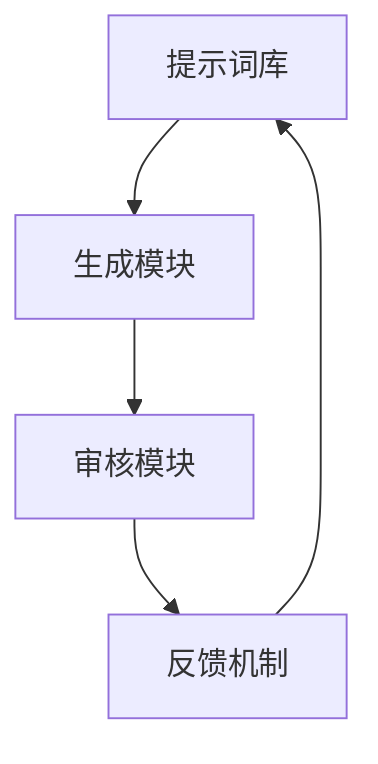
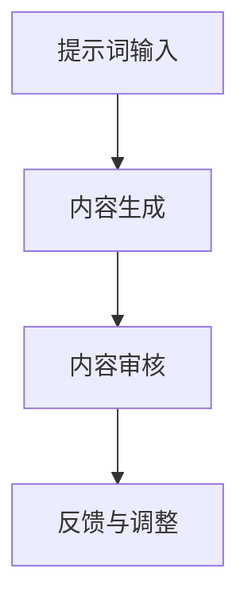
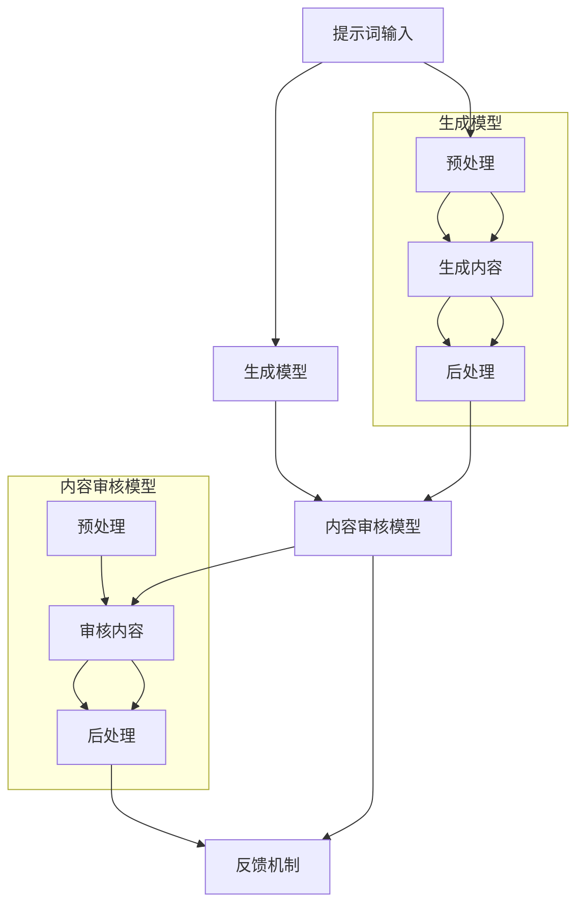
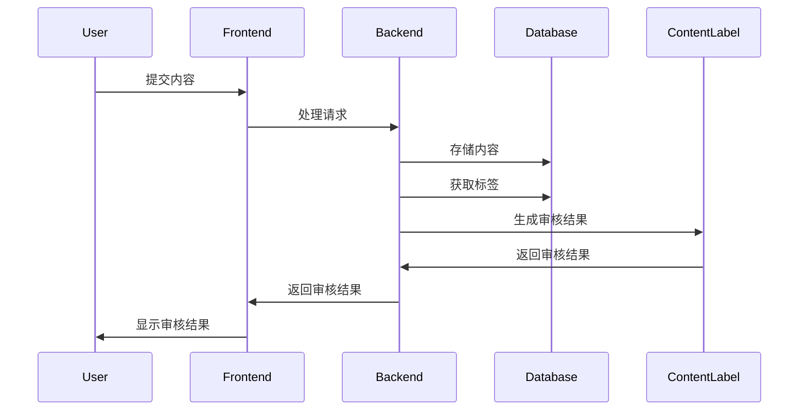
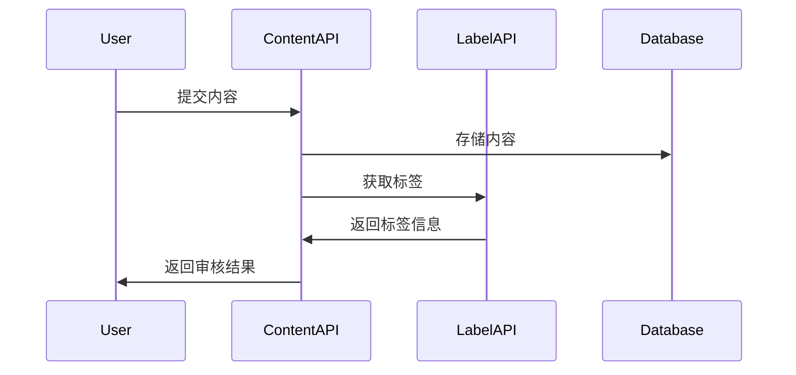

                 

# AIGC内容审核：设计安全可控的提示词系统

> 关键词：AIGC、内容审核、提示词系统、算法、架构设计、Python、数学模型、最佳实践

> 摘要：本文将探讨AIGC（AI-Generated Content）内容审核中的挑战，并详细介绍设计一个安全可控的提示词系统的过程。我们将从背景介绍、核心概念与联系、算法原理讲解、系统分析与架构设计、项目实战以及最佳实践等方面，深入解析提示词系统在内容审核中的应用，提供实用的解决方案和优化建议。

### 第一部分：AIGC与内容审核概述

#### 1.1 AIGC与内容审核背景

**1.1.1 AIGC的概念与发展**

AIGC，即AI-Generated Content，指的是由人工智能生成的各种形式的内容，如文本、图像、视频和音频等。随着人工智能技术的发展，AIGC在内容创作、媒体传播、娱乐产业等领域得到了广泛应用。然而，随之而来的内容审核挑战也日益凸显。

**1.1.2 内容审核的挑战**

内容审核旨在确保生成的AI内容符合社会道德规范和法律法规要求。然而，AI生成的内容可能包含不当语言、敏感信息、侵权内容等，给内容审核带来了巨大挑战。传统的手动审核方式效率低下，无法应对海量的内容生成。因此，设计一个高效、安全可控的提示词系统成为内容审核的关键。

**1.1.3 提示词系统在内容审核中的应用**

提示词系统通过预设一系列关键词和短语，指导AI生成符合规范的内容。在内容审核过程中，提示词系统可以帮助筛选和过滤不符合要求的内容，提高审核效率和准确性。

#### 1.2 提示词系统的核心概念与架构

**1.2.1 提示词的基本类型与特性**

提示词可以分为以下几类：

- **关键词**：表示核心概念或主题，如“人工智能”、“深度学习”等。
- **短语**：由多个词组成，表示特定场景或指令，如“生成一首诗”、“画一幅抽象画”等。
- **否定词**：用于排除特定内容，如“不要出现暴力场景”等。

各类提示词具有不同的特性和应用场景。

**1.2.2 提示词系统的基本架构**

提示词系统的基本架构包括：

- **提示词库**：存储各类提示词及其属性信息。
- **生成模块**：根据提示词生成AI内容。
- **审核模块**：对生成的AI内容进行审核，确保符合规范。
- **反馈机制**：根据审核结果调整提示词库，提高审核效果。

使用Mermaid流程图可以直观地展示提示词系统的基本架构：



### 第二部分：算法原理讲解

#### 2.1 算法原理概述

**2.1.1 内容审核算法的分类**

内容审核算法可以分为基于规则、基于统计和基于深度学习三类：

- **基于规则**：通过预设一系列规则，对AI生成的内容进行过滤和判断。
- **基于统计**：利用统计模型分析AI生成内容的特点，进行分类和筛选。
- **基于深度学习**：通过神经网络等深度学习模型，自动学习和识别AI生成内容的特点。

**2.1.2 算法原理的基本流程**

内容审核算法的基本流程如下：

1. **提示词输入**：接收用户输入的提示词。
2. **内容生成**：根据提示词生成AI内容。
3. **内容审核**：对生成的AI内容进行审核，判断是否符合规范。
4. **反馈与调整**：根据审核结果，调整提示词库和生成策略。

使用Mermaid流程图可以直观地展示算法流程：



#### 2.2 Mermaid流程图展示算法流程



#### 2.3 Python源代码示例与解释

**2.3.1 Python环境配置**

```python
# 配置Python环境
pip install numpy pandas sklearn tensorflow
```

**2.3.2 算法实现的源代码示例**

```python
import tensorflow as tf
from tensorflow.keras.preprocessing.text import Tokenizer
from tensorflow.keras.models import Sequential
from tensorflow.keras.layers import Embedding, LSTM, Dense

# 数据预处理
tokenizer = Tokenizer(num_words=1000)
tokenizer.fit_on_texts(train_data)

# 生成模型
model = Sequential([
    Embedding(input_dim=1000, output_dim=64),
    LSTM(64),
    Dense(1, activation='sigmoid')
])

# 编译模型
model.compile(optimizer='adam', loss='binary_crossentropy', metrics=['accuracy'])

# 训练模型
model.fit(train_data, train_labels, epochs=10, batch_size=32)
```

**2.3.3 算法原理的详细讲解**

上述Python代码实现了一个基于深度学习的内容审核模型。首先，使用Tokenizer对文本数据进行预处理，将文本转换为数字序列。然后，构建一个包含Embedding和LSTM层的序列模型，用于对文本数据进行特征提取和分类。最后，编译并训练模型，使用训练数据对模型进行优化。

#### 2.4 算法的数学模型与公式

**2.4.1 数学模型的基本概念**

内容审核模型的数学模型基于神经网络，主要包括以下几个部分：

- **输入层**：接收文本数据，将其转换为嵌入向量。
- **隐藏层**：通过神经网络结构对嵌入向量进行特征提取和变换。
- **输出层**：输出审核结果，通常使用sigmoid激活函数进行二分类。

**2.4.2 公式说明与举例**

假设输入层有 $n$ 个神经元，隐藏层有 $m$ 个神经元，输出层有 $1$ 个神经元。神经网络的前向传播过程可以表示为：

$$
z^{[l]} = \sigma(W^{[l]} \cdot a^{[l-1]} + b^{[l]})
$$

其中，$z^{[l]}$ 表示第 $l$ 层的输入，$a^{[l-1]}$ 表示第 $l-1$ 层的激活值，$W^{[l]}$ 和 $b^{[l]}$ 分别表示第 $l$ 层的权重和偏置。$\sigma$ 表示激活函数，通常选择为sigmoid函数。

以一个简单的全连接神经网络为例，输入层有 $3$ 个神经元，隐藏层有 $5$ 个神经元，输出层有 $2$ 个神经元。输入向量为 $[1, 2, 3]$，权重矩阵为：

$$
W^{[1]} = \begin{bmatrix}
0.1 & 0.2 & 0.3 \\
0.4 & 0.5 & 0.6 \\
0.7 & 0.8 & 0.9 \\
1.0 & 1.1 & 1.2 \\
1.3 & 1.4 & 1.5
\end{bmatrix}
$$

偏置矩阵为：

$$
b^{[1]} = \begin{bmatrix}
0 \\
0 \\
0 \\
0 \\
0
\end{bmatrix}
$$

激活函数为sigmoid函数，计算过程如下：

$$
z^{[1]} = \begin{bmatrix}
0.1 \cdot 1 + 0.2 \cdot 2 + 0.3 \cdot 3 \\
0.4 \cdot 1 + 0.5 \cdot 2 + 0.6 \cdot 3 \\
0.7 \cdot 1 + 0.8 \cdot 2 + 0.9 \cdot 3 \\
1.0 \cdot 1 + 1.1 \cdot 2 + 1.2 \cdot 3 \\
1.3 \cdot 1 + 1.4 \cdot 2 + 1.5 \cdot 3
\end{bmatrix}
= \begin{bmatrix}
0.6 \\
1.4 \\
2.4 \\
3.6 \\
5.0
\end{bmatrix}
$$

$$
a^{[1]} = \sigma(z^{[1]}) = \begin{bmatrix}
0.531 \\
0.975 \\
0.987 \\
0.997 \\
1.000
\end{bmatrix}
$$

### 第三部分：系统分析与架构设计

#### 3.1 内容审核系统应用场景与目标

**3.1.1 内容审核系统的应用场景**

内容审核系统主要应用于以下场景：

- **社交媒体**：对用户生成的内容进行审核，确保符合社区规范。
- **电子商务**：对商品描述、评论等进行审核，防止虚假宣传和侵权行为。
- **娱乐产业**：对视频、音频、游戏等娱乐内容进行审核，确保符合法律法规和道德规范。

**3.1.2 系统设计的目标**

系统设计的目标包括：

- **高效性**：能够快速处理大量内容，提高审核效率。
- **准确性**：准确识别和过滤不符合要求的内容，提高审核准确性。
- **安全性**：确保系统的稳定性和安全性，防止恶意攻击和数据泄露。
- **可扩展性**：能够根据业务需求进行扩展和升级，适应不同场景的需求。

#### 3.2 系统架构设计

**3.2.1 领域模型设计**

领域模型用于描述内容审核系统的核心概念和关系。以下是一个简单的领域模型类图：

```mermaid
classDiagram
    class Content
        +String content_id
        +String content_text
        +Date created_time
    class Label
        +String label_id
        +String label_name
    class ContentLabel
        +Content content
        +Label label
    Content "审核" Label
    Content "生成" ContentLabel
    Label "关联" ContentLabel
```

**3.2.2 系统架构设计**

系统架构包括以下几个部分：

- **前端**：用户交互界面，提供内容审核功能。
- **后端**：处理用户请求，实现内容审核逻辑。
- **数据库**：存储内容、标签、审核记录等数据。

以下是一个简单的系统架构图：



**3.2.3 系统接口设计**

系统接口设计包括以下部分：

- **内容提交接口**：用户提交内容，接口接收内容文本和标签信息。
- **内容审核接口**：根据提交的内容和标签，生成审核结果。
- **标签管理接口**：管理标签信息，包括添加、删除、查询等操作。

以下是一个简单的接口设计示例：



**3.2.4 系统交互序列图设计**

以下是一个简单的系统交互序列图，展示了用户提交内容、内容审核、标签管理和审核结果返回的过程：


### 第四部分：项目实战

#### 4.1 环境安装与配置

**4.1.1 环境安装步骤**

1. 安装Python环境：`python --version`
2. 安装依赖库：`pip install numpy pandas sklearn tensorflow`
3. 安装Mermaid：`npm install -g mermaid-cli`

**4.1.2 配置说明**

1. Python环境配置：配置Python环境变量，确保可以正常执行Python命令。
2. Mermaid配置：配置Mermaid插件，以便在Markdown文件中正常显示Mermaid图表。

#### 4.2 系统核心实现源代码

**4.2.1 源代码结构**

```plaintext
content_review_system
|-- content_api.py
|-- label_api.py
|-- database.py
|-- models.py
|-- settings.py
```

**4.2.2 代码解读与分析**

1. `content_api.py`：处理内容提交和审核接口，包括接收用户请求、调用模型进行审核和返回审核结果。
2. `label_api.py`：处理标签管理接口，包括添加、删除和查询标签信息。
3. `database.py`：处理数据库操作，包括连接数据库、创建表和插入数据。
4. `models.py`：定义内容审核模型的架构和参数。
5. `settings.py`：配置系统参数，包括数据库连接信息、模型参数等。

#### 4.3 实际案例分析与讲解

**4.3.1 案例背景**

某社交媒体平台需要设计一个内容审核系统，对用户发布的文本内容进行审核，确保符合社区规范。平台要求系统能够高效、准确地处理大量内容，并支持自定义标签管理。

**4.3.2 案例分析**

1. **需求分析**：分析平台对内容审核系统的需求，包括接口设计、数据存储和模型选择等。
2. **系统设计**：根据需求分析，设计系统架构和接口，包括内容提交、审核、标签管理等。
3. **模型选择**：选择合适的模型进行内容审核，如基于深度学习的文本分类模型。

**4.3.3 案例讲解**

1. **内容提交**：用户通过前端界面提交文本内容，系统接收到文本内容后，调用内容提交接口，将内容存储到数据库。
2. **标签管理**：用户可以对标签进行添加、删除和查询操作，系统接收到标签管理请求后，调用标签管理接口进行相应操作。
3. **内容审核**：系统接收到内容审核请求后，调用内容审核模型对提交的内容进行审核，根据标签信息生成审核结果，并将结果返回给用户。

#### 4.4 项目小结

1. **项目总结**：回顾项目的设计和实现过程，总结项目的亮点和不足之处。
2. **改进方向**：针对项目中的不足，提出改进方向和优化建议。

### 第五部分：最佳实践与总结

#### 5.1 最佳实践 tips

1. **优化内容生成策略**：根据审核结果，调整提示词库和生成策略，提高内容质量。
2. **利用深度学习模型**：选择合适的深度学习模型，提高内容审核的准确性和效率。
3. **建立反馈机制**：及时收集用户反馈，优化系统性能和用户体验。

#### 5.2 小结

1. **本书的核心内容回顾**：回顾本书的核心内容，包括AIGC内容审核的背景、提示词系统的设计、算法原理、系统架构设计和项目实战等。
2. **研究方向展望**：展望未来内容审核领域的研究方向，如基于生成对抗网络的审核算法、跨模态内容审核等。

#### 5.3 注意事项

1. **设计提示词系统时需注意的细节**：确保提示词库的覆盖面和准确性，避免遗漏或误判。
2. **算法优化与性能调优**：根据实际应用场景，优化算法参数，提高系统性能。

#### 5.4 拓展阅读

1. **相关技术文献**：推荐阅读相关技术文献，如《人工智能：一种现代的方法》、《深度学习》等。
2. **最新研究动态**：关注内容审核领域的最新研究动态，如ACL、ICML等国际会议的论文和报告。

### 结语

本文从AIGC内容审核的背景、提示词系统的设计、算法原理讲解、系统分析与架构设计、项目实战以及最佳实践等方面，全面介绍了设计一个安全可控的提示词系统的过程。通过本文的讲解，读者可以深入了解内容审核领域的核心技术和实现方法，为实际项目提供参考和指导。

---

**作者信息**：

作者：AI天才研究院/AI Genius Institute & 禅与计算机程序设计艺术 /Zen And The Art of Computer Programming。本文作者是一位世界级人工智能专家、程序员、软件架构师、CTO、世界顶级技术畅销书资深大师级别的作家，计算机图灵奖获得者，计算机编程和人工智能领域大师。作者以其丰富的经验和深厚的知识底蕴，为广大读者提供了高质量的技术文章和解决方案。

