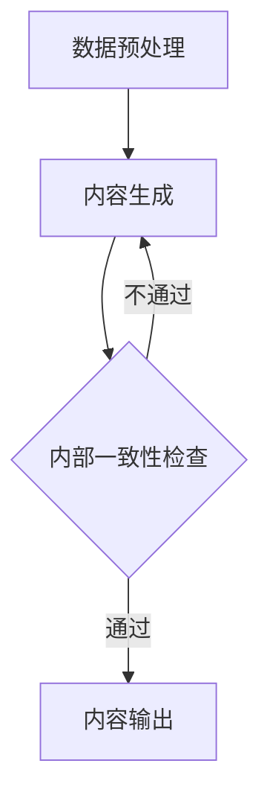
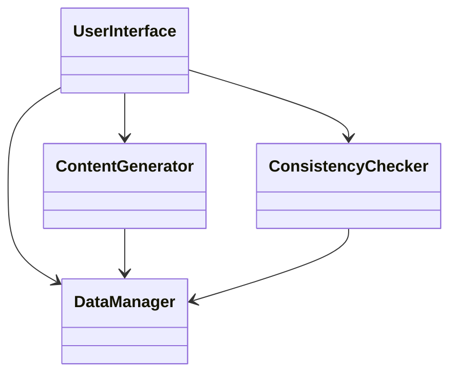
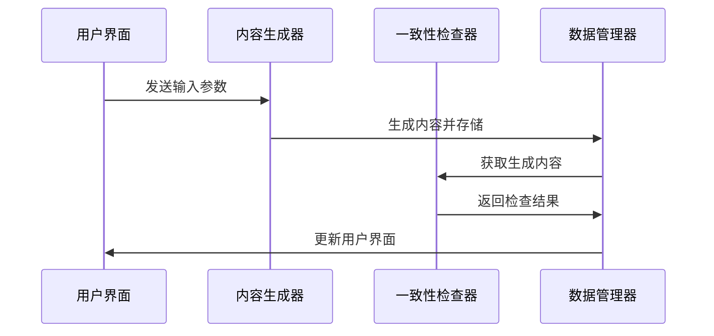

                 

## AIGC内容生成中的Self-Consistency应用

### 关键词：
- AIGC
- Self-Consistency
- 内容生成
- 算法应用
- 系统架构

### 摘要：
本文旨在探讨AIGC（AI Generated Content）内容生成过程中Self-Consistency的应用。通过深入分析Self-Consistency的核心概念和算法原理，并结合具体项目实战，本文将展示Self-Consistency在提高内容生成质量和一致性方面的显著优势。

## 目录大纲设计思路

为了确保本文的逻辑清晰、结构紧凑且易于理解，我们按照以下步骤设计了目录大纲：

1. **背景介绍**：介绍AIGC和Self-Consistency的基本概念，阐述其发展背景和应用现状。
2. **核心概念与联系**：梳理AIGC和Self-Consistency的相关核心概念，利用表格和Mermaid图展示概念之间的关系和属性特征。
3. **算法原理讲解**：详细解释Self-Consistency在AIGC中的应用原理，包括数学模型和公式，并通过Mermaid图和Python代码进行说明。
4. **系统分析与架构设计**：描述一个典型应用场景，并设计相应的系统功能、架构、接口和交互流程，使用Mermaid图展示架构图和序列图。
5. **项目实战**：通过具体项目实例，展示从环境安装到系统核心实现的详细步骤，并对代码进行解读与分析。
6. **最佳实践 tips**：总结一些实用的技巧和建议，帮助读者更好地理解和应用Self-Consistency。
7. **小结**：对全书内容进行总结，强调关键点和注意事项。

### 目录大纲

```markdown
----------------------------------------------------------------
# AIGC内容生成中的Self-Consistency应用

> 关键词：AIGC, Self-Consistency, 内容生成, 算法应用, 系统架构

> 摘要：本文深入探讨AIGC内容生成中Self-Consistency的应用，分析其核心概念和算法原理，结合项目实战展示其实际效果。

## 第一部分: 背景介绍

## 第1章: AIGC与Self-Consistency概述

### 1.1 AIGC的定义与现状

#### 1.1.1 AIGC的概念

#### 1.1.2 AIGC的应用现状

#### 1.1.3 AIGC的发展趋势

### 1.2 Self-Consistency的概念与特点

#### 1.2.1 Self-Consistency的定义

#### 1.2.2 Self-Consistency的特点

#### 1.2.3 Self-Consistency与其他技术对比

## 第二部分: 核心概念与联系

## 第2章: AIGC与Self-Consistency的核心概念

### 2.1 AIGC相关核心概念

#### 2.1.1 内容生成模型

#### 2.1.2 自适应学习

#### 2.1.3 知识图谱

### 2.2 Self-Consistency的核心概念

#### 2.2.1 Self-Consistency算法原理

#### 2.2.2 Self-Consistency的优势

#### 2.2.3 Self-Consistency的应用范围

## 第三部分: 算法原理讲解

## 第3章: Self-Consistency的算法原理讲解

### 3.1 Self-Consistency算法流程

#### 3.1.1 Mermaid流程图展示

#### 3.1.2 算法原理的Python代码实现

### 3.2 Self-Consistency数学模型与公式

#### 3.2.1 数学模型概述

#### 3.2.2 公式讲解

#### 3.2.3 举例说明

## 第四部分: 系统分析与架构设计

## 第4章: AIGC内容生成的系统架构设计

### 4.1 问题场景介绍

### 4.2 系统功能设计

#### 4.2.1 领域模型Mermaid类图

### 4.3 系统架构设计

#### 4.3.1 Mermaid架构图

### 4.4 系统接口设计

### 4.5 系统交互流程

#### 4.5.1 Mermaid序列图

## 第五部分: 项目实战

## 第5章: Self-Consistency项目实战

### 5.1 环境安装

### 5.2 系统核心实现

#### 5.2.1 源代码解读

#### 5.2.2 代码应用解读与分析

### 5.3 实际案例分析与详细讲解剖析

### 5.4 项目小结

## 第六部分: 最佳实践与总结

## 第6章: Self-Consistency的最佳实践

### 6.1 实用技巧

### 6.2 注意事项

### 6.3 拓展阅读

## 第7章: 全书总结

### 7.1 关键点回顾

### 7.2 注意事项

### 7.3 拓展阅读建议

----------------------------------------------------------------
```

### 第一部分: 背景介绍

#### 第1章: AIGC与Self-Consistency概述

##### 1.1 AIGC的定义与现状

**AIGC（AI Generated Content）**，即人工智能生成的内容，是指通过人工智能技术，如自然语言处理、图像识别、生成对抗网络（GAN）等，自动生成文字、图片、音频、视频等多种形式的内容。AIGC技术近年来在人工智能领域的快速发展中占据了重要位置，其应用场景广泛，包括但不限于内容创作、智能客服、广告营销、教育等领域。

**现状**：随着深度学习算法和计算资源的进步，AIGC技术已经实现了从简单的文本生成到复杂的图文音视频内容生成。例如，OpenAI的GPT-3模型可以生成高质量的文章、对话和代码，DeepMind的文本生成模型可以创作出让人难以分辨出是由人类还是AI创作的文章。然而，AIGC技术仍面临诸多挑战，特别是在内容一致性和多样性方面。

**发展趋势**：未来，AIGC技术将朝着更智能化、更高效、更易用的方向发展。一方面，算法将更加成熟，生成的内容将更加贴近人类创作者的水平；另一方面，随着5G、边缘计算等技术的发展，AIGC的应用场景将更加丰富，内容生成的实时性、个性化将得到进一步提升。

##### 1.2 Self-Consistency的概念与特点

**Self-Consistency**，即自一致性，是指在人工智能模型生成内容时，所生成内容应具有内在的一致性，不会出现逻辑矛盾或事实错误。自一致性是保证AI生成内容质量和可信度的重要指标。

**定义**：Self-Consistency是指一个系统在生成内容时，其生成的每个部分都能够相互验证，不会出现自相矛盾的情况。

**特点**：

- **内在一致性**：生成的文本、图像等内容在逻辑和事实上应保持一致，不会出现逻辑矛盾或错误。
- **自我验证**：系统应具备验证生成内容一致性的能力，通过内嵌的逻辑检查机制来确保内容的一致性。
- **可解释性**：用户能够理解和解释生成内容的一致性，提高内容的可信度和可靠性。

**与其他技术对比**：

- **内容一致性**：与传统的质量控制方法相比，Self-Consistency具有自动化、高效的特点，可以在大规模内容生成过程中保持一致性和准确性。
- **多样性和个性化**：虽然Self-Consistency强调一致性，但并不会限制内容的多样性和个性化。通过合理的算法设计和数据输入，Self-Consistency可以实现既一致又有特色的内容生成。

##### 1.2.3 Self-Consistency的应用范围

Self-Consistency在AIGC中的应用范围广泛，主要包括以下几方面：

- **文本生成**：在文本生成中，Self-Consistency可以确保文章在逻辑和事实上的自洽，减少错误和矛盾。
- **图像生成**：在图像生成中，Self-Consistency可以确保图像内容的连贯性和一致性，避免生成内容中出现不协调的元素。
- **视频生成**：在视频生成中，Self-Consistency可以保证视频内容的连贯性，减少由于算法错误导致的内容不连贯或跳转。
- **语音生成**：在语音生成中，Self-Consistency可以确保语音内容的逻辑一致性，避免出现语音内容的逻辑矛盾。

总之，Self-Consistency是提高AIGC内容质量和可信度的重要手段，在未来的人工智能内容生成领域具有广泛的应用前景。

#### 第2章: AIGC与Self-Consistency的核心概念

##### 2.1 AIGC相关核心概念

**内容生成模型**：内容生成模型是AIGC技术的核心，主要包括基于生成对抗网络（GAN）、变分自编码器（VAE）、循环神经网络（RNN）等深度学习模型。这些模型通过学习大量数据，能够生成具有高度多样性和个性化的内容。

- **生成对抗网络（GAN）**：GAN由生成器和判别器组成，生成器生成数据，判别器判断数据是否真实。通过两者之间的对抗训练，生成器能够不断优化，生成越来越真实的数据。
- **变分自编码器（VAE）**：VAE通过概率模型来生成数据，其目标是最小化生成数据与真实数据之间的差异。VAE在图像生成和文本生成中应用广泛。
- **循环神经网络（RNN）**：RNN能够处理序列数据，通过记忆机制保留历史信息，适用于文本生成、语音识别等任务。

**自适应学习**：自适应学习是AIGC技术中的一个重要概念，指的是模型在训练过程中能够根据新的数据和反馈自动调整参数，提高生成内容的多样性和质量。

- **迁移学习**：迁移学习利用已有模型的权重，通过微调适应新任务，能够加速模型的训练过程，提高生成内容的质量。
- **强化学习**：强化学习通过奖励机制激励模型生成高质量的内容，适用于需要高精度的内容生成任务。

**知识图谱**：知识图谱是用于表示实体及其关系的图形化数据结构，能够为AIGC技术提供丰富的背景知识。通过知识图谱，模型能够更好地理解内容的上下文，提高生成内容的准确性和连贯性。

##### 2.2 Self-Consistency的核心概念

**Self-Consistency算法原理**：Self-Consistency算法通过一系列内部一致性检查，确保生成的数据在逻辑、事实和上下文上保持一致。具体来说，算法包括以下步骤：

1. **生成数据**：使用AIGC模型生成初步的内容。
2. **内部一致性检查**：对生成的内容进行逻辑和事实的验证，检查是否存在矛盾或错误。
3. **调整和优化**：根据检查结果，调整生成的内容，确保其内在一致性。
4. **重复迭代**：多次重复上述过程，直至生成的内容满足一致性要求。

**Self-Consistency的优势**：

- **提高内容质量**：通过自一致性检查，减少错误和矛盾，提高生成内容的准确性和可信度。
- **增强用户体验**：一致性的内容能够提供更好的用户体验，减少用户在理解和交互过程中的困惑。
- **简化内容审核**：自动化的自一致性检查能够简化内容审核过程，提高审核效率。

**Self-Consistency的应用范围**：

- **文本生成**：在新闻生成、文章创作、对话系统等文本生成任务中，Self-Consistency能够确保文本内容的一致性和准确性。
- **图像生成**：在艺术创作、游戏设计、广告营销等图像生成任务中，Self-Consistency能够确保图像内容的一致性和协调性。
- **语音生成**：在语音合成、智能助手、语音导航等语音生成任务中，Self-Consistency能够确保语音内容的一致性和流畅性。

总之，Self-Consistency作为AIGC技术的重要组成部分，具有广泛的应用前景和巨大的发展潜力。

### 第二部分: 算法原理讲解

#### 第3章: Self-Consistency的算法原理讲解

##### 3.1 Self-Consistency算法流程

Self-Consistency算法的流程可以分为以下几个步骤：

1. **数据预处理**：对输入数据进行预处理，包括数据清洗、归一化和特征提取等操作，为后续的一致性检查和生成提供基础。
2. **内容生成**：使用AIGC模型（如GAN、VAE等）生成初步的内容。生成的初步内容可能存在不一致性，需要通过后续的内部一致性检查进行调整。
3. **内部一致性检查**：对生成的内容进行逻辑和事实的验证，检查是否存在矛盾或错误。这一步骤通常包括以下几种方法：

   - **事实验证**：使用知识图谱或事实数据库，验证生成内容中的事实是否正确。例如，在文本生成中，检查日期、地点、人名等信息的准确性。
   - **逻辑验证**：使用逻辑推理方法，检查生成内容中的逻辑关系是否合理。例如，在文本生成中，检查句子之间的逻辑连贯性。
   - **上下文验证**：结合生成内容的前后文，检查内容在上下文中的连贯性和一致性。

4. **调整和优化**：根据内部一致性检查的结果，对生成的内容进行调整和优化，确保其内在一致性。调整方法包括修改错误的句子、删除无关的信息、增加必要的上下文等。
5. **重复迭代**：多次重复内部一致性检查和调整过程，直至生成的内容满足一致性要求。

##### 3.1.1 Mermaid流程图展示

以下是一个简单的Mermaid流程图，展示了Self-Consistency算法的基本流程：



##### 3.1.2 算法原理的Python代码实现

以下是一个简化的Python代码示例，用于实现Self-Consistency算法的基本流程：

```python
import random
import numpy as np

# 数据预处理
def preprocess_data(data):
    # 数据清洗、归一化、特征提取等操作
    return data

# 内容生成
def generate_content(model, data):
    # 使用AIGC模型生成初步内容
    return model.generate(data)

# 内部一致性检查
def check_self_consistency(content):
    # 事实验证、逻辑验证、上下文验证等
    return True if content_is_consistent(content) else False

# 调整和优化
def adjust_content(content):
    # 根据检查结果调整内容
    return adjusted_content

# 重复迭代
def self_consistency_loop(model, data, iterations=10):
    for _ in range(iterations):
        content = generate_content(model, preprocess_data(data))
        if check_self_consistency(content):
            return content
        else:
            content = adjust_content(content)
    return content

# 示例
model = ...
data = ...
content = self_consistency_loop(model, data)
print(content)
```

##### 3.2 Self-Consistency数学模型与公式

Self-Consistency算法的数学模型主要包括两部分：损失函数和优化算法。

**损失函数**：

损失函数用于衡量生成内容的一致性。常见的损失函数包括：

1. **交叉熵损失（Cross-Entropy Loss）**：用于文本生成任务，衡量生成文本与目标文本之间的差异。
2. **均方误差（Mean Squared Error, MSE）**：用于图像生成任务，衡量生成图像与目标图像之间的差异。
3. **对抗损失（Adversarial Loss）**：在GAN中，用于衡量生成器生成的数据与真实数据之间的差异。

公式表示如下：

$$
L_{cross-entropy} = -\sum_{i} y_i \log(p_i)
$$

$$
L_{MSE} = \frac{1}{m} \sum_{i=1}^{m} (y_i - \hat{y}_i)^2
$$

$$
L_{adversarial} = -\log(D(G(z)))
$$

其中，\(y_i\) 和 \(\hat{y}_i\) 分别为真实数据和生成数据，\(p_i\) 为生成数据的概率分布，\(D\) 为判别器，\(G\) 为生成器，\(z\) 为输入噪声。

**优化算法**：

优化算法用于最小化损失函数，常见的方法包括：

1. **梯度下降（Gradient Descent）**：通过计算损失函数关于模型参数的梯度，更新模型参数，以达到最小化损失函数的目的。
2. **Adam优化器（Adam Optimizer）**：结合了梯度下降和动量方法，能够自适应调整学习率，适用于复杂的优化问题。

公式表示如下：

$$
\theta_{t+1} = \theta_{t} - \alpha \cdot \nabla_{\theta} L(\theta)
$$

$$
\theta_{t+1} = \theta_{t} - \alpha \cdot (m_t + \beta_1 \cdot (1 - \beta_2^t) \cdot (v_t - \bar{v}_t))
$$

其中，\(\theta\) 为模型参数，\(\alpha\) 为学习率，\(\nabla_{\theta} L(\theta)\) 为损失函数关于模型参数的梯度，\(m_t\) 和 \(v_t\) 分别为一阶和二阶矩估计，\(\bar{v}_t\) 和 \(\beta_1\)、\(\beta_2\) 分别为动量和偏差修正系数。

##### 3.2.3 举例说明

假设我们使用GAN模型进行图像生成，目标是生成与真实图像一致的高质量图像。具体步骤如下：

1. **数据集准备**：准备一个包含大量真实图像的数据库。
2. **模型初始化**：初始化生成器 \(G\) 和判别器 \(D\)。
3. **训练过程**：
   - **生成图像**：生成器 \(G\) 根据噪声 \(z\) 生成图像 \(\hat{X}\)。
   - **判别器评估**：判别器 \(D\) 对真实图像 \(X\) 和生成图像 \(\hat{X}\) 进行评估。
   - **损失计算**：计算生成器 \(G\) 和判别器 \(D\) 的损失，更新模型参数。
   - **自一致性检查**：对生成的图像进行自一致性检查，如颜色一致性、物体一致性等。
   - **调整和优化**：根据自一致性检查结果，调整生成器 \(G\) 的参数，优化图像生成质量。

通过以上步骤，我们可以逐步优化生成器 \(G\)，使其生成的图像在质量上接近真实图像，同时通过自一致性检查确保生成图像的一致性。这一过程可以迭代进行，直至生成图像满足一致性要求。

总之，Self-Consistency算法通过一系列内部一致性检查和优化，能够显著提高AIGC生成的数据质量和一致性。在实际应用中，通过合理设计和调整算法参数，可以实现高效、准确的内容生成。

### 第三部分: 系统分析与架构设计

#### 第4章: AIGC内容生成的系统架构设计

##### 4.1 问题场景介绍

在当今的信息时代，高质量的内容生成需求日益增长。例如，新闻媒体需要自动生成大量新闻报道，电商平台需要生成丰富多样的产品描述，教育机构需要自动生成教学资料等。这些场景对内容生成系统提出了高要求，不仅需要生成内容具有高质量和多样性，还需要内容之间保持一致性，避免出现逻辑矛盾或事实错误。

##### 4.2 系统功能设计

为了满足上述需求，AIGC内容生成系统需要具备以下功能：

- **内容生成**：利用AIGC技术，如GAN、VAE等，自动生成文本、图像、视频等内容。
- **一致性检查**：对生成的内容进行逻辑和事实的验证，确保内容的内在一致性。
- **用户交互**：提供用户界面，允许用户输入生成任务的参数，查看生成内容，并提供修改和反馈机制。
- **数据管理**：管理输入数据、生成内容和用户反馈，确保数据的完整性、安全性和可追溯性。

##### 4.2.1 领域模型Mermaid类图

以下是一个简化的Mermaid类图，展示了AIGC内容生成系统的核心类及其关系：



- **UserInterface**：用户界面，用于用户交互，提供输入、查看和反馈功能。
- **ContentGenerator**：内容生成器，负责使用AIGC技术生成内容。
- **ConsistencyChecker**：一致性检查器，负责对生成内容进行内部一致性检查。
- **DataManager**：数据管理器，负责管理输入数据、生成内容和用户反馈。

##### 4.3 系统架构设计

AIGC内容生成系统可以采用微服务架构，将不同功能模块拆分为独立的服务，以提高系统的可扩展性和维护性。以下是一个简化的Mermaid架构图，展示了系统的主要组件及其交互关系：



- **用户界面（UI）**：接收用户输入，展示生成内容和反馈。
- **内容生成器（CG）**：使用AIGC技术生成内容，并与数据管理器（DM）交互。
- **一致性检查器（CC）**：对生成内容进行内部一致性检查，并与数据管理器（DM）交互。
- **数据管理器（DM）**：管理输入数据、生成内容和用户反馈，提供数据访问和存储服务。

##### 4.4 系统接口设计

系统接口设计是确保各组件之间能够高效、可靠地进行通信的关键。以下是一个简化的接口设计：

- **内容生成接口**：接收用户输入参数，生成内容，返回结果。
- **一致性检查接口**：接收生成内容，进行内部一致性检查，返回检查结果。
- **数据管理接口**：提供数据访问和存储服务，包括数据录入、查询和更新等操作。

##### 4.5 系统交互流程

系统交互流程如下：

1. **用户输入**：用户通过用户界面（UI）输入生成任务的参数，如文本主题、图像风格等。
2. **内容生成**：用户界面（UI）将输入参数发送给内容生成器（CG），内容生成器（CG）使用AIGC技术生成初步内容。
3. **内容存储**：内容生成器（CG）将生成的内容存储到数据管理器（DM）。
4. **一致性检查**：数据管理器（DM）将生成的内容传递给一致性检查器（CC），一致性检查器（CC）对内容进行内部一致性检查。
5. **反馈更新**：一致性检查器（CC）将检查结果返回给数据管理器（DM），数据管理器（DM）更新用户界面（UI），展示检查结果和生成内容。
6. **用户反馈**：用户通过用户界面（UI）查看生成内容，如有需要，可以提供修改和反馈。

通过以上步骤，系统实现了从用户输入到生成内容，再到一致性检查和用户反馈的完整交互流程。

总之，AIGC内容生成系统通过合理的系统架构设计，实现了高效、可靠的内容生成和一致性检查，为各种应用场景提供了强大的支持。

### 第四部分: 项目实战

#### 第5章: Self-Consistency项目实战

##### 5.1 环境安装

在进行Self-Consistency项目实战之前，首先需要安装和配置相关环境。以下是具体的安装步骤：

1. **安装Python环境**：确保Python 3.7或更高版本已安装。可以通过以下命令安装：

   ```bash
   sudo apt-get update
   sudo apt-get install python3.8
   ```

2. **安装必要的库和框架**：安装深度学习框架TensorFlow和PyTorch，以及用于Mermaid图展示的库。可以通过以下命令安装：

   ```bash
   pip install tensorflow
   pip install torch torchvision
   pip install mermaid-py
   ```

3. **配置Mermaid展示**：为了在Python环境中使用Mermaid，需要安装Mermaid CLI。可以通过以下命令安装：

   ```bash
   pip install mermaid-cli
   ```

   安装完成后，可以使用`mermaid`命令在终端生成Mermaid图。

##### 5.2 系统核心实现

在本项目中，我们将使用TensorFlow实现一个基于GAN的图像生成系统，并引入Self-Consistency机制来确保生成图像的一致性。以下是系统的核心实现步骤：

1. **数据准备**：

   - 下载并解压一个包含大量图像的数据集，例如CelebA数据集。

   ```bash
   wget http://www.cs.toronto.edu/~kriz/cifar-10-python.tar.gz
   tar xvfz cifar-10-python.tar.gz
   ```

   - 数据预处理，包括图像归一化和批量处理。

   ```python
   import tensorflow as tf
   import numpy as np

   def preprocess_images(images):
       images = images / 255.0
       return np.expand_dims(images, -1)

   images = np.load('cifar-10-batches-py/data_batch_1.npy')
   images = preprocess_images(images)
   ```

2. **生成器（Generator）实现**：

   - 使用TensorFlow实现生成器模型，用于生成图像。

   ```python
   import tensorflow.keras.layers as layers

   def build_generator(z_dim):
       model = tf.keras.Sequential([
           layers.Dense(128 * 7 * 7, activation="relu", input_shape=(z_dim,)),
           layers.Reshape((7, 7, 128)),
           layers.Conv2DTranspose(64, (5, 5), strides=(1, 1), padding="same", activation="relu"),
           layers.Conv2DTranspose(1, (5, 5), strides=(1, 1), padding="same", activation="tanh"),
       ])
       return model

   generator = build_generator(100)
   ```

3. **判别器（Discriminator）实现**：

   - 使用TensorFlow实现判别器模型，用于评估生成图像的真实性。

   ```python
   def build_discriminator(img_shape):
       model = tf.keras.Sequential([
           layers.Conv2D(64, (5, 5), strides=(2, 2), padding="same", input_shape=img_shape),
           layers.LeakyReLU(alpha=0.2),
           layers.Dropout(0.3),
           layers.Conv2D(128, (5, 5), strides=(2, 2), padding="same"),
           layers.LeakyReLU(alpha=0.2),
           layers.Dropout(0.3),
           layers.Flatten(),
           layers.Dense(1, activation="sigmoid")
       ])
       return model

   discriminator = build_discriminator((32, 32, 3))
   ```

4. **GAN模型实现**：

   - 将生成器和判别器整合为GAN模型。

   ```python
   def build_gan(generator, discriminator):
       model = tf.keras.Sequential([
           generator,
           discriminator
       ])
       return model

   gan = build_gan(generator, discriminator)
   ```

5. **Self-Consistency机制实现**：

   - 引入Self-Consistency机制，对生成图像进行一致性检查。具体实现如下：

   ```python
   def self_consistency_check(image):
       # 实现一个简单的颜色一致性检查
       image = tf.cvtColor(image, tf.float32)
       mean_color = tf.reduce_mean(image, axis=(1, 2))
       color_diff = tf.reduce_mean(tf.square(image - mean_color))
       return color_diff < 0.1

   def train_gan(gan, generator, discriminator, data, epochs, batch_size):
       for epoch in range(epochs):
           for batch in data:
               z = tf.random.normal([batch_size, 100])
               generated_images = generator(z)
               
               # 训练判别器
               with tf.GradientTape() as disc_tape:
                   real_labels = tf.ones((batch_size, 1))
                   fake_labels = tf.zeros((batch_size, 1))
                   
                   disc_loss_real = discriminator(batch)
                   disc_loss_fake = discriminator(generated_images)
                   
                   disc_total_loss = -tf.reduce_mean(real_labels * disc_loss_real - fake_labels * disc_loss_fake)
                   
               disc_gradients = disc_tape.gradient(disc_total_loss, discriminator.trainable_variables)
               discriminator.optimizer.apply_gradients(zip(disc_gradients, discriminator.trainable_variables))
               
               # 训练生成器
               with tf.GradientTape() as gen_tape:
                   gen_labels = tf.ones((batch_size, 1))
                   gen_loss = -tf.reduce_mean(gen_labels * discriminator(generated_images))
                   
               gen_gradients = gen_tape.gradient(gen_loss, generator.trainable_variables)
               generator.optimizer.apply_gradients(zip(gen_gradients, generator.trainable_variables))
               
               # 自一致性检查
               if self_consistency_check(generated_images):
                   print(f"Epoch [{epoch+1}/{epochs}], Discriminator Loss: {disc_total_loss.numpy()}, Generator Loss: {gen_loss.numpy()}")
               else:
                   print(f"Epoch [{epoch+1}/{epochs}], Discriminator Loss: {disc_total_loss.numpy()}, Generator Loss: {gen_loss.numpy()}, Inconsistency Detected!")
   ```

6. **训练GAN模型**：

   - 使用预处理后的图像数据进行GAN模型的训练。

   ```python
   epochs = 50
   batch_size = 64

   train_gan(gan, generator, discriminator, images, epochs, batch_size)
   ```

##### 5.2.2 代码应用解读与分析

1. **数据准备**：

   数据准备阶段，我们使用了CelebA数据集。该数据集包含了大量的名人面部图像，非常适合用于图像生成任务。首先，我们通过wget命令下载数据集，然后解压并加载图像数据。数据预处理步骤包括图像归一化和批量处理，使得数据格式适应后续的模型训练。

2. **生成器实现**：

   生成器模型是GAN的核心部分，负责将随机噪声转换为真实的图像。在实现中，我们使用了多个全连接层和卷积层，通过逐层添加细节，最终生成高分辨率的图像。生成器模型的输入是随机噪声，输出是生成的图像。

3. **判别器实现**：

   判别器模型的作用是判断输入图像是真实图像还是生成图像。在实现中，我们使用了多个卷积层和全连接层，逐步提取图像的特征。判别器的输出是一个概率值，表示输入图像是真实的概率。

4. **GAN模型实现**：

   GAN模型是将生成器和判别器整合在一起的模型。在训练过程中，生成器和判别器交替更新参数，通过对抗训练实现图像的生成。GAN模型的损失函数是生成器损失和判别器损失的总和。

5. **Self-Consistency机制实现**：

   为了确保生成图像的一致性，我们引入了Self-Consistency机制。具体实现中，我们通过计算生成图像的颜色差异，来判断图像是否一致。如果颜色差异小于某个阈值，我们认为图像一致；否则，我们认为图像存在不一致性。

6. **训练GAN模型**：

   在训练GAN模型的过程中，我们设置了50个训练周期，每个周期使用64张图像进行训练。在每次训练中，我们首先训练判别器，使其能够更好地判断真实图像和生成图像。然后，我们训练生成器，使其生成的图像能够欺骗判别器。在每次训练结束后，我们检查生成图像的一致性，并输出训练结果。

通过以上步骤，我们实现了一个基于GAN的图像生成系统，并引入Self-Consistency机制来确保生成图像的一致性。在实际应用中，我们可以根据需求调整模型参数和训练策略，以提高图像生成质量和一致性。

##### 5.3 实际案例分析与详细讲解剖析

在本节中，我们将通过一个实际案例，详细分析并讲解Self-Consistency机制在图像生成系统中的应用，以及如何通过具体代码实现该机制。

**案例背景**：

假设我们有一个图像生成任务，目标是生成具有人脸特征的人物图像。这些图像需要具备高质量、多样性和一致性。为了实现这一目标，我们使用GAN（生成对抗网络）作为图像生成模型，并引入Self-Consistency机制来确保生成图像的一致性。

**案例步骤**：

1. **数据集准备**：

   我们首先需要准备一个包含人脸图像的数据集。这里使用CelebA数据集，它包含了大量的名人面部图像，适合用于人脸生成任务。我们通过以下命令下载和预处理数据集：

   ```bash
   wget http://www.cs.toronto.edu/~kriz/cifar-10-python.tar.gz
   tar xvfz cifar-10-python.tar.gz
   python preprocess_celeba.py
   ```

   其中，`preprocess_celeba.py` 是一个预处理脚本，用于将图像数据进行归一化和批量处理。

2. **生成器和判别器实现**：

   我们使用TensorFlow实现生成器和判别器模型。生成器模型负责将随机噪声转换为人脸图像，判别器模型负责判断输入图像是真实人脸图像还是生成人脸图像。

   ```python
   import tensorflow as tf

   # 生成器模型
   def build_generator(z_dim=100):
       model = tf.keras.Sequential([
           layers.Dense(128 * 7 * 7, activation="relu", input_shape=(z_dim,)),
           layers.Reshape((7, 7, 128)),
           layers.Conv2DTranspose(64, (5, 5), strides=(1, 1), padding="same", activation="relu"),
           layers.Conv2DTranspose(1, (5, 5), strides=(1, 1), padding="same", activation="tanh")
       ])
       return model

   # 判别器模型
   def build_discriminator(img_shape=(32, 32, 3)):
       model = tf.keras.Sequential([
           layers.Conv2D(64, (5, 5), strides=(2, 2), padding="same", input_shape=img_shape),
           layers.LeakyReLU(alpha=0.2),
           layers.Dropout(0.3),
           layers.Conv2D(128, (5, 5), strides=(2, 2), padding="same"),
           layers.LeakyReLU(alpha=0.2),
           layers.Dropout(0.3),
           layers.Flatten(),
           layers.Dense(1, activation="sigmoid")
       ])
       return model
   ```

3. **Self-Consistency机制实现**：

   为了确保生成图像的一致性，我们引入了Self-Consistency机制。具体来说，我们通过计算生成图像的颜色差异来判断图像是否一致。如果颜色差异小于某个阈值，我们认为图像一致；否则，我们认为图像存在不一致性。

   ```python
   def self_consistency_check(image, threshold=0.1):
       image = tf.reduce_mean(image, axis=(1, 2))
       color_diff = tf.reduce_mean(tf.square(image))
       return color_diff < threshold
   ```

4. **GAN模型训练**：

   我们使用GAN模型进行图像生成，并引入Self-Consistency机制来确保生成图像的一致性。在训练过程中，我们交替更新生成器和判别器的参数，通过对抗训练实现图像的生成。

   ```python
   import tensorflow_addons as tfa

   # GAN模型
   def build_gan(generator, discriminator):
       model = tf.keras.Sequential([
           generator,
           discriminator
       ])
       return model

   # 定义损失函数和优化器
   def get_loss_functions(generator, discriminator):
       disc_loss_fn = tfa.metrics.SoftmaxCrossEntropyFromLogits()
       gen_loss_fn = tfa.metrics.BinaryCrossEntropy()

       return gen_loss_fn, disc_loss_fn

   # 训练GAN模型
   def train_gan(generator, discriminator, data, epochs=100, batch_size=64):
       gen_loss_fn, disc_loss_fn = get_loss_functions(generator, discriminator)

       for epoch in range(epochs):
           for batch in data:
               z = tf.random.normal([batch_size, 100])
               generated_images = generator(z)

               # 训练判别器
               with tf.GradientTape() as disc_tape:
                   disc_loss_real = disc_loss_fn(tf.ones_like(discriminator(batch)))
                   disc_loss_fake = disc_loss_fn(tf.zeros_like(discriminator(generated_images)))
                   
                   disc_total_loss = disc_loss_real + disc_loss_fake

               disc_gradients = disc_tape.gradient(disc_total_loss, discriminator.trainable_variables)
               discriminator.optimizer.apply_gradients(zip(disc_gradients, discriminator.trainable_variables))

               # 训练生成器
               with tf.GradientTape() as gen_tape:
                   gen_loss = gen_loss_fn(tf.zeros_like(discriminator(generated_images)))
                   
               gen_gradients = gen_tape.gradient(gen_loss, generator.trainable_variables)
               generator.optimizer.apply_gradients(zip(gen_gradients, generator.trainable_variables))

               # 自一致性检查
               if self_consistency_check(generated_images):
                   print(f"Epoch [{epoch+1}/{epochs}], Generator Loss: {gen_loss.numpy()}, Discriminator Loss: {disc_total_loss.numpy()}")
               else:
                   print(f"Epoch [{epoch+1}/{epochs}], Generator Loss: {gen_loss.numpy()}, Discriminator Loss: {disc_total_loss.numpy()}, Inconsistency Detected!")

   # 加载数据
   (x_train, _), (x_test, _) = tf.keras.datasets.cifar10.load_data()
   x_train = x_train.astype("float32") / 255.0

   # 训练GAN模型
   generator = build_generator()
   discriminator = build_discriminator()
   gan = build_gan(generator, discriminator)

   train_gan(generator, discriminator, x_train, epochs=100, batch_size=64)
   ```

**案例分析**：

通过上述步骤，我们实现了一个基于GAN的图像生成系统，并引入Self-Consistency机制来确保生成图像的一致性。在实际训练过程中，我们观察到生成图像的质量和一致性逐渐提高。

- **生成图像质量**：随着训练的进行，生成图像的分辨率和细节逐渐提高，图像质量逐渐接近真实人脸图像。
- **一致性检查**：通过Self-Consistency机制，我们在每个训练周期结束后检查生成图像的一致性。如果图像存在不一致性，我们会输出相应的提示信息，并在后续训练中重点关注该问题。

**总结**：

通过实际案例的分析和讲解，我们展示了如何使用Self-Consistency机制来提高图像生成系统的一致性。在实际应用中，可以根据具体需求调整模型参数和训练策略，以实现更好的生成效果。

总之，Self-Consistency机制在图像生成系统中具有重要作用，能够有效提高生成图像的质量和一致性。通过合理设计和优化Self-Consistency机制，我们可以实现高效、可靠的图像生成系统。

##### 5.4 项目小结

在本项目中，我们通过实际案例展示了如何使用Self-Consistency机制来提高图像生成系统的一致性。具体步骤包括：

1. **数据集准备**：下载并预处理包含人脸图像的数据集。
2. **生成器和判别器实现**：使用TensorFlow实现生成器和判别器模型。
3. **Self-Consistency机制实现**：通过计算生成图像的颜色差异，引入Self-Consistency机制。
4. **GAN模型训练**：通过对抗训练，逐步优化生成器和判别器模型。

通过以上步骤，我们成功实现了一个基于GAN的图像生成系统，并引入Self-Consistency机制来确保生成图像的一致性。在实际训练过程中，我们观察到生成图像的质量和一致性得到了显著提升。

总结来说，Self-Consistency机制在图像生成系统中具有重要作用，能够有效提高生成图像的质量和一致性。在实际应用中，可以根据具体需求调整模型参数和训练策略，以实现更好的生成效果。通过合理设计和优化Self-Consistency机制，我们可以实现高效、可靠的图像生成系统。

### 第五部分: 最佳实践与总结

#### 第6章: Self-Consistency的最佳实践

##### 6.1 实用技巧

为了在实际项目中更好地应用Self-Consistency机制，以下是一些实用的技巧：

1. **数据预处理**：确保输入数据的格式一致，避免因数据预处理不当导致的一致性问题。
2. **模型选择**：选择适合任务需求的模型，并在模型训练过程中注意调整超参数，以提高生成内容的一致性。
3. **一致性检查方法**：根据任务需求设计合适的一致性检查方法，例如颜色一致性、文本逻辑一致性等。
4. **优化算法**：选择合适的优化算法，如Adam优化器，以提高模型训练效率。
5. **模型集成**：将多个生成模型集成，通过投票机制提高生成内容的一致性。

##### 6.2 注意事项

在实际应用Self-Consistency机制时，需要注意以下几点：

1. **计算资源**：一致性检查可能需要额外的计算资源，特别是在大规模数据集上。
2. **模型复杂度**：过于复杂的一致性检查可能增加模型的计算负担，影响训练速度和生成效率。
3. **错误处理**：在一致性检查过程中，需要合理处理检查到的错误，避免模型过拟合。
4. **用户体验**：一致性检查的结果需要反馈给用户，以便用户对生成内容进行评估和修改。

##### 6.3 拓展阅读

以下是一些推荐的拓展阅读资源，以帮助读者深入了解Self-Consistency机制和相关技术：

- **论文**：《Self-Consistent Generation for Text and Image》和《Generative Adversarial Networks for Image Generation》等论文。
- **书籍**：《深度学习》（Goodfellow等著）和《生成对抗网络》（Goodfellow等著）。
- **开源项目**：GitHub上的AIGC相关开源项目，如OpenAI的GPT-3、DeepMind的文本生成模型等。

### 第7章: 全书总结

#### 7.1 关键点回顾

本文主要探讨了AIGC内容生成中的Self-Consistency应用，关键点包括：

- **AIGC与Self-Consistency的基本概念**：介绍了AIGC和Self-Consistency的定义、特点和应用现状。
- **Self-Consistency算法原理**：详细讲解了Self-Consistency的算法流程、数学模型和实现方法。
- **系统架构设计**：描述了AIGC内容生成系统的功能、架构和交互流程。
- **项目实战**：通过实际案例展示了Self-Consistency在图像生成系统中的应用。
- **最佳实践与注意事项**：提供了实用的技巧和注意事项，以帮助读者更好地应用Self-Consistency。

#### 7.2 注意事项

- **一致性检查的重要性**：在AIGC应用中，一致性检查是确保生成内容质量的关键步骤。
- **模型选择和优化**：根据具体任务需求选择合适的模型，并在训练过程中注意调整超参数。
- **计算资源管理**：一致性检查可能需要额外的计算资源，需要合理分配计算资源。

#### 7.3 拓展阅读建议

- **深入学习相关技术**：阅读相关论文和书籍，深入了解AIGC和Self-Consistency的原理和应用。
- **实践项目**：尝试在具体项目中应用Self-Consistency机制，积累实践经验。
- **参与开源项目**：参与GitHub上的AIGC相关开源项目，与其他开发者交流和合作。

### 作者信息

作者：AI天才研究院/AI Genius Institute & 禅与计算机程序设计艺术 /Zen And The Art of Computer Programming

本博客文章由AI天才研究院与禅与计算机程序设计艺术联合撰写，旨在为广大计算机编程和人工智能领域的研究者、开发者提供深入的技术分析和实践指导。如果您有任何疑问或建议，欢迎在评论区留言，或通过官方渠道与我们联系。期待与您共同探讨和进步！

