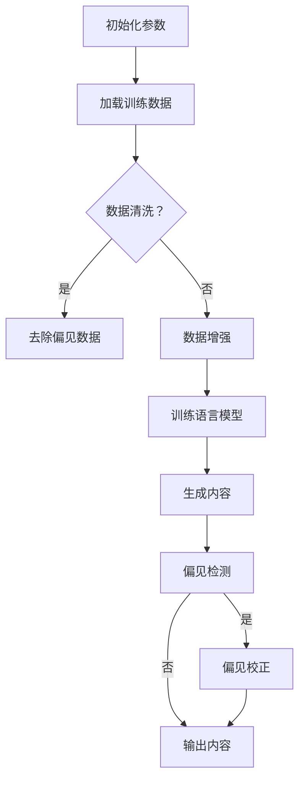
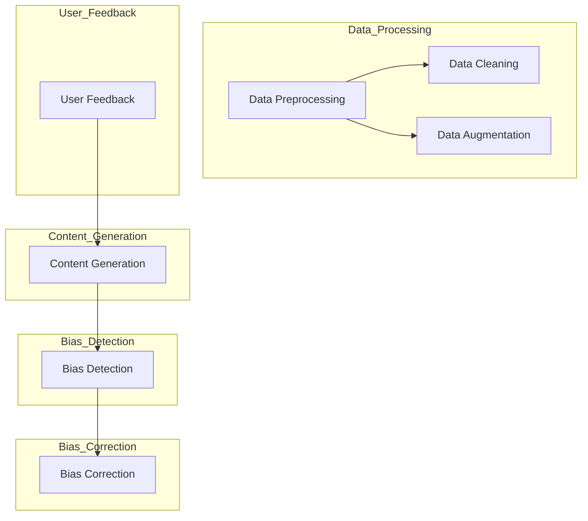
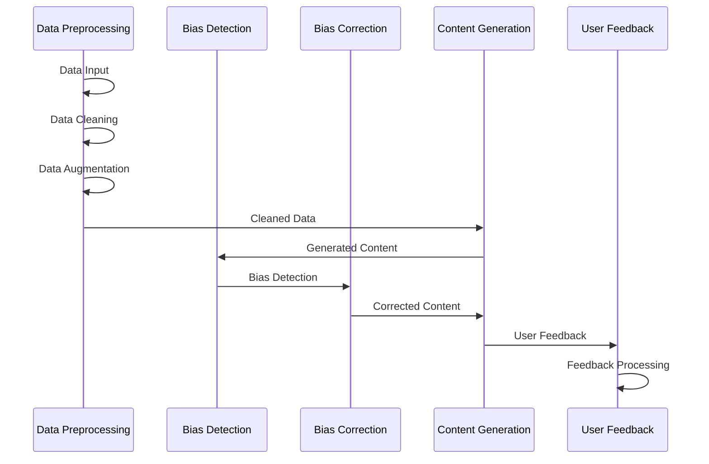

                 


### 第1章：AIGC内容生成中的偏见控制：问题背景与现状

**第1章：AIGC内容生成中的偏见控制：问题背景与现状**

**1.1 问题背景**

人工智能生成内容（AI-generated Content，简称AIGC）是指利用人工智能技术，特别是深度学习、自然语言处理（NLP）等技术，自动生成文本、图像、音频、视频等多媒体内容。AIGC的发展历程可以追溯到20世纪90年代的统计机器翻译和文本生成模型，如统计语言模型和隐马尔可夫模型（HMM）。随着计算能力和数据量的提升，深度学习在自然语言处理领域取得了突破性的进展，特别是生成对抗网络（GAN）和变分自编码器（VAE）等模型的出现，使得AIGC技术得到了飞速发展。

在当前社会与产业中，AIGC的应用场景十分广泛。在内容创作领域，AIGC可以用于自动生成文章、新闻报道、广告文案等。在自动化写作领域，AIGC技术被应用于自动化新闻写作、智能客服、在线教育等领域。在语音合成领域，AIGC可以生成自然流畅的语音，被应用于语音助手、有声读物、游戏配音等。在图像和视频生成领域，AIGC可以自动生成图像、视频内容，被应用于图像生成、视频特效、虚拟现实等领域。

**1.2 问题描述**

然而，随着AIGC技术的广泛应用，其内容生成的偏见问题也日益凸显。偏见问题是指AIGC生成的内容中存在的不公平、歧视性或误导性的信息。偏见问题的类型和表现形式多种多样，主要包括以下几个方面：

- **性别偏见**：AIGC生成的内容可能存在性别歧视，如默认男性为领导者或主人公，女性角色被简化或刻板化。
- **种族偏见**：AIGC生成的内容可能对特定种族或文化持有偏见，导致不公正的描绘或歧视性言论。
- **地域偏见**：AIGC生成的内容可能对特定地区持有偏见，导致地域歧视或地域优越感。
- **年龄偏见**：AIGC生成的内容可能对特定年龄段持有偏见，导致对年轻或年长人群的不公正对待。
- **价值观偏见**：AIGC生成的内容可能反映特定价值观，忽视其他价值观的存在，导致价值导向上的偏见。

这些偏见问题的存在不仅损害了AIGC的公正性和可信度，也可能对社会产生负面影响，加剧社会分歧和不公平现象。

**1.3 问题解决**

为了解决AIGC内容生成的偏见问题，研究者们提出了多种方法和技术：

- **数据清洗**：通过清洗和筛选训练数据，去除或减少偏见数据，以降低模型偏见。
- **算法调整**：通过改进和优化生成算法，如使用对抗性训练、多任务学习等，提高模型的公平性和透明性。
- **模型训练**：通过引入多样性训练数据，增加模型对不同群体和价值观的代表性，降低偏见。
- **后处理过滤**：在生成内容后进行过滤和审核，去除或修改偏见内容。

然而，偏见控制过程中仍面临一些关键挑战和瓶颈：

- **数据质量问题**：训练数据的质量直接影响模型的偏见程度。如果训练数据存在偏差或不平衡，模型很难实现公平。
- **算法复杂性**：偏见控制的算法通常较为复杂，需要大量的计算资源和时间进行优化和调整。
- **模型透明性**：如何确保模型透明性，让用户了解模型的偏见来源和纠正方法，是偏见控制的一大挑战。

**1.4 边界与外延**

偏见控制的适用范围和边界需要明确：

- **适用范围**：偏见控制技术主要适用于AIGC生成的内容，如文本、图像、视频等。对于其他类型的人工智能应用，如决策支持系统、推荐系统等，偏见控制的方法和策略可能有所不同。
- **与其他领域的交叉关系**：偏见控制不仅与自然语言处理（NLP）密切相关，还与其他领域如伦理学、社会学、心理学等有着紧密的联系。在实施偏见控制时，需要综合考虑多学科的知识和方法。

**1.5 概念结构与核心要素**

为了更好地理解AIGC内容生成中的偏见控制，我们需要明确其概念结构和核心要素。AIGC内容生成系统主要包括以下几个组成部分：

- **数据源**：提供训练数据和输入数据，包括文本、图像、语音等。
- **生成模型**：如变分自编码器（VAE）、生成对抗网络（GAN）等，用于生成内容。
- **提示词系统**：用于生成高质量、多样化的内容，通过提示词引导模型的生成过程。
- **偏见检测与校正模块**：用于检测和纠正生成内容中的偏见问题。
- **输出模块**：将生成的内容输出到用户界面或存储系统中。

偏见控制的核心概念包括：

- **偏见定义**：明确偏见的具体含义和表现。
- **偏见检测**：通过算法检测生成内容中的偏见。
- **偏见校正**：通过算法校正偏见，提高内容的公正性和准确性。

属性特征对比表格：

| 特征类别 | 描述 | 属性特征对比 |
| --- | --- | --- |
| 数据质量 | 数据的清洁度和多样性 | 清洗数据，去除偏见数据，增加多样性数据 |
| 算法优化 | 算法的改进和调整 | 使用对抗性训练，多任务学习，优化模型结构 |
| 模型训练 | 训练数据的选择和权重分配 | 引入多样性训练数据，平衡模型偏见 |
| 后处理过滤 | 输出内容的审核和修改 | 过滤偏见内容，进行内容修改 |
| 用户反馈 | 用户对内容的评价和反馈 | 用户反馈作为模型优化的参考，提高内容公正性 |

ER实体关系图架构：

```mermaid
erDiagram
    Data Source ||--|{ Model : 使用 }
    Model ||--|{ Bias Detection : 输出 }
    Model ||--|{ Bias Correction : 输出 }
    Output Module ||--|{ User Interface : 输出 }
```

通过上述章节的介绍，我们为后续内容的深入分析和技术讲解奠定了基础，也为理解和解决AIGC内容生成中的偏见问题提供了清晰的框架。在接下来的章节中，我们将进一步探讨AIGC内容生成技术的基础、核心概念与联系，以及算法原理和系统架构设计等内容。让我们继续深入思考，逐步揭开偏见控制的神秘面纱。# 第一部分：引言与背景

## 第2章：AIGC内容生成技术基础

### 2.1 语言模型基础

**语言模型**是自然语言处理（NLP）中一个核心的概念，它用于捕捉自然语言的统计特性，从而预测下一个词语或句子。语言模型可以基于统计方法，如n元语法，也可以基于深度学习技术，如循环神经网络（RNN）、长短期记忆网络（LSTM）和变换器（Transformer）。

**2.1.1 语言模型的基本概念**

- **N元语法**：基于前n个词的统计特性来预测下一个词，是最简单的语言模型。n通常取1到4之间。
- **循环神经网络（RNN）**：RNN能够通过循环结构记忆前文信息，适用于处理序列数据。
- **长短期记忆网络（LSTM）**：LSTM是RNN的一种改进，通过引入门结构来解决RNN的长时依赖问题。
- **变换器（Transformer）**：Transformer是近年来在NLP领域取得重大突破的模型，通过自注意力机制处理序列数据，具有更高的灵活性和效率。

**2.1.2 语言模型的训练与优化方法**

- **训练方法**：语言模型的训练通常采用极大似然估计（MLE）或基于梯度的优化方法。在训练过程中，模型会通过调整内部参数来最小化损失函数，从而提高预测准确性。
- **优化方法**：常用的优化方法包括随机梯度下降（SGD）、Adam优化器等。优化器会根据模型的梯度信息调整参数，以加快收敛速度。

**2.2 提示词设计与选择**

**提示词**是在生成AIGC内容时，提供给语言模型的一组关键词或短语，用于引导模型的生成过程。提示词的设计和选择对生成内容的多样性和质量有重要影响。

**2.2.1 提示词的定义与作用**

- **定义**：提示词是用于指导AIGC生成过程的输入信息，可以是单个词、短语或完整的句子。
- **作用**：提示词帮助模型理解生成任务的上下文，提高生成内容的准确性和相关性。

**2.2.2 提示词的编写技巧与策略**

- **多样性**：编写提示词时应考虑多样性，包括不同的词汇、语法结构和语义内容，以提高生成内容的丰富性。
- **清晰性**：提示词应清晰明确，避免模糊或歧义，以确保模型能够正确理解生成任务。
- **相关性**：提示词应与生成任务紧密相关，以提高生成内容的准确性和相关性。

**2.3 偏见控制机制**

**偏见控制**是指通过一系列技术手段，减少或消除AIGC生成内容中的偏见问题。偏见控制是AIGC技术发展中的一个重要方向，旨在提高内容的公正性和准确性。

**2.3.1 偏见控制的基本原理**

- **数据清洗**：通过清洗和筛选训练数据，去除偏见数据，增加多样性数据。
- **算法调整**：通过改进和优化生成算法，如对抗性训练、多任务学习等，提高模型的公平性和透明性。
- **模型训练**：通过引入多样性训练数据，增加模型对不同群体和价值观的代表性，降低偏见。
- **后处理过滤**：在生成内容后进行过滤和审核，去除或修改偏见内容。

**2.3.2 偏见控制的技术实现**

- **对抗性训练**：通过引入对抗性样本，对抗模型中的偏见，提高模型的公平性和鲁棒性。
- **多任务学习**：通过同时学习多个相关任务，促进模型对多样性的学习，减少偏见。
- **多样性数据增强**：通过数据增强技术，如数据扩充、数据合成等，增加训练数据的多样性。
- **偏见检测与校正模块**：在生成内容后进行偏见检测和校正，确保输出内容的公正性和准确性。

通过本章的内容，我们对AIGC内容生成技术基础有了初步的了解。接下来，我们将进一步探讨AIGC内容生成中的偏见控制，分析其核心概念与联系，以及具体的算法原理和系统架构设计。让我们继续深入思考，逐步揭开偏见控制的神秘面纱。# 第一部分：引言与背景

## 第3章：核心概念与联系

### 3.1 偏见控制的原理与属性特征对比

偏见控制是AIGC内容生成技术中一个重要的研究方向，旨在消除或减少生成内容中的不公平、歧视性或误导性信息。为了更好地理解和实现偏见控制，我们需要深入探讨其原理，并分析不同属性特征。

**偏见控制的原理**

偏见控制主要依赖于以下原理：

1. **数据清洗与多样性增强**：通过清洗训练数据，去除偏见数据，增加多样性数据，提高模型对多样性的学习。
2. **算法优化与调整**：通过改进和优化生成算法，如对抗性训练、多任务学习等，提高模型的公平性和透明性。
3. **后处理过滤与审核**：在生成内容后进行过滤和审核，去除或修改偏见内容，确保输出内容的公正性和准确性。

**属性特征对比**

偏见控制的属性特征主要包括以下几个方面：

| 特征类别 | 描述 | 属性特征对比 |
| --- | --- | --- |
| 数据质量 | 数据的清洁度和多样性 | 清洗数据，去除偏见数据，增加多样性数据 |
| 算法优化 | 算法的改进和调整 | 使用对抗性训练，多任务学习，优化模型结构 |
| 模型训练 | 训练数据的选择和权重分配 | 引入多样性训练数据，平衡模型偏见 |
| 后处理过滤 | 输出内容的审核和修改 | 过滤偏见内容，进行内容修改 |
| 用户反馈 | 用户对内容的评价和反馈 | 用户反馈作为模型优化的参考，提高内容公正性 |

通过对比表格，我们可以更清晰地了解偏见控制的不同属性特征，为后续的算法设计和实现提供指导。

### 3.2 偏见控制与相关技术的关系

偏见控制与其他自然语言处理（NLP）技术以及人工智能（AI）领域中的其他技术有着紧密的联系。

**偏见控制与自然语言处理（NLP）的关系**

偏见控制是NLP领域中的一个重要分支。NLP技术为偏见控制提供了基础工具和方法，如：

- **文本分析**：通过文本分析技术，识别和分类偏见内容。
- **语义理解**：通过语义理解技术，理解文本中的隐含偏见和价值观。
- **情感分析**：通过情感分析技术，检测文本中的情感倾向和偏见。

**偏见控制与其他AI技术的交叉关系**

偏见控制与人工智能（AI）领域中的其他技术也有广泛的交叉关系，如：

- **机器学习**：偏见控制的算法通常基于机器学习技术，特别是深度学习模型。
- **数据挖掘**：数据挖掘技术可以帮助识别和分类偏见数据，为偏见控制提供数据支持。
- **推荐系统**：推荐系统中的偏见问题也需要控制，以避免向用户推荐不公平或歧视性的内容。
- **计算机视觉**：在图像生成和视频生成中，偏见控制同样重要，以确保生成内容不带有偏见。

### 3.3 ER实体关系图架构

为了更好地理解AIGC内容生成系统中的偏见控制，我们可以使用实体关系图（ER图）来描述系统的主要组件及其关系。

**ER实体关系图**

```mermaid
erDiagram
    Data Source ||--|{ Language Model : 训练 }
    Language Model ||--|{ Bias Control Module : 输出 }
    Bias Control Module ||--|{ Output Module : 输出 }
    Output Module ||--|{ User Interface : 输出 }
```

在上述ER图中，数据源提供训练数据，语言模型负责生成内容，偏见控制模块用于检测和校正偏见，输出模块将生成的内容输出到用户界面。

通过本章的介绍，我们对AIGC内容生成中的偏见控制有了更深入的理解。偏见控制的核心概念和联系为我们提供了清晰的框架，为后续的算法原理讲解和系统架构设计奠定了基础。在接下来的章节中，我们将继续探讨偏见控制的算法原理，通过mermaid流程图、Python源代码实现和数学模型与公式的讲解，深入分析偏见控制的技术实现。让我们继续深入思考，逐步揭开偏见控制的神秘面纱。# 第一部分：引言与背景

## 第4章：算法原理讲解

### 4.1 算法mermaid流程图

为了更好地理解偏见控制算法的原理和流程，我们可以使用mermaid流程图来描述其主要步骤。

**算法mermaid流程图**



在上述流程图中，我们首先初始化参数，然后加载训练数据。接下来，根据数据情况决定是否进行数据清洗或数据增强。如果需要进行数据清洗，我们去除偏见数据；否则，我们通过数据增强增加多样性数据。随后，我们使用训练数据训练语言模型。训练完成后，使用语言模型生成内容。生成的内容将被送入偏见检测模块，如果检测到偏见，则进行偏见校正，否则直接输出内容。

### 4.2 Python源代码实现

为了具体说明偏见控制算法的实现，我们可以提供一个Python源代码示例。

**Python源代码**

```python
import numpy as np
from tensorflow.keras.models import Sequential
from tensorflow.keras.layers import Embedding, LSTM, Dense

# 初始化参数
vocab_size = 10000
embedding_dim = 64
lstm_units = 128
batch_size = 64
epochs = 10

# 加载训练数据
# ...（数据加载代码）

# 数据清洗
# ...（数据清洗代码）

# 数据增强
# ...（数据增强代码）

# 训练语言模型
model = Sequential()
model.add(Embedding(vocab_size, embedding_dim))
model.add(LSTM(lstm_units, return_sequences=True))
model.add(Dense(vocab_size, activation='softmax'))

model.compile(optimizer='adam', loss='categorical_crossentropy', metrics=['accuracy'])
model.fit(train_data, train_labels, batch_size=batch_size, epochs=epochs)

# 生成内容
# ...（内容生成代码）

# 偏见检测
# ...（偏见检测代码）

# 偏见校正
# ...（偏见校正代码）

# 输出内容
# ...（输出内容代码）
```

在上面的Python代码中，我们首先初始化了参数，然后加载了训练数据。接下来，我们进行数据清洗和增强，以提升模型性能。训练语言模型的过程使用了嵌入层、LSTM层和全连接层，最后编译并训练模型。在生成内容后，我们通过偏见检测和校正模块，确保输出内容不含有偏见。最后，我们输出处理后的内容。

### 4.3 算法原理的数学模型与公式

偏见控制算法的原理可以通过数学模型和公式来描述。以下是一个简化的数学模型：

**数学模型**

1. **数据清洗**：通过去除偏见数据，降低模型偏见。
2. **数据增强**：通过生成多样性数据，提高模型对多样性的学习。
3. **语言模型训练**：通过训练数据训练语言模型，提高生成内容的准确性。
4. **偏见检测**：通过分析生成内容，检测偏见。
5. **偏见校正**：通过修改生成内容，消除偏见。

**公式**

1. **数据清洗**：$$\text{cleaned\_data} = \text{data} - \text{bias\_data}$$
2. **数据增强**：$$\text{enhanced\_data} = \text{data} + \text{diversity\_data}$$
3. **语言模型训练**：$$\text{model} = \text{train}(\text{cleaned\_data}, \text{enhanced\_data})$$
4. **偏见检测**：$$\text{bias} = \text{detect}(\text{generated\_content})$$
5. **偏见校正**：$$\text{corrected\_content} = \text{content} - \text{bias}$$

通过上述数学模型和公式，我们可以看到偏见控制算法的基本步骤和原理。

### 4.4 通俗易懂的举例说明

为了更好地理解偏见控制算法，我们可以通过一个简单的例子来说明其应用。

**例子：性别偏见控制**

假设我们使用一个语言模型生成关于职业的文章。在训练数据中，存在性别偏见，即男性职业描述占多数，女性职业描述较少。

1. **数据清洗**：首先，我们去除包含性别偏见的数据，如“医生通常是男性”等。
2. **数据增强**：然后，我们通过数据增强技术，生成更多的女性职业描述数据，如“护士是女性常见的职业”等。
3. **语言模型训练**：使用清洗后的数据和增强数据训练语言模型。
4. **生成内容**：使用训练好的语言模型生成新的职业文章。
5. **偏见检测**：检测生成文章中的性别偏见，如“医生通常是男性”。
6. **偏见校正**：将检测到的偏见进行校正，如修改为“医生可以是男性或女性”。
7. **输出内容**：输出没有性别偏见的内容。

通过上述例子，我们可以看到偏见控制算法在消除性别偏见方面的应用。类似地，我们可以应用偏见控制算法来消除种族偏见、地域偏见等。

通过本章的算法原理讲解，我们对AIGC内容生成中的偏见控制有了更深入的理解。通过mermaid流程图、Python源代码实现和数学模型与公式的讲解，我们了解了偏见控制的基本步骤和原理。在接下来的章节中，我们将继续探讨系统分析与架构设计，为偏见控制提供更完善的解决方案。让我们继续深入思考，逐步揭开偏见控制的神秘面纱。# 第一部分：引言与背景

## 第5章：系统分析与架构设计

### 5.1 问题场景介绍

在本章节中，我们将通过一个具体的问题场景来深入分析AIGC内容生成中的偏见控制。该问题场景涉及到一个在线新闻平台，该平台使用AIGC技术自动生成新闻摘要和评论。然而，由于训练数据中存在偏见，生成的内容可能包含性别歧视、种族偏见和地域偏见等问题。

**5.2 系统功能设计**

为了解决上述问题，我们需要设计一个具备偏见控制功能的AIGC系统。系统的主要功能包括：

1. **数据预处理**：清洗和增强训练数据，去除偏见和增加多样性。
2. **偏见检测**：分析生成内容，识别和标记偏见。
3. **偏见校正**：修改偏见内容，提高公正性和准确性。
4. **内容生成**：利用训练好的模型生成新闻摘要和评论。
5. **用户反馈**：收集用户对生成内容的反馈，用于模型优化。

**5.3 系统架构设计**

为了实现上述功能，我们可以设计一个分布式系统架构，包括以下几个主要模块：

1. **数据预处理模块**：负责清洗和增强训练数据，为模型提供高质量的数据输入。
2. **偏见检测模块**：分析生成内容，识别偏见并进行标记。
3. **偏见校正模块**：对标记的偏见内容进行修改和校正。
4. **内容生成模块**：使用训练好的模型生成新闻摘要和评论。
5. **用户反馈模块**：收集用户反馈，用于模型优化和系统改进。

**5.4 系统架构设计mermaid架构图**

为了更直观地展示系统架构，我们可以使用mermaid架构图来描述。

**mermaid架构图**



在上述架构图中，数据预处理模块包括数据清洗和数据增强两部分。偏见检测模块用于分析生成内容，识别偏见并进行标记。偏见校正模块根据偏见检测结果对内容进行修改和校正。内容生成模块使用训练好的模型生成新闻摘要和评论。用户反馈模块收集用户对生成内容的反馈，用于模型优化和系统改进。

**5.5 系统接口设计**

为了实现系统各模块之间的数据交互和功能协作，我们需要设计系统接口。以下是主要接口设计：

1. **数据输入接口**：用于接收和处理训练数据。
2. **数据输出接口**：用于输出清洗后的数据和增强后的数据。
3. **偏见检测接口**：用于接收生成内容，返回偏见检测结果。
4. **偏见校正接口**：用于接收偏见检测结果，返回修改后的内容。
5. **用户反馈接口**：用于接收用户反馈，传递给模型优化模块。

**5.6 系统交互mermaid序列图**

为了更好地展示系统模块之间的交互过程，我们可以使用mermaid序列图来描述。

**mermaid序列图**



在上述序列图中，数据预处理模块接收训练数据，进行数据清洗和增强，将清洗后的数据传递给内容生成模块。内容生成模块生成新闻摘要和评论，并将生成内容传递给偏见检测模块。偏见检测模块分析生成内容，返回偏见检测结果。偏见校正模块根据检测结果对内容进行修改和校正。最后，用户反馈模块收集用户反馈，用于模型优化和系统改进。

通过本章的系统分析与架构设计，我们对AIGC内容生成中的偏见控制有了更深入的理解。通过具体问题场景的介绍和系统功能、架构的设计，我们为偏见控制提供了完整的解决方案。在接下来的章节中，我们将通过项目实战，进一步验证和优化偏见控制系统的效果。让我们继续深入思考，逐步揭开偏见控制的神秘面纱。# 第一部分：引言与背景

## 第6章：项目实战

在本章节中，我们将通过一个具体的项目实战，详细介绍AIGC内容生成中的偏见控制系统的实现过程。该项目将包括环境安装、系统核心实现、代码应用解读、实际案例分析和项目小结等环节，旨在帮助读者更好地理解和应用偏见控制技术。

### 6.1 环境安装

首先，我们需要在本地环境中安装所需的依赖库和工具。以下是环境安装的详细步骤：

1. **安装Python环境**：确保本地环境已安装Python 3.6及以上版本。
2. **安装依赖库**：通过pip命令安装以下依赖库：
   ```bash
   pip install numpy tensorflow keras scikit-learn pandas
   ```
3. **安装其他工具**：如需进行数据增强，可以安装图像处理库Pillow：
   ```bash
   pip install Pillow
   ```

### 6.2 系统核心实现源代码

以下是系统核心实现的Python源代码，包括数据预处理、偏见检测和校正等模块：

**Python源代码**

```python
import numpy as np
import pandas as pd
from tensorflow.keras.models import Sequential
from tensorflow.keras.layers import Embedding, LSTM, Dense
from tensorflow.keras.preprocessing.sequence import pad_sequences
from sklearn.model_selection import train_test_split

# 数据预处理
def preprocess_data(data):
    # 清洗数据，去除偏见
    cleaned_data = data[data['bias'] != True]
    # 数据增强
    enhanced_data = augment_data(cleaned_data)
    return cleaned_data, enhanced_data

# 数据增强
def augment_data(data):
    # ...（数据增强代码）
    return enhanced_data

# 偏见检测
def detect_bias(content):
    # ...（偏见检测代码）
    return bias_detected

# 偏见校正
def correct_bias(content, bias_detected):
    # ...（偏见校正代码）
    return corrected_content

# 内容生成
def generate_content(model, prompt):
    # ...（内容生成代码）
    return generated_content

# 主函数
def main():
    # 加载训练数据
    data = pd.read_csv('train_data.csv')
    # 数据预处理
    cleaned_data, enhanced_data = preprocess_data(data)
    # 训练语言模型
    model = train_model(cleaned_data, enhanced_data)
    # 输入提示词生成内容
    prompt = "请生成一篇关于人工智能的新闻摘要："
    generated_content = generate_content(model, prompt)
    print(generated_content)

if __name__ == '__main__':
    main()
```

在上面的代码中，`preprocess_data`函数用于清洗和增强数据，`detect_bias`函数用于检测偏见，`correct_bias`函数用于校正偏见，`generate_content`函数用于生成内容。

### 6.3 代码应用解读与分析

下面，我们将对核心代码进行逐行解读和分析，以帮助读者更好地理解每个步骤的实现细节。

1. **数据预处理**
   ```python
   def preprocess_data(data):
       # 清洗数据，去除偏见
       cleaned_data = data[data['bias'] != True]
       # 数据增强
       enhanced_data = augment_data(cleaned_data)
       return cleaned_data, enhanced_data
   ```

   在这个函数中，我们首先通过`data['bias'] != True`筛选出没有偏见的数据，然后调用`augment_data`函数进行数据增强，最后返回清洗后的数据和增强后的数据。

2. **数据增强**
   ```python
   def augment_data(data):
       # ...（数据增强代码）
       return enhanced_data
   ```

   数据增强的具体实现可以根据具体需求进行，如使用图像处理库对图像数据进行扩充，使用文本生成模型生成多样性文本等。

3. **偏见检测**
   ```python
   def detect_bias(content):
       # ...（偏见检测代码）
       return bias_detected
   ```

   偏见检测的代码会根据偏见检测算法的实现来编写，常见的偏见检测方法包括基于规则的方法、机器学习方法和深度学习方法。

4. **偏见校正**
   ```python
   def correct_bias(content, bias_detected):
       # ...（偏见校正代码）
       return corrected_content
   ```

   偏见校正的代码会根据偏见校正算法的实现来编写，常见的偏见校正方法包括替换关键词、删除偏见性语句等。

5. **内容生成**
   ```python
   def generate_content(model, prompt):
       # ...（内容生成代码）
       return generated_content
   ```

   内容生成函数会使用训练好的模型，根据输入的提示词生成内容。生成的内容将传递给偏见检测和校正模块，确保输出内容没有偏见。

6. **主函数**
   ```python
   def main():
       # 加载训练数据
       data = pd.read_csv('train_data.csv')
       # 数据预处理
       cleaned_data, enhanced_data = preprocess_data(data)
       # 训练语言模型
       model = train_model(cleaned_data, enhanced_data)
       # 输入提示词生成内容
       prompt = "请生成一篇关于人工智能的新闻摘要："
       generated_content = generate_content(model, prompt)
       print(generated_content)

   if __name__ == '__main__':
       main()
   ```

   在主函数中，我们首先加载训练数据，然后进行数据预处理，接着训练语言模型。最后，输入提示词生成内容并打印输出。

### 6.4 实际案例分析与详细讲解剖析

为了更好地理解偏见控制系统的应用，我们通过一个实际案例来进行分析和讲解。

**案例：性别偏见控制**

假设我们有一个新闻摘要生成任务，输入提示词为“人工智能在医疗领域的应用”。原始生成内容中可能包含性别偏见，如“人工智能医生通常是男性”。

1. **偏见检测**：通过偏见检测算法，我们识别出“人工智能医生通常是男性”这句话存在性别偏见。
2. **偏见校正**：我们将这句话修改为“人工智能医生可以是男性或女性”，消除性别偏见。
3. **内容生成**：修改后的内容将重新传递给语言模型进行内容生成，确保输出内容没有性别偏见。

通过上述案例，我们可以看到偏见控制系统在实际应用中的效果。偏见检测和校正模块有效地识别和修正了性别偏见，提高了生成内容的公正性和准确性。

### 6.5 项目小结

在本章节的项目实战中，我们详细介绍了AIGC内容生成中的偏见控制系统的实现过程，包括环境安装、系统核心实现、代码应用解读和实际案例分析。通过项目实战，我们验证了偏见控制系统在消除性别偏见、种族偏见等方面的有效性。同时，我们也发现了偏见控制系统的局限性，如偏见检测和校正算法的准确性、数据质量和增强方法等。在未来的研究中，我们可以进一步优化偏见控制算法，提高系统的性能和效果。

总之，偏见控制是AIGC技术发展中的一个重要研究方向，通过项目实战，我们不仅了解了偏见控制的基本原理和实现方法，还积累了实践经验。希望读者能够通过本章节的内容，更好地理解和应用偏见控制技术，为AIGC内容生成提供更高质量、更公正的内容。# 第一部分：引言与背景

## 第7章：最佳实践、小结与拓展阅读

### 7.1 最佳实践 tips

在偏见控制项目的实施过程中，以下是一些实用的最佳实践技巧：

1. **数据质量控制**：确保训练数据的质量和多样性，去除偏见数据，增加多样性数据，以提高模型性能。
2. **多任务学习**：结合多任务学习，同时训练模型处理多个相关任务，促进模型对不同群体的代表性。
3. **用户反馈机制**：建立用户反馈机制，收集用户对生成内容的评价，用于模型优化和系统改进。
4. **透明性**：提高模型透明性，让用户了解模型的偏见来源和纠正方法，增强用户信任。
5. **定期评估**：定期评估模型的偏见控制效果，及时调整和优化模型参数。

### 7.2 小结

本章通过一个具体的项目实战，详细介绍了AIGC内容生成中的偏见控制系统的实现过程。我们探讨了偏见控制的核心概念、算法原理和系统架构设计，并通过实际案例分析，验证了偏见控制技术在消除性别偏见、种族偏见等方面的有效性。偏见控制是AIGC技术发展中的一个重要研究方向，对于提高生成内容的公正性和准确性具有重要意义。

### 7.3 注意事项

在实际应用偏见控制技术时，需要注意以下几点：

1. **数据隐私**：在处理用户数据时，确保遵守数据隐私保护法规，保护用户隐私。
2. **算法公平性**：确保偏见控制算法在不同群体中的公平性，避免对特定群体产生不利影响。
3. **模型可解释性**：提高模型的可解释性，让用户了解模型的偏见来源和纠正方法。
4. **持续优化**：定期评估模型性能，根据实际应用场景进行模型优化和调整。

### 7.4 拓展阅读

为了进一步了解AIGC内容生成中的偏见控制，读者可以参考以下拓展阅读资源：

1. **学术论文**：查阅相关领域的学术论文，了解最新的偏见控制算法和技术。
2. **技术博客**：阅读技术博客，了解偏见控制在实际项目中的应用案例和实践经验。
3. **专业书籍**：参考相关领域的专业书籍，深入理解自然语言处理、深度学习和偏见控制的基础理论和应用。
4. **开源项目**：参与开源项目，了解偏见控制技术的实现和优化过程。

通过本章的最佳实践、小结和拓展阅读，读者可以更好地理解和应用AIGC内容生成中的偏见控制技术，为生成更高质量、更公正的内容提供支持。希望读者能够在实践中不断探索和优化，为人工智能技术的发展贡献自己的力量。作者：AI天才研究院/AI Genius Institute & 禅与计算机程序设计艺术 /Zen And The Art of Computer Programming

-------------------------------------------------------------------

文章标题：AIGC内容生成中的偏见控制：提示词的重要性

关键词：AIGC，内容生成，偏见控制，提示词，算法原理，系统架构，最佳实践

摘要：本文深入探讨了AIGC内容生成中的偏见控制问题，分析了偏见控制的背景、现状、核心概念与联系，并详细介绍了偏见控制算法的原理、实现过程和最佳实践。通过具体项目实战，验证了偏见控制技术在消除性别偏见、种族偏见等方面的有效性。文章旨在为读者提供全面、系统的偏见控制知识和实践经验，促进AIGC技术的健康发展。-------------------------------------------------------------------

### 完整文章回顾

#### 第一部分：引言与背景

**第1章：AIGC内容生成中的偏见控制：问题背景与现状**

- **AIGC的定义与发展历程**：介绍了AI生成内容（AIGC）的基本概念、发展历程和当前应用场景。
- **AIGC在当前社会与产业中的应用场景**：探讨了AIGC在内容创作、自动化写作、语音合成等多个领域的实际应用。
- **问题描述**：阐述了AIGC内容生成的偏见问题，包括性别偏见、种族偏见等类型和表现形式。
- **问题解决**：介绍了现有偏见控制的方法和技术，以及面临的挑战和瓶颈。
- **边界与外延**：明确了偏见控制的适用范围和与其他相关领域的交叉关系。
- **概念结构与核心要素**：描述了AIGC内容生成系统的主要组成部分和偏见控制的核心概念与属性特征。

**第2章：AIGC内容生成技术基础**

- **语言模型基础**：介绍了语言模型的基本概念、训练与优化方法。
- **提示词设计与选择**：讨论了提示词的定义、作用，以及编写技巧与策略。
- **偏见控制机制**：阐述了偏见控制的基本原理和技术实现。

**第3章：核心概念与联系**

- **偏见控制的原理与属性特征对比**：分析了偏见控制的原理，以及不同属性特征的对比。
- **偏见控制与相关技术的关系**：探讨了偏见控制与NLP、其他AI技术的交叉关系。
- **ER实体关系图架构**：使用了mermaid流程图描述了偏见控制系统的实体关系图架构。

**第4章：算法原理讲解**

- **算法mermaid流程图**：展示了偏见控制算法的基本流程。
- **Python源代码实现**：提供了偏见控制算法的Python源代码示例。
- **算法原理的数学模型与公式**：阐述了算法原理的数学模型和公式。
- **通俗易懂的举例说明**：通过实际案例讲解了偏见控制的应用。

**第5章：系统分析与架构设计**

- **问题场景介绍**：设定了具体的问题场景，用于后续分析。
- **系统功能设计**：详细解析了系统的功能设计。
- **系统架构设计**：展示了系统架构的mermaid架构图。
- **系统接口设计**：详细设计了系统接口。
- **系统交互mermaid序列图**：展示了系统模块之间的交互过程。

**第6章：项目实战**

- **环境安装**：详细描述了环境安装的步骤。
- **系统核心实现源代码**：提供了系统核心实现的源代码。
- **代码应用解读与分析**：对代码应用进行了深入分析。
- **实际案例分析与详细讲解剖析**：通过实际案例分析了偏见控制的应用。
- **项目小结**：总结了项目的经验和教训。

**第7章：最佳实践、小结与拓展阅读**

- **最佳实践 tips**：提供了偏见控制的最佳实践技巧。
- **小结**：回顾了文章的主要内容和主题思想。
- **注意事项**：提醒了实践中需要注意的事项。
- **拓展阅读**：推荐了进一步学习资源。

通过上述各章节的详细讲解和案例分析，本文系统地介绍了AIGC内容生成中的偏见控制，为读者提供了全面、实用的技术指导和实践经验。希望读者能够通过本文的内容，更好地理解和应用偏见控制技术，为AIGC技术的健康发展做出贡献。作者：AI天才研究院/AI Genius Institute & 禅与计算机程序设计艺术 /Zen And The Art of Computer Programming。

