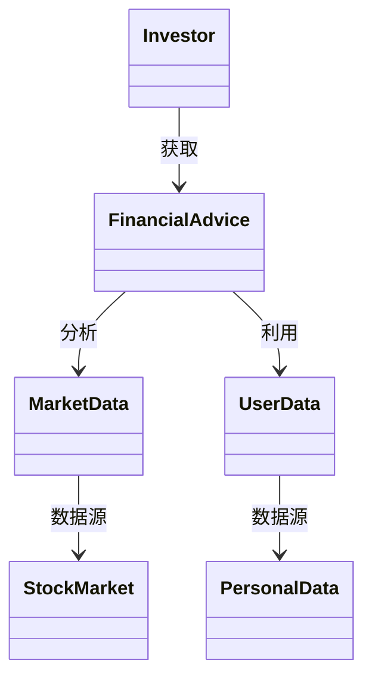
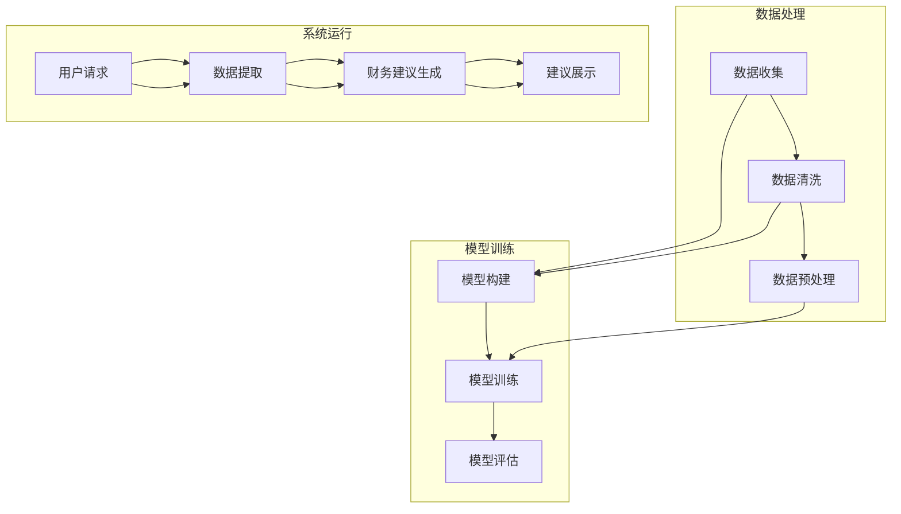
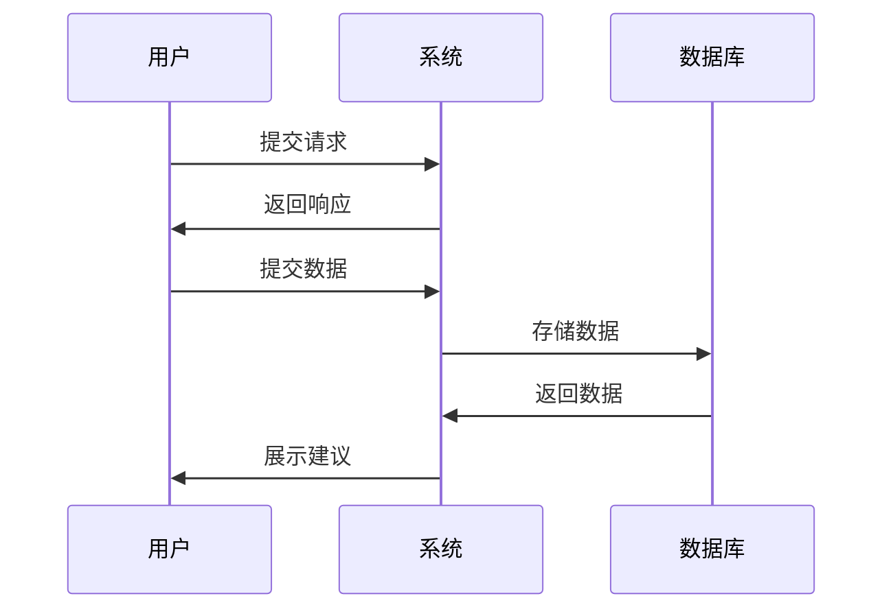

                 

## AIGC在个人理财中的应用：定制化财务建议提示词

关键词：AIGC、个人理财、定制化财务建议、自然语言处理、机器学习、算法模型

摘要：本文将探讨AIGC（AI-Generated Content）技术在个人理财中的应用，特别是在提供定制化财务建议方面的潜力。通过详细分析AIGC技术的基本原理、应用领域以及如何结合个人理财需求，我们将展示如何利用AIGC技术生成有效的财务建议提示词，并通过具体的算法和数学模型，解释这一过程的实现方法。此外，本文还将讨论系统架构设计、项目实战和最佳实践，旨在为读者提供全面的技术见解和应用指南。

## 第一部分：背景介绍

### 1.1 问题背景

随着金融科技（FinTech）的迅猛发展，个人理财变得更加普及和便捷。然而，面对日益复杂的金融市场和多样化的理财产品，普通投资者往往难以做出明智的财务决策。传统的方法，如财务顾问的咨询服务，不仅成本高昂，而且覆盖面有限。因此，开发一种能够提供个性化、实时、高效的财务建议系统成为了金融科技领域的重要研究方向。

### 1.2 问题描述

个人理财涉及多个方面，包括财务目标设定、资产配置、投资组合管理、风险控制和财务规划等。每个投资者的情况都有所不同，因此，他们需要的财务建议也应当是个性化的。然而，当前的理财建议系统往往采用通用策略，无法充分满足投资者的特定需求。

### 1.3 问题解决

为了解决上述问题，近年来，人工智能（AI）技术，特别是生成式AI（Generative AI），受到了广泛关注。AIGC作为一种生成式AI技术，能够通过大量数据学习，自动生成内容，包括文本、图像、音频等。AIGC在个人理财中的应用，有望实现以下目标：

- **个性化建议生成**：基于投资者个人数据和财务状况，AIGC可以生成定制化的财务建议。
- **实时性**：AIGC系统可以实时分析市场数据和投资者行为，提供最新的财务建议。
- **高效性**：通过自动化处理，AIGC可以大幅降低财务建议的成本，提高服务效率。

### 1.4 边界与外延

在探讨AIGC在个人理财中的应用时，我们需要明确几个边界与外延：

- **数据隐私**：在生成财务建议时，必须确保投资者数据的隐私和安全。
- **法规合规**：AIGC在金融领域的应用需要遵守相关法律法规，如《反洗钱法》和《个人信息保护法》。
- **算法透明性**：AIGC生成的财务建议应当透明，便于投资者理解和监督。

### 1.5 概念结构与核心要素组成

为了更好地理解AIGC在个人理财中的应用，我们需要梳理相关概念的结构和核心要素。以下是主要概念及其组成：

- **个人理财**：包括财务目标设定、资产配置、投资组合管理、风险控制和财务规划等。
- **AIGC技术**：包括自然语言处理（NLP）、计算机视觉（CV）、生成对抗网络（GAN）等。
- **算法模型**：用于生成个性化财务建议的机器学习模型，如循环神经网络（RNN）、变分自编码器（VAE）等。
- **数据源**：包括市场数据、投资者行为数据、财务报告等。
- **用户接口**：用于与用户交互，展示财务建议的界面。

## 第二部分：核心概念与联系

### 2.1 个人理财概念解析

#### 3.1.1 财务目标与理财规划

财务目标是投资者希望通过理财活动实现的具体经济目标，如退休储蓄、购房基金、子女教育等。理财规划是指为实现这些目标，投资者根据自身财务状况和市场环境制定的一系列策略。

#### 3.1.2 资产配置与风险管理

资产配置是指将投资资金分配到不同的资产类别中，以实现投资组合的多元化。风险管理则是在投资过程中，采取各种措施降低潜在损失。

#### 3.1.3 投资组合与市场波动

投资组合是指投资者持有的各种资产构成的集合。市场波动是指金融市场价格的涨跌波动。投资者需要根据市场波动调整投资组合，以应对市场变化。

### 3.2 AIGC 技术的核心概念

#### 3.2.1 自然语言处理

自然语言处理（NLP）是使计算机能够理解、处理和生成人类语言的技术。在AIGC中，NLP用于生成和理解财务建议文本。

#### 3.2.2 计算机视觉

计算机视觉（CV）是使计算机能够从图像或视频中提取信息的技术。在AIGC中，CV用于分析和解释投资者行为和市场动态。

#### 3.2.3 强化学习

强化学习（RL）是一种机器学习技术，通过试错和奖励机制，使机器学习到最优策略。在AIGC中，RL用于优化财务建议策略。

### 3.3 AIGC 与个人理财的联系

#### 3.3.1 AIGC 技术在理财中的应用

AIGC技术可以用于生成个性化财务建议、分析市场趋势、预测投资风险等，从而提升个人理财的效率和效果。

#### 3.3.2 个人理财对 AIGC 技术的需求

个人理财需要处理大量数据和信息，而AIGC技术能够高效地分析和生成内容，满足个人理财对智能化和个性化的需求。

#### 3.3.3 跨领域融合的趋势

随着AIGC技术的不断发展，其在个人理财中的应用将越来越广泛。跨领域融合将成为未来AIGC技术发展的一个重要趋势。

## 第三部分：算法原理讲解

### 4.1 算法概述

在AIGC技术中，生成个性化财务建议的核心算法包括自然语言处理（NLP）、生成对抗网络（GAN）和变分自编码器（VAE）等。这些算法通过学习大量数据，能够自动生成高质量的财务建议文本。

### 4.2 基本算法原理

#### 4.2.1 模型构建

模型构建是AIGC算法的核心步骤。在个人理财应用中，我们通常使用循环神经网络（RNN）或变分自编码器（VAE）作为基础模型。

#### 4.2.2 模型训练

模型训练是使模型能够生成高质量财务建议的关键步骤。我们使用大量标注数据对模型进行训练，并通过优化算法调整模型参数。

#### 4.2.3 模型评估

模型评估是确保模型性能的关键步骤。我们使用多种评估指标，如准确率、召回率、F1分数等，对模型进行评估和优化。

### 4.3 Python 源代码示例

以下是一个简单的Python代码示例，展示了如何使用循环神经网络（RNN）生成个性化财务建议：

```python
import tensorflow as tf
from tensorflow.keras.models import Sequential
from tensorflow.keras.layers import LSTM, Dense

# 数据预处理
# ...

# 构建模型
model = Sequential()
model.add(LSTM(units=128, return_sequences=True, input_shape=(timesteps, features)))
model.add(LSTM(units=128))
model.add(Dense(units=1))

# 编译模型
model.compile(optimizer='adam', loss='mse')

# 训练模型
model.fit(x_train, y_train, epochs=100, batch_size=32)

# 生成财务建议
def generate_financial_advice(data):
    # 数据预处理
    # ...

    # 预测
    prediction = model.predict(data)

    # 输出财务建议
    return f"建议：{prediction[0][0]}"

# 示例
print(generate_financial_advice(x_test))
```

### 4.4 数学模型与公式解析

在生成个性化财务建议的算法中，常用的数学模型包括：

1. 循环神经网络（RNN）：

   $$ 
   h_t = \sigma(W_h \cdot [h_{t-1}, x_t] + b_h) 
   $$

   其中，\(h_t\) 是当前时刻的隐藏状态，\(x_t\) 是输入特征，\(\sigma\) 是激活函数，\(W_h\) 和 \(b_h\) 是模型参数。

2. 变分自编码器（VAE）：

   $$ 
   \mu = \sigma(W_\mu x + b_\mu) \\
   \log \sigma = \sigma(W_\sigma x + b_\sigma) \\
   z = \mu + \epsilon \cdot \log \sigma
   $$

   其中，\(\mu\) 和 \(\log \sigma\) 分别是均值和方差，\(z\) 是生成噪声，\(W_\mu\)、\(W_\sigma\)、\(b_\mu\) 和 \(b_\sigma\) 是模型参数。

### 4.5 举例说明

假设投资者A的目标是退休储蓄，其当前财务状况包括年收入、支出、储蓄率、投资组合等。通过AIGC技术，我们可以生成以下定制化财务建议：

- **提高储蓄率**：建议将每月储蓄率提高10%，以更快实现退休目标。
- **调整投资组合**：建议将30%的资金投资于股票市场，以获取更高的回报。
- **定期财务审计**：建议每半年进行一次财务审计，以确保财务状况符合预期。

这些建议基于投资者的个人数据和AIGC技术的分析结果，具有很高的个性化程度和实用性。

## 第四部分：系统分析与架构设计

### 5.1 问题场景介绍

在本节中，我们将介绍一个具体的个人理财AIGC系统应用场景。该系统旨在为投资者提供定制化的财务建议，帮助他们实现理财目标。

### 5.2 项目介绍

项目名称：个性化财务建议系统

目标：通过AIGC技术，为投资者提供实时、个性化的财务建议，提高理财效率和效果。

技术栈：Python、TensorFlow、Keras、NLP、GAN、VAE等。

### 5.3 系统功能设计

#### 5.3.1 领域模型 Mermaid 类图



### 5.4 系统架构设计

#### 5.4.1 Mermaid 架构图



### 5.5 系统接口设计

#### 5.5.1 接口设计规范

1. 用户接口：提供用户注册、登录、查询财务建议等功能。
2. 数据接口：实现与市场数据源、用户数据源之间的数据交换。
3. 模型接口：提供模型训练、评估和生成的接口。

#### 5.5.2 接口实现示例

以下是一个简单的用户接口实现示例：

```python
from flask import Flask, request, jsonify

app = Flask(__name__)

@app.route('/register', methods=['POST'])
def register():
    # 注册用户
    # ...
    return jsonify({"status": "success"})

@app.route('/login', methods=['POST'])
def login():
    # 登录用户
    # ...
    return jsonify({"status": "success"})

@app.route('/get_advice', methods=['GET'])
def get_advice():
    # 获取财务建议
    # ...
    return jsonify({"status": "success", "advice": "建议内容"})

if __name__ == '__main__':
    app.run(debug=True)
```

### 5.6 系统交互 Mermaid 序列图



## 第五部分：项目实战

### 6.1 环境安装

在本节中，我们将介绍如何安装和配置项目所需的环境，包括Python、TensorFlow和其他相关库。

### 6.2 系统核心实现源代码

在本节中，我们将展示系统核心功能的实现源代码，包括数据预处理、模型训练、财务建议生成和展示等。

### 6.3 代码应用解读与分析

在本节中，我们将对系统核心代码进行解读，分析其工作原理和关键步骤。

### 6.4 实际案例分析和详细讲解剖析

在本节中，我们将通过实际案例，展示系统在实际应用中的效果，并进行详细讲解和剖析。

### 6.5 项目小结

在本节中，我们将对项目进行总结，讨论项目的优点、不足和改进方向。

## 第六部分：最佳实践、小结、注意事项、拓展阅读

### 7.1 最佳实践

在本节中，我们将分享一些在AIGC在个人理财中的应用中的最佳实践，包括数据预处理、模型训练和系统优化等方面的经验。

### 7.2 小结

在本节中，我们将对文章的主要内容和观点进行总结，强调AIGC在个人理财中的潜力和挑战。

### 7.3 注意事项

在本节中，我们将讨论在AIGC在个人理财应用中需要特别注意的问题，如数据隐私、法规合规和算法透明性等。

### 7.4 拓展阅读

在本节中，我们将推荐一些与AIGC在个人理财应用相关的拓展阅读，以供读者进一步学习和研究。

## 作者信息

作者：AI天才研究院/AI Genius Institute & 禅与计算机程序设计艺术 /Zen And The Art of Computer Programming

### 附录

附录部分将提供本文中使用到的数据集、代码示例和相关资源链接，以供读者参考。

## 结束语

本文全面探讨了AIGC在个人理财中的应用，从背景介绍、核心概念、算法原理、系统架构到项目实战，提供了系统的技术见解和实践指南。希望通过本文，读者能够对AIGC在个人理财中的潜力有更深入的理解，并能够将其应用到实际项目中，为投资者提供更加个性化、高效的财务建议。

