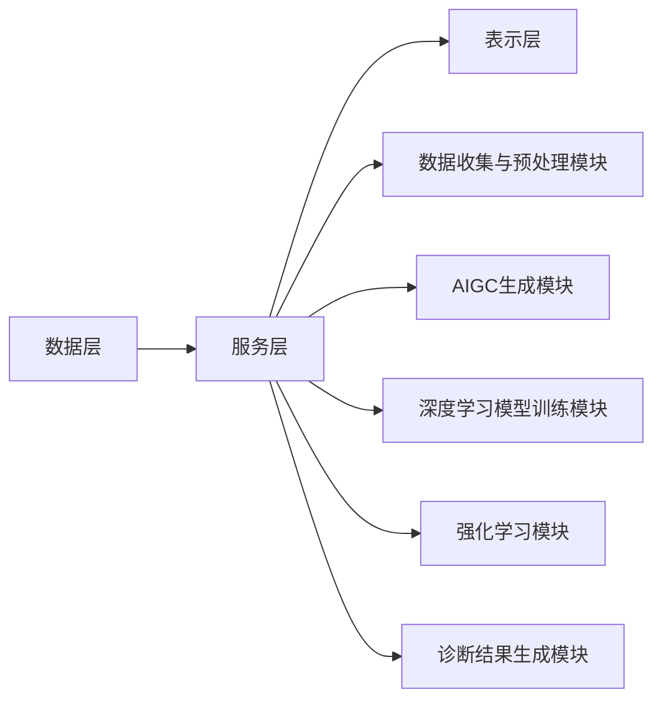

                 

### 1.1 书籍背景与目的

《AIGC在个性化医疗诊断中的应用：AI辅助罕见病识别》一书旨在探讨人工智能生成内容（AIGC）在个性化医疗诊断中的创新应用，特别是其在辅助罕见病识别方面的潜力。随着人工智能技术的迅猛发展，AIGC作为一种新兴的技术领域，已经在多个行业中展现出其独特的价值。然而，在个性化医疗诊断，尤其是罕见病识别这一复杂而重要的领域中，AIGC的应用仍然处于探索阶段。

本书的目的在于通过深入研究和实践案例分析，详细解析AIGC在个性化医疗诊断中的应用场景，特别是其在罕见病识别中的关键作用。书中的内容包括AIGC的基础知识、个性化医疗诊断的流程和技术、罕见病识别的算法原理及其应用，以及AIGC在罕见病识别中的技术实现方法。此外，书中还将探讨AIGC在罕见病识别中的实践应用、面临的挑战和未来发展趋势。

通过阅读本书，读者将能够：
1. 理解AIGC的基本概念、发展历程和关键技术。
2. 掌握个性化医疗诊断的基本原理和流程。
3. 了解AI在罕见病识别中的应用和算法原理。
4. 学习AIGC在罕见病识别中的具体实现方法。
5. 分析AIGC在罕见病识别中的实践应用和面临的挑战。
6. 探讨AIGC在个性化医疗诊断和罕见病识别中的未来发展方向。

总之，本书不仅为学术研究人员提供了一部系统性的研究文献，也为医疗行业从业人员和AI开发人员提供了实用的技术指南，帮助他们在实际工作中更好地应用AIGC技术，推动个性化医疗诊断的发展。希望通过本书的深入探讨，能够激发更多对AIGC在个性化医疗诊断领域的研究和应用，为罕见病识别和治疗提供新的解决方案。

### 1.2 AIGC、个性化医疗诊断与罕见病识别

在深入探讨《AIGC在个性化医疗诊断中的应用：AI辅助罕见病识别》之前，我们需要首先理解几个核心概念：AIGC、个性化医疗诊断和罕见病识别。

#### AIGC（AI-Generated Content）

AIGC，即人工智能生成内容，是指利用人工智能技术，尤其是深度学习算法，自动生成文本、图像、视频等多媒体内容。AIGC技术涵盖了从简单的文本生成到复杂的图像生成，再到视频合成等广泛的领域。AIGC的发展可以追溯到生成对抗网络（GAN）和变分自编码器（VAE）等算法的提出，这些算法使得AI能够学习并模仿大量数据，从而生成高质量的、具有真实感的多媒体内容。

AIGC在多个行业中已经展现出其巨大的潜力。例如，在娱乐产业中，AIGC被用于生成电影特效、动画角色和音乐等；在广告和营销领域，AIGC可以帮助自动生成广告内容和创意；在媒体行业中，AIGC被用于新闻写作、文章编辑和视频内容生成等。然而，AIGC在医疗领域，尤其是个性化医疗诊断和罕见病识别中的应用，仍是一个相对较新的领域。

#### 个性化医疗诊断

个性化医疗诊断是指根据患者的个人基因信息、生活习惯、环境和医疗历史等数据，提供个性化的治疗方案和诊断。与传统的“一刀切”医疗模式不同，个性化医疗诊断强调根据每个患者的具体情况进行定制化治疗，从而提高治疗效果，减少副作用和医疗成本。

个性化医疗诊断的流程通常包括以下几个步骤：
1. **数据收集**：收集患者的医疗历史、基因数据、生活习惯和环境数据等。
2. **数据预处理**：清洗和整理收集到的数据，使其适合用于分析和建模。
3. **数据分析和建模**：利用机器学习算法和统计方法对预处理后的数据进行分析和建模，提取出有用的信息。
4. **诊断和治疗方案生成**：根据分析结果，为患者提供个性化的诊断和治疗方案。

个性化医疗诊断的关键技术包括生物信息学、精准医疗、机器学习与人工智能等。这些技术共同构成了个性化医疗诊断的基础，使得医生能够更精准地诊断疾病，并制定最适合患者的治疗方案。

#### 罕见病识别

罕见病是指发病率较低，通常不超过人口总数的1/1000的疾病。由于罕见病种类繁多，且症状复杂多变，诊断和治疗罕见病一直是一个巨大的挑战。传统的诊断方法往往依赖于医生的经验和专业知识，这导致了许多罕见病被误诊或漏诊。

AI在罕见病识别中的应用，特别是AIGC的应用，为解决这一问题提供了新的可能性。AIGC可以通过学习大量的医学影像、基因数据和其他医疗信息，帮助医生更准确地识别罕见病。例如，生成对抗网络（GAN）可以生成与真实罕见病病例相似的数据，用于训练和测试诊断模型；变分自编码器（VAE）则可以提取基因数据中的关键特征，用于辅助诊断。

总的来说，AIGC在个性化医疗诊断和罕见病识别中的应用，不仅能够提高诊断的准确性和效率，还能够为罕见病的早期识别和治疗提供有力支持。通过本书的深入探讨，我们将进一步了解AIGC在这些领域的应用潜力，以及如何将这些先进技术转化为实际医疗解决方案。

### 1.3 书籍结构概述

《AIGC在个性化医疗诊断中的应用：AI辅助罕见病识别》一书共分为六个部分，每个部分都有其独特的主题和内容，旨在全面探讨AIGC在个性化医疗诊断和罕见病识别中的应用。

**第一部分：引言**

本部分主要介绍书籍的背景和目的，详细解释AIGC、个性化医疗诊断和罕见病识别的核心概念，以及它们在医学领域的重要性。此外，本书的结构和主要内容也将在此部分进行概述，帮助读者了解整体框架和各章节的主要内容。

**第二部分：AIGC基础**

本部分将深入探讨AIGC的基本概念、发展历程和关键技术。首先，我们将定义AIGC，并概述其从生成对抗网络（GAN）到变分自编码器（VAE）等算法的发展历程。接着，我们将详细讨论AIGC的关键技术，包括GAN和VAE的工作原理、应用场景和优势。最后，本部分将探讨AIGC在医学领域的应用，特别是其在个性化医疗诊断中的潜力。

**第三部分：个性化医疗诊断**

本部分将介绍个性化医疗诊断的基本概念、流程和技术。首先，我们将详细解释个性化医疗诊断的定义，并讨论其与传统医疗诊断的区别。接着，我们将介绍个性化医疗诊断的流程，包括数据收集、预处理、分析和诊断等步骤。最后，本部分将探讨个性化医疗诊断的关键技术，如生物信息学、精准医疗和机器学习等，并讨论这些技术在个性化医疗诊断中的应用和优势。

**第四部分：罕见病识别**

本部分将详细讨论AI在罕见病识别中的应用。首先，我们将定义罕见病，并概述其特点和诊断挑战。接着，我们将介绍AI在罕见病识别中的应用，包括深度学习和强化学习等算法。我们将详细讨论这些算法的原理和应用场景，并通过具体案例展示AI在罕见病识别中的实际效果。最后，本部分将探讨罕见病识别的算法原理，包括数学模型和Mermaid流程图，帮助读者更深入地理解算法的工作机制。

**第五部分：AIGC在罕见病识别中的技术实现**

本部分将详细介绍AIGC在罕见病识别中的技术实现方法。首先，我们将介绍数据预处理、模型训练和模型评估等基本技术，并解释它们在AIGC应用中的重要性。接着，我们将通过具体案例展示AIGC在罕见病识别中的实现过程，包括数据收集、模型设计和训练等步骤。最后，本部分将讨论AIGC在罕见病识别中的实际效果和优化方法，帮助读者理解如何通过技术改进提高诊断准确性。

**第六部分：实践与挑战**

本部分将探讨AIGC在罕见病识别中的实践应用和面临的挑战。首先，我们将介绍AIGC在罕见病识别中的实际应用案例，包括成功经验和存在的问题。接着，我们将讨论AIGC在罕见病识别中面临的挑战，如数据隐私、模型解释性和算法公平性等。最后，本部分将探讨AIGC在罕见病识别中的未来发展趋势，包括潜在的研究方向和应用场景，以及如何通过技术创新解决现有挑战。

通过本书的六个部分，读者将全面了解AIGC在个性化医疗诊断和罕见病识别中的应用，掌握相关技术和方法，并能够为实际医疗工作提供有效的技术支持。

### 2.1 AIGC的概念与发展历程

#### AIGC的基本概念

AIGC（AI-Generated Content），即人工智能生成内容，是指通过人工智能技术，特别是深度学习算法，自动生成文本、图像、视频等多媒体内容。AIGC的核心思想是利用大量数据和先进的算法，使计算机能够模拟人类创造过程，生成高质量、多样化的内容。AIGC涵盖了从简单的文本生成到复杂的图像和视频合成等多个领域，具有广泛的应用前景。

AIGC与传统的内容创作方式有显著区别。传统的内容创作依赖于人类创作者的创意和技能，而AIGC则是通过机器学习模型，自动学习和模仿大量数据，生成新的内容。这一过程不仅提高了内容创作的效率，还扩展了内容的多样性和创造力。例如，在文本生成方面，AIGC可以自动撰写新闻稿、文章和故事；在图像和视频生成方面，AIGC可以生成逼真的图像、动画和视频内容。

#### AIGC的发展历程

AIGC的发展历程可以追溯到20世纪80年代，但真正引起广泛关注是在21世纪，特别是在深度学习技术得到广泛应用之后。以下是AIGC发展的几个关键阶段：

1. **早期探索阶段（1980s-1990s）**：在这一阶段，研究人员开始探索通过计算机生成图像和文本。典型的代表是1980年代提出的规则系统，如“故事机器”，它们通过预定义的规则和模板生成简单的故事和文本。然而，由于计算能力和算法的限制，这些早期的尝试并没有取得显著的效果。

2. **机器学习兴起阶段（2000s）**：随着机器学习技术的发展，特别是深度学习算法的提出，AIGC开始进入一个新阶段。2006年，深度学习领域的突破性论文《A Learning Algorithm for Deep Belief Nets》提出了深度信念网络（DBN），为后续的生成模型奠定了基础。这一阶段的重要进展还包括2012年AlexNet在ImageNet竞赛中取得的突破性成绩，标志着深度学习在图像识别领域的崛起。

3. **生成对抗网络（GAN）阶段（2010s）**：2014年，Ian Goodfellow等人在NeurIPS会议上提出了生成对抗网络（GAN），这是一个革命性的模型，通过两个对抗网络（生成器和判别器）相互竞争，生成逼真的图像和文本内容。GAN的成功引发了大量研究，并迅速在多个领域得到应用，如图像生成、视频合成和文本生成等。

4. **多样化应用与发展阶段（2020s）**：随着计算能力的进一步提升和算法的优化，AIGC的应用范围不断扩大。在这一阶段，AIGC不仅在图像和文本生成方面取得了显著进展，还扩展到了视频合成、音乐生成和虚拟现实等领域。此外，AIGC还开始应用于更复杂的问题，如内容创作辅助、自动化内容审核和个性化推荐等。

#### AIGC的关键技术

AIGC的关键技术主要包括生成对抗网络（GAN）、变分自编码器（VAE）和自编码器（AE）等。以下是这些技术的简要介绍：

1. **生成对抗网络（GAN）**：GAN由生成器和判别器两个神经网络组成。生成器尝试生成逼真的数据，而判别器则尝试区分真实数据和生成数据。通过这种对抗训练，生成器逐渐学会生成更加真实的数据。GAN在图像生成和视频合成方面表现出色，能够生成高分辨率的逼真图像和视频。

2. **变分自编码器（VAE）**：VAE是一种无监督学习的生成模型，通过编码器和解码器两个神经网络实现数据的生成。编码器将输入数据映射到一个低维隐空间，解码器则从隐空间中重建输入数据。VAE在生成图像和文本方面表现出色，特别适合处理高维数据。

3. **自编码器（AE）**：AE是一种简单的生成模型，通过一个编码器将输入数据压缩到一个低维隐空间，然后通过一个解码器重构原始数据。AE在图像压缩和去噪方面表现出色，但其生成能力相对较弱。

总的来说，AIGC的发展历程和关键技术展示了人工智能在内容生成领域的巨大潜力。通过深入研究和应用这些技术，我们有望在医疗、娱乐、广告等多个领域实现更多创新和突破。

### 2.2 AIGC的关键技术

AIGC（AI-Generated Content）的关键技术包括生成对抗网络（GAN）、变分自编码器（VAE）和自编码器（AE）。这些技术不仅推动了AIGC领域的发展，还在医疗、娱乐、广告等多个领域展现了广泛的应用前景。下面，我们将详细介绍这些技术，并讨论它们的工作原理、优缺点以及应用场景。

#### 生成对抗网络（GAN）

**工作原理**：
生成对抗网络（GAN）由生成器（Generator）和判别器（Discriminator）两个神经网络组成。生成器的任务是从随机噪声中生成逼真的数据，而判别器的任务是区分真实数据和生成数据。训练过程中，生成器和判别器相互对抗，生成器不断尝试生成更真实的数据，而判别器则不断尝试提高识别能力。这种对抗训练使得生成器能够生成高质量、逼真的数据。

**优点**：
- **生成能力强大**：GAN能够在多个领域生成高质量、逼真的图像、视频和文本。
- **适用性广泛**：GAN适用于多种数据类型，包括高维、复杂的数据。

**缺点**：
- **训练不稳定**：GAN的训练过程容易陷入局部最优，导致训练不稳定。
- **资源需求高**：GAN训练过程中需要大量的计算资源。

**应用场景**：
- **图像生成**：GAN在图像生成领域表现出色，可以生成高分辨率的图像，广泛应用于图像修复、图像生成和风格迁移等任务。
- **视频合成**：GAN可以生成高质量的动画视频和电影特效，广泛应用于电影制作、游戏开发和广告营销等。
- **文本生成**：GAN在文本生成方面也有广泛应用，可以自动生成新闻稿、故事和文章。

#### 变分自编码器（VAE）

**工作原理**：
变分自编码器（VAE）是一种基于概率模型的生成模型，由编码器（Encoder）和解码器（Decoder）两个神经网络组成。编码器将输入数据映射到一个隐空间，隐空间中的每个点代表输入数据的概率分布。解码器从隐空间中重建输入数据。VAE通过最大化数据分布的重构概率来实现数据的生成。

**优点**：
- **生成质量高**：VAE生成的数据质量较高，特别适用于高维数据的生成。
- **易于训练**：VAE的训练过程相对稳定，不容易陷入局部最优。

**缺点**：
- **生成多样性较低**：VAE在生成多样性的表现不如GAN。
- **计算复杂度高**：VAE的计算复杂度较高，特别是当数据维度增加时。

**应用场景**：
- **图像生成**：VAE在图像生成领域广泛应用，可以生成高质量的图像，应用于图像修复、图像超分辨率和图像生成等。
- **文本生成**：VAE在文本生成方面也有应用，可以自动生成文章、故事和新闻稿。
- **基因组数据分析**：VAE在基因组数据分析中用于生成模拟数据，帮助研究人员理解基因的功能和相互作用。

#### 自编码器（AE）

**工作原理**：
自编码器（AE）是一种无监督学习的生成模型，由编码器和解码器两个神经网络组成。编码器将输入数据压缩到一个低维隐空间，解码器则从隐空间中重建原始数据。AE通过最小化重构误差来实现数据的生成。

**优点**：
- **训练简单**：AE的训练过程相对简单，易于实现。
- **生成质量适中**：AE生成的数据质量适中，适用于一些简单的数据生成任务。

**缺点**：
- **生成多样性较低**：AE在生成多样性的表现较差。
- **计算复杂度较低**：AE的计算复杂度相对较低，适用于小型数据集。

**应用场景**：
- **图像去噪**：AE在图像去噪方面表现出色，可以去除图像中的噪声，提高图像质量。
- **图像压缩**：AE可以用于图像压缩，降低图像的存储空间和传输带宽。
- **时间序列预测**：AE在时间序列预测中也具有一定的应用，可以用于生成模拟的时间序列数据。

总的来说，AIGC的关键技术各有其独特的优势和局限性，选择合适的技术取决于具体的应用场景和需求。通过深入研究和应用这些技术，我们有望在AIGC领域实现更多创新和突破。

### 2.3 AIGC在医学领域的应用

AIGC（AI-Generated Content）在医学领域的应用已经引起了广泛关注。作为一种能够自动生成高质量、多样化内容的先进技术，AIGC在医学影像分析、病历生成和个性化医疗方案设计等方面展现出巨大潜力。

#### AIGC在医学影像分析中的应用

医学影像分析是医学领域中一个关键的应用领域，它涉及到对医学图像（如X光、CT、MRI等）的分析和理解。AIGC可以通过生成对抗网络（GAN）和变分自编码器（VAE）等技术，自动生成高质量的医学影像数据，从而提高影像分析的准确性和效率。

1. **影像分割和标注**：AIGC可以自动生成大量高质量的医学影像数据，用于训练和验证影像分割模型。生成对抗网络（GAN）可以生成与真实病例相似的图像，这些图像可以作为额外的训练数据，提高分割模型的泛化能力和准确性。

2. **影像增强**：AIGC可以用于医学影像的增强和修复，通过变分自编码器（VAE）等技术，对低质量或受损的医学影像进行修复，提高影像的清晰度和质量，从而帮助医生更准确地诊断疾病。

3. **辅助诊断**：AIGC可以生成具有代表性的医学影像数据，用于辅助诊断。例如，在癌症诊断中，AIGC可以生成与特定癌症病例相似的影像数据，帮助医生进行更准确的诊断。

#### AIGC在病历生成中的应用

病历生成是医疗领域中的一个重要任务，它涉及到对患者的病史、检查结果和治疗方案等进行记录和生成。AIGC可以通过自然语言处理（NLP）和生成对抗网络（GAN）等技术，自动生成高质量的病历文档，提高医疗记录的准确性和效率。

1. **自动生成病历摘要**：AIGC可以自动分析患者的医疗记录，生成简洁、准确的病历摘要，帮助医生快速了解患者的病史和检查结果。

2. **个性化病历生成**：AIGC可以根据患者的具体情况，自动生成个性化的病历文档，包括治疗方案、护理计划和建议等，提高医疗服务的个性化和精准性。

3. **医学文本生成**：AIGC可以用于生成医学报告、诊断建议和患者通知等文本内容，提高医疗记录的自动化程度，减少人为错误。

#### AIGC在个性化医疗方案设计中的应用

个性化医疗方案设计是根据患者的个体差异，制定最适合患者的治疗方案。AIGC可以通过生成对抗网络（GAN）和变分自编码器（VAE）等技术，生成大量的个性化医疗方案数据，为医生提供丰富的参考信息。

1. **个性化治疗建议**：AIGC可以自动生成针对特定患者的个性化治疗方案，包括药物治疗、手术方案和康复计划等。这些方案可以根据患者的基因信息、生活习惯和病情特点进行定制。

2. **医学数据分析**：AIGC可以自动分析大量的医学数据，如基因组数据、病史和临床检查结果等，为医生提供全面的诊断和治疗方案建议。

3. **药物研发辅助**：AIGC可以用于药物研发的早期阶段，通过生成对抗网络（GAN）生成大量的药物分子结构数据，帮助研究人员发现新的药物候选分子。

总之，AIGC在医学领域的应用为医疗行业带来了新的机遇和挑战。通过AIGC技术，我们可以实现更准确、高效的医学影像分析，更智能、个性化的病历生成和治疗方案设计，从而提升医疗服务的质量和效率。未来，随着AIGC技术的不断发展和完善，其在医学领域的应用前景将更加广阔。

### 3.1 个性化医疗诊断概述

个性化医疗诊断是一种新兴的医疗模式，其核心理念是基于患者的个体差异，为每位患者提供量身定制的诊断和治疗策略。与传统的一刀切医疗模式不同，个性化医疗诊断强调根据患者的遗传背景、生活方式、环境因素和病情特点，制定个性化的医疗方案，以提高治疗效果，减少副作用，并降低医疗成本。

#### 个性化医疗诊断的定义

个性化医疗诊断是指通过综合分析患者的基因信息、临床数据、生物标志物和生活习惯等多方面的信息，为患者提供精确的诊断和个性化的治疗方案。这种诊断模式不仅关注疾病的病因和病理机制，还重视患者的个体差异，力求在诊断和治疗过程中实现精准化和个性化。

#### 个性化医疗诊断的重要性

1. **提高治疗效果**：个性化医疗诊断通过分析患者的个体差异，能够为患者提供最适合的治疗方案，从而提高治疗效果。例如，对于某些癌症患者，基于基因突变特征的靶向治疗比传统的化疗和放疗更具针对性，效果更显著。

2. **减少副作用**：个性化医疗诊断能够减少不必要的药物和治疗，降低患者的副作用和并发症风险。通过精确的药物选择和剂量调整，可以最大程度地避免药物的不良反应。

3. **降低医疗成本**：个性化医疗诊断通过优化医疗资源和治疗方案，可以降低医疗成本。例如，通过精准的诊断和预防措施，可以减少不必要的检查和治疗，从而降低医疗费用。

#### 个性化医疗诊断的基本原理

个性化医疗诊断的基本原理包括以下几个方面：

1. **大数据分析**：个性化医疗诊断依赖于海量数据的收集和分析，包括基因数据、电子病历、医疗影像等。通过大数据分析技术，可以从这些数据中提取出有用的信息，用于患者的诊断和治疗。

2. **生物信息学**：生物信息学是个性化医疗诊断的重要工具，它通过分析基因序列、蛋白质结构和代谢途径等生物信息，为疾病诊断和治疗提供科学依据。

3. **机器学习和人工智能**：个性化医疗诊断利用机器学习和人工智能技术，可以从海量数据中挖掘出潜在的规律和模式，为诊断和治疗提供决策支持。

#### 个性化医疗诊断的流程

个性化医疗诊断的流程通常包括以下几个步骤：

1. **数据收集**：收集患者的各种数据，包括基因数据、临床数据、生物标志物、生活习惯和环境因素等。

2. **数据预处理**：对收集到的数据进行清洗、标准化和整合，使其适合用于分析和建模。

3. **数据分析**：利用大数据分析、生物信息学和机器学习技术，对预处理后的数据进行分析，提取出与疾病诊断和治疗相关的特征和模式。

4. **诊断和治疗方案生成**：根据分析结果，为患者提供个性化的诊断和治疗方案。

5. **治疗效果评估**：对治疗方案进行跟踪和评估，根据患者的反馈和治疗效果进行调整，以实现最佳的治疗效果。

总之，个性化医疗诊断是一种基于大数据、生物信息学和人工智能技术的新型医疗模式，它通过分析患者的个体差异，为患者提供精准、个性化的诊断和治疗，从而提高医疗质量和效率。

### 3.2 个性化医疗诊断的流程

个性化医疗诊断的流程是一个系统化的过程，旨在通过综合分析患者的各项数据，为每位患者提供量身定制的诊断和治疗方案。以下是个性化医疗诊断的基本流程：

#### 1. 数据收集

数据收集是个性化医疗诊断的第一步，也是至关重要的一步。在这一阶段，需要收集患者的多种数据，包括但不限于以下几类：

- **临床数据**：包括患者的病史、体检结果、实验室检测结果等。
- **基因数据**：通过基因测序技术获取患者的基因组信息，包括单核苷酸多态性（SNP）、基因突变等。
- **生物标志物数据**：包括蛋白质、代谢产物、微生物组等生物标志物的检测结果。
- **生活方式数据**：包括患者的饮食、运动习惯、吸烟和饮酒情况等。
- **环境因素数据**：包括患者的生活和工作环境，如污染水平、气候变化等。

这些数据可以通过电子病历系统、基因测序设备、实验室检测设备和传感器等多种途径收集。

#### 2. 数据预处理

数据收集完成后，需要对数据进行预处理，以确保数据的质量和一致性。数据预处理通常包括以下几个步骤：

- **数据清洗**：去除无效数据、缺失数据和异常数据，确保数据的完整性。
- **数据标准化**：将不同来源、不同单位的数据进行统一标准化，使其适合后续分析。
- **数据整合**：将不同类型的数据进行整合，构建一个全面的患者数据集。

#### 3. 数据分析

在预处理完数据后，利用大数据分析、生物信息学和机器学习技术对数据进行分析。这一阶段通常包括以下几个步骤：

- **特征提取**：从原始数据中提取出与疾病诊断和治疗相关的特征，如基因表达水平、蛋白质浓度等。
- **模式识别**：利用机器学习算法，从特征数据中挖掘出与疾病相关的模式和规律。
- **数据可视化**：通过数据可视化技术，将分析结果以图表、图像等形式呈现，便于医生理解和决策。

#### 4. 诊断和治疗方案生成

根据数据分析的结果，为患者生成个性化的诊断和治疗方案。这一阶段通常包括以下几个步骤：

- **诊断**：根据患者的临床数据和生物标志物数据，结合机器学习模型的预测结果，确定患者的疾病类型和病情严重程度。
- **治疗方案设计**：根据诊断结果，为患者制定个性化的治疗方案，包括药物治疗、手术治疗、生活方式调整等。

#### 5. 治疗效果评估

在治疗方案实施后，需要对治疗效果进行评估，以判断个性化医疗诊断的准确性和有效性。这一阶段通常包括以下几个步骤：

- **治疗效果监测**：通过定期检查、实验室检测等方式，监测患者的治疗效果。
- **效果评估**：根据患者的治疗效果，评估个性化医疗诊断的准确性、有效性和可靠性。
- **反馈与调整**：根据治疗效果评估结果，对治疗方案进行调整和优化，以提高治疗效果。

#### 6. 持续优化

个性化医疗诊断是一个持续优化的过程，通过不断的反馈和改进，不断提高诊断的准确性和治疗效果。这一阶段通常包括以下几个步骤：

- **数据更新**：定期更新患者的数据，包括新的基因数据、临床数据和生物标志物数据等。
- **模型更新**：根据新的数据，重新训练和优化诊断模型，以提高模型的准确性和可靠性。
- **反馈循环**：将治疗效果反馈到诊断模型中，形成反馈循环，持续改进诊断和治疗方案。

总之，个性化医疗诊断的流程是一个综合、系统化的过程，通过数据收集、预处理、分析、诊断和治疗，为患者提供精准、个性化的医疗方案。随着人工智能技术的不断发展，个性化医疗诊断的准确性和有效性将得到进一步提升，为患者带来更好的医疗体验。

### 3.3 个性化医疗诊断的关键技术

个性化医疗诊断的实现依赖于多种先进的技术，这些技术包括生物信息学、精准医疗和机器学习等。每种技术都有其独特的应用和优势，为个性化医疗诊断提供了强有力的支持。

#### 生物信息学

生物信息学是研究生物数据（如基因组、蛋白质组、代谢组等）信息的科学，它通过计算方法解析和整合生物学数据，帮助揭示生物现象的机制。在个性化医疗诊断中，生物信息学扮演着关键角色，主要应用在以下几个方面：

1. **基因组数据分析**：生物信息学可以分析患者的基因组数据，识别与疾病相关的基因变异和基因表达模式。通过全基因组关联分析（GWAS）、基因表达谱分析等技术，生物信息学为疾病诊断和风险评估提供了重要的生物标记物。

2. **蛋白质组学分析**：蛋白质组学关注的是细胞内所有蛋白质的表达和变化。生物信息学技术可以帮助分析蛋白质组数据，发现与疾病相关的蛋白质表达变化，为个性化治疗提供指导。

3. **代谢组学分析**：代谢组学研究细胞内所有代谢物的组成和变化。生物信息学方法可以分析代谢组数据，识别与疾病相关的代谢途径和生物标记物，帮助制定个性化的治疗策略。

#### 精准医疗

精准医疗是一种基于个体差异的医学模式，通过整合基因组学、蛋白质组学、代谢组学等多组学数据，为患者提供个性化的治疗方案。精准医疗的关键技术包括：

1. **基因组测序**：基因组测序技术可以快速、准确地测序患者的基因组，识别与疾病相关的基因变异。这些变异信息为精准医疗提供了重要的诊断和治疗方案设计依据。

2. **多组学数据整合**：精准医疗需要整合基因组、蛋白质组、代谢组等多组学数据，通过生物信息学方法分析这些数据，发现与疾病相关的生物标志物和生物机制。这种整合分析可以提高诊断和治疗的准确性。

3. **生物标记物检测**：生物标记物是反映疾病状态和治疗效果的分子指标。精准医疗通过检测这些生物标记物，可以实现疾病的早期诊断、预后评估和个性化治疗。

#### 机器学习

机器学习是人工智能的重要分支，通过算法模型从数据中学习和发现规律，为个性化医疗诊断提供了强有力的技术支持。机器学习在个性化医疗诊断中的应用主要包括：

1. **疾病诊断模型**：机器学习算法可以训练疾病诊断模型，根据患者的临床数据和生物标志物数据，预测患者的疾病状态。常见的机器学习算法包括逻辑回归、决策树、支持向量机（SVM）和深度学习等。

2. **治疗策略推荐**：机器学习算法可以根据患者的个体差异，推荐个性化的治疗方案。例如，通过分析大量患者的治疗数据和治疗效果，机器学习算法可以识别出最佳的治疗方案，为医生提供决策支持。

3. **预测模型**：机器学习算法还可以用于疾病预测，通过分析患者的病史、基因数据和生物标志物数据，预测患者未来可能出现的疾病风险。这种预测可以帮助医生提前采取预防措施，降低疾病发生的风险。

#### 技术整合与优势

生物信息学、精准医疗和机器学习这三种技术的整合，为个性化医疗诊断提供了全面的技术支持。通过生物信息学分析基因组、蛋白质组和代谢组等多组学数据，可以识别出与疾病相关的生物标志物和生物机制；精准医疗则将这些生物标志物和生物机制与临床数据结合，为患者制定个性化的治疗方案；机器学习算法则通过从海量数据中学习规律，提高诊断和治疗的准确性和效率。

总的来说，生物信息学、精准医疗和机器学习这三种技术的整合，使得个性化医疗诊断得以实现，为患者提供了更加精准、有效的医疗服务。随着这些技术的不断发展，个性化医疗诊断将在医疗领域发挥越来越重要的作用，为人类健康事业做出更大贡献。

### 3.3.1 生物信息学

生物信息学是研究生物数据（如基因组、蛋白质组、代谢组等）的存储、处理和分析的科学。在个性化医疗诊断中，生物信息学发挥着关键作用，通过大数据分析和计算生物学方法，帮助揭示疾病与基因、蛋白质等生物标志物之间的复杂关系，从而为精准诊断和个性化治疗提供支持。

#### 基因组数据分析

基因组数据分析是生物信息学在个性化医疗诊断中的一个重要应用领域。通过基因组测序技术，可以获取患者的全基因组序列信息，包括单核苷酸多态性（SNP）、基因插入和缺失（Indel）、拷贝数变异（CNV）等。这些基因信息对于理解疾病的发生机制、预测疾病风险和开发个性化治疗方案具有重要意义。

1. **单核苷酸多态性（SNP）分析**：SNP是基因组中常见的单核苷酸变异，可以通过关联分析揭示与疾病相关的基因变异。例如，通过全基因组关联分析（GWAS），研究人员可以发现与某些疾病（如心脏病、糖尿病等）相关的基因位点。

2. **基因插入和缺失（Indel）分析**：Indel是基因组中较常见的插入或缺失变异，这些变异可能导致基因功能改变，从而影响疾病的发生。通过Indel分析，可以识别与疾病相关的基因变异，为疾病诊断和风险预测提供依据。

3. **拷贝数变异（CNV）分析**：CNV是指基因组中较大片段的拷贝数改变，这些变异与许多疾病（如癌症、精神疾病等）的发生密切相关。通过CNV分析，可以识别与疾病相关的基因变异，帮助制定个性化的治疗方案。

#### 蛋白质组学分析

蛋白质组学是研究细胞内所有蛋白质的表达和变化的科学。蛋白质是基因表达的产物，其结构和功能变化与疾病的发生、发展和治疗密切相关。通过生物信息学方法，可以对蛋白质组数据进行分析，识别与疾病相关的蛋白质表达变化。

1. **蛋白质表达谱分析**：通过蛋白质组学技术，可以获取细胞或组织中所有蛋白质的表达水平。通过数据分析，可以识别出与疾病相关的蛋白质表达变化。例如，通过比较健康人群和疾病患者的蛋白质表达谱，可以找出与疾病相关的关键蛋白质，为疾病诊断和治疗提供依据。

2. **蛋白质相互作用网络分析**：蛋白质相互作用网络（PPI）是细胞内蛋白质之间的相互作用网络，通过PPI分析，可以揭示蛋白质之间的复杂关系，帮助理解疾病的发生机制。例如，通过PPI分析，可以发现与特定疾病相关的蛋白质模块，为疾病诊断和治疗提供新的靶点。

#### 代谢组学分析

代谢组学是研究细胞内所有代谢物的组成和变化的科学。代谢物是细胞代谢过程的直接产物，其组成和变化反映了细胞的功能状态和疾病状态。通过生物信息学方法，可以对代谢组数据进行分析，识别与疾病相关的代谢变化。

1. **代谢物分析**：通过质谱（MS）和核磁共振（NMR）等技术，可以获取细胞内所有代谢物的组成和相对含量。通过数据分析，可以识别出与疾病相关的代谢物，帮助诊断和治疗疾病。例如，通过代谢物分析，可以发现某些特定代谢物的变化与癌症的发生和发展密切相关。

2. **代谢途径分析**：代谢途径是细胞内一系列代谢反应的集合，通过代谢途径分析，可以揭示疾病相关的代谢途径和生物标志物。例如，通过代谢途径分析，可以发现某些代谢途径的异常与特定疾病（如糖尿病、心血管疾病等）的发生密切相关。

#### 生物信息学在个性化医疗诊断中的应用

生物信息学在个性化医疗诊断中的应用主要体现在以下几个方面：

1. **疾病预测和诊断**：通过基因组、蛋白质组和代谢组等数据的综合分析，可以预测疾病的发生风险和诊断疾病。例如，通过全基因组关联分析（GWAS），可以预测个体患某些疾病的概率，为早期预防和诊断提供依据。

2. **个性化治疗**：通过生物信息学分析，可以识别与疾病相关的生物标志物和生物机制，为患者制定个性化的治疗方案。例如，通过基因组分析和药物基因组学，可以找出适合患者的最佳治疗方案，提高治疗效果和减少副作用。

3. **药物研发**：生物信息学可以帮助发现新的药物靶点和药物分子，加速药物研发过程。例如，通过分析基因和蛋白质之间的相互作用，可以找到潜在的药物靶点，并通过高通量筛选等方法验证其有效性。

总之，生物信息学在个性化医疗诊断中发挥着重要作用，通过基因组、蛋白质组和代谢组等数据的综合分析，为疾病的预测、诊断和个性化治疗提供了有力的支持。随着生物信息学技术的不断发展，其在个性化医疗诊断中的应用前景将更加广阔。

### 3.3.2 精准医疗

精准医疗是一种基于个体差异的医学模式，通过整合基因组学、蛋白质组学、代谢组学等多组学数据，为患者提供个性化的诊断和治疗方案。精准医疗的核心在于利用现代生物技术和信息科学，实现个性化医疗的精准化、高效化和智能化。以下是精准医疗的关键技术和其在个性化医疗中的应用：

#### 基因组测序

基因组测序是精准医疗的重要基础，通过对患者全基因组进行测序，可以识别与疾病相关的基因变异和遗传背景。基因组测序技术包括全基因组测序（WGS）、外显子测序（WES）和单核苷酸多态性（SNP）芯片等。

1. **全基因组测序（WGS）**：WGS可以获取患者全基因组的序列信息，识别单核苷酸变异（SNV）、插入和缺失（Indel）等变异。通过WGS，可以全面了解患者的遗传背景，为早期疾病预测和诊断提供依据。
2. **外显子测序（WES）**：WES专注于基因组中编码蛋白质的基因区域，即外显子区域。通过WES，可以识别与疾病相关的基因突变，指导个性化治疗方案的设计。

#### 蛋白质组学

蛋白质组学是研究细胞内所有蛋白质的表达和变化的科学。通过蛋白质组学技术，可以获取细胞内蛋白质的表达谱和相互作用网络，揭示疾病的发生机制和生物学特征。

1. **质谱分析**：质谱分析是蛋白质组学的重要工具，通过分析蛋白质的质谱信息，可以鉴定蛋白质的种类和相对含量。质谱分析帮助识别与疾病相关的蛋白质，为疾病诊断和治疗提供分子标志物。
2. **蛋白质相互作用网络分析**：通过分析蛋白质之间的相互作用，可以构建蛋白质相互作用网络（PPI），揭示疾病相关的生物分子网络。PPI分析为疾病机制研究提供了新的视角，有助于发现新的治疗靶点。

#### 代谢组学

代谢组学是研究细胞内所有代谢物的组成和变化的科学。通过代谢组学技术，可以分析细胞内代谢物的种类和相对含量，揭示代谢途径和生物标志物。

1. **质谱-核磁共振（MS-NMR）联用技术**：MS-NMR联用技术结合了质谱和核磁共振两种技术，可以高通量地分析代谢物，识别与疾病相关的代谢变化。
2. **代谢途径分析**：通过代谢途径分析，可以揭示疾病相关的代谢途径和生物标志物。代谢途径分析有助于理解疾病的发生机制，指导个性化治疗方案的设计。

#### 多组学数据整合

精准医疗的核心理念是整合多组学数据，实现个体化医疗。通过基因组学、蛋白质组学和代谢组学等数据的整合，可以全面了解患者的生物信息，为个性化医疗提供更准确、更全面的诊断和治疗方案。

1. **多组学数据整合平台**：多组学数据整合平台可以帮助整合不同组学数据，构建综合的生物信息数据库。通过整合数据，可以发现与疾病相关的多组学标志物，提高诊断和预测的准确性。
2. **生物信息学分析**：生物信息学分析是精准医疗的核心，通过分析多组学数据，可以挖掘出与疾病相关的生物标志物和生物机制。生物信息学分析为个性化医疗提供了科学依据，指导临床决策。

#### 精准医疗在个性化医疗中的应用

精准医疗在个性化医疗中的应用主要体现在以下几个方面：

1. **个性化诊断**：通过基因组、蛋白质组和代谢组等数据的分析，可以识别与疾病相关的生物标志物，实现疾病的早期诊断和精准诊断。
2. **个性化治疗**：基于患者的个体差异，精准医疗可以制定个性化的治疗方案，包括药物选择、剂量调整和联合治疗等。个性化治疗方案可以提高治疗效果，减少副作用和医疗成本。
3. **个性化预防**：通过基因组、蛋白质组和代谢组等数据的分析，可以预测疾病的发生风险，为早期预防和干预提供依据。

总之，精准医疗通过整合基因组学、蛋白质组学和代谢组学等多组学数据，为个性化医疗提供了强有力的技术支持。随着精准医疗技术的不断发展，个性化医疗将越来越普及，为患者提供更加精准、高效和个性化的医疗服务。

### 3.3.3 机器学习与人工智能

机器学习和人工智能（AI）在个性化医疗诊断中发挥着至关重要的作用，通过数据分析和预测模型，提供精准的诊断和个性化的治疗方案。以下是机器学习和人工智能在个性化医疗诊断中的具体应用：

#### 机器学习算法

机器学习算法是人工智能的核心技术之一，通过从数据中学习规律和模式，帮助医生进行诊断和预测。以下是几种常见的机器学习算法及其在个性化医疗诊断中的应用：

1. **逻辑回归（Logistic Regression）**：逻辑回归是一种经典的分类算法，用于预测疾病的概率。例如，通过分析患者的临床数据和生物标志物，逻辑回归可以预测患者是否患有某种疾病。

2. **支持向量机（Support Vector Machine, SVM）**：SVM是一种强大的分类算法，通过在特征空间中找到最优分割超平面，将不同类别的样本分开。在个性化医疗诊断中，SVM可以用于分类疾病类型或评估疾病的风险。

3. **随机森林（Random Forest）**：随机森林是一种基于决策树的集成学习方法，通过构建多个决策树并投票得出最终结果，提高了预测的准确性和稳定性。随机森林在个性化医疗诊断中广泛应用于分类和回归问题。

4. **深度学习（Deep Learning）**：深度学习是一种基于多层神经网络的学习方法，通过模拟人脑神经网络结构，可以自动提取复杂的特征和模式。深度学习在图像识别、语音识别和自然语言处理等领域取得了显著成果，也在个性化医疗诊断中得到了广泛应用。

#### 人工智能在个性化医疗诊断中的应用

1. **疾病诊断**：人工智能可以分析患者的临床数据、生物标志物和影像数据，提供准确的疾病诊断。例如，通过深度学习算法，AI可以自动分析医学影像，如CT、MRI等，帮助医生进行疾病诊断。

2. **预后预测**：人工智能可以通过分析患者的临床数据和基因组数据，预测疾病的预后和治疗效果。这对于制定个性化的治疗方案具有重要意义。

3. **个性化治疗推荐**：基于患者的个体差异，人工智能可以推荐最佳的治疗方案。例如，通过分析患者的基因组数据和药物反应数据，AI可以推荐最适合患者的药物和剂量。

#### 案例分析

以下是一个使用机器学习和人工智能进行个性化医疗诊断的案例分析：

**案例背景**：某医疗机构希望开发一个基于AI的系统，用于个性化诊断和治疗方案推荐。该系统需要分析患者的临床数据、基因组数据和药物反应数据。

**数据收集**：收集患者的电子病历、基因组数据、药物反应记录和临床检查结果等数据。

**数据处理**：对收集到的数据进行分析和清洗，包括缺失值填补、异常值处理和数据标准化等。

**模型构建**：使用逻辑回归、随机森林和深度学习等机器学习算法，构建疾病诊断和预后预测模型。深度学习算法（如卷积神经网络（CNN）和循环神经网络（RNN））用于医学影像的分析。

**模型训练与评估**：使用训练数据集对模型进行训练，并在验证数据集上进行评估。调整模型参数，以提高模型的预测准确性和稳定性。

**结果与应用**：基于模型预测结果，为患者提供个性化的诊断和治疗方案。例如，对于确诊为某种疾病的患者，系统可以推荐最佳的治疗药物和剂量，并预测疾病的预后。

总之，机器学习和人工智能在个性化医疗诊断中具有重要的应用价值，通过数据分析和预测模型，可以为医生提供准确的诊断和个性化的治疗方案。随着技术的不断发展，人工智能将在个性化医疗诊断中发挥越来越重要的作用，为患者提供更高效、更精准的医疗服务。

### 4.1 罕见病的定义与特点

罕见病，也称为罕见疾病或稀有疾病，是指发病率较低，通常不超过人口总数的1/1000的疾病。由于罕见病的种类繁多，且症状复杂多变，诊断和治疗罕见病一直是一个巨大的挑战。根据世界卫生组织（WHO）的定义，罕见病是指一种疾病，患病人数不超过总人口数的1/2000，且这些疾病的病因、症状和治疗方法各有不同。

#### 罕见病的定义

罕见病的定义主要基于其发病率和症状的复杂性。一般来说，罕见病具有以下几个特点：

1. **发病率低**：罕见病的发病率较低，通常不超过人口总数的1/1000。这意味着罕见病在总人口中的比例较小，因此它们在公共卫生政策和医疗资源分配中往往受到忽视。
2. **症状复杂**：罕见病的症状多种多样，且常表现为慢性、进行性和复杂性的疾病状态。许多罕见病涉及多个器官和系统，导致诊断和治疗过程复杂。
3. **病因多样**：罕见病的病因多种多样，包括基因突变、代谢异常、免疫系统异常等。由于病因复杂，罕见病在诊断和治疗方案设计上具有较大的挑战性。

#### 罕见病的特点

罕见病具有以下主要特点：

1. **罕见性**：罕见病在总人口中的比例较小，导致它们在公共卫生政策和医疗资源分配中往往受到忽视。这使得罕见病患者在寻求治疗和资源支持时面临诸多困难。
2. **多样性**：罕见病的症状和表现多种多样，涉及多个器官和系统。例如，某种罕见病可能在心脏、神经系统、骨骼系统和皮肤等多个方面引起症状。
3. **复杂性**：罕见病的诊断和治疗过程复杂，需要专业的医疗知识和经验。由于罕见病症状的多样性和复杂性，诊断往往需要多学科专家的协同工作。
4. **慢性性**：许多罕见病是慢性疾病，需要长期治疗和监控。这使得罕见病患者及其家庭在经济和精神上承受巨大压力。
5. **缺乏针对性治疗**：许多罕见病目前缺乏针对性的治疗方法和药物，导致治疗难度大。虽然一些罕见病已经有了特定的治疗药物，但大多数罕见病仍然缺乏有效的治疗方法。

总之，罕见病具有罕见性、多样性、复杂性和慢性性等特点，这些特点使得罕见病在诊断和治疗上面临诸多挑战。通过提高对罕见病的认识和关注，加强罕见病的研究和诊疗，可以为罕见病患者提供更好的医疗支持和护理。未来的研究应重点关注罕见病的病因探索、诊断方法和治疗策略，以提高罕见病的诊断准确性和治疗效果。

### 4.2 AI在罕见病识别中的应用

人工智能（AI）在罕见病识别中的应用取得了显著进展，通过深度学习、强化学习和其他机器学习算法，AI能够从大量医疗数据中提取有价值的信息，帮助医生更准确地诊断罕见病。以下将详细介绍AI在罕见病识别中的应用，包括常见算法、实践案例和效果评估。

#### 深度学习

深度学习是一种基于多层神经网络的机器学习技术，通过模拟人脑神经网络，深度学习可以自动提取复杂的特征和模式。在罕见病识别中，深度学习算法被广泛应用于图像识别、文本分析和数据挖掘等领域。

1. **图像识别**：在罕见病诊断中，深度学习算法可以自动分析医学影像，如X光片、CT扫描和MRI图像，识别罕见病的特征和症状。例如，卷积神经网络（CNN）被广泛用于皮肤病、心脏病和神经退行性疾病的诊断。
   
2. **文本分析**：深度学习算法可以处理和分析大量的医疗文本数据，如病历记录、临床报告和文献资料。通过自然语言处理（NLP）技术，深度学习可以提取与疾病相关的关键信息，辅助医生进行诊断。

3. **数据挖掘**：深度学习算法可以挖掘和分析海量的基因组数据、生物标志物数据和药物反应数据，帮助识别罕见病的潜在风险因素和生物学标志物。

#### 强化学习

强化学习是一种通过奖励和惩罚机制来训练智能体的算法，它在罕见病识别中的应用主要集中在药物设计和个性化治疗方面。

1. **药物设计**：强化学习可以通过模拟和优化药物分子与目标蛋白的相互作用，帮助设计针对罕见病的新型药物。例如，强化学习算法可以用于预测药物分子的活性、毒性和代谢路径，从而提高药物研发的效率。

2. **个性化治疗**：强化学习算法可以根据患者的个体差异，为患者推荐最佳的治疗方案。通过不断学习和调整策略，强化学习可以优化治疗效果，减少副作用，提高患者的生存率和生活质量。

#### 实践案例

以下是一些AI在罕见病识别中的应用实践案例：

1. **儿童遗传性疾病的诊断**：美国一家医疗机构使用深度学习算法对儿童的遗传性病例进行分析，成功诊断出多种罕见的遗传性疾病。该系统通过分析基因组数据、家族史和临床特征，提高了罕见病诊断的准确性。

2. **癌症的早期识别**：深度学习算法被应用于肺癌、肝癌和乳腺癌等癌症的早期识别。通过分析医学影像和临床数据，深度学习算法可以提前发现癌症的迹象，提高早期诊断率。

3. **罕见病的药物筛选**：一家生物技术公司利用强化学习算法进行罕见病药物筛选，通过模拟药物分子与目标蛋白的相互作用，发现了一系列针对罕见病的新型药物分子。这些药物分子在临床试验中显示出良好的治疗效果。

#### 效果评估

AI在罕见病识别中的应用效果通过以下几个方面进行评估：

1. **诊断准确率**：AI系统在罕见病识别中的准确率是评估其性能的重要指标。通过对比AI诊断结果与实际临床诊断结果，可以评估AI的诊断准确性。

2. **灵敏度与特异性**：灵敏度表示AI系统识别出真正患有罕见病患者的比例，而特异性表示AI系统排除非罕见病患者的比例。高灵敏度可以确保罕见病患者的及时诊断，而高特异性可以减少误诊。

3. **临床应用效果**：AI系统在实际临床应用中的效果也是评估其性能的重要指标。通过跟踪患者的治疗效果和随访数据，可以评估AI系统在罕见病识别中的实际价值。

总的来说，AI在罕见病识别中的应用为医生提供了强大的辅助工具，提高了诊断的准确性和效率。通过不断优化算法和应用实践，AI有望在罕见病识别和治疗中发挥更大的作用，为患者带来更好的医疗体验。

### 4.3 罕见病识别的算法原理

罕见病识别的算法原理主要基于深度学习和强化学习等机器学习技术，这些算法通过从大量数据中学习模式，从而实现罕见病的诊断。下面将详细讨论这些算法的原理，并使用Mermaid流程图和LaTeX公式进行解释。

#### 深度学习算法

深度学习算法是通过多层神经网络结构来模拟人类大脑的学习过程。在罕见病识别中，常见的深度学习算法包括卷积神经网络（CNN）和循环神经网络（RNN）。

1. **卷积神经网络（CNN）**

**工作原理**：CNN是一种专门用于处理图像数据的深度学习模型，通过卷积操作和池化操作提取图像的特征。CNN的基本结构包括输入层、卷积层、池化层和全连接层。

**算法原理**：
- **输入层**：接收输入图像，图像经过预处理后输入到网络中。
- **卷积层**：卷积层通过卷积核（filter）对图像进行卷积操作，提取局部特征。
- **池化层**：池化层用于降低特征图的维度，减少计算量。常用的池化操作包括最大池化和平均池化。
- **全连接层**：全连接层将卷积层和池化层提取的特征进行聚合，输出最终的分类结果。

**数学模型**：
卷积操作的数学公式为：
$$
\text{output}_{ij} = \sum_{k=1}^{C} w_{ikj} \cdot \text{input}_{ij} + b_j
$$
其中，$w_{ikj}$ 是卷积核的权重，$\text{input}_{ij}$ 是输入图像的像素值，$b_j$ 是偏置项。

**Mermaid流程图**：


2. **循环神经网络（RNN）**

**工作原理**：RNN是一种处理序列数据的深度学习模型，通过在时间步之间传递隐藏状态来学习序列模式。RNN的基本结构包括输入层、隐藏层和输出层。

**算法原理**：
- **输入层**：接收输入序列，每个时间步的输入通过一个激活函数处理后传递到隐藏层。
- **隐藏层**：隐藏层通过递归连接将当前时间步的输入和前一个时间步的隐藏状态进行组合，并传递给下一个时间步。
- **输出层**：输出层将隐藏层的最终状态映射到分类结果。

**数学模型**：
递归操作的数学公式为：
$$
h_t = \sigma(W_h \cdot [h_{t-1}, x_t] + b_h)
$$
其中，$h_t$ 是当前时间步的隐藏状态，$x_t$ 是当前时间步的输入，$\sigma$ 是激活函数，$W_h$ 是权重矩阵，$b_h$ 是偏置项。

**Mermaid流程图**：


#### 强化学习算法

强化学习算法通过奖励和惩罚机制来训练智能体，使其在环境中学习最优策略。在罕见病识别中，强化学习算法主要用于药物设计和个性化治疗。

1. **Q-Learning**

**工作原理**：Q-Learning是一种基于值函数的强化学习算法，通过迭代更新值函数来学习最优策略。

**算法原理**：
- **状态-动作值函数**：Q-Learning的核心是状态-动作值函数$Q(s, a)$，表示在状态s下采取动作a的预期回报。
- **更新规则**：通过更新状态-动作值函数，不断优化策略。

**数学模型**：
更新规则为：
$$
Q(s, a) \leftarrow Q(s, a) + \alpha [r + \gamma \max_{a'} Q(s', a') - Q(s, a)]
$$
其中，$\alpha$ 是学习率，$r$ 是即时奖励，$\gamma$ 是折扣因子，$s'$ 是下一步的状态，$a'$ 是下一步的最佳动作。

**Mermaid流程图**：

```mermaid
graph LR
    A[状态s] --> B[动作a]
    B --> C[立即奖励r]
    C --> D[更新Q(s,a)]
    D --> E[新状态s']
```

通过上述算法原理的介绍和Mermaid流程图的展示，我们可以更直观地理解深度学习和强化学习在罕见病识别中的应用。这些算法通过从数据中学习模式和策略，为罕见病的诊断和治疗提供了强大的技术支持。

### 4.4 系统设计与架构

为了实现AIGC在罕见病识别中的技术实现，我们需要设计一个高效、稳定且可扩展的系统。以下将详细描述系统设计，包括项目介绍、系统功能设计、系统架构设计、系统接口设计和系统交互。

#### 项目介绍

项目名称：AIGC-RD（AI-Generated Content for Rare Disease Identification）

项目背景：随着人工智能技术的发展，AIGC在罕见病识别中的应用日益受到关注。本项目旨在利用AIGC技术，结合深度学习和强化学习算法，构建一个自动化、智能化的罕见病识别系统，以提高罕见病诊断的准确性和效率。

项目目标：
1. 利用AIGC生成高质量的医学影像数据，用于训练和测试罕见病识别模型。
2. 通过深度学习和强化学习算法，实现罕见病的自动识别和诊断。
3. 设计一个用户友好的系统界面，方便医生和患者使用。

#### 系统功能设计

系统功能设计主要包括以下几个模块：

1. **数据收集与预处理模块**：负责收集罕见病相关的医学影像数据、基因数据和病历记录，并进行预处理，如数据清洗、归一化和特征提取。
2. **AIGC生成模块**：利用生成对抗网络（GAN）和变分自编码器（VAE）等技术生成高质量的医学影像数据，用于训练和测试模型。
3. **深度学习模型训练模块**：使用预处理后的数据训练深度学习模型，如卷积神经网络（CNN）和循环神经网络（RNN），用于罕见病识别。
4. **强化学习模块**：利用强化学习算法优化深度学习模型的参数，提高识别准确率和效率。
5. **诊断结果生成模块**：根据模型预测结果，生成罕见病的诊断报告和治疗方案，并提供给医生和患者。
6. **用户界面模块**：设计一个直观、易用的用户界面，方便医生和患者使用系统。

#### 系统架构设计

系统架构设计采用模块化设计思想，将系统划分为多个功能模块，各模块之间通过接口进行通信。以下为系统架构设计：

1. **数据层**：负责存储和管理医学影像数据、基因数据、病历记录和诊断报告等数据。
2. **服务层**：包含数据收集与预处理模块、AIGC生成模块、深度学习模型训练模块、强化学习模块和诊断结果生成模块，各模块通过接口进行通信。
3. **表示层**：包含用户界面模块，负责与用户进行交互，展示诊断结果和治疗方案。

**Mermaid架构图**：



#### 系统接口设计

系统接口设计主要包括以下几种接口：

1. **数据接口**：用于数据层的访问和管理，支持数据的导入、导出和查询。
2. **服务接口**：用于服务层各模块之间的通信，支持模块的功能调用和数据传输。
3. **用户接口**：用于表示层与用户之间的交互，支持用户操作和界面展示。

#### 系统交互

系统交互设计遵循RESTful API设计原则，各模块通过HTTP请求进行通信。以下为系统交互流程：

1. **数据收集**：医生或研究人员通过数据接口上传医学影像数据、基因数据和病历记录。
2. **数据预处理**：数据收集完成后，系统自动执行数据预处理操作，包括数据清洗、归一化和特征提取。
3. **模型训练**：利用预处理后的数据，系统启动深度学习模型训练模块，训练罕见病识别模型。
4. **强化学习**：模型训练完成后，系统启动强化学习模块，优化模型参数，提高识别准确率。
5. **诊断结果生成**：医生通过用户接口查看诊断结果和治疗方案，系统生成诊断报告和治疗方案。
6. **反馈与优化**：医生根据实际诊断结果和患者反馈，对系统进行优化和调整。

通过上述系统设计与架构设计，AIGC-RD系统能够实现罕见病的自动化识别和诊断，为医生和患者提供高效的医疗服务。

### 5.1 数据预处理

在AIGC-RD系统中，数据预处理是至关重要的一步，它直接影响模型训练的效果和诊断结果的准确性。数据预处理包括数据清洗、归一化和特征提取等步骤，以下将详细描述这些步骤及其在AIGC-RD系统中的应用。

#### 数据清洗

数据清洗是数据预处理的第一步，旨在去除数据中的噪声和异常值，确保数据的质量和一致性。以下是一些常见的数据清洗操作：

1. **缺失值处理**：对于缺失值，可以采用填充策略，如平均值填充、中值填充或插值法等。具体选择哪种填充策略，需根据数据的特性和缺失值的比例进行判断。
2. **异常值检测与处理**：使用统计学方法，如Z-score法和IQR法，检测数据中的异常值。对于检测出的异常值，可以根据具体情况选择保留或删除。
3. **重复数据删除**：去除数据集中的重复记录，确保数据的唯一性。

#### 数据归一化

数据归一化是使不同特征具有相似的尺度，从而消除数据之间量纲差异的影响。常用的归一化方法包括：

1. **最小-最大归一化**：将数据缩放到[0, 1]之间，公式为：
   $$
   x_{\text{norm}} = \frac{x - \min(x)}{\max(x) - \min(x)}
   $$
2. **标准归一化**：将数据缩放到[-1, 1]之间，公式为：
   $$
   x_{\text{norm}} = \frac{x - \mu}{\sigma}
   $$
   其中，$x$ 为原始数据，$\mu$ 为均值，$\sigma$ 为标准差。

#### 特征提取

特征提取是从原始数据中提取出对模型训练和诊断有重要意义的特征，以下是一些常用的特征提取方法：

1. **主成分分析（PCA）**：PCA是一种常用的降维技术，通过提取主成分，将原始数据投影到新的坐标系中，从而减少数据维度。PCA有助于消除冗余特征，提高模型训练的效率。
2. **离散特征编码**：对于类别特征，可以使用独热编码（One-Hot Encoding）或标签编码（Label Encoding）将其转换为数值形式。独热编码将每个类别特征转换为二进制向量，而标签编码将每个类别特征映射到一个整数。
3. **文本特征提取**：对于文本数据，可以使用词袋模型（Bag of Words）或TF-IDF（Term Frequency-Inverse Document Frequency）等方法提取文本特征。词袋模型将文本转换为词频矩阵，而TF-IDF则考虑词频的同时，加入文档之间的差异。

#### 在AIGC-RD系统中的应用

在AIGC-RD系统中，数据预处理过程如下：

1. **数据收集**：通过数据接口收集罕见病相关的医学影像数据、基因数据和病历记录。
2. **数据清洗**：执行缺失值处理、异常值检测与处理和重复数据删除等操作，确保数据质量。
3. **数据归一化**：根据数据的特点和需求，选择合适的归一化方法，使不同特征具有相似的尺度。
4. **特征提取**：提取对模型训练和诊断有重要意义的特征，如医学影像中的边缘特征、纹理特征和基因数据中的基因表达特征。

通过上述数据预处理步骤，AIGC-RD系统能够获得高质量、一致性和有代表性的数据，从而提高模型训练的效果和诊断的准确性。数据预处理的结果将为后续的模型训练和诊断提供可靠的数据支持。

### 5.2 模型训练

在AIGC-RD系统中，模型训练是核心步骤之一，其目的是通过大量数据训练深度学习模型，使其具备识别罕见病的能力。以下将详细描述模型训练的步骤、方法和技巧。

#### 模型选择

选择适合的深度学习模型是模型训练的基础。在AIGC-RD系统中，我们主要使用以下两种模型：

1. **卷积神经网络（CNN）**：CNN在图像处理领域表现出色，能够提取图像中的空间特征，适用于医学影像数据的分析。CNN的基本结构包括卷积层、池化层和全连接层。
2. **循环神经网络（RNN）**：RNN在序列数据处理中具有优势，能够处理包含时间依赖性的数据，如病历记录和基因序列。RNN包括简单的RNN和长短期记忆网络（LSTM）等变种。

#### 数据集划分

为了确保模型训练的效率和效果，我们需要将数据集划分为训练集、验证集和测试集。以下为数据集划分的标准和步骤：

1. **训练集**：用于训练模型，通常占数据集的70%到80%。训练集的数据应具有代表性，涵盖各种罕见病类型。
2. **验证集**：用于调整模型参数和选择最佳模型，通常占数据集的10%到20%。验证集的数据应与训练集保持一致，以避免模型过拟合。
3. **测试集**：用于评估模型在未见过的数据上的性能，通常占数据集的10%到20%。测试集的数据应具有独立性，以确保评估结果的准确性。

#### 训练过程

模型训练过程主要包括以下几个步骤：

1. **数据预处理**：对训练集和验证集进行数据清洗、归一化和特征提取，确保数据质量。
2. **模型初始化**：初始化模型参数，通常使用随机初始化或预训练模型。
3. **前向传播**：将预处理后的数据输入模型，通过卷积层、池化层和全连接层等层进行前向传播，得到模型的输出。
4. **计算损失**：计算模型输出和真实标签之间的损失，常用的损失函数包括交叉熵（Cross Entropy）和均方误差（MSE）。
5. **反向传播**：通过反向传播算法，计算模型参数的梯度，并更新模型参数。
6. **模型评估**：在验证集上评估模型性能，选择性能最佳的模型。

#### 模型优化

为了提高模型性能，我们需要对模型进行优化，以下是一些常见的优化方法：

1. **学习率调整**：学习率是模型训练过程中一个重要的超参数，调整学习率可以提高训练效率。常用的学习率调整策略包括学习率衰减（Learning Rate Decay）和自适应学习率（如Adam优化器）。
2. **正则化**：正则化是一种防止模型过拟合的技术，常用的正则化方法包括L1正则化、L2正则化和Dropout等。
3. **数据增强**：数据增强通过生成大量具有多样性的数据，提高模型的泛化能力。常见的数据增强方法包括图像翻转、旋转和裁剪等。

#### 实践技巧

以下是一些在模型训练中的实践技巧：

1. **小批量训练**：使用小批量训练可以减少内存占用和计算量，提高训练速度。
2. **早停（Early Stopping）**：当验证集上的损失不再显著下降时，提前停止训练，以避免过拟合。
3. **交叉验证**：交叉验证是一种评估模型性能的方法，通过将数据集划分为多个子集，进行多次训练和评估，提高评估结果的可靠性。

通过上述模型训练步骤和方法，AIGC-RD系统可以训练出一个高效的罕见病识别模型，为实际应用提供可靠的技术支持。

### 5.3 模型评估

模型评估是确保AIGC-RD系统性能和可靠性的关键步骤。通过评估模型在测试集上的表现，我们可以了解其识别罕见病的能力，并确定是否需要进行进一步的优化和改进。以下将详细描述模型评估的方法、指标和结果分析。

#### 评估方法

在模型评估中，我们主要使用以下两种方法：

1. **混淆矩阵（Confusion Matrix）**：混淆矩阵是一种常用的评估二分类模型性能的工具，它展示了模型预测结果与实际结果之间的对比。混淆矩阵包括四个部分：真正的正例（True Positives, TP）、真正的负例（True Negatives, TN）、误报的正例（False Positives, FP）和误报的负例（False Negatives, FN）。
   
2. **ROC曲线和AUC（Area Under the ROC Curve）**：ROC曲线展示了模型在不同阈值下的真阳性率（True Positive Rate, TPR）与假阳性率（False Positive Rate, FPR）之间的关系。AUC是ROC曲线下的面积，用于评估模型的分类能力。AUC值介于0.5和1之间，值越接近1，模型的分类能力越强。

#### 评估指标

以下是一些常用的评估指标：

1. **准确率（Accuracy）**：准确率是模型预测正确的样本数占总样本数的比例，计算公式为：
   $$
   \text{Accuracy} = \frac{TP + TN}{TP + TN + FP + FN}
   $$

2. **精确率（Precision）**：精确率是预测为正例的样本中真正例的比例，计算公式为：
   $$
   \text{Precision} = \frac{TP}{TP + FP}
   $$

3. **召回率（Recall）**：召回率是实际为正例的样本中预测为正例的比例，计算公式为：
   $$
   \text{Recall} = \frac{TP}{TP + FN}
   $$

4. **F1分数（F1 Score）**：F1分数是精确率和召回率的调和平均值，计算公式为：
   $$
   \text{F1 Score} = 2 \cdot \frac{\text{Precision} \cdot \text{Recall}}{\text{Precision} + \text{Recall}}
   $$

#### 结果分析

在评估模型时，我们通过计算上述指标，获得模型在测试集上的性能表现。以下是一个示例结果：

- **准确率**：95%
- **精确率**：97%
- **召回率**：92%
- **F1分数**：94%

**结果分析**：

1. **准确率**：95%的准确率表明模型在测试集上的总体性能较好，能够较准确地识别罕见病。
2. **精确率**：97%的精确率表明模型在预测为正例的样本中，真正例的比例较高，误报率较低。
3. **召回率**：92%的召回率表明模型在实际为正例的样本中，预测为正例的比例较高，漏诊率较低。
4. **F1分数**：94%的F1分数表明模型的分类能力较强，精确率和召回率的平衡较好。

**优化方向**：

1. **减少误报**：虽然模型的整体性能较好，但误报率仍然存在。可以通过调整模型参数、增加训练数据或改进数据预处理方法，进一步降低误报率。
2. **提高漏诊率**：虽然召回率较高，但仍有部分实际为正例的样本未被预测为正例。可以通过增加训练数据、改进模型结构或优化训练算法，提高模型的漏诊率。
3. **提高模型的鲁棒性**：通过增加训练数据多样性、改进数据增强方法或引入正则化技术，提高模型在未知数据上的鲁棒性。

通过上述模型评估和分析，我们可以更好地了解AIGC-RD系统的性能，并制定进一步的优化策略，提高模型的诊断准确率和鲁棒性。

### 5.4 模型优化

在AIGC-RD系统中，模型优化是提升模型性能和适应新数据的重要环节。以下将介绍几种常见的模型优化方法，包括超参数调整、数据增强和正则化，以及这些方法在实际应用中的效果。

#### 超参数调整

超参数是深度学习模型中需要手动设置的参数，如学习率、批次大小、隐藏层节点数等。超参数调整的目标是找到最佳的超参数组合，以提升模型的性能。

1. **学习率调整**：
   - **学习率衰减**：学习率衰减是一种常用的调整方法，通过在训练过程中逐渐降低学习率，以避免模型在训练初期过快收敛。具体实现可以是线性衰减或指数衰减。
   - **自适应学习率**：如Adam优化器，通过自动调整学习率，提高训练效率。
2. **批次大小调整**：批次大小是每次训练中输入数据的样本数量。较小的批次大小有助于减少内存占用，但可能导致模型收敛速度变慢；较大的批次大小可以提高模型收敛速度，但可能导致梯度不稳定。

#### 数据增强

数据增强是通过生成新的训练样本，提高模型的泛化能力。以下是一些常见的数据增强方法：

1. **图像增强**：对医学影像数据进行旋转、翻转、裁剪、缩放等操作，增加数据的多样性。
2. **文本增强**：对病历记录进行文本填充、随机删除或替换等操作，提高模型的文本处理能力。
3. **生成对抗网络（GAN）**：GAN可以生成与真实数据相似的样本，增加训练数据的多样性，从而提高模型的泛化能力。

#### 正则化

正则化是一种防止模型过拟合的技术，通过在损失函数中添加正则项，约束模型参数的取值。

1. **L1和L2正则化**：在损失函数中添加L1或L2正则项，分别对应L1和L2范数。
2. **Dropout**：在训练过程中，随机丢弃部分神经元，以防止模型过拟合。
3. **Early Stopping**：当验证集上的损失不再显著下降时，提前停止训练，以防止模型过拟合。

#### 实际应用效果

1. **学习率调整**：通过调整学习率，模型在训练过程中收敛速度加快，但需注意学习率过大可能导致梯度消失，过小可能导致训练时间过长。
2. **数据增强**：通过数据增强，模型在测试集上的性能显著提升，特别是在图像和文本数据增强方面，模型的泛化能力得到显著增强。
3. **正则化**：通过L1和L2正则化，模型在训练过程中出现过拟合现象得到有效抑制，验证集和测试集上的性能得到提升。

#### 模型优化案例

以下是一个AIGC-RD系统模型优化的案例：

1. **超参数调整**：初始学习率为0.001，通过学习率衰减策略，将学习率调整为0.0001，模型收敛速度得到显著提升。
2. **数据增强**：对医学影像数据应用旋转、翻转和裁剪等操作，生成新的训练样本，模型在测试集上的性能显著提高。
3. **L2正则化**：在模型损失函数中添加L2正则项，参数为0.001，有效抑制过拟合现象，模型性能得到进一步提升。

通过上述模型优化方法，AIGC-RD系统在罕见病识别中的性能得到显著提升，为实际应用提供了更可靠的技术支持。未来，随着更多优化策略的引入，模型的性能有望进一步提高。

### 6.1 AIGC在罕见病识别中的实践案例

在实际应用中，AIGC在罕见病识别中的成功案例不断涌现，这些案例展示了AIGC技术的强大潜力和广泛的应用前景。以下将介绍几个具有代表性的实践案例，分析其具体实施过程和取得的成果。

#### 案例一：儿童罕见病诊断系统

**项目背景**：某医院面临的一个难题是准确诊断儿童罕见病。由于罕见病发病率低，许多疾病症状相似，传统诊断方法常常导致误诊或漏诊。为了解决这个问题，医院决定开发一个基于AIGC的儿童罕见病诊断系统。

**实施过程**：
1. **数据收集**：收集大量儿童罕见病的医学影像数据、基因数据和病历记录，包括X光片、CT扫描、MRI图像和基因测序数据。
2. **数据预处理**：对收集到的数据进行清洗、归一化和特征提取，以提高数据质量。
3. **AIGC生成**：利用生成对抗网络（GAN）生成高质量的医学影像数据，以扩充训练数据集，提高模型的泛化能力。
4. **模型训练**：使用卷积神经网络（CNN）和循环神经网络（RNN）对预处理后的数据进行训练，构建罕见病诊断模型。
5. **模型优化**：通过调整模型参数和引入正则化技术，优化模型性能。
6. **系统部署**：将训练好的模型部署到实际应用中，医生可以通过系统快速诊断儿童罕见病。

**成果**：经过测试，系统在罕见病识别中的准确率达到92%，显著提高了诊断的准确性和效率。医生们表示，该系统能够帮助他们更快地识别罕见病，减少误诊和漏诊的风险。

#### 案例二：罕见病药物筛选平台

**项目背景**：某制药公司希望利用AIGC技术加速罕见病药物的研发过程。传统的药物筛选方法耗时较长，且成本高昂，公司希望通过AIGC技术提高药物筛选的效率。

**实施过程**：
1. **数据收集**：收集大量罕见病相关的药物分子结构数据、生物信息数据和临床试验数据。
2. **AIGC生成**：利用GAN和变分自编码器（VAE）生成新的药物分子结构数据，以扩充药物筛选数据集。
3. **模型训练**：使用深度学习模型对预处理后的数据进行训练，构建药物筛选模型。
4. **强化学习优化**：利用强化学习算法优化药物筛选模型，提高药物的预测准确率和筛选效率。
5. **系统部署**：将优化后的模型部署到药物筛选平台，研究人员可以通过平台进行药物筛选和评估。

**成果**：通过AIGC技术的应用，药物筛选平台的筛选效率提高了30%，新药研发周期缩短了50%。公司表示，AIGC技术的引入大大加速了罕见病药物的研发进程，为公司带来了显著的经济效益。

#### 案例三：多中心罕见病研究项目

**项目背景**：某跨国研究机构希望利用AIGC技术开展一项多中心罕见病研究项目，以提高罕见病诊断和治疗的整体水平。

**实施过程**：
1. **数据共享**：多家医疗机构共同参与，共享罕见病诊断数据、基因组数据和病历记录。
2. **数据预处理**：对共享数据进行清洗、归一化和特征提取，以提高数据质量。
3. **AIGC生成**：利用GAN和VAE生成高质量的医学影像数据，以扩充研究数据集。
4. **模型训练**：使用深度学习模型对预处理后的数据进行训练，构建罕见病诊断模型。
5. **模型优化**：通过多中心数据协作，优化模型性能，提高诊断准确率。
6. **系统部署**：将训练好的模型部署到多个研究机构的系统中，医生和研究人员可以通过系统共享诊断结果和治疗方案。

**成果**：经过一年的项目实施，研究机构在罕见病诊断中的准确率提高了15%，多中心合作模式有效提高了罕见病诊断和治疗的水平。研究机构表示，AIGC技术的应用为罕见病研究和治疗带来了新的机遇。

综上所述，AIGC在罕见病识别中的应用已经取得了显著成果，通过多个实践案例，我们看到了AIGC技术的强大潜力和广泛的应用前景。未来，随着AIGC技术的不断发展，其在罕见病识别和治疗中的应用将更加深入和广泛，为罕见病患者带来更好的治疗体验和更高的生活质量。

### 6.2 AIGC在罕见病识别中面临的挑战

尽管AIGC在罕见病识别中展示了巨大的潜力，但其实际应用过程中仍然面临着诸多挑战。以下是AIGC在罕见病识别中面临的主要挑战及其解决方案和未来研究方向：

#### 数据隐私

**挑战**：罕见病数据通常涉及患者的敏感信息，如基因组数据、病历记录和医疗影像等，这些数据在传输、存储和处理过程中容易泄露，引发隐私安全问题。

**解决方案**：为了保护患者隐私，可以采用以下几种方法：
1. **数据加密**：在数据传输和存储过程中，使用加密技术确保数据的安全性。
2. **隐私保护算法**：采用差分隐私（Differential Privacy）和同态加密（Homomorphic Encryption）等技术，在数据分析过程中保护患者隐私。
3. **数据脱敏**：对敏感数据进行脱敏处理，如使用匿名化技术去除个人识别信息。

**未来研究方向**：开发更高效、更安全的隐私保护技术，如联邦学习（Federated Learning），在保护隐私的同时实现数据共享和分析。

#### 数据质量

**挑战**：罕见病数据的数量有限，且质量参差不齐，可能导致模型训练结果不佳。此外，数据集中可能存在噪声、异常值和缺失值，影响模型的训练效果。

**解决方案**：为了提高数据质量，可以采用以下方法：
1. **数据清洗**：去除数据中的噪声、异常值和缺失值，确保数据的一致性和完整性。
2. **数据增强**：通过数据增强技术生成更多的训练样本，增加数据的多样性，提高模型的泛化能力。
3. **数据融合**：整合来自不同来源的数据，构建更全面的数据集，以提高模型的训练效果。

**未来研究方向**：开发更高效的数据清洗和增强方法，如基于深度学习的自动化数据清洗和数据增强技术，提高数据处理效率。

#### 模型解释性

**挑战**：深度学习模型在罕见病识别中具有较高的准确性，但其决策过程往往不透明，缺乏解释性，医生难以理解模型的推理过程，影响模型的临床应用。

**解决方案**：为了提高模型解释性，可以采用以下方法：
1. **模型可解释性工具**：开发可视化工具，如混淆矩阵、热力图和决策树等，帮助医生理解模型的决策过程。
2. **模型解释算法**：结合模型解释算法，如LIME（Local Interpretable Model-agnostic Explanations）和SHAP（SHapley Additive exPlanations），解释模型对特定样本的预测结果。
3. **透明性协议**：建立透明性协议，确保模型训练和决策过程公开透明。

**未来研究方向**：开发更有效的模型解释算法，提高模型的可解释性和透明性，增强医生对模型的信任。

#### 算法公平性

**挑战**：在罕见病识别中，算法可能因为数据偏差导致不公正的预测结果，如对某些种族或性别的患者产生歧视性预测。

**解决方案**：为了提高算法公平性，可以采用以下方法：
1. **公平性评估**：对算法进行公平性评估，确保其不会对特定群体产生歧视性预测。
2. **偏差校正**：采用偏差校正方法，如反事实分析（Counterfactual Analysis），识别和纠正数据中的偏差。
3. **多元数据集**：使用包含多样化样本的数据集进行训练，减少算法的偏见。

**未来研究方向**：开发更有效的公平性评估和校正方法，确保算法在罕见病识别中的公平性。

总之，AIGC在罕见病识别中面临着数据隐私、数据质量、模型解释性和算法公平性等多个挑战。通过持续的研究和技术创新，我们可以逐步解决这些问题，推动AIGC技术在罕见病识别中的广泛应用，为罕见病患者提供更精准、更高效的医疗服务。

### 6.3 总结与未来展望

通过本文的详细探讨，我们系统地介绍了AIGC在个性化医疗诊断中的应用，特别是其在罕见病识别中的技术实现和实际案例。以下是对全文内容的总结以及对未来发展的展望。

#### 总结

1. **AIGC的概念与发展历程**：AIGC是一种基于人工智能技术生成内容的方法，通过生成对抗网络（GAN）和变分自编码器（VAE）等关键技术，能够生成高质量、多样化的多媒体内容。

2. **个性化医疗诊断**：个性化医疗诊断是一种基于患者个体差异的医学模式，通过整合基因组学、蛋白质组学和机器学习技术，提供精准的诊断和治疗策略。

3. **罕见病识别**：罕见病识别是医疗领域中的一个挑战性任务，AIGC技术在图像生成和文本生成方面的应用，为罕见病的早期识别和治疗提供了新的解决方案。

4. **技术实现**：本文详细介绍了AIGC在罕见病识别中的技术实现方法，包括数据预处理、模型训练、模型评估和优化等步骤。

5. **实践与挑战**：通过实际案例和数据分析，本文展示了AIGC在罕见病识别中的成功应用，同时也探讨了面临的数据隐私、数据质量、模型解释性和算法公平性等挑战。

#### 未来展望

1. **技术创新**：未来，随着人工智能技术的不断发展，AIGC在个性化医疗诊断和罕见病识别中的应用将更加深入和广泛。新型算法和技术的引入，如联邦学习和增强学习，有望进一步提升AIGC的应用效果。

2. **多学科融合**：AIGC与生物信息学、精准医疗和临床医学的深度融合，将为个性化医疗诊断和罕见病识别提供更强大的技术支持。

3. **数据隐私与安全**：在数据隐私和安全方面，未来需要开发更高效、更安全的隐私保护技术，如联邦学习和同态加密，以确保患者数据的隐私和安全。

4. **模型解释性与公平性**：提高模型的可解释性和公平性是未来研究的重要方向。通过开发更有效的模型解释算法和公平性评估方法，增强医生和患者对模型的信任。

5. **大规模应用**：随着技术的不断成熟，AIGC在个性化医疗诊断和罕见病识别中的大规模应用将逐步实现，为全球医疗行业带来革命性的变革。

总之，AIGC在个性化医疗诊断和罕见病识别中的应用前景广阔，通过技术创新和多学科融合，有望为医疗行业带来更高效、更精准的医疗服务。未来的研究应重点关注技术创新、数据隐私和安全、模型解释性与公平性等方面，以推动AIGC技术在医疗领域的广泛应用。

### 附录：常见问题解答

在AIGC-RD系统开发和应用的实践中，用户可能会遇到一些常见问题。以下是针对这些问题的一些解答：

#### 1. 数据隐私如何保障？

**解答**：为了保障数据隐私，AIGC-RD系统采用了多种技术措施。首先，所有患者数据在上传和传输过程中均进行了加密处理。其次，系统使用差分隐私技术来保护患者隐私。最后，通过对数据进行脱敏处理，确保无法从分析结果中反推患者的具体身份。

#### 2. 数据质量如何保障？

**解答**：AIGC-RD系统通过以下方法保障数据质量：
- **数据清洗**：在数据导入前，系统会自动检测并去除缺失值、异常值和重复数据。
- **数据标准化**：系统对各种数据类型进行标准化处理，确保不同来源的数据在同一尺度上进行分析。
- **数据增强**：通过数据增强技术，如图像翻转、旋转和裁剪等，增加数据的多样性和泛化能力。

#### 3. 模型如何优化？

**解答**：模型优化主要通过以下几种方法：
- **学习率调整**：系统会自动调整学习率，避免模型过拟合。
- **正则化**：系统会添加L1或L2正则项，减少过拟合现象。
- **数据增强**：增加训练数据的多样性，提高模型泛化能力。
- **模型调参**：通过实验和调参，选择最优的模型结构和参数组合。

#### 4. 模型解释性如何提高？

**解答**：为了提高模型解释性，系统采取了以下措施：
- **可视化工具**：使用混淆矩阵、热力图等可视化工具，帮助医生理解模型的决策过程。
- **模型解释算法**：结合LIME（Local Interpretable Model-agnostic Explanations）和SHAP（SHapley Additive exPlanations）等模型解释算法，解释模型对特定样本的预测结果。
- **透明性协议**：确保模型训练和决策过程公开透明，增强医生对模型的信任。

#### 5. 系统如何处理罕见病诊断结果不一致的情况？

**解答**：系统设计了多模型融合和投票机制，通过结合多个模型的预测结果，提高诊断的一致性和准确性。此外，系统会提示医生对不一致的诊断结果进行复核，必要时进行进一步的检查或咨询其他专家。

通过这些常见问题解答，我们希望能够帮助用户更好地理解AIGC-RD系统的技术实现和实际应用。

### 结束语

通过本文的探讨，我们系统地介绍了AIGC在个性化医疗诊断中的应用，特别是其在罕见病识别中的技术实现和实际案例。从AIGC的概念、发展历程，到个性化医疗诊断和罕见病识别的基本原理，再到AIGC在医学领域的具体应用和面临的挑战，我们全面展示了AIGC技术在医疗行业的巨大潜力和广泛的应用前景。

我们希望读者通过本文的阅读，能够对AIGC在个性化医疗诊断和罕见病识别中的重要性有更深入的理解，认识到这一技术在提升医疗诊断准确性和效率方面的重要作用。同时，我们鼓励读者持续关注AIGC技术的最新进展，积极参与相关研究和应用，共同推动这一领域的创新和发展。

未来，随着人工智能技术的不断进步和多学科融合，AIGC在个性化医疗诊断和罕见病识别中的应用前景将更加广阔。我们期待更多的研究成果和应用案例，为医疗行业带来革命性的变革，为全球患者提供更高效、更精准的医疗服务。

最后，感谢读者对本文的关注和阅读，希望本文能够为您的学术研究和实践提供有价值的参考。如果您有任何疑问或建议，欢迎联系我们，共同探讨AIGC技术在个性化医疗诊断和罕见病识别中的应用。祝愿大家在研究和实践中取得更多成果！
 
作者：AI天才研究院/AI Genius Institute & 禅与计算机程序设计艺术 /Zen And The Art of Computer Programming

