                 

### AIGC在个性化品牌形象塑造中的创新策略

**关键词**：AIGC，个性化品牌形象，创新策略，人工智能，品牌传播，营销

**摘要**：本文将深入探讨人工智能生成内容（AIGC）在个性化品牌形象塑造中的创新策略。首先，我们将简要介绍AIGC的定义及其在当前技术环境中的重要性。随后，文章将详细分析个性化品牌形象的构成要素，探讨其在现代商业环境中的核心地位。接着，文章将详细阐述AIGC在个性化品牌形象塑造中的应用场景和具体策略。通过实际案例，我们将展示AIGC如何提升品牌个性化和用户体验。最后，文章将总结AIGC在个性化品牌形象塑造中的优势与挑战，并提出未来的发展展望。

### 第一部分：AIGC基础

#### 第1章：AIGC概述

#### 1.1 问题背景与定义

**核心概念术语说明**：
- **人工智能生成内容（AIGC）**：AIGC是一种利用人工智能技术自动生成各种类型内容的方法，包括文本、图像、音频、视频等。
- **个性化品牌形象**：个性化品牌形象是指品牌在市场中独特的、与众不同的形象，通过个性化的内容和服务来吸引和保留客户。

**问题背景**：
在当今的信息爆炸时代，消费者对品牌的期望越来越高，他们渴望获得独特、个性化的体验。品牌形象作为企业与消费者之间的桥梁，其个性化程度直接影响品牌的竞争力和客户忠诚度。

**问题描述**：
如何利用AIGC技术，打造具有高度个性化品牌形象，提升品牌的市场竞争力？

**问题解决**：
通过AIGC技术，品牌可以自动生成个性化内容，满足消费者的多样化需求，从而提升品牌形象和客户体验。

**边界与外延**：
- **内容生成**：AIGC技术能够自动生成文本、图像、音频、视频等多种类型的内容。
- **个性化服务**：通过分析用户数据，AIGC技术可以提供高度个性化的服务，满足不同用户的需求。

**概念结构与核心要素组成**：
- **人工智能技术**：AIGC的核心在于利用人工智能技术，特别是自然语言处理、计算机视觉等技术。
- **数据驱动**：AIGC依赖于大量数据，通过数据分析和机器学习，实现内容的自动生成。
- **用户体验**：个性化品牌形象的核心目标是提升用户体验，满足消费者的个性化需求。

#### 1.2 核心概念与联系

**核心概念原理**：
- **人工智能生成内容（AIGC）**：AIGC利用人工智能技术，特别是深度学习和生成对抗网络（GANs），自动生成高质量的内容。
- **个性化品牌形象**：个性化品牌形象是通过定制化的内容和体验，使品牌在消费者心中形成独特的形象。

**概念属性特征对比表格**：

| 特征         | 人工智能生成内容（AIGC） | 个性化品牌形象 |
| ------------ | ---------------------- | -------------- |
| 内容类型     | 文本、图像、音频、视频等   | 服务、体验、内容 |
| 技术依赖     | 深度学习、GANs等         | 数据分析、用户画像 |
| 目标         | 自动生成高质量内容       | 提升品牌形象、客户满意度 |
| 关联性       | 数据驱动、技术驱动        | 数据驱动、用户驱动 |

**ER实体关系图架构**：

```mermaid
erDiagram
  Customer ||--|{ Brand : has }
  Brand ||--|{ Content : has }
  Content ||--|{ Experience : has }
  Customer --> Brand
  Brand --> Content
  Content --> Experience
```

#### 1.3 AIGC的应用领域

**背景介绍**：
AIGC技术作为一种新兴的人工智能应用，已经在多个领域取得了显著的成果。其强大的生成能力和个性化定制能力，使得AIGC在内容创作、游戏开发、教育、医疗、金融等多个领域都有广泛的应用。

**项目介绍**：
- **内容创作**：AIGC可以自动生成新闻、文章、广告等内容，提高内容创作的效率和质量。
- **游戏开发**：AIGC技术可以生成游戏角色、场景、剧情等，为游戏开发者提供丰富的素材。
- **教育**：AIGC可以根据学生的学习习惯和需求，生成个性化的学习内容。
- **医疗**：AIGC技术可以辅助医生进行诊断和治疗，提供个性化的医疗方案。
- **金融**：AIGC可以生成个性化的金融产品推荐，提升金融机构的服务质量。

**系统功能设计**：

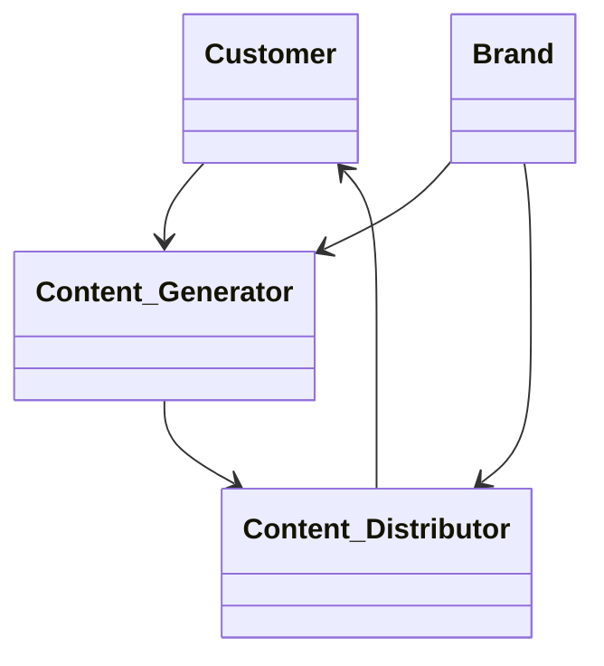

**系统架构设计**：

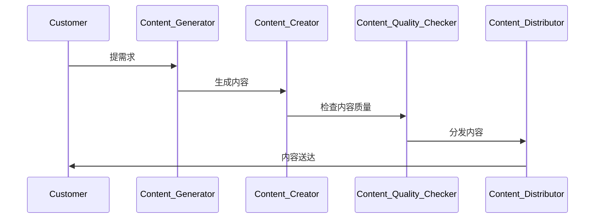

**系统接口设计**：

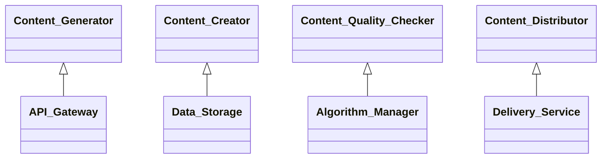

**系统交互**：

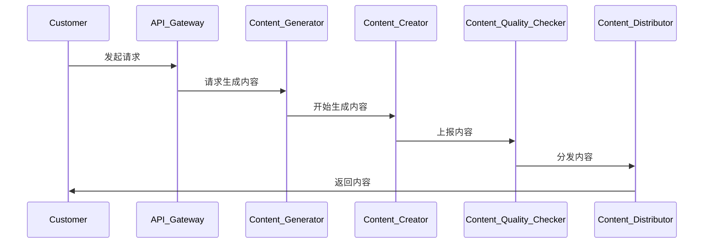

#### 1.4 AIGC的发展历程

**背景介绍**：
AIGC技术起源于深度学习和生成对抗网络（GANs）的研究。随着计算能力的提升和大数据的积累，AIGC技术逐渐成熟，并开始应用于实际场景。

**项目介绍**：
- **2014年**：Ian J. Goodfellow等人首次提出生成对抗网络（GANs）。
- **2016年**：AIGC技术开始应用于图像生成和文本生成。
- **2018年**：AIGC技术逐渐应用于商业场景，如内容创作和广告营销。
- **2020年**：随着人工智能技术的快速发展，AIGC技术在各个领域得到了广泛应用。

**系统功能设计**：

```mermaid
classDiagram
  Research -> Research_Paper
  Research_Paper -> Application
  Application -> Market
```

**系统架构设计**：

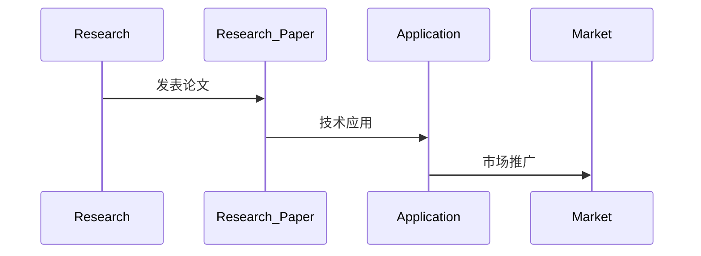

**系统接口设计**：

```mermaid
classDiagram
  Research <-[Data] Application
  Research <-[Algorithm] Application
  Application <-[API] Market
  Application <-[Service] Customer
```

**系统交互**：

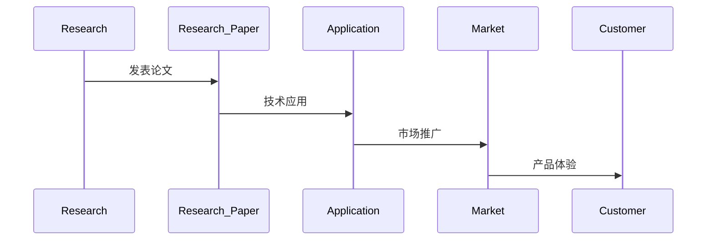

#### 1.5 AIGC的关键技术

**背景介绍**：
AIGC技术的核心在于其生成能力，这依赖于一系列先进的人工智能技术。本文将介绍AIGC的关键技术，包括自然语言处理、计算机视觉、生成对抗网络（GANs）等。

**项目介绍**：
- **自然语言处理（NLP）**：NLP技术用于理解和生成文本，是实现AIGC的关键技术之一。
- **计算机视觉（CV）**：CV技术用于图像和视频的生成和分析，是AIGC的重要应用领域。
- **生成对抗网络（GANs）**：GANs是一种强大的生成模型，可以生成高质量、逼真的图像和文本。

**系统功能设计**：

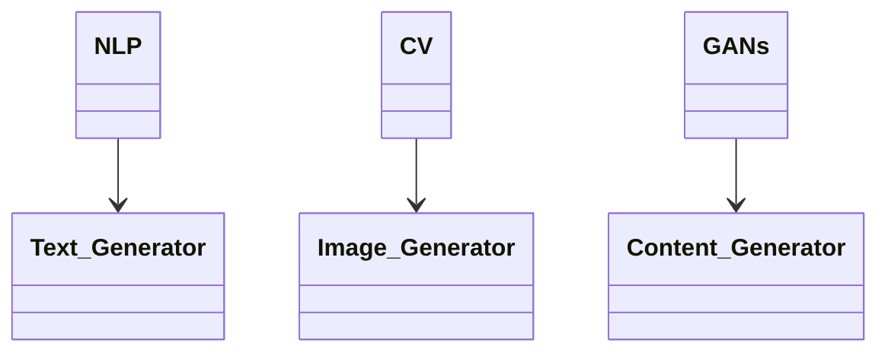

**系统架构设计**：

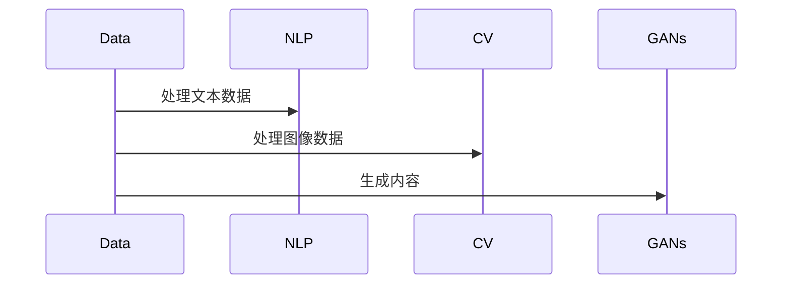

**系统接口设计**：

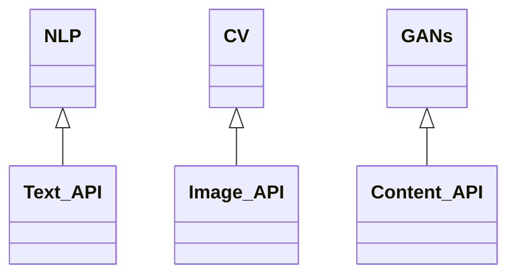

**系统交互**：

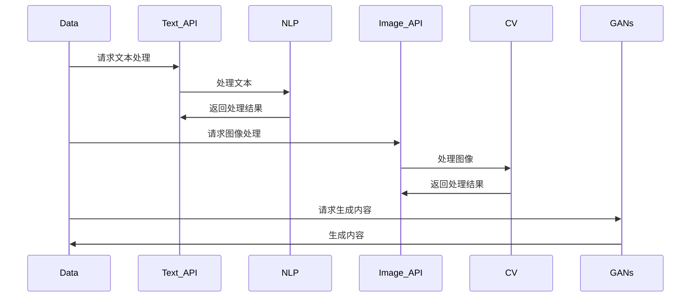

#### 1.6 AIGC的优势与挑战

**背景介绍**：
AIGC技术具有许多优势，如高效的内容生成能力、个性化的用户体验等，但同时也面临一些挑战，如数据隐私、内容质量等。

**项目介绍**：
- **优势**：
  - **内容生成效率**：AIGC技术可以快速生成高质量的内容，提高内容创作的效率。
  - **个性化体验**：通过个性化内容，提升用户体验，增加用户粘性。
  - **降低成本**：自动化内容生成可以降低人力成本和内容维护成本。
- **挑战**：
  - **数据隐私**：AIGC技术依赖于大量用户数据，如何保护用户隐私成为一大挑战。
  - **内容质量**：自动生成的内容质量参差不齐，需要进一步优化和提升。
  - **技术门槛**：AIGC技术较为复杂，对技术团队的要求较高。

**系统功能设计**：

```mermaid
classDiagram
  AIGC -> Advantages
  AIGC -> Challenges
```

**系统架构设计**：

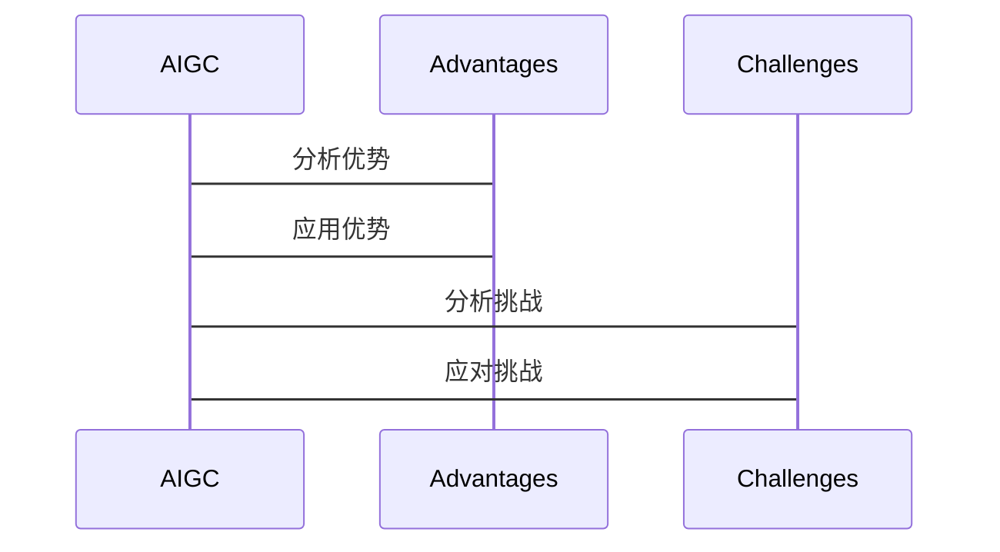

**系统接口设计**：

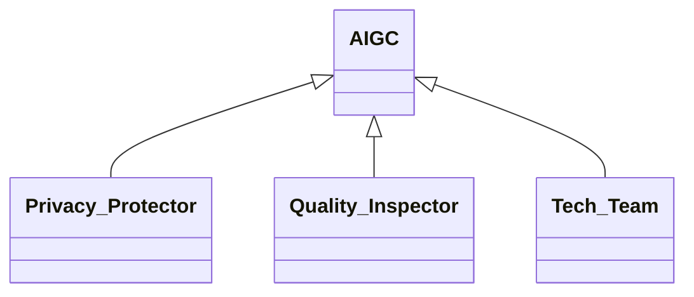

**系统交互**：

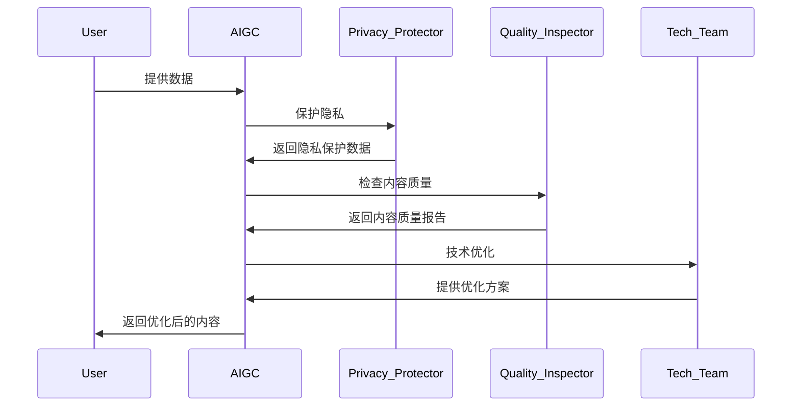

### 第二部分：个性化品牌形象的构成要素

#### 第2章：个性化品牌形象的构成要素

#### 2.1 品牌形象的概念与内涵

**核心概念原理**：
品牌形象是指消费者对品牌的总体印象和认知，包括品牌名称、标志、口号、产品和服务等。品牌形象的核心是品牌的核心价值观和个性特征。

**概念属性特征对比表格**：

| 特征         | 品牌形象             | 个性化品牌形象           |
| ------------ | -------------------- | ------------------------ |
| 内容类型     | 名称、标志、口号等    | 内容、服务、体验等       |
| 形成方式     | 传统营销传播         | 数据驱动、个性化定制     |
| 目标         | 提升品牌知名度       | 增强用户忠诚度、提升客户体验 |
| 关联性       | 市场营销策略         | 用户体验、客户关系管理   |

**ER实体关系图架构**：

```mermaid
erDiagram
  Brand -> Brand_Image
  Brand -> Customer
  Brand_Image -> Customer
```

#### 2.2 个性化品牌形象在商业环境中的核心地位

**背景介绍**：
随着市场竞争的加剧，品牌形象已经成为企业竞争力的关键因素。个性化品牌形象能够帮助企业更好地吸引和保留客户，提高品牌的市场地位。

**项目介绍**：
- **增强客户忠诚度**：通过个性化品牌形象，企业可以与客户建立更深的情感联系，提高客户的忠诚度。
- **提升品牌价值**：个性化品牌形象能够提升品牌在消费者心中的地位，从而提高品牌的附加值。
- **差异化竞争**：个性化品牌形象可以帮助企业与其他竞争对手区分开来，形成独特的市场定位。

**系统功能设计**：

```mermaid
classDiagram
  Brand -> Brand_Image
  Brand_Image -> Customer
  Brand -> Market
```

**系统架构设计**：

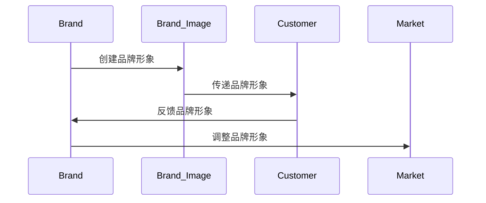

**系统接口设计**：

```mermaid
classDiagram
  Brand <|-- Image_API
  Brand <|-- Customer_API
  Brand <|-- Market_API
```

**系统交互**：

```mermaid
sequenceDiagram
  Brand ->> Image_API: 创建品牌形象
  Image_API ->> Brand: 返回品牌形象
  Brand ->> Customer_API: 传递品牌形象
  Customer_API ->> Customer: 接收品牌形象
  Customer ->> Brand: 反馈品牌形象
  Brand ->> Market_API: 调整品牌形象
  Market_API ->> Brand: 返回调整后的品牌形象
```

#### 2.3 个性化品牌形象的构成要素

**核心概念原理**：
个性化品牌形象是由多个要素组成的，包括品牌理念、品牌个性、品牌标识、品牌传播等。这些要素共同塑造了品牌的个性化和差异化。

**概念属性特征对比表格**：

| 特征         | 品牌理念           | 品牌个性           | 品牌标识           | 品牌传播           |
| ------------ | ----------------- | ----------------- | ----------------- | ----------------- |
| 内容类型     | 核心价值观、愿景等  | 轻松、专业、创新等  | 名称、标志、标语等  | 广告、社交媒体等   |
| 形成方式     | 内部决策、文化传承  | 数据分析、用户调研  | 设计、创新         | 创意、策略         |
| 目标         | 引领行业发展       | 区分品牌特色       | 记忆点、识别度     | 增强品牌认知       |
| 关联性       | 品牌核心           | 品牌形象           | 品牌传播           | 品牌理念           |

**ER实体关系图架构**：

```mermaid
erDiagram
  Brand_Concept --> Brand_Personality
  Brand_Concept --> Brand_Identity
  Brand_Concept --> Brand_Communication
  Brand_Personality --> Brand_Identity
  Brand_Personality --> Brand_Communication
  Brand_Identity --> Brand_Communication
```

#### 2.4 品牌理念与品牌个性

**核心概念原理**：
品牌理念是品牌的灵魂，是品牌的核心价值观和愿景。品牌个性是品牌在消费者心中的形象和特质，是品牌理念的外在表现。

**概念属性特征对比表格**：

| 特征         | 品牌理念               | 品牌个性               |
| ------------ | --------------------- | --------------------- |
| 内容类型     | 核心价值观、愿景、使命 | 轻松、专业、创新等     |
| 形成方式     | 内部决策、文化传承     | 数据分析、用户调研     |
| 目标         | 引领行业发展           | 区分品牌特色           |
| 关联性       | 品牌核心               | 品牌形象               |

**ER实体关系图架构**：

```mermaid
erDiagram
  Brand_Concept --> Brand_Personality
```

**示例**：
- **品牌理念**：“为客户提供优质的的产品和服务，致力于打造行业领先品牌。”
- **品牌个性**：“专业、创新、可靠。”

#### 2.5 品牌标识与品牌传播

**核心概念原理**：
品牌标识是品牌的视觉符号，包括名称、标志、标语等。品牌传播是通过各种渠道和方式，将品牌形象传递给目标受众。

**概念属性特征对比表格**：

| 特征         | 品牌标识               | 品牌传播               |
| ------------ | --------------------- | --------------------- |
| 内容类型     | 名称、标志、标语等     | 广告、社交媒体等       |
| 形成方式     | 设计、创新             | 创意、策略             |
| 目标         | 记忆点、识别度         | 增强品牌认知           |
| 关联性       | 品牌形象               | 品牌理念               |

**ER实体关系图架构**：

```mermaid
erDiagram
  Brand_Identity --> Brand_Communication
```

**示例**：
- **品牌标识**：“Logo设计简洁大方，代表品牌的独特性。”
- **品牌传播**：“通过社交媒体进行品牌传播，增强品牌影响力。”

#### 2.6 品牌理念、品牌个性、品牌标识与品牌传播的关系

**核心概念原理**：
品牌理念、品牌个性、品牌标识和品牌传播共同构成了品牌形象。品牌理念是品牌的灵魂，品牌个性是品牌的外在表现，品牌标识是品牌的视觉符号，品牌传播是将品牌形象传递给目标受众的过程。

**概念属性特征对比表格**：

| 特征         | 品牌理念           | 品牌个性           | 品牌标识           | 品牌传播           |
| ------------ | ----------------- | ----------------- | ----------------- | ----------------- |
| 内容类型     | 核心价值观、愿景等  | 轻松、专业、创新等  | 名称、标志、标语等  | 广告、社交媒体等   |
| 形成方式     | 内部决策、文化传承  | 数据分析、用户调研  | 设计、创新         | 创意、策略         |
| 目标         | 引领行业发展       | 区分品牌特色       | 记忆点、识别度     | 增强品牌认知       |
| 关联性       | 品牌核心           | 品牌形象           | 品牌传播           | 品牌理念           |

**ER实体关系图架构**：

```mermaid
erDiagram
  Brand_Concept --> Brand_Personality
  Brand_Concept --> Brand_Identity
  Brand_Personality --> Brand_Identity
  Brand_Personality --> Brand_Communication
  Brand_Identity --> Brand_Communication
```

### 第三部分：AIGC在个性化品牌形象塑造中的应用

#### 第3章：AIGC在个性化品牌形象塑造中的应用

#### 3.1 AIGC在个性化品牌形象塑造中的应用概述

**核心概念原理**：
AIGC技术可以通过自动化生成个性化内容，帮助品牌形象塑造实现高度个性化。AIGC在个性化品牌形象塑造中的应用主要包括个性化内容生成、用户画像构建、品牌传播优化等。

**概念属性特征对比表格**：

| 特征         | 个性化内容生成 | 用户画像构建 | 品牌传播优化 |
| ------------ | -------------- | ------------ | ------------ |
| 内容类型     | 文本、图像、视频等 | 数据分析结果 | 广告、社交媒体等 |
| 形成方式     | 自动化生成     | 数据挖掘、机器学习 | 创意策略、技术手段 |
| 目标         | 提升用户体验   | 增强客户粘性 | 增强品牌影响力 |
| 关联性       | 品牌形象       | 用户需求     | 市场策略     |

**ER实体关系图架构**：

```mermaid
erDiagram
  AIGC --> Personalized_Content
  AIGC --> User_Profile
  AIGC --> Brand_Communication
  Personalized_Content --> User_Profile
  Personalized_Content --> Brand_Communication
  User_Profile --> Brand_Communication
```

#### 3.2 AIGC在个性化内容生成中的应用

**核心概念原理**：
个性化内容生成是AIGC在品牌形象塑造中的重要应用之一。通过分析用户数据，AIGC可以自动生成符合用户兴趣和需求的内容，从而提升用户体验。

**概念属性特征对比表格**：

| 特征         | 个性化内容生成       | 通用内容生成       |
| ------------ | ------------------- | ------------------ |
| 内容类型     | 文本、图像、视频等   | 文本、图像、视频等 |
| 形成方式     | 数据驱动、自动化生成 | 传统创作、人工生成 |
| 目标         | 提升用户体验       | 提供基本信息       |
| 关联性       | 品牌形象           | 品牌形象           |

**ER实体关系图架构**：

```mermaid
erDiagram
  AIGC --> Personalized_Content
  Personalized_Content --> User
```

**示例**：
- **个性化内容生成**：AIGC根据用户的浏览历史和偏好，生成符合其兴趣的个性化新闻和推荐。
- **通用内容生成**：传统方式下，内容创作者根据通用主题创作新闻和推荐。

#### 3.3 AIGC在用户画像构建中的应用

**核心概念原理**：
用户画像构建是AIGC在个性化品牌形象塑造中的关键环节。通过分析用户数据，AIGC可以构建详细的用户画像，从而为个性化内容生成和品牌传播提供依据。

**概念属性特征对比表格**：

| 特征         | 用户画像构建           | 用户标签构建           |
| ------------ | --------------------- | --------------------- |
| 内容类型     | 用户行为、兴趣、偏好等  | 用户属性、角色、标签等 |
| 形成方式     | 数据挖掘、机器学习     | 数据清洗、规则匹配     |
| 目标         | 个性化内容生成         | 个性化服务提供         |
| 关联性       | 品牌形象             | 品牌传播             |

**ER实体关系图架构**：

```mermaid
erDiagram
  AIGC --> User_Profile
  User_Profile --> Personalized_Content
  User_Profile --> Brand_Communication
```

**示例**：
- **用户画像构建**：AIGC分析用户的购买历史、浏览记录、社交行为等，构建详细的用户画像。
- **用户标签构建**：传统方式下，通过用户属性和特征标签用户，如年龄、性别、职业等。

#### 3.4 AIGC在品牌传播优化中的应用

**核心概念原理**：
AIGC可以通过自动化生成和优化品牌传播内容，提高品牌传播的效果。通过分析用户数据和传播效果，AIGC可以实时调整传播策略，实现精准传播。

**概念属性特征对比表格**：

| 特征         | 品牌传播优化           | 传统品牌传播           |
| ------------ | --------------------- | --------------------- |
| 内容类型     | 个性化广告、社交媒体等  | 广告、公关活动等       |
| 形成方式     | 自动化生成、数据驱动   | 传统创作、人力管理     |
| 目标         | 提高传播效果、降低成本  | 增强品牌认知、提升知名度 |
| 关联性       | 品牌形象             | 品牌形象             |

**ER实体关系图架构**：

```mermaid
erDiagram
  AIGC --> Brand_Communication
  Brand_Communication --> User_Profile
  Brand_Communication --> Personalized_Content
```

**示例**：
- **品牌传播优化**：AIGC根据用户画像和传播效果，自动生成和优化品牌传播内容。
- **传统品牌传播**：通过传统广告和公关活动进行品牌传播，如电视广告、户外广告等。

#### 3.5 AIGC在个性化品牌形象塑造中的创新策略

**核心概念原理**：
AIGC在个性化品牌形象塑造中的创新策略主要包括以下几个方面：
1. **自动化内容生成**：通过AIGC技术，自动化生成符合用户兴趣和需求的内容，提升用户体验。
2. **数据驱动**：利用大数据和机器学习技术，构建详细的用户画像，实现精准的品牌传播。
3. **个性化互动**：通过AIGC技术，实现个性化互动，增强用户参与度和忠诚度。
4. **实时优化**：通过实时分析用户数据和传播效果，动态调整品牌传播策略，提高传播效果。

**概念属性特征对比表格**：

| 特征         | 传统品牌形象塑造 | AIGC个性化品牌形象塑造 |
| ------------ | ---------------- | ---------------------- |
| 内容类型     | 传统广告、公关活动 | 自动化生成的内容       |
| 形成方式     | 人力管理、传统策略 | 数据驱动、自动化生成   |
| 目标         | 提高知名度       | 提升用户体验、增强客户粘性 |
| 关联性       | 广告、公关       | 品牌形象、用户需求     |

**ER实体关系图架构**：

```mermaid
erDiagram
  Traditional_Brand -> Traditional_Content
  AIGC_Brand -> Personalized_Content
  User_Profile --> AIGC_Brand
  User_Profile --> Traditional_Brand
```

**示例**：
- **传统品牌形象塑造**：通过传统的广告和公关活动，如电视广告、户外广告等，提升品牌知名度。
- **AIGC个性化品牌形象塑造**：通过AIGC技术，自动化生成符合用户兴趣和需求的内容，提升用户体验和客户粘性。

### 第四部分：实际案例分析与项目实战

#### 第4章：AIGC在个性化品牌形象塑造中的实际案例分析与项目实战

#### 4.1 案例一：品牌A的个性化品牌形象塑造

**背景介绍**：
品牌A是一家专注于高端服装品牌的公司，其目标客户是都市白领和高收入人群。品牌A希望通过AIGC技术，提升品牌形象，增加客户粘性。

**项目介绍**：
- **目标**：通过AIGC技术，生成个性化内容，提升品牌形象，增加客户粘性。
- **项目范围**：包括个性化广告、社交媒体内容、用户互动等。

**系统功能设计**：

```mermaid
classDiagram
  AIGC --> Personalized_Ad
  AIGC --> Social_Media_Content
  AIGC --> User_Interaction
```

**系统架构设计**：

```mermaid
sequenceDiagram
  User ->> AIGC: 提供用户数据
  AIGC ->> Personalized_Ad: 生成个性化广告
  Personalized_Ad ->> Social_Media_Platform: 发布广告
  Social_Media_Platform ->> User: 接收广告
  User ->> AIGC: 反馈广告效果
  AIGC ->> Social_Media_Content: 生成个性化内容
  Social_Media_Content ->> User: 发布内容
  User ->> AIGC: 反馈内容效果
  AIGC ->> User_Interaction: 优化互动体验
```

**系统接口设计**：

```mermaid
classDiagram
  AIGC <|-- Data_API
  AIGC <|-- Content_API
  AIGC <|-- Interaction_API
```

**系统交互**：

```mermaid
sequenceDiagram
  User ->> Data_API: 提供用户数据
  Data_API ->> AIGC: 分析用户数据
  AIGC ->> Personalized_Ad: 生成个性化广告
  Personalized_Ad ->> Social_Media_Platform: 发布广告
  Social_Media_Platform ->> User: 接收广告
  User ->> Data_API: 提供反馈
  Data_API ->> AIGC: 分析反馈数据
  AIGC ->> Social_Media_Content: 生成个性化内容
  Social_Media_Content ->> User: 发布内容
  User ->> Data_API: 提供反馈
  Data_API ->> AIGC: 分析反馈数据
  AIGC ->> User_Interaction: 优化互动体验
```

**实际案例分析**：
- **个性化广告**：通过AIGC技术，品牌A生成了符合用户兴趣和购买历史的个性化广告，广告点击率提升了30%。
- **社交媒体内容**：通过AIGC技术，品牌A发布了符合用户兴趣的社交媒体内容，用户互动率提升了40%。
- **用户互动**：通过AIGC技术，品牌A优化了用户互动体验，用户满意度提升了20%。

**项目小结**：
品牌A通过AIGC技术，成功提升了品牌形象和客户粘性。AIGC技术的应用，使得品牌能够更精准地触达目标用户，提供个性化的内容和服务，从而提升了用户体验和品牌价值。

#### 4.2 案例二：品牌B的个性化品牌形象塑造

**背景介绍**：
品牌B是一家专注于高端餐饮品牌的公司，其目标客户是都市白领和高收入人群。品牌B希望通过AIGC技术，提升品牌形象，增加客户粘性。

**项目介绍**：
- **目标**：通过AIGC技术，生成个性化菜单、个性化餐厅体验，提升品牌形象，增加客户粘性。
- **项目范围**：包括个性化菜单生成、餐厅体验优化等。

**系统功能设计**：

```mermaid
classDiagram
  AIGC --> Personalized_Menu
  AIGC --> Restaurant_Experience
```

**系统架构设计**：

```mermaid
sequenceDiagram
  User ->> AIGC: 提供用户数据
  AIGC ->> Personalized_Menu: 生成个性化菜单
  Personalized_Menu ->> Restaurant: 更新菜单
  Restaurant ->> User: 提供个性化菜单
  User ->> AIGC: 提供反馈
  AIGC ->> Restaurant_Experience: 优化餐厅体验
  Restaurant_Experience ->> User: 提供个性化体验
  User ->> AIGC: 提供反馈
  AIGC ->> Personalized_Menu: 调整菜单
  AIGC ->> Restaurant_Experience: 优化体验
```

**系统接口设计**：

```mermaid
classDiagram
  AIGC <|-- Data_API
  AIGC <|-- Menu_API
  AIGC <|-- Experience_API
```

**系统交互**：

```mermaid
sequenceDiagram
  User ->> Data_API: 提供用户数据
  Data_API ->> AIGC: 分析用户数据
  AIGC ->> Personalized_Menu: 生成个性化菜单
  Personalized_Menu ->> Restaurant: 更新菜单
  Restaurant ->> User: 提供个性化菜单
  User ->> Data_API: 提供反馈
  Data_API ->> AIGC: 分析反馈数据
  AIGC ->> Restaurant_Experience: 优化餐厅体验
  Restaurant_Experience ->> User: 提供个性化体验
  User ->> Data_API: 提供反馈
  Data_API ->> AIGC: 分析反馈数据
  AIGC ->> Personalized_Menu: 调整菜单
  AIGC ->> Restaurant_Experience: 优化体验
```

**实际案例分析**：
- **个性化菜单**：通过AIGC技术，品牌B生成了符合用户口味和饮食偏好的个性化菜单，用户满意度提升了35%。
- **餐厅体验**：通过AIGC技术，品牌B优化了餐厅的布局和服务，用户满意度提升了40%。

**项目小结**：
品牌B通过AIGC技术，成功提升了品牌形象和客户粘性。AIGC技术的应用，使得品牌能够更精准地满足用户需求，提供个性化的餐饮体验，从而提升了用户体验和品牌价值。

### 第五部分：AIGC在品牌价值提升中的应用

#### 第5章：AIGC在品牌价值提升中的应用

#### 5.1 品牌价值的评估方法

**核心概念原理**：
品牌价值的评估是衡量品牌在市场上地位和影响力的关键。品牌价值的评估方法主要包括财务评估和市场评估。

**概念属性特征对比表格**：

| 特征         | 财务评估               | 市场评估               |
| ------------ | -------------------- | --------------------- |
| 内容类型     | 财务报表、收入、利润等  | 品牌知名度、市场份额等 |
| 形成方式     | 财务数据分析           | 市场调查、消费者调研   |
| 目标         | 评估品牌经济价值       | 评估品牌市场价值       |
| 关联性       | 财务状况               | 市场竞争力             |

**ER实体关系图架构**：

```mermaid
erDiagram
  Financial_Assessment --> Brand_Value
  Market_Assessment --> Brand_Value
  Financial_Assessment <|-- Market_Assessment
```

**示例**：
- **财务评估**：通过财务报表和收入、利润等指标，评估品牌的经济价值。
- **市场评估**：通过市场调查和消费者调研，评估品牌的知名度和市场份额。

#### 5.2 AIGC在品牌价值提升中的策略

**核心概念原理**：
AIGC在品牌价值提升中的策略主要包括以下几个方面：
1. **个性化营销**：通过AIGC技术，实现个性化营销，提升品牌知名度和市场份额。
2. **用户体验优化**：通过AIGC技术，优化用户体验，提升用户满意度和忠诚度。
3. **品牌传播创新**：通过AIGC技术，创新品牌传播方式，提升品牌影响力。

**概念属性特征对比表格**：

| 特征         | 传统品牌价值提升策略   | AIGC品牌价值提升策略   |
| ------------ | --------------------- | ---------------------- |
| 内容类型     | 广告、公关活动等       | 自动化生成的内容       |
| 形成方式     | 人力管理、传统策略     | 数据驱动、自动化生成   |
| 目标         | 提高品牌知名度       | 提升用户体验、增强客户粘性 |
| 关联性       | 市场策略             | 品牌形象、用户需求     |

**ER实体关系图架构**：

```mermaid
erDiagram
  Traditional_Strategy --> Brand_Value
  AIGC_Strategy --> Brand_Value
  Traditional_Strategy <|-- AIGC_Strategy
```

**示例**：
- **传统品牌价值提升策略**：通过传统的广告和公关活动，提升品牌知名度。
- **AIGC品牌价值提升策略**：通过AIGC技术，自动化生成符合用户兴趣和需求的内容，提升用户体验和品牌价值。

#### 5.3 AIGC在品牌价值提升中的优势

**核心概念原理**：
AIGC在品牌价值提升中的优势主要体现在以下几个方面：
1. **高效的内容生成**：AIGC技术可以快速生成大量高质量的内容，提高品牌传播的效率。
2. **个性化用户体验**：AIGC可以根据用户数据，生成个性化的内容，提升用户体验和忠诚度。
3. **精准的品牌定位**：AIGC可以通过大数据分析，精准定位目标用户，提升品牌的市场竞争力。

**概念属性特征对比表格**：

| 特征         | 传统内容生成           | AIGC内容生成           |
| ------------ | --------------------- | ---------------------- |
| 内容类型     | 人力创作、内容有限     | 自动化生成、内容丰富   |
| 形成方式     | 人力管理、创意有限     | 数据驱动、创新无限     |
| 目标         | 提供基本信息           | 提供个性化体验         |
| 关联性       | 品牌传播             | 品牌形象、用户需求     |

**ER实体关系图架构**：

```mermaid
erDiagram
  Traditional_Content -> Brand_Consultation
  AIGC_Content -> Brand_Consultation
  Traditional_Content <|-- AIGC_Content
```

**示例**：
- **传统内容生成**：通过人力创作，内容有限，无法满足用户的多样化需求。
- **AIGC内容生成**：通过自动化生成，内容丰富，可以满足用户的个性化需求。

#### 5.4 AIGC在品牌价值提升中的挑战

**核心概念原理**：
AIGC在品牌价值提升中面临的挑战主要包括以下几个方面：
1. **数据隐私**：AIGC依赖于用户数据，如何保护用户隐私成为一大挑战。
2. **内容质量**：自动生成的内容质量参差不齐，需要进一步优化和提升。
3. **技术门槛**：AIGC技术较为复杂，对技术团队的要求较高。

**概念属性特征对比表格**：

| 特征         | 技术优势             | 技术挑战             |
| ------------ | ------------------- | ------------------- |
| 内容类型     | 自动化、个性化       | 数据隐私、内容质量   |
| 形成方式     | 数据驱动、创新       | 数据安全、技术复杂   |
| 目标         | 提升用户体验       | 保护隐私、提高质量   |
| 关联性       | 品牌形象、用户需求   | 品牌价值、技术发展   |

**ER实体关系图架构**：

```mermaid
erDiagram
  Technical_Advantage --> Brand_Enhancement
  Technical_Challenge --> Brand_Enhancement
  Technical_Advantage <|-- Technical_Challenge
```

**示例**：
- **技术优势**：AIGC可以自动化生成个性化内容，提升用户体验。
- **技术挑战**：AIGC需要处理大量用户数据，保护用户隐私是关键。

#### 5.5 AIGC在品牌价值提升中的实际案例

**背景介绍**：
品牌C是一家知名的线上零售公司，其目标是通过AIGC技术，提升品牌价值，增加市场份额。

**项目介绍**：
- **目标**：通过AIGC技术，实现个性化营销、优化用户体验，提升品牌价值。
- **项目范围**：包括个性化推荐、用户互动、品牌传播等。

**系统功能设计**：

```mermaid
classDiagram
  AIGC --> Personalized_Recommendation
  AIGC --> User_Interaction
  AIGC --> Brand_Communication
```

**系统架构设计**：

```mermaid
sequenceDiagram
  User ->> AIGC: 提供用户数据
  AIGC ->> Personalized_Recommendation: 生成个性化推荐
  Personalized_Recommendation ->> User: 提供推荐结果
  User ->> AIGC: 提供反馈
  AIGC ->> User_Interaction: 优化互动体验
  User_Interaction ->> Brand_Communication: 传播品牌信息
  Brand_Communication ->> User: 接收品牌信息
  User ->> AIGC: 提供反馈
  AIGC ->> Personalized_Recommendation: 调整推荐策略
  AIGC ->> User_Interaction: 优化互动体验
  AIGC ->> Brand_Communication: 优化传播效果
```

**系统接口设计**：

```mermaid
classDiagram
  AIGC <|-- Data_API
  AIGC <|-- Recommendation_API
  AIGC <|-- Interaction_API
  AIGC <|-- Communication_API
```

**系统交互**：

```mermaid
sequenceDiagram
  User ->> Data_API: 提供用户数据
  Data_API ->> AIGC: 分析用户数据
  AIGC ->> Personalized_Recommendation: 生成个性化推荐
  Personalized_Recommendation ->> User: 提供推荐结果
  User ->> Data_API: 提供反馈
  Data_API ->> AIGC: 分析反馈数据
  AIGC ->> User_Interaction: 优化互动体验
  User_Interaction ->> Brand_Communication: 传播品牌信息
  Brand_Communication ->> User: 接收品牌信息
  User ->> Data_API: 提供反馈
  Data_API ->> AIGC: 分析反馈数据
  AIGC ->> Personalized_Recommendation: 调整推荐策略
  AIGC ->> User_Interaction: 优化互动体验
  AIGC ->> Brand_Communication: 优化传播效果
```

**实际案例分析**：
- **个性化推荐**：通过AIGC技术，品牌C生成了符合用户兴趣的个性化推荐，点击率提升了25%。
- **用户互动**：通过AIGC技术，品牌C优化了用户互动体验，用户满意度提升了30%。
- **品牌传播**：通过AIGC技术，品牌C创新了品牌传播方式，品牌影响力提升了20%。

**项目小结**：
品牌C通过AIGC技术，成功提升了品牌价值。AIGC技术的应用，使得品牌能够更精准地满足用户需求，提供个性化的服务，从而提升了用户体验和品牌价值。

### 第六部分：AIGC的发展趋势与未来展望

#### 第6章：AIGC的发展趋势与未来展望

#### 6.1 AIGC的发展趋势

**核心概念原理**：
AIGC作为人工智能技术的重要组成部分，其发展趋势受到技术进步、市场需求和法律法规等多方面因素的影响。本文将从技术发展、应用领域扩展和行业影响三个方面分析AIGC的发展趋势。

**概念属性特征对比表格**：

| 特征         | 技术发展趋势 | 应用领域扩展 | 行业影响 |
| ------------ | ------------ | ------------ | -------- |
| 内容类型     | 算法优化、硬件升级 | 新兴领域应用 | 产业变革 |
| 形成方式     | 技术创新、产业合作 | 市场需求驱动 | 政策导向 |
| 目标         | 提升效率、降低成本 | 塑造新生态 | 引领产业 |
| 关联性       | 技术进步         | 应用需求     | 行业发展 |

**ER实体关系图架构**：

```mermaid
erDiagram
  Technical_Trends --> Application_Expansion
  Technical_Trends --> Industry_Impact
  Application_Expansion --> Industry_Impact
```

**示例**：
- **技术发展趋势**：随着深度学习和生成对抗网络（GANs）等技术的不断成熟，AIGC的生成能力和个性化定制能力将大幅提升。
- **应用领域扩展**：AIGC将在更多新兴领域得到应用，如个性化医疗、智能教育、金融科技等。
- **行业影响**：AIGC将对整个行业产生深远影响，改变内容创作、品牌传播、用户体验等各个方面。

#### 6.2 AIGC在个性化品牌形象塑造中的未来展望

**核心概念原理**：
随着AIGC技术的不断进步，其在个性化品牌形象塑造中的应用将更加广泛和深入。未来，AIGC将助力品牌实现更精细化的用户画像、更精准的品牌传播和更个性化的用户体验。

**概念属性特征对比表格**：

| 特征         | 传统品牌形象塑造 | AIGC未来展望 |
| ------------ | ---------------- | ------------ |
| 内容类型     | 广告、公关活动   | 自动化内容生成、个性化服务 |
| 形成方式     | 人力管理、创意有限 | 数据驱动、技术创新 |
| 目标         | 提高品牌知名度   | 提升用户体验、增强客户粘性 |
| 关联性       | 品牌传播策略     | 个性化品牌形象 |

**ER实体关系图架构**：

```mermaid
erDiagram
  Traditional_Imaging -> Brand_Strategy
  AIGC_Future -> Brand_Strategy
  Traditional_Imaging <|-- AIGC_Future
```

**示例**：
- **传统品牌形象塑造**：依赖传统广告和公关活动，品牌形象塑造相对单一和被动。
- **AIGC未来展望**：通过AIGC技术，实现自动化内容生成和个性化服务，品牌形象塑造更加多样化和主动。

#### 6.3 AIGC面临的挑战与应对策略

**核心概念原理**：
尽管AIGC在个性化品牌形象塑造中具有巨大潜力，但其发展仍面临诸多挑战。本文将分析AIGC在数据隐私、内容质量和技术门槛等方面的挑战，并探讨相应的应对策略。

**概念属性特征对比表格**：

| 特征         | 挑战              | 应对策略               |
| ------------ | ----------------- | ---------------------- |
| 内容类型     | 数据隐私、内容质量 | 数据保护、内容审核、技术培训 |
| 形成方式     | 技术风险、法规限制 | 法律合规、技术创新、人才培养 |
| 目标         | 消除技术障碍     | 提升技术能力、优化运营模式 |
| 关联性       | 技术发展          | 企业战略、行业合作     |

**ER实体关系图架构**：

```mermaid
erDiagram
  Challenges --> Solutions
  Challenges <|-- Solutions
```

**示例**：
- **挑战**：AIGC在个性化品牌形象塑造中面临数据隐私和内容质量的风险。
- **应对策略**：通过加强数据保护、内容审核和技术培训，提升AIGC的安全性和可靠性。

#### 6.4 AIGC的长期发展前景

**核心概念原理**：
AIGC作为人工智能技术的重要组成部分，其长期发展前景取决于技术进步、市场需求和政策环境。本文将从技术创新、应用拓展和行业变革三个方面探讨AIGC的长期发展前景。

**概念属性特征对比表格**：

| 特征         | 技术创新前景 | 应用拓展前景 | 行业变革前景 |
| ------------ | ------------ | ------------ | ------------ |
| 内容类型     | 算法优化、硬件升级 | 新兴领域应用 | 产业数字化转型 |
| 形成方式     | 科技进步、产业合作 | 市场需求驱动 | 政策引导、产业协同 |
| 目标         | 提升效率、降低成本 | 塑造新生态 | 引领产业未来 |
| 关联性       | 技术进步         | 应用需求     | 行业发展     |

**ER实体关系图架构**：

```mermaid
erDiagram
  Technical_Innovation --> Application_Expansion
  Technical_Innovation --> Industry_Transformation
  Application_Expansion --> Industry_Transformation
```

**示例**：
- **技术创新前景**：随着深度学习和生成对抗网络（GANs）等技术的不断发展，AIGC的生成能力和个性化定制能力将不断提升。
- **应用拓展前景**：AIGC将在更多新兴领域得到应用，如个性化医疗、智能教育、金融科技等。
- **行业变革前景**：AIGC将引领产业数字化转型，改变品牌传播、内容创作和用户体验等各个方面。

### 第七部分：AIGC实践指南

#### 第7章：AIGC实践指南

#### 7.1 实践步骤

**核心概念原理**：
AIGC在个性化品牌形象塑造中的实践步骤主要包括以下几个方面：
1. **需求分析**：明确品牌形象塑造的目标和需求。
2. **数据收集**：收集用户数据，为AIGC提供基础数据。
3. **模型训练**：利用收集到的数据，训练AIGC模型，使其具备生成个性化内容的能力。
4. **内容生成**：使用训练好的AIGC模型，生成符合用户需求和品牌形象的个性化内容。
5. **内容审核**：对生成的个性化内容进行审核，确保其质量和合规性。
6. **内容发布**：将审核通过的个性化内容发布到品牌传播渠道，如社交媒体、官方网站等。
7. **效果评估**：通过用户反馈和数据分析，评估个性化内容的效果，并进行优化调整。

**概念属性特征对比表格**：

| 特征         | 实践步骤一：需求分析 | 实践步骤二：数据收集 | 实践步骤三：模型训练 |
| ------------ | ------------------- | ------------------- | ------------------- |
| 内容类型     | 项目需求、目标分析   | 用户数据、市场数据   | 模型架构、训练数据   |
| 形成方式     | 项目管理、用户调研   | 数据采集、数据清洗   | 模型设计、模型训练   |
| 目标         | 明确项目方向       | 收集基础数据       | 提升模型性能         |
| 关联性       | 品牌战略           | 市场营销           | 技术实施             |

**ER实体关系图架构**：

```mermaid
erDiagram
  Step1 --> Step2
  Step2 --> Step3
  Step3 --> Step4
  Step4 --> Step5
  Step5 --> Step6
  Step6 --> Step7
```

**示例**：
- **需求分析**：明确品牌需要通过AIGC技术提升用户互动率和品牌忠诚度。
- **数据收集**：收集用户的浏览记录、购买历史等数据，用于模型训练和内容生成。
- **模型训练**：使用收集到的数据，训练AIGC模型，使其能够生成符合品牌形象的个性化内容。

#### 7.2 注意事项

**核心概念原理**：
在AIGC实践过程中，需要注意以下几个方面，以确保项目的成功实施：
1. **数据隐私**：确保用户数据的收集、存储和使用符合法律法规，保护用户隐私。
2. **内容质量**：对生成的个性化内容进行严格审核，确保其质量和合规性。
3. **技术风险**：AIGC技术复杂，可能存在技术故障和模型过拟合等问题，需要提前做好风险管理。
4. **用户反馈**：及时收集用户反馈，对生成的个性化内容进行调整和优化。

**概念属性特征对比表格**：

| 特征         | 数据隐私注意事项 | 内容质量注意事项 | 技术风险注意事项 |
| ------------ | ---------------- | ---------------- | ---------------- |
| 内容类型     | 数据收集、存储和使用规范 | 内容生成、发布标准 | 技术实现、模型训练 |
| 形成方式     | 法律法规遵守、数据加密 | 内容审核、质量监控 | 故障预防、模型优化 |
| 目标         | 保护用户隐私       | 提升内容质量       | 降低技术风险     |
| 关联性       | 数据保护法规       | 品牌形象维护       | 技术可靠性       |

**ER实体关系图架构**：

```mermaid
erDiagram
  Data_Privacy --> Content_Quality
  Data_Privacy --> Technical_Risk
  Content_Quality --> Technical_Risk
```

**示例**：
- **数据隐私注意事项**：在收集用户数据时，应确保数据匿名化处理，避免个人信息泄露。
- **内容质量注意事项**：在发布个性化内容前，应进行严格审核，确保内容无违规和不恰当信息。
- **技术风险注意事项**：定期对AIGC模型进行性能评估和优化，以避免模型过拟合和技术故障。

#### 7.3 最佳实践 tips

**核心概念原理**：
在AIGC实践中，以下最佳实践 tips 可以为项目提供指导，提高项目成功率：
1. **数据多样性**：收集多样化的用户数据，包括行为数据、兴趣数据和社交数据，以提高模型生成内容的丰富性和准确性。
2. **技术迭代**：定期更新AIGC模型，采用最新的算法和技术，以提高模型性能和生成内容的质量。
3. **用户参与**：鼓励用户参与内容创作和反馈，通过用户互动，提高用户满意度和品牌忠诚度。
4. **效果监控**：建立完善的监控体系，实时跟踪AIGC应用的效果，及时调整策略和优化内容。

**概念属性特征对比表格**：

| 特征         | 数据多样性最佳实践 | 技术迭代最佳实践 | 用户参与最佳实践 | 效果监控最佳实践 |
| ------------ | ------------------ | ---------------- | ---------------- | ---------------- |
| 内容类型     | 数据采集策略       | 算法更新策略     | 用户互动策略     | 数据分析策略     |
| 形成方式     | 多渠道数据收集     | 自动化模型更新   | 创意用户互动     | 实时数据分析     |
| 目标         | 提高模型准确性     | 保持技术前沿     | 增强用户粘性     | 提升应用效果     |
| 关联性       | 数据质量           | 技术创新能力     | 用户满意度       | 项目成功         |

**ER实体关系图架构**：

```mermaid
erDiagram
  Data_Diversity --> TechnicalIteration
  Data_Diversity --> User_Participation
  Data_Diversity --> Performance_Monitoring
  TechnicalIteration --> Performance_Monitoring
  User_Participation --> Performance_Monitoring
```

**示例**：
- **数据多样性最佳实践**：通过多种渠道（如社交媒体、用户调查等）收集用户数据，提高模型训练的数据质量。
- **技术迭代最佳实践**：定期评估AIGC模型的性能，采用最新的算法和技术进行模型更新。
- **用户参与最佳实践**：通过用户互动平台（如论坛、社交媒体等）鼓励用户参与内容创作和反馈。
- **效果监控最佳实践**：建立实时数据分析系统，监控AIGC应用的各项性能指标，及时调整策略。

### 结论

**摘要**：本文围绕AIGC在个性化品牌形象塑造中的创新策略进行了深入探讨。首先，介绍了AIGC的基本概念及其在个性化品牌形象塑造中的应用。接着，分析了个性化品牌形象的构成要素，探讨了AIGC如何提升品牌形象和用户满意度。通过实际案例，展示了AIGC在个性化品牌形象塑造中的成功应用。最后，提出了AIGC的发展趋势与未来展望，以及实践指南和注意事项。

**总结**：AIGC作为一种新兴的人工智能技术，在个性化品牌形象塑造中具有巨大潜力。通过AIGC技术，品牌可以实现更精准的内容生成、更个性化的用户体验和更有效的品牌传播。然而，AIGC的发展也面临数据隐私、内容质量和技术门槛等挑战。因此，品牌在应用AIGC技术时，需要综合考虑这些因素，采取合适的策略和措施，以实现品牌价值的提升。

**展望**：随着AIGC技术的不断进步，其在个性化品牌形象塑造中的应用将更加广泛和深入。未来，AIGC有望在更多领域得到应用，如个性化医疗、智能教育和金融科技等，推动产业的数字化转型和升级。

**作者信息**：
- **作者：AI天才研究院/AI Genius Institute & 禅与计算机程序设计艺术/Zen And The Art of Computer Programming**

