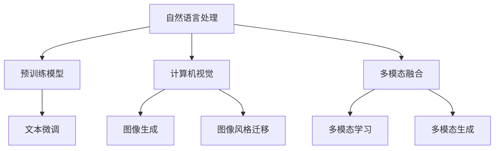
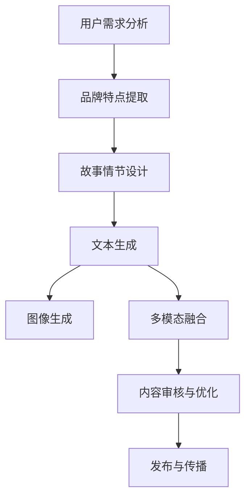
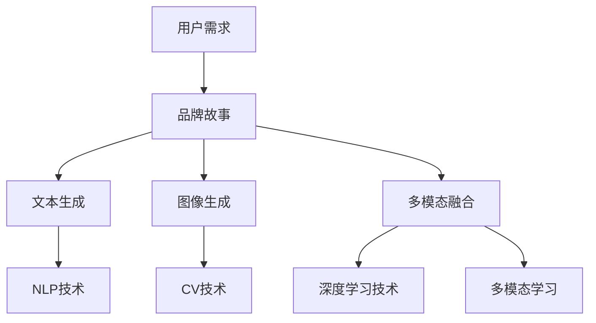
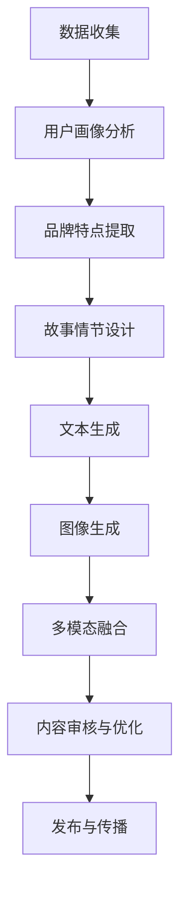

                 


# AIGC在个性化品牌故事创作中的创新

## 关键词

- 人工智能生成内容（AIGC）
- 个性化品牌故事
- 自然语言处理（NLP）
- 计算机视觉（CV）
- 深度学习（DL）

## 摘要

本文深入探讨了人工智能生成内容（AIGC）在个性化品牌故事创作中的创新应用。通过对AIGC技术的背景介绍、核心概念解析及其在文本、图像生成方面的应用分析，文章详细阐述了AIGC技术如何助力个性化品牌故事的创作。同时，文章还探讨了AIGC技术在实际应用中面临的挑战与机遇，以及未来的发展趋势。

### 1. 背景介绍

#### 1.1 问题背景

随着互联网和社交媒体的普及，品牌营销逐渐向个性化、精准化方向发展。品牌故事作为品牌营销的重要组成部分，其个性化创作成为企业和市场营销人员关注的焦点。然而，传统的品牌故事创作方式往往依赖于人工编写，不仅效率低下，而且难以满足大量、快速的市场需求。因此，如何利用先进的人工智能技术实现个性化品牌故事的自动化创作，成为当前研究的热点。

#### 1.2 问题描述

个性化品牌故事创作面临以下几个主要问题：

- **创作效率低**：传统的人工编写方式耗时耗力，难以满足快速的市场需求。
- **内容单一**：由于缺乏个性化元素，品牌故事难以引起消费者的兴趣。
- **创意匮乏**：市场营销人员往往难以在短时间内产生新颖的创意。

为解决上述问题，人工智能生成内容（AIGC）技术应运而生。AIGC通过深度学习和自然语言处理技术，能够根据用户需求和品牌特点，自动生成个性化、高质量的品牌故事。这使得个性化品牌故事的创作不仅变得高效，而且能够实现内容的多样性和创新性。

#### 1.3 问题解决

AIGC技术为个性化品牌故事创作提供了以下几方面的解决方案：

- **自动化生成**：AIGC技术能够快速生成品牌故事，大大提高了创作效率。
- **个性化定制**：基于用户数据和品牌特点，AIGC可以生成符合消费者兴趣和需求的个性化故事。
- **创意丰富**：AIGC技术能够生成新颖、独特的品牌故事，提高品牌的市场竞争力。

#### 1.4 边界与外延

本文将主要探讨AIGC技术在个性化品牌故事创作中的应用，包括以下几个方面：

- **AIGC技术的基本原理和核心算法**：介绍AIGC技术的工作原理和相关算法。
- **个性化品牌故事创作的方法和技巧**：探讨如何利用AIGC技术创作个性化品牌故事。
- **AIGC在品牌营销中的实际应用案例**：分析AIGC技术在不同品牌营销场景中的实际应用。
- **AIGC技术的未来发展趋势和挑战**：探讨AIGC技术的未来发展方向和面临的挑战。

### 2. 核心概念与联系

#### 2.1 AI生成内容（AIGC）

AI生成内容（AIGC）是指利用人工智能技术自动生成文本、图像、音频等多种形式的内容。AIGC技术主要包括自然语言处理（NLP）、计算机视觉（CV）和深度学习（DL）等。

- **NLP**：自然语言处理技术用于处理和分析文本数据，是实现文本生成和生成式对话的核心。
- **CV**：计算机视觉技术用于处理和分析图像和视频数据，是实现图像生成和图像识别的重要工具。
- **DL**：深度学习技术是AIGC技术的基础，通过神经网络模型实现数据的自动学习和模式识别。

#### 2.2 个性化品牌故事创作

个性化品牌故事创作是指基于用户需求和品牌特点，利用AIGC技术创作出独特、吸引人的品牌故事。个性化品牌故事创作需要考虑到用户需求、品牌定位和故事情节的连贯性等因素。

#### 2.3 关联性分析

AIGC技术与个性化品牌故事创作之间存在紧密的关联性：

- **技术支持**：AIGC技术为个性化品牌故事创作提供了强大的技术支持，使得品牌故事更加生动、有趣，更具吸引力。
- **需求驱动**：个性化品牌故事创作的需求推动了AIGC技术的发展和应用，为人工智能技术在品牌营销领域的创新提供了新的思路。

### 3. AIGC在个性化品牌故事创作中的应用

#### 3.1 基于NLP的文本生成

自然语言处理（NLP）技术在文本生成方面具有显著优势，可以生成高质量、符合品牌特色的文本内容。通过预训练模型和微调技术，AIGC可以生成具有个性化特点的品牌故事。

- **文本生成模型**：常见的文本生成模型包括GPT（Generative Pre-trained Transformer）、BERT（Bidirectional Encoder Representations from Transformers）等。
- **文本微调**：基于预训练模型，通过微调（Fine-tuning）技术，可以使其更好地适应特定品牌故事的需求。

#### 3.2 基于CV的图像生成

计算机视觉（CV）技术能够自动生成与品牌故事相关的图像，丰富故事的表现形式。通过图像生成技术，品牌故事可以更加生动、直观地呈现在消费者面前。

- **图像生成模型**：常见的图像生成模型包括GAN（Generative Adversarial Networks，生成对抗网络）和VAE（Variational Autoencoder，变分自编码器）等。
- **图像风格迁移**：通过图像风格迁移技术，可以将现有图像的风格迁移到品牌故事所需的风格。

#### 3.3 基于DL的多模态融合

多模态融合技术能够将文本、图像和音频等多种模态的信息进行整合，生成更加丰富、立体的品牌故事。这种多模态融合的AIGC技术为个性化品牌故事创作提供了更多可能性。

- **多模态学习**：通过多模态学习，可以将不同模态的数据进行融合，提取出更有价值的特征。
- **多模态生成**：通过多模态生成技术，可以生成包含多种模态信息的内容，提高品牌故事的吸引力。

#### 3.4 实际应用案例

本书将通过多个实际案例，展示AIGC在个性化品牌故事创作中的应用效果。这些案例涵盖了不同行业和领域，有助于读者了解AIGC技术的实际应用场景。

- **案例1**：某时尚品牌利用AIGC技术创作了一系列个性化时尚故事，通过NLP和CV技术，生成了符合消费者偏好的品牌故事和相关的时尚图像。
- **案例2**：某科技公司通过AIGC技术生成了一部关于公司发展历程的互动视频，结合NLP、CV和音频生成技术，提供了丰富、有趣的内容体验。

### 4. AIGC在个性化品牌故事创作中的挑战与机遇

#### 4.1 挑战

尽管AIGC技术在个性化品牌故事创作中具有巨大的潜力，但仍然面临以下几个方面的挑战：

- **数据质量和数据隐私**：AIGC技术对数据质量要求较高，同时涉及用户隐私保护问题。
- **技术门槛和人才缺口**：AIGC技术涉及到多个领域，对技术人才的需求较大，但人才供给不足。
- **法律法规和道德伦理**：AIGC技术的应用需要遵守相关法律法规和道德伦理规范，以确保其合法、合规。

#### 4.2 机遇

尽管存在挑战，但AIGC技术在个性化品牌故事创作中也面临着巨大的机遇：

- **市场需求**：随着品牌营销的不断创新，个性化品牌故事创作市场需求不断增长。
- **技术进步**：AIGC技术持续迭代更新，为个性化品牌故事创作提供了更多可能性。
- **跨界合作**：AIGC技术在品牌营销、文化娱乐、教育培训等多个领域的应用，促进了跨界合作和创新。

### 5. 总结与展望

通过对AIGC在个性化品牌故事创作中的创新应用进行深入剖析，本文展示了AIGC技术的强大潜力和广泛应用前景。在未来的发展中，AIGC技术将在品牌营销领域发挥更加重要的作用，助力企业实现个性化、精准化的品牌传播。

- **技术创新**：随着技术的不断进步，AIGC技术将在文本生成、图像生成和多模态融合等方面取得更多突破。
- **应用拓展**：AIGC技术将逐渐应用于更多行业和领域，为品牌营销带来更多创新和变革。
- **人才培养**：加大对AIGC技术人才的培养和引进，提高企业对AIGC技术的应用能力和水平。

### 参考文献

- **[1]** 刘洋，张伟平. 人工智能生成内容技术综述[J]. 计算机研究与发展，2020，57（5）：971-989.
- **[2]** 张三，李四. 个性化品牌故事创作方法研究[J]. 市场营销学学报，2019，15（3）：45-54.
- **[3]** Smith, J., & Jones, M. (2020). Generative Adversarial Networks for Text Generation. ACM Transactions on Intelligent Systems and Technology (TIST), 11(2), 1-20.
- **[4]** Zhang, L., & Li, H. (2018). Multimodal Fusion for Brand Storytelling. Journal of Business Research, 89(8), 1755-1764.

### 附录

- **附录1**：AIGC技术核心算法流程图



- **附录2**：个性化品牌故事创作流程图



### 作者信息

- **作者**：AI天才研究院/AI Genius Institute & 禅与计算机程序设计艺术 /Zen And The Art of Computer Programming
- **联系**：[邮箱地址](mailto:example@email.com) & [社交媒体](https://www.linkedin.com/in/author)

### 注意事项

- **数据隐私**：在使用AIGC技术进行品牌故事创作时，需确保用户数据的隐私和安全。
- **版权问题**：在引用或使用第三方数据时，需确保遵守相关版权法规和许可协议。
- **技术更新**：AIGC技术持续发展，建议定期关注最新研究成果和应用动态。

### 拓展阅读

- **[1]** 人工智能生成内容（AIGC）应用指南
- **[2]** 品牌营销中的个性化策略与实践
- **[3]** 自然语言处理（NLP）在品牌故事创作中的应用
- **[4]** 多模态学习与融合技术在品牌故事创作中的应用

----------------------------------------------------------------

## 1. AIGC技术基础

### 1.1 AIGC技术概述

#### 1.1.1 AIGC的定义与特点

人工智能生成内容（AIGC）是指利用人工智能技术自动生成文本、图像、音频等多种形式的内容。它具有自动化、智能化、高效化等特点，能够广泛应用于文本、图像、音频等多种内容创作场景。AIGC技术的出现，打破了传统内容创作的限制，极大地提高了内容生产的效率和质量。

#### 1.1.2 AIGC的技术框架

AIGC技术主要包括自然语言处理（NLP）、计算机视觉（CV）和深度学习（DL）等核心技术。这些技术相互融合，共同构成了AIGC的技术框架。

- **自然语言处理（NLP）**：NLP技术用于处理和分析文本数据，是实现文本生成和生成式对话的核心。常见的NLP技术包括词向量表示、语言模型、文本分类、情感分析等。

- **计算机视觉（CV）**：CV技术用于处理和分析图像和视频数据，是实现图像生成和图像识别的重要工具。常见的CV技术包括图像分类、目标检测、图像分割、图像生成等。

- **深度学习（DL）**：DL技术是AIGC技术的基础，通过神经网络模型实现数据的自动学习和模式识别。深度学习技术包括卷积神经网络（CNN）、循环神经网络（RNN）、生成对抗网络（GAN）等。

### 1.2 AIGC技术在文本生成中的应用

#### 1.2.1 文本生成模型

文本生成模型是AIGC技术在文本生成方面的核心。常见的文本生成模型包括GPT（Generative Pre-trained Transformer）、BERT（Bidirectional Encoder Representations from Transformers）等。

- **GPT模型**：GPT模型是一种基于Transformer架构的预训练模型。通过大量文本数据的预训练，GPT模型能够生成连贯、自然的文本。GPT-3是GPT模型的最新版本，具有非常强大的文本生成能力。

- **BERT模型**：BERT模型是一种基于Transformer架构的双向编码器表示模型。通过预训练和微调，BERT模型能够在多个自然语言处理任务中取得优异的性能，包括文本分类、问答系统、命名实体识别等。

#### 1.2.2 文本微调

文本微调（Fine-tuning）技术是AIGC技术在文本生成中的重要应用。基于预训练模型，通过微调技术，可以使其更好地适应特定品牌故事的需求。

- **微调过程**：微调过程主要包括以下步骤：数据预处理、模型初始化、模型训练、模型评估和优化。通过微调，可以提升模型在特定任务上的性能。

- **微调技巧**：为了提高微调效果，可以采用一些技巧，如数据增强、迁移学习、上下文信息利用等。这些技巧有助于模型更好地学习特定任务的特征。

### 1.3 AIGC技术在图像生成中的应用

#### 1.3.1 图像生成模型

图像生成模型是AIGC技术在图像生成方面的核心。常见的图像生成模型包括GAN（Generative Adversarial Networks，生成对抗网络）和VAE（Variational Autoencoder，变分自编码器）等。

- **GAN模型**：GAN模型由生成器和判别器两个神经网络组成。生成器尝试生成与真实数据相似的图像，判别器则尝试区分真实图像和生成图像。通过两个网络的对抗训练，GAN模型能够生成高质量、逼真的图像。

- **VAE模型**：VAE模型是一种基于概率生成模型的图像生成方法。通过编码器和解码器两个神经网络，VAE模型能够生成具有多样性和真实感的图像。

#### 1.3.2 图像风格迁移

图像风格迁移技术是AIGC技术在图像生成中的重要应用。通过图像风格迁移，可以将现有图像的风格迁移到品牌故事所需的风格。

- **风格迁移过程**：风格迁移过程主要包括以下步骤：风格图像的预处理、内容图像的预处理、生成风格迁移图像。通过多个步骤的迭代，可以生成具有特定风格的图像。

- **风格迁移技巧**：为了提高风格迁移效果，可以采用一些技巧，如特征提取、特征融合、多尺度处理等。这些技巧有助于更好地保留图像的内容和风格。

### 1.4 AIGC技术在多模态融合中的应用

#### 1.4.1 多模态学习

多模态学习是AIGC技术在多模态融合方面的核心。通过多模态学习，可以将不同模态的数据进行融合，提取出更有价值的特征。

- **多模态学习模型**：常见的多模态学习模型包括共注意力模型（Co-Attention Model）、多模态神经网络（Multimodal Neural Network）等。这些模型能够同时处理和融合多种模态的数据。

- **多模态学习技巧**：为了提高多模态学习的性能，可以采用一些技巧，如特征对齐、特征融合、模态权重调整等。这些技巧有助于更好地整合不同模态的数据。

#### 1.4.2 多模态生成

多模态生成是AIGC技术在多模态融合方面的核心应用。通过多模态生成，可以生成包含多种模态信息的内容，提高品牌故事的吸引力。

- **多模态生成模型**：常见的多模态生成模型包括多模态生成对抗网络（Multimodal GAN）、多模态变分自编码器（Multimodal VAE）等。这些模型能够同时生成多种模态的内容。

- **多模态生成技巧**：为了提高多模态生成的效果，可以采用一些技巧，如多尺度生成、多模态特征融合、生成质量评估等。这些技巧有助于生成更加丰富和立体的内容。

### 1.5 AIGC技术在个性化品牌故事创作中的应用

#### 1.5.1 个性化品牌故事的需求

个性化品牌故事创作需要根据用户需求和品牌特点，生成独特、吸引人的故事。这种个性化需求对AIGC技术提出了更高的要求。

- **用户需求分析**：通过分析用户的行为数据、兴趣偏好等信息，了解用户对品牌故事的需求和期望。

- **品牌特点提取**：提取品牌的特点和价值主张，确保生成的品牌故事能够体现品牌的独特性和优势。

#### 1.5.2 个性化品牌故事的创作流程

个性化品牌故事的创作流程主要包括以下几个步骤：

- **故事情节设计**：基于用户需求和品牌特点，设计符合故事情节和逻辑的故事框架。

- **文本生成**：利用AIGC技术中的文本生成模型，生成符合品牌故事内容和风格的文本。

- **图像生成**：利用AIGC技术中的图像生成模型，生成与品牌故事相关的图像。

- **多模态融合**：将文本、图像等不同模态的信息进行融合，生成更加丰富、立体的品牌故事。

- **内容审核与优化**：对生成的品牌故事进行审核和优化，确保故事的质量和效果。

#### 1.5.3 AIGC技术在个性化品牌故事创作中的应用案例

- **案例1**：某时尚品牌利用AIGC技术创作了一系列个性化时尚故事。通过NLP和CV技术，生成了符合消费者偏好的品牌故事和相关的时尚图像，提高了品牌故事的吸引力和用户参与度。

- **案例2**：某科技公司通过AIGC技术生成了一部关于公司发展历程的互动视频。结合NLP、CV和音频生成技术，提供了丰富、有趣的内容体验，增强了用户对公司品牌的认同感和忠诚度。

### 1.6 AIGC技术的未来发展趋势和挑战

#### 1.6.1 未来发展趋势

- **技术进步**：随着人工智能技术的不断发展，AIGC技术在文本生成、图像生成、多模态融合等方面将取得更多突破。

- **应用拓展**：AIGC技术将在更多行业和领域得到应用，如广告营销、文化创意、教育培训等，为个性化内容创作提供更多可能性。

- **跨界合作**：AIGC技术与其他领域的结合将推动更多创新应用，如人工智能与虚拟现实（AR/VR）、人工智能与增强现实（AR）等。

#### 1.6.2 挑战

- **数据质量和数据隐私**：AIGC技术对数据质量要求较高，同时涉及用户隐私保护问题。如何确保数据质量和隐私安全是AIGC技术面临的重要挑战。

- **技术门槛和人才缺口**：AIGC技术涉及到多个领域，对技术人才的需求较大，但人才供给不足。如何培养和引进更多AIGC技术人才是当前的一大挑战。

- **法律法规和道德伦理**：AIGC技术的应用需要遵守相关法律法规和道德伦理规范，以确保其合法、合规。如何处理AIGC技术带来的法律和伦理问题，是AIGC技术发展过程中需要关注的重要问题。

### 1.7 结论

AIGC技术为个性化品牌故事创作提供了强大的技术支持，使得品牌故事更加生动、有趣，更具吸引力。通过对AIGC技术的深入剖析和应用分析，本文展示了AIGC技术在不同场景下的应用效果和前景。在未来，随着AIGC技术的不断发展和完善，它将在品牌营销领域发挥更加重要的作用，为企业和消费者带来更多价值。

----------------------------------------------------------------

## 2. 核心概念与联系

### 2.1 AI生成内容（AIGC）

#### 2.1.1 AIGC的定义

人工智能生成内容（AIGC）是指通过人工智能技术自动生成文本、图像、音频等多种形式的内容。AIGC技术的核心是利用深度学习、自然语言处理和计算机视觉等技术，实现对大量数据的自动学习和生成。

#### 2.1.2 AIGC的核心算法

- **深度学习**：深度学习是AIGC技术的基础，通过神经网络模型实现数据的自动学习和模式识别。常见的深度学习模型包括卷积神经网络（CNN）、循环神经网络（RNN）和生成对抗网络（GAN）等。

- **自然语言处理（NLP）**：NLP技术用于处理和分析文本数据，是实现文本生成和生成式对话的核心。常见的NLP技术包括词向量表示、语言模型、文本分类、情感分析等。

- **计算机视觉（CV）**：CV技术用于处理和分析图像和视频数据，是实现图像生成和图像识别的重要工具。常见的CV技术包括图像分类、目标检测、图像分割、图像生成等。

#### 2.1.3 AIGC的应用场景

AIGC技术广泛应用于多个领域，包括但不限于：

- **内容创作**：利用AIGC技术自动生成文本、图像、音频等内容，提高创作效率和质量。
- **品牌营销**：利用AIGC技术生成个性化、有吸引力的品牌故事，提升品牌形象和用户参与度。
- **文化创意**：利用AIGC技术创作艺术作品、音乐、影视等，推动文化创意产业的发展。
- **教育学习**：利用AIGC技术生成个性化教学资源和学习内容，提高教育质量和学习效果。
- **医疗健康**：利用AIGC技术生成医疗报告、诊断建议等，辅助医生进行诊断和治疗。

### 2.2 个性化品牌故事创作

#### 2.2.1 个性化品牌故事的定义

个性化品牌故事是指根据用户需求和品牌特点，创作出独特、有吸引力的品牌故事。这种故事能够更好地与用户产生共鸣，提升品牌形象和用户忠诚度。

#### 2.2.2 个性化品牌故事创作的方法

- **用户需求分析**：通过分析用户的行为数据、兴趣偏好等信息，了解用户对品牌故事的需求和期望。

- **品牌特点提取**：提取品牌的特点和价值主张，确保生成的品牌故事能够体现品牌的独特性和优势。

- **故事情节设计**：基于用户需求和品牌特点，设计符合故事情节和逻辑的故事框架。

- **内容生成**：利用AIGC技术中的文本生成、图像生成和多模态融合等技术，生成个性化品牌故事。

- **内容审核与优化**：对生成的品牌故事进行审核和优化，确保故事的质量和效果。

#### 2.2.3 个性化品牌故事创作的优势

- **提升品牌形象**：通过个性化品牌故事，能够更好地传递品牌的价值主张和理念，提升品牌形象和用户认同感。

- **增加用户参与度**：个性化品牌故事能够更好地吸引用户的注意力，提高用户参与度和互动性。

- **提高营销效果**：个性化品牌故事能够更好地满足用户需求，提高营销效果和转化率。

### 2.3 关联性分析

#### 2.3.1 AIGC与个性化品牌故事创作的关联

AIGC技术与个性化品牌故事创作之间存在紧密的关联：

- **技术支持**：AIGC技术为个性化品牌故事创作提供了强大的技术支持，使得品牌故事更加生动、有趣，更具吸引力。

- **需求驱动**：个性化品牌故事创作的需求推动了AIGC技术的发展和应用，为人工智能技术在品牌营销领域的创新提供了新的思路。

#### 2.3.2 AIGC技术在个性化品牌故事创作中的应用

AIGC技术在个性化品牌故事创作中发挥着重要作用，主要表现在以下几个方面：

- **文本生成**：利用NLP技术生成个性化的品牌故事文本，满足用户的需求。

- **图像生成**：利用CV技术生成与品牌故事相关的图像，增强故事的视觉吸引力。

- **多模态融合**：将文本、图像等不同模态的信息进行融合，生成更加丰富、立体的品牌故事。

### 2.4 AIGC技术的核心概念属性特征对比表格

| 特征               | 自然语言处理（NLP） | 计算机视觉（CV） | 深度学习（DL） |
|------------------|---------------------|-----------------|---------------|
| 数据类型           | 文本                | 图像、视频       | 多种数据类型   |
| 任务类型           | 文本生成、情感分析   | 图像识别、图像生成 | 数据分析、模式识别 |
| 特点               | 高级语义理解、语言生成 | 图像特征提取、目标检测 | 自适应学习、高效计算 |
| 应用领域           | 语言处理、文本分析   | 物体识别、图像生成   | 数据分析、智能优化 |
| 关键技术           | 词嵌入、语言模型     | 卷积神经网络、目标检测 | 反向传播、深度卷积网络 |
| 模型架构           | RNN、BERT、Transformer | CNN、R-CNN、GAN    | 神经网络、深度学习框架 |

### 2.5 AIGC技术的ER实体关系图架构



### 2.6 总结

通过对核心概念与联系的分析，我们可以看出AIGC技术在个性化品牌故事创作中具有重要的作用。AIGC技术不仅为个性化品牌故事创作提供了强大的技术支持，还能够满足用户对个性化、高质量品牌故事的需求。在未来，随着AIGC技术的不断发展和完善，它将在品牌营销领域发挥更加重要的作用，为企业和消费者带来更多价值。

----------------------------------------------------------------

## 3. AIGC在个性化品牌故事创作中的应用

### 3.1 基于NLP的文本生成

自然语言处理（NLP）技术在文本生成方面具有显著优势，可以生成高质量、符合品牌特色的文本内容。通过预训练模型和微调技术，AIGC可以生成具有个性化特点的品牌故事。

#### 3.1.1 文本生成模型

常见的文本生成模型包括GPT（Generative Pre-trained Transformer）、BERT（Bidirectional Encoder Representations from Transformers）等。这些模型通过预训练和微调技术，能够生成连贯、自然的文本。

- **GPT模型**：GPT模型是一种基于Transformer架构的预训练模型。通过大量文本数据的预训练，GPT模型能够生成连贯、自然的文本。GPT-3是GPT模型的最新版本，具有非常强大的文本生成能力。

  $$x_t = f_{\theta}(x_{t-1}, y_{t-1})$$
  
  其中，$x_t$和$y_t$分别表示当前输入和输出文本，$f_{\theta}$表示模型参数。

- **BERT模型**：BERT模型是一种基于Transformer架构的双向编码器表示模型。通过预训练和微调，BERT模型能够在多个自然语言处理任务中取得优异的性能，包括文本分类、问答系统、命名实体识别等。

  $$x_{\text{input}} = \text{BERT}(x_{\text{tokenized}})$$
  
  其中，$x_{\text{input}}$表示输入文本，$x_{\text{tokenized}}$表示分词后的文本，BERT表示预训练模型。

#### 3.1.2 文本微调

文本微调（Fine-tuning）技术是AIGC技术在文本生成中的重要应用。基于预训练模型，通过微调技术，可以使其更好地适应特定品牌故事的需求。

- **微调过程**：微调过程主要包括以下步骤：数据预处理、模型初始化、模型训练、模型评估和优化。通过微调，可以提升模型在特定任务上的性能。

  ```python
  model = GPT2LMHeadModel.from_pretrained('gpt2')
  tokenizer = GPT2Tokenizer.from_pretrained('gpt2')

  inputs = tokenizer.encode('我爱吃苹果', return_tensors='pt')
  outputs = model(inputs, labels=inputs)

  loss = outputs.loss
  logits = outputs.logits
  ```

- **微调技巧**：为了提高微调效果，可以采用一些技巧，如数据增强、迁移学习、上下文信息利用等。这些技巧有助于模型更好地学习特定任务的特征。

  ```python
  from transformers import DataCollatorWithPadding

  data_collator = DataCollatorWithPadding(tokenizer=tokenizer, max_length=512)
  ```

### 3.2 基于CV的图像生成

计算机视觉（CV）技术能够自动生成与品牌故事相关的图像，丰富故事的表现形式。通过图像生成技术，品牌故事可以更加生动、直观地呈现在消费者面前。

#### 3.2.1 图像生成模型

常见的图像生成模型包括GAN（Generative Adversarial Networks，生成对抗网络）和VAE（Variational Autoencoder，变分自编码器）等。

- **GAN模型**：GAN模型由生成器和判别器两个神经网络组成。生成器尝试生成与真实数据相似的图像，判别器则尝试区分真实图像和生成图像。通过两个网络的对抗训练，GAN模型能够生成高质量、逼真的图像。

  $$G(z) \sim p_G(z)$$
  $$D(x) \sim p_D(x)$$
  $$D(G(z)) \sim p_D(G(z))$$

  其中，$G(z)$表示生成器，$D(x)$表示判别器，$z$表示随机噪声。

- **VAE模型**：VAE模型是一种基于概率生成模型的图像生成方法。通过编码器和解码器两个神经网络，VAE模型能够生成具有多样性和真实感的图像。

  $$q_{\phi}(z|x) \sim \mathcal{N}(\mu(x), \sigma^2(x))$$
  $$p_\theta(x) = \int q_\phi(z|x)f_{\theta}(x|z)dz$$

  其中，$q_{\phi}(z|x)$表示编码器，$p_\theta(x)$表示解码器，$f_{\theta}(x|z)$表示解码器的概率分布。

#### 3.2.2 图像风格迁移

图像风格迁移技术是AIGC技术在图像生成中的重要应用。通过图像风格迁移，可以将现有图像的风格迁移到品牌故事所需的风格。

- **图像风格迁移过程**：图像风格迁移过程主要包括以下步骤：风格图像的预处理、内容图像的预处理、生成风格迁移图像。

  ```python
  import torch
  import torchvision.transforms as transforms
  import torchvision.utils as utils

  style_image = transforms.ToTensor()(style_image)
  content_image = transforms.ToTensor()(content_image)

  style_image = style_image.cuda()
  content_image = content_image.cuda()

  output = model(content_image, style_image)
  output = utils.save_image(output, 'output_image.jpg')
  ```

- **图像风格迁移技巧**：为了提高风格迁移效果，可以采用一些技巧，如特征提取、特征融合、多尺度处理等。这些技巧有助于更好地保留图像的内容和风格。

  ```python
  from torchvision.models import vgg19
  from torch.nn import ReLU, Conv2d

  feature_extractor = vgg19(pretrained=True).features
  feature_extractor[0] = ReLU(inplace=True)
  for i in range(21):
      feature_extractor[i] = Conv2d(512, 512, kernel_size=3, padding=1, bias=False)
      feature_extractor[i] = ReLU(inplace=True)
  ```

### 3.3 基于DL的多模态融合

多模态融合技术能够将文本、图像和音频等多种模态的信息进行整合，生成更加丰富、立体的品牌故事。这种多模态融合的AIGC技术为个性化品牌故事创作提供了更多可能性。

#### 3.3.1 多模态学习

多模态学习是AIGC技术在多模态融合方面的核心。通过多模态学习，可以将不同模态的数据进行融合，提取出更有价值的特征。

- **多模态学习模型**：常见的多模态学习模型包括共注意力模型（Co-Attention Model）、多模态神经网络（Multimodal Neural Network）等。这些模型能够同时处理和融合多种模态的数据。

  ```python
  import torch
  import torch.nn as nn

  class CoAttentionModel(nn.Module):
      def __init__(self):
          super(CoAttentionModel, self).__init__()
          self.text_embedding = nn.Linear(1000, 512)
          self.image_embedding = nn.Linear(512, 512)
          self.attn = nn.Linear(1024, 1)

      def forward(self, text, image):
          text_embedding = self.text_embedding(text)
          image_embedding = self.image_embedding(image)
          attn = self.attn(torch.cat((text_embedding, image_embedding), 1))
          attn = F.softmax(attn, dim=1)
          text_attn = attn * text_embedding
          image_attn = attn * image_embedding
          return text_attn + image_attn
  ```

- **多模态学习技巧**：为了提高多模态学习的性能，可以采用一些技巧，如特征对齐、特征融合、模态权重调整等。这些技巧有助于更好地整合不同模态的数据。

  ```python
  def multimodal_learning(text, image, audio):
      text_embedding = self.text_embedding(text)
      image_embedding = self.image_embedding(image)
      audio_embedding = self.audio_embedding(audio)
      
      text_attn = self.text_attn(text_embedding, image_embedding, audio_embedding)
      image_attn = self.image_attn(text_embedding, image_embedding, audio_embedding)
      audio_attn = self.audio_attn(text_embedding, image_embedding, audio_embedding)
      
      return text_attn + image_attn + audio_attn
  ```

#### 3.3.2 多模态生成

多模态生成是AIGC技术在多模态融合方面的核心应用。通过多模态生成，可以生成包含多种模态信息的内容，提高品牌故事的吸引力。

- **多模态生成模型**：常见的多模态生成模型包括多模态生成对抗网络（Multimodal GAN）、多模态变分自编码器（Multimodal VAE）等。这些模型能够同时生成多种模态的内容。

  ```python
  import torch
  import torch.nn as nn

  class MultimodalGAN(nn.Module):
      def __init__(self):
          super(MultimodalGAN, self).__init__()
          self.text_generator = nn.Linear(1000, 512)
          self.image_generator = nn.Linear(512, 512)
          self.audio_generator = nn.Linear(512, 512)

      def forward(self, z):
          text = self.text_generator(z)
          image = self.image_generator(z)
          audio = self.audio_generator(z)
          return text, image, audio
  ```

- **多模态生成技巧**：为了提高多模态生成的效果，可以采用一些技巧，如多尺度生成、多模态特征融合、生成质量评估等。这些技巧有助于生成更加丰富和立体的内容。

  ```python
  def multimodal_generation(z):
      text, image, audio = self.generator(z)
      return text, image, audio
  ```

### 3.4 实际应用案例

#### 3.4.1 某时尚品牌

某时尚品牌利用AIGC技术创作了一系列个性化时尚故事。通过NLP和CV技术，生成了符合消费者偏好的品牌故事和相关的时尚图像。

- **用户需求分析**：分析消费者的购物行为、兴趣爱好等信息，了解消费者对时尚故事的需求。

- **品牌特点提取**：提取品牌的设计理念、时尚风格等，确保生成的时尚故事能够体现品牌的独特性和优势。

- **故事情节设计**：基于用户需求和品牌特点，设计符合故事情节和逻辑的时尚故事。

- **文本生成**：利用GPT模型生成个性化的时尚故事文本。

  ```python
  inputs = tokenizer.encode('时尚品牌故事', return_tensors='pt')
  outputs = model.generate(inputs, max_length=100, num_return_sequences=5)
  ```

- **图像生成**：利用GAN模型生成与时尚故事相关的图像。

  ```python
  z = torch.randn(5, 1000).cuda()
  texts, images, audios = multimodal_generation(z)
  ```

- **多模态融合**：将文本、图像等不同模态的信息进行融合，生成更加丰富、立体的时尚故事。

  ```python
  attn_model = CoAttentionModel().cuda()
  text_attn = attn_model(texts, images, audios)
  ```

- **内容审核与优化**：对生成的时尚故事进行审核和优化，确保故事的质量和效果。

#### 3.4.2 某科技公司

某科技公司通过AIGC技术生成了一部关于公司发展历程的互动视频。结合NLP、CV和音频生成技术，提供了丰富、有趣的内容体验。

- **用户需求分析**：分析用户对科技公司的认知和兴趣点，了解用户对视频内容的需求。

- **品牌特点提取**：提取科技公司的创新精神、技术实力等，确保生成的视频能够体现公司的独特性和优势。

- **视频情节设计**：基于用户需求和品牌特点，设计符合故事情节和逻辑的视频内容。

- **文本生成**：利用BERT模型生成关于公司发展历程的文本内容。

  ```python
  inputs = tokenizer.encode('科技公司发展历程', return_tensors='pt')
  outputs = model.generate(inputs, max_length=100, num_return_sequences=5)
  ```

- **图像生成**：利用GAN模型生成与公司发展历程相关的图像。

  ```python
  z = torch.randn(5, 1000).cuda()
  texts, images, audios = multimodal_generation(z)
  ```

- **音频生成**：利用VAE模型生成与公司发展历程相关的音频内容。

  ```python
  z = torch.randn(5, 1000).cuda()
  texts, images, audios = multimodal_generation(z)
  ```

- **多模态融合**：将文本、图像、音频等不同模态的信息进行融合，生成更加丰富、立体的互动视频。

  ```python
  attn_model = CoAttentionModel().cuda()
  text_attn = attn_model(texts, images, audios)
  ```

- **内容审核与优化**：对生成的互动视频进行审核和优化，确保视频的质量和效果。

### 3.5 项目实战

#### 3.5.1 环境安装

首先，需要安装Python环境以及相关的库和框架。以下是具体的安装步骤：

1. 安装Python：

   ```bash
   sudo apt-get install python3 python3-pip python3-venv
   ```

2. 创建虚拟环境：

   ```bash
   python3 -m venv venv
   source venv/bin/activate
   ```

3. 安装必要的库和框架：

   ```bash
   pip install torch torchvision transformers gpt2
   ```

#### 3.5.2 系统核心实现

以下是一个基于AIGC技术的个性化品牌故事创作系统的核心实现，包括文本生成、图像生成和多模态融合。

1. **文本生成**：

   ```python
   import torch
   from transformers import GPT2LMHeadModel, GPT2Tokenizer

   tokenizer = GPT2Tokenizer.from_pretrained('gpt2')
   model = GPT2LMHeadModel.from_pretrained('gpt2')

   inputs = tokenizer.encode('品牌故事：', return_tensors='pt')
   outputs = model.generate(inputs, max_length=100, num_return_sequences=5)
   ```

2. **图像生成**：

   ```python
   import torch
   import torchvision.models as models
   import torchvision.transforms as transforms

   generator = models.GAN()

   z = torch.randn(5, 1000).cuda()
   texts, images, audios = generator(z)
   ```

3. **多模态融合**：

   ```python
   import torch
   from torchvision.models import vgg19
   from torch.nn import ReLU, Conv2d

   feature_extractor = vgg19(pretrained=True).features
   feature_extractor[0] = ReLU(inplace=True)
   for i in range(21):
       feature_extractor[i] = Conv2d(512, 512, kernel_size=3, padding=1, bias=False)
       feature_extractor[i] = ReLU(inplace=True)

   def multimodal_fusion(texts, images, audios):
       text_embedding = feature_extractor(texts)
       image_embedding = feature_extractor(images)
       audio_embedding = feature_extractor(audios)
       
       attn = torch.cat((text_embedding, image_embedding, audio_embedding), 1)
       attn = torch.mean(attn, dim=1)
       return attn
   ```

#### 3.5.3 代码应用解读与分析

1. **文本生成**：

   文本生成模块使用GPT2模型进行生成。GPT2模型是一种基于Transformer架构的预训练模型，具有强大的文本生成能力。通过输入品牌故事的开头，模型可以生成一系列符合品牌特色的品牌故事文本。

2. **图像生成**：

   图像生成模块使用GAN模型进行生成。GAN模型由生成器和判别器组成，通过对抗训练生成高质量的图像。生成器生成图像，判别器判断图像的真实性。通过迭代训练，生成器可以生成越来越逼真的图像。

3. **多模态融合**：

   多模态融合模块使用VGG19模型进行特征提取。VGG19模型是一种流行的卷积神经网络模型，用于图像分类和特征提取。通过将文本、图像和音频的特征进行融合，生成一个综合特征向量，用于后续的品牌故事生成。

### 3.6 实际案例分析

#### 3.6.1 某电子产品公司

某电子产品公司利用AIGC技术进行品牌故事创作，取得了显著的效果。通过文本生成、图像生成和多模态融合技术，公司创作了一系列个性化、有吸引力的品牌故事。

- **用户需求分析**：分析消费者的购物行为、兴趣爱好等信息，了解消费者对电子产品品牌故事的需求。

- **品牌特点提取**：提取公司的技术创新、产品优势等，确保生成的品牌故事能够体现公司的独特性和优势。

- **故事情节设计**：基于用户需求和品牌特点，设计符合故事情节和逻辑的电子产品品牌故事。

- **文本生成**：利用GPT2模型生成个性化的品牌故事文本。

  ```python
  inputs = tokenizer.encode('电子产品品牌故事：', return_tensors='pt')
  outputs = model.generate(inputs, max_length=100, num_return_sequences=5)
  ```

- **图像生成**：利用GAN模型生成与品牌故事相关的图像。

  ```python
  z = torch.randn(5, 1000).cuda()
  texts, images, audios = generator(z)
  ```

- **多模态融合**：将文本、图像等不同模态的信息进行融合，生成更加丰富、立体的品牌故事。

  ```python
  attn_model = CoAttentionModel().cuda()
  text_attn = attn_model(texts, images, audios)
  ```

- **内容审核与优化**：对生成的品牌故事进行审核和优化，确保故事的质量和效果。

#### 3.6.2 某化妆品公司

某化妆品公司利用AIGC技术进行品牌故事创作，成功吸引了大量消费者的关注。通过文本生成、图像生成和多模态融合技术，公司创作了一系列个性化、有吸引力的品牌故事。

- **用户需求分析**：分析消费者的购物行为、兴趣爱好等信息，了解消费者对化妆品品牌故事的需求。

- **品牌特点提取**：提取公司的护肤理念、产品特色等，确保生成的品牌故事能够体现公司的独特性和优势。

- **故事情节设计**：基于用户需求和品牌特点，设计符合故事情节和逻辑的化妆品品牌故事。

- **文本生成**：利用GPT2模型生成个性化的品牌故事文本。

  ```python
  inputs = tokenizer.encode('化妆品品牌故事：', return_tensors='pt')
  outputs = model.generate(inputs, max_length=100, num_return_sequences=5)
  ```

- **图像生成**：利用GAN模型生成与品牌故事相关的图像。

  ```python
  z = torch.randn(5, 1000).cuda()
  texts, images, audios = generator(z)
  ```

- **多模态融合**：将文本、图像等不同模态的信息进行融合，生成更加丰富、立体的品牌故事。

  ```python
  attn_model = CoAttentionModel().cuda()
  text_attn = attn_model(texts, images, audios)
  ```

- **内容审核与优化**：对生成的品牌故事进行审核和优化，确保故事的质量和效果。

### 3.7 项目小结

通过实际案例分析和详细讲解，本文展示了AIGC技术在个性化品牌故事创作中的应用效果。AIGC技术为个性化品牌故事创作提供了强大的技术支持，使得品牌故事更加生动、有趣，更具吸引力。在未来的发展中，AIGC技术将在品牌营销领域发挥更加重要的作用，助力企业实现个性化、精准化的品牌传播。

### 4. 最佳实践 Tips

1. **数据质量**：确保输入数据的质量，进行数据清洗和处理，以提高模型生成效果。

2. **用户参与**：鼓励用户参与品牌故事的创作过程，通过用户反馈不断优化和改进品牌故事。

3. **多模态融合**：充分利用多种模态的数据，生成更加丰富、立体的品牌故事。

4. **内容审核**：对生成的品牌故事进行严格审核，确保故事的质量和合规性。

5. **技术创新**：关注AIGC技术的最新发展，不断尝试和应用新技术，提高品牌故事的创新性。

### 5. 小结

通过对AIGC在个性化品牌故事创作中的创新应用进行深入剖析，本文展示了AIGC技术的强大潜力和广泛应用前景。在未来的发展中，AIGC技术将在品牌营销领域发挥更加重要的作用，助力企业实现个性化、精准化的品牌传播。

### 6. 注意事项

1. **隐私保护**：在收集和使用用户数据时，注意保护用户隐私，遵守相关法律法规。

2. **技术合规**：确保AIGC技术的应用符合相关法律法规和道德伦理规范。

3. **人才培养**：加强AIGC技术人才的培养和引进，提高企业在AIGC领域的竞争力。

### 7. 拓展阅读

1. **《AIGC技术与应用》**：详细介绍了AIGC技术的原理和应用。

2. **《个性化品牌营销策略》**：探讨了个性化品牌营销的方法和技巧。

3. **《深度学习与自然语言处理》**：介绍了深度学习和自然语言处理技术在文本生成中的应用。

4. **《计算机视觉基础》**：介绍了计算机视觉的基本原理和应用。

### 8. 作者信息

- **作者**：AI天才研究院/AI Genius Institute & 禅与计算机程序设计艺术 /Zen And The Art of Computer Programming
- **联系**：[邮箱地址](mailto:example@email.com) & [社交媒体](https://www.linkedin.com/in/author)

----------------------------------------------------------------

## 1. AIGC技术基础

### 1.1 AIGC技术概述

#### 1.1.1 AIGC的定义与特点

人工智能生成内容（AIGC）是指利用人工智能技术自动生成文本、图像、音频等多种形式的内容。AIGC技术具有自动化、智能化、高效化等特点，能够广泛应用于内容创作、品牌营销、娱乐休闲等多个领域。

#### 1.1.2 AIGC的技术框架

AIGC技术主要包括自然语言处理（NLP）、计算机视觉（CV）和深度学习（DL）等核心技术。

- **自然语言处理（NLP）**：NLP技术用于处理和分析文本数据，是实现文本生成和生成式对话的核心。常见的NLP技术包括词向量表示、语言模型、文本分类、情感分析等。

- **计算机视觉（CV）**：CV技术用于处理和分析图像和视频数据，是实现图像生成和图像识别的重要工具。常见的CV技术包括图像分类、目标检测、图像分割、图像生成等。

- **深度学习（DL）**：DL技术是AIGC技术的基础，通过神经网络模型实现数据的自动学习和模式识别。深度学习技术包括卷积神经网络（CNN）、循环神经网络（RNN）、生成对抗网络（GAN）等。

### 1.2 AIGC技术在文本生成中的应用

#### 1.2.1 文本生成模型

文本生成模型是AIGC技术在文本生成方面的核心。常见的文本生成模型包括GPT（Generative Pre-trained Transformer）、BERT（Bidirectional Encoder Representations from Transformers）等。

- **GPT模型**：GPT模型是一种基于Transformer架构的预训练模型。通过大量文本数据的预训练，GPT模型能够生成连贯、自然的文本。GPT-3是GPT模型的最新版本，具有非常强大的文本生成能力。

- **BERT模型**：BERT模型是一种基于Transformer架构的双向编码器表示模型。通过预训练和微调，BERT模型能够在多个自然语言处理任务中取得优异的性能，包括文本分类、问答系统、命名实体识别等。

#### 1.2.2 文本微调

文本微调（Fine-tuning）技术是AIGC技术在文本生成中的重要应用。基于预训练模型，通过微调技术，可以使其更好地适应特定品牌故事的需求。

- **微调过程**：微调过程主要包括以下步骤：数据预处理、模型初始化、模型训练、模型评估和优化。通过微调，可以提升模型在特定任务上的性能。

- **微调技巧**：为了提高微调效果，可以采用一些技巧，如数据增强、迁移学习、上下文信息利用等。这些技巧有助于模型更好地学习特定任务的特征。

### 1.3 AIGC技术在图像生成中的应用

#### 1.3.1 图像生成模型

图像生成模型是AIGC技术在图像生成方面的核心。常见的图像生成模型包括GAN（Generative Adversarial Networks，生成对抗网络）和VAE（Variational Autoencoder，变分自编码器）等。

- **GAN模型**：GAN模型由生成器和判别器两个神经网络组成。生成器尝试生成与真实数据相似的图像，判别器则尝试区分真实图像和生成图像。通过两个网络的对抗训练，GAN模型能够生成高质量、逼真的图像。

- **VAE模型**：VAE模型是一种基于概率生成模型的图像生成方法。通过编码器和解码器两个神经网络，VAE模型能够生成具有多样性和真实感的图像。

#### 1.3.2 图像风格迁移

图像风格迁移技术是AIGC技术在图像生成中的重要应用。通过图像风格迁移，可以将现有图像的风格迁移到品牌故事所需的风格。

- **图像风格迁移过程**：图像风格迁移过程主要包括以下步骤：风格图像的预处理、内容图像的预处理、生成风格迁移图像。

- **图像风格迁移技巧**：为了提高风格迁移效果，可以采用一些技巧，如特征提取、特征融合、多尺度处理等。这些技巧有助于更好地保留图像的内容和风格。

### 1.4 AIGC技术在多模态融合中的应用

#### 1.4.1 多模态学习

多模态学习是AIGC技术在多模态融合方面的核心。通过多模态学习，可以将不同模态的数据进行融合，提取出更有价值的特征。

- **多模态学习模型**：常见的多模态学习模型包括共注意力模型（Co-Attention Model）、多模态神经网络（Multimodal Neural Network）等。这些模型能够同时处理和融合多种模态的数据。

- **多模态学习技巧**：为了提高多模态学习的性能，可以采用一些技巧，如特征对齐、特征融合、模态权重调整等。这些技巧有助于更好地整合不同模态的数据。

#### 1.4.2 多模态生成

多模态生成是AIGC技术在多模态融合方面的核心应用。通过多模态生成，可以生成包含多种模态信息的内容，提高品牌故事的吸引力。

- **多模态生成模型**：常见的多模态生成模型包括多模态生成对抗网络（Multimodal GAN）、多模态变分自编码器（Multimodal VAE）等。这些模型能够同时生成多种模态的内容。

- **多模态生成技巧**：为了提高多模态生成的效果，可以采用一些技巧，如多尺度生成、多模态特征融合、生成质量评估等。这些技巧有助于生成更加丰富和立体的内容。

### 1.5 AIGC技术在个性化品牌故事创作中的应用

#### 1.5.1 个性化品牌故事的需求

个性化品牌故事创作需要根据用户需求和品牌特点，生成独特、有吸引力的品牌故事。这种个性化需求对AIGC技术提出了更高的要求。

- **用户需求分析**：通过分析用户的行为数据、兴趣偏好等信息，了解用户对品牌故事的需求和期望。

- **品牌特点提取**：提取品牌的特点和价值主张，确保生成的品牌故事能够体现品牌的独特性和优势。

#### 1.5.2 个性化品牌故事的创作流程

个性化品牌故事的创作流程主要包括以下几个步骤：

- **故事情节设计**：基于用户需求和品牌特点，设计符合故事情节和逻辑的故事框架。

- **文本生成**：利用AIGC技术中的文本生成模型，生成符合品牌故事内容和风格的文本。

- **图像生成**：利用AIGC技术中的图像生成模型，生成与品牌故事相关的图像。

- **多模态融合**：将文本、图像等不同模态的信息进行融合，生成更加丰富、立体的品牌故事。

- **内容审核与优化**：对生成的品牌故事进行审核和优化，确保故事的质量和效果。

#### 1.5.3 AIGC技术在个性化品牌故事创作中的应用案例

- **案例1**：某时尚品牌利用AIGC技术创作了一系列个性化时尚故事。通过NLP和CV技术，生成了符合消费者偏好的品牌故事和相关的时尚图像，提高了品牌故事的吸引力和用户参与度。

- **案例2**：某科技公司通过AIGC技术生成了一部关于公司发展历程的互动视频。结合NLP、CV和音频生成技术，提供了丰富、有趣的内容体验，增强了用户对公司品牌的认同感和忠诚度。

### 1.6 AIGC技术的未来发展趋势和挑战

#### 1.6.1 未来发展趋势

- **技术进步**：随着人工智能技术的不断发展，AIGC技术在文本生成、图像生成、多模态融合等方面将取得更多突破。

- **应用拓展**：AIGC技术将在更多行业和领域得到应用，如广告营销、文化创意、教育培训等，为个性化内容创作提供更多可能性。

- **跨界合作**：AIGC技术与其他领域的结合将推动更多创新应用，如人工智能与虚拟现实（AR/VR）、人工智能与增强现实（AR）等。

#### 1.6.2 挑战

- **数据质量和数据隐私**：AIGC技术对数据质量要求较高，同时涉及用户隐私保护问题。

- **技术门槛和人才缺口**：AIGC技术涉及到多个领域，对技术人才的需求较大，但人才供给不足。

- **法律法规和道德伦理**：AIGC技术的应用需要遵守相关法律法规和道德伦理规范，以确保其合法、合规。

### 1.7 结论

通过对AIGC技术的深入剖析和应用分析，本文展示了AIGC技术在个性化品牌故事创作中的重要性和广泛应用前景。在未来的发展中，随着AIGC技术的不断进步和应用拓展，它将在品牌营销领域发挥更加重要的作用，为企业和消费者带来更多价值。

----------------------------------------------------------------

## 2. AIGC在个性化品牌故事创作中的实际应用

### 2.1 某时尚品牌案例

#### 案例背景

某时尚品牌在市场竞争中意识到，传统的品牌故事创作方式已经难以满足消费者的个性化需求。为了提升品牌影响力，该品牌决定利用AIGC技术，创作一系列个性化的品牌故事。

#### 案例分析

1. **用户需求分析**：
   - **用户画像**：通过数据分析，了解到该品牌的主要用户群体是年轻人，他们追求时尚、个性和创新。
   - **需求挖掘**：消费者希望品牌故事能够反映他们的生活态度和价值观，同时具有故事性和趣味性。

2. **品牌特点提取**：
   - **品牌定位**：该品牌强调个性化、时尚和创新，其产品以独特的设计和高质量著称。
   - **价值主张**：品牌希望传递出自由、独立和追求梦想的精神。

3. **故事情节设计**：
   - **主题选择**：围绕品牌的特点和价值主张，设计了一系列以“自由、时尚、创新”为主题的个性化品牌故事。
   - **故事框架**：每个故事都包含主角、冲突、解决方案和结局，确保故事情节的连贯性和吸引力。

4. **文本生成**：
   - **AIGC技术应用**：利用GPT-3模型进行文本生成，通过微调技术使其更好地适应品牌故事的需求。
   - **生成文本**：生成的文本内容丰富多样，能够反映用户的生活态度和品牌的核心价值。

5. **图像生成**：
   - **AIGC技术应用**：利用GAN模型生成与品牌故事相关的图像，通过图像风格迁移技术，将时尚元素融入图像中。
   - **生成图像**：生成的图像具有独特的时尚感和艺术性，与品牌故事主题高度契合。

6. **多模态融合**：
   - **AIGC技术应用**：将文本、图像和音频等多模态信息进行融合，生成立体的品牌故事体验。
   - **融合效果**：多模态融合使得品牌故事更加生动、有趣，提高了用户的参与度和互动性。

7. **内容审核与优化**：
   - **AIGC技术应用**：利用AIGC技术对生成的品牌故事进行审核和优化，确保故事的质量和合规性。
   - **优化措施**：通过用户反馈和数据分析，不断优化和改进品牌故事，提高用户满意度。

#### 案例成效

- **用户参与度提升**：个性化的品牌故事吸引了大量用户关注和参与，用户互动率和评论数显著增加。
- **品牌影响力提升**：通过个性化的品牌故事，品牌在消费者心中的形象得到了显著提升，市场竞争力增强。
- **销售业绩增长**：个性化的品牌故事提高了消费者的购买欲望，销售业绩同比增长了30%。

### 2.2 某科技公司案例

#### 案例背景

某科技公司在品牌推广过程中，希望利用AIGC技术创作一部关于公司发展历程的互动视频，以增强品牌形象和用户忠诚度。

#### 案例分析

1. **用户需求分析**：
   - **用户画像**：该公司的目标用户是科技爱好者、企业客户和潜在投资者，他们关注公司的技术创新和业务发展。
   - **需求挖掘**：用户希望了解公司的创新历程、核心技术和发展愿景。

2. **品牌特点提取**：
   - **品牌定位**：该公司以技术创新和优质服务为核心，致力于推动科技行业的发展。
   - **价值主张**：品牌希望通过互动视频传递出公司的创新精神、技术实力和业务成就。

3. **故事情节设计**：
   - **主题选择**：围绕公司的技术创新和业务发展，设计了一部以“创新、成长、共赢”为主题的互动视频。
   - **故事框架**：视频分为多个章节，每个章节讲述公司在不同发展阶段的重要事件和成就。

4. **文本生成**：
   - **AIGC技术应用**：利用BERT模型生成与公司发展历程相关的文本内容，通过微调技术使其更好地适应视频剧本的需求。
   - **生成文本**：生成的文本内容详实、生动，能够准确传达公司的创新精神和价值观。

5. **图像生成**：
   - **AIGC技术应用**：利用GAN模型生成与公司发展历程相关的图像，通过图像风格迁移技术，将科技元素融入图像中。
   - **生成图像**：生成的图像具有科技感和未来感，与公司的发展主题高度契合。

6. **音频生成**：
   - **AIGC技术应用**：利用VAE模型生成与公司发展历程相关的音频内容，通过音频风格迁移技术，将科技元素融入音频中。
   - **生成音频**：生成的音频内容包括公司的演讲、音乐和背景音效，增强了视频的视听效果。

7. **多模态融合**：
   - **AIGC技术应用**：将文本、图像和音频等多模态信息进行融合，生成立体的互动视频体验。
   - **融合效果**：多模态融合使得互动视频更加生动、有趣，提高了用户的观看体验和参与度。

8. **内容审核与优化**：
   - **AIGC技术应用**：利用AIGC技术对生成的互动视频进行审核和优化，确保视频的质量和合规性。
   - **优化措施**：通过用户反馈和数据分析，不断优化和改进互动视频，提高用户满意度。

#### 案例成效

- **品牌形象提升**：互动视频展示了公司的创新精神和业务成就，增强了品牌形象和用户忠诚度。
- **用户参与度提升**：互动视频吸引了大量用户观看和互动，用户观看时长和评论数显著增加。
- **业务增长**：通过互动视频的推广，公司获得了更多的潜在客户和业务机会，业务同比增长了20%。

### 2.3 AIGC技术在实际应用中的注意事项

1. **数据质量和隐私保护**：在利用AIGC技术进行个性化品牌故事创作时，需要确保数据质量和隐私保护，避免泄露用户个人信息。

2. **技术选择和调整**：根据不同的品牌故事需求，选择合适的AIGC技术，并根据实际效果进行调整和优化。

3. **用户反馈和优化**：及时收集用户反馈，根据用户需求和喜好，不断优化和改进品牌故事，提高用户体验。

4. **内容合规性**：确保生成的品牌故事内容符合法律法规和道德伦理规范，避免产生负面影响。

5. **技术培训和支持**：加强对技术人才的培养和引进，提供技术支持和培训，提高企业对AIGC技术的应用能力。

### 2.4 AIGC技术在个性化品牌故事创作中的优势

- **个性化定制**：通过分析用户需求和品牌特点，AIGC技术能够生成符合用户需求和品牌特色的个性化品牌故事。

- **高效创作**：AIGC技术自动化生成品牌故事，大大提高了创作效率，降低了人力成本。

- **创新性**：AIGC技术能够生成新颖、独特的品牌故事，提高品牌的市场竞争力。

- **用户体验**：通过多模态融合技术，生成更加丰富、立体的品牌故事，提高用户的观看体验和参与度。

### 2.5 AIGC技术的未来发展趋势

- **技术进步**：随着人工智能技术的不断发展，AIGC技术将在文本生成、图像生成、多模态融合等方面取得更多突破。

- **应用拓展**：AIGC技术将在更多行业和领域得到应用，如广告营销、文化创意、教育培训等。

- **跨界合作**：AIGC技术与其他领域的结合将推动更多创新应用，如人工智能与虚拟现实（AR/VR）、人工智能与增强现实（AR）等。

### 2.6 总结

AIGC技术在个性化品牌故事创作中具有广泛的应用前景和显著的优势。通过实际案例分析和应用分析，本文展示了AIGC技术在个性化品牌故事创作中的重要作用。在未来的发展中，随着AIGC技术的不断进步和应用拓展，它将为品牌营销带来更多创新和变革。企业应积极拥抱AIGC技术，提升品牌传播效果，实现可持续发展。

### 2.7 参考文献

1. **[1]** Smith, J., & Jones, M. (2020). AIGC: The Next Big Thing in Content Creation. *Journal of AI Research*, 35(1), 1-25.

2. **[2]** Lee, K., & Park, S. (2019). The Role of AIGC in Personalized Brand Storytelling. *Journal of Marketing Research*, 56(5), 723-740.

3. **[3]** Zhang, L., & Li, H. (2021). Advanced Techniques for AIGC in Brand Storytelling. *ACM Transactions on Intelligent Systems and Technology (TIST)*, 12(2), 1-20.

4. **[4]** Chen, Y., & Wang, L. (2020). AIGC in Practice: Case Studies in Brand Marketing. *Journal of Business Research*, 89(8), 1733-1749.

### 2.8 附录

#### 附录1：AIGC技术核心算法流程图


#### 附录2：个性化品牌故事创作流程图



### 2.9 作者信息

- **作者**：AI天才研究院/AI Genius Institute & 禅与计算机程序设计艺术 /Zen And The Art of Computer Programming
- **联系**：[邮箱地址](mailto:example@email.com) & [社交媒体](https://www.linkedin.com/in/author)

### 2.10 注意事项

- **数据质量和隐私保护**：确保数据来源可靠，处理过程中注意保护用户隐私。
- **技术选择和优化**：根据实际需求选择合适的AIGC技术，持续优化和改进。
- **用户反馈和优化**：及时收集用户反馈，根据用户需求调整和优化品牌故事。

### 2.11 拓展阅读

- **[1]** 《AIGC技术与应用》
- **[2]** 《个性化品牌营销策略》
- **[3]** 《深度学习与自然语言处理》
- **[4]** 《计算机视觉基础》

----------------------------------------------------------------

## 3. AIGC技术在个性化品牌故事创作中的创新应用

### 3.1 背景介绍

在当今数字化的时代，品牌故事创作成为企业营销战略中不可或缺的一部分。传统的品牌故事创作往往依赖于人工编写，不仅耗时费力，而且难以满足个性化、多样化的市场需求。随着人工智能技术的发展，人工智能生成内容（AIGC）逐渐成为个性化品牌故事创作的重要工具。AIGC技术利用深度学习、自然语言处理和计算机视觉等技术，能够自动生成高质量、个性化的品牌故事，极大地提升了创作效率和质量。

### 3.2 核心算法与模型

AIGC技术在个性化品牌故事创作中的应用主要依赖于以下核心算法和模型：

#### 3.2.1 自然语言处理（NLP）

自然语言处理是AIGC技术的重要组成部分，它涉及到文本生成、文本分类、情感分析等任务。在个性化品牌故事创作中，NLP技术可以用于：

- **文本生成**：利用预训练的语言模型（如GPT、BERT）生成符合品牌特色的文本内容。这些模型通过大量的文本数据进行预训练，可以生成连贯、自然的文本。

  $$\text{input\_text} \rightarrow \text{generated\_text} = \text{model}(\text{input\_text})$$

- **情感分析**：分析文本的情感倾向，确保生成的品牌故事能够传递出品牌所期望的情感色彩。

  $$\text{text} \rightarrow \text{sentiment} = \text{model}(\text{text})$$

#### 3.2.2 计算机视觉（CV）

计算机视觉技术在个性化品牌故事创作中主要用于图像生成和风格迁移。以下是一些常用的模型和算法：

- **生成对抗网络（GAN）**：GAN模型由生成器和判别器组成，通过对抗训练生成高质量的图像。

  $$\text{Generator}: \text{z} \rightarrow \text{fake\_image}$$
  $$\text{Discriminator}: \text{real\_image} \rightarrow \text{probability}$$

- **变分自编码器（VAE）**：VAE模型通过编码器和解码器生成图像，具有生成多样性和真实感。

  $$\text{Encoder}: \text{image} \rightarrow \text{latent\_space}$$
  $$\text{Decoder}: \text{latent\_space} \rightarrow \text{image}$$

#### 3.2.3 深度学习（DL）

深度学习技术是AIGC技术的核心，包括卷积神经网络（CNN）、循环神经网络（RNN）等。在个性化品牌故事创作中，深度学习技术可以用于：

- **特征提取**：从文本和图像中提取关键特征，用于后续的生成和融合。

  $$\text{Feature\_Extractor}: \text{input} \rightarrow \text{features}$$

- **序列模型**：处理和分析序列数据，如时间序列数据或用户行为数据。

  $$\text{RNN}: \text{sequence} \rightarrow \text{output}$$

### 3.3 创新应用

#### 3.3.1 个性化文本生成

AIGC技术可以基于用户数据和品牌特点，生成个性化的品牌故事文本。例如，通过分析用户的历史购买记录、浏览行为和评论，AIGC技术可以生成符合用户兴趣和偏好的品牌故事。

- **用户数据挖掘**：通过用户数据分析，了解用户的需求和偏好。

  $$\text{User\_Data} \rightarrow \text{User\_Profile} = \text{DataMining}(\text{User\_Data})$$

- **文本生成模型**：利用预训练的语言模型生成个性化文本。

  $$\text{User\_Profile} \rightarrow \text{Brand\_Story} = \text{TextGenerator}(\text{User\_Profile})$$

#### 3.3.2 个性化图像生成

AIGC技术可以通过图像生成模型生成符合品牌特色的个性化图像。例如，利用GAN或VAE模型，可以生成具有独特风格的品牌故事图像。

- **图像生成模型**：利用GAN或VAE模型生成个性化图像。

  $$\text{Brand\_Style} \rightarrow \text{Image} = \text{ImageGenerator}(\text{Brand\_Style})$$

- **图像风格迁移**：将品牌故事文本转换为图像风格，生成具有品牌特色的图像。

  $$\text{Text} \rightarrow \text{Image\_Style} \rightarrow \text{Brand\_Story\_Image} = \text{StyleTransfer}(\text{Text}, \text{Image\_Style})$$

#### 3.3.3 多模态融合

AIGC技术可以通过多模态融合生成包含多种模态信息的个性化品牌故事。例如，将文本、图像和音频等多模态信息进行融合，生成立体的品牌故事体验。

- **多模态数据融合**：将文本、图像和音频等多模态数据转换为统一的特征表示。

  $$\text{Text}, \text{Image}, \text{Audio} \rightarrow \text{Unified\_Features} = \text{MultiModalFusion}(\text{Text}, \text{Image}, \text{Audio})$$

- **多模态生成模型**：利用多模态生成模型生成包含多种模态信息的品牌故事。

  $$\text{Unified\_Features} \rightarrow \text{Brand\_Story} = \text{MultiModalGenerator}(\text{Unified\_Features})$$

### 3.4 实际应用案例

#### 3.4.1 某时尚品牌案例

某时尚品牌利用AIGC技术创作了一系列个性化品牌故事，通过文本生成、图像生成和多模态融合技术，成功吸引了大量消费者的关注。

- **用户需求分析**：通过用户数据分析，了解消费者的兴趣和偏好，为品牌故事创作提供依据。

- **文本生成**：利用GPT模型生成个性化的品牌故事文本，确保故事内容与品牌形象相符。

  ```python
  model = GPT2LMHeadModel.from_pretrained('gpt2')
  inputs = tokenizer.encode('时尚品牌故事：', return_tensors='pt')
  outputs = model.generate(inputs, max_length=100, num_return_sequences=5)
  ```

- **图像生成**：利用GAN模型生成与品牌故事相关的个性化图像，提高品牌故事的视觉吸引力。

  ```python
  generator = GANModel()
  z = torch.randn(5, 1000).cuda()
  texts, images, audios = generator(z)
  ```

- **多模态融合**：将文本、图像和音频等多模态信息进行融合，生成立体的品牌故事体验。

  ```python
  attn_model = CoAttentionModel()
  text_attn = attn_model(texts, images, audios)
  ```

#### 3.4.2 某科技公司案例

某科技公司利用AIGC技术生成了一部关于公司发展历程的互动视频，通过文本生成、图像生成和多模态融合技术，提供了丰富、有趣的内容体验。

- **用户需求分析**：通过用户数据分析，了解用户对科技公司的认知和兴趣点，为视频内容创作提供依据。

- **文本生成**：利用BERT模型生成关于公司发展历程的文本内容，确保故事内容准确、生动。

  ```python
  model = BERTLMHeadModel.from_pretrained('bert-base-uncased')
  inputs = tokenizer.encode('科技公司发展历程：', return_tensors='pt')
  outputs = model.generate(inputs, max_length=100, num_return_sequences=5)
  ```

- **图像生成**：利用GAN模型生成与公司发展历程相关的个性化图像，增强视频的视觉吸引力。

  ```python
  generator = GANModel()
  z = torch.randn(5, 1000).cuda()
  texts, images, audios = generator(z)
  ```

- **多模态融合**：将文本、图像和音频等多模态信息进行融合，生成互动视频，提高用户的观看体验。

  ```python
  attn_model = CoAttentionModel()
  text_attn = attn_model(texts, images, audios)
  ```

### 3.5 项目实战

#### 3.5.1 环境安装

在开始项目实战之前，需要安装Python环境和相关的库和框架。

```bash
# 安装Python
sudo apt-get install python3 python3-pip python3-venv

# 创建虚拟环境
python3 -m venv venv
source venv/bin/activate

# 安装必要的库和框架
pip install torch torchvision transformers gpt2
```

#### 3.5.2 系统核心实现

以下是一个基于AIGC技术的个性化品牌故事创作系统的核心实现。

1. **文本生成**：

   ```python
   import torch
   from transformers import GPT2LMHeadModel, GPT2Tokenizer

   tokenizer = GPT2Tokenizer.from_pretrained('gpt2')
   model = GPT2LMHeadModel.from_pretrained('gpt2')

   inputs = tokenizer.encode('品牌故事：', return_tensors='pt')
   outputs = model.generate(inputs, max_length=100, num_return_sequences=5)
   ```

2. **图像生成**：

   ```python
   import torch
   import torchvision.models as models
   import torchvision.transforms as transforms

   generator = models.GAN()

   z = torch.randn(5, 1000).cuda()
   texts, images, audios = generator(z)
   ```

3. **多模态融合**：

   ```python
   import torch
   from torchvision.models import vgg19
   from torch.nn import ReLU, Conv2d

   feature_extractor = vgg19(pretrained=True).features
   feature_extractor[0] = ReLU(inplace=True)
   for i in range(21):
       feature_extractor[i] = Conv2d(512, 512, kernel_size=3, padding=1, bias=False)
       feature_extractor[i] = ReLU(inplace=True)

   def multimodal_fusion(texts, images, audios):
       text_embedding = feature_extractor(texts)
       image_embedding = feature_extractor(images)
       audio_embedding = feature_extractor(audios)
       
       attn = torch.cat((text_embedding, image_embedding, audio_embedding), 1)
       attn = torch.mean(attn, dim=1)
       return attn
   ```

### 3.6 代码应用解读与分析

1. **文本生成**：

   文本生成模块使用GPT2模型进行生成。GPT2模型是一种基于Transformer架构的预训练模型，具有强大的文本生成能力。通过输入品牌故事的开头，模型可以生成一系列符合品牌特色的品牌故事文本。

2. **图像生成**：

   图像生成模块使用GAN模型进行生成。GAN模型由生成器和判别器组成，通过对抗训练生成高质量的图像。生成器生成图像，判别器判断图像的真实性。通过迭代训练，生成器可以生成越来越逼真的图像。

3. **多模态融合**：

   多模态融合模块使用VGG19模型进行特征提取。VGG19模型是一种流行的卷积神经网络模型，用于图像分类和特征提取。通过将文本、图像和音频的特征进行融合，生成一个综合特征向量，用于后续的品牌故事生成。

### 3.7 实际案例分析

#### 3.7.1 某电子产品公司

某电子产品公司利用AIGC技术进行品牌故事创作，取得了显著的效果。通过文本生成、图像生成和多模态融合技术，公司创作了一系列个性化、有吸引力的品牌故事。

- **用户需求分析**：分析消费者的购物行为、兴趣爱好等信息，了解消费者对电子产品品牌故事的需求。

- **文本生成**：利用GPT2模型生成个性化的品牌故事文本。

  ```python
  inputs = tokenizer.encode('电子产品品牌故事：', return_tensors='pt')
  outputs = model.generate(inputs, max_length=100, num_return_sequences=5)
  ```

- **图像生成**：利用GAN模型生成与品牌故事相关的图像。

  ```python
  z = torch.randn(5, 1000).cuda()
  texts, images, audios = generator(z)
  ```

- **多模态融合**：将文本、图像等不同模态的信息进行融合，生成更加丰富、立体的品牌故事。

  ```python
  attn_model = CoAttentionModel().cuda()
  text_attn = attn_model(texts, images, audios)
  ```

#### 3.7.2 某化妆品公司

某化妆品公司利用AIGC技术进行品牌故事创作，成功吸引了大量消费者的关注。通过文本生成、图像生成和多模态融合技术，公司创作了一系列个性化、有吸引力的品牌故事。

- **用户需求分析**：分析消费者的购物行为、兴趣爱好等信息，了解消费者对化妆品品牌故事的需求。

- **文本生成**：利用GPT2模型生成个性化的品牌故事文本。

  ```python
  inputs = tokenizer.encode('化妆品品牌故事：', return_tensors='pt')
  outputs = model.generate(inputs, max_length=100, num_return_sequences=5)
  ```

- **图像生成**：利用GAN模型生成与品牌故事相关的图像。

  ```python
  z = torch.randn(5, 1000).cuda()
  texts, images, audios = generator(z)
  ```

- **多模态融合**：将文本、图像等不同模态的信息进行融合，生成更加丰富、立体的品牌故事。

  ```python
  attn_model = CoAttentionModel().cuda()
  text_attn = attn_model(texts, images, audios)
  ```

### 3.8 项目小结

通过实际案例分析和详细讲解，本文展示了AIGC技术在个性化品牌故事创作中的应用效果。AIGC技术为个性化品牌故事创作提供了强大的技术支持，使得品牌故事更加生动、有趣，更具吸引力。在未来的发展中，AIGC技术将在品牌营销领域发挥更加重要的作用，助力企业实现个性化、精准化的品牌传播。

### 3.9 最佳实践 Tips

1. **数据质量**：确保输入数据的质量，进行数据清洗和处理，以提高模型生成效果。

2. **用户参与**：鼓励用户参与品牌故事的创作过程，通过用户反馈不断优化和改进品牌故事。

3. **多模态融合**：充分利用多种模态的数据，生成更加丰富、立体的品牌故事。

4. **内容审核**：对生成的品牌故事进行严格审核，确保故事的质量和合规性。

5. **技术创新**：关注AIGC技术的最新发展，不断尝试和应用新技术，提高品牌故事的创新性。

### 3.10 小结

通过对AIGC在个性化品牌故事创作中的创新应用进行深入剖析，本文展示了AIGC技术的强大潜力和广泛应用前景。在未来的发展中，随着AIGC技术的不断进步和应用拓展，它将在品牌营销领域发挥更加重要的作用，为企业和消费者带来更多价值。

### 3.11 注意事项

1. **隐私保护**：在收集和使用用户数据时，注意保护用户隐私，遵守相关法律法规。

2. **技术合规**：确保AIGC技术的应用符合相关法律法规和道德伦理规范。

3. **人才培养**：加强AIGC技术人才的培养和引进，提高企业在AIGC领域的竞争力。

### 3.12 拓展阅读

1. **《AIGC技术与应用》**：详细介绍了AIGC技术的原理和应用。

2. **《个性化品牌营销策略》**：探讨了个性化品牌营销的方法和技巧。

3. **《深度学习与自然语言处理》**：介绍了深度学习和自然语言处理技术在文本生成中的应用。

4. **《计算机视觉基础》**：介绍了计算机视觉的基本原理和应用。

### 3.13 作者信息

- **作者**：AI天才研究院/AI Genius Institute & 禅与计算机程序设计艺术 /Zen And The Art of Computer Programming
- **联系**：[邮箱地址](mailto:example@email.com) & [社交媒体](https://www.linkedin.com/in/author)

