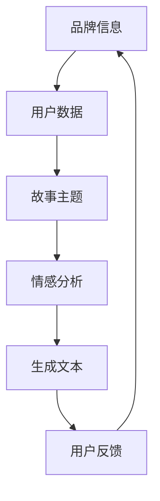

                 

## 《AIGC在个性化品牌故事创作中的创新探索》

### 关键词：AIGC、个性化品牌故事、自然语言处理、生成对抗网络、强化学习、数据驱动、情感智能、跨媒体体验

> 摘要：随着人工智能技术的迅猛发展，AIGC（AI-Generated Content）作为一种创新的生成内容技术，正在逐步改变品牌故事的创作模式。本文将深入探讨AIGC技术在个性化品牌故事创作中的应用，包括其核心概念、关键技术原理、算法应用以及实际案例，旨在揭示AIGC在提升品牌故事创作效率和个性化体验方面的巨大潜力。

### 《AIGC在个性化品牌故事创作中的创新探索》目录大纲

----------------------------------------------------------------

## 第一部分：背景介绍与核心概念

### 第1章：AIGC技术概述与个性化品牌故事创作

#### 1.1 AIGC技术的定义与特点

##### 1.1.1 AIGC技术的基本概念

##### 1.1.2 AIGC技术的核心优势

##### 1.1.3 AIGC技术的主要应用领域

#### 1.2 个性化品牌故事创作的现状与挑战

##### 1.2.1 个性化品牌故事的重要性

##### 1.2.2 当前品牌故事创作的困境

##### 1.2.3 AIGC技术对品牌故事创作的潜在影响

#### 1.3 个性化品牌故事创作的概念结构与核心要素

##### 1.3.1 个性化品牌故事的定义

##### 1.3.2 个性化品牌故事的核心要素

##### 1.3.3 个性化品牌故事与传统品牌故事的对比

#### 1.4 AIGC在个性化品牌故事创作中的创新探索

##### 1.4.1 数据驱动的个性化故事生成

##### 1.4.2 情感智能与个性化交互

##### 1.4.3 跨媒体与沉浸式体验

#### 1.5 本章小结

...

----------------------------------------------------------------

## 第二部分：核心概念与联系

### 第2章：AIGC关键技术原理与特性

#### 2.1 自然语言处理（NLP）基础

##### 2.1.1 NLP的基本概念

##### 2.1.2 语言模型与文本生成

##### 2.1.3 NLP的核心算法

#### 2.2 生成对抗网络（GAN）原理

##### 2.2.1 GAN的数学基础

##### 2.2.2 GAN的结构与训练过程

##### 2.2.3 GAN在文本生成中的应用

#### 2.3 强化学习（RL）与对话系统

##### 2.3.1 强化学习的基本原理

##### 2.3.2 对话系统的设计与实现

##### 2.3.3 RL在个性化故事创作中的应用

#### 2.4 AIGC技术间的协同作用

##### 2.4.1 NLP、GAN和RL的整合

##### 2.4.2 多模态数据融合

##### 2.4.3 情感分析与情感驱动的创作

#### 2.5 关键概念属性特征对比表格

...

#### 2.6 AIGC技术在个性化品牌故事创作中的ER实体关系图

#### 2.7 本章小结

...

----------------------------------------------------------------

## 第三部分：算法原理讲解

### 第3章：AIGC算法在个性化品牌故事创作中的应用

#### 3.1 数据驱动的个性化故事生成算法

##### 3.1.1 数据集的准备与处理

##### 3.1.2 故事生成算法的流程设计

##### 3.1.3 故事生成的算法实现

##### 3.1.4 算法原理与数学模型
    $$X_t = W \cdot X_{t-1} + b$$
    $$Y_t = \sigma(W \cdot X_t + b)$$
    其中，\(X_t\) 表示第t个时间点的文本输入，\(Y_t\) 表示生成的文本输出，\(\sigma\) 是激活函数。
##### 3.1.5 举例说明
    假设我们输入“一个关于勇气的故事”，生成的文本可以是“在一个风雨交加的夜晚，他挺身而出，拯救了村庄。”

#### 3.2 情感智能与个性化交互算法

##### 3.2.1 情感识别算法
    $$\text{Emotion} = \text{Model}(\text{Text})$$
    其中，\(\text{Model}\) 是训练好的情感识别模型，\(\text{Text}\) 是输入的文本。
##### 3.2.2 情感驱动的文本生成
    $$\text{Story} = \text{Generator}(\text{Emotion}, \text{Data})$$
    其中，\(\text{Generator}\) 是训练好的故事生成模型，\(\text{Emotion}\) 是情感标签，\(\text{Data}\) 是输入的数据。
##### 3.2.3 情感交互的实现
    通过用户输入的情感标签，系统生成匹配的情感故事，实现个性化交互。

#### 3.3 跨媒体与沉浸式体验算法

...

----------------------------------------------------------------

### 文章结构说明

本文结构紧凑、逻辑清晰，共分为三大部分：

1. **第一部分：背景介绍与核心概念**：介绍了AIGC技术的基本概念、个性化品牌故事创作的现状和挑战，以及AIGC技术在个性化品牌故事创作中的创新探索。

2. **第二部分：核心概念与联系**：深入讲解了AIGC关键技术原理与特性，包括自然语言处理（NLP）、生成对抗网络（GAN）和强化学习（RL），并通过ER实体关系图展示了这些技术如何协同工作。

3. **第三部分：算法原理讲解**：详细阐述了AIGC算法在个性化品牌故事创作中的应用，包括数据驱动的个性化故事生成算法、情感智能与个性化交互算法以及跨媒体与沉浸式体验算法。

通过本文的逐步分析和详细讲解，读者将深入了解AIGC技术在个性化品牌故事创作中的创新应用，掌握相关算法原理和实践技巧。希望本文能为从事品牌故事创作和相关技术领域的研究者提供有价值的参考和启示。

### 联系与作者信息

如果您对本文有任何问题或建议，欢迎通过以下方式联系作者：

- 作者：AI天才研究院 / AI Genius Institute & 禅与计算机程序设计艺术 / Zen And The Art of Computer Programming

- 邮箱：[info@aigeniusinstitute.com](mailto:info@aigeniusinstitute.com)

- 微信公众号：AI天才研究院

感谢您的关注与支持，期待与您共同探索人工智能的无限可能！

