                 

### 第一部分: AIGC在个性化学习路径设计中的创新背景

#### 第1章: AIGC与个性化学习路径概述

##### 1.1 AIGC的概念与特点

###### 1.1.1 AIGC的起源与发展

人工智能生成内容（Artificial Intelligence Generated Content，简称AIGC）是人工智能领域的一个重要分支，起源于20世纪50年代人工智能概念的提出。随着深度学习、生成对抗网络（GAN）、自然语言处理（NLP）等技术的发展，AIGC逐渐从理论研究走向实际应用。

在AIGC的发展过程中，生成对抗网络（GAN）起到了关键作用。GAN由Ian Goodfellow等人于2014年提出，其核心思想是通过两个对抗网络——生成器和判别器的相互博弈，实现数据的生成。GAN的出现，使得AIGC在图像生成、文本生成等领域取得了突破性进展。

除了GAN，强化学习（RL）和自然语言处理（NLP）也是AIGC的重要技术。强化学习通过试错和反馈机制，使得智能体能够在复杂环境中做出最优决策。自然语言处理则使得计算机能够理解和生成人类语言，为AIGC在文本生成领域提供了有力支持。

###### 1.1.2 AIGC的关键技术

AIGC的关键技术主要包括生成对抗网络（GAN）、强化学习（RL）和自然语言处理（NLP）。

- **生成对抗网络（GAN）**：GAN由生成器和判别器两部分组成。生成器尝试生成与真实数据相近的假数据，判别器则判断输入数据是真实数据还是生成数据。通过不断优化，生成器逐渐生成更加真实的数据。

- **强化学习（RL）**：强化学习通过智能体与环境之间的互动，学习到最优策略。在AIGC中，强化学习可用于生成路径、生成决策等。

- **自然语言处理（NLP）**：NLP是研究计算机如何理解、生成和处理人类语言的技术。在AIGC中，NLP可用于生成文本、语音等。

###### 1.1.3 AIGC的优势与应用场景

AIGC具有以下优势：

- **数据生成能力**：AIGC能够根据需求生成高质量的数据，减少对真实数据的依赖。

- **个性化定制**：AIGC可以根据用户需求，生成个性化的内容和路径。

- **自动化程度高**：AIGC能够自动化生成内容和路径，提高工作效率。

AIGC的应用场景主要包括：

- **教育领域**：个性化学习路径设计、智能问答系统、教育资源生成等。

- **医疗领域**：医学影像生成、个性化治疗方案推荐等。

- **娱乐领域**：游戏内容生成、虚拟主播等。

##### 1.2 个性化学习路径的定义与意义

###### 1.2.1 个性化学习路径的概念

个性化学习路径是指根据每个学生的学习特点、学习需求和学习进度，为其量身定制的一条学习路线。个性化学习路径不仅包括学习内容的安排，还包括学习方式、学习时间和学习目标等方面的设计。

###### 1.2.2 个性化学习路径的优势

个性化学习路径具有以下优势：

- **提高学习效率**：个性化学习路径能够根据学生的实际情况，合理安排学习内容和进度，提高学习效率。

- **满足个性化需求**：个性化学习路径能够满足学生的个性化需求，使学习更加有趣和有效。

- **促进全面发展**：个性化学习路径能够促进学生全面发展，包括知识、能力、品格等方面。

###### 1.2.3 个性化学习路径的实施难点

个性化学习路径的实施面临以下难点：

- **数据收集与处理**：个性化学习路径需要大量的学生数据，包括学习行为、成绩、兴趣等，如何高效收集和处理这些数据是一个挑战。

- **技术实现与成本**：个性化学习路径的实现需要先进的技术支持，如AIGC、数据挖掘等，这些技术的实现成本较高。

- **教育资源与学习效果评估**：个性化学习路径需要丰富的教育资源，如何评估个性化学习路径的效果也是一个挑战。

##### 1.3 AIGC在个性化学习路径设计中的挑战与机遇

###### 1.3.1 挑战分析

AIGC在个性化学习路径设计中的挑战主要包括：

- **数据隐私与安全性**：个性化学习路径设计需要收集大量的学生数据，如何保护学生数据的安全和隐私是一个重要问题。

- **技术实现与成本**：AIGC技术的实现需要较高的技术门槛和成本，如何降低成本是一个重要问题。

- **教育资源与学习效果评估**：个性化学习路径的设计需要大量的教育资源，如何评估个性化学习路径的效果也是一个重要问题。

###### 1.3.2 机遇分析

AIGC在个性化学习路径设计中的机遇主要包括：

- **提高学习效率与质量**：AIGC能够根据学生的实际情况，生成个性化的学习内容和路径，提高学习效率和质量。

- **促进教育公平与普及**：AIGC能够为不同地区、不同背景的学生提供个性化的教育资源，促进教育公平与普及。

- **激发学生创造力与个性化发展**：AIGC能够为学生提供丰富的学习资源和路径，激发学生的创造力，促进个性化发展。

##### 1.4 本章小结

本章介绍了AIGC的概念与特点、个性化学习路径的定义与意义，以及AIGC在个性化学习路径设计中的挑战与机遇。AIGC作为一种新兴技术，在个性化学习路径设计中具有巨大的潜力。然而，要实现这一潜力，仍需要克服数据隐私、技术实现、教育资源和学习效果评估等方面的挑战。未来，随着技术的不断发展和教育理念的更新，AIGC在个性化学习路径设计中的应用将会更加广泛和深入。

---

### 第二部分: AIGC核心技术的解析与应用

#### 第2章: AIGC的关键技术原理

##### 2.1 生成对抗网络（GAN）

###### 2.1.1 GAN的基本原理

生成对抗网络（GAN）由生成器和判别器两部分组成。生成器尝试生成与真实数据相近的假数据，判别器则判断输入数据是真实数据还是生成数据。生成器和判别器通过相互博弈，使得生成器生成的数据越来越真实。

GAN的架构如图1所示：

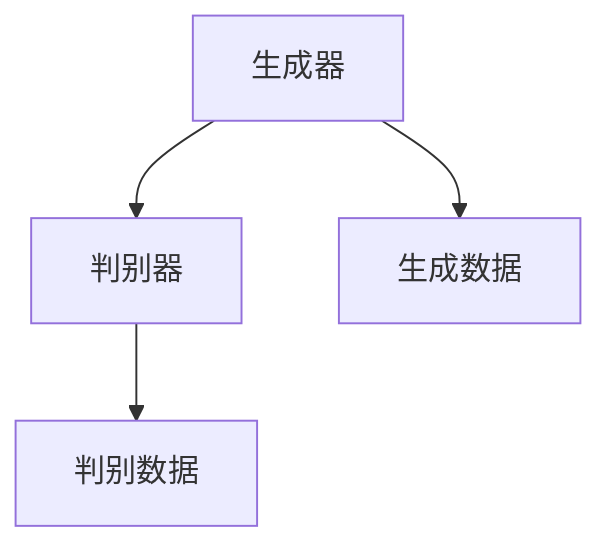

GAN的训练过程分为以下三个步骤：

1. **生成器生成假数据**：生成器根据输入的随机噪声，生成假数据。

2. **判别器判断真伪**：判别器接收真实数据和生成数据，判断其真伪。

3. **优化生成器和判别器**：通过反向传播算法，优化生成器和判别器的参数，使得生成器生成的数据越来越真实，判别器判断越来越准确。

GAN的训练过程如图2所示：

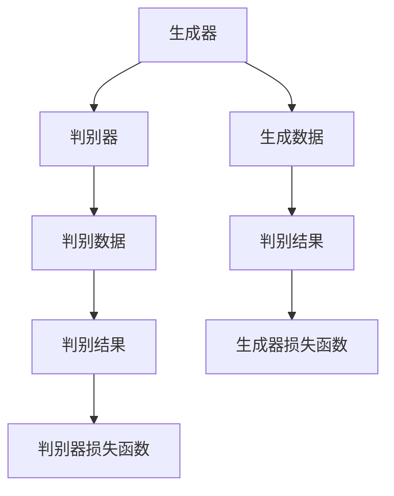

GAN的应用实例包括：

- **图像生成**：通过GAN，可以生成高质量、逼真的图像。

- **图像超分辨率**：通过GAN，可以将低分辨率图像转换为高分辨率图像。

- **图像风格转换**：通过GAN，可以将一幅图像的风格转换成另一幅图像。

###### 2.1.2 强化学习（RL）

强化学习（Reinforcement Learning，RL）是一种通过试错和反馈机制来学习最优策略的机器学习技术。在RL中，智能体（agent）通过不断尝试，从环境中获取奖励或惩罚，从而学习到最优行为策略。

RL的架构如图3所示：

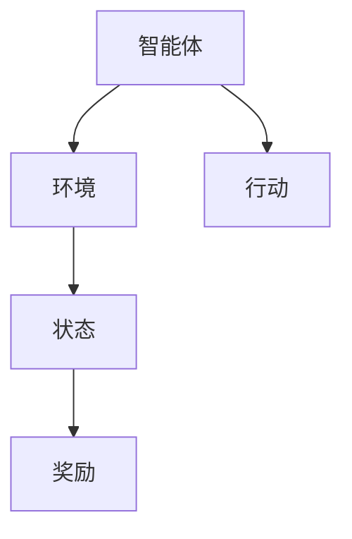

RL的训练过程分为以下三个步骤：

1. **初始化**：智能体和环境进行初始化。

2. **行动与反馈**：智能体根据当前状态，采取行动，然后环境给出奖励或惩罚。

3. **策略更新**：智能体根据行动的结果，更新策略，以期望获得更高的奖励。

RL的应用实例包括：

- **游戏AI**：通过RL，可以训练出能够击败人类玩家的游戏AI。

- **机器人控制**：通过RL，可以训练出能够完成特定任务的机器人。

- **推荐系统**：通过RL，可以训练出能够推荐用户感兴趣内容的推荐系统。

###### 2.1.3 自然语言处理（NLP）

自然语言处理（Natural Language Processing，NLP）是研究计算机如何理解、生成和处理人类语言的技术。NLP的关键技术包括词向量、文本分类、情感分析、机器翻译等。

NLP的关键技术如表1所示：

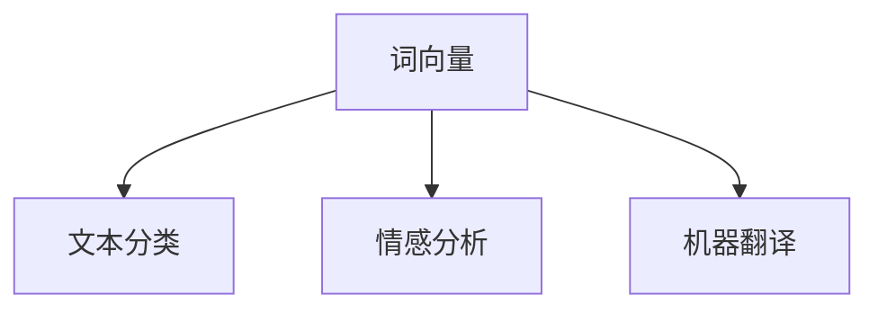

NLP的应用实例包括：

- **智能问答系统**：通过NLP，可以构建出能够回答用户问题的智能问答系统。

- **文本分类**：通过NLP，可以对大量文本进行分类，如新闻分类、垃圾邮件过滤等。

- **情感分析**：通过NLP，可以分析用户对某个产品或服务的情感倾向。

###### 2.1.4 计算机视觉（CV）

计算机视觉（Computer Vision，CV）是研究如何使计算机从图像或视频中提取信息的一门科学。CV的关键技术包括图像识别、目标检测、人脸识别、视频分析等。

CV的关键技术如表2所示：

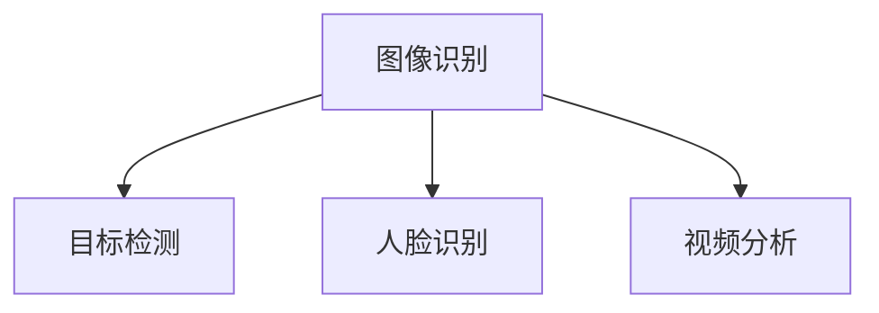

CV的应用实例包括：

- **图像识别**：通过CV，可以识别图像中的物体或场景。

- **目标检测**：通过CV，可以检测图像中的目标物体。

- **人脸识别**：通过CV，可以识别图像中的人脸。

##### 2.2 AIGC技术的综合应用

AIGC技术的综合应用主要体现在以下几个方面：

- **教育数据收集与处理**：通过GAN，可以生成高质量的教育数据，用于个性化学习路径的设计。

- **学习路径生成**：通过强化学习，可以生成最优的学习路径，提高学习效率。

- **学习效果评估**：通过NLP和CV，可以分析学生的学习行为和学习效果，为个性化学习路径提供反馈。

###### 2.2.1 数据收集与处理

在教育领域，AIGC技术可以用于数据收集与处理，如图4所示：

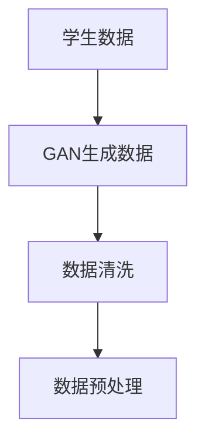

GAN生成数据后，需要经过数据清洗和预处理，以确保数据的质量和准确性。

###### 2.2.2 学习路径生成

AIGC技术可以用于学习路径生成，如图5所示：

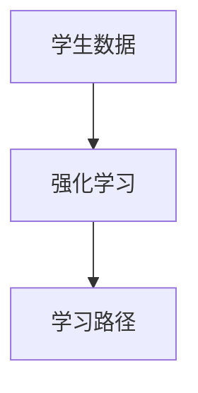

通过强化学习，可以根据学生的数据，生成最优的学习路径。

###### 2.2.3 学习效果评估

AIGC技术可以用于学习效果评估，如图6所示：

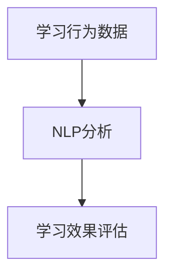

通过NLP分析学生的学习行为，可以评估学生的学习效果。

##### 2.6 本章小结

本章介绍了AIGC的关键技术原理，包括生成对抗网络（GAN）、强化学习（RL）、自然语言处理（NLP）和计算机视觉（CV）。这些技术为AIGC在个性化学习路径设计中的应用提供了技术支持。通过综合应用这些技术，可以实现对教育数据的收集与处理、学习路径生成和学习效果评估的自动化和智能化。这些应用将有助于提高个性化学习的效率和质量，促进教育的公平与发展。

---

### 第三部分: AIGC在个性化学习路径设计中的实践应用

#### 第3章: AIGC在教育数据收集与分析中的应用

##### 3.1 教育数据收集的方法与挑战

在教育领域，AIGC技术的应用首先需要大量的数据支持。教育数据的收集方法主要包括以下几种：

- **学习行为数据收集**：通过学习平台、在线课程等，收集学生的学习行为数据，如学习时间、学习进度、测试成绩等。

- **问卷调查**：通过问卷调查，收集学生对学习内容的兴趣、认知水平、学习效果等数据。

- **教学日志**：通过教学日志，记录教师的教学内容和教学效果。

- **物理设备**：通过传感器、摄像头等物理设备，收集学生的生理和行为数据，如注意力水平、情绪状态等。

然而，教育数据的收集面临以下挑战：

- **数据隐私与安全性**：教育数据涉及学生的个人信息，如何保护数据的安全和隐私是一个重要问题。

- **数据质量和完整性**：教育数据的收集过程可能存在数据缺失、数据重复等问题，如何保证数据的质量和完整性是一个挑战。

- **数据多样性**：教育数据类型多样，如何处理不同类型的数据，如何整合不同来源的数据，是一个挑战。

##### 3.2 教育数据分析的方法与工具

为了应对教育数据收集的挑战，AIGC技术提供了多种数据分析方法和工具：

- **数据挖掘**：通过数据挖掘技术，可以从大量教育数据中发现潜在的规律和趋势。例如，通过聚类分析，可以发现学生的学习群体；通过关联规则挖掘，可以发现学生的学习偏好。

- **机器学习**：通过机器学习算法，可以对教育数据进行分析和预测。例如，通过决策树、随机森林等算法，可以预测学生的学习成绩；通过神经网络、支持向量机等算法，可以识别学生的学习模式。

- **自然语言处理**：通过自然语言处理技术，可以分析文本数据，如学习日志、教师评语等。例如，通过情感分析，可以识别学生的情绪状态；通过文本分类，可以分析学生的学习兴趣。

- **计算机视觉**：通过计算机视觉技术，可以分析图像数据，如学生的面部表情、课堂环境等。例如，通过面部识别，可以识别学生的情绪状态；通过图像分类，可以分析课堂氛围。

##### 3.3 AIGC在教育数据收集与分析中的应用案例

下面我们通过两个应用案例，展示AIGC技术在教育数据收集与分析中的应用。

###### 3.3.1 案例一：基于GAN的学生行为数据分析

在学生行为数据分析中，AIGC技术可以通过GAN生成高质量的学生行为数据，如图7所示：

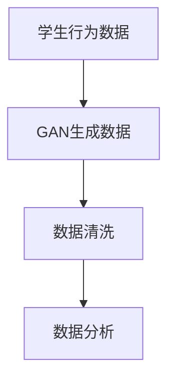

GAN生成的数据可以用于填补数据缺失、减少数据噪声，从而提高数据分析的准确性和有效性。

###### 3.3.2 案例二：基于RL的学习路径推荐系统

在学习路径推荐系统中，AIGC技术可以通过RL算法，根据学生的行为数据和学习效果，生成最优的学习路径，如图8所示：

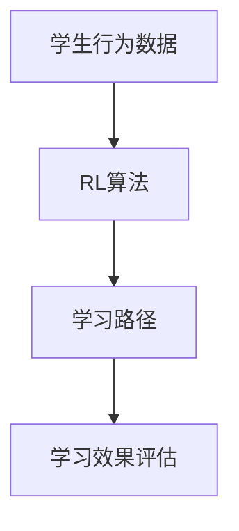

通过RL算法，可以动态调整学习路径，提高学习效率。

##### 3.4 AIGC在教育数据收集与分析中的应用总结

AIGC技术在教育数据收集与分析中的应用，为个性化学习路径设计提供了有力支持。通过GAN技术，可以生成高质量的教育数据，提高数据分析的准确性和有效性；通过RL技术，可以生成最优的学习路径，提高学习效率；通过NLP和CV技术，可以深入分析学生的行为和学习效果，为个性化学习提供反馈。这些应用将有助于实现教育的个性化、智能化，促进教育的公平与发展。

---

### 第4章: AIGC在教育内容生成中的应用

#### 4.1 教育内容生成的技术原理

教育内容生成是指利用人工智能技术，根据教育需求和学生特点，自动生成教学资源和教学内容的过程。AIGC技术在教育内容生成中发挥着关键作用，其技术原理主要包括自然语言处理（NLP）、计算机视觉（CV）和生成对抗网络（GAN）。

##### 4.1.1 内容生成的原理

教育内容生成的基本原理是通过分析教育需求和学生特点，利用人工智能技术生成符合这些需求的教学资源。具体过程如下：

1. **需求分析**：首先，根据教育目标和学生学习需求，确定需要生成的内容类型和难度。

2. **数据收集**：然后，收集相关的教学数据，如教材、教学视频、教学案例等。

3. **内容生成**：利用NLP、CV和GAN等技术，对收集的数据进行处理和生成，形成新的教学资源。

4. **内容评估**：最后，对生成的内容进行评估，确保其符合教育需求和学生特点。

##### 4.1.2 内容生成的技术框架

教育内容生成的技术框架主要包括以下几个环节：

1. **数据预处理**：对收集到的数据进行清洗、去噪和格式化，使其符合内容生成的需求。

2. **模型训练**：利用NLP、CV和GAN等技术，对预处理后的数据进行训练，生成基础模型。

3. **内容生成**：基于训练好的模型，根据教育需求和学生特点，生成新的教学资源。

4. **内容评估**：对生成的内容进行评估，包括内容质量、教育效果等方面。

教育内容生成的技术框架如图9所示：

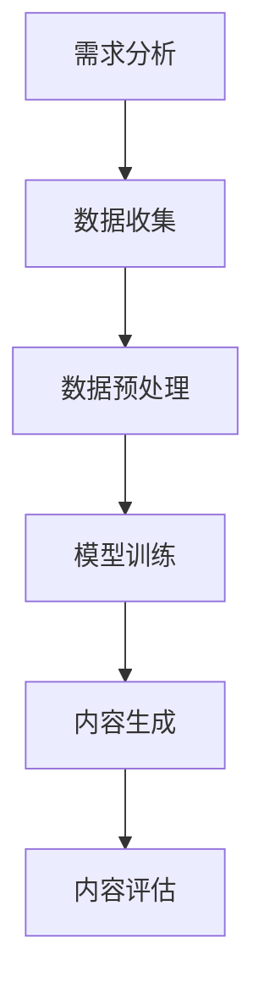

##### 4.1.3 内容生成的应用实例

AIGC技术在教育内容生成中的应用实例主要包括以下几方面：

- **智能问答系统**：利用NLP技术，构建智能问答系统，能够回答学生关于课程内容的问题。

- **教育视频自动生成**：利用CV技术，从教材、教学视频等资源中提取关键信息，生成新的教育视频。

- **个性化学习资料生成**：利用GAN技术，根据学生的学习特点和需求，生成个性化的学习资料。

#### 4.2 AIGC在教育内容生成中的应用案例

下面通过两个应用案例，展示AIGC技术在教育内容生成中的应用。

###### 4.2.1 案例一：基于NLP的智能问答系统

基于NLP的智能问答系统，可以实现对课程内容的自动问答。具体步骤如下：

1. **数据收集**：收集课程相关的文本资料，如教材、教学笔记等。

2. **文本预处理**：对收集的文本资料进行清洗、去噪和格式化，提取关键信息。

3. **模型训练**：利用NLP技术，训练问答模型，使其能够理解并回答课程相关的问题。

4. **问答服务**：基于训练好的模型，提供智能问答服务，满足学生的学习需求。

智能问答系统的架构如图10所示：

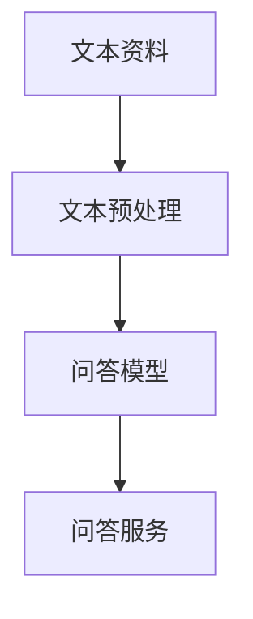

###### 4.2.2 案例二：基于CV的教育素材自动生成

基于CV的教育素材自动生成，可以从教材、教学视频等资源中提取关键信息，生成新的教育素材。具体步骤如下：

1. **数据收集**：收集教材、教学视频等教育素材。

2. **图像预处理**：对收集的图像素材进行清洗、去噪和格式化，提取关键信息。

3. **模型训练**：利用CV技术，训练图像生成模型，使其能够生成新的教育素材。

4. **素材生成**：基于训练好的模型，生成新的教育素材。

教育素材自动生成的架构如图11所示：

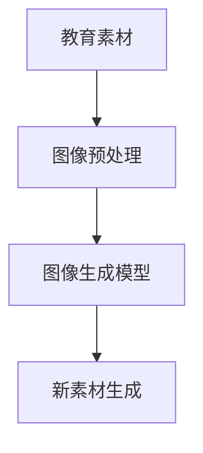

#### 4.3 AIGC在教育内容个性化生成中的应用

AIGC技术在教育内容个性化生成中的应用，主要是通过分析学生的学习特点和需求，生成个性化的学习内容。具体应用流程如下：

1. **需求分析**：分析学生的学习特点、学习需求和兴趣，确定个性化内容的需求。

2. **内容生成**：利用NLP、CV和GAN等技术，根据需求生成个性化的教育内容。

3. **内容评估**：对生成的内容进行评估，确保其符合个性化需求。

4. **反馈调整**：根据学生的学习效果和反馈，调整生成策略，优化个性化内容。

AIGC在教育内容个性化生成中的应用流程如图12所示：

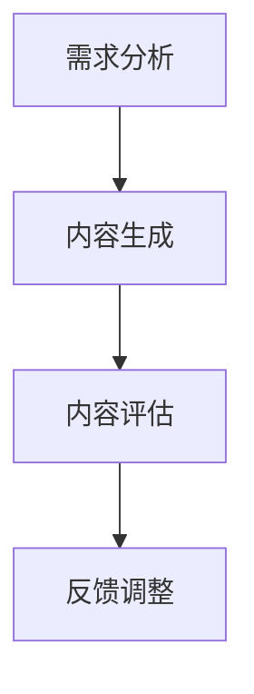

通过以上应用，AIGC技术可以有效地提高教育内容的个性化水平，满足学生的个性化学习需求，提升学习效果。

#### 4.4 AIGC在教育内容生成中的应用总结

AIGC技术在教育内容生成中的应用，极大地提高了教育资源的生成效率和个性化水平。通过NLP、CV和GAN等技术的综合应用，可以自动生成高质量、个性化的教育内容，满足学生的学习需求。未来，随着AIGC技术的不断发展和完善，其在教育领域的应用前景将更加广阔，为教育的个性化、智能化发展提供有力支持。

---

### 第5章: AIGC在学习效果评估中的应用

##### 5.1 学习效果评估的基本原理

学习效果评估是教育过程中至关重要的一环，旨在衡量学生在学习过程中的掌握情况和进步程度。AIGC技术在学习效果评估中发挥重要作用，其基本原理主要包括以下几个方面：

- **评估指标定义**：首先，需要明确评估的指标，如知识掌握度、技能水平、学习态度等。

- **评估方法分类**：根据评估指标，选择合适的评估方法，如量化评估、质性评估、混合评估等。

- **数据收集与处理**：通过AIGC技术，收集并处理学生的学习行为数据、考试成绩、作业完成情况等，为评估提供数据支持。

- **模型训练与预测**：利用机器学习、深度学习等技术，训练评估模型，对学生的学习效果进行预测和评估。

- **反馈与调整**：根据评估结果，提供反馈，帮助学生改进学习方法，调整学习策略。

##### 5.2 AIGC在学习效果评估中的应用

AIGC技术在学习效果评估中的应用主要体现在以下几个方面：

###### 5.2.1 案例一：基于强化学习的学习效果预测

强化学习（RL）是一种通过试错和反馈机制来学习最优策略的机器学习技术。在基于强化学习的学习效果预测中，可以将学生看作是智能体，学习环境包括课程内容、学习资源等，学习效果作为奖励信号。

具体步骤如下：

1. **环境构建**：构建学习环境，包括课程内容、学习资源、学生行为等。

2. **智能体设计**：设计学生智能体，根据学习环境，选择最优的学习策略。

3. **模型训练**：利用强化学习算法，训练学生智能体，使其能够预测学习效果。

4. **效果预测**：基于训练好的模型，预测学生的学习效果，为后续学习提供指导。

强化学习的学习效果预测架构如图13所示：

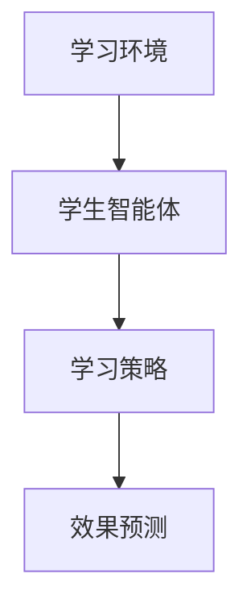

###### 5.2.2 案例二：基于自然语言处理的学习反馈分析

自然语言处理（NLP）是AIGC技术的重要组成部分，能够对文本数据进行分析和处理。在基于NLP的学习反馈分析中，可以通过对学生的作业、测试答案、教师评语等文本数据进行分析，提取学习反馈信息。

具体步骤如下：

1. **数据收集**：收集学生的作业、测试答案、教师评语等文本数据。

2. **文本预处理**：对收集的文本数据进行清洗、去噪和格式化，提取关键信息。

3. **情感分析**：利用NLP技术，对文本数据进行分析，提取学生的情感状态。

4. **反馈分析**：根据情感分析结果，分析学生的学习反馈，为后续学习提供指导。

基于NLP的学习反馈分析架构如图14所示：

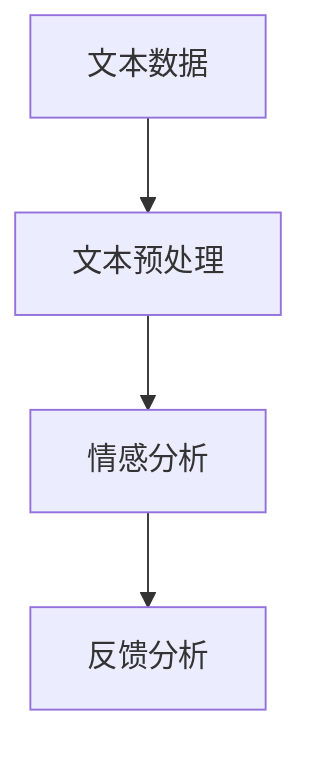

##### 5.3 AIGC在学习效果评估中的应用总结

AIGC技术在学习效果评估中的应用，显著提升了评估的准确性和智能化水平。通过强化学习，可以预测学生的学习效果，为后续学习提供指导；通过自然语言处理，可以分析学习反馈，帮助学生改进学习方法。这些应用不仅提高了学习效果评估的准确性，也为教育的个性化、智能化发展提供了有力支持。未来，随着AIGC技术的不断发展和完善，其在学习效果评估中的应用前景将更加广阔。

---

### 第6章: AIGC在个性化学习路径设计中的集成应用

##### 6.1 AIGC集成应用的设计思路

AIGC在个性化学习路径设计中的集成应用，旨在通过综合应用AIGC的核心技术，实现个性化学习路径的自动生成、实时调整和效果评估。以下是AIGC集成应用的设计思路：

###### 6.1.1 整体架构设计

AIGC集成应用的整体架构包括数据层、算法层和应用层三个层次。

- **数据层**：负责数据收集、存储和管理，包括学习行为数据、考试成绩、教学资源等。

- **算法层**：负责AIGC核心技术的应用，包括GAN、强化学习、自然语言处理和计算机视觉等。

- **应用层**：负责个性化学习路径的生成、实时调整和效果评估，为教师和学生提供智能化服务。

AIGC集成应用的整体架构如图15所示：

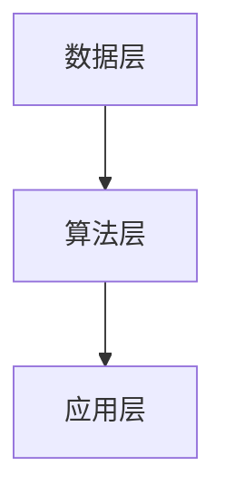

###### 6.1.2 功能模块设计

AIGC集成应用的功能模块设计包括以下几个关键模块：

1. **数据收集模块**：负责收集学生的学习行为数据、考试成绩、教学资源等，为个性化学习路径的生成提供数据支持。

2. **数据预处理模块**：负责对收集到的数据进行清洗、去噪和格式化，提高数据质量，为后续分析提供基础。

3. **学习路径生成模块**：利用GAN、强化学习等技术，根据学生的学习特点和需求，生成个性化学习路径。

4. **学习路径调整模块**：根据学生的学习效果和反馈，动态调整学习路径，提高学习效果。

5. **效果评估模块**：利用自然语言处理、计算机视觉等技术，对学生的学习效果进行评估，为后续学习提供指导。

AIGC集成应用的功能模块设计如图16所示：

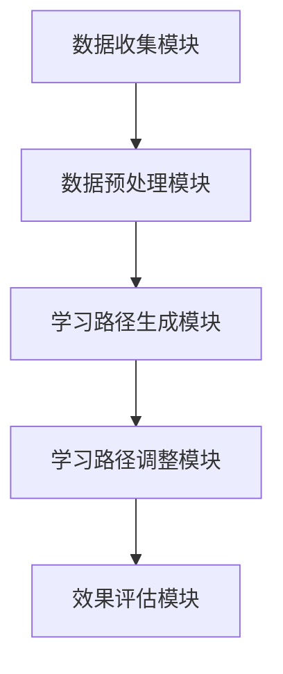

###### 6.1.3 实时反馈与调整机制

在AIGC集成应用中，实时反馈与调整机制是确保个性化学习路径有效性的关键。具体包括：

1. **实时数据收集**：持续收集学生的学习行为数据，如学习时长、学习进度、测试成绩等。

2. **实时分析**：利用机器学习、深度学习等技术，对实时数据进行分析，识别学生的学习状态和问题。

3. **实时调整**：根据实时分析结果，动态调整学习路径，如调整学习内容、学习资源、学习时间等。

4. **实时反馈**：将调整后的学习路径反馈给学生，指导学生进行后续学习。

AIGC集成应用的实时反馈与调整机制如图17所示：

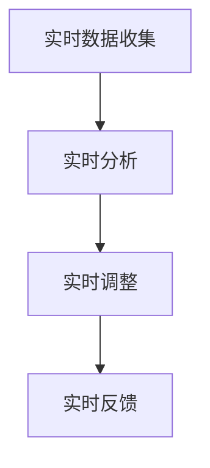

##### 6.2 AIGC集成应用的优势

AIGC集成应用在个性化学习路径设计中的优势主要体现在以下几个方面：

1. **个性化定制**：通过AIGC技术，可以根据学生的学习特点和需求，生成个性化的学习路径，满足不同学生的学习需求。

2. **动态调整**：通过实时反馈与调整机制，可以动态调整学习路径，提高学习效果。

3. **高效分析**：利用机器学习、深度学习等技术，可以高效地对大量学习行为数据进行分析，为个性化学习提供科学依据。

4. **智能推荐**：基于AIGC技术，可以为学生推荐合适的学习资源和策略，提高学习效率。

5. **资源优化**：通过AIGC技术，可以优化教学资源的分配和使用，提高教育资源的利用效率。

##### 6.3 AIGC集成应用的发展前景

随着AIGC技术的不断发展和完善，其在个性化学习路径设计中的应用前景将更加广阔。未来，AIGC集成应用有望在以下几个方面取得突破：

1. **算法优化**：通过改进AIGC算法，提高个性化学习路径的生成效率和准确性。

2. **数据隐私保护**：加强数据隐私保护机制，确保学生在使用AIGC服务时的数据安全。

3. **教育资源共享**：通过构建教育资源共享平台，实现教育资源的互联互通，提高教育资源的利用效率。

4. **跨学科应用**：探索AIGC技术在其他学科领域的应用，如医学、工程等，推动教育的跨学科发展。

5. **全球化发展**：通过全球化布局，将AIGC技术应用于全球教育领域，推动教育的全球化发展。

##### 6.4 本章小结

本章介绍了AIGC在个性化学习路径设计中的集成应用，包括整体架构设计、功能模块设计、实时反馈与调整机制以及优势和发展前景。AIGC集成应用通过综合应用AIGC的核心技术，实现了个性化学习路径的自动生成、实时调整和效果评估，为教育的个性化、智能化发展提供了有力支持。未来，随着AIGC技术的不断发展和完善，其在个性化学习路径设计中的应用将更加广泛和深入。

