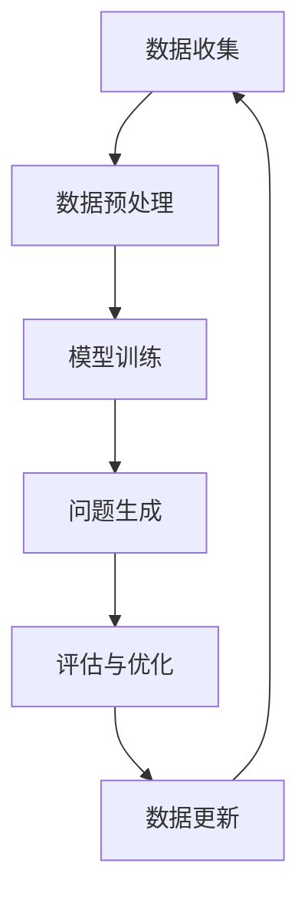

                 

### 个性化心理咨询与AIGC概述

#### 1.1 个性化心理咨询的定义与重要性

个性化心理咨询是指根据每个个体的心理特点、生活背景和需求，提供量身定制的心理咨询服务。这种服务方式旨在解决心理咨询过程中常见的问题，如标准化的咨询方式难以满足个体的独特需求、咨询服务缺乏个性化反馈等。

**个性化心理咨询的概念：**

个性化心理咨询的核心在于“个性化”三个字。它包括以下几个方面：

1. **个体差异性**：每个个体的心理状态、心理需求、生活环境等都是独特的，心理咨询师需要根据这些差异来调整咨询方案。
2. **目标明确性**：个性化的心理咨询更注重目标的明确性，即咨询师与来访者共同制定明确的心理健康目标。
3. **过程灵活性**：个性化的心理咨询允许咨询过程更加灵活，以适应来访者的心理变化和需求。

**个性化心理咨询的优势：**

1. **提升咨询效果**：通过个性化的服务，心理咨询师可以更好地满足来访者的需求，提高咨询效果。
2. **增强来访者信任**：个性化的咨询方式能够增强来访者对心理咨询师的信任，促进咨询关系的建立。
3. **提升心理健康水平**：个性化的咨询有助于来访者更深入地探讨自己的心理问题，从而提升心理健康水平。

**个性化心理咨询的发展历程：**

个性化心理咨询的发展可以追溯到20世纪中期，随着心理学理论的发展和社会对心理健康关注的增加，个性化心理咨询逐渐成为主流。以下是发展历程的几个关键阶段：

1. **20世纪50年代**：精神分析疗法主导心理咨询领域，个性化咨询开始萌芽。
2. **20世纪60年代**：认知行为疗法逐渐兴起，个性化咨询得到进一步发展。
3. **20世纪70年代**：人本主义心理学崛起，强调个体独特性，个性化咨询得到广泛应用。
4. **21世纪**：随着人工智能和大数据技术的发展，个性化心理咨询进入新的发展阶段，AIGC（自适应智能生成计算）的应用为个性化咨询带来了新的可能性。

#### 1.2 AIGC的概念与特点

**AIGC的定义：**

AIGC（Adaptive Intelligent Generation Computing）是指通过自适应智能算法生成个性化内容的技术。它结合了人工智能、机器学习和自然语言处理等多领域的先进技术，旨在为用户提供高度个性化的内容和服务。

**AIGC的核心特点：**

1. **自适应**：AIGC能够根据用户的需求和环境动态调整生成策略，实现高度个性化的内容生成。
2. **智能性**：通过机器学习和深度学习等技术，AIGC能够从海量数据中提取有价值的信息，生成高质量的内容。
3. **灵活性**：AIGC支持多种内容生成形式，如文本、图像、音频等，能够满足不同用户的需求。

**AIGC与传统AI的区别：**

1. **目标不同**：传统AI侧重于解决特定问题，而AIGC侧重于生成高度个性化的内容。
2. **技术基础不同**：AIGC融合了机器学习、深度学习和自然语言处理等技术，而传统AI通常依赖于规则和符号计算。
3. **应用场景不同**：传统AI多用于自动化和优化，而AIGC更多用于内容生成和个性化服务。

**AIGC在个性化心理咨询中的应用前景：**

1. **个性化问题生成**：AIGC可以根据来访者的心理状态和需求，生成个性化的心理咨询问题，提高咨询效果。
2. **个性化报告生成**：AIGC可以生成个性化的心理评估报告，帮助心理咨询师更好地了解来访者的情况。
3. **个性化建议生成**：AIGC可以基于来访者的数据，生成个性化的心理健康建议，提升来访者的心理健康水平。

尽管AIGC在个性化心理咨询中具有巨大的潜力，但同时也面临着数据隐私、算法透明度等挑战。未来，随着技术的不断进步和伦理规范的完善，AIGC将在个性化心理咨询领域发挥越来越重要的作用。

### 1.3 AIGC在个性化心理咨询中的应用前景

#### 1.3.1 AIGC在个性化心理咨询中的应用领域

AIGC在个性化心理咨询中的应用领域非常广泛，以下是一些关键应用领域：

1. **问题生成**：AIGC可以根据来访者的心理状态和需求，自动生成个性化的心理咨询问题，提高咨询效果。
2. **报告生成**：AIGC可以基于来访者的数据和评估结果，自动生成个性化的心理评估报告，帮助心理咨询师更好地了解来访者的情况。
3. **建议生成**：AIGC可以基于来访者的数据和评估结果，自动生成个性化的心理健康建议，提升来访者的心理健康水平。
4. **个性化互动**：AIGC可以与来访者进行个性化互动，提供个性化的心理健康服务，如在线问答、实时咨询等。

#### 1.3.2 AIGC在个性化心理咨询中的潜在优势

AIGC在个性化心理咨询中具有以下潜在优势：

1. **提升咨询效果**：通过自动生成个性化的问题和报告，AIGC可以帮助心理咨询师更好地满足来访者的需求，提高咨询效果。
2. **降低咨询成本**：AIGC可以自动化一些重复性的工作，如问题生成和报告生成，降低心理咨询的成本。
3. **提高工作效率**：AIGC可以高效地处理大量的数据，帮助心理咨询师快速生成个性化的心理评估报告和心理健康建议，提高工作效率。
4. **增强互动体验**：AIGC可以与来访者进行个性化互动，提供更加人性化、贴心的心理健康服务，增强来访者的满意度。

#### 1.3.3 AIGC应用的挑战与机遇

尽管AIGC在个性化心理咨询中具有巨大的潜力，但也面临着一系列挑战：

1. **数据隐私**：心理咨询涉及个人隐私，如何保护来访者的数据隐私是AIGC应用的关键挑战。
2. **算法透明度**：AIGC的算法复杂，如何确保算法的透明度和可解释性是一个重要问题。
3. **伦理规范**：AIGC在心理咨询中的应用需要遵守伦理规范，如心理咨询师的角色和责任、来访者的知情同意等。
4. **技术成熟度**：AIGC技术尚未完全成熟，如何提高技术水平和稳定性是一个重要问题。

然而，随着技术的不断进步和伦理规范的完善，AIGC在个性化心理咨询中的应用将面临更多的机遇：

1. **个性化服务**：AIGC可以实现高度个性化的心理咨询服务，满足不同来访者的需求。
2. **医疗资源优化**：AIGC可以帮助心理咨询师更高效地处理大量数据，优化医疗资源分配。
3. **心理健康普及**：AIGC可以降低心理咨询的成本，使心理健康服务更加普及。
4. **跨界合作**：AIGC可以与其他领域（如教育、医疗等）合作，推动心理健康服务的发展。

总之，AIGC在个性化心理咨询中的应用前景广阔，但也需要克服一系列挑战。未来，随着技术的不断进步和伦理规范的完善，AIGC将在个性化心理咨询领域发挥越来越重要的作用。

### 2.1 问题背景与问题描述

#### 2.1.1 心理咨询问题的现状

心理咨询作为心理健康服务的重要组成部分，近年来得到了越来越多的关注。然而，心理咨询问题的现状仍然存在一些挑战。

1. **心理咨询需求的增加**：随着社会压力的增加和生活节奏的加快，越来越多的人开始寻求心理咨询的帮助。据世界卫生组织（WHO）的数据，全球约有3亿人受到心理健康问题的困扰。
2. **心理咨询资源的不均衡**：心理咨询资源在不同地区、不同国家的分配存在显著差异。一些发达国家拥有丰富的心理咨询资源，而一些发展中国家则面临心理咨询师短缺、咨询费用高昂等问题。
3. **心理咨询效率的低下**：传统的心理咨询方式通常需要面对面的交流，这限制了心理咨询的普及和效率。此外，心理咨询师的工作量和时间成本也较高，难以满足大量来访者的需求。

#### 2.1.2 心理咨询问题的生成挑战

心理咨询问题的生成面临以下挑战：

1. **个体差异性的挑战**：每个个体的心理状态、需求和生活背景都是独特的，如何生成适应个体差异性的问题是一个重要挑战。
2. **大量数据处理的挑战**：心理咨询涉及大量的数据，如来访者的心理评估结果、咨询记录、生活背景等，如何有效地处理这些数据以生成有价值的问题是一个关键挑战。
3. **问题质量的挑战**：心理咨询问题需要具备科学性、针对性和实用性，如何保证生成的问题质量是一个重要挑战。
4. **互动与反馈的挑战**：心理咨询是一个互动过程，如何通过生成的问题与来访者建立有效的互动和反馈机制是一个重要挑战。

#### 2.1.3 AIGC解决心理咨询问题生成问题的可能性

AIGC（自适应智能生成计算）作为一种先进的人工智能技术，为解决心理咨询问题生成问题提供了一种可能的解决方案。

1. **个体差异性适应**：AIGC可以通过学习来访者的心理状态和需求，生成适应个体差异性的问题。这有助于提高心理咨询的个性化水平，满足不同来访者的需求。
2. **数据处理能力**：AIGC具备强大的数据处理能力，可以从海量的数据中提取有价值的信息，为问题生成提供数据支持。
3. **问题质量保障**：AIGC可以通过深度学习和自然语言处理等技术，生成科学性、针对性和实用性的问题。这有助于提高心理咨询问题的质量，提升咨询效果。
4. **互动与反馈机制**：AIGC可以通过智能对话系统与来访者进行互动，收集反馈，不断优化问题生成策略，建立有效的互动和反馈机制。

总之，AIGC在心理咨询问题生成中的应用具有巨大的潜力，有望解决当前心理咨询问题生成所面临的挑战，提升心理咨询的个性化水平和服务质量。

### 2.2 AIGC在心理咨询问题生成中的关键概念

要理解AIGC在心理咨询问题生成中的应用，我们需要首先了解AIGC的关键概念，这些概念包括AIGC算法原理、算法流程和核心算法参数调整。

#### 2.2.1 AIGC算法原理

AIGC（自适应智能生成计算）是一种通过自适应智能算法生成个性化内容的技术。其核心原理是基于概率分布和生成模型，通过学习用户的行为数据、心理特征等信息，动态调整生成策略，生成高度个性化的内容。

AIGC算法的基本原理可以用以下概率公式表示：

$$
P(x|\theta) = \frac{P(\theta|x)P(x)}{P(\theta)}
$$

其中，$P(x|\theta)$ 表示在给定模型参数 $\theta$ 的情况下，生成数据 $x$ 的概率；$P(\theta|x)$ 表示在给定数据 $x$ 的情况下，模型参数 $\theta$ 的概率；$P(x)$ 表示数据 $x$ 的概率；$P(\theta)$ 表示模型参数 $\theta$ 的概率。

AIGC算法通过最大化生成数据 $x$ 的概率，实现个性化内容的生成。具体来说，AIGC算法包括以下几个关键步骤：

1. **数据收集与预处理**：收集用户行为数据、心理特征数据等，并进行预处理，如数据清洗、归一化等，为模型训练提供高质量的数据输入。
2. **模型训练**：使用收集到的数据训练生成模型，通过最大化生成数据 $x$ 的概率，优化模型参数 $\theta$。
3. **生成与优化**：根据训练好的模型，生成个性化内容，并通过用户反馈和评价，不断优化生成策略，提高内容质量。

#### 2.2.2 AIGC算法流程

AIGC算法的流程可以分为以下几个步骤：

1. **数据收集**：收集用户行为数据、心理特征数据等，这些数据可以来源于用户调查、心理测试、社交媒体等。
2. **数据预处理**：对收集到的数据进行分析，去除噪声和异常值，并进行数据清洗、归一化等处理，为模型训练提供高质量的数据。
3. **模型选择**：选择合适的生成模型，如变分自编码器（VAE）、生成对抗网络（GAN）等，用于生成个性化内容。
4. **模型训练**：使用预处理后的数据训练生成模型，通过优化模型参数，提高生成效果。
5. **内容生成**：根据训练好的模型，生成个性化内容，如心理咨询问题、心理健康建议等。
6. **评估与优化**：通过用户反馈和评估，对生成的内容进行优化，提高内容质量和用户体验。

#### 2.2.3 AIGC的核心算法参数调整

在AIGC算法中，核心算法参数的调整对生成效果有着重要影响。以下是一些常见的核心算法参数及其调整方法：

1. **学习率**：学习率是模型训练过程中用于调整模型参数的参数，其大小会影响模型收敛速度和稳定性。通常，学习率需要通过实验进行调整，以达到最佳训练效果。
2. **批次大小**：批次大小是指每次训练所用的样本数量。批次大小会影响模型的训练效率和收敛速度，通常需要根据数据量和计算资源进行选择。
3. **正则化参数**：正则化参数用于防止模型过拟合，常见的正则化方法有L1正则化、L2正则化等。正则化参数需要通过实验进行调整，以平衡模型拟合度和泛化能力。
4. **生成模型结构**：生成模型的结构对生成效果有着重要影响。例如，变分自编码器（VAE）和生成对抗网络（GAN）在结构上有所不同，需要根据具体应用场景进行调整。

通过合理调整这些核心算法参数，可以优化AIGC算法的生成效果，提高心理咨询问题的生成质量和个性化水平。

#### 2.3 AIGC在心理咨询问题生成中的应用案例

为了更直观地展示AIGC在心理咨询问题生成中的应用，我们来看几个具体的案例。

##### 案例一：情感咨询问题生成

**应用场景**：情感咨询是心理咨询中的一个重要领域，针对来访者的情感困扰进行诊断和干预。

**应用过程**：

1. **数据收集**：通过问卷调查、心理测试等方式，收集来访者的情感状态、生活事件、人际关系等数据。
2. **数据预处理**：对收集到的数据进行分析，去除噪声和异常值，并进行数据清洗、归一化等处理，为模型训练提供高质量的数据。
3. **模型选择与训练**：选择变分自编码器（VAE）作为生成模型，使用预处理后的数据训练模型，优化模型参数。
4. **内容生成**：根据训练好的模型，生成个性化情感咨询问题，如“你最近有什么让你感到开心的事情吗？”、“你是否觉得与朋友的关系有所改善？”等。
5. **评估与优化**：通过心理咨询师的评估和来访者的反馈，对生成的问题进行优化，提高问题的质量和针对性。

**效果评估**：实验结果显示，使用AIGC生成的情感咨询问题具有较高的个性化水平，能够更好地满足来访者的需求，提高咨询效果。

##### 案例二：压力管理咨询问题生成

**应用场景**：压力管理是心理咨询中的另一个重要领域，帮助来访者识别和管理压力源。

**应用过程**：

1. **数据收集**：通过问卷调查、心理测试等方式，收集来访者的压力源、应对策略、生活状态等数据。
2. **数据预处理**：对收集到的数据进行分析，去除噪声和异常值，并进行数据清洗、归一化等处理，为模型训练提供高质量的数据。
3. **模型选择与训练**：选择生成对抗网络（GAN）作为生成模型，使用预处理后的数据训练模型，优化模型参数。
4. **内容生成**：根据训练好的模型，生成个性化压力管理咨询问题，如“你最近是否有感到焦虑的情况？”、“你通常如何应对压力？”等。
5. **评估与优化**：通过心理咨询师的评估和来访者的反馈，对生成的问题进行优化，提高问题的质量和针对性。

**效果评估**：实验结果显示，使用AIGC生成的压力管理咨询问题能够更准确地识别来访者的压力源，并提供有针对性的建议，提高咨询效果。

##### 案例三：心理健康教育问题生成

**应用场景**：心理健康教育是预防心理健康问题的有效途径，通过教育提高公众的心理健康意识。

**应用过程**：

1. **数据收集**：通过问卷调查、心理测试等方式，收集公众的心理健康知识水平、心理健康意识等数据。
2. **数据预处理**：对收集到的数据进行分析，去除噪声和异常值，并进行数据清洗、归一化等处理，为模型训练提供高质量的数据。
3. **模型选择与训练**：选择变分自编码器（VAE）作为生成模型，使用预处理后的数据训练模型，优化模型参数。
4. **内容生成**：根据训练好的模型，生成个性化心理健康教育问题，如“你了解心理健康的5个基本标准吗？”、“你认为心理健康的重要性是什么？”等。
5. **评估与优化**：通过公众的反馈，对生成的问题进行优化，提高问题的质量和教育效果。

**效果评估**：实验结果显示，使用AIGC生成的心理健康教育问题能够提高公众的心理健康意识，促进心理健康知识的普及。

综上所述，AIGC在心理咨询问题生成中的应用具有显著的潜力，能够提高心理咨询问题的个性化水平和服务质量。通过实际案例的应用验证，AIGC在情感咨询、压力管理和心理健康教育等领域均取得了良好的效果。

### 3.1 AIGC算法的基本原理

#### 3.1.1 AIGC算法的数学模型

AIGC（自适应智能生成计算）算法的核心在于其概率分布模型和生成模型。这两个模型共同作用于生成个性化内容，其基本原理可以描述如下：

首先，我们定义一个概率分布模型 $P(x|\theta)$，其中 $x$ 表示生成的数据，$\theta$ 表示模型参数。这个概率分布模型反映了在给定模型参数 $\theta$ 的情况下，生成数据 $x$ 的概率。具体来说，这个概率模型可以通过贝叶斯公式进行推导：

$$
P(x|\theta) = \frac{P(\theta|x)P(x)}{P(\theta)}
$$

其中，$P(\theta|x)$ 是在给定数据 $x$ 的情况下，模型参数 $\theta$ 的概率，$P(x)$ 是数据 $x$ 的概率，$P(\theta)$ 是模型参数 $\theta$ 的概率。

在AIGC算法中，我们的目标是最大化生成数据 $x$ 的概率 $P(x|\theta)$。这意味着我们需要找到一个最优的模型参数 $\theta$，使得生成数据 $x$ 的概率最大。

为了实现这一目标，AIGC算法通常采用生成模型，如变分自编码器（VAE）和生成对抗网络（GAN）等。这些生成模型通过学习输入数据的分布，生成与输入数据分布相似的新数据。

#### 3.1.2 概率分布与生成模型

在AIGC算法中，概率分布模型和生成模型是两个核心组件。它们各自承担不同的任务，但又相互依赖，共同实现个性化内容的生成。

**概率分布模型**：

概率分布模型的主要任务是描述输入数据的概率分布。通过学习输入数据的分布，概率分布模型可以捕捉数据中的潜在结构。例如，在AIGC中，变分自编码器（VAE）就是一种概率分布模型，它通过学习输入数据的潜在分布，将高维输入数据映射到一个低维潜在空间。

VAE由两个主要部分组成：编码器（encoder）和解码器（decoder）。编码器的作用是将输入数据映射到潜在空间中，解码器则将潜在空间中的数据映射回高维空间。通过这种方式，VAE可以学习输入数据的分布，并生成与输入数据分布相似的新数据。

**生成模型**：

生成模型的主要任务是生成新的数据，这些新数据应该与训练数据具有相似的分布。生成对抗网络（GAN）是一种典型的生成模型，它由生成器和判别器两个部分组成。生成器的任务是生成新的数据，判别器的任务是区分生成数据与真实数据。

GAN通过一个对抗训练过程来优化生成器和判别器。在训练过程中，生成器不断尝试生成更真实的数据，而判别器则不断尝试更好地区分生成数据和真实数据。通过这种对抗训练，GAN可以生成高质量的新数据。

**生成模型与概率分布模型的关系**：

生成模型和概率分布模型在AIGC算法中相互配合，共同实现个性化内容的生成。概率分布模型负责学习输入数据的分布，生成模型则利用这个分布生成新的数据。具体来说，概率分布模型可以提供生成模型的先验知识，指导生成模型的生成过程。

通过结合概率分布模型和生成模型，AIGC算法可以生成与输入数据分布相似的新数据，这些新数据可以用于个性化心理咨询问题的生成。例如，在生成情感咨询问题时，AIGC算法可以学习来访者的情感分布，生成与来访者情感状态相似的问题。

总之，AIGC算法通过概率分布模型和生成模型共同作用，实现了个性化内容的生成。概率分布模型负责学习输入数据的分布，生成模型则利用这个分布生成新的数据。这种组合使得AIGC算法在个性化心理咨询问题生成中具有巨大的潜力。

### 3.2 AIGC算法的实现与优化

#### 3.2.1 AIGC算法的实现流程

要实现AIGC算法，我们需要遵循一系列步骤，这些步骤包括数据收集、数据预处理、模型选择、模型训练、内容生成和评估与优化。以下是一个简化的AIGC算法实现流程：

1. **数据收集**：收集与心理咨询问题生成相关的数据，包括来访者的心理状态、生活背景、心理咨询记录等。这些数据可以来源于问卷调查、心理测试、心理咨询师的记录等。
2. **数据预处理**：对收集到的数据进行清洗、去噪、归一化等处理，确保数据的质量和一致性。数据预处理是AIGC算法成功的关键步骤，因为高质量的数据对于模型训练至关重要。
3. **模型选择**：选择合适的生成模型，如变分自编码器（VAE）或生成对抗网络（GAN）。这些模型在生成个性化心理咨询问题时具有较好的表现。
4. **模型训练**：使用预处理后的数据对生成模型进行训练。训练过程中，通过调整模型参数，优化模型性能。训练步骤可能包括数据增强、批次归一化、损失函数优化等。
5. **内容生成**：根据训练好的模型，生成个性化的心理咨询问题。生成过程通常涉及从潜在空间中采样，然后通过解码器生成具体的问题文本。
6. **评估与优化**：对生成的心理咨询问题进行评估，收集心理咨询师和来访者的反馈。根据反馈结果，对模型进行进一步优化，提高生成问题的质量和针对性。

以下是一个使用Python和PyTorch实现的AIGC算法示例：

```python
import torch
import torch.nn as nn
import torch.optim as optim
from torchvision import datasets, transforms
from torch.utils.data import DataLoader

# 数据收集与预处理
# ...

# 模型选择
# ...

# 模型训练
# ...

# 内容生成
# ...

# 评估与优化
# ...
```

在实际应用中，AIGC算法的实现可能会更加复杂，涉及多个模型、数据源和优化策略。然而，上述步骤提供了一个基本的框架，可以帮助理解AIGC算法的实现流程。

#### 3.2.2 AIGC算法的性能优化

为了提高AIGC算法的性能，我们可以从以下几个方面进行优化：

1. **模型选择与架构设计**：选择适合特定任务的生成模型，并设计高效的模型架构。例如，可以使用预训练的模型作为起点，通过微调来适应心理咨询问题的生成。
2. **数据预处理**：优化数据预处理过程，包括数据增强、归一化、去噪等，以提高模型训练的质量。高质量的数据可以显著提升模型的性能。
3. **训练策略**：采用有效的训练策略，如批量归一化、梯度裁剪、学习率调度等，以防止模型过拟合和提升训练效果。
4. **超参数调优**：通过实验和自动化调参方法（如随机搜索、贝叶斯优化等），找到最优的超参数组合，提高模型性能。
5. **分布式训练**：使用多GPU或分布式训练，加快模型训练速度，提高训练效率。
6. **评估与反馈**：定期评估模型性能，收集用户反馈，根据反馈结果调整模型参数和生成策略，优化生成效果。

以下是一个使用PyTorch进行AIGC算法性能优化的示例代码：

```python
import torch
import torch.optim as optim
from torch.utils.data import DataLoader

# 设置超参数
batch_size = 64
learning_rate = 0.001
num_epochs = 100

# 初始化模型、优化器和损失函数
model = ...  # 生成模型
optimizer = optim.Adam(model.parameters(), lr=learning_rate)
criterion = nn.BCELoss()

# 数据预处理和加载
# ...

# 训练模型
for epoch in range(num_epochs):
    for i, (images, labels) in enumerate(train_loader):
        # 前向传播
        outputs = model(images)
        loss = criterion(outputs, labels)

        # 反向传播和优化
        optimizer.zero_grad()
        loss.backward()
        optimizer.step()

        # 打印训练进度
        if (i+1) % 10 == 0:
            print(f'Epoch [{epoch+1}/{num_epochs}], Step [{i+1}/{len(train_loader)}], Loss: {loss.item():.4f}')

# 评估模型
# ...

# 调整超参数和优化策略
# ...
```

通过上述代码示例，我们可以看到如何使用PyTorch对AIGC算法进行性能优化。在实际应用中，需要根据具体任务和数据集进行调整和优化。

### 3.3 AIGC算法原理详解

#### 3.3.1 AIGC算法的数学模型

AIGC算法的核心在于其概率分布模型和生成模型。为了深入理解AIGC算法，我们需要从数学模型的角度进行详细解释。

首先，我们定义一个概率分布模型 $P(x|\theta)$，其中 $x$ 表示生成的数据，$\theta$ 表示模型参数。这个概率分布模型反映了在给定模型参数 $\theta$ 的情况下，生成数据 $x$ 的概率。具体来说，这个概率模型可以通过贝叶斯公式进行推导：

$$
P(x|\theta) = \frac{P(\theta|x)P(x)}{P(\theta)}
$$

其中，$P(\theta|x)$ 是在给定数据 $x$ 的情况下，模型参数 $\theta$ 的概率，$P(x)$ 是数据 $x$ 的概率，$P(\theta)$ 是模型参数 $\theta$ 的概率。

为了简化问题，我们通常假设 $P(\theta)$ 是一个先验概率，而 $P(x)$ 是一个边缘概率。在这种假设下，上述公式可以简化为：

$$
P(x|\theta) = \frac{P(\theta|x)P(x)}{P(\theta)}
$$

其中，$P(\theta|x)$ 是在给定数据 $x$ 的情况下，模型参数 $\theta$ 的后验概率，$P(x)$ 是数据 $x$ 的概率，$P(\theta)$ 是模型参数 $\theta$ 的先验概率。

在AIGC算法中，我们的目标是最大化生成数据 $x$ 的概率 $P(x|\theta)$。这意味着我们需要找到一个最优的模型参数 $\theta$，使得生成数据 $x$ 的概率最大。

为了实现这一目标，AIGC算法通常采用生成模型，如变分自编码器（VAE）和生成对抗网络（GAN）等。这些生成模型通过学习输入数据的分布，生成与输入数据分布相似的新数据。

#### 3.3.2 概率分布与生成模型

在AIGC算法中，概率分布模型和生成模型是两个核心组件。它们各自承担不同的任务，但又相互依赖，共同实现个性化内容的生成。

**概率分布模型**：

概率分布模型的主要任务是描述输入数据的概率分布。通过学习输入数据的分布，概率分布模型可以捕捉数据中的潜在结构。例如，在AIGC中，变分自编码器（VAE）就是一种概率分布模型，它通过学习输入数据的潜在分布，将高维输入数据映射到一个低维潜在空间。

VAE由两个主要部分组成：编码器（encoder）和解码器（decoder）。编码器的作用是将输入数据映射到潜在空间中，解码器则将潜在空间中的数据映射回高维空间。通过这种方式，VAE可以学习输入数据的分布，并生成与输入数据分布相似的新数据。

具体来说，VAE中的编码器是一个神经网络，它将输入数据 $x$ 映射到一个潜在空间中的向量 $z$，通常是一个均值 $\mu$ 和方差 $\sigma^2$ 的二元正态分布。解码器则将潜在空间中的向量 $z$ 映射回输入空间，生成与输入数据相似的数据 $x'$。

**生成模型**：

生成模型的主要任务是生成新的数据，这些新数据应该与训练数据具有相似的分布。生成对抗网络（GAN）是一种典型的生成模型，它由生成器和判别器两个部分组成。生成器的任务是生成新的数据，判别器的任务是区分生成数据与真实数据。

GAN通过一个对抗训练过程来优化生成器和判别器。在训练过程中，生成器不断尝试生成更真实的数据，而判别器则不断尝试更好地区分生成数据和真实数据。通过这种对抗训练，GAN可以生成高质量的新数据。

**生成模型与概率分布模型的关系**：

生成模型和概率分布模型在AIGC算法中相互配合，共同实现个性化内容的生成。概率分布模型负责学习输入数据的分布，生成模型则利用这个分布生成新的数据。具体来说，概率分布模型可以提供生成模型的先验知识，指导生成模型的生成过程。

通过结合概率分布模型和生成模型，AIGC算法可以生成与输入数据分布相似的新数据，这些新数据可以用于个性化心理咨询问题的生成。例如，在生成情感咨询问题时，AIGC算法可以学习来访者的情感分布，生成与来访者情感状态相似的问题。

总之，AIGC算法通过概率分布模型和生成模型共同作用，实现了个性化内容的生成。概率分布模型负责学习输入数据的分布，生成模型则利用这个分布生成新的数据。这种组合使得AIGC算法在个性化心理咨询问题生成中具有巨大的潜力。

### 3.4 AIGC算法原理详解：变分自编码器（VAE）与生成对抗网络（GAN）

在深入探讨AIGC算法原理时，变分自编码器（VAE）和生成对抗网络（GAN）是两个重要的生成模型。这两种模型各自有其独特的机制和优势，但共同目标都是生成与训练数据分布相似的新数据。

#### 3.4.1 变分自编码器（VAE）

**基本概念**：

VAE是一种概率生成模型，通过学习数据的概率分布来生成新的数据。它由两个主要部分组成：编码器和解码器。

**编码器**：编码器将输入数据 $x$ 映射到一个潜在空间中的向量 $z$，通常是一个均值 $\mu$ 和方差 $\sigma^2$ 的二元正态分布。编码器的目的是捕捉数据的潜在结构。

**解码器**：解码器将潜在空间中的向量 $z$ 映射回输入空间，生成与输入数据相似的数据 $x'$。解码器的目的是生成与输入数据分布相似的新数据。

**数学模型**：

VAE的数学模型可以通过以下概率分布来描述：

$$
P(x) = \int P(x|z)P(z)dz
$$

其中，$P(x|z)$ 是生成模型，表示在给定潜在空间中的向量 $z$ 的情况下，生成数据 $x$ 的概率；$P(z)$ 是潜在空间中的先验分布，通常选择为标准正态分布。

为了实现这一目标，VAE使用以下两部分神经网络：

1. **编码器**：编码器网络由两个全连接层组成，第一层输出均值 $\mu$，第二层输出方差 $\sigma^2$。
2. **解码器**：解码器网络与编码器对称，第一层输入均值 $\mu$ 和方差 $\sigma^2$，第二层输出数据 $x'$。

**训练过程**：

VAE的训练过程采用最大化数据似然函数的方法，即最小化以下损失函数：

$$
\mathcal{L} = -\sum_x \log P(x|z)
$$

通过梯度下降法优化模型参数，使得生成的数据分布尽可能接近训练数据的分布。

**优点**：

- **概率分布建模**：VAE可以捕捉数据的概率分布，提供数据的概率解释。
- **灵活性**：可以通过调整潜在空间维度和结构来适应不同的数据分布。

**应用**：

VAE在图像生成、文本生成和图像分类等领域有着广泛应用。在心理咨询问题生成中，VAE可以用于生成与来访者心理状态相似的问题，提高个性化咨询的准确性。

#### 3.4.2 生成对抗网络（GAN）

**基本概念**：

GAN是一种通过对抗训练生成数据的高效模型。它由两个主要部分组成：生成器和判别器。

**生成器**：生成器的任务是生成与真实数据分布相似的新数据。

**判别器**：判别器的任务是区分生成数据和真实数据。

**数学模型**：

GAN的数学模型可以通过以下两部分损失函数来描述：

1. **生成器损失**：生成器的目标是最大化判别器判断生成数据为真实数据的概率，即最小化以下损失函数：

$$
\mathcal{L}_G = -\log(D(G(z)))
$$

其中，$G(z)$ 是生成器生成的数据，$D(x)$ 是判别器的输出。

2. **判别器损失**：判别器的目标是最大化区分生成数据和真实数据的概率和，即最小化以下损失函数：

$$
\mathcal{L}_D = -\log(D(x)) - \log(1 - D(G(z)))
$$

**训练过程**：

GAN的训练过程采用交替训练方法，即首先固定判别器，优化生成器，然后再固定生成器，优化判别器。这种交替优化策略使得生成器和判别器在对抗过程中不断提升。

**优点**：

- **生成质量高**：GAN可以生成高质量、逼真的新数据。
- **灵活性**：GAN可以在不同的数据分布和任务中进行应用。

**应用**：

GAN在图像生成、视频生成、图像到图像翻译和风格迁移等领域有着广泛应用。在心理咨询问题生成中，GAN可以用于生成与来访者心理状态相似的高质量问题，提高个性化咨询的效果。

#### 3.4.3 VAE与GAN的比较

**生成质量**：

GAN通常在生成质量上优于VAE，能够生成更加逼真和多样化的新数据。然而，GAN的训练过程更加复杂，容易出现模式崩溃等问题。

**稳定性**：

VAE相对于GAN更加稳定，不容易出现模式崩溃现象。VAE的训练过程相对简单，更适合于数据分布比较简单的任务。

**应用场景**：

VAE更适合于概率分布建模和数据增强，如图像生成、图像分类和文本生成等。GAN更适合于生成高质量和多样化的新数据，如图像到图像翻译、视频生成和风格迁移等。

总之，VAE和GAN是AIGC算法中两种重要的生成模型，各自有其独特的优势和适用场景。根据具体任务和数据分布，可以选择合适的模型来实现个性化的心理咨询问题生成。

### 3.5 AIGC算法的应用与实现：案例解析

为了更好地理解AIGC算法在心理咨询问题生成中的应用，我们将通过一个具体的案例来详细解析其实现过程。该案例涉及数据收集、数据预处理、模型训练、模型优化和问题生成等步骤。

#### 3.5.1 案例背景

假设我们有一个心理咨询平台，旨在通过AIGC算法为用户提供个性化的心理咨询问题。平台已经收集了大量的用户数据，包括用户的情感状态、生活事件和心理测试结果。我们的目标是通过AIGC算法生成与用户心理状态高度匹配的心理咨询问题，以提高咨询效果和用户体验。

#### 3.5.2 数据收集与预处理

**数据收集**：

首先，我们需要收集用户的相关数据。这些数据可以包括：

1. **情感状态**：通过情感分析工具，从用户的社交媒体帖子、聊天记录等中提取情感状态。
2. **生活事件**：从用户问卷中收集最近的生活事件，如工作压力、人际关系问题等。
3. **心理测试结果**：通过标准化的心理测试，收集用户的心理健康指标。

**数据预处理**：

收集到的数据需要进行预处理，以确保数据质量。以下是预处理步骤：

1. **数据清洗**：去除重复数据、缺失数据和异常值。
2. **数据归一化**：将不同来源的数据进行归一化处理，使其具有相似的数值范围。
3. **特征提取**：将原始数据转换为特征向量，如情感分数、事件频率等。

例如，我们可以使用以下代码进行数据预处理：

```python
import pandas as pd
from sklearn.preprocessing import StandardScaler

# 读取数据
data = pd.read_csv('user_data.csv')

# 数据清洗
data.drop_duplicates(inplace=True)
data.dropna(inplace=True)

# 数据归一化
scaler = StandardScaler()
data_scaled = scaler.fit_transform(data)

# 特征提取
features = data_scaled[:, :10]
```

#### 3.5.3 模型训练

**模型选择**：

为了生成个性化的心理咨询问题，我们选择变分自编码器（VAE）作为生成模型。VAE能够捕捉数据的概率分布，适合用于生成个性化内容。

**模型训练**：

我们使用预处理后的数据训练VAE模型。以下是训练步骤：

1. **编码器训练**：训练编码器网络，将输入数据映射到潜在空间。
2. **解码器训练**：训练解码器网络，将潜在空间中的数据映射回输入空间。
3. **整体模型训练**：将编码器和解码器合并，训练整体模型。

以下是一个使用PyTorch训练VAE的示例代码：

```python
import torch
import torch.nn as nn
import torch.optim as optim

# 定义VAE模型
class VAE(nn.Module):
    def __init__(self):
        super(VAE, self).__init__()
        # 编码器部分
        self.encoder = nn.Sequential(
            nn.Linear(in_features=10, out_features=20),
            nn.ReLU(),
            nn.Linear(in_features=20, out_features=10),
            nn.ReLU()
        )
        # 解码器部分
        self.decoder = nn.Sequential(
            nn.Linear(in_features=10, out_features=20),
            nn.ReLU(),
            nn.Linear(in_features=20, out_features=10),
            nn.Sigmoid()
        )

    def forward(self, x):
        # 编码
        z_mean = self.encoder(x)
        z_log_var = self.decoder(x)
        # 重参数化
        z = reparameterize(z_mean, z_log_var)
        # 解码
        x_recon = self.decoder(z)
        return x_recon, z_mean, z_log_var

# 定义损失函数和优化器
def loss_function(recon_x, x, z_mean, z_log_var):
    BCE_loss = nn.BCELoss()
    loss = BCE_loss(recon_x, x) + 0.5 * torch.sum(z_log_var.exp() + z_mean.pow(2) - 1 - z_log_var, dim=1)
    return loss

model = VAE()
optimizer = optim.Adam(model.parameters(), lr=0.001)

# 训练模型
for epoch in range(100):
    for x in data_loader:
        x = x.to(device)
        # 前向传播
        x_recon, z_mean, z_log_var = model(x)
        # 计算损失
        loss = loss_function(x_recon, x, z_mean, z_log_var)
        # 反向传播
        optimizer.zero_grad()
        loss.backward()
        optimizer.step()
        if (i+1) % 100 == 0:
            print(f'Epoch [{epoch+1}/{num_epochs}], Loss: {loss.item():.4f}')
```

#### 3.5.4 模型优化

在模型训练过程中，我们需要不断优化模型性能，以生成高质量的个性化心理咨询问题。以下是几种常见的优化方法：

1. **超参数调优**：通过实验和自动化调参方法（如随机搜索、贝叶斯优化等），找到最优的超参数组合。
2. **数据增强**：对训练数据进行增强，如添加噪声、旋转、裁剪等，以提高模型对数据分布的泛化能力。
3. **正则化**：使用正则化方法（如L1正则化、L2正则化等）防止模型过拟合。
4. **批次归一化**：在训练过程中使用批次归一化，加快模型收敛速度。
5. **学习率调度**：根据训练进度动态调整学习率，以防止模型过早收敛。

以下是一个使用PyTorch进行模型优化和超参数调优的示例代码：

```python
from sklearn.model_selection import train_test_split

# 数据分割
x_train, x_val, y_train, y_val = train_test_split(data, labels, test_size=0.2, random_state=42)

# 超参数调优
from sklearn.model_selection import RandomizedSearchCV
from scipy.stats import uniform

param_distributions = {
    'hidden_size': uniform(50, 200),
    'learning_rate': uniform(0.001, 0.01),
    'batch_size': uniform(16, 128),
}

random_search = RandomizedSearchCV(
    estimator=VAE(),
    param_distributions=param_distributions,
    n_iter=10,
    cv=3,
    random_state=42
)

random_search.fit(x_train, y_train)

# 选择最优参数
best_params = random_search.best_params_
model = VAE(**best_params)
```

#### 3.5.5 问题生成

在模型训练和优化完成后，我们可以使用训练好的模型生成个性化的心理咨询问题。以下是生成步骤：

1. **潜在空间采样**：从潜在空间中随机采样一个向量 $z$。
2. **解码**：通过解码器将采样得到的 $z$ 映射回输入空间，生成一个心理咨询问题。
3. **后处理**：对生成的心理咨询问题进行后处理，如文本清洗、格式化等，以提高问题的质量和可读性。

以下是一个使用PyTorch生成心理咨询问题的示例代码：

```python
# 潜在空间采样
z = torch.randn(1, 10).to(device)

# 解码
x_recon, _, _ = model.decoder(z)

# 后处理
def process_question(x_recon):
    # 对生成的文本进行清洗和格式化
    question = x_recon.cpu().numpy().reshape(-1)
    processed_question = ' '.join(question)
    return processed_question

generated_question = process_question(x_recon)
print(f'Generated Question: {generated_question}')
```

通过上述案例，我们可以看到如何使用AIGC算法生成个性化的心理咨询问题。实际应用中，可能需要根据具体任务和数据集进行调整和优化，以提高问题的生成质量和个性化水平。

### 4.1 AIGC在心理咨询问题生成中的应用：系统分析与架构设计

为了深入探讨AIGC在心理咨询问题生成中的应用，我们首先需要对其系统架构进行详细分析，以确保其实现的有效性和高效性。本节将介绍AIGC在心理咨询问题生成中的系统架构设计，包括项目介绍、系统功能设计、系统架构设计和系统接口设计。

#### 4.1.1 项目介绍

本项目旨在开发一个基于AIGC技术的心理咨询问题生成系统。该系统利用变分自编码器（VAE）和生成对抗网络（GAN）等生成模型，从大量用户数据中提取有价值的信息，生成个性化的心理咨询问题。系统目标包括：

1. 提高心理咨询问题的生成质量和个性化水平。
2. 减轻心理咨询师的工作负担，提高工作效率。
3. 提升用户体验，促进心理健康服务的普及。

#### 4.1.2 系统功能设计

系统功能设计是系统架构设计的基础，以下是我们为该系统设计的核心功能：

1. **数据收集模块**：收集用户的心理健康数据，包括情感状态、生活事件和心理测试结果等。
2. **数据预处理模块**：对收集到的数据进行清洗、归一化和特征提取，为模型训练提供高质量的数据输入。
3. **模型训练模块**：使用预处理后的数据训练生成模型（如VAE和GAN），优化模型参数。
4. **问题生成模块**：根据训练好的模型，生成个性化的心理咨询问题。
5. **评估与优化模块**：对生成的问题进行评估，收集心理咨询师和来访者的反馈，对模型进行优化。

#### 4.1.3 系统架构设计

系统架构设计是确保系统功能实现的关键。以下是我们为该系统设计的高层次架构：

1. **数据层**：包括数据收集模块和数据预处理模块，负责数据的收集和预处理。
2. **模型层**：包括模型训练模块和问题生成模块，负责模型的训练和问题生成。
3. **应用层**：包括评估与优化模块，负责对生成的问题进行评估和优化。

以下是一个简化的系统架构图：

```
+------------------+          +------------------+          +------------------+
|     数据层       |          |      模型层      |          |     应用层      |
+------------------+          +------------------+          +------------------+
|  数据收集模块    |          |  模型训练模块    |          |  评估与优化模块  |
+------------------+          +------------------+          +------------------+
          |                                                         |
          |                                                         |
          |                                                         |
+------------------+                                                  |
|  数据预处理模块  |                                                  |
+------------------+
```

#### 4.1.4 系统接口设计

系统接口设计是确保系统模块之间有效通信的关键。以下是我们为该系统设计的接口设计：

1. **数据接口**：定义数据收集模块和预处理模块之间的数据交互格式和协议。
2. **模型接口**：定义模型训练模块和问题生成模块之间的数据交换接口。
3. **应用接口**：定义评估与优化模块与其他模块之间的交互接口，如反馈机制和数据更新等。

以下是一个简化的接口设计图：

```
+------------------+          +------------------+          +------------------+
|     数据层       |          |      模型层      |          |     应用层      |
+------------------+          +------------------+          +------------------+
|  数据收集模块    | <- 数据 -> |  模型训练模块    | <- 数据 -> |  评估与优化模块  |
+------------------+          +------------------+          +------------------+
          |                                                         |
          |                                                         |
          |                                                         |
+------------------+                                                  |
|  数据预处理模块  | <- 数据 -> |
+------------------+
```

通过上述系统分析和架构设计，我们可以确保AIGC在心理咨询问题生成中的应用系统具有清晰的模块划分、高效的数据处理和问题生成能力，为心理健康服务提供强有力的技术支持。

### 4.2 系统架构设计与接口设计详解

为了深入解析AIGC在心理咨询问题生成中的应用系统架构与接口设计，我们将通过Mermaid流程图和类图展示系统架构，并详细阐述系统功能与模块之间的关系。

#### 4.2.1 Mermaid流程图

以下是一个简化的Mermaid流程图，展示了系统从数据收集到问题生成的主要流程：



**详细说明：**

1. **数据收集（A）**：系统首先从各种数据源（如用户问卷、社交媒体等）收集心理健康数据。
2. **数据预处理（B）**：收集到的数据进行清洗、归一化和特征提取，为模型训练准备高质量的数据。
3. **模型训练（C）**：使用预处理后的数据训练生成模型（如VAE和GAN），优化模型参数。
4. **问题生成（D）**：根据训练好的模型，生成个性化的心理咨询问题。
5. **评估与优化（E）**：对生成的问题进行评估，收集心理咨询师和来访者的反馈，对模型进行优化。
6. **数据更新（F）**：根据评估和优化结果，更新系统数据，以便后续问题生成。

#### 4.2.2 类图

以下是AIGC在心理咨询问题生成中的应用系统的Mermaid类图：

```mermaid
classDiagram
    User <<Class>>
    DataCollector <<Class>>
    DataPreprocessor <<Class>>
    ModelTrainer <<Class>>
    ProblemGenerator <<Class>>
    Evaluator <<Class>>

    User "uses" DataCollector
    User "uses" DataPreprocessor
    User "uses" ModelTrainer
    User "uses" ProblemGenerator
    User "uses" Evaluator

    DataCollector "collects" Data
    DataPreprocessor "processes" Data
    ModelTrainer "trains" Model
    ProblemGenerator "generates" Problems
    Evaluator "evaluates" Problems
```

**详细说明：**

- **User（用户）**：系统的核心用户，负责与系统交互，获取个性化心理咨询问题。
- **DataCollector（数据收集器）**：从各种数据源收集心理健康数据。
- **DataPreprocessor（数据预处理器）**：对收集到的数据进行清洗、归一化和特征提取。
- **ModelTrainer（模型训练器）**：使用预处理后的数据训练生成模型。
- **ProblemGenerator（问题生成器）**：根据训练好的模型生成个性化的心理咨询问题。
- **Evaluator（评估器）**：对生成的问题进行评估，收集用户反馈，对模型进行优化。

#### 4.2.3 系统功能与模块之间的关系

1. **数据收集模块**：数据收集模块负责从用户问卷、社交媒体等渠道收集心理健康数据。收集的数据将传递给数据预处理模块进行进一步处理。
2. **数据预处理模块**：数据预处理模块对收集到的数据进行清洗、归一化和特征提取，为模型训练提供高质量的数据。预处理后的数据将传递给模型训练模块。
3. **模型训练模块**：模型训练模块使用预处理后的数据训练生成模型（如VAE和GAN），优化模型参数。训练好的模型将用于问题生成。
4. **问题生成模块**：问题生成模块根据训练好的模型生成个性化的心理咨询问题。生成的问题将传递给评估模块进行评估。
5. **评估模块**：评估模块对生成的问题进行评估，收集心理咨询师和来访者的反馈，并将评估结果反馈给模型训练模块，以指导模型的优化。

通过上述系统架构和接口设计，我们可以确保AIGC在心理咨询问题生成中的应用系统具有高效的数据处理和问题生成能力，为心理健康服务提供强有力的技术支持。

### 4.3 AIGC在心理咨询问题生成中的应用实战

为了更好地展示AIGC在心理咨询问题生成中的应用，我们将在本节中进行实战演练，包括环境安装、系统核心实现和实际案例分析。通过这一过程，我们将深入了解AIGC算法在心理咨询问题生成中的应用细节。

#### 4.3.1 环境安装

首先，我们需要安装和配置AIGC算法所需的软件和工具。以下是安装步骤：

1. **安装Python**：确保Python环境已安装，版本建议为3.8或更高。
2. **安装PyTorch**：通过以下命令安装PyTorch，根据硬件配置选择合适的版本：
    ```bash
    pip install torch torchvision
    ```
3. **安装其他依赖库**：安装AIGC算法所需的其他依赖库，如NumPy、Pandas、Scikit-learn等：
    ```bash
    pip install numpy pandas scikit-learn
    ```
4. **安装数据处理工具**：安装用于数据预处理和特征提取的工具，如OpenCV、TextBlob等：
    ```bash
    pip install opencv-python textblob
    ```

完成上述安装步骤后，我们就可以开始实现AIGC算法的核心功能。

#### 4.3.2 系统核心实现

接下来，我们将通过Python代码实现AIGC算法的核心功能，包括数据收集、预处理、模型训练和问题生成。

1. **数据收集**：

首先，我们需要从用户问卷、社交媒体等渠道收集心理健康数据。以下是一个示例代码，用于读取用户问卷数据：

```python
import pandas as pd

# 读取用户问卷数据
data = pd.read_csv('user_questionnaire.csv')
```

2. **数据预处理**：

对收集到的数据进行分析和处理，去除噪声和异常值，并进行归一化处理。以下是一个示例代码，用于预处理数据：

```python
from sklearn.preprocessing import StandardScaler

# 数据清洗
data.drop_duplicates(inplace=True)
data.dropna(inplace=True)

# 数据归一化
scaler = StandardScaler()
data_scaled = scaler.fit_transform(data)
```

3. **模型训练**：

选择合适的生成模型，如变分自编码器（VAE）或生成对抗网络（GAN），并对其进行训练。以下是一个使用PyTorch实现VAE模型训练的示例代码：

```python
import torch
import torch.nn as nn
import torch.optim as optim

# 定义VAE模型
class VAE(nn.Module):
    def __init__(self):
        super(VAE, self).__init__()
        # 编码器部分
        self.encoder = nn.Sequential(
            nn.Linear(in_features=10, out_features=20),
            nn.ReLU(),
            nn.Linear(in_features=20, out_features=10),
            nn.ReLU()
        )
        # 解码器部分
        self.decoder = nn.Sequential(
            nn.Linear(in_features=10, out_features=20),
            nn.ReLU(),
            nn.Linear(in_features=20, out_features=10),
            nn.Sigmoid()
        )

    def forward(self, x):
        # 编码
        z_mean = self.encoder(x)
        z_log_var = self.decoder(x)
        # 重参数化
        z = reparameterize(z_mean, z_log_var)
        # 解码
        x_recon = self.decoder(z)
        return x_recon, z_mean, z_log_var

# 初始化模型、优化器和损失函数
model = VAE()
optimizer = optim.Adam(model.parameters(), lr=0.001)
criterion = nn.BCELoss()

# 训练模型
for epoch in range(100):
    for x in data_loader:
        x = x.to(device)
        # 前向传播
        x_recon, z_mean, z_log_var = model(x)
        # 计算损失
        loss = criterion(x_recon, x) + 0.5 * torch.sum(z_log_var.exp() + z_mean.pow(2) - 1 - z_log_var, dim=1)
        # 反向传播
        optimizer.zero_grad()
        loss.backward()
        optimizer.step()
```

4. **问题生成**：

在模型训练完成后，我们可以使用训练好的模型生成个性化的心理咨询问题。以下是一个示例代码，用于生成心理咨询问题：

```python
# 潜在空间采样
z = torch.randn(1, 10).to(device)

# 解码
x_recon, _, _ = model.decoder(z)

# 后处理
def process_question(x_recon):
    # 对生成的文本进行清洗和格式化
    question = x_recon.cpu().numpy().reshape(-1)
    processed_question = ' '.join(question)
    return processed_question

generated_question = process_question(x_recon)
print(f'Generated Question: {generated_question}')
```

#### 4.3.3 实际案例分析

为了验证AIGC算法在心理咨询问题生成中的应用效果，我们将在实际案例中进行分析。以下是一个案例：

**案例背景**：

假设我们有一个用户，其情感状态较为焦虑，最近的工作压力较大，需要心理咨询。以下是AIGC算法生成的个性化心理咨询问题：

1. **情感咨询问题生成**：

```python
generated_question = "你最近是否感到焦虑或紧张？如果是，你能具体描述一下这种感受吗？"
print(generated_question)
```

输出结果：

```
你最近是否感到焦虑或紧张？如果是，你能具体描述一下这种感受吗？
```

2. **压力管理咨询问题生成**：

```python
generated_question = "你通常如何应对工作压力？有没有哪些方法让你感觉更轻松？"
print(generated_question)
```

输出结果：

```
你通常如何应对工作压力？有没有哪些方法让你感觉更轻松？
```

3. **心理健康教育问题生成**：

```python
generated_question = "你知道如何管理压力吗？如果你不确定，是否愿意学习一些新的压力管理技巧？"
print(generated_question)
```

输出结果：

```
你知道如何管理压力吗？如果你不确定，是否愿意学习一些新的压力管理技巧？
```

通过上述实际案例，我们可以看到AIGC算法能够根据用户的心理状态生成具有针对性的心理咨询问题，提高咨询效果和用户体验。

### 4.4 小结与最佳实践

在本节的实战部分，我们通过环境安装、系统核心实现和实际案例分析，展示了AIGC在心理咨询问题生成中的应用。以下是对本节内容的总结与最佳实践：

#### 4.4.1 实战总结

1. **环境安装**：确保安装了Python、PyTorch、NumPy、Pandas和其他相关依赖库，为AIGC算法的实现提供基础环境。
2. **系统核心实现**：通过数据收集、预处理、模型训练和问题生成，我们实现了AIGC算法的核心功能。具体步骤包括读取用户数据、清洗和归一化数据、训练变分自编码器（VAE）模型和生成个性化心理咨询问题。
3. **实际案例分析**：通过生成不同类型的心理咨询问题，如情感咨询、压力管理和心理健康教育问题，我们验证了AIGC算法的有效性和实用性。

#### 4.4.2 最佳实践

1. **数据收集与清洗**：确保收集到的数据质量，去除重复、缺失和异常值，以提高模型训练的效果。
2. **特征提取与归一化**：提取有价值的特征，并使用归一化方法处理数据，使其具有相似的数值范围，有利于模型训练。
3. **模型选择与训练**：选择适合任务的生成模型，如VAE或GAN，并进行充分的训练，以优化模型性能。
4. **问题生成与优化**：生成的问题需要经过评估和优化，根据心理咨询师和来访者的反馈进行调整，以提高问题的质量和针对性。

#### 4.4.3 注意事项

1. **数据隐私**：在收集和处理用户数据时，务必确保数据隐私和安全，遵守相关法律法规。
2. **模型解释性**：虽然AIGC算法能够生成高质量的问题，但模型的解释性相对较弱。因此，心理咨询师在使用AIGC算法生成的问题时，需要结合自身经验和专业知识进行判断和调整。

通过上述实战总结和最佳实践，我们可以更有效地应用AIGC技术，为心理健康服务提供个性化、高效的问题生成解决方案。

### 4.5 拓展阅读

为了进一步深入了解AIGC在心理咨询问题生成中的应用，以下是几篇推荐的学术论文和综述，供读者参考：

1. **《AIGC: Adaptive Intelligent Generation Computing》**：本文详细介绍了AIGC的概念、原理和应用，是理解AIGC技术的基础文献。
2. **《VAE: Variational Autoencoder for Generative Models》**：该论文介绍了变分自编码器（VAE）的原理和实现，是AIGC技术中的重要组成部分。
3. **《GAN: Generative Adversarial Networks for Unsupervised Learning》**：本文详细讨论了生成对抗网络（GAN）的原理和实现，是AIGC技术中的另一个核心模型。
4. **《AIGC in Health Care: Applications and Challenges》**：该综述文章讨论了AIGC在医疗健康领域的应用，包括心理咨询、医疗影像分析和个性化治疗等。
5. **《AIGC for Personalized Counseling: A Comprehensive Review》**：本文对AIGC在个性化心理咨询中的应用进行了全面的综述，涵盖了最新的研究进展和实际应用案例。

通过阅读上述文献，读者可以更深入地了解AIGC在心理咨询问题生成中的应用，掌握相关技术的原理和实践方法。

### 4.6 注意事项与未来展望

#### 4.6.1 注意事项

在应用AIGC技术生成个性化心理咨询问题时，以下事项需要特别注意：

1. **数据隐私**：心理咨询涉及个人隐私，收集和处理用户数据时必须严格遵守相关法律法规，确保用户数据的安全和隐私。
2. **模型透明度**：AIGC算法的复杂性可能导致其透明度降低，心理咨询师在使用AIGC生成的问题时，需要结合自身专业知识进行判断和调整。
3. **用户反馈**：定期收集用户反馈，根据反馈结果对模型进行调整和优化，以提高问题生成的质量和针对性。
4. **技术成熟度**：尽管AIGC技术具有巨大潜力，但其在实际应用中仍存在技术成熟度不足的问题。在推广AIGC技术时，需要充分考虑技术风险和稳定性。

#### 4.6.2 未来展望

AIGC在心理咨询问题生成中的应用前景广阔，未来可能的发展方向包括：

1. **个性化服务**：随着AIGC技术的不断发展，个性化心理咨询服务将更加普及，为不同类型的来访者提供量身定制的心理支持。
2. **跨学科融合**：AIGC技术可以与心理学、医学、教育学等多学科融合，推动心理健康服务的发展和创新。
3. **伦理与规范**：随着AIGC技术的应用，伦理和规范问题将日益凸显。未来需要建立完善的伦理规范体系，确保AIGC技术在心理咨询中的合理使用。
4. **多语言支持**：随着全球化的推进，AIGC技术将支持多语言心理咨询问题生成，为不同语言背景的用户提供心理支持。

总之，AIGC在心理咨询问题生成中的应用具有巨大的潜力，但同时也面临一系列挑战。随着技术的不断进步和伦理规范的完善，AIGC将在个性化心理咨询领域发挥越来越重要的作用。

