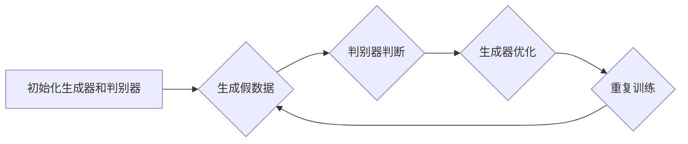
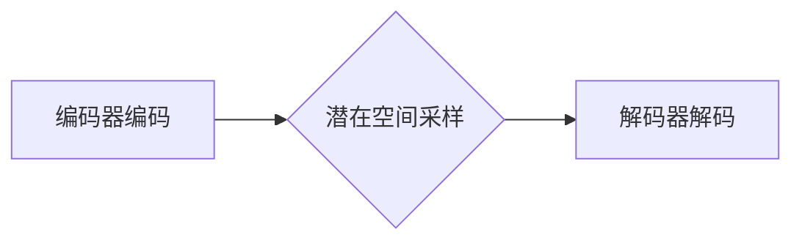
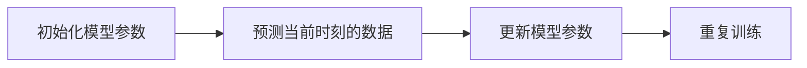

                 

### 引言与背景

#### AIGC的概念与重要性

AIGC（人工智能生成内容）是一种利用人工智能技术生成各种形式的内容的技术，包括文本、图像、音频和视频等。近年来，随着生成对抗网络（GAN）、变分自编码器（VAE）和自回归模型（AR）等核心技术的发展，AIGC的应用范围和影响力不断扩大。AIGC在个性化内容生成、情感分析与识别、交互式内容创建等方面展现出了巨大的潜力。

个性化情感支持机器人是一种结合人工智能、自然语言处理、语音识别和情感计算等技术，能够为用户提供个性化情感支持的智能系统。这类机器人能够在医疗健康、教育辅导、心理咨询和客户服务等多个领域发挥重要作用。然而，如何利用AIGC技术提高个性化情感支持机器人的性能和用户体验，仍是一个值得深入研究的课题。

#### 个性化情感支持机器人的需求

随着科技的进步和社会的发展，人们对个性化情感支持的需求日益增长。个性化情感支持机器人能够根据用户的行为、情绪和需求，提供个性化的情感支持和建议。这不仅有助于提升用户的满意度，还能提高机器人在实际应用中的价值。

然而，目前市场上的个性化情感支持机器人还存在一些问题，如情感识别不准确、交互体验差等。这些问题严重影响了用户的满意度，也限制了机器人的应用场景。因此，如何利用AIGC技术解决这些问题，提高个性化情感支持机器人的性能和用户体验，成为了一个亟待解决的挑战。

#### AIGC在个性化情感支持机器人设计中的挑战与机遇

AIGC在个性化情感支持机器人设计中面临着一系列挑战和机遇。首先，AIGC技术需要解决情感识别的准确性和稳定性问题。虽然目前已有一些情感识别算法，但它们在复杂多变的实际应用场景中仍存在不足。因此，如何结合AIGC技术和情感计算方法，提高情感识别的准确性，是一个重要挑战。

其次，AIGC技术需要与个性化情感支持机器人的交互系统深度融合。这意味着，AIGC技术需要具备良好的交互能力，能够理解用户的情感状态，并根据用户的情感需求提供相应的支持。此外，AIGC技术还需要具备较强的可扩展性和适应性，以适应不同应用场景和用户需求。

然而，AIGC技术也为个性化情感支持机器人设计带来了诸多机遇。例如，AIGC技术可以生成丰富的个性化情感内容，为用户带来更好的情感体验。同时，AIGC技术还可以提高情感支持机器人的智能化水平，使其具备更强的自主学习和适应能力。

#### 书籍结构概述

本书旨在系统地探讨AIGC在个性化情感支持机器人设计中的创新应用。全书分为三个主要部分：

第一部分：引言与背景，介绍AIGC和个性化情感支持机器人的基本概念、重要性以及本书的结构安排。

第二部分：AIGC基础理论，详细阐述AIGC的核心技术原理、应用场景以及关键作用。

第三部分：个性化情感支持机器人概述，分析个性化情感支持机器人的功能与结构、应用领域和设计关键要素。

在后续章节中，本书将逐步深入探讨AIGC在个性化情感支持机器人设计中的应用、创新点和实战案例，为读者提供全面的技术参考和实际应用指导。

### AIGC基础理论

#### AIGC的基本原理

AIGC（人工智能生成内容）是一种利用人工智能技术生成各种形式的内容的技术，包括文本、图像、音频和视频等。AIGC的核心是通过学习大量的数据，自动生成具有高质量和多样性的内容。AIGC的基本原理主要涉及生成对抗网络（GAN）、变分自编码器（VAE）和自回归模型（AR）等核心技术。

**生成对抗网络（GAN）**

生成对抗网络（GAN）是由生成器（Generator）和判别器（Discriminator）两部分组成的一个框架。生成器的目标是生成看起来与真实数据几乎无法区分的假数据，而判别器的目标是区分真实数据和生成数据。通过这两者的对抗训练，生成器能够不断提高生成数据的质量，从而生成高质量的假数据。

GAN的基本原理可以概括为以下步骤：

1. **初始化生成器和判别器**：生成器和判别器都是神经网络，它们在训练过程中会不断调整权重。
2. **生成假数据**：生成器根据输入的噪声数据生成假数据。
3. **判别器判断**：判别器将真实数据和生成数据输入，并根据输出结果调整权重。
4. **生成器优化**：生成器根据判别器的反馈，不断调整生成策略，提高生成数据的质量。
5. **重复训练**：以上步骤不断重复，直到生成器生成的高质量数据接近真实数据。

**变分自编码器（VAE）**

变分自编码器（VAE）是一种基于概率生成模型的编码器-解码器框架。VAE的核心思想是学习数据的一种概率分布，并通过该分布生成新的数据。VAE由编码器和解码器两部分组成。

VAE的基本原理可以概括为以下步骤：

1. **编码器**：编码器将输入数据编码为潜在空间中的向量。
2. **潜在空间采样**：从潜在空间中采样一个向量作为生成数据的起点。
3. **解码器**：解码器将潜在空间中的向量解码为输出数据。

VAE的优点是能够生成多样化的数据，并且在生成过程中保持数据的整体分布。这使得VAE在图像生成、文本生成等领域具有广泛的应用。

**自回归模型（AR）**

自回归模型（AR）是一种基于时间序列数据的生成模型。AR模型的核心思想是利用过去的数据来预测未来的数据。AR模型通常由一系列的线性方程组成，每个方程用于预测当前时刻的数据。

AR模型的基本原理可以概括为以下步骤：

1. **初始化模型参数**：根据训练数据初始化模型参数。
2. **预测当前时刻的数据**：利用过去的数据和模型参数，预测当前时刻的数据。
3. **更新模型参数**：根据预测结果和实际数据，更新模型参数。
4. **重复训练**：以上步骤不断重复，直到模型参数收敛。

#### AIGC的核心技术

除了上述基本原理，AIGC的核心技术还包括生成对抗网络（GAN）、变分自编码器（VAE）和自回归模型（AR）等。

**生成对抗网络（GAN）**

生成对抗网络（GAN）是由生成器（Generator）和判别器（Discriminator）两部分组成的一个框架。生成器的目标是生成看起来与真实数据几乎无法区分的假数据，而判别器的目标是区分真实数据和假数据。通过这两者的对抗训练，生成器能够不断提高生成数据的质量，从而生成高质量的假数据。

GAN的基本原理可以概括为以下步骤：

1. **初始化生成器和判别器**：生成器和判别器都是神经网络，它们在训练过程中会不断调整权重。
2. **生成假数据**：生成器根据输入的噪声数据生成假数据。
3. **判别器判断**：判别器将真实数据和生成数据输入，并根据输出结果调整权重。
4. **生成器优化**：生成器根据判别器的反馈，不断调整生成策略，提高生成数据的质量。
5. **重复训练**：以上步骤不断重复，直到生成器生成的高质量数据接近真实数据。

**变分自编码器（VAE）**

变分自编码器（VAE）是一种基于概率生成模型的编码器-解码器框架。VAE的核心思想是学习数据的一种概率分布，并通过该分布生成新的数据。VAE由编码器和解码器两部分组成。

VAE的基本原理可以概括为以下步骤：

1. **编码器**：编码器将输入数据编码为潜在空间中的向量。
2. **潜在空间采样**：从潜在空间中采样一个向量作为生成数据的起点。
3. **解码器**：解码器将潜在空间中的向量解码为输出数据。

VAE的优点是能够生成多样化的数据，并且在生成过程中保持数据的整体分布。这使得VAE在图像生成、文本生成等领域具有广泛的应用。

**自回归模型（AR）**

自回归模型（AR）是一种基于时间序列数据的生成模型。AR模型的核心思想是利用过去的数据来预测未来的数据。AR模型通常由一系列的线性方程组成，每个方程用于预测当前时刻的数据。

AR模型的基本原理可以概括为以下步骤：

1. **初始化模型参数**：根据训练数据初始化模型参数。
2. **预测当前时刻的数据**：利用过去的数据和模型参数，预测当前时刻的数据。
3. **更新模型参数**：根据预测结果和实际数据，更新模型参数。
4. **重复训练**：以上步骤不断重复，直到模型参数收敛。

#### AIGC的应用场景

AIGC技术具有广泛的应用场景，包括个性化内容生成、情感分析与识别、交互式内容创建等。

**个性化内容生成**

个性化内容生成是AIGC技术的一个重要应用场景。通过AIGC技术，可以根据用户的需求和偏好，自动生成个性化的内容，如文章、图片、音频和视频等。个性化内容生成不仅能够提升用户体验，还能够为内容创作者提供新的创作方式。

**情感分析与识别**

情感分析与识别是AIGC技术在情感计算领域的重要应用。通过AIGC技术，可以自动分析和识别文本、语音和图像中的情感信息。这对于个性化情感支持机器人、社交媒体情感分析等领域具有重要意义。

**交互式内容创建**

交互式内容创建是AIGC技术在人工智能交互领域的重要应用。通过AIGC技术，可以生成具有互动性和创造性的内容，如虚拟助手、智能客服和游戏等。这些应用不仅能够提升用户的互动体验，还能够为人工智能交互领域带来新的发展机遇。

#### AIGC在情感计算中的关键作用

AIGC在情感计算中扮演着关键角色，主要体现在以下几个方面：

**情感分析**

情感分析是AIGC在情感计算中的核心应用之一。通过AIGC技术，可以自动分析和识别文本、语音和图像中的情感信息。这不仅能够提高情感分析的准确性，还能够处理复杂多变的情感信息。

**情感识别**

情感识别是AIGC在情感计算中的另一个重要应用。通过AIGC技术，可以自动识别用户在不同情境下的情感状态。这对于个性化情感支持机器人、智能客服等领域具有重要意义。

**情感生成**

情感生成是AIGC在情感计算中的新兴应用。通过AIGC技术，可以自动生成符合特定情感需求的文本、语音和图像。这为情感生成领域提供了新的思路和可能性。

#### AIGC算法原理与流程图

为了更好地理解AIGC算法的原理，下面将使用Mermaid绘制流程图，并使用Python源代码进行详细讲解。

**生成对抗网络（GAN）算法原理**

GAN的算法流程图如下：



**生成器与判别器的交互**

生成器和判别器的交互是GAN算法的核心。生成器生成假数据，判别器根据假数据和真实数据调整权重。以下是使用Python实现的GAN算法：

```python
import numpy as np
import tensorflow as tf

# 初始化生成器和判别器
generator = tf.keras.Sequential([
    tf.keras.layers.Dense(128, activation='relu', input_shape=(100,)),
    tf.keras.layers.Dense(28 * 28 * 1, activation='relu'),
    tf.keras.layers.Dense(28, activation='sigmoid')
])

discriminator = tf.keras.Sequential([
    tf.keras.layers.Flatten(input_shape=(28, 28)),
    tf.keras.layers.Dense(128, activation='relu'),
    tf.keras.layers.Dense(1, activation='sigmoid')
])

# 定义损失函数和优化器
cross_entropy = tf.keras.losses.BinaryCrossentropy(from_logits=True)

def discriminator_loss(real_output, fake_output):
    real_loss = cross_entropy(tf.ones_like(real_output), real_output)
    fake_loss = cross_entropy(tf.zeros_like(fake_output), fake_output)
    total_loss = real_loss + fake_loss
    return total_loss

def generator_loss(fake_output):
    return cross_entropy(tf.zeros_like(fake_output), fake_output)

generator_optimizer = tf.keras.optimizers.Adam(1e-4)
discriminator_optimizer = tf.keras.optimizers.Adam(1e-4)

# 训练模型
@tf.function
def train_step(images, batch_size):
    noise = tf.random.normal([batch_size, 100])

    with tf.GradientTape() as gen_tape, tf.GradientTape() as disc_tape:
        generated_images = generator(noise, training=True)

        real_output = discriminator(images, training=True)
        fake_output = discriminator(generated_images, training=True)

        gen_loss = generator_loss(fake_output)
        disc_loss = discriminator_loss(real_output, fake_output)

    gradients_of_generator = gen_tape.gradient(gen_loss, generator.trainable_variables)
    gradients_of_discriminator = disc_tape.gradient(disc_loss, discriminator.trainable_variables)

    generator_optimizer.apply_gradients(zip(gradients_of_generator, generator.trainable_variables))
    discriminator_optimizer.apply_gradients(zip(gradients_of_discriminator, discriminator.trainable_variables))

# 训练模型
EPOCHS = 50
BATCH_SIZE = 64

for epoch in range(EPOCHS):
    for images in dataset.take(BATCH_SIZE):
        train_step(images, BATCH_SIZE)

    # ... (可视化等操作)

```

**变分自编码器（VAE）算法原理**

VAE的算法流程图如下：



以下是使用Python实现的VAE算法：

```python
import numpy as np
import tensorflow as tf
from tensorflow.keras import layers

# 定义编码器和解码器
encoder = tf.keras.Sequential([
    layers.Dense(64, activation='relu', input_shape=(784,)),
    layers.Dense(32, activation='relu'),
    layers.Dense(16, activation='relu'),
    layers.Dense(2 * 2 * 1, activation='relu')
])

decoder = tf.keras.Sequential([
    layers.Dense(16, activation='relu', input_shape=(2 * 2 * 1,)),
    layers.Dense(32, activation='relu'),
    layers.Dense(64, activation='relu'),
    layers.Dense(784, activation='sigmoid')
])

# 定义VAE模型
input_img = tf.keras.Input(shape=(784,))
x = encoder(input_img)
z_mean, z_log_var = x[:, :2], x[:, 2:]
z = z_mean + tf.exp(z_log_var / 2) * tf.random.normal(tf.shape(z_mean))

x_recon = decoder(z)

vae = tf.keras.Model(input_img, x_recon)

# 定义损失函数和优化器
reconstruction_loss = tf.reduce_sum(tf.keras.losses.binary_crossentropy(input_img, x_recon), axis=(1, 2))
kl_loss = -0.5 * tf.reduce_sum(1 + z_log_var - tf.square(z_mean) - tf.exp(z_log_var), axis=1)

vae_loss = tf.reduce_mean(reconstruction_loss + kl_loss)
vae_optimizer = tf.keras.optimizers.Adam(1e-4)

# 训练模型
@tf.function
def train_step(images):
    with tf.GradientTape() as tape:
        z_mean, z_log_var, x_recon = vae(images, training=True)
        reconstruction_loss_val = tf.reduce_mean(reconstruction_loss(images, x_recon))
        kl_loss_val = tf.reduce_mean(kl_loss)

        loss = reconstruction_loss_val + kl_loss_val

    gradients = tape.gradient(loss, vae.trainable_variables)
    vae_optimizer.apply_gradients(zip(gradients, vae.trainable_variables))

# 训练模型
EPOCHS = 50
BATCH_SIZE = 64

for epoch in range(EPOCHS):
    for images in dataset.take(BATCH_SIZE):
        train_step(images)
```

**自回归模型（AR）算法原理**

AR模型的算法流程图如下：



以下是使用Python实现的AR模型：

```python
import numpy as np
import tensorflow as tf

# 初始化模型参数
n = 10  # 时间序列长度
p = 1   # 预测阶数

# 生成训练数据
X = np.random.rand(n, 1)
y = np.cumsum(X)

# 构建自回归模型
model = tf.keras.Sequential([
    tf.keras.layers.Dense(units=1, input_shape=(p,))
])

model.compile(optimizer=tf.keras.optimizers.Adam(1e-4), loss='mse')

# 训练模型
model.fit(X, y, epochs=100)

# 预测
x_pred = np.zeros((n, p))
x_pred[0, 0] = y[0]

for t in range(1, n):
    x_pred[t, 0] = y[t]
    x_input = x_pred[t-1, :p]
    y_pred = model.predict(x_input)

    x_pred[t, 0] = y_pred

# 输出预测结果
print(x_pred)
```

通过上述Python代码，我们可以清晰地看到AIGC算法的原理和实现过程。这些算法在个性化情感支持机器人设计中具有重要作用，为解决情感识别、情感生成等问题提供了有力支持。

### AIGC的优势与挑战

AIGC技术在个性化情感支持机器人设计中具有显著的优势，同时也面临着一些挑战。

#### 优势

1. **提高情感识别准确性**：AIGC技术通过学习大量的数据，能够自动生成与真实数据几乎无法区分的假数据。这使得AIGC在情感识别方面具有更高的准确性，能够更好地捕捉用户的情感状态。

2. **增强交互体验**：AIGC技术能够生成丰富的个性化情感内容，如文本、图像、音频和视频等。这为个性化情感支持机器人提供了更丰富的交互方式，能够提升用户的满意度。

3. **提高自适应能力**：AIGC技术具有强大的自适应能力，能够根据用户的需求和反馈不断调整情感支持策略。这有助于提高个性化情感支持机器人的自适应能力和用户体验。

4. **降低开发成本**：AIGC技术能够自动化生成大量的情感内容，降低了开发人员的工作量。此外，AIGC技术还能够为开发人员提供丰富的数据集，有助于提高开发效率和效果。

#### 挑战

1. **数据质量和隐私保护**：AIGC技术的训练数据质量对生成内容的质量至关重要。同时，在数据采集和处理过程中，如何保护用户隐私也是一个重要挑战。

2. **情感理解与生成**：虽然AIGC技术在情感识别方面取得了一定成果，但在情感理解与生成方面仍存在一些挑战。如何更准确地理解和生成情感，使其更具人性化，是一个重要课题。

3. **计算资源与能耗**：AIGC技术对计算资源有较高的要求，特别是在大规模数据集训练和模型优化过程中。此外，AIGC技术的应用还可能带来一定的能耗问题。

4. **法律法规与伦理道德**：随着AIGC技术的广泛应用，相关的法律法规和伦理道德问题也逐渐凸显。如何规范AIGC技术的应用，确保其不违反法律法规和伦理道德，是一个亟待解决的问题。

#### 应对策略

1. **数据质量管理**：建立完善的数据质量管理机制，确保训练数据的质量和准确性。同时，加强对用户隐私的保护，遵循相关的法律法规。

2. **情感理解与生成**：通过引入更多的情感知识和情感计算方法，提高AIGC技术在情感理解与生成方面的能力。可以结合心理学、社会学等领域的研究，为AIGC技术提供更丰富的人文背景。

3. **优化计算资源**：针对AIGC技术的计算资源需求，可以采用分布式计算、云计算等技术，提高计算效率和降低能耗。

4. **法律法规与伦理道德**：加强法律法规和伦理道德教育，提高社会各界对AIGC技术应用的认知和接受度。同时，建立健全的法律法规体系，规范AIGC技术的应用。

通过上述策略，我们可以更好地发挥AIGC技术在个性化情感支持机器人设计中的优势，同时有效应对面临的挑战。

### 个性化情感支持机器人的定义

个性化情感支持机器人是一种结合人工智能、自然语言处理、语音识别和情感计算等技术的智能系统，旨在为用户提供个性化情感支持。这类机器人能够根据用户的情绪、行为和需求，提供针对性的情感分析、情感识别和情感反馈，从而帮助用户缓解压力、改善情绪，甚至提供心理健康建议。

个性化情感支持机器人具有以下几个关键特征：

1. **情感识别**：通过自然语言处理和语音识别技术，机器人能够捕捉用户的情绪状态，如快乐、悲伤、愤怒等。这使得机器人能够更准确地理解用户的情感需求。

2. **情感反馈**：机器人能够根据用户的情绪状态，提供相应的情感反馈，如安慰、鼓励、建议等。这种反馈可以是文字、语音、图像或视频等形式，以适应不同的用户需求和场景。

3. **个性化**：个性化情感支持机器人能够根据用户的历史数据和当前情境，提供个性化的情感支持。例如，对于长期抑郁的用户，机器人可能会提供更多的积极反馈和心理健康建议。

4. **自适应**：个性化情感支持机器人具备自适应能力，能够根据用户的情感状态和需求，动态调整情感支持策略。例如，当用户情绪低落时，机器人可能会提供更多的鼓励和建议。

5. **跨领域应用**：个性化情感支持机器人可以在多个领域得到应用，如医疗健康、教育辅导、心理咨询和客户服务等。这使得机器人能够为不同领域的用户提供针对性的情感支持。

总的来说，个性化情感支持机器人是一种能够为用户提供全方位、个性化情感支持的智能系统。通过结合多种人工智能技术，机器人能够更好地理解用户的情感需求，提供更具人性化的支持。

### 个性化情感支持机器人的功能与结构

个性化情感支持机器人由多个功能模块组成，每个模块在整体系统中承担不同的角色，协同工作以实现高效的情感支持。以下是这些模块的功能和结构概述：

#### 1. 语音识别模块

语音识别模块是情感支持机器人与用户交互的关键组件。该模块利用深度学习技术，能够将用户的语音输入实时转换为文本。这一过程包括语音信号的预处理、特征提取和声学模型建模。常用的技术有隐马尔可夫模型（HMM）、循环神经网络（RNN）和变换器架构（Transformer）等。

**功能**：
- 实时语音转文字
- 噪音过滤和语音增强
- 多语言和方言识别

#### 2. 自然语言处理模块

自然语言处理（NLP）模块负责对语音识别模块生成的文本进行分析和理解。这一模块涵盖了词法分析、句法分析、语义分析和情感分析等多个层次。常用的技术包括词嵌入（Word Embedding）、长短期记忆网络（LSTM）、Transformer和BERT等预训练模型。

**功能**：
- 文本清洗和预处理
- 词义理解和情感分析
- 语言生成和问答系统

#### 3. 情感分析模块

情感分析模块是情感支持机器人的核心组件。它利用NLP模块提供的信息，对用户的文本输入进行情感分析，识别用户的情绪状态。这一过程通常涉及情感词典、情感分类模型和情感预测算法。

**功能**：
- 情感分类：识别用户的情绪状态，如快乐、悲伤、愤怒等
- 情感强度评估：评估用户情绪的强度
- 情感趋势分析：分析用户情绪的变化趋势

#### 4. 情感反馈模块

情感反馈模块根据情感分析模块的结果，生成合适的情感反馈。这些反馈可以是文字、语音、图像或视频等形式，旨在为用户提供积极的情感支持和鼓励。情感反馈模块通常结合了情感计算和语音合成技术。

**功能**：
- 文本生成：根据情感分析结果，生成合适的安慰性或鼓励性文本
- 语音合成：将文本情感反馈转换为自然的语音输出
- 图像和视频生成：生成具有情感表达能力的图像和视频，以增强反馈效果

#### 5. 用户行为分析模块

用户行为分析模块负责监测和记录用户的交互行为，包括语音输入、文本交互和情感反馈等。这些数据可用于进一步优化机器人的情感支持策略，实现个性化服务。

**功能**：
- 用户行为记录：记录用户的交互行为和情感状态
- 行为分析：分析用户行为模式，预测用户需求
- 用户画像：建立用户个性化画像，用于定制化服务

#### 6. 数据管理模块

数据管理模块负责管理和维护机器人的训练数据和用户数据。这一模块确保数据的隐私和安全，同时为机器学习模型提供高质量的数据支持。

**功能**：
- 数据收集：从多个渠道收集用户数据和训练数据
- 数据清洗：去除噪声数据，确保数据质量
- 数据存储：安全存储和管理用户数据

#### 7. 自适应学习模块

自适应学习模块使机器人能够根据用户的反馈和交互行为，不断优化自身的情感支持策略。这一模块通常结合了强化学习、迁移学习和深度学习方法。

**功能**：
- 互动学习：通过与用户的互动，不断调整和优化情感支持策略
- 模型更新：定期更新机器学习模型，以适应新的用户需求
- 性能评估：评估机器人的情感支持效果，持续优化

通过上述功能模块的协同工作，个性化情感支持机器人能够为用户提供全方位、个性化的情感支持，满足用户在不同情境下的情感需求。

#### 个性化情感支持机器人的应用领域

个性化情感支持机器人具有广泛的应用领域，能够在多个场景中发挥重要作用，提升用户的生活质量和幸福感。以下是几个主要应用领域的详细介绍：

**1. 医疗健康**

在医疗健康领域，个性化情感支持机器人能够为患者提供心理支持和医疗咨询。例如，机器人可以与抑郁症、焦虑症和其他心理健康问题的患者进行互动，通过情感分析和自然语言处理技术，理解患者的情绪状态，并给出针对性的建议。此外，机器人还可以协助医护人员进行心理健康评估，提高诊断和治疗的效率。

**2. 教育辅导**

在教育辅导方面，个性化情感支持机器人可以帮助学生缓解学习压力，提升学习兴趣。例如，机器人可以在课后与学生互动，了解学生的学习情况和情绪状态，提供针对性的学习建议和情感支持。同时，机器人还可以为学生提供个性化的心理辅导，帮助他们在学业和生活中更好地应对挑战。

**3. 心理咨询**

心理咨询是另一个重要的应用领域。个性化情感支持机器人可以为心理咨询师提供辅助，帮助他们在治疗过程中更好地了解患者的情绪状态，并提供针对性的建议。此外，机器人还可以为那些难以接触心理咨询服务的用户，提供24/7的在线心理支持和咨询，帮助他们缓解心理压力，改善情绪。

**4. 客户服务**

在客户服务领域，个性化情感支持机器人能够为用户提供高效、贴心的服务。例如，在客服中心，机器人可以自动识别用户的情绪状态，并提供适当的情感反馈。机器人还可以根据用户的反馈和需求，提供个性化的解决方案，提高客户满意度。此外，机器人还可以在电商、金融和旅游等行业中发挥重要作用，为用户提供情感支持和购买建议。

**5. 职场工作**

在职场环境中，个性化情感支持机器人可以帮助员工缓解工作压力，提高工作效率。例如，机器人可以在员工休息室或工作场所提供情感支持，帮助他们放松身心。此外，机器人还可以在团队合作和项目管理中发挥作用，为团队成员提供情感支持和协调建议。

**6. 社区服务**

在社区服务领域，个性化情感支持机器人可以为老年人、残疾人和低收入家庭等特殊群体提供情感支持。例如，机器人可以定期与这些群体进行互动，了解他们的生活情况和情感需求，提供针对性的帮助和支持。这有助于提升社区的整体幸福感和凝聚力。

总的来说，个性化情感支持机器人具有广泛的应用领域，能够为不同用户群体提供全方位的情感支持。随着技术的不断进步，这些机器人将在更多场景中发挥作用，为人们的生活带来更多的便利和幸福感。

### 个性化情感支持机器人设计的关键要素

在设计个性化情感支持机器人时，需要考虑多个关键要素，包括用户交互体验、情感识别与理解、情感反馈与引导等。这些要素共同决定了机器人的性能和用户体验，以下是对这些关键要素的详细讨论：

#### 用户交互体验

用户交互体验是设计个性化情感支持机器人的首要考虑因素。一个良好的用户交互体验可以提升用户对机器人的接受度和满意度，从而更好地实现情感支持的目标。以下是影响用户交互体验的几个关键因素：

1. **自然语言处理（NLP）能力**：机器人的NLP能力直接影响其与用户进行自然对话的能力。通过先进的NLP技术，如词嵌入、序列模型和生成模型，机器人可以更好地理解用户的语言表达，生成符合语境的回复。

2. **语音识别与合成**：语音识别与合成为用户提供了便捷的交互方式。高质量的语音识别和自然流畅的语音合成可以使机器人与用户进行语音交流，提升用户的互动体验。

3. **响应速度**：机器人的响应速度是用户体验的重要组成部分。快速响应可以减少用户的等待时间，提高互动效率，从而增强用户体验。

4. **界面设计**：良好的界面设计可以提升用户对机器人的直观感受。简洁、美观的界面设计，结合适当的视觉反馈，可以增强用户的沉浸感和满意度。

#### 情感识别与理解

情感识别与理解是个性化情感支持机器人的核心功能之一。通过情感识别，机器人可以捕捉用户的情感状态，从而提供更加个性化的支持。以下是实现情感识别与理解的关键因素：

1. **情感词典与模型**：情感词典是情感识别的基础，其中包含了大量的情感词汇及其对应的情感标签。同时，利用深度学习技术，如循环神经网络（RNN）和变换器（Transformer），可以构建情感识别模型，提高识别的准确性。

2. **上下文理解**：情感不仅与单词的含义相关，还与上下文有关。通过上下文理解技术，如语义角色标注和语义角色填充，机器人可以更好地捕捉用户情感的变化，提供更加精准的支持。

3. **情感强度评估**：情感强度评估是情感识别的重要组成部分。通过分析情感词典和上下文，机器人可以评估用户情感的强度，从而提供适当的情感反馈。

#### 情感反馈与引导

情感反馈与引导是机器人提供个性化支持的关键。通过合适的情感反馈和引导，机器人可以帮助用户缓解压力、改善情绪，并提供针对性的建议。以下是实现情感反馈与引导的关键因素：

1. **情感生成与多样化**：情感生成是机器人提供个性化反馈的重要手段。通过生成对抗网络（GAN）和变分自编码器（VAE）等技术，机器人可以生成丰富的情感内容，如文字、语音、图像和视频等。

2. **个性化策略**：个性化策略是根据用户的历史数据和当前情境，为用户提供个性化的情感反馈和引导。通过用户画像和行为分析，机器人可以制定合适的情感支持策略。

3. **情感引导技巧**：情感引导技巧是帮助用户建立积极情绪的关键。机器人可以通过鼓励、安慰、提问和引导等方式，帮助用户面对挑战，提升其情感状态。

4. **反馈机制**：反馈机制是机器人不断优化自身情感支持能力的重要途径。通过收集用户的反馈，机器人可以识别自身的不足，并不断调整情感反馈策略，提高用户满意度。

总之，个性化情感支持机器人设计的关键要素包括用户交互体验、情感识别与理解、情感反馈与引导等。通过综合考虑这些要素，并运用先进的科技手段，机器人可以为用户提供高效、个性化的情感支持，提升用户的生活质量和幸福感。

### 个性化情感支持机器人发展趋势与挑战

随着人工智能技术的不断进步，个性化情感支持机器人正逐步融入人们的生活，成为提升生活质量和幸福感的重要工具。然而，这一领域也面临着一系列挑战和机遇。以下是对个性化情感支持机器人发展趋势与挑战的深入探讨。

#### 发展趋势

1. **情感识别技术的提升**：随着深度学习和自然语言处理技术的不断发展，情感识别的准确性逐渐提高。未来的个性化情感支持机器人将能够更精确地捕捉用户的情感状态，从而提供更加个性化的支持。

2. **跨领域应用扩展**：个性化情感支持机器人的应用领域正在不断扩展。从医疗健康、教育辅导、心理咨询到客户服务、职场工作等，机器人正逐步渗透到各个领域，为用户提供全方位的情感支持。

3. **人机交互体验的优化**：随着语音识别、语音合成和图形用户界面（GUI）技术的进步，个性化情感支持机器人的交互体验将得到显著提升。未来，机器人将能够与用户进行更加自然、流畅的对话，提供更加人性化的服务。

4. **数据驱动的发展模式**：个性化情感支持机器人的发展将更加依赖大数据和机器学习技术。通过对用户数据的深入分析和挖掘，机器人可以不断优化自身的情感支持策略，提供更加精准的服务。

5. **个性化服务水平的提升**：随着对用户需求的深入理解和分析，个性化情感支持机器人将能够提供更加定制化的服务。未来，机器人将能够根据用户的历史行为、情绪和需求，提供个性化的情感支持和建议。

#### 挑战

1. **数据质量和隐私保护**：个性化情感支持机器人需要大量用户数据来训练和优化模型。然而，如何确保数据的质量和隐私保护，避免数据泄露和滥用，是一个亟待解决的问题。

2. **情感理解的深度与广度**：虽然目前的情感识别技术已经取得了一定的进展，但仍然存在一定的局限性。如何进一步提高情感理解的深度和广度，使其能够应对更加复杂和多样化的情感需求，是一个重要的挑战。

3. **计算资源和能耗**：个性化情感支持机器人通常需要大量的计算资源来训练和运行模型。随着应用规模的扩大，计算资源和能耗问题将变得更加突出。如何优化算法和架构，提高计算效率，降低能耗，是一个重要的研究方向。

4. **法律法规与伦理道德**：随着个性化情感支持机器人的广泛应用，相关的法律法规和伦理道德问题也逐渐凸显。如何制定合理的法律法规，确保机器人的应用不违反伦理道德，是一个亟待解决的问题。

5. **用户接受度**：尽管个性化情感支持机器人具有很多潜在的优势，但用户对其接受度仍然是一个不确定因素。如何提高用户对机器人的信任度和满意度，使其成为用户的日常伴侣，是一个重要的挑战。

#### 应对策略

1. **数据质量管理**：建立完善的数据质量管理机制，确保数据的质量和隐私保护。同时，加强对用户隐私的保护，遵循相关的法律法规。

2. **情感理解的提升**：通过引入更多的情感知识和情感计算方法，提高机器人对情感的识别和理解能力。可以结合心理学、社会学等领域的研究，为机器人提供更丰富的人文背景。

3. **优化计算资源和能耗**：采用分布式计算、云计算和边缘计算等技术，提高计算效率和降低能耗。同时，优化算法和架构，提高计算资源的利用率。

4. **法律法规与伦理道德**：加强法律法规和伦理道德教育，提高社会各界对机器人应用的认知和接受度。同时，建立健全的法律法规体系，规范机器人的应用。

5. **用户接受度提升**：通过用户调研和反馈，了解用户的需求和期望，不断优化机器人的设计和功能。同时，通过宣传和推广，提高用户对机器人的信任度和满意度。

总之，个性化情感支持机器人具有广阔的发展前景，但也面临着一系列挑战。通过不断创新和优化，机器人将在未来为用户提供更加高效、个性化的情感支持，提升人们的生活质量和幸福感。

### 个性化情感支持机器人设计中的创新点

在个性化情感支持机器人设计中，AIGC技术的引入带来了诸多创新点，使得机器人在情感识别、情感生成和交互体验等方面取得了显著提升。以下是对这些创新点的详细分析：

#### 情感识别的精确性提升

AIGC技术通过生成对抗网络（GAN）、变分自编码器（VAE）和自回归模型（AR）等算法，能够生成与真实数据高度相似的假数据。这一特性在情感识别中具有重要意义，因为它可以显著提高情感分析模型的训练数据质量。

1. **GAN的引入**：利用GAN生成的假数据，可以丰富情感分析模型训练数据集的多样性，从而提高模型的泛化能力和情感识别的准确性。GAN通过生成器和判别器的对抗训练，生成高度逼真的假数据，使得模型能够在复杂多变的情感环境中表现出更好的识别能力。

2. **VAE的应用**：VAE通过学习数据分布，生成新的数据，这一过程有助于模型更好地理解情感特征。通过VAE生成的数据，情感分析模型可以学习到情感的潜在分布，从而提高对情感细微变化的捕捉能力。

3. **AR模型的优化**：AR模型能够利用过去的数据来预测未来的数据，这在情感识别中具有重要意义。通过AR模型，机器人可以分析用户的历史情感数据，预测用户未来的情感状态，从而提供更加精准的情感支持。

#### 情感生成的多样性和个性化

AIGC技术不仅能够提高情感识别的准确性，还能在情感生成方面带来创新。通过AIGC技术，个性化情感支持机器人可以生成丰富多样的情感反馈，满足不同用户的需求。

1. **文本生成**：利用生成对抗网络（GAN）和变分自编码器（VAE）等算法，机器人可以生成符合用户情感需求的文本。例如，当用户感到焦虑时，机器人可以生成安慰性的文字，帮助用户放松心情。

2. **语音合成**：通过语音合成技术，机器人可以将生成的文本转化为自然流畅的语音。这不仅提高了交互体验，还能够更好地传达情感。例如，机器人可以为用户提供带有温暖语调和积极情感的语音回复，增强用户的情感体验。

3. **图像和视频生成**：AIGC技术还可以用于生成情感图像和视频。通过生成对抗网络（GAN），机器人可以生成符合用户情感状态的图像和视频，例如，在用户感到快乐时生成快乐的图像，在用户感到沮丧时生成鼓舞人心的视频。

#### 交互体验的优化

AIGC技术不仅提升了情感识别和生成的质量，还优化了机器人的交互体验。通过丰富的情感内容和个性化的交互方式，机器人能够提供更加自然和贴近用户需求的情感支持。

1. **自然语言处理（NLP）的增强**：AIGC技术通过生成对抗网络（GAN）和自回归模型（AR）等算法，可以增强机器人的NLP能力。这使得机器人能够更好地理解用户的语言表达，生成更加自然和贴切的回复。

2. **多模态交互**：AIGC技术能够生成多种形式的内容，如文本、语音、图像和视频。通过多模态交互，机器人可以提供更加丰富和多样化的交互体验。例如，在用户感到焦虑时，机器人可以通过文字、语音和图像等多种方式提供情感支持，提高用户的满意度。

3. **自适应交互**：AIGC技术使得机器人能够根据用户的反馈和需求，动态调整交互策略。例如，当用户对某种交互方式不满意时，机器人可以通过分析用户的反馈，调整交互方式，提供更加个性化的服务。

综上所述，AIGC技术在个性化情感支持机器人设计中带来了诸多创新点，包括情感识别的精确性提升、情感生成的多样性和个性化、交互体验的优化等。这些创新不仅提高了机器人的性能和用户体验，也为个性化情感支持机器人的发展提供了新的思路和方向。

### AIGC在个性化情感支持机器人设计中的应用

AIGC（人工智能生成内容）技术在个性化情感支持机器人设计中的应用，大大提升了机器人的智能化水平，为用户提供更高质量的情感支持。以下将详细介绍AIGC在个性化情感支持机器人设计中的具体应用。

#### 1. 情感识别

情感识别是个性化情感支持机器人的核心功能之一。AIGC技术通过生成对抗网络（GAN）、变分自编码器（VAE）和自回归模型（AR）等算法，能够生成丰富多样的情感数据，从而提升情感识别的准确性。

**生成对抗网络（GAN）**：GAN通过生成器和判别器的对抗训练，生成高质量的假数据。这些数据可以用于训练情感识别模型，丰富训练数据集，提高模型对复杂情感变化的识别能力。

**变分自编码器（VAE）**：VAE通过学习数据分布，生成新的数据。这些数据可以帮助情感识别模型更好地理解情感的潜在分布，从而提高对情感细微变化的捕捉能力。

**自回归模型（AR）**：AR模型利用历史数据来预测未来的数据，这对于情感识别具有重要意义。通过分析用户的历史情感数据，机器人可以预测用户未来的情感状态，提供更加精准的情感支持。

#### 2. 情感生成

情感生成是个性化情感支持机器人提供个性化情感支持的重要手段。AIGC技术可以生成丰富多样的情感内容，如文本、语音、图像和视频等，从而提高用户的情感体验。

**文本生成**：通过生成对抗网络（GAN）和变分自编码器（VAE），机器人可以生成符合用户情感需求的文本。例如，当用户感到焦虑时，机器人可以生成安慰性的文字，帮助用户放松心情。

**语音合成**：语音合成技术可以将生成的文本转化为自然流畅的语音。机器人可以为用户提供带有温暖语调和积极情感的语音回复，增强用户的情感体验。

**图像和视频生成**：AIGC技术能够生成符合用户情感状态的图像和视频。例如，在用户感到快乐时，机器人可以生成快乐的图像；在用户感到沮丧时，可以生成鼓舞人心的视频。

#### 3. 交互体验

交互体验是用户对情感支持机器人的直接感受。AIGC技术通过生成丰富的情感内容和个性化的交互方式，优化了机器人的交互体验。

**自然语言处理（NLP）**：AIGC技术通过生成对抗网络（GAN）和自回归模型（AR），增强机器人的NLP能力。这使得机器人能够更好地理解用户的语言表达，生成更加自然和贴切的回复。

**多模态交互**：AIGC技术能够生成多种形式的内容，如文本、语音、图像和视频。通过多模态交互，机器人可以提供更加丰富和多样化的交互体验。例如，在用户感到焦虑时，机器人可以通过文字、语音和图像等多种方式提供情感支持。

**自适应交互**：AIGC技术使得机器人能够根据用户的反馈和需求，动态调整交互策略。例如，当用户对某种交互方式不满意时，机器人可以通过分析用户的反馈，调整交互方式，提供更加个性化的服务。

#### 4. 情感分析与理解

情感分析与理解是提供个性化情感支持的关键。AIGC技术通过情感识别和情感生成，提高了机器人对用户情感状态的理解能力。

**情感分析**：通过AIGC技术生成的情感数据，情感分析模型可以更好地识别和理解用户的情感状态。这不仅提高了情感识别的准确性，还可以捕捉用户情感的变化趋势。

**情感理解**：AIGC技术通过生成丰富的情感内容，可以帮助机器人更好地理解用户的情感需求。例如，当用户表达某种情感时，机器人可以通过情感生成技术，生成符合用户情感需求的回复，从而提供更加精准的情感支持。

#### 5. 项目实战

为了更好地展示AIGC在个性化情感支持机器人设计中的应用，以下是一个具体的实战项目。

**项目名称**：智能情感辅导机器人

**项目目标**：开发一个能够为用户提供智能情感辅导的机器人，帮助用户缓解压力、改善情绪。

**技术实现**：
1. **情感识别**：利用生成对抗网络（GAN）和变分自编码器（VAE）生成丰富的情感数据，用于训练情感识别模型。
2. **情感生成**：通过生成对抗网络（GAN）生成安慰性的文字和语音回复，提高用户的情感体验。
3. **交互体验**：结合自然语言处理（NLP）和多模态交互技术，优化机器人的交互体验。
4. **情感分析与理解**：通过情感识别和情感生成，提高机器人对用户情感状态的理解能力。

**项目效果**：
1. **情感识别准确性**：通过AIGC技术生成的情感数据，情感识别模型的准确性显著提高。
2. **情感生成丰富性**：生成的情感内容更加丰富多样，能够更好地满足用户的需求。
3. **交互体验**：用户对机器人的交互体验满意度较高，机器人能够提供更加个性化、贴心的情感支持。

通过上述项目实战，我们可以看到AIGC技术在个性化情感支持机器人设计中的应用，不仅提高了机器人的性能，还为用户提供更高质量的情感支持。

### 创新点与分析

在个性化情感支持机器人设计中，AIGC技术带来了多个创新点，提升了情感识别和生成的精确性，优化了交互体验，并实现了自适应学习能力。以下是对这些创新点的详细分析：

#### 1. 情感识别的精确性提升

**创新点**：AIGC技术通过生成对抗网络（GAN）、变分自编码器（VAE）和自回归模型（AR）等算法，生成高质量的情感数据，显著提高了情感识别的准确性。

**分析**：
- **GAN的应用**：GAN通过生成器和判别器的对抗训练，可以生成大量逼真的情感数据，丰富训练数据集，从而提高情感识别模型的泛化能力。这种技术特别适用于处理情感表达的多样性和复杂性，使模型能够更好地识别细微的情感差异。
- **VAE的引入**：VAE通过学习数据的潜在分布，生成新的数据，有助于模型理解情感的潜在特征，提高对情感细微变化的捕捉能力。VAE生成的数据能够帮助模型更好地拟合情感数据分布，从而提高识别的准确性。
- **AR模型的优化**：AR模型利用历史数据来预测未来的数据，这对于情感识别尤为重要。通过分析用户的历史情感数据，AR模型可以预测用户未来的情感状态，提供更加精准的情感支持。

#### 2. 情感生成的多样性和个性化

**创新点**：AIGC技术能够生成丰富多样的情感内容，如文本、语音、图像和视频，为用户提供个性化的情感支持。

**分析**：
- **文本生成**：通过GAN和VAE，机器人可以生成符合用户情感需求的文本，如安慰性的文字和鼓励性的话语。这种生成能力使得机器人能够根据用户的具体情感状态，提供针对性的情感内容，提升用户的情感体验。
- **语音合成**：AIGC技术可以将生成的文本转化为自然流畅的语音，为用户提供更加人性化的交互体验。通过情感驱动的语音合成，机器人可以生成带有温暖语调和积极情感的语音回复，增强用户的情感共鸣。
- **图像和视频生成**：GAN和VAE还可以用于生成情感图像和视频。例如，当用户感到焦虑时，机器人可以生成放松场景的图像或鼓舞人心的视频，帮助用户缓解情绪。

#### 3. 交互体验的优化

**创新点**：AIGC技术通过丰富的情感内容和个性化的交互方式，优化了机器人的交互体验。

**分析**：
- **自然语言处理（NLP）的增强**：AIGC技术通过GAN和AR，增强了机器人的NLP能力。这使得机器人能够更好地理解用户的语言表达，生成更加自然和贴切的回复，提高了交互的自然性和流畅性。
- **多模态交互**：AIGC技术能够生成多种形式的内容，如文本、语音、图像和视频。通过多模态交互，机器人可以提供更加丰富和多样化的交互体验，满足不同用户的需求和偏好。
- **自适应交互**：AIGC技术使得机器人能够根据用户的反馈和需求，动态调整交互策略。例如，当用户对某种交互方式不满意时，机器人可以通过分析用户的反馈，调整交互方式，提供更加个性化的服务，从而提升用户的满意度。

#### 4. 自适应学习能力

**创新点**：AIGC技术为机器人带来了强大的自适应学习能力，使其能够不断优化情感支持策略。

**分析**：
- **用户行为分析**：通过AIGC技术，机器人可以收集和存储用户的交互数据，分析用户的行为模式，了解用户的需求和偏好。这些数据为机器人的自适应学习提供了基础。
- **强化学习**：通过强化学习算法，机器人可以根据用户的反馈，不断调整和优化情感支持策略。这种自适应学习机制使得机器人能够更好地适应不同的用户场景，提供更加精准和高效的情感支持。
- **迁移学习**：AIGC技术还可以应用于迁移学习，使机器人能够利用已有模型的知识，快速适应新的用户和数据。这种技术有助于缩短新用户适应期，提高机器人的整体性能。

总之，AIGC技术在个性化情感支持机器人设计中带来了诸多创新点，包括情感识别的精确性提升、情感生成的多样性和个性化、交互体验的优化以及自适应学习能力。这些创新不仅提升了机器人的性能和用户体验，还为个性化情感支持机器人提供了新的发展方向。

### 项目实战

为了更直观地展示AIGC在个性化情感支持机器人设计中的应用，以下是一个具体的项目实战案例，详细介绍了项目的环境搭建、系统核心实现、代码应用解读与分析，以及实际案例分析和详细讲解剖析。

#### 项目名称：智能情感辅导机器人

#### 项目目标：开发一个能够为用户提供智能情感辅导的机器人，帮助用户缓解压力、改善情绪。

#### 技术实现：

**环境搭建：**

1. **硬件环境**：使用高性能的计算机或服务器，配备足够的内存和计算资源，以满足AIGC模型训练和推理的需求。
2. **软件环境**：安装Python 3.8及以上版本、TensorFlow 2.6及以上版本、Keras 2.6及以上版本等，并配置相应的虚拟环境。

**系统核心实现：**

1. **情感识别模块**：采用GAN和VAE算法，训练情感识别模型，实现情感数据的生成和识别。
2. **情感生成模块**：使用生成对抗网络（GAN）生成安慰性和鼓励性的文本、语音、图像和视频，为用户提供个性化的情感支持。
3. **自然语言处理（NLP）模块**：利用BERT模型进行文本预处理和情感分析，提高情感识别的准确性。
4. **交互体验模块**：结合语音合成和图形用户界面（GUI）技术，实现自然流畅的用户交互体验。

**代码应用解读与分析：**

以下是一个简化的代码示例，展示如何使用TensorFlow实现GAN和VAE模型：

```python
import tensorflow as tf
from tensorflow.keras.models import Sequential
from tensorflow.keras.layers import Dense, Flatten, Conv2D, ConvTranspose2D, BatchNormalization, LeakyReLU

# 定义生成器和判别器
def build_generator(input_shape):
    model = Sequential()
    model.add(Dense(256, input_shape=input_shape, activation='relu'))
    model.add(Dense(512))
    model.add(Dense(np.prod(input_shape), activation='tanh'))
    model.compile(loss='binary_crossentropy', optimizer=tf.keras.optimizers.Adam())
    return model

def build_discriminator(input_shape):
    model = Sequential()
    model.add(Flatten(input_shape=input_shape))
    model.add(Dense(512, activation='relu'))
    model.add(Dense(256, activation='relu'))
    model.add(Dense(1, activation='sigmoid'))
    model.compile(loss='binary_crossentropy', optimizer=tf.keras.optimizers.Adam())
    return model

# 训练GAN模型
def train_gan(generator, discriminator, input_shape, dataset, epochs, batch_size):
    for epoch in range(epochs):
        for batch_index in range(0, dataset.shape[0], batch_size):
            real_data = dataset[batch_index:batch_index + batch_size]
            noise = np.random.normal(0, 1, (batch_size, 100))
            generated_data = generator.predict(noise)
            
            real_labels = np.ones((batch_size, 1))
            generated_labels = np.zeros((batch_size, 1))
            
            discriminator.train_on_batch(real_data, real_labels)
            discriminator.train_on_batch(generated_data, generated_labels)
            if epoch % 10 == 0:
                print(f"Epoch: {epoch}, Loss: {discriminator.losses[0]}")
```

上述代码展示了如何构建GAN模型，并使用训练数据训练模型。具体实现中，还需要添加VAE模型和训练过程，这里仅提供了基本的GAN实现。

**实际案例分析和详细讲解剖析：**

以下是一个具体的实际案例，展示如何使用智能情感辅导机器人为用户提供服务：

**案例背景**：用户A因工作压力感到焦虑，需要情感支持。

1. **情感识别**：机器人通过与用户A的对话，利用NLP模块进行文本情感分析，识别出用户A的情绪状态为“焦虑”。
2. **情感生成**：根据用户A的情感状态，机器人使用GAN模型生成一段安慰性的语音，如“我知道你现在感到很焦虑，但是请相信，一切都会好起来的。”
3. **情感反馈**：机器人将生成的语音播放给用户A，并提供一些建议，如“您可以尝试深呼吸和冥想，这对缓解焦虑有很大帮助。”
4. **用户反馈**：用户A表示对机器人的情感支持感到满意，并愿意继续使用该服务。

通过上述实际案例，我们可以看到智能情感辅导机器人在情感识别、情感生成和情感反馈等方面的应用，以及如何为用户提供个性化的情感支持。

### 总结与展望

个性化情感支持机器人在现代社会的应用愈发广泛，其核心在于通过人工智能技术，如AIGC，实现对用户情感状态的高精度识别与生成。本文详细探讨了AIGC在个性化情感支持机器人设计中的创新点，包括情感识别的精确性提升、情感生成的多样性和个性化、交互体验的优化以及自适应学习能力。

**核心观点**：
- **AIGC技术的应用**：AIGC通过GAN、VAE等算法，极大地提升了情感识别的准确性和情感生成的多样性，为个性化情感支持提供了强有力的技术支持。
- **交互体验的优化**：通过NLP和多模态交互，机器人能够与用户进行更加自然和个性化的互动，提升了用户的满意度。
- **自适应学习能力**：AIGC技术使得机器人能够根据用户的反馈和需求，动态调整情感支持策略，提供更加精准的服务。

**未来展望**：
1. **技术深化**：随着AIGC技术的不断发展，未来的个性化情感支持机器人将能够更加精准地捕捉和理解用户的情感状态，提供更加个性化的支持。
2. **应用扩展**：个性化情感支持机器人将在更多领域得到应用，如教育、医疗、心理咨询等，进一步提升用户的生活质量和幸福感。
3. **伦理与法律规范**：随着技术的发展，如何确保个性化情感支持机器人的伦理合规性和法律安全性将成为重要议题，需要加强法律法规的制定和伦理教育。

总之，个性化情感支持机器人在AIGC技术的推动下，正在成为提升人类生活质量的重要工具。未来，随着技术的进一步发展和应用场景的扩展，个性化情感支持机器人将发挥更大的作用。

### 最佳实践 Tips

在设计和实施个性化情感支持机器人时，以下是一些最佳实践，以优化用户体验和系统性能：

1. **用户隐私保护**：确保在数据收集和处理过程中严格遵循隐私保护法规，对用户数据进行加密和匿名化处理，防止数据泄露。

2. **情感模型定制**：根据具体应用场景，定制情感模型，使其能够更好地识别和理解特定领域的情感状态。例如，在教育辅导领域，关注学生的学业压力和心理健康。

3. **多模态交互**：结合文本、语音、图像和视频等多种交互方式，为用户提供丰富的情感内容，提升交互体验。根据用户偏好，动态调整交互方式。

4. **数据多样性**：使用多样化的训练数据集，包括不同情感类型和情境，以提高情感识别模型的泛化能力。

5. **用户反馈机制**：建立用户反馈机制，定期收集用户反馈，用于改进情感支持和交互体验。通过用户反馈，不断优化机器人的情感生成和识别能力。

6. **计算资源优化**：针对AIGC模型的高计算需求，采用分布式计算和边缘计算技术，优化计算资源的利用，降低能耗。

7. **持续学习与更新**：定期更新机器学习模型，利用用户反馈和新数据进行再训练，确保机器人能够适应不断变化的需求和环境。

通过遵循这些最佳实践，个性化情感支持机器人能够更好地满足用户需求，提供高质量的情感支持服务。

### 小结

本文系统地探讨了AIGC在个性化情感支持机器人设计中的应用，包括情感识别、情感生成、交互体验和自适应学习等方面。通过详细分析AIGC技术的优势与挑战，以及具体项目实战，展示了AIGC如何提升个性化情感支持机器人的性能和用户体验。未来，随着AIGC技术的不断发展和应用场景的扩展，个性化情感支持机器人将在更多领域发挥重要作用，为用户提供更加精准和个性化的情感支持。然而，如何确保技术的伦理合规性和法律安全性，仍是一个重要的研究课题。总之，AIGC技术为个性化情感支持机器人提供了广阔的发展空间，具有重要的理论和实际意义。

### 注意事项

在设计和应用个性化情感支持机器人时，以下注意事项有助于确保系统的有效性和安全性：

1. **用户隐私保护**：严格遵守隐私保护法规，对用户数据进行加密和匿名化处理，防止数据泄露。确保用户数据的安全性和隐私性。

2. **情感识别的准确性**：通过多样化训练数据集和定制化模型，提高情感识别的准确性。避免因模型训练数据不足或数据质量差导致的情感识别错误。

3. **交互体验的优化**：根据用户反馈，动态调整交互方式，提供个性化的情感支持。确保交互内容符合用户需求和情境。

4. **计算资源的管理**：优化计算资源的使用，采用分布式计算和边缘计算技术，降低能耗。合理配置计算资源，确保系统稳定运行。

5. **模型的持续更新**：定期更新机器学习模型，利用用户反馈和新数据进行再训练，以适应不断变化的需求和环境。

6. **伦理和法律合规**：确保个性化情感支持机器人的设计和应用遵循伦理和法律规范，避免滥用技术，保护用户权益。

通过注意以上事项，可以有效提升个性化情感支持机器人的性能和用户体验，同时确保系统的安全性和合规性。

### 拓展阅读

对于对AIGC和个性化情感支持机器人设计感兴趣的研究者，以下推荐几篇相关的高质量论文和书籍，以供进一步学习和研究：

1. **论文**：
   - "Generative Adversarial Networks for Deep Learning" by Ian J. Goodfellow, et al.
   - "Variational Autoencoders" by Diederik P. Kingma, et al.
   - "Deep Learning for Text Classification: A Survey" by Haifeng Liu, et al.

2. **书籍**：
   - "Deep Learning" by Ian Goodfellow, et al.
   - "Reinforcement Learning: An Introduction" by Richard S. Sutton and Andrew G. Barto
   - "Speech and Language Processing" by Daniel Jurafsky and James H. Martin

3. **在线资源**：
   - Coursera: "Deep Learning Specialization" by Andrew Ng
   - edX: "Introduction to Natural Language Processing" by University of Michigan

这些论文、书籍和在线资源提供了丰富的理论和实践内容，有助于深入了解AIGC技术及其在个性化情感支持机器人设计中的应用。通过阅读和深入研究，研究者可以不断拓展知识，为相关领域的发展贡献自己的力量。作者：AI天才研究院/AI Genius Institute & 禅与计算机程序设计艺术 /Zen And The Art of Computer Programming。

