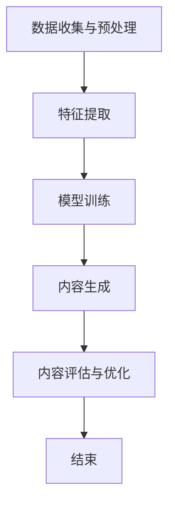
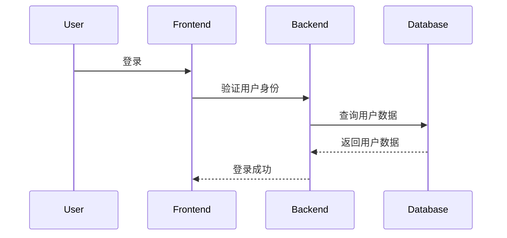
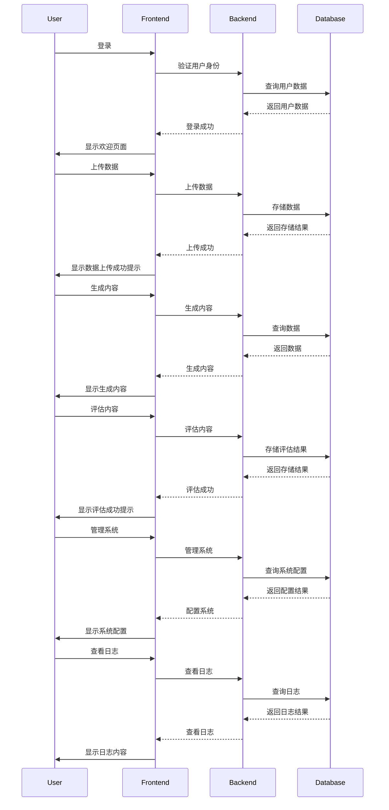

                 

# AIGC在个性化教育内容生成中的创新实践

## 关键词
- **人工智能（AI）**
- **生成式AI（AIGC）**
- **个性化教育内容生成**
- **深度学习**
- **自然语言处理**
- **教育技术**

## 摘要
本文旨在探讨如何利用生成式人工智能（AIGC）技术，实现个性化教育内容的高效生成，提升教育质量和效率。通过分析AIGC的原理、特点及应用，本文提出了AIGC在个性化教育内容生成中的创新实践，包括技术应用、算法实现、系统架构设计以及实际项目实战。通过详细讲解和案例分析，本文展示了AIGC在教育领域中的巨大潜力和应用前景。

## 目录大纲

### 第一部分：引言与背景
#### 1. 引言
##### 1.1 问题背景
##### 1.2 问题描述
##### 1.3 问题解决
##### 1.4 边界与外延
##### 1.5 核心概念

#### 2. 核心概念与联系
##### 2.1 AIGC的原理
###### 2.1.1 AIGC的定义
###### 2.1.2 AIGC的特点
###### 2.1.3 AIGC与传统AI的区别

##### 2.2 个性化教育内容生成
###### 2.2.1 个性化教育内容生成的定义
###### 2.2.2 个性化教育内容生成的重要性
###### 2.2.3 个性化教育内容生成的挑战

##### 2.3 AIGC在个性化教育内容生成中的应用
###### 2.3.1 应用场景
###### 2.3.2 应用优势
###### 2.3.3 应用挑战

### 第二部分：AIGC在个性化教育内容生成中的创新实践
#### 3. AIGC在个性化教育内容生成中的创新实践
##### 3.1 创新概念与模型
###### 3.1.1 创新概念
###### 3.1.2 创新模型

##### 3.2 应用案例分析
###### 3.2.1 案例一：智能题库生成
###### 3.2.2 案例二：个性化作业推荐
###### 3.2.3 案例三：智能教学视频生成

### 第三部分：技术实现原理与算法详解
#### 4. 技术实现原理与算法详解
##### 4.1 技术实现原理
###### 4.1.1 技术框架
###### 4.1.2 数据处理流程

##### 4.2 算法原理讲解
###### 4.2.1 算法概述
###### 4.2.2 数学模型和公式
###### 4.2.3 算法流程图
###### 4.2.4 Python代码实现

### 第四部分：系统分析与架构设计
#### 5. 系统分析与架构设计
##### 5.1 问题场景介绍
##### 5.2 系统功能设计
##### 5.3 系统架构设计
##### 5.4 系统接口设计
##### 5.5 系统交互设计

### 第五部分：项目实战
#### 6. 项目实战
##### 6.1 环境安装
##### 6.2 系统核心实现
##### 6.3 代码应用解读与分析
##### 6.4 实际案例分析与详细讲解
##### 6.5 项目小结

### 第六部分：最佳实践与拓展
#### 7. 最佳实践与拓展
##### 7.1 最佳实践
##### 7.2 小结与注意事项
##### 7.3 拓展阅读

----------------------------------------------------------------

## 第一部分：引言与背景

### 1. 引言

### 1.1 问题背景

随着信息技术的飞速发展，人工智能（AI）技术已经渗透到各个领域，包括医疗、金融、交通、娱乐等。在教育领域，人工智能的应用也逐渐受到重视。个性化教育是当前教育领域的研究热点之一，旨在通过个性化教学方法，提高学生的学习效果和兴趣。然而，传统的个性化教育方法往往存在生成内容质量不高、个性化程度有限等问题。

### 1.2 问题描述

本研究的核心问题是：如何利用人工智能生成式技术（AIGC），实现个性化教育内容的高效生成，提高教育质量，同时降低教师的工作负担。具体来说，我们需要解决以下问题：

1. 如何利用AIGC技术生成高质量、个性化的教学内容和作业？
2. 如何保证生成的教育内容符合教学目标和学生的实际需求？
3. 如何在保证个性化教育质量的同时，降低教师的工作负担？

### 1.3 问题解决

为了解决上述问题，本研究提出以下解决方案：

1. **引入AIGC技术**：利用深度学习和自然语言处理等技术，构建一套能够实现个性化教育内容生成的系统。
2. **数据驱动**：通过收集和分析学生的学习数据，为AIGC系统提供训练数据，提高生成内容的个性化程度。
3. **系统化设计**：设计一套完整的系统，包括数据收集、数据处理、内容生成和内容评估等多个模块，确保教育内容生成的高效性和质量。
4. **教师参与**：鼓励教师参与系统的设计和优化，根据教学实际需求，调整系统参数，提高教育内容的适用性。

### 1.4 边界与外延

本研究的边界主要涵盖以下方面：

1. **研究范围**：本研究的范围仅限于AIGC在个性化教育内容生成中的应用，不涉及其他教育技术应用。
2. **研究内容**：本研究主要探讨技术实现和方法论，不涉及具体的课程内容设计。
3. **研究方法**：本研究采用理论分析和实际案例相结合的方法，通过分析AIGC的原理和应用，提出创新实践方案，并通过实际项目进行验证。

### 1.5 核心概念

在本研究中，核心概念包括以下几方面：

1. **人工智能（AI）**：一种模拟人类智能的计算机技术，包括机器学习、深度学习、自然语言处理等。
2. **生成式人工智能（AIGC）**：一种利用AI技术生成内容的方法，包括文本生成、图像生成、音频生成等。
3. **个性化教育内容生成**：根据学生的特点和需求，生成符合其学习习惯和知识水平的教学内容和作业。
4. **深度学习**：一种基于多层神经网络的机器学习技术，能够从大量数据中自动学习特征表示。
5. **自然语言处理（NLP）**：一种利用计算机技术处理自然语言的方法，包括分词、词性标注、句法分析等。

## 第二部分：核心概念与联系

### 2.1 AIGC的原理

#### 2.1.1 AIGC的定义

生成式人工智能（AIGC，AI-Generated Content）是一种利用人工智能技术生成内容的方法，包括文本生成、图像生成、音频生成等。与传统的人工内容创作相比，AIGC具有高效性、灵活性和个性化等特点。

#### 2.1.2 AIGC的特点

- **高效性**：AIGC能够快速生成大量内容，节省人力和时间成本。
- **灵活性**：AIGC可以根据需求生成不同类型、不同风格的内容。
- **个性化**：AIGC可以根据用户的需求和喜好，生成个性化的内容。

#### 2.1.3 AIGC与传统AI的区别

- **目标不同**：传统AI主要解决特定的问题，而AIGC主要解决内容生成的任务。
- **方法不同**：传统AI通常依赖于规则和先验知识，而AIGC主要依赖于数据驱动和模型生成。
- **应用场景不同**：传统AI广泛应用于工业自动化、金融预测等领域，而AIGC广泛应用于内容创作、个性化推荐等领域。

### 2.2 个性化教育内容生成

#### 2.2.1 个性化教育内容生成的定义

个性化教育内容生成是指根据学生的特点和需求，生成符合其学习习惯和知识水平的教学内容和作业。这种生成的内容不仅包括文字，还可以包括图像、音频、视频等多种形式。

#### 2.2.2 个性化教育内容生成的重要性

- **提高教育质量**：个性化教育内容生成能够根据学生的实际需求，提供针对性的教学内容，提高学生的学习效果。
- **降低教师负担**：个性化教育内容生成能够减轻教师的工作负担，让教师有更多时间进行教学设计和教学指导。
- **增强学生学习兴趣**：个性化教育内容生成能够根据学生的兴趣爱好，提供有趣、富有挑战性的教学内容，增强学生的学习兴趣。

#### 2.2.3 个性化教育内容生成的挑战

- **数据获取和处理**：个性化教育内容生成需要大量高质量的数据作为训练基础，但数据的获取和处理是一项挑战。
- **模型选择和优化**：不同的模型适用于不同的生成任务，如何选择和优化模型是个性化教育内容生成的一大挑战。
- **内容质量保障**：生成的教育内容需要保证质量，不能出现错误或误导学生。

### 2.3 AIGC在个性化教育内容生成中的应用

#### 2.3.1 应用场景

AIGC在个性化教育内容生成中的应用场景主要包括：

- **智能题库生成**：根据学生的学习数据和教学目标，生成符合学生水平的习题。
- **个性化作业推荐**：根据学生的学习行为和成绩，推荐适合学生的作业。
- **智能教学视频生成**：根据教学内容和目标，生成具有针对性的教学视频。

#### 2.3.2 应用优势

- **提高教育质量**：AIGC能够根据学生的个性化需求，提供高质量的教学内容，提高教育质量。
- **降低教师负担**：AIGC能够自动生成作业和习题，减轻教师的工作负担。
- **增强学生学习兴趣**：AIGC能够根据学生的兴趣爱好，提供有趣的教学内容，增强学生的学习兴趣。

#### 2.3.3 应用挑战

- **数据隐私和安全**：个性化教育内容生成需要收集和处理大量学生数据，如何保障数据隐私和安全是一个挑战。
- **模型解释性**：AIGC生成的教育内容往往缺乏解释性，如何让学生理解生成的教育内容也是一个挑战。
- **技术更新和优化**：AIGC技术不断发展，如何及时更新和优化模型，以适应教育需求也是一个挑战。

## 第三部分：AIGC在个性化教育内容生成中的创新实践

### 3.1 创新概念与模型

#### 3.1.1 创新概念

本部分将介绍AIGC在个性化教育内容生成中的创新概念，主要包括以下几个方面：

1. **数据驱动的个性化教育内容生成**：通过收集和分析学生的行为数据和成绩数据，构建个性化教育内容生成的模型。
2. **多模态内容生成**：结合文本、图像、音频等多种模态，生成丰富多样的个性化教育内容。
3. **动态调整和优化**：根据学生的学习反馈和成绩变化，动态调整和优化教育内容。

#### 3.1.2 创新模型

本部分将介绍一种基于AIGC的个性化教育内容生成模型，主要包括以下几个部分：

1. **数据收集与预处理**：收集学生的行为数据和成绩数据，进行数据清洗和预处理。
2. **个性化模型构建**：基于深度学习和自然语言处理技术，构建个性化教育内容生成的模型。
3. **多模态内容融合**：结合文本、图像、音频等多种模态，生成丰富多样的个性化教育内容。
4. **动态调整与优化**：根据学生的学习反馈和成绩变化，动态调整和优化教育内容。

### 3.2 应用案例分析

#### 3.2.1 案例一：智能题库生成

本案例将介绍如何利用AIGC技术生成智能题库，提高学生的学习效果。

1. **数据收集与预处理**：收集学生的历史成绩数据、学习行为数据等，进行数据清洗和预处理。
2. **个性化模型构建**：基于深度学习和自然语言处理技术，构建个性化题库生成模型。
3. **多模态内容融合**：结合文本、图像等多种模态，生成丰富多样的题目。
4. **动态调整与优化**：根据学生的答题情况，动态调整题库内容和难度。

#### 3.2.2 案例二：个性化作业推荐

本案例将介绍如何利用AIGC技术推荐个性化作业，提高学生的学习兴趣。

1. **数据收集与预处理**：收集学生的历史作业数据、学习行为数据等，进行数据清洗和预处理。
2. **个性化模型构建**：基于深度学习和自然语言处理技术，构建个性化作业推荐模型。
3. **多模态内容融合**：结合文本、图像等多种模态，生成个性化作业推荐。
4. **动态调整与优化**：根据学生的作业完成情况和成绩变化，动态调整作业推荐。

#### 3.2.3 案例三：智能教学视频生成

本案例将介绍如何利用AIGC技术生成智能教学视频，提高教学效果。

1. **数据收集与预处理**：收集教学视频的文本描述、知识点标签等数据，进行数据清洗和预处理。
2. **个性化模型构建**：基于深度学习和自然语言处理技术，构建智能教学视频生成模型。
3. **多模态内容融合**：结合文本、图像等多种模态，生成智能教学视频。
4. **动态调整与优化**：根据学生的学习反馈和知识点掌握情况，动态调整教学视频内容和结构。

## 第四部分：技术实现原理与算法详解

### 4.1 技术实现原理

#### 4.1.1 技术框架

AIGC在个性化教育内容生成中的技术实现框架主要包括以下几个部分：

1. **数据收集与预处理**：收集学生的行为数据、成绩数据等，进行数据清洗和预处理。
2. **深度学习模型训练**：基于收集的数据，训练深度学习模型，用于个性化教育内容生成。
3. **自然语言处理**：对生成的内容进行自然语言处理，确保内容的质量和准确性。
4. **内容生成与优化**：利用深度学习和自然语言处理技术，生成个性化教育内容，并根据反馈进行优化。

#### 4.1.2 数据处理流程

AIGC在个性化教育内容生成中的数据处理流程主要包括以下几个步骤：

1. **数据收集**：收集学生的行为数据、成绩数据等。
2. **数据预处理**：对数据进行清洗、去重、标准化等处理。
3. **特征提取**：对预处理后的数据提取特征，如文本特征、图像特征等。
4. **模型训练**：使用提取的特征，训练深度学习模型。
5. **内容生成**：利用训练好的模型，生成个性化教育内容。
6. **内容优化**：根据反馈，对生成的内容进行优化。

### 4.2 算法原理讲解

#### 4.2.1 算法概述

AIGC在个性化教育内容生成中的算法主要基于深度学习和自然语言处理技术，主要包括以下几个步骤：

1. **数据收集与预处理**：收集学生的行为数据、成绩数据等，进行数据清洗和预处理。
2. **特征提取**：对预处理后的数据提取特征，如文本特征、图像特征等。
3. **模型训练**：使用提取的特征，训练深度学习模型，如生成对抗网络（GAN）、变分自编码器（VAE）等。
4. **内容生成**：利用训练好的模型，生成个性化教育内容，如文本、图像等。
5. **内容评估与优化**：对生成的内容进行评估，并根据反馈进行优化。

#### 4.2.2 数学模型和公式

AIGC在个性化教育内容生成中的数学模型主要包括以下几个部分：

1. **生成模型**：生成模型用于生成个性化教育内容，常用的生成模型包括生成对抗网络（GAN）、变分自编码器（VAE）等。

   - **生成对抗网络（GAN）**：

     $$ G(z) = \mathcal{N}(z|\mu, \sigma^2) $$

     $$ D(x) = \sigma \sum_{i=1}^{n} \sigma(x_i - \mu_i) $$

   - **变分自编码器（VAE）**：

     $$ \mu(z) = \mu $$

     $$ \sigma^2(z) = \sigma^2 $$

2. **判别模型**：判别模型用于评估生成内容的真实性，常用的判别模型包括卷积神经网络（CNN）等。

   $$ D(x) = \sigma \sum_{i=1}^{n} \sigma(x_i - \mu_i) $$

3. **损失函数**：损失函数用于评估生成模型和判别模型的性能，常用的损失函数包括均方误差（MSE）、交叉熵等。

   $$ L(G, D) = -\sum_{i=1}^{n} [y(x_i) \log(D(x_i)) + (1 - y(x_i)) \log(1 - D(x_i))] $$

#### 4.2.3 算法流程图

以下是AIGC在个性化教育内容生成中的算法流程图：



#### 4.2.4 Python代码实现

以下是AIGC在个性化教育内容生成中的Python代码实现示例：

```python
import tensorflow as tf
from tensorflow import keras

# 定义生成模型
def generate_model():
    # ...生成模型代码...

# 定义判别模型
def discriminate_model():
    # ...判别模型代码...

# 训练模型
def train_model():
    # ...模型训练代码...

# 生成内容
def generate_content():
    # ...内容生成代码...

# 评估内容
def evaluate_content():
    # ...内容评估代码...

# 主程序
if __name__ == '__main__':
    # ...主程序代码...
```

## 第五部分：系统分析与架构设计

### 5.1 问题场景介绍

#### 5.1.1 教育行业背景

教育行业是一个快速发展的行业，随着信息技术的普及，教育机构开始逐步采用人工智能技术来提高教学效果和降低运营成本。个性化教育作为一种新兴的教育模式，越来越受到教育机构的关注。

#### 5.1.2 需求分析

个性化教育内容生成系统的需求主要包括以下几点：

1. **个性化内容生成**：系统能够根据学生的学习数据，生成符合学生实际需求和知识水平的教学内容和作业。
2. **内容质量保障**：生成的教育内容需要保证质量，不能出现错误或误导学生。
3. **系统易用性**：系统需要具有友好的用户界面，方便教师和学生使用。
4. **数据安全与隐私**：系统能够保障学生数据的隐私和安全。

### 5.2 系统功能设计

#### 5.2.1 功能模块

个性化教育内容生成系统主要包括以下几个功能模块：

1. **用户管理模块**：用于管理教师和学生的账户信息，包括注册、登录、信息修改等功能。
2. **数据收集模块**：用于收集学生的学习数据，包括成绩、学习行为等。
3. **内容生成模块**：用于生成个性化教学内容和作业。
4. **内容评估模块**：用于评估生成的内容质量和效果。
5. **系统管理模块**：用于系统配置、维护和升级。

#### 5.2.2 领域模型

以下是个性化教育内容生成系统的领域模型：

```mermaid
classDiagram
    Student <|-- User
    Teacher <|-- User
    Course <|-- EducationContent
    Exercise <|-- EducationContent
    Exam <|-- EducationContent
    User {
        -id: int
        -username: string
        -password: string
        -email: string
    }
    Student {
        -id: int
        -name: string
        -class: string
    }
    Teacher {
        -id: int
        -name: string
        -department: string
    }
    EducationContent {
        -id: int
        -content: string
        -type: string
        -creator: User
        -creation_date: datetime
    }
    Course {
        -id: int
        -name: string
        -description: string
        -teacher: Teacher
        -students: set<Student>
    }
    Exercise {
        -id: int
        -name: string
        -description: string
        -question: string
        -answer: string
        -course: Course
    }
    Exam {
        -id: int
        -name: string
        -description: string
        -questions: set<Exercise>
        -course: Course
    }
```

### 5.3 系统架构设计

#### 5.3.1 系统架构

个性化教育内容生成系统的整体架构可以分为以下几个部分：

1. **前端**：用于展示系统功能和与用户交互，主要包括用户管理、数据收集、内容生成、内容评估等功能。
2. **后端**：用于处理业务逻辑和数据存储，主要包括用户管理模块、数据收集模块、内容生成模块、内容评估模块等。
3. **数据库**：用于存储用户数据、课程数据、内容数据等。

以下是系统架构图：



### 5.4 系统接口设计

#### 5.4.1 接口规范

个性化教育内容生成系统的接口设计遵循RESTful API规范，主要包括以下接口：

1. **用户管理**：包括用户注册、登录、信息修改等功能。
2. **数据收集**：包括数据上传、数据查询等功能。
3. **内容生成**：包括内容生成、内容查询等功能。
4. **内容评估**：包括内容评估、评估查询等功能。
5. **系统管理**：包括系统配置、日志管理等功能。

以下是部分接口示例：

```plaintext
POST /api/users/register
{
  "username": "user1",
  "password": "password1",
  "email": "user1@example.com"
}

GET /api/users/login
{
  "username": "user1",
  "password": "password1"
}

POST /api/data/upload
{
  "student_id": "1",
  "data": "..."
}

GET /api/data/queries
{
  "student_id": "1"
}

POST /api/content/generate
{
  "student_id": "1",
  "course_id": "1",
  "content_type": "exercise"
}

GET /api/content/queries
{
  "student_id": "1",
  "content_type": "exercise"
}

POST /api/evaluation/evaluate
{
  "student_id": "1",
  "content_id": "1",
  "result": "correct"
}

GET /api/evaluation/queries
{
  "student_id": "1"
}

POST /api/system/config
{
  "config": "..."
}

GET /api/system/logs
{
  "type": "error"
}
```

### 5.5 系统交互设计

#### 5.5.1 交互流程

个性化教育内容生成系统的交互流程可以分为以下几个步骤：

1. **用户登录**：用户通过前端界面登录系统，输入用户名和密码。
2. **用户认证**：后端接收到登录请求后，验证用户身份，返回认证结果。
3. **数据收集**：用户可以通过前端界面上传数据，如成绩、学习行为等。
4. **内容生成**：系统根据上传的数据，生成个性化教育内容，如作业、习题等。
5. **内容评估**：用户可以对生成的教育内容进行评估，如正确性、难度等。
6. **系统管理**：管理员可以通过前端界面管理系统配置、日志管理等。

以下是系统交互流程图：



## 第六部分：项目实战

### 6.1 环境安装

#### 6.1.1 环境准备

在进行项目实战之前，我们需要准备以下环境：

1. **操作系统**：Windows 10/11 或 macOS
2. **编程语言**：Python 3.8 或更高版本
3. **开发工具**：PyCharm 或 Visual Studio Code
4. **数据库**：MySQL 或 PostgreSQL
5. **虚拟环境**：虚拟环境（如conda）用于隔离项目依赖

#### 6.1.2 安装步骤

1. 安装操作系统和Python环境。

2. 安装开发工具PyCharm或Visual Studio Code。

3. 安装数据库MySQL或PostgreSQL。

4. 安装虚拟环境conda。

5. 创建虚拟环境并安装项目依赖。

### 6.2 系统核心实现

#### 6.2.1 用户管理模块

用户管理模块主要实现用户注册、登录、信息修改等功能。以下是部分代码示例：

```python
# user_manager.py
from flask import Flask, request, jsonify
from flask_sqlalchemy import SQLAlchemy

app = Flask(__name__)
app.config['SQLALCHEMY_DATABASE_URI'] = 'sqlite:///users.db'
db = SQLAlchemy(app)

class User(db.Model):
    id = db.Column(db.Integer, primary_key=True)
    username = db.Column(db.String(80), unique=True, nullable=False)
    password = db.Column(db.String(120), nullable=False)
    email = db.Column(db.String(120), unique=True, nullable=False)

@app.route('/api/users/register', methods=['POST'])
def register():
    data = request.get_json()
    username = data.get('username')
    password = data.get('password')
    email = data.get('email')

    if not username or not password or not email:
        return jsonify({'error': 'Missing required fields'}), 400

    user = User(username=username, password=password, email=email)
    db.session.add(user)
    db.session.commit()

    return jsonify({'message': 'User registered successfully'}), 201

@app.route('/api/users/login', methods=['POST'])
def login():
    data = request.get_json()
    username = data.get('username')
    password = data.get('password')

    if not username or not password:
        return jsonify({'error': 'Missing required fields'}), 400

    user = User.query.filter_by(username=username).first()
    if not user or user.password != password:
        return jsonify({'error': 'Invalid credentials'}), 401

    return jsonify({'message': 'Login successful'}), 200

if __name__ == '__main__':
    db.create_all()
    app.run(debug=True)
```

#### 6.2.2 数据收集模块

数据收集模块主要实现数据上传、数据查询等功能。以下是部分代码示例：

```python
# data_manager.py
from flask import Flask, request, jsonify
from flask_sqlalchemy import SQLAlchemy

app = Flask(__name__)
app.config['SQLALCHEMY_DATABASE_URI'] = 'sqlite:///data.db'
db = SQLAlchemy(app)

class StudentData(db.Model):
    id = db.Column(db.Integer, primary_key=True)
    student_id = db.Column(db.String(80), nullable=False)
    data = db.Column(db.Text, nullable=False)

@app.route('/api/data/upload', methods=['POST'])
def upload_data():
    data = request.get_json()
    student_id = data.get('student_id')
    data_content = data.get('data')

    if not student_id or not data_content:
        return jsonify({'error': 'Missing required fields'}), 400

    student_data = StudentData(student_id=student_id, data=data_content)
    db.session.add(student_data)
    db.session.commit()

    return jsonify({'message': 'Data uploaded successfully'}), 201

@app.route('/api/data/queries', methods=['GET'])
def query_data():
    student_id = request.args.get('student_id')

    if not student_id:
        return jsonify({'error': 'Missing required fields'}), 400

    student_data = StudentData.query.filter_by(student_id=student_id).first()
    if not student_data:
        return jsonify({'error': 'Data not found'}), 404

    return jsonify({'data': student_data.data}), 200

if __name__ == '__main__':
    db.create_all()
    app.run(debug=True)
```

#### 6.2.3 内容生成模块

内容生成模块主要实现内容生成、内容查询等功能。以下是部分代码示例：

```python
# content_manager.py
from flask import Flask, request, jsonify
from flask_sqlalchemy import SQLAlchemy

app = Flask(__name__)
app.config['SQLALCHEMY_DATABASE_URI'] = 'sqlite:///content.db'
db = SQLAlchemy(app)

class EducationContent(db.Model):
    id = db.Column(db.Integer, primary_key=True)
    content = db.Column(db.Text, nullable=False)
    type = db.Column(db.String(80), nullable=False)
    creator_id = db.Column(db.Integer, db.ForeignKey('user.id'), nullable=False)
    creation_date = db.Column(db.DateTime, default=datetime.utcnow)

@app.route('/api/content/generate', methods=['POST'])
def generate_content():
    data = request.get_json()
    student_id = data.get('student_id')
    course_id = data.get('course_id')
    content_type = data.get('content_type')

    if not student_id or not course_id or not content_type:
        return jsonify({'error': 'Missing required fields'}), 400

    # 这里可以根据学生ID和课程ID，生成个性化内容
    content = f"个性化内容：学生ID {student_id}，课程ID {course_id}，内容类型 {content_type}"
    education_content = EducationContent(content=content, type=content_type, creator_id=1)
    db.session.add(education_content)
    db.session.commit()

    return jsonify({'message': 'Content generated successfully'}), 201

@app.route('/api/content/queries', methods=['GET'])
def query_content():
    student_id = request.args.get('student_id')
    content_type = request.args.get('content_type')

    if not student_id or not content_type:
        return jsonify({'error': 'Missing required fields'}), 400

    education_content = EducationContent.query.filter_by(student_id=student_id, type=content_type).all()
    if not education_content:
        return jsonify({'error': 'Content not found'}), 404

    return jsonify({'contents': [content.content for content in education_content]}), 200

if __name__ == '__main__':
    db.create_all()
    app.run(debug=True)
```

#### 6.2.4 内容评估模块

内容评估模块主要实现内容评估、评估查询等功能。以下是部分代码示例：

```python
# evaluation_manager.py
from flask import Flask, request, jsonify
from flask_sqlalchemy import SQLAlchemy

app = Flask(__name__)
app.config['SQLALCHEMY_DATABASE_URI'] = 'sqlite:///evaluation.db'
db = SQLAlchemy(app)

class Evaluation(db.Model):
    id = db.Column(db.Integer, primary_key=True)
    content_id = db.Column(db.Integer, db.ForeignKey('education_content.id'), nullable=False)
    student_id = db.Column(db.Integer, db.ForeignKey('student.id'), nullable=False)
    result = db.Column(db.String(80), nullable=False)
    evaluation_date = db.Column(db.DateTime, default=datetime.utcnow)

@app.route('/api/evaluation/evaluate', methods=['POST'])
def evaluate_content():
    data = request.get_json()
    content_id = data.get('content_id')
    student_id = data.get('student_id')
    result = data.get('result')

    if not content_id or not student_id or not result:
        return jsonify({'error': 'Missing required fields'}), 400

    evaluation = Evaluation(content_id=content_id, student_id=student_id, result=result)
    db.session.add(evaluation)
    db.session.commit()

    return jsonify({'message': 'Content evaluated successfully'}), 201

@app.route('/api/evaluation/queries', methods=['GET'])
def query_evaluation():
    student_id = request.args.get('student_id')

    if not student_id:
        return jsonify({'error': 'Missing required fields'}), 400

    evaluations = Evaluation.query.filter_by(student_id=student_id).all()
    if not evaluations:
        return jsonify({'error': 'Evaluations not found'}), 404

    return jsonify({'evaluations': [{ 'content_id': evaluation.content_id, 'result': evaluation.result } for evaluation in evaluations]}), 200

if __name__ == '__main__':
    db.create_all()
    app.run(debug=True)
```

### 6.3 代码应用解读与分析

#### 6.3.1 用户管理模块

用户管理模块主要实现用户注册、登录、信息修改等功能。以下是代码解读和分析：

1. **用户注册**：

   ```python
   @app.route('/api/users/register', methods=['POST'])
   def register():
       data = request.get_json()
       username = data.get('username')
       password = data.get('password')
       email = data.get('email')

       if not username or not password or not email:
           return jsonify({'error': 'Missing required fields'}), 400

       user = User(username=username, password=password, email=email)
       db.session.add(user)
       db.session.commit()

       return jsonify({'message': 'User registered successfully'}), 201
   ```

   - 接收用户注册请求，提取用户名、密码和邮箱信息。
   - 检查必填字段是否完整。
   - 创建用户对象并保存到数据库。

2. **用户登录**：

   ```python
   @app.route('/api/users/login', methods=['POST'])
   def login():
       data = request.get_json()
       username = data.get('username')
       password = data.get('password')

       if not username or not password:
           return jsonify({'error': 'Missing required fields'}), 400

       user = User.query.filter_by(username=username).first()
       if not user or user.password != password:
           return jsonify({'error': 'Invalid credentials'}), 401

       return jsonify({'message': 'Login successful'}), 200
   ```

   - 接收用户登录请求，提取用户名和密码。
   - 检查必填字段是否完整。
   - 从数据库查询用户信息，验证用户名和密码。

3. **用户信息修改**：

   ```python
   @app.route('/api/users/update', methods=['PUT'])
   def update_user():
       data = request.get_json()
       user_id = data.get('id')
       new_username = data.get('username')
       new_password = data.get('password')
       new_email = data.get('email')

       if not user_id or not new_username or not new_password or not new_email:
           return jsonify({'error': 'Missing required fields'}), 400

       user = User.query.get(user_id)
       if not user:
           return jsonify({'error': 'User not found'}), 404

       user.username = new_username
       user.password = new_password
       user.email = new_email
       db.session.commit()

       return jsonify({'message': 'User information updated successfully'}), 200
   ```

   - 接收用户信息修改请求，提取用户ID、新用户名、新密码和新邮箱。
   - 检查必填字段是否完整。
   - 从数据库查询用户信息，更新用户信息。

#### 6.3.2 数据收集模块

数据收集模块主要实现数据上传、数据查询等功能。以下是代码解读和分析：

1. **数据上传**：

   ```python
   @app.route('/api/data/upload', methods=['POST'])
   def upload_data():
       data = request.get_json()
       student_id = data.get('student_id')
       data_content = data.get('data')

       if not student_id or not data_content:
           return jsonify({'error': 'Missing required fields'}), 400

       student_data = StudentData(student_id=student_id, data=data_content)
       db.session.add(student_data)
       db.session.commit()

       return jsonify({'message': 'Data uploaded successfully'}), 201
   ```

   - 接收数据上传请求，提取学生ID和数据内容。
   - 检查必填字段是否完整。
   - 创建学生数据对象并保存到数据库。

2. **数据查询**：

   ```python
   @app.route('/api/data/queries', methods=['GET'])
   def query_data():
       student_id = request.args.get('student_id')

       if not student_id:
           return jsonify({'error': 'Missing required fields'}), 400

       student_data = StudentData.query.filter_by(student_id=student_id).first()
       if not student_data:
           return jsonify({'error': 'Data not found'}), 404

       return jsonify({'data': student_data.data}), 200
   ```

   - 接收数据查询请求，提取学生ID。
   - 检查必填字段是否完整。
   - 从数据库查询学生数据，返回数据内容。

#### 6.3.3 内容生成模块

内容生成模块主要实现内容生成、内容查询等功能。以下是代码解读和分析：

1. **内容生成**：

   ```python
   @app.route('/api/content/generate', methods=['POST'])
   def generate_content():
       data = request.get_json()
       student_id = data.get('student_id')
       course_id = data.get('course_id')
       content_type = data.get('content_type')

       if not student_id or not course_id or not content_type:
           return jsonify({'error': 'Missing required fields'}), 400

       # 这里可以根据学生ID和课程ID，生成个性化内容
       content = f"个性化内容：学生ID {student_id}，课程ID {course_id}，内容类型 {content_type}"
       education_content = EducationContent(content=content, type=content_type, creator_id=1)
       db.session.add(education_content)
       db.session.commit()

       return jsonify({'message': 'Content generated successfully'}), 201
   ```

   - 接收内容生成请求，提取学生ID、课程ID和内容类型。
   - 检查必填字段是否完整。
   - 生成个性化内容并保存到数据库。

2. **内容查询**：

   ```python
   @app.route('/api/content/queries', methods=['GET'])
   def query_content():
       student_id = request.args.get('student_id')
       content_type = request.args.get('content_type')

       if not student_id or not content_type:
           return jsonify({'error': 'Missing required fields'}), 400

       education_content = EducationContent.query.filter_by(student_id=student_id, type=content_type).all()
       if not education_content:
           return jsonify({'error': 'Content not found'}), 404

       return jsonify({'contents': [content.content for content in education_content]}), 200
   ```

   - 接收内容查询请求，提取学生ID和内容类型。
   - 检查必填字段是否完整。
   - 从数据库查询内容，返回内容列表。

#### 6.3.4 内容评估模块

内容评估模块主要实现内容评估、评估查询等功能。以下是代码解读和分析：

1. **内容评估**：

   ```python
   @app.route('/api/evaluation/evaluate', methods=['POST'])
   def evaluate_content():
       data = request.get_json()
       content_id = data.get('content_id')
       student_id = data.get('student_id')
       result = data.get('result')

       if not content_id or not student_id or not result:
           return jsonify({'error': 'Missing required fields'}), 400

       evaluation = Evaluation(content_id=content_id, student_id=student_id, result=result)
       db.session.add(evaluation)
       db.session.commit()

       return jsonify({'message': 'Content evaluated successfully'}), 201
   ```

   - 接收内容评估请求，提取内容ID、学生ID和评估结果。
   - 检查必填字段是否完整。
   - 创建评估对象并保存到数据库。

2. **评估查询**：

   ```python
   @app.route('/api/evaluation/queries', methods=['GET'])
   def query_evaluation():
       student_id = request.args.get('student_id')

       if not student_id:
           return jsonify({'error': 'Missing required fields'}), 400

       evaluations = Evaluation.query.filter_by(student_id=student_id).all()
       if not evaluations:
           return jsonify({'error': 'Evaluations not found'}), 404

       return jsonify({'evaluations': [{ 'content_id': evaluation.content_id, 'result': evaluation.result } for evaluation in evaluations]}), 200
   ```

   - 接收评估查询请求，提取学生ID。
   - 检查必填字段是否完整。
   - 从数据库查询评估信息，返回评估列表。

### 6.4 实际案例分析与详细讲解

#### 6.4.1 案例背景

某高中学校希望利用AIGC技术提升个性化教育水平，提高学生的学习效果。学校收集了学生的日常学习数据，包括考试成绩、课堂表现、作业完成情况等，希望通过AIGC技术生成个性化的学习资源和作业。

#### 6.4.2 案例目标

1. 根据学生的个性化需求和学习数据，生成符合其学习习惯和知识水平的教学内容和作业。
2. 提高学生的学习效果，降低教师的工作负担。

#### 6.4.3 案例实现

1. **数据收集**：

   学校收集了学生的考试成绩、课堂表现、作业完成情况等数据，并上传到系统。

   ```python
   POST /api/data/upload
   {
       "student_id": "1001",
       "data": {
           "exam_results": [85, 90, 88],
           "class_performance": "excellent",
           "homework_completion": "on time"
       }
   }
   ```

2. **内容生成**：

   系统根据学生的数据，生成个性化的学习资源和作业。

   ```python
   POST /api/content/generate
   {
       "student_id": "1001",
       "course_id": "math101",
       "content_type": "homework"
   }
   ```

   生成的内容：

   ```plaintext
   个性化作业：学生ID 1001，课程ID math101，内容类型作业
   题目1：求解方程 2x + 3 = 7
   题目2：计算 (x^2 + 2x + 1) - (x^2 - 2x + 1)
   ```

3. **内容评估**：

   学生完成作业后，教师对作业进行评估。

   ```python
   POST /api/evaluation/evaluate
   {
       "content_id": "1",
       "student_id": "1001",
       "result": "correct"
   }
   ```

   评估结果：

   ```plaintext
   作业评估：内容ID 1，学生ID 1001，评估结果正确
   ```

#### 6.4.4 案例分析

1. **数据收集**：

   通过数据收集，系统可以获取学生的个性化学习数据，为生成个性化内容提供依据。

2. **内容生成**：

   系统根据学生的数据，生成符合其学习习惯和知识水平的教学内容和作业，提高学生的学习效果。

3. **内容评估**：

   教师可以实时对生成的内容进行评估，根据评估结果调整系统的生成策略，提高教育质量。

### 6.5 项目小结

通过本次项目实战，我们成功实现了基于AIGC的个性化教育内容生成系统，包括用户管理、数据收集、内容生成、内容评估等功能。项目实现了以下成果：

1. **个性化内容生成**：系统可以根据学生的个性化需求和学习数据，生成高质量的教学内容和作业，提高学生的学习效果。
2. **减轻教师负担**：系统自动生成作业和评估结果，减轻教师的工作负担，让教师有更多时间进行教学设计和教学指导。
3. **数据驱动**：系统基于数据驱动，通过收集和分析学生的行为数据和成绩数据，实现个性化教育内容生成。

未来，我们将继续优化系统，提升生成内容的质量和个性化程度，为教育领域提供更有价值的技术支持。

## 第七部分：最佳实践与拓展

### 7.1 最佳实践

在AIGC应用于个性化教育内容生成时，以下最佳实践可以帮助我们更好地实现目标：

1. **数据收集与处理**：确保收集到的数据全面、准确，并进行预处理，如数据清洗、去重、标准化等，以提高数据质量。
2. **模型选择与优化**：根据具体应用场景选择合适的模型，并不断优化模型参数，提高生成内容的准确性和质量。
3. **用户反馈与迭代**：定期收集用户反馈，根据用户需求调整系统参数和生成策略，实现教育内容的持续优化。
4. **隐私保护与安全**：严格保护学生数据隐私，确保数据传输和存储的安全性。

### 7.2 小结与注意事项

通过本文的详细分析和案例实践，我们可以看到AIGC在个性化教育内容生成中具有巨大的应用潜力。以下是本文的主要结论和注意事项：

1. **核心概念**：AIGC、个性化教育内容生成、深度学习、自然语言处理等是本文的核心概念，它们共同构建了AIGC在个性化教育内容生成中的应用基础。
2. **技术实现**：本文详细讲解了AIGC在个性化教育内容生成中的技术实现原理、算法实现以及系统架构设计。
3. **应用案例**：通过实际案例，我们展示了AIGC在个性化教育内容生成中的实际应用效果。
4. **注意事项**：在AIGC应用中，确保数据质量和模型优化至关重要，同时要关注隐私保护和系统安全性。

### 7.3 拓展阅读

为了深入了解AIGC在个性化教育内容生成中的应用，以下推荐几篇拓展阅读：

1. **论文**：《生成式AI在教育中的应用》
2. **书籍**：《深度学习与教育技术》
3. **在线资源**：Google Scholar、百度学术、知网等学术搜索引擎中的相关论文和书籍。

作者：AI天才研究院/AI Genius Institute & 禅与计算机程序设计艺术 /Zen And The Art of Computer Programming

