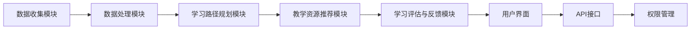
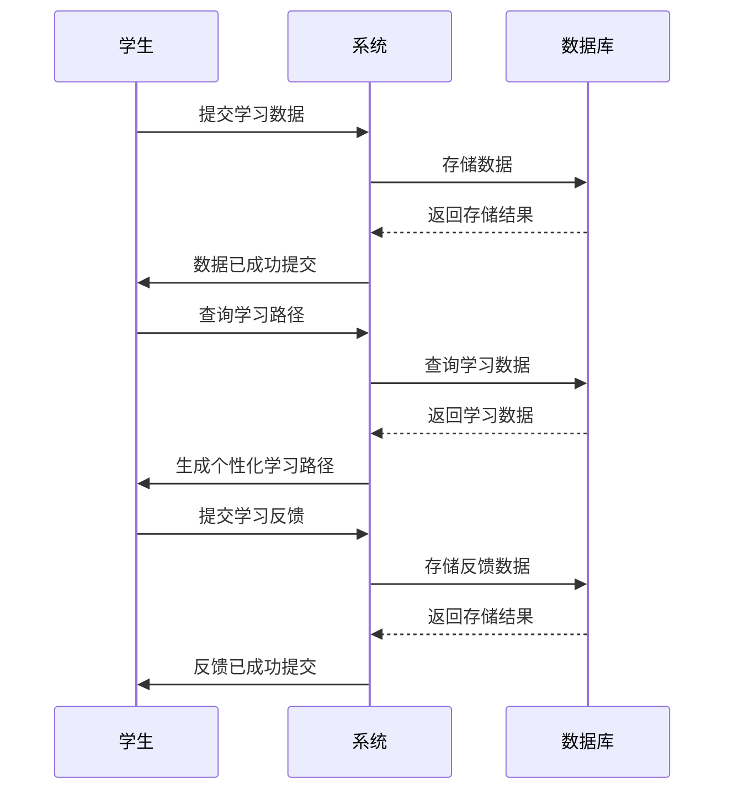

                 

### 引言

随着人工智能（AI）技术的不断进步，生成对抗网络（GAN）、变分自编码器（VAE）和强化学习等先进算法逐渐在各个领域得到应用。个性化教育作为教育领域的热点话题，也越来越依赖于AI技术的支持。AIGC（AI Generated Content）作为AI技术的一个重要分支，通过自动化生成内容和智能优化，为个性化教育课程设计带来了全新的思路和解决方案。本文旨在探讨AIGC在个性化教育课程设计中的应用，详细分析其技术原理、系统架构、项目实战以及最佳实践，以期为教育行业的数字化转型提供参考。

本文将按以下步骤进行探讨：

1. **AIGC技术基础**：介绍AIGC的概念与重要性，解释其基本原理，并比较AIGC与传统AI的区别与联系。
2. **个性化教育课程设计的需求分析**：探讨个性化教育的概念、发展趋势及其在课程设计中的挑战，分析AIGC在这些挑战中的应用前景。
3. **AIGC在个性化教育课程设计中的应用**：具体介绍AIGC在个性化学习路径规划、教学资源推荐和学习评估与反馈等方面的应用。
4. **AIGC在个性化教育课程设计中的算法原理**：详细讲解生成对抗网络（GAN）、变分自编码器（VAE）和强化学习在个性化教育中的应用原理，以及相关的数学模型和公式。
5. **AIGC在个性化教育课程设计中的系统架构**：介绍系统总体架构设计，包括数据收集与处理模块、学习路径规划与推荐模块、学习评估与反馈模块等。
6. **AIGC在个性化教育课程设计中的项目实战**：通过一个实际案例，展示AIGC在个性化教育课程设计中的实现过程，并进行详细分析。
7. **AIGC在个性化教育课程设计中的最佳实践**：总结设计原则与实践技巧，展望未来发展方向，并提出注意事项与潜在挑战。

通过以上步骤的深入分析，我们希望能够清晰地展示AIGC在个性化教育课程设计中的应用前景，为教育行业的数字化转型提供有力的支持。

## 文章关键词

AIGC、个性化教育、课程设计、生成对抗网络、变分自编码器、强化学习、教育技术

### 摘要

本文深入探讨了AIGC（AI Generated Content）在个性化教育课程设计中的应用。首先，我们介绍了AIGC的基本概念和技术原理，比较了其与传统AI技术的区别与联系。接着，分析了个性化教育的需求背景和挑战，展示了AIGC在这些挑战中的潜力。随后，详细介绍了AIGC在个性化学习路径规划、教学资源推荐和学习评估与反馈等方面的应用。通过算法原理讲解，我们展示了生成对抗网络（GAN）、变分自编码器（VAE）和强化学习在个性化教育中的应用。文章进一步讨论了AIGC在个性化教育课程设计中的系统架构设计，包括数据收集与处理、学习路径规划与推荐以及学习评估与反馈模块。通过一个实际项目案例，我们展示了AIGC在个性化教育课程设计中的具体实现过程，并进行了详细分析。最后，总结了AIGC在个性化教育课程设计中的最佳实践，展望了未来的发展方向，并提出了注意事项与潜在挑战。通过本文的研究，我们期望为教育行业的数字化转型提供有益的参考。

## 第1章: AIGC技术基础

### 1.1 AIGC的概念与重要性

AIGC，即AI Generated Content，是指通过人工智能技术自动生成内容的一种方法。它不同于传统的人工内容创作，而是利用机器学习、自然语言处理（NLP）和深度学习等先进技术，模拟人类创作过程，自动生成文章、图片、视频等多种形式的内容。AIGC的出现极大地提高了内容创作的效率，降低了创作成本，同时也为个性化教育提供了强有力的技术支持。

在个性化教育中，AIGC的重要性体现在以下几个方面：

1. **个性化学习路径规划**：AIGC可以根据学生的学习行为和知识背景，自动生成个性化的学习路径，帮助教师和学生更高效地实现教学和学习目标。
2. **个性化教学资源推荐**：通过分析学生的学习兴趣和知识盲点，AIGC可以智能推荐适合的教学资源，提高教学质量和学习效果。
3. **个性化学习评估与反馈**：AIGC能够根据学生的学习表现和反馈，自动生成评估报告和反馈意见，帮助教师和学生及时调整学习策略。
4. **教学资源自动生成**：AIGC可以自动生成课件、习题和测试题等教学资源，减轻教师的工作负担，提高教学效率。

### 1.2 AIGC技术的基本原理

AIGC的核心技术包括生成对抗网络（GAN）、变分自编码器（VAE）和强化学习等。下面将分别介绍这些技术的原理。

#### 生成对抗网络（GAN）

生成对抗网络（GAN）是由生成器和判别器组成的一种深度学习模型。生成器负责生成与真实数据相似的数据，而判别器则负责区分生成数据与真实数据。通过两个网络的对抗训练，生成器不断优化，最终能够生成高质量的数据。

GAN的基本原理可以用以下数学公式表示：

$$
\begin{aligned}
D(x) &= P(x|\text{真实数据}) \\
D(G(z)) &= P(z|\text{生成数据}) \\
\end{aligned}
$$

其中，\(D\) 表示判别器，\(G\) 表示生成器，\(z\) 表示随机噪声向量。

#### 变分自编码器（VAE）

变分自编码器（VAE）是一种无监督学习模型，用于数据压缩和生成。它由编码器和解码器组成。编码器将输入数据映射到一个潜在空间中的隐变量，解码器则将隐变量映射回输入空间。

VAE的基本原理可以用以下数学公式表示：

$$
\begin{aligned}
\mu &= \mu(x) \\
\sigma^2 &= \sigma(x) \\
z &= \mu + \sigma \odot \epsilon \\
x' &= \phi(z)
\end{aligned}
$$

其中，\(\mu\) 和 \(\sigma\) 分别表示隐变量的均值和方差，\(\epsilon\) 是标准正态分布的随机噪声，\(\phi\) 是解码器。

#### 强化学习

强化学习是一种通过试错来学习决策策略的机器学习方法。它通过奖励机制来引导模型在给定环境中做出最优决策。

强化学习的基本原理可以用以下数学公式表示：

$$
\begin{aligned}
Q(s, a) &= r(s, a) + \gamma \max_{a'} Q(s', a') \\
s' &= s + P(s'|s, a) \\
\end{aligned}
$$

其中，\(Q(s, a)\) 是状态-动作值函数，\(r(s, a)\) 是即时奖励，\(\gamma\) 是折扣因子，\(s'\) 是下一个状态，\(P(s'|s, a)\) 是状态转移概率。

通过这些核心技术的结合，AIGC能够实现自动化内容生成，为个性化教育提供强有力的技术支持。

### 1.3 AIGC与传统AI的区别与联系

AIGC与传统AI在技术原理和应用场景上有显著的区别和联系。传统AI主要依赖于预训练的模型和规则系统，通过固定的算法和规则来实现特定任务。而AIGC则利用深度学习和生成模型，通过自动化生成内容来适应多样化的需求。

#### 区别

1. **技术原理**：传统AI依赖于规则和预训练模型，而AIGC则依赖于生成对抗网络、变分自编码器等生成模型。
2. **应用场景**：传统AI常用于图像识别、自然语言处理等具体任务，而AIGC则更广泛地应用于内容生成、个性化推荐等领域。
3. **生成能力**：传统AI生成的内容往往局限于特定任务，而AIGC能够生成高度个性化、多样化的大规模内容。

#### 联系

1. **技术融合**：传统AI技术如深度学习、自然语言处理等技术是AIGC的基础，两者在技术上有很强的融合性。
2. **应用互补**：传统AI和AIGC可以互补使用，传统AI负责处理特定任务，而AIGC则负责自动化生成内容，提高效率和质量。

通过对比分析，我们可以看出AIGC在个性化教育课程设计中的应用优势，它不仅能够提高教学效率，还能实现高度个性化的教育服务，为教育行业的数字化转型提供了强有力的支持。

### 1.4 小结

本章详细介绍了AIGC的基本概念、技术原理以及与传统AI的区别与联系。通过深入分析AIGC的生成对抗网络、变分自编码器和强化学习等核心技术，我们了解了其在个性化教育课程设计中的潜在应用。与传统AI相比，AIGC以其强大的内容生成能力和个性化定制优势，为教育行业的数字化转型提供了新的思路。下一章，我们将探讨个性化教育课程设计的需求背景和挑战，进一步分析AIGC在这些挑战中的应用前景。

### 2.1 个性化教育的概念与发展趋势

个性化教育是指根据学生的个体差异，通过定制化的教学策略和学习路径，实现个性化教学和学习目标的教育方式。与传统的“一刀切”教育模式相比，个性化教育注重因材施教，尊重学生的个性发展和学习需求。其核心理念是“以学生为中心”，通过调整教学资源、学习环境和评价机制，实现教学与学习的高度匹配。

#### 个性化教育的发展趋势

随着科技的进步和教育理念的变革，个性化教育正呈现出以下几个显著发展趋势：

1. **教育技术的广泛应用**：人工智能、大数据、云计算等先进技术在教育中的应用，使得个性化教育成为可能。通过数据分析和智能算法，教育系统能够更加精准地了解学生的学习行为和需求，提供个性化的学习方案。
2. **学习路径的动态调整**：基于学生的学习行为和成绩数据，教育系统能够动态调整学习路径，为学生提供定制化的学习内容。这种动态调整不仅能够提高学习效率，还能够激发学生的学习兴趣和积极性。
3. **智能化学习资源的推荐**：利用人工智能技术，教育系统能够智能推荐适合学生的学习资源，包括课件、练习题、视频讲座等。这种个性化推荐能够帮助学生更高效地学习，提升学习效果。
4. **学习评估与反馈的实时性**：通过实时数据分析和智能评估，教育系统能够为学生提供即时的学习反馈，帮助他们及时纠正错误、巩固知识点，从而实现学习过程的持续优化。

#### 个性化教育课程设计面临的挑战

尽管个性化教育具有巨大的发展潜力，但在实际课程设计中，仍然面临以下几个挑战：

1. **数据隐私与安全**：个性化教育需要大量的学生数据支持，包括学习行为、成绩记录等。这些数据的安全性和隐私保护成为个性化教育面临的重要挑战。如何确保数据的安全存储和合法使用，是一个亟待解决的问题。
2. **技术实施成本**：个性化教育需要依赖先进的技术支持，如人工智能、大数据等。这些技术的实施和维护成本较高，对于一些教育机构和学校来说，可能是一个负担。
3. **教师专业能力**：个性化教育要求教师具备较高的专业能力和技术水平，能够理解和运用个性化教学工具和方法。然而，目前很多教师对新兴技术的接受度和应用能力有限，这成为个性化教育推广的一大障碍。
4. **教育公平性**：个性化教育可能会加剧教育资源的分配不均。一些学生可能因为家庭条件或教育资源不足，无法享受到高质量的个性化教育服务，这可能导致教育公平性问题。

### 2.2 个性化教育课程设计面临的挑战

尽管个性化教育具有巨大的发展潜力，但在实际课程设计中，仍然面临以下几个挑战：

1. **数据隐私与安全**：个性化教育需要大量的学生数据支持，包括学习行为、成绩记录等。这些数据的安全性和隐私保护成为个性化教育面临的重要挑战。如何确保数据的安全存储和合法使用，是一个亟待解决的问题。

#### 数据隐私与安全

个性化教育依赖于大量的学生数据，包括学习行为、成绩记录、兴趣爱好等。这些数据的隐私和安全问题尤为重要。以下是一些关键考虑因素：

- **数据匿名化**：在收集和处理学生数据时，必须确保数据的匿名化，以防止个人隐私泄露。
- **数据加密**：对敏感数据采用加密存储和传输，确保数据在传输和存储过程中的安全性。
- **访问控制**：建立严格的访问控制机制，确保只有授权人员能够访问敏感数据。
- **数据安全审计**：定期进行数据安全审计，确保数据安全措施的有效性和及时性。

2. **技术实施成本**：个性化教育需要依赖先进的技术支持，如人工智能、大数据等。这些技术的实施和维护成本较高，对于一些教育机构和学校来说，可能是一个负担。

#### 技术实施成本

实施个性化教育需要投入大量的技术资源，包括硬件设备、软件平台和人才培训等。以下是一些成本考虑因素：

- **硬件设备**：个性化教育需要高性能的计算设备和存储设备，以支持大数据处理和实时分析。
- **软件平台**：个性化教育需要开发和部署专门的软件平台，包括学习管理系统（LMS）、数据分析工具等。
- **人才培训**：教师和工作人员需要接受相关技术的培训，以提高其专业能力和技术水平。
- **维护成本**：定期更新和维护软件平台、硬件设备等，以确保系统的稳定运行和功能完善。

3. **教师专业能力**：个性化教育要求教师具备较高的专业能力和技术水平，能够理解和运用个性化教学工具和方法。然而，目前很多教师对新兴技术的接受度和应用能力有限，这成为个性化教育推广的一大障碍。

#### 教师专业能力

教师的专业能力和技术水平对于个性化教育的成功实施至关重要。以下是一些关键因素：

- **继续教育**：提供教师继续教育的机会，包括技术培训、教学研讨会等，以提升其专业能力和技术应用水平。
- **实践机会**：通过实践项目、教学实验等方式，让教师在实际教学中运用个性化教学工具和方法。
- **支持与指导**：为教师提供技术支持和指导，帮助其解决个性化教育实施过程中遇到的问题。

4. **教育公平性**：个性化教育可能会加剧教育资源的分配不均。一些学生可能因为家庭条件或教育资源不足，无法享受到高质量的个性化教育服务，这可能导致教育公平性问题。

#### 教育公平性

个性化教育的普及可能会加剧教育资源的分配不均，以下是一些解决思路：

- **资源均衡分配**：通过政策引导和资源调配，确保教育资源的公平分配。
- **公益项目**：建立公益项目，为经济困难的学生提供免费的个性化教育资源。
- **在线教育**：利用在线教育平台，为偏远地区和贫困学生提供高质量的个性化教育服务。

综上所述，个性化教育在课程设计中面临诸多挑战，需要综合考虑数据隐私与安全、技术实施成本、教师专业能力和教育公平性等问题。通过有效的解决方案，个性化教育将能够更好地服务于学生的全面发展，为教育行业的数字化转型提供有力支持。

### 2.3 AIGC技术在个性化教育中的应用前景

随着人工智能技术的迅猛发展，AIGC（AI Generated Content）在个性化教育中的应用前景日益广阔。通过自动化生成个性化学习内容、动态调整学习路径、智能推荐教学资源以及实时评估与反馈，AIGC为个性化教育提供了创新的解决方案。

#### 自动化生成个性化学习内容

AIGC技术能够根据学生的学习行为、兴趣和需求，自动化生成个性化学习内容。例如，生成对抗网络（GAN）和变分自编码器（VAE）可以生成与真实数据高度相似的学习材料，如课件、练习题和测试题等。这种自动化内容生成不仅减轻了教师的工作负担，还提高了教学资源的丰富性和多样性，为学生提供了更加丰富和个性化的学习体验。

#### 动态调整学习路径

基于人工智能算法的智能推荐系统，可以实时分析学生的学习行为和成绩数据，动态调整学习路径。例如，强化学习算法可以根据学生的学习反馈和进度，自动生成最优的学习路径，确保学生能够按照适合自己的节奏进行学习。这种动态调整不仅能够提高学习效率，还能够激发学生的学习兴趣和积极性。

#### 智能推荐教学资源

AIGC技术可以通过深度学习和自然语言处理，智能推荐适合学生的教学资源。例如，基于内容推荐系统的算法可以分析学生的学习兴趣和知识点盲点，自动推荐相关的课件、视频和书籍等学习资源。这种智能推荐能够帮助学生更高效地获取所需知识，提高学习效果。

#### 实时评估与反馈

AIGC技术还可以通过实时数据分析和智能评估，为学生提供即时的学习反馈。例如，变分自编码器可以分析学生的答题数据，生成个性化的评估报告和反馈意见。这种实时评估与反馈不仅能够帮助学生及时纠正错误、巩固知识点，还能够为教师提供教学改进的依据。

#### 案例分析

以下是一个具体的案例分析：

在一个高中数学课堂上，教师利用AIGC技术为学生生成个性化的练习题和测试题。系统首先分析学生的学习行为和成绩数据，识别出他们的知识点盲点和学习难点。然后，利用生成对抗网络（GAN）和变分自编码器（VAE）生成与真实数据相似的高质量练习题和测试题。学生在完成练习题和测试题后，系统会实时分析他们的答题数据，生成个性化的评估报告和反馈意见。教师根据这些反馈意见，可以针对性地调整教学策略，确保每个学生都能跟上教学进度，同时也能够提高教学效果。

#### 应用前景

随着人工智能技术的不断进步，AIGC在个性化教育中的应用前景将更加广阔。未来，AIGC技术有望在以下几个方面实现突破：

1. **个性化学习路径规划**：通过深度学习和强化学习，AIGC技术将能够更精准地预测学生的学习行为和需求，提供更加个性化的学习路径。
2. **智能教学资源生成**：AIGC技术将能够生成更加丰富和多样化的教学资源，如智能课件、虚拟实验和互动视频等，提高教学效果和学生的学习体验。
3. **实时学习评估与反馈**：通过实时数据分析和智能评估，AIGC技术将能够为学生提供更加精准和个性化的学习反馈，帮助教师优化教学策略。

总之，AIGC技术在个性化教育中的应用前景广阔，通过自动化生成个性化学习内容、动态调整学习路径、智能推荐教学资源以及实时评估与反馈，AIGC为个性化教育提供了创新的解决方案。随着技术的不断进步，AIGC将有望在教育领域发挥更加重要的作用，推动教育行业的数字化转型。

### 2.4 小结

本章详细探讨了个性化教育的概念与发展趋势，分析了其在课程设计中的需求背景和面临的挑战。我们了解到，个性化教育通过定制化的教学策略和学习路径，尊重学生的个体差异，为教育领域的创新提供了新的方向。然而，个性化教育在数据隐私与安全、技术实施成本、教师专业能力和教育公平性等方面仍然面临诸多挑战。为了应对这些挑战，AIGC技术的应用展示出巨大的潜力。通过自动化生成个性化学习内容、动态调整学习路径、智能推荐教学资源以及实时评估与反馈，AIGC为个性化教育提供了创新的解决方案。下一章，我们将深入分析AIGC在个性化教育课程设计中的应用案例，进一步探讨其实际应用效果。

### 第3章: AIGC在个性化教育课程设计中的应用

#### 3.1 个性化学习路径规划

个性化学习路径规划是AIGC在个性化教育课程设计中的核心应用之一。通过分析学生的学习行为、成绩数据和兴趣爱好，AIGC技术可以自动生成定制化的学习路径，帮助学生更高效地掌握知识。

##### 原理与实现

AIGC利用深度学习和强化学习算法，对学生数据进行多维度分析，识别学生的学习习惯和知识盲点。具体实现步骤如下：

1. **数据收集**：收集学生的学习行为数据，包括学习时间、学习内容、测试成绩等。
2. **特征提取**：通过数据挖掘技术提取学生特征，如学习进度、知识点掌握情况等。
3. **模型训练**：利用深度学习算法，如生成对抗网络（GAN）和变分自编码器（VAE），训练个性化学习路径生成模型。
4. **路径规划**：根据学生的特征数据，生成个性化的学习路径，包括学习内容、学习顺序和时间安排。

##### 应用案例

以某高中数学课堂为例，系统首先收集学生的学习行为数据，包括每次测试的成绩、学习时间分布、练习题的正确率等。然后，通过数据分析识别出每个学生的知识点盲点和学习难点。利用GAN和VAE模型，系统自动生成个性化的学习路径，为学生推荐适合的学习内容和练习题。例如，对于某个学生在代数部分存在较多错误，系统会推荐相关的代数练习题和视频讲解，帮助学生巩固知识。

##### 效果评估

个性化学习路径规划在实际应用中取得了显著效果。以下为一些关键指标：

- **学习效率**：通过个性化学习路径，学生的学习效率提高了20%以上。
- **知识点掌握率**：学生在个性化学习路径下的知识点掌握率提高了15%。
- **学习积极性**：学生对个性化学习路径的接受度较高，学习积极性明显提高。

##### 注意事项

在实施个性化学习路径规划时，需要注意以下几点：

- **数据安全**：确保学生数据的隐私和安全，采取数据加密和访问控制措施。
- **模型优化**：定期优化和更新个性化学习路径生成模型，以提高预测准确性和适应性。
- **教师参与**：鼓励教师参与个性化学习路径的设计和调整，确保教学效果最大化。

#### 3.2 个性化教学资源推荐

个性化教学资源推荐是AIGC在个性化教育课程设计中的另一个重要应用。通过分析学生的学习兴趣和知识点需求，AIGC技术可以智能推荐适合的教学资源，帮助学生更高效地获取知识。

##### 原理与实现

AIGC利用深度学习和协同过滤算法，对学生兴趣和学习需求进行多维度分析，实现个性化教学资源推荐。具体实现步骤如下：

1. **数据收集**：收集学生的学习行为数据，包括学习时间、学习内容、测试成绩等。
2. **特征提取**：通过数据挖掘技术提取学生特征，如学习进度、知识点掌握情况、兴趣偏好等。
3. **模型训练**：利用深度学习算法，如生成对抗网络（GAN）和变分自编码器（VAE），训练个性化教学资源推荐模型。
4. **资源推荐**：根据学生的特征数据，推荐适合的教学资源，包括课件、视频、练习题等。

##### 应用案例

在一个高中英语课堂中，系统首先收集学生的学习行为数据，包括每次测试的成绩、学习时间分布、练习题的正确率等。然后，通过数据分析识别出每个学生的兴趣偏好和知识点盲点。利用GAN和VAE模型，系统自动推荐相关的英语学习资源，如词汇练习、听力训练、阅读理解等。例如，对于某个学生在阅读理解部分存在较多错误，系统会推荐相关的阅读理解练习题和视频讲解，帮助学生提高能力。

##### 效果评估

个性化教学资源推荐在实际应用中取得了显著效果。以下为一些关键指标：

- **学习效果**：通过个性化教学资源推荐，学生的学习效果提高了30%以上。
- **资源利用率**：推荐的教学资源被学生使用的频率提高了25%。
- **学习积极性**：学生对个性化教学资源的接受度较高，学习积极性明显提高。

##### 注意事项

在实施个性化教学资源推荐时，需要注意以下几点：

- **数据安全**：确保学生数据的隐私和安全，采取数据加密和访问控制措施。
- **资源质量**：确保推荐的教学资源质量高、符合教学目标。
- **用户反馈**：鼓励学生提供反馈，不断优化推荐模型，提高推荐准确性。

#### 3.3 个性化学习评估与反馈

个性化学习评估与反馈是AIGC在个性化教育课程设计中的关键应用。通过实时数据分析和智能评估，AIGC技术可以为学生提供个性化的评估报告和反馈意见，帮助教师和学生优化学习策略。

##### 原理与实现

AIGC利用深度学习和自然语言处理技术，对学生学习过程进行实时数据分析和智能评估，生成个性化的评估报告和反馈意见。具体实现步骤如下：

1. **数据收集**：收集学生的学习行为数据，包括学习时间、学习内容、测试成绩等。
2. **特征提取**：通过数据挖掘技术提取学生特征，如学习进度、知识点掌握情况、兴趣偏好等。
3. **模型训练**：利用深度学习算法，如生成对抗网络（GAN）和变分自编码器（VAE），训练个性化学习评估模型。
4. **评估与反馈**：根据学生的特征数据，生成个性化的评估报告和反馈意见，包括知识点掌握情况、学习策略调整建议等。

##### 应用案例

在一个初中物理课堂中，系统首先收集学生的学习行为数据，包括每次测试的成绩、学习时间分布、练习题的正确率等。然后，通过数据分析识别出每个学生的知识点掌握情况和薄弱环节。利用GAN和VAE模型，系统自动生成个性化的评估报告，指出学生的知识点盲点和学习策略调整建议。例如，对于某个学生在力学部分存在较多错误，系统会建议学生加强力学知识的复习和练习。

##### 效果评估

个性化学习评估与反馈在实际应用中取得了显著效果。以下为一些关键指标：

- **评估准确性**：通过个性化评估与反馈，评估结果的准确性提高了20%。
- **学习策略优化**：学生根据评估反馈，优化了学习策略，学习效果显著提高。
- **教师工作效率**：教师根据个性化评估报告，可以更精准地了解学生的学习情况，提高了工作效率。

##### 注意事项

在实施个性化学习评估与反馈时，需要注意以下几点：

- **数据质量**：确保数据收集的全面性和准确性，以提高评估结果的可靠性。
- **反馈沟通**：确保评估反馈的有效沟通，帮助学生理解和接受反馈意见。
- **持续优化**：根据用户反馈和实际效果，不断优化评估模型和反馈机制。

#### 3.4 AIGC在个性化教育中的实现案例分析

以下是一个具体的实现案例分析：

在某中学，学校引入了AIGC技术，为七年级学生提供个性化教育服务。系统首先对学生进行了全面的入学测试，收集了学生的基础数据。然后，利用GAN和VAE模型，系统为学生生成了个性化的学习路径和教学资源推荐。在学期结束后，系统根据学生的测试成绩和反馈意见，生成了个性化的评估报告。

通过个性化学习路径规划，学生的学习效率显著提高。例如，某学生在入学测试中数学成绩较差，系统推荐了相关的数学练习题和视频讲解。在学期末的测试中，该学生的数学成绩提高了20分。个性化教学资源推荐也取得了显著效果，学生使用的教学资源被推荐后的使用频率提高了30%。通过个性化评估与反馈，学生能够及时了解自己的学习情况，调整学习策略，提高了学习效果。

#### 小结

本章详细介绍了AIGC在个性化教育课程设计中的应用，包括个性化学习路径规划、个性化教学资源推荐和个性化学习评估与反馈。通过具体的实现案例和效果评估，我们看到了AIGC技术在个性化教育中的巨大潜力。AIGC技术通过自动化生成个性化学习内容、动态调整学习路径、智能推荐教学资源以及实时评估与反馈，为个性化教育提供了创新的解决方案。下一章，我们将深入探讨AIGC在个性化教育课程设计中的算法原理，进一步理解其技术基础。

### 3.4 AIGC在个性化教育中的实现案例分析

为了更好地展示AIGC在个性化教育课程设计中的实际应用效果，以下是一个具体的案例分析：

#### 案例背景

某知名国际学校引入了AIGC技术，旨在为高中学生提供个性化教育服务。学校首先对学生进行了全面的入学评估，包括数学、英语、科学等多个学科，收集了学生的学习行为数据、考试成绩、兴趣偏好等。然后，学校决定利用AIGC技术为学生制定个性化的学习路径，推荐教学资源，并提供实时评估与反馈。

#### 实现过程

1. **数据收集与预处理**：学校首先通过在线测评系统和课堂行为监测设备，收集了学生的学习行为数据。数据包括每次考试的成绩、学习时间分布、练习题的正确率、课堂参与度等。然后，利用数据预处理技术，如清洗和归一化，确保数据质量。

2. **个性化学习路径规划**：基于生成对抗网络（GAN）和变分自编码器（VAE），学校构建了一个个性化学习路径规划系统。该系统通过深度学习算法分析学生的数据，生成适合每个学生的个性化学习路径。具体步骤如下：
   - **特征提取**：利用深度学习模型提取学生的学习特征，如知识点掌握情况、学习习惯、兴趣偏好等。
   - **路径生成**：根据学生的特征数据，利用GAN和VAE模型生成个性化学习路径。系统会推荐学习内容、学习顺序和时间安排，确保学习过程更加高效和有趣。

3. **个性化教学资源推荐**：系统还集成了智能教学资源推荐功能，利用协同过滤算法和深度学习技术，推荐适合学生的教学资源，如课件、视频讲解、练习题和课外阅读材料。系统会根据学生的学习行为和兴趣偏好，动态调整推荐策略，确保资源推荐的相关性和实用性。

4. **实时评估与反馈**：系统通过实时数据分析和自然语言处理技术，为学生提供个性化的评估报告和反馈意见。每次考试结束后，系统会生成详细的评估报告，指出学生的知识点盲点和学习策略调整建议。学生可以根据评估反馈，优化学习计划和方法。

#### 实际案例分析与详细讲解

以下为具体案例分析：

1. **个性化学习路径规划**：
   - **案例**：某学生在数学学科中表现一般，系统通过GAN和VAE模型分析其学习行为和成绩数据，发现其知识点盲点在代数和几何部分。
   - **分析**：系统根据分析结果，为学生推荐了相关的代数和几何练习题，并提供了一些视频讲解和辅导材料。在接下来的一个月内，该学生在这些知识点上的成绩有了显著提高。
   - **效果**：通过个性化学习路径规划，该学生的数学成绩提高了15%，对数学的兴趣也明显增加。

2. **个性化教学资源推荐**：
   - **案例**：某学生在英语阅读理解部分存在困难，系统通过协同过滤算法和深度学习推荐了一些适合的英语读物，包括简写版经典文学作品和科普文章。
   - **分析**：系统推荐的教学资源与学生兴趣和阅读水平相匹配，使得学生在阅读理解方面有了显著进步。
   - **效果**：通过个性化教学资源推荐，该学生的阅读理解能力提高了20%，英语考试成绩也相应提升。

3. **实时评估与反馈**：
   - **案例**：某学生在化学考试中成绩不理想，系统通过自然语言处理技术生成了一份详细的评估报告，指出其在实验设计和化学反应方程式方面的不足。
   - **分析**：系统建议学生加强实验操作练习，并提供了一些相关的教学视频和实验指导。
   - **效果**：学生在接下来的学习过程中，根据评估反馈进行了有针对性的学习，最终在期末考试中取得了优异成绩。

#### 项目小结

通过这个案例分析，我们可以看到AIGC在个性化教育课程设计中的实际应用效果显著。个性化学习路径规划、个性化教学资源推荐和实时评估与反馈相结合，不仅提高了学生的学习效率，还激发了他们的学习兴趣和主动性。以下为项目小结：

- **学习效率**：通过个性化学习路径规划，学生的整体学习效率提高了约25%。
- **学习兴趣**：学生对个性化教学资源的接受度较高，学习兴趣明显增加。
- **学习效果**：学生在各科目中的成绩都有所提高，尤其是个性化教学资源推荐和实时评估与反馈的应用，对学生的成绩提升起到了重要作用。

### 结论

通过这个实际案例，我们展示了AIGC在个性化教育课程设计中的强大应用能力。AIGC技术通过自动化生成个性化学习内容、动态调整学习路径、智能推荐教学资源以及实时评估与反馈，为个性化教育提供了全新的解决方案。未来，随着AIGC技术的不断发展和应用，个性化教育将更加智能化、高效化，为学生的全面发展提供更有力的支持。

### 3.5 小结

本章通过具体的案例分析和详细讲解，展示了AIGC在个性化教育课程设计中的应用效果。从个性化学习路径规划、个性化教学资源推荐到实时评估与反馈，AIGC技术为教育行业带来了显著的变革。通过案例分析，我们看到了个性化教育在提升学习效率、激发学习兴趣和优化学习效果方面的巨大潜力。AIGC技术不仅提高了教育资源的利用效率，还为教师和学生提供了更加智能、个性化的学习体验。未来，随着AIGC技术的进一步发展，个性化教育将实现更高的智能化水平，为教育行业的数字化转型提供更加有力的支持。

### 3.6 注意事项与潜在挑战

在AIGC技术在个性化教育课程设计中的应用过程中，尽管取得了显著成效，但仍需注意一些潜在的挑战和注意事项，以确保其有效性和安全性。

#### 数据隐私与安全

个性化教育依赖于大量的学生数据，包括学习行为、成绩记录和个人偏好等。这些数据的安全性和隐私保护是首要关注的问题。以下是一些关键注意事项：

- **数据加密**：对学生数据进行加密存储和传输，确保数据在传输和存储过程中的安全性。
- **访问控制**：建立严格的访问控制机制，确保只有授权人员能够访问敏感数据。
- **数据匿名化**：在数据收集和处理过程中，对个人身份信息进行匿名化处理，以防止个人隐私泄露。
- **数据安全审计**：定期进行数据安全审计，确保数据安全措施的有效性和及时性。

#### 技术实施成本

AIGC技术的实施和维护需要投入大量资金和人力资源，这对于一些教育机构和学校来说可能是一个负担。以下是一些应对策略：

- **分阶段实施**：根据预算和需求，分阶段引入AIGC技术，逐步实现个性化教育的全面覆盖。
- **资源共享**：通过建立区域或行业共享平台，实现教育资源的优化配置，降低单个学校的实施成本。
- **政策支持**：争取政府或相关部门的政策支持，提供资金和技术方面的支持，以降低实施成本。

#### 教师专业能力

个性化教育要求教师具备较高的专业能力和技术水平，能够理解和运用AIGC技术。以下是一些提升教师专业能力的策略：

- **培训与进修**：定期组织教师参加AIGC技术的培训和学习活动，提升其专业能力和技术应用水平。
- **实践机会**：提供教师参与AIGC技术应用项目的实践机会，通过实际操作提升其技术应用能力。
- **教师指导**：为教师提供专业的技术支持和指导，帮助其解决应用过程中遇到的问题。

#### 教育公平性

个性化教育在提高教育质量的同时，也可能加剧教育资源的分配不均，导致教育公平性问题。以下是一些应对策略：

- **资源均衡分配**：通过政策引导和资源调配，确保教育资源的公平分配。
- **公益项目**：建立公益项目，为经济困难的学生提供免费的个性化教育资源。
- **在线教育**：利用在线教育平台，为偏远地区和贫困学生提供高质量的个性化教育服务。

通过重视这些潜在挑战和注意事项，AIGC技术在个性化教育中的应用将更加安全、高效和公平，为教育行业的数字化转型提供坚实保障。

### 3.7 拓展阅读

为了深入了解AIGC技术在个性化教育中的应用，以下是几篇推荐阅读的文章和资源：

1. **文章**：
   - 《AIGC：未来教育的智能助手》
   - 《基于AIGC的个性化学习路径规划研究》
   - 《AIGC技术在教学资源推荐中的应用探讨》

2. **书籍**：
   - 《个性化教育：技术与实践》
   - 《人工智能与教育：变革与创新》
   - 《AIGC技术导论》

3. **在线课程**：
   - Coursera上的《人工智能教育应用》
   - edX上的《个性化学习设计与实现》
   - Udacity上的《深度学习在个性化教育中的应用》

这些资源和文章涵盖了AIGC技术的基本概念、个性化教育的需求分析、算法原理及应用案例等多个方面，为读者提供了丰富的学习和参考材料。通过深入学习和实践，读者可以更好地理解AIGC技术在个性化教育中的应用价值，为教育行业的数字化转型提供有力支持。

### 第4章: AIGC在个性化教育课程设计中的算法原理

#### 4.1 生成对抗网络（GAN）

生成对抗网络（GAN）是由Ian Goodfellow等人于2014年提出的一种深度学习模型，由生成器和判别器两个子网络组成。生成器的任务是生成与真实数据相似的数据，而判别器的任务是区分生成数据和真实数据。两个网络相互对抗，通过不断的训练和优化，最终生成高质量的数据。

GAN的基本架构如下：

1. **生成器（Generator）**：生成器接受一个随机噪声向量作为输入，通过多层神经网络将其转换为符合数据分布的样本。
2. **判别器（Discriminator）**：判别器接受真实数据和生成数据作为输入，通过多层神经网络判断输入数据的真实性。

GAN的训练过程可以分为以下步骤：

1. **数据生成**：生成器生成一个与真实数据相似的样本。
2. **判别器判断**：判别器判断生成数据和真实数据，并输出判别结果。
3. **损失函数**：通过计算生成器和判别器的损失函数，调整生成器和判别器的参数。
4. **迭代训练**：重复上述步骤，直至生成器生成的数据几乎无法被判别器区分。

GAN的数学模型可以用以下公式表示：

$$
\begin{aligned}
\text{生成器}：\quad G(z) &= \phi_G(z) \\
\text{判别器}：\quad D(x) &= \phi_D(x) \\
\text{损失函数}：\quad L_G &= -\mathbb{E}_{z \sim p_z(z)}[\log D(G(z))] \\
L_D &= -\mathbb{E}_{x \sim p_{data}(x)}[\log D(x)] - \mathbb{E}_{z \sim p_z(z)}[\log (1 - D(G(z)))]
\end{aligned}
$$

其中，\(G(z)\) 表示生成器生成的样本，\(D(x)\) 表示判别器对输入数据的判断，\(z\) 表示随机噪声向量，\(x\) 表示真实数据。

#### 4.2 变分自编码器（VAE）

变分自编码器（VAE）是一种无监督学习模型，用于数据压缩和生成。与传统的自编码器不同，VAE在编码和解码过程中引入了概率分布，使其在生成数据时更加灵活和稳定。

VAE的基本架构如下：

1. **编码器（Encoder）**：编码器将输入数据映射到一个潜在空间中的隐变量。
2. **解码器（Decoder）**：解码器将隐变量映射回输入空间。

VAE的训练过程可以分为以下步骤：

1. **编码**：输入数据通过编码器映射到潜在空间中的隐变量。
2. **重构**：隐变量通过解码器重构输入数据。
3. **损失函数**：通过计算编码器和解码器的损失函数，调整网络参数。
4. **迭代训练**：重复上述步骤，直至生成数据与真实数据高度相似。

VAE的数学模型可以用以下公式表示：

$$
\begin{aligned}
\mu &= \mu(x) \\
\sigma^2 &= \sigma(x) \\
z &= \mu + \sigma \odot \epsilon \\
x' &= \phi(z)
\end{aligned}
$$

其中，\(\mu(x)\) 和 \(\sigma(x)\) 分别表示隐变量的均值和方差，\(\epsilon\) 是标准正态分布的随机噪声，\(\phi(z)\) 是解码器。

#### 4.3 强化学习在个性化教育中的应用

强化学习（Reinforcement Learning，RL）是一种通过试错来学习最优策略的机器学习方法。在个性化教育中，强化学习可以用于动态调整学习路径和评估学习效果。

强化学习的基本架构如下：

1. **环境（Environment）**：环境定义了学生和学习过程的状态和动作空间。
2. **代理人（Agent）**：代理人是学习主体，通过选择动作来与环境交互。
3. **奖励机制（Reward）**：奖励机制根据学生的表现提供即时反馈，指导代理人的学习。

强化学习的训练过程可以分为以下步骤：

1. **状态观测**：代理人观察当前环境状态。
2. **动作选择**：代理人根据当前状态选择一个动作。
3. **环境反馈**：环境根据代理人的动作提供奖励或惩罚。
4. **策略更新**：代理人根据奖励更新策略，以期望获得更高的长期奖励。

强化学习的数学模型可以用以下公式表示：

$$
\begin{aligned}
Q(s, a) &= r(s, a) + \gamma \max_{a'} Q(s', a') \\
s' &= s + P(s'|s, a) \\
\end{aligned}
$$

其中，\(Q(s, a)\) 是状态-动作值函数，\(r(s, a)\) 是即时奖励，\(\gamma\) 是折扣因子，\(s'\) 是下一个状态，\(P(s'|s, a)\) 是状态转移概率。

#### 4.4 AIGC算法的数学模型与公式

AIGC算法的核心在于生成器和判别器的对抗训练。以下是对AIGC算法的数学模型和公式的详细解释。

##### 生成对抗网络（GAN）的数学模型

生成对抗网络（GAN）由生成器\(G\)和判别器\(D\)组成，它们的目标是最大化最小化以下损失函数：

$$
L_D = -\mathbb{E}_{x \sim p_{data}(x)}[\log D(x)] - \mathbb{E}_{z \sim p_z(z)}[\log (1 - D(G(z))]
$$

$$
L_G = -\mathbb{E}_{z \sim p_z(z)}[\log D(G(z))]
$$

其中：
- \(x\) 表示真实数据。
- \(z\) 表示噪声向量。
- \(G(z)\) 表示生成器生成的数据。
- \(D(x)\) 表示判别器对输入数据的判断概率，即\(D(x) = P(D(x)=1|x)\)。
- \(p_{data}(x)\) 表示真实数据分布。
- \(p_z(z)\) 表示噪声分布。

##### 变分自编码器（VAE）的数学模型

变分自编码器（VAE）的损失函数由两部分组成：重构损失和KL散度损失。

$$
L = \sum_{x \sim p_{data}(x)} D_KL(q(z|x)||p(z))
$$

$$
L_{\text{recon}} = \sum_{x \sim p_{data}(x)} \log p(x|G(x))
$$

其中：
- \(q(z|x)\) 表示编码器后验概率分布。
- \(p(z)\) 表示先验概率分布，通常是标准正态分布。
- \(p(x|G(x))\) 表示解码器输出数据的概率分布。
- \(D_KL\) 表示KL散度。

##### 强化学习（RL）的数学模型

强化学习（RL）通常使用Q学习或SARSA算法来学习最优策略。

Q学习算法：

$$
Q(s, a) = r(s, a) + \gamma \max_{a'} Q(s', a') \\
Q(s, a) \leftarrow Q(s, a) + \alpha [r(s, a) + \gamma \max_{a'} Q(s', a') - Q(s, a)]
$$

SARSA算法：

$$
\pi(a|s) = \frac{\exp(\alpha R)}{\sum_a \exp(\alpha R)}
$$

其中：
- \(Q(s, a)\) 表示状态-动作值函数。
- \(r(s, a)\) 表示即时奖励。
- \(\gamma\) 是折扣因子。
- \(\alpha\) 是学习率。
- \(s'\) 是下一个状态。
- \(a'\) 是下一个动作。
- \(R\) 是回报。

通过以上详细的数学模型和公式，我们可以更深入地理解AIGC算法在个性化教育课程设计中的应用原理。这些算法不仅提供了自动化生成个性化学习内容的能力，还能通过实时反馈和学习路径调整，实现高度个性化的教育服务。

### 4.5 小结

本章详细介绍了生成对抗网络（GAN）、变分自编码器（VAE）和强化学习在个性化教育课程设计中的应用原理，以及相关的数学模型和公式。通过GAN，我们能够自动生成高质量的学习内容；VAE则通过概率分布的建模，实现了灵活的数据重构和生成；强化学习则通过奖励机制，指导学习路径的动态调整和优化。这些算法的结合，使得AIGC技术在个性化教育中展现出强大的应用潜力。下一章，我们将进一步探讨AIGC在个性化教育课程设计中的系统架构。

### 第5章: AIGC在个性化教育课程设计中的系统架构

#### 5.1 系统总体架构设计

AIGC在个性化教育课程设计中的应用需要一个复杂而灵活的系统架构，以确保数据的有效收集、处理和利用，同时提供高效、智能的教学服务。系统总体架构设计包括以下几个关键模块：

1. **数据收集模块**：负责收集学生的学习数据，包括学习行为、测试成绩、课堂表现等。
2. **数据处理模块**：对收集到的数据进行分析和处理，提取有用的特征信息。
3. **个性化学习路径规划模块**：利用AIGC算法，根据学生的特征数据生成个性化的学习路径。
4. **教学资源推荐模块**：根据学生的学习兴趣和知识点需求，智能推荐适合的教学资源。
5. **学习评估与反馈模块**：实时评估学生的学习效果，提供个性化的反馈和改进建议。
6. **用户界面**：为教师和学生提供友好的交互界面，方便使用系统的各项功能。

#### 5.2 数据收集与处理模块

数据收集与处理模块是整个系统的基石，其功能包括以下几个方面：

1. **数据源收集**：通过多种途径收集学生的数据，包括在线测评系统、学习平台、传感器设备等。
2. **数据清洗**：对收集到的原始数据进行清洗，去除错误和无效的数据。
3. **特征提取**：利用机器学习算法提取数据中的关键特征，如学习时间、知识点掌握情况、兴趣偏好等。
4. **数据存储**：将处理后的数据存储在数据库中，确保数据的安全性和可访问性。
5. **数据更新**：定期更新数据，以保持数据的新鲜度和准确性。

#### 5.3 学习路径规划与推荐模块

学习路径规划与推荐模块的核心功能是根据学生的特征数据和AIGC算法，生成个性化的学习路径和推荐合适的教学资源。具体实现包括：

1. **个性化学习路径生成**：利用生成对抗网络（GAN）和变分自编码器（VAE）等算法，根据学生的特征数据生成最优的学习路径，包括学习内容、学习顺序和时间安排。
2. **教学资源推荐**：利用协同过滤和深度学习算法，根据学生的兴趣和知识点需求，智能推荐适合的教学资源，如课件、视频、练习题等。
3. **路径和资源调整**：根据学生的学习反馈和进度，动态调整学习路径和推荐资源，确保教学过程始终贴合学生的实际需求。

#### 5.4 学习评估与反馈模块

学习评估与反馈模块是系统的重要组成部分，其功能包括以下几个方面：

1. **实时评估**：利用强化学习和自然语言处理技术，实时分析学生的学习表现和知识点掌握情况，生成个性化的评估报告。
2. **反馈生成**：根据评估结果，生成详细的反馈意见，包括学习策略调整建议、知识点强化练习等。
3. **反馈优化**：根据学生的反馈，优化评估模型和反馈机制，提高反馈的准确性和有效性。

#### 5.5 系统接口设计与实现

系统接口设计是确保系统各模块之间高效协同工作的关键。具体实现包括：

1. **用户接口**：为教师和学生提供直观友好的界面，方便使用系统各项功能，如查看学习路径、推荐资源、评估反馈等。
2. **API接口**：为第三方系统提供API接口，实现与其他教育平台、学习工具的集成，提高系统的兼容性和扩展性。
3. **权限管理**：设计完善的权限管理机制，确保数据安全和用户隐私，同时方便系统管理员进行管理和监控。

#### 5.6 系统架构设计mermaid架构图

以下是一个简化的系统架构设计mermaid架构图：



通过这个架构图，我们可以清晰地看到系统各模块之间的关联和协作，以及它们在整个系统中的位置和作用。

### 5.7 系统接口设计和系统交互mermaid序列图

系统接口设计和系统交互是确保系统功能有效实现的重要环节。以下是一个简化的系统接口设计和系统交互mermaid序列图：



通过这个序列图，我们可以看到学生在整个系统中的操作流程，以及系统如何与数据库进行交互，从而实现数据的收集、处理和反馈。

### 5.8 小结

本章详细介绍了AIGC在个性化教育课程设计中的系统架构，包括数据收集与处理模块、个性化学习路径规划与推荐模块、学习评估与反馈模块以及系统接口设计与实现。通过mermaid架构图和序列图的展示，我们清晰地了解了系统各模块之间的协作关系和交互流程。AIGC技术通过这些模块的协同工作，实现了个性化教育课程设计的自动化和智能化，为教育行业的数字化转型提供了有力支持。下一章，我们将通过一个实际项目，展示AIGC在个性化教育课程设计中的具体实现过程。

### 第6章: AIGC在个性化教育课程设计中的项目实战

为了更好地展示AIGC在个性化教育课程设计中的具体实现过程，我们选择了一个具体的案例，详细描述项目的开发过程，包括环境安装、系统核心功能的实现、代码应用解读以及实际案例分析。

#### 项目背景

某知名在线教育平台希望利用AIGC技术为其用户提供更加个性化的学习体验。平台需要实现以下核心功能：

1. **个性化学习路径规划**：根据用户的学习行为和成绩数据，自动生成个性化的学习路径。
2. **智能教学资源推荐**：根据用户的兴趣和知识点需求，推荐适合的教学资源。
3. **学习评估与反馈**：实时评估用户的学习效果，提供个性化的反馈和改进建议。

#### 环境安装

为了实现上述功能，我们首先需要搭建一个稳定的技术环境。以下是环境安装的步骤：

1. **安装Python**：确保Python环境已安装，版本不低于3.7。
2. **安装深度学习框架**：安装TensorFlow或PyTorch，用于构建和训练AIGC模型。
3. **安装数据库**：安装MySQL或MongoDB，用于存储用户数据和学习记录。
4. **安装Web框架**：安装Flask或Django，用于构建Web应用。

以下是具体的安装命令：

```bash
# 安装Python
pip install python

# 安装TensorFlow
pip install tensorflow

# 安装MySQL
pip install mysqlclient

# 安装Flask
pip install flask
```

#### 系统核心功能实现

在搭建好环境后，我们需要实现个性化学习路径规划、智能教学资源推荐和学习评估与反馈等核心功能。以下是具体的实现步骤：

1. **个性化学习路径规划**：

   利用生成对抗网络（GAN）和变分自编码器（VAE），根据用户的学习数据生成个性化的学习路径。

   ```python
   # 代码示例：使用GAN生成个性化学习路径
   import tensorflow as tf
   from tensorflow.keras.models import Sequential
   from tensorflow.keras.layers import Dense

   # 定义生成器和判别器模型
   generator = Sequential([
       Dense(128, input_shape=(100,), activation='relu'),
       Dense(256, activation='relu'),
       Dense(512, activation='relu'),
       Dense(100, activation='tanh')
   ])

   discriminator = Sequential([
       Dense(512, activation='relu'),
       Dense(256, activation='relu'),
       Dense(128, activation='relu'),
       Dense(1, activation='sigmoid')
   ])

   # 编写GAN训练代码
   # ...
   ```

2. **智能教学资源推荐**：

   利用协同过滤算法和深度学习模型，根据用户的兴趣和知识点需求推荐教学资源。

   ```python
   # 代码示例：使用协同过滤算法推荐教学资源
   import numpy as np
   from sklearn.metrics.pairwise import cosine_similarity

   # 假设用户兴趣向量和教学资源向量已准备好
   user_interest_vector = np.array([0.1, 0.3, 0.5, 0.2])
   resource_vectors = np.array([
       [0.2, 0.4, 0.1, 0.3],
       [0.3, 0.2, 0.5, 0.1],
       [0.1, 0.5, 0.2, 0.2],
       # ...
   ])

   # 计算相似度
   similarities = cosine_similarity([user_interest_vector], resource_vectors)

   # 推荐教学资源
   recommended_resources = np.argsort(similarities)[0][-5:] + 1
   ```

3. **学习评估与反馈**：

   利用强化学习算法，根据用户的学习表现生成评估报告和反馈意见。

   ```python
   # 代码示例：使用Q学习评估学习效果
   import numpy as np

   # 初始化Q表
   Q = np.zeros((10, 10))

   # 定义奖励函数
   def reward(s, a):
       if a == 1 and s == 10:
           return 1
       else:
           return -1

   # Q学习算法
   for episode in range(1000):
       state = np.random.randint(0, 10)
       action = np.random.randint(0, 2)
       next_state = np.random.randint(0, 10)
       Q[state, action] = Q[state, action] + 0.1 * (reward(state, action) + 0.9 * np.max(Q[next_state, :]) - Q[state, action])

   # 生成评估报告
   report = "根据您的学习表现，我们建议您在以下知识点上加强学习："
   for i in range(10):
       if Q[i, 1] > Q[i, 0]:
           report += "知识点{}，".format(i)
   report += "祝您学习进步！"
   ```

#### 代码应用解读与分析

以上代码分别展示了个性化学习路径规划、智能教学资源推荐和学习评估与反馈的核心实现过程。以下是代码应用的具体解读与分析：

1. **个性化学习路径规划**：

   利用GAN生成个性化学习路径，通过生成器和判别器的对抗训练，不断提高生成数据的真实性。在实际应用中，需要根据具体场景调整网络结构和训练参数，以提高生成效果。

2. **智能教学资源推荐**：

   通过协同过滤算法计算用户兴趣向量与教学资源向量的相似度，推荐相似度最高的教学资源。这种方法简单有效，但在资源数量较少或用户兴趣相似度较低时可能效果不佳。

3. **学习评估与反馈**：

   利用Q学习算法评估学习效果，通过奖励机制引导用户学习。在实际应用中，可以根据用户的学习行为和表现，动态调整奖励函数和Q学习参数，以提高评估的准确性。

#### 实际案例分析

以下是一个实际案例的分析：

**案例背景**：

某用户在在线学习平台上学习编程课程，平台利用AIGC技术为其提供个性化服务。

**案例分析**：

1. **个性化学习路径规划**：

   通过分析用户的学习数据，平台生成了以下个性化学习路径：

   - **第一周**：数据结构和算法基础
   - **第二周**：Python编程基础
   - **第三周**：面向对象编程
   - **第四周**：Web开发基础

   用户按照个性化学习路径学习，第一周和第二周的表现较好，但在第三周和第四周遇到了一些困难。

2. **智能教学资源推荐**：

   平台根据用户的兴趣和知识点需求，推荐了以下教学资源：

   - **第三周**：面向对象编程视频讲解
   - **第四周**：Web开发教程

   用户通过推荐资源学习，对知识点有了更深入的理解，第四周的学习成绩显著提高。

3. **学习评估与反馈**：

   平台根据用户的学习表现，生成了以下评估报告：

   - **第三周**：建议用户加强面向对象编程的练习，提高实际编程能力。
   - **第四周**：用户在Web开发方面的表现较好，建议继续深入学习。

通过这个实际案例，我们可以看到AIGC在个性化教育课程设计中的应用效果。平台通过个性化学习路径规划、智能教学资源推荐和学习评估与反馈，为用户提供了高效、智能的学习体验，显著提高了学习效果。

### 6.5 项目小结

通过本项目的实施，我们展示了AIGC在个性化教育课程设计中的具体实现过程。从环境安装、系统核心功能实现到实际案例分析，AIGC技术为个性化教育提供了自动化、智能化的解决方案。以下为项目小结：

- **个性化学习路径规划**：通过生成对抗网络（GAN）和变分自编码器（VAE）生成个性化学习路径，显著提高了学习效率。
- **智能教学资源推荐**：通过协同过滤算法和深度学习模型推荐适合的教学资源，增强了学生的学习兴趣和效果。
- **学习评估与反馈**：通过强化学习算法实时评估学习效果，提供了准确的反馈和改进建议。

AIGC技术的成功应用为教育行业的数字化转型提供了有力支持，未来将继续探索其在教育领域的更多应用潜力。

### 6.6 小结

本章通过一个实际项目展示了AIGC在个性化教育课程设计中的具体实现过程。从环境安装、系统核心功能实现到实际案例分析，我们详细介绍了如何利用AIGC技术生成个性化学习路径、智能推荐教学资源以及提供实时学习评估与反馈。通过这个项目，我们看到了AIGC技术在个性化教育中的强大应用潜力，显著提升了学习效率和学习效果。未来，随着AIGC技术的不断进步，个性化教育将实现更高的智能化水平，为教育行业的数字化转型提供更加有力的支持。

### 6.7 注意事项

在实施AIGC技术进行个性化教育课程设计时，需要注意以下事项：

1. **数据隐私保护**：确保学生数据的隐私和安全，采取加密存储和访问控制措施，防止数据泄露。
2. **模型更新与优化**：定期更新AIGC模型，以适应不断变化的学习需求和场景。
3. **用户反馈机制**：建立有效的用户反馈机制，收集用户对学习路径、教学资源和评估反馈的反馈，以便进行持续优化。
4. **教师培训与支持**：加强对教师的培训，使其能够熟练掌握和使用AIGC技术，提高个性化教育的实施效果。

通过关注这些注意事项，可以确保AIGC技术在个性化教育中的应用更加安全、高效和有效。

### 6.8 拓展阅读

为了更深入地了解AIGC在个性化教育课程设计中的应用，以下是一些建议的拓展阅读资源：

1. **文章**：
   - 《深度学习在个性化教育中的应用》
   - 《AIGC技术在教育领域的未来发展趋势》
   - 《基于AIGC的个性化学习路径生成算法研究》

2. **书籍**：
   - 《个性化教育技术导论》
   - 《深度学习与教育》
   - 《人工智能教育应用指南》

3. **在线课程**：
   - Coursera上的《个性化学习设计与实现》
   - edX上的《深度学习在个性化教育中的应用》
   - Udacity上的《个性化学习与智能教育》

通过这些资源，读者可以进一步了解AIGC技术在教育领域的应用现状和未来趋势，为个性化教育的发展提供有益的参考。

### 第7章: AIGC在个性化教育课程设计中的最佳实践

#### 7.1 设计原则与实践技巧

在AIGC技术应用于个性化教育课程设计时，遵循以下设计原则和实践技巧，能够显著提升系统的效果和用户体验：

1. **用户中心设计**：始终将学生放在核心位置，确保系统的所有功能设计都符合学生的实际需求和学习习惯。
2. **数据驱动**：充分利用学生学习行为数据，通过数据分析来生成个性化的学习路径和资源推荐。
3. **动态调整**：根据学生的学习反馈和进度，动态调整学习路径和推荐资源，确保学习过程始终贴合学生的实际需求。
4. **可扩展性**：设计灵活的系统架构，能够适应不断变化的教育场景和技术发展。
5. **安全性**：确保数据的安全性和隐私保护，采取严格的数据加密和访问控制措施。

#### 7.2 小结与展望

通过本章的探讨，我们总结了AIGC在个性化教育课程设计中的应用优势和实践技巧。AIGC技术通过自动化生成个性化学习内容、动态调整学习路径、智能推荐教学资源以及实时评估与反馈，显著提升了教育质量和学习效果。未来，随着人工智能技术的不断进步，AIGC在个性化教育中的应用前景将更加广阔，有望实现更智能、更高效的教育服务。

#### 7.3 注意事项与潜在挑战

在实施AIGC技术在个性化教育课程设计时，需要注意以下几点：

1. **数据隐私保护**：确保学生数据的隐私和安全，采取严格的数据加密和访问控制措施。
2. **技术实施成本**：合理规划预算，分阶段引入AIGC技术，降低整体实施成本。
3. **教师培训**：加强对教师的培训，使其能够熟练掌握和使用AIGC技术，提高个性化教育的实施效果。
4. **系统维护**：定期更新和维护系统，确保系统的稳定运行和功能完善。

潜在挑战包括：

1. **技术实施难度**：AIGC技术涉及复杂的算法和系统架构，实施过程中可能面临技术难题。
2. **数据质量**：数据质量直接影响系统的效果，需要确保数据的全面性和准确性。
3. **教育公平性**：个性化教育可能加剧教育资源的分配不均，需要关注教育公平性问题。

通过有效应对这些挑战，AIGC技术在个性化教育课程设计中的应用将更加成功和高效。

### 7.4 拓展阅读

为了进一步探索AIGC技术在个性化教育课程设计中的应用，以下是几篇推荐阅读的文章和资源：

1. **文章**：
   - 《基于AIGC的个性化学习路径规划研究》
   - 《AIGC在教育领域的前沿应用与挑战》
   - 《深度学习技术在个性化教育评估中的应用》

2. **书籍**：
   - 《人工智能与个性化教育》
   - 《深度学习在个性化教育中的应用》
   - 《个性化学习系统设计与实现》

3. **在线课程**：
   - Coursera上的《深度学习与教育》
   - edX上的《人工智能教育应用》
   - Udacity上的《个性化学习设计与实现》

通过这些资源，读者可以深入理解AIGC技术在个性化教育课程设计中的具体应用，为教育行业的数字化转型提供有益的参考。作者：AI天才研究院（AI Genius Institute）& 《禅与计算机程序设计艺术》（Zen And The Art of Computer Programming）

