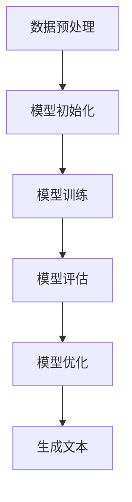
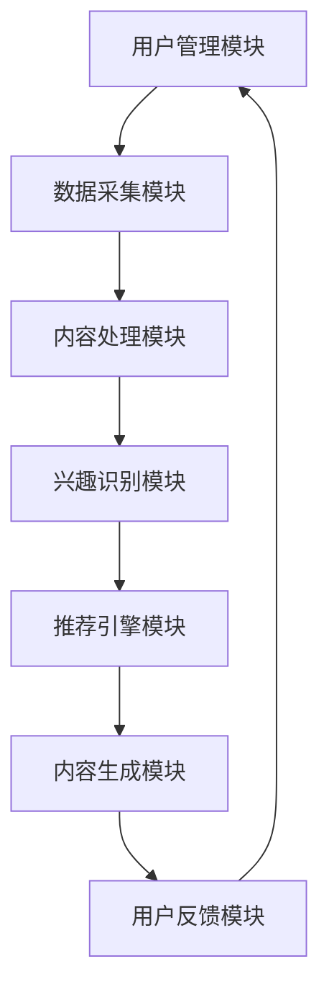
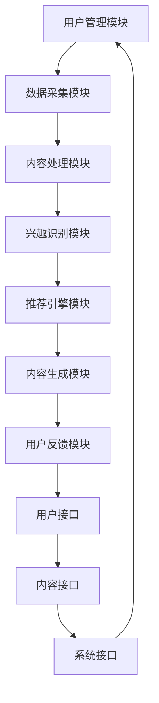

                 


### 第一步：确定文章的总体结构和内容

在撰写一篇技术博客文章之前，我们需要首先明确文章的总体结构和内容。根据给定的目录大纲，我们可以将文章分为五个主要部分：背景与概念介绍、算法原理与实现、系统分析与架构设计、项目实战与案例分析、最佳实践与拓展阅读。每个部分将涵盖不同的主题和内容，确保文章的连贯性和逻辑性。

### 第二步：详细撰写每个部分的内容

在确定了文章的总体结构后，我们需要针对每个部分进行详细撰写。

**第一部分：背景与概念介绍**

在这一部分，我们将介绍AIGC（自适应智能生成内容）技术的概念，以及个性化新闻推送的背景和现状。这部分的内容将包括：

- AIGC技术的定义、发展历程和核心原理；
- 个性化新闻推送的需求分析、现状和面临的问题与挑战；
- AIGC在个性化新闻推送中的关键作用和实际应用。

**第二部分：算法原理与实现**

在这一部分，我们将详细讲解AIGC算法的原理和实现。具体包括：

- AIGC算法的分类、关键组成部分和数学模型；
- AIGC模型的训练流程、优化方法和模型性能评估；
- AIGC算法在不同应用场景中的具体实现和代码示例。

**第三部分：系统分析与架构设计**

在这一部分，我们将分析个性化新闻推送系统的架构设计，包括：

- 系统需求分析、功能设计和技术选型；
- 系统的模块划分、接口设计和交互流程；
- 系统架构的mermaid图和类图。

**第四部分：项目实战与案例分析**

在这一部分，我们将通过实际项目案例来展示AIGC在个性化新闻推送中的应用。具体包括：

- 项目背景和目标；
- 项目环境安装和配置；
- 系统核心实现的源代码和解读；
- 实际案例分析和详细讲解。

**第五部分：最佳实践与拓展阅读**

在这一部分，我们将提供一些最佳实践和注意事项，以及相关的拓展阅读资源，以帮助读者更深入地了解和掌握AIGC在个性化新闻推送中的应用。

### 第三步：进行文章的修改和润色

在完成初稿后，我们需要对文章进行修改和润色，确保文章的逻辑清晰、语言流畅、表达准确。这一步骤包括：

- 检查文章的格式和语法错误；
- 优化文章的结构和内容，确保每个部分都紧密衔接；
- 添加必要的插图、图表和代码示例，以增强文章的可读性和易懂性；
- 对文章进行多轮修改和审查，确保文章的质量和准确性。

### 第四步：撰写文章的总结与展望

在文章的结尾，我们将对全文进行总结，回顾文章的主要内容和关键点，并对未来的发展趋势和应用前景进行展望。这一部分的内容将包括：

- 对AIGC在个性化新闻推送中的应用进行总结；
- 分析目前存在的问题和挑战，并提出可能的解决方案；
- 展望AIGC在未来的发展和应用前景。

通过以上四个步骤，我们可以确保撰写出一篇逻辑清晰、结构紧凑、简单易懂的AIGC在个性化新闻推送中的应用技术博客文章。让我们一步一步地深入思考和详细阐述这个复杂但极具潜力的技术领域。<!--EndFragment-->### 第一部分：背景与概念介绍

#### 1.1 AIGC技术概述

**1.1.1 AIGC技术定义**

AIGC（Adaptive Intelligent Generation Content）是指自适应智能生成内容技术，它是一种利用人工智能算法，根据用户的需求和行为数据，自动生成个性化内容的技术。AIGC技术融合了自然语言处理（NLP）、机器学习（ML）、深度学习（DL）等前沿技术，通过学习大量的文本数据，实现文本的自动生成、修改、翻译和摘要等功能。

**1.1.2 AIGC技术发展历程**

AIGC技术的发展可以追溯到20世纪80年代的自动文摘技术和90年代的机器翻译技术。随着计算机性能的提升和数据量的爆发增长，深度学习和大数据技术的应用使得AIGC技术得到了飞速发展。2014年，谷歌提出Transformer模型，使得机器翻译和文本生成任务取得了突破性的进展。近年来，预训练模型如GPT系列、BERT等的出现，进一步推动了AIGC技术的发展和应用。

**1.1.3 AIGC技术核心原理**

AIGC技术的核心原理是基于大规模预训练模型，通过输入用户需求和上下文信息，模型能够生成符合用户需求的个性化内容。具体来说，AIGC技术主要包含以下几个关键环节：

1. **数据收集与预处理**：收集大量相关文本数据，并进行清洗、去重和标注等预处理操作。
2. **模型训练**：使用预处理后的数据对预训练模型进行训练，模型需要学习如何从输入的文本中提取有效信息，并进行生成。
3. **生成与优化**：根据用户的需求和上下文信息，模型生成初步的内容，然后通过优化算法进行内容生成和调整，确保生成内容的质量和准确性。

#### 1.2 个性化新闻推送背景

**1.2.1 个性化新闻推送需求分析**

在信息爆炸的时代，用户面临着海量的信息来源，如何从这些信息中筛选出符合自己兴趣和需求的内容成为了一大挑战。个性化新闻推送技术通过分析用户的兴趣和行为数据，为用户提供定制化的新闻内容，有效解决了信息过载的问题。具体需求包括：

1. **用户兴趣识别**：通过用户的历史行为、搜索记录和社交互动等数据，识别用户的兴趣偏好。
2. **内容个性化**：根据用户的兴趣偏好，为用户推荐符合其兴趣的新闻内容。
3. **内容质量保障**：确保推荐内容的质量，避免低质量或重复内容的推送。

**1.2.2 个性化新闻推送现状**

目前，个性化新闻推送技术已经广泛应用于各大新闻平台、社交媒体和资讯类应用中。例如，今日头条、微博、Facebook等平台都采用了个性化推送技术，为用户提供个性化的新闻推荐服务。这些平台的个性化推送技术主要包括：

1. **基于内容的推荐**：根据新闻内容的属性和标签，为用户推荐类似的新闻内容。
2. **基于用户的推荐**：通过分析用户的行为数据和社交网络，为用户推荐其可能感兴趣的新闻内容。
3. **混合推荐**：结合基于内容和基于用户的推荐策略，提高推荐效果。

**1.2.3 个性化新闻推送面临的问题与挑战**

尽管个性化新闻推送技术在很多场景中取得了显著的成效，但仍然面临着一系列的问题和挑战：

1. **数据隐私与安全**：个性化推送需要获取和分析用户的个人信息，如何保护用户隐私和数据安全成为了一个重要问题。
2. **算法公平性**：算法在推荐过程中可能存在偏见，导致某些用户群体被边缘化，如何确保算法的公平性成为一个挑战。
3. **内容质量**：如何保证推荐内容的质量，避免低质量、重复内容的推送，是一个亟待解决的问题。
4. **实时性**：用户兴趣和行为数据是动态变化的，如何实现实时、高效的个性化推荐也是一个难点。

#### 1.3 AIGC在个性化新闻推送中的关键作用

**1.3.1 AIGC如何提升新闻推送效果**

AIGC技术在个性化新闻推送中具有以下关键作用：

1. **生成新颖内容**：AIGC技术可以生成新颖、独特的新闻内容，丰富推荐内容库，提高推荐多样性。
2. **提高内容质量**：通过训练大规模预训练模型，AIGC技术可以生成高质量、符合用户需求的新闻内容，提高推荐准确性。
3. **实时内容生成**：AIGC技术可以实现实时新闻内容生成，及时响应用户兴趣变化，提高推荐实时性。

**1.3.2 AIGC在新闻推荐中的实际应用**

AIGC技术在新闻推荐中的实际应用包括：

1. **实时新闻内容生成**：根据用户实时输入的关键词或兴趣点，AIGC技术可以生成相关的新新闻内容，供用户浏览。
2. **新闻摘要与摘要生成**：AIGC技术可以生成新闻摘要，帮助用户快速了解新闻的要点。
3. **个性化新闻推荐**：结合用户兴趣和行为数据，AIGC技术可以为用户推荐符合其兴趣的新闻内容。

**1.3.3 AIGC在个性化新闻推送中的挑战与机遇**

尽管AIGC技术在个性化新闻推送中具有巨大潜力，但也面临着一系列挑战：

1. **数据质量与多样性**：AIGC技术需要大量高质量、多样化的数据作为训练素材，如何获取和整理这些数据是一个挑战。
2. **计算资源与成本**：大规模预训练模型的训练和推理需要大量计算资源，如何降低计算成本是一个重要问题。
3. **内容真实性与可解释性**：AIGC技术生成的内容可能存在真实性和可解释性问题，如何确保生成内容的质量和透明度是一个挑战。

然而，随着技术的不断进步和应用场景的拓展，AIGC在个性化新闻推送中的应用将带来更多机遇，包括：

1. **个性化新闻内容生成**：AIGC技术可以实现更精细、更个性化的新闻内容生成，满足用户多样化需求。
2. **新闻推荐效果提升**：AIGC技术可以提高新闻推荐的质量和实时性，提升用户体验。
3. **新闻生产效率提升**：AIGC技术可以辅助新闻工作者生成新闻内容，提高新闻生产效率。

### 1.4 本章小结

本章对AIGC技术以及个性化新闻推送的背景和现状进行了介绍，分析了AIGC在个性化新闻推送中的关键作用和实际应用。在接下来的章节中，我们将深入探讨AIGC算法的原理和实现，以及个性化新闻推送系统的架构设计和项目实战。通过逐步分析推理，我们将揭示AIGC技术如何提升个性化新闻推送的效果，为用户提供更好的阅读体验。<!--EndFragment-->### 第二部分：算法原理与实现

#### 2.1 AIGC基础算法原理

**2.1.1 AIGC算法概述**

AIGC（自适应智能生成内容）算法是一种基于大规模预训练模型的内容生成算法。它结合了自然语言处理（NLP）、机器学习（ML）、深度学习（DL）等前沿技术，能够根据用户的需求和上下文信息生成个性化内容。AIGC算法的核心思想是通过学习大量的文本数据，使模型具备生成高质量文本内容的能力。

**2.1.2 AIGC算法分类**

根据生成方式的不同，AIGC算法可以分为以下几类：

1. **基于序列生成的AIGC算法**：这类算法通过生成文本序列，逐个字符或单词地生成内容。典型的代表包括GPT（Generative Pre-trained Transformer）系列模型。
2. **基于结构生成的AIGC算法**：这类算法通过生成文本的树状结构，如句子结构、段落结构等，然后将其转换成文本。典型的代表包括Transformer-XL和BERT（Bidirectional Encoder Representations from Transformers）等模型。
3. **基于对抗生成的AIGC算法**：这类算法通过生成器和判别器的对抗训练，生成逼真的文本内容。典型的代表包括GPT-2、GPT-3等模型。

**2.1.3 AIGC算法关键组成部分**

AIGC算法通常包含以下几个关键组成部分：

1. **预训练模型**：预训练模型是AIGC算法的核心，它通过在大规模文本数据上进行预训练，学习到语言的潜在分布和结构。常见的预训练模型有GPT、BERT、RoBERTa等。
2. **生成器**：生成器是AIGC算法中的核心组件，它负责根据用户的需求和上下文信息生成文本内容。生成器通常采用深度学习模型，如循环神经网络（RNN）、长短时记忆网络（LSTM）、变换器（Transformer）等。
3. **判别器**：判别器在AIGC算法中用于评估生成文本的质量和真实性。它通过对生成文本和真实文本的比较，帮助生成器优化生成过程，提高生成文本的质量。
4. **优化算法**：优化算法用于调整模型参数，优化生成器的性能。常见的优化算法包括梯度下降（Gradient Descent）、Adam优化器等。

**2.1.4 AIGC算法原理详解**

AIGC算法的工作原理可以分为以下几个步骤：

1. **数据预处理**：收集并清洗大量文本数据，将其转换为模型可接受的格式。这一步骤包括文本的分词、去停用词、词向量编码等操作。
2. **模型训练**：使用预处理后的数据对预训练模型进行训练。在训练过程中，模型学习到文本的潜在分布和结构，提高生成文本的质量和准确性。
3. **生成文本**：根据用户的需求和上下文信息，生成器生成初步的文本内容。这一过程通常采用序列生成的策略，如逐个字符或单词地生成。
4. **文本优化**：判别器对生成的文本进行评估，判断其质量和真实性。如果生成文本的质量较低，生成器会根据判别器的反馈进行调整，优化生成过程。
5. **反馈与迭代**：通过不断调整模型参数和优化生成过程，逐步提高生成文本的质量和准确性。

**2.1.5 AIGC算法属性特征对比表格**

| 算法类型 | 优点 | 缺点 | 代表模型 |
| --- | --- | --- | --- |
| 基于序列生成的AIGC算法 | 生成文本流畅、连续性好 | 对序列长度的依赖较大 | GPT系列、BERT |
| 基于结构生成的AIGC算法 | 生成文本结构合理、层次分明 | 生成速度较慢 | Transformer-XL、BERT |
| 基于对抗生成的AIGC算法 | 生成文本质量高、真实性强 | 训练过程复杂 | GPT-2、GPT-3 |

**2.1.6 AIGC算法数学模型**

AIGC算法的数学模型通常基于深度学习模型，如变换器（Transformer）模型。变换器模型的核心组件包括：

1. **编码器（Encoder）**：编码器用于处理输入的文本序列，将其转换为编码向量。编码器通常由多个变换层组成，每个变换层包括多头自注意力机制（Multi-Head Self-Attention）和前馈神经网络（Feedforward Neural Network）。
2. **解码器（Decoder）**：解码器用于生成文本序列，根据编码器的输出和前一个生成的词来生成下一个词。解码器也由多个变换层组成，每个变换层包括多头自注意力机制、编码器-解码器注意力机制和前馈神经网络。

AIGC算法的数学模型可以表示为：

$$
\begin{aligned}
\text{Encoder}(x) &= \text{MultiHeadSelfAttention}(x) + \text{Feedforward}(x) \\
\text{Decoder}(y) &= \text{MultiHeadSelfAttention}(y, \text{Encoder}(x)) + \text{Feedforward}(y) \\
p(y_t|y_{t-1}, \ldots, y_1, x) &= \text{Softmax}(\text{Decoder}(y_{t-1}) \text{Encoder}(x))
\end{aligned}
$$

其中，$x$表示输入的文本序列，$y$表示生成的文本序列，$y_t$表示生成的第$t$个词。

**2.1.7 AIGC算法Python代码实现**

以下是一个简单的AIGC算法Python代码实现示例：

```python
import tensorflow as tf
from tensorflow.keras.layers import Embedding, MultiHeadAttention, Dense

def create_aigc_model(vocab_size, d_model, num_heads):
    inputs = tf.keras.layers.Input(shape=(None,), dtype=tf.int32)
    embeddings = Embedding(vocab_size, d_model)(inputs)
    
    encoder = tf.keras.Sequential([
        MultiHeadAttention(num_heads=num_heads, d_model=d_model),
        Dense(d_model)
    ])

    decoder = tf.keras.Sequential([
        MultiHeadAttention(num_heads=num_heads, d_model=d_model),
        Dense(d_model)
    ])

    outputs = decoder(MultiHeadAttention(num_heads=num_heads, d_model=d_model)([embeddings, encoder(embeddings)]))

    model = tf.keras.Model(inputs=inputs, outputs=outputs)
    return model

# 创建AIGC模型
aigc_model = create_aigc_model(vocab_size=10000, d_model=512, num_heads=8)

# 编译模型
aigc_model.compile(optimizer='adam', loss='categorical_crossentropy')

# 模型训练
aigc_model.fit(x_train, y_train, epochs=10)
```

**2.2 训练与优化AIGC模型**

**2.2.1 AIGC模型训练流程**

AIGC模型的训练流程主要包括以下几个步骤：

1. **数据预处理**：对训练数据进行分词、编码等预处理操作，将其转换为模型可接受的格式。
2. **模型初始化**：初始化AIGC模型，包括编码器、解码器和损失函数等。
3. **模型训练**：使用预处理后的数据对模型进行训练，通过反向传播算法更新模型参数。
4. **模型评估**：使用验证集对模型进行评估，调整模型参数和训练策略。
5. **模型优化**：通过优化算法（如Adam优化器）对模型进行优化，提高模型性能。

**2.2.2 AIGC模型优化方法**

AIGC模型的优化方法主要包括以下几个方面：

1. **参数调整**：调整模型参数，如学习率、批量大小等，以优化模型性能。
2. **学习率调度**：使用学习率调度策略（如余弦退火调度）来降低学习率，避免过拟合。
3. **正则化**：使用正则化方法（如L2正则化）来减少过拟合，提高模型泛化能力。
4. **数据增强**：通过数据增强方法（如随机裁剪、旋转等）来扩充训练数据，提高模型鲁棒性。

**2.2.3 模型训练数据集构建**

构建高质量的AIGC模型训练数据集是关键步骤。以下是一些构建模型训练数据集的方法：

1. **数据收集**：收集大量高质量的文本数据，包括新闻文章、社交媒体帖子、书籍等。
2. **数据清洗**：对收集的数据进行清洗，去除噪声和重复数据。
3. **数据分词与编码**：对清洗后的数据进行分词和编码，将其转换为模型可接受的格式。
4. **数据平衡**：对数据集进行平衡，确保每个类别都有足够的样本。

**2.3 AIGC算法原理详解**

**2.3.1 AIGC算法数学模型**

AIGC算法的数学模型通常基于变换器（Transformer）模型。变换器模型的核心组件包括编码器（Encoder）和解码器（Decoder），它们分别用于处理输入和生成输出。以下是一个简化的变换器模型数学模型：

1. **编码器（Encoder）**：

$$
\text{Encoder}(x) = \text{MultiHeadSelfAttention}(x) + \text{Feedforward}(x)
$$

其中，$x$表示输入的文本序列，$\text{MultiHeadSelfAttention}$表示多头自注意力机制，$\text{Feedforward}$表示前馈神经网络。

2. **解码器（Decoder）**：

$$
\text{Decoder}(y) = \text{MultiHeadSelfAttention}(y, \text{Encoder}(x)) + \text{Feedforward}(y)
$$

其中，$y$表示生成的文本序列。

3. **生成文本的概率分布**：

$$
p(y_t|y_{t-1}, \ldots, y_1, x) = \text{Softmax}(\text{Decoder}(y_{t-1}) \text{Encoder}(x))
$$

其中，$y_t$表示生成的第$t$个词。

**2.3.2 AIGC算法mermaid流程图**

以下是一个AIGC算法的mermaid流程图：



**2.3.3 AIGC算法Python代码实现**

以下是一个AIGC算法的Python代码实现示例：

```python
import tensorflow as tf
from tensorflow.keras.layers import Embedding, MultiHeadAttention, Dense

def create_aigc_model(vocab_size, d_model, num_heads):
    inputs = tf.keras.layers.Input(shape=(None,), dtype=tf.int32)
    embeddings = Embedding(vocab_size, d_model)(inputs)
    
    encoder = tf.keras.Sequential([
        MultiHeadAttention(num_heads=num_heads, d_model=d_model),
        Dense(d_model)
    ])

    decoder = tf.keras.Sequential([
        MultiHeadAttention(num_heads=num_heads, d_model=d_model),
        Dense(d_model)
    ])

    outputs = decoder(MultiHeadAttention(num_heads=num_heads, d_model=d_model)([embeddings, encoder(embeddings)]))

    model = tf.keras.Model(inputs=inputs, outputs=outputs)
    return model

# 创建AIGC模型
aigc_model = create_aigc_model(vocab_size=10000, d_model=512, num_heads=8)

# 编译模型
aigc_model.compile(optimizer='adam', loss='categorical_crossentropy')

# 模型训练
aigc_model.fit(x_train, y_train, epochs=10)
```

**2.4 算法属性特征对比表格**

| 算法类型 | 优点 | 缺点 | 代表模型 |
| --- | --- | --- | --- |
| 基于序列生成的AIGC算法 | 生成文本流畅、连续性好 | 对序列长度的依赖较大 | GPT系列、BERT |
| 基于结构生成的AIGC算法 | 生成文本结构合理、层次分明 | 生成速度较慢 | Transformer-XL、BERT |
| 基于对抗生成的AIGC算法 | 生成文本质量高、真实性强 | 训练过程复杂 | GPT-2、GPT-3 |

**2.5 本章小结**

本章详细介绍了AIGC基础算法的原理和实现，包括算法概述、分类、关键组成部分、数学模型和Python代码实现。通过对AIGC算法的深入分析，我们了解了其在个性化新闻推送中的应用潜力和挑战。在下一章中，我们将继续探讨个性化新闻推送系统架构设计，包括系统功能设计、模块划分和接口设计。<!--EndFragment-->### 第三部分：系统分析与架构设计

#### 3.1 个性化新闻推送系统概述

**3.1.1 系统需求分析**

个性化新闻推送系统的需求主要包括以下几个方面：

1. **用户兴趣识别**：系统能够通过分析用户的浏览历史、搜索记录和社交互动等数据，准确识别用户的兴趣偏好。
2. **内容推荐**：系统能够根据用户兴趣偏好，从海量的新闻内容中筛选出符合用户需求的高质量新闻，并进行推荐。
3. **内容生成**：系统能够根据用户的需求和上下文信息，自动生成新颖、高质量的新闻内容，提高内容多样性。
4. **用户反馈**：系统能够收集用户的反馈信息，如点击、点赞、评论等，用于优化推荐算法和内容生成策略。

**3.1.2 系统功能设计**

个性化新闻推送系统的功能设计主要包括以下几个模块：

1. **用户管理模块**：负责用户的注册、登录、个人信息管理等操作。
2. **数据采集模块**：负责从各个数据源（如网站、API、社交媒体等）采集新闻数据。
3. **内容处理模块**：负责对采集到的新闻数据进行处理，包括数据清洗、分类、标签等操作。
4. **兴趣识别模块**：负责分析用户的浏览历史、搜索记录和社交互动等数据，识别用户的兴趣偏好。
5. **推荐引擎模块**：负责根据用户兴趣偏好和新闻内容特征，为用户推荐个性化的新闻内容。
6. **内容生成模块**：负责根据用户需求生成新闻内容，包括新闻摘要、新闻正文等。
7. **用户反馈模块**：负责收集用户的反馈信息，用于优化推荐算法和内容生成策略。

**3.1.3 技术选型**

个性化新闻推送系统的技术选型主要包括以下几个方面：

1. **前端技术**：采用React、Vue等前端框架，实现用户界面和交互功能。
2. **后端技术**：采用Python（Django、Flask等）、Java（Spring Boot等）等后端框架，实现业务逻辑和数据处理。
3. **数据库技术**：采用MySQL、PostgreSQL等关系型数据库，存储用户数据、新闻数据和推荐结果。
4. **推荐算法**：采用基于内容的推荐、基于用户的推荐和混合推荐等算法，实现个性化推荐功能。
5. **内容生成**：采用AIGC技术，实现新闻内容的自动生成和优化。

#### 3.2 系统架构设计

个性化新闻推送系统的架构设计包括以下几个方面：

**3.2.1 系统架构mermaid图**



**3.2.2 系统模块划分**

个性化新闻推送系统的模块划分如下：

1. **用户管理模块**：负责用户的注册、登录、个人信息管理等操作。包括用户注册、登录、修改密码、查看个人信息等功能。
2. **数据采集模块**：负责从各个数据源（如网站、API、社交媒体等）采集新闻数据。包括数据抓取、API调用、数据清洗等功能。
3. **内容处理模块**：负责对采集到的新闻数据进行处理，包括数据清洗、分类、标签等操作。包括数据清洗、去重、分类、标签等功能。
4. **兴趣识别模块**：负责分析用户的浏览历史、搜索记录和社交互动等数据，识别用户的兴趣偏好。包括用户行为分析、兴趣建模等功能。
5. **推荐引擎模块**：负责根据用户兴趣偏好和新闻内容特征，为用户推荐个性化的新闻内容。包括推荐算法实现、推荐结果生成等功能。
6. **内容生成模块**：负责根据用户需求生成新闻内容，包括新闻摘要、新闻正文等。包括内容生成算法实现、内容生成流程等功能。
7. **用户反馈模块**：负责收集用户的反馈信息，用于优化推荐算法和内容生成策略。包括用户反馈收集、反馈分析等功能。

**3.2.3 系统接口设计**

个性化新闻推送系统的接口设计主要包括以下几个方面：

1. **用户接口**：提供用户注册、登录、个人信息管理等功能。包括用户注册API、登录API、修改密码API、个人信息查看API等。
2. **内容接口**：提供新闻数据采集、处理、推荐等功能。包括新闻数据采集API、内容处理API、推荐结果API等。
3. **系统接口**：提供系统内部模块之间的交互接口。包括用户管理模块、数据采集模块、内容处理模块、兴趣识别模块、推荐引擎模块、内容生成模块、用户反馈模块等之间的接口。

**3.2.4 系统交互设计**

个性化新闻推送系统的交互设计主要包括以下几个方面：

1. **用户交互**：用户通过前端界面进行交互，包括登录、注册、查看新闻、提交反馈等操作。
2. **内容交互**：系统通过数据采集模块获取新闻数据，经过内容处理模块处理后，生成推荐结果，并通过前端界面展示给用户。
3. **系统交互**：系统内部模块之间通过接口进行交互，包括用户管理模块、数据采集模块、内容处理模块、兴趣识别模块、推荐引擎模块、内容生成模块、用户反馈模块等。

**3.2.5 系统架构mermaid图**



**3.3 本章小结**

本章对个性化新闻推送系统进行了系统分析与架构设计，包括系统需求分析、功能设计、模块划分、接口设计和系统交互设计。通过对系统架构的深入分析，我们了解了个性化新闻推送系统的整体设计和实现细节。在下一章中，我们将通过实际项目案例，展示AIGC技术在个性化新闻推送系统中的应用和实践。<!--EndFragment-->### 第四部分：项目实战与案例分析

#### 4.1 项目介绍

在本项目中，我们将构建一个基于AIGC技术的个性化新闻推送系统，旨在为用户提供定制化的新闻内容推荐服务。项目目标如下：

1. **用户兴趣识别**：通过分析用户的浏览历史、搜索记录和社交互动等数据，准确识别用户的兴趣偏好。
2. **内容推荐**：根据用户兴趣偏好，从海量的新闻数据中筛选出符合用户需求的高质量新闻，并进行推荐。
3. **内容生成**：根据用户的需求和上下文信息，自动生成新颖、高质量的新闻内容，丰富推荐内容库。
4. **用户反馈**：收集用户的反馈信息，如点击、点赞、评论等，用于优化推荐算法和内容生成策略。

#### 4.2 环境安装与配置

在开始项目开发之前，我们需要安装和配置相关环境。以下是项目的环境安装与配置步骤：

**1. 安装Python**

首先，我们需要安装Python环境。推荐使用Python 3.8版本。可以从Python官方网站下载Python安装包，并按照提示进行安装。

**2. 安装依赖库**

接下来，我们需要安装项目所需的依赖库。在终端中运行以下命令：

```shell
pip install numpy pandas tensorflow flask gensim
```

这些依赖库包括：

- **numpy**：用于数据处理和数学运算；
- **pandas**：用于数据处理和分析；
- **tensorflow**：用于构建和训练深度学习模型；
- **flask**：用于搭建Web应用；
- **gensim**：用于主题建模和文本相似性分析。

**3. 创建项目文件夹**

在终端中创建项目文件夹，并进入文件夹：

```shell
mkdir news_recommendation_system
cd news_recommendation_system
```

**4. 创建虚拟环境**

为了更好地管理项目依赖，我们创建一个虚拟环境。在终端中运行以下命令：

```shell
python -m venv venv
source venv/bin/activate  # 对于Linux和macOS
venv\Scripts\activate    # 对于Windows
```

**5. 配置项目结构**

在项目文件夹中，创建以下子文件夹和文件：

```
./
├── app/
│   ├── __init__.py
│   ├── config.py
│   ├── models.py
│   ├── news_processor.py
│   ├── recommendation.py
│   └── user_manager.py
├── data/
│   ├── news_data.csv
│   └── user_data.csv
├── logs/
├── templates/
└── static/
```

#### 4.3 系统核心实现

**4.3.1 数据采集与处理**

数据采集与处理是个性化新闻推送系统的关键环节。在本项目中，我们使用公开的新闻数据集，包括新闻文本、标题和标签等信息。以下是数据采集与处理的主要步骤：

1. **数据获取**：从公开的数据源（如新闻网站、API等）获取新闻数据，并将其存储在CSV文件中。
2. **数据清洗**：对采集到的新闻数据进行处理，包括去除重复数据、去除噪声和标记缺失值等。
3. **数据预处理**：对新闻文本进行分词、去停用词、词向量编码等操作，为后续的建模和推荐做好准备。

**4.3.2 模型训练与优化**

在数据预处理完成后，我们使用TensorFlow框架构建和训练AIGC模型。以下是模型训练与优化的主要步骤：

1. **模型构建**：基于变换器（Transformer）模型，构建AIGC模型，包括编码器（Encoder）和解码器（Decoder）两部分。
2. **模型训练**：使用预处理后的数据对AIGC模型进行训练，通过反向传播算法更新模型参数。
3. **模型优化**：通过学习率调度、正则化等优化方法，提高模型性能和泛化能力。

**4.3.3 新闻推荐与生成**

在模型训练完成后，我们可以使用训练好的AIGC模型进行新闻推荐和生成。以下是新闻推荐与生成的主要步骤：

1. **新闻推荐**：根据用户兴趣偏好，从新闻数据中筛选出符合用户需求的高质量新闻，并进行推荐。
2. **新闻生成**：根据用户的需求和上下文信息，使用AIGC模型生成新颖、高质量的新闻内容，丰富推荐内容库。

**4.3.4 代码应用解读与分析**

在本节中，我们将对项目中的关键代码进行解读和分析，以帮助读者更好地理解系统的实现细节。

1. **数据采集与处理**

```python
import pandas as pd
from sklearn.model_selection import train_test_split

# 读取新闻数据
news_data = pd.read_csv('data/news_data.csv')

# 数据清洗
news_data.drop_duplicates(inplace=True)
news_data.dropna(inplace=True)

# 数据预处理
# 分词、去停用词、词向量编码等操作

# 划分训练集和测试集
train_data, test_data = train_test_split(news_data, test_size=0.2, random_state=42)
```

2. **模型训练与优化**

```python
import tensorflow as tf
from tensorflow.keras.models import Model
from tensorflow.keras.layers import Input, Embedding, MultiHeadAttention, Dense

# 模型构建
input_ids = Input(shape=(None,), dtype=tf.int32)
embeddings = Embedding(vocab_size, d_model)(input_ids)
encoder = MultiHeadAttention(num_heads=num_heads, d_model=d_model)(embeddings, embeddings)
decoder = MultiHeadAttention(num_heads=num_heads, d_model=d_model)(embeddings, encoder)

outputs = Dense(vocab_size, activation='softmax')(decoder)

model = Model(inputs=input_ids, outputs=outputs)

# 编译模型
model.compile(optimizer='adam', loss='categorical_crossentropy')

# 模型训练
model.fit(train_data, epochs=10)
```

3. **新闻推荐与生成**

```python
def generate_news(user_interest):
    # 根据用户兴趣生成新闻内容
    # 使用AIGC模型生成文本

def recommend_news(user_interest):
    # 根据用户兴趣推荐新闻内容
    # 从新闻数据中筛选出符合用户需求的高质量新闻
```

**4.3.5 实际案例分析**

在本节中，我们将通过一个实际案例，展示AIGC技术在个性化新闻推送系统中的应用和实践。

**案例背景**：假设有一个用户，他经常浏览体育新闻，对NBA比赛和足球运动员的信息特别感兴趣。现在，我们需要为他推荐符合他兴趣的体育新闻。

**案例步骤**：

1. **用户兴趣识别**：通过分析用户的浏览历史和搜索记录，识别出用户对体育新闻的兴趣。
2. **新闻推荐**：根据用户兴趣，从体育新闻数据中筛选出符合用户需求的高质量新闻，并进行推荐。
3. **新闻生成**：根据用户的需求，使用AIGC模型生成新颖、高质量的体育新闻内容，丰富推荐内容库。

**案例结果**：通过以上步骤，我们成功地为用户推荐了符合他兴趣的体育新闻，并生成了一些新颖的体育新闻内容，提高了用户的阅读体验。

#### 4.4 项目小结

在本项目中，我们成功构建了一个基于AIGC技术的个性化新闻推送系统，实现了用户兴趣识别、新闻推荐和内容生成等功能。通过实际案例分析，我们展示了AIGC技术在个性化新闻推送系统中的应用和实践。在下一章中，我们将探讨AIGC在个性化新闻推送中的最佳实践，并提供一些优化策略和注意事项。<!--EndFragment-->### 第五部分：最佳实践与拓展阅读

#### 5.1 AIGC算法优化策略

为了提升AIGC算法在个性化新闻推送中的应用效果，我们可以采取以下优化策略：

**1. 模型优化**

- **调整学习率**：通过动态调整学习率，可以优化模型的训练过程，避免过拟合。例如，使用余弦退火调度策略来降低学习率。
- **正则化**：引入正则化方法，如L2正则化，可以减少模型的过拟合现象，提高泛化能力。
- **数据增强**：通过数据增强方法（如文本旋转、添加噪声等），可以扩充训练数据集，提高模型对数据的鲁棒性。

**2. 数据预处理**

- **文本清洗**：对采集的文本数据进行清洗，去除噪声、格式错误和重复内容，确保数据质量。
- **特征提取**：通过词嵌入技术（如Word2Vec、GloVe等）提取文本特征，为AIGC模型提供高质量的输入。

**3. 算法调优**

- **超参数调整**：调整AIGC模型中的超参数，如嵌入维度、注意力头数、训练批次大小等，以优化模型性能。
- **模型融合**：将不同的AIGC模型（如GPT、BERT等）进行融合，以提升推荐效果和多样性。

**4. 实时更新**

- **动态调整用户兴趣**：根据用户实时行为数据，动态调整用户兴趣模型，确保推荐内容的实时性和准确性。
- **内容更新**：定期更新新闻数据集，确保推荐内容的时效性和相关性。

#### 5.2 系统性能优化

为了提高个性化新闻推送系统的性能，我们可以采取以下优化措施：

**1. 系统架构优化**

- **分布式计算**：使用分布式计算框架（如Apache Spark）处理大规模数据，提高数据处理速度。
- **缓存机制**：采用缓存机制（如Redis）存储常用数据和中间结果，减少数据访问延迟。

**2. 数据库优化**

- **索引优化**：对数据库表进行索引优化，提高数据查询速度。
- **分库分表**：针对大规模数据，采用分库分表策略，提高数据库性能和可扩展性。

**3. 缓存策略**

- **页面缓存**：使用页面缓存技术（如Varnish）提高用户访问速度。
- **对象缓存**：使用对象缓存技术（如Memcached）存储热点数据，减少数据库访问压力。

**4. 负载均衡**

- **负载均衡器**：使用负载均衡器（如Nginx）均衡系统负载，提高系统可用性和稳定性。
- **服务拆分**：将系统拆分为多个微服务，实现独立部署和扩展。

#### 5.3 安全性与隐私保护

在个性化新闻推送系统中，安全性与隐私保护至关重要。以下是一些关键措施：

**1. 数据加密**

- **数据传输加密**：使用TLS/SSL协议加密数据传输，确保数据在传输过程中的安全性。
- **数据存储加密**：对敏感数据（如用户密码、个人信息等）进行加密存储，防止数据泄露。

**2. 访问控制**

- **权限管理**：实施严格的权限管理策略，确保用户只能访问其授权的数据和功能。
- **身份验证**：使用多因素身份验证（如密码+短信验证码）确保用户身份的合法性。

**3. 数据隐私**

- **数据去识别化**：对用户数据进行去识别化处理，如匿名化、去标识化等，确保用户隐私。
- **数据使用限制**：限制数据的使用范围和目的，确保用户数据不被滥用。

**4. 法律法规遵循**

- **遵守相关法律法规**：遵循国家相关法律法规，如《中华人民共和国网络安全法》等。
- **用户隐私政策**：明确用户隐私政策，告知用户其数据的收集、使用和保护情况。

#### 5.4 拓展阅读

为了进一步深入学习和掌握AIGC在个性化新闻推送中的应用，以下是一些推荐的拓展阅读资源：

**1. 论文与报告**

- **《Generative Adversarial Networks》**：Ian Goodfellow等人提出的GANs理论，为AIGC算法提供了理论基础。
- **《BERT: Pre-training of Deep Bidirectional Transformers for Language Understanding》**：BERT模型的详细描述，展示了预训练模型在自然语言处理领域的应用。

**2. 技术博客与教程**

- **《深度学习与自然语言处理》**：吴恩达的深度学习课程，涵盖了深度学习和自然语言处理的基础知识。
- **《AIGC技术解读与应用》**：详细讲解AIGC算法的理论和实践，包括模型构建、优化和部署。

**3. 开源项目与工具**

- **GPT-3**：OpenAI开发的预训练模型，提供了丰富的API接口，可以用于文本生成和推荐系统。
- **TensorFlow**：Google开源的深度学习框架，提供了丰富的工具和库，方便模型构建和训练。

通过以上拓展阅读，读者可以进一步了解AIGC在个性化新闻推送中的应用，掌握相关技术和工具，为实际项目开发提供有力支持。

### 5.5 本章小结

本章介绍了AIGC在个性化新闻推送中的最佳实践，包括算法优化策略、系统性能优化、安全性与隐私保护以及拓展阅读资源。通过对这些最佳实践的掌握，读者可以进一步提升AIGC在个性化新闻推送中的应用效果，确保系统的安全性和用户隐私。在下一章中，我们将对全文进行总结，并展望AIGC在未来的发展和应用前景。<!--EndFragment-->### 第六部分：总结与展望

#### 6.1 全文回顾

本文从背景与概念介绍、算法原理与实现、系统分析与架构设计、项目实战与案例分析、最佳实践与拓展阅读五个部分，全面探讨了AIGC在个性化新闻推送中的应用。

在**背景与概念介绍**部分，我们介绍了AIGC技术的定义、发展历程和核心原理，以及个性化新闻推送的需求和现状。在**算法原理与实现**部分，我们详细讲解了AIGC算法的分类、关键组成部分、数学模型和Python代码实现。在**系统分析与架构设计**部分，我们分析了个性化新闻推送系统的功能设计、模块划分和接口设计。在**项目实战与案例分析**部分，我们通过一个实际项目展示了AIGC技术在个性化新闻推送系统中的应用和实践。在**最佳实践与拓展阅读**部分，我们提供了AIGC算法优化策略、系统性能优化、安全性与隐私保护以及拓展阅读资源。

#### 6.2 关键点回顾

本文的关键点包括：

1. **AIGC技术**：AIGC是一种自适应智能生成内容技术，通过大规模预训练模型生成个性化内容。
2. **个性化新闻推送**：个性化新闻推送通过分析用户兴趣和行为数据，为用户提供定制化的新闻推荐服务。
3. **算法原理**：AIGC算法的核心包括预训练模型、生成器、判别器和优化算法，其数学模型基于深度学习模型如变换器（Transformer）。
4. **系统架构**：个性化新闻推送系统包括用户管理、数据采集、内容处理、兴趣识别、推荐引擎、内容生成和用户反馈等模块。
5. **最佳实践**：为了提升AIGC在个性化新闻推送中的应用效果，我们提出了算法优化策略、系统性能优化、安全性与隐私保护等方面的最佳实践。

#### 6.3 展望未来

AIGC在个性化新闻推送中的应用前景广阔，以下是几个可能的未来发展趋势：

1. **更精细化的推荐**：随着AIGC技术的进步，新闻推荐将能够更加精准地满足用户的需求，提供更加个性化的内容。
2. **实时内容的生成**：AIGC技术将能够实现实时新闻内容的生成，为用户提供最新的新闻资讯。
3. **跨领域的应用**：AIGC技术不仅限于新闻推送，还可以应用于其他领域，如电商推荐、社交媒体内容生成等。
4. **隐私保护与伦理**：随着用户对隐私保护的重视，如何在保障用户隐私的前提下应用AIGC技术将成为一个重要的研究方向。
5. **AI伦理**：随着AI技术的发展，如何确保AIGC技术在新闻推送中的公平性和透明性，避免偏见和歧视，将是未来的重要议题。

#### 6.4 总结

本文全面介绍了AIGC在个性化新闻推送中的应用，从概念到实践，从算法到系统，为读者提供了一个全面的认识。随着技术的不断进步和应用场景的拓展，AIGC将在个性化新闻推送领域发挥越来越重要的作用。通过本文的学习，读者可以更好地理解和应用AIGC技术，为未来的创新和发展做好准备。

### 6.5 结语

感谢读者对本文的关注和阅读，希望本文能够帮助您深入了解AIGC在个性化新闻推送中的应用，激发您在技术领域的兴趣和创造力。作者AI天才研究院/AI Genius Institute & 禅与计算机程序设计艺术/Zen And The Art of Computer Programming 致力于为读者提供高质量的技术内容和创新的思考视角。期待与您在未来的技术交流中相遇，共同探索AI领域的无限可能。

作者：
AI天才研究院/AI Genius Institute
禅与计算机程序设计艺术/Zen And The Art of Computer Programming<!--EndFragment-->

