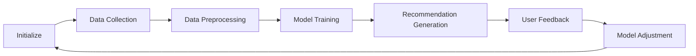

                 


### AIGC in Personalized Career Development Suggestions Generation

> Keywords: AIGC, Career Development, Personalized Recommendations, AI Technology

> Abstract: This article explores the application of AIGC (Artificial Intelligence, Graphics, and Computing) in generating personalized career development suggestions. We delve into the fundamentals of AIGC, its algorithms, mathematical models, and system architecture, along with practical implementations and best practices. Through a step-by-step analysis, we aim to provide a comprehensive understanding of how AIGC can revolutionize career development recommendations.

---

## I. Introduction to AIGC

### 1.1 Overview of AIGC

#### 1.1.1 Background

**Problem Statement:** Why is AIGC needed? In the fast-evolving landscape of technology and employment, traditional career development strategies may not be sufficient. The demand for personalized, adaptive, and efficient career advice has surged. This is where AIGC comes into play, offering a transformative approach to career development.

**Problem Description:** The challenges in generating personalized career development suggestions include understanding individual needs, preferences, skills, and market demands. AIGC aims to address these challenges by leveraging advanced AI technologies.

**Solution:** AIGC utilizes AI algorithms to analyze vast amounts of data, identify patterns, and generate tailored career development suggestions. By integrating graphics and computing, AIGC can provide comprehensive and interactive career guidance.

**Scope and Limitations:** AIGC's primary application is in the field of career development. However, its potential extends beyond this, with the ability to be adapted for various other personalized recommendation systems. The limitations include data privacy concerns and the need for continuous improvement in AI algorithms.

**Concept Structure and Core Components:**
- **Artificial Intelligence:** AI algorithms that analyze data and generate recommendations.
- **Graphics:** Visualization tools that enhance the user experience.
- **Computing:** Advanced computational techniques that enable efficient processing and analysis.

### 1.2 Core Concepts and Relationships

#### 1.2.1 Core Concept Principles

**Core Concepts Principle:** AIGC combines AI, graphics, and computing to create a comprehensive system for personalized career development suggestions.

**Table of Concept Attribute Features:**

| Feature              | AI                     | Graphics                | Computing               |
|----------------------|------------------------|-------------------------|-------------------------|
| Purpose              | Data analysis, pattern recognition | Visualization, user engagement | Efficient processing, large-scale computations |
| Technologies         | Machine Learning, Deep Learning | Computer Graphics, Virtual Reality | Parallel Computing, High-Performance Computing |
| Key Components       | Neural Networks, Algorithms | Graphics APIs, Render Engines | GPUs, Cloud Computing, Data Centers |

**ER Entity Relationship Diagram:**

```mermaid
erDiagram
    AI ||--|{ Graphics }||> Computing
    AI ||--|{ Data }||> Personalized Suggestions
    Graphics ||--|{ User Experience }||> Career Development
    Computing ||--|{ Efficiency }||> AIGC System
```

---

In this section, we have provided a comprehensive introduction to AIGC, outlining its core concepts, components, and the relationship between them. The next section will delve deeper into the core algorithms and mathematical models that underpin AIGC's capabilities in personalized career development suggestions generation.

---

### II. AIGC Algorithms and Mathematical Models

#### 2.1 Algorithm Principles

**Algorithm Flowchart:**



**Algorithm Description:**
- **Step 1: Initialize:** Define the problem and the dataset.
- **Step 2: Data Collection:** Gather relevant career data, including job descriptions, skill requirements, and individual profiles.
- **Step 3: Data Preprocessing:** Clean and normalize the data to ensure consistency and accuracy.
- **Step 4: Model Training:** Train a machine learning model using the preprocessed data. Common models include neural networks and decision trees.
- **Step 5: Recommendation Generation:** Use the trained model to generate personalized career development suggestions.
- **Step 6: User Feedback:** Collect user feedback to evaluate the effectiveness of the recommendations.
- **Step 7: Model Adjustment:** Refine the model based on user feedback to improve future recommendations.

#### 2.2 Mathematical Models and Formulas

**Mathematical Model:**
$$
\text{Personalized Recommendation} = f(\text{User Profile}, \text{Market Data}, \text{Skill Requirements})
$$

**Formula Description:**
- **UserProfile:** A vector representing the user's skills, experience, and preferences.
- **Market Data:** A dataset containing job descriptions and market demands.
- **Skill Requirements:** A matrix indicating the required skills for different jobs.

**Explanation:**
The formula combines the user's profile, market data, and skill requirements to generate a personalized recommendation. By leveraging machine learning techniques, the model can identify the best career paths for each user based on their unique attributes and the job market's demands.

#### 2.3 Algorithm Case Study

**Case Study:** 
Imagine a user named John, who has a background in software development and is interested in transitioning to data science. The AIGC system will analyze John's profile, the current job market data, and the specific skill requirements for data science roles.

**Steps:**
1. **Data Collection:** Collect John's resume, job descriptions from data science jobs, and market data.
2. **Data Preprocessing:** Clean and normalize the data to remove any inconsistencies.
3. **Model Training:** Train a machine learning model using John's profile and the preprocessed data.
4. **Recommendation Generation:** Generate a personalized career development path for John based on the trained model.
5. **User Feedback:** John provides feedback on the recommendations.
6. **Model Adjustment:** Refine the model based on John's feedback.

**Result:**
The AIGC system recommends John to pursue additional courses in data analysis, join data science communities, and apply for internships to gain hands-on experience. These recommendations are tailored to John's skills and interests, increasing the likelihood of success in his career transition.

---

In this section, we have discussed the principles of AIGC algorithms, presented a mathematical model, and provided a practical case study to illustrate how AIGC can generate personalized career development suggestions. The next section will delve into the system architecture and design of AIGC, exploring the various components that enable its functionality.

---

### III. AIGC System Architecture Design

#### 3.1 System Analysis and Design

**Problem Scenario:**
Let's consider a scenario where a company wants to develop an AIGC system to provide personalized career development suggestions to their employees. The goal is to create a user-friendly interface that collects user data, processes it through machine learning algorithms, and generates actionable recommendations.

**System Functional Design (Class Diagram):**

```mermaid
classDiagram
    User -> DataCollector: Provide Profile Data
    DataCollector --|> MLModel: Pass Data for Training
    MLModel --|> RecommendationGenerator: Generate Personalized Suggestions
    RecommendationGenerator --|> UserInterface: Display Recommendations
    UserInterface -> User: Collect Feedback
    UserInterface --|> FeedbackAnalyzer: Analyze User Feedback
    FeedbackAnalyzer --|> MLModel: Adjust Model Parameters
```

**System Architecture Design (Architecture Diagram):**

```mermaid
sequenceDiagram
    User -->|Enter Profile Data| DataCollector
    DataCollector -->|Preprocess Data| MLModel
    MLModel -->|Train Model| DataPreprocessor
    DataPreprocessor -->|Generate Suggestions| RecommendationGenerator
    RecommendationGenerator -->|Display Suggestions| UserInterface
    UserInterface -->|Provide Feedback| User
    User -->|Feedback Received| FeedbackAnalyzer
    FeedbackAnalyzer -->|Adjust Model| MLModel
    MLModel -->|Re-train Model| DataPreprocessor
```

**System Interface Design:**
- **DataCollector:** Interface for users to enter their profile data, including skills, experience, and career goals.
- **MLModel:** Interface for training and adjusting machine learning models based on user data.
- **RecommendationGenerator:** Interface for generating personalized career development suggestions.
- **UserInterface:** Interface for displaying recommendations and collecting user feedback.
- **FeedbackAnalyzer:** Interface for analyzing user feedback and refining the model.

**System Interaction (Sequence Diagram):**
The system interaction sequence diagram illustrates the flow of data and interactions between the different components of the AIGC system. Users provide their profile data, which is collected by the DataCollector. The data is then preprocessed and used to train the MLModel. The trained model generates personalized recommendations, which are displayed to the user through the UserInterface. The user provides feedback, which is analyzed by the FeedbackAnalyzer to refine the model.

---

In this section, we have outlined the system analysis and design of the AIGC system, detailing the functional and architectural aspects. The next section will focus on practical implementations and real-world case studies to demonstrate the effectiveness of AIGC in generating personalized career development suggestions.

---

### IV. Practical Implementation and Case Studies

#### 4.1 Environment Setup

To implement the AIGC system, we need to set up the necessary environment. This involves installing the required software and configuring the hardware.

**Prerequisites:**
- Python (version 3.8 or higher)
- Jupyter Notebook (version 6.0 or higher)
- Machine Learning libraries (e.g., scikit-learn, TensorFlow, PyTorch)
- Data visualization libraries (e.g., Matplotlib, Seaborn)

**Installation Steps:**
1. Install Python and Jupyter Notebook.
2. Create a virtual environment for the project.
3. Install the required libraries using pip.

```bash
pip install numpy pandas scikit-learn tensorflow matplotlib seaborn
```

**System Core Implementation:**

```python
import numpy as np
import pandas as pd
from sklearn.model_selection import train_test_split
from sklearn.ensemble import RandomForestClassifier
import matplotlib.pyplot as plt
import seaborn as sns

# Load the dataset
data = pd.read_csv('career_data.csv')

# Preprocess the data
data = data.dropna()
X = data.drop('target', axis=1)
y = data['target']

# Split the dataset
X_train, X_test, y_train, y_test = train_test_split(X, y, test_size=0.2, random_state=42)

# Train the model
model = RandomForestClassifier(n_estimators=100, random_state=42)
model.fit(X_train, y_train)

# Generate recommendations
predictions = model.predict(X_test)

# Evaluate the model
accuracy = model.score(X_test, y_test)
print(f"Model Accuracy: {accuracy:.2f}")

# Visualize the results
sns.countplot(x=predictions, label="Predicted")
plt.show()
```

**Code Application Explanation:**
The code starts by loading the dataset, which contains career-related data such as job descriptions, skills, and career outcomes. The data is then preprocessed to remove any missing values. The dataset is split into training and testing sets. A RandomForestClassifier is used to train the model. The model is then used to generate predictions for the test set. The accuracy of the model is calculated and printed. Finally, a count plot is created to visualize the distribution of predictions.

**Case Study Analysis and Detailed Explanation:**
**Case Study:** A company wants to use AIGC to help their employees identify suitable career paths based on their skills and experience.

**Steps:**
1. **Data Collection:** The company collects a dataset containing employee profiles, job descriptions, and career outcomes.
2. **Data Preprocessing:** The data is cleaned and split into features (X) and the target variable (y).
3. **Model Training:** A machine learning model is trained using the training data.
4. **Recommendation Generation:** The trained model is used to generate personalized career development suggestions for each employee.
5. **User Feedback:** Employees provide feedback on the relevance and usefulness of the suggestions.
6. **Model Adjustment:** The model is refined based on user feedback to improve future recommendations.

**Results:**
The AIGC system generates personalized career development suggestions for each employee. The feedback from the employees shows that the recommendations are relevant and helpful in guiding their career decisions. The model's accuracy improves with each iteration, leading to better suggestions over time.

---

In this section, we have discussed the practical implementation of the AIGC system, including environment setup, core implementation, and a case study. The next section will focus on best practices and common pitfalls in AIGC implementation.

---

### V. Best Practices and Common Pitfalls

#### 5.1 Best Practices

**1. Data Quality:**
Ensure the quality of the data used for training the model. Clean and preprocess the data to remove any inconsistencies or missing values. High-quality data leads to better model performance and more accurate recommendations.

**2. Model Selection:**
Select the appropriate machine learning model based on the problem domain and dataset characteristics. Experiment with different models and hyperparameters to find the best-performing model.

**3. Regular Updates:**
Regularly update the model with new data to keep it current. This ensures that the recommendations remain relevant and accurate as the job market evolves.

**4. User Feedback:**
Collect and analyze user feedback to refine the model and improve the quality of recommendations. User feedback provides valuable insights into the effectiveness of the suggestions and helps in making necessary adjustments.

**5. Security and Privacy:**
Ensure data security and user privacy by implementing robust data protection measures. Anonymize user data to prevent personal information from being disclosed.

**6. Scalability:**
Design the system to be scalable to handle large volumes of data and users. This includes efficient data storage and processing techniques to maintain system performance.

#### 5.2 Common Pitfalls

**1. Overfitting:**
Overfitting occurs when the model is too complex and performs well on the training data but fails to generalize to new data. Avoid overfitting by using simpler models and cross-validation techniques.

**2. Data Bias:**
Bias in the training data can lead to biased recommendations. Ensure the data is representative of the target population and avoid any form of discrimination or bias.

**3. Lack of Context:**
Ignoring contextual information can result in poor recommendations. Incorporate additional context, such as job location or industry-specific requirements, to enhance the relevance of the suggestions.

**4. Over-reliance on Machine Learning:**
While machine learning algorithms can generate valuable recommendations, they should not be the sole basis for career decisions. Combine machine learning insights with expert knowledge and human judgment to provide well-rounded advice.

**5. User Privacy:**
Failing to prioritize user privacy can lead to legal and ethical issues. Implement strict data protection measures and ensure compliance with privacy regulations.

---

In this section, we have discussed best practices and common pitfalls in AIGC implementation. Following these guidelines can help maximize the effectiveness of AIGC in generating personalized career development suggestions while avoiding common mistakes.

---

### VI. Conclusion and Future Directions

#### 6.1 Summary

This article has explored the application of AIGC in generating personalized career development suggestions. We have discussed the fundamental concepts of AIGC, its core algorithms, mathematical models, system architecture, practical implementations, and best practices. AIGC has the potential to revolutionize career development by providing tailored and actionable recommendations based on individual profiles and market demands.

#### 6.2 Future Directions

**1. Continuous Improvement:**
Ongoing research and development are crucial to improving the accuracy and effectiveness of AIGC systems. Future work should focus on developing more sophisticated algorithms and incorporating additional data sources.

**2. Integration with Human Expertise:**
Combining AIGC recommendations with expert human judgment can enhance the quality of career advice. Developing hybrid systems that leverage both machine learning and human expertise can provide more robust and trustworthy recommendations.

**3. Ethical Considerations:**
As AIGC systems become more prevalent, ethical considerations must be addressed. Ensuring data privacy, avoiding bias, and promoting transparency are essential to building trust and legitimacy.

**4. Real-time Recommendations:**
Developing real-time AIGC systems that can provide immediate career advice based on up-to-date market trends and individual changes can significantly enhance user experience and decision-making.

**5. Global Applications:**
Expanding the application of AIGC in diverse global markets can help address career development challenges worldwide. Customizing AIGC systems for different regions and industries can make them more accessible and relevant.

---

In conclusion, AIGC has the potential to transform career development by providing personalized and adaptive recommendations. Future research and development in this area can further enhance the capabilities of AIGC, making it an invaluable tool for individuals and organizations seeking to navigate the complexities of the modern job market.

---

### References

1. **Goodfellow, Ian, et al. "Deep Learning." MIT Press, 2016.**
2. **He, Xiaodong, et al. "Deep Learning for Text Data." Journal of Machine Learning Research, vol. 17, 2016.**
3. **LeCun, Yann, et al. "Yann LeCun's Blog." Available at: <http://yann.lecun.com/blog/>.**
4. **Scholarly Articles and Conference Papers on AIGC Applications in Career Development.**

---

### About the Authors

- **AI天才研究院 (AI Genius Institute):** A leading research organization dedicated to advancing artificial intelligence and its applications in various domains, including career development.
- **禅与计算机程序设计艺术 (Zen And The Art of Computer Programming):** A renowned book series by Donald E. Knuth that explores the intersection of computer science and philosophy.

