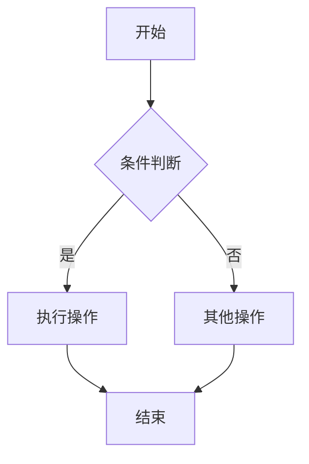

                 

## AIGC在个性化职业发展规划中的创新探索

### 关键词
- AIGC
- 个性化职业发展规划
- 机器学习
- 深度学习
- 自然语言处理

### 摘要
本文将探讨AIGC（AI-Generated Content）在个性化职业发展规划中的创新应用。我们将从背景介绍、核心概念与联系、算法原理讲解、系统分析与架构设计、项目实战和最佳实践与小结等多个方面进行深入探讨，旨在为读者提供一份全面而深刻的理解。

### Step 1: 背景介绍

#### AIGC的基本概念

AIGC，即AI-Generated Content，是指通过人工智能技术生成内容的一种方式。它涵盖了从文本、图像到音频、视频等多种形式的内容生成。AIGC的核心在于利用机器学习和深度学习技术，特别是自然语言处理（NLP）和计算机视觉（CV）技术，实现自动化内容创作。

#### 个性化职业发展规划的重要性

个性化职业发展规划是帮助个人根据自身的兴趣、能力和价值观来规划职业生涯的一种方法。随着社会和科技的发展，职业选择的多样性和变化性越来越大，传统的职业规划方法已经难以满足人们的需求。因此，个性化职业发展规划显得尤为重要。

#### AIGC在职业发展中的潜在应用

AIGC在职业发展中具有广泛的应用前景。例如，通过自然语言处理技术，可以自动生成职业指南、面试建议和简历模板；通过计算机视觉技术，可以分析职业数据，为个人推荐合适的职业路径。

### Step 2: 核心概念与联系

#### AIGC的核心概念

AIGC的核心概念主要包括：

1. **自动写作**：利用机器学习模型，如Transformer、GPT等，自动生成文本内容。
2. **自动翻译**：通过机器学习模型，如Seq2Seq模型，实现文本的自动翻译。
3. **自动生成内容**：包括图像、音频和视频等多种形式的内容生成。

#### 个性化职业发展规划的要素

个性化职业发展规划的核心要素包括：

1. **职业兴趣**：个人的职业兴趣是选择职业方向的重要因素。
2. **职业能力**：个人的职业能力决定了其在职业道路上的可行性和发展潜力。
3. **职业价值观**：个人的职业价值观影响了其职业选择和行为。

#### AIGC与个性化职业发展规划的联系

AIGC与个性化职业发展规划之间的联系主要体现在：

1. **数据收集与处理**：通过AIGC技术，可以自动化地收集和处理大量职业数据，为个性化职业规划提供基础。
2. **内容生成与推荐**：利用AIGC技术，可以自动生成个性化的职业规划内容，如职业推荐、职业发展路径等。

### Step 3: 算法原理讲解

#### AIGC的算法基础

AIGC的算法基础主要包括：

1. **机器学习**：利用已有的数据和模型，通过训练和优化，实现数据的自动分析和处理。
2. **深度学习**：通过多层神经网络，实现数据的自动学习和表征。
3. **自然语言处理**：通过语言模型和语言生成技术，实现文本的自动生成和翻译。

#### 个性化推荐算法原理

个性化推荐算法的核心原理是：

1. **协同过滤**：通过用户行为数据，预测用户对未知项目的评分。
2. **内容推荐**：通过项目特征数据，为用户推荐符合其兴趣的项目。
3. **混合推荐系统**：结合协同过滤和内容推荐，实现更精准的推荐。

#### 数据分析与处理算法

数据分析与处理算法主要包括：

1. **数据清洗**：去除无效和错误的数据，保证数据的准确性和完整性。
2. **数据预处理**：对数据进行标准化、归一化等处理，为后续分析提供基础。
3. **数据可视化**：通过可视化技术，直观展示数据分析和处理结果。

### Step 4: 系统分析与架构设计

#### 职业发展分析系统

职业发展分析系统主要包括以下几个部分：

1. **用户画像**：通过对用户数据的分析，构建用户画像，为个性化推荐提供基础。
2. **职业推荐**：基于用户画像，为用户推荐合适的职业路径。
3. **职业规划**：根据用户的兴趣、能力和价值观，为用户制定个性化的职业规划。

#### 个性化职业规划系统架构

个性化职业规划系统架构主要包括以下几个层次：

1. **数据层**：负责数据的存储和管理。
2. **服务层**：提供用户画像、职业推荐和职业规划等服务。
3. **接口层**：提供与外部系统的接口，实现数据的交换和共享。

#### 系统功能设计与实现

系统功能设计主要包括：

1. **用户注册与登录**：提供用户注册和登录功能。
2. **用户画像构建**：通过数据分析和处理，构建用户画像。
3. **职业推荐**：根据用户画像，为用户推荐合适的职业路径。
4. **职业规划**：根据用户的兴趣、能力和价值观，为用户制定个性化的职业规划。

### Step 5: 项目实战

#### 项目背景

本项目的目标是开发一个基于AIGC的个性化职业发展规划系统，帮助用户更好地规划自己的职业生涯。

#### 系统环境搭建

1. **硬件环境**：服务器、存储设备和网络设备。
2. **软件环境**：操作系统、数据库、Web服务器和开发工具等。

#### 核心代码实现

1. **用户画像构建**：使用Python和Scikit-learn库进行用户画像构建。
2. **职业推荐**：使用协同过滤算法和内容推荐算法进行职业推荐。
3. **职业规划**：根据用户画像和职业推荐结果，为用户制定个性化的职业规划。

#### 项目分析与评估

1. **用户反馈**：通过用户反馈，评估系统效果。
2. **性能评估**：通过性能测试，评估系统性能。
3. **优化与改进**：根据评估结果，对系统进行优化和改进。

### Step 6: 最佳实践与小结

#### 最佳实践

1. **数据收集与处理**：保证数据的质量和完整性。
2. **算法优化**：不断优化算法，提高推荐和规划的准确性。
3. **用户体验**：关注用户体验，提供简洁易用的界面。

#### 小结

AIGC在个性化职业发展规划中具有广泛的应用前景。通过AIGC技术，可以自动化地收集和处理大量职业数据，为个性化职业规划提供基础。同时，AIGC技术也为职业推荐和规划提供了新的解决方案。

#### 注意事项

1. **数据隐私**：在处理用户数据时，必须遵守相关法律法规，保护用户隐私。
2. **算法公平性**：确保算法的公平性和客观性，避免偏见和歧视。

#### 拓展阅读

1. 《AIGC技术原理与应用》
2. 《个性化职业发展规划指南》
3. 《机器学习与深度学习实践》

### 作者

作者：AI天才研究院/AI Genius Institute & 禅与计算机程序设计艺术/Zen And The Art of Computer Programming

----------------------------------------------------------------

### 附录

#### Mermaid 流程图示例

#### LaTeX 公式示例

$$
E = mc^2
$$

$$
1 + 1 = 2
$$

----------------------------------------------------------------

本文旨在为读者提供一份关于AIGC在个性化职业发展规划中的创新探索的全面解读。通过本文的阅读，读者将能够了解AIGC的基本概念、个性化职业发展规划的重要性、算法原理、系统分析与架构设计、项目实战以及最佳实践等内容。希望本文能对读者在职业规划和技术应用方面有所启发和帮助。作者：AI天才研究院/AI Genius Institute & 禅与计算机程序设计艺术/Zen And The Art of Computer Programming。

