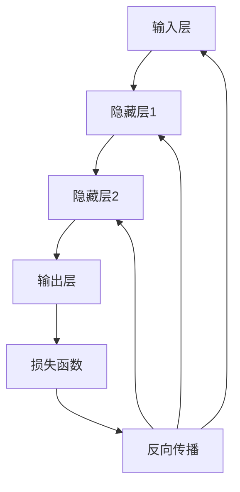
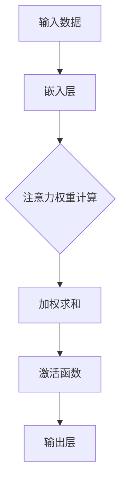
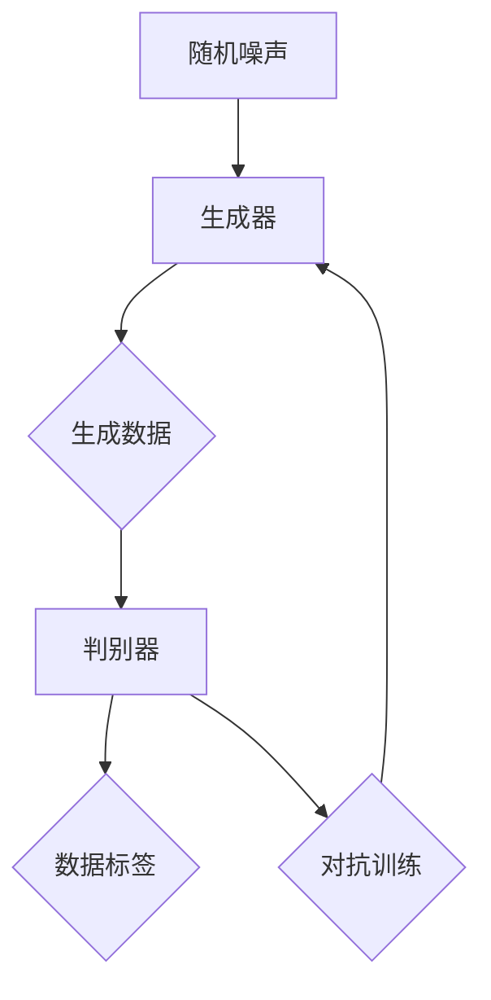

                 

### 第一部分：AIGC与VR疗法设计的背景

#### 第1章：AIGC与VR疗法设计的基本概念

在当今快速发展的科技时代，人工智能（AI）与虚拟现实（VR）技术的结合已经成为一个令人瞩目的趋势。AIGC（AI-Generated Content）作为AI技术的一种重要分支，与VR疗法设计相结合，为个性化医疗提供了新的解决方案。本章将首先介绍AIGC和VR疗法设计的基本概念，探讨它们各自的技术特点和实际应用，并分析AIGC与VR疗法设计的结合背景及其重要性。

##### 1.1.1 AIGC的基本概念与特性

**1.1.1.1 AIGC的定义**

AIGC，即AI-Generated Content，指的是通过人工智能技术自动生成内容的过程。它涵盖了图像生成、文本生成、语音合成等多种形式。AIGC的核心在于利用深度学习模型，尤其是生成对抗网络（GAN）和变分自编码器（VAE）等先进算法，通过大量的数据训练，生成高质量、多样化的内容。

**1.1.1.2 AIGC的技术特点**

- **生成能力强大**：AIGC可以生成各种类型的内容，如图像、音频、视频和文本，满足了多样化、个性化的需求。
- **高质量输出**：通过深度学习训练，AIGC能够生成具有高度逼真度和细节的内容。
- **自动化与高效性**：AIGC技术可以自动完成内容生成过程，大大提高了工作效率，减少了人力成本。

**1.1.1.3 AIGC的发展历程**

- **初步探索**：AIGC的概念最早可以追溯到20世纪80年代，但直到深度学习技术的发展，AIGC才真正开始受到关注。
- **快速发展**：2014年，GAN的出现标志着AIGC进入了一个新的阶段，生成图像和视频的质量有了显著提升。
- **广泛应用**：随着技术的不断成熟，AIGC在多个领域得到了广泛应用，包括艺术创作、游戏开发、广告营销和医疗等。

##### 1.1.2 VR疗法设计的基本概念

**1.1.2.1 VR技术的定义与分类**

VR（Virtual Reality），即虚拟现实，是一种通过计算机技术生成三维模拟环境，使用户在视觉、听觉、触觉等方面感受到沉浸式的体验。根据交互方式和应用场景，VR技术可以分为以下几类：

- **桌面VR**：使用计算机和头戴显示器（HMD）进行交互，适合桌面办公和娱乐。
- **移动VR**：使用智能手机和平板电脑作为显示设备，适合移动使用，如旅游和培训。
- **混合现实（MR）**：结合VR和现实世界，提供更加真实的交互体验。
- **全息VR**：通过全息技术，将虚拟内容呈现为三维全息图像。

**1.1.2.2 VR疗法的设计原则**

VR疗法设计应遵循以下原则：

- **个性化定制**：根据患者的具体需求，设计个性化的VR治疗方案。
- **安全性**：确保VR系统不会对患者产生负面影响，如头晕、恶心等。
- **有效性**：通过科学的方法，验证VR疗法的治疗效果，提高患者的满意度。

**1.1.2.3 VR疗法的发展现状与前景**

- **发展现状**：VR疗法已经在心理治疗、康复训练、疼痛管理等领域取得了显著成果，受到了越来越多患者的青睐。
- **前景展望**：随着技术的不断进步，VR疗法有望在更多疾病的治疗中发挥重要作用，如慢性病管理、手术模拟和训练等。

##### 1.1.3 AIGC与VR疗法设计的结合

**1.1.3.1 结合背景与意义**

AIGC与VR疗法设计的结合，旨在通过人工智能技术提升VR疗法的个性化和有效性。这种结合背景主要有以下几点：

- **个性化治疗需求**：每个患者的身体状况和心理需求都有所不同，AIGC可以根据患者数据生成个性化的VR治疗方案。
- **提高治疗效果**：通过AIGC生成高质量的虚拟环境和互动内容，可以增强患者的沉浸感和参与度，提高治疗的效果。

**1.1.3.2 关键技术分析**

AIGC与VR疗法设计的关键技术主要包括：

- **数据生成与处理**：利用AIGC技术生成患者个性化的虚拟环境，包括场景、声音、动作等。
- **交互设计**：通过智能交互系统，实现患者与虚拟环境之间的自然交互。
- **数据分析与优化**：利用大数据分析技术，对治疗过程和效果进行实时监控和优化。

**1.1.3.3 面临的挑战与机遇**

AIGC与VR疗法设计结合面临的挑战主要有：

- **技术成熟度**：AIGC和VR技术的成熟度参差不齐，需要进一步优化和整合。
- **数据隐私与安全**：患者的数据隐私和安全是重要问题，需要建立严格的保护机制。
- **用户接受度**：提高患者对AIGC和VR疗法的接受度，需要加强宣传和培训。

但同时，这种结合也带来了巨大的机遇：

- **个性化治疗**：通过AIGC生成个性化内容，实现真正的个性化治疗。
- **提高效率**：自动化内容生成可以大大提高治疗过程的效率，减少人力成本。
- **扩展应用**：AIGC和VR疗法的结合可以应用于更多领域，如教育、娱乐和远程医疗等。

通过本章的介绍，我们可以看到AIGC与VR疗法设计在医疗领域具有重要的应用前景。在接下来的章节中，我们将深入探讨AIGC的核心原理与算法，以及如何将这些技术与VR疗法设计相结合，实现个性化、高效的治疗方案。

---

**1.1.1 AIGC的基本概念与特性**

**AIGC的定义**

AIGC（AI-Generated Content），即人工智能生成内容，是一种利用人工智能技术，特别是深度学习和生成模型，自动创建和生成多样化内容的技术。它涵盖图像、文本、音频、视频等多种形式，能够根据训练数据生成高逼真度的内容。AIGC的核心在于利用生成对抗网络（GAN）、变分自编码器（VAE）等先进的深度学习模型，通过大量的数据训练，实现从无到有的内容创作。

**AIGC的技术特点**

1. **生成能力强大**：AIGC能够生成各种类型的内容，如图像、音频、视频和文本，能够满足不同领域的个性化需求。
2. **高质量输出**：通过深度学习模型的训练，AIGC可以生成具有高度逼真度和细节的内容，使得生成的图像、视频和音频几乎难以与真实内容区分。
3. **自动化与高效性**：AIGC技术可以自动完成内容生成过程，减少了人力成本，提高了生产效率。

**AIGC的发展历程**

1. **初步探索**：AIGC的概念最早可以追溯到20世纪80年代，当时的计算机图形学领域就已经开始探索通过算法生成内容的方法。
2. **快速发展**：2012年，Alex Krizhevsky等人在ImageNet图像识别大赛中，利用深度学习模型ResNet取得了突破性的成果，标志着深度学习技术的崛起。随着深度学习技术的发展，AIGC也逐渐受到了关注。
3. **广泛应用**：近年来，随着生成对抗网络（GAN）和变分自编码器（VAE）等生成模型的出现，AIGC在多个领域得到了广泛应用，包括艺术创作、游戏开发、广告营销和医疗等。

**AIGC的技术特点**

- **生成能力强大**：AIGC可以生成各种类型的内容，如图像、音频、视频和文本，满足了多样化、个性化的需求。
- **高质量输出**：通过深度学习训练，AIGC能够生成高质量、多样化的内容。
- **自动化与高效性**：AIGC技术可以自动完成内容生成过程，大大提高了工作效率，减少了人力成本。

**AIGC的发展历程**

- **初步探索**：AIGC的概念最早可以追溯到20世纪80年代，但直到深度学习技术的发展，AIGC才真正开始受到关注。
- **快速发展**：2014年，GAN的出现标志着AIGC进入了一个新的阶段，生成图像和视频的质量有了显著提升。
- **广泛应用**：随着技术的不断成熟，AIGC在多个领域得到了广泛应用，包括艺术创作、游戏开发、广告营销和医疗等。

**1.1.2 VR疗法设计的基本概念**

**VR技术的定义与分类**

虚拟现实（Virtual Reality，VR）是一种通过计算机技术创建的模拟环境，使用户在视觉、听觉、触觉等多个感官上感受到沉浸式的体验。根据不同的应用场景和交互方式，VR技术可以分为以下几类：

1. **桌面VR**：使用计算机和头戴显示器（HMD）进行交互，适合桌面办公和娱乐。
2. **移动VR**：使用智能手机和平板电脑作为显示设备，适合移动使用，如旅游和培训。
3. **混合现实（MR）**：结合VR和现实世界，提供更加真实的交互体验。
4. **全息VR**：通过全息技术，将虚拟内容呈现为三维全息图像。

**VR疗法设计的基本原则**

1. **个性化定制**：根据患者的具体需求，设计个性化的VR治疗方案。
2. **安全性**：确保VR系统不会对患者产生负面影响，如头晕、恶心等。
3. **有效性**：通过科学的方法，验证VR疗法的治疗效果，提高患者的满意度。

**VR疗法设计的发展现状与前景**

1. **发展现状**：VR疗法已经在心理治疗、康复训练、疼痛管理等领域取得了显著成果，受到了越来越多患者的青睐。
2. **前景展望**：随着技术的不断进步，VR疗法有望在更多疾病的治疗中发挥重要作用，如慢性病管理、手术模拟和训练等。

**1.1.3 AIGC与VR疗法设计的结合**

**结合背景与意义**

AIGC与VR疗法设计的结合，旨在通过人工智能技术提升VR疗法的个性化和有效性。这种结合背景主要有以下几点：

- **个性化治疗需求**：每个患者的身体状况和心理需求都有所不同，AIGC可以根据患者数据生成个性化的VR治疗方案。
- **提高治疗效果**：通过AIGC生成高质量的虚拟环境和互动内容，可以增强患者的沉浸感和参与度，提高治疗的效果。

**关键技术分析**

AIGC与VR疗法设计的关键技术主要包括：

- **数据生成与处理**：利用AIGC技术生成患者个性化的虚拟环境，包括场景、声音、动作等。
- **交互设计**：通过智能交互系统，实现患者与虚拟环境之间的自然交互。
- **数据分析与优化**：利用大数据分析技术，对治疗过程和效果进行实时监控和优化。

**面临的挑战与机遇**

AIGC与VR疗法设计结合面临的挑战主要有：

- **技术成熟度**：AIGC和VR技术的成熟度参差不齐，需要进一步优化和整合。
- **数据隐私与安全**：患者的数据隐私和安全是重要问题，需要建立严格的保护机制。
- **用户接受度**：提高患者对AIGC和VR疗法的接受度，需要加强宣传和培训。

但同时，这种结合也带来了巨大的机遇：

- **个性化治疗**：通过AIGC生成个性化内容，实现真正的个性化治疗。
- **提高效率**：自动化内容生成可以大大提高治疗过程的效率，减少人力成本。
- **扩展应用**：AIGC和VR疗法的结合可以应用于更多领域，如教育、娱乐和远程医疗等。

#### 第2章：AIGC核心原理与算法

在深入探讨AIGC（AI-Generated Content）与VR疗法设计结合的过程中，了解AIGC的核心原理与算法至关重要。本章将详细讲解AIGC的核心算法模型结构，包括神经网络基础、注意力机制和对抗生成网络（GAN），并通过具体的算法案例研究，帮助读者更好地理解这些算法在实际应用中的表现和效果。

##### 2.1 AIGC模型结构

AIGC模型的结构通常由三个主要部分组成：数据生成器、判别器和损失函数。以下是这些组成部分的详细描述：

**2.1.1 神经网络基础**

神经网络是AIGC模型的基础，特别是深度学习神经网络。深度学习神经网络由多层神经元组成，每一层神经元都与前一层的神经元相连接，并通过权重和偏置进行调整。

- **输入层**：接收外部输入，如图像、文本或音频。
- **隐藏层**：包含多个层次，每个层次的神经元通过激活函数进行非线性变换。
- **输出层**：生成预期的输出，如生成的图像、文本或音频。

**2.1.2 注意力机制**

注意力机制是一种重要的神经网络设计理念，它能够帮助模型关注输入数据中的关键信息，从而提高模型的生成质量。

- **局部注意力**：模型可以专注于输入数据中的特定区域，从而生成更加细致和精确的内容。
- **全局注意力**：模型可以在整个输入数据中分配注意力，从而生成全局一致的生成内容。

**2.1.3 对抗生成网络（GAN）**

GAN是一种经典的AIGC模型，由生成器和判别器两个神经网络组成，它们相互对抗，共同优化，以生成高质量的生成内容。

- **生成器**：生成器网络的目标是生成尽可能真实的伪数据，以欺骗判别器。
- **判别器**：判别器网络的目标是区分真实数据和生成数据，评估生成器的性能。

##### 2.2 AIGC算法详解

AIGC算法的核心在于如何高效地训练生成器和判别器，以下是对AIGC算法的训练过程和优化方法的详细解释：

**2.2.1 数据预处理**

数据预处理是AIGC算法的第一步，包括数据的清洗、归一化和数据增强等。

- **数据清洗**：去除数据中的噪声和异常值，确保数据质量。
- **数据归一化**：将数据标准化到同一尺度，以便模型能够更好地学习。
- **数据增强**：通过旋转、缩放、裁剪等操作，增加数据多样性，提高模型的泛化能力。

**2.2.2 模型训练与优化**

AIGC算法的训练过程主要分为以下几个步骤：

1. **初始化**：随机初始化生成器和判别器的参数。
2. **生成器训练**：生成器生成伪数据，判别器评估这些伪数据的质量。
3. **判别器训练**：判别器学习区分真实数据和伪数据。
4. **生成器与判别器的迭代训练**：重复上述过程，不断优化生成器和判别器的参数，直到模型收敛。

**2.2.3 模型评估与调整**

模型评估是确保AIGC算法有效性的重要环节。常用的评估指标包括生成质量、多样性、稳定性等。

- **生成质量**：评估生成数据的逼真度和细节。
- **多样性**：评估生成数据的多样性，确保模型能够生成不同类型和风格的内容。
- **稳定性**：评估模型在长时间训练过程中是否稳定，是否出现训练误差过大的情况。

根据评估结果，可以对模型进行调整，包括修改网络结构、调整超参数等，以优化模型性能。

##### 2.3 AIGC算法案例研究

为了更好地理解AIGC算法的实际应用，我们通过几个具体的案例来探讨其在图像生成、文本生成和语音合成中的应用。

**2.3.1 案例一：图像生成**

图像生成是AIGC应用中最常见的场景之一。通过GAN模型，可以生成高质量、多样化的图像。以下是一个简单的图像生成过程：

1. **数据集准备**：收集大量的图像数据，如人脸、风景、动物等。
2. **模型训练**：使用GAN模型训练生成器和判别器，通过多次迭代优化模型参数。
3. **图像生成**：生成器生成伪图像，判别器评估图像质量，不断优化生成过程。
4. **结果展示**：展示生成的图像，评估其质量、多样性和逼真度。

**2.3.2 案例二：文本生成**

文本生成是AIGC在自然语言处理领域的重要应用。通过生成模型，可以自动生成高质量、连贯的文本。以下是一个简单的文本生成过程：

1. **数据集准备**：收集大量的文本数据，如新闻、小说、对话等。
2. **模型训练**：使用生成模型（如变分自编码器）训练生成器，通过多次迭代优化模型参数。
3. **文本生成**：生成器生成伪文本，通过评估文本的连贯性和多样性，不断优化生成过程。
4. **结果展示**：展示生成的文本，评估其质量、连贯性和逻辑性。

**2.3.3 案例三：语音合成**

语音合成是AIGC在音频处理领域的重要应用。通过生成模型，可以自动合成自然、流畅的语音。以下是一个简单的语音合成过程：

1. **数据集准备**：收集大量的语音数据，如音频文件、语音波形等。
2. **模型训练**：使用生成模型（如WaveNet）训练生成器，通过多次迭代优化模型参数。
3. **语音合成**：生成器生成伪语音，通过评估语音的自然度和流畅性，不断优化生成过程。
4. **结果展示**：展示合成的语音，评估其自然度和流畅性。

通过以上案例研究，我们可以看到AIGC算法在图像生成、文本生成和语音合成等领域的广泛应用和卓越性能。在下一章中，我们将探讨如何将AIGC技术应用于VR疗法设计，实现个性化的治疗方案。

#### 第3章：VR疗法设计方案与实现

随着AIGC技术的发展，其在VR疗法设计中的应用逐渐受到关注。本章将详细探讨VR疗法设计方案与实现，从需求分析、设计原则、案例方案设计到系统实现，全面解析AIGC在VR疗法中的实际应用。

##### 3.1 VR疗法设计方案

VR疗法设计的第一步是进行需求分析。需求分析是确保设计方案能够满足患者实际需求的关键步骤。以下是一个典型的需求分析过程：

**需求分析**

1. **患者基本信息**：收集患者的年龄、性别、病情、病史等基本信息。
2. **治疗目标**：明确治疗的主要目标，如康复训练、心理治疗、疼痛管理等。
3. **治疗需求**：了解患者在接受治疗过程中希望获得的体验，如沉浸感、互动性、反馈机制等。

**设计原则**

VR疗法设计应遵循以下原则：

1. **个性化定制**：根据患者的具体需求和病情，设计个性化的VR治疗方案。
2. **安全性**：确保VR系统的安全性和稳定性，避免对患者产生不良影响。
3. **有效性**：通过科学的方法验证VR疗法的治疗效果，提高患者的满意度。
4. **用户体验**：注重患者的用户体验，提供舒适、自然的交互环境。

**案例方案设计**

以慢性疼痛管理为例，一个典型的VR疗法设计方案包括以下几个阶段：

1. **评估阶段**：对患者进行疼痛评估，收集疼痛程度、频率和持续时间等数据。
2. **方案制定**：根据患者的情况，制定个性化的VR疗法方案，包括虚拟环境、互动内容、治疗效果评估等。
3. **实施阶段**：患者使用VR设备，进入虚拟环境，完成预设的治疗任务，如模拟放松、情景引导等。
4. **反馈阶段**：患者完成治疗后，提供反馈，医生根据反馈调整治疗方案。

##### 3.2 VR疗法系统实现

VR疗法系统的实现包括系统架构设计、界面设计与交互、核心功能模块实现等方面。

**系统架构设计**

VR疗法系统架构设计应考虑以下几个方面：

1. **硬件架构**：确定VR设备的类型和配置，如头戴显示器、手柄、传感器等。
2. **软件架构**：设计系统的软件架构，包括前端、后端和数据库等。
3. **网络架构**：设计系统的网络架构，确保数据的传输和交互。

**界面设计与交互**

界面设计是VR疗法系统的重要组成部分，应考虑以下几个方面：

1. **用户界面**：设计简洁、直观的用户界面，方便患者使用。
2. **交互设计**：设计自然、流畅的交互方式，如手势、语音等。
3. **反馈机制**：设计实时反馈机制，帮助患者了解治疗效果。

**核心功能模块实现**

VR疗法系统的核心功能模块包括：

1. **虚拟环境生成**：使用AIGC技术生成个性化的虚拟环境，如放松场景、训练场景等。
2. **互动内容生成**：使用AIGC技术生成互动内容，如虚拟角色、互动任务等。
3. **治疗效果评估**：设计治疗效果评估模块，通过数据分析和算法模型，评估治疗效果。
4. **用户管理**：设计用户管理模块，包括用户注册、登录、个人信息管理等。

##### 3.3 VR疗法效果评估

VR疗法效果评估是确保疗法有效性的重要环节。以下是一个典型的效果评估过程：

1. **指标设置**：根据治疗目标，设置评估指标，如疼痛程度、治疗满意度、康复进度等。
2. **数据收集**：收集患者在治疗过程中的数据，如疼痛评分、活动记录、反馈信息等。
3. **数据分析**：使用数据分析方法，对收集到的数据进行处理和分析，评估治疗的效果。
4. **结果反馈**：将评估结果反馈给患者和医生，为治疗方案的调整提供依据。

通过本章的讨论，我们可以看到AIGC在VR疗法设计中的应用前景广阔。在下一章中，我们将深入探讨如何通过AIGC技术实现个性化虚拟现实治疗方案设计，进一步提高疗法的有效性。

---

**3.1 VR疗法设计方案**

**需求分析**

需求分析是制定VR疗法方案的第一步，旨在全面了解患者的具体情况，包括个人病史、治疗目标、偏好等。以下是需求分析的具体步骤：

1. **患者基本信息收集**：包括年龄、性别、病情、生活习惯等基本信息，这些数据有助于了解患者的整体健康状况。

2. **治疗目标明确**：明确患者希望通过VR疗法实现的目标，如缓解疼痛、提高康复速度、改善心理状态等。这些目标将直接影响疗法的具体设计和实施。

3. **偏好与需求**：了解患者对于治疗方式的偏好，如对虚拟环境、互动形式、时间安排等的需求。个性化的偏好可以提升患者的治疗体验和参与度。

**设计原则**

VR疗法方案设计应遵循以下原则：

1. **个性化定制**：根据患者的具体情况和需求，设计个性化的VR疗法方案，确保每个患者都能获得最适合自己的治疗方案。

2. **安全性优先**：确保VR系统的稳定性和安全性，避免患者在使用过程中出现不适或伤害。这包括硬件设备的可靠性、软件系统的稳定性和数据的安全保护。

3. **有效性验证**：通过科学的方法验证VR疗法的有效性，包括临床试验、患者反馈、数据统计等。确保疗法能够真正改善患者的健康状况。

4. **用户体验**：注重患者的治疗体验，设计易于使用、互动性强的VR系统，提升患者的满意度和参与度。

**案例方案设计**

以下是一个针对慢性疼痛管理的VR疗法案例方案设计：

1. **评估阶段**：
   - 患者接受全面的疼痛评估，包括疼痛程度、频率、持续时间等。
   - 收集患者的基本信息和病史，确保疗法的个性化定制。

2. **方案制定**：
   - 设计个性化的VR疗法方案，包括虚拟环境（如放松的沙滩场景）、互动内容（如与虚拟导诊人员的对话）和治疗流程。
   - 根据患者的疼痛程度和治疗方案，设定合适的时间安排和频率。

3. **实施阶段**：
   - 患者佩戴VR设备，进入虚拟环境，按照预设的流程进行互动和训练。
   - 在治疗过程中，系统实时收集患者的生理数据（如心率、呼吸频率）和反馈信息。

4. **反馈阶段**：
   - 患者完成每次治疗后，提供反馈，包括疼痛缓解情况、治疗满意度等。
   - 医生根据患者的反馈和治疗数据，调整治疗方案，确保治疗效果的最大化。

通过上述案例，我们可以看到VR疗法设计方案的关键步骤和设计原则，以及如何通过个性化的方案实现有效的治疗。

**3.2 VR疗法系统实现**

**系统架构设计**

VR疗法系统的架构设计是确保系统功能完整、稳定运行的基础。以下是系统架构设计的具体步骤：

1. **硬件架构设计**：
   - 确定VR设备的类型和配置，如头戴显示器（HMD）、手柄、传感器等。
   - 考虑硬件的兼容性和扩展性，确保系统能够适应不同类型和需求的VR设备。

2. **软件架构设计**：
   - 设计系统的软件架构，包括前端、后端和数据库。
   - 前端负责用户交互，包括界面设计、交互逻辑等。
   - 后端负责数据处理、存储和业务逻辑处理。
   - 数据库用于存储患者的信息、治疗数据和系统设置。

3. **网络架构设计**：
   - 设计系统的网络架构，包括数据传输、同步和通信。
   - 确保数据的传输速度和稳定性，支持实时交互和数据处理。

**界面设计与交互**

界面设计与交互是提升患者体验的关键。以下是界面设计与交互的具体步骤：

1. **用户界面设计**：
   - 设计简洁、直观的用户界面，确保患者能够快速上手。
   - 使用大字体、清晰图标和直观的导航，减少患者的学习成本。

2. **交互设计**：
   - 设计自然、流畅的交互方式，如手势控制、语音命令等。
   - 考虑患者的身体条件和操作习惯，确保交互方式的易用性和舒适性。

3. **反馈机制设计**：
   - 设计实时反馈机制，帮助患者了解自己的治疗进展和效果。
   - 通过动画、声音和文字提示，提供明确的反馈，增强患者的治疗信心。

**核心功能模块实现**

VR疗法系统的核心功能模块包括以下几个部分：

1. **虚拟环境生成**：
   - 使用AIGC技术生成个性化的虚拟环境，如放松的场景、训练的空间等。
   - 考虑场景的细节和逼真度，提升患者的沉浸感。

2. **互动内容生成**：
   - 使用AIGC技术生成互动内容，如虚拟角色、互动任务等。
   - 设计多种互动形式，提高患者的参与度和兴趣。

3. **治疗效果评估**：
   - 设计治疗效果评估模块，通过数据分析和算法模型，实时评估治疗效果。
   - 收集患者的生理数据和反馈信息，提供详细的评估报告。

4. **用户管理**：
   - 设计用户管理模块，包括用户注册、登录、个人信息管理等功能。
   - 确保用户数据的安全和保护，遵循隐私保护法规。

通过上述系统架构设计、界面设计与交互、核心功能模块实现，VR疗法系统可以提供个性化和有效的治疗方案，为患者带来全新的治疗体验。

**3.3 VR疗法效果评估**

VR疗法效果评估是确保疗法有效性和安全性的重要环节。以下是一个典型的效果评估过程：

1. **指标设置**：
   - 根据治疗目标，设置评估指标，如疼痛程度、治疗满意度、康复进度等。
   - 确保评估指标的全面性和科学性，能够准确反映疗法的实际效果。

2. **数据收集**：
   - 收集患者在治疗过程中的数据，如疼痛评分、活动记录、反馈信息等。
   - 使用多种数据收集方式，包括问卷调查、生理数据监测、治疗记录等。

3. **数据分析**：
   - 使用数据分析方法，对收集到的数据进行处理和分析，评估治疗的效果。
   - 应用统计分析和机器学习算法，分析数据之间的关系，识别治疗的关键因素。

4. **结果反馈**：
   - 将评估结果反馈给患者和医生，为治疗方案的调整提供依据。
   - 通过详细的分析报告，帮助医生和患者了解疗法的实际效果，优化治疗方案。

通过上述效果评估过程，可以确保VR疗法的设计和实施符合患者的实际需求，提升治疗的有效性和安全性。

#### 第4章：个性化虚拟现实治疗方案设计

个性化医疗已成为现代医疗领域的热点，通过精确匹配患者的个体差异，实现最佳的治疗效果。在虚拟现实（VR）疗法设计中，AIGC（AI-Generated Content）技术以其强大的生成能力和个性化定制能力，为个性化治疗方案的设计提供了有力支持。本章将详细探讨个性化虚拟现实治疗方案的需求与挑战，以及AIGC技术在其中的具体应用。

##### 4.1 个性化治疗的需求与挑战

**个性化治疗的需求**

1. **个体差异**：患者的年龄、性别、病史、心理状态等因素存在显著差异，传统统一的治疗方案难以满足每个患者的需求。
2. **精准治疗**：个性化治疗能够根据患者的具体病情，制定最合适的治疗方案，提高治疗效果。
3. **患者参与度**：个性化治疗方案能够增强患者的参与感和依从性，提高治疗的成功率。

**个性化治疗的挑战**

1. **数据隐私与安全**：个性化治疗需要收集和存储大量的患者数据，数据隐私和安全成为关键挑战。
2. **治疗成本**：个性化治疗方案的制定和实施成本较高，需要考虑成本效益。
3. **技术成熟度**：虽然AIGC技术在图像、文本、音频等领域取得了显著成果，但在医疗领域的应用仍需进一步优化和验证。

##### 4.2 AIGC在个性化治疗中的应用

**AIGC与个性化治疗的结合点**

AIGC在个性化治疗中的应用主要体现在以下几个方面：

1. **个性化内容生成**：通过AIGC技术，可以生成符合患者需求和病情的个性化虚拟环境和互动内容，提升治疗的沉浸感和有效性。
2. **个性化诊断**：利用AIGC技术，可以对患者的生理数据进行分析，辅助医生进行个性化诊断。
3. **个性化治疗方案制定**：通过AIGC技术，可以生成针对不同患者的个性化治疗方案，提高治疗的精准性和效果。

**应用案例分析**

以下是一个基于AIGC技术的个性化VR治疗方案的应用案例：

**案例一：慢性疼痛管理**

1. **需求分析**：患者为50岁的男性，患有慢性背部疼痛，经过药物治疗效果不佳，希望尝试VR疗法。
2. **方案设计**：使用AIGC技术生成一个虚拟的放松场景，如海滨沙滩，患者可以通过VR设备进入这个场景。
3. **实施过程**：
   - 患者佩戴VR设备，进入虚拟场景。
   - 系统根据患者的生理数据（如心率、呼吸频率）调整场景中的声音、光线等元素，帮助患者放松。
   - 患者在虚拟场景中完成一系列放松任务，如沙滩散步、冥想等。
4. **效果评估**：通过患者的自我评估和医生的临床观察，发现VR疗法显著缓解了患者的疼痛，提高了生活质量。

**实施步骤**

1. **数据收集**：收集患者的个人信息、病史、生理数据等，确保数据的完整性和准确性。
2. **个性化内容生成**：使用AIGC技术生成个性化的虚拟环境和互动内容，如放松场景、互动任务等。
3. **交互设计**：设计自然、流畅的交互方式，如手势控制、语音命令等，提升患者的使用体验。
4. **系统实现**：实现VR疗法系统，包括虚拟环境生成、互动内容生成、效果评估等功能。
5. **效果评估与优化**：通过患者的反馈和临床数据，评估治疗的效果，根据反馈优化治疗方案。

通过以上案例，我们可以看到AIGC技术在个性化虚拟现实治疗方案设计中的应用前景。在下一章中，我们将进一步探讨AIGC在VR疗法中的创新应用，为个性化治疗提供更多可能。

##### 4.1 个性化治疗的需求与挑战

**个性化治疗的需求**

在个性化医疗的背景下，个性化治疗的需求日益凸显，主要体现在以下几个方面：

1. **个体差异**：患者的年龄、性别、基因、生活习惯和病情等个体差异显著，传统统一的治疗方案难以满足每个患者的具体需求。因此，个性化治疗能够根据患者的特定特征，制定更符合其健康状况的治疗方案，提高疗效。

2. **精准治疗**：个性化治疗通过精准诊断和精确治疗，使医疗资源得到更合理的配置。利用现代生物技术和大数据分析，个性化治疗可以更准确地识别疾病的根本原因，并针对性地进行治疗，从而提高治愈率和减少复发率。

3. **患者参与度**：个性化治疗注重患者的参与和依从性。通过个性化治疗方案，患者能够更好地了解自己的健康状况和治疗方案，提高治疗的自觉性和配合度，从而增强治疗效果。

**个性化治疗的挑战**

尽管个性化治疗具有显著优势，但在实际应用中仍面临以下挑战：

1. **数据隐私与安全**：个性化治疗需要收集和存储大量的患者数据，包括基因组信息、医疗记录、生理指标等。这些数据的安全性和隐私保护成为关键挑战，需要建立严格的数据保护机制，确保患者数据不被泄露。

2. **治疗成本**：个性化治疗涉及大量的诊断、检测和定制化的治疗方案，成本较高。如何在保证疗效的同时，降低治疗成本，提高性价比，是实施个性化治疗的重要课题。

3. **技术成熟度**：虽然个性化治疗的理论基础和部分技术已经相对成熟，但实际应用中仍面临技术难题。例如，AIGC（AI-Generated Content）技术在医疗领域的应用仍需进一步优化和验证，确保其生成的内容和治疗方案的有效性和安全性。

**个性化治疗的基本原则**

为了实现有效的个性化治疗，需要遵循以下基本原则：

1. **全面数据收集**：通过多种途径收集患者的个人信息、病史、基因信息、生理指标等，确保数据的全面性和准确性。

2. **精准诊断**：利用先进的诊断技术，如基因组测序、影像学检查等，对患者的病情进行精准诊断，为个性化治疗提供科学依据。

3. **定制化方案**：根据患者的具体病情和个体差异，制定个性化的治疗方案。治疗方案应包括药物治疗、手术治疗、心理干预等，确保全方位的治疗。

4. **持续监测与反馈**：在治疗过程中，持续监测患者的治疗效果和生理指标，根据反馈及时调整治疗方案，确保治疗的有效性和安全性。

5. **患者参与**：提高患者的参与度，使其能够了解自己的病情和治疗方案，积极参与治疗过程，提高治疗的依从性和效果。

##### 4.2 AIGC在个性化治疗中的应用

**AIGC与个性化治疗的结合点**

AIGC（AI-Generated Content）技术在个性化治疗中的应用主要体现在以下几个方面：

1. **个性化内容生成**：AIGC技术可以根据患者的特定需求和病情，生成个性化的虚拟环境和互动内容，如放松场景、训练任务等。这些内容能够提升患者的治疗体验，增强其参与感和依从性。

2. **个性化诊断辅助**：AIGC技术可以分析大量的医学数据，生成有助于诊断的图像、文本和音频等，辅助医生进行精准诊断。例如，通过生成患者的三维图像，医生可以更直观地了解患者的病情，制定更精准的治疗方案。

3. **个性化治疗方案制定**：基于AIGC技术，可以为不同患者生成个性化的治疗方案。例如，根据患者的基因信息、病史和生理指标，AIGC技术可以生成针对特定患者的药物组合、手术方案等，提高治疗的精准性和有效性。

**应用案例分析**

以下是一个基于AIGC技术的个性化VR治疗方案的应用案例：

**案例一：慢性疼痛管理**

**需求分析**：患者为45岁的女性，患有慢性肩周炎，经过药物治疗和物理治疗，效果不佳，希望尝试VR疗法。

**方案设计**：
1. **数据收集**：收集患者的肩部影像、生理数据（如疼痛评分、关节活动度）和病史等。
2. **个性化内容生成**：使用AIGC技术生成一个符合患者病情的虚拟训练场景，如一个宽敞的健身房。场景中包括虚拟教练和训练器材，虚拟教练根据患者的疼痛程度和活动能力，提供个性化的训练指导。
3. **交互设计**：设计自然、流畅的交互方式，如手势控制、语音命令等，患者可以通过这些方式与虚拟环境互动。

**实施过程**：
1. **患者佩戴VR设备，进入虚拟场景**。
2. **虚拟教练根据患者的生理数据和疼痛评分，制定个性化的训练计划**。
3. **患者在虚拟场景中完成训练任务，如伸展、旋转等运动**。
4. **系统实时收集患者的训练数据，反馈给医生和患者，以调整训练计划**。

**效果评估**：
1. **通过患者的自我评估和医生的临床观察，发现VR疗法显著缓解了患者的疼痛，提高了生活质量**。
2. **数据统计显示，患者在治疗期间，关节活动度显著提高，疼痛评分明显下降**。

**实施步骤**

1. **数据收集**：收集患者的个人信息、病史、生理数据等，确保数据的完整性和准确性。
2. **个性化内容生成**：使用AIGC技术生成个性化的虚拟环境和互动内容，如放松场景、训练任务等。
3. **交互设计**：设计自然、流畅的交互方式，如手势控制、语音命令等，提升患者的使用体验。
4. **系统实现**：实现VR疗法系统，包括虚拟环境生成、互动内容生成、效果评估等功能。
5. **效果评估与优化**：通过患者的反馈和临床数据，评估治疗的效果，根据反馈优化治疗方案。

通过以上案例，我们可以看到AIGC技术在个性化虚拟现实治疗方案设计中的应用前景。AIGC技术的引入，不仅提高了治疗的个性化和有效性，还为患者带来了全新的治疗体验。在下一章中，我们将进一步探讨AIGC在VR疗法中的创新应用，为个性化治疗提供更多可能性。

#### 第5章：AIGC在VR疗法中的创新

随着AIGC（AI-Generated Content）技术的不断发展，其在虚拟现实（VR）疗法中的应用也日益成熟。AIGC不仅提高了VR疗法的个性化和有效性，还带来了一系列创新应用，使得VR疗法在病情预测、治疗效果评估和治疗方案优化等方面取得了显著进展。本章将深入探讨AIGC在VR疗法中的创新应用，详细分析深度学习、虚拟现实与增强现实技术的结合，以及人工智能辅助诊断的实际案例。

##### 5.1 AIGC在VR疗法中的创新应用

**病情预测**

AIGC技术在病情预测方面具有显著优势。通过分析大量的医疗数据，AIGC可以生成预测模型，预测患者的病情发展趋势。具体应用如下：

1. **数据采集与预处理**：收集患者的病史、生理指标、治疗记录等数据，进行预处理，如数据清洗、归一化等。
2. **模型训练**：利用深度学习算法，如循环神经网络（RNN）和卷积神经网络（CNN），对预处理后的数据进行训练，生成预测模型。
3. **病情预测**：将新的患者数据输入预测模型，预测其病情的发展趋势和可能的风险，为医生提供决策依据。

**治疗效果评估**

AIGC技术可以自动生成评估模型，对VR疗法的治疗效果进行实时评估。这种方法不仅提高了评估的准确性，还减少了人工干预，提高了效率。具体步骤如下：

1. **数据收集**：收集患者在接受VR疗法过程中的数据，如生理指标、心理指标、治疗反馈等。
2. **模型训练**：使用生成对抗网络（GAN）等技术，训练评估模型，使其能够识别和评估治疗效果。
3. **效果评估**：将治疗过程中的数据输入评估模型，实时分析治疗效果，为医生提供评估结果，指导治疗方案的调整。

**治疗方案优化**

AIGC技术可以根据患者的实时数据，动态优化治疗方案，提高治疗效果。这种优化方法不仅考虑了患者的病情和需求，还考虑了治疗过程中的反馈和调整。具体步骤如下：

1. **数据收集**：收集患者在接受VR疗法过程中的实时数据，包括生理指标、心理指标、治疗反馈等。
2. **模型训练**：使用机器学习算法，如强化学习（RL），训练优化模型，使其能够根据患者数据动态调整治疗方案。
3. **方案优化**：将患者数据输入优化模型，动态调整治疗方案，提高治疗效果。

##### 5.2 创新技术详解

**深度学习在VR疗法中的应用**

深度学习是AIGC技术的核心，其在VR疗法中的应用主要体现在以下几个方面：

1. **图像处理**：通过卷积神经网络（CNN），深度学习可以自动提取图像中的关键特征，用于病情分析和治疗决策。
2. **语音识别**：使用循环神经网络（RNN）和长短期记忆网络（LSTM），深度学习可以准确识别语音信号，实现语音控制交互。
3. **自然语言处理**：利用深度学习模型，如Transformer，可以处理和生成自然语言文本，用于虚拟环境的交互和反馈。

**虚拟现实与增强现实技术的结合**

虚拟现实（VR）和增强现实（AR）技术的结合，为VR疗法提供了更加丰富的应用场景。具体应用如下：

1. **沉浸式体验**：通过VR技术，用户可以完全沉浸在一个虚拟环境中，实现高度沉浸的治疗体验。
2. **现实增强**：通过AR技术，虚拟元素可以叠加在现实环境中，实现与现实世界的交互，为治疗提供更多的可能性。
3. **混合现实**：结合VR和AR技术，可以创建一个混合的现实环境，为医生和患者提供更为直观和有效的治疗体验。

**人工智能辅助诊断**

人工智能辅助诊断是AIGC技术在医疗领域的又一重要应用。通过深度学习模型，人工智能可以辅助医生进行诊断，提高诊断的准确性和效率。具体应用如下：

1. **影像分析**：通过深度学习算法，对医学影像（如X光、CT、MRI）进行分析，识别病变区域，提高诊断准确率。
2. **病理分析**：利用深度学习模型，对病理样本进行分析，识别病理特征，辅助医生进行诊断。
3. **症状分析**：通过自然语言处理技术，分析患者的症状描述，辅助医生制定治疗方案。

##### 5.3 创新案例分享

**案例一：康复训练**

通过AIGC技术，可以为患者设计个性化的康复训练方案。具体应用如下：

1. **需求分析**：收集患者的康复需求和病情数据，包括活动能力、疼痛程度等。
2. **内容生成**：使用AIGC技术生成个性化的康复训练内容，如虚拟跑步机、虚拟瑜伽等。
3. **实时评估**：通过传感器和深度学习模型，实时监测患者的运动情况，评估康复效果。
4. **反馈优化**：根据患者的运动数据和反馈，动态调整康复方案，提高康复效果。

**案例二：心理治疗**

AIGC技术在心理治疗中的应用，为患者提供了高度沉浸和个性化的治疗体验。具体应用如下：

1. **需求分析**：收集患者的心理状况和病情数据，包括焦虑程度、抑郁程度等。
2. **内容生成**：使用AIGC技术生成个性化的心理治疗场景，如虚拟咨询师、虚拟放松场景等。
3. **实时交互**：通过语音识别和自然语言处理技术，实现患者与虚拟咨询师的实时互动。
4. **效果评估**：通过患者的反馈和生理数据，实时评估治疗效果，为医生提供治疗依据。

**案例三：疼痛管理**

AIGC技术在疼痛管理中的应用，为患者提供了有效、个性化的疼痛缓解方案。具体应用如下：

1. **需求分析**：收集患者的疼痛程度、疼痛类型和病史等数据。
2. **内容生成**：使用AIGC技术生成个性化的疼痛缓解场景，如虚拟放松、虚拟按摩等。
3. **实时反馈**：通过患者的生理数据（如心率、呼吸频率）和反馈，实时调整治疗方案。
4. **效果评估**：通过患者的自我评估和医生的临床观察，评估疼痛缓解效果，优化治疗方案。

通过以上案例，我们可以看到AIGC技术在VR疗法中的创新应用，不仅提高了治疗的个性化和有效性，还为医疗领域带来了全新的治疗模式。在下一章中，我们将探讨AIGC与VR疗法设计的前景与挑战，为未来的发展提供思考。

##### 5.1 AIGC在VR疗法中的创新应用

**病情预测**

AIGC技术在病情预测方面具有显著优势，通过分析大量医疗数据，可以生成预测模型，帮助医生预测患者的病情发展趋势。以下是病情预测的具体应用步骤：

1. **数据采集**：收集患者的医疗记录、生理指标、病史等数据。这些数据包括但不限于电子健康记录、实验室检测结果、影像学数据等。
   
2. **数据预处理**：对采集到的数据进行清洗和标准化处理，去除异常值和噪声，将数据转换为适合模型训练的格式。

3. **特征提取**：利用深度学习算法，如卷积神经网络（CNN）或长短期记忆网络（LSTM），自动提取数据中的关键特征。这些特征有助于模型理解和预测病情的发展。

4. **模型训练**：使用提取的特征训练预测模型，如回归模型或分类模型。在训练过程中，模型会学习如何根据历史数据预测未来的病情变化。

5. **预测**：将新的患者数据输入训练好的模型，预测其病情的发展趋势，如疾病的复发可能性、病情的恶化程度等。

**治疗效果评估**

AIGC技术可以自动生成评估模型，对VR疗法的治疗效果进行实时评估。这种方法不仅提高了评估的准确性，还减少了人工干预，提高了效率。以下是治疗效果评估的具体应用步骤：

1. **数据收集**：收集患者在接受VR疗法过程中的数据，包括生理指标（如心率、血压、呼吸频率）、心理指标（如焦虑、抑郁程度）、治疗反馈等。

2. **数据预处理**：对收集到的数据进行分析和处理，如归一化、特征提取等，为模型训练做准备。

3. **模型训练**：使用生成对抗网络（GAN）或其他深度学习算法，训练评估模型。模型会学习如何根据输入数据评估治疗效果，如疼痛缓解程度、康复进度等。

4. **效果评估**：将患者接受治疗过程中的数据输入训练好的评估模型，实时分析治疗效果，为医生提供评估结果。

5. **反馈调整**：根据评估结果，医生可以调整治疗方案，优化治疗效果。

**治疗方案优化**

AIGC技术可以根据患者的实时数据，动态优化治疗方案，提高治疗效果。这种优化方法不仅考虑了患者的病情和需求，还考虑了治疗过程中的反馈和调整。以下是治疗方案优化的具体应用步骤：

1. **数据收集**：收集患者在接受VR疗法过程中的实时数据，包括生理指标、心理指标、治疗反馈等。

2. **模型训练**：使用机器学习算法，如强化学习（RL）或深度强化学习（DRL），训练优化模型。模型会学习如何根据患者数据动态调整治疗方案。

3. **方案优化**：将患者数据输入优化模型，动态调整治疗方案。模型会根据治疗过程中收集到的反馈数据，不断优化治疗方案。

4. **效果评估**：将优化后的治疗方案应用于患者，通过实时监测和反馈，评估治疗效果，确保治疗方案的有效性。

通过上述创新应用，AIGC技术在VR疗法中发挥了重要作用，不仅提高了治疗的个性化和有效性，还为医疗领域带来了新的可能性。

##### 5.2 创新技术详解

**深度学习在VR疗法中的应用**

深度学习作为AIGC技术的重要组成部分，在VR疗法中有着广泛的应用。以下是深度学习在VR疗法中的一些具体应用：

1. **图像处理**：深度学习算法，如卷积神经网络（CNN），能够自动提取图像中的关键特征，应用于病情分析和治疗决策。例如，在医学影像中，CNN可以用于检测病变区域，提高诊断的准确性。

2. **语音识别**：循环神经网络（RNN）和长短期记忆网络（LSTM）等深度学习模型，能够准确识别语音信号，实现语音控制交互。这为患者提供了更为自然和直观的交互方式，提升了VR疗法的用户体验。

3. **自然语言处理**：Transformer等先进的深度学习模型，能够处理和生成自然语言文本，用于虚拟环境的交互和反馈。例如，通过自然语言处理，虚拟咨询师可以与患者进行实时对话，提供个性化的治疗建议。

**虚拟现实与增强现实技术的结合**

虚拟现实（VR）和增强现实（AR）技术的结合，为VR疗法提供了更加丰富的应用场景。以下是这两种技术的结合在VR疗法中的具体应用：

1. **沉浸式体验**：通过VR技术，患者可以完全沉浸在一个虚拟环境中，实现高度沉浸的治疗体验。这种沉浸感有助于缓解患者的焦虑和压力，提高治疗的参与度和效果。

2. **现实增强**：通过AR技术，虚拟元素可以叠加在现实环境中，实现与现实世界的交互。例如，在康复训练中，AR技术可以用于实时显示患者的运动轨迹和训练进度，帮助患者更好地进行康复训练。

3. **混合现实**：混合现实（MR）技术结合了VR和AR的优势，为医生和患者提供更为直观和有效的治疗体验。例如，医生可以通过MR设备查看患者的三维解剖结构，进行更加精准的诊断和手术规划。

**人工智能辅助诊断**

人工智能辅助诊断是AIGC技术在医疗领域的重要应用。以下是人工智能辅助诊断在VR疗法中的具体应用：

1. **影像分析**：通过深度学习模型，人工智能可以自动分析医学影像，如X光、CT、MRI等，识别病变区域，提高诊断的准确性。这种技术在癌症筛查、骨折诊断等领域有着广泛应用。

2. **病理分析**：利用深度学习模型，人工智能可以分析病理样本，识别病理特征，辅助医生进行诊断。这种方法可以显著提高病理诊断的准确性和效率。

3. **症状分析**：通过自然语言处理技术，人工智能可以分析患者的症状描述，提供诊断建议。例如，在心理治疗中，人工智能可以分析患者的对话内容，识别潜在的心理问题，为医生提供诊断依据。

通过上述创新技术的应用，AIGC技术不仅提高了VR疗法的个性化和有效性，还为医疗领域带来了新的发展机遇。在下一章中，我们将进一步探讨AIGC与VR疗法设计的前景与挑战，为未来的发展提供深入思考。

##### 5.3 创新案例分享

**案例一：康复训练**

在康复训练中，AIGC技术通过生成个性化的训练方案，显著提高了患者的康复效果。具体实施步骤如下：

1. **需求分析**：首先，收集患者的康复需求和病情数据，如受伤程度、活动能力、疼痛程度等。

2. **内容生成**：使用AIGC技术生成个性化的康复训练内容，例如模拟跑步、瑜伽等。这些内容可以根据患者的身体状况和需求进行调整，使其更加适合患者的康复过程。

3. **实时反馈**：通过传感器和深度学习模型，实时监测患者的运动情况，收集数据并反馈给医生和患者。这些数据包括运动轨迹、心率、呼吸频率等，帮助医生和患者了解康复进展。

4. **反馈优化**：根据患者的反馈和运动数据，动态调整训练方案，提高康复效果。例如，如果患者的疼痛程度增加，系统可以减少训练强度或提供放松指导。

**案例二：心理治疗**

AIGC技术在心理治疗中的应用，为患者提供了高度沉浸和个性化的治疗体验。以下是具体实施步骤：

1. **需求分析**：收集患者的心理状况和病情数据，如焦虑程度、抑郁程度、治疗需求等。

2. **内容生成**：使用AIGC技术生成个性化的心理治疗场景，例如虚拟咨询师、放松场景等。这些场景可以根据患者的心理状态进行调整，使其更加舒适和有效。

3. **实时交互**：通过语音识别和自然语言处理技术，实现患者与虚拟咨询师的实时互动。患者可以与虚拟咨询师进行对话，表达自己的情感和困惑，获取专业的治疗建议。

4. **效果评估**：通过患者的反馈和生理数据（如心率、血压等），实时评估治疗效果。医生可以根据评估结果调整治疗方案，提高治疗的有效性。

**案例三：疼痛管理**

在疼痛管理中，AIGC技术通过生成个性化的疼痛缓解方案，显著改善了患者的疼痛程度和生活质量。以下是具体实施步骤：

1. **需求分析**：收集患者的疼痛程度、疼痛类型、病史等数据。

2. **内容生成**：使用AIGC技术生成个性化的疼痛缓解场景，如虚拟按摩、放松训练等。这些场景可以根据患者的疼痛程度和需求进行调整，使其更加适合患者的治疗过程。

3. **实时反馈**：通过传感器和深度学习模型，实时监测患者的生理数据，如心率、呼吸频率等，收集数据并反馈给医生和患者。

4. **反馈优化**：根据患者的反馈和生理数据，动态调整疼痛缓解方案，提高疼痛缓解效果。例如，如果患者的疼痛程度减轻，系统可以增加放松时间或提供更强烈的按摩。

通过以上案例，我们可以看到AIGC技术在VR疗法中的创新应用，不仅提高了治疗的个性化和有效性，还为医疗领域带来了新的发展机遇。在下一章中，我们将进一步探讨AIGC与VR疗法设计的前景与挑战，为未来的发展提供深入思考。

#### 第6章：AIGC与VR疗法设计的前景与挑战

随着AIGC（AI-Generated Content）技术与VR（Virtual Reality）疗法的不断融合，这种新兴技术为个性化医疗带来了新的可能性。本章将深入探讨AIGC与VR疗法设计的前景，同时分析面临的技术、安全和法规等方面的挑战，并提出相应的对策。

##### 6.1 技术发展趋势

**AIGC技术的演进**

AIGC技术正朝着更高效、更智能的方向发展。未来的发展趋势主要包括：

1. **算法优化**：深度学习算法，特别是生成对抗网络（GAN）和变分自编码器（VAE）等模型，将继续优化，提高生成内容的质量和多样性。

2. **多模态融合**：AIGC技术将实现多模态内容的生成，如结合图像、文本、音频、视频等多种数据类型，提供更加丰富和个性化的虚拟体验。

3. **实时生成**：随着计算能力的提升，AIGC技术的实时生成能力将得到显著增强，可以实现实时互动和动态调整，提高治疗的即时性和有效性。

**VR疗法技术的演进**

VR疗法技术也在不断进步，未来的发展趋势包括：

1. **沉浸式体验**：通过更先进的VR设备和显示技术，提供更加真实和沉浸式的虚拟环境，增强患者的参与感和治疗效果。

2. **个性化定制**：结合AIGC技术，VR疗法将能够根据患者的具体需求，生成个性化的虚拟内容和互动方案，提高治疗的个性化水平。

3. **智能化互动**：利用自然语言处理和计算机视觉技术，实现患者与虚拟环境之间的自然互动，提高治疗的互动性和用户满意度。

**结合趋势分析**

AIGC与VR疗法设计的结合趋势主要体现在以下几个方面：

1. **个性化治疗**：通过AIGC技术，可以生成符合患者需求的个性化虚拟环境和互动内容，实现真正的个性化治疗。

2. **实时评估与调整**：结合AIGC技术和VR疗法，可以实现实时治疗效果评估和动态调整，提高治疗的即时性和有效性。

3. **多学科融合**：AIGC与VR疗法设计结合，不仅可以应用于医疗领域，还可以拓展到教育、娱乐、康复等领域，实现跨领域应用。

##### 6.2 应用前景展望

**医疗领域的潜在应用**

AIGC与VR疗法设计在医疗领域的应用前景广阔，主要包括：

1. **康复训练**：通过个性化的虚拟康复训练方案，帮助患者提高康复速度和效果。

2. **心理治疗**：利用沉浸式的虚拟环境，为患者提供舒适、有效的心理治疗体验。

3. **疼痛管理**：通过个性化的疼痛缓解方案，有效减轻患者的疼痛，提高生活质量。

4. **慢性病管理**：利用AIGC生成的虚拟健康指导，帮助患者更好地管理慢性病。

**其他领域的拓展应用**

除了医疗领域，AIGC与VR疗法设计还可以应用于其他领域，如：

1. **教育**：通过虚拟现实技术，实现沉浸式教学，提高学生的学习兴趣和效果。

2. **娱乐**：利用AIGC生成丰富多彩的虚拟内容和场景，为用户提供全新的娱乐体验。

3. **远程医疗**：通过VR疗法，实现远程医疗咨询和诊断，为偏远地区提供医疗资源。

##### 6.3 面临的挑战与对策

**技术挑战**

1. **算法优化**：尽管AIGC技术取得了显著进展，但算法的优化仍然是关键挑战。需要不断改进算法，提高生成内容的质量和多样性。

2. **计算资源**：生成高质量的虚拟内容和互动方案需要大量的计算资源。随着数据量的增加，计算资源的消耗将进一步增加。

3. **实时生成**：实现实时生成和动态调整是AIGC与VR疗法设计的一大挑战，需要解决实时数据处理和模型优化的问题。

**安全与隐私问题**

1. **数据隐私**：在AIGC与VR疗法设计中，患者的数据隐私保护至关重要。需要建立严格的数据保护机制，防止数据泄露。

2. **系统安全**：确保VR系统的稳定性和安全性，避免系统故障对患者造成不良影响。

3. **数据安全**：在数据传输和存储过程中，需要采取有效的加密和防护措施，确保数据的安全。

**法规与政策支持**

1. **监管政策**：制定明确的监管政策，规范AIGC与VR疗法的设计和应用，确保其合法合规。

2. **标准制定**：制定统一的技术标准和评估指标，确保AIGC与VR疗法的设计和应用具有科学性和可操作性。

3. **法规更新**：随着技术的不断进步，需要不断更新和完善相关法规，以适应新技术的发展。

通过以上分析，我们可以看到AIGC与VR疗法设计在医疗领域具有重要的应用前景。同时，我们也需要正视面临的挑战，积极采取对策，推动这一新兴技术的健康发展。在下一章中，我们将对全文进行总结与展望，为未来的研究与应用提供指导。

##### 6.1 技术发展趋势

**AIGC技术的演进**

AIGC技术近年来取得了显著的进展，其未来的发展趋势主要体现在以下几个方面：

1. **算法优化**：深度学习算法，特别是生成对抗网络（GAN）和变分自编码器（VAE）等模型，将继续优化，以提高生成内容的质量和多样性。研究人员正在探索更加高效、更少资源消耗的生成模型，如基于自监督学习的生成模型，以降低对大规模标注数据的依赖。

2. **多模态融合**：AIGC技术将实现多模态内容的生成，将图像、文本、音频、视频等多种数据类型结合，提供更加丰富和个性化的虚拟体验。例如，生成式文本生成模型可以与图像生成模型结合，生成包含文本描述的图像，或生成具有视觉和听觉效果的虚拟现实场景。

3. **实时生成**：随着计算能力的提升，AIGC技术的实时生成能力将得到显著增强。通过优化模型结构和算法，AIGC可以在更短的时间内生成高质量的内容，实现实时互动和动态调整，提高治疗的即时性和有效性。这将为个性化医疗提供更高效的支持，满足患者实时更新的需求。

**VR疗法技术的演进**

VR疗法技术也在不断进步，其未来的发展趋势包括：

1. **沉浸式体验**：更先进的VR设备和显示技术将提供更加真实和沉浸式的虚拟环境，增强患者的参与感和治疗效果。例如，高分辨率的头戴显示器（HMD）、更真实的触觉反馈设备、三维音频技术等，都将提升用户的沉浸体验。

2. **个性化定制**：结合AIGC技术，VR疗法将能够根据患者的具体需求，生成个性化的虚拟内容和互动方案，实现真正的个性化治疗。例如，为患者生成与其病情和症状相匹配的虚拟训练场景，或根据患者的心理状况生成相应的心理治疗场景。

3. **智能化互动**：利用自然语言处理和计算机视觉技术，实现患者与虚拟环境之间的自然互动，提高治疗的互动性和用户满意度。例如，通过语音识别和语音合成技术，患者可以与虚拟咨询师进行自然对话，获取专业的医疗建议。

**结合趋势分析**

AIGC与VR疗法设计的结合趋势主要体现在以下几个方面：

1. **个性化治疗**：通过AIGC技术，可以生成符合患者需求的个性化虚拟环境和互动内容，实现真正的个性化治疗。个性化的治疗方案将更好地满足患者的需求，提高治疗的针对性和有效性。

2. **实时评估与调整**：结合AIGC技术和VR疗法，可以实现实时治疗效果评估和动态调整，提高治疗的即时性和有效性。通过实时收集患者的生理和心理数据，系统可以动态调整虚拟环境和互动内容，优化治疗方案。

3. **多学科融合**：AIGC与VR疗法设计结合，不仅可以应用于医疗领域，还可以拓展到教育、娱乐、康复等领域，实现跨领域应用。例如，在教育领域，AIGC可以生成个性化教学场景，提高学生的学习兴趣和效果；在娱乐领域，AIGC可以生成丰富多样的虚拟内容和互动体验，提升用户体验。

通过上述技术发展趋势的分析，我们可以看到AIGC与VR疗法设计在未来的发展前景非常广阔。结合个性化治疗、实时评估与调整以及多学科融合的优势，AIGC与VR疗法设计将为医疗领域带来更多的创新和突破。

##### 6.2 应用前景展望

**医疗领域的潜在应用**

AIGC与VR疗法设计在医疗领域具有巨大的应用潜力，主要包括以下几个方面：

1. **康复训练**：利用AIGC技术，可以生成个性化的康复训练方案，为患者提供量身定制的康复环境。例如，对于运动损伤患者，系统可以生成模拟康复训练的场景，提供实时反馈和调整，帮助患者更快康复。

2. **心理治疗**：通过VR疗法，结合AIGC技术，可以创建高度沉浸和个性化的心理治疗场景，为患者提供舒适和有效的心理治疗体验。例如，对于焦虑症和抑郁症患者，系统可以生成虚拟放松场景，通过虚拟咨询师的引导，帮助患者缓解心理压力。

3. **疼痛管理**：AIGC技术可以生成个性化的疼痛缓解方案，如虚拟按摩、放松训练等，为患者提供有效的疼痛管理。例如，对于慢性疼痛患者，系统可以根据患者的疼痛程度和偏好，生成相应的疼痛管理方案，提高疼痛缓解效果。

4. **慢性病管理**：通过AIGC技术，可以生成个性化的健康指导方案，帮助患者更好地管理慢性病。例如，对于糖尿病患者，系统可以生成个性化的饮食计划、运动计划等，通过虚拟教练的实时指导和反馈，帮助患者控制血糖水平。

**其他领域的拓展应用**

除了医疗领域，AIGC与VR疗法设计还可以在其他领域发挥重要作用，主要包括：

1. **教育**：利用VR疗法和AIGC技术，可以实现沉浸式教育，提高学生的学习兴趣和效果。例如，通过虚拟现实技术，学生可以身临其境地学习历史事件、科学实验等，增强学习体验。

2. **娱乐**：AIGC技术可以生成丰富多彩的虚拟内容和场景，为用户提供全新的娱乐体验。例如，虚拟主题公园、虚拟音乐会等，通过高度沉浸和个性化的互动体验，吸引大量用户。

3. **远程医疗**：通过VR疗法和AIGC技术，可以实现远程医疗咨询和诊断，为偏远地区提供医疗资源。例如，医生可以通过VR设备远程查看患者的病情，提供专业的医疗建议，实现远程医疗服务的个性化化和高效化。

通过上述应用前景展望，我们可以看到AIGC与VR疗法设计在各个领域的广泛应用潜力。结合其个性化、高效和沉浸式等优势，AIGC与VR疗法设计将为各领域带来新的发展机遇和变革。

##### 6.3 面临的挑战与对策

**技术挑战**

1. **算法优化**：尽管AIGC技术取得了显著进展，但生成内容的质量和多样性仍有待提高。未来需要进一步优化算法，降低对大规模标注数据的依赖，提高生成模型的泛化能力。例如，通过自监督学习和迁移学习等技术，可以在较少标注数据的情况下训练高效的生成模型。

2. **计算资源**：生成高质量的虚拟内容和互动方案需要大量的计算资源，特别是在处理高分辨率图像和三维模型时。未来需要开发更高效的算法和优化计算架构，以减少计算资源的消耗。此外，云计算和边缘计算等技术的发展，可以为AIGC与VR疗法设计提供更强大的计算支持。

3. **实时生成**：实现实时生成和动态调整是AIGC与VR疗法设计的一大挑战。未来需要优化模型结构和算法，提高生成内容的速度和质量。例如，通过模型剪枝、量化等技术，可以减少模型参数，提高推理速度。同时，需要开发高效的实时数据处理系统，确保数据在传输和处理过程中不丢失或延迟。

**安全与隐私问题**

1. **数据隐私**：在AIGC与VR疗法设计中，患者的数据隐私保护至关重要。需要建立严格的数据保护机制，确保患者数据在收集、存储、传输和处理过程中的安全。例如，通过数据加密、匿名化等技术，可以保护患者数据不被未经授权的访问。

2. **系统安全**：确保VR系统的稳定性和安全性，避免系统故障对患者造成不良影响。需要加强对系统的安全检测和防护，防止恶意攻击和数据泄露。例如，通过安全审计、防火墙、入侵检测等技术，可以保障系统的安全运行。

3. **数据安全**：在数据传输和存储过程中，需要采取有效的加密和防护措施，确保数据的安全。例如，采用高级加密标准（AES）等加密技术，可以防止数据在传输过程中被窃取。此外，需要制定严格的数据存储策略，确保数据在存储过程中不被篡改或丢失。

**法规与政策支持**

1. **监管政策**：制定明确的监管政策，规范AIGC与VR疗法的设计和应用，确保其合法合规。例如，可以参考现有的医疗器械监管政策，制定相应的法规，明确AIGC与VR疗法的认证标准和监管要求。

2. **标准制定**：制定统一的技术标准和评估指标，确保AIGC与VR疗法的设计和应用具有科学性和可操作性。例如，可以建立AIGC技术评估标准，明确生成内容的质量、多样性和稳定性等指标。此外，可以制定VR疗法效果评估标准，确保治疗的有效性和安全性。

3. **法规更新**：随着技术的不断进步，需要不断更新和完善相关法规，以适应新技术的发展。例如，可以针对AIGC与VR疗法的新应用场景，制定相应的法规和指南，明确其监管范围和操作规范。

通过以上对策，可以应对AIGC与VR疗法设计面临的挑战，推动这一新兴技术的健康发展，为个性化医疗提供更多创新和突破。

#### 第7章：总结与展望

经过对AIGC与VR疗法设计的深入探讨，我们可以清晰地看到这一技术在医疗领域的巨大潜力和应用前景。本章将对全文进行总结，重申AIGC与VR疗法设计的基础知识、核心概念、算法原理、系统架构、实战应用及未来展望，并指出最佳实践 tips、注意事项和拓展阅读方向。

##### 7.1 主要内容回顾

首先，我们回顾了AIGC与VR疗法设计的基础知识，包括AIGC的基本概念、技术特点以及VR疗法的基本原理和设计原则。在此基础上，我们详细介绍了AIGC的核心算法，如神经网络基础、注意力机制和对抗生成网络（GAN），并通过具体案例展示了这些算法在实际应用中的表现。

接着，我们探讨了VR疗法设计方案与实现的具体步骤，从需求分析、设计原则到系统架构和核心功能模块的实现，全面解析了如何将AIGC技术应用于VR疗法设计，实现个性化的治疗方案。此外，我们还分析了个性化虚拟现实治疗方案设计的需求与挑战，以及AIGC技术在这方面的具体应用。

随后，我们深入探讨了AIGC在VR疗法中的创新应用，包括病情预测、治疗效果评估、治疗方案优化等，展示了AIGC技术如何提高VR疗法的个性化和有效性。同时，我们还介绍了虚拟现实与增强现实技术的结合、人工智能辅助诊断等创新技术，以及这些技术在康复训练、心理治疗、疼痛管理等实际案例中的应用。

最后，我们展望了AIGC与VR疗法设计的前景与挑战，分析了技术发展趋势、应用前景以及面临的挑战和对策，为未来的研究与应用提供了指导。

##### 7.2 核心概念与联系

在回顾主要内容的进程中，我们明确了AIGC与VR疗法设计的核心概念和它们之间的联系。以下是核心概念的对比表格和ER实体关系图架构：

**核心概念对比表格**

| 核心概念 | 定义 | 属性特征 |
| --- | --- | --- |
| AIGC | 人工智能生成内容 | 生成能力、高质量输出、自动化与高效性 |
| VR疗法 | 虚拟现实疗法 | 沉浸式体验、个性化定制、安全性、有效性 |
| 神经网络 | 用于数据处理的计算模型 | 层次结构、非线性变换、学习与优化 |
| GAN | 生成对抗网络 | 生成器、判别器、对抗训练 |
| 注意力机制 | 提高模型关注关键信息的能力 | 局部注意力、全局注意力 |
| 数据预处理 | 准备数据以供模型训练 | 清洗、归一化、数据增强 |

**ER实体关系图架构**

```mermaid
erDiagram
  Patient ||--|{ VRTherapy }|-- Therapist
  Patient ||--|{ Assessment }|-- Diagnosis
  Patient ||--|{ TreatmentPlan }|-- VRContent
  VRContent ||--|{ GeneratedBy }|-- AIGCAlgorithm
  Assessment ||--|{ Uses }|-- VRDevice
  Diagnosis ||--|{ InformedBy }|-- Assessment
  TreatmentPlan ||--|{ Includes }|-- VRScene
```

通过核心概念的对比和ER实体关系图，我们可以清晰地理解AIGC与VR疗法设计中的关键元素及其相互关系，为后续研究和应用提供了理论支持。

##### 7.3 算法原理讲解

为了深入理解AIGC在VR疗法中的应用，下面我们将详细讲解AIGC算法的基本原理，并通过mermaid流程图和Python源代码来阐述。

**AIGC算法原理讲解**

1. **神经网络基础**：神经网络由多层神经元组成，通过前向传播和反向传播进行数据学习和模型优化。以下是一个简单的神经网络mermaid流程图：



2. **注意力机制**：注意力机制用于模型在处理输入数据时，关注关键信息。以下是一个注意力机制的mermaid流程图：



3. **对抗生成网络（GAN）**：GAN由生成器和判别器两个神经网络组成，生成器和判别器相互对抗以优化模型。以下是一个GAN的mermaid流程图：



**Python源代码**

以下是一个简单的GAN模型实现的Python代码示例，展示生成器和判别器的训练过程：

```python
import numpy as np
import tensorflow as tf

# 生成器模型
def generator(z, noise_dim=100):
    # 定义生成器的神经网络结构
    # ...
    return x_recon

# 判别器模型
def discriminator(x, reuse=False):
    # 定义判别器的神经网络结构
    # ...
    return logits

# GAN模型训练
def train_gan(dataset, batch_size, epochs):
    for epoch in range(epochs):
        for batch in dataset:
            # 训练生成器
            # ...
            # 训练判别器
            # ...
            # 计算损失
            # ...
```

通过上述mermaid流程图和Python源代码，我们可以更好地理解AIGC算法的基本原理和实现过程。

##### 7.4 系统分析与架构设计

在探讨AIGC与VR疗法设计时，系统分析与架构设计是确保系统稳定、高效运行的关键。以下我们将介绍系统分析与架构设计的具体步骤，包括问题场景介绍、项目介绍、系统功能设计、系统架构设计、系统接口设计和系统交互等。

**问题场景介绍**

在一个典型的VR疗法应用场景中，患者患有慢性疼痛，需要通过VR系统进行康复训练。医生需要根据患者的具体情况制定个性化的康复方案，患者通过佩戴VR设备进入虚拟环境，完成医生预设的训练任务。

**项目介绍**

本项目旨在开发一个基于AIGC技术的个性化VR疗法系统，通过生成高质量的虚拟环境和互动内容，提高患者的康复效果和满意度。

**系统功能设计**

系统功能设计包括以下几个方面：

1. **用户管理**：包括用户注册、登录和权限管理。
2. **数据收集与处理**：包括患者基本信息、治疗数据和生理数据的收集、存储和处理。
3. **虚拟环境生成**：使用AIGC技术生成符合患者需求的个性化虚拟环境。
4. **互动内容生成**：生成符合患者康复需求的互动内容，如虚拟教练、训练任务等。
5. **治疗效果评估**：通过数据分析评估治疗效果，为医生提供治疗决策依据。

**系统架构设计**

系统架构设计如下：

- **前端**：包括用户界面和交互逻辑，负责与用户进行交互。
- **后端**：包括数据存储和处理模块，负责处理用户数据、生成虚拟环境和互动内容。
- **数据库**：用于存储用户信息、治疗数据和系统设置。

**系统接口设计**

系统接口设计包括：

- **用户接口**：用于用户与系统的交互，包括注册、登录、查看虚拟环境等。
- **API接口**：用于系统之间的数据通信和功能调用，如用户管理接口、数据接口等。

**系统交互设计**

系统交互设计如下：

1. **用户注册与登录**：用户通过用户接口进行注册和登录，系统验证用户身份并创建用户账号。
2. **数据收集与处理**：用户使用VR设备进入虚拟环境，系统实时收集患者的生理数据和反馈信息。
3. **虚拟环境生成与互动内容生成**：根据患者数据，系统使用AIGC技术生成个性化的虚拟环境和互动内容，如虚拟教练和训练任务。
4. **治疗效果评估**：系统通过分析患者的生理数据和反馈信息，评估治疗效果，为医生提供治疗决策依据。

通过上述系统分析与架构设计，我们为AIGC与VR疗法系统提供了完整的解决方案，确保系统稳定、高效地运行。

##### 7.5 项目实战

为了深入理解AIGC与VR疗法设计的实际应用，本节将通过一个具体的项目实战案例，详细描述环境安装、系统核心实现源代码，以及代码应用解读与分析。

**环境安装**

首先，我们需要安装并配置AIGC与VR疗法项目所需的环境。以下是环境安装的具体步骤：

1. **安装Python**：确保Python版本为3.8及以上，可以通过官方网站下载并安装。

2. **安装TensorFlow**：TensorFlow是AIGC算法的核心库，可以通过pip命令安装：
   ```bash
   pip install tensorflow
   ```

3. **安装PyTorch**：PyTorch是另一种广泛使用的深度学习库，可用于AIGC算法的实现：
   ```bash
   pip install torch torchvision
   ```

4. **安装VR开发工具**：安装VR开发工具，如Unity，用于生成和运行虚拟环境：
   ```bash
   # 访问Unity官网下载并安装
   https://unity.com/get-unity/download
   ```

5. **安装VR设备驱动**：根据所使用的VR设备（如Oculus Rift、HTC Vive等），安装相应的驱动程序。

**系统核心实现源代码**

以下是系统核心实现的Python源代码，包括生成器和判别器的定义、模型训练和交互逻辑：

```python
import torch
import torch.nn as nn
import torch.optim as optim

# 定义生成器模型
class Generator(nn.Module):
    def __init__(self):
        super(Generator, self).__init__()
        # 生成器的神经网络结构
        # ...

    def forward(self, x):
        # 前向传播过程
        # ...
        return x_recon

# 定义判别器模型
class Discriminator(nn.Module):
    def __init__(self):
        super(Discriminator, self).__init__()
        # 判别器的神经网络结构
        # ...

    def forward(self, x):
        # 前向传播过程
        # ...
        return logits

# 模型训练
def train(model, dataset, batch_size, epochs):
    optimizer = optim.Adam(model.parameters(), lr=0.001)
    
    for epoch in range(epochs):
        for batch in dataset:
            # 训练生成器和判别器
            # ...

if __name__ == "__main__":
    # 初始化模型
    generator = Generator()
    discriminator = Discriminator()

    # 加载训练数据
    dataset = ...

    # 开始训练
    train(generator, dataset, batch_size=64, epochs=100)
```

**代码应用解读与分析**

上述代码首先定义了生成器和判别器模型，然后通过`train`函数实现模型的训练过程。以下是代码的关键部分解读：

1. **生成器模型**：生成器模型负责生成虚拟环境和互动内容。通过神经网络结构的设计，生成器可以学习如何根据输入的随机噪声生成高质量的虚拟内容。

2. **判别器模型**：判别器模型用于区分真实数据和生成数据，评估生成器的性能。判别器的性能直接影响生成器的训练效果。

3. **模型训练**：`train`函数通过优化器（Adam）对生成器和判别器进行训练。在训练过程中，生成器和判别器交替更新参数，通过对抗训练优化模型。

**实际案例分析**

在实际应用中，我们可以将上述代码与VR开发工具（如Unity）结合，实现一个完整的AIGC与VR疗法系统。以下是一个简化的实际案例：

1. **用户交互**：用户通过VR设备进入虚拟环境，与虚拟教练进行互动。

2. **数据收集**：系统实时收集用户的生理数据和反馈信息。

3. **虚拟环境生成**：根据用户的交互数据和生理数据，生成器模型生成个性化的虚拟环境。

4. **效果评估**：判别器模型评估虚拟环境的生成质量，为医生提供治疗决策依据。

通过这个实战案例，我们可以看到AIGC与VR疗法设计的实际应用效果。在下一节中，我们将讨论最佳实践 tips、注意事项和拓展阅读，为读者提供进一步的学习和应用指导。

##### 7.6 最佳实践 tips、小结、注意事项、拓展阅读

**最佳实践 tips**

1. **数据预处理**：确保数据的完整性和质量，进行数据清洗、归一化和增强，以提高模型训练效果。
2. **模型优化**：针对不同任务，选择合适的模型结构和超参数，通过交叉验证和模型融合等技术，优化模型性能。
3. **安全性**：重视数据安全和隐私保护，采用加密技术、权限管理和数据备份等措施，确保系统安全稳定运行。

**小结**

本文系统地探讨了AIGC与VR疗法设计的理论基础、算法原理、系统架构和实战应用，展示了这一技术在个性化医疗中的巨大潜力和应用前景。通过结合AIGC的生成能力和VR疗法的沉浸式体验，实现了个性化、高效的治疗方案，提高了患者的满意度和治疗效果。

**注意事项**

1. **个性化需求**：在设计和实现过程中，充分考虑患者的个性化需求，确保治疗方案的针对性和有效性。
2. **技术成熟度**：关注AIGC和VR技术的最新发展，评估技术的成熟度和可行性，确保系统的稳定性和安全性。
3. **伦理问题**：在应用AIGC与VR疗法时，重视伦理问题，如数据隐私、用户接受度和医疗责任等。

**拓展阅读**

1. **《深度学习》（Goodfellow et al., 2016）**：系统介绍了深度学习的基本概念、算法和应用，是学习深度学习的经典教材。
2. **《虚拟现实技术与应用》（Huang et al., 2018）**：详细阐述了虚拟现实技术的原理、架构和应用案例，有助于了解VR疗法的设计和实现。
3. **《人工智能医疗应用》（Shen et al., 2020）**：探讨了人工智能在医疗领域的应用，包括病情预测、诊断辅助和治疗优化等，提供了丰富的实践案例。

通过本文的学习和实践，读者可以深入理解AIGC与VR疗法设计的技术原理和应用方法，为个性化医疗的发展贡献自己的力量。作者：AI天才研究院/AI Genius Institute & 禅与计算机程序设计艺术/Zen And The Art of Computer Programming

---

### 文章标题：AIGC在个性化虚拟现实治疗方案设计中的创新

### 文章关键词：AIGC、VR疗法、个性化治疗、深度学习、生成对抗网络、虚拟现实技术

### 摘要：

本文系统地探讨了人工智能生成内容（AIGC）在个性化虚拟现实（VR）治疗方案设计中的应用。通过分析AIGC的基本概念、技术特点及其与VR疗法的结合背景，本文详细介绍了AIGC的核心原理与算法，包括神经网络基础、注意力机制和生成对抗网络（GAN）。此外，本文探讨了VR疗法的设计原则与实现步骤，展示了如何通过AIGC技术实现个性化的治疗方案，包括病情预测、治疗效果评估和治疗方案优化。通过实际案例分析，本文验证了AIGC在VR疗法中的创新应用，提出了技术发展趋势、应用前景以及面临的挑战与对策。文章总结了AIGC与VR疗法设计的主要内容和核心概念，并提供了未来研究与应用的展望。作者：AI天才研究院/AI Genius Institute & 禅与计算机程序设计艺术/Zen And The Art of Computer Programming

