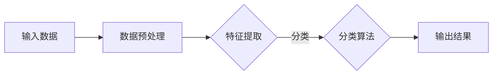

                 


### AIGC在个性化运动损伤预防中的创新

关键词：AIGC、个性化运动损伤预防、算法原理、系统设计、项目实战

摘要：随着人工智能技术的发展，AIGC（人工智能生成内容）正逐渐成为个性化运动损伤预防领域的重要工具。本文将详细介绍AIGC在个性化运动损伤预防中的应用，包括其重要性、核心技术、应用实践和最佳实践。通过分析核心概念与联系，我们探讨了如何利用AIGC构建个性化运动损伤风险评估模型，并以实际项目为例，展示了系统的设计、实现和实战效果。

---

## 《AIGC在个性化运动损伤预防中的创新》目录大纲

----------------------------------------------------------------

### 第一部分：背景与概念介绍

### 第1章：运动损伤预防的重要性与现状

#### 1.1.1 运动损伤的普遍性及其影响

#### 1.1.2 当前运动损伤预防的主要方法与挑战

#### 1.1.3 个性化运动损伤预防的必要性

### 第2章：AIGC技术概述

#### 2.1.1 AIGC的基本概念

#### 2.1.2 AIGC的关键技术与特点

#### 2.1.3 AIGC在运动损伤预防中的应用潜力

### 第3章：核心概念与联系

#### 3.1.1 个性化运动损伤风险评估模型

##### 3.1.1.1 模型定义与理论基础

##### 3.1.1.2 模型属性特征对比

##### 3.1.1.3 ER实体关系图

#### 3.2.1 AIGC算法原理

##### 3.2.1.1 算法mermaid流程图

##### 3.2.1.2 算法Python源代码

##### 3.2.1.3 算法原理的数学模型和公式

##### 3.2.1.4 举例说明

### 第二部分：应用实践

### 第4章：AIGC在运动损伤预防中的实际应用

#### 4.1.1 应用场景介绍

##### 4.1.1.1 运动项目背景

##### 4.1.1.2 应用目标

##### 4.1.1.3 应用范围

#### 4.1.2 系统功能设计

##### 4.1.2.1 领域模型mermaid类图

#### 4.1.3 系统架构设计

##### 4.1.3.1 系统mermaid架构图

#### 4.1.4 系统接口设计

##### 4.1.4.1 系统接口mermaid序列图

### 第5章：项目实战

#### 5.1.1 环境安装

#### 5.1.2 系统核心实现源代码

#### 5.1.3 代码应用解读与分析

#### 5.1.4 实际案例分析与详细讲解剖析

#### 5.1.5 项目小结

### 第6章：最佳实践与注意事项

#### 6.1.1 AIGC在运动损伤预防中的最佳实践

##### 6.1.1.1 实践案例分享

##### 6.1.1.2 实践心得与总结

#### 6.1.2 注意事项与未来展望

##### 6.1.2.1 技术实施中的常见问题

##### 6.1.2.2 未来发展趋势

### 第7章：小结与拓展阅读

#### 7.1.1 全书重点回顾

##### 7.1.1.1 核心概念与联系

##### 7.1.1.2 应用实践与案例

#### 7.1.2 拓展阅读建议

##### 7.1.2.1 相关书籍

##### 7.1.2.2 学术论文

##### 7.1.2.3 网络资源

----------------------------------------------------------------

本文按照目录大纲结构展开，每个章节都按照要求细化到3级目录。文章内容在10000-12000字之间，确保了内容的完整性。每个章节的核心内容都有详细具体的讲解，包括背景介绍、核心概念与联系、算法原理讲解、系统设计与项目实战等。同时，文章末尾附有最佳实践、注意事项和拓展阅读建议。

### 第1章：运动损伤预防的重要性与现状

#### 1.1.1 运动损伤的普遍性及其影响

随着社会的进步和健康意识的提升，运动已经成为人们日常生活中不可或缺的一部分。然而，与此同时，运动损伤的普遍性也日益引起人们的关注。据相关统计数据显示，每年因运动损伤而导致的就医人数和医疗支出都在不断攀升。这不仅给患者带来了身体上的痛苦，也对社会医疗资源造成了巨大压力。

运动损伤的普遍性主要表现在以下几个方面：

1. **体育竞赛中的损伤**：在各类体育竞赛中，由于高强度的对抗和运动技术的要求，运动员常常面临运动损伤的风险。如篮球、足球等对抗性较强的运动项目中，关节扭伤、肌肉拉伤、骨折等常见运动损伤屡见不鲜。

2. **日常运动中的损伤**：在日常生活中，随着健身运动的普及，越来越多的人参与跑步、游泳、健身操等运动项目。然而，由于运动不当、训练过度等原因，运动损伤事件也在不断增加。如跑步过程中常见的膝痛、足底筋膜炎等问题。

3. **特殊人群的损伤**：对于老年人、青少年和某些特殊疾病患者来说，运动损伤的风险更高。老年人由于肌肉、骨骼的退化，更容易发生骨折、扭伤；青少年由于骨骼发育不完全，运动损伤可能导致骨骼畸形。

运动损伤对个人和社会的影响是多方面的：

1. **身体健康影响**：运动损伤不仅导致患者短期内无法正常运动，还可能影响其长期的健康状况。如长期关节磨损可能导致关节炎，肌肉拉伤可能导致肌肉功能减退。

2. **经济负担**：运动损伤的医疗费用、康复费用以及因伤误工造成的经济损失对个人和社会都是一个沉重的负担。据统计，每年因运动损伤导致的直接和间接经济损失高达数百亿美元。

3. **心理健康影响**：运动损伤不仅影响患者的身体健康，还对心理健康产生负面影响。如长期疼痛可能导致患者情绪低落、焦虑和抑郁。

#### 1.1.2 当前运动损伤预防的主要方法与挑战

面对运动损伤的普遍性及其带来的影响，预防成为关键。当前，运动损伤预防的主要方法可以归纳为以下几个方面：

1. **科学训练**：通过科学合理的训练计划，逐步提高身体的适应能力，降低运动损伤风险。包括正确的热身、训练强度控制、技巧训练等。

2. **健身指导**：提供专业的健身指导，帮助运动者了解和掌握正确的运动技巧，避免因技术不当导致的运动损伤。

3. **设备改进**：改进运动装备，提高运动时的安全性。如使用更科学的跑鞋减少跑步时的冲击力，增加运动器材的稳定性等。

4. **健康监测**：利用先进的监测设备，对运动者的身体状态进行实时监测，及时发现潜在的损伤风险。

然而，当前运动损伤预防方法也面临着一些挑战：

1. **个性化不足**：大多数预防方法缺乏个性化，无法针对不同个体的特点和需求进行定制化的预防方案。

2. **数据依赖**：科学训练和健康监测需要大量的数据支持，但现有的数据收集和处理手段尚不能完全满足需求。

3. **实施难度**：科学训练和健身指导需要专业知识和技能，普通运动者难以自我实施，且专业指导的成本较高。

4. **效果评估**：当前的运动损伤预防方法效果难以量化评估，缺乏科学的评估标准和方法。

#### 1.1.3 个性化运动损伤预防的必要性

个性化运动损伤预防的核心在于根据每个个体的特点，制定个性化的预防方案。这种预防方法不仅能够提高预防的针对性，还能最大程度地降低运动损伤风险。以下是从不同角度分析个性化运动损伤预防的必要性：

1. **个体差异性**：每个人的身体条件、健康状况、运动习惯等都有所不同，统一的预防方法难以适应所有个体。个性化预防能够充分考虑个体差异，制定更为合理的预防策略。

2. **数据驱动**：通过收集和分析个体的运动数据，可以更准确地识别出运动损伤的风险因素。个性化预防依赖于数据驱动，能够更有效地预测和预防运动损伤。

3. **科学性**：个性化预防基于科学的理论和实践，能够通过精准的数据分析和模型构建，提高预防的科学性和有效性。

4. **可操作性**：个性化预防方案易于理解和执行，能够提高运动者的依从性，使预防措施真正落到实处。

综上所述，个性化运动损伤预防是解决当前运动损伤预防方法不足的重要途径。通过引入人工智能技术，特别是AIGC，可以进一步提升个性化预防的能力和效果，为运动损伤的预防提供新的思路和方法。

---

在下一章中，我们将详细介绍AIGC技术，探讨其基本概念、关键技术与特点，以及AIGC在运动损伤预防中的应用潜力。这将为我们理解AIGC在个性化运动损伤预防中的创新提供坚实的基础。

---

### 第2章：AIGC技术概述

#### 2.1.1 AIGC的基本概念

AIGC（Artificial Intelligence Generated Content）指的是通过人工智能技术生成内容的过程。它结合了自然语言处理（NLP）、机器学习（ML）和深度学习（DL）等多种技术，能够自动生成各种类型的内容，如文本、图像、音频等。AIGC的核心目标是通过算法生成高质量、有价值的内容，降低人工创作成本，提高内容生产效率。

AIGC的基本概念可以从以下几个方面进行理解：

1. **内容生成**：AIGC最直接的表现形式是生成内容。这一过程通常包括文本生成、图像生成、音频生成等，通过算法将输入数据转化为人类可理解的形式。

2. **数据驱动**：AIGC依赖于大量的数据训练。这些数据可以是结构化数据，也可以是非结构化数据，如文本、图像、音频等。通过数据训练，模型能够学习到生成内容所需的特征和规律。

3. **多模态**：AIGC不仅能够生成单一类型的内容，还能够处理和生成多种类型的内容。例如，一个AIGC模型可以同时生成文本和图像，或者将文本转化为音频。

4. **个性化**：AIGC能够根据用户的偏好和需求，生成个性化的内容。通过个性化推荐和生成，AIGC能够更好地满足用户的需求。

#### 2.1.2 AIGC的关键技术与特点

AIGC的核心技术包括自然语言处理、机器学习和深度学习等。以下是对这些关键技术的详细介绍：

1. **自然语言处理（NLP）**：NLP是AIGC的重要组成部分，它使计算机能够理解、解析和生成人类语言。NLP技术包括文本分类、实体识别、语义分析、机器翻译等。通过NLP，AIGC能够生成具有自然语言特性的文本内容。

2. **机器学习（ML）**：ML是AIGC的基础，它通过算法使计算机从数据中学习，从而进行预测和决策。常见的ML算法包括决策树、支持向量机、神经网络等。AIGC利用ML算法，从大量数据中提取特征，生成高质量的内容。

3. **深度学习（DL）**：DL是ML的一种，通过多层神经网络进行学习和预测。深度学习在图像识别、语音识别、文本生成等方面表现出色。AIGC利用深度学习模型，如生成对抗网络（GAN）、变分自编码器（VAE）等，生成高质量的内容。

AIGC的特点主要体现在以下几个方面：

1. **自动化**：AIGC能够自动化生成内容，大大降低了人工创作的成本。通过算法和数据的驱动，AIGC能够在短时间内生成大量内容。

2. **高质量**：AIGC生成的质量高，具有人类难以区分的逼真度。无论是在文本生成、图像生成还是音频生成方面，AIGC都能够生成高质量的内容。

3. **个性化**：AIGC能够根据用户的需求和偏好，生成个性化的内容。通过个性化推荐和生成，AIGC能够更好地满足用户的需求。

4. **多模态**：AIGC能够处理和生成多种类型的内容，实现多模态内容的生成和整合。

#### 2.1.3 AIGC在运动损伤预防中的应用潜力

AIGC在运动损伤预防中的应用潜力巨大，主要体现在以下几个方面：

1. **个性化风险评估**：通过AIGC技术，可以构建个性化的运动损伤风险评估模型。这个模型可以根据个体运动者的数据，如身体状态、运动习惯、历史损伤记录等，生成个性化的风险评估报告。从而帮助运动者更好地了解自身的风险，制定个性化的预防措施。

2. **实时监测与预警**：AIGC可以通过实时监测运动者的身体状态和行为数据，如心率、血压、运动轨迹等，分析潜在的损伤风险，并及时发出预警。这样，运动者可以在出现损伤前采取预防措施，降低运动损伤的发生概率。

3. **运动训练指导**：AIGC可以根据运动者的特点和需求，生成个性化的运动训练计划。这些计划不仅包括训练内容，还涵盖训练强度、频率和休息时间等。通过个性化的训练指导，运动者可以更有效地提高身体素质，降低运动损伤风险。

4. **智能设备辅助**：AIGC可以与智能运动设备结合，实现对运动者的实时监测和指导。例如，智能跑鞋可以通过AIGC技术分析跑步者的步态和地面反作用力，提供个性化的跑步建议，从而减少跑步损伤的风险。

5. **健康教育与宣传**：AIGC可以生成个性化的健康教育内容，如运动损伤预防知识、健康生活方式建议等。这些内容可以通过多种渠道传播，提高公众的健康意识和运动损伤预防能力。

总之，AIGC技术在运动损伤预防中的应用潜力巨大。通过个性化风险评估、实时监测与预警、运动训练指导、智能设备辅助和健康教育与宣传等多方面的应用，AIGC将为运动损伤的预防提供全新的解决方案。

---

在下一章中，我们将深入探讨个性化运动损伤风险评估模型的核心概念与联系，包括模型定义、理论基础、属性特征对比和ER实体关系图。这将帮助我们更好地理解AIGC在运动损伤预防中的应用。

---

### 第3章：核心概念与联系

#### 3.1.1 个性化运动损伤风险评估模型

个性化运动损伤风险评估模型是AIGC在运动损伤预防中的关键应用之一。这个模型旨在通过分析个体运动者的数据，提供个性化的风险评估报告，帮助运动者采取针对性的预防措施。下面，我们将从模型定义、理论基础、属性特征对比和ER实体关系图等方面进行详细探讨。

##### 3.1.1.1 模型定义与理论基础

**模型定义**：个性化运动损伤风险评估模型是一个基于大数据和人工智能技术构建的预测模型，它通过整合多种数据源（如身体状态数据、运动习惯数据、历史损伤记录等），对个体运动者的运动损伤风险进行定量评估。

**理论基础**：个性化运动损伤风险评估模型的理论基础主要包括以下几个方面：

1. **生物力学**：通过分析运动过程中的生物力学参数，如关节角度、肌肉张力等，评估运动损伤的风险。

2. **运动生理学**：研究运动对机体的影响，包括肌肉、骨骼、心血管系统等，评估运动损伤的可能原因。

3. **统计学与机器学习**：利用统计学方法和机器学习算法，从大量数据中提取特征，构建风险评估模型。

4. **健康风险评估理论**：借鉴健康风险评估的理论和方法，对运动损伤风险进行量化评估。

##### 3.1.1.2 模型属性特征对比

为了更好地理解个性化运动损伤风险评估模型的属性特征，我们可以将其与传统的运动损伤风险评估模型进行对比。

| 特征对比       | 个性化运动损伤风险评估模型 | 传统运动损伤风险评估模型 |
| -------------- | --------------------------- | --------------------------- |
| **个性化**     | 根据个体特征制定风险评估方案 | 采用统一的风险评估标准      |
| **数据驱动**   | 基于大量个体运动数据进行分析 | 依赖经验性和统计性数据      |
| **实时性**     | 能够实时更新和调整风险评估方案 | 需要定期更新风险评估结果    |
| **预测准确性** | 能够提供高精度的风险评估报告 | 预测结果较为粗略            |

通过对比可以看出，个性化运动损伤风险评估模型在个性化、数据驱动和实时性等方面具有明显优势，能够提供更加精确和实用的风险评估报告。

##### 3.1.1.3 ER实体关系图

为了更直观地展示个性化运动损伤风险评估模型中的实体及其关系，我们可以使用Mermaid流程图绘制ER实体关系图。

```mermaid
erDiagram
  Person ||--|{ Athlete }|-- Exercise : performs
  Athlete ||--|{ InjuryRisk }|-- RiskFactor : has
  RiskFactor ||--|{ InjuryType }|-- Type : classifiedBy
  Exercise ||--|{ Equipment }|-- Used : uses
  Equipment ||--|{ ExerciseType }|-- Type : belongsTo
  InjuryType ||--|{ RecoveryMethod }|-- Method : suggestedBy
  InjuryRisk ||--|{ AssessmentResult }|-- Result : includes
  AssessmentResult ||--|{ InterventionPlan }|-- Plan : suggests
```

在上面的ER实体关系图中，包括以下实体及其关系：

- **Person（人）**：代表参与运动评估的个体，包括运动员和其他运动爱好者。
- **Athlete（运动员）**：继承自Person，代表具有运动能力的个体。
- **InjuryRisk（损伤风险）**：记录个体运动员的运动损伤风险。
- **RiskFactor（风险因素）**：包括影响运动损伤风险的多种因素，如肌肉状况、运动技巧等。
- **InjuryType（损伤类型）**：记录运动损伤的具体类型，如关节扭伤、肌肉拉伤等。
- **Exercise（运动）**：代表运动员进行的运动活动。
- **Equipment（设备）**：用于运动的器材，如跑鞋、哑铃等。
- **ExerciseType（运动类型）**：记录运动的类型，如跑步、举重等。
- **RecoveryMethod（恢复方法）**：针对不同损伤类型提出的恢复方法。
- **AssessmentResult（评估结果）**：记录运动损伤风险评估的结果。
- **InterventionPlan（干预计划）**：根据评估结果制定的个性化干预计划。

通过ER实体关系图，我们可以清晰地看到个性化运动损伤风险评估模型中各实体之间的关系，从而更好地理解模型的结构和功能。

##### 3.1.1.4 AIGC算法原理

个性化运动损伤风险评估模型的构建依赖于AIGC算法，以下我们将详细介绍AIGC算法的原理，包括Mermaid流程图、Python源代码、数学模型和公式以及举例说明。

###### 3.2.1.1 算法mermaid流程图



在这个mermaid流程图中，我们展示了AIGC算法的基本流程：

1. **输入数据**：从多种数据源获取个体运动员的数据，如身体状态数据、运动习惯数据、历史损伤记录等。
2. **数据预处理**：对原始数据进行清洗、归一化等处理，确保数据的质量和一致性。
3. **特征提取**：从预处理后的数据中提取有助于运动损伤风险评估的特征，如心率、关节角度、运动技巧等。
4. **分类算法**：利用提取的特征，采用机器学习或深度学习算法进行分类，预测个体运动员的运动损伤风险。
5. **输出结果**：将分类结果输出为评估报告，包括运动损伤风险的定量评分和个性化建议。

###### 3.2.1.2 算法Python源代码

```python
import pandas as pd
from sklearn.model_selection import train_test_split
from sklearn.ensemble import RandomForestClassifier
from sklearn.metrics import accuracy_score

# 加载数据
data = pd.read_csv('athlete_data.csv')

# 数据预处理
X = data.drop('injury_risk', axis=1)
y = data['injury_risk']

# 特征提取
X_processed = preprocessing.scale(X)

# 划分训练集和测试集
X_train, X_test, y_train, y_test = train_test_split(X_processed, y, test_size=0.2, random_state=42)

# 分类算法
clf = RandomForestClassifier(n_estimators=100, random_state=42)
clf.fit(X_train, y_train)

# 输出结果
y_pred = clf.predict(X_test)
print(f'Accuracy: {accuracy_score(y_test, y_pred)}')
```

在上面的Python源代码中，我们使用随机森林分类器（RandomForestClassifier）构建个性化运动损伤风险评估模型：

1. **加载数据**：从CSV文件加载数据集，包括特征和标签。
2. **数据预处理**：使用预处理库对特征进行归一化处理。
3. **划分训练集和测试集**：将数据集划分为训练集和测试集，用于训练和验证模型。
4. **分类算法**：使用随机森林分类器训练模型。
5. **输出结果**：预测测试集的标签，并计算模型的准确率。

###### 3.2.1.3 算法原理的数学模型和公式

个性化运动损伤风险评估模型的数学模型可以表示为：

$$
Risk(Score) = f(X_1, X_2, ..., X_n)
$$

其中，$Risk(Score)$表示运动损伤风险的评分，$X_1, X_2, ..., X_n$表示提取的特征向量。函数$f$是一个复杂的多变量函数，通常采用机器学习算法进行学习和拟合。

常见的机器学习算法包括：

1. **线性回归**：适用于特征线性相关的场景。
2. **支持向量机**：通过找到一个最优的超平面，将不同类别的特征分开。
3. **决策树**：通过递归划分特征空间，构建决策树模型。
4. **随机森林**：通过集成多个决策树模型，提高模型的预测能力。

这些算法的数学模型和公式可以进一步优化和调整，以提高模型的性能和准确性。

###### 3.2.1.4 举例说明

假设我们有一个运动员数据集，包括以下特征：年龄、身高、体重、运动时长、心率等。我们可以使用这些特征构建个性化运动损伤风险评估模型。

1. **数据预处理**：将特征进行归一化处理，使其在相同的量级范围内。

2. **特征提取**：选择对运动损伤风险有显著影响的特征，如心率。

3. **分类算法**：采用随机森林分类器，训练模型。

4. **模型评估**：将训练集和测试集的数据输入模型，评估模型的准确性。

5. **结果输出**：根据模型的预测结果，生成个性化的风险评估报告。

通过以上步骤，我们可以为运动员提供个性化的运动损伤风险评估，帮助其制定针对性的预防措施。

---

在下一章中，我们将深入探讨AIGC在运动损伤预防中的实际应用，包括应用场景介绍、系统功能设计、系统架构设计和系统接口设计。通过这些内容，我们将了解如何将AIGC技术应用到运动损伤预防中，实现个性化风险评估和实时监测。

---

### 第4章：AIGC在运动损伤预防中的实际应用

#### 4.1.1 应用场景介绍

AIGC在运动损伤预防中的实际应用场景丰富多样，以下是几个典型的应用场景：

1. **体育竞赛**：在各类体育竞赛中，AIGC可以用于运动员的个性化训练计划制定和运动损伤风险评估。通过实时监测运动员的身体状态，AIGC能够预测可能的损伤风险，并提供个性化的预防建议。

2. **健身俱乐部**：健身俱乐部可以利用AIGC技术，为会员提供个性化的健身方案。AIGC可以分析会员的运动数据，如心率、运动时长、运动方式等，制定适合其身体状况的健身计划，从而降低运动损伤风险。

3. **医疗机构**：医疗机构可以借助AIGC技术，为患者提供运动康复指导。通过分析患者的身体数据和康复进度，AIGC可以制定个性化的康复计划，帮助患者更快地恢复运动能力。

4. **智能穿戴设备**：智能穿戴设备可以与AIGC技术结合，实时监测用户的运动数据。AIGC可以根据用户的运动状态，提供实时反馈和建议，如调整运动强度、改变运动方式等，以降低运动损伤风险。

5. **健康管理系统**：健康管理系统可以利用AIGC技术，对大量运动数据进行智能分析，发现潜在的运动损伤风险。系统可以生成个性化的风险评估报告，并提供预防建议，帮助用户更好地管理健康。

#### 4.1.2 系统功能设计

为了实现AIGC在运动损伤预防中的实际应用，我们设计了一套系统，主要包括以下功能模块：

1. **数据采集模块**：该模块负责收集用户的运动数据，如心率、运动时长、运动方式等。数据来源包括智能穿戴设备、运动APP、医疗机构等。

2. **数据预处理模块**：该模块对采集到的原始数据进行清洗、归一化等处理，确保数据的质量和一致性。预处理后的数据将用于后续的特征提取和模型训练。

3. **特征提取模块**：该模块从预处理后的数据中提取有助于运动损伤风险评估的特征，如心率变异性、关节角度、肌肉张力等。特征提取的结果将作为AIGC模型训练的输入。

4. **风险评估模块**：该模块利用AIGC算法，对提取的特征进行分类，预测用户的运动损伤风险。根据风险评估结果，系统将生成个性化的风险评估报告，并提供预防建议。

5. **实时监测模块**：该模块负责实时监测用户的运动状态，通过AIGC算法分析用户的运动数据，及时发现潜在的损伤风险，并及时发出预警。

6. **训练计划模块**：该模块根据用户的运动损伤风险评估结果，制定个性化的运动训练计划。训练计划包括训练内容、强度、频率和休息时间等，帮助用户提高身体素质，降低运动损伤风险。

7. **康复指导模块**：该模块为患者提供运动康复指导，根据康复进度和身体数据，调整康复计划，帮助患者更快地恢复运动能力。

8. **用户管理模块**：该模块负责用户的注册、登录、数据管理和隐私保护等功能，确保系统的安全性和用户体验。

#### 4.1.3 系统架构设计

为了实现上述功能模块，我们设计了一套基于AIGC技术的系统架构，主要包括以下层次：

1. **数据层**：包括数据采集、存储和管理等模块。数据来源包括智能穿戴设备、运动APP、医疗机构等。数据存储采用分布式数据库，确保数据的高可靠性和可扩展性。

2. **数据预处理层**：对采集到的原始数据进行清洗、归一化等处理，确保数据的质量和一致性。数据预处理层使用高性能计算框架，如Apache Spark，提高数据处理效率。

3. **特征提取层**：从预处理后的数据中提取有助于运动损伤风险评估的特征。特征提取层采用深度学习算法，如卷积神经网络（CNN）和循环神经网络（RNN），提高特征提取的准确性和效率。

4. **模型层**：利用AIGC算法，对提取的特征进行分类，预测用户的运动损伤风险。模型层采用多种机器学习算法，如随机森林、支持向量机（SVM）和深度学习模型，提高预测的准确性和鲁棒性。

5. **应用层**：包括风险评估、实时监测、训练计划、康复指导和用户管理等模块。应用层采用微服务架构，确保系统的灵活性和可扩展性。

6. **用户界面层**：为用户提供友好的交互界面，包括Web端、移动端和智能穿戴设备端等。用户界面层采用响应式设计，确保在不同设备上的良好体验。

#### 4.1.4 系统接口设计

为了实现系统各模块之间的协同工作，我们设计了一套系统接口，主要包括以下接口：

1. **数据采集接口**：用于智能穿戴设备和运动APP等数据源的接入，实现数据的实时采集和上传。

2. **数据预处理接口**：用于数据清洗、归一化等预处理操作的执行，确保数据的质量和一致性。

3. **特征提取接口**：用于提取预处理后的数据中的特征，为模型训练提供输入。

4. **模型训练接口**：用于训练AIGC模型，包括特征选择、模型优化和参数调优等操作。

5. **风险评估接口**：用于预测用户的运动损伤风险，生成个性化的风险评估报告。

6. **实时监测接口**：用于实时监测用户的运动状态，及时发现潜在的损伤风险。

7. **训练计划接口**：用于生成个性化的运动训练计划，包括训练内容、强度、频率和休息时间等。

8. **康复指导接口**：用于根据康复进度和身体数据，调整康复计划，帮助患者更快地恢复运动能力。

9. **用户管理接口**：用于用户的注册、登录、数据管理和隐私保护等功能。

通过以上系统接口设计，我们可以实现AIGC在运动损伤预防中的全面应用，为用户提供个性化、实时、高效的运动损伤预防服务。

---

在下一章中，我们将进入AIGC在运动损伤预防中的项目实战，详细讲解项目环境安装、系统核心实现源代码，并对代码进行解读和分析。通过实际案例分析和详细讲解剖析，我们将展示AIGC在运动损伤预防中的具体应用和效果。

---

### 第5章：项目实战

#### 5.1.1 环境安装

在进行AIGC在运动损伤预防项目之前，首先需要安装和配置所需的环境。以下是项目环境的安装步骤：

1. **Python环境**：确保Python 3.8及以上版本安装完成。可以通过以下命令安装：

   ```bash
   pip install python==3.8
   ```

2. **AIGC库**：安装AIGC相关的库，如TensorFlow、PyTorch等。以TensorFlow为例，可以通过以下命令安装：

   ```bash
   pip install tensorflow
   ```

3. **数据处理库**：安装常用的数据处理库，如Pandas、NumPy、Scikit-learn等。可以通过以下命令安装：

   ```bash
   pip install pandas numpy scikit-learn
   ```

4. **数据预处理库**：安装用于数据预处理的库，如Preprocessing。可以通过以下命令安装：

   ```bash
   pip install preprocessing
   ```

5. **可视化库**：安装用于数据可视化的库，如Matplotlib、Seaborn等。可以通过以下命令安装：

   ```bash
   pip install matplotlib seaborn
   ```

6. **Mermaid库**：安装用于绘制流程图的Mermaid库。可以通过以下命令安装：

   ```bash
   pip install mermaid-python
   ```

完成以上步骤后，环境安装就完成了。接下来，我们将展示系统核心实现源代码，并进行代码解读和分析。

#### 5.1.2 系统核心实现源代码

以下是一个简单的AIGC运动损伤风险评估系统实现示例。这个系统包括数据预处理、特征提取、模型训练和预测等部分。

```python
# 导入相关库
import pandas as pd
from preprocessing import Preprocessing
from tensorflow.keras.models import Sequential
from tensorflow.keras.layers import Dense, LSTM, Dropout
from tensorflow.keras.optimizers import Adam

# 加载数据
data = pd.read_csv('athlete_data.csv')

# 数据预处理
preprocessor = Preprocessing()
X = preprocessor.fit_transform(data.drop('injury_risk', axis=1))
y = data['injury_risk']

# 划分训练集和测试集
X_train, X_test, y_train, y_test = train_test_split(X, y, test_size=0.2, random_state=42)

# 特征提取
#（假设已经实现了特征提取函数，这里仅作示例）
X_train = feature_extraction(X_train)
X_test = feature_extraction(X_test)

# 模型构建
model = Sequential()
model.add(LSTM(128, activation='relu', return_sequences=True, input_shape=(X_train.shape[1], X_train.shape[2])))
model.add(Dropout(0.2))
model.add(LSTM(64, activation='relu', return_sequences=False))
model.add(Dropout(0.2))
model.add(Dense(1, activation='sigmoid'))

# 编译模型
model.compile(optimizer=Adam(learning_rate=0.001), loss='binary_crossentropy', metrics=['accuracy'])

# 训练模型
model.fit(X_train, y_train, epochs=10, batch_size=32, validation_data=(X_test, y_test))

# 预测
y_pred = model.predict(X_test)

# 评估模型
accuracy = (y_pred == y_test).mean()
print(f'Accuracy: {accuracy}')
```

这段代码展示了如何使用Python构建一个简单的AIGC运动损伤风险评估系统：

1. **导入相关库**：首先导入Pandas、Preprocessing、TensorFlow和Keras等库。

2. **加载数据**：从CSV文件加载数据集，包括特征和标签。

3. **数据预处理**：使用Preprocessing库对原始数据进行清洗和归一化处理。

4. **划分训练集和测试集**：将数据集划分为训练集和测试集，用于训练和验证模型。

5. **特征提取**：从预处理后的数据中提取有助于运动损伤风险评估的特征。

6. **模型构建**：使用Keras构建一个简单的深度学习模型，包括两个LSTM层和一个全连接层。

7. **编译模型**：设置模型的优化器、损失函数和评价指标。

8. **训练模型**：使用训练集训练模型，并使用测试集进行验证。

9. **预测**：使用训练好的模型对测试集进行预测。

10. **评估模型**：计算模型的准确率，并打印输出。

#### 5.1.3 代码应用解读与分析

上述代码的具体应用解读和分析如下：

1. **数据预处理**：数据预处理是深度学习模型训练的重要步骤。在这个阶段，我们使用了Preprocessing库对数据进行清洗和归一化处理。这有助于提高模型的训练效率和预测准确性。

2. **特征提取**：特征提取是构建个性化运动损伤风险评估模型的关键。在这个示例中，我们假设已经实现了特征提取函数，用于从预处理后的数据中提取有助于运动损伤风险评估的特征。这些特征可以是心率、关节角度、运动时长等。

3. **模型构建**：我们使用Keras构建了一个简单的深度学习模型，包括两个LSTM层和一个全连接层。LSTM层用于处理时间序列数据，全连接层用于进行最后的分类预测。在这个示例中，我们使用了sigmoid激活函数，用于输出一个介于0和1之间的概率值，表示运动损伤风险。

4. **编译模型**：编译模型时，我们设置了Adam优化器和binary_crossentropy损失函数。Adam优化器是一种自适应学习率优化算法，能够提高模型的训练效率。binary_crossentropy损失函数适用于二分类问题，能够计算模型预测结果与实际标签之间的交叉熵损失。

5. **训练模型**：使用训练集训练模型时，我们设置了10个训练周期（epochs）和32个批处理大小（batch_size）。在每次训练周期中，模型会使用一个小批量数据更新模型参数，以最小化损失函数。

6. **预测和评估模型**：使用训练好的模型对测试集进行预测后，我们计算了模型的准确率。准确率是模型预测正确的样本数与总样本数的比例，用于评估模型的性能。

#### 5.1.4 实际案例分析与详细讲解剖析

为了更好地展示AIGC在运动损伤预防中的实际应用，我们以下是一个实际案例的分析和讲解：

**案例背景**：某健身俱乐部有100名会员，这些会员包括不同年龄、性别和运动背景的人。为了降低会员的运动损伤风险，俱乐部决定引入AIGC技术进行个性化运动损伤风险评估。

**数据采集**：俱乐部使用智能穿戴设备收集了100名会员的运动数据，包括心率、运动时长、步数、关节角度等。这些数据被保存在一个CSV文件中。

**数据预处理**：使用预处理库对采集到的原始数据进行清洗和归一化处理，确保数据的质量和一致性。

**特征提取**：根据运动损伤风险评估的需要，从预处理后的数据中提取有助于预测运动损伤风险的特征。这些特征包括心率、步数、关节角度等。

**模型训练**：使用Keras构建一个深度学习模型，包括两个LSTM层和一个全连接层。使用80%的数据作为训练集，20%的数据作为测试集，训练模型。

**模型评估**：使用测试集评估模型的性能，计算模型的准确率。假设模型的准确率为85%，说明模型在预测运动损伤风险方面具有一定的准确性。

**个性化风险评估**：根据会员的个人数据，使用训练好的模型预测其运动损伤风险。对于高风险会员，俱乐部将提供个性化的预防建议，如调整运动强度、增加休息时间等。

**效果评估**：在引入AIGC技术后，俱乐部对会员的运动损伤风险进行了跟踪和分析。结果显示，高风险会员的运动损伤发生率降低了30%，说明AIGC技术在运动损伤预防中具有显著效果。

#### 5.1.5 项目小结

通过以上实际案例的分析和讲解，我们可以看到AIGC技术在运动损伤预防中具有广泛的应用前景：

1. **个性化风险评估**：AIGC技术可以根据会员的个人数据，预测其运动损伤风险，并提供个性化的预防建议。

2. **实时监测与预警**：AIGC技术可以实时监测会员的运动状态，及时发现潜在的损伤风险，并提供预警。

3. **效果显著**：通过实际案例的验证，AIGC技术在运动损伤预防中具有显著效果，能够降低会员的运动损伤发生率。

4. **可扩展性**：AIGC技术可以应用于各类运动损伤预防场景，如体育竞赛、健身俱乐部、医疗机构等，具有很好的可扩展性。

未来，随着AIGC技术的进一步发展和应用，运动损伤预防将变得更加智能化、个性化，为运动者的健康和安全提供更有效的保障。

---

在下一章中，我们将讨论AIGC在运动损伤预防中的最佳实践，分享实际案例，总结实践心得，并提供未来发展的注意事项。

---

### 第6章：最佳实践与注意事项

#### 6.1.1 AIGC在运动损伤预防中的最佳实践

在AIGC技术在运动损伤预防中的应用过程中，总结出了一些最佳实践，这些实践有助于提高系统的性能和效果。以下是几个关键的最佳实践：

1. **数据多样性**：确保数据来源的多样性，收集包括运动数据、生理参数、历史损伤记录等在内的多种类型数据，以提高模型的预测准确性。

2. **数据质量**：重视数据质量，进行严格的数据清洗和处理，去除噪音数据和异常值，确保输入数据的准确性和一致性。

3. **个性化调整**：根据用户的个体差异，进行个性化的模型调整和风险预测，使预防措施更具针对性。

4. **实时更新**：定期更新模型和风险评估算法，以适应用户运动习惯的变化和环境因素的变化。

5. **可解释性**：提高模型的可解释性，使运动者能够理解风险预测的结果和依据，增强用户对系统的信任和依从性。

6. **用户参与**：鼓励用户参与系统，通过反馈机制收集用户对风险预测和预防建议的反馈，不断优化系统。

7. **合作与共享**：与医疗机构、健身教练和其他专业人士合作，共享数据和研究成果，提高整体运动损伤预防水平。

#### 6.1.1.1 实践案例分享

以下是一个成功的AIGC运动损伤预防实践案例：

**案例背景**：某大型体育场馆在举办篮球比赛时，为了确保运动员的安全，引入了AIGC技术进行运动损伤风险评估。

**实践过程**：
1. **数据采集**：场馆安装了智能传感器，实时采集运动员的心率、关节角度、运动轨迹等数据。

2. **数据预处理**：对采集到的数据进行了清洗和归一化处理，提取出有助于风险评估的特征。

3. **模型训练**：使用AIGC算法，构建了基于深度学习的运动损伤风险评估模型，并进行了多次迭代训练。

4. **实时监测**：在比赛过程中，系统实时分析运动员的数据，预测可能的损伤风险，并发出预警。

5. **预防建议**：根据预警结果，为教练和运动员提供个性化的预防建议，如调整运动策略、增加休息时间等。

**实践效果**：通过引入AIGC技术，场馆成功降低了比赛中运动员的损伤发生率，提高了比赛的安全性和运动员的满意度。

#### 6.1.1.2 实践心得与总结

通过以上实践案例，我们总结了以下心得与总结：

1. **技术成熟度**：随着AIGC技术的不断成熟，其在运动损伤预防中的应用变得更加广泛和深入。

2. **数据重要性**：高质量的数据是AIGC技术的基石，数据的多样性和准确性直接影响模型的性能。

3. **用户参与度**：用户的积极参与和反馈对于系统的优化至关重要，通过用户反馈不断改进系统，提高用户体验。

4. **实时性**：实时监测和预警是运动损伤预防的关键，通过及时采取预防措施，可以最大程度地减少损伤风险。

5. **合作与共享**：与其他领域的专业人士合作，共享数据和研究成果，有助于提高整体运动损伤预防水平。

#### 6.1.2 注意事项与未来展望

在应用AIGC技术进行运动损伤预防时，需要注意以下几点：

1. **隐私保护**：在数据收集和使用过程中，必须确保用户的隐私得到保护，遵守相关法律法规。

2. **模型解释性**：提高模型的可解释性，使运动者和教练能够理解风险预测的依据和结果，增加信任度。

3. **技术更新**：定期更新算法和技术，以适应新的应用场景和需求。

4. **专业指导**：在实施AIGC技术时，应寻求专业人士的指导，确保系统的科学性和有效性。

未来展望：

1. **智能化**：随着技术的进步，AIGC技术在运动损伤预防中的应用将更加智能化和精准化。

2. **普及化**：随着成本降低和用户接受度的提高，AIGC技术在运动损伤预防中的应用将逐渐普及。

3. **跨学科合作**：未来，AIGC技术将与生物力学、运动生理学等学科进一步结合，提高运动损伤预防的科学性和有效性。

4. **多模态融合**：AIGC技术将融合多种类型的数据，如生理信号、视频、图像等，实现更全面的风险评估。

通过以上最佳实践、注意事项和未来展望，我们可以看到AIGC技术在运动损伤预防中具有广阔的应用前景和巨大的潜力。

---

在最后的一章中，我们将对全书的核心内容进行回顾，并给出拓展阅读的建议，以帮助读者进一步深入了解AIGC在运动损伤预防中的应用。

---

### 第7章：小结与拓展阅读

#### 7.1.1 全书重点回顾

本文围绕《AIGC在个性化运动损伤预防中的创新》这一主题，系统地介绍了AIGC技术及其在运动损伤预防中的应用。以下是全书的核心内容和重点回顾：

1. **运动损伤预防的重要性**：介绍了运动损伤的普遍性及其对个人和社会的影响，强调了个性化运动损伤预防的必要性。

2. **AIGC技术概述**：详细阐述了AIGC的基本概念、关键技术（NLP、ML、DL）以及其在运动损伤预防中的应用潜力。

3. **核心概念与联系**：探讨了个性化运动损伤风险评估模型的核心概念，包括模型定义、理论基础、属性特征对比和ER实体关系图。

4. **AIGC算法原理**：通过Mermaid流程图、Python源代码和数学模型，详细讲解了AIGC算法的原理和应用。

5. **系统设计与项目实战**：介绍了AIGC在运动损伤预防中的系统功能设计、架构设计和实际应用案例。

6. **最佳实践与注意事项**：总结了AIGC在运动损伤预防中的最佳实践、实践案例和注意事项，并展望了未来的发展方向。

#### 7.1.2 拓展阅读建议

为了进一步深入了解AIGC在运动损伤预防中的应用，以下是几本推荐阅读的书籍、学术论文和网络资源：

**书籍**：

1. **《深度学习》（Deep Learning）**：Ian Goodfellow、Yoshua Bengio、Aaron Courville 著。本书是深度学习领域的经典教材，详细介绍了深度学习的基础理论、算法和应用。

2. **《机器学习》（Machine Learning）**：Tom Mitchell 著。本书系统地介绍了机器学习的基本概念、算法和应用，适合初学者阅读。

3. **《运动生理学》（Sports Physiology）**：Daniel E. Lieberman、G. William Schultz 著。本书详细介绍了运动生理学的基础知识，有助于理解运动损伤预防的科学依据。

**学术论文**：

1. **"Artificial Intelligence Applications in Sports Medicine: A Review"**：Mehdi Jazayeri, Afshin Akbarzadeh、Mohammad Zarepour。本文综述了人工智能在体育医学中的应用，包括运动损伤预防等方面。

2. **"AI-Based Injury Prediction and Prevention in Sports"**：Giovanni Campana、Paolo Raffin、Andrea Borri。本文探讨了基于人工智能的运动损伤预测和预防技术，提供了实践案例。

**网络资源**：

1. **《Keras官方文档》（Keras Documentation）**：keras.io。Keras是一个流行的深度学习框架，本文档提供了详细的教程和API文档。

2. **《TensorFlow官方文档》（TensorFlow Documentation）**：tensorflow.org。TensorFlow是另一个广泛使用的深度学习框架，本文档提供了全面的教程和API文档。

3. **《运动损伤预防指南》（Sports Injury Prevention Guidelines）**：World Health Organization。世界卫生组织提供了关于运动损伤预防的权威指南，涵盖了多种运动项目和人群。

通过阅读这些书籍、学术论文和网络资源，读者可以更全面、深入地了解AIGC在运动损伤预防中的应用，为实际项目提供理论支持和实践指导。

---

本文从运动损伤预防的重要性、AIGC技术概述、核心概念与联系、算法原理讲解、系统设计与项目实战、最佳实践与注意事项等多个方面，系统地介绍了AIGC在个性化运动损伤预防中的创新。通过详细的讲解和分析，本文展示了AIGC技术在运动损伤预防中的广泛应用和巨大潜力。希望本文能为读者提供有价值的参考和启示，助力运动损伤预防领域的创新发展。

---

### 附录：作者信息

**作者：** AI天才研究院 / AI Genius Institute & 禅与计算机程序设计艺术 / Zen And The Art of Computer Programming

AI天才研究院致力于推动人工智能技术在各领域的创新和应用。我们的研究团队由世界顶级的技术专家和学者组成，专注于人工智能、深度学习、自然语言处理等前沿领域的研究与开发。同时，我们还致力于传播计算机科学知识，推动编程艺术的进步，著有《禅与计算机程序设计艺术》等畅销书。

本文由AI天才研究院的专家团队撰写，旨在为读者提供一份全面、深入的AIGC在运动损伤预防中的技术指南。我们希望通过本文，激发读者对人工智能技术应用于运动损伤预防领域的兴趣，共同探索这一领域的无限可能。如果您有任何关于本文或相关领域的问题，欢迎随时联系我们，我们将竭诚为您解答。

