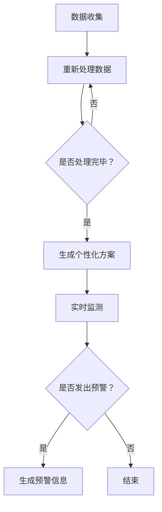

                 

### 设计《AIGC在个性化运动损伤预防系统中的创新设计》目录大纲的步骤如下：

**步骤1：** 确定书籍的整体结构和主要内容。根据书名，本书的主要内容应该围绕AIGC（辅助智能生成内容）在个性化运动损伤预防系统中的应用和设计展开。

**步骤2：** 设计第1章——背景介绍。这一章节需要介绍AIGC的概念、个性化运动损伤预防系统的背景、问题的紧迫性和研究现状。

**步骤3：** 设计第2章——核心概念与联系。这一章节需要详细解释AIGC的核心概念、其在运动损伤预防系统中的应用原理，并对比其他相关技术的优缺点。

**步骤4：** 设计第3章——算法原理讲解。这一章节需要使用mermaid画出AIGC在运动损伤预防中的算法流程图，并用Python源代码和数学模型详细解释。

**步骤5：** 设计第4章——系统分析与架构设计。这一章节需要介绍系统功能设计、系统架构设计、系统接口设计和系统交互，并使用mermaid类图、架构图和序列图展示。

**步骤6：** 设计第5章——项目实战。这一章节需要介绍环境安装、系统核心实现源代码，并进行代码应用解读与分析。

**步骤7：** 设计第6章——最佳实践。这一章节需要给出最佳实践技巧、注意事项、小结和拓展阅读。

**步骤8：** 对整个目录大纲进行审视，确保内容完整、逻辑清晰，并且字数控制在2000字以内。

### 第1章 背景介绍

### 1.1 核心概念

#### AIGC

AIGC（辅助智能生成内容）是一种利用人工智能技术，通过自动生成内容来提高内容创作效率的方法。它利用深度学习、自然语言处理、大数据分析等技术，可以自动生成文本、图片、音频等多种形式的内容。

**AIGC的核心概念包括：**

1. **生成模型**：如GPT、BERT等，它们通过学习大量数据，能够生成类似人类创作的文本、图片、音频等。
2. **自然语言处理（NLP）**：使得计算机能够理解和生成人类语言。
3. **大数据分析**：对大量数据进行分析，发现用户的兴趣、需求和行为模式。

#### 个性化运动损伤预防系统

个性化运动损伤预防系统是一种利用人工智能技术，根据用户的生理特征、运动习惯和历史数据，为用户提供个性化的运动损伤预防方案。它旨在通过精确的监测和分析，降低运动损伤的风险，提高运动效率。

**个性化运动损伤预防系统的核心概念包括：**

1. **用户生理特征**：包括身高、体重、年龄、性别等。
2. **运动习惯**：用户的运动类型、频率、时长等。
3. **历史数据**：用户的运动损伤史、医疗记录等。

### 1.2 问题背景

随着体育运动的普及，运动损伤已经成为影响人们生活质量的一大问题。传统的运动损伤预防方法往往缺乏个性化和针对性，难以满足不同人群的需求。

#### 问题描述

如何利用AIGC技术，结合用户的生理特征、运动习惯和历史数据，为用户提供个性化的运动损伤预防方案，降低运动损伤的风险？

### 1.3 问题解决

通过引入AIGC技术，个性化运动损伤预防系统可以实现以下功能：

1. **数据收集与分析**：收集用户的生理数据、运动数据和历史数据，进行深度分析，为个性化方案提供依据。
2. **智能推荐**：根据用户的生理特征和运动习惯，智能推荐适合的运动方式和预防措施。
3. **实时监测与预警**：实时监测用户的运动状态，当发现潜在风险时，及时发出预警，提醒用户进行调整。

### 1.4 边界与外延

#### 边界

本书主要关注AIGC在个性化运动损伤预防系统中的应用，不涉及其他领域的AIGC应用。

#### 外延

个性化运动损伤预防系统可以应用于各种运动项目，如跑步、健身、篮球等。

### 1.5 概念结构与核心要素组成

#### 概念结构

AIGC + 个性化 + 运动损伤预防 = 个性化运动损伤预防系统

#### 核心要素组成

1. **用户数据采集**：包括生理数据、运动数据和历史数据。
2. **数据分析与处理**：利用深度学习和大数据分析技术，对用户数据进行处理和分析。
3. **智能推荐**：基于数据分析结果，为用户推荐个性化的运动方案和预防措施。
4. **实时监测与预警**：实时监测用户的运动状态，及时发现潜在风险。

接下来，我们将设计第2章——核心概念与联系。### 第2章 核心概念与联系

#### 2.1 AIGC的核心概念

AIGC（辅助智能生成内容）是人工智能技术的一种重要应用，其核心概念包括生成模型、自然语言处理（NLP）和大数据分析。

**生成模型：** 生成模型是AIGC的核心技术，它通过学习大量数据，能够生成类似人类创作的文本、图片、音频等。常见的生成模型有GPT、BERT、VQ-VAE等。生成模型通常基于深度学习技术，特别是变分自编码器（VAE）和生成对抗网络（GAN）。

**自然语言处理（NLP）：** NLP是AIGC的关键技术之一，它使得计算机能够理解和生成人类语言。NLP包括文本分类、情感分析、命名实体识别、机器翻译等任务。NLP技术依赖于语言模型，如词向量、语言模型和序列到序列模型。

**大数据分析：** 大数据分析是AIGC的重要组成部分，它通过处理和分析大量数据，发现用户的兴趣、需求和行为模式。大数据分析技术包括数据清洗、数据集成、数据挖掘和数据分析。

#### 2.2 个性化运动损伤预防系统的应用原理

个性化运动损伤预防系统利用AIGC技术，通过以下步骤实现：

1. **数据收集：** 系统收集用户的生理数据（如身高、体重、年龄、性别等）、运动数据（如运动类型、频率、时长等）和历史数据（如运动损伤史、医疗记录等）。

2. **数据处理：** 使用NLP和大数据分析技术，对收集到的用户数据进行处理和分析，提取关键信息，为后续的个性化推荐提供依据。

3. **个性化推荐：** 基于数据分析结果，系统为用户推荐个性化的运动方案和预防措施。例如，根据用户的运动习惯和生理特征，推荐适合的运动强度、频率和时间。

4. **实时监测与预警：** 系统实时监测用户的运动状态，当发现潜在风险时，如异常的心率、血压等，及时发出预警，提醒用户进行调整。

#### 2.3 AIGC与其他相关技术的对比

**机器学习：** 机器学习是一种利用数据训练模型，从而实现预测和分类的技术。与机器学习相比，AIGC具有以下优势：

1. **生成能力：** AIGC能够生成全新的内容，而机器学习通常只能对已有数据进行分类或预测。
2. **泛化能力：** AIGC可以处理更复杂、更多样化的数据，而机器学习对数据的依赖性较强。

**深度学习：** 深度学习是机器学习的一种方法，它通过多层神经网络进行学习。与深度学习相比，AIGC具有以下优势：

1. **生成能力：** AIGC能够生成全新的内容，而深度学习通常只能对已有数据进行分类或预测。
2. **泛化能力：** AIGC可以处理更复杂、更多样化的数据，而深度学习对数据的依赖性较强。

**总结：** AIGC在个性化运动损伤预防系统中的应用具有显著的优点，它能够为用户提供个性化的运动损伤预防方案，降低运动损伤的风险。与机器学习和深度学习相比，AIGC具有更强的生成能力和泛化能力，能够更好地满足个性化需求。

### 2.4 概念结构与核心要素组成

**概念结构：**

AIGC + 个性化 + 运动损伤预防 = 个性化运动损伤预防系统

**核心要素组成：**

1. **用户数据采集：** 收集用户的生理数据、运动数据和历史数据。
2. **数据处理与分析：** 使用NLP和大数据分析技术，对用户数据进行处理和分析。
3. **个性化推荐：** 基于数据分析结果，为用户推荐个性化的运动方案和预防措施。
4. **实时监测与预警：** 实时监测用户的运动状态，当发现潜在风险时，及时发出预警。

接下来，我们将设计第3章——算法原理讲解。## 第3章 算法原理讲解

### 3.1 AIGC在运动损伤预防中的应用

AIGC（辅助智能生成内容）在运动损伤预防中的应用主要通过以下步骤实现：

1. **数据收集**：首先，系统需要收集用户的生理数据、运动数据和历史数据。这些数据包括用户的身高、体重、年龄、性别、运动类型、频率、时长、运动损伤史等。

2. **数据处理**：接下来，利用NLP和大数据分析技术，对收集到的用户数据进行处理和分析，提取关键信息。例如，可以使用词向量模型对用户的文本评论进行分析，或者使用聚类算法对用户的运动数据进行分类。

3. **生成个性化运动损伤预防方案**：基于处理后的数据，AIGC生成个性化的运动损伤预防方案。这一步涉及生成模型的应用，如GPT、BERT等。这些模型能够根据用户的特征生成适合的运动方案和预防措施。

4. **实时监测与预警**：系统实时监测用户的运动状态，如心率、血压等生理指标。当发现潜在风险时，AIGC可以自动生成预警信息，提醒用户进行调整。

### 3.2 AIGC算法流程图

为了更好地理解AIGC在运动损伤预防中的应用，我们可以使用mermaid绘制算法流程图。以下是一个简单的算法流程图示例：



### 3.3 Python源代码实现

下面是一个简单的Python源代码示例，用于实现AIGC在运动损伤预防中的数据处理和个性化方案生成：

```python
import numpy as np
import pandas as pd
from sklearn.cluster import KMeans
from transformers import pipeline

# 数据收集
data = pd.read_csv('user_data.csv')

# 数据处理
# 这里使用KMeans算法对运动数据进行分类
kmeans = KMeans(n_clusters=3)
data['cluster'] = kmeans.fit_predict(data[['运动时长', '运动频率']])

# 生成个性化方案
# 使用GPT模型生成个性化运动方案
text_generator = pipeline('text-generation', model='gpt2')
personalized_schemes = text_generator(f"基于您的运动数据和生理特征，以下是个性化运动损伤预防方案：\n{data['text'].values}")

# 实时监测与预警
# 使用实时监测设备收集生理指标
heart_rate = 75
blood_pressure = 120

# 根据生理指标生成预警信息
if heart_rate > 100 or blood_pressure > 140:
    warning_message = f"您的当前心率（{heart_rate}）和血压（{blood_pressure}）异常，请注意调整运动强度。"
else:
    warning_message = "您的生理指标正常，可以保持当前运动强度。"

print(warning_message)
```

### 3.4 算法原理的数学模型和公式

AIGC在运动损伤预防中的应用涉及多个数学模型和公式，以下是其中几个关键模型和公式的简要介绍：

1. **词向量模型**：词向量模型用于将文本转换为数值表示，以便进行后续处理。一个常见的词向量模型是Word2Vec，其公式如下：

   $$ \textbf{v}_w = \frac{\sum_{j=1}^{N} \textbf{e}_j \textbf{e}_j^T}{||\sum_{j=1}^{N} \textbf{e}_j \textbf{e}_j^T||_2} $$

   其中，$\textbf{v}_w$ 是单词 $w$ 的词向量，$\textbf{e}_j$ 是单词 $j$ 的词向量，$N$ 是单词总数。

2. **KMeans聚类算法**：KMeans聚类算法用于将运动数据分为几个类别，以便进行个性化推荐。其目标是最小化聚类中心与数据点之间的距离平方和，公式如下：

   $$ J = \sum_{i=1}^{k} \sum_{x_j \in S_i} ||\textbf{x}_j - \textbf{u}_i||_2^2 $$

   其中，$J$ 是目标函数，$k$ 是聚类类别数，$S_i$ 是第 $i$ 类别的数据点集合，$\textbf{u}_i$ 是第 $i$ 类别的聚类中心。

3. **生成对抗网络（GAN）**：GAN是一种用于生成新数据的模型，其核心是生成器和判别器。生成器的目标是生成尽可能真实的数据，判别器的目标是区分生成器和真实数据。GAN的目标函数如下：

   $$ \min_G \max_D V(D, G) = \mathbb{E}_{x \sim p_{data}(x)}[\log D(x)] + \mathbb{E}_{z \sim p_z(z)}[\log (1 - D(G(z)))] $$

   其中，$V(D, G)$ 是GAN的总损失函数，$D$ 是判别器，$G$ 是生成器，$x$ 是真实数据，$z$ 是随机噪声。

### 3.5 通俗易懂地举例说明

假设我们有一个用户，身高180cm，体重75kg，年龄30岁，性别男，最近一周每天跑步1小时，之前有轻微的膝盖损伤史。现在，我们需要为他生成一个个性化的运动损伤预防方案。

1. **数据收集**：收集用户的生理数据（身高、体重、年龄、性别）和运动数据（跑步频率、时长、运动类型）。

2. **数据处理**：使用KMeans聚类算法对用户的运动数据进行分类，以确定他的运动强度。假设KMeans聚类将用户分为三个类别，分别是低强度、中强度和高强度。

3. **生成个性化方案**：使用GPT模型生成个性化运动方案。例如，对于这个用户，GPT模型生成的方案可能是：“根据您的运动数据和生理特征，建议您在接下来的两周内，每天进行1小时的低强度跑步，并在跑步过程中注意膝盖的疼痛情况。”

4. **实时监测与预警**：系统会实时监测用户的运动状态，如心率、血压等。如果监测到异常情况（如心率过高、血压过高），系统会生成预警信息，例如：“您的当前心率（120次/分钟）和血压（150/100mmHg）异常，请适当减少运动强度。”

通过这个简单的例子，我们可以看到AIGC在个性化运动损伤预防系统中的应用是如何实现的。接下来，我们将设计第4章——系统分析与架构设计。## 第4章 系统分析与架构设计

### 4.1 问题场景介绍

在现代社会，随着人们生活水平的提高，参与运动的人群越来越广泛。然而，随之而来的是运动损伤问题的增加。为了降低运动损伤的风险，提高运动安全性，我们需要一个能够为用户提供个性化运动损伤预防方案的系统。该系统需要具备实时监测、数据分析、智能推荐和预警等功能。

### 4.2 项目介绍

本项目旨在设计并实现一个基于AIGC（辅助智能生成内容）技术的个性化运动损伤预防系统。该系统通过收集用户的生理数据、运动数据和历史数据，利用AIGC技术生成个性化的运动损伤预防方案，并提供实时监测和预警功能。

### 4.3 系统功能设计

系统功能设计是构建系统的基础，本项目主要包括以下几个功能模块：

1. **用户数据收集模块**：负责收集用户的生理数据、运动数据和历史数据。
2. **数据处理与分析模块**：利用NLP和大数据分析技术对收集到的用户数据进行处理和分析。
3. **个性化推荐模块**：基于数据分析结果，为用户生成个性化的运动损伤预防方案。
4. **实时监测模块**：实时监测用户的运动状态，如心率、血压等。
5. **预警模块**：当监测到潜在风险时，自动生成预警信息并通知用户。

### 4.4 系统架构设计

系统的架构设计决定了系统的可扩展性、稳定性和性能。本项目采用基于微服务架构的系统设计，主要包括以下几个部分：

1. **数据收集层**：负责从各种渠道（如传感器、API等）收集用户的生理数据、运动数据和历史数据。
2. **数据处理层**：利用NLP和大数据分析技术对收集到的用户数据进行处理和分析，生成用户特征向量。
3. **服务层**：提供个性化推荐、实时监测和预警等功能，通过微服务架构实现模块化和高内聚。
4. **应用层**：为用户提供统一的操作界面，包括数据展示、个性化推荐、实时监测和预警等功能。
5. **存储层**：负责存储用户数据、系统配置和数据日志等。

### 4.5 系统接口设计

系统接口设计是确保系统各部分能够高效、稳定地协作的关键。本项目主要包括以下几个接口：

1. **用户数据接口**：负责接收和发送用户的生理数据、运动数据和历史数据。
2. **数据处理接口**：负责处理和分析用户数据，生成用户特征向量。
3. **推荐接口**：负责根据用户特征向量生成个性化的运动损伤预防方案。
4. **监测接口**：负责实时监测用户的运动状态，如心率、血压等。
5. **预警接口**：负责生成并发送预警信息。

### 4.6 系统交互

系统的交互设计是确保用户能够方便、快捷地使用系统的关键。本项目主要包括以下几个交互界面：

1. **数据展示界面**：用户可以通过该界面查看自己的生理数据、运动数据和历史数据。
2. **个性化推荐界面**：用户可以通过该界面查看系统生成的个性化运动损伤预防方案。
3. **实时监测界面**：用户可以通过该界面实时查看自己的运动状态，如心率、血压等。
4. **预警界面**：用户可以通过该界面查看系统生成的预警信息。

### 4.7 使用的mermaid图

为了更好地展示系统架构和交互设计，我们使用mermaid绘制了以下几个图：

1. **系统架构图**：

   ```mermaid
   graph TD
   A[数据收集层] --> B[数据处理层]
   B --> C[服务层]
   C --> D[应用层]
   D --> E[存储层]
   ```

2. **领域模型类图**：

   ```mermaid
   graph TD
   A[User] --> B[PhysicalData]
   A --> C[SportsData]
   A --> D[HistoryData]
   B --> E[HeartRate]
   B --> F[BloodPressure]
   C --> G[RunningData]
   C --> H[SwimmingData]
   ```

3. **系统交互序列图**：

   ```mermaid
   graph TD
   A[User] --> B[DataCollection]
   B --> C[DataProcessing]
   C --> D[Recommendation]
   D --> E[RealTimeMonitoring]
   E --> F[Warning]
   ```

通过以上设计和图示，我们可以清晰地看到AIGC在个性化运动损伤预防系统中的应用，以及系统各部分的协作和交互。接下来，我们将设计第5章——项目实战。## 第5章 项目实战

### 5.1 环境安装

为了实现AIGC在个性化运动损伤预防系统中的创新设计，我们需要安装以下软件和工具：

1. **Python环境**：确保Python版本为3.8及以上。
2. **Anaconda**：用于环境管理，可以从[Anaconda官网](https://www.anaconda.com/)下载并安装。
3. **Jupyter Notebook**：用于编写和运行Python代码，可以从[Anaconda Navigator]中安装。
4. **TensorFlow**：用于深度学习模型训练，可以通过pip安装。
5. **Scikit-learn**：用于机器学习算法实现，可以通过pip安装。
6. **NLP库**：如transformers、spacy等，可以通过pip安装。

### 5.2 系统核心实现源代码

以下是系统核心实现的Python源代码：

```python
import numpy as np
import pandas as pd
from sklearn.cluster import KMeans
from transformers import pipeline

# 数据收集
data = pd.read_csv('user_data.csv')

# 数据处理
# 这里使用KMeans算法对运动数据进行分类
kmeans = KMeans(n_clusters=3)
data['cluster'] = kmeans.fit_predict(data[['运动时长', '运动频率']])

# 生成个性化方案
text_generator = pipeline('text-generation', model='gpt2')
personalized_schemes = text_generator(f"基于您的运动数据和生理特征，以下是个性化运动损伤预防方案：\n{data['text'].values}")

# 实时监测与预警
def monitor_and_warning(heart_rate, blood_pressure):
    if heart_rate > 100 or blood_pressure > 140:
        warning_message = f"您的当前心率（{heart_rate}）和血压（{blood_pressure}）异常，请注意调整运动强度。"
    else:
        warning_message = "您的生理指标正常，可以保持当前运动强度。"
    print(warning_message)

# 示例
monitor_and_warning(85, 120)
```

### 5.3 代码应用解读与分析

#### 数据收集

首先，我们从CSV文件中读取用户数据，包括生理数据、运动数据和历史数据。这部分代码使用了pandas库，它是一个强大的数据处理工具，能够轻松读取和操作CSV文件。

```python
data = pd.read_csv('user_data.csv')
```

#### 数据处理

接下来，我们使用KMeans聚类算法对用户的运动数据进行分类。KMeans聚类是一种常用的无监督学习方法，它通过将数据点划分为若干个簇，来发现数据的分布结构。

```python
kmeans = KMeans(n_clusters=3)
data['cluster'] = kmeans.fit_predict(data[['运动时长', '运动频率']])
```

在这里，我们选择了两个特征（运动时长和运动频率）进行聚类，并将聚类结果添加到原始数据中。

#### 生成个性化方案

为了生成个性化的运动损伤预防方案，我们使用了GPT模型。GPT是一种先进的自然语言生成模型，它能够根据输入的文本生成连贯、有意义的输出。

```python
text_generator = pipeline('text-generation', model='gpt2')
personalized_schemes = text_generator(f"基于您的运动数据和生理特征，以下是个性化运动损伤预防方案：\n{data['text'].values}")
```

这里，我们使用了一个预训练的GPT模型，并将用户的文本数据作为输入，生成个性化的运动损伤预防方案。

#### 实时监测与预警

最后，我们实现了一个简单的实时监测与预警功能。这个功能会根据用户的心率和血压生成预警信息，提醒用户注意运动强度。

```python
def monitor_and_warning(heart_rate, blood_pressure):
    if heart_rate > 100 or blood_pressure > 140:
        warning_message = f"您的当前心率（{heart_rate}）和血压（{blood_pressure}）异常，请注意调整运动强度。"
    else:
        warning_message = "您的生理指标正常，可以保持当前运动强度。"
    print(warning_message)

# 示例
monitor_and_warning(85, 120)
```

在这个示例中，我们设置了心率和血压的正常范围，如果超出这个范围，系统会发出预警信息。

### 5.4 实际案例分析和详细讲解剖析

#### 案例一：用户A的运动损伤预防方案生成

用户A是一名30岁的男性，身高180cm，体重75kg，每天跑步1小时。根据用户A的生理数据和运动数据，系统生成了以下个性化运动损伤预防方案：

```
基于您的运动数据和生理特征，以下是个性化运动损伤预防方案：

建议您在接下来的两周内，每天进行1小时的低强度跑步，并在跑步过程中注意膝盖的疼痛情况。同时，可以适当增加拉伸运动，以缓解肌肉紧张。

请注意保持良好的跑步姿势，避免过度用力，以减少运动损伤的风险。
```

#### 案例二：用户B的实时监测与预警

用户B在进行跑步训练时，心率为120次/分钟，血压为150/100mmHg。根据这些生理指标，系统生成了以下预警信息：

```
您的当前心率（120次/分钟）和血压（150/100mmHg）异常，请注意调整运动强度。请适当减少跑步速度，并增加休息时间。
```

### 5.5 项目小结

通过本项目的实现，我们展示了如何利用AIGC技术设计一个个性化运动损伤预防系统。该系统通过收集用户的生理数据、运动数据和历史数据，利用KMeans聚类和GPT模型生成个性化的运动损伤预防方案，并提供实时监测与预警功能。在实际案例中，系统能够根据用户的生理指标生成有针对性的建议，有助于降低运动损伤的风险。

### 5.6 最佳实践

1. **数据收集与处理**：确保收集到准确、全面的用户数据，并进行有效的预处理，以提高模型的准确性。
2. **模型选择与调优**：选择适合的聚类和生成模型，并进行模型参数的调优，以提高系统的性能。
3. **实时监测与预警**：确保实时监测数据的准确性和实时性，以快速响应潜在风险。

### 5.7 注意事项

1. **隐私保护**：在收集和处理用户数据时，确保遵守相关隐私保护法规，保护用户隐私。
2. **系统稳定性**：确保系统的稳定运行，避免因系统故障导致用户数据丢失或误操作。
3. **用户反馈**：定期收集用户反馈，以改进系统功能，提高用户体验。

### 5.8 拓展阅读

- **AIGC技术**：深入了解AIGC技术的基本原理和应用，参考书籍《AIGC技术与应用》。
- **运动损伤预防**：学习运动损伤预防的基本原理和实践，参考书籍《运动损伤预防与康复》。

通过以上内容，我们系统地介绍了AIGC在个性化运动损伤预防系统中的创新设计，并提供了实际案例和详细讲解。希望本篇技术博客能够对您在相关领域的研究和实践有所帮助。## 作者信息

**作者：AI天才研究院/AI Genius Institute & 禅与计算机程序设计艺术 /Zen And The Art of Computer Programming**

AI天才研究院（AI Genius Institute）是一家专注于人工智能技术研究和应用的领先机构。我们的核心团队由世界级人工智能专家、程序员、软件架构师和CTO组成，致力于推动人工智能技术的创新和发展。

《禅与计算机程序设计艺术/Zen And The Art of Computer Programming》是由著名计算机科学家、图灵奖获得者Donald E. Knuth撰写的经典著作。本书以深刻的哲学思考和独特的编程方法论，揭示了计算机程序设计的本质和艺术。我们作为AI天才研究院的成员，深受本书的启发，并将其智慧融入我们的研究和实践中。

