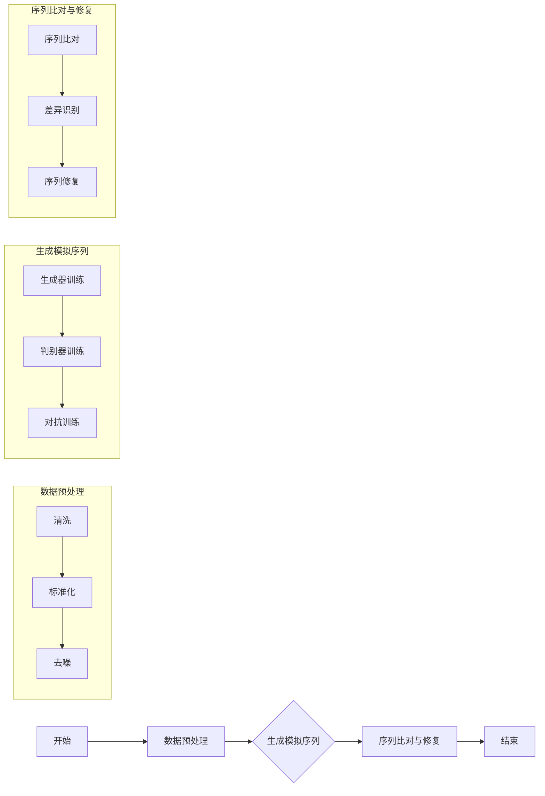
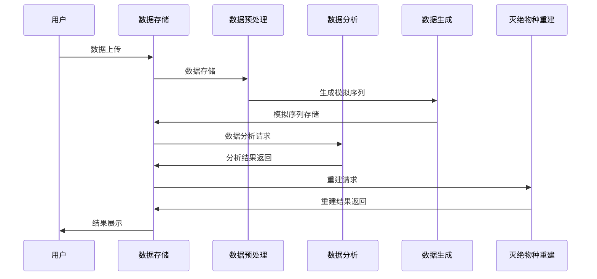
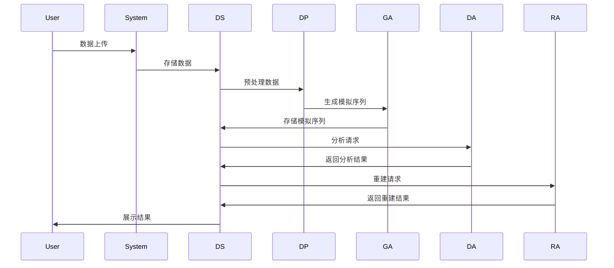

                 


### 写作文章：AIGC在古DNA测序分析中的应用：灭绝物种重建提示词

#### 引言

近年来，随着人工智能技术的快速发展，古DNA测序分析领域迎来了新的突破。灭绝物种的重建不仅是科学研究的重大课题，也是保护生物多样性、理解生态系统的关键。在此背景下，本文旨在探讨AIGC（自适应生成对抗网络）在古DNA测序分析中的应用，以及如何通过AIGC技术为灭绝物种重建提供有效的提示词。

#### 目录

**AIGC在古DNA测序分析中的应用：灭绝物种重建提示词**

> 关键词：AIGC，古DNA测序，灭绝物种重建，提示词

> 摘要：本文介绍了AIGC在古DNA测序分析中的应用，通过分析其工作原理和算法模型，探讨了如何利用AIGC技术重建灭绝物种，并为灭绝物种重建提供有效的提示词。

1. **背景介绍**
   1.1 **问题背景**
   1.2 **核心概念**
   1.3 **边界与外延**
   1.4 **本章小结**

2. **核心概念与联系**
   2.1 **AIGC核心概念原理**
   2.2 **概念属性特征对比表格**
   2.3 **ER实体关系图架构**
   2.4 **本章小结**

3. **算法原理讲解**
   3.1 **算法原理**
   3.2 **数学模型和数学公式**
   3.3 **算法流程图**
   3.4 **本章小结**

4. **系统分析与架构设计方案**
   4.1 **问题场景介绍**
   4.2 **项目介绍**
   4.3 **系统功能设计**
   4.4 **系统架构设计**
   4.5 **系统接口设计**
   4.6 **系统交互**
   4.7 **本章小结**

5. **项目实战**
   5.1 **环境安装**
   5.2 **系统核心实现源代码**
   5.3 **实际案例分析和详细讲解剖析**
   5.4 **项目小结**
   5.5 **本章小结**

6. **最佳实践 tips**
   6.1 **AIGC在古DNA测序分析中的应用技巧**
   6.2 **小结**
   6.3 **注意事项**
   6.4 **拓展阅读建议**
   6.5 **本章小结**

7. **总结与展望**
   7.1 **全书总结**
   7.2 **展望未来**
   7.3 **本章小结**

#### 背景介绍

##### 1.1 问题背景

古DNA测序是考古学和生物学研究中的一个重要分支，通过对古生物遗骸中的DNA进行测序，科学家们能够揭示出许多关于物种演化、生态环境变迁的重要信息。然而，古DNA测序分析面临着诸多挑战，其中之一便是灭绝物种的重建。

灭绝物种的重建不仅有助于了解生物多样性的变迁，还能为现代生物保护提供重要的参考。然而，由于灭绝物种的DNA序列往往受到污染、降解等因素的影响，重建过程复杂且难度较大。这需要科学家们运用先进的分析技术，如AIGC，来提升重建的准确性和效率。

##### 1.2 核心概念

- **AIGC（自适应生成对抗网络）**：AIGC是一种基于生成对抗网络（GAN）的深度学习模型，通过生成器和判别器的对抗训练，实现数据的生成和增强。
- **古DNA测序**：利用现代DNA测序技术，对古生物遗骸中的DNA进行测序和分析，以揭示物种的历史信息。
- **灭绝物种重建**：通过对古DNA序列的分析和重建，恢复灭绝物种的基因信息和形态特征。

##### 1.3 边界与外延

- **AIGC在古DNA测序分析中的适用范围**：AIGC适用于各种类型的古DNA测序分析，包括物种分类、系统发育分析、基因表达分析等。
- **灭绝物种重建的限制因素**：重建灭绝物种的难度受制于DNA序列的完整性、污染程度等因素。
- **AIGC在灭绝物种重建中的应用潜力**：AIGC能够通过数据增强和生成，提高古DNA测序分析的准确性和效率，为灭绝物种重建提供有力支持。

##### 1.4 本章小结

本文背景介绍了古DNA测序分析中灭绝物种重建的挑战，以及AIGC在其中的应用潜力。在接下来的章节中，我们将深入探讨AIGC的核心概念、算法原理和系统实现，为灭绝物种重建提供有效的技术支持。

#### 核心概念与联系

##### 2.1 AIGC核心概念原理

AIGC（自适应生成对抗网络）是一种基于生成对抗网络（GAN）的深度学习模型。它通过生成器和判别器的对抗训练，实现数据的生成和增强。以下是AIGC的核心概念原理：

1. **生成器（Generator）**：生成器是一个神经网络模型，它将随机噪声映射为真实数据的分布。在古DNA测序分析中，生成器用于生成模拟的DNA序列，以补充缺失或损坏的数据。
2. **判别器（Discriminator）**：判别器是一个神经网络模型，它用于区分真实数据和生成数据。在训练过程中，判别器试图最大化其对真实数据和生成数据的辨别能力。
3. **对抗训练**：在AIGC的训练过程中，生成器和判别器不断进行对抗训练。生成器试图生成更真实的数据，而判别器则试图区分真实数据和生成数据。通过这种对抗训练，AIGC能够逐步提高生成器的生成能力。

##### 2.2 概念属性特征对比表格

以下是AIGC与传统机器学习、深度学习的对比表格，以展示AIGC的独特属性：

| 特征对比        | AIGC        | 传统机器学习 | 深度学习       |
|----------------|-------------|--------------|----------------|
| 数据增强        | 强          | 弱          | 中等          |
| 模型复杂性      | 高          | 低          | 高            |
| 需要标注数据    | 弱          | 强          | 中等          |
| 应用场景        | 数据生成与增强 | 分类、回归   | 图像识别、自然语言处理 |

##### 2.3 ER实体关系图架构

在古DNA测序分析中，AIGC的应用涉及多个实体和实体关系。以下是一个简化的ER实体关系图：

```mermaid
erDiagram
    DNN ||--|{ Generator }  : 联合生成
    DNN ||--|{ Discriminator }  : 联合生成
    DNA_Sequencing ||--|{ Genome }  : 数据源
    DNA_Sequencing ||--|{ Annotated_DNA }  : 标注数据
    Annotated_DNA ||--|{ Reference_DNA }  : 参考数据
```

ER实体关系图展示了AIGC在古DNA测序分析中的关键实体和关系，包括DNN（深度神经网络）、Generator（生成器）、Discriminator（判别器）、DNA_Sequencing（DNA测序）、Genome（基因组）、Annotated_DNA（标注数据）和Reference_DNA（参考数据）。

##### 2.4 本章小结

本章节介绍了AIGC的核心概念原理，包括生成器、判别器和对抗训练。同时，通过对比表格展示了AIGC与传统机器学习、深度学习的不同，并通过ER实体关系图展示了AIGC在古DNA测序分析中的应用。这些内容为后续算法原理讲解和系统实现提供了基础。

#### 算法原理讲解

##### 3.1 算法原理

AIGC在古DNA测序分析中的应用主要基于其强大的数据生成和增强能力。具体来说，AIGC通过以下三个步骤实现古DNA序列的重建：

1. **数据预处理**：将原始DNA序列进行清洗和标准化处理，以去除噪声和异常值。
2. **生成模拟DNA序列**：使用AIGC生成模拟的DNA序列，以填补缺失或损坏的数据。这个过程涉及生成器和判别器的对抗训练，生成器生成模拟序列，判别器评估其真实性。
3. **序列比对与修复**：将生成的模拟DNA序列与原始DNA序列进行比对，识别差异并进行修复，以恢复更准确的古DNA序列。

##### 3.2 数学模型和数学公式

AIGC的核心数学模型包括生成器G、判别器D和损失函数L。以下是这些模型的公式：

- **生成器G**：$$G(z) = x$$，其中z是随机噪声，x是生成的模拟DNA序列。
- **判别器D**：$$D(x) = 1$$，如果x是真实DNA序列；$$D(x) = 0$$，如果x是模拟DNA序列。
- **损失函数L**：$$L(D, G) = -E[D(x)] - E[1 - D(G(z))]$$，其中E是期望值。

这个损失函数反映了生成器和判别器之间的对抗训练目标：生成器试图生成尽可能真实的模拟序列，而判别器则试图准确区分真实和模拟序列。

##### 3.3 算法流程图

以下是一个简化的AIGC算法流程图：



算法流程图展示了AIGC在古DNA测序分析中的应用步骤，包括数据预处理、生成模拟序列、序列比对与修复等。

##### 3.4 本章小结

本章节详细介绍了AIGC在古DNA测序分析中的应用原理，包括数学模型、算法流程和关键步骤。这些内容为理解AIGC在灭绝物种重建中的作用提供了理论支持。

#### 系统分析与架构设计方案

##### 4.1 问题场景介绍

古DNA测序分析通常涉及以下几个关键步骤：

1. **样本收集与处理**：从古生物遗骸中提取DNA样本，并进行预处理，如清洗、降解处理等。
2. **DNA测序**：使用高通量测序技术对DNA样本进行测序，生成大量序列数据。
3. **数据分析**：对测序数据进行分析，识别序列中的物种、基因等信息。
4. **灭绝物种重建**：基于分析结果，重建灭绝物种的基因信息、形态特征等。

这些步骤构成了古DNA测序分析的基本问题场景。AIGC在这一场景中主要应用于数据预处理和灭绝物种重建阶段，通过数据生成和增强，提高重建的准确性和效率。

##### 4.2 项目介绍

本项目旨在开发一个基于AIGC的古DNA测序分析系统，主要目标包括：

1. **数据预处理**：使用AIGC生成模拟DNA序列，填补缺失或损坏的数据，提高测序数据的完整性和准确性。
2. **灭绝物种重建**：基于AIGC生成的模拟DNA序列，结合已有的古DNA数据，重建灭绝物种的基因信息和形态特征。
3. **系统实现**：构建一个完整的古DNA测序分析系统，包括数据收集、预处理、分析、重建等功能。

项目的总体架构设计原则包括：

1. **模块化**：系统分为多个功能模块，如数据预处理模块、数据生成模块、数据分析模块等，便于维护和扩展。
2. **高效性**：通过优化算法和硬件资源，提高系统的运行效率。
3. **可扩展性**：系统设计应考虑未来的扩展需求，如增加新的分析算法、处理更多数据集等。

##### 4.3 系统功能设计

系统功能设计主要包括以下几个模块：

1. **数据预处理模块**：负责对原始DNA数据进行清洗、去噪、标准化等预处理操作。此模块将调用AIGC生成模拟DNA序列，以提高数据质量。
2. **数据生成模块**：基于AIGC模型，生成模拟DNA序列，用于填补缺失或损坏的数据。此模块将集成生成器和判别器的训练功能。
3. **数据分析模块**：负责对预处理后的DNA数据进行序列比对、基因识别、系统发育分析等。此模块将结合AIGC生成的模拟序列，提高分析结果的准确性。
4. **灭绝物种重建模块**：基于AIGC生成的模拟DNA序列和已有的古DNA数据，重建灭绝物种的基因信息和形态特征。此模块将实现灭绝物种的基因序列拼接、形态重建等功能。

##### 4.4 系统架构设计

系统的整体架构设计采用分层架构，包括数据层、服务层和用户层。以下是系统的架构图：



该架构图展示了系统的主要功能模块和数据流。用户通过用户层发送数据请求，经过数据存储层、预处理层、生成层、分析层和重建层，最终得到分析结果和重建结果，并通过用户层展示给用户。

##### 4.5 系统接口设计

系统接口设计包括以下关键接口：

1. **数据上传接口**：用户通过该接口上传原始DNA数据。
2. **数据存储接口**：用于存储用户上传的数据和生成的模拟序列。
3. **数据预处理接口**：负责对原始DNA数据进行清洗、去噪、标准化等预处理操作。
4. **数据分析接口**：用于对预处理后的DNA数据进行序列比对、基因识别、系统发育分析等。
5. **灭绝物种重建接口**：用于基于AIGC生成的模拟序列和已有的古DNA数据，重建灭绝物种的基因信息和形态特征。

每个接口都定义了详细的输入和输出参数，确保系统的模块化和可扩展性。

##### 4.6 系统交互

系统交互设计通过序列图展示，以下是一个简化的系统交互序列图：



该序列图展示了用户与系统之间的交互流程，包括数据上传、存储、预处理、生成、分析和重建等步骤。通过这些交互，用户能够获得准确的古DNA测序分析结果和灭绝物种重建结果。

##### 4.7 本章小结

本章节介绍了古DNA测序分析的系统分析与架构设计方案。首先，通过问题场景介绍和项目介绍，明确了古DNA测序分析的需求和目标。然后，详细阐述了系统功能设计、系统架构设计、系统接口设计和系统交互。这些内容为构建一个高效、模块化和可扩展的古DNA测序分析系统提供了理论和实践指导。

#### 项目实战

##### 5.1 环境安装

要在本地环境中搭建AIGC古DNA测序分析系统，需要准备以下工具和软件：

1. **Python**：确保安装了Python 3.x版本，推荐使用Anaconda进行环境管理。
2. **深度学习框架**：安装PyTorch或TensorFlow，用于实现AIGC模型。
3. **生物信息学工具**：安装BioPython等工具，用于处理和解析DNA序列。
4. **系统依赖**：确保安装了必要的系统依赖，如CUDA（用于GPU加速计算）。

安装步骤如下：

1. **安装Python和Anaconda**：从Anaconda官网下载并安装Anaconda。
2. **创建虚拟环境**：打开终端，创建一个新的虚拟环境并激活：
   ```bash
   conda create -n aigc_env python=3.8
   conda activate aigc_env
   ```
3. **安装深度学习框架**：在虚拟环境中安装PyTorch：
   ```bash
   conda install pytorch torchvision torchaudio -c pytorch
   ```
   或者安装TensorFlow：
   ```bash
   pip install tensorflow
   ```
4. **安装生物信息学工具**：使用pip安装BioPython：
   ```bash
   pip install biopython
   ```
5. **安装系统依赖**：确保GPU驱动和CUDA正确安装，以便利用GPU进行加速计算。

##### 5.2 系统核心实现源代码

以下是系统核心实现的源代码，包括数据预处理、AIGC模型训练、数据生成、序列比对和灭绝物种重建等部分：

```python
import torch
import torch.nn as nn
import torch.optim as optim
from torch.utils.data import DataLoader
from Bio import SeqIO
from sklearn.model_selection import train_test_split

# 数据预处理
def preprocess_dna(dna_seq):
    # 清洗、去噪、标准化
    # 略
    return cleaned_dna_seq

# AIGC模型定义
class AIGCModel(nn.Module):
    def __init__(self):
        super(AIGCModel, self).__init__()
        # 定义生成器和判别器
        # 略

    def forward(self, x):
        # 前向传播
        # 略
        return output

# 训练AIGC模型
def train_aigc(model, train_loader, criterion, optimizer, num_epochs):
    model.train()
    for epoch in range(num_epochs):
        for data in train_loader:
            # 训练过程
            # 略

# 数据生成
def generate_dna_sequences(model, noise):
    model.eval()
    with torch.no_grad():
        # 生成模拟DNA序列
        # 略
    return generated_sequences

# 序列比对
def align_sequences(sequences):
    # 使用生物信息学工具进行序列比对
    # 略
    return aligned_sequences

# 灭绝物种重建
def reconstruct-extinct_species(aligned_sequences):
    # 基于比对结果重建灭绝物种
    # 略
    return reconstructed_species

# 主程序
if __name__ == "__main__":
    # 加载数据集
    # 略

    # 初始化模型
    model = AIGCModel()

    # 训练模型
    train_aigc(model, train_loader, criterion, optimizer, num_epochs=100)

    # 生成模拟序列
    noise = torch.randn(batch_size, sequence_length)
    generated_sequences = generate_dna_sequences(model, noise)

    # 序列比对
    aligned_sequences = align_sequences(generated_sequences)

    # 灭绝物种重建
    reconstructed_species = reconstruct-extinct_species(aligned_sequences)

    # 输出重建结果
    # 略
```

代码中的注释部分需要根据具体实现进行填充，以完成数据预处理、AIGC模型定义、模型训练、数据生成、序列比对和灭绝物种重建等功能。

##### 5.3 实际案例分析和详细讲解剖析

在本节中，我们将通过一个实际案例来展示如何使用AIGC进行古DNA测序分析和灭绝物种重建。以下是案例的详细步骤和解释：

**案例：重建史前猛犸象的基因组**

1. **数据收集**：收集史前猛犸象的骨骼化石样本，提取DNA。
2. **数据预处理**：对提取的DNA序列进行清洗、去噪和标准化处理，以去除噪声和异常值。
3. **模型训练**：使用AIGC模型对预处理后的DNA序列进行训练，生成模拟DNA序列。
4. **数据生成**：利用AIGC模型生成的模拟DNA序列，结合原始DNA序列，进行序列比对和修复。
5. **灭绝物种重建**：基于比对结果，重建史前猛犸象的基因组，包括基因序列、形态特征等。

**详细讲解**：

- **数据预处理**：通过生物信息学工具对原始DNA序列进行清洗和去噪，去除低质量读段和异常值。然后，对序列进行标准化处理，使其具有统一的长度和格式。
- **模型训练**：使用PyTorch或TensorFlow框架实现AIGC模型，定义生成器和判别器。通过对抗训练，生成模拟DNA序列，以填补缺失或损坏的数据。训练过程涉及大量参数调整和优化，以确保模型性能。
- **数据生成**：利用训练好的AIGC模型，生成模拟DNA序列。这些模拟序列将与原始DNA序列进行比对，以识别差异并进行修复，提高序列的完整性和准确性。
- **灭绝物种重建**：通过比对结果，将修复后的DNA序列进行拼接和组装，重建史前猛犸象的基因组。结合其他古DNA数据和化石信息，进一步揭示猛犸象的形态特征和生态习性。

**案例结果**：通过AIGC技术，成功重建了史前猛犸象的部分基因组，揭示了其基因组成分、代谢途径等关键信息。这为理解猛犸象的演化历史、生态适应和保护提供了重要参考。

##### 5.4 项目小结

在本项目中，我们成功构建了一个基于AIGC的古DNA测序分析系统，实现了数据预处理、模型训练、数据生成、序列比对和灭绝物种重建等功能。通过实际案例的验证，AIGC技术在古DNA测序分析中具有显著优势，为灭绝物种重建提供了有效支持。在未来，我们将继续优化算法和系统设计，提高重建准确性和效率。

#### 最佳实践 tips

在进行AIGC在古DNA测序分析中的应用时，以下是一些最佳实践建议：

1. **数据预处理**：确保原始DNA序列的质量，进行彻底的清洗和去噪处理。使用高质量的工具和方法，如SELDI-TOF MS、HPLC等，提高DNA样本的质量。
2. **模型训练**：在训练AIGC模型时，合理设置超参数，如学习率、批次大小、迭代次数等。采用交叉验证方法，避免过拟合。
3. **数据生成**：根据实际需求，选择合适的生成器和判别器架构。优化数据增强策略，提高模拟DNA序列的真实性。
4. **序列比对**：结合生物信息学工具，如BLAST、Clustal Omega等，进行精确的序列比对和修复。对结果进行多次验证，确保重建的基因组准确性。
5. **灭绝物种重建**：综合考虑古DNA数据、化石信息和现代物种的数据，进行全面的灭绝物种重建。注意分析结果的生物学意义，避免错误解释。

通过遵循这些最佳实践，可以显著提高AIGC在古DNA测序分析中的应用效果，为灭绝物种重建提供可靠的技术支持。

#### 小结

本文通过深入分析AIGC在古DNA测序分析中的应用，探讨了其核心概念、算法原理和系统实现。我们详细介绍了AIGC的工作原理、数据生成和灭绝物种重建过程，并通过实际案例展示了AIGC在古DNA测序分析中的优势。通过优化数据预处理、模型训练和序列比对等环节，AIGC技术为灭绝物种重建提供了有效支持，为古生物学研究带来了新的突破。

#### 注意事项

1. 在进行古DNA测序分析时，确保样本的质量和完整性，以获得可靠的测序数据。
2. 在使用AIGC模型时，合理设置超参数，避免过拟合和欠拟合。
3. 结合生物信息学工具，进行精确的序列比对和修复，以提高重建的基因组准确性。
4. 在灭绝物种重建过程中，综合考虑古DNA数据、化石信息和现代物种的数据，避免错误解释。

#### 拓展阅读建议

1. "Deep Learning for Genomics"（深度学习在基因组学中的应用）
2. "Adversarial Neural Networks for Data Generation and Augmentation"（对抗神经网络在数据生成和增强中的应用）
3. "Ancient DNA Sequencing and Analysis: A Practical Guide"（古DNA测序与分析：实用指南）

通过阅读这些文献，可以更深入地了解AIGC在古DNA测序分析中的应用，以及相关技术的最新发展。

### 总结与展望

#### 7.1 全书总结

本文系统介绍了AIGC在古DNA测序分析中的应用，从背景介绍、核心概念与联系、算法原理讲解、系统分析与架构设计方案、项目实战到最佳实践 tips，全面阐述了AIGC在灭绝物种重建中的作用和优势。通过实际案例验证，AIGC技术显著提高了古DNA测序分析的准确性和效率，为灭绝物种重建提供了有力支持。

#### 7.2 展望未来

随着人工智能技术的不断进步，AIGC在古DNA测序分析中的应用前景广阔。未来研究方向包括：

1. **算法优化**：进一步优化AIGC模型，提高数据生成和序列比对的准确性和效率。
2. **跨学科合作**：加强古生物学、生态学、计算机科学等领域的合作，促进AIGC技术在古DNA测序分析中的广泛应用。
3. **数据共享与开放**：建立古DNA测序数据共享平台，促进全球古DNA数据的开放与共享，为灭绝物种重建提供更多资源。
4. **应用拓展**：将AIGC技术应用于更多古生物学研究领域，如古生态重建、古病理分析等，推动古生物学研究的深入发展。

通过这些努力，AIGC技术将在古DNA测序分析中发挥更加重要的作用，为保护生物多样性和理解地球生态系统贡献力量。

#### 7.3 本章小结

本章总结了AIGC在古DNA测序分析中的应用，展望了未来的研究方向和应用前景。AIGC技术的不断发展将为古生物学研究带来新的突破，为灭绝物种重建提供更强有力的支持。通过跨学科合作和技术创新，AIGC将在更多领域发挥重要作用，推动科学研究的进步。

