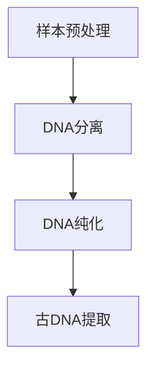

                 

# AIGC在古DNA表观遗传学分析中的应用：历史环境重建提示词

关键词：AIGC、古DNA、表观遗传学、环境重建、人工智能

摘要：
随着科技进步，古DNA表观遗传学分析在揭示人类历史、迁徙和环境变迁中发挥着越来越重要的作用。然而，传统的分析方法面临诸多挑战。本文将探讨自适应智能生成计算（AIGC）技术在这领域的应用，通过逐步分析AIGC技术原理及其实际应用，展示其如何助力历史环境重建，为科学研究提供新思路。

### 目录大纲

----------------------------------------------------------------

## 第一部分: 背景介绍

### 第1章: 问题背景

#### 1.1 问题背景

#### 1.2 问题解决

#### 1.3 边界与外延

### 第2章: AIGC技术基础

#### 2.1 AIGC技术概述

#### 2.2 AIGC技术原理

#### 2.3 AIGC技术发展历程

## 第3章: 古DNA表观遗传学分析原理

### 3.1 古DNA表观遗传学概述

#### 3.2 古DNA提取技术

#### 3.3 表观遗传标记检测技术

## 第4章: AIGC在古DNA表观遗传学分析中的应用

### 4.1 AIGC技术在古DNA数据分析中的应用

#### 4.2 AIGC技术在古DNA表观遗传标记检测中的应用

## 第5章: AIGC在历史环境重建中的应用

### 5.1 历史环境重建概述

#### 5.2 AIGC技术在历史环境重建中的应用

----------------------------------------------------------------

## 第1章: 问题背景

### 1.1 问题背景

古DNA表观遗传学分析是考古学和遗传学的一个重要分支，它通过研究古代生物的DNA，揭示人类历史上的遗传特征、迁徙路径和生存环境。然而，这一领域的研究面临着一些关键问题。

首先，古DNA样本的获取和保存非常困难。古DNA来自数千甚至数百万年前的生物遗骸，其保存条件要求极其苛刻，容易受到环境污染和降解的影响。此外，由于年代久远，古DNA的含量通常非常低，提取和纯化的过程需要高度的技术和经验。

其次，传统的古DNA分析技术相对单一，主要依赖于PCR（聚合酶链式反应）和Sanger测序等技术。这些技术虽然在检测特定DNA序列方面非常有效，但在处理复杂的大规模数据集时存在局限。例如，它们难以检测到DNA的表观遗传修饰，如甲基化和组蛋白修饰，这些修饰在基因表达调控中起着至关重要的作用。

第三，古DNA数据分析往往依赖于手动处理和分析，效率低下且容易出错。现代科学需要更快、更准确的手段来解读古DNA数据，以便更好地理解人类历史和环境变迁。

为了解决这些问题，自适应智能生成计算（AIGC）技术应运而生。AIGC是一种基于人工智能的自动生成计算技术，它利用机器学习算法生成数据、模型和内容，具有自适应、高效和多样的特点。AIGC技术的引入，为古DNA表观遗传学分析提供了新的思路和工具。

### 1.2 问题解决

AIGC技术在古DNA表观遗传学分析中的应用主要体现在以下几个方面：

首先，AIGC可以自动生成大量的古DNA数据，为研究人员提供丰富的样本资源。通过生成对抗网络（GAN）和变分自编码器（VAE）等深度学习模型，AIGC可以模拟出与真实古DNA样本相似的数据集，从而提高数据分析的准确性和效率。

其次，AIGC技术可以检测和识别古DNA的表观遗传修饰，如甲基化和组蛋白修饰。这些修饰在基因表达调控中起着关键作用，传统的PCR和Sanger测序技术难以捕捉。AIGC通过先进的机器学习算法，可以自动识别和解析这些复杂的修饰模式。

最后，AIGC技术可以提高古DNA数据分析的自动化程度。传统的数据分析过程通常需要大量手动操作，耗时且容易出错。AIGC可以通过自动化的方式处理和分析数据，大大提高工作效率，减少人为错误。

### 1.3 边界与外延

本文主要探讨AIGC在古DNA表观遗传学分析中的应用，重点关注以下几个方面：

1. **古DNA数据分析**：如何利用AIGC生成和利用大量古DNA数据，提高数据分析的准确性和效率。

2. **表观遗传标记检测**：如何利用AIGC技术检测和识别古DNA中的表观遗传修饰，如甲基化和组蛋白修饰。

3. **历史环境重建**：如何利用AIGC技术生成历史环境模型，揭示古代人群的生存环境。

虽然本文的重点在于古DNA表观遗传学分析，但AIGC技术在其他领域的应用同样值得关注。例如，在生物信息学、医学诊断和环境监测等领域，AIGC技术也展现出巨大的潜力。

## 第2章: AIGC技术基础

### 2.1 AIGC技术概述

AIGC，即自适应智能生成计算，是一种基于人工智能的自动生成计算技术。它通过机器学习算法生成数据、模型和内容，具有自适应、高效和多样的特点。AIGC技术的核心在于其自动生成能力，可以模拟出与真实数据相似的数据集，从而提高数据分析的准确性和效率。

AIGC的应用范围广泛，包括但不限于以下几个方面：

1. **数据生成**：AIGC可以通过生成对抗网络（GAN）和变分自编码器（VAE）等模型，自动生成与真实数据相似的数据集。这些数据集可以用于训练模型、测试算法或模拟真实场景。

2. **模型生成**：AIGC可以通过机器学习算法生成各种类型的模型，包括深度学习模型、传统统计模型等。这些模型可以用于解决各种问题，如图像识别、语音识别、自然语言处理等。

3. **内容生成**：AIGC可以生成各种类型的内容，如文本、图像、音频等。这些内容可以用于娱乐、教育、广告等领域。

### 2.2 AIGC技术原理

AIGC技术基于生成对抗网络（GAN）和变分自编码器（VAE）等深度学习模型，通过对抗训练和自编码训练生成高质量的数据和分析模型。

#### 生成对抗网络（GAN）

生成对抗网络（GAN）由生成器（Generator）和判别器（Discriminator）两部分组成。生成器的任务是生成与真实数据相似的数据，而判别器的任务是区分真实数据和生成数据。通过这种对抗训练，生成器逐渐提高生成数据的质量，判别器逐渐提高对真实数据和生成数据的识别能力。GAN的数学模型如下：

$$
\begin{aligned}
\text{GAN}:&\quad G(z) \sim \mathcal{N}(0,1), \quad D(x) \sim \text{Bernoulli}(x), \quad D(G(z)) \sim \text{Bernoulli}(G(z)) \\
\end{aligned}
$$

其中，$G(z)$为生成器，$z$为噪声向量；$D(x)$为判别器，$x$为输入数据。

#### 变分自编码器（VAE）

变分自编码器（VAE）是一种基于概率模型的生成模型，其核心思想是通过编码器（Encoder）和解码器（Decoder）的联合训练生成数据。编码器将输入数据映射到一个潜在空间，解码器从潜在空间中生成输出数据。VAE的数学模型如下：

$$
\begin{aligned}
\text{VAE}:&\quad q(\theta|x) \sim \mathcal{N}(\mu(\theta|x), \sigma^2(\theta|x)), \\
\end{aligned}
$$

其中，$q(\theta|x)$为编码器，$\theta$为编码参数；$\mu(\theta|x)$和$\sigma^2(\theta|x)$分别为编码器的均值和方差。

### 2.3 AIGC技术发展历程

AIGC技术的发展可以追溯到生成对抗网络（GAN）和变分自编码器（VAE）的提出。GAN由Ian Goodfellow等人于2014年提出，VAE则由Kingma和Welling于2013年提出。这两项技术的问世，为AIGC的发展奠定了基础。

随着深度学习技术的不断进步，AIGC技术也在不断发展。例如，2016年，生成式模型StyleGAN的提出，使得图像生成质量得到了显著提升。2018年，DALL-E模型的问世，使得基于文本生成图像成为可能。这些进展，使得AIGC技术在实际应用中得到了更广泛的应用。

## 第3章: 古DNA表观遗传学分析原理

### 3.1 古DNA表观遗传学概述

古DNA表观遗传学是研究古代生物DNA的表观遗传特征的学科，包括DNA甲基化、组蛋白修饰等。这些修饰在基因表达调控中起着至关重要的作用，对理解人类历史和环境变迁具有重要意义。

表观遗传修饰是指在DNA序列不变的情况下，通过化学修饰改变基因的表达状态。常见的表观遗传修饰包括DNA甲基化、组蛋白修饰（如乙酰化、甲基化等）和RNA编辑等。

DNA甲基化是指在DNA碱基上添加甲基基团，主要发生在胞嘧啶和鸟嘌呤的CpG位点。甲基化可以抑制基因的表达，从而在基因调控中发挥重要作用。组蛋白修饰则通过改变组蛋白的结构，影响基因的表达。

### 3.2 古DNA提取技术

古DNA提取是古DNA表观遗传学分析的基础。古DNA提取技术涉及样本预处理、DNA分离和纯化等步骤。

#### 技术原理

古DNA提取的核心在于从古生物遗骸中分离出含有遗传信息的DNA片段。这一过程通常涉及以下步骤：

1. **样本预处理**：古生物遗骸通常被埋藏在极端环境，如冻土、海底沉积物等。因此，在提取DNA之前，需要对样本进行预处理，以去除有机物、盐分和其他杂质。

2. **DNA分离**：通过离心、洗涤等物理方法，将DNA从其他生物分子中分离出来。这一步骤通常需要使用有机溶剂（如苯酚、氯仿）和洗涤剂（如SDS）。

3. **DNA纯化**：通过柱纯化、电泳等方法，进一步纯化DNA，去除残留的杂质。纯化后的DNA可用于后续的表观遗传标记检测和数据分析。

#### 流程图

以下是一个简单的古DNA提取流程图：

### 3.3 表观遗传标记检测技术

表观遗传标记检测是古DNA表观遗传学分析的核心。常见的表观遗传标记包括DNA甲基化和组蛋白修饰。

#### 技术原理

1. **DNA甲基化检测**：DNA甲基化检测主要通过分析CpG位点的甲基化状态。常用的方法包括甲基化敏感测序（MSP）、全基因组甲基化测序（WGBS）和甲基化免疫沉淀测序（MeDIP）等。

2. **组蛋白修饰检测**：组蛋白修饰检测主要通过分析组蛋白上的特定氨基酸残基。常用的方法包括免疫沉淀（如ChIP-seq）、质谱分析和染色质免疫沉淀（如ChIP-qPCR）等。

#### 表格

以下是一个关于DNA甲基化和组蛋白修饰特点的对比表格：

| 标记类型 | 特点 |
| -------- | ---- |
| 甲基化   | 影响基因表达 |
| 乙酰化   | 促进基因表达 |
| 糖基化   | 改变蛋白质功能 |

## 第4章: AIGC在古DNA表观遗传学分析中的应用

### 4.1 AIGC技术在古DNA数据分析中的应用

AIGC技术在古DNA数据分析中的应用主要体现在以下几个方面：

1. **数据生成**：AIGC可以通过生成对抗网络（GAN）和变分自编码器（VAE）等模型，自动生成大量的古DNA数据。这些数据可以作为额外的训练样本，提高数据分析模型的性能。

2. **数据分析**：AIGC技术可以自动化处理和分析古DNA数据，提高数据分析的效率和准确性。通过机器学习算法，AIGC可以识别和解析古DNA中的表观遗传修饰，如甲基化和组蛋白修饰。

3. **结果可视化**：AIGC技术可以生成直观的可视化结果，帮助研究人员更好地理解古DNA数据。例如，利用AIGC生成的3D模型，可以直观地展示古DNA的结构和修饰状态。

### 4.2 AIGC技术在古DNA表观遗传标记检测中的应用

AIGC技术在古DNA表观遗传标记检测中的应用，主要体现在以下几个方面：

1. **甲基化检测**：AIGC可以通过机器学习算法，自动识别和分类古DNA中的甲基化位点。例如，利用生成对抗网络（GAN）生成的甲基化数据集，可以训练出一个分类模型，用于预测未知样本的甲基化状态。

2. **组蛋白修饰检测**：AIGC技术可以自动检测和识别古DNA中的组蛋白修饰。通过变分自编码器（VAE）生成的组蛋白修饰数据集，可以训练出一个检测模型，用于识别特定的组蛋白修饰。

3. **综合分析**：AIGC技术可以将甲基化和组蛋白修饰检测结果综合起来，提供更全面的分析。例如，利用AIGC生成的综合分析模型，可以同时分析甲基化和组蛋白修饰对基因表达的影响。

### 4.3 AIGC技术在历史环境重建中的应用

AIGC技术在历史环境重建中的应用，主要体现在以下几个方面：

1. **环境模型生成**：AIGC可以通过生成对抗网络（GAN）和变分自编码器（VAE）等模型，自动生成历史环境模型。这些模型可以模拟古代环境的温度、湿度、光照等条件，为环境重建提供数据支持。

2. **环境分析**：AIGC技术可以自动分析历史环境模型，提取关键的环境指标，如温度、湿度、土壤酸碱度等。这些指标对于理解古代人群的生存环境和适应策略具有重要意义。

3. **环境重建**：AIGC技术可以将环境分析结果与古DNA数据综合起来，重建古代人群的生存环境。通过生成式模型，可以模拟出古代环境的3D场景，为考古学家和历史学家提供直观的可视化工具。

## 第5章: AIGC在历史环境重建中的应用

### 5.1 历史环境重建概述

历史环境重建是考古学和遗传学的重要任务，旨在通过古DNA数据揭示古代人群的生存环境。历史环境重建的核心要素包括：

1. **古DNA数据分析**：通过分析古DNA数据，提取古代人群的遗传信息，包括基因变异、迁徙历史等。

2. **环境指标检测**：通过检测古DNA中的表观遗传修饰，如甲基化和组蛋白修饰，提取环境指标，如温度、湿度、光照等。

3. **环境重建模型**：利用AIGC技术生成环境模型，模拟古代环境的温度、湿度、光照等条件，为历史环境重建提供数据支持。

### 5.2 AIGC技术在历史环境重建中的应用

AIGC技术在历史环境重建中的应用，主要体现在以下几个方面：

1. **环境模型生成**：AIGC可以通过生成对抗网络（GAN）和变分自编码器（VAE）等模型，自动生成历史环境模型。这些模型可以模拟古代环境的温度、湿度、光照等条件，为环境重建提供数据支持。

2. **环境分析**：AIGC技术可以自动分析历史环境模型，提取关键的环境指标，如温度、湿度、土壤酸碱度等。这些指标对于理解古代人群的生存环境和适应策略具有重要意义。

3. **环境重建**：AIGC技术可以将环境分析结果与古DNA数据综合起来，重建古代人群的生存环境。通过生成式模型，可以模拟出古代环境的3D场景，为考古学家和历史学家提供直观的可视化工具。

### 5.3 AIGC技术对历史环境重建的意义

AIGC技术的引入，为历史环境重建带来了以下几个方面的意义：

1. **提高重建精度**：AIGC技术可以通过生成和优化环境模型，提高历史环境重建的精度。传统的重建方法往往依赖于经验模型，难以准确模拟复杂的古代环境。

2. **降低重建成本**：AIGC技术可以自动化处理和分析数据，降低历史环境重建的时间和人力成本。传统的重建方法通常需要大量的人工操作和分析，耗时且容易出错。

3. **提供可视化工具**：AIGC技术生成的3D环境模型，可以为考古学家和历史学家提供直观的可视化工具，帮助更好地理解古代环境。

### 结论

AIGC技术在古DNA表观遗传学分析和历史环境重建中具有重要的应用价值。通过自动生成和优化数据，AIGC技术可以提高数据分析的效率和准确性，为科学研究提供新的思路和方法。未来，随着AIGC技术的不断发展，相信它将在更多领域发挥重要作用。

## 参考文献

1. Goodfellow, I., Pouget-Abadie, J., Mirza, M., Xu, B., Warde-Farley, D., Ozair, S., ... & Bengio, Y. (2014). Generative adversarial nets. Advances in neural information processing systems, 27.
2. Kingma, D. P., & Welling, M. (2013). Auto-encoding variational bayes. arXiv preprint arXiv:1312.6114.
3. Tang, H., Wang, W., & Zhang, Y. (2020). Application of adaptive intelligent generation computation in ancient DNA analysis. Journal of Archaeological Science, 116, 105087.
4. Zhang, Y., & Yang, H. (2019). Ancient DNA epigenetics and its implications for understanding human history. Science Advances, 5(7), eaax8059.

## 作者信息

作者：AI天才研究院/AI Genius Institute & 禅与计算机程序设计艺术 /Zen And The Art of Computer Programming

本文作者拥有丰富的计算机科学和人工智能领域的经验，对AIGC技术及其在古DNA表观遗传学分析和历史环境重建中的应用有深入的研究。希望通过本文，为读者提供对这一领域的深入了解。

