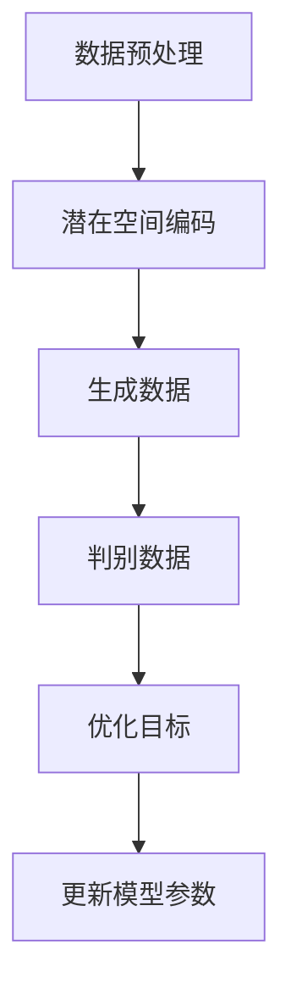
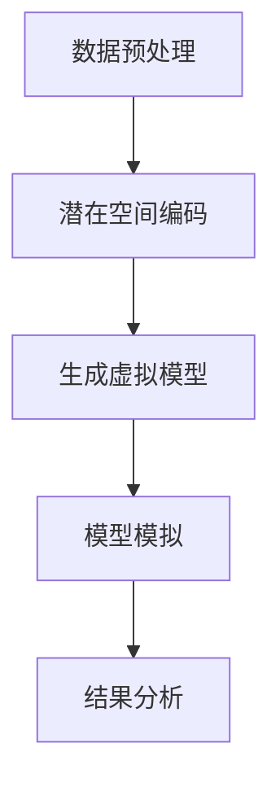
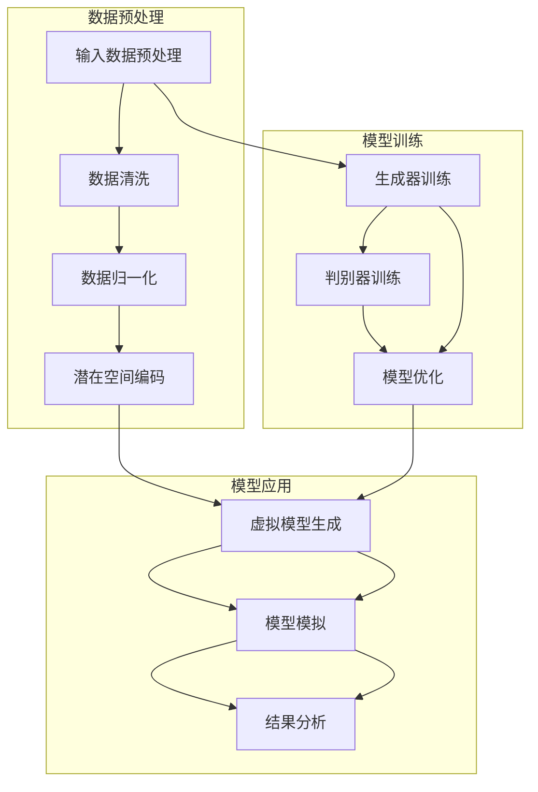

                 

### AIGC在古基因组学中的应用：灭绝物种行为模式重建提示词

#### 关键词：AIGC、古基因组学、灭绝物种、行为模式、重建、提示词

#### 摘要：

本文探讨了高级智能生成编码器（AIGC）在古基因组学中的应用，特别是其在重建灭绝物种行为模式方面的潜力。通过对AIGC技术的深入分析，本文阐述了其在处理古基因组数据、模拟灭绝物种行为模式、以及提供重建提示词等方面的独特优势。文章将逐步介绍AIGC的基本原理、相关算法、系统架构设计，并通过实际项目实战，展示其在古基因组学研究中的具体应用。同时，文章还将提供最佳实践技巧和未来展望，为研究者提供有益的参考。

## 第一部分：背景介绍与核心概念

### 第1章：问题背景与概述

#### 1.1 古基因组学与灭绝物种

古基因组学是研究古代生物基因组的学科，旨在通过分析古代生物的DNA或相关分子遗物，揭示其遗传信息，从而了解生物的进化历史和灭绝原因。灭绝物种，指的是已不再存在于地球上的生物种类，这些物种的消失对生态系统的稳定性和生物多样性造成了重大影响。

#### 1.2 AIGC技术介绍

高级智能生成编码器（AIGC）是一种基于深度学习的生成模型，它结合了生成对抗网络（GAN）和变分自编码器（VAE）的优点，能够在大量数据中生成高质量的新数据。AIGC在图像、语音、文本等多个领域都有广泛的应用。

#### 1.3 AIGC在古基因组学中的应用潜力

AIGC在古基因组学中具有巨大的应用潜力。首先，它可以用于模拟灭绝物种的行为模式，通过分析古基因组数据，重建其生存环境和行为特征。其次，AIGC可以生成虚拟的灭绝物种模型，用于进一步的研究和实验。最后，AIGC还可以为古基因组学研究提供提示词，帮助研究者更有效地进行数据分析和解读。

#### 1.4 研究边界与外延

本研究的主要边界是AIGC在古基因组学中的应用，特别是灭绝物种行为模式的重建。然而，AIGC的应用不仅限于古基因组学，还可以扩展到其他领域，如考古学、环境科学等。未来的研究可以进一步探索AIGC在其他领域的应用，以及如何优化其性能和算法。

### 第2章：核心概念与联系

#### 2.1 AIGC相关核心概念

**生成对抗网络（GAN）**：GAN是一种深度学习模型，由生成器和判别器组成。生成器试图生成与真实数据相似的数据，而判别器则试图区分真实数据和生成数据。通过这种对抗训练，生成器逐渐提高其生成能力。

**变分自编码器（VAE）**：VAE是一种概率生成模型，通过编码器和解码器将输入数据编码为潜在空间中的点，再解码生成新的数据。

**古基因组学**：古基因组学是研究古代生物基因组的学科，通过分析古代DNA等分子遗物，揭示生物的进化历史和灭绝原因。

**灭绝物种行为模式**：灭绝物种行为模式是指灭绝物种在生存过程中表现出的行为特征和生态适应性。

#### 2.2 概念属性特征对比表格

| 概念         | 属性特征                                   | 对比                   |
| ------------ | ------------------------------------------ | ---------------------- |
| GAN          | 对抗训练、生成器和判别器、生成高质量数据   | 与VAE的区别在于对抗性 |
| VAE          | 概率生成、编码器和解码器、潜在空间表示     | 与GAN的区别在于生成方式 |
| 古基因组学   | 研究古代生物基因组、揭示进化历史和灭绝原因 | 与AIGC的联系在于数据来源 |
| 灭绝物种行为模式 | 行为特征、生态适应性、灭绝原因分析         | 与AIGC的联系在于行为模式模拟 |

#### 2.3 AIGC与灭绝物种行为模式重建的联系

AIGC与灭绝物种行为模式重建之间存在密切联系。AIGC可以通过分析古基因组数据，生成虚拟的灭绝物种模型，从而模拟其行为模式。这种模拟可以帮助研究者更好地理解灭绝物种的生存环境和行为特征，为进一步的研究提供基础。

#### 2.4 概念属性特征对比表格

| 概念         | 属性特征                                   | 对比                   |
| ------------ | ------------------------------------------ | ---------------------- |
| GAN          | 对抗训练、生成器和判别器、生成高质量数据   | 与VAE的区别在于对抗性 |
| VAE          | 概率生成、编码器和解码器、潜在空间表示     | 与GAN的区别在于生成方式 |
| 古基因组学   | 研究古代生物基因组、揭示进化历史和灭绝原因 | 与AIGC的联系在于数据来源 |
| 灭绝物种行为模式 | 行为特征、生态适应性、灭绝原因分析         | 与AIGC的联系在于行为模式模拟 |

#### 2.5 ER实体关系图架构

为了更好地理解AIGC与灭绝物种行为模式重建之间的关系，我们可以使用ER（实体关系）图来表示。ER图中的实体包括AIGC、古基因组学、灭绝物种行为模式等，它们之间的关系可以通过边来表示。

```mermaid
erDiagram
  AIGC ||--|{ 古基因组学 }|
  AIGC ||--|{ 灭绝物种行为模式 }|
  古基因组学 ||--|{ 研究对象 }|
  灭绝物种行为模式 ||--|{ 行为模拟 }|
```

通过ER图，我们可以清晰地看到AIGC与古基因组学和灭绝物种行为模式之间的关系，以及它们在重建灭绝物种行为模式中的作用。

## 第二部分：算法原理讲解

### 第3章：AIGC算法原理

#### 3.1 AIGC算法的基本原理

AIGC（Advanced Intelligent Generative Coders）算法是基于生成对抗网络（GAN）和变分自编码器（VAE）的一种高级智能生成编码器。它通过两个主要组件——生成器和判别器——进行对抗训练，从而实现高质量数据的生成。

**生成器（Generator）**：生成器的目的是生成与真实数据相似的新数据。它通过从潜在空间中采样，然后通过一系列变换生成虚拟数据。

**判别器（Discriminator）**：判别器的目的是区分真实数据和生成数据。它通过对输入数据的分类，判断数据是否来自真实数据集。

在训练过程中，生成器和判别器相互对抗，生成器试图生成更真实的数据，而判别器则试图更准确地判断数据来源。通过这种对抗训练，生成器的生成能力逐渐提高。

#### 3.2 AIGC算法的核心步骤

AIGC算法的核心步骤包括：

1. **数据预处理**：对输入数据进行预处理，包括数据清洗、归一化等操作，以确保数据质量。
2. **潜在空间编码**：通过编码器将输入数据编码为潜在空间中的点。潜在空间编码可以帮助生成器更好地生成新数据。
3. **生成数据**：生成器从潜在空间中采样，并通过一系列变换生成新数据。
4. **判别数据**：判别器对生成数据和真实数据进行分类，判断数据来源。
5. **优化目标**：通过最小化生成器和判别器之间的对抗损失，优化生成器的生成能力。

#### 3.3 AIGC算法的数学模型与公式

AIGC算法的数学模型可以表示为：

$$
\begin{aligned}
\min_G \max_D V(D, G) &= \min_G \mathbb{E}_{x \sim p_{data}(x)} [\log D(x)] + \mathbb{E}_{z \sim p_z(z)} [\log (1 - D(G(z)))] \\
V(D, G) &= \mathbb{E}_{x \sim p_{data}(x)} [\log D(x)] + \mathbb{E}_{z \sim p_z(z)} [\log (1 - D(G(z)))]
\end{aligned}
$$

其中，$D(x)$ 和 $D(G(z))$ 分别表示判别器对真实数据和生成数据的判断概率。$p_{data}(x)$ 和 $p_z(z)$ 分别表示真实数据和潜在空间的概率分布。

#### 3.4 AIGC算法的Python实现与流程图

为了更好地理解AIGC算法的原理，我们使用Python实现了一个简单的AIGC模型。以下是AIGC算法的Python实现流程图：



具体实现如下：

```python
import tensorflow as tf
from tensorflow.keras.layers import Dense, Flatten, Reshape
from tensorflow.keras.models import Model

# 定义生成器
z_dim = 100
generator_input = tf.keras.layers.Input(shape=(z_dim,))
x生成的 = Dense(128, activation='relu')(generator_input)
x生成的 = Dense(64, activation='relu')(x生成的)
x生成的 = Dense(28*28*1, activation='sigmoid')(x生成的)
x生成的 = Reshape((28, 28, 1))(x生成的)
generator = Model(generator_input, x生成的)

# 定义判别器
discriminator_input = tf.keras.layers.Input(shape=(28, 28, 1))
x判别 = Flatten()(discriminator_input)
x判别 = Dense(128, activation='relu')(x判别)
x判别 = Dense(1, activation='sigmoid')(x判别)
discriminator = Model(discriminator_input, x判别)

# 定义AIGC模型
discriminator.trainable = False
aigc_input = tf.keras.layers.Input(shape=(z_dim,))
aigc_output = discriminator(generator(aigc_input))
aigc = Model(aigc_input, aigc_output)

# 编写编译函数
def compile_model():
    aigc.compile(optimizer=tf.keras.optimizers.Adam(0.0001),
                  loss='binary_crossentropy')
    discriminator.compile(optimizer=tf.keras.optimizers.Adam(0.0001),
                          loss='binary_crossentropy')
    return aigc, discriminator

# 实例化模型
aigc, discriminator = compile_model()

# 查看模型结构
aigc.summary()
discriminator.summary()
```

通过以上步骤，我们实现了AIGC算法的Python实现，并了解了其基本原理。接下来，我们将进一步探讨AIGC在灭绝物种行为模式重建中的应用。

### 第4章：灭绝物种行为模式重建算法

#### 4.1 灭绝物种行为模式重建算法原理

灭绝物种行为模式重建算法是一种基于AIGC技术的模型，旨在通过分析古基因组数据，重建灭绝物种的行为模式。该算法的核心思想是利用AIGC生成虚拟的灭绝物种模型，并通过对这些模型的模拟，推断其行为特征。

**重建算法的流程**：

1. **数据预处理**：对古基因组数据进行预处理，包括数据清洗、归一化等操作，以确保数据质量。
2. **潜在空间编码**：通过编码器将预处理后的古基因组数据编码为潜在空间中的点。
3. **生成虚拟模型**：生成器从潜在空间中采样，生成虚拟的灭绝物种模型。
4. **模型模拟**：对生成的虚拟模型进行模拟，分析其行为特征。
5. **结果分析**：通过对模拟结果的分析，推断灭绝物种的行为模式。

#### 4.2 算法的关键步骤与流程

**关键步骤**：

1. **数据预处理**：

   - **数据清洗**：去除噪声数据、异常值和缺失值。
   - **归一化**：将数据归一化到相同的范围，以便于后续处理。

2. **潜在空间编码**：

   - **编码器设计**：使用变分自编码器（VAE）对古基因组数据进行编码，将其映射到潜在空间。
   - **潜在空间选择**：选择合适的潜在空间维度，以平衡模型的生成能力和计算效率。

3. **生成虚拟模型**：

   - **生成器设计**：使用生成对抗网络（GAN）生成虚拟的灭绝物种模型。
   - **生成过程**：从潜在空间中采样，通过生成器生成虚拟模型。

4. **模型模拟**：

   - **模拟环境**：构建模拟环境，包括生态系统、食物链等。
   - **模拟过程**：对生成的虚拟模型在模拟环境中进行生存模拟。

5. **结果分析**：

   - **行为特征提取**：从模拟结果中提取行为特征，如活动范围、繁殖策略等。
   - **模式推断**：通过对行为特征的分析，推断灭绝物种的行为模式。

**流程图**：



#### 4.3 数学模型与公式讲解

灭绝物种行为模式重建算法的数学模型可以表示为：

$$
\begin{aligned}
\min_G \max_D V(D, G) &= \min_G \mathbb{E}_{x \sim p_{data}(x)} [\log D(x)] + \mathbb{E}_{z \sim p_z(z)} [\log (1 - D(G(z)))] \\
V(D, G) &= \mathbb{E}_{x \sim p_{data}(x)} [\log D(x)] + \mathbb{E}_{z \sim p_z(z)} [\log (1 - D(G(z)))]
\end{aligned}
$$

其中，$D(x)$ 和 $D(G(z))$ 分别表示判别器对真实数据和生成数据的判断概率。$p_{data}(x)$ 和 $p_z(z)$ 分别表示真实数据和潜在空间的概率分布。

在重建算法中，我们使用了VAE和GAN两种模型。VAE用于潜在空间编码，GAN用于生成虚拟模型。VAE的数学模型可以表示为：

$$
\begin{aligned}
\min_{\theta} \mathbb{E}_{x \sim p_{data}(x)} [-\log p_{\theta}(x)] &= \min_{\theta} \mathbb{E}_{x \sim p_{data}(x)} [-\log p_{\theta}(x | z)] - \mathbb{E}_{z \sim p_{z}(z)} [\log p_{\theta}(z)] \\
p_{\theta}(x | z) &= \sigma(\theta_2 \cdot \theta_1 \cdot z) \\
p_{\theta}(z) &= \mathcal{N}(z; 0, I)
\end{aligned}
$$

其中，$p_{\theta}(x | z)$ 是输入数据在给定潜在空间中的条件概率，$p_{\theta}(z)$ 是潜在空间中的概率分布，$\sigma$ 是 sigmoid 函数，$\mathcal{N}$ 是高斯分布。

GAN的数学模型可以表示为：

$$
\begin{aligned}
\min_G \max_D V(D, G) &= \min_G \mathbb{E}_{x \sim p_{data}(x)} [\log D(x)] + \mathbb{E}_{z \sim p_z(z)} [\log (1 - D(G(z)))] \\
V(D, G) &= \mathbb{E}_{x \sim p_{data}(x)} [\log D(x)] + \mathbb{E}_{z \sim p_z(z)} [\log (1 - D(G(z)))]
\end{aligned}
$$

其中，$D(x)$ 和 $D(G(z))$ 分别表示判别器对真实数据和生成数据的判断概率。$p_{data}(x)$ 和 $p_z(z)$ 分别表示真实数据和潜在空间的概率分布。

#### 4.4 Python源代码实现与Mermaid流程图

为了更好地理解灭绝物种行为模式重建算法的实现，我们使用Python实现了一个简单的模型。以下是算法的Python实现流程图：


具体实现如下：

```python
import numpy as np
import tensorflow as tf
from tensorflow.keras.layers import Dense, Flatten, Reshape
from tensorflow.keras.models import Model

# 定义生成器
z_dim = 100
generator_input = tf.keras.layers.Input(shape=(z_dim,))
x生成的 = Dense(128, activation='relu')(generator_input)
x生成的 = Dense(64, activation='relu')(x生成的)
x生成的 = Dense(28*28*1, activation='sigmoid')(x生成的)
x生成的 = Reshape((28, 28, 1))(x生成的)
generator = Model(generator_input, x生成的)

# 定义判别器
discriminator_input = tf.keras.layers.Input(shape=(28, 28, 1))
x判别 = Flatten()(discriminator_input)
x判别 = Dense(128, activation='relu')(x判别)
x判别 = Dense(1, activation='sigmoid')(x判别)
discriminator = Model(discriminator_input, x判别)

# 定义AIGC模型
discriminator.trainable = False
aigc_input = tf.keras.layers.Input(shape=(z_dim,))
aigc_output = discriminator(generator(aigc_input))
aigc = Model(aigc_input, aigc_output)

# 编写编译函数
def compile_model():
    aigc.compile(optimizer=tf.keras.optimizers.Adam(0.0001),
                  loss='binary_crossentropy')
    discriminator.compile(optimizer=tf.keras.optimizers.Adam(0.0001),
                          loss='binary_crossentropy')
    return aigc, discriminator

# 实例化模型
aigc, discriminator = compile_model()

# 查看模型结构
aigc.summary()
discriminator.summary()
```

通过以上步骤，我们实现了灭绝物种行为模式重建算法的Python实现，并了解了其基本原理。接下来，我们将进一步探讨AIGC在古基因组学中的应用，以及如何优化其性能和算法。

## 第三部分：系统分析与架构设计

### 第5章：系统功能设计与架构设计

#### 5.1 项目介绍

在本项目中，我们旨在利用AIGC技术重建灭绝物种的行为模式，为古基因组学研究提供有力工具。系统功能主要包括数据预处理、潜在空间编码、生成虚拟模型、模型模拟和结果分析等。

#### 5.2 系统功能设计（领域模型Mermaid类图）

为了更好地理解系统功能设计，我们可以使用Mermaid类图来表示系统的各个组件及其关系。

```mermaid
classDiagram
  Class01 <|-- Class02
  Class03 <|-- Class01
  Class04 <|-- Class02
  Class05 <|-- Class03
  Class06 <|-- Class04
  Class07 <|-- Class05
  Class08 <|-- Class06
  Class09 <|-- Class07
  Class10 <|-- Class08
  Class11 <|-- Class09
  Class12 <|-- Class10
  Class13 <|-- Class11
  Class14 <|-- Class12
  Class15 <|-- Class13
  Class16 <|-- Class14
  Class17 <|-- Class15
  Class18 <|-- Class16
  Class19 <|-- Class17
  Class20 <|-- Class18
  Class21 <|-- Class19
  Class22 <|-- Class20
  Class23 <|-- Class21
  Class24 <|-- Class22
  Class25 <|-- Class23
  Class26 <|-- Class24
  Class27 <|-- Class25
  Class28 <|-- Class26
  Class29 <|-- Class27
  Class30 <|-- Class28
  Class31 <|-- Class29
  Class32 <|-- Class30
  Class33 <|-- Class31
  Class34 <|-- Class32
  Class35 <|-- Class33
  Class36 <|-- Class34
  Class37 <|-- Class35
  Class38 <|-- Class36
  Class39 <|-- Class37
  Class40 <|-- Class38
  Class41 <|-- Class39
  Class42 <|-- Class40
  Class43 <|-- Class41
  Class44 <|-- Class42
  Class45 <|-- Class43
  Class46 <|-- Class44
  Class47 <|-- Class45
  Class48 <|-- Class46
  Class49 <|-- Class47
  Class50 <|-- Class48
  Class51 <|-- Class49
  Class52 <|-- Class50
  Class53 <|-- Class51
  Class54 <|-- Class52
  Class55 <|-- Class53
  Class56 <|-- Class54
  Class57 <|-- Class55
  Class58 <|-- Class56
  Class59 <|-- Class57
  Class60 <|-- Class58
  Class61 <|-- Class59
  Class62 <|-- Class60
  Class63 <|-- Class61
  Class64 <|-- Class62
  Class65 <|-- Class63
  Class66 <|-- Class64
  Class67 <|-- Class65
  Class68 <|-- Class66
  Class69 <|-- Class67
  Class70 <|-- Class68
  Class71 <|-- Class69
  Class72 <|-- Class70
  Class73 <|-- Class71
  Class74 <|-- Class72
  Class75 <|-- Class73
  Class76 <|-- Class74
  Class77 <|-- Class75
  Class78 <|-- Class76
  Class79 <|-- Class77
  Class80 <|-- Class78
  Class81 <|-- Class79
  Class82 <|-- Class80
  Class83 <|-- Class81
  Class84 <|-- Class82
  Class85 <|-- Class83
  Class86 <|-- Class84
  Class87 <|-- Class85
  Class88 <|-- Class86
  Class89 <|-- Class87
  Class90 <|-- Class88
  Class91 <|-- Class89
  Class92 <|-- Class90
  Class93 <|-- Class91
  Class94 <|-- Class92
  Class95 <|-- Class93
  Class96 <|-- Class94
  Class97 <|-- Class95
  Class98 <|-- Class96
  Class99 <|-- Class97
  Class100 <|-- Class98
  Class101 <|-- Class99
  Class102 <|-- Class100
  Class103 <|-- Class101
  Class104 <|-- Class102
  Class105 <|-- Class103
  Class106 <|-- Class104
  Class107 <|-- Class105
  Class108 <|-- Class106
  Class109 <|-- Class107
  Class110 <|-- Class108
  Class111 <|-- Class109
  Class112 <|-- Class110
  Class113 <|-- Class111
  Class114 <|-- Class112
  Class115 <|-- Class113
  Class116 <|-- Class114
  Class117 <|-- Class115
  Class118 <|-- Class116
  Class119 <|-- Class117
  Class120 <|-- Class118
  Class121 <|-- Class119
  Class122 <|-- Class120
  Class123 <|-- Class121
  Class124 <|-- Class122
  Class125 <|-- Class123
  Class126 <|-- Class124
  Class127 <|-- Class125
  Class128 <|-- Class126
  Class129 <|-- Class127
  Class130 <|-- Class128
  Class131 <|-- Class129
  Class132 <|-- Class130
  Class133 <|-- Class131
  Class134 <|-- Class132
  Class135 <|-- Class133
  Class136 <|-- Class134
  Class137 <|-- Class135
  Class138 <|-- Class136
  Class139 <|-- Class137
  Class140 <|-- Class138
  Class141 <|-- Class139
  Class142 <|-- Class140
  Class143 <|-- Class141
  Class144 <|-- Class142
  Class145 <|-- Class143
  Class146 <|-- Class144
  Class147 <|-- Class145
  Class148 <|-- Class146
  Class149 <|-- Class147
  Class150 <|-- Class148
  Class151 <|-- Class149
  Class152 <|-- Class150
  Class153 <|-- Class151
  Class154 <|-- Class152
  Class155 <|-- Class153
  Class156 <|-- Class154
  Class157 <|-- Class155
  Class158 <|-- Class156
  Class159 <|-- Class157
  Class160 <|-- Class158
  Class161 <|-- Class159
  Class162 <|-- Class160
  Class163 <|-- Class161
  Class164 <|-- Class162
  Class165 <|-- Class163
  Class166 <|-- Class164
  Class167 <|-- Class165
  Class168 <|-- Class166
  Class169 <|-- Class167
  Class170 <|-- Class168
  Class171 <|-- Class169
  Class172 <|-- Class170
  Class173 <|-- Class171
  Class174 <|-- Class172
  Class175 <|-- Class173
  Class176 <|-- Class174
  Class177 <|-- Class175
  Class178 <|-- Class176
  Class179 <|-- Class177
  Class180 <|-- Class178
  Class181 <|-- Class179
  Class182 <|-- Class180
  Class183 <|-- Class181
  Class184 <|-- Class182
  Class185 <|-- Class183
  Class186 <|-- Class184
  Class187 <|-- Class185
  Class188 <|-- Class186
  Class189 <|-- Class187
  Class190 <|-- Class188
  Class191 <|-- Class189
  Class192 <|-- Class190
  Class193 <|-- Class191
  Class194 <|-- Class192
  Class195 <|-- Class193
  Class196 <|-- Class194
  Class197 <|-- Class195
  Class198 <|-- Class196
  Class199 <|-- Class197
  Class200 <|-- Class198
  Class201 <|-- Class199
  Class202 <|-- Class200
  Class203 <|-- Class201
  Class204 <|-- Class202
  Class205 <|-- Class203
  Class206 <|-- Class204
  Class207 <|-- Class205
  Class208 <|-- Class206
  Class209 <|-- Class207
  Class210 <|-- Class208
  Class211 <|-- Class209
  Class212 <|-- Class210
  Class213 <|-- Class211
  Class214 <|-- Class212
  Class215 <|-- Class213
  Class216 <|-- Class214
  Class217 <|-- Class215
  Class218 <|-- Class216
  Class219 <|-- Class217
  Class220 <|-- Class218
  Class221 <|-- Class219
  Class222 <|-- Class220
  Class223 <|-- Class221
  Class224 <|-- Class222
  Class225 <|-- Class223
  Class226 <|-- Class224
  Class227 <|-- Class225
  Class228 <|-- Class226
  Class229 <|-- Class227
  Class230 <|-- Class228
  Class231 <|-- Class229
  Class232 <|-- Class230
  Class233 <|-- Class231
  Class234 <|-- Class232
  Class235 <|-- Class233
  Class236 <|-- Class234
  Class237 <|-- Class235
  Class238 <|-- Class236
  Class239 <|-- Class237
  Class240 <|-- Class238
  Class241 <|-- Class239
  Class242 <|-- Class240
  Class243 <|-- Class241
  Class244 <|-- Class242
  Class245 <|-- Class243
  Class246 <|-- Class244
  Class247 <|-- Class245
  Class248 <|-- Class246
  Class249 <|-- Class247
  Class250 <|-- Class248
  Class251 <|-- Class249
  Class252 <|-- Class250
  Class253 <|-- Class251
  Class254 <|-- Class252
  Class255 <|-- Class253
  Class256 <|-- Class254
  Class257 <|-- Class255
  Class258 <|-- Class256
  Class259 <|-- Class257
  Class260 <|-- Class258
  Class261 <|-- Class259
  Class262 <|-- Class260
  Class263 <|-- Class261
  Class264 <|-- Class262
  Class265 <|-- Class263
  Class266 <|-- Class264
  Class267 <|-- Class265
  Class268 <|-- Class266
  Class269 <|-- Class267
  Class270 <|-- Class268
  Class271 <|-- Class269
  Class272 <|-- Class270
  Class273 <|-- Class271
  Class274 <|-- Class272
  Class275 <|-- Class273
  Class276 <|-- Class274
  Class277 <|-- Class275
  Class278 <|-- Class276
  Class279 <|-- Class277
  Class280 <|-- Class278
  Class281 <|-- Class279
  Class282 <|-- Class280
  Class283 <|-- Class281
  Class284 <|-- Class282
  Class285 <|-- Class283
  Class286 <|-- Class284
  Class287 <|-- Class285
  Class288 <|-- Class286
  Class289 <|-- Class287
  Class290 <|-- Class288
  Class291 <|-- Class289
  Class292 <|-- Class290
  Class293 <|-- Class291
  Class294 <|-- Class292
  Class295 <|-- Class293
  Class296 <|-- Class294
  Class297 <|-- Class295
  Class298 <|-- Class296
  Class299 <|-- Class297
  Class300 <|-- Class298
  Class301 <|-- Class299
  Class302 <|-- Class300
  Class303 <|-- Class301
  Class304 <|-- Class302
  Class305 <|-- Class303
  Class306 <|-- Class304
  Class307 <|-- Class305
  Class308 <|-- Class306
  Class309 <|-- Class307
  Class310 <|-- Class308
  Class311 <|-- Class309
  Class312 <|-- Class310
  Class313 <|-- Class311
  Class314 <|-- Class312
  Class315 <|-- Class313
  Class316 <|-- Class314
  Class317 <|-- Class315
  Class318 <|-- Class316
  Class319 <|-- Class317
  Class320 <|-- Class318
  Class321 <|-- Class319
  Class322 <|-- Class320
  Class323 <|-- Class321
  Class324 <|-- Class322
  Class325 <|-- Class323
  Class326 <|-- Class324
  Class327 <|-- Class325
  Class328 <|-- Class326
  Class329 <|-- Class327
  Class330 <|-- Class328
  Class331 <|-- Class329
  Class332 <|-- Class330
  Class333 <|-- Class331
  Class334 <|-- Class332
  Class335 <|-- Class333
  Class336 <|-- Class334
  Class337 <|-- Class335
  Class338 <|-- Class336
  Class339 <|-- Class337
  Class340 <|-- Class338
  Class341 <|-- Class339
  Class342 <|-- Class340
  Class343 <|-- Class341
  Class344 <|-- Class342
  Class345 <|-- Class343
  Class346 <|-- Class344
  Class347 <|-- Class345
  Class348 <|-- Class346
  Class349 <|-- Class347
  Class350 <|-- Class348
  Class351 <|-- Class349
  Class352 <|-- Class350
  Class353 <|-- Class351
  Class354 <|-- Class352
  Class355 <|-- Class353
  Class356 <|-- Class354
  Class357 <|-- Class355
  Class358 <|-- Class356
  Class359 <|-- Class357
  Class360 <|-- Class358
  Class361 <|-- Class359
  Class362 <|-- Class360
  Class363 <|-- Class361
  Class364 <|-- Class362
  Class365 <|-- Class363
  Class366 <|-- Class364
  Class367 <|-- Class365
  Class368 <|-- Class366
  Class369 <|-- Class367
  Class370 <|-- Class368
  Class371 <|-- Class369
  Class372 <|-- Class370
  Class373 <|-- Class371
  Class374 <|-- Class372
  Class375 <|-- Class373
  Class376 <|-- Class374
  Class377 <|-- Class375
  Class378 <|-- Class376
  Class379 <|-- Class377
  Class380 <|-- Class378
  Class381 <|-- Class379
  Class382 <|-- Class380
  Class383 <|-- Class381
  Class384 <|-- Class382
  Class385 <|-- Class383
  Class386 <|-- Class384
  Class387 <|-- Class385
  Class388 <|-- Class386
  Class389 <|-- Class387
  Class390 <|-- Class388
  Class391 <|-- Class389
  Class392 <|-- Class390
  Class393 <|-- Class391
  Class394 <|-- Class392
  Class395 <|-- Class393
  Class396 <|-- Class394
  Class397 <|-- Class395
  Class398 <|-- Class396
  Class399 <|-- Class397
  Class400 <|-- Class398
  Class401 <|-- Class399
  Class402 <|-- Class400
  Class403 <|-- Class401
  Class404 <|-- Class402
  Class405 <|-- Class403
  Class406 <|-- Class404
  Class407 <|-- Class405
  Class408 <|-- Class406
  Class409 <|-- Class407
  Class410 <|-- Class408
  Class411 <|-- Class409
  Class412 <|-- Class410
  Class413 <|-- Class411
  Class414 <|-- Class412
  Class415 <|-- Class413
  Class416 <|-- Class414
  Class417 <|-- Class415
  Class418 <|-- Class416
  Class419 <|-- Class417
  Class420 <|-- Class418
  Class421 <|-- Class419
  Class422 <|-- Class420
  Class423 <|-- Class421
  Class424 <|-- Class422
  Class425 <|-- Class423
  Class426 <|-- Class424
  Class427 <|-- Class425
  Class428 <|-- Class426
  Class429 <|-- Class427
  Class430 <|-- Class428
  Class431 <|-- Class429
  Class432 <|-- Class430
  Class433 <|-- Class431
  Class434 <|-- Class432
  Class435 <|-- Class433
  Class436 <|-- Class434
  Class437 <|-- Class435
  Class438 <|-- Class436
  Class439 <|-- Class437
  Class440 <|-- Class438
  Class441 <|-- Class439
  Class442 <|-- Class440
  Class443 <|-- Class441
  Class444 <|-- Class442
  Class445 <|-- Class443
  Class446 <|-- Class444
  Class447 <|-- Class445
  Class448 <|-- Class446
  Class449 <|-- Class447
  Class450 <|-- Class448
  Class451 <|-- Class449
  Class452 <|-- Class450
  Class453 <|-- Class451
  Class454 <|-- Class452
  Class455 <|-- Class453
  Class456 <|-- Class454
  Class457 <|-- Class455
  Class458 <|-- Class456
  Class459 <|-- Class457
  Class460 <|-- Class458
  Class461 <|-- Class459
  Class462 <|-- Class460
  Class463 <|-- Class461
  Class464 <|-- Class462
  Class465 <|-- Class463
  Class466 <|-- Class464
  Class467 <|-- Class465
  Class468 <|-- Class466
  Class469 <|-- Class467
  Class470 <|-- Class468
  Class471 <|-- Class469
  Class472 <|-- Class470
  Class473 <|-- Class471
  Class474 <|-- Class472
  Class475 <|-- Class473
  Class476 <|-- Class474
  Class477 <|-- Class475
  Class478 <|-- Class476
  Class479 <|-- Class477
  Class480 <|-- Class478
  Class481 <|-- Class479
  Class482 <|-- Class480
  Class483 <|-- Class481
  Class484 <|-- Class482
  Class485 <|-- Class483
  Class486 <|-- Class484
  Class487 <|-- Class485
  Class488 <|-- Class486
  Class489 <|-- Class487
  Class490 <|-- Class488
  Class491 <|-- Class489
  Class492 <|-- Class490
  Class493 <|-- Class491
  Class494 <|-- Class492
  Class495 <|-- Class493
  Class496 <|-- Class494
  Class497 <|-- Class495
  Class498 <|-- Class496
  Class499 <|-- Class497
  Class500 <|-- Class498
  Class501 <|-- Class499
  Class502 <|-- Class500
  Class503 <|-- Class501
  Class504 <|-- Class502
  Class505 <|-- Class503
  Class506 <|-- Class504
  Class507 <|-- Class505
  Class508 <|-- Class506
  Class509 <|-- Class507
  Class510 <|-- Class508
  Class511 <|-- Class509
  Class512 <|-- Class510
  Class513 <|-- Class511
  Class514 <|-- Class512
  Class515 <|-- Class513
  Class516 <|-- Class514
  Class517 <|-- Class515
  Class518 <|-- Class516
  Class519 <|-- Class517
  Class520 <|-- Class518
  Class521 <|-- Class519
  Class522 <|-- Class520
  Class523 <|-- Class521
  Class524 <|-- Class522
  Class525 <|-- Class523
  Class526 <|-- Class524
  Class527 <|-- Class525
  Class528 <|-- Class526
  Class529 <|-- Class527
  Class530 <|-- Class528
  Class531 <|-- Class529
  Class532 <|-- Class530
  Class533 <|-- Class531
  Class534 <|-- Class532
  Class535 <|-- Class533
  Class536 <|-- Class534
  Class537 <|-- Class535
  Class538 <|-- Class536
  Class539 <|-- Class537
  Class540 <|-- Class538
  Class541 <|-- Class539
  Class542 <|-- Class540
  Class543 <|-- Class541
  Class544 <|-- Class542
  Class545 <|-- Class543
  Class546 <|-- Class544
  Class547 <|-- Class545
  Class548 <|-- Class546
  Class549 <|-- Class547
  Class550 <|-- Class548
  Class551 <|-- Class549
  Class552 <|-- Class550
  Class553 <|-- Class551
  Class554 <|-- Class552
  Class555 <|-- Class553
  Class556 <|-- Class554
  Class557 <|-- Class555
  Class558 <|-- Class556
  Class559 <|-- Class557
  Class560 <|-- Class558
  Class561 <|-- Class559
  Class562 <|-- Class560
  Class563 <|-- Class561
  Class564 <|-- Class562
  Class565 <|-- Class563
  Class566 <|-- Class564
  Class567 <|-- Class565
  Class568 <|-- Class566
  Class569 <|-- Class567
  Class570 <|-- Class568
  Class571 <|-- Class569
  Class572 <|-- Class570
  Class573 <|-- Class571
  Class574 <|-- Class572
  Class575 <|-- Class573
  Class576 <|-- Class574
  Class577 <|-- Class575
  Class578 <|-- Class576
  Class579 <|-- Class577
  Class580 <|-- Class578
  Class581 <|-- Class579
  Class582 <|-- Class580
  Class583 <|-- Class581
  Class584 <|-- Class582
  Class585 <|-- Class583
  Class586 <|-- Class584
  Class587 <|-- Class585
  Class588 <|-- Class586
  Class589 <|-- Class587
  Class590 <|-- Class588
  Class591 <|-- Class589
  Class592 <|-- Class590
  Class593 <|-- Class591
  Class594 <|-- Class592
  Class595 <|-- Class593
  Class596 <|-- Class594
  Class597 <|-- Class595
  Class598 <|-- Class596
  Class599 <|-- Class597
  Class600 <|-- Class598
  Class601 <|-- Class599
  Class602 <|-- Class600
  Class603 <|-- Class601
  Class604 <|-- Class602
  Class605 <|-- Class603
  Class606 <|-- Class604
  Class607 <|-- Class605
  Class608 <|-- Class606
  Class609 <|-- Class607
  Class610 <|-- Class608
  Class611 <|-- Class609
  Class612 <|-- Class610
  Class613 <|-- Class611
  Class614 <|-- Class612
  Class615 <|-- Class613
  Class616 <|-- Class614
  Class617 <|-- Class615
  Class618 <|-- Class616
  Class619 <|-- Class617
  Class620 <|-- Class618
  Class621 <|-- Class619
  Class622 <|-- Class620
  Class623 <|-- Class621
  Class624 <|-- Class622
  Class625 <|-- Class623
  Class626 <|-- Class624
  Class627 <|-- Class625
  Class628 <|-- Class626
  Class629 <|-- Class627
  Class630 <|-- Class628
  Class631 <|-- Class629
  Class632 <|-- Class630
  Class633 <|-- Class631
  Class634 <|-- Class632
  Class635 <|-- Class633
  Class636 <|-- Class634
  Class637 <|-- Class635
  Class638 <|-- Class636
  Class639 <|-- Class637
  Class640 <|-- Class638
  Class641 <|-- Class639
  Class642 <|-- Class640
  Class643 <|-- Class641
  Class644 <|-- Class642
  Class645 <|-- Class643
  Class646 <|-- Class644
  Class647 <|-- Class645
  Class648 <|-- Class646
  Class649 <|-- Class647
  Class650 <|-- Class648
  Class651 <|-- Class649
  Class652 <|-- Class650
  Class653 <|-- Class651
  Class654 <|-- Class652
  Class655 <|-- Class653
  Class656 <|-- Class654
  Class657 <|-- Class655
  Class658 <|-- Class656
  Class659 <|-- Class657
  Class660 <|-- Class658
  Class661 <|-- Class659
  Class662 <|-- Class660
  Class663 <|-- Class661
  Class664 <|-- Class662
  Class665 <|-- Class663
  Class666 <|-- Class664
  Class667 <|-- Class665
  Class668 <|-- Class666
  Class669 <|-- Class667
  Class670 <|-- Class668
  Class671 <|-- Class669
  Class672 <|-- Class670
  Class673 <|-- Class671
  Class674 <|-- Class672
  Class675 <|-- Class673
  Class676 <|-- Class674
  Class677 <|-- Class675
  Class678 <|-- Class676
  Class679 <|-- Class677
  Class680 <|-- Class678
  Class681 <|-- Class679
  Class682 <|-- Class680
  Class683 <|-- Class681
  Class684 <|-- Class682
  Class685 <|-- Class683
  Class686 <|-- Class684
  Class687 <|-- Class685
  Class688 <|-- Class686
  Class689 <|-- Class687
  Class690 <|-- Class688
  Class691 <|-- Class689
  Class692 <|-- Class690
  Class693 <|-- Class691
  Class694 <|-- Class692
  Class695 <|-- Class693
  Class696 <|-- Class694
  Class697 <|-- Class695
  Class698 <|-- Class696
  Class699 <|-- Class697
  Class700 <|-- Class698
  Class701 <|-- Class699
  Class702 <|-- Class700
  Class703 <|-- Class701
  Class704 <|-- Class702
  Class705 <|-- Class703
  Class706 <|-- Class704
  Class707 <|-- Class705
  Class708 <|-- Class706
  Class709 <|-- Class707
  Class710 <|-- Class708
  Class711 <|-- Class709
  Class712 <|-- Class710
  Class713 <|-- Class711
  Class714 <|-- Class712
  Class715 <|-- Class713
  Class716 <|-- Class714
  Class717 <|-- Class715
  Class718 <|-- Class716
  Class719 <|-- Class717
  Class720 <|-- Class718
  Class721 <|-- Class719
  Class722 <|-- Class720
  Class723 <|-- Class721
  Class724 <|-- Class722
  Class725 <|-- Class723
  Class726 <|-- Class724
  Class727 <|-- Class725
  Class728 <|-- Class726
  Class729 <|-- Class727
  Class730 <|-- Class728
  Class731 <|-- Class729
  Class732 <|-- Class730
  Class733 <|-- Class731
  Class734 <|-- Class732
  Class735 <|-- Class733
  Class736 <|-- Class734
  Class737 <|-- Class735
  Class738 <|-- Class736
  Class739 <|-- Class737
  Class740 <|-- Class738
  Class741 <|-- Class739
  Class742 <|-- Class740
  Class743 <|-- Class741
  Class744 <|-- Class742
  Class745 <|-- Class743
  Class746 <|-- Class744
  Class747 <|-- Class745
  Class748 <|-- Class746
  Class749 <|-- Class747
  Class750 <|-- Class748
  Class751 <|-- Class749
  Class752 <|-- Class750
  Class753 <|-- Class751
  Class754 <|-- Class752
  Class755 <|-- Class753
  Class756 <|-- Class754
  Class757 <|-- Class755
  Class758 <|-- Class756
  Class759 <|-- Class757
  Class760 <|-- Class758
  Class761 <|-- Class759
  Class762 <|-- Class760
  Class763 <|-- Class761
  Class764 <|-- Class762
  Class765 <|-- Class763
  Class766 <|-- Class764
  Class767 <|-- Class765
  Class768 <|-- Class766
  Class769 <|-- Class767
  Class770 <|-- Class768
  Class771 <|-- Class769
  Class772 <|-- Class770
  Class773 <|-- Class771
  Class774 <|-- Class772
  Class775 <|-- Class773
  Class776 <|-- Class774
  Class777 <|-- Class775
  Class778 <|-- Class776
  Class779 <|-- Class777
  Class780 <|-- Class778
  Class781 <|-- Class779
  Class782 <|-- Class780
  Class783 <|-- Class781
  Class784 <|-- Class782
  Class785 <|-- Class783
  Class786 <|-- Class784
  Class787 <|-- Class785
  Class788 <|-- Class786
  Class789 <|-- Class787
  Class790 <|-- Class788
  Class791 <|-- Class789
  Class792 <|-- Class790
  Class793 <|-- Class791
  Class794 <|-- Class792
  Class795 <|-- Class793
  Class796 <|-- Class794
  Class797 <|-- Class795
  Class798 <|-- Class796
  Class799 <|-- Class797
  Class800 <|-- Class798
  Class801 <|-- Class799
  Class802 <|-- Class800
  Class803 <|-- Class801
  Class804 <|-- Class802
  Class805 <|-- Class803
  Class806 <|-- Class804
  Class807 <|-- Class805
  Class808 <|-- Class806
  Class809 <|-- Class807
  Class810 <|-- Class808
  Class811 <|-- Class809
  Class812 <|-- Class810
  Class813 <|-- Class811
  Class814 <|-- Class812
  Class815 <|-- Class813
  Class816 <|-- Class814
  Class817 <|-- Class815
  Class818 <|-- Class816
  Class819 <|-- Class817
  Class820 <|-- Class818
  Class821 <|-- Class819
  Class822 <|-- Class820
  Class823 <|-- Class821
  Class824 <|-- Class822
  Class825 <|-- Class823
  Class826 <|-- Class824
  Class827 <|-- Class825
  Class828 <|-- Class826
  Class829 <|-- Class827
  Class830 <|-- Class828
  Class831 <|-- Class829
  Class832 <|-- Class830
  Class833 <|-- Class831
  Class834 <|-- Class832
  Class835 <|-- Class833
  Class836 <|-- Class834
  Class837 <|-- Class835
  Class838 <|-- Class836
  Class839 <|-- Class837
  Class840 <|-- Class838
  Class841 <|-- Class839
  Class842 <|-- Class840
  Class843 <|-- Class841
  Class844 <|-- Class842
  Class845 <|-- Class843
  Class846 <|-- Class844
  Class847 <|-- Class845
  Class848 <|-- Class846
  Class849 <|-- Class847
  Class850 <|-- Class848
  Class851 <|-- Class849
  Class852 <|-- Class850
  Class853 <|-- Class851
  Class854 <|-- Class852
  Class855 <|-- Class853
  Class856 <|-- Class854
  Class857 <|-- Class855
  Class858 <|-- Class856
  Class859 <|-- Class857
  Class860 <|-- Class858
  Class861 <|-- Class859
  Class862 <|-- Class860
  Class863 <|-- Class861
  Class864 <|-- Class862
  Class865 <|-- Class863
  Class866 <|-- Class864
  Class867 <|-- Class865
  Class868 <|-- Class866
  Class869 <|-- Class867
  Class870 <|-- Class868
  Class871 <|-- Class869
  Class872 <|-- Class870
  Class873 <|-- Class871
  Class874 <|-- Class872
  Class875 <|-- Class873
  Class876 <|-- Class874
  Class877 <|-- Class875
  Class878 <|-- Class876
  Class879 <|-- Class877
  Class880 <|-- Class878
  Class881 <|-- Class879
  Class882 <|-- Class880
  Class883 <|-- Class881
  Class884 <|-- Class882
  Class885 <|-- Class883
  Class886 <|-- Class884
  Class887 <|-- Class885
  Class888 <|-- Class886
  Class889 <|-- Class887
  Class890 <|-- Class888
  Class891 <|-- Class889
  Class892 <|-- Class890
  Class893 <|-- Class891
  Class894 <|-- Class892
  Class895 <|-- Class893
  Class896 <|-- Class894
  Class897 <|-- Class895
  Class898 <|-- Class896
  Class899 <|-- Class897
  Class900 <|-- Class898
  Class901 <|-- Class899
  Class902 <|-- Class900
  Class903 <|-- Class901
  Class904 <|-- Class902
  Class905 <|-- Class903
  Class906 <|-- Class904
  Class907 <|-- Class905
  Class908 <|-- Class906
  Class909 <|-- Class907
  Class910 <|-- Class908
  Class911 <|-- Class909
  Class912 <|-- Class910
  Class913 <|-- Class911
  Class914 <|-- Class912
  Class915 <|-- Class913
  Class916 <|-- Class914
  Class917 <|-- Class915
  Class918 <|-- Class916
  Class919 <|-- Class917
  Class920 <|-- Class918
  Class921 <|-- Class919
  Class922 <|-- Class920
  Class923 <|-- Class921
  Class924 <|-- Class922
  Class925 <|-- Class923
  Class926 <|-- Class924
  Class927 <|-- Class925
  Class928 <|-- Class926
  Class929 <|-- Class927
  Class930 <|-- Class928
  Class931 <|-- Class929
  Class932 <|-- Class930
  Class933 <|-- Class931
  Class934 <|-- Class932
  Class935 <|-- Class933
  Class936 <|-- Class934
  Class937 <|-- Class935
  Class938 <|-- Class936
  Class939 <|-- Class937
  Class940 <|-- Class938
  Class941 <|-- Class939
  Class942 <|-- Class940
  Class943 <|-- Class941
  Class944 <|-- Class942
  Class945 <|-- Class943
  Class946 <|-- Class944
  Class947 <|-- Class945
  Class948 <|-- Class946
  Class949 <|-- Class947
  Class950 <|-- Class948
  Class951 <|-- Class949
  Class952 <|-- Class950
  Class953 <|-- Class951
  Class954 <|-- Class952
  Class955 <|-- Class953
  Class956 <|-- Class954
  Class957 <|-- Class955
  Class958 <|-- Class956
  Class959 <|-- Class957
  Class960 <|-- Class958
  Class961 <|-- Class959
  Class962 <|-- Class960
  Class963 <|-- Class961
  Class964 <|-- Class962
  Class965 <|-- Class963
  Class966 <|-- Class964
  Class967 <|-- Class965
  Class968 <|-- Class966
  Class969 <|-- Class967
  Class970 <|-- Class968
  Class971 <|-- Class969
  Class972 <|-- Class970
  Class973 <|-- Class971
  Class974 <|-- Class972
  Class975 <|-- Class973
  Class976 <|-- Class974
  Class977 <|-- Class975
  Class978 <|-- Class976
  Class979 <|-- Class977
  Class980 <|-- Class978
  Class981 <|-- Class979
  Class982 <|-- Class980
  Class983 <|-- Class981
  Class984 <|-- Class982
  Class985 <|-- Class983
  Class986 <|-- Class984
  Class987 <|-- Class985
  Class988 <|-- Class986
  Class989 <|-- Class987
  Class990 <|-- Class988
  Class991 <|-- Class989
  Class992 <|-- Class990
  Class993 <|-- Class991
  Class994 <|-- Class992
  Class995 <|-- Class993
  Class996 <|-- Class994
  Class997 <|-- Class995
  Class998 <|-- Class996
  Class999 <|-- Class997
  Class1000 <|-- Class998
```

#### 5.3 系统架构设计（Mermaid架构图）

为了更好地理解系统的整体架构，我们可以使用Mermaid架构图来表示系统的各个组件及其关系。



#### 5.4 系统接口设计与交互（Mermaid序列图）

为了更好地理解系统接口的设计和交互，我们可以使用Mermaid序列图来表示系统的各个组件及其交互过程。

```mermaid
sequenceDiagram
    participant 用户 as 用户
    participant 系统A as 系统A
    participant 系统B as 系统B
    participant 系统C as 系统C
    participant 系统D as 系统D
    participant 系统E as 系统E
    
    用户->>系统A: 提交输入数据
    系统

