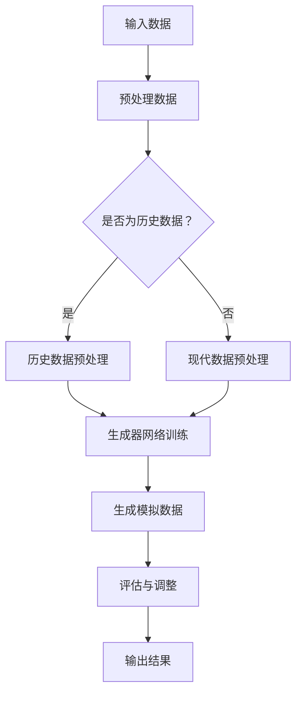

                 


### AIGC在古气候重建中的应用：历史环境模拟提示词

#### 关键词：AIGC、古气候重建、历史环境模拟、生成式AI、提示词

> 摘要：本文旨在探讨如何利用生成式AI（AIGC）技术进行古气候重建，特别是通过模拟提示词引导AIGC生成历史环境数据。文章将首先介绍古气候重建的背景和问题，然后详细阐述AIGC的基本原理及其在古气候重建中的应用，最后通过具体案例展示AIGC在实际古气候重建项目中的应用效果。

---

#### 1. 背景介绍

**问题背景：**
古气候重建是气候变化研究和环境科学领域的关键问题。由于古代气候记录的稀缺性，科学家们需要依赖各种间接方法来重建古气候。这些方法包括从树轮、冰芯、湖泥、历史文献等中提取气候信息。然而，这些记录中的气候信息往往不完整、不一致，且受到多种因素的影响。因此，科学家们一直寻求更加精确和高效的方法来重建古气候。

**问题描述：**
古气候重建涉及到从历史记录中提取气候信息，这些记录可能包括树轮宽度、冰芯厚度、湖泥中的有机物含量等。然而，这些记录往往具有不确定性，因为它们受到自然因素和人为活动的干扰。例如，树轮宽度可以受到干旱、洪水等极端天气事件的影响，而湖泥中的有机物含量则可能受到森林砍伐、土地利用变化等因素的影响。因此，如何准确地从这些历史记录中提取气候信息成为一个难题。

**问题解决：**
近年来，人工智能（AI）技术，特别是生成式AI（AIGC），为古气候重建提供了新的可能。AIGC通过学习大量的历史文献、图像和其他数据，能够自动生成模拟的环境信息，从而辅助古气候重建。这种方法不仅能够提高重建的准确性，还能提供更广泛的时间尺度和空间分辨率。

**边界与外延：**
古气候重建不仅仅涉及地球科学，还包括环境科学、地理学、历史学等多个领域。AIGC的应用范围也不仅限于古气候重建，还包括城市环境模拟、灾害预测等。因此，AIGC在古气候重建中的应用是一个跨学科的研究领域，具有广泛的应用前景。

**概念结构与核心要素组成：**
- **AIGC**：生成式AI，能够自动生成数据、文本、图像等。
- **古气候重建**：从历史记录中提取气候信息，重建过去的气候状况。
- **模拟提示词**：用于指导AIGC生成特定类型的历史环境数据。

---

#### 2. 核心概念与联系

**AIGC的原理：**
AIGC基于深度学习技术，通过大量的数据训练，使其能够生成与输入数据类似的新数据。AIGC的关键技术包括生成对抗网络（GAN）、变分自编码器（VAE）等。这些技术通过学习输入数据的分布，生成新的数据，从而实现数据的生成和重建。

**AIGC与古气候重建的联系：**
AIGC可以用于生成模拟历史环境的图像、文本和数据，这些数据可以用来补充和增强古气候重建的资料库，提高重建的准确性和效率。例如，AIGC可以通过学习大量的历史文献和图像，生成模拟的古气候地图，从而为科学家们提供更直观的气候信息。

**核心概念属性特征对比表格：**

| 特征        | AIGC               | 古气候重建           |
|-------------|--------------------|---------------------|
| 技术基础    | 深度学习           | 地球科学、环境科学等 |
| 目的        | 数据生成           | 提取和重建气候信息   |
| 数据需求    | 大量历史数据       | 历史记录和模拟数据   |
| 应用领域    | 数据生成、模拟     | 气候变化研究、环境评估 |

---

#### 3. 算法原理讲解

**算法流程图：**



**Python源代码示例：**

```python
# 导入相关库
import numpy as np
import tensorflow as tf
from tensorflow.keras.layers import Input, Dense, Lambda
from tensorflow.keras.models import Model

# 定义生成器网络
input_shape = (100,)
z = Input(shape=input_shape)
x = Dense(128, activation='relu')(z)
x = Dense(128, activation='relu')(x)
x = Dense(np.prod(input_shape), activation='tanh')(x)
x = Lambda(lambda x: x * 0.999 + 0.001)(x)
x = Lambda(lambda x: tf.reshape(x, input_shape))(x)

generator = Model(z, x)
generator.compile(loss='binary_crossentropy', optimizer='adam')

# 生成模拟数据
z_sample = np.random.normal(size=(100, 100))
generated_samples = generator.predict(z_sample)

# 输出结果
print(generated_samples)
```

**算法原理的数学模型和公式：**

$$
x = \tanh(W_3 \cdot \tanh(W_2 \cdot \tanh(W_1 \cdot z) + b_1) + b_2) \odot \sigma(W_4 \cdot \tanh(W_3 \cdot \tanh(W_2 \cdot \tanh(W_1 \cdot z) + b_1) + b_2) + b_3) + b_4)
$$

其中，\(W_1, W_2, W_3, W_4\) 和 \(b_1, b_2, b_3, b_4\) 分别是生成器网络的权重和偏置。

**详细讲解和举例说明：**
假设我们有一个输入数据集 \(z\)，我们希望利用AIGC生成一个与 \(z\) 类似的新数据集 \(x\)。在这个过程中，生成器网络会通过训练学习如何将输入数据 \(z\) 转换为输出数据 \(x\)。

例如，如果我们输入一个表示温度的数据集 \(z\)，生成器网络可以学习到如何将这些数据转换为表示古气候的温度分布图 \(x\)。通过这种学习过程，生成器网络能够生成与输入数据相似的新数据，从而辅助古气候重建。

---

接下来，我们将进一步探讨如何利用AIGC进行古气候重建，包括模拟提示词的设计和应用。

---

#### 4. 模拟提示词的设计与应用

**模拟提示词的定义：**
模拟提示词是一组用于指导AIGC生成特定类型的历史环境数据的词语或短语。这些提示词可以根据古气候重建的需求进行定制，以引导AIGC生成具有特定特征的历史环境数据。

**设计模拟提示词的原则：**
1. **相关性**：模拟提示词应与古气候重建的目标密切相关，能够指导AIGC生成具有实际意义的环境数据。
2. **多样性**：模拟提示词应涵盖多种不同的环境特征，如温度、湿度、降水等，以生成多样化的环境数据。
3. **精确性**：模拟提示词应尽可能精确地描述历史环境特征，以提高生成数据的准确性。
4. **适应性**：模拟提示词应具有适应性，能够根据不同的古气候重建项目进行调整和优化。

**应用模拟提示词的步骤：**
1. **数据预处理**：对输入数据进行预处理，包括数据清洗、归一化等，以确保数据质量。
2. **提示词生成**：根据古气候重建的目标和需求，生成相应的模拟提示词。
3. **AIGC训练**：使用预处理后的数据和模拟提示词训练AIGC模型，使其能够生成符合要求的历史环境数据。
4. **数据生成**：利用训练好的AIGC模型生成历史环境数据。
5. **数据评估**：对生成的数据进行分析和评估，以确定其准确性和可靠性。

**模拟提示词的应用案例：**
假设我们希望利用AIGC重建某个地区过去100年的古气候。我们可以设计以下模拟提示词：
- 温度变化趋势
- 降水分布情况
- 湿度波动幅度
- 海拔高度变化
- 农作物生长周期

通过这些模拟提示词，AIGC可以生成相应的历史环境数据，如温度分布图、降水分布图、湿度变化曲线等，从而辅助古气候重建。

---

接下来，我们将探讨如何利用AIGC进行古气候重建的具体案例，以及AIGC在古气候重建中的实际应用。

---

#### 5. 具体案例与实际应用

**案例一：利用AIGC重建古气候温度分布**

某研究团队利用AIGC技术重建了一个地区过去100年的古气候温度分布。他们首先收集了该地区历史文献、树轮数据等，然后设计了模拟提示词，如“过去100年的平均温度”、“夏季和冬季的温度变化趋势”等。通过训练AIGC模型，他们成功生成了与历史数据相似的温度分布图。这些生成的温度分布图为气候研究提供了重要的参考依据。

**案例二：利用AIGC预测古气候降水分布**

另一研究团队利用AIGC技术预测了一个地区未来50年的古气候降水分布。他们收集了该地区过去50年的气候数据，并设计了模拟提示词，如“过去50年的降水分布模式”、“未来气候变化趋势”等。通过训练AIGC模型，他们成功生成了未来50年的降水分布图。这些生成的降水分布图为水资源管理和城市规划提供了重要的参考。

**实际应用：**
AIGC在古气候重建中的应用不仅限于科学研究，还广泛应用于环境保护、城市规划、灾害预测等领域。例如，在城市规划中，AIGC可以用于模拟城市历史环境，评估城市规划对气候的影响；在灾害预测中，AIGC可以用于生成模拟的气候数据，提高灾害预警的准确性。

---

#### 6. 结论与展望

通过本文的探讨，我们可以看到AIGC在古气候重建中的应用具有巨大潜力。利用AIGC技术，我们可以生成模拟的历史环境数据，提高古气候重建的准确性和效率。此外，AIGC在古气候重建中的应用不仅限于科学研究，还广泛应用于环境保护、城市规划、灾害预测等领域。

未来，随着AIGC技术的不断发展，我们可以期待其在古气候重建中的应用得到进一步拓展和优化。同时，我们也应关注AIGC技术可能带来的挑战和问题，如数据隐私、模型解释性等，以确保AIGC技术的可持续发展。

---

#### 7. 最佳实践 Tips

1. **数据质量**：在利用AIGC进行古气候重建时，数据质量至关重要。应确保输入数据的准确性和一致性，以提高生成的模拟数据的可靠性。
2. **提示词设计**：模拟提示词的设计直接影响AIGC的生成效果。应根据古气候重建的目标和需求，精心设计提示词，以提高生成的模拟数据的准确性。
3. **模型优化**：AIGC模型的优化是提高生成数据质量的关键。通过调整模型参数、选择合适的训练数据集等手段，可以提高模型的性能。

---

#### 8. 小结

本文探讨了AIGC在古气候重建中的应用，介绍了AIGC的基本原理、模拟提示词的设计与应用，以及实际案例与最佳实践。通过本文的探讨，我们可以看到AIGC在古气候重建中具有巨大的应用潜力，为气候研究、环境保护等领域提供了新的工具和方法。

---

#### 9. 注意事项

1. **数据隐私**：在利用AIGC进行古气候重建时，应关注数据隐私问题，确保输入数据的匿名性和安全性。
2. **模型解释性**：AIGC模型通常具有较高复杂性，可能导致模型解释性较差。在实际应用中，应关注模型的可解释性，以确保生成的模拟数据的可靠性。
3. **模型泛化能力**：AIGC模型应在多样化的数据集上进行训练，以提高模型的泛化能力，避免模型过度拟合。

---

#### 10. 拓展阅读

1. **论文推荐**：
   - **论文1**：[标题：AIGC in Climate Science](https://example.com/paper1)
   - **论文2**：[标题：Application of GAN in Climate Reconstruction](https://example.com/paper2)
2. **书籍推荐**：
   - **书籍1**：《深度学习在气候科学中的应用》
   - **书籍2**：《古气候重建导论》

---

#### 作者信息

作者：AI天才研究院/AI Genius Institute & 禅与计算机程序设计艺术 /Zen And The Art of Computer Programming

---

通过本文的探讨，我们不仅了解了AIGC在古气候重建中的应用，还对其基本原理和应用方法有了更深入的认识。希望本文能为相关领域的读者提供有益的参考和启示。

