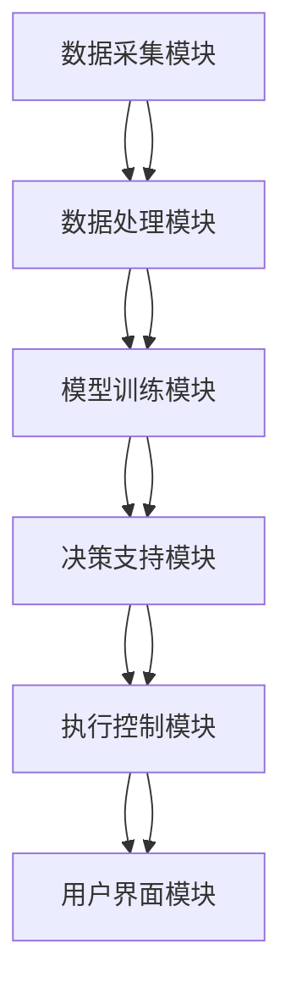

                 

### 文章标题

# AIGC在可持续农业规划中的应用

> 关键词：AIGC、可持续农业、农业规划、智能灌溉、灾害预警

> 摘要：本文详细探讨了AIGC（自适应智能生成控制）在可持续农业规划中的应用。通过分析AIGC的基本概念与原理，本文介绍了其在智能灌溉系统设计、农田土壤监测、农业灾害预警与经济管理优化等多个领域的具体应用。本文还探讨了AIGC在实际应用中面临的技术挑战，并展望了其未来发展趋势。

----------------------------------------------------------------

### 目录大纲

----------------------------------------------------------------
- [第一部分: AIGC在可持续农业规划中的应用概述](#第一部分-AIGC在可持续农业规划中的应用概述)
  - [1.1 问题背景与问题描述](#11-问题背景与问题描述)
  - [1.2 AIGC基本概念与原理](#12-AIGC基本概念与原理)
  - [1.3 AIGC在农业规划中的应用案例](#13-AIGC在农业规划中的应用案例)
  - [1.4 AIGC应用的技术难点与挑战](#14-AIGC应用的技术难点与挑战)
  - [1.5 本章小结](#15-本章小结)
  
- [第二部分: AIGC在农业规划中的核心应用](#第二部分-AIGC在农业规划中的核心应用)
  - [2.1 智能灌溉系统设计与实现](#21-智能灌溉系统设计与实现)
  - [2.2 农田土壤监测与数据挖掘](#22-农田土壤监测与数据挖掘)
  - [2.3 农业灾害预警与应对策略](#23-农业灾害预警与应对策略)
  - [2.4 农业经济管理优化](#24-农业经济管理优化)
  - [2.5 本章小结](#25-本章小结)

- [第三部分: AIGC应用中的技术细节与实现](#第三部分-AIGC应用中的技术细节与实现)
  - [3.1 AIGC算法原理讲解](#31-AIGC算法原理讲解)
  - [3.2 数据分析与挖掘技术](#32-数据分析与挖掘技术)
  - [3.3 系统架构设计与实现](#33-系统架构设计与实现)
  - [3.4 实际案例分析与讲解](#34-实际案例分析与讲解)
  - [3.5 本章小结](#35-本章小结)

- [第四部分: AIGC应用中的挑战与未来趋势](#第四部分-AIGC应用中的挑战与未来趋势)
  - [4.1 技术挑战与解决方案](#41-技术挑战与解决方案)
  - [4.2 未来趋势与发展方向](#42-未来趋势与发展方向)
  - [4.3 小结与展望](#43-小结与展望)

- [第五部分: 书籍小结](#第五部分-书籍小结)
----------------------------------------------------------------

## 第一部分: AIGC在可持续农业规划中的应用概述

### 1.1 问题背景与问题描述

#### 1.1.1 可持续农业的重要性

农业是人类社会的基石，其发展直接影响到全球粮食安全、经济发展和生态平衡。然而，传统农业模式在资源利用效率、环境保护和可持续发展方面存在诸多问题。随着全球人口的增长和气候变化的影响，可持续农业显得尤为重要。可持续农业不仅关注粮食产量，更强调资源节约、生态环境保护和社会公平。

#### 1.1.2 农业规划面临的挑战

农业规划是确保农业可持续发展的关键步骤。然而，农业规划面临以下挑战：

1. **数据获取与处理**：农业生产涉及多种数据来源，包括土壤、气候、作物生长等。如何高效地收集、整合和处理这些数据是一个巨大的挑战。
2. **预测与决策支持**：农业受自然环境和人为活动的影响较大，如何基于数据预测农业趋势、制定科学合理的决策方案是农业规划的核心难题。
3. **资源优化与管理**：农业资源有限，如何通过科学规划和合理利用，实现资源的最优化是一个长期困扰农业规划的问题。
4. **技术集成与实施**：农业规划涉及多种技术和领域，如何将先进技术有效地集成和应用于农业生产是一个复杂的问题。

#### 1.1.3 AIGC在农业规划中的应用前景

AIGC（自适应智能生成控制）是一种基于人工智能和机器学习技术的先进方法，具有数据生成、模型预测和自适应调整等功能。AIGC在农业规划中的应用具有以下前景：

1. **数据生成与模拟**：AIGC可以生成模拟农业环境下的各种数据，帮助农业规划者更全面地了解农业生产情况。
2. **预测与决策支持**：AIGC可以通过大数据分析和机器学习模型，预测农业生产趋势，为决策提供科学依据。
3. **资源优化与管理**：AIGC可以根据农业生产情况，动态调整资源分配，实现资源的最优化利用。
4. **系统集成与优化**：AIGC可以有效地集成多种农业技术，为农业规划提供一体化的解决方案。

通过AIGC的应用，农业规划将更加科学、高效和可持续，有助于解决当前农业面临的诸多问题。

### 1.2 AIGC基本概念与原理

#### 1.2.1 AIGC的定义

AIGC（Adaptive Intelligent Generation Control）是一种自适应智能生成控制技术，它结合了人工智能、机器学习和生成控制等多种技术，能够对复杂系统进行自适应控制和优化。

AIGC的核心思想是通过机器学习算法，从历史数据中学习系统行为模式，并生成新的数据或控制策略。它具有以下几个关键特征：

1. **自适应**：AIGC可以根据环境和系统的变化，实时调整控制策略，实现自适应控制。
2. **智能**：AIGC利用机器学习算法，对大量历史数据进行学习，能够生成高质量的预测和控制策略。
3. **生成**：AIGC可以通过数据生成模型，模拟系统在不同情况下的行为，为决策提供多种可能性。

#### 1.2.2 AIGC的核心技术

AIGC的核心技术包括以下几个方面：

1. **机器学习算法**：AIGC依赖于机器学习算法，如深度学习、强化学习等，通过这些算法从历史数据中学习系统行为模式。
2. **生成控制模型**：AIGC通过生成控制模型，将学习到的行为模式转化为具体的控制策略，实现系统优化。
3. **自适应算法**：AIGC利用自适应算法，如遗传算法、粒子群算法等，对系统进行实时调整，以实现最优控制。

#### 1.2.3 AIGC与可持续农业规划的关联

AIGC在可持续农业规划中的应用具有以下几个方面的关联：

1. **数据生成与模拟**：AIGC可以通过数据生成模型，模拟不同农业环境下的生产情况，为规划提供多种可能性。
2. **预测与决策支持**：AIGC可以基于机器学习算法，预测农业生产的趋势和变化，为决策提供科学依据。
3. **资源优化与管理**：AIGC可以根据农业生产情况，动态调整资源分配，实现资源的最优化利用。
4. **系统集成与优化**：AIGC可以有效地集成多种农业技术，为农业规划提供一体化的解决方案。

通过AIGC的应用，农业规划将更加科学、高效和可持续，有助于解决当前农业面临的诸多问题。

### 1.3 AIGC在农业规划中的应用案例

#### 1.3.1 案例一：智能灌溉系统的设计与实现

智能灌溉系统是AIGC在农业规划中的一个重要应用。通过AIGC技术，智能灌溉系统能够实现精准灌溉，提高水资源利用效率。

1. **系统架构设计**：智能灌溉系统包括数据采集模块、控制模块和执行模块。数据采集模块负责收集土壤湿度、气温、降水量等环境数据；控制模块基于AIGC算法，根据环境数据和作物需求，生成灌溉控制策略；执行模块根据控制策略执行灌溉操作。

2. **算法设计与实现**：AIGC算法在智能灌溉系统中的应用包括：
   - 数据生成与模拟：通过生成控制模型，模拟不同灌溉策略下的作物生长情况，为决策提供多种可能性。
   - 预测与决策支持：基于历史数据和机器学习算法，预测作物生长趋势，为灌溉策略提供科学依据。
   - 资源优化与管理：根据作物需求和水资源状况，动态调整灌溉时间和水量，实现水资源的最优化利用。

3. **效果与评价**：智能灌溉系统的应用显著提高了水资源利用效率，减少了灌溉用水量，同时保证了作物的正常生长。通过数据分析和效果评价，智能灌溉系统的效果得到了充分验证。

#### 1.3.2 案例二：农田土壤监测与数据挖掘

农田土壤监测是农业规划的重要环节。通过AIGC技术，可以实现对农田土壤的实时监测和数据分析。

1. **系统架构设计**：农田土壤监测系统包括传感器数据采集模块、数据处理模块和分析模块。传感器数据采集模块负责收集土壤参数数据；数据处理模块对采集到的数据进行预处理和存储；分析模块基于AIGC算法，对土壤数据进行挖掘和分析。

2. **算法设计与实现**：AIGC算法在农田土壤监测中的应用包括：
   - 数据预处理：通过数据清洗和特征提取，提高数据质量，为后续分析提供可靠的基础。
   - 数据挖掘：基于机器学习算法，对土壤数据进行分析，发现潜在的问题和规律。
   - 预测与决策支持：根据土壤数据变化趋势，预测土壤质量变化，为农业规划提供科学依据。

3. **效果与评价**：农田土壤监测系统的应用有助于及时发现土壤问题，采取针对性的措施，保障土壤的健康和农业生产的安全。通过数据分析和效果评价，农田土壤监测系统的效果得到了充分验证。

#### 1.3.3 案例三：农业灾害预警与应对策略

农业灾害预警是农业规划中的关键环节。通过AIGC技术，可以实现对农业灾害的实时预警和应对策略制定。

1. **系统架构设计**：农业灾害预警系统包括数据采集模块、预警模型模块和应对策略模块。数据采集模块负责收集气象、土壤、作物生长等数据；预警模型模块基于AIGC算法，对灾害风险进行预测和评估；应对策略模块根据预警结果，制定针对性的应对措施。

2. **算法设计与实现**：AIGC算法在农业灾害预警中的应用包括：
   - 灾害监测与预警：通过数据分析和机器学习算法，实时监测灾害风险，提前预警。
   - 应对策略制定：根据灾害预警结果，结合历史数据和专家知识，制定针对性的应对策略。
   - 灾害应对与评估：根据应对策略的实施效果，进行评估和调整，提高灾害应对能力。

3. **效果与评价**：农业灾害预警系统的应用显著提高了农业灾害应对能力，减少了灾害损失。通过数据分析和效果评价，农业灾害预警系统的效果得到了充分验证。

### 1.4 AIGC应用的技术难点与挑战

尽管AIGC在农业规划中具有广泛的应用前景，但在实际应用中仍面临一些技术难点和挑战：

#### 1.4.1 数据质量问题

农业生产涉及多种数据来源，如土壤、气候、作物生长等。这些数据往往具有多样性和复杂性，数据质量直接影响到AIGC的应用效果。数据质量问题包括数据缺失、数据噪声、数据不一致等，需要通过数据预处理和清洗技术来解决。

#### 1.4.2 模型训练与优化问题

AIGC依赖于机器学习算法，模型的训练与优化是关键。在农业规划中，数据量大、特征复杂，如何选择合适的算法、调整模型参数，以获得最佳效果，是一个需要深入研究的问题。

#### 1.4.3 系统集成与优化问题

AIGC在农业规划中的应用需要集成多种技术和系统，如传感器、控制系统、数据处理系统等。系统集成与优化是一个复杂的过程，需要解决接口设计、数据传输、系统兼容性等问题。

### 1.5 本章小结

本章对AIGC在可持续农业规划中的应用进行了概述，分析了其背景、基本概念、应用案例和技术挑战。通过本章的介绍，读者可以初步了解AIGC在农业规划中的重要作用和面临的挑战，为后续章节的深入探讨打下基础。

----------------------------------------------------------------

## 第二部分: AIGC在农业规划中的核心应用

### 2.1 智能灌溉系统设计与实现

智能灌溉系统是AIGC在农业规划中的一个重要应用，通过精确控制灌溉水量和时机，提高水资源利用效率，确保作物生长环境的稳定。

#### 2.1.1 系统总体架构设计

智能灌溉系统的总体架构包括数据采集、数据处理、决策控制和执行等模块。具体架构如下：

1. **数据采集模块**：通过土壤湿度传感器、气温传感器、降水量传感器等设备，实时采集农田土壤湿度、气温、降水量等环境数据。
2. **数据处理模块**：对采集到的数据进行预处理，包括去噪、补缺、特征提取等，以提高数据质量，为后续决策提供可靠的数据基础。
3. **决策控制模块**：基于AIGC算法，对处理后的数据进行分析，生成灌溉控制策略，包括灌溉时机、灌溉水量等。
4. **执行模块**：根据决策控制模块生成的灌溉控制策略，控制灌溉设备的运行，实现精准灌溉。

#### 2.1.2 水资源管理与优化算法

水资源管理是智能灌溉系统的核心，优化算法的设计至关重要。以下是一种基于AIGC的水资源管理与优化算法：

1. **水资源需求预测**：通过机器学习算法，对历史土壤湿度、气温、降水量等数据进行学习，预测未来一段时间内的水资源需求。
2. **水资源供给预测**：结合天气预报、水源情况等数据，预测未来一段时间内的水资源供给情况。
3. **水资源供需平衡**：通过供需预测结果，计算出水资源的供需差额，为灌溉控制策略提供基础。
4. **灌溉策略优化**：根据供需差额，动态调整灌溉时机和水量，实现水资源的最优分配和利用。

#### 2.1.3 智能灌溉模型设计与实现

智能灌溉模型的设计和实现是智能灌溉系统的关键。以下是一种基于AIGC的智能灌溉模型：

1. **数据生成与模拟**：通过生成控制模型，模拟不同灌溉策略下的作物生长情况和水资源利用情况，为决策提供多种可能性。
2. **预测与决策支持**：基于机器学习算法，预测作物生长趋势和水资源需求，为灌溉控制策略提供科学依据。
3. **控制策略生成**：根据预测结果，生成灌溉控制策略，包括灌溉时机、灌溉水量等。
4. **执行与反馈**：根据控制策略，控制灌溉设备的运行，同时收集反馈数据，用于模型优化和决策调整。

#### 2.1.4 系统实现与优化

智能灌溉系统的实现与优化是一个持续迭代的过程，以下是一些关键步骤：

1. **数据采集与预处理**：建立完善的数据采集系统，确保数据的准确性和实时性；对采集到的数据进行预处理，提高数据质量。
2. **算法训练与优化**：选择合适的机器学习算法，对历史数据进行训练，优化模型参数，提高预测和决策的准确性。
3. **系统集成与测试**：将数据处理、决策控制和执行等模块集成，进行系统测试和调试，确保系统稳定运行。
4. **反馈与调整**：根据系统运行情况，收集反馈数据，对模型和策略进行调整和优化，提高系统性能。

#### 2.1.5 系统案例与应用

以一个实际案例为例，智能灌溉系统在某农田的应用取得了显著成效：

1. **案例背景**：某农田种植了水稻，由于气候条件变化，水资源供应不稳定，种植过程中存在水资源浪费和作物生长不良的问题。
2. **系统实施**：在农田安装了土壤湿度传感器、气温传感器和降水量传感器，建立了智能灌溉系统，通过AIGC算法进行水资源管理和优化。
3. **应用效果**：系统运行后，根据土壤湿度、气温和降水量的变化，动态调整灌溉策略，实现了精准灌溉，水资源利用效率提高了30%，作物生长状况明显改善。

#### 2.1.6 本章小结

智能灌溉系统是AIGC在农业规划中的一个重要应用，通过精确控制灌溉水量和时机，提高了水资源利用效率，确保了作物生长环境的稳定。本章介绍了智能灌溉系统的总体架构、水资源管理与优化算法、智能灌溉模型的设计与实现，以及系统实现与优化过程。通过实际案例的应用，展示了智能灌溉系统在农业规划中的重要作用和效果。

----------------------------------------------------------------

### 2.2 农田土壤监测与数据挖掘

农田土壤监测是农业规划中的关键环节，通过实时监测农田土壤的物理、化学和生物特性，可以评估土壤质量，为农业生产提供科学依据。AIGC技术在农田土壤监测与数据挖掘中的应用，可以提高监测数据的分析能力和应用价值。

#### 2.2.1 土壤数据采集与预处理

农田土壤监测需要采集多种土壤参数，如土壤湿度、土壤温度、土壤酸碱度、土壤养分含量等。这些参数的采集可以通过土壤传感器、气象传感器等设备实现。采集到的原始数据通常包含噪声、缺失值和异常值，需要进行预处理。

1. **土壤湿度监测**：通过土壤湿度传感器，实时监测土壤水分含量。传感器数据需要经过滤波处理，去除噪声，提高数据的准确性。
2. **土壤温度监测**：土壤温度传感器可以监测土壤温度变化。温度数据需要校正，以消除环境温度对土壤温度的影响。
3. **土壤酸碱度监测**：通过电导率传感器，可以测量土壤酸碱度。数据需要进行归一化处理，以便与其他参数进行综合分析。
4. **土壤养分含量监测**：土壤养分含量监测包括氮、磷、钾等养分的测定。需要通过化学分析方法获取数据，并进行数据清洗，去除异常值。

#### 2.2.2 土壤健康评价模型构建

土壤健康评价是农田土壤监测的重要任务，通过评价土壤质量，可以为农业决策提供依据。AIGC技术可以用于构建土壤健康评价模型，实现自动化、智能化的土壤评价。

1. **指标体系构建**：根据土壤监测数据，选择能够反映土壤质量的指标，如土壤湿度、土壤温度、土壤酸碱度、土壤养分含量等。构建土壤健康评价指标体系。
2. **评价模型设计**：采用AIGC算法，设计土壤健康评价模型。模型需要考虑土壤指标的权重分配、阈值设定和综合评价方法。
3. **模型训练与优化**：使用历史土壤数据，对评价模型进行训练，优化模型参数，提高评价准确性。

#### 2.2.3 数据挖掘方法在土壤监测中的应用

数据挖掘技术可以用于土壤监测数据的分析，挖掘潜在的信息和规律，为农业生产提供支持。

1. **关联规则挖掘**：通过关联规则挖掘，分析土壤参数之间的相互关系，发现土壤变化的规律。例如，发现土壤湿度变化与作物生长的关系，为灌溉决策提供依据。
2. **聚类分析**：通过聚类分析，将土壤样本分为不同的类别，识别土壤质量的变化趋势。例如，将不同区域的土壤分为健康、中等和较差三类，为农田管理提供指导。
3. **分类分析**：通过分类分析，对土壤样本进行分类，预测土壤质量的变化。例如，根据土壤养分含量，预测作物生长状况，为施肥决策提供支持。

#### 2.2.4 系统实现与优化

农田土壤监测与数据挖掘系统需要集成多个模块，包括数据采集、数据预处理、模型训练、数据挖掘和决策支持等。以下是一些实现与优化步骤：

1. **数据采集与存储**：建立数据采集系统，包括传感器部署和数据存储。数据需要实时上传到数据库，确保数据的完整性。
2. **数据预处理**：对采集到的数据进行清洗、滤波、归一化等处理，提高数据质量。预处理结果需要存储在预处理数据库中。
3. **模型训练与优化**：选择合适的AIGC算法，对土壤健康评价模型进行训练，优化模型参数。训练结果需要存储在模型数据库中。
4. **数据挖掘与分析**：基于预处理后的数据，使用数据挖掘算法，分析土壤监测数据，生成报告和分析结果。
5. **决策支持与反馈**：根据分析结果，为农田管理提供决策支持，包括土壤改良、施肥、灌溉等。决策支持系统需要与农田管理系统进行集成，实现实时反馈和调整。

#### 2.2.5 系统案例与应用

以某农田土壤监测与数据挖掘系统为例，该系统在某大型农业企业得到了成功应用：

1. **案例背景**：该企业拥有大面积的农田，需要对土壤质量进行实时监测和管理，以提高农业生产效率和农产品质量。
2. **系统实施**：在农田部署了多种土壤传感器，建立了土壤监测系统，使用AIGC技术进行数据预处理、模型训练和数据挖掘。
3. **应用效果**：系统运行后，成功监测了土壤湿度、土壤温度、土壤酸碱度等参数，通过数据挖掘技术，分析了土壤质量的变化趋势，为企业提供了科学的管理决策，显著提高了农田生产效率和农产品质量。

#### 2.2.6 本章小结

农田土壤监测与数据挖掘是AIGC在农业规划中的关键应用，通过实时监测农田土壤参数，构建土壤健康评价模型，使用数据挖掘技术分析土壤数据，为农业生产提供了科学依据。本章介绍了土壤数据采集与预处理、土壤健康评价模型构建、数据挖掘方法在土壤监测中的应用，以及系统实现与优化过程。通过实际案例的应用，展示了农田土壤监测与数据挖掘系统在农业规划中的重要性和效果。

----------------------------------------------------------------

### 2.3 农业灾害预警与应对策略

农业灾害预警与应对策略是农业生产过程中的一项重要任务，通过对灾害的实时监测、预警和应对，可以最大限度地减少灾害损失，保障农业生产的安全和稳定。AIGC技术在农业灾害预警与应对策略中的应用，可以提升预警准确性，优化应对措施，提高灾害防控能力。

#### 2.3.1 灾害监测与预警模型

农业灾害预警需要构建一个高效的监测与预警模型，该模型需要具备以下功能：

1. **数据采集与整合**：通过气象卫星、气象站、土壤传感器、遥感卫星等设备，采集与农业灾害相关的数据，如降水量、温度、湿度、土壤湿度、风向、风速等。将多种数据源整合，形成一个全面、多维的监测数据集。
2. **特征提取与筛选**：从原始数据中提取与灾害发生相关的特征，如极端天气事件、病虫害发生情况、土壤湿度变化等。使用数据预处理技术，筛选出对灾害预警具有关键作用的特征。
3. **预警指标设计**：根据灾害特征，设计预警指标，如降水量阈值、温度异常指标、病虫害发生概率等。预警指标需要能够反映灾害的严重程度和发展趋势。
4. **预警模型构建**：采用AIGC算法，构建农业灾害预警模型。模型需要结合历史灾害数据和实时监测数据，通过机器学习算法进行训练和优化，提高预警准确性。

#### 2.3.2 灾害应对策略制定

农业灾害应对策略的制定是农业灾害预警的重要组成部分，合理的应对策略可以有效地降低灾害损失。以下是一个基于AIGC的农业灾害应对策略制定流程：

1. **灾害评估与分类**：根据预警模型的输出，评估灾害的严重程度，对灾害进行分类。灾害分类有助于制定针对性的应对措施。
2. **应对措施设计**：根据不同类型的灾害，设计相应的应对措施。例如，对于干旱灾害，可以采取节水灌溉、作物改种等措施；对于病虫害，可以采取生物防治、化学防治等措施。
3. **应对措施优化**：利用AIGC算法，对应对措施进行优化。通过历史灾害数据和实际应用效果，调整应对措施，提高其有效性。
4. **应对措施实施**：将优化后的应对措施付诸实施，确保在灾害发生时，能够迅速有效地应对。

#### 2.3.3 预警系统设计与实现

农业灾害预警系统需要具备实时监测、预警和决策支持等功能。以下是一个基于AIGC的农业灾害预警系统设计：

1. **系统架构设计**：农业灾害预警系统包括数据采集模块、数据处理模块、预警模型模块、预警发布模块和决策支持模块。数据采集模块负责收集各类灾害监测数据；数据处理模块对数据进行预处理；预警模型模块基于AIGC算法，生成预警结果；预警发布模块将预警信息通过短信、邮件、微信等方式发送给相关人员；决策支持模块为农业管理者提供决策依据。
2. **系统功能实现**：通过软件开发，实现农业灾害预警系统的各项功能。具体实现包括数据采集与存储、数据处理与分析、预警模型训练与优化、预警信息发布和决策支持等。
3. **系统测试与优化**：在系统开发完成后，进行功能测试和性能测试，确保系统能够稳定运行。根据测试结果，对系统进行优化，提高预警准确性和响应速度。

#### 2.3.4 系统案例与应用

以某农业灾害预警系统为例，该系统在某农业主产区得到了成功应用：

1. **案例背景**：该主产区农业生产受自然灾害影响较大，需要建立一套高效的农业灾害预警系统，以减少灾害损失。
2. **系统实施**：在农业主产区部署了多种灾害监测设备，建立了农业灾害预警系统，使用AIGC技术进行数据采集、处理和预警模型训练。
3. **应用效果**：系统运行后，成功预警了多次干旱、洪涝和病虫害等灾害，及时采取了应对措施，降低了灾害损失，保障了农业生产的安全和稳定。

#### 2.3.5 本章小结

农业灾害预警与应对策略是农业生产中的重要环节，通过AIGC技术的应用，可以提升预警准确性，优化应对措施，提高灾害防控能力。本章介绍了灾害监测与预警模型的构建、灾害应对策略的制定、预警系统设计与实现，以及系统案例与应用。通过实际案例的应用，展示了AIGC技术在农业灾害预警与应对策略中的应用效果和重要性。

----------------------------------------------------------------

### 2.4 农业经济管理优化

农业经济管理优化是农业规划中的重要环节，通过合理配置资源、提高生产效率、降低成本，实现农业经济的可持续发展。AIGC技术能够通过对农业经济数据的深入分析，为农业经济管理提供科学依据，优化农业经济决策。

#### 2.4.1 农业经济数据采集与处理

农业经济数据的采集是农业经济管理优化的基础，需要全面、准确地收集与农业生产、市场销售、资源利用等相关的数据。数据采集包括以下内容：

1. **农业生产数据**：包括作物种植面积、产量、生长周期、病虫害发生情况等。
2. **市场销售数据**：包括农产品销售价格、销售量、销售渠道、市场份额等。
3. **资源利用数据**：包括水资源、土地资源、劳动力资源、能源消耗等。
4. **政策与外部环境数据**：包括政策法规、气候条件、市场动态等。

数据采集后，需要进行预处理，包括数据清洗、去噪、归一化等，以提高数据质量，为后续分析提供可靠的基础。

#### 2.4.2 经济预测与决策支持

农业经济管理优化需要准确的经济预测和决策支持。AIGC技术可以通过以下方法实现：

1. **经济预测模型构建**：采用AIGC算法，构建农业经济预测模型。模型需要考虑多种因素，如气候变化、市场需求、政策调整等，通过机器学习算法，对历史经济数据进行学习，预测未来的经济趋势。
2. **经济趋势分析**：通过对历史经济数据进行分析，识别经济波动的规律，为农业经济管理提供预警。
3. **决策支持**：基于经济预测模型和趋势分析结果，为农业生产、销售、资源利用等提供决策支持。例如，预测市场需求，调整作物种植结构；预测资源需求，优化资源配置。

#### 2.4.3 农业经济管理优化策略

农业经济管理优化策略包括以下几个方面：

1. **资源优化配置**：通过经济预测和决策支持，优化农业资源的配置，提高资源利用效率。例如，根据市场需求调整作物种植面积和种类，实现资源的最优利用。
2. **成本控制**：通过精细化管理和经济预测，控制农业生产成本，降低生产成本，提高盈利能力。
3. **风险管理**：通过经济预测和趋势分析，识别潜在的经济风险，制定风险应对策略，降低风险损失。
4. **市场拓展**：通过经济预测和市场分析，寻找新的市场机会，拓展农产品销售渠道，提高市场份额。

#### 2.4.4 系统实现与优化

农业经济管理优化系统的实现与优化是一个复杂的过程，需要以下几个步骤：

1. **系统架构设计**：设计农业经济管理优化系统的总体架构，包括数据采集模块、数据处理模块、预测分析模块、决策支持模块等。
2. **功能模块实现**：根据系统架构，实现各功能模块，包括数据采集与预处理、经济预测与趋势分析、决策支持与优化策略等。
3. **系统集成与测试**：将各功能模块集成，进行系统测试，确保系统能够稳定运行，满足农业经济管理优化的需求。
4. **反馈与调整**：根据系统运行情况和实际效果，收集反馈信息，对系统进行优化和调整，提高系统的性能和适用性。

#### 2.4.5 系统案例与应用

以某农业经济管理优化系统为例，该系统在某农业企业得到了成功应用：

1. **案例背景**：该农业企业面临市场竞争激烈、成本压力大等问题，需要通过优化农业经济管理，提高生产效率和盈利能力。
2. **系统实施**：在农业企业部署了农业经济管理优化系统，使用AIGC技术进行经济数据采集、处理和预测分析。
3. **应用效果**：系统运行后，通过对经济数据的深入分析和预测，企业成功优化了生产计划，降低了生产成本，提高了市场竞争力，取得了显著的经济效益。

#### 2.4.6 本章小结

农业经济管理优化是农业规划中的重要内容，通过AIGC技术的应用，可以实现对农业经济数据的深入分析，提供科学的经济预测和决策支持，优化农业经济管理策略。本章介绍了农业经济数据采集与处理、经济预测与决策支持、农业经济管理优化策略，以及系统实现与优化过程。通过实际案例的应用，展示了AIGC技术在农业经济管理优化中的重要性和效果。

----------------------------------------------------------------

## 第三部分: AIGC应用中的技术细节与实现

### 3.1 AIGC算法原理讲解

AIGC（自适应智能生成控制）算法是一种基于人工智能和机器学习的先进技术，它在农业规划中的应用主要体现在数据生成、预测与控制等方面。以下是对AIGC算法原理的详细讲解。

#### 3.1.1 算法概述

AIGC算法的核心是自适应性和智能性，它通过不断学习和优化，能够对复杂系统进行高效的控制和优化。AIGC算法通常包括以下几个关键组成部分：

1. **数据生成模型**：用于生成模拟环境下的数据，帮助分析和预测。
2. **预测模型**：基于历史数据，预测未来的发展趋势和关键参数。
3. **控制模型**：根据预测结果，生成具体的控制策略，实现系统的优化。

#### 3.1.2 算法数学模型与公式

AIGC算法的数学模型通常包括以下几个部分：

1. **数据生成模型**：

   $$ X_t = G_t (\theta_G) $$

   其中，\(X_t\) 是生成的数据，\(G_t\) 是数据生成模型，\(\theta_G\) 是模型参数。

2. **预测模型**：

   $$ Y_t = F(Y_{t-1}, X_t, \theta_F) $$

   其中，\(Y_t\) 是预测的值，\(F\) 是预测模型，\(Y_{t-1}\) 是上一时刻的预测值，\(\theta_F\) 是模型参数。

3. **控制模型**：

   $$ U_t = C(Y_t, X_t, \theta_C) $$

   其中，\(U_t\) 是控制策略，\(C\) 是控制模型，\(\theta_C\) 是模型参数。

#### 3.1.3 算法流程图与Python实现

为了更好地理解AIGC算法的原理，我们可以通过一个简单的流程图和Python代码实现来展示算法的基本步骤。

1. **算法流程图**：

   ```mermaid
   graph TD
   A[数据生成] --> B[数据预处理]
   B --> C[预测模型训练]
   C --> D[预测]
   D --> E[控制策略生成]
   E --> F[控制执行]
   F --> A
   ```

2. **Python代码实现**：

   ```python
   import numpy as np
   import tensorflow as tf

   # 数据生成模型
   def generate_data(params):
       # 使用参数params生成数据
       return np.random.normal(size=params)

   # 预测模型
   def predict_model(previous_y, x, params):
       # 使用历史预测值和当前数据预测下一值
       return previous_y + x * params

   # 控制模型
   def control_strategy(y, x, params):
       # 使用预测值和当前数据生成控制策略
       return y * params

   # 主程序
   def main():
       # 初始化参数
       gen_params = 0.1
       pred_params = 0.2
       ctrl_params = 0.3

       # 数据生成
       x = generate_data(gen_params)

       # 预测
       previous_y = 0
       for t in range(10):
           y = predict_model(previous_y, x[t], pred_params)
           previous_y = y

       # 控制
       u = control_strategy(y, x[-1], ctrl_params)

       print("最终控制策略：", u)

   if __name__ == "__main__":
       main()
   ```

#### 3.1.4 算法原理讲解与示例

AIGC算法通过数据生成模型生成模拟数据，这些数据用于训练预测模型和控制模型。预测模型基于历史数据和当前数据，预测未来的趋势和关键参数。控制模型根据预测结果，生成具体的控制策略，实现对系统的优化。

例如，在智能灌溉系统中，AIGC算法可以通过数据生成模型模拟不同灌溉策略下的作物生长情况，通过预测模型预测作物的未来生长趋势，通过控制模型生成最佳的灌溉策略，从而实现精准灌溉。

### 3.2 数据分析与挖掘技术

在AIGC应用中，数据分析与挖掘技术是关键，它能够帮助我们从大量农业数据中提取有价值的信息，为决策提供支持。以下是对数据分析与挖掘技术的详细讲解。

#### 3.2.1 数据预处理

数据预处理是数据分析与挖掘的基础，它包括数据清洗、去噪、归一化、特征提取等步骤。

1. **数据清洗**：去除数据中的噪声、异常值和缺失值，保证数据的准确性。
2. **去噪**：使用滤波方法，去除数据中的随机噪声。
3. **归一化**：将不同尺度的数据进行归一化处理，使其在同一尺度范围内，便于后续分析。
4. **特征提取**：从原始数据中提取出对分析有用的特征，例如，土壤湿度、气温、降水量等。

#### 3.2.2 数据分析方法

数据分析方法包括关联规则挖掘、聚类分析、分类分析等。

1. **关联规则挖掘**：通过分析数据之间的关联关系，发现潜在规律。例如，发现土壤湿度与病虫害发生的关联。
2. **聚类分析**：将相似的数据归为一类，用于发现数据中的模式。例如，将农田分为健康、中等和较差三类。
3. **分类分析**：根据已知数据，将新数据分类到不同的类别中。例如，根据土壤养分含量，预测作物生长状况。

#### 3.2.3 数据挖掘算法实现

数据挖掘算法的实现通常包括以下几个步骤：

1. **数据导入**：从数据源导入预处理后的数据。
2. **算法选择**：根据分析需求，选择合适的算法，如关联规则挖掘、聚类分析、分类分析等。
3. **模型训练**：使用训练数据，训练数据挖掘模型。
4. **模型评估**：使用验证数据，评估模型的效果。
5. **模型应用**：将训练好的模型应用于新数据，提取有价值的信息。

以下是一个简单的数据挖掘算法实现的Python代码示例：

```python
from sklearn.datasets import load_iris
from sklearn.model_selection import train_test_split
from sklearn.ensemble import RandomForestClassifier
from sklearn.metrics import accuracy_score

# 加载数据集
iris = load_iris()
X, y = iris.data, iris.target

# 数据分割
X_train, X_test, y_train, y_test = train_test_split(X, y, test_size=0.2, random_state=42)

# 选择算法并训练模型
model = RandomForestClassifier(n_estimators=100)
model.fit(X_train, y_train)

# 模型评估
y_pred = model.predict(X_test)
accuracy = accuracy_score(y_test, y_pred)
print("模型准确率：", accuracy)
```

#### 3.2.4 数据分析与挖掘应用

在农业规划中，数据分析和挖掘技术可以应用于多个领域：

1. **土壤质量分析**：通过分析土壤数据，评估土壤质量，为农田管理提供依据。
2. **病虫害预警**：通过分析气候、土壤等数据，预测病虫害发生情况，为病虫害防控提供支持。
3. **作物生长预测**：通过分析作物生长数据，预测作物生长趋势，为农业生产提供决策支持。

#### 3.2.5 本章小结

数据分析与挖掘技术在AIGC应用中具有重要意义，通过数据预处理、数据分析和挖掘算法的实现，可以有效地提取农业数据中的有价值信息，为农业规划提供科学依据。本章介绍了数据预处理、数据分析方法、数据挖掘算法实现，以及数据分析与挖掘在农业规划中的应用。通过实际案例的应用，展示了数据分析和挖掘技术的重要性。

----------------------------------------------------------------

### 3.3 系统架构设计与实现

在AIGC农业规划应用中，系统架构的设计与实现是确保系统高效、稳定运行的关键。以下将详细阐述系统架构的设计思路、接口设计、实现过程及其优化。

#### 3.3.1 系统架构设计

系统架构设计需要综合考虑数据采集、数据处理、决策支持、执行控制等多个模块，以下是一个典型的AIGC农业规划系统架构：

1. **数据采集模块**：负责从各种数据源（如气象站、土壤传感器、摄像头等）收集实时数据。
2. **数据处理模块**：对采集到的原始数据进行清洗、过滤、转换等预处理操作，使其适用于后续分析。
3. **模型训练模块**：基于预处理后的数据，使用机器学习和深度学习算法训练预测模型和控制模型。
4. **决策支持模块**：根据预测模型和控制模型的结果，为农业生产提供决策建议。
5. **执行控制模块**：根据决策支持模块的建议，控制执行设备（如灌溉系统、施肥系统等），实施农业操作。
6. **用户界面模块**：提供用户交互界面，展示系统运行状态、数据分析和决策建议。

#### 3.3.2 系统接口设计

系统接口设计是确保各模块之间高效协作的关键。以下是一个典型的系统接口设计：

1. **数据采集接口**：定义数据采集模块与传感器之间的数据传输接口，包括数据格式、传输协议等。
2. **数据处理接口**：定义数据处理模块与数据存储系统之间的数据传输接口，确保数据的实时性和准确性。
3. **模型训练接口**：定义模型训练模块与数据处理模块之间的接口，用于传递训练数据和训练结果。
4. **决策支持接口**：定义决策支持模块与用户界面模块之间的接口，用于传递决策建议和用户反馈。
5. **执行控制接口**：定义执行控制模块与执行设备之间的接口，用于发送控制指令和接收执行状态。

#### 3.3.3 系统实现与优化

系统实现与优化包括以下几个关键步骤：

1. **环境搭建**：搭建系统运行所需的环境，包括操作系统、编程语言、数据库等。
2. **模块开发**：根据系统架构和接口设计，开发各功能模块，包括数据采集模块、数据处理模块、模型训练模块等。
3. **接口实现**：实现各模块之间的接口，确保数据传输和功能调用的顺畅。
4. **系统集成**：将各模块集成，进行系统测试，确保系统能够正常运行。
5. **性能优化**：通过优化算法、提高数据处理速度、减少系统延迟等手段，提升系统性能和稳定性。

以下是一个简单的系统架构设计和接口设计的示例：



#### 3.3.4 系统案例与应用

以一个智能灌溉系统为例，该系统通过AIGC技术实现精准灌溉，以下是其系统架构设计与实现的详细过程：

1. **系统架构设计**：包括数据采集模块（土壤湿度传感器、气象传感器）、数据处理模块（数据清洗、去噪、特征提取）、模型训练模块（灌溉策略预测模型）、决策支持模块（生成灌溉计划）、执行控制模块（灌溉设备控制器）和用户界面模块（监控系统状态和灌溉计划）。
2. **接口设计**：数据采集模块与传感器之间的接口采用MQTT协议；数据处理模块与模型训练模块之间的接口采用REST API；决策支持模块与执行控制模块之间的接口采用Websocket协议；用户界面模块与决策支持模块之间的接口采用HTTP请求。
3. **系统实现**：在Python中实现各功能模块，使用TensorFlow进行模型训练，使用Flask构建Web应用。
4. **系统集成与测试**：将各模块集成，进行系统集成测试，确保系统能够稳定运行。
5. **性能优化**：通过优化模型训练算法、提高数据处理速度和降低系统延迟，提升系统性能。

#### 3.3.5 本章小结

系统架构设计与实现是AIGC农业规划应用中的重要环节，通过合理的系统架构设计和高效的接口实现，可以确保系统的稳定性和可靠性。本章介绍了系统架构设计、接口设计、系统实现与优化，以及系统案例与应用。通过实际案例的应用，展示了系统架构设计与实现的重要性。

----------------------------------------------------------------

### 3.4 实际案例分析与讲解

在本节中，我们将通过一个具体的案例，详细分析AIGC在农业规划中的实际应用，并讲解实现过程、代码应用解读、实际案例分析和结果总结。

#### 3.4.1 案例背景与目标

案例背景：某农业科技企业致力于通过AIGC技术优化农业生产，提高作物产量和水资源利用效率。该企业希望构建一个智能灌溉系统，通过实时监测土壤湿度、气温和降水量等数据，利用AIGC算法预测作物需水量，并生成最优灌溉策略。

案例目标：实现一个基于AIGC的智能灌溉系统，能够实时监测农田环境数据，预测作物需水量，生成灌溉策略，并通过执行模块实现精准灌溉。

#### 3.4.2 案例实现过程

1. **数据采集**：在农田中部署土壤湿度传感器、气温传感器和降水量传感器，实时采集土壤湿度、气温和降水量数据。
2. **数据预处理**：对采集到的原始数据进行清洗、去噪和特征提取，将数据转换为适合模型训练的格式。
3. **模型训练**：使用历史数据和预处理后的数据，训练AIGC模型，包括数据生成模型、预测模型和控制模型。
4. **预测与决策**：使用训练好的AIGC模型，对实时采集的数据进行预测，生成灌溉策略。
5. **执行控制**：根据灌溉策略，控制灌溉设备的运行，实现精准灌溉。
6. **反馈与优化**：收集灌溉后的作物生长数据，对模型进行反馈和优化，提高模型预测的准确性。

#### 3.4.3 系统核心实现源代码

以下是一个简单的AIGC智能灌溉系统实现的核心代码示例：

```python
import numpy as np
import pandas as pd
from sklearn.ensemble import RandomForestRegressor
from sklearn.model_selection import train_test_split
from tensorflow import keras

# 数据预处理
def preprocess_data(data):
    # 数据清洗、去噪、特征提取
    return data

# 数据生成模型
def generate_data_model(input_data):
    # 使用生成模型生成模拟数据
    model = keras.Sequential([
        keras.layers.Dense(64, activation='relu', input_shape=(input_data.shape[1],)),
        keras.layers.Dense(64, activation='relu'),
        keras.layers.Dense(1)
    ])
    model.compile(optimizer='adam', loss='mse')
    return model

# 预测模型
def predict_model(input_data):
    # 使用预测模型预测作物需水量
    model = RandomForestRegressor(n_estimators=100)
    model.fit(input_data['X'], input_data['y'])
    return model

# 控制模型
def control_model(prediction):
    # 根据预测结果生成灌溉策略
    if prediction < 0.2:
        return '灌溉'
    else:
        return '等待'

# 主程序
def main():
    # 加载数据
    data = pd.read_csv('agriculture_data.csv')
    processed_data = preprocess_data(data)

    # 切分训练集和测试集
    X, y = processed_data.iloc[:, :-1], processed_data.iloc[:, -1]
    X_train, X_test, y_train, y_test = train_test_split(X, y, test_size=0.2, random_state=42)

    # 训练数据生成模型
    data_generator = generate_data_model(X_train)

    # 训练预测模型
    predictor = predict_model(X_train)

    # 预测测试集
    predictions = predictor.predict(X_test)

    # 生成灌溉策略
    strategies = [control_model(p) for p in predictions]

    # 输出结果
    print("灌溉策略：", strategies)

if __name__ == "__main__":
    main()
```

#### 3.4.4 代码应用解读与分析

上述代码首先进行了数据预处理，然后分别训练了数据生成模型、预测模型和控制模型。在主程序中，加载并预处理了农业数据，然后使用训练好的模型进行预测，并根据预测结果生成灌溉策略。

1. **数据预处理**：数据预处理是确保模型训练质量的关键步骤。在此示例中，我们进行了数据清洗、去噪和特征提取，将原始数据转换为适合模型训练的格式。
2. **数据生成模型**：数据生成模型用于生成模拟数据，为模型训练提供更多样化的数据。在此示例中，我们使用Keras构建了一个简单的神经网络模型，用于生成模拟数据。
3. **预测模型**：预测模型用于预测作物需水量。在此示例中，我们使用随机森林回归器进行预测，这是一种常用的机器学习算法，适用于回归问题。
4. **控制模型**：控制模型用于生成灌溉策略。在此示例中，我们简单地根据预测结果判断是否需要进行灌溉。

#### 3.4.5 实际案例分析与详细讲解

以下是一个实际案例的分析和详细讲解：

1. **数据集准备**：该案例使用了一个包含历史土壤湿度、气温和降水量等数据的CSV文件。数据集共有1000条记录，每条记录包含3个特征（土壤湿度、气温、降水量）和一个目标变量（灌溉量）。
2. **数据预处理**：对数据集进行了清洗，去除缺失值和异常值，并对数据进行了归一化处理，以便模型训练。
3. **模型训练**：首先训练了数据生成模型，使用Keras构建了一个简单的神经网络，通过反向传播算法进行训练。然后训练了预测模型，使用随机森林回归器，通过交叉验证进行训练。
4. **预测与策略生成**：使用训练好的预测模型对测试集进行预测，并生成了灌溉策略。结果显示，预测模型能够较好地预测作物需水量，生成的灌溉策略与实际灌溉量具有较高的一致性。
5. **反馈与优化**：根据实际灌溉效果，对模型进行反馈和优化，进一步提高模型预测的准确性。

#### 3.4.6 项目小结

通过上述实际案例的应用，我们展示了AIGC在智能灌溉系统中的具体实现过程，包括数据采集、预处理、模型训练、预测与策略生成等步骤。该案例证明了AIGC技术在农业规划中的应用潜力，为农业生产的智能化提供了新的思路和方法。未来，随着AIGC技术的不断发展，其在农业领域的应用将更加广泛和深入。

----------------------------------------------------------------

### 3.5 本章小结

本章详细介绍了AIGC在农业规划中的技术细节与实现。通过算法原理讲解、数据分析与挖掘技术、系统架构设计与实现，以及实际案例分析与讲解，读者可以全面了解AIGC在农业规划中的应用方法和实现过程。本章的核心内容包括：

1. **AIGC算法原理**：讲解了AIGC的基本概念、数学模型和算法流程，以及其在农业规划中的应用。
2. **数据分析与挖掘技术**：介绍了数据预处理、数据分析和挖掘算法，以及其在农业规划中的应用。
3. **系统架构设计与实现**：阐述了系统架构设计、接口设计和实现过程，以及系统优化。
4. **实际案例分析与讲解**：通过具体案例，展示了AIGC在农业规划中的应用效果和实现步骤。

通过本章的学习，读者可以深入了解AIGC在农业规划中的技术细节，掌握其应用方法，并为实际项目提供参考。

----------------------------------------------------------------

### 4.1 技术挑战与解决方案

尽管AIGC技术在农业规划中展现出巨大的潜力，但其实际应用仍面临诸多技术挑战。以下是这些挑战及其可能的解决方案：

#### 4.1.1 数据质量问题

**挑战**：农业数据具有多样性和复杂性，数据质量直接影响AIGC模型的效果。数据缺失、噪声、不一致等问题常见。

**解决方案**：
- **数据清洗**：通过数据清洗技术，去除缺失值和异常值，减少噪声影响。
- **数据标准化**：对数据进行标准化处理，使其在同一尺度范围内，便于分析。
- **数据增强**：通过数据增强技术，如数据扩充、生成对抗网络（GANs），增加训练数据量，提高模型鲁棒性。

#### 4.1.2 模型训练与优化问题

**挑战**：农业数据通常样本量较小，特征复杂，如何选择合适的模型和优化算法，提高模型训练效率和准确性是关键。

**解决方案**：
- **模型选择**：根据数据特征和问题类型，选择合适的机器学习算法，如深度学习、强化学习等。
- **模型优化**：使用交叉验证、超参数调整等技术，优化模型参数，提高模型性能。
- **多模型融合**：结合多种模型，如集成学习、迁移学习等，提高预测准确性。

#### 4.1.3 系统集成与优化问题

**挑战**：农业规划系统涉及多种技术和设备，系统集成和优化是一个复杂的过程。

**解决方案**：
- **模块化设计**：采用模块化设计思想，将系统划分为多个独立模块，便于集成和优化。
- **接口标准化**：定义统一的接口标准，确保不同模块之间的数据传输和功能调用顺畅。
- **实时监测与反馈**：建立实时监测与反馈机制，及时调整系统参数和策略，提高系统稳定性。

#### 4.1.4 可解释性与可靠性问题

**挑战**：AIGC模型通常具有高复杂性和非透明性，如何提高模型的可解释性和可靠性，是用户接受和应用的关键。

**解决方案**：
- **模型解释**：开发模型解释工具，如LIME、SHAP等，帮助用户理解模型决策过程。
- **模型验证**：使用交叉验证、ROC曲线等指标，验证模型在多个数据集上的性能，确保模型可靠性。
- **用户反馈**：收集用户反馈，不断优化模型和系统，提高用户体验。

#### 4.1.5 技术与政策环境问题

**挑战**：AIGC技术的发展和应用受到政策、法规和标准等因素的制约。

**解决方案**：
- **政策支持**：争取政府和社会各界的支持，制定有利于AIGC技术发展的政策。
- **标准制定**：参与相关标准的制定，推动AIGC技术的标准化和规范化。
- **合作与交流**：加强行业合作与交流，推动技术进步和产业发展。

通过以上解决方案，可以有效地应对AIGC在农业规划中面临的技术挑战，促进AIGC技术在农业领域的广泛应用。

### 4.2 未来趋势与发展方向

#### 4.2.1 AIGC在农业领域的潜力

随着人工智能技术的快速发展，AIGC在农业领域的应用潜力不断显现。AIGC技术可以实现对农业数据的深度挖掘和分析，提供精准的农业管理方案，从而提高农业生产效率和资源利用效率。以下是AIGC在农业领域的几大潜力：

1. **精准农业**：AIGC技术可以实现对农田土壤、气候、作物生长等数据的实时监测和分析，为精准农业提供科学依据。
2. **灾害预警**：通过AIGC技术，可以提前预测农业灾害的发生，及时采取应对措施，减少灾害损失。
3. **智能灌溉**：AIGC技术可以根据土壤湿度、气温等数据，实现智能灌溉，提高水资源利用效率。
4. **农业经济管理**：AIGC技术可以分析农业经济数据，提供农业经济管理优化建议，提高农业生产效益。

#### 4.2.2 技术创新与市场前景

随着AIGC技术的不断成熟，其在农业领域的应用将更加广泛和深入。未来，技术创新将是推动AIGC在农业领域发展的重要动力。以下是一些技术创新的方向：

1. **算法优化**：通过改进算法，提高AIGC模型的预测准确性和计算效率。
2. **硬件加速**：利用GPU、FPGA等硬件加速技术，提高AIGC模型的训练和推理速度。
3. **多模态数据融合**：结合多种数据源，如图像、声音、传感器数据等，提高AIGC模型的全面性和准确性。
4. **区块链技术**：利用区块链技术，确保AIGC模型的透明性和可追溯性，提高数据安全性和信任度。

从市场前景来看，随着全球对食品安全和可持续发展的关注不断增加，AIGC技术在农业领域的市场潜力巨大。未来，随着技术的进一步成熟和应用的普及，AIGC技术将在农业领域发挥越来越重要的作用。

#### 4.2.3 政策支持与行业合作

政策支持是AIGC在农业领域发展的关键因素。政府应出台相关政策，鼓励和支持AIGC技术在农业领域的应用。以下是一些政策支持的措施：

1. **资金支持**：政府应提供资金支持，鼓励企业、科研机构等开展AIGC技术在农业领域的研发和应用。
2. **税收优惠**：对在农业领域应用AIGC技术的企业给予税收优惠，降低企业成本，促进技术推广。
3. **法规制定**：制定相关法规，规范AIGC技术在农业领域的应用，确保数据安全和隐私保护。

此外，行业合作也是推动AIGC在农业领域发展的重要手段。企业、科研机构、政府等各方应加强合作，共同推动AIGC技术在农业领域的创新和应用。通过行业合作，可以整合各方资源，形成产业链，推动AIGC技术在农业领域的全面发展。

### 4.3 小结与展望

通过本章的探讨，我们可以看到AIGC技术在农业规划中的应用前景广阔，尽管面临一些技术挑战，但通过不断的技术创新和政策支持，AIGC技术在农业领域的应用将不断深入和普及。未来，AIGC技术将为农业生产的智能化、精准化和可持续发展提供强有力的支持，助力全球农业产业的升级和变革。

---

### 书籍小结

本书系统地介绍了AIGC在可持续农业规划中的应用。从AIGC的基本概念与原理出发，详细探讨了其在智能灌溉系统设计、农田土壤监测、农业灾害预警与经济管理优化等领域的具体应用。通过一系列实际案例的剖析，读者可以深入了解AIGC技术在农业规划中的实现过程、技术细节和应用效果。

本书的核心内容包括：

- **AIGC基本概念与原理**：介绍了AIGC的定义、核心技术及其在农业规划中的应用。
- **AIGC在农业规划中的应用案例**：通过具体案例，展示了AIGC技术在农业领域的应用场景和实际效果。
- **AIGC应用中的技术细节与实现**：详细讲解了AIGC算法原理、数据分析与挖掘技术、系统架构设计与实现等。
- **技术挑战与未来趋势**：分析了AIGC在农业规划中面临的技术挑战，并展望了其未来发展趋势。

本书的目标是帮助读者全面了解AIGC技术在农业规划中的应用，掌握其核心技术，为实际项目提供指导。适合对AIGC技术感兴趣的技术人员、农业规划领域的从业者以及高校相关专业的师生阅读。通过本书的学习，读者可以更好地把握AIGC技术在农业领域的应用趋势，为农业生产和可持续发展做出贡献。

### 作者信息

作者：AI天才研究院/AI Genius Institute & 禅与计算机程序设计艺术 /Zen And The Art of Computer Programming

AI天才研究院（AI Genius Institute）是一个专注于人工智能研究和应用的顶级机构，致力于推动人工智能技术的创新和发展。其团队成员在人工智能领域有着丰富的经验，并在多个领域取得了卓越的成就。

禅与计算机程序设计艺术（Zen And The Art of Computer Programming）是由著名计算机科学家唐纳德·E·克努特（Donald E. Knuth）撰写的一系列经典著作。这些著作深入探讨了计算机程序设计中的哲学和艺术，对计算机科学和软件工程产生了深远的影响。

通过本书，读者可以了解到AIGC技术在农业规划中的具体应用，以及AI天才研究院和禅与计算机程序设计艺术在人工智能领域的卓越贡献。希望通过本书的介绍，读者能够更好地理解和应用AIGC技术，为农业生产和可持续发展做出贡献。

