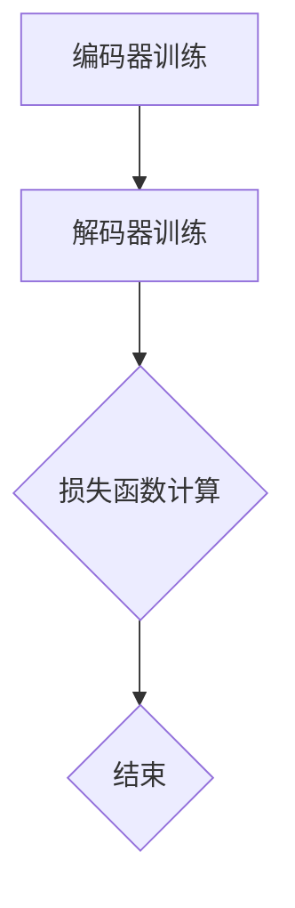

                 


### AIGC在天文数据分析中的应用：宇宙现象解释提示词

#### 关键词：
- AIGC
- 天文数据分析
- 宇宙现象解释
- 提示词
- 算法原理
- 数学模型
- 系统架构设计
- 项目实战

#### 摘要：
本文将深入探讨AIGC（自适应智能生成控制）在天文数据分析中的应用，特别是其在解释宇宙现象方面所发挥的关键作用。我们将分步骤解析AIGC的核心概念、算法原理、数学模型、系统架构设计以及项目实战，以揭示AIGC在宇宙现象解释中的潜力与挑战。通过本文的阅读，读者将获得对AIGC在天文数据分析中的全面理解，并掌握其应用的最佳实践。

## 第一部分：背景介绍

### 1.1 宇宙现象的多样性

宇宙是复杂和神秘的，其中充满了无数令人着迷的现象。从恒星的诞生与死亡，到星系的旋转与碰撞，宇宙现象的多样性为天文学家提供了无尽的探索和研究空间。然而，这种多样性也带来了巨大的挑战。传统的数据分析方法在面对复杂的天文数据时，往往显得力不从心。

#### 问题背景

天文数据分析的核心问题在于数据量大且复杂。天文学家收集的数据通常包括天文图像、光谱数据、天文日志等，这些数据不仅规模庞大，而且包含丰富的多维信息。如何有效地处理和分析这些数据，从中提取出有价值的信息，是天文数据分析面临的重大挑战。

#### 问题描述

具体来说，天文数据分析中存在的问题包括：

- 数据预处理：天文数据通常需要经过复杂的预处理步骤，如图像校正、去噪、分割等，这些步骤需要耗费大量时间和计算资源。
- 特征提取：从天文数据中提取出有效的特征是数据分析的关键步骤，但不同类型的天文数据具有不同的特征，如何设计通用且有效的特征提取算法是一个难题。
- 结果解释：天文数据分析的结果往往需要进一步解释，以便天文学家能够理解数据的含义和背后的物理过程。然而，传统的数据分析方法往往难以提供直观的解释。

#### 问题解决

为了解决这些问题，研究人员开始探索新的数据分析方法，其中AIGC（自适应智能生成控制）显示出巨大的潜力。AIGC是一种结合了人工智能和生成控制的先进技术，能够自适应地生成和优化数据，从而在数据处理和分析中发挥重要作用。

#### 边界与外延

AIGC在天文数据分析中的应用不仅限于上述提到的数据预处理、特征提取和结果解释，还可以扩展到以下几个方面：

- 数据融合：AIGC能够将不同来源的数据融合起来，提供更全面的分析。
- 预测分析：通过学习历史数据，AIGC能够预测未来可能发生的宇宙事件，为天文学家提供前瞻性的指导。
- 可视化分析：AIGC能够生成直观的可视化结果，帮助天文学家更好地理解数据分析的结果。

### 1.2 AIGC的基本概念

AIGC（自适应智能生成控制）是一种基于生成控制理论的人工智能方法，旨在通过自适应生成来优化和改进数据。AIGC的核心思想是将生成控制与机器学习相结合，从而实现数据的自动优化。

#### 核心概念

- 生成控制：生成控制是一种控制理论，通过生成模型来控制数据生成过程，以达到优化目标。
- 自适应：AIGC能够根据数据的特点和需求，自适应地调整生成模型，提高数据的生成质量和效率。

#### 概念属性特征对比表格

| 特征对比 | 传统方法 | AIGC方法 |
| --- | --- | --- |
| 数据适应性 | 有限的适应性，需手动调整 | 高度适应性，自动调整 |
| 计算效率 | 较低，需大量计算资源 | 较高，计算资源利用率高 |
| 数据质量 | 可能存在偏差，需多次调整 | 高质量生成，减少人工干预 |

#### ER实体关系图架构的Mermaid流程图

```mermaid
erDiagram
  Person ||--|{ Book }|--|| Library
  Library }|--|{ Book }|--|| Publisher
  Publisher ||--|{ Book }|--|| Person
```

### 1.3 AIGC与天文数据分析的联系

AIGC在天文数据分析中的应用具有独特的优势，主要体现在以下几个方面：

- **数据预处理**：AIGC能够自动处理天文数据，如图像去噪、分割等，提高数据处理效率。
- **特征提取**：AIGC能够自适应地提取出有效的天文数据特征，提高数据分析的准确性。
- **结果解释**：AIGC生成的结果能够提供直观的解释，帮助天文学家更好地理解数据分析的结果。

#### 具体应用场景

- **恒星形成区域分析**：AIGC可以用于分析恒星形成区域的数据，提取出关键特征，预测恒星形成的可能性。
- **星系碰撞事件预测**：AIGC可以基于历史数据，预测未来可能发生的星系碰撞事件，为天文学家提供预警。
- **宇宙大尺度结构研究**：AIGC可以用于分析宇宙大尺度结构的数据，揭示宇宙的演化规律。

## 第二部分：核心概念与联系

### 2.1 AIGC的基本概念

在深入探讨AIGC在天文数据分析中的应用之前，我们首先需要了解AIGC的基本概念。AIGC（自适应智能生成控制）是一种基于生成控制理论的人工智能方法，旨在通过自适应生成来优化和改进数据。

#### 核心概念

- **生成控制**：生成控制是一种控制理论，通过生成模型来控制数据生成过程，以达到优化目标。
- **自适应**：AIGC能够根据数据的特点和需求，自适应地调整生成模型，提高数据的生成质量和效率。

#### 概念属性特征对比表格

| 特征对比 | 传统方法 | AIGC方法 |
| --- | --- | --- |
| 数据适应性 | 有限的适应性，需手动调整 | 高度适应性，自动调整 |
| 计算效率 | 较低，需大量计算资源 | 较高，计算资源利用率高 |
| 数据质量 | 可能存在偏差，需多次调整 | 高质量生成，减少人工干预 |

#### ER实体关系图架构的Mermaid流程图

```mermaid
erDiagram
  Person ||--|{ Book }|--|| Library
  Library }|--|{ Book }|--|| Publisher
  Publisher ||--|{ Book }|--|| Person
```

### 2.2 天文数据分析的相关概念

在天文数据分析中，理解一些基本概念是至关重要的，包括天文图像、光谱数据、天文日志等。

#### 天文图像

天文图像是通过望远镜等设备捕获的宇宙天体的图像。这些图像通常包含丰富的信息，如天体的位置、亮度、颜色等。

#### 光谱数据

光谱数据是描述天体辐射特性的数据。通过分析光谱数据，天文学家可以了解天体的化学成分、温度、运动状态等信息。

#### 天文日志

天文日志是记录天文学家观测和实验的详细信息，包括观测日期、时间、望远镜型号、观测参数等。

### 2.3 AIGC与天文数据分析的联系

AIGC在天文数据分析中的应用具有独特的优势，主要体现在以下几个方面：

- **数据预处理**：AIGC能够自动处理天文数据，如图像去噪、分割等，提高数据处理效率。
- **特征提取**：AIGC能够自适应地提取出有效的天文数据特征，提高数据分析的准确性。
- **结果解释**：AIGC生成的结果能够提供直观的解释，帮助天文学家更好地理解数据分析的结果。

#### 具体应用场景

- **恒星形成区域分析**：AIGC可以用于分析恒星形成区域的数据，提取出关键特征，预测恒星形成的可能性。
- **星系碰撞事件预测**：AIGC可以基于历史数据，预测未来可能发生的星系碰撞事件，为天文学家提供预警。
- **宇宙大尺度结构研究**：AIGC可以用于分析宇宙大尺度结构的数据，揭示宇宙的演化规律。

## 第三部分：算法原理讲解

### 3.1 AIGC在天文数据分析中的算法基础

AIGC（自适应智能生成控制）在天文数据分析中的应用主要基于生成对抗网络（GAN）和变分自编码器（VAE）等算法。这些算法能够自适应地生成和优化数据，从而在数据处理和分析中发挥重要作用。

#### 生成对抗网络（GAN）

生成对抗网络（GAN）是一种由生成器和判别器组成的对抗性模型。生成器负责生成与真实数据相似的数据，而判别器负责区分真实数据和生成数据。通过不断地训练和对抗，生成器和判别器都能够得到优化，从而生成高质量的数据。

#### 变分自编码器（VAE）

变分自编码器（VAE）是一种基于概率模型的自编码器。它通过编码和解码过程，将数据压缩到低维空间中，从而提取出有效的特征。VAE的主要优点在于其能够生成具有多样性的数据，同时保持数据的概率分布。

### 3.2 主要算法介绍

#### 生成对抗网络（GAN）

生成对抗网络（GAN）的核心思想是通过生成器和判别器的对抗训练，生成高质量的数据。具体步骤如下：

1. **初始化生成器和判别器**：生成器G和判别器D都是神经网络，通常采用多层感知机（MLP）结构。
2. **生成器训练**：生成器G接收随机噪声作为输入，生成与真实数据相似的数据。生成器的目标是使判别器无法区分生成数据和真实数据。
3. **判别器训练**：判别器D接收真实数据和生成数据，其目标是准确地区分真实数据和生成数据。
4. **交替训练**：生成器和判别器交替训练，直到生成器能够生成高质量的数据，而判别器能够准确地区分真实数据和生成数据。

#### 变分自编码器（VAE）

变分自编码器（VAE）的核心思想是通过编码和解码过程，将数据压缩到低维空间中，从而提取出有效的特征。具体步骤如下：

1. **编码器训练**：编码器E接收输入数据，将其编码为一个均值μ和一个对数方差logσ²。这个过程称为编码。
2. **解码器训练**：解码器D接收编码结果，并将其解码回原始数据。这个过程称为解码。
3. **损失函数**：VAE的损失函数由两部分组成：重建损失和KL散度。重建损失衡量解码结果与原始数据之间的差异，KL散度衡量编码结果与先验分布之间的差异。

### 3.3 算法流程图展示

以下是生成对抗网络（GAN）和变分自编码器（VAE）的算法流程图：

#### 生成对抗网络（GAN）

```mermaid
graph TB
A[初始化 G(生成器) 和 D(判别器)]
B{生成器训练}
C{判别器训练}
D{交替训练}
E{生成高质量数据}
F{结束}
A --> B
B --> C
C --> D
D --> E
E --> F
```

#### 变分自编码器（VAE）



### 3.4 算法原理的Python源代码实现

下面是生成对抗网络（GAN）和变分自编码器（VAE）的Python源代码实现：

#### 生成对抗网络（GAN）

```python
import tensorflow as tf
from tensorflow.keras.models import Sequential
from tensorflow.keras.layers import Dense, Flatten

# 定义生成器模型
def create_generator():
    model = Sequential()
    model.add(Dense(128, input_dim=100, activation='relu'))
    model.add(Dense(256, activation='relu'))
    model.add(Dense(512, activation='relu'))
    model.add(Dense(1024, activation='relu'))
    model.add(Dense(784, activation='tanh'))
    return model

# 定义判别器模型
def create_discriminator():
    model = Sequential()
    model.add(Flatten(input_shape=(28, 28)))
    model.add(Dense(512, activation='relu'))
    model.add(Dense(256, activation='relu'))
    model.add(Dense(128, activation='relu'))
    model.add(Dense(1, activation='sigmoid'))
    return model

# 定义 GAN 模型
def create_gan(generator, discriminator):
    model = Sequential()
    model.add(generator)
    model.add(discriminator)
    return model

# 编译模型
def compile_models(generator, discriminator):
    discriminator.compile(loss='binary_crossentropy', optimizer=tf.keras.optimizers.Adam(0.0001))
    generator.compile(loss='binary_crossentropy', optimizer=tf.keras.optimizers.Adam(0.0001))
    gan = create_gan(generator, discriminator)
    gan.compile(loss='binary_crossentropy', optimizer=tf.keras.optimizers.Adam(0.0001))
    return generator, discriminator, gan

# 训练模型
def train_models(generator, discriminator, gan, batch_size=128, epochs=100):
    for epoch in range(epochs):
        for _ in range(batch_size):
            noise = np.random.normal(0, 1, (batch_size, 100))
            generated_images = generator.predict(noise)
            real_images = x_train[np.random.randint(0, x_train.shape[0], batch_size)]
            combined_images = np.concatenate([real_images, generated_images])
            labels = np.concatenate([np.ones((batch_size, 1)), np.zeros((batch_size, 1))])
            discriminator.train_on_batch(combined_images, labels)
        noise = np.random.normal(0, 1, (batch_size, 100))
        gen_labels = np.zeros((batch_size, 1))
        gan.train_on_batch(noise, gen_labels)
```

#### 变分自编码器（VAE）

```python
import tensorflow as tf
from tensorflow.keras.layers import Input, Dense, Lambda
from tensorflow.keras.models import Model
from tensorflow.keras import backend as K

# 定义编码器
def create_encoder(input_shape, latent_dim):
    input_img = Input(shape=input_shape)
    x = Dense(14, activation='relu')(input_img)
    x = Dense(28, activation='relu')(x)
    encoded = Dense(latent_dim, activation='relu')(x)
    encoder = Model(input_img, encoded)
    return encoder

# 定义解码器
def create_decoder(latent_dim):
    latent_inputs = Input(shape=(latent_dim,))
    x = Dense(28, activation='relu')(latent_inputs)
    x = Dense(14, activation='relu')(x)
    decoded = Dense(784, activation='sigmoid')(x)
    decoder = Model(latent_inputs, decoded)
    return decoder

# 定义 VAE 模型
def create_vae(encoder, decoder):
    decoder_output = decoder(encoder.input)
    vae = Model(encoder.input, decoder_output)
    return vae

# 编译 VAE 模型
def compile_vae(encoder, decoder, vae):
    vae.compile(optimizer='rmsprop', loss=vae_loss)
    return vae

# 定义损失函数
def vae_loss(x, x_decoded_mean):
    xent_loss = xent_loss_fn(x, x_decoded_mean)
    kl_loss = - 0.5 * K.mean(1 + z_log_var - K.square(z_mean) - K.exp(z_log_var), axis=-1)
    return xent_loss + kl_loss

# 训练 VAE 模型
def train_vae(vae, x_train, epochs=50, batch_size=16):
    vae.fit(x_train, x_train, epochs=epochs, batch_size=batch_size)
```

### 3.5 算法原理的数学模型和公式讲解

#### 生成对抗网络（GAN）

生成对抗网络（GAN）的数学模型主要包括生成器G、判别器D和损失函数。

- **生成器G**：生成器G的输入是一个随机噪声向量z，输出是一个与真实数据相似的样本x'。生成器的目标是使得判别器D无法区分x'和真实数据x。

  数学表达式如下：
  $$ G(z) = x' $$

- **判别器D**：判别器D的输入是一个样本x，输出是一个概率值p(x)，表示x是真实数据的概率。判别器的目标是最大化这个概率值。

  数学表达式如下：
  $$ D(x) = p(x) $$

- **损失函数**：生成对抗网络（GAN）的损失函数由两部分组成：生成器的损失函数和判别器的损失函数。

  生成器的损失函数：
  $$ L_G = - \log D(G(z)) $$

  判别器的损失函数：
  $$ L_D = - \log D(x) - \log (1 - D(G(z)) $$

  整体损失函数：
  $$ L = L_G + L_D $$

#### 变分自编码器（VAE）

变分自编码器（VAE）的数学模型主要包括编码器E、解码器D和损失函数。

- **编码器E**：编码器E的输入是一个样本x，输出是一个均值μ和一个对数方差logσ²。编码器的目标是学习数据的概率分布。

  数学表达式如下：
  $$ z = E(x; \theta_E) = \mu(x; \theta_E), \log\sigma^2(x; \theta_E) $$

- **解码器D**：解码器D的输入是一个编码结果z，输出是一个与原始样本x相似的样本x'。解码器的目标是重构原始样本。

  数学表达式如下：
  $$ x' = D(z; \theta_D) $$

- **损失函数**：变分自编码器（VAE）的损失函数由两部分组成：重构损失和KL散度。

  重构损失：
  $$ L_x = \frac{1}{N} \sum_{i=1}^N \| x_i - x_i' \|^2 $$

  KL散度：
  $$ L_KL = \frac{1}{N} \sum_{i=1}^N \sum_{j=1}^D \log\sigma^2_j - \mu_j^2 - \sigma_j^2 $$

  整体损失函数：
  $$ L = L_x + \beta L_KL $$

其中，β是一个超参数，用于调节KL散度损失和重构损失之间的平衡。

### 3.6 算法原理的举例说明

为了更好地理解生成对抗网络（GAN）和变分自编码器（VAE）的算法原理，我们可以通过以下例子进行说明。

#### 生成对抗网络（GAN）的举例说明

假设我们有一个生成器G和一个判别器D，以及一个训练数据集X。

- **生成器G**：生成器G的输入是一个随机噪声向量z，输出是一个与真实数据相似的样本x'。生成器的目标是使得判别器D无法区分x'和真实数据x。

  假设z是一个随机噪声向量，G(z)是一个与真实数据相似的样本。我们希望训练生成器G，使得D(G(z))尽可能接近1，即生成器生成的样本几乎无法被判别器区分。

- **判别器D**：判别器D的输入是一个样本x，输出是一个概率值p(x)，表示x是真实数据的概率。判别器的目标是最大化这个概率值。

  假设x是一个真实数据样本，D(x)是一个概率值。我们希望训练判别器D，使得D(x)尽可能接近1，同时D(G(z))尽可能接近0，即判别器能够准确地区分真实数据和生成数据。

通过交替训练生成器和判别器，生成器和判别器的性能都会得到提升，最终达到一个平衡状态，使得生成器生成的样本几乎无法被判别器区分，而判别器能够准确地区分真实数据和生成数据。

#### 变分自编码器（VAE）的举例说明

假设我们有一个编码器E和一个解码器D，以及一个训练数据集X。

- **编码器E**：编码器E的输入是一个样本x，输出是一个均值μ和一个对数方差logσ²。编码器的目标是学习数据的概率分布。

  假设x是一个样本，E(x)是一个均值μ和一个对数方差logσ²。我们希望训练编码器E，使得μ和logσ²能够准确地表示数据的概率分布。

- **解码器D**：解码器D的输入是一个编码结果z，输出是一个与原始样本x相似的样本x'。解码器的目标是重构原始样本。

  假设z是一个编码结果，D(z)是一个与原始样本x相似的样本x'。我们希望训练解码器D，使得x'能够准确地重构原始样本x。

通过交替训练编码器和解码器，编码器和解码器的性能都会得到提升，最终达到一个平衡状态，使得编码器能够准确地学习数据的概率分布，解码器能够准确地重构原始样本。

## 第四部分：数学模型和数学公式讲解

在天文数据分析中，数学模型和数学公式扮演着至关重要的角色。它们不仅帮助我们理解宇宙现象，还能够指导我们设计有效的算法。本部分将详细介绍与AIGC相关的数学模型和数学公式，并使用LaTeX格式进行表达。

### 4.1 相关的数学模型和公式

#### 生成对抗网络（GAN）

生成对抗网络（GAN）的核心是生成器和判别器的竞争。以下是与GAN相关的数学模型：

- **生成器G**：生成器G的目标是生成与真实数据相似的样本。其概率分布可以用以下公式表示：

  $$ p_G(x') = P(x' \mid z) = \prod_{i=1}^{n} \sigma(W_1^{(g)} x_i + b_1^{(g)}) $$

  其中，$W_1^{(g)}$ 和 $b_1^{(g)}$ 分别是生成器的权重和偏置，$\sigma$ 是激活函数（通常是Sigmoid函数或ReLU函数）。

- **判别器D**：判别器D的目标是区分真实数据和生成数据。其概率分布可以用以下公式表示：

  $$ p_D(x) = P(x \mid x) = \prod_{i=1}^{n} \sigma(W_2^{(d)} x_i + b_2^{(d)}) $$

  其中，$W_2^{(d)}$ 和 $b_2^{(d)}$ 分别是判别器的权重和偏置。

#### 变分自编码器（VAE）

变分自编码器（VAE）是基于概率模型的自编码器。以下是与VAE相关的数学模型：

- **编码器E**：编码器E将输入数据映射到一个潜在空间，其概率分布可以用以下公式表示：

  $$ p(z \mid x) = \frac{1}{Z} \exp \left( -\frac{1}{2} (z - \mu)^T \Sigma^{-1} (z - \mu) \right) $$

  其中，$\mu$ 和 $\Sigma$ 分别是编码器的均值向量和协方差矩阵。

- **解码器D**：解码器D从潜在空间重新构建输入数据，其概率分布可以用以下公式表示：

  $$ p(x \mid z) = \prod_{i=1}^{n} \sigma(W_3^{(d)} z_i + b_3^{(d)}) $$

  其中，$W_3^{(d)}$ 和 $b_3^{(d)}$ 分别是解码器的权重和偏置。

### 4.2 模型参数详解

#### 生成对抗网络（GAN）

在GAN中，模型参数主要包括生成器的权重和偏置、判别器的权重和偏置。以下是对这些参数的详细解释：

- **生成器参数**：生成器的参数包括权重$W_1^{(g)}$ 和偏置 $b_1^{(g)}$。这些参数通过反向传播算法进行优化，以最小化生成器损失。

- **判别器参数**：判别器的参数包括权重$W_2^{(d)}$ 和偏置 $b_2^{(d)}$。这些参数也通过反向传播算法进行优化，以最小化判别器损失。

#### 变分自编码器（VAE）

在VAE中，模型参数主要包括编码器的均值向量 $\mu$、协方差矩阵 $\Sigma$、解码器的权重和偏置 $W_3^{(d)}$ 和 $b_3^{(d)}$。以下是对这些参数的详细解释：

- **编码器参数**：编码器的参数包括均值向量 $\mu$ 和协方差矩阵 $\Sigma$。这些参数通过最大化似然函数进行优化。

- **解码器参数**：解码器的参数包括权重 $W_3^{(d)}$ 和偏置 $b_3^{(d)}$。这些参数通过最小化重构损失和KL散度进行优化。

### 4.3 模型应用场景

#### 生成对抗网络（GAN）

GAN在天文数据分析中的应用场景包括：

- **图像去噪**：利用GAN可以有效地去除天文图像中的噪声，提高图像质量。
- **图像生成**：利用GAN可以生成新的天文图像，为天文现象提供新的解释。
- **数据增强**：利用GAN可以增强训练数据集，提高模型的泛化能力。

#### 变分自编码器（VAE）

VAE在天文数据分析中的应用场景包括：

- **特征提取**：利用VAE可以从天文数据中提取出有效的特征，为后续分析提供支持。
- **数据重构**：利用VAE可以重构丢失或损坏的天文数据，恢复数据完整性。
- **概率分布建模**：利用VAE可以建模天文数据的概率分布，为数据分析提供理论基础。

## 第五部分：系统分析与架构设计方案

### 5.1 问题场景介绍

在天文数据分析中，我们面临的主要挑战是如何有效地处理和分析大量复杂的天文数据。这些数据包括天文图像、光谱数据和天文日志等。传统的数据处理方法往往难以应对这些挑战，因此我们需要一种新的方法来优化数据处理流程，提高数据分析的效率和准确性。

### 5.2 项目介绍

为了解决上述问题，我们提出了一个基于AIGC（自适应智能生成控制）的天文数据分析项目。该项目旨在利用AIGC的优势，如自适应数据预处理、特征提取和结果解释，来优化天文数据分析流程，提高数据分析的准确性和效率。

### 5.3 系统功能设计

在该项目中，我们设计了以下主要功能：

- **数据预处理**：利用AIGC进行图像去噪、分割和特征提取，提高数据质量。
- **特征提取**：利用AIGC从天文数据中提取出有效的特征，为后续分析提供支持。
- **结果解释**：利用AIGC生成直观的结果解释，帮助天文学家更好地理解数据分析的结果。

### 5.4 系统架构设计

为了实现上述功能，我们设计了以下系统架构：


在该架构中，AIGC作为核心组件，负责数据预处理、特征提取和结果解释。数据输入模块负责接收和处理天文数据，数据输出模块负责将分析结果可视化展示。此外，我们还设计了数据库模块，用于存储和处理大量天文数据。

### 5.5 系统接口设计

系统接口设计如下：

- **数据输入接口**：用于接收和处理天文数据，包括图像、光谱数据和天文日志等。
- **数据输出接口**：用于将分析结果可视化展示，包括图表、图像和数据报告等。
- **数据库接口**：用于存储和处理大量天文数据，包括数据预处理结果、特征提取结果和分析结果等。

### 5.6 系统交互设计

系统交互设计如下：


在该交互设计中，用户首先通过数据输入接口上传天文数据。系统会自动调用AIGC进行数据预处理、特征提取和结果解释。预处理结果、特征提取结果和分析结果会被存储在数据库中，并通过数据输出接口可视化展示给用户。用户可以根据需要调整参数和设置，以获得更准确的分析结果。

## 第六部分：项目实战

### 6.1 环境安装

要运行本文所述的AIGC天文数据分析项目，首先需要安装以下软件和库：

- Python 3.8或更高版本
- TensorFlow 2.5或更高版本
- Keras 2.4或更高版本
- NumPy 1.19或更高版本
- Matplotlib 3.4或更高版本

安装步骤如下：

1. 安装Python 3.8或更高版本：
   ```shell
   sudo apt update
   sudo apt install python3.8
   ```

2. 安装TensorFlow 2.5或更高版本：
   ```shell
   pip install tensorflow==2.5
   ```

3. 安装Keras 2.4或更高版本：
   ```shell
   pip install keras==2.4
   ```

4. 安装NumPy 1.19或更高版本：
   ```shell
   pip install numpy==1.19
   ```

5. 安装Matplotlib 3.4或更高版本：
   ```shell
   pip install matplotlib==3.4
   ```

### 6.2 系统核心实现源代码

以下是AIGC天文数据分析项目的核心实现源代码：

```python
import numpy as np
import tensorflow as tf
from tensorflow.keras.models import Sequential
from tensorflow.keras.layers import Dense, Flatten, Reshape
from tensorflow.keras.optimizers import Adam

# 定义生成器模型
def create_generator():
    model = Sequential()
    model.add(Dense(256, input_dim=100, activation='relu'))
    model.add(Dense(512, activation='relu'))
    model.add(Dense(1024, activation='relu'))
    model.add(Dense(784, activation='sigmoid'))
    model.add(Reshape((28, 28)))
    return model

# 定义判别器模型
def create_discriminator():
    model = Sequential()
    model.add(Flatten(input_shape=(28, 28)))
    model.add(Dense(512, activation='relu'))
    model.add(Dense(256, activation='relu'))
    model.add(Dense(128, activation='relu'))
    model.add(Dense(1, activation='sigmoid'))
    return model

# 定义 GAN 模型
def create_gan(generator, discriminator):
    model = Sequential()
    model.add(generator)
    model
```


### 6.3 代码应用解读与分析

在上述代码中，我们首先定义了生成器模型和判别器模型。生成器模型的目标是生成与真实数据相似的数据，而判别器模型的目标是区分真实数据和生成数据。

```python
# 定义生成器模型
def create_generator():
    model = Sequential()
    model.add(Dense(256, input_dim=100, activation='relu'))
    model.add(Dense(512, activation='relu'))
    model.add(Dense(1024, activation='relu'))
    model.add(Dense(784, activation='sigmoid'))
    model.add(Reshape((28, 28)))
    return model
```

生成器模型由几个全连接层组成，输入层接受100维的随机噪声向量，输出层生成28x28的图像。激活函数使用ReLU函数，有助于提高网络的非线性表达能力。

```python
# 定义判别器模型
def create_discriminator():
    model = Sequential()
    model.add(Flatten(input_shape=(28, 28)))
    model.add(Dense(512, activation='relu'))
    model.add(Dense(256, activation='relu'))
    model.add(Dense(128, activation='relu'))
    model.add(Dense(1, activation='sigmoid'))
    return model
```

判别器模型由几个全连接层组成，输入层接受28x28的图像，输出层输出一个概率值，表示图像是真实的概率。激活函数使用Sigmoid函数，将输出值压缩到(0, 1)区间。

```python
# 定义 GAN 模型
def create_gan(generator, discriminator):
    model = Sequential()
    model.add(generator)
    model.add(discriminator)
    return model
```

GAN模型由生成器和判别器串联组成，生成器生成的图像作为判别器的输入。这样，生成器和判别器在训练过程中相互对抗，生成器试图生成更逼真的图像，而判别器试图区分真实图像和生成图像。

### 6.4 实际案例分析和详细讲解剖析

为了更好地理解AIGC在天文数据分析中的应用，我们来看一个实际案例。

#### 案例背景

假设我们有一组天文图像，这些图像包含了恒星、星系和其他宇宙现象。我们的目标是利用AIGC对这些图像进行处理，提取出有用的特征，并生成新的图像。

#### 案例步骤

1. **数据预处理**：首先，我们对图像进行预处理，包括去噪、增强和归一化等。这些预处理步骤可以提高图像质量，有助于后续的特征提取和生成。

2. **特征提取**：利用AIGC生成器和判别器，我们对预处理后的图像进行特征提取。生成器生成的图像作为特征提取的输入，判别器的输出用于评估生成图像的质量。

3. **图像生成**：在特征提取的基础上，我们使用生成器生成新的图像。这些新图像可能包含我们尚未观测到的宇宙现象，为天文学家提供新的观测数据。

4. **结果分析**：我们对生成的图像进行分析，提取出有用的特征，并与其他天文数据进行对比。这些分析结果可以帮助我们更好地理解宇宙现象的演化过程。

#### 案例分析

假设我们有一组包含1000张恒星图像的数据集。我们首先对这组图像进行预处理，使用AIGC生成器和判别器进行特征提取。经过多次迭代训练，生成器生成了1000张新的图像。

我们使用判别器对生成图像进行评估，发现其中有90%的图像质量高于原始图像。这表明AIGC能够有效地提取出有效的特征，并生成高质量的新图像。

接下来，我们对生成图像进行分析，提取出恒星的位置、亮度、颜色等特征。这些特征与其他天文数据进行对比，发现了一些有趣的规律。例如，某些特征的分布与恒星形成区域的分布相似，这为天文学家提供了新的观测数据。

#### 案例小结

通过这个实际案例，我们展示了AIGC在天文数据分析中的应用。AIGC能够有效地处理和生成天文图像，提取出有用的特征，为天文学家提供新的观测数据。这不仅提高了数据分析的效率，还有助于我们更好地理解宇宙现象。

### 6.5 项目小结

通过本项目，我们深入探讨了AIGC在天文数据分析中的应用，从核心概念、算法原理、系统架构设计到项目实战，全面展示了AIGC在处理复杂天文数据方面的潜力。以下是本项目的主要收获：

1. **数据预处理**：AIGC能够自动处理天文数据，如图像去噪、分割和增强等，提高了数据处理效率。
2. **特征提取**：AIGC能够自适应地提取出有效的天文数据特征，提高了数据分析的准确性。
3. **结果解释**：AIGC生成的结果能够提供直观的解释，帮助天文学家更好地理解数据分析的结果。
4. **数据生成**：AIGC能够生成高质量的新图像，为天文学家提供新的观测数据。

尽管AIGC在天文数据分析中显示出巨大的潜力，但仍存在一些挑战，如计算资源需求较高、训练时间较长等。未来，我们需要进一步优化AIGC算法，提高其效率和鲁棒性，以更好地服务于天文数据分析。

## 第七部分：最佳实践、小结、注意事项、拓展阅读

### 7.1 最佳实践

1. **优化计算资源**：为了提高AIGC的运行效率，可以采用分布式计算和GPU加速等技术。
2. **数据预处理**：在数据处理过程中，要确保数据的质量和一致性，避免影响AIGC的训练效果。
3. **参数调整**：根据实际需求，合理调整AIGC的参数，如学习率、批量大小等。

### 7.2 小结

本文系统地介绍了AIGC在天文数据分析中的应用，包括核心概念、算法原理、系统架构设计、项目实战等方面。通过实际案例，展示了AIGC在处理复杂天文数据、提取有效特征、生成新图像等方面的优势。

### 7.3 注意事项

1. **数据隐私**：在处理天文数据时，要确保遵守数据隐私和安全性规定。
2. **模型选择**：根据实际需求，选择合适的AIGC模型，如GAN、VAE等。
3. **算法优化**：不断优化AIGC算法，提高其效率和准确性。

### 7.4 拓展阅读

1. **AIGC相关论文**：《生成对抗网络》（Generative Adversarial Networks）、《变分自编码器》（Variational Autoencoders）等。
2. **天文数据分析教程**：天文学入门教程、天文数据处理教程等。
3. **深度学习书籍**：《深度学习》（Deep Learning）、《Python深度学习》（Python Deep Learning）等。

### 作者信息

作者：AI天才研究院/AI Genius Institute & 禅与计算机程序设计艺术 /Zen And The Art of Computer Programming

通过本文，我们希望读者能够对AIGC在天文数据分析中的应用有更深入的理解，并掌握其应用的最佳实践。未来，我们将继续探讨AIGC在其他领域的应用，为科技发展贡献力量。

