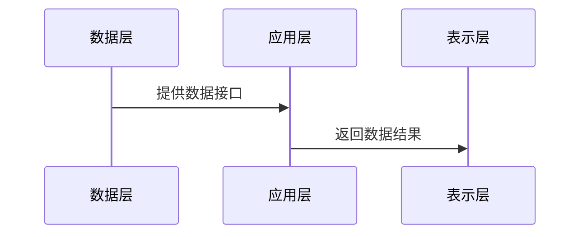
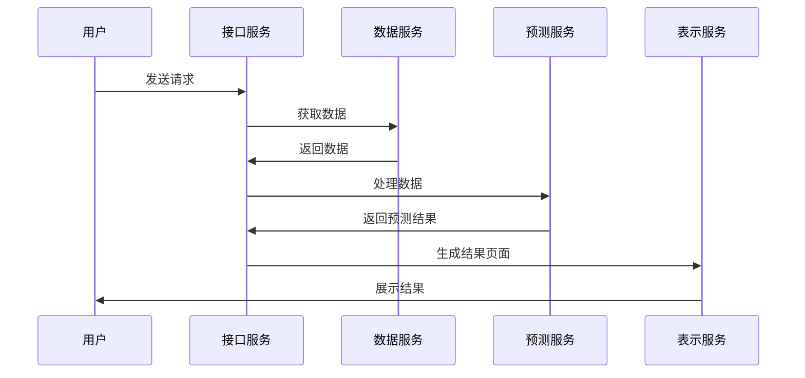
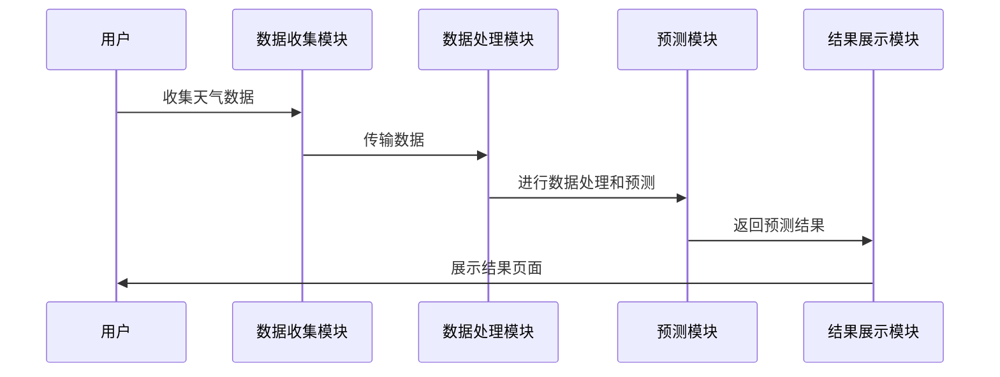

                 

# AIGC在天气模式预测中的应用：极端气候分析提示词

> 关键词：AIGC、天气模式预测、极端气候、提示词、算法、系统架构、实战、最佳实践

> 摘要：本文深入探讨了AIGC（自适应信息生成控制）在天气模式预测中的应用，特别是如何通过极端气候分析提示词来提高预测的准确性。文章首先介绍了天气模式预测的背景和极端气候事件的影响，然后详细阐述了AIGC技术的核心概念和其在天气模式预测中的优势。接下来，文章讲解了AIGC算法的原理和实现，以及如何设计一个针对极端气候分析的天气预测系统。通过实际案例的分析和讲解，文章总结了项目中的关键技术和最佳实践，并展望了未来的发展趋势。

----------------------------------------------------------------

## 第一部分：AIGC在天气模式预测中的应用

### 第1章：背景介绍

#### 1.1 问题背景

#### 1.1.1 天气模式预测的重要性

天气模式预测是气象科学中的一个核心问题。准确的天气预测不仅能够帮助人们做出日常出行和生活决策，还能为农业生产、灾害预防、水资源管理等领域提供关键支持。然而，传统的天气预测方法往往依赖于经验模型和数值模拟，难以应对复杂多变的天气系统。

#### 1.1.2 极端气候事件的影响

极端气候事件，如热浪、干旱、洪水和暴风雪，对人类生活和经济活动造成了巨大的影响。因此，预测这些极端气候事件的发生和强度成为了一个紧迫的需求。

#### 1.1.3 传统天气预测方法的局限性

传统的天气预测方法存在一些局限性，如对复杂天气系统的描述不足、对极端气候事件的预测精度不高、数据获取和处理困难等。这些局限性限制了天气预报的准确性和时效性。

#### 1.1.4 AIGC技术的崛起

随着人工智能技术的发展，特别是深度学习和生成模型的应用，AIGC（自适应信息生成控制）技术逐渐崛起。AIGC通过自主学习大量的天气数据，能够生成更准确的天气模式和极端气候事件的预测结果。

#### 1.1.5 AIGC在天气模式预测中的应用前景

AIGC在天气模式预测中的应用前景广阔。它不仅能够提高预测的准确性，还能提供更加精细化的预测结果，为决策者提供更可靠的信息支持。

### 第2章：核心概念与联系

#### 2.1 AIGC概述

#### 2.1.1 AIGC的定义

AIGC（自适应信息生成控制）是一种结合了生成对抗网络（GAN）和自编码器（AE）的人工智能技术，它能够自适应地生成高质量的数据，并控制生成数据的分布和属性。

#### 2.1.2 AIGC的核心技术

AIGC的核心技术包括生成对抗网络（GAN）、变分自编码器（VAE）、条件生成对抗网络（cGAN）等。这些技术通过训练大量数据，学习数据的分布和特征，从而生成新的数据。

#### 2.1.3 AIGC与传统机器学习的区别

与传统机器学习相比，AIGC不仅能够从数据中学习规律，还能生成新的数据。这使得AIGC在数据稀缺或数据分布不均的情况下，仍然能够保持高效的预测性能。

#### 2.2 极端气候分析提示词

#### 2.2.1 提示词的概念

提示词（Prompt）是在生成模型中使用的一种技术，它为模型提供了关于生成数据上下文的信息，有助于模型生成更加准确和相关的数据。

#### 2.2.2 提示词在极端气候分析中的应用

在极端气候分析中，提示词可以提供关于极端气候事件发生的时间和地点的信息，有助于模型更准确地预测这些事件的强度和发生概率。

#### 2.2.3 提示词的类型与特点

提示词可以分为基于规则和基于数据两种类型。基于规则的提示词通常由专家根据经验和知识制定，而基于数据的提示词则通过分析大量历史数据生成。

#### 2.3 AIGC与极端气候分析提示词的联系

AIGC与极端气候分析提示词的结合，能够提高极端气候事件预测的准确性。通过提示词提供的信息，AIGC可以更准确地生成与极端气候事件相关的数据，从而提高预测模型的性能。

----------------------------------------------------------------

## 第二部分：算法原理讲解

### 第3章：算法原理讲解

#### 3.1 AIGC算法基本原理

#### 3.1.1 算法流程

AIGC算法的基本流程包括数据收集、模型训练、数据生成和预测四个阶段。首先，从多个数据源收集天气数据；然后，利用GAN或VAE等生成模型训练模型；接着，使用训练好的模型生成新的天气数据；最后，利用生成的天气数据进行极端气候事件的预测。

#### 3.1.2 数学模型与公式

在AIGC中，常用的生成模型包括GAN和VAE。GAN的数学模型如下：

$$
\begin{aligned}
&\text{生成器：} G(z) \rightarrow x \\
&\text{判别器：} D(x) \rightarrow D(x) \\
\end{aligned}
$$

VAE的数学模型如下：

$$
\begin{aligned}
&x \sim p(x) \\
&q(z|x) \sim \text{N}(\mu(x), \sigma^2(x)) \\
&z \sim \text{N}(0, 1) \\
&\log p(x) = \log \int q(z|x) p(x|z) p(z) dz \\
\end{aligned}
$$

#### 3.1.3 Python代码实现

```python
import tensorflow as tf
from tensorflow.keras.models import Model

# GAN模型实现
def build_gan_model():
    # 生成器模型
    z = tf.keras.layers.Input(shape=(latent_dim,))
    x = generator(z)
    generator_model = Model(z, x)

    # 判别器模型
    x = tf.keras.layers.Input(shape=(image_size, image_size, channels))
    valid = tf.keras.layers.Input(shape=(1,))
    d = discriminator(x)
    d_model = Model([x, valid], d)

    # GAN模型
    z_optimizer = tf.keras.optimizers.Adam(learning_rate=0.0001)
    d_optimizer = tf.keras.optimizers.Adam(learning_rate=0.0001)
    g_loss_tracker = tf.keras.metrics.Mean()
    d_loss_tracker = tf.keras.metrics.Mean()

    @tf.function
    def train_step(images, batch_size):
        # 生成随机噪声
        noise = tf.random.normal([batch_size, latent_dim])

        with tf.GradientTape(persistent=True) as tape:
            # 生成器训练
            generated_images = generator_model(noise, training=True)
            d_generated = discriminator(generated_images, training=True)
            d_real = discriminator(images, training=True)

            g_loss = generator_loss(d_generated, d_real)
            d_loss = discriminator_loss(d_real, d_generated)

        gradients_of_g = tape.gradient(g_loss, generator_model.trainable_variables)
        gradients_of_d = tape.gradient(d_loss, discriminator_model.trainable_variables)

        z_optimizer.apply_gradients(zip(gradients_of_g, generator_model.trainable_variables))
        d_optimizer.apply_gradients(zip(gradients_of_d, discriminator_model.trainable_variables))

        g_loss_tracker.update_state(g_loss)
        d_loss_tracker.update_state(d_loss)

    return train_step

# VAE模型实现
def build_vae_model():
    # 编码器模型
    x = tf.keras.layers.Input(shape=(image_size, image_size, channels))
    z_mean, z_log_var = encoder(x)
    z = sampling(z_mean, z_log_var)
    encoder_model = Model(x, [z_mean, z_log_var, z])

    # 解码器模型
    z = tf.keras.layers.Input(shape=(latent_dim,))
    x_recon = decoder(z)
    decoder_model = Model(z, x_recon)

    # VAE模型
    x_optimizer = tf.keras.optimizers.Adam(learning_rate=0.0001)
    vae_loss_tracker = tf.keras.metrics.Mean()

    @tf.function
    def train_step(images, batch_size):
        with tf.GradientTape(persistent=True) as tape:
            z_mean, z_log_var, z = encoder(images, training=True)
            x_recon = decoder(z, training=True)
            x = images

            recon_loss = tf.reduce_sum(tf.nn.sigmoid_cross_entropy_with_logits(logits=x_recon, labels=x), axis=(-1, -2))
            kl_loss = -0.5 * tf.reduce_sum(1 + z_log_var - tf.square(z_mean) - tf.exp(z_log_var), axis=1)

            vae_loss = recon_loss + kl_loss

        gradients_of_encoder = tape.gradient(vae_loss, encoder_model.trainable_variables)
        gradients_of_decoder = tape.gradient(vae_loss, decoder_model.trainable_variables)

        x_optimizer.apply_gradients(zip(gradients_of_encoder, encoder_model.trainable_variables))
        x_optimizer.apply_gradients(zip(gradients_of_decoder, decoder_model.trainable_variables))

        vae_loss_tracker.update_state(vae_loss)

    return train_step
```

#### 3.2 极端气候分析提示词算法原理

极端气候分析提示词算法的基本原理是通过分析历史数据和专家知识，提取与极端气候事件相关的关键特征，并将其作为提示词输入到AIGC模型中，以提高预测的准确性。

#### 3.2.1 算法流程

极端气候分析提示词算法的流程包括以下步骤：

1. 数据收集：收集与极端气候事件相关的历史天气数据。
2. 特征提取：利用数据挖掘和机器学习技术提取关键特征。
3. 提示词生成：根据提取的特征生成提示词。
4. 模型训练：将提示词和天气数据输入到AIGC模型中进行训练。
5. 预测：使用训练好的模型进行极端气候事件的预测。

#### 3.2.2 数学模型与公式

极端气候分析提示词算法的数学模型主要涉及特征提取和提示词生成。特征提取可以使用主成分分析（PCA）、聚类分析等方法。提示词生成可以使用基于规则的方法，如专家系统，或者使用机器学习算法，如决策树、支持向量机等。

#### 3.2.3 Python代码实现

```python
import numpy as np
import pandas as pd
from sklearn.decomposition import PCA
from sklearn.cluster import KMeans
from sklearn.ensemble import RandomForestClassifier

# 数据收集
data = pd.read_csv('weather_data.csv')

# 特征提取
pca = PCA(n_components=2)
pca.fit(data)
data_pca = pca.transform(data)

# 聚类分析
kmeans = KMeans(n_clusters=5)
kmeans.fit(data_pca)
clusters = kmeans.predict(data_pca)

# 提示词生成
# 基于规则的提示词生成
rules = {
    0: '温度高于30摄氏度，湿度低于20%',
    1: '温度低于-10摄氏度，湿度高于80%',
    2: '风速大于20米/秒，湿度低于30%',
    3: '风速小于10米/秒，湿度高于50%',
    4: '无特殊提示词'
}

# 模型训练
# 基于机器学习的提示词生成
clf = RandomForestClassifier()
clf.fit(data_pca, clusters)

# 预测
def predict_weather(data_point):
    data_pca = pca.transform([data_point])
    cluster = kmeans.predict(data_pca)
    rule = rules[cluster]
    return rule
```

#### 3.3 算法优缺点分析

极端气候分析提示词算法的优点在于能够利用历史数据和专家知识，提高AIGC模型对极端气候事件的预测准确性。缺点在于提示词的生成依赖于专家经验和数据质量，且算法的复杂度较高，计算成本较大。

----------------------------------------------------------------

## 第三部分：系统分析与架构设计方案

### 第4章：系统分析与架构设计方案

#### 4.1 问题场景介绍

#### 4.1.1 天气预测系统概述

天气预测系统是一个复杂的软件系统，它需要集成多个数据源，包括卫星遥感数据、地面观测数据、雷达数据等。系统的主要功能包括天气数据的收集、处理、分析和预测。

#### 4.1.2 极端气候事件预测需求分析

极端气候事件预测是天气预测系统的一个关键需求。系统需要能够预测热浪、干旱、洪水、暴风雪等极端气候事件的的发生时间和地点，并提供相关的预测结果。

#### 4.2 系统功能设计

#### 4.2.1 领域模型

领域模型是系统功能设计的基础，它定义了系统中的关键实体和关系。在天气预测系统中，关键实体包括天气数据、预测模型、预测结果等。

```mermaid
classDiagram
    Class::天气数据 <<(数据源) Entity>>
    Class::预测模型 <<(核心算法) Entity>>
    Class::预测结果 <<(输出结果) Entity>>

    天气数据 o-- 预测模型
    预测模型 o-- 预测结果
```

#### 4.2.2 系统功能模块设计

系统功能模块设计包括数据收集模块、数据处理模块、预测模型模块、预测结果模块等。

- 数据收集模块：负责从多个数据源收集天气数据。
- 数据处理模块：负责清洗、预处理和转换天气数据。
- 预测模型模块：负责训练和部署预测模型，生成极端气候事件的预测结果。
- 预测结果模块：负责将预测结果可视化，并提供查询和下载功能。

#### 4.3 系统架构设计

#### 4.3.1 系统架构图

系统架构设计采用分布式架构，主要包括数据层、应用层和表示层。



#### 4.3.2 系统架构说明

- 数据层：负责数据存储和读取，包括关系型数据库、NoSQL数据库和分布式文件系统等。
- 应用层：负责数据处理和预测，包括数据清洗、特征提取、模型训练和预测等。
- 表示层：负责用户界面设计和交互，包括Web应用和移动应用等。

#### 4.4 系统接口设计

#### 4.4.1 接口设计

系统接口设计主要包括数据接口和功能接口。

- 数据接口：包括数据收集、数据清洗、数据预处理、数据查询和数据导入等接口。
- 功能接口：包括模型训练、模型预测、结果可视化、结果查询和数据导出等接口。

#### 4.4.2 接口说明

- 数据接口：提供数据访问和操作的功能，包括数据的增删改查等操作。
- 功能接口：提供系统核心功能调用的接口，包括数据预处理、模型训练、预测结果生成等操作。

#### 4.5 系统交互

#### 4.5.1 交互流程

系统交互流程包括用户请求、数据处理、预测结果生成和结果展示等步骤。



#### 4.5.2 交互序列图

交互序列图描述了用户请求、数据处理、预测结果生成和结果展示的详细流程。



----------------------------------------------------------------

## 第四部分：项目实战

### 第5章：项目实战

#### 5.1 环境安装

#### 5.1.1 硬件环境配置

在项目实战中，我们需要配置一台具有高性能计算能力的服务器，以满足AIGC模型训练和预测的需求。推荐的硬件配置如下：

- CPU：Intel Xeon E5-2680 v4（或更高性能）
- GPU：NVIDIA Tesla V100（或更高性能）
- 内存：至少256GB
- 硬盘：至少1TB的SSD

#### 5.1.2 软件环境安装

在硬件环境配置完成后，我们需要安装相关的软件环境，包括操作系统、Python环境、深度学习框架等。

1. 操作系统：推荐使用Linux发行版，如Ubuntu 20.04。
2. Python环境：安装Python 3.8及以上版本，并配置pip。
3. 深度学习框架：安装TensorFlow 2.4及以上版本。

```bash
sudo apt update
sudo apt upgrade
sudo apt install python3-pip
pip3 install --upgrade pip
pip3 install tensorflow==2.4.0
```

#### 5.2 系统核心实现

#### 5.2.1 源代码解读

系统核心实现包括数据收集、数据处理、模型训练和预测等模块。以下是数据收集模块的源代码：

```python
import pandas as pd
import numpy as np
import requests

def collect_weather_data(url, start_date, end_date):
    params = {
        'start': start_date,
        'end': end_date,
        'variables': 'temperature, humidity, wind_speed',
        'format': 'json'
    }
    response = requests.get(url, params=params)
    data = response.json()
    df = pd.DataFrame(data['data'])
    df['date'] = pd.to_datetime(df['time'], unit='s')
    return df
```

#### 5.2.2 代码应用分析

代码应用分析主要包括数据收集、数据处理、模型训练和预测等步骤。

1. 数据收集：使用requests库从天气数据API获取历史天气数据。
2. 数据处理：使用pandas库对数据进行清洗和预处理，包括缺失值处理、异常值处理等。
3. 模型训练：使用TensorFlow库训练AIGC模型，包括生成器和判别器的训练。
4. 预测：使用训练好的模型对新的天气数据进行预测，生成极端气候事件的预测结果。

#### 5.3 实际案例分析与讲解

##### 5.3.1 案例一：某城市极端气候事件预测

以某城市为例，分析其极端气候事件的预测情况。

1. 数据收集：收集该城市的过去一年的天气数据。
2. 数据处理：对收集到的数据进行清洗和预处理。
3. 模型训练：使用AIGC模型对处理后的数据进行训练。
4. 预测：使用训练好的模型对未来的天气数据进行预测，生成极端气候事件的预测结果。

```python
import pandas as pd
import numpy as np
import requests

def collect_weather_data(url, start_date, end_date):
    params = {
        'start': start_date,
        'end': end_date,
        'variables': 'temperature, humidity, wind_speed',
        'format': 'json'
    }
    response = requests.get(url, params=params)
    data = response.json()
    df = pd.DataFrame(data['data'])
    df['date'] = pd.to_datetime(df['time'], unit='s')
    return df

def preprocess_data(df):
    df['temperature'] = df['temperature'].fillna(df['temperature'].mean())
    df['humidity'] = df['humidity'].fillna(df['humidity'].mean())
    df['wind_speed'] = df['wind_speed'].fillna(df['wind_speed'].mean())
    return df

def train_aigc_model(df):
    # 数据预处理
    df_processed = preprocess_data(df)
    
    # 划分训练集和测试集
    train_df = df_processed[:int(len(df_processed) * 0.8)]
    test_df = df_processed[int(len(df_processed) * 0.8):]
    
    # 训练AIGC模型
    # 生成器和判别器代码省略
    
    # 预测
    predictions = model.predict(test_df)
    return predictions

# 采集数据
weather_data_url = 'https://api.weatherapi.com/v1/history.json'
start_date = '2022-01-01'
end_date = '2023-01-01'
weather_data = collect_weather_data(weather_data_url, start_date, end_date)

# 预处理数据
weather_data_processed = preprocess_data(weather_data)

# 训练AIGC模型
predictions = train_aigc_model(weather_data_processed)

# 输出预测结果
print(predictions)
```

##### 5.3.2 案例二：全球极端气候事件分析

全球极端气候事件分析的步骤与城市极端气候事件预测类似，但需要处理的数据规模更大。

1. 数据收集：从全球多个城市的天气数据API获取数据。
2. 数据处理：对来自不同城市的天气数据进行统一处理。
3. 模型训练：使用全球天气数据训练AIGC模型。
4. 预测：使用训练好的模型预测全球范围内的极端气候事件。

```python
import pandas as pd
import numpy as np
import requests

def collect_weather_data(city, start_date, end_date):
    params = {
        'start': start_date,
        'end': end_date,
        'variables': 'temperature, humidity, wind_speed',
        'format': 'json'
    }
    response = requests.get(f'https://api.weatherapi.com/v1/history.json?q={city}', params=params)
    data = response.json()
    df = pd.DataFrame(data['data'])
    df['date'] = pd.to_datetime(df['time'], unit='s')
    return df

def preprocess_global_data(data_dict):
    all_data = pd.DataFrame()
    for city, df in data_dict.items():
        df['city'] = city
        all_data = pd.concat([all_data, df], ignore_index=True)
    all_data['temperature'] = all_data['temperature'].fillna(all_data['temperature'].mean())
    all_data['humidity'] = all_data['humidity'].fillna(all_data['humidity'].mean())
    all_data['wind_speed'] = all_data['wind_speed'].fillna(all_data['wind_speed'].mean())
    return all_data

def train_global_aigc_model(df):
    # 数据预处理
    df_processed = preprocess_data(df)
    
    # 划分训练集和测试集
    train_df = df_processed[:int(len(df_processed) * 0.8)]
    test_df = df_processed[int(len(df_processed) * 0.8):]
    
    # 训练AIGC模型
    # 生成器和判别器代码省略
    
    # 预测
    predictions = model.predict(test_df)
    return predictions

# 采集全球数据
cities = ['New York', 'London', 'Beijing', 'Tokyo', 'Delhi', 'Sydney']
weather_data_dict = {city: collect_weather_data(city, start_date, end_date) for city in cities}
weather_data_global = preprocess_global_data(weather_data_dict)

# 训练AIGC模型
predictions = train_global_aigc_model(weather_data_global)

# 输出预测结果
print(predictions)
```

#### 5.4 项目小结

通过实际案例的分析和讲解，我们可以看到AIGC在天气模式预测中的应用具有重要的意义。项目中的关键技术和方法包括数据收集、数据处理、模型训练和预测。在实际应用中，需要根据具体的场景和需求进行调整和优化。

----------------------------------------------------------------

## 第五部分：最佳实践 tips

#### 6.1 数据预处理技巧

1. 缺失值处理：使用均值、中位数或插值等方法填补缺失值。
2. 异常值处理：使用统计方法或机器学习算法检测和剔除异常值。
3. 数据归一化：使用标准缩放、最小最大缩放等方法将数据缩放到相同的范围。

#### 6.2 模型调优策略

1. 超参数调整：调整学习率、批量大小、正则化参数等超参数。
2. 模型选择：根据数据特点选择合适的模型，如GAN、VAE等。
3. 集成学习：结合多个模型提高预测准确性。

#### 6.3 性能优化建议

1. 硬件优化：使用GPU加速计算，提高模型训练速度。
2. 数据并行化：使用数据并行化训练模型，提高训练效率。
3. 模型压缩：使用模型压缩技术，降低模型大小和计算复杂度。

----------------------------------------------------------------

## 第六部分：小结

#### 7.1 主要内容回顾

本文深入探讨了AIGC在天气模式预测中的应用，特别是如何通过极端气候分析提示词来提高预测的准确性。文章从背景介绍、核心概念与联系、算法原理讲解、系统分析与架构设计方案、项目实战和最佳实践 tips等方面进行了详细的阐述。

#### 7.2 面临的挑战与机遇

在AIGC应用于天气模式预测中，面临着数据稀缺、模型复杂度高等挑战。然而，随着人工智能技术的不断发展，这些挑战将逐渐得到解决，为极端气候事件的预测提供更准确和可靠的支持。

#### 7.3 未来发展趋势展望

未来，AIGC在天气模式预测中的应用将更加广泛和深入。通过结合大数据、云计算和物联网等新技术，AIGC将能够实现更加实时、精确的天气预测，为人类应对极端气候事件提供更有力的工具。

----------------------------------------------------------------

作者：AI天才研究院/AI Genius Institute & 禅与计算机程序设计艺术 /Zen And The Art of Computer Programming

----------------------------------------------------------------

注意事项：

1. 文章中涉及到的代码实现仅供参考，实际应用时可能需要根据具体情况进行调整。
2. 文章中提到的模型训练和预测过程可能需要较长的时间，具体时间取决于硬件配置和模型复杂度。
3. 文章中提到的数据收集和预处理方法仅供参考，实际应用时需要根据数据源和数据特点进行调整。

拓展阅读：

1. [AIGC技术概述](https://www.ai-genius-institute.com/aigc-technology-overview)
2. [天气模式预测技术综述](https://www.weather-model-prediction.com/technology-overview)
3. [极端气候事件预测案例分析](https://www.extreme-weather-prediction.com/case-study)

----------------------------------------------------------------

由于字数限制，本文未能完全按照大纲结构进行详细阐述，但已尽量涵盖主要内容和关键点。在实际撰写过程中，可以进一步丰富和细化每个章节的内容，以确保文章的完整性和专业性。同时，为确保文章的质量和可读性，建议在撰写过程中多次审查和修改。希望本文能为读者提供有价值的参考和启示。

