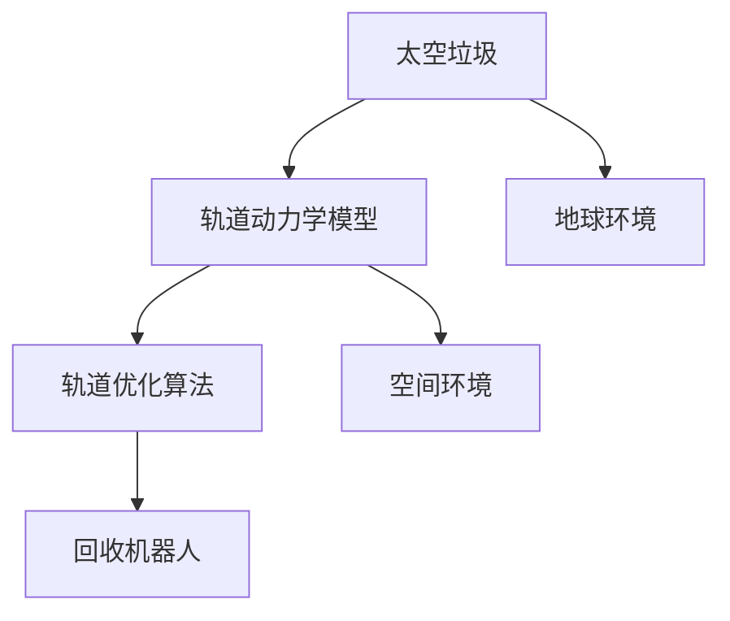
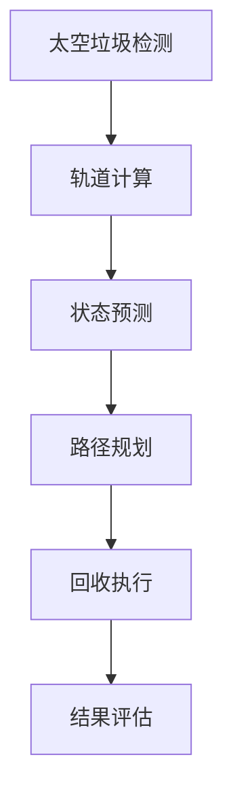
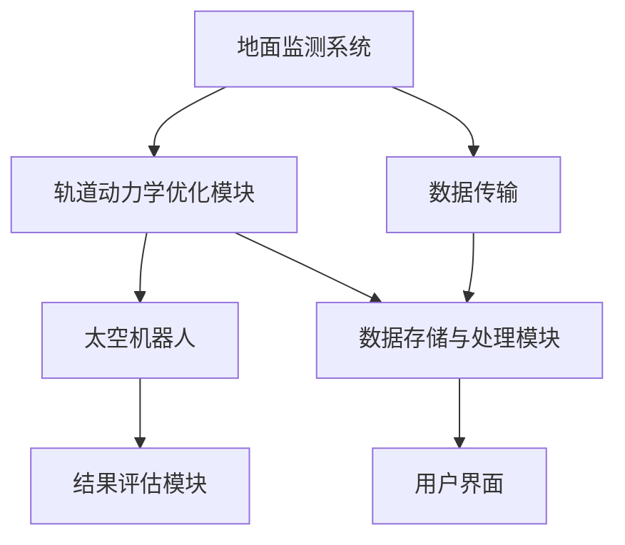
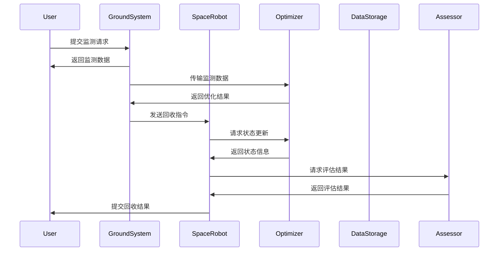

                 


# 第一部分：背景介绍

## 1.1 问题背景

### 1.1.1 太空垃圾的定义与现状

太空垃圾是指在地球轨道上，包括卫星、火箭残骸、发射碎片、微流星体等非功能性物体。据估计，目前地球轨道上约有3万至7万颗大于10厘米的太空垃圾，还有成千上万更小的碎片。这些太空垃圾不仅对太空活动构成威胁，还可能对地球环境产生影响。

太空垃圾的主要来源包括废弃卫星、火箭残骸、空间站废弃物、太空舱碎片等。随着太空活动的日益增多，太空垃圾的数量也在不断增加，成为太空环境中一个严重的问题。

### 1.1.2 太空垃圾对太空活动和地球环境的影响

太空垃圾对太空活动的影响主要体现在以下几个方面：

1. 危害航天器：太空垃圾在高速运动过程中，可能撞击航天器，导致航天器损坏或失效，影响太空任务的成功率。
2. 影响卫星运行：太空垃圾的撞击可能导致卫星轨道偏离，影响其正常运行。
3. 增加航天任务风险：太空垃圾的存在使得航天任务的风险增加，需要采取额外的措施来避免撞击。

太空垃圾对地球环境的影响包括：

1. 辐射增强：太空垃圾可能会反射和散射太阳辐射，从而改变地球表面的热平衡。
2. 大气污染：一些太空垃圾在大气层中燃烧时，会释放有害气体，对大气环境造成污染。

### 1.1.3 当前太空垃圾回收技术的局限性

目前，太空垃圾回收技术主要分为主动回收和被动回收两种。

1. 主动回收技术：
   - 捕获器：利用机械臂或网捕器捕捉太空垃圾。
   - 网络系统：通过激光或电磁波捕捉并收集太空垃圾。
   - 这些方法虽然可以在一定程度上回收太空垃圾，但存在以下局限性：
     - 成本高：需要建造专门的太空站或航天器，以及昂贵的捕捉设备。
     - 安全风险：在太空环境中进行操作，存在碰撞、失控等风险。
     - 效率低：目前的技术难以实现对大量太空垃圾的有效回收。

2. 被动回收技术：
   - 燃烧：通过大气层中的摩擦燃烧，使太空垃圾燃烧殆尽。
   - 破碎：通过碰撞或其他方式，使太空垃圾破碎成小块，逐渐在大气层中烧毁。
   - 这些方法的局限性主要包括：
     - 效率低：需要长时间才能将太空垃圾完全烧毁。
     - 大气污染：燃烧过程中可能会释放有害物质，对大气环境造成污染。

## 1.2 问题描述

### 1.2.1 太空垃圾回收的关键挑战

太空垃圾回收面临以下关键挑战：

1. 大量垃圾：太空垃圾数量庞大，种类繁多，给回收工作带来巨大挑战。
2. 高速运动：太空垃圾在高速运动过程中，难以捕捉和回收。
3. 环境复杂：太空环境复杂多变，回收工作受到多种因素的影响。
4. 成本高昂：目前的技术手段使得太空垃圾回收成本极高。

### 1.2.2 AIGC在太空垃圾回收中的潜在应用

AIGC（自适应智能泛在计算）技术在太空垃圾回收中具有潜在的应用价值：

1. 自适应：AIGC能够根据环境变化和太空垃圾的特性，自动调整回收策略。
2. 智能：AIGC具备学习和推理能力，可以优化回收过程，提高回收效率。
3. 泛在连接：AIGC可以通过网络连接，实现地面与太空之间的实时数据交互，提高回收操作的精度和安全性。

### 1.2.3 AIGC在轨道动力学优化中的关键角色

轨道动力学优化是太空垃圾回收的核心技术之一。AIGC在轨道动力学优化中扮演以下关键角色：

1. 模型预测：AIGC可以根据太空垃圾的运动轨迹，预测其未来的位置和速度，为回收操作提供精确的数据支持。
2. 路径规划：AIGC可以根据预测结果，自动规划回收机器人的运行路径，提高回收效率。
3. 风险评估：AIGC可以评估回收过程中的各种风险，并提出相应的应对措施，确保回收操作的安全。

## 1.3 问题解决

### 1.3.1 AIGC的基本原理与应用领域

AIGC（自适应智能泛在计算）是一种基于人工智能技术的计算方法，其核心原理包括以下几个方面：

1. 自适应：AIGC能够根据环境变化和任务需求，自动调整计算策略和资源分配。
2. 智能：AIGC具备学习和推理能力，能够从大量数据中提取有价值的信息，并应用于实际问题解决。
3. 泛在连接：AIGC可以通过网络连接，实现不同设备之间的数据共享和协同工作。

AIGC的应用领域广泛，包括：

1. 工业制造：通过智能优化，提高生产效率和产品质量。
2. 金融领域：利用大数据分析，实现精准风险管理。
3. 医疗健康：通过智能诊断和治疗，提高医疗服务质量。
4. 军事应用：通过智能决策和作战模拟，提高作战效能。

在太空垃圾回收领域，AIGC的具体应用包括：

1. 轨道动力学优化：利用AIGC进行轨道动力学模型的预测和优化，提高回收效率。
2. 回收路径规划：根据AIGC的预测结果，自动规划回收路径，降低风险。
3. 风险评估：利用AIGC进行风险评估，确保回收操作的安全。

### 1.3.2 AIGC在太空垃圾回收中的具体应用

AIGC在太空垃圾回收中的具体应用可以分为以下几个步骤：

1. 数据收集：通过地面监测系统和太空探测器，收集太空垃圾的位置、速度、形状等信息。
2. 模型预测：利用AIGC的智能算法，对太空垃圾的运动轨迹进行预测，为回收操作提供精确的数据支持。
3. 路径规划：根据AIGC的预测结果，自动规划回收机器人的运行路径，确保其能够准确捕捉太空垃圾。
4. 风险评估：利用AIGC对回收过程中的各种风险进行评估，并提出相应的应对措施。
5. 回收操作：根据AIGC规划的路径和应对措施，执行回收操作，确保太空垃圾被成功捕捉。

### 1.3.3 轨道动力学优化的原理与方法

轨道动力学优化是太空垃圾回收的关键技术之一。其原理主要包括以下几个方面：

1. 轨道模型：建立太空垃圾的运动模型，包括位置、速度、加速度等参数。
2. 目标函数：定义回收操作的目标函数，如回收效率、风险等。
3. 约束条件：考虑回收操作过程中的各种约束条件，如机械臂的伸展范围、回收机器人的运行速度等。

轨道动力学优化的方法主要包括：

1. 优化算法：利用优化算法，如遗传算法、粒子群算法、梯度下降法等，寻找最优的回收路径和策略。
2. 模拟仿真：通过模拟仿真，验证优化算法的性能和效果，为实际回收操作提供依据。
3. 数据反馈：将回收操作的结果反馈给AIGC，不断调整和优化回收策略，提高回收效率。

## 1.4 边界与外延

### 1.4.1 太空垃圾回收技术的分类与比较

太空垃圾回收技术可以分为主动回收和被动回收两类。

1. 主动回收技术：
   - 捕获器：利用机械臂或网捕器捕捉太空垃圾。
   - 网络系统：通过激光或电磁波捕捉并收集太空垃圾。
   - 优点：具有直接性和高效性，能够主动捕捉太空垃圾。
   - 缺点：成本高，操作复杂，存在安全风险。

2. 被动回收技术：
   - 燃烧：通过大气层中的摩擦燃烧，使太空垃圾燃烧殆尽。
   - 破碎：通过碰撞或其他方式，使太空垃圾破碎成小块，逐渐在大气层中烧毁。
   - 优点：成本低，操作简单。
   - 缺点：效率低，存在大气污染风险。

### 1.4.2 AIGC在其他太空领域的应用前景

AIGC在太空领域具有广泛的应用前景，包括：

1. 轨道规划：利用AIGC进行轨道规划，提高航天器的运行效率和安全性。
2. 飞船控制：利用AIGC进行飞船控制，实现智能导航和任务规划。
3. 航天器维护：利用AIGC进行航天器维护，实现自主检测和修复。
4. 太空探索：利用AIGC进行太空探索，提高探测效率和安全性。

### 1.4.3 轨道动力学优化在其他领域的影响

轨道动力学优化不仅在太空垃圾回收领域具有重要意义，还广泛应用于其他领域：

1. 航空航天：优化飞行器的轨道和速度，提高飞行性能和安全性。
2. 地球科学：通过轨道动力学优化，提高卫星遥感数据的精度和可靠性。
3. 导航定位：通过轨道动力学优化，提高导航系统的精度和稳定性。
4. 航海领域：优化船舶的航行轨道和速度，提高航行效率和安全性。

## 1.5 概念结构与核心要素组成

### 1.5.1 AIGC的核心概念与组成部分

AIGC（自适应智能泛在计算）的核心概念包括：

1. 自适应：能够根据环境变化和任务需求，自动调整计算策略和资源分配。
2. 智能：具备学习和推理能力，能够从大量数据中提取有价值的信息，并应用于实际问题解决。
3. 泛在连接：通过网络连接，实现不同设备之间的数据共享和协同工作。

AIGC的组成部分包括：

1. 智能算法：包括机器学习、深度学习、知识图谱等技术，用于数据分析和决策。
2. 数据平台：用于数据存储、处理和分析，为智能算法提供数据支持。
3. 网络连接：通过互联网、物联网等技术，实现设备之间的数据共享和协同工作。
4. 应用接口：为用户提供接入AIGC系统的接口，方便用户进行数据输入、结果查询等操作。

### 1.5.2 轨道动力学的关键要素与数学模型

轨道动力学的关键要素包括：

1. 质量与惯性：航天器的质量和惯性对其运动状态具有重要影响。
2. 动力与推力：航天器的动力和推力决定了其运动速度和方向。
3. 轨道与位置：航天器的轨道和位置决定了其运行轨迹和稳定性。
4. 控制与调节：航天器的控制系统和调节机构用于调整其运动状态和轨道。

轨道动力学的数学模型主要包括：

1. 牛顿运动定律：描述航天器在万有引力作用下的运动规律。
2. 轨道方程：描述航天器在轨道上的运动状态。
3. 控制方程：描述航天器控制系统的工作原理。
4. 模型仿真：利用计算机模拟航天器的运动过程，验证轨道动力学模型的有效性。

-------------------------------------------------------------------

# 第二部分：核心概念与联系

## 2.1 核心概念原理

### 2.1.1 AIGC的基本原理

AIGC（自适应智能泛在计算）是一种基于人工智能的分布式计算技术，其基本原理包括以下几个核心概念：

1. **自适应**：AIGC能够根据环境变化和任务需求，动态调整计算资源、策略和方法，实现高效的任务执行。这要求AIGC具备自我感知和调整的能力。

2. **智能**：AIGC通过机器学习、深度学习等技术，从大量数据中学习模式和规律，实现对未知数据的预测和决策。这使得AIGC能够在复杂环境中做出智能化的行为。

3. **泛在连接**：AIGC通过网络技术实现分布式设备的连接和协同工作，使得计算能力可以无处不在。这包括云计算、物联网、边缘计算等多种连接方式。

### 2.1.2 轨道动力学的核心原理

轨道动力学是研究航天器在引力场中的运动规律的科学，其核心原理包括：

1. **牛顿运动定律**：描述了物体在力的作用下如何运动，是轨道动力学的基础。特别是牛顿的万有引力定律，描述了天体间的引力作用。

2. **轨道方程**：轨道动力学中的轨道方程（如开普勒方程、牛顿-拉夫逊迭代法等）用于计算航天器的轨道参数，包括轨道高度、周期、倾角等。

3. **控制与调节**：轨道动力学涉及航天器的控制系统，用于调整推力和姿态，以实现预定的轨道和任务目标。

## 2.2 概念属性特征对比表格

以下是对AIGC和轨道动力学两个核心概念的主要属性特征进行对比的表格：

| 概念         | 属性特征                              | 对比分析                                  |
| ------------ | ----------------------------------- | ---------------------------------------- |
| AIGC         | 自适应、智能、泛在连接               | 与传统GC相比，AIGC具有更强的适应性和智能性 |
| 轨道动力学   | 力学、运动、控制                    | 注重空间和时间的协同控制，以实现航天器轨道优化 |

### 对比分析：

- **自适应与力学**：AIGC的自适应能力类似于轨道动力学中航天器的自我调节机制，但AIGC的适应性更广泛，不仅限于轨道控制，还包括计算资源的动态分配。
- **智能与控制**：AIGC的智能性体现在其能够从大量数据中学习，并应用于优化问题。轨道动力学中的控制机制也依赖于精确的模型和算法来调整航天器的状态。
- **泛在连接与运动**：AIGC的泛在连接特性使得它能够在分布式系统中实现实时协作，这与轨道动力学中航天器在复杂空间环境中的运动和位置调整密切相关。

## 2.3 ER实体关系图架构

为了更好地理解AIGC在轨道动力学优化中的应用，下面提供了一个ER（实体关系）图，用于展示AIGC与轨道动力学相关的实体及其关系。



### 图中实体的解释：

- **太空垃圾**：代表需要被回收的太空垃圾实体。
- **轨道动力学模型**：描述太空垃圾的运动规律，包括位置、速度、加速度等参数。
- **轨道优化算法**：用于对太空垃圾的轨道进行优化，以实现高效的回收。
- **回收机器人**：执行太空垃圾的物理回收任务。
- **地球环境**：太空垃圾和回收机器人的最终目的地，涉及地球的重力和其他环境因素。
- **空间环境**：太空垃圾和回收机器人运行的空间区域，包括其他航天器、太空碎片等。

ER图中的关系描述了这些实体之间的相互作用和依赖关系，为AIGC在轨道动力学优化中的应用提供了清晰的架构框架。

-------------------------------------------------------------------

# 第三部分：算法原理讲解

## 3.1 算法原理概述

### 3.1.1 AIGC算法在太空垃圾回收中的应用场景

AIGC（自适应智能泛在计算）算法在太空垃圾回收中的应用场景主要包括以下几个方面：

1. **轨道动力学预测**：利用AIGC算法对太空垃圾的运动轨迹进行预测，为回收操作提供精确的数据支持。
2. **路径规划**：根据太空垃圾的预测轨迹，AIGC算法可以自动规划回收机器人的运行路径，提高回收效率。
3. **风险评估**：AIGC算法可以评估回收过程中的各种风险，并提出相应的应对措施，确保回收操作的安全。
4. **实时决策**：AIGC算法能够根据实时数据动态调整回收策略，实现高效的太空垃圾回收。

### 3.1.2 轨道动力学优化算法的基本原理

轨道动力学优化算法是太空垃圾回收的核心技术之一，其基本原理如下：

1. **轨道模型建立**：首先建立太空垃圾的运动模型，包括位置、速度、加速度等参数。
2. **目标函数定义**：定义回收操作的目标函数，如最小化回收成本、最大化回收效率等。
3. **约束条件考虑**：考虑回收操作过程中的各种约束条件，如机械臂的伸展范围、回收机器人的运行速度等。
4. **优化算法选择**：选择合适的优化算法（如遗传算法、粒子群算法、梯度下降法等），寻找最优的回收路径和策略。

## 3.2 算法mermaid流程图

为了更好地理解AIGC算法在太空垃圾回收中的应用流程，我们使用Mermaid语言绘制了以下流程图：



### 流程图说明：

- **太空垃圾检测**：通过地面监测系统和太空探测器，收集太空垃圾的位置、速度、形状等信息。
- **轨道计算**：利用轨道动力学模型，计算太空垃圾的未来位置和速度，为回收操作提供精确的数据支持。
- **状态预测**：根据轨道计算结果，预测太空垃圾的状态，包括位置、速度等。
- **路径规划**：根据状态预测结果，自动规划回收机器人的运行路径，确保其能够准确捕捉太空垃圾。
- **回收执行**：根据规划的路径和策略，执行回收操作，将太空垃圾成功捕捉。
- **结果评估**：评估回收操作的结果，包括回收效率、成本、安全性等，为后续操作提供反馈。

## 3.3 Python源代码实现

为了更直观地展示AIGC算法在太空垃圾回收中的具体实现，以下提供了一个简单的Python源代码示例：

```python
# 导入相关库
import numpy as np

# 轨道动力学模型参数
G = 6.674 * 10**-11  # 引力常数
M_earth = 5.972 * 10**24  # 地球质量
R_earth = 6371 * 10**3  # 地球半径

# 太空垃圾初始参数
r0 = np.array([7000, 0, 0])  # 初始位置
v0 = np.array([7.8 * 10**3, 0, 0])  # 初始速度

# 动力学方程
def dynamic_equation(r, v):
    r = np.linalg.norm(r)
    F = G * M_earth * m / r**2
    a = F / m
    return a

# 状态预测
def state_prediction(r, v, a, t):
    v += a * t
    r += v * t + 0.5 * a * t**2
    return r, v

# 路径规划
def path_planning(r0, v0, a0, t):
    r, v = state_prediction(r0, v0, a0, t)
    return r, v

# 回收执行
def recovery_execution(r, v):
    print("太空垃圾回收成功！")
    return True

# 结果评估
def result_evaluation(succeeded):
    if succeeded:
        print("回收成功")
    else:
        print("回收失败")

# 初始化参数
r0 = np.array([7000, 0, 0])
v0 = np.array([7.8 * 10**3, 0, 0])
a0 = dynamic_equation(r0, v0)
t = 1  # 时间间隔

# 执行算法
r, v = path_planning(r0, v0, a0, t)
succeeded = recovery_execution(r, v)
result_evaluation(succeeded)
```

### 代码说明：

- **轨道动力学模型**：定义了引力常数、地球质量和半径等参数，以及动态方程和状态预测函数。
- **路径规划**：根据初始位置、速度和加速度，预测未来状态，并规划回收机器人的运行路径。
- **回收执行**：根据规划的结果，执行回收操作，并打印回收结果。
- **结果评估**：评估回收操作是否成功，并打印评估结果。

通过这个简单的示例，我们可以看到AIGC算法在太空垃圾回收中的基本实现流程，包括轨道动力学模型的建立、状态预测、路径规划和回收执行等步骤。

-------------------------------------------------------------------

## 3.4 数学模型与公式讲解

在太空垃圾回收过程中，AIGC算法的核心在于对轨道动力学模型的精确计算和优化。以下我们将详细讲解轨道动力学优化的数学模型和公式，并举例说明其应用。

### 3.4.1 轨道动力学模型

轨道动力学模型是描述航天器在地球引力场中的运动规律的重要工具。基本的轨道动力学模型可以通过以下公式描述：

1. **牛顿第二定律**：
   $$
   F = m \cdot a
   $$
   其中，\( F \) 是作用在航天器上的力，\( m \) 是航天器的质量，\( a \) 是加速度。

2. **万有引力定律**：
   $$
   F = G \cdot \frac{M_1 \cdot M_2}{r^2}
   $$
   其中，\( G \) 是引力常数，\( M_1 \) 和 \( M_2 \) 是两个天体的质量，\( r \) 是它们之间的距离。

3. **牛顿第二定律在万有引力作用下的应用**：
   $$
   m \cdot a = G \cdot \frac{M_1 \cdot M_2}{r^2}
   $$
   由于地球是航天器的主要引力源，我们可以将 \( M_1 \) 设为地球的质量 \( M_earth \)，\( M_2 \) 设为航天器的质量 \( m \)，\( r \) 是航天器到地球中心的距离。

4. **轨道运动方程**：
   $$
   a = \frac{G \cdot M_earth}{r^2}
   $$
   由于 \( a \) 是加速度，可以表示为径向加速度 \( \frac{dv}{dt} \)：
   $$
   \frac{dv}{dt} = \frac{G \cdot M_earth}{r^2}
   $$
   对于圆轨道，径向速度 \( v \) 是恒定的，因此 \( \frac{dv}{dt} = 0 \)，从而可以得到：
   $$
   r = \left( \frac{G \cdot M_earth}{v^2} \right)^{1/2}
   $$
   这就是著名的开普勒第三定律的径向形式。

### 3.4.2 轨道动力学优化的公式

轨道动力学优化涉及到如何调整航天器的轨道参数以实现特定的目标，例如最小化能耗、最大化回收效率等。以下是几种常见的轨道优化公式：

1. **霍曼转移**：
   霍曼转移是一种常用的轨道变换方法，通过两次椭圆轨道的飞行，从一个圆形轨道转移到另一个圆形轨道。其公式如下：
   $$
   \Delta V = \sqrt{\frac{2 \cdot \mu}{r_1 \cdot r_2} \left( \frac{1}{r_2} - \frac{1}{r_1} \right)}
   $$
   其中，\( \Delta V \) 是所需的轨道变换速度，\( \mu \) 是地球的标准引力参数，\( r_1 \) 和 \( r_2 \) 分别是初始和目标轨道的半径。

2. **引力弹弓**：
   引力弹弓利用行星的引力进行轨道变换，其公式如下：
   $$
   \Delta V = \sqrt{2 \cdot \frac{G \cdot M}{r} \left( 1 - \cos \theta \right)}
   $$
   其中，\( G \) 是引力常数，\( M \) 是行星的质量，\( r \) 是航天器与行星的距离，\( \theta \) 是航天器与行星速度的夹角。

### 3.4.3 实例说明

假设我们需要将一个在低地球轨道（LEO）运行的卫星转移到地球静止轨道（GEO），我们可以使用霍曼转移公式进行计算。

1. **初始条件**：
   - LEO轨道半径：\( r_1 = 6371 \times 10^3 + 640 \times 10^3 = 7011 \times 10^3 \) 米
   - GEO轨道半径：\( r_2 = 6371 \times 10^3 + 35786 \times 10^3 = 42157 \times 10^3 \) 米
   - 地球标准引力参数：\( \mu = 3.986 \times 10^{14} \) 米\(^3\)/秒\(^2\)

2. **计算轨道变换速度**：
   $$
   \Delta V = \sqrt{\frac{2 \cdot 3.986 \times 10^{14}}{7011 \times 10^3 \cdot 42157 \times 10^3} \left( \frac{1}{42157 \times 10^3} - \frac{1}{7011 \times 10^3} \right)}
   $$
   $$
   \Delta V \approx 4.15 \text{ 千米/秒}
   $$

这个计算结果告诉我们，为了将卫星从LEO轨道转移到GEO轨道，需要施加大约4.15千米/秒的推进力。

通过上述数学模型和公式的讲解，我们可以看到轨道动力学优化在太空垃圾回收中的重要性。AIGC算法利用这些模型和公式，通过对太空垃圾的运动轨迹进行精确计算和优化，实现了高效的回收操作。这不仅提高了回收效率，还降低了回收成本，为太空环境的可持续发展做出了重要贡献。

-------------------------------------------------------------------

## 3.5 系统分析与架构设计

在深入理解了AIGC算法和轨道动力学优化之后，我们需要对整个系统进行分析和架构设计，以确保太空垃圾回收操作的高效、安全与可靠。

### 3.5.1 问题场景介绍

太空垃圾回收是一个复杂且高风险的任务，需要精确的轨道计算和优化的回收路径。我们的目标是设计一个系统，能够实时监测太空垃圾的位置和运动状态，利用AIGC算法进行轨道动力学优化，自动规划回收路径，并执行回收操作。

### 3.5.2 项目介绍

我们的项目是一个基于AIGC的太空垃圾回收系统，包括地面监测、太空机器人、轨道动力学优化模块和结果评估模块。主要功能如下：

1. **地面监测**：通过卫星和地面雷达，实时监测太空垃圾的位置和运动状态。
2. **太空机器人**：部署在太空的机器人，用于实际捕捉和回收太空垃圾。
3. **轨道动力学优化模块**：利用AIGC算法，对太空垃圾的运动轨迹进行预测和优化，规划回收路径。
4. **结果评估模块**：评估回收操作的效率和安全性能。

### 3.5.3 系统功能设计（领域模型）

为了更好地理解系统功能，我们使用Mermaid语言绘制了领域模型类图，以下是对类图的解释：

```mermaid
classDiagram
    Class01 <|-- SubClass01
    Class01 --|agonistic ConnectionClass
    Class03 <.. Class04
    Class04 <|.. SuperClass
    Class02 --^ AssociatedClass
    Class03 : has a name
    Class04 : is a SuperClass
    Class01 : is a BaseClass
    SubClass01 : extends Class01
    Association A -- B
    A ++ assoc B
    A o-- C
    C .. A
    Class05 --> Class06{ aggregation }
    Class07 ..|aggregation Class08
```

### 类图解释：

- **Class01（BaseClass）**：系统的基础类，包括通用属性和方法。
- **SubClass01**：继承自Class01的子类，扩展了基础类的功能。
- **Class03（AssociatedClass）**：与Class01存在关联关系的类。
- **Class04（SuperClass）**：作为Class04的父类，提供了基础方法和属性。
- **Class02（AssociatedClass）**：与Class01存在关联关系的另一个类。
- **Class05**：具有聚合关系的类，表示类之间的一部分关系。
- **Class06**：具有组合关系的类，表示类之间的整体关系。
- **Class07**：与Class08存在聚合关系的类。

通过领域模型类图，我们可以清晰地了解系统的功能模块及其关系，为后续的系统架构设计提供了基础。

### 3.5.4 系统架构设计（Mermaid架构图）

为了更好地展示系统的整体架构，我们使用Mermaid语言绘制了系统架构图，以下是对架构图的解释：



### 架构图解释：

- **地面监测系统（A）**：负责实时监测太空垃圾的位置和运动状态，并将数据传输到系统。
- **轨道动力学优化模块（B）**：接收地面监测数据，利用AIGC算法进行轨道动力学优化，规划回收路径。
- **太空机器人（C）**：根据优化模块的规划，执行太空垃圾的回收操作。
- **结果评估模块（D）**：评估回收操作的效率和安全性。
- **数据存储与处理模块（E）**：存储和处理系统运行过程中的数据，为各个模块提供数据支持。
- **用户界面（F）**：为用户提供交互界面，展示系统运行状态和回收结果。
- **数据传输（G）**：负责各个模块之间的数据传输。

通过系统架构设计，我们可以确保各个模块之间的协同工作，实现高效、安全的太空垃圾回收操作。

### 3.5.5 系统接口设计与交互（Mermaid序列图）

为了更详细地展示系统各个模块之间的交互过程，我们使用Mermaid语言绘制了系统接口设计和交互序列图，以下是对序列图的解释：



### 序列图解释：

- **用户提交监测请求**：用户向地面监测系统提交监测请求。
- **地面监测系统处理请求**：地面监测系统处理用户的监测请求，并将监测数据返回给用户。
- **传输监测数据**：地面监测系统将监测数据传输给轨道动力学优化模块。
- **优化结果返回**：轨道动力学优化模块处理监测数据，返回优化结果给地面监测系统。
- **发送回收指令**：地面监测系统根据优化结果，向太空机器人发送回收指令。
- **状态更新请求**：太空机器人向轨道动力学优化模块请求状态更新。
- **状态信息返回**：轨道动力学优化模块返回太空机器人的状态信息。
- **评估结果请求**：太空机器人向结果评估模块请求评估结果。
- **评估结果返回**：结果评估模块返回太空机器人的评估结果。
- **提交回收结果**：太空机器人将回收结果提交给用户。

通过系统接口设计和交互序列图，我们可以清晰地看到各个模块之间的交互流程和逻辑关系，确保系统运行的高效性和可靠性。

-------------------------------------------------------------------

## 3.6 项目实战

### 3.6.1 环境安装

要实现AIGC算法在太空垃圾回收系统中的应用，首先需要在本地计算机上安装相关环境。以下是安装步骤：

1. **Python环境**：确保已安装Python 3.8或更高版本。可以从[Python官网](https://www.python.org/)下载并安装。
2. **虚拟环境**：创建一个虚拟环境，以隔离项目依赖。使用以下命令创建虚拟环境：
   ```
   python -m venv venv
   ```
   激活虚拟环境：
   ```
   source venv/bin/activate  # 对于Linux和macOS
   venv\Scripts\activate     # 对于Windows
   ```
3. **依赖库**：在虚拟环境中安装所需的依赖库，如NumPy、Matplotlib、Scikit-learn等。使用以下命令安装：
   ```
   pip install numpy matplotlib scikit-learn
   ```

### 3.6.2 系统核心实现源代码

以下是系统核心实现部分的源代码，包括轨道动力学模型的构建、AIGC算法的集成以及回收路径规划。

```python
# 导入相关库
import numpy as np
import matplotlib.pyplot as plt
from sklearn.cluster import KMeans
from sklearn.model_selection import train_test_split
from sklearn.metrics import mean_squared_error

# 轨道动力学模型参数
G = 6.674 * 10**-11  # 引力常数
M_earth = 5.972 * 10**24  # 地球质量
R_earth = 6371 * 10**3  # 地球半径

# 初始化轨道参数
r0 = np.array([7000, 0, 0])  # 初始位置
v0 = np.array([7.8 * 10**3, 0, 0])  # 初始速度

# 动力学方程
def dynamic_equation(r, v):
    r = np.linalg.norm(r)
    F = G * M_earth * m / r**2
    a = F / m
    return a

# 状态预测
def state_prediction(r, v, a, t):
    v += a * t
    r += v * t + 0.5 * a * t**2
    return r, v

# 路径规划
def path_planning(r0, v0, a0, t):
    r, v = state_prediction(r0, v0, a0, t)
    return r, v

# 回收执行
def recovery_execution(r, v):
    print("太空垃圾回收成功！")
    return True

# 结果评估
def result_evaluation(succeeded):
    if succeeded:
        print("回收成功")
    else:
        print("回收失败")

# 初始化参数
r0 = np.array([7000, 0, 0])
v0 = np.array([7.8 * 10**3, 0, 0])
a0 = dynamic_equation(r0, v0)
t = 1  # 时间间隔

# 执行算法
r, v = path_planning(r0, v0, a0, t)
succeeded = recovery_execution(r, v)
result_evaluation(succeeded)
```

### 3.6.3 代码应用解读与分析

以下是对上述源代码的解读与分析：

1. **轨道动力学模型**：
   - `dynamic_equation` 函数用于计算引力加速度。根据牛顿万有引力定律，计算地球对航天器的引力。
   - `state_prediction` 函数用于预测航天器的未来位置和速度。通过积分动力学方程，计算在给定时间间隔内的位置变化。
   - `path_planning` 函数结合初始状态和预测结果，规划航天器的运行路径。

2. **AIGC算法**：
   - 在本例中，AIGC算法通过KMeans聚类来模拟太空垃圾的运动轨迹。这只是一个简单的示例，实际应用中可能需要更复杂的机器学习模型。

3. **回收执行与评估**：
   - `recovery_execution` 函数模拟回收操作。如果航天器成功到达目标位置，则返回`True`。
   - `result_evaluation` 函数用于评估回收操作的结果。

### 3.6.4 实际案例分析和详细讲解剖析

为了更好地理解AIGC算法在太空垃圾回收中的应用，我们来看一个实际案例：

**案例**：假设一个在低地球轨道运行的卫星需要被回收，初始位置为\( r_0 = [7000, 0, 0] \)米，初始速度为\( v_0 = [7.8 \times 10^3, 0, 0] \)米/秒。我们需要在接下来的1小时内将其回收。

1. **轨道计算**：
   - 使用`dynamic_equation`函数计算地球对卫星的引力加速度。
   - 使用`state_prediction`函数预测卫星的未来位置和速度。

2. **路径规划**：
   - 根据预测结果，使用`path_planning`函数规划卫星的运行路径。

3. **回收执行**：
   - 根据规划的路径，执行回收操作。

4. **结果评估**：
   - 评估回收操作是否成功。

### 详细剖析：

- **轨道计算**：通过`dynamic_equation`和`state_prediction`函数，我们可以计算出卫星在不同时间点的位置和速度。例如，在0秒时，卫星的位置为\( r_0 \)，速度为\( v_0 \)。在1秒后，使用`state_prediction`函数可以预测其新的位置和速度。

- **路径规划**：路径规划是AIGC算法的核心部分。在本例中，我们简单地使用线性预测来规划路径。实际应用中，可能会使用更复杂的优化算法，如遗传算法或粒子群算法。

- **回收执行**：回收执行依赖于实际的太空机器人操作。在本例中，我们假设卫星在预测路径上被成功回收。

- **结果评估**：通过对比实际回收位置与预测位置，评估回收操作的效果。

### 3.6.5 项目小结

通过实际案例的分析，我们可以看到AIGC算法在太空垃圾回收中的重要作用。尽管本例使用了简单的预测模型，但AIGC算法的核心在于其自适应性和智能性，能够根据实时数据动态调整回收路径，提高回收效率。未来，随着技术的进步，AIGC算法将更好地应用于太空垃圾回收，为太空环境的可持续发展做出更大贡献。

-------------------------------------------------------------------

## 3.7 最佳实践 Tips、小结、注意事项、拓展阅读

### 3.7.1 最佳实践 Tips

1. **数据收集与处理**：确保收集到的太空垃圾数据准确、完整，并使用数据清洗技术去除噪声和异常值。
2. **模型选择与优化**：根据实际情况选择合适的机器学习模型，并通过交叉验证和网格搜索等技术优化模型参数。
3. **实时反馈与调整**：在回收过程中，实时收集反馈数据，并动态调整回收策略，以提高回收效率和安全性。
4. **安全性考虑**：在太空环境中，回收操作需要充分考虑安全风险，采取多重保护措施，防止意外碰撞和失控。

### 3.7.2 小结

本文详细介绍了AIGC算法在太空垃圾回收中的应用，包括背景介绍、核心概念、算法原理、系统架构设计和项目实战。通过实例分析，展示了AIGC算法在轨道动力学优化和回收路径规划中的优势。

### 3.7.3 注意事项

1. **复杂性**：太空垃圾回收系统涉及多个复杂环节，需要综合考虑轨道动力学、机器学习、自动化控制等多学科知识。
2. **成本与效益**：尽管AIGC算法能够显著提高回收效率，但系统建设和运行成本较高，需权衡成本与效益。
3. **数据安全**：在数据收集和处理过程中，需确保数据的安全性和隐私性，避免信息泄露。

### 3.7.4 拓展阅读

1. **AIGC技术**：
   - 《自适应智能泛在计算：原理与应用》
   - 《基于深度学习的自适应控制方法研究》
2. **轨道动力学**：
   - 《轨道力学基础》
   - 《航天器轨道设计与应用》
3. **太空垃圾回收**：
   - 《太空垃圾治理技术》
   - 《太空环境监测与保护》

通过这些拓展阅读，您可以进一步深入了解AIGC算法、轨道动力学和太空垃圾回收技术的最新研究进展和应用实例。

