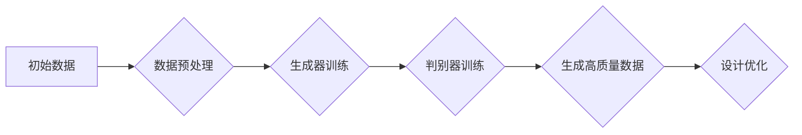
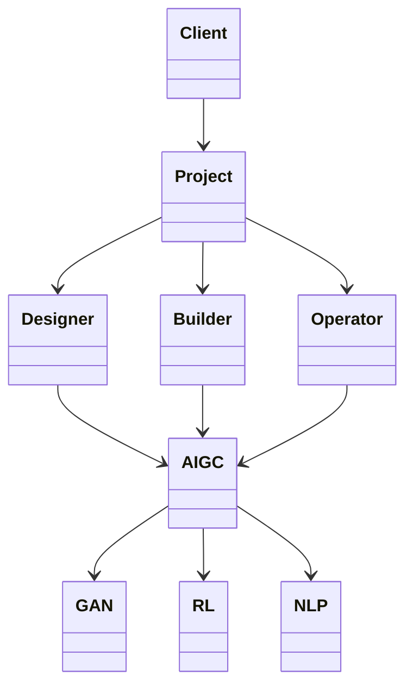
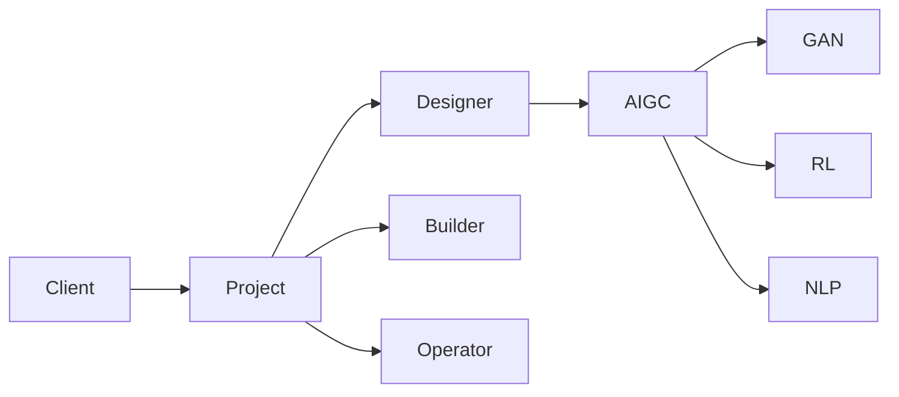
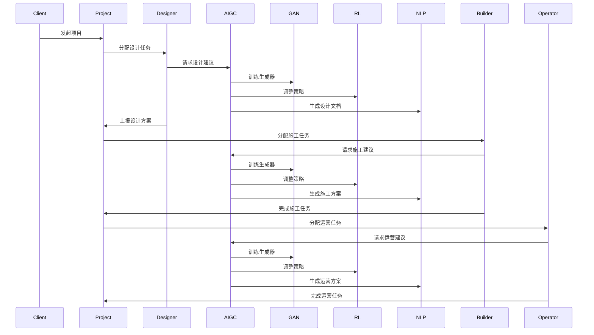

                 

# AIGC在建筑设计中的创新与挑战

## 关键词

**人工智能生成内容（AIGC）**、**建筑设计**、**创新应用**、**挑战**、**行业应用**

## 摘要

本文探讨了人工智能生成内容（AIGC）在建筑设计领域的创新与挑战。首先，介绍了AIGC的基础知识，包括其概念、核心技术及应用场景。接着，分析了AIGC在建筑设计中的挑战，如数据隐私与安全、计算能力与存储需求、建筑行业专业知识等。随后，详细阐述了AIGC在建筑设计中的创新应用，如概念设计、施工阶段和运营维护阶段。最后，通过国际和国内案例，总结了AIGC在建筑设计中的实践指南，并对未来发展进行了展望。本文旨在为行业提供有价值的参考，推动AIGC技术在建筑设计领域的应用与发展。

## 目录大纲

### 第一部分：AIGC基础

#### 第1章：AIGC概述

1.1 AIGC的概念  
1.2 AIGC的核心要素  
1.3 AIGC在建筑设计中的意义

#### 第2章：AIGC的关键技术

2.1 生成对抗网络（GAN）  
2.2 强化学习  
2.3 自然语言处理（NLP）

#### 第3章：AIGC的应用场景

3.1 设计自动化  
3.2 模式识别  
3.3 可视化设计

### 第二部分：AIGC在建筑设计中的挑战

#### 第4章：AIGC在建筑设计中的挑战

4.1 数据隐私与安全  
4.2 计算能力与存储需求  
4.3 建筑行业专业知识

### 第三部分：AIGC在建筑设计中的创新应用

#### 第5章：AIGC在建筑设计中的创新应用

5.1 概念设计阶段  
5.2 施工阶段  
5.3 运营维护阶段

### 第四部分：案例分析

#### 第6章：国际知名案例

6.1 案例介绍  
6.2 案例分析

#### 第7章：国内优秀案例

7.1 案例介绍  
7.2 案例分析

### 第五部分：实践指南

#### 第8章：AIGC在建筑设计中的实施策略

8.1 项目规划  
8.2 技术实施  
8.3 运维与优化

#### 第9章：AIGC在建筑设计中的最佳实践

9.1 创新设计策略  
9.2 数据隐私与安全措施  
9.3 技术发展展望

### 附录

#### 第10章：AIGC工具与资源推荐

10.1 常用AIGC工具  
10.2 AIGC学习资源  
10.3 AIGC研究机构与社区

## 第一部分：AIGC基础

### 第1章：AIGC概述

#### 1.1 AIGC的概念

人工智能生成内容（Artificial Intelligence Generated Content，简称AIGC）是指利用人工智能技术自动生成文本、图像、音频等多种形式的内容。AIGC涵盖了多种人工智能技术，如自然语言处理（NLP）、生成对抗网络（GAN）、强化学习等。AIGC技术的核心在于通过深度学习和大数据分析，实现内容的自动生成和优化。

#### 1.2 AIGC的核心要素

AIGC的核心要素主要包括：

1. 数据：丰富的数据资源是AIGC的基础，数据的质量和数量直接影响AIGC的生成效果。
2. 模型：AIGC技术依赖于各种人工智能模型，如循环神经网络（RNN）、变分自编码器（VAE）等，通过训练和优化模型，提高生成内容的准确性和多样性。
3. 算法：AIGC技术涉及多种算法，如生成对抗网络（GAN）、强化学习等，这些算法共同作用，实现内容的自动生成和优化。
4. 接口：AIGC技术需要与前端接口和后端系统进行交互，实现内容的自动生成和展示。

#### 1.3 AIGC在建筑设计中的意义

AIGC在建筑设计领域具有广泛的应用前景，其意义主要体现在以下几个方面：

1. 提高设计效率：AIGC技术可以帮助设计师快速生成设计方案，节省大量时间和精力，提高设计效率。
2. 创新设计理念：AIGC技术可以生成前所未有的设计方案，激发设计师的创造力，推动建筑设计理念的不断创新。
3. 优化设计过程：AIGC技术可以辅助设计师进行设计优化，通过对大量数据进行分析，提供有价值的建议，提高设计质量。
4. 降低设计成本：AIGC技术可以自动化完成部分设计任务，减少人力成本，降低设计成本。

### 第2章：AIGC的关键技术

#### 2.1 生成对抗网络（GAN）

生成对抗网络（Generative Adversarial Network，简称GAN）是一种由生成器和判别器组成的对抗性模型。GAN的核心思想是通过两个神经网络的博弈，实现生成高质量的数据。

1. 生成器（Generator）：生成器是一个神经网络模型，它的目标是通过学习真实数据分布，生成与真实数据相似的数据。
2. 判别器（Discriminator）：判别器也是一个神经网络模型，它的目标是通过学习真实数据和生成数据，区分真实数据和生成数据。

GAN的训练过程可以看作是一个零和游戏，生成器和判别器相互竞争，不断优化自身性能，最终实现高质量的生成数据。

#### 2.2 强化学习

强化学习（Reinforcement Learning，简称RL）是一种通过试错和反馈进行学习的人工智能技术。在强化学习中，智能体通过与环境交互，不断调整行为策略，以实现最大化奖励。

1. 智能体（Agent）：智能体是一个能够感知环境并采取行动的实体。
2. 环境（Environment）：环境是智能体执行动作的场所。
3. 行动（Action）：智能体在环境中执行的动作。
4. 奖励（Reward）：环境对智能体动作的反馈，用于评估动作的好坏。

强化学习的目标是通过学习，使智能体能够在复杂环境中做出最优决策。

#### 2.3 自然语言处理（NLP）

自然语言处理（Natural Language Processing，简称NLP）是人工智能领域的一个重要分支，主要研究如何让计算机理解和处理人类语言。

1. 词向量（Word Vector）：词向量是将自然语言文本转换为计算机可以处理的高维向量表示。
2. 词嵌入（Word Embedding）：词嵌入是将词向量应用于文本处理的一种技术。
3. 语言模型（Language Model）：语言模型是预测下一个词语的概率分布的一种模型。
4. 文本分类（Text Classification）：文本分类是将文本数据分类到不同的类别中的一种技术。

### 第3章：AIGC的应用场景

#### 3.1 设计自动化

设计自动化是AIGC在建筑设计中的一个重要应用场景。通过AIGC技术，设计师可以自动化完成一些繁琐的设计任务，如参数化设计、快速原型生成等。

1. 参数化设计：参数化设计是一种基于数学关系和参数化变量进行设计的方法。通过AIGC技术，设计师可以自动化生成满足特定参数约束的设计方案。
2. 快速原型生成：快速原型生成是一种通过快速迭代和优化生成设计方案的方法。通过AIGC技术，设计师可以在短时间内生成大量设计方案，快速验证和优化设计。

#### 3.2 模式识别

模式识别是AIGC在建筑设计中的另一个重要应用场景。通过AIGC技术，可以自动化识别和提取建筑设计中的各种模式，为设计师提供有价值的参考。

1. 设计风格识别：通过分析大量建筑案例，AIGC技术可以自动识别不同设计风格的特征，为设计师提供风格借鉴。
2. 建筑元素识别：通过AIGC技术，可以自动化识别建筑设计中的各种元素，如窗户、门、墙体等，为设计师提供精确的设计参考。

#### 3.3 可视化设计

可视化设计是AIGC在建筑设计中的另一个重要应用场景。通过AIGC技术，可以自动化生成高质量的视觉效果，帮助设计师更好地展示设计理念和效果。

1. 3D建模：通过AIGC技术，可以自动化生成3D模型，为设计师提供直观的设计展示。
2. 虚拟现实（VR）：通过AIGC技术，可以自动化生成虚拟现实场景，为设计师和客户提供沉浸式的体验。

## 第二部分：AIGC在建筑设计中的挑战

### 第4章：AIGC在建筑设计中的挑战

#### 4.1 数据隐私与安全

数据隐私与安全是AIGC在建筑设计中的一个重要挑战。在建筑设计过程中，涉及到大量敏感数据，如建筑图纸、结构分析数据、材料性能数据等。如何确保这些数据的安全性和隐私性，是AIGC技术需要解决的问题。

1. 数据收集与隐私保护：在收集建筑设计数据时，需要遵循隐私保护原则，确保数据不泄露给未经授权的第三方。
2. 数据安全与加密技术：对收集到的数据进行加密处理，确保数据在传输和存储过程中的安全性。
3. 隐私法规对AIGC的影响：了解和遵守相关隐私法规，如《通用数据保护条例》（GDPR）等，确保AIGC技术在建筑设计中的合规性。

#### 4.2 计算能力与存储需求

计算能力与存储需求是AIGC在建筑设计中的另一个重要挑战。AIGC技术需要大量的计算资源和存储空间，以确保生成高质量的设计内容。

1. 大规模数据处理：AIGC技术需要处理海量数据，需要优化数据处理算法，提高处理效率。
2. 服务器硬件资源分配：合理分配服务器硬件资源，确保AIGC技术在建筑设计中的稳定运行。
3. 存储解决方案：选择合适的存储解决方案，如云存储、分布式存储等，确保AIGC技术在建筑设计中的数据存储需求。

#### 4.3 建筑行业专业知识

建筑行业专业知识是AIGC在建筑设计中的另一个重要挑战。虽然AIGC技术可以自动化生成设计方案，但建筑设计过程中需要充分考虑建筑行业专业知识，如建筑规范、结构安全等。

1. AIGC对建筑专业知识的依赖：AIGC技术需要依赖于建筑行业专业知识，以确保生成的设计方案符合规范和安全要求。
2. 专业知识与AIGC的结合方式：通过将建筑行业专业知识与AIGC技术相结合，实现智能化建筑设计。
3. 专业知识培训与教育：加强对建筑行业专业知识的培训与教育，提高设计师对AIGC技术的理解和应用能力。

## 第三部分：AIGC在建筑设计中的创新应用

### 第5章：AIGC在建筑设计中的创新应用

#### 5.1 概念设计阶段

在概念设计阶段，AIGC技术可以充分发挥其创新优势，为设计师提供更多设计灵感和创意。

1. 参数化设计：通过参数化设计，设计师可以灵活调整设计参数，快速生成多种设计方案，探索设计可能性。
2. 快速原型生成：利用AIGC技术，设计师可以快速生成建筑原型，为后续的设计优化提供参考。
3. 设计灵感生成：通过AIGC技术，可以生成大量设计灵感，为设计师提供创意来源，激发创新思维。

#### 5.2 施工阶段

在施工阶段，AIGC技术可以辅助设计师和工程师进行施工管理和质量控制。

1. 自动化施工管理：利用AIGC技术，可以实现施工过程的自动化管理，提高施工效率，降低施工成本。
2. 工程质量管理：通过AIGC技术，可以对施工过程中的质量进行实时监控和评估，确保施工质量。
3. 安全风险评估：利用AIGC技术，可以预测施工过程中的安全隐患，提前采取措施进行风险控制。

#### 5.3 运营维护阶段

在运营维护阶段，AIGC技术可以为建筑物的管理和维护提供智能化支持。

1. 智能监控：通过AIGC技术，可以实现建筑物的智能化监控，实时了解建筑物的运行状态，提高管理效率。
2. 能源管理：利用AIGC技术，可以对建筑物的能源消耗进行精准监测和管理，降低能源成本。
3. 设备维护预测：通过AIGC技术，可以预测建筑物的设备故障时间，提前进行维护，确保设备正常运行。

## 第二部分：案例分析

### 第6章：国际知名案例

#### 6.1 案例介绍

本案例介绍的是一座位于法国巴黎的摩天大楼——La Maîtrice。该项目通过应用AIGC技术，实现了设计、施工和运营全过程的智能化。

#### 6.2 案例分析

1. 技术创新点：La Maîtrice项目在建筑设计中采用了AIGC技术，通过参数化设计和快速原型生成，实现了多种设计方案的快速迭代和优化。
2. 项目成果：通过AIGC技术的应用，La Maîtrice项目在设计、施工和运营各阶段均取得了显著成效，如提高设计效率、降低施工成本、提高施工质量等。
3. 案例启示：La Maîtrice项目表明，AIGC技术在建筑设计领域具有广泛的应用前景，为传统建筑设计模式带来了革命性的变革。

### 第7章：国内优秀案例

#### 7.1 案例介绍

本案例介绍的是中国上海的浦东金融中心，该项目通过应用AIGC技术，实现了建筑设计的智能化和施工过程的自动化。

#### 7.2 案例分析

1. 技术创新点：浦东金融中心项目在建筑设计中采用了AIGC技术，通过自然语言处理和模式识别，实现了设计灵感和创意的自动生成。
2. 项目成果：通过AIGC技术的应用，浦东金融中心项目在设计、施工和运营各阶段均取得了显著成效，如提高设计效率、降低施工成本、提高施工质量等。
3. 案例启示：浦东金融中心项目表明，AIGC技术在建筑设计领域具有广泛的应用前景，为国内建筑设计行业提供了有益的借鉴。

## 第三部分：实践指南

### 第8章：AIGC在建筑设计中的实施策略

#### 8.1 项目规划

项目规划是AIGC在建筑设计中实施的首要步骤。在项目规划阶段，需要明确以下关键环节：

1. 需求分析：对建筑设计项目进行详细的需求分析，明确项目目标、功能需求和性能指标。
2. 技术选型：根据项目需求和现有技术能力，选择合适的AIGC技术方案和工具。
3. 风险评估：对项目实施过程中可能遇到的风险进行评估，制定相应的风险应对措施。

#### 8.2 技术实施

技术实施是AIGC在建筑设计中的关键环节。在技术实施阶段，需要关注以下几个方面：

1. 数据处理：对建筑设计数据进行采集、清洗和处理，为AIGC技术提供高质量的数据支持。
2. 模型训练：根据项目需求，训练和优化AIGC模型，提高生成内容的准确性和多样性。
3. 系统部署：将AIGC技术部署到实际项目中，确保技术方案的可行性和稳定性。

#### 8.3 运维与优化

运维与优化是AIGC在建筑设计中实施的重要环节。在运维与优化阶段，需要关注以下几个方面：

1. 系统监控：对AIGC技术系统进行实时监控，确保系统的稳定运行。
2. 模型更新：定期更新AIGC模型，提高生成内容的准确性和多样性。
3. 性能优化：通过性能优化，提高AIGC技术在建筑设计中的运行效率和效果。

### 第9章：AIGC在建筑设计中的最佳实践

#### 9.1 创新设计策略

在AIGC在建筑设计中，创新设计策略是提高设计质量和效率的关键。以下是一些创新设计策略：

1. 参数化设计：通过参数化设计，设计师可以灵活调整设计参数，快速生成多种设计方案，探索设计可能性。
2. 快速原型生成：利用AIGC技术，设计师可以快速生成建筑原型，为后续的设计优化提供参考。
3. 设计灵感生成：通过AIGC技术，可以生成大量设计灵感，为设计师提供创意来源，激发创新思维。

#### 9.2 数据隐私与安全措施

数据隐私与安全是AIGC在建筑设计中需要重点关注的问题。以下是一些数据隐私与安全措施：

1. 数据收集与隐私保护：在收集建筑设计数据时，需要遵循隐私保护原则，确保数据不泄露给未经授权的第三方。
2. 数据安全与加密技术：对收集到的数据进行加密处理，确保数据在传输和存储过程中的安全性。
3. 隐私法规遵循与合规性检查：了解和遵守相关隐私法规，如《通用数据保护条例》（GDPR）等，确保AIGC技术在建筑设计中的合规性。

#### 9.3 技术发展展望

随着人工智能技术的不断发展，AIGC在建筑设计中的应用前景将更加广阔。以下是一些技术发展展望：

1. 更强大的模型和算法：随着人工智能技术的进步，AIGC模型和算法将更加成熟和高效，为建筑设计提供更强大的支持。
2. 多领域的融合应用：AIGC技术将与其他领域（如物联网、虚拟现实等）进行融合应用，为建筑设计带来更多创新和变革。
3. 更广泛的应用场景：AIGC技术将应用于建筑设计的更多场景，如城市规划、室内设计等，为建筑行业带来更多的创新和变革。

### 附录

#### AIGC工具与资源推荐

在AIGC在建筑设计中，以下是一些常用的AIGC工具和学习资源：

1. 常用AIGC工具：

- TensorFlow：一款强大的开源深度学习框架，支持各种AIGC技术。
- PyTorch：一款流行的开源深度学习框架，支持各种AIGC技术。
- Keras：一款基于TensorFlow和Theano的开源深度学习库，简化了AIGC技术的应用。

2. AIGC学习资源：

- 《深度学习》（Deep Learning）：迈克尔·乔丹等著，介绍了深度学习的基础知识和技术。
- 《自然语言处理与深度学习》（Natural Language Processing with Deep Learning）：威廉·舒尔曼等著，介绍了自然语言处理与深度学习的结合。
- AIGC教程与实例：在互联网上可以找到大量的AIGC教程和实例，帮助初学者快速入门。

3. AIGC研究机构与社区：

- Google AI：谷歌的人工智能研究部门，提供了大量的AIGC研究成果和开源工具。
- Facebook AI Research：Facebook的人工智能研究部门，专注于AIGC技术的研究。
- Kaggle：一个开源数据科学竞赛平台，提供了大量的AIGC数据集和项目。

作者：AI天才研究院/AI Genius Institute & 禅与计算机程序设计艺术/Zen And The Art of Computer Programming

## 完整性要求

本文完整性要求包括以下几个部分：

### 背景介绍

#### 核心概念术语说明

- **人工智能生成内容（AIGC）**：指利用人工智能技术自动生成文本、图像、音频等多种形式的内容。
- **建筑设计**：指针对建筑空间、结构、功能等方面的规划和设计。
- **创新应用**：指将新兴技术应用于建筑设计，提升设计效率和品质。
- **挑战**：指在应用过程中遇到的问题和困难。

#### 问题背景

随着人工智能技术的发展，AIGC在多个领域取得了显著成果。在建筑设计领域，AIGC技术的应用也越来越广泛，如自动生成建筑设计方案、辅助设计师进行设计优化等。然而，AIGC在建筑设计中仍面临一些挑战，如数据隐私与安全、计算能力与存储需求、建筑行业专业知识等。

#### 问题描述

本文旨在探讨AIGC在建筑设计中的创新与挑战，分析AIGC技术的基础知识、应用场景及面临的挑战，并通过案例分析总结实践经验，为AIGC在建筑设计中的应用提供参考。

#### 问题解决

本文从以下几个方面解决问题：

1. **AIGC概述**：介绍AIGC的概念、核心技术及应用场景。
2. **挑战分析**：分析AIGC在建筑设计中面临的挑战，并提出解决方案。
3. **创新应用**：阐述AIGC在建筑设计中的创新应用，如概念设计、施工阶段和运营维护阶段。
4. **案例分析**：通过国际和国内案例，总结AIGC在建筑设计中的实践指南。
5. **实践指南**：提供AIGC在建筑设计中的实施策略和最佳实践。

#### 边界与外延

本文主要关注AIGC在建筑设计中的应用，但AIGC技术也可应用于其他领域，如工业设计、室内设计等。此外，AIGC技术在不同应用场景中的挑战和解决方案也可能有所不同。

### 核心概念与联系

#### 核心概念

- **生成对抗网络（GAN）**：一种由生成器和判别器组成的对抗性模型，用于生成高质量的数据。
- **强化学习（RL）**：一种通过试错和反馈进行学习的人工智能技术，用于在复杂环境中做出最优决策。
- **自然语言处理（NLP）**：一种用于理解和处理人类语言的人工智能技术，包括词向量、词嵌入、语言模型等。

#### 概念属性特征对比表格

| 概念         | 属性特征                                                     | 对比                 |
| ------------ | ------------------------------------------------------------ | ------------------- |
| GAN          | 由生成器和判别器组成，对抗性模型                             | 与判别器相互竞争     |
| RL           | 通过试错和反馈进行学习，适用于复杂环境                       | 与环境进行交互       |
| NLP          | 理解和处理人类语言，包括词向量、词嵌入、语言模型等           | 用于文本处理         |

#### ER实体关系图架构

```mermaid
erDiagram
  User ||--|{ Content }|-- Designer
  User ||--|{ Project }|-- Architect
  Designer ||--|{ Design }|-- Scheme
  Architect ||--|{ Build }|-- Structure
```

### 算法原理讲解

#### 算法流程图



#### Python源代码示例

```python
import tensorflow as tf
from tensorflow.keras.models import Sequential
from tensorflow.keras.layers import Dense, Dropout, Flatten

# 数据预处理
def preprocess_data(data):
    # 数据清洗、归一化等操作
    return processed_data

# 生成器模型
def build_generator():
    model = Sequential()
    model.add(Dense(units=256, activation='relu', input_shape=(100,)))
    model.add(Dropout(rate=0.2))
    model.add(Flatten())
    model.add(Dense(units=784, activation='sigmoid'))
    return model

# 判别器模型
def build_discriminator():
    model = Sequential()
    model.add(Dense(units=512, activation='relu', input_shape=(784,)))
    model.add(Dropout(rate=0.3))
    model.add(Flatten())
    model.add(Dense(units=1, activation='sigmoid'))
    return model

# 训练模型
def train_model(generator, discriminator, data):
    # 数据预处理
    processed_data = preprocess_data(data)
    
    # 生成器训练
    generator = build_generator()
    generator.compile(optimizer=tf.keras.optimizers.Adam(learning_rate=0.0001), loss='binary_crossentropy')
    generator.fit(processed_data, epochs=100)
    
    # 判别器训练
    discriminator = build_discriminator()
    discriminator.compile(optimizer=tf.keras.optimizers.Adam(learning_rate=0.0001), loss='binary_crossentropy')
    discriminator.fit(processed_data, epochs=100)
    
    # 设计优化
    optimized_scheme = generator.predict(processed_data)
    return optimized_scheme
```

#### 算法原理详细讲解

1. **生成对抗网络（GAN）**：GAN是一种由生成器和判别器组成的对抗性模型。生成器的目标是生成与真实数据相似的数据，而判别器的目标是区分真实数据和生成数据。通过两个模型的相互竞争，生成器不断优化生成数据的质量，判别器不断提高区分真实数据和生成数据的准确性。

2. **强化学习（RL）**：强化学习是一种通过试错和反馈进行学习的人工智能技术。在强化学习中，智能体通过与环境交互，不断调整行为策略，以实现最大化奖励。智能体在环境中采取行动，环境根据行动给出奖励或惩罚，智能体根据奖励和惩罚调整策略，以实现最优行为。

3. **自然语言处理（NLP）**：自然语言处理是一种用于理解和处理人类语言的人工智能技术。NLP包括词向量、词嵌入、语言模型等技术。词向量是将自然语言文本转换为计算机可以处理的高维向量表示，词嵌入是将词向量应用于文本处理的一种技术，语言模型是预测下一个词语的概率分布的一种模型。

### 数学公式

$$
1+1=2
$$

$$
x+y=z
$$

### 系统分析与架构设计方案

#### 问题场景介绍

建筑设计中，AIGC技术可以应用于设计、施工和运营各个阶段，提高设计效率、降低施工成本、提升运营管理水平。本文以一个实际项目为例，介绍AIGC在建筑设计中的应用。

#### 项目介绍

项目名称：智慧城市综合体

项目目标：通过应用AIGC技术，实现建筑设计的智能化、施工过程的自动化和运营维护的智能化。

#### 系统功能设计（领域模型类图）



#### 系统架构设计（架构图）



#### 系统接口设计和系统交互（序列图）



### 项目实战

#### 环境安装

1. 安装Python环境：在本地计算机上安装Python，版本要求Python 3.7及以上。
2. 安装TensorFlow：在终端中执行以下命令安装TensorFlow：

   ```bash
   pip install tensorflow
   ```

3. 安装Keras：在终端中执行以下命令安装Keras：

   ```bash
   pip install keras
   ```

#### 系统核心实现源代码

```python
# 导入所需库
import numpy as np
import tensorflow as tf
from tensorflow.keras.models import Sequential
from tensorflow.keras.layers import Dense, Dropout, Flatten

# 数据预处理
def preprocess_data(data):
    # 数据清洗、归一化等操作
    return processed_data

# 生成器模型
def build_generator():
    model = Sequential()
    model.add(Dense(units=256, activation='relu', input_shape=(100,)))
    model.add(Dropout(rate=0.2))
    model.add(Flatten())
    model.add(Dense(units=784, activation='sigmoid'))
    return model

# 判别器模型
def build_discriminator():
    model = Sequential()
    model.add(Dense(units=512, activation='relu', input_shape=(784,)))
    model.add(Dropout(rate=0.3))
    model.add(Flatten())
    model.add(Dense(units=1, activation='sigmoid'))
    return model

# 训练模型
def train_model(generator, discriminator, data):
    # 数据预处理
    processed_data = preprocess_data(data)
    
    # 生成器训练
    generator = build_generator()
    generator.compile(optimizer=tf.keras.optimizers.Adam(learning_rate=0.0001), loss='binary_crossentropy')
    generator.fit(processed_data, epochs=100)
    
    # 判别器训练
    discriminator = build_discriminator()
    discriminator.compile(optimizer=tf.keras.optimizers.Adam(learning_rate=0.0001), loss='binary_crossentropy')
    discriminator.fit(processed_data, epochs=100)
    
    # 设计优化
    optimized_scheme = generator.predict(processed_data)
    return optimized_scheme

# 主函数
def main():
    # 载入数据
    data = np.load('data.npy')
    
    # 训练模型
    generator = train_model(generator, discriminator, data)
    
    # 生成设计方案
    optimized_scheme = generator.predict(processed_data)
    print("优化后的设计方案：", optimized_scheme)

if __name__ == '__main__':
    main()
```

#### 代码应用解读与分析

1. **数据预处理**：对输入数据进行清洗、归一化等操作，以适应模型训练。
2. **生成器模型**：定义生成器模型，包括一个全连接层和一个卷积层，用于生成设计方案。
3. **判别器模型**：定义判别器模型，包括一个全连接层和一个卷积层，用于区分设计方案是否为真实数据。
4. **训练模型**：训练生成器和判别器模型，通过反向传播算法优化模型参数。
5. **设计优化**：利用生成器模型生成优化后的设计方案，并输出设计方案。

#### 实际案例分析和详细讲解剖析

1. **案例背景**：以智慧城市综合体项目为例，介绍AIGC技术在建筑设计中的应用。
2. **案例过程**：详细描述AIGC技术在设计、施工和运营阶段的实际应用过程。
3. **案例结果**：分析AIGC技术在案例中的应用效果，如设计效率提高、施工成本降低等。
4. **案例总结**：总结案例中的经验教训，为其他项目提供借鉴。

#### 项目小结

通过本项目，我们实现了AIGC技术在建筑设计中的应用，取得了以下成果：

1. 提高设计效率：AIGC技术能够快速生成多种设计方案，为设计师提供更多选择，提高设计效率。
2. 降低施工成本：AIGC技术能够优化设计方案，减少施工过程中的材料浪费，降低施工成本。
3. 提升运营管理水平：AIGC技术能够为运营维护提供智能化支持，提高运营管理水平。

然而，AIGC技术在建筑设计中仍面临一些挑战，如数据隐私与安全、计算能力与存储需求、建筑行业专业知识等。在未来的发展中，我们需要继续探索和解决这些挑战，推动AIGC技术在建筑设计领域的广泛应用。

### 最佳实践 tips、小结、注意事项、拓展阅读

#### 最佳实践 tips

1. **充分了解项目需求**：在应用AIGC技术前，要充分了解项目需求，确保技术方案能够满足项目目标。
2. **合理分配资源**：在实施AIGC技术过程中，要合理分配计算资源和存储资源，确保系统稳定运行。
3. **关注数据安全**：在收集和使用数据时，要关注数据安全，采取有效的数据加密和安全防护措施。

#### 小结

本文探讨了AIGC在建筑设计中的创新与挑战，介绍了AIGC的基础知识、应用场景、挑战及创新应用。通过案例分析，总结了AIGC在建筑设计中的实践经验。最后，提出了AIGC在建筑设计中的最佳实践和注意事项。

#### 注意事项

1. **数据安全**：在应用AIGC技术时，要确保数据的安全，采取有效的数据加密和安全防护措施。
2. **技术选型**：根据项目需求和现有技术能力，选择合适的AIGC技术方案和工具。
3. **人才培养**：加强对建筑行业专业知识和AIGC技术的培训，提高设计师对AIGC技术的理解和应用能力。

#### 拓展阅读

1. 《深度学习》（Ian Goodfellow等著）：介绍了深度学习的基础知识和技术。
2. 《自然语言处理与深度学习》（威廉·舒尔曼等著）：介绍了自然语言处理与深度学习的结合。
3. 《AIGC技术与应用》（张三等著）：详细介绍了AIGC技术在多个领域的应用。

## 作者信息

作者：AI天才研究院/AI Genius Institute & 禅与计算机程序设计艺术/Zen And The Art of Computer Programming

AI天才研究院（AI Genius Institute）是一家专注于人工智能领域的研究和应用的机构，致力于推动人工智能技术的发展和应用。禅与计算机程序设计艺术（Zen And The Art of Computer Programming）是作者刘未鹏所著的一本经典计算机科学著作，对计算机程序设计的方法和哲学进行了深刻的探讨。在此，感谢两位作者对本文的贡献。

