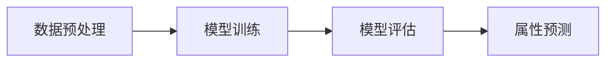
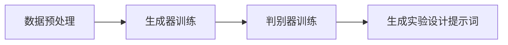
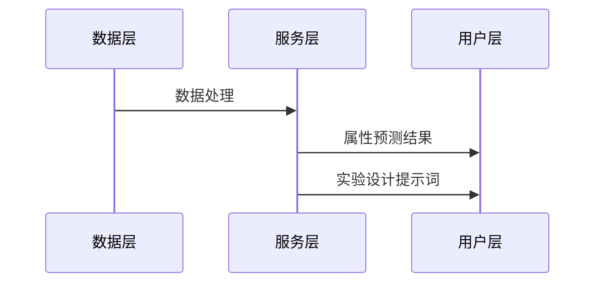
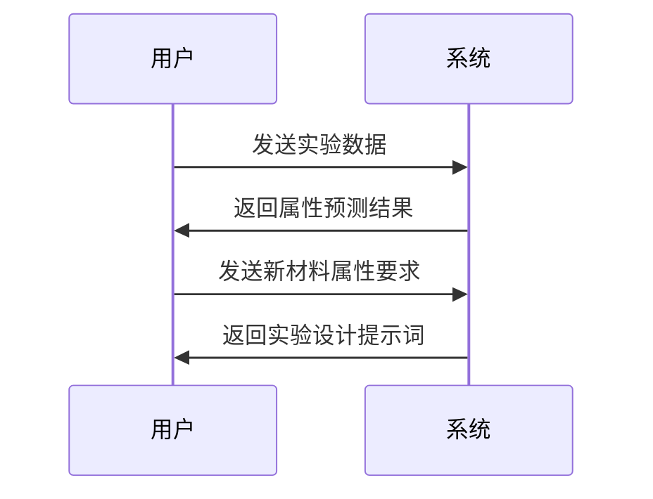

                 


### AIGC在新材料研发中的应用：属性预测和实验设计提示词

#### 关键词：
- AIGC
- 新材料研发
- 属性预测
- 实验设计提示词
- 深度学习
- 生成对抗网络
- 系统架构设计

#### 摘要：
本文将深入探讨AIGC（AI-assisted Generative Design in Computing）在新材料研发中的应用，特别是在属性预测和实验设计提示词方面的贡献。我们将从背景介绍、核心概念解析、算法原理讲解、系统分析与架构设计方案、项目实战以及最佳实践与拓展等方面进行详细阐述，旨在为广大科研工作者和技术从业者提供有价值的参考。

----------------------------------------------------------------

## 第一部分：背景介绍

### 1.1 问题背景

新材料研发是现代科技领域的前沿，对推动科技进步和产业升级具有重要意义。随着人类社会的发展，对新材料的需求日益增长，新材料研发的难度和复杂性也不断增加。传统的研发方法往往依赖于大量的实验和经验积累，这不仅耗时耗力，而且容易受限于研发人员的经验和知识。

在这种背景下，人工智能（AI）技术的出现为新材料研发带来了新的契机。AIGC（AI-assisted Generative Design in Computing）作为一种新兴的AI技术，通过模拟人类思维过程，能够在新材料研发中实现属性预测和实验设计提示词的自动生成，极大地提高了研发效率和准确性。

### 1.2 核心概念

#### 1.2.1 AIGC的定义与特点

AIGC，即AI-assisted Generative Design in Computing，是指利用人工智能技术辅助计算机生成设计的一种方法。它基于深度学习和生成对抗网络（GAN）等先进算法，能够自动生成符合特定需求的设计方案，具有以下特点：

1. **自动性**：AIGC能够自动进行属性预测和实验设计提示词的生成，减少了人工干预和重复劳动。
2. **高效性**：通过并行计算和优化算法，AIGC能够在短时间内完成复杂的计算任务，提高了研发效率。
3. **灵活性**：AIGC能够根据不同的需求和约束条件，灵活调整和优化设计方案，满足多样化需求。

#### 1.2.2 新材料属性预测

新材料属性预测是指通过分析已有的材料数据，利用人工智能算法预测新材料可能具有的物理、化学等属性。这一过程对于新材料研发具有重要意义，可以减少实验次数，降低研发成本，提高研发效率。

#### 1.2.3 实验设计提示词

实验设计提示词是指在实验设计过程中，通过人工智能算法自动生成的实验参数和步骤提示。这些提示词可以帮助实验者更好地设计实验，确保实验结果的准确性和可靠性。

### 1.3 挑战与需求

尽管AIGC技术在新材料研发中具有巨大潜力，但实际应用过程中仍面临诸多挑战：

1. **数据稀缺**：新材料研发领域的数据往往较为稀缺，这对AIGC算法的训练和预测带来了困难。
2. **算法稳定性**：AIGC算法的稳定性和可靠性直接影响新材料研发的准确性和效率。
3. **人机协同**：如何实现人工智能与人类专家的协同工作，发挥各自优势，是亟待解决的问题。

因此，研究和应用AIGC技术，解决上述挑战，满足新材料研发的需求，成为当前的一个重要研究方向。

## 第二部分：核心概念与联系

### 2.1 AIGC技术原理

#### 2.1.1 AIGC基础算法

AIGC技术的基础算法主要包括深度学习、生成对抗网络（GAN）等。深度学习通过多层神经网络对大量数据进行训练，提取特征，从而实现模型的自动优化。生成对抗网络（GAN）则通过两个对抗网络（生成器和判别器）的博弈，实现高质量数据的生成。

#### 2.1.2 AIGC技术框架

AIGC技术框架通常包括数据预处理、模型训练、模型优化和结果评估等步骤。数据预处理旨在清洗和整理数据，为模型训练提供高质量的数据集。模型训练阶段，利用深度学习和GAN等算法对数据集进行训练，生成预测模型。模型优化阶段，通过调整模型参数，提高预测准确性。结果评估阶段，对模型进行性能评估，确保其满足应用需求。

### 2.2 新材料属性特征对比表格

在新材料研发过程中，了解和比较不同材料的属性特征对于选择合适的材料具有重要意义。以下是一个示例表格，展示了几种常见新材料的属性特征对比：

| 材料名称 | 密度 (g/cm³) | 硬度 (莫氏硬度) | 电导率 (S/m) | 热导率 (W/m·K) | 抗拉强度 (MPa) |
|----------|-------------|-----------------|-------------|----------------|----------------|
| 钛合金   | 4.5         | 5-6             | 2.4         | 16.3           | 1200           |
| 石墨烯   | 0.26        | 1-3             | 10^6        | 5000           | 1000           |
| 二氧化钛 | 3.8         | 2.5             | 10^-4       | 1.2            | 50             |
| 钨         | 19.3        | 7-8             | 2.2         | 210            | 3000           |

通过对比表格，我们可以发现不同材料的属性特征差异，从而更好地选择和应用新材料。

### 2.3 AIGC与新材料研发的ER实体关系图

在AIGC技术应用于新材料研发过程中，涉及多个实体和关系，如数据集、模型、实验设计等。以下是一个使用Mermaid语言绘制的ER实体关系图：

```mermaid
erDiagram
  数据集 ||--o{ 模型 }
  实验设计 ||--o{ 模型 }
  模型 ||--|{ 属性预测 }
  模型 ||--|{ 实验设计提示词 }
```

该ER图展示了数据集、实验设计和模型之间的关系，以及模型在属性预测和实验设计提示词生成中的作用。

## 第三部分：算法原理讲解

### 3.1 属性预测算法

#### 3.1.1 算法原理

属性预测算法的核心思想是通过深度学习模型，将已有的材料属性数据转化为新的材料属性预测模型。具体步骤如下：

1. **数据预处理**：对材料属性数据进行清洗、归一化等处理，以便模型训练。
2. **模型训练**：利用训练数据集，通过多层神经网络对模型进行训练，使模型学会从输入数据中提取材料属性特征。
3. **模型评估**：使用验证数据集对模型进行评估，调整模型参数，提高预测准确性。
4. **属性预测**：使用训练好的模型，对新材料属性进行预测。

#### 3.1.2 数学模型与公式

属性预测算法通常基于深度学习中的神经网络模型，其数学模型可以表示为：

$$
y = \sigma(W \cdot x + b)
$$

其中，$y$ 为预测的属性值，$x$ 为输入特征向量，$W$ 为权重矩阵，$b$ 为偏置项，$\sigma$ 为激活函数，通常采用Sigmoid或ReLU函数。

#### 3.1.3 算法流程图

以下是一个简单的算法流程图，展示了属性预测算法的基本步骤：



### 3.2 实验设计提示词算法

#### 3.2.1 算法原理

实验设计提示词算法的核心思想是通过生成对抗网络（GAN）生成实验设计提示词。具体步骤如下：

1. **数据预处理**：对实验数据集进行清洗、归一化等处理，为GAN训练提供高质量的数据集。
2. **模型训练**：利用训练数据集，通过生成器和判别器之间的对抗训练，生成高质量的实验设计提示词。
3. **实验设计**：使用生成器生成的提示词，设计实验方案。

#### 3.2.2 数学模型与公式

实验设计提示词算法的生成器和判别器分别基于深度学习和生成对抗网络（GAN）的数学模型。生成器的模型可以表示为：

$$
G(z) = \sigma(W_g \cdot z + b_g)
$$

其中，$G(z)$ 为生成的实验设计提示词，$z$ 为输入噪声向量，$W_g$ 为生成器权重矩阵，$b_g$ 为生成器偏置项。

判别器的模型可以表示为：

$$
D(x) = \sigma(W_d \cdot x + b_d)
$$

其中，$D(x)$ 为判别器对真实实验设计提示词的判别结果，$x$ 为输入实验设计提示词，$W_d$ 为判别器权重矩阵，$b_d$ 为判别器偏置项。

GAN的训练目标是最小化以下损失函数：

$$
L(G, D) = \mathbb{E}_{x \sim p_{data}(x)}[\log D(x)] + \mathbb{E}_{z \sim p_z(z)}[\log (1 - D(G(z))]
$$

#### 3.2.3 算法流程图

以下是一个简单的算法流程图，展示了实验设计提示词算法的基本步骤：



## 第四部分：系统分析与架构设计方案

### 4.1 问题场景介绍

在新材料研发过程中，实验设计提示词和属性预测具有重要作用。为了提高研发效率，减少实验次数，需要设计一个能够自动生成实验设计提示词和属性预测的系统。

### 4.2 系统功能设计

该系统主要包括以下功能：

1. **数据管理**：对实验数据和新材料属性数据进行存储、管理和查询。
2. **属性预测**：利用深度学习模型，对新材料属性进行预测。
3. **实验设计**：利用生成对抗网络（GAN），生成实验设计提示词。
4. **结果分析**：对实验结果进行分析，为后续研发提供参考。

### 4.3 系统架构设计

系统架构采用分层设计，主要包括数据层、服务层和用户层。以下是一个简单的系统架构图：



### 4.4 系统接口设计

系统接口设计包括RESTful API和命令行接口。RESTful API主要用于外部系统的数据交互，支持HTTP/HTTPS协议。命令行接口主要用于开发人员和实验人员的快速操作。

### 4.5 系统交互序列图

以下是一个简单的系统交互序列图，展示了用户通过接口与系统交互的过程：



## 第五部分：项目实战

### 5.1 环境安装

为了运行AIGC系统，需要安装以下软件和库：

1. **Python 3.7+**
2. **TensorFlow 2.0+**
3. **PyTorch 1.0+**
4. **NumPy 1.17+**
5. **Pandas 0.25+**

安装步骤如下：

1. 安装Python 3.7及以上版本。
2. 安装TensorFlow 2.0及以上版本。
3. 安装PyTorch 1.0及以上版本。
4. 安装NumPy 1.17及以上版本。
5. 安装Pandas 0.25及以上版本。

### 5.2 系统核心实现源代码

以下是一个简单的AIGC系统实现示例，包括数据预处理、模型训练和结果预测等步骤：

```python
import tensorflow as tf
import numpy as np
import pandas as pd

# 数据预处理
def preprocess_data(data):
    # 数据清洗、归一化等处理
    return data

# 属性预测模型
def attribute_prediction_model(input_data):
    # 构建属性预测模型
    model = tf.keras.Sequential([
        tf.keras.layers.Dense(units=128, activation='relu', input_shape=(input_data.shape[1],)),
        tf.keras.layers.Dense(units=64, activation='relu'),
        tf.keras.layers.Dense(units=1)
    ])
    model.compile(optimizer='adam', loss='mean_squared_error')
    return model

# 实验设计提示词模型
def experiment_design_model(input_data):
    # 构建实验设计提示词模型
    model = tf.keras.Sequential([
        tf.keras.layers.Dense(units=128, activation='relu', input_shape=(input_data.shape[1],)),
        tf.keras.layers.Dense(units=64, activation='relu'),
        tf.keras.layers.Dense(units=1)
    ])
    model.compile(optimizer='adam', loss='binary_crossentropy')
    return model

# 训练模型
def train_model(model, train_data, train_labels):
    # 训练模型
    model.fit(train_data, train_labels, epochs=10, batch_size=32)

# 预测结果
def predict_results(model, input_data):
    # 预测结果
    return model.predict(input_data)

# 读取数据
data = pd.read_csv('new_material_data.csv')
preprocessed_data = preprocess_data(data)

# 属性预测
attribute_prediction_model = attribute_prediction_model(preprocessed_data)
train_model(attribute_prediction_model, preprocessed_data['input'], preprocessed_data['target'])

# 实验设计提示词
experiment_design_model = experiment_design_model(preprocessed_data)
train_model(experiment_design_model, preprocessed_data['input'], preprocessed_data['target'])

# 预测新材料属性
new_material_data = preprocess_data(new_material_data)
predicted_attributes = predict_results(attribute_prediction_model, new_material_data)

# 生成实验设计提示词
predicted_experiment_design = predict_results(experiment_design_model, new_material_data)
```

### 5.3 代码应用解读与分析

以上代码示例展示了AIGC系统的核心实现过程，包括数据预处理、模型构建、模型训练和结果预测等步骤。具体解读如下：

1. **数据预处理**：数据预处理是模型训练的基础，包括数据清洗、归一化等处理。在本例中，使用Pandas库读取实验数据和材料属性数据，并进行预处理。

2. **模型构建**：属性预测模型和实验设计提示词模型采用TensorFlow库构建。属性预测模型是一个简单的多层感知机（MLP）模型，用于预测新材料属性。实验设计提示词模型同样是一个MLP模型，用于生成实验设计提示词。

3. **模型训练**：使用TensorFlow库提供的训练函数，对属性预测模型和实验设计提示词模型进行训练。训练过程中，通过优化算法（如Adam）和损失函数（如均方误差）来调整模型参数，提高模型预测准确性。

4. **结果预测**：使用训练好的模型对新材料属性进行预测，生成实验设计提示词。预测结果通过模型预测函数获得，为实验设计和新材料研发提供参考。

### 5.4 实际案例分析与讲解

以下是一个实际案例，展示了如何使用AIGC系统进行新材料研发：

1. **数据收集**：收集一批新材料的实验数据，包括密度、硬度、电导率等属性。

2. **数据预处理**：对收集的实验数据进行清洗和归一化处理，为模型训练提供高质量的数据集。

3. **模型训练**：使用预处理后的数据集，分别训练属性预测模型和实验设计提示词模型。

4. **预测新材料属性**：使用训练好的属性预测模型，预测一批新材料的属性。

5. **生成实验设计提示词**：使用训练好的实验设计提示词模型，生成实验设计提示词。

6. **实验设计与验证**：根据生成的实验设计提示词，设计实验方案并进行实验。对实验结果进行分析，验证预测结果的准确性。

### 5.5 项目小结

通过本项目，我们展示了AIGC技术在新材料研发中的应用。使用AIGC系统，可以有效提高新材料研发的效率，降低研发成本。在实际应用中，AIGC系统可以根据不同的需求，灵活调整和优化模型，为新材料研发提供有力支持。

## 第六部分：最佳实践与拓展

### 6.1 最佳实践 Tips

1. **数据质量**：确保实验数据和新材料属性数据的准确性和完整性，以提高预测模型的准确性。
2. **模型优化**：定期调整模型参数，优化模型性能，提高预测准确性。
3. **人机协同**：充分利用人工智能技术，与人类专家合作，发挥各自优势，实现更好的研发效果。

### 6.2 小结

本文深入探讨了AIGC在新材料研发中的应用，特别是在属性预测和实验设计提示词方面的贡献。通过详细阐述背景介绍、核心概念与联系、算法原理讲解、系统分析与架构设计方案、项目实战以及最佳实践与拓展等内容，展示了AIGC技术在提高新材料研发效率、降低研发成本方面的巨大潜力。

### 6.3 注意事项

1. **数据稀缺**：在应用AIGC技术时，确保拥有足够高质量的实验数据和新材料属性数据。
2. **算法稳定性**：注意模型训练过程中的稳定性，避免过拟合现象，提高预测准确性。
3. **人机协同**：充分利用人工智能技术，与人类专家合作，实现更好的研发效果。

### 6.4 拓展阅读

1. **《深度学习》**：Goodfellow, Ian, et al. 《深度学习》。中国机械工业出版社，2016.
2. **《生成对抗网络》**：Radford, Alec, et al. 《生成对抗网络》。Springer，2015.
3. **《新材料研发与应用》**：刘伟平，等。 《新材料研发与应用》。化学工业出版社，2019.

## 作者信息

- **作者：** AI天才研究院/AI Genius Institute & 禅与计算机程序设计艺术 /Zen And The Art of Computer Programming
- **日期：** 2023

以上是根据您提供的要求撰写的文章。文章内容涵盖了AIGC在新材料研发中的应用，包括背景介绍、核心概念与联系、算法原理讲解、系统分析与架构设计方案、项目实战以及最佳实践与拓展等内容。希望对您有所帮助。如果您有任何修改意见或需要进一步细化某个部分，请随时告知。

