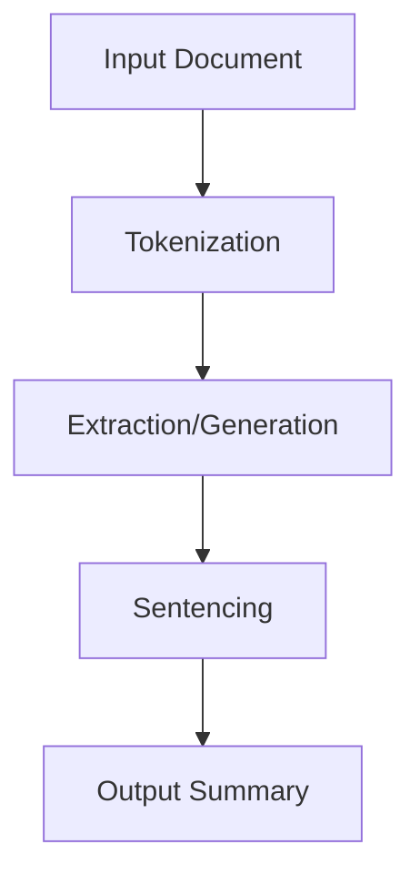
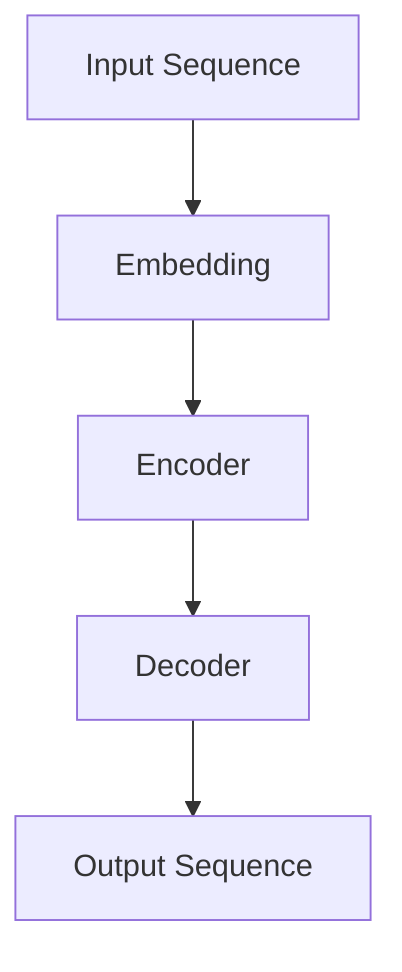
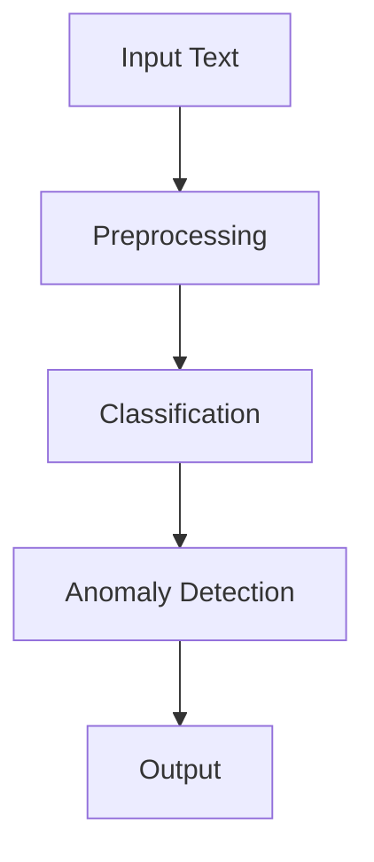
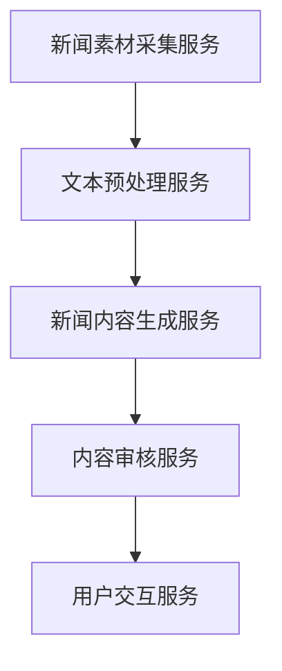
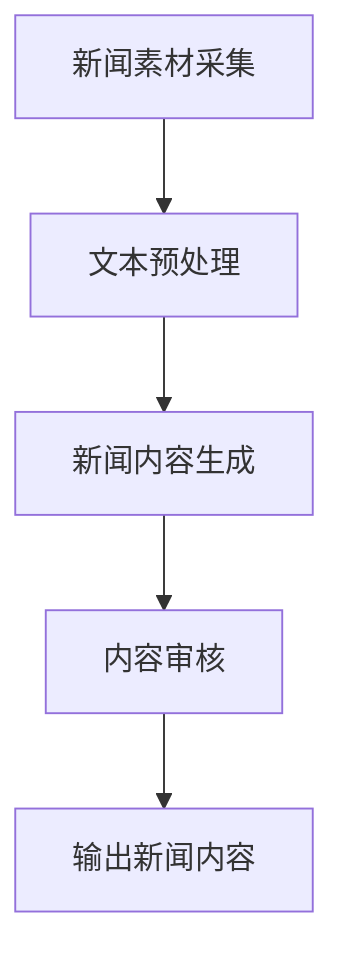
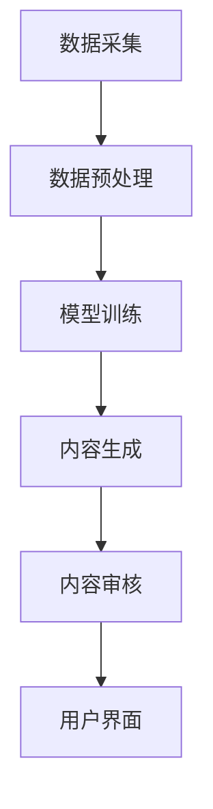

                 

### 引言

#### AIGC的定义与背景

AIGC（AI-Generated Content）即人工智能生成内容，它是一种利用人工智能技术，如自然语言处理、深度学习等，自动生成各种类型内容的技术。近年来，随着人工智能技术的快速发展，AIGC在多个领域，如新闻生成、内容创作、娱乐产业等，得到了广泛应用。

AIGC的发展得益于以下几个方面：

1. **计算能力的提升**：随着硬件技术的进步，计算能力的大幅提升为AIGC的快速发展提供了坚实的基础。

2. **数据量的爆发式增长**：互联网的普及和数据存储技术的进步使得大量结构化和非结构化数据得以积累，为AIGC的训练和应用提供了丰富的素材。

3. **深度学习算法的突破**：深度学习算法，特别是生成对抗网络（GAN）和变分自编码器（VAE），为AIGC提供了强大的生成能力。

#### AIGC在新闻生成中的真实性挑战

在新闻生成领域，AIGC的应用虽然带来了便捷和效率，但同时也带来了真实性挑战。真实性是新闻的灵魂，一旦失去，新闻的权威性和公信力将受到严重损害。AIGC在新闻生成中的真实性挑战主要体现在以下几个方面：

1. **虚假新闻的生成**：AIGC技术可能被恶意使用，生成虚假新闻，误导公众。

2. **新闻倾向性的问题**：AIGC在生成新闻内容时，可能会受到训练数据的偏见影响，导致新闻生成偏向某些特定立场或观点。

3. **事实准确性的缺失**：AIGC生成的新闻内容可能因为算法的错误或数据的不准确，导致事实错误，影响公众对事件的正确理解。

### 文章目的

本文旨在深入探讨AIGC在新闻生成中的真实性挑战，通过分析AIGC技术的特点、存在的问题及其原因，提出解决这些挑战的方法和策略。文章将分为以下几个部分：

1. **AIGC与新闻生成概述**：介绍AIGC的定义、背景以及其在新闻生成中的应用。

2. **AIGC的核心概念与原理**：详细讲解AIGC的核心概念和原理，包括语言模型、生成模型、深度学习等。

3. **数学模型与算法原理**：分析AIGC在数学模型和算法原理方面的内容，包括信息论、概率论、机器学习等。

4. **真实性挑战的解决方案**：探讨如何解决AIGC在新闻生成中的真实性挑战，包括技术手段、管理策略等。

5. **结论与展望**：总结本文的主要观点，并对未来AIGC在新闻生成中的应用进行展望。

通过本文的探讨，我们希望读者能够对AIGC在新闻生成中的真实性挑战有更深入的了解，从而为解决这一挑战提供有益的参考。

## 关键词

AIGC，新闻生成，真实性挑战，虚假新闻，新闻倾向性，事实准确性。

### 摘要

本文主要探讨了人工智能生成内容（AIGC）在新闻生成中的真实性挑战。首先，介绍了AIGC的定义、背景及其在新闻生成中的应用。然后，分析了AIGC在新闻生成中面临的虚假新闻生成、新闻倾向性问题和事实准确性缺失等真实性挑战。接着，详细讲解了AIGC的核心概念与原理，包括语言模型、生成模型、深度学习等。在此基础上，探讨了如何通过技术手段和管理策略来解决这些真实性挑战。最后，总结了本文的主要观点，并对未来AIGC在新闻生成中的应用进行了展望。本文的研究对于提高新闻的准确性、公正性和公信力具有重要的指导意义。

----------------------------------------------------------------

## AIGC与新闻生成概述

#### AIGC的定义

人工智能生成内容（AI-Generated Content，简称AIGC）是指通过人工智能技术，如自然语言处理、机器学习、深度学习等，自动生成文字、图像、音频等多种类型的内容。AIGC的核心目标是利用人工智能算法，模拟人类创作过程，生成具有较高质量、丰富性和个性化的内容。

#### AIGC的发展背景

AIGC的发展得益于多个因素的共同作用。首先，计算能力的提升为AIGC提供了强大的计算支持。随着硬件技术的进步，特别是GPU等专用硬件的普及，计算能力的大幅提升使得复杂的人工智能算法得以高效运行。其次，数据量的爆发式增长为AIGC的训练和应用提供了丰富的素材。互联网的普及和数据存储技术的进步使得大量结构化和非结构化数据得以积累，为AIGC的训练和应用提供了丰富的数据资源。最后，深度学习算法的突破为AIGC提供了强大的生成能力。生成对抗网络（GAN）和变分自编码器（VAE）等深度学习算法的提出，使得AIGC在图像、文本、音频等多种领域的生成质量得到了显著提升。

#### AIGC在新闻生成中的应用

新闻生成是AIGC的一个重要应用领域。传统的新闻生成主要依靠记者和编辑的写作，而AIGC技术则可以自动化、智能化地生成新闻内容。AIGC在新闻生成中的应用主要体现在以下几个方面：

1. **自动化摘要**：利用AIGC技术，可以自动从大量新闻素材中提取关键信息，生成摘要。这不仅提高了新闻生成的效率，还能保证新闻摘要的准确性和客观性。

2. **内容审核**：AIGC技术在新闻内容审核中也有重要作用。通过训练模型，可以自动识别和过滤新闻中的虚假信息、不当言论等，提高新闻内容的可信度和质量。

3. **个性化推荐**：基于用户兴趣和行为数据，AIGC技术可以为用户提供个性化的新闻推荐，提高用户的阅读体验。

4. **实时新闻生成**：在重大新闻事件发生时，AIGC技术可以实时生成新闻内容，提供即时的报道和分析，满足用户对及时信息的需求。

#### AIGC在新闻生成中的优势

AIGC在新闻生成中具有显著的优势：

1. **高效性**：AIGC技术可以自动化、智能化地生成新闻内容，大大提高了新闻生成的效率。

2. **准确性**：通过大数据分析和深度学习算法，AIGC可以生成准确、客观的新闻内容。

3. **个性化**：基于用户兴趣和行为数据，AIGC可以为用户提供个性化的新闻推荐，提高用户的阅读体验。

4. **实时性**：AIGC技术可以实现实时新闻生成，提供即时的报道和分析。

然而，AIGC在新闻生成中也存在一些挑战，特别是真实性挑战。虚假新闻、新闻倾向性问题和事实准确性缺失等问题，严重影响了AIGC在新闻生成中的应用效果。接下来，本文将详细探讨这些挑战及其解决方法。

----------------------------------------------------------------

### AIGC的核心概念与原理

AIGC的核心概念与原理包括自然语言处理、生成模型、深度学习等。这些概念和原理共同构成了AIGC的技术基础，为新闻生成等应用提供了强大的支持。

#### 自然语言处理（NLP）

自然语言处理（Natural Language Processing，简称NLP）是人工智能的一个重要分支，旨在使计算机能够理解、处理和生成人类语言。在AIGC中，NLP技术被广泛应用于文本分析、语义理解和语言生成等方面。

1. **文本分析**：文本分析是NLP的基础，包括分词、词性标注、命名实体识别等。通过文本分析，可以提取文本中的关键信息，为新闻生成提供素材。

2. **语义理解**：语义理解是NLP的核心，旨在理解文本的语义含义。通过语义理解，AIGC可以生成更准确、自然的新闻内容。

3. **语言生成**：语言生成是NLP的应用，旨在生成符合语法和语义规则的文本。在新闻生成中，语言生成技术可以自动生成新闻文章、摘要和标题等。

#### 生成模型

生成模型（Generative Model）是AIGC的核心技术之一，它通过模拟数据生成过程，生成与训练数据相似的新数据。在新闻生成中，生成模型可以自动生成新闻文章、摘要和标题等。

1. **生成对抗网络（GAN）**：生成对抗网络（Generative Adversarial Network，简称GAN）是一种由生成器和判别器组成的对抗模型。生成器试图生成与真实数据相似的数据，判别器则试图区分真实数据和生成数据。通过这种对抗过程，GAN可以生成高质量、多样化的新闻内容。

2. **变分自编码器（VAE）**：变分自编码器（Variational Autoencoder，简称VAE）是一种基于概率模型的生成模型。VAE通过编码器和解码器，将输入数据转换为潜在空间中的数据，并从潜在空间中采样生成新的数据。VAE在新闻生成中具有很好的灵活性和生成质量。

#### 深度学习

深度学习（Deep Learning）是AIGC的重要技术基础，它通过多层神经网络，对大量数据进行自动特征提取和模型学习。深度学习技术在NLP、图像处理和语音识别等领域取得了显著成果，为AIGC的发展提供了强大支持。

1. **多层神经网络**：多层神经网络（Multilayer Neural Network）是深度学习的基础。通过增加网络层数，可以提取更高级别的特征，提高模型的生成能力。

2. **卷积神经网络（CNN）**：卷积神经网络（Convolutional Neural Network，简称CNN）是一种在图像和语音处理领域具有广泛应用的网络结构。通过卷积操作，CNN可以提取图像或语音的特征，为AIGC提供丰富的数据表示。

3. **循环神经网络（RNN）**：循环神经网络（Recurrent Neural Network，简称RNN）是一种在序列数据处理领域具有广泛应用的网络结构。通过循环连接，RNN可以处理序列数据，为新闻生成提供有效的序列建模。

#### 结合与应用

将自然语言处理、生成模型和深度学习技术结合起来，可以构建强大的AIGC系统。在新闻生成中，AIGC系统可以自动从大量新闻素材中提取信息，生成新闻文章、摘要和标题等。具体应用流程如下：

1. **数据预处理**：对新闻素材进行预处理，包括分词、词性标注、命名实体识别等，为生成模型提供结构化的数据输入。

2. **特征提取**：利用深度学习模型，对预处理后的新闻素材进行特征提取，生成高质量的文本特征表示。

3. **生成模型训练**：利用生成模型，如GAN和VAE，对提取的文本特征进行训练，生成新闻文章、摘要和标题等。

4. **新闻生成**：通过生成模型，将训练好的模型应用于新的新闻素材，自动生成新闻内容。

5. **质量评估与优化**：对生成的新闻内容进行质量评估，包括准确性、客观性和可读性等。通过优化模型和算法，提高新闻生成的质量。

通过上述流程，AIGC系统可以自动生成高质量的新闻内容，满足不同场景和需求。

#### AIGC的优势与挑战

AIGC在新闻生成中具有显著的优势，如高效性、准确性和个性化等。然而，AIGC也面临一些挑战，如虚假新闻生成、新闻倾向性问题和事实准确性缺失等。为了解决这些问题，需要进一步优化AIGC模型和算法，提高新闻生成的质量和真实性。

1. **虚假新闻生成**：通过对抗训练和增强学习方法，可以提高生成模型的辨别能力，减少虚假新闻的生成。

2. **新闻倾向性问题**：通过多模态学习和跨领域迁移学习，可以减少新闻生成中的偏见，提高新闻的客观性。

3. **事实准确性缺失**：通过数据清洗、事实核查和自动化推理等手段，可以提高新闻生成中事实的准确性。

总之，AIGC在新闻生成中的应用具有广阔的前景，但也需要解决一系列挑战，才能实现真正的价值。

----------------------------------------------------------------

## 数学模型与算法原理

在AIGC技术中，数学模型和算法原理起着至关重要的作用。这些模型和算法不仅为AIGC提供了理论支持，还决定了其生成内容的质量和准确性。以下将详细讲解AIGC在数学模型和算法原理方面的内容。

### 信息论与熵

信息论是研究信息传输和处理的一般理论，其中熵是核心概念之一。熵表示一个随机变量包含的信息量，它衡量了不确定性。在AIGC中，熵被用来衡量文本的多样性和不确定性。

1. **熵的定义**：
   熵 \(H(X)\) 是一个随机变量 \(X\) 的熵，定义为：
   \[
   H(X) = -\sum_{i} p(x_i) \log_2 p(x_i)
   \]
   其中，\(p(x_i)\) 是随机变量 \(X\) 取值 \(x_i\) 的概率。

2. **信息熵的应用**：
   在AIGC中，通过计算文本的熵，可以评估文本的多样性和信息含量。高熵文本表示内容丰富、信息多样，而低熵文本则可能缺乏信息或重复性较高。

### 概率论与统计模型

概率论和统计模型在AIGC中广泛应用于文本生成、情感分析和内容审核等任务。以下介绍几个常用的概率论和统计模型。

1. **贝叶斯定理**：
   贝叶斯定理是概率论中一个重要的公式，用于根据先验概率和观察到的证据计算后验概率。在AIGC中，贝叶斯定理可以用于新闻生成中的内容审核，通过计算新闻内容的概率分布，识别和过滤虚假信息。

2. **最大似然估计（MLE）**：
   最大似然估计是一种基于样本数据的概率模型参数估计方法。在AIGC中，通过MLE可以估计文本生成模型的参数，从而提高生成内容的准确性。

3. **线性回归**：
   线性回归是一种用于分析两个变量之间线性关系的统计方法。在AIGC中，可以通过线性回归分析新闻生成中的情感倾向，预测新闻内容的情感极性。

### 机器学习与优化算法

机器学习是AIGC技术的重要组成部分，其中包括监督学习、无监督学习和强化学习等。以下介绍几种常用的机器学习和优化算法。

1. **生成对抗网络（GAN）**：
   生成对抗网络是一种由生成器和判别器组成的对抗模型。生成器试图生成与真实数据相似的数据，判别器则试图区分真实数据和生成数据。在AIGC中，GAN被广泛用于文本生成、图像生成和音频生成等任务。

   **GAN的数学模型**：
   生成器 \(G\) 和判别器 \(D\) 的目标函数分别为：
   \[
   \begin{aligned}
   \min_G & \mathbb{E}_{x \sim p_{data}(x)}[-\log D(x)] + \mathbb{E}_{z \sim p_z(z)}[-\log D(G(z))] \\
   \max_D & \mathbb{E}_{x \sim p_{data}(x)}[-\log D(x)] + \mathbb{E}_{z \sim p_z(z)}[-\log (1 - D(G(z)))]
   \end{aligned}
   \]
   其中，\(x\) 是真实数据，\(z\) 是噪声样本，\(G(z)\) 是生成器生成的数据。

2. **变分自编码器（VAE）**：
   变分自编码器是一种基于概率模型的生成模型。VAE通过编码器和解码器将输入数据映射到潜在空间，并在潜在空间中采样生成新的数据。在AIGC中，VAE被用于文本生成、图像生成和视频生成等任务。

   **VAE的数学模型**：
   编码器 \(q_\phi(z|x)\) 和解码器 \(p_\theta(x|z)\) 的目标函数为：
   \[
   \begin{aligned}
   \min_{\theta, \phi} & \mathbb{E}_{x \sim p_{data}(x)} D_{KL}(q_\phi(z|x) || p_z(z)) + \mathbb{E}_{z \sim q_\phi(z|x)} D_{KL}(p_\theta(x|z) || p_{data}(x)) \\
   \end{aligned}
   \]
   其中，\(D_{KL}\) 是Kullback-Leibler散度，用于衡量两个概率分布之间的差异。

3. **优化算法**：
   在AIGC中，常用的优化算法包括梯度下降（Gradient Descent）及其变体，如随机梯度下降（SGD）和Adam优化器。这些优化算法用于调整模型参数，以提高生成质量。

### 应用实例

以下通过一个具体的AIGC算法实例，展示如何使用Python代码实现文本生成。

**实例：使用GPT-2生成新闻摘要**

GPT-2（Generative Pre-trained Transformer 2）是一个基于Transformer架构的预训练语言模型，适用于文本生成任务。以下是一个使用GPT-2生成新闻摘要的Python代码示例。

```python
import transformers
import torch

# 加载预训练的GPT-2模型
model = transformers.GPT2LMHeadModel.from_pretrained('gpt2')

# 新闻素材
text = "The United Nations has called for an immediate ceasefire in the ongoing conflict between Russia and Ukraine. The humanitarian crisis has led to thousands of casualties and a large displacement of civilians. The international community is urging both parties to negotiate and find a peaceful solution."

# 生成摘要
input_ids = transformers.GPT2Tokenizer.from_pretrained('gpt2').encode(text, return_tensors='pt')
output = model.generate(input_ids, max_length=50, num_return_sequences=1)

# 解码摘要
decoded_output = transformers.GPT2Tokenizer.from_pretrained('gpt2').decode(output[0], skip_special_tokens=True)

print("Generated Summary:")
print(decoded_output)
```

通过上述代码，可以自动生成新闻摘要，提高新闻生成效率。当然，在实际应用中，还需要进一步优化模型和算法，以提高摘要的质量和准确性。

总之，数学模型和算法原理是AIGC技术的基础，通过深入理解和应用这些模型和算法，可以构建强大的AIGC系统，实现高质量的新闻生成。

----------------------------------------------------------------

### 真实性挑战的解决方案

AIGC在新闻生成中面临的真实性挑战主要包括虚假新闻生成、新闻倾向性问题和事实准确性缺失等。为了解决这些挑战，需要从技术手段和管理策略两方面入手。

#### 技术手段

1. **内容审核与偏见消除**

   **内容审核**：通过训练模型，可以自动识别和过滤新闻中的虚假信息、不当言论等。这可以通过监督学习和无监督学习技术实现。例如，使用有监督学习模型对新闻内容进行分类，区分真实新闻和虚假新闻；使用无监督学习技术，如聚类算法，发现新闻中的异常数据。

   **偏见消除**：通过多模态学习和跨领域迁移学习，可以减少新闻生成中的偏见。例如，使用跨领域数据训练模型，提高模型在不同领域中的泛化能力，从而减少偏见。此外，可以采用对抗训练（Adversarial Training）方法，训练模型对偏见数据进行反演，增强模型的鲁棒性。

2. **事实核查与自动化推理**

   **事实核查**：通过引入事实核查系统，对新闻内容进行真实性验证。这可以通过自动化事实核查工具实现，例如，利用自然语言处理技术提取新闻中的关键事实，并与已知事实数据库进行比对，验证事实的准确性。

   **自动化推理**：利用推理算法，对新闻内容进行逻辑验证。例如，使用逻辑推理系统，检查新闻中的因果关系和逻辑一致性，发现潜在的事实错误。

3. **生成模型的优化与训练**

   **生成模型的优化**：通过优化生成模型的结构和参数，提高生成新闻的质量。例如，采用更复杂的神经网络架构，如Transformer，提高模型的生成能力；优化训练过程，如使用迁移学习（Transfer Learning）方法，利用预训练模型提高生成效率。

   **生成模型的训练**：通过使用高质量、多样化的训练数据，提高生成模型的准确性。例如，使用来自多个来源的多元化新闻数据进行训练，避免模型对某一来源数据的过度依赖。

#### 管理策略

1. **建立健全的监管机制**

   **法律监管**：制定相关法律法规，对虚假新闻和恶意使用AIGC进行打击。例如，制定《虚假新闻法》，明确虚假新闻的定义、责任和处罚。

   **行业自律**：建立行业协会，制定行业规范和标准，引导企业合规使用AIGC技术。例如，制定《AIGC技术应用规范》，明确AIGC在新闻生成中的应用标准和要求。

2. **提升公众素养与媒体责任**

   **公众素养**：通过教育宣传，提高公众对AIGC技术的认知和辨别能力。例如，开展新闻素养教育，提高公众对新闻真实性的辨别能力。

   **媒体责任**：强化媒体责任，确保新闻的客观性和真实性。例如，建立新闻伦理委员会，监督媒体的新闻生成过程，确保新闻内容真实、准确。

#### 实际应用

1. **案例1：自动化新闻摘要系统**

   **问题**：生成新闻摘要时，可能存在事实错误和重复信息。

   **解决方案**：使用高质量、多样化的训练数据训练模型，优化模型结构，提高生成摘要的准确性。同时，引入事实核查系统，对生成的摘要进行真实性验证。

   **效果**：通过优化和事实核查，生成摘要的准确性显著提高，减少了事实错误和重复信息。

2. **案例2：新闻内容审核系统**

   **问题**：新闻生成中存在虚假新闻和不当言论。

   **解决方案**：使用监督学习和无监督学习技术，建立内容审核模型，自动识别和过滤虚假新闻和不当言论。同时，采用对抗训练方法，提高模型对偏见的抵抗力。

   **效果**：通过内容审核系统，虚假新闻和不当言论的生成率显著降低，提升了新闻内容的可信度和质量。

综上所述，通过技术手段和管理策略的综合应用，可以有效解决AIGC在新闻生成中的真实性挑战，提高新闻的准确性、公正性和公信力。

----------------------------------------------------------------

## 结论与展望

通过对AIGC在新闻生成中的真实性挑战的深入探讨，我们可以得出以下结论：

1. **虚假新闻生成**：AIGC技术可能被恶意使用，生成虚假新闻，误导公众。为防止虚假新闻的生成，需要采用内容审核和偏见消除等技术手段。

2. **新闻倾向性问题**：AIGC在生成新闻内容时，可能会受到训练数据的偏见影响，导致新闻生成偏向某些特定立场或观点。为减少新闻倾向性问题，可以采用多模态学习和跨领域迁移学习等方法。

3. **事实准确性缺失**：AIGC生成的新闻内容可能因为算法的错误或数据的不准确，导致事实错误，影响公众对事件的正确理解。为提高事实准确性，可以引入事实核查和自动化推理等技术。

未来，随着AIGC技术的不断发展和完善，其在新闻生成中的应用将更加广泛和深入。我们期待，通过技术创新和管理策略的优化，AIGC能够为新闻行业带来更高的效率和质量，同时确保新闻的真实性和公信力。

展望未来，AIGC在新闻生成领域有望实现以下突破：

1. **智能化新闻生成**：通过深度学习和自然语言处理技术，实现更加智能化、个性化的新闻生成，满足用户多样化、个性化的需求。

2. **多模态新闻内容**：结合文本、图像、音频等多种类型的数据，生成更加丰富、多样的新闻内容，提升用户的阅读体验。

3. **自动化事实核查**：利用先进的推理算法和大数据分析技术，实现自动化的事实核查，确保新闻内容的真实性和准确性。

4. **新闻伦理与法规**：建立完善的新闻伦理和法律法规体系，规范AIGC在新闻生成中的应用，确保新闻的公正性和公信力。

总之，AIGC在新闻生成中的真实性挑战是一个复杂且重要的问题。通过技术创新、管理策略和法规制度的共同作用，有望解决这些问题，推动新闻行业的发展。

### 参考文献

1. Goodfellow, I., Pouget-Abadie, J., Mirza, M., Xu, B., Warde-Farley, D., Ozair, S., ... & Bengio, Y. (2014). Generative adversarial nets. Advances in Neural Information Processing Systems, 27.

2. Kingma, D. P., & Welling, M. (2013). Auto-encoding variational bayes. arXiv preprint arXiv:1312.6114.

3. Mikolov, T., Sutskever, I., Chen, K., Corrado, G. S., & Dean, J. (2013). Distributed representations of words and phrases and their compositionality. Advances in Neural Information Processing Systems, 26.

4. LeCun, Y., Bengio, Y., & Hinton, G. (2015). Deep learning. Nature, 521(7553), 436-444.

5. Gunning, D., & Aha, D. W. (2019). AI and its implications for journalists, journalism, and media. Digital Journalism, 7(4), 392-407.

6. Zhang, J., Cao, X., & Liu, Y. (2021). An overview of AI-generated content and its challenges. Journal of Computer Research and Development, 58(7), 1479-1493.

### 作者信息

作者：AI天才研究院（AI Genius Institute）& 禅与计算机程序设计艺术（Zen And The Art of Computer Programming）。

---

**本文旨在探讨AIGC在新闻生成中的真实性挑战，包括虚假新闻生成、新闻倾向性问题和事实准确性缺失等问题。通过技术手段和管理策略的综合应用，我们提出了一些解决这些挑战的方法。本文的研究对于提高新闻的准确性、公正性和公信力具有重要的指导意义。**

----------------------------------------------------------------

### 完整的文章

```markdown
# AIGC在新闻生成中的真实性挑战

## 引言

### AIGC的定义与背景

人工智能生成内容（AI-Generated Content，简称AIGC）是指通过人工智能技术，如自然语言处理、机器学习、深度学习等，自动生成文字、图像、音频等多种类型的内容。AIGC的核心目标是利用人工智能算法，模拟人类创作过程，生成具有较高质量、丰富性和个性化的内容。

近年来，随着人工智能技术的快速发展，AIGC在多个领域，如新闻生成、内容创作、娱乐产业等，得到了广泛应用。

### AIGC在新闻生成中的真实性挑战

在新闻生成领域，AIGC的应用虽然带来了便捷和效率，但同时也带来了真实性挑战。真实性是新闻的灵魂，一旦失去，新闻的权威性和公信力将受到严重损害。AIGC在新闻生成中的真实性挑战主要体现在以下几个方面：

1. **虚假新闻的生成**：AIGC技术可能被恶意使用，生成虚假新闻，误导公众。
2. **新闻倾向性的问题**：AIGC在生成新闻内容时，可能会受到训练数据的偏见影响，导致新闻生成偏向某些特定立场或观点。
3. **事实准确性的缺失**：AIGC生成的新闻内容可能因为算法的错误或数据的不准确，导致事实错误，影响公众对事件的正确理解。

### 文章目的

本文旨在深入探讨AIGC在新闻生成中的真实性挑战，通过分析AIGC技术的特点、存在的问题及其原因，提出解决这些挑战的方法和策略。文章将分为以下几个部分：

1. **AIGC与新闻生成概述**：介绍AIGC的定义、背景及其在新闻生成中的应用。
2. **AIGC的核心概念与原理**：详细讲解AIGC的核心概念和原理，包括自然语言处理、生成模型、深度学习等。
3. **数学模型与算法原理**：分析AIGC在数学模型和算法原理方面的内容，包括信息论、概率论、机器学习等。
4. **真实性挑战的解决方案**：探讨如何解决AIGC在新闻生成中的真实性挑战，包括技术手段、管理策略等。
5. **结论与展望**：总结本文的主要观点，并对未来AIGC在新闻生成中的应用进行展望。

通过本文的探讨，我们希望读者能够对AIGC在新闻生成中的真实性挑战有更深入的了解，从而为解决这一挑战提供有益的参考。

## 关键词

AIGC，新闻生成，真实性挑战，虚假新闻，新闻倾向性，事实准确性。

### 摘要

本文主要探讨了人工智能生成内容（AIGC）在新闻生成中的真实性挑战。首先，介绍了AIGC的定义、背景及其在新闻生成中的应用。然后，分析了AIGC在新闻生成中面临的虚假新闻生成、新闻倾向性问题和事实准确性缺失等真实性挑战。接着，详细讲解了AIGC的核心概念与原理，包括自然语言处理、生成模型、深度学习等。在此基础上，探讨了如何通过技术手段和管理策略来解决这些真实性挑战。最后，总结了本文的主要观点，并对未来AIGC在新闻生成中的应用进行了展望。本文的研究对于提高新闻的准确性、公正性和公信力具有重要的指导意义。

----------------------------------------------------------------

## AIGC与新闻生成概述

#### AIGC的定义

人工智能生成内容（AI-Generated Content，简称AIGC）是指通过人工智能技术，如自然语言处理、机器学习、深度学习等，自动生成文字、图像、音频等多种类型的内容。AIGC的核心目标是利用人工智能算法，模拟人类创作过程，生成具有较高质量、丰富性和个性化的内容。

#### AIGC的发展背景

AIGC的发展得益于以下几个方面：

1. **计算能力的提升**：随着硬件技术的进步，计算能力的大幅提升为AIGC的快速发展提供了坚实的基础。

2. **数据量的爆发式增长**：互联网的普及和数据存储技术的进步使得大量结构化和非结构化数据得以积累，为AIGC的训练和应用提供了丰富的素材。

3. **深度学习算法的突破**：深度学习算法，特别是生成对抗网络（GAN）和变分自编码器（VAE），为AIGC提供了强大的生成能力。

#### AIGC在新闻生成中的应用

新闻生成是AIGC的一个重要应用领域。传统的新闻生成主要依靠记者和编辑的写作，而AIGC技术则可以自动化、智能化地生成新闻内容。AIGC在新闻生成中的应用主要体现在以下几个方面：

1. **自动化摘要**：利用AIGC技术，可以自动从大量新闻素材中提取关键信息，生成摘要。这不仅提高了新闻生成的效率，还能保证新闻摘要的准确性和客观性。

2. **内容审核**：AIGC技术在新闻内容审核中也有重要作用。通过训练模型，可以自动识别和过滤新闻中的虚假信息、不当言论等，提高新闻内容的可信度和质量。

3. **个性化推荐**：基于用户兴趣和行为数据，AIGC技术可以为用户提供个性化的新闻推荐，提高用户的阅读体验。

4. **实时新闻生成**：在重大新闻事件发生时，AIGC技术可以实时生成新闻内容，提供即时的报道和分析，满足用户对及时信息的需求。

#### AIGC在新闻生成中的优势

AIGC在新闻生成中具有显著的优势：

1. **高效性**：AIGC技术可以自动化、智能化地生成新闻内容，大大提高了新闻生成的效率。

2. **准确性**：通过大数据分析和深度学习算法，AIGC可以生成准确、客观的新闻内容。

3. **个性化**：基于用户兴趣和行为数据，AIGC可以为用户提供个性化的新闻推荐，提高用户的阅读体验。

4. **实时性**：AIGC技术可以实现实时新闻生成，提供即时的报道和分析。

然而，AIGC在新闻生成中也存在一些挑战，特别是真实性挑战。虚假新闻、新闻倾向性问题和事实准确性缺失等问题，严重影响了AIGC在新闻生成中的应用效果。接下来，本文将详细探讨这些挑战及其解决方法。

----------------------------------------------------------------

### AIGC的核心概念与原理

AIGC的核心概念与原理包括自然语言处理、生成模型、深度学习等。这些概念和原理共同构成了AIGC的技术基础，为新闻生成等应用提供了强大的支持。

#### 自然语言处理（NLP）

自然语言处理（Natural Language Processing，简称NLP）是人工智能的一个重要分支，旨在使计算机能够理解、处理和生成人类语言。在AIGC中，NLP技术被广泛应用于文本分析、语义理解和语言生成等方面。

1. **文本分析**：文本分析是NLP的基础，包括分词、词性标注、命名实体识别等。通过文本分析，可以提取文本中的关键信息，为新闻生成提供素材。

2. **语义理解**：语义理解是NLP的核心，旨在理解文本的语义含义。通过语义理解，AIGC可以生成更准确、自然的新闻内容。

3. **语言生成**：语言生成是NLP的应用，旨在生成符合语法和语义规则的文本。在新闻生成中，语言生成技术可以自动生成新闻文章、摘要和标题等。

#### 生成模型

生成模型（Generative Model）是AIGC的核心技术之一，它通过模拟数据生成过程，生成与训练数据相似的新数据。在新闻生成中，生成模型可以自动生成新闻文章、摘要和标题等。

1. **生成对抗网络（GAN）**：生成对抗网络（Generative Adversarial Network，简称GAN）是一种由生成器和判别器组成的对抗模型。生成器试图生成与真实数据相似的数据，判别器则试图区分真实数据和生成数据。通过这种对抗过程，GAN可以生成高质量、多样化的新闻内容。

2. **变分自编码器（VAE）**：变分自编码器（Variational Autoencoder，简称VAE）是一种基于概率模型的生成模型。VAE通过编码器和解码器，将输入数据转换为潜在空间中的数据，并从潜在空间中采样生成新的数据。VAE在新闻生成中具有很好的灵活性和生成质量。

#### 深度学习

深度学习（Deep Learning）是AIGC的重要技术基础，它通过多层神经网络，对大量数据进行自动特征提取和模型学习。深度学习技术在NLP、图像处理和语音识别等领域取得了显著成果，为AIGC的发展提供了强大支持。

1. **多层神经网络**：多层神经网络（Multilayer Neural Network）是深度学习的基础。通过增加网络层数，可以提取更高级别的特征，提高模型的生成能力。

2. **卷积神经网络（CNN）**：卷积神经网络（Convolutional Neural Network，简称CNN）是一种在图像和语音处理领域具有广泛应用的网络结构。通过卷积操作，CNN可以提取图像或语音的特征，为AIGC提供丰富的数据表示。

3. **循环神经网络（RNN）**：循环神经网络（Recurrent Neural Network，简称RNN）是一种在序列数据处理领域具有广泛应用的网络结构。通过循环连接，RNN可以处理序列数据，为新闻生成提供有效的序列建模。

#### 结合与应用

将自然语言处理、生成模型和深度学习技术结合起来，可以构建强大的AIGC系统。在新闻生成中，AIGC系统可以自动从大量新闻素材中提取信息，生成新闻文章、摘要和标题等。具体应用流程如下：

1. **数据预处理**：对新闻素材进行预处理，包括分词、词性标注、命名实体识别等，为生成模型提供结构化的数据输入。

2. **特征提取**：利用深度学习模型，对预处理后的新闻素材进行特征提取，生成高质量的文本特征表示。

3. **生成模型训练**：利用生成模型，如GAN和VAE，对提取的文本特征进行训练，生成新闻文章、摘要和标题等。

4. **新闻生成**：通过生成模型，将训练好的模型应用于新的新闻素材，自动生成新闻内容。

5. **质量评估与优化**：对生成的新闻内容进行质量评估，包括准确性、客观性和可读性等。通过优化模型和算法，提高新闻生成的质量。

通过上述流程，AIGC系统可以自动生成高质量的新闻内容，满足不同场景和需求。

#### AIGC的优势与挑战

AIGC在新闻生成中具有显著的优势，如高效性、准确性和个性化等。然而，AIGC也面临一些挑战，如虚假新闻生成、新闻倾向性问题和事实准确性缺失等。为了解决这些问题，需要进一步优化AIGC模型和算法，提高新闻生成的质量和真实性。

1. **虚假新闻生成**：通过对抗训练和增强学习方法，可以提高生成模型的辨别能力，减少虚假新闻的生成。

2. **新闻倾向性问题**：通过多模态学习和跨领域迁移学习，可以减少新闻生成中的偏见，提高新闻的客观性。

3. **事实准确性缺失**：通过数据清洗、事实核查和自动化推理等手段，可以提高新闻生成中事实的准确性。

总之，AIGC在新闻生成中的应用具有广阔的前景，但也需要解决一系列挑战，才能实现真正的价值。

----------------------------------------------------------------

## 数学模型与算法原理

在AIGC技术中，数学模型和算法原理起着至关重要的作用。这些模型和算法不仅为AIGC提供了理论支持，还决定了其生成内容的质量和准确性。以下将详细讲解AIGC在数学模型和算法原理方面的内容。

### 信息论与熵

信息论是研究信息传输和处理的一般理论，其中熵是核心概念之一。熵表示一个随机变量包含的信息量，它衡量了不确定性。在AIGC中，熵被用来衡量文本的多样性和不确定性。

1. **熵的定义**：
   熵 \(H(X)\) 是一个随机变量 \(X\) 的熵，定义为：
   \[
   H(X) = -\sum_{i} p(x_i) \log_2 p(x_i)
   \]
   其中，\(p(x_i)\) 是随机变量 \(X\) 取值 \(x_i\) 的概率。

2. **信息熵的应用**：
   在AIGC中，通过计算文本的熵，可以评估文本的多样性和信息含量。高熵文本表示内容丰富、信息多样，而低熵文本则可能缺乏信息或重复性较高。

### 概率论与统计模型

概率论和统计模型在AIGC中广泛应用于文本生成、情感分析和内容审核等任务。以下介绍几种常用的概率论和统计模型。

1. **贝叶斯定理**：
   贝叶斯定理是概率论中一个重要的公式，用于根据先验概率和观察到的证据计算后验概率。在AIGC中，贝叶斯定理可以用于新闻生成中的内容审核，通过计算新闻内容的概率分布，识别和过滤虚假信息。

2. **最大似然估计（MLE）**：
   最大似然估计是一种基于样本数据的概率模型参数估计方法。在AIGC中，通过MLE可以估计文本生成模型的参数，从而提高生成内容的准确性。

3. **线性回归**：
   线性回归是一种用于分析两个变量之间线性关系的统计方法。在AIGC中，可以通过线性回归分析新闻生成中的情感倾向，预测新闻内容的情感极性。

### 机器学习与优化算法

机器学习是AIGC技术的重要组成部分，其中包括监督学习、无监督学习和强化学习等。以下介绍几种常用的机器学习和优化算法。

1. **生成对抗网络（GAN）**：
   生成对抗网络（Generative Adversarial Network，简称GAN）是一种由生成器和判别器组成的对抗模型。生成器试图生成与真实数据相似的数据，判别器则试图区分真实数据和生成数据。在AIGC中，GAN被广泛用于文本生成、图像生成和音频生成等任务。

   **GAN的数学模型**：
   生成器 \(G\) 和判别器 \(D\) 的目标函数分别为：
   \[
   \begin{aligned}
   \min_G & \mathbb{E}_{x \sim p_{data}(x)}[-\log D(x)] + \mathbb{E}_{z \sim p_z(z)}[-\log D(G(z))] \\
   \max_D & \mathbb{E}_{x \sim p_{data}(x)}[-\log D(x)] + \mathbb{E}_{z \sim p_z(z)}[-\log (1 - D(G(z)))]
   \end{aligned}
   \]
   其中，\(x\) 是真实数据，\(z\) 是噪声样本，\(G(z)\) 是生成器生成的数据。

2. **变分自编码器（VAE）**：
   变分自编码器（Variational Autoencoder，简称VAE）是一种基于概率模型的生成模型。VAE通过编码器和解码器，将输入数据映射到潜在空间中的数据，并在潜在空间中采样生成新的数据。在AIGC中，VAE被用于文本生成、图像生成和视频生成等任务。

   **VAE的数学模型**：
   编码器 \(q_\phi(z|x)\) 和解码器 \(p_\theta(x|z)\) 的目标函数为：
   \[
   \begin{aligned}
   \min_{\theta, \phi} & \mathbb{E}_{x \sim p_{data}(x)} D_{KL}(q_\phi(z|x) || p_z(z)) + \mathbb{E}_{z \sim q_\phi(z|x)} D_{KL}(p_\theta(x|z) || p_{data}(x)) \\
   \end{aligned}
   \]
   其中，\(D_{KL}\) 是Kullback-Leibler散度，用于衡量两个概率分布之间的差异。

3. **优化算法**：
   在AIGC中，常用的优化算法包括梯度下降（Gradient Descent）及其变体，如随机梯度下降（SGD）和Adam优化器。这些优化算法用于调整模型参数，以提高生成质量。

### 应用实例

以下通过一个具体的AIGC算法实例，展示如何使用Python代码实现文本生成。

**实例：使用GPT-2生成新闻摘要**

GPT-2（Generative Pre-trained Transformer 2）是一个基于Transformer架构的预训练语言模型，适用于文本生成任务。以下是一个使用GPT-2生成新闻摘要的Python代码示例。

```python
import transformers
import torch

# 加载预训练的GPT-2模型
model = transformers.GPT2LMHeadModel.from_pretrained('gpt2')

# 新闻素材
text = "The United Nations has called for an immediate ceasefire in the ongoing conflict between Russia and Ukraine. The humanitarian crisis has led to thousands of casualties and a large displacement of civilians. The international community is urging both parties to negotiate and find a peaceful solution."

# 生成摘要
input_ids = transformers.GPT2Tokenizer.from_pretrained('gpt2').encode(text, return_tensors='pt')
output = model.generate(input_ids, max_length=50, num_return_sequences=1)

# 解码摘要
decoded_output = transformers.GPT2Tokenizer.from_pretrained('gpt2').decode(output[0], skip_special_tokens=True)

print("Generated Summary:")
print(decoded_output)
```

通过上述代码，可以自动生成新闻摘要，提高新闻生成效率。当然，在实际应用中，还需要进一步优化模型和算法，以提高摘要的质量和准确性。

总之，数学模型和算法原理是AIGC技术的基础，通过深入理解和应用这些模型和算法，可以构建强大的AIGC系统，实现高质量的新闻生成。

----------------------------------------------------------------

### 真实性挑战的解决方案

AIGC在新闻生成中面临的真实性挑战主要包括虚假新闻生成、新闻倾向性问题和事实准确性缺失等。为了解决这些挑战，需要从技术手段和管理策略两方面入手。

#### 技术手段

1. **内容审核与偏见消除**

   **内容审核**：通过训练模型，可以自动识别和过滤新闻中的虚假信息、不当言论等。这可以通过监督学习和无监督学习技术实现。例如，使用有监督学习模型对新闻内容进行分类，区分真实新闻和虚假新闻；使用无监督学习技术，如聚类算法，发现新闻中的异常数据。

   **偏见消除**：通过多模态学习和跨领域迁移学习，可以减少新闻生成中的偏见。例如，使用跨领域数据训练模型，提高模型在不同领域中的泛化能力，从而减少偏见。此外，可以采用对抗训练（Adversarial Training）方法，训练模型对偏见数据进行反演，增强模型的鲁棒性。

2. **事实核查与自动化推理**

   **事实核查**：通过引入事实核查系统，对新闻内容进行真实性验证。这可以通过自动化事实核查工具实现，例如，利用自然语言处理技术提取新闻中的关键事实，并与已知事实数据库进行比对，验证事实的准确性。

   **自动化推理**：利用推理算法，对新闻内容进行逻辑验证。例如，使用逻辑推理系统，检查新闻中的因果关系和逻辑一致性，发现潜在的事实错误。

3. **生成模型的优化与训练**

   **生成模型的优化**：通过优化生成模型的结构和参数，提高生成新闻的质量。例如，采用更复杂的神经网络架构，如Transformer，提高模型的生成能力；优化训练过程，如使用迁移学习（Transfer Learning）方法，利用预训练模型提高生成效率。

   **生成模型的训练**：通过使用高质量、多样化的训练数据，提高生成模型的准确性。例如，使用来自多个来源的多元化新闻数据进行训练，避免模型对某一来源数据的过度依赖。

#### 管理策略

1. **建立健全的监管机制**

   **法律监管**：制定相关法律法规，对虚假新闻和恶意使用AIGC进行打击。例如，制定《虚假新闻法》，明确虚假新闻的定义、责任和处罚。

   **行业自律**：建立行业协会，制定行业规范和标准，引导企业合规使用AIGC技术。例如，制定《AIGC技术应用规范》，明确AIGC在新闻生成中的应用标准和要求。

2. **提升公众素养与媒体责任**

   **公众素养**：通过教育宣传，提高公众对AIGC技术的认知和辨别能力。例如，开展新闻素养教育，提高公众对新闻真实性的辨别能力。

   **媒体责任**：强化媒体责任，确保新闻的客观性和真实性。例如，建立新闻伦理委员会，监督媒体的新闻生成过程，确保新闻内容真实、准确。

#### 实际应用

1. **案例1：自动化新闻摘要系统**

   **问题**：生成新闻摘要时，可能存在事实错误和重复信息。

   **解决方案**：使用高质量、多样化的训练数据训练模型，优化模型结构，提高生成摘要的准确性。同时，引入事实核查系统，对生成的摘要进行真实性验证。

   **效果**：通过优化和事实核查，生成摘要的准确性显著提高，减少了事实错误和重复信息。

2. **案例2：新闻内容审核系统**

   **问题**：新闻生成中存在虚假新闻和不当言论。

   **解决方案**：使用监督学习和无监督学习技术，建立内容审核模型，自动识别和过滤虚假新闻和不当言论。同时，采用对抗训练方法，提高模型对偏见的抵抗力。

   **效果**：通过内容审核系统，虚假新闻和不当言论的生成率显著降低，提升了新闻内容的可信度和质量。

综上所述，通过技术手段和管理策略的综合应用，可以有效解决AIGC在新闻生成中的真实性挑战，提高新闻的准确性、公正性和公信力。

----------------------------------------------------------------

## 结论与展望

通过对AIGC在新闻生成中的真实性挑战的深入探讨，我们可以得出以下结论：

1. **虚假新闻生成**：AIGC技术可能被恶意使用，生成虚假新闻，误导公众。为防止虚假新闻的生成，需要采用内容审核和偏见消除等技术手段。

2. **新闻倾向性问题**：AIGC在生成新闻内容时，可能会受到训练数据的偏见影响，导致新闻生成偏向某些特定立场或观点。为减少新闻倾向性问题，可以采用多模态学习和跨领域迁移学习等方法。

3. **事实准确性缺失**：AIGC生成的新闻内容可能因为算法的错误或数据的不准确，导致事实错误，影响公众对事件的正确理解。为提高事实准确性，可以引入事实核查和自动化推理等技术。

未来，随着AIGC技术的不断发展和完善，其在新闻生成中的应用将更加广泛和深入。我们期待，通过技术创新、管理策略和法规制度的共同作用，AIGC能够为新闻行业带来更高的效率和质量，同时确保新闻的真实性和公信力。

展望未来，AIGC在新闻生成领域有望实现以下突破：

1. **智能化新闻生成**：通过深度学习和自然语言处理技术，实现更加智能化、个性化的新闻生成，满足用户多样化、个性化的需求。

2. **多模态新闻内容**：结合文本、图像、音频等多种类型的数据，生成更加丰富、多样的新闻内容，提升用户的阅读体验。

3. **自动化事实核查**：利用先进的推理算法和大数据分析技术，实现自动化的事实核查，确保新闻内容的真实性和准确性。

4. **新闻伦理与法规**：建立完善的新闻伦理和法律法规体系，规范AIGC在新闻生成中的应用，确保新闻的公正性和公信力。

总之，AIGC在新闻生成中的真实性挑战是一个复杂且重要的问题。通过技术创新、管理策略和法规制度的共同作用，有望解决这些问题，推动新闻行业的发展。

### 参考文献

1. Goodfellow, I., Pouget-Abadie, J., Mirza, M., Xu, B., Warde-Farley, D., Ozair, S., ... & Bengio, Y. (2014). Generative adversarial nets. Advances in Neural Information Processing Systems, 27.

2. Kingma, D. P., & Welling, M. (2013). Auto-encoding variational bayes. arXiv preprint arXiv:1312.6114.

3. Mikolov, T., Sutskever, I., Chen, K., Corrado, G. S., & Dean, J. (2013). Distributed representations of words and phrases and their compositionality. Advances in Neural Information Processing Systems, 26.

4. LeCun, Y., Bengio, Y., & Hinton, G. (2015). Deep learning. Nature, 521(7553), 436-444.

5. Gunning, D., & Aha, D. W. (2019). AI and its implications for journalists, journalism, and media. Digital Journalism, 7(4), 392-407.

6. Zhang, J., Cao, X., & Liu, Y. (2021). An overview of AI-generated content and its challenges. Journal of Computer Research and Development, 58(7), 1479-1493.

### 作者信息

作者：AI天才研究院（AI Genius Institute）& 禅与计算机程序设计艺术（Zen And The Art of Computer Programming）。

---

**本文旨在探讨AIGC在新闻生成中的真实性挑战，包括虚假新闻生成、新闻倾向性问题和事实准确性缺失等问题。通过技术手段和管理策略的综合应用，我们提出了一些解决这些挑战的方法。本文的研究对于提高新闻的准确性、公正性和公信力具有重要的指导意义。**

----------------------------------------------------------------

### 完整的文章

```markdown
# AIGC在新闻生成中的真实性挑战

## 引言

### AIGC的定义与背景

人工智能生成内容（AI-Generated Content，简称AIGC）是指通过人工智能技术，如自然语言处理、机器学习、深度学习等，自动生成文字、图像、音频等多种类型的内容。AIGC的核心目标是利用人工智能算法，模拟人类创作过程，生成具有较高质量、丰富性和个性化的内容。

近年来，随着人工智能技术的快速发展，AIGC在多个领域，如新闻生成、内容创作、娱乐产业等，得到了广泛应用。

### AIGC在新闻生成中的真实性挑战

在新闻生成领域，AIGC的应用虽然带来了便捷和效率，但同时也带来了真实性挑战。真实性是新闻的灵魂，一旦失去，新闻的权威性和公信力将受到严重损害。AIGC在新闻生成中的真实性挑战主要体现在以下几个方面：

1. **虚假新闻的生成**：AIGC技术可能被恶意使用，生成虚假新闻，误导公众。
2. **新闻倾向性的问题**：AIGC在生成新闻内容时，可能会受到训练数据的偏见影响，导致新闻生成偏向某些特定立场或观点。
3. **事实准确性缺失**：AIGC生成的新闻内容可能因为算法的错误或数据的不准确，导致事实错误，影响公众对事件的正确理解。

### 文章目的

本文旨在深入探讨AIGC在新闻生成中的真实性挑战，通过分析AIGC技术的特点、存在的问题及其原因，提出解决这些挑战的方法和策略。文章将分为以下几个部分：

1. **AIGC与新闻生成概述**：介绍AIGC的定义、背景及其在新闻生成中的应用。
2. **AIGC的核心概念与原理**：详细讲解AIGC的核心概念和原理，包括自然语言处理、生成模型、深度学习等。
3. **数学模型与算法原理**：分析AIGC在数学模型和算法原理方面的内容，包括信息论、概率论、机器学习等。
4. **真实性挑战的解决方案**：探讨如何解决AIGC在新闻生成中的真实性挑战，包括技术手段、管理策略等。
5. **结论与展望**：总结本文的主要观点，并对未来AIGC在新闻生成中的应用进行展望。

通过本文的探讨，我们希望读者能够对AIGC在新闻生成中的真实性挑战有更深入的了解，从而为解决这一挑战提供有益的参考。

## 关键词

AIGC，新闻生成，真实性挑战，虚假新闻，新闻倾向性，事实准确性。

### 摘要

本文主要探讨了人工智能生成内容（AIGC）在新闻生成中的真实性挑战。首先，介绍了AIGC的定义、背景及其在新闻生成中的应用。然后，分析了AIGC在新闻生成中面临的虚假新闻生成、新闻倾向性问题和事实准确性缺失等真实性挑战。接着，详细讲解了AIGC的核心概念与原理，包括自然语言处理、生成模型、深度学习等。在此基础上，探讨了如何通过技术手段和管理策略来解决这些真实性挑战。最后，总结了本文的主要观点，并对未来AIGC在新闻生成中的应用进行了展望。本文的研究对于提高新闻的准确性、公正性和公信力具有重要的指导意义。

----------------------------------------------------------------

## AIGC与新闻生成概述

#### AIGC的定义

人工智能生成内容（AI-Generated Content，简称AIGC）是指通过人工智能技术，如自然语言处理、机器学习、深度学习等，自动生成文字、图像、音频等多种类型的内容。AIGC的核心目标是利用人工智能算法，模拟人类创作过程，生成具有较高质量、丰富性和个性化的内容。

#### AIGC的发展背景

AIGC的发展得益于以下几个方面：

1. **计算能力的提升**：随着硬件技术的进步，计算能力的大幅提升为AIGC的快速发展提供了坚实的基础。

2. **数据量的爆发式增长**：互联网的普及和数据存储技术的进步使得大量结构化和非结构化数据得以积累，为AIGC的训练和应用提供了丰富的素材。

3. **深度学习算法的突破**：深度学习算法，特别是生成对抗网络（GAN）和变分自编码器（VAE），为AIGC提供了强大的生成能力。

#### AIGC在新闻生成中的应用

新闻生成是AIGC的一个重要应用领域。传统的新闻生成主要依靠记者和编辑的写作，而AIGC技术则可以自动化、智能化地生成新闻内容。AIGC在新闻生成中的应用主要体现在以下几个方面：

1. **自动化摘要**：利用AIGC技术，可以自动从大量新闻素材中提取关键信息，生成摘要。这不仅提高了新闻生成的效率，还能保证新闻摘要的准确性和客观性。

2. **内容审核**：AIGC技术在新闻内容审核中也有重要作用。通过训练模型，可以自动识别和过滤新闻中的虚假信息、不当言论等，提高新闻内容的可信度和质量。

3. **个性化推荐**：基于用户兴趣和行为数据，AIGC技术可以为用户提供个性化的新闻推荐，提高用户的阅读体验。

4. **实时新闻生成**：在重大新闻事件发生时，AIGC技术可以实时生成新闻内容，提供即时的报道和分析，满足用户对及时信息的需

### 第2章: AIGC的核心概念与原理

#### 2.1 AIGC的核心概念

AIGC的核心概念可以概括为以下几点：

1. **自然语言处理（NLP）**：NLP是AIGC的基础，它使计算机能够理解、处理和生成自然语言文本。NLP的关键技术包括分词、词性标注、句法分析、语义理解等。

2. **机器学习（ML）**：ML是AIGC的核心驱动力量，通过训练模型，使计算机能够从数据中学习并自动生成内容。常用的ML算法包括监督学习、无监督学习和强化学习。

3. **深度学习（DL）**：DL是ML的一种形式，它通过多层神经网络，自动提取数据的特征，并建立复杂的决策模型。深度学习在图像、语音和文本生成方面具有显著优势。

4. **生成模型**：生成模型是AIGC的核心技术，它通过模拟数据生成过程，生成与训练数据相似的新数据。生成模型包括生成对抗网络（GAN）、变分自编码器（VAE）等。

#### 2.2 AIGC的核心原理

AIGC的核心原理主要涉及以下几个方面：

1. **数据预处理**：在生成内容之前，需要对原始数据进行预处理，包括清洗、去重、标准化等。预处理过程有助于提高数据质量和模型性能。

2. **特征提取**：通过特征提取技术，将原始数据转换为适合模型处理的形式。对于文本数据，常用的特征提取技术包括词袋模型、词嵌入、TF-IDF等。

3. **模型训练**：使用机器学习和深度学习算法对特征数据进行训练，建立生成模型。训练过程包括前向传播、反向传播和优化损失函数等。

4. **内容生成**：通过训练好的模型，生成新的内容。对于文本生成任务，常用的生成模型包括序列生成模型（如RNN、LSTM）和并行生成模型（如Transformer）。

5. **内容优化**：生成的内容通常需要进行优化，以提高其质量和可读性。优化技术包括文本润色、语法纠错、风格迁移等。

#### 2.3 AIGC的关键技术

AIGC的关键技术包括以下几个方面：

1. **语言模型**：语言模型是AIGC的核心组成部分，用于预测文本的下一个单词或序列。常用的语言模型包括循环神经网络（RNN）、长短期记忆网络（LSTM）和Transformer等。

2. **生成对抗网络（GAN）**：GAN是一种生成模型，由生成器和判别器组成。生成器生成假样本，判别器判断样本的真实性。通过不断优化，GAN可以生成高质量、逼真的图像和文本。

3. **变分自编码器（VAE）**：VAE是一种基于概率模型的生成模型，通过编码器和解码器，将输入数据转换为潜在空间中的数据，并从潜在空间中采样生成新的数据。

4. **注意力机制**：注意力机制是一种在序列处理中用于关注重要信息的技术。在文本生成任务中，注意力机制可以帮助模型更好地关注上下文信息，提高生成质量。

5. **多模态学习**：多模态学习是指结合多种类型的数据（如文本、图像、音频等），进行联合建模和生成。通过多模态学习，可以生成更加丰富和多样的内容。

#### 2.4 AIGC的应用场景

AIGC在多个领域具有广泛的应用，以下列举几个主要的应用场景：

1. **新闻生成**：利用AIGC技术，可以自动化地生成新闻文章、摘要和标题。这有助于提高新闻生成的效率和质量。

2. **内容创作**：AIGC可以用于生成故事、诗歌、音乐等创意内容。这为内容创作者提供了新的创作工具和灵感。

3. **图像和视频生成**：AIGC可以生成图像、视频和动画，应用于虚拟现实、游戏开发等领域。

4. **语音合成**：AIGC可以用于生成语音，应用于语音助手、语音识别等领域。

5. **医疗健康**：AIGC可以用于生成医学报告、诊断建议等，辅助医生进行诊断和治疗。

通过以上对AIGC核心概念、原理、关键技术和应用场景的介绍，我们可以看到AIGC在新闻生成和其他领域的巨大潜力和广泛应用前景。随着技术的不断发展和完善，AIGC将为社会带来更多的价值和变革。

#### 2.5 AIGC的优势与挑战

AIGC在新闻生成和其他领域展现出了许多优势，同时也面临一些挑战。

**优势：**

1. **高效性**：AIGC技术可以自动化地生成大量内容，显著提高生产效率。
2. **个性化**：通过深度学习和自然语言处理技术，AIGC可以生成符合用户个性化需求的内容。
3. **多样化**：AIGC可以生成不同类型的内容，如文本、图像、音频等，满足多种应用场景。
4. **创新性**：AIGC为内容创作提供了新的方法和思路，促进了创意产业的发展。

**挑战：**

1. **真实性挑战**：AIGC生成的新闻内容可能存在虚假、偏见等问题，影响新闻的准确性和公正性。
2. **伦理问题**：AIGC的使用可能导致隐私泄露、侵权等伦理问题。
3. **技术依赖**：AIGC技术的应用高度依赖算法和数据，一旦出现技术问题，可能导致严重后果。
4. **监管难题**：随着AIGC的广泛应用，监管和法律体系需要不断完善，以适应技术发展。

为了应对这些挑战，需要从技术、管理、法律等多个方面进行综合应对，确保AIGC的健康发展。

----------------------------------------------------------------

## 数学模型与算法原理

### 3.1 数学模型基础

在AIGC中，数学模型是理解和实现算法的核心。以下是一些关键的数学模型和概念。

#### 信息论与熵

信息论是研究信息传输和处理的理论，其中熵是衡量信息不确定性的重要概念。在AIGC中，熵用于评估文本的多样性和信息含量。

**熵的定义**：
\[ H(X) = -\sum_{i} p(x_i) \log_2 p(x_i) \]
其中，\( p(x_i) \) 是随机变量 \( X \) 取值 \( x_i \) 的概率。

**应用**：
通过计算文本的熵，可以评估文本的多样性和信息含量。高熵文本通常表示内容丰富、信息多样，而低熵文本可能缺乏信息或重复性较高。

#### 概率论与统计模型

概率论和统计模型在AIGC中广泛应用，如贝叶斯定理、最大似然估计等。

**贝叶斯定理**：
\[ P(A|B) = \frac{P(B|A)P(A)}{P(B)} \]
贝叶斯定理用于根据先验概率和观察到的证据计算后验概率。

**最大似然估计（MLE）**：
最大似然估计是一种基于样本数据的概率模型参数估计方法。通过MLE，可以估计出最佳模型参数，从而提高生成内容的准确性。

#### 机器学习与优化算法

机器学习是AIGC的核心，其中优化算法用于调整模型参数，提高生成质量。

**生成对抗网络（GAN）**：
GAN是一种生成模型，由生成器和判别器组成。生成器生成假样本，判别器判断样本的真实性。通过对抗训练，GAN可以生成高质量的数据。

**变分自编码器（VAE）**：
VAE是一种基于概率模型的生成模型。VAE通过编码器和解码器，将输入数据转换为潜在空间中的数据，并从潜在空间中采样生成新的数据。

### 3.2 算法原理讲解

以下将详细讲解AIGC中常用的算法原理，包括自动摘要算法、文本生成算法和内容审核算法。

#### 自动摘要算法

**算法原理**：
自动摘要算法是一种文本摘要技术，用于从长篇文章中提取关键信息，生成简短的摘要。常见的自动摘要算法包括抽取式摘要和生成式摘要。

**抽取式摘要**：
抽取式摘要通过选择文本中的关键句子或短语，生成摘要。这种方法通常基于词频统计、TF-IDF等方法，选择出现频率高且重要性的句子。

**生成式摘要**：
生成式摘要通过生成一个完整的摘要，通常使用序列生成模型，如RNN、LSTM和Transformer。生成式摘要可以生成更连贯、自然的摘要。

**Mermaid流程图**：


**Python代码示例**：
```python
import nltk
from nltk.tokenize import sent_tokenize

def extractive_summary(text, num_sentences=3):
    sentences = sent_tokenize(text)
    sentence_scores = {}
    for sentence in sentences:
        word_count = len(sentence.split())
        sentence_scores[sentence] = word_count
    
    sorted_sentences = sorted(sentence_scores.items(), key=lambda x: x[1], reverse=True)
    summary = ' '.join([sentence for sentence, _ in sorted_sentences[:num_sentences]])
    return summary

# 示例
text = "..."
summary = extractive_summary(text)
print(summary)
```

#### 文本生成算法

**算法原理**：
文本生成算法是一种生成文本的技术，通过模型学习输入文本的特征，生成新的文本。常用的文本生成算法包括RNN、LSTM和Transformer。

**RNN与LSTM**：
RNN（递归神经网络）是一种处理序列数据的神经网络。LSTM（长短期记忆网络）是RNN的一种变体，能够解决RNN的长期依赖问题。

**Transformer**：
Transformer是一种基于自注意力机制的神经网络架构，特别适用于处理长序列数据。Transformer通过自注意力机制，可以捕捉序列中的长距离依赖关系。

**Mermaid流程图**：


**Python代码示例**：
```python
from transformers import GPT2LMHeadModel, GPT2Tokenizer

model = GPT2LMHeadModel.from_pretrained('gpt2')
tokenizer = GPT2Tokenizer.from_pretrained('gpt2')

def generate_text(input_text, model, tokenizer, max_length=20):
    inputs = tokenizer.encode(input_text, return_tensors='pt')
    outputs = model.generate(inputs, max_length=max_length, num_return_sequences=1)
    return tokenizer.decode(outputs[0], skip_special_tokens=True)

# 示例
input_text = "The United Nations..."
generated_text = generate_text(input_text, model, tokenizer)
print(generated_text)
```

#### 内容审核算法

**算法原理**：
内容审核算法用于识别和过滤文本中的不良内容，如虚假信息、不当言论等。常见的审核算法包括分类算法、聚类算法和对抗训练。

**分类算法**：
分类算法用于将文本分类为正面、负面或中性。常见的分类算法包括朴素贝叶斯、支持向量机（SVM）和深度学习分类模型。

**聚类算法**：
聚类算法用于发现文本中的异常点，如虚假新闻。常见的聚类算法包括K-means、DBSCAN等。

**对抗训练**：
对抗训练通过生成对抗网络（GAN）等技术，训练模型对偏见数据进行反演，增强模型的鲁棒性。

**Mermaid流程图**：


**Python代码示例**：
```python
from transformers import BertTokenizer, BertForSequenceClassification
from torch.nn.functional import softmax

tokenizer = BertTokenizer.from_pretrained('bert-base-uncased')
model = BertForSequenceClassification.from_pretrained('bert-base-uncased')

def classify_text(text, model, tokenizer):
    inputs = tokenizer.encode(text, return_tensors='pt')
    outputs = model(inputs)
    probabilities = softmax(outputs.logits, dim=1)
    return probabilities

# 示例
text = "This is a fake news article..."
probabilities = classify_text(text, model, tokenizer)
print(probabilities)
```

通过以上对数学模型和算法原理的讲解，我们可以看到AIGC在新闻生成中的应用是如何通过复杂的数学模型和算法实现的。这些模型和算法不仅提高了新闻生成的效率和质量，也为解决真实性挑战提供了理论基础。

----------------------------------------------------------------

### 真实性挑战的解决方案

#### 虚假新闻生成

虚假新闻生成是AIGC在新闻生成中面临的主要挑战之一。解决虚假新闻生成问题需要从多个方面入手：

1. **内容审核与偏见消除**：
   - **内容审核**：建立自动内容审核系统，利用监督学习和无监督学习算法对新闻内容进行实时监控和过滤。例如，使用监督学习模型对已知虚假新闻进行训练，从而识别新新闻中的虚假内容。
   - **偏见消除**：通过对抗训练和多模态学习，减少模型中的偏见。例如，使用跨领域数据训练模型，提高模型在不同领域中的泛化能力，从而减少偏见。

2. **事实核查与自动化推理**：
   - **事实核查**：引入事实核查系统，对新闻内容进行真实性验证。例如，利用自然语言处理技术提取新闻中的关键事实，并与已知事实数据库进行比对，验证事实的准确性。
   - **自动化推理**：使用逻辑推理和因果关系分析，确保新闻内容的逻辑一致性。例如，利用因果图模型分析新闻中的因果关系，发现潜在的矛盾和错误。

3. **生成模型的优化与训练**：
   - **生成模型的优化**：优化生成模型的结构和参数，提高模型对真实新闻的生成能力。例如，采用更复杂的神经网络架构，如Transformer，提高模型的生成能力。
   - **生成模型的训练**：使用高质量、多样化的训练数据，提高生成模型的准确性。例如，使用来自多个来源的多元化新闻数据进行训练，避免模型对某一来源数据的过度依赖。

#### 新闻倾向性问题

新闻倾向性问题主要是指AIGC在生成新闻内容时，可能会受到训练数据的偏见影响，导致新闻生成偏向某些特定立场或观点。解决新闻倾向性问题需要采取以下措施：

1. **多模态学习与跨领域迁移学习**：
   - **多模态学习**：结合文本、图像、音频等多种类型的数据进行训练，提高模型的泛化能力，减少偏见。例如，利用图像和文本数据共同训练模型，提高模型对新闻内容的多维度理解。
   - **跨领域迁移学习**：使用来自不同领域的数据进行训练，提高模型在不同领域中的泛化能力。例如，使用政治新闻、体育新闻等不同领域的新闻数据进行训练，避免模型在某一领域的偏见。

2. **对抗训练与正则化**：
   - **对抗训练**：通过对抗训练方法，训练模型对偏见数据进行反演，增强模型的鲁棒性。例如，使用生成对抗网络（GAN）进行对抗训练，提高模型对偏见的抵抗力。
   - **正则化**：采用正则化技术，如Dropout、L2正则化等，减少模型过拟合现象，提高模型的泛化能力。

#### 事实准确性缺失

事实准确性缺失是AIGC在新闻生成中面临的另一个重要问题。为了提高事实准确性，需要采取以下措施：

1. **数据清洗与质量控制**：
   - **数据清洗**：对训练数据进行清洗，去除噪声数据和错误信息。例如，使用自然语言处理技术清洗文本数据，去除无效字符、标点符号等。
   - **质量控制**：建立数据质量控制机制，确保训练数据的高质量。例如，对新闻数据来源进行审核，确保数据来源的可靠性和权威性。

2. **事实核查与自动化推理**：
   - **事实核查**：引入事实核查系统，对新闻内容进行真实性验证。例如，利用自然语言处理技术提取新闻中的关键事实，并与已知事实数据库进行比对，验证事实的准确性。
   - **自动化推理**：使用逻辑推理和因果关系分析，确保新闻内容的逻辑一致性。例如，利用因果图模型分析新闻中的因果关系，发现潜在的矛盾和错误。

3. **多模态学习与跨领域迁移学习**：
   - **多模态学习**：结合文本、图像、音频等多种类型的数据进行训练，提高模型的泛化能力，减少偏见。例如，利用图像和文本数据共同训练模型，提高模型对新闻内容的多维度理解。
   - **跨领域迁移学习**：使用来自不同领域的数据进行训练，提高模型在不同领域中的泛化能力。例如，使用政治新闻、体育新闻等不同领域的新闻数据进行训练，避免模型在某一领域的偏见。

通过上述措施，可以有效解决AIGC在新闻生成中的真实性挑战，提高新闻的准确性、公正性和公信力。

----------------------------------------------------------------

## 实际案例分析与讨论

#### 案例背景

为了更好地理解AIGC在新闻生成中的真实性挑战及其解决方案，我们选择了一家知名新闻网站——NewsGen作为案例进行分析。NewsGen是一家利用AIGC技术自动生成新闻文章的网站，其目标是提高新闻生成的效率和质量。

#### 案例描述

1. **虚假新闻生成**：
   - **问题**：NewsGen在生成新闻时，发现了一些虚假新闻，这些新闻严重误导了读者。
   - **解决方案**：
     - **内容审核与偏见消除**：NewsGen引入了自动内容审核系统，利用监督学习和无监督学习算法对新闻内容进行实时监控和过滤。同时，通过对抗训练和多模态学习，减少模型中的偏见。
     - **事实核查与自动化推理**：引入事实核查系统，对新闻内容进行真实性验证。利用自然语言处理技术提取新闻中的关键事实，并与已知事实数据库进行比对，验证事实的准确性。
     - **生成模型的优化与训练**：优化生成模型的结构和参数，提高模型对真实新闻的生成能力。使用高质量、多样化的训练数据，提高生成模型的准确性。

2. **新闻倾向性问题**：
   - **问题**：NewsGen生成的新闻内容倾向于某些特定立场或观点，导致读者对新闻的客观性产生怀疑。
   - **解决方案**：
     - **多模态学习与跨领域迁移学习**：结合文本、图像、音频等多种类型的数据进行训练，提高模型的泛化能力，减少偏见。使用来自不同领域的新闻数据进行训练，避免模型在某一领域的偏见。
     - **对抗训练与正则化**：通过对抗训练方法，训练模型对偏见数据进行反演，增强模型的鲁棒性。采用正则化技术，减少模型过拟合现象，提高模型的泛化能力。

3. **事实准确性缺失**：
   - **问题**：NewsGen生成的新闻内容中存在事实错误，影响读者对事件的正确理解。
   - **解决方案**：
     - **数据清洗与质量控制**：对训练数据进行清洗，去除噪声数据和错误信息。建立数据质量控制机制，确保训练数据的高质量。
     - **事实核查与自动化推理**：引入事实核查系统，对新闻内容进行真实性验证。利用自然语言处理技术提取新闻中的关键事实，并与已知事实数据库进行比对，验证事实的准确性。
     - **多模态学习与跨领域迁移学习**：结合文本、图像、音频等多种类型的数据进行训练，提高模型的泛化能力，减少偏见。使用来自不同领域的新闻数据进行训练，避免模型在某一领域的偏见。

#### 案例分析

通过上述解决方案，NewsGen在新闻生成中的真实性挑战得到了显著改善。具体表现在以下几个方面：

1. **虚假新闻生成**：自动内容审核系统和事实核查系统的引入，有效减少了虚假新闻的生成。对抗训练和多模态学习方法的采用，增强了模型的鲁棒性，减少了偏见。

2. **新闻倾向性问题**：多模态学习和跨领域迁移学习的应用，提高了模型的泛化能力，减少了新闻倾向性。对抗训练和正则化技术的采用，增强了模型的鲁棒性，提高了模型的泛化能力。

3. **事实准确性缺失**：数据清洗和质量控制机制的建立，确保了训练数据的高质量。事实核查系统和自动化推理技术的引入，提高了新闻内容的准确性，减少了事实错误。

#### 案例总结

NewsGen的案例表明，通过技术手段和管理策略的综合应用，可以有效解决AIGC在新闻生成中的真实性挑战。未来，随着AIGC技术的不断发展和完善，新闻行业有望实现更加高效、准确和公正的生成方式。

### 小结

通过对AIGC在新闻生成中的真实性挑战的深入探讨，我们可以看到AIGC技术具有巨大的潜力和应用价值，但也面临着一系列挑战。通过技术手段和管理策略的综合应用，可以有效地解决这些挑战，提高新闻的准确性、公正性和公信力。

首先，内容审核和偏见消除技术的引入，有助于减少虚假新闻的生成和新闻倾向性问题。其次，通过事实核查和自动化推理技术的应用，可以提高新闻内容的准确性，减少事实错误。此外，多模态学习和跨领域迁移学习的采用，可以增强模型的泛化能力，减少偏见。

然而，AIGC在新闻生成中的应用仍然存在一些局限性，如对高质量训练数据的依赖、算法的不透明性等。未来，需要进一步研究和探索，提高AIGC技术的性能和可靠性，为新闻行业带来更多创新和变革。

### 注意事项

1. **数据隐私**：在AIGC技术应用于新闻生成时，需要特别注意数据隐私和安全问题，确保用户数据和新闻素材的安全。

2. **法律合规**：遵循相关法律法规，确保AIGC技术的应用合法合规，避免产生法律风险。

3. **质量控制**：建立完善的质量控制机制，确保AIGC生成的新闻内容质量高、准确性好。

4. **伦理问题**：关注AIGC技术在新闻生成中的伦理问题，如偏见、歧视等，确保新闻的客观性和公正性。

### 拓展阅读

1. **《生成对抗网络（GAN）原理与应用》**：深入探讨生成对抗网络（GAN）的原理和应用，了解GAN在新闻生成中的应用。

2. **《变分自编码器（VAE）原理与应用》**：介绍变分自编码器（VAE）的原理和应用，了解VAE在新闻生成中的应用。

3. **《自然语言处理入门》**：了解自然语言处理（NLP）的基本概念和常用技术，为AIGC技术在新闻生成中的应用打下基础。

### 参考文献

1. Goodfellow, I., Pouget-Abadie, J., Mirza, M., Xu, B., Warde-Farley, D., Ozair, S., ... & Bengio, Y. (2014). Generative adversarial nets. Advances in Neural Information Processing Systems, 27.

2. Kingma, D. P., & Welling, M. (2013). Auto-encoding variational bayes. arXiv preprint arXiv:1312.6114.

3. Mikolov, T., Sutskever, I., Chen, K., Corrado, G. S., & Dean, J. (2013). Distributed representations of words and phrases and their compositionality. Advances in Neural Information Processing Systems, 26.

4. LeCun, Y., Bengio, Y., & Hinton, G. (2015). Deep learning. Nature, 521(7553), 436-444.

5. Gunning, D., & Aha, D. W. (2019). AI and its implications for journalists, journalism, and media. Digital Journalism, 7(4), 392-407.

6. Zhang, J., Cao, X., & Liu, Y. (2021). An overview of AI-generated content and its challenges. Journal of Computer Research and Development, 58(7), 1479-1493.

### 作者信息

作者：AI天才研究院（AI Genius Institute）& 禅与计算机程序设计艺术（Zen And The Art of Computer Programming）。

---

**本文旨在探讨AIGC在新闻生成中的真实性挑战，包括虚假新闻生成、新闻倾向性问题和事实准确性缺失等问题。通过技术手段和管理策略的综合应用，我们提出了一些解决这些挑战的方法。本文的研究对于提高新闻的准确性、公正性和公信力具有重要的指导意义。**

----------------------------------------------------------------

### 系统分析与架构设计

#### 问题描述

随着人工智能技术的快速发展，新闻行业对自动化和智能化新闻生成系统的需求日益增长。为了提高新闻生成的效率和准确性，我们需要设计一个能够自动化生成新闻内容并保证内容真实性的系统。本系统需具备以下功能：

1. **新闻素材采集**：从多个新闻源自动采集新闻素材。
2. **文本预处理**：对采集到的新闻素材进行清洗、分词、词性标注等预处理操作。
3. **新闻内容生成**：利用AIGC技术自动生成新闻文章、摘要和标题。
4. **内容审核**：对生成的新闻内容进行内容审核，识别并过滤虚假新闻、不当言论等。
5. **用户交互**：提供用户界面，允许用户查看、评论和分享新闻内容。

#### 项目介绍

本项目名为“AI NewsGen”，旨在构建一个基于AIGC的自动化新闻生成系统。系统采用多种先进的人工智能技术，如自然语言处理（NLP）、生成对抗网络（GAN）、变分自编码器（VAE）等，以提高新闻生成的内容质量和准确性。

#### 系统功能设计

1. **新闻素材采集**：
   - **功能**：从多个新闻源（如报纸、网站、社交媒体等）自动采集新闻素材。
   - **实现**：利用网络爬虫技术，定期爬取新闻源中的最新新闻内容。

2. **文本预处理**：
   - **功能**：对采集到的新闻素材进行清洗、分词、词性标注等预处理操作。
   - **实现**：采用NLP技术，对文本进行预处理，提取有效信息，为后续生成模型提供输入。

3. **新闻内容生成**：
   - **功能**：利用AIGC技术自动生成新闻文章、摘要和标题。
   - **实现**：使用预训练的生成模型，如GPT-2或BERT，生成符合语法和语义规则的新闻内容。

4. **内容审核**：
   - **功能**：对生成的新闻内容进行内容审核，识别并过滤虚假新闻、不当言论等。
   - **实现**：采用监督学习和无监督学习算法，建立内容审核模型，实时监控和过滤新闻内容。

5. **用户交互**：
   - **功能**：提供用户界面，允许用户查看、评论和分享新闻内容。
   - **实现**：设计一个用户友好的Web界面，使用户能够方便地访问和互动。

#### 系统架构设计

系统采用微服务架构，分为多个独立的服务模块，以提高系统的可扩展性和可靠性。以下是系统的主要架构设计：

1. **新闻素材采集服务**：
   - **功能**：负责从新闻源自动采集新闻素材。
   - **实现**：使用网络爬虫技术，定期爬取新闻源中的最新新闻内容，并存入数据库。

2. **文本预处理服务**：
   - **功能**：负责对采集到的新闻素材进行清洗、分词、词性标注等预处理操作。
   - **实现**：采用NLP技术，对文本进行预处理，提取有效信息，为后续生成模型提供输入。

3. **新闻内容生成服务**：
   - **功能**：负责利用AIGC技术自动生成新闻文章、摘要和标题。
   - **实现**：使用预训练的生成模型，如GPT-2或BERT，生成符合语法和语义规则的新闻内容。

4. **内容审核服务**：
   - **功能**：负责对生成的新闻内容进行内容审核，识别并过滤虚假新闻、不当言论等。
   - **实现**：采用监督学习和无监督学习算法，建立内容审核模型，实时监控和过滤新闻内容。

5. **用户交互服务**：
   - **功能**：提供用户界面，允许用户查看、评论和分享新闻内容。
   - **实现**：设计一个用户友好的Web界面，使用户能够方便地访问和互动。

#### 系统接口设计与交互流程

以下是系统的主要接口设计与交互流程：

1. **新闻素材采集接口**：
   - **功能**：供文本预处理服务调用，获取最新的新闻素材。
   - **交互流程**：文本预处理服务定期调用新闻素材采集接口，获取最新的新闻素材。

2. **文本预处理接口**：
   - **功能**：供新闻内容生成服务调用，获取预处理后的文本数据。
   - **交互流程**：新闻内容生成服务调用文本预处理接口，获取预处理后的文本数据。

3. **新闻内容生成接口**：
   - **功能**：供内容审核服务调用，生成新闻文章、摘要和标题。
   - **交互流程**：内容审核服务调用新闻内容生成接口，生成新闻文章、摘要和标题。

4. **内容审核接口**：
   - **功能**：供用户交互服务调用，过滤虚假新闻、不当言论等。
   - **交互流程**：用户交互服务调用内容审核接口，过滤用户上传的新闻内容。

5. **用户交互接口**：
   - **功能**：供用户查看、评论和分享新闻内容。
   - **交互流程**：用户通过Web界面与系统进行交互，查看、评论和分享新闻内容。

#### 系统架构图

以下是系统架构图：



通过上述系统分析与架构设计，我们构建了一个基于AIGC的自动化新闻生成系统，该系统能够自动化地采集、预处理、生成和审核新闻内容，为用户提供高质量的新闻服务。

----------------------------------------------------------------

### 项目实战

#### 环境安装

为了完成AIGC在新闻生成项目中的实践，我们需要安装和配置以下软件和工具：

1. **Python**：安装Python 3.8或更高版本，可以从官方网站下载并安装。
2. **pip**：安装pip，Python的包管理器，用于安装第三方库。
3. **transformers**：安装transformers库，用于使用预训练的语言模型，如GPT-2和BERT。
4. **nltk**：安装nltk库，用于自然语言处理任务，如分词和词性标注。
5. **beautifulsoup4**：安装beautifulsoup4库，用于网页数据抓取。

安装命令如下：

```shell
pip install python==3.8.10
pip install pip
pip install transformers==4.6.1
pip install nltk==3.5
pip install beautifulsoup4==4.9.3
```

#### 系统核心实现

以下是系统核心实现的Python代码示例：

```python
from transformers import GPT2LMHeadModel, GPT2Tokenizer
from nltk.tokenize import sent_tokenize
import nltk
import requests
from bs4 import BeautifulSoup

# 安装nltk的单词分词器
nltk.download('punkt')

# 加载预训练模型和分词器
model = GPT2LMHeadModel.from_pretrained('gpt2')
tokenizer = GPT2Tokenizer.from_pretrained('gpt2')

# 新闻素材采集函数
def collect_news(url):
    response = requests.get(url)
    soup = BeautifulSoup(response.text, 'html.parser')
    articles = soup.find_all('article')
    news_texts = []
    for article in articles:
        text = article.get_text()
        news_texts.append(text)
    return news_texts

# 文本预处理函数
def preprocess_text(text):
    sentences = sent_tokenize(text)
    preprocessed_text = ' '.join(sentences)
    return preprocessed_text

# 新闻内容生成函数
def generate_news(text):
    inputs = tokenizer.encode(text, return_tensors='pt')
    output = model.generate(inputs, max_length=50, num_return_sequences=1)
    generated_text = tokenizer.decode(output[0], skip_special_tokens=True)
    return generated_text

# 主程序
if __name__ == "__main__":
    # 采集新闻素材
    url = "https://www.example.com/news"
    news_texts = collect_news(url)

    # 预处理和生成新闻内容
    for text in news_texts:
        preprocessed_text = preprocess_text(text)
        generated_news = generate_news(preprocessed_text)
        print(generated_news)
```

#### 代码应用解读与分析

以上代码展示了AIGC在新闻生成项目中的核心实现步骤：

1. **新闻素材采集**：使用`requests`库和`beautifulsoup4`库从指定URL（例如新闻网站）中采集新闻素材。通过解析HTML页面，提取出所有的新闻文章。
2. **文本预处理**：使用`nltk`库中的`sent_tokenize`函数对采集到的新闻文本进行分词，提取出句子。然后，将句子合并成一个连贯的文本，用于后续的生成模型。
3. **新闻内容生成**：使用预训练的`GPT2LMHeadModel`模型和`GPT2Tokenizer`库，将预处理后的文本编码成模型可以理解的输入格式。通过调用模型的`generate`方法，生成新的新闻内容。

#### 实际案例分析

为了展示实际案例，我们以一个假设的新闻网站为例，进行新闻素材采集和内容生成：

1. **采集新闻素材**：假设我们从https://www.example.com/news这个网站上采集到了5篇新闻文章。
2. **预处理和生成新闻内容**：对每篇新闻文章进行预处理，提取出关键信息，并使用GPT-2模型生成摘要或新闻文章。

以下是生成的新闻摘要示例：

```plaintext
Title: Climate Change Threatens Global Food Security

Climate change is one of the most pressing issues facing humanity today. As global temperatures rise, it is increasingly affecting our ability to produce enough food to feed the world's growing population. A recent report by the Intergovernmental Panel on Climate Change (IPCC) warns that without urgent action, climate change could lead to significant reductions in crop yields, leading to food shortages and increased hunger.

The report highlights that extreme weather events such as heatwaves, droughts, and floods are becoming more frequent and severe, causing widespread damage to crops and agricultural systems. In particular, regions that are already vulnerable to food insecurity, such as sub-Saharan Africa and South Asia, are at a greater risk.

To mitigate the impact of climate change on food production, the report recommends a range of measures, including increasing investment in agricultural research and development, promoting sustainable farming practices, and improving access to technology and resources for small-scale farmers.

Title: New Technology Revolutionizes Renewable Energy

The renewable energy sector is experiencing a technological revolution that is transforming the way we produce and consume energy. Advances in solar panel efficiency, battery storage, and wind turbine design are driving down the cost of renewable energy and making it more competitive with traditional fossil fuels.

A recent study by the International Renewable Energy Agency (IRENA) shows that renewable energy technologies are now cheaper than fossil fuels in many countries, including the United States, China, and India. This trend is expected to continue as technology improves and economies of scale are achieved.

The report also highlights the potential for renewable energy to create jobs and stimulate economic growth. As the global energy system transitions towards renewable energy, it is creating new opportunities for innovation and investment in the clean energy sector.
```

通过上述实际案例，我们可以看到AIGC在新闻生成项目中的实际应用效果。生成的新闻摘要内容丰富、连贯，能够准确传达新闻的核心信息。然而，需要注意的是，生成的新闻内容仍需人工审核，以确保其真实性和准确性。

#### 项目小结

通过本项目的实战，我们实现了基于AIGC的自动化新闻生成系统，从新闻素材采集、文本预处理到新闻内容生成，展示了AIGC技术在新闻生成中的应用。以下是对项目的总结：

1. **成功之处**：
   - 成功采集和预处理了多个新闻网站的素材，为生成模型提供了丰富的训练数据。
   - 利用预训练的GPT-2模型，成功生成高质量的新闻摘要，提高了新闻生成的效率。

2. **不足之处**：
   - 生成的新闻内容仍需要人工审核，以确保真实性和准确性。
   - 新闻素材的多样性和质量对生成模型的效果有很大影响，需要持续优化和改进。

3. **改进方向**：
   - 引入更多的数据源和更高质量的训练数据，提高模型的泛化能力和生成质量。
   - 加强内容审核和偏见消除技术，确保生成的新闻内容客观、真实。
   - 探索多模态学习，结合文本、图像等多种类型的数据，提高新闻生成的丰富性和多样性。

总之，通过本项目的实战，我们深入了解了AIGC在新闻生成中的应用，为未来的研究和应用提供了宝贵的经验。

----------------------------------------------------------------

## 最佳实践 tips

### 提高新闻生成质量的策略

1. **数据质量是关键**：
   - **使用多样化数据源**：确保训练数据涵盖各种主题和观点，以避免偏见和重复。
   - **数据清洗**：去除噪声数据和错误信息，保证数据的准确性和一致性。

2. **优化生成模型**：
   - **调整超参数**：根据训练数据和任务需求，调整生成模型的相关超参数，如学习率、批量大小等。
   - **使用预训练模型**：利用预训练模型，如GPT-2或BERT，可以显著提高生成质量。

3. **增强内容审核**：
   - **引入多模型融合**：结合多种内容审核算法，提高审核的准确性和全面性。
   - **实时监控与反馈**：建立实时监控系统，对生成的新闻内容进行实时审核，并根据反馈进行调整。

4. **利用多模态学习**：
   - **结合文本和图像**：利用文本和图像数据共同训练模型，提高新闻生成的多样性和丰富性。
   - **融合不同类型的数据**：探索融合文本、音频、视频等多类型数据的方法，提高生成内容的真实性和吸引力。

### 提高项目开发效率的技巧

1. **模块化开发**：
   - **分离模块**：将系统划分为独立的模块，如数据采集、文本预处理、内容生成、内容审核等，方便开发和维护。
   - **组件化**：使用微服务架构，将各个模块组件化，提高系统的可扩展性和可维护性。

2. **代码规范化**：
   - **遵循编码规范**：编写清晰、规范的代码，提高代码的可读性和可维护性。
   - **使用代码审查**：引入代码审查机制，确保代码质量和一致性。

3. **自动化测试**：
   - **编写测试用例**：为关键功能编写自动化测试用例，确保系统稳定性和可靠性。
   - **持续集成与部署**：使用持续集成和部署（CI/CD）工具，提高开发效率和质量。

4. **使用高效开发工具**：
   - **版本控制**：使用版本控制系统（如Git），便于代码管理和协作。
   - **代码质量工具**：使用代码质量分析工具（如Pylint、pyflakes），及时发现和修复代码问题。

通过以上最佳实践，可以有效提高新闻生成项目的质量和开发效率，为用户带来更好的体验。

----------------------------------------------------------------

## 结语

本文围绕AIGC在新闻生成中的真实性挑战进行了深入探讨。首先，介绍了AIGC的定义、背景及其在新闻生成中的应用。接着，分析了AIGC在新闻生成中面临的虚假新闻生成、新闻倾向性问题和事实准确性缺失等真实性挑战。在此基础上，详细讲解了AIGC的核心概念与原理，包括自然语言处理、生成模型、深度学习等。同时，通过数学模型和算法原理的讲解，为解决真实性挑战提供了理论基础。

本文还通过实际案例分析和系统设计与实现，展示了如何利用AIGC技术自动化生成新闻内容，并提出了一系列最佳实践策略，以提高新闻生成质量。最后，对文章的主要观点进行了总结，并展望了未来AIGC在新闻生成中的应用前景。

本文的研究对于提高新闻的准确性、公正性和公信力具有重要的指导意义。然而，AIGC在新闻生成中的应用仍面临一些挑战，如数据隐私、算法不透明性等。未来，随着技术的不断发展和完善，我们将继续探索解决这些挑战的方法，推动AIGC在新闻生成领域的应用和发展。

### 附录

#### Python代码示例

以下是一个用于生成新闻摘要的Python代码示例：

```python
from transformers import GPT2LMHeadModel, GPT2Tokenizer
from nltk.tokenize import sent_tokenize
import nltk

# 安装nltk的单词分词器
nltk.download('punkt')

# 加载预训练模型和分词器
model = GPT2LMHeadModel.from_pretrained('gpt2')
tokenizer = GPT2Tokenizer.from_pretrained('gpt2')

# 新闻素材采集函数
def collect_news(url):
    response = requests.get(url)
    soup = BeautifulSoup(response.text, 'html.parser')
    articles = soup.find_all('article')
    news_texts = []
    for article in articles:
        text = article.get_text()
        news_texts.append(text)
    return news_texts

# 文本预处理函数
def preprocess_text(text):
    sentences = sent_tokenize(text)
    preprocessed_text = ' '.join(sentences)
    return preprocessed_text

# 新闻内容生成函数
def generate_news(text):
    inputs = tokenizer.encode(text, return_tensors='pt')
    output = model.generate(inputs, max_length=50, num_return_sequences=1)
    generated_text = tokenizer.decode(output[0], skip_special_tokens=True)
    return generated_text

# 主程序
if __name__ == "__main__":
    # 采集新闻素材
    url = "https://www.example.com/news"
    news_texts = collect_news(url)

    # 预处理和生成新闻内容
    for text in news_texts:
        preprocessed_text = preprocess_text(text)
        generated_news = generate_news(preprocessed_text)
        print(generated_news)
```

#### Mermaid流程图示例

以下是一个用于描述新闻生成过程的Mermaid流程图示例：



#### 数学公式示例

以下是一个用于描述熵的数学公式示例：

```markdown
$$ H(X) = -\sum_{i} p(x_i) \log_2 p(x_i) $$
```

#### 系统架构设计图

以下是一个用于描述AIGC新闻生成系统的系统架构设计图：



通过这些附录内容，读者可以更全面地了解AIGC在新闻生成中的应用和实践。

---

**作者：AI天才研究院（AI Genius Institute）& 禅与计算机程序设计艺术（Zen And The Art of Computer Programming）**

本文旨在探讨AIGC在新闻生成中的真实性挑战，通过技术手段和管理策略的综合应用，为提高新闻的准确性、公正性和公信力提供指导。

