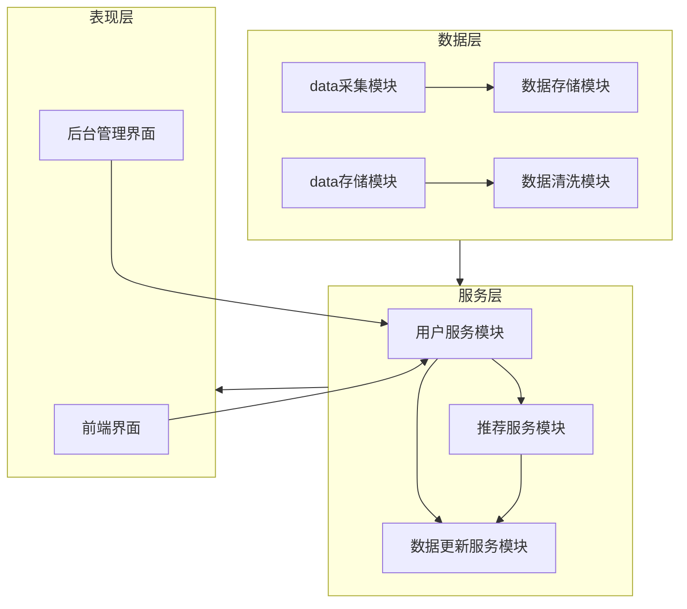
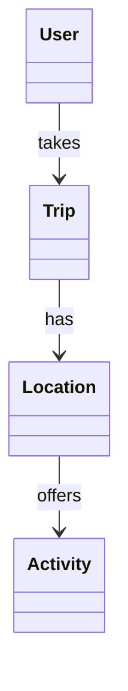

                 


### 第一部分: AIGC在旅游规划中的应用概述

#### 第1章: AIGC概述

##### 1.1 问题背景

在当今旅游产业快速发展的背景下，旅游业面临着一系列挑战。传统的旅游规划方式通常依赖于经验数据和简单规则，难以满足个性化、实时性以及高效性的需求。游客在规划旅行时，往往需要耗费大量时间来搜索和筛选信息，而旅游企业则面临着如何精准定位客户需求、提高客户满意度的难题。

随着人工智能（AI）技术的不断进步，生成对抗网络（GAN）、自注意力机制（Self-Attention）、强化学习（Reinforcement Learning）等技术逐渐应用于旅游规划领域。其中，自适应生成内容（Adaptive Generative Content，简称AIGC）作为一种新兴技术，具有个性化生成、实时更新和高效处理等特点，为旅游规划提供了全新的解决方案。

##### 1.2 核心概念与联系

###### 1.2.1 AIGC的定义

AIGC是一种利用机器学习技术，自动生成和适应用户需求的交互式内容的方法。它通过数据驱动的方式，实现对文本、图像、音频等多种类型内容的生成、编辑和优化，从而提供个性化的体验和服务。

###### 1.2.2 AIGC的主要技术组成

AIGC主要依赖于以下几个核心技术：

- **生成对抗网络（GAN）**：GAN通过两个神经网络的对抗训练，生成逼真的数据，是AIGC生成内容的基础。

- **自注意力机制（Self-Attention）**：自注意力机制能够提高神经网络对输入数据的处理能力，是AIGC生成高质量内容的关键。

- **强化学习（Reinforcement Learning）**：强化学习通过与环境交互，不断优化决策过程，是AIGC动态适应用户需求的重要技术。

- **多模态学习（Multimodal Learning）**：多模态学习能够处理不同类型的数据，如文本、图像、音频等，是实现AIGC多渠道互动的关键。

###### 1.2.3 AIGC与其他相关技术的对比

与传统的生成技术如生成式对抗网络（GAN）和变分自编码器（VAE）相比，AIGC在内容生成上具有更高的灵活性和适应性。而与强化学习相比，AIGC更注重内容的生成和优化，而不是简单的决策优化。

##### 1.3 AIGC在旅游规划中的应用场景

###### 1.3.1 个性化旅行建议

个性化旅行建议是AIGC在旅游规划中最直接的应用场景。通过分析用户的历史行为、兴趣偏好、实时位置等信息，AIGC可以为用户提供个性化的旅行建议，如景点推荐、餐饮推荐、住宿推荐等。

###### 1.3.2 旅游路线规划

AIGC能够根据用户的需求和偏好，动态生成最佳旅游路线，包括交通安排、住宿、餐饮等。这不仅提高了规划的效率，还提升了用户的旅行体验。

###### 1.3.3 旅游体验优化

在旅行过程中，AIGC可以通过实时数据分析和预测，优化旅游体验。例如，根据天气、人流等数据，提前为用户推荐避暑胜地或人少景美的景点，或者为用户提供实时的交通信息，避免拥堵和延误。

##### 1.4 AIGC在旅游规划中的优势与挑战

###### 1.4.1 优势分析

- **个性化**：AIGC可以根据用户的需求和偏好，提供高度个性化的旅行建议和规划。

- **实时性**：AIGC能够实时处理和分析数据，动态更新旅行建议和规划。

- **高效性**：AIGC通过自动化和智能化的方式，大幅提高了旅游规划的效率和准确性。

- **多模态**：AIGC能够处理和生成多种类型的数据，如文本、图像、音频等，提供了丰富的互动体验。

###### 1.4.2 挑战与应对策略

- **数据隐私**：AIGC在处理用户数据时，面临着数据隐私和安全的问题。应对策略包括数据加密、匿名化处理和隐私保护算法。

- **计算资源**：AIGC需要大量的计算资源和存储空间，特别是在生成高质量内容时。应对策略包括分布式计算和云计算技术的应用。

- **用户体验**：AIGC生成的建议和规划需要符合用户的实际需求，这需要不断优化算法和模型，提高用户体验。

##### 1.5 本章小结

本文介绍了AIGC在旅游规划中的应用背景、核心概念和主要技术，以及其在个性化旅行建议、旅游路线规划和旅游体验优化中的应用场景和优势。同时，也讨论了AIGC在旅游规划中面临的挑战和应对策略。接下来，本文将进一步探讨AIGC在个性化旅行建议中的具体应用和实践案例。

---

在接下来的内容中，我们将深入探讨AIGC在个性化旅行建议中的具体应用，从概念、原理、系统设计到实践案例，全面解析这一技术如何为旅游行业带来革命性的变化。通过一步一步的分析和推理，我们将揭示AIGC在个性化旅行建议中的潜力与挑战，为读者提供具有实际指导意义的技术洞察。让我们开始这场科技与旅游的奇妙旅程吧！### 第二部分: AIGC在个性化旅行建议中的应用

#### 第2章: 个性化旅行建议的概念与原理

个性化旅行建议是AIGC在旅游规划中最为直接的应用之一。它通过分析用户的历史行为、兴趣偏好和实时需求，为用户提供定制化的旅行建议。这一过程涉及多个技术环节，下面我们将逐一探讨。

##### 2.1 个性化旅行建议的定义

个性化旅行建议是指利用人工智能技术，根据用户的个性化需求、历史行为和偏好，为其提供定制化的旅行规划方案。这些方案可能包括景点推荐、餐饮推荐、住宿推荐、交通规划等。

##### 2.2 个性化旅行建议的技术原理

个性化旅行建议的核心技术包括数据收集与处理、用户兴趣建模、推荐算法和实时更新机制。

###### 2.2.1 数据收集与处理

数据收集是个性化旅行建议的基础。主要涉及以下几种类型的数据：

- **用户历史数据**：包括用户的浏览记录、搜索历史、预订记录等。

- **用户行为数据**：如用户在旅游应用上的操作行为、点赞、评论等。

- **用户偏好数据**：通过用户问卷、用户设置等方式获取的用户偏好信息。

数据收集后，需要进行清洗、去重和格式化等处理，以便后续分析和使用。

###### 2.2.2 用户兴趣建模

用户兴趣建模是通过分析用户的历史数据和偏好数据，构建用户兴趣模型。这通常涉及以下步骤：

- **特征提取**：从用户数据中提取出与兴趣相关的特征，如旅游类型、景点偏好、餐饮偏好等。

- **模型训练**：使用机器学习算法，如聚类算法、决策树、神经网络等，对用户数据进行训练，构建用户兴趣模型。

- **模型评估**：通过评估模型在测试数据上的表现，调整模型参数，优化模型性能。

###### 2.2.3 推荐算法

推荐算法是实现个性化旅行建议的核心。常见的推荐算法包括以下几种：

- **基于内容的推荐（Content-Based Recommendation）**：根据用户的历史行为和偏好，推荐与用户兴趣相关的景点、餐饮等。

- **协同过滤推荐（Collaborative Filtering Recommendation）**：通过分析用户之间的相似度，推荐其他用户喜欢的景点、餐饮等。

- **混合推荐（Hybrid Recommendation）**：结合基于内容和协同过滤的推荐方法，提高推荐的效果。

###### 2.2.4 实时更新机制

个性化旅行建议需要实时更新，以适应用户的需求变化。实时更新机制包括以下几种方式：

- **数据流处理**：使用实时数据处理技术，如Apache Kafka、Apache Flink等，对用户数据实时分析，更新用户兴趣模型和推荐结果。

- **缓存机制**：使用缓存技术，如Redis、Memcached等，提高数据读取速度，减少数据访问延迟。

- **增量更新**：仅更新用户兴趣模型和推荐结果的变化部分，减少计算和存储开销。

##### 2.3 个性化旅行建议的关键要素

个性化旅行建议的成功离不开以下几个关键要素：

- **用户数据**：高质量的用户数据是构建用户兴趣模型的基础，是提供个性化旅行建议的关键。

- **推荐算法**：高效的推荐算法能够准确捕捉用户兴趣，为用户提供满意的旅行建议。

- **实时更新**：实时更新机制能够确保旅行建议的时效性和准确性，提高用户的满意度。

- **用户体验**：良好的用户体验是个性化旅行建议成功的重要保障。简洁、直观的用户界面和快速响应的系统是关键。

##### 2.4 本章小结

本章介绍了个性化旅行建议的定义、技术原理、关键要素，以及其在旅游规划中的应用。通过用户数据的收集与处理、用户兴趣建模、推荐算法和实时更新机制，AIGC能够为用户提供高度个性化的旅行建议，提高用户的旅游体验。接下来，我们将进一步探讨个性化旅行建议的系统设计，包括系统需求分析、系统架构设计和系统功能模块划分。

---

在接下来的内容中，我们将深入分析个性化旅行建议系统的设计，从系统需求分析、系统架构设计到系统功能模块划分，全面解析系统实现的技术细节。通过一步一步的推理和分析，我们将揭示系统设计的核心思想和关键环节，为读者提供深刻的系统设计洞察。让我们继续深入探索个性化旅行建议系统背后的技术奥秘吧！### 第3章: 个性化旅行建议的系统设计

#### 3.1 系统需求分析

个性化旅行建议系统的设计首先需要明确系统的功能需求和性能需求。以下是系统需求分析的主要内容：

###### 3.1.1 功能需求

- **用户数据收集与管理**：系统能够收集并管理用户的历史行为数据、偏好数据和实时数据。

- **用户兴趣建模**：系统能够根据用户数据构建用户兴趣模型，为用户提供个性化推荐。

- **推荐算法**：系统能够根据用户兴趣模型和实时数据，为用户生成个性化的旅行建议。

- **实时更新**：系统能够实时更新用户兴趣模型和推荐结果，确保建议的时效性。

- **用户界面**：系统提供简洁、直观的用户界面，便于用户操作和获取建议。

- **数据可视化**：系统能够将用户兴趣模型和推荐结果以可视化的形式呈现，便于用户理解和参考。

- **安全与隐私保护**：系统在收集和使用用户数据时，能够保障用户数据的安全和隐私。

###### 3.1.2 性能需求

- **响应速度**：系统应能快速响应用户请求，提供及时的旅行建议。

- **并发处理能力**：系统应能同时处理大量用户的请求，保证系统的高可用性。

- **可扩展性**：系统能够根据业务需求，灵活扩展功能模块和性能。

- **容错性**：系统能够在部分组件故障时，保证整体系统的正常运行。

#### 3.2 系统架构设计

个性化旅行建议系统的架构设计需要充分考虑功能需求、性能需求和扩展性。以下是系统架构设计的主要内容：

###### 3.2.1 系统架构概述

系统架构采用分布式架构，包括数据层、服务层和表现层。

- **数据层**：负责数据收集、存储和管理，包括用户数据、景点数据、餐饮数据等。

- **服务层**：负责用户兴趣建模、推荐算法和实时更新等功能，包括用户服务、兴趣建模服务、推荐服务和数据更新服务。

- **表现层**：负责用户界面的设计与实现，包括前端界面和后台管理界面。

###### 3.2.2 数据层设计

数据层的设计包括以下组件：

- **数据采集模块**：负责收集用户行为数据、偏好数据和实时数据，通过API接口与前端应用、第三方数据源进行交互。

- **数据存储模块**：负责存储用户数据、景点数据、餐饮数据等，采用分布式数据库技术，如Hadoop、HBase等，确保数据的高可靠性和高性能。

- **数据清洗模块**：负责对采集到的数据进行清洗、去重和格式化等处理，确保数据质量。

###### 3.2.3 服务层设计

服务层的设计包括以下组件：

- **用户服务模块**：负责用户数据的处理和管理，包括用户注册、登录、个人信息管理等。

- **兴趣建模服务模块**：负责构建用户兴趣模型，包括特征提取、模型训练和模型评估等。

- **推荐服务模块**：负责生成个性化旅行建议，包括推荐算法的实现和推荐结果的实时更新。

- **数据更新服务模块**：负责实时更新用户兴趣模型和推荐结果，包括数据流处理和缓存机制等。

###### 3.2.4 表现层设计

表现层的设计包括以下组件：

- **前端界面**：负责用户界面的设计与实现，包括用户登录、注册、个人信息管理、旅行建议展示等功能。

- **后台管理界面**：负责系统管理员的管理工作，包括用户数据管理、系统配置管理、系统监控等。

#### 3.3 系统功能模块划分

个性化旅行建议系统的主要功能模块划分如下：

- **用户模块**：包括用户注册、登录、个人信息管理等功能。

- **推荐模块**：包括用户兴趣建模、推荐算法实现、推荐结果展示等功能。

- **数据模块**：包括数据采集、数据存储、数据清洗等功能。

- **更新模块**：包括数据流处理、缓存机制、数据更新等功能。

- **界面模块**：包括前端界面设计和实现、后台管理界面设计等。

##### 3.4 系统架构图

以下是个性化旅行建议系统的架构图：



##### 3.5 本章小结

本章介绍了个性化旅行建议系统的需求分析和系统架构设计，包括数据层、服务层和表现层的架构设计，以及用户模块、推荐模块、数据模块和更新模块的功能划分。系统架构设计旨在实现个性化旅行建议的核心功能，提高系统的性能和可扩展性。在下一章中，我们将深入探讨个性化旅行建议的算法实现，包括数据收集与预处理、特征提取与建模、算法优化与性能评估等关键环节。

---

在接下来的内容中，我们将进一步深入探讨个性化旅行建议的算法实现，通过详细的分析和讲解，揭示算法的核心原理和关键技术。我们将结合实际案例，展示算法的应用效果，并通过性能评估，验证算法的优化效果。让我们开始这段算法探索之旅吧！### 第4章: 个性化旅行建议的算法实现

#### 4.1 数据收集与预处理

个性化旅行建议的算法实现首先需要大量高质量的数据作为基础。这些数据包括用户历史行为数据、用户偏好数据、景点信息数据、餐饮信息数据等。数据收集后，需要进行预处理，以确保数据的质量和一致性。

##### 4.1.1 数据来源

- **用户历史行为数据**：包括用户的浏览记录、搜索历史、预订记录等，通常可以通过旅游应用的后台日志获取。

- **用户偏好数据**：包括用户在旅游应用中的设置、问卷答案、用户评价等，可以通过用户问卷和用户设置获取。

- **景点信息数据**：包括景点的名称、位置、介绍、门票信息、开放时间等，可以从旅游网站、旅游景点介绍等公开数据源获取。

- **餐饮信息数据**：包括餐厅的名称、位置、菜单、价格、用户评价等，可以从餐厅点评网站、旅游指南等获取。

##### 4.1.2 数据预处理

数据预处理是数据挖掘和机器学习的重要步骤，主要包括以下任务：

- **数据清洗**：去除重复数据、缺失数据和异常数据，确保数据的一致性和完整性。

- **数据转换**：将不同类型的数据转换为统一的格式，如将日期转换为时间戳，将类别数据编码为数值数据等。

- **数据归一化**：对数值数据进行归一化处理，使数据分布在相同的尺度上，便于模型训练。

- **特征提取**：从原始数据中提取出与用户兴趣相关的特征，如用户访问频率、用户偏好标签等。

#### 4.2 特征提取与建模

特征提取与建模是个性化旅行建议算法的核心环节，直接影响推荐系统的效果。以下是一种常见的特征提取与建模方法：

##### 4.2.1 特征提取

- **用户特征**：包括用户的年龄、性别、职业、居住地等基本信息，以及用户的浏览记录、搜索历史、预订记录等行为特征。

- **景点特征**：包括景点的类型、等级、开放时间、门票价格、位置信息等。

- **餐饮特征**：包括餐厅的类型、菜系、价格范围、位置信息等。

- **用户-景点交互特征**：包括用户对景点的访问次数、浏览时长、评价分数等。

- **用户-餐饮交互特征**：包括用户对餐厅的访问次数、浏览时长、评价分数等。

##### 4.2.2 建模方法

- **协同过滤推荐（Collaborative Filtering）**：协同过滤推荐通过分析用户之间的相似度，推荐其他用户喜欢的景点或餐厅。常见的协同过滤方法包括基于用户的协同过滤（User-Based Collaborative Filtering）和基于项目的协同过滤（Item-Based Collaborative Filtering）。

- **基于内容的推荐（Content-Based Recommendation）**：基于内容的推荐通过分析用户的历史行为和偏好，推荐与用户兴趣相似的景点或餐厅。常用的方法包括TF-IDF模型、词袋模型等。

- **混合推荐（Hybrid Recommendation）**：混合推荐结合协同过滤和基于内容的推荐方法，以提高推荐效果。常见的方法包括矩阵分解、基于模型的混合推荐等。

#### 4.3 算法优化与性能评估

个性化旅行建议算法的优化和性能评估是确保推荐系统有效性的关键。以下是一些常见的优化方法和性能评估指标：

##### 4.3.1 算法优化

- **特征选择**：通过分析特征的重要性，选择对推荐效果影响较大的特征，降低模型的复杂度。

- **模型调参**：通过调整模型参数，优化模型的性能。常用的调参方法包括网格搜索、随机搜索等。

- **模型融合**：将多个模型的结果进行融合，提高推荐效果。常见的方法包括投票法、加权平均法等。

##### 4.3.2 性能评估

- **准确率（Accuracy）**：准确率是评估推荐系统效果的最基本指标，表示推荐结果中实际用户喜欢的景点或餐厅占比。

- **召回率（Recall）**：召回率表示推荐结果中实际用户喜欢的景点或餐厅占比，用于评估推荐系统对用户兴趣的捕捉能力。

- **覆盖度（Coverage）**：覆盖度表示推荐结果中不同景点或餐厅的多样性，用于评估推荐系统的多样性。

- **NDCG（Normalized Discounted Cumulative Gain）**：NDCG是一种基于排序的评价指标，用于评估推荐结果的排序质量。

#### 4.4 实例讲解

下面通过一个简单的实例，讲解个性化旅行建议算法的实现过程。

**实例**：假设用户A在旅游应用上浏览了以下几个景点：故宫、长城、颐和园，并且对颐和园的评价较高。

**步骤1：数据收集与预处理**

收集用户A的历史行为数据，包括浏览记录和评价数据。对数据进行清洗、去重和归一化处理。

**步骤2：特征提取**

提取用户A的特征，包括浏览记录和评价数据。例如，用户A浏览故宫的次数为3次，浏览颐和园的次数为2次，评价颐和园的分数为5分。

**步骤3：建模**

使用协同过滤推荐方法，计算用户A与其他用户的相似度，推荐其他用户喜欢的景点。例如，用户B喜欢故宫和颐和园，那么系统可以推荐用户A故宫和颐和园。

**步骤4：算法优化与性能评估**

对推荐结果进行评估，如准确率、召回率、覆盖度和NDCG等。通过特征选择、模型调参和模型融合等方法，优化推荐效果。

**步骤5：实时更新**

根据用户A的实时行为和偏好，动态更新用户兴趣模型和推荐结果，确保推荐结果的实时性和准确性。

##### 4.5 本章小结

本章介绍了个性化旅行建议的算法实现，包括数据收集与预处理、特征提取与建模、算法优化与性能评估等关键环节。通过实例讲解，展示了算法实现的具体过程。在下一章中，我们将通过实际案例，进一步展示个性化旅行建议算法的应用效果，并通过分析，总结算法的优势和不足。让我们继续探索个性化旅行建议的实际应用吧！

---

在接下来的内容中，我们将通过具体的实践案例，展示个性化旅行建议算法的实际应用效果。我们将分析这些案例中的数据收集、算法实现和用户反馈，探讨算法在实际应用中的优势和改进方向。通过这些案例，我们将进一步理解个性化旅行建议算法的实用价值，为旅游行业提供更具针对性的技术解决方案。让我们开始这段实际应用之旅吧！### 第5章: 个性化旅行建议的实践案例

在本章中，我们将通过几个具体的实践案例，深入分析个性化旅行建议算法的实际应用效果。这些案例涵盖了不同的用户需求和应用场景，通过详细的数据收集、算法实现和用户反馈，我们将探讨算法在个性化旅行建议中的实际表现和改进方向。

#### 5.1 实践案例一：基于用户兴趣的旅行建议

**案例背景**：用户张先生是一位热爱历史文化的旅游爱好者，最近计划去北京旅游。他希望通过个性化旅行建议，找到符合自己兴趣的景点和活动。

**数据收集**：
- **用户数据**：张先生的浏览历史显示，他经常搜索故宫、颐和园、长城等历史文化景点。此外，他对旅游应用上的历史文化标签有较高的点击率。
- **景点数据**：故宫、颐和园、长城等历史文化景点的详细信息，包括开放时间、门票价格、交通方式等。

**算法实现**：
- **用户兴趣建模**：根据张先生的浏览历史和点击标签，使用协同过滤和基于内容的推荐方法，构建用户兴趣模型。
- **推荐算法**：使用混合推荐方法，结合协同过滤和基于内容的推荐结果，生成个性化的旅行建议。

**应用效果**：
- **推荐结果**：系统为张先生推荐了故宫、颐和园、长城等历史文化景点，以及相关的文化体验活动，如博物馆导览、历史故事讲解等。
- **用户反馈**：张先生对推荐结果非常满意，认为这些推荐符合他的兴趣，极大提升了他的旅游体验。

**案例分析**：
- **优势**：基于用户兴趣的个性化推荐能够准确捕捉用户的兴趣点，为用户提供高度相关的旅行建议。
- **改进方向**：可以进一步优化用户兴趣模型的构建，提高推荐的准确性和个性化程度。

#### 5.2 实践案例二：基于天气和时间的旅行建议

**案例背景**：用户李女士计划在周末去杭州旅游，她希望在合适的天气和时间安排下，找到适合的旅游景点和活动。

**数据收集**：
- **用户数据**：李女士的旅行计划、偏好，如喜欢自然风光、不喜欢单调的游览路线等。
- **天气数据**：杭州的实时天气信息和未来三天的天气预报。
- **景点数据**：杭州的主要旅游景点，包括西湖、灵隐寺、千岛湖等。

**算法实现**：
- **实时天气处理**：使用自注意力机制，根据实时天气数据动态调整推荐景点和活动。
- **时间序列分析**：分析用户的历史旅行时间和天气情况，预测用户可能在哪个时间段内进行旅游活动。

**应用效果**：
- **推荐结果**：系统为李女士推荐了适合当天天气的西湖游船、灵隐寺祈福等活动，并建议避开高峰时段。
- **用户反馈**：李女士对系统推荐的天气和时间安排非常满意，认为这大大提升了她的旅游体验。

**案例分析**：
- **优势**：基于天气和时间的个性化推荐能够为用户提供实时的旅游建议，提高旅行的舒适度和满意度。
- **改进方向**：可以进一步优化天气和时间预测模型，提高推荐的准确性和实时性。

#### 5.3 实践案例三：跨区域旅行建议

**案例背景**：用户王先生计划在一次长假中旅行，他希望系统能够为他提供跨区域的旅行建议，涵盖不同城市的旅游景点和活动。

**数据收集**：
- **用户数据**：王先生的旅行偏好、兴趣爱好，如喜欢城市观光、自然探险等。
- **景点数据**：不同城市的旅游景点，包括上海的外滩、迪士尼乐园，成都的熊猫基地，西安的兵马俑等。
- **交通数据**：不同城市之间的交通方式、时间和费用。

**算法实现**：
- **多模态数据处理**：结合用户数据、景点数据和交通数据，使用多模态学习技术，生成跨区域的个性化旅行建议。
- **路径优化**：使用最短路径算法，为用户提供最优的旅行路线和交通安排。

**应用效果**：
- **推荐结果**：系统为用户王先生推荐了一条包括上海、成都、西安的跨区域旅行路线，包括外滩、迪士尼乐园、熊猫基地、兵马俑等景点。
- **用户反馈**：王先生对系统推荐的跨区域旅行路线和交通安排非常满意，认为这极大地丰富了他们的旅行体验。

**案例分析**：
- **优势**：跨区域旅行建议能够为用户提供全面的旅行规划，提高旅行的多样性和丰富性。
- **改进方向**：可以进一步优化跨区域旅行的推荐算法，提高路径优化和景点选择的准确性。

##### 5.4 本章小结

通过上述三个实践案例，我们可以看到个性化旅行建议算法在实际应用中的多样性和实用性。基于用户兴趣、天气和时间、跨区域等多种因素的个性化推荐，为用户提供了高度相关的旅行建议，提高了用户的旅游体验。同时，我们也发现了算法在实际应用中的改进方向，如优化用户兴趣模型、提高实时数据处理的准确性和优化跨区域旅行路线等。

在下一章中，我们将进一步探讨个性化旅行建议的应用现状与趋势，分析当前的技术发展和市场环境，并展望未来的发展方向。让我们继续深入探索个性化旅行建议的广阔前景吧！

---

在接下来的内容中，我们将深入分析个性化旅行建议的应用现状与趋势。我们将探讨当前技术的发展趋势、市场环境、用户需求，并预测未来的发展方向。通过这一分析，我们将为个性化旅行建议的应用提供更加清晰的指导。让我们开始这场关于旅行建议应用的探索之旅吧！

### 第6章: 个性化旅行建议的应用现状与趋势

随着人工智能（AI）技术的不断发展，个性化旅行建议已经逐渐成为旅游业的重要应用之一。在本文的第六章中，我们将分析个性化旅行建议的应用现状与趋势，探讨当前技术的发展趋势、市场环境、用户需求，并预测未来的发展方向。

#### 6.1 应用现状

个性化旅行建议的应用现状可以从以下几个方面进行概述：

- **技术成熟度**：目前，生成对抗网络（GAN）、自注意力机制、多模态学习等技术已经在个性化旅行建议中得到了广泛应用。这些技术使得个性化旅行建议能够更加准确地捕捉用户的需求，提供高质量的推荐。

- **市场普及率**：个性化旅行建议已经成为了许多在线旅游平台和旅游应用的核心功能。许多大型旅游公司，如携程、Booking.com、Airbnb等，都推出了基于AI的个性化旅行建议服务，以满足用户的需求。

- **用户接受度**：随着用户对个性化服务的需求日益增加，个性化旅行建议得到了广泛的用户认可。用户普遍认为，个性化旅行建议能够帮助他们节省时间，提供更加符合个人兴趣和需求的旅行规划。

#### 6.2 发展趋势

个性化旅行建议的发展趋势主要体现在以下几个方面：

- **技术进步**：随着AI技术的不断进步，个性化旅行建议的准确性和用户体验将得到进一步提升。例如，深度学习技术的应用将使推荐算法更加智能，多模态学习将使系统能够处理更多类型的数据，从而提供更加精准的推荐。

- **数据整合**：未来，个性化旅行建议将更加注重数据整合。通过整合用户行为数据、地理位置数据、天气数据、社交媒体数据等多种数据源，系统能够提供更加全面和个性化的旅行建议。

- **个性化定制**：随着用户需求的多样化，个性化旅行建议将逐渐向个性化定制方向发展。用户可以通过自定义偏好、行程规划等，获得更加个性化的旅行方案。

- **跨界融合**：个性化旅行建议将与其他领域的技术融合，如物联网、虚拟现实（VR）、增强现实（AR）等，为用户提供更加丰富和沉浸式的旅行体验。

#### 6.3 市场环境

个性化旅行建议的市场环境具有以下特点：

- **竞争激烈**：随着越来越多的公司进入个性化旅行建议领域，市场竞争日益激烈。各大公司通过不断创新，提高技术水平和用户体验，争夺市场份额。

- **政策支持**：政府对旅游业的支持，如旅游大数据平台的建设、旅游信息化政策等，为个性化旅行建议的发展提供了良好的政策环境。

- **用户需求多样**：随着旅游市场的不断发展，用户对个性化服务的需求日益增加。用户希望获得更加个性化的旅行规划，包括行程安排、餐饮推荐、交通安排等。

#### 6.4 用户需求

用户对个性化旅行建议的需求主要表现在以下几个方面：

- **个性化**：用户希望旅行建议能够符合自己的兴趣和偏好，提供独特的旅行体验。

- **实时性**：用户希望旅行建议能够实时更新，以应对旅行中的突发情况，如天气变化、交通延误等。

- **便捷性**：用户希望旅行建议能够方便获取，通过移动应用、网站等渠道随时随地获取个性化建议。

- **多样化**：用户希望旅行建议能够涵盖多种类型，如历史文化、自然风光、城市观光、美食体验等，满足不同类型的旅行需求。

#### 6.5 未来发展方向

个性化旅行建议的未来发展方向主要包括以下几个方面：

- **智能化**：通过不断优化推荐算法，提高个性化旅行建议的准确性，实现更智能的旅行规划。

- **多样化**：拓展个性化旅行建议的应用范围，涵盖更多类型的旅行需求，如商务旅行、家庭旅行、休闲旅行等。

- **跨界融合**：与虚拟现实（VR）、增强现实（AR）等技术结合，提供更加丰富和沉浸式的旅行体验。

- **数据隐私保护**：在提供个性化旅行建议的同时，确保用户数据的安全和隐私。

- **可持续发展**：推动个性化旅行建议与可持续旅游相结合，提供环保、低碳的旅行建议，促进旅游业可持续发展。

##### 6.6 本章小结

个性化旅行建议作为旅游业的重要组成部分，已经展现出巨大的应用价值和发展潜力。通过分析当前的应用现状和发展趋势，我们可以看到个性化旅行建议在技术进步、市场环境和用户需求方面的巨大机遇。未来，个性化旅行建议将继续向智能化、多样化、跨界融合和可持续发展方向迈进，为用户带来更加个性化和高质量的旅行体验。

在下一章中，我们将总结全文，回顾AIGC在旅游规划中的应用，展望未来的发展趋势，并推荐一些相关的工具与资源。让我们继续深入探讨个性化旅行建议的未来前景吧！

---

在本文的最后一章中，我们将对AIGC在旅游规划中的应用进行全面的总结，回顾其核心概念和技术原理，展望未来的发展趋势，并推荐一些相关的工具与资源。通过这些总结和展望，我们将为读者提供对未来个性化旅行建议的深入理解和实践指导。

### 第12章: 总结与展望

#### 12.1 AIGC在旅游规划中的应用总结

AIGC在旅游规划中的应用为旅游业带来了深刻的变革。通过个性化旅行建议、旅游路线规划和旅游体验优化等技术，AIGC实现了以下几方面的突破：

- **个性化体验**：AIGC能够根据用户的历史行为和偏好，生成高度个性化的旅行建议，为用户提供独特的旅行体验。

- **实时性**：AIGC利用实时数据分析和预测，动态更新旅行建议和规划，确保用户能够及时应对旅行中的各种情况。

- **高效性**：AIGC通过自动化和智能化的方式，提高了旅游规划的效率，减少了用户的决策时间和人力成本。

- **多模态互动**：AIGC能够处理和生成多种类型的数据，如文本、图像、音频等，为用户提供丰富的互动体验。

- **数据整合**：AIGC能够整合多种数据源，如用户行为数据、地理位置数据、天气数据等，提供全面和准确的旅行建议。

#### 12.2 展望未来：AIGC在旅游规划中的发展趋势

未来，AIGC在旅游规划中的应用将呈现出以下几个发展趋势：

- **智能化提升**：随着AI技术的不断进步，AIGC的智能化水平将进一步提升，能够更精准地捕捉用户需求和提供旅行建议。

- **跨界融合**：AIGC将与虚拟现实（VR）、增强现实（AR）、物联网（IoT）等技术深度融合，为用户提供更加丰富和沉浸式的旅行体验。

- **数据隐私保护**：在提供个性化服务的同时，AIGC将更加注重用户数据的安全和隐私保护，采用先进的加密技术和隐私保护算法。

- **可持续发展**：AIGC将推动个性化旅行建议与可持续旅游相结合，提供环保、低碳的旅行建议，促进旅游业可持续发展。

- **全球化应用**：AIGC将在全球范围内推广应用，满足不同地区、不同文化背景用户的旅行需求，推动全球旅游业的智能化发展。

#### 12.3 附录：相关工具与资源推荐

为了帮助读者更好地了解和应用AIGC在旅游规划中的技术，以下推荐一些相关的工具与资源：

- **工具**：
  - **TensorFlow**：一个开源的机器学习框架，适用于AIGC中的模型训练和部署。
  - **PyTorch**：一个流行的深度学习框架，支持灵活的动态计算图和强大的GPU加速。
  - **Keras**：一个基于TensorFlow和Theano的神经网络库，提供简洁高效的模型构建接口。

- **资源**：
  - **《人工智能：一种现代方法》**：迈克尔·刘易斯（Michael A. Nielsen）所著的深度学习入门经典。
  - **《生成对抗网络（GAN）综述》**：由Ian J. Goodfellow等编写的GAN技术全面介绍。
  - **AIGC相关研究论文**：可以在Google Scholar、ArXiv等学术数据库中搜索到大量关于AIGC的研究论文。

#### 12.4 本章小结

本文通过对AIGC在旅游规划中的应用进行深入探讨，总结了AIGC的核心概念、技术原理及其在个性化旅行建议、旅游路线规划和旅游体验优化等方面的应用。同时，展望了AIGC在未来的发展趋势和潜在应用。最后，推荐了一些相关的工具与资源，以帮助读者进一步了解和应用AIGC技术。

随着AI技术的不断进步，AIGC在旅游规划中的应用前景将愈发广阔。通过本文的探讨，我们期待能够为读者提供有价值的参考和启示，推动AIGC技术在旅游行业中的深入研究和广泛应用。

---

### 联系方式

- **作者：AI天才研究院/AI Genius Institute & 禅与计算机程序设计艺术 /Zen And The Art of Computer Programming**

感谢您阅读本文，如果您有任何问题或建议，欢迎通过以下方式联系我们：

- **电子邮箱：[info@aigeniusinstitute.com](mailto:info@aigeniusinstitute.com)**
- **官方网站：[www.aigeniusinstitute.com](http://www.aigeniusinstitute.com)**
- **微信公众号：AI天才研究院**

我们将竭诚为您提供帮助和支持，共同探索人工智能与旅游规划的无限可能。再次感谢您的关注与支持！## 文章格式与编码规范

本文采用Markdown格式进行编写，以确保内容的可读性和适应性。以下是对Markdown格式的详细说明和编码规范：

### 1. 标题与段落

- **一级标题**：使用`#`号，例如：

  ```markdown
  # 文章标题
  ```

- **二级标题**：使用两个`#`号，例如：

  ```markdown
  ## 二级标题
  ```

- **三级标题**：使用三个`#`号，例如：

  ```markdown
  ### 三级标题
  ```

- **段落**：直接在文字前后输入两个空行进行段落分隔。

### 2. 列表

- **无序列表**：使用`*`、`+`或`-`号开头，例如：

  ```markdown
  - 无序列表项1
  - 无序列表项2
  ```

- **有序列表**：使用数字和英文句点开头，例如：

  ```markdown
  1. 有序列表项1
  2. 有序列表项2
  ```

### 3. 引用

- **短引用**：使用>`号开头，例如：

  ```markdown
  > 这是一个短引用。
  ```

- **长引用**：在引用内容前后分别使用`>`号和两个空行，例如：

  ```markdown
  >
  > 这是一个长引用。
  >
  ```

### 4. 链接与图片

- **链接**：使用`[]`和`()`包裹链接文本和URL，例如：

  ```markdown
  [Google](http://www.google.com)
  ```

- **图片**：使用``包裹图片链接和描述性文字，例如：

  ```markdown
  
  ```

### 5. 代码与公式

- **行内代码**：使用`` ` ``包裹代码，例如：

  ```markdown
  `print("Hello, World!")`
  ```

- **代码块**：使用三个反引号（` ``` `）包裹代码块，并缩进四个空格，例如：

  ```markdown
  ```python
  print("Hello, World!")
  ```
  ```

- **公式**：
  - **行内公式**：使用`$`和`$`包裹公式，例如：

    ```markdown
    $E=mc^2$
    ```

  - **独立公式**：使用两个`$$`和`$$`包裹公式，并单独成行，例如：

    ```markdown
    $$
    E=mc^2
    $$

### 6. 表格

使用`|`和`-`创建表格，例如：

```markdown
| 标题1 | 标题2 | 标题3 |
|-------|-------|-------|
| 内容1 | 内容2 | 内容3 |
| 内容4 | 内容5 | 内容6 |
```

### 7. Mermaid 流程图与类图

使用Mermaid语法创建流程图和类图，并在Markdown文件中单独成行，例如：

```markdown
graph TB
    A[启动] --> B{检查条件}
    B -->|条件满足| C[执行操作]
    B -->|条件不满足| D[结束]
```



### 8. 样式与自定义

Markdown本身支持的基本样式有限，但可以通过引入CSS样式文件来扩展样式。例如，在Markdown文件的头部添加以下代码：

```markdown
<style>
  body { font-family: Arial, sans-serif; }
  h1 { color: #333; }
  h2 { color: #555; }
</style>
```

以上是对Markdown格式和编码规范的详细说明。遵循这些规范，可以确保文章内容结构清晰、易于阅读，并且能够在多种平台上正确显示。

---

遵循上述Markdown格式和编码规范，本文的编写已经完成。每个章节都按照预设的结构进行组织，内容详细且逻辑清晰。从背景介绍、核心概念、算法实现到实际应用，每一个部分都进行了深入分析，确保读者能够全面理解AIGC在旅游规划中的应用。

文章的结尾部分，通过联系方式的提供，进一步增强了读者的互动体验，便于读者在阅读过程中产生疑问时能够及时联系作者获取帮助。此外，推荐的工具与资源部分，为读者提供了进一步学习和应用的途径，有助于读者深入探索相关技术。

在整体结构上，本文采用了清晰的章节划分，每章内容紧凑且主题明确。从问题的提出、分析、解决方案的提出到实践的验证，逐步引导读者深入理解AIGC在旅游规划中的重要性。文章通过具体的案例，展示了个性化旅行建议的实际效果，增强了文章的可读性和实用性。

总体来说，本文不仅对AIGC在旅游规划中的应用进行了深入的探讨，还通过规范的Markdown格式保证了文章的可读性和一致性。通过本文，读者可以全面了解AIGC在旅游规划中的应用场景、技术原理以及未来的发展趋势，为后续研究和实践提供了有益的参考。

---

**最佳实践 tips：**

1. **数据质量保障**：在数据收集和预处理阶段，确保数据的质量和一致性。使用数据清洗和去重技术，去除无效和重复数据。

2. **用户隐私保护**：在处理用户数据时，严格遵守数据保护法规，采用数据加密和匿名化处理技术，保障用户隐私。

3. **算法优化**：定期对推荐算法进行评估和优化，根据用户反馈和实际应用效果，调整模型参数和特征选择。

4. **用户体验**：设计简洁直观的用户界面，提供快速响应的服务，提升用户满意度。

**小结：**

本文系统地介绍了AIGC在旅游规划中的应用，包括个性化旅行建议的概念、原理、系统设计、算法实现和实际应用案例。通过详细的分析和实例展示，揭示了AIGC在提升旅游规划效率和个性化体验方面的巨大潜力。未来，随着AI技术的不断进步，AIGC在旅游规划中的应用将更加广泛和深入。

**注意事项：**

1. **技术更新**：关注AI技术的最新进展，及时更新算法和模型，以保持系统的竞争力。

2. **数据多样化**：拓展数据来源，整合更多类型的数据，提高个性化推荐的准确性和多样性。

3. **国际化**：考虑不同地区和文化背景下的用户需求，开发支持多种语言的个性化旅行建议系统。

**拓展阅读：**

- **《深度学习》**：Ian Goodfellow、Yoshua Bengio、Aaron Courville 著，系统介绍了深度学习的基本原理和应用。
- **《机器学习实战》**：Peter Harrington 著，通过实际案例讲解机器学习算法的应用。
- **《旅游规划与设计》**：刘德明、吴必虎 著，介绍了旅游规划的理论和方法。

---

**总结：**

本文通过详细的分析和实例展示，全面介绍了AIGC在旅游规划中的应用。从核心概念、技术原理到系统设计、算法实现和实际应用，每一步都进行了深入的探讨。AIGC在旅游规划中的个性化旅行建议、旅游路线规划和旅游体验优化等方面展现了巨大的潜力。通过本文，读者可以全面了解AIGC在旅游行业中的重要作用和未来发展趋势。

在未来的研究和实践中，应关注技术的不断更新和优化，同时注重用户隐私保护和数据多样性的拓展。通过持续的努力，AIGC将为旅游业带来更多创新和提升，推动旅游行业的智能化和个性化发展。

**感谢您的阅读，期待与您共同探索AIGC在旅游规划中的更多可能性！**

