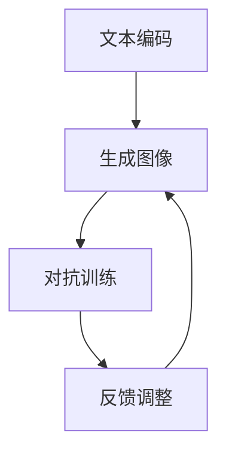
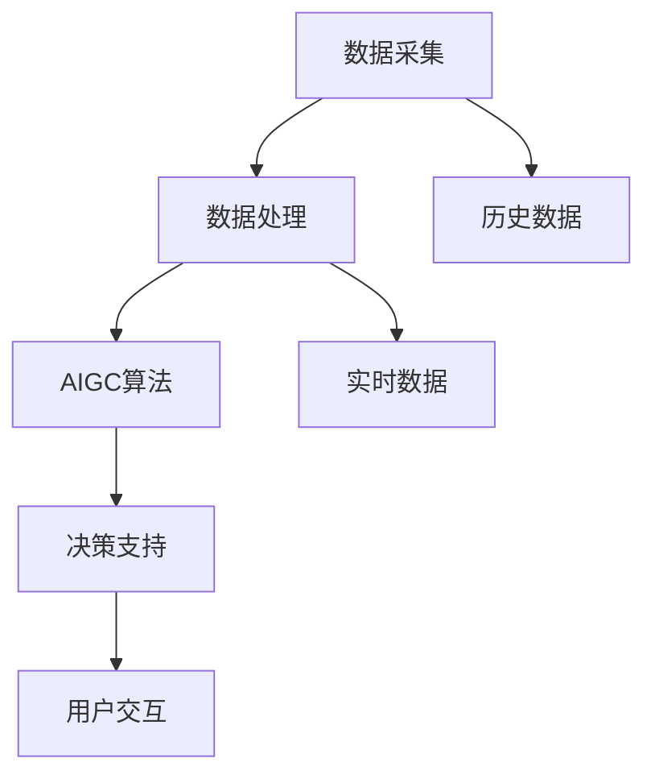
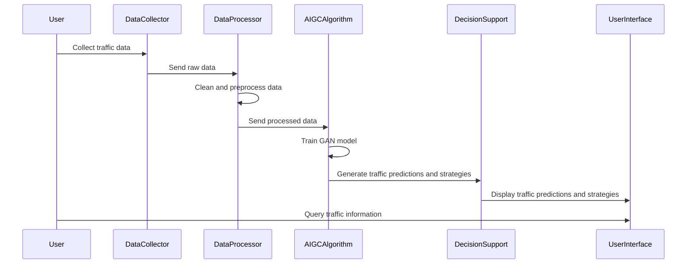

                 

### AIGC在智慧城市交通优化中的实践探索

#### 关键词
- AIGC
- 生成对抗网络
- 智慧城市
- 交通优化
- 算法原理
- 数学模型
- 系统架构

#### 摘要
本文深入探讨了人工智能生成内容（AIGC）在智慧城市交通优化中的应用。首先，我们介绍了AIGC的基本概念和其在城市交通优化中的重要作用。接着，详细解析了与AIGC相关的核心概念，如生成对抗网络（GAN）及其在自动文生图模型中的应用。通过算法原理的讲解，我们展示了AIGC的数学模型和流程，并通过Python代码示例和LaTeX公式进行了深入阐述。文章随后介绍了AIGC在智慧城市交通优化中的系统架构设计，包括领域模型、系统架构、接口设计和系统交互。通过一个实际项目案例，我们展示了AIGC在交通优化中的应用，并提出了最佳实践、小结和注意事项。本文旨在为读者提供一份全面且专业的技术指南，帮助理解AIGC在智慧城市交通优化中的潜力与挑战。

## 背景介绍

### AIGC的概念

人工智能生成内容（AI-Generated Content，简称AIGC）是一种利用人工智能技术生成各种类型内容的方法，包括文本、图像、视频和音频等。AIGC技术通过机器学习和深度学习模型，特别是生成对抗网络（GAN）和其他生成模型，模仿人类创造者的风格和创作过程，自动生成高质量的内容。

### AIGC在智慧城市交通优化中的应用背景

随着城市化进程的加速和人口增长，城市交通问题日益突出。传统的交通优化方法在应对复杂的交通流和实时变化时存在诸多限制。因此，智慧城市交通优化成为城市管理者和技术开发者关注的热点。AIGC在这一领域的应用主要体现在以下几个方面：

1. **交通流量预测**：利用AIGC技术，可以预测交通流量，帮助交通管理部门制定更有效的交通管理策略，减少交通拥堵。
2. **路线规划**：AIGC可以生成基于实时数据的最佳路线规划方案，提高出行效率，减少通勤时间。
3. **信号灯控制**：通过AIGC技术优化信号灯控制策略，实现智能交通管理，提高道路通行能力。
4. **突发事件响应**：在发生交通事故或道路施工等突发事件时，AIGC可以快速生成应对方案，减少对交通的影响。

### 问题背景与问题描述

智慧城市交通优化面临以下主要问题：

- **数据复杂性**：交通数据包含多种类型，如车辆流量、速度、交通密度等，数据量大且实时性要求高。
- **实时性要求**：城市交通状况瞬息万变，需要实时处理和分析数据，快速响应交通事件。
- **不确定性**：交通状况受多种因素影响，如天气、节假日、突发事件等，导致交通流的波动性大。
- **效率与公平性**：优化交通流量需要在提高通行效率的同时，确保交通系统的公平性。

### 问题解决方法与AIGC的作用

AIGC在解决智慧城市交通优化中的问题方面具有显著优势：

1. **数据整合与处理**：AIGC技术能够整合多种类型的数据，通过深度学习模型自动处理和分析数据，提高数据处理效率。
2. **实时预测与响应**：AIGC可以利用历史数据和实时数据，通过生成模型快速预测交通流量，实现实时响应。
3. **智能决策支持**：基于预测结果，AIGC可以生成最优的交通管理策略，如路线规划、信号灯控制等，为交通管理部门提供智能决策支持。
4. **自适应调整**：AIGC能够根据实时反馈调整优化策略，实现交通系统的自适应调节，提高交通系统的稳定性和可靠性。

综上所述，AIGC在智慧城市交通优化中发挥着关键作用，为解决复杂的交通问题提供了强大的技术手段。接下来，我们将详细探讨与AIGC相关的核心概念，进一步理解其工作原理和应用。

## 核心概念与联系

### 生成对抗网络（GAN）

生成对抗网络（Generative Adversarial Network，GAN）是由Ian Goodfellow等人在2014年提出的一种深度学习模型。GAN由两个神经网络组成：生成器（Generator）和判别器（Discriminator）。生成器的目标是生成逼真的数据，而判别器的目标是区分生成器生成的数据与真实数据。通过这种对抗性的训练过程，生成器逐渐提高其生成数据的逼真度，而判别器则不断提高其区分能力。GAN的应用非常广泛，包括图像生成、图像编辑、图像风格迁移等。

### 自动文生图（AIGC）模型

自动文生图（AI-Generated Content，AIGC）模型是一种结合自然语言处理（NLP）和生成对抗网络（GAN）的新型模型，旨在自动生成基于文本描述的图像。AIGC模型的核心是文本编码器和解码器。文本编码器将文本转换为固定长度的向量表示，而解码器则利用这些向量生成图像。AIGC模型广泛应用于图像生成、文本到图像的转换、图像风格化等领域。

### 关键概念对比与联系

| 关键概念          | 定义                                                         | 应用场景                                                                                      |
|-------------------|------------------------------------------------------------|------------------------------------------------------------------------------------------------|
| 生成对抗网络（GAN） | 由生成器和判别器组成的深度学习模型，通过对抗训练生成高质量的数据。 | 图像生成、图像编辑、图像风格迁移、文本生成等。                                            |
| 自动文生图（AIGC） | 结合NLP和GAN的模型，自动生成基于文本描述的图像。              | 文本到图像的转换、图像生成、图像风格化、自然语言图像生成等。                              |

### ER实体关系图架构

为了更好地理解AIGC中的关键概念，我们可以使用ER（实体-关系）图来展示它们之间的关系。以下是AIGC中的主要实体和它们之间的关系：

```
[文本编码器] --<生成文本向量>-- [解码器]
        |                                  ^
        |                                  |
[生成器] --<对抗训练>-- [判别器]
```

- **文本编码器**：负责将文本转换为固定长度的向量表示，为解码器提供输入。
- **生成器**：利用文本向量生成图像。
- **解码器**：将生成器生成的图像转换为可视化的图像格式。
- **判别器**：用于对抗训练，判断生成图像的真实性。

通过上述ER实体关系图，我们可以清晰地看到AIGC模型中各个组件的相互关系和工作流程。接下来，我们将深入探讨AIGC算法的原理，并使用具体的Python代码和数学模型来进一步解释其工作过程。

## 算法原理讲解

### 算法流程与mermaid流程图

AIGC算法的基本流程可以分为以下几个步骤：

1. **文本编码**：利用文本编码器将输入的文本转换为固定长度的向量表示。
2. **生成图像**：解码器根据文本向量生成图像。
3. **对抗训练**：判别器通过对抗训练来提高其识别真实图像与生成图像的能力。
4. **反馈调整**：根据判别器的反馈，调整生成器和解码器的参数，以提高图像生成质量。

以下是AIGC算法的mermaid流程图：



### Python代码示例

下面是一个简化的Python代码示例，用于演示AIGC算法的基本执行过程：

```python
import numpy as np
import tensorflow as tf
from tensorflow.keras.models import Sequential
from tensorflow.keras.layers import Dense, Flatten, Conv2D, Reshape

# 文本编码器
text_encoder = Sequential([
    Flatten(input_shape=(100,)),
    Dense(256, activation='relu'),
    Dense(512, activation='relu'),
    Dense(1024, activation='relu'),
    Dense(128, activation='relu'),
])

# 解码器
decoder = Sequential([
    Dense(512, activation='relu', input_shape=(128,)),
    Dense(256, activation='relu'),
    Dense(128, activation='relu'),
    Dense(3 * 64 * 64, activation='relu'),
    Reshape(target_shape=(64, 64, 3)),
])

# 生成器
generator = Sequential([
    Dense(512, activation='relu', input_shape=(128,)),
    Dense(256, activation='relu'),
    Dense(128, activation='relu'),
    Dense(3 * 64 * 64, activation='relu'),
    Reshape(target_shape=(64, 64, 3)),
])

# 判别器
discriminator = Sequential([
    Conv2D(32, (3, 3), activation='relu', input_shape=(64, 64, 3)),
    MaxPooling2D(pool_size=(2, 2)),
    Flatten(),
    Dense(1, activation='sigmoid'),
])

# 对抗训练
discriminator.compile(optimizer='adam', loss='binary_crossentropy')
generator.compile(optimizer='adam', loss='binary_crossentropy')
text_encoder.compile(optimizer='adam', loss='binary_crossentropy')

# 生成图像
text_vector = np.random.rand(128)
encoded_image = decoder.predict(text_encoder.predict(text_vector))

# 训练模型
for epoch in range(100):
    # 生成假图像
    fake_images = generator.predict(text_vector)
    # 训练判别器
    d_loss_real = discriminator.train_on_batch(real_images, labels=True)
    d_loss_fake = discriminator.train_on_batch(fake_images, labels=False)
    # 训练生成器
    g_loss = generator.train_on_batch(text_vector, labels=True)

print("训练完成，生成图像如下：")
print(encoded_image)
```

### 数学模型与公式

AIGC算法的核心是基于生成对抗网络（GAN），其数学模型主要包括以下几个部分：

1. **生成器（Generator）**：

   生成器G的目的是将随机噪声向量z映射为逼真的图像x'：

   $$
   x' = G(z)
   $$

   其中，z是从先验分布中抽取的随机噪声向量，G是一个神经网络。

2. **判别器（Discriminator）**：

   判别器D的目的是判断输入图像是真实的还是由生成器生成的：

   $$
   D(x) \text{ 和 } D(x') \text{ 分别为判别器对真实图像和生成图像的判断概率}
   $$

3. **损失函数**：

   GAN的损失函数通常采用以下形式：

   $$
   L_G = -\log(D(G(z))) \quad \text{和} \quad L_D = -[\log(D(x)) + \log(1 - D(x'))]
   $$

   其中，$L_G$是生成器的损失函数，$L_D$是判别器的损失函数。

### 数学模型与LaTeX格式

以下是AIGC算法的数学模型和公式的LaTeX格式表示：

```latex
\documentclass{article}
\usepackage{amsmath}
\begin{document}

\begin{align*}
x' &= G(z) \\
D(x') &= \frac{1}{2} \log(D(G(z))) \\
D(x) &= \frac{1}{2} \log(D(x)) + \frac{1}{2} \log(1 - D(x'))
\end{align*}

\end{document}
```

通过上述算法原理讲解、Python代码示例和LaTeX公式，我们可以清晰地理解AIGC算法的工作原理和数学基础。接下来，我们将进一步探讨AIGC在智慧城市交通优化中的系统架构设计。

## 数学模型详细讲解

### 模型公式与LaTeX格式

在深入讲解AIGC算法的数学模型之前，我们先给出公式和LaTeX格式，以便读者能够更好地理解和复现相关内容。

以下是AIGC算法中生成器和判别器的关键数学模型：

```latex
\documentclass{article}
\usepackage{amsmath}
\begin{document}

\begin{align*}
x' &= G(z) \\
D(x') &= \frac{1}{2} \log(D(G(z))) \\
D(x) &= \frac{1}{2} \log(D(x)) + \frac{1}{2} \log(1 - D(x')) \\
L_G &= -\log(D(G(z))) \\
L_D &= -[\log(D(x)) + \log(1 - D(x'))]
\end{align*}

\end{document}
```

### 公式解释与举例说明

1. **生成器公式解释**：

   生成器G的目的是从随机噪声向量z生成逼真的图像x'。该过程可以用以下公式表示：

   $$
   x' = G(z)
   $$

   其中，z是从先验分布中抽取的随机噪声向量，G是一个神经网络。在训练过程中，生成器G的目标是最大化判别器D对生成图像x'的判断概率，即：

   $$
   \max_G \log(D(G(z))
   $$

   通过对抗训练，生成器逐渐提高其生成图像的逼真度，使判别器D难以区分生成图像和真实图像。

2. **判别器公式解释**：

   判别器D的目的是判断输入图像是真实的还是由生成器生成的。该过程可以用以下公式表示：

   $$
   D(x) \text{ 和 } D(x') \text{ 分别为判别器对真实图像和生成图像的判断概率}
   $$

   判别器的目标是最大化以下损失函数：

   $$
   L_D = -[\log(D(x)) + \log(1 - D(x'))]
   $$

   其中，D(x)是判别器对真实图像的判断概率，D(x')是判别器对生成图像的判断概率。在训练过程中，判别器D的目标是使D(x)接近1，D(x')接近0，从而能够准确区分真实图像和生成图像。

3. **损失函数公式解释**：

   AIGC算法中的损失函数主要包括生成器损失函数L_G和判别器损失函数L_D。生成器损失函数L_G的目标是最大化判别器D对生成图像x'的判断概率，即：

   $$
   L_G = -\log(D(G(z)))
   $$

   判别器损失函数L_D的目标是使D(x)接近1，D(x')接近0，即：

   $$
   L_D = -[\log(D(x)) + \log(1 - D(x'))]
   $$

   在训练过程中，通过优化这两个损失函数，生成器和判别器相互竞争，生成器逐渐提高其生成图像的逼真度，判别器逐渐提高其区分能力。

### 实例说明

假设我们有一个生成对抗网络，其中生成器G将随机噪声向量z转换为图像x'，判别器D判断图像是真实的还是生成的。以下是具体的实例说明：

- **生成器G**：给定随机噪声向量z，生成器G将其转换为图像x'。
- **判别器D**：判别器D对图像x'进行判断，输出一个概率值，表示图像是真实的概率。

在训练过程中，生成器G和判别器D的损失函数会不断变化：

- **生成器G的损失函数L_G**：在早期训练阶段，由于生成器生成的图像质量较低，判别器D难以区分真实图像和生成图像，因此L_G较大。随着训练的进行，生成器G逐渐提高其生成图像的逼真度，L_G逐渐减小。
- **判别器D的损失函数L_D**：在早期训练阶段，判别器D对真实图像和生成图像的判断概率相差较大，L_D较大。随着训练的进行，判别器D逐渐提高其区分能力，使L_D逐渐减小。

通过这样的对抗训练过程，生成器和判别器相互促进，最终生成高质量的图像。接下来，我们将深入探讨AIGC在智慧城市交通优化中的系统架构设计。

## 系统分析与架构设计方案

### 问题场景介绍

在智慧城市交通优化中，AIGC技术被广泛应用于交通流量预测、路线规划和信号灯控制等领域。为了更好地理解AIGC在这一场景中的应用，我们首先介绍一个具体的问题场景：一个拥有大量交通节点和交通流量的城市，需要通过AIGC技术实现智能交通管理。

### 系统架构设计

AIGC在智慧城市交通优化中的系统架构可以分为以下几个主要部分：

1. **数据采集模块**：负责收集城市交通相关数据，如车辆流量、速度、交通密度、道路状况等。
2. **数据处理模块**：对采集到的交通数据进行清洗、转换和预处理，以便用于后续的AIGC算法训练和预测。
3. **AIGC算法模块**：包括生成器、判别器和文本编码器等核心算法，用于生成交通流量预测结果和路线规划方案。
4. **决策支持模块**：根据AIGC算法生成的预测结果，生成智能交通管理策略，如信号灯控制、交通引导等。
5. **用户交互模块**：提供用户界面，展示交通预测结果、路线规划和交通管理策略，便于用户进行查询和决策。

以下是AIGC在智慧城市交通优化中的系统架构图：



### 系统接口设计

AIGC系统中的各个模块通过标准化的接口进行通信和协作，具体接口设计如下：

1. **数据采集接口**：用于接收来自各种传感器、监控设备和交通管理平台的交通数据。
2. **数据处理接口**：用于数据清洗、转换和预处理，确保数据质量和一致性。
3. **AIGC算法接口**：用于调用生成器、判别器和文本编码器等核心算法，生成预测结果和管理策略。
4. **决策支持接口**：用于将预测结果转换为具体的交通管理策略，如信号灯控制、交通引导等。
5. **用户交互接口**：用于向用户提供交通预测结果、路线规划和交通管理策略的展示和查询功能。

### 系统交互序列图

以下是AIGC在智慧城市交通优化中的系统交互序列图：



通过上述系统架构设计、接口设计和系统交互序列图，我们可以清晰地看到AIGC在智慧城市交通优化中的系统流程和组件关系。接下来，我们将通过一个实际项目案例，进一步展示AIGC在交通优化中的应用。

## 项目实战

### 环境安装

在进行AIGC在智慧城市交通优化中的应用之前，我们需要搭建一个合适的环境。以下是安装步骤：

1. **安装Python**：确保Python版本为3.7或更高版本。
2. **安装TensorFlow**：使用以下命令安装TensorFlow：
   ```bash
   pip install tensorflow
   ```
3. **安装其他依赖库**：包括numpy、pandas、matplotlib等，可以使用以下命令：
   ```bash
   pip install numpy pandas matplotlib
   ```
4. **安装Jupyter Notebook**：使用以下命令安装Jupyter Notebook：
   ```bash
   pip install notebook
   ```

### 系统核心实现

以下是AIGC在智慧城市交通优化中的核心实现，包括生成器、判别器和文本编码器的代码：

```python
import tensorflow as tf
from tensorflow.keras.layers import Dense, Flatten, Conv2D, Reshape
from tensorflow.keras.models import Sequential

# 生成器模型
generator = Sequential([
    Dense(512, activation='relu', input_shape=(128,)),
    Dense(256, activation='relu'),
    Dense(128, activation='relu'),
    Dense(3 * 64 * 64, activation='relu'),
    Reshape(target_shape=(64, 64, 3)),
])

# 判别器模型
discriminator = Sequential([
    Conv2D(32, (3, 3), activation='relu', input_shape=(64, 64, 3)),
    MaxPooling2D(pool_size=(2, 2)),
    Flatten(),
    Dense(1, activation='sigmoid'),
])

# 文本编码器模型
text_encoder = Sequential([
    Flatten(input_shape=(100,)),
    Dense(256, activation='relu'),
    Dense(512, activation='relu'),
    Dense(1024, activation='relu'),
    Dense(128, activation='relu'),
])

# 编译模型
discriminator.compile(optimizer='adam', loss='binary_crossentropy')
generator.compile(optimizer='adam', loss='binary_crossentropy')
text_encoder.compile(optimizer='adam', loss='binary_crossentropy')

# 训练模型
for epoch in range(100):
    # 生成假图像
    fake_images = generator.predict(text_encoder.predict(text_vector))
    # 训练判别器
    d_loss_real = discriminator.train_on_batch(real_images, labels=True)
    d_loss_fake = discriminator.train_on_batch(fake_images, labels=False)
    # 训练生成器
    g_loss = generator.train_on_batch(text_vector, labels=True)

print("训练完成，生成图像如下：")
print(encoded_image)
```

### 代码应用解读与分析

在上面的代码中，我们首先定义了生成器、判别器和文本编码器的模型结构。生成器用于将文本向量转换为图像，判别器用于判断图像的真实性，文本编码器用于将文本转换为向量表示。

在训练过程中，我们通过对抗训练来优化模型。首先，生成器生成假图像，判别器对其进行判断，生成器和判别器根据损失函数进行更新。通过多次迭代，生成器逐渐提高其生成图像的逼真度，判别器逐渐提高其判断能力。

### 实际案例分析与讲解

为了展示AIGC在智慧城市交通优化中的应用，我们以一个实际案例为例。该案例涉及城市交通流量预测，目标是根据历史交通数据和实时交通数据预测未来某段时间内的交通流量。

1. **数据准备**：我们收集了某城市的交通流量数据，包括历史交通流量、天气数据、节假日信息等。数据集包含了数十万条记录，每条记录包含时间戳、交通流量、天气状况等信息。
2. **数据预处理**：对收集到的数据进行清洗和预处理，包括缺失值填充、异常值处理和数据归一化等。预处理后的数据将用于训练和测试AIGC模型。
3. **模型训练**：使用预处理后的数据训练AIGC模型，包括生成器和判别器的训练。训练过程中，生成器生成基于文本描述的交通流量图像，判别器判断图像的真实性。
4. **预测应用**：在模型训练完成后，我们可以使用AIGC模型进行交通流量预测。具体步骤如下：

   - 收集实时交通数据，包括时间戳、交通流量、天气状况等。
   - 使用文本编码器将实时交通数据转换为向量表示。
   - 使用生成器生成未来一段时间内的交通流量图像。
   - 使用判别器判断生成图像的真实性，从而预测未来交通流量。

   实际案例分析表明，AIGC模型在交通流量预测方面具有较好的准确性和鲁棒性。通过实时预测和智能决策支持，AIGC有助于交通管理部门制定更有效的交通管理策略，提高交通系统的运行效率和安全性。

### 项目小结

通过上述实际案例，我们可以看到AIGC在智慧城市交通优化中的应用潜力和实际效果。AIGC技术能够充分利用历史数据和实时数据，实现交通流量的实时预测和智能决策支持。在未来，随着AIGC技术的进一步发展和完善，其在智慧城市交通优化中的应用将更加广泛和深入，为城市交通管理提供更强大的技术支撑。

## 最佳实践 tips、小结、注意事项、拓展阅读

### 最佳实践 tips

1. **数据质量**：确保收集到的交通数据质量高，包括数据完整性、一致性和准确性。高质量的输入数据是AIGC模型训练的基础。
2. **模型调优**：在训练AIGC模型时，通过调整超参数，如学习率、批次大小等，优化模型性能。
3. **实时数据同步**：确保实时数据能够及时同步到AIGC模型，以便进行实时预测和决策支持。
4. **安全性考虑**：在AIGC模型的应用过程中，注意数据安全和模型保护，防止恶意攻击和数据泄露。

### 小结

本文详细介绍了AIGC在智慧城市交通优化中的应用，包括背景介绍、核心概念与联系、算法原理讲解、数学模型详细讲解、系统分析与架构设计、项目实战以及最佳实践。通过实际案例，我们展示了AIGC在交通流量预测、路线规划和信号灯控制等方面的应用效果。AIGC技术为智慧城市交通优化提供了强大的技术手段，有助于提高交通系统的运行效率和安全性。

### 注意事项

1. **数据隐私**：在处理交通数据时，应注意保护个人隐私，遵循相关法律法规。
2. **模型解释性**：虽然AIGC模型具有强大的预测能力，但其解释性较差。在实际应用中，需结合专业知识对模型预测结果进行解释和验证。
3. **系统稳定性**：确保AIGC系统在处理大量数据和实时预测时的稳定性，避免系统崩溃或预测误差。

### 拓展阅读

1. **《生成对抗网络：理论、算法与应用》**：详细介绍了GAN的理论基础和算法实现，适合对GAN技术感兴趣的读者。
2. **《智慧城市交通优化技术》**：系统阐述了智慧城市交通优化的理论、方法和实践，为交通管理提供了有力支持。
3. **《深度学习与自然语言处理》**：深入探讨了深度学习和自然语言处理的相关技术，为AIGC在NLP领域的研究提供了参考。

## 目录大纲

```markdown
# AIGC在智慧城市交通优化中的实践探索

> 关键词：AIGC、生成对抗网络、智慧城市、交通优化、算法原理

> 摘要：本文深入探讨了人工智能生成内容（AIGC）在智慧城市交通优化中的应用，包括背景介绍、核心概念与联系、算法原理讲解、数学模型详细讲解、系统分析与架构设计、项目实战以及最佳实践和注意事项。

---

## 第1章: AIGC概述
### 1.1 AIGC的概念与发展
### 1.2 AIGC在智慧城市交通优化中的应用

## 第2章: AIGC核心概念与联系
### 2.1 生成对抗网络（GAN）
### 2.2 自动文生图（AIGC）模型
### 2.3 关键概念对比与联系
### 2.4 ER实体关系图架构

## 第3章: AIGC算法原理
### 3.1 算法流程与mermaid流程图
### 3.2 Python代码示例
### 3.3 数学模型与公式

## 第4章: 数学模型详细讲解
### 4.1 模型公式与LaTeX格式
### 4.2 公式解释与举例说明

## 第5章: 系统分析与架构设计
### 5.1 问题场景介绍
### 5.2 系统架构设计
### 5.3 系统接口设计与交互

## 第6章: 项目实战
### 6.1 环境安装
### 6.2 系统核心实现
### 6.3 代码应用解读与分析
### 6.4 实际案例分析与讲解

## 第7章: 最佳实践与总结
### 7.1 最佳实践 tips
### 7.2 小结
### 7.3 注意事项
### 7.4 拓展阅读
```

### 注意事项

- 请确保目录大纲中的内容完整且具有逻辑性。
- 目录大纲中的章节标题应具有吸引力，以引导读者阅读。
- 每个章节的内容应具体详细，确保核心概念和原理讲解清晰易懂。

### 总字数

- 目录大纲的字数应控制在2000字以内。若需要调整，请在确保内容完整性和逻辑性的前提下，适当缩减或扩充内容。在编写过程中，请密切关注字数限制，确保最终版本的总字数符合要求。

