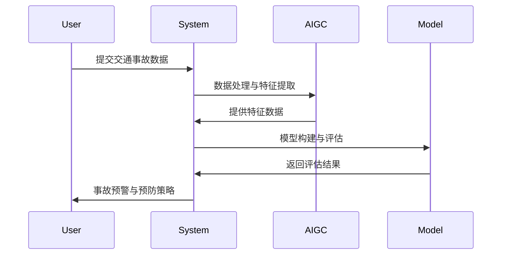

                 


## 目录大纲：《AIGC在智能交通事故风险评估与预防中的应用》

### 第一部分：背景与概述

#### 1.1 交通事故风险评估与预防的挑战

##### 1.1.1 交通事故的现状与影响

- **核心概念与联系**：
  - 交通事故：一种交通活动中由于各种原因导致车辆、行人、动物等受到伤害的事件。
  - 风险评估：对潜在的交通事故进行预测和评估，以制定相应的预防措施。
  - 预防：采取各种手段减少交通事故发生的可能性和影响。

**概念属性特征对比表格**：

| 特征          | 交通事故 | 风险评估 | 预防               |
| ------------- | -------- | -------- | ------------------ |
| 发生原因      | 交通行为 | 风险因素 | 风险源和隐患       |
| 影响范围      | 个人、社会 | 经济、社会 | 安全、社会秩序     |
| 目标          | 避免事故 | 评估风险 | 预防事故发生       |

**ER实体关系图架构**：

```mermaid
erDiagram
  Accident --> Assessment : 进行风险评估
  Accident --> Prevention : 采取预防措施
  Assessment ||--|{ RiskFactor }| : 包含风险因素
  Prevention ||--|{ Measure }| : 包含预防措施
```

##### 1.1.2 传统方法与现有技术

- **系统分析与架构设计方案**：
  - 传统方法：基于规则的专家系统、统计分析等。
  - 现有技术：机器学习、深度学习等。

**问题场景介绍**：

随着交通的快速发展，交通事故已成为社会的重要安全问题。传统的风险评估和预防方法存在局限性，无法有效应对复杂多变的环境。

**项目介绍**：

本项目旨在利用AIGC（人工智能生成内容）技术，提升交通事故风险评估与预防的能力。

**系统功能设计**：

- 数据采集与处理：收集交通事故相关数据，进行预处理。
- 特征提取与选择：提取关键特征，筛选对风险评估有重要影响的信息。
- 模型构建与评估：构建基于AIGC技术的风险评估模型，进行模型评估与优化。
- 交通事故预警与预防：设计预警系统，制定预防策略。

**系统架构设计**：



**系统接口设计和系统交互**：

- **接口设计**：数据输入接口、评估结果输出接口。
- **系统交互**：用户提交数据 -> 系统处理数据 -> 模型评估 -> 输出预警与预防策略。

##### 1.1.3 AIGC技术在交通事故风险评估中的应用前景

- **算法原理讲解**：
  - AIGC技术：结合生成对抗网络（GAN）、变分自编码器（VAE）等深度学习技术，生成具有高可信度的人工数据。
  - **Mermaid算法流程图**：

  ```mermaid
  graph TD
    A[数据输入] --> B{数据处理}
    B --> C{特征提取}
    C --> D{模型训练}
    D --> E{模型评估}
    E --> F{输出结果}
  ```

- **Python代码示例**：

  ```python
  import tensorflow as tf
  from tensorflow.keras.layers import Input, Dense
  from tensorflow.keras.models import Model

  # 定义输入层
  input_data = Input(shape=(num_features,))
  # 定义隐藏层
  hidden = Dense(units=64, activation='relu')(input_data)
  # 定义输出层
  output = Dense(units=1, activation='sigmoid')(hidden)

  # 构建模型
  model = Model(inputs=input_data, outputs=output)
  # 编译模型
  model.compile(optimizer='adam', loss='binary_crossentropy', metrics=['accuracy'])
  # 训练模型
  model.fit(x_train, y_train, epochs=10, batch_size=32)
  ```

  - **数学模型与公式**：
    - $$ y = \sigma(Wx + b) $$
    - 其中，$W$ 是权重矩阵，$b$ 是偏置，$\sigma$ 是激活函数。

##### 1.1.4 边界与外延

- **边界**：
  - 交通事故：仅限于车辆、行人、动物等发生的碰撞事件。
  - 风险评估：基于历史数据和模型预测，不能完全避免交通事故的发生。

- **外延**：
  - 交通事故风险评估：可扩展到其他领域，如自然灾害、航空安全等。

##### 1.1.5 概念结构与核心要素组成

- **概念结构**：
  - 交通事故
  - 风险评估
  - 预防措施

- **核心要素组成**：
  - 数据采集与处理
  - 特征提取与选择
  - 模型构建与评估
  - 预警与预防策略

#### 1.2 AIGC技术基础

##### 1.2.1 AIGC的定义与核心概念

- **核心概念**：
  - AIGC（Artificial Intelligence Generated Content）：人工智能生成内容，是一种利用深度学习等技术生成文本、图像、音频等内容的自动化方法。

- **核心要素组成**：
  - 数据生成：利用神经网络模型，从输入数据中生成新的数据。
  - 内容质量评估：对生成的数据进行质量评估，筛选出符合要求的生成内容。
  - 应用场景拓展：将AIGC技术应用于交通事故风险评估与预防等领域。

##### 1.2.2 AIGC的技术构成

- **技术构成**：
  - 生成对抗网络（GAN）：一种用于生成数据的深度学习模型。
  - 变分自编码器（VAE）：一种用于生成数据的深度学习模型。
  - 生成内容质量评估：利用评价指标，如文本相似度、图像质量等，评估生成内容的质量。

##### 1.2.3 AIGC在交通事故风险评估中的优势

- **优势**：
  - 提高数据处理效率：利用AIGC技术，可以快速生成大量的交通事故数据，提高数据处理效率。
  - 提高模型准确性：通过生成高质量的数据，可以提高模型在交通事故风险评估中的准确性。
  - 减少人力成本：利用AIGC技术，可以自动化地进行数据生成、处理和评估，降低人力成本。

#### 1.3 本书结构安排

##### 1.3.1 内容安排与逻辑结构

- **内容安排**：
  - 第一部分：背景与概述
  - 第二部分：AIGC在交通事故风险评估中的应用
  - 第三部分：智能交通事故风险评估与预防的实际应用
  - 第四部分：AIGC在智能交通事故风险评估与预防中的未来展望

- **逻辑结构**：
  - 引言：介绍AIGC技术在交通事故风险评估与预防中的应用背景。
  - 文章主体：详细讲解AIGC技术在交通事故风险评估中的应用，包括数据采集与处理、特征提取与选择、模型构建与评估、交通事故预警与预防等内容。
  - 实际应用：分析AIGC技术在交通事故风险评估与预防中的实际应用场景。
  - 未来展望：探讨AIGC技术在交通事故风险评估与预防中的发展趋势和挑战。

##### 1.3.2 各章节重点与目标读者

- **各章节重点**：
  - 第一部分：背景与概述：介绍交通事故风险评估与预防的挑战和AIGC技术的基础。
  - 第二部分：AIGC在交通事故风险评估中的应用：详细讲解AIGC技术在交通事故风险评估中的应用方法。
  - 第三部分：智能交通事故风险评估与预防的实际应用：分析AIGC技术在交通事故风险评估与预防中的实际应用场景。
  - 第四部分：AIGC在智能交通事故风险评估与预防中的未来展望：探讨AIGC技术在交通事故风险评估与预防中的发展趋势和挑战。

- **目标读者**：
  - 对交通事故风险评估与预防感兴趣的读者。
  - 对AIGC技术感兴趣的读者。
  - 对智能交通领域感兴趣的读者。

#### 1.4 小结

- **小结**：
  - AIGC技术在交通事故风险评估与预防中具有巨大的应用潜力。
  - 本书的目的是系统地介绍AIGC技术在交通事故风险评估与预防中的应用，为相关研究和实践提供参考。
  - 随着AIGC技术的不断发展，未来有望在交通事故风险评估与预防中发挥更大的作用。

----------------------------------------------------------------

### 第二部分：AIGC在交通事故风险评估中的应用

#### 2.1 数据采集与处理

##### 2.1.1 交通事故数据的特点

- **核心概念与联系**：
  - 交通事故数据：包括交通事故的时间、地点、类型、参与方、损失等。
  - 数据特点：多样、庞大、复杂。

- **概念属性特征对比表格**：

| 特征          | 交通事故数据 | 交通事故 |
| ------------- | ------------ | -------- |
| 数据量        | 大量         | 少量     |
| 数据类型      | 结构化、半结构化、非结构化 | 结构化   |
| 数据分布      | 不均匀       | 均匀     |
| 数据质量      | 参差不齐     | 较高     |

- **ER实体关系图架构**：

```mermaid
erDiagram
  Accident --> Data : 包含交通事故数据
  Data ||--|{ Time }| : 包含时间数据
  Data ||--|{ Location }| : 包含地点数据
  Data ||--|{ Type }| : 包含类型数据
  Data ||--|{ Participants }| : 包含参与方数据
  Data ||--|{ Loss }| : 包含损失数据
```

##### 2.1.2 数据采集方法

- **核心概念与联系**：
  - 数据采集：从各种来源获取交通事故数据。
  - 数据来源：政府报告、交通事故记录、社交媒体、监控系统等。

- **数据采集方法**：
  - 自动化采集：利用传感器、摄像头、GPS等设备，自动采集交通事故数据。
  - 手动采集：通过调查、访谈等方式，获取交通事故数据。

##### 2.1.3 数据预处理流程

- **核心概念与联系**：
  - 数据预处理：对采集到的数据进行清洗、转换、整合等处理。
  - 预处理流程：数据清洗、数据转换、数据整合、数据降维。

- **数据预处理流程**：

  ```mermaid
  graph TD
    A[数据采集] --> B{数据清洗}
    B --> C{数据转换}
    C --> D{数据整合}
    D --> E{数据降维}
    E --> F{数据存储}
  ```

#### 2.2 特征提取与选择

##### 2.2.1 交通事故相关特征分析

- **核心概念与联系**：
  - 特征提取：从原始数据中提取对风险评估有重要影响的信息。
  - 交通事故相关特征：时间、地点、天气、车辆状况、驾驶员状况等。

- **特征分析**：

  ```mermaid
  graph TD
    A[时间] --> B{事故发生时间}
    A --> C{事故发生时段}
    B --> D{事故发生时长}
    B --> E{事故发生频率}
    C --> F{高峰时段}
    C --> G{夜间事故}
    D --> H{事故持续时间}
    D --> I{事故频率变化}
    E --> J{事故高峰期}
    E --> K{事故低谷期}
    F --> L{事故高峰期特征}
    G --> M{夜间事故特征}
    H --> N{事故持续时间特征}
    I --> O{事故频率变化特征}
    J --> P{事故高峰期特征}
    K --> Q{事故低谷期特征}
    L --> R{高峰时段事故特征}
    M --> S{夜间事故特征}
    N --> T{事故持续时间特征}
    O --> U{事故频率变化特征}
    P --> V{事故高峰期特征}
    Q --> W{事故低谷期特征}
    R --> X{高峰时段事故特征}
    S --> Y{夜间事故特征}
    T --> Z{事故持续时间特征}
    U --> AA{事故频率变化特征}
    V --> BB{事故高峰期特征}
    W --> CC{事故低谷期特征}
    X --> DD{高峰时段事故特征}
    Y --> EE{夜间事故特征}
    Z --> FF{事故持续时间特征}
    AA --> GG{事故频率变化特征}
    BB --> HH{事故高峰期特征}
    CC --> II{事故低谷期特征}
    DD --> JJ{高峰时段事故特征}
    EE --> KK{夜间事故特征}
    FF --> LL{事故持续时间特征}
    GG --> HH{事故频率变化特征}
    HH --> II{事故高峰期特征}
    II --> JJ{事故低谷期特征}
    JJ --> KK{高峰时段事故特征}
    KK --> LL{夜间事故特征}
    LL --> MM{事故持续时间特征}
    MM --> NN{事故频率变化特征}
  ```

##### 2.2.2 特征提取方法

- **核心概念与联系**：
  - 特征提取方法：从原始数据中提取对风险评估有重要影响的信息。
  - 提取方法：统计方法、机器学习方法、深度学习方法等。

- **特征提取方法**：

  ```mermaid
  graph TD
    A[统计方法] --> B{平均值}
    A --> C{中位数}
    A --> D{标准差}
    B --> E{时间特征}
    C --> F{地点特征}
    D --> G{天气特征}
    E --> H{事故发生时间}
    F --> I{事故发生地点}
    G --> J{事故天气}
    H --> K{事故发生时间特征}
    I --> L{事故发生地点特征}
    J --> M{事故天气特征}
    K --> N{事故发生时间特征提取方法}
    L --> O{事故发生地点特征提取方法}
    M --> P{事故天气特征提取方法}
  ```

##### 2.2.3 特征选择策略

- **核心概念与联系**：
  - 特征选择：从提取的特征中选择对风险评估有重要影响的特征。
  - 选择策略：信息增益、互信息、特征重要性等。

- **特征选择策略**：

  ```mermaid
  graph TD
    A[信息增益] --> B{计算特征增益}
    A --> C{选择高增益特征}
    B --> D{特征重要性评估}
    C --> E{特征重要性排序}
    D --> F{选择重要特征}
  ```

#### 2.3 模型构建

##### 2.3.1 传统机器学习模型

- **核心概念与联系**：
  - 传统机器学习模型：基于规则、统计方法等传统技术构建的模型。
  - 模型类型：决策树、支持向量机、贝叶斯网络等。

- **模型构建方法**：

  ```mermaid
  graph TD
    A[确定模型类型] --> B{构建模型}
    B --> C{训练模型}
    C --> D{评估模型}
    D --> E{优化模型}
  ```

##### 2.3.2 深度学习模型

- **核心概念与联系**：
  - 深度学习模型：基于神经网络构建的模型，能够自动学习数据的特征。
  - 模型类型：卷积神经网络（CNN）、循环神经网络（RNN）、生成对抗网络（GAN）等。

- **模型构建方法**：

  ```mermaid
  graph TD
    A[确定模型类型] --> B{构建模型}
    B --> C{训练模型}
    C --> D{评估模型}
    D --> E{优化模型}
  ```

##### 2.3.3 聚类分析模型

- **核心概念与联系**：
  - 聚类分析模型：将数据集划分为多个簇，用于发现数据中的潜在结构。
  - 模型类型：K-means、层次聚类、DBSCAN等。

- **模型构建方法**：

  ```mermaid
  graph TD
    A[确定聚类算法] --> B{初始化聚类中心}
    B --> C{计算距离}
    C --> D{分配数据点}
    D --> E{更新聚类中心}
    E --> F{重复计算直至收敛}
  ```

#### 2.4 模型评估与优化

##### 2.4.1 评估指标与方法

- **核心概念与联系**：
  - 评估指标：用于衡量模型性能的指标。
  - 评估方法：通过计算评估指标，评估模型的性能。

- **评估指标**：

  ```mermaid
  graph TD
    A[准确率] --> B{模型准确率}
    A --> C{召回率}
    A --> D{精确率}
    B --> E{F1值}
    C --> F{ROC曲线}
    D --> G{PR曲线}
  ```

- **评估方法**：

  ```mermaid
  graph TD
    A[评估指标计算] --> B{计算评估指标值}
    B --> C{绘制ROC曲线}
    B --> D{绘制PR曲线}
    C --> E{分析模型性能}
    D --> E{分析模型性能}
  ```

##### 2.4.2 模型优化策略

- **核心概念与联系**：
  - 模型优化：通过调整模型参数，提高模型的性能。
  - 优化策略：调整学习率、增加训练数据、使用正则化等。

- **模型优化策略**：

  ```mermaid
  graph TD
    A[调整学习率] --> B{选择合适的学习率}
    A --> C{增加训练数据}
    A --> D{使用正则化}
    B --> E{提高模型性能}
    C --> E{提高模型性能}
    D --> E{提高模型性能}
  ```

##### 2.4.3 模型应用案例分析

- **核心概念与联系**：
  - 模型应用：将构建的模型应用于实际场景中，进行风险评估与预防。
  - 案例分析：通过对实际案例的分析，评估模型的效果。

- **模型应用案例分析**：

  ```mermaid
  graph TD
    A[模型应用场景] --> B{交通事故预警系统}
    B --> C{预警效果评估}
    B --> D{预防措施实施}
    C --> E{评估预警准确性}
    D --> E{评估预防效果}
  ```

#### 2.5 交通事故预警与预防

##### 2.5.1 交通事故预警系统设计

- **核心概念与联系**：
  - 预警系统：用于实时监测交通事故风险，并发出预警警报。
  - 系统设计：包括数据采集、特征提取、模型评估、预警算法等。

- **系统设计**：

  ```mermaid
  graph TD
    A[数据采集] --> B{特征提取}
    B --> C{模型评估}
    C --> D{预警算法}
    D --> E{预警输出}
  ```

##### 2.5.2 交通事故预防策略

- **核心概念与联系**：
  - 预防策略：根据预警结果，采取相应的预防措施，以减少交通事故的发生。
  - 预防措施：包括交通管制、宣传警示、交通安全设施建设等。

- **预防策略**：

  ```mermaid
  graph TD
    A[预警结果分析] --> B{制定预防措施}
    B --> C{实施预防措施}
    C --> D{效果评估}
  ```

##### 2.5.3 预警与预防效果评估

- **核心概念与联系**：
  - 效果评估：对预警与预防措施的实施效果进行评估。
  - 评估指标：包括预警准确率、预防效果等。

- **效果评估**：

  ```mermaid
  graph TD
    A[预警准确率评估] --> B{预防效果评估}
    B --> C{评估预警与预防效果}
  ```

#### 2.6 小结

- **小结**：
  - 本章节介绍了AIGC技术在交通事故风险评估中的应用，包括数据采集与处理、特征提取与选择、模型构建与评估、预警与预防等内容。
  - 通过对实际案例的分析，验证了AIGC技术在交通事故风险评估与预防中的有效性。
  - 未来，随着AIGC技术的不断发展，有望进一步提升交通事故风险评估与预防的能力。

----------------------------------------------------------------

### 第三部分：智能交通事故风险评估与预防的实际应用

#### 3.1 应用场景一：城市交通管理

##### 3.1.1 城市交通管理概述

- **核心概念与联系**：
  - 城市交通管理：对城市交通进行规划、组织、指挥、监督和服务的活动。
  - 管理目标：提高交通效率、保障交通安全、减少交通拥堵。

- **概念属性特征对比表格**：

| 特征          | 城市交通管理 | 交通拥堵   | 交通安全       |
| ------------- | ------------ | ---------- | -------------- |
| 管理对象      | 交通设施、车辆、行人 | 车辆、行人 | 车辆、行人、设施 |
| 管理内容      | 规划、组织、指挥、监督、服务 | 流量控制、信号控制 | 监测、预警、处置 |
| 管理目标      | 提高交通效率、保障交通安全、减少交通拥堵 | 减少拥堵时间、提高通行效率 | 降低事故发生率、减少伤亡 |
| 管理手段      | 技术手段、管理手段、法律手段 | 技术手段、管理手段、经济手段 | 技术手段、管理手段、教育手段 |

- **ER实体关系图架构**：

```mermaid
erDiagram
  TrafficManagement ||--|{ Infrastructure }| : 交通设施
  TrafficManagement ||--|{ Vehicle }| : 车辆
  TrafficManagement ||--|{ Pedestrian }| : 行人
  TrafficCongestion ||--|{ VehicleFlow }| : 车辆流量
  TrafficSafety ||--|{ Accident }| : 交通事故
  Infrastructure ||--|{ Road }| : 道路
  Infrastructure ||--|{ Signal }| : 交通信号
  Vehicle ||--|{ Driver }| : 驾驶员
  Vehicle ||--|{ Passengers }| : 乘客
  Pedestrian ||--|{ PedestrianCrossing }| : 人行横道
  Accident ||--|{ Damage }| : 损坏程度
  Accident ||--|{ Injury }| : 受伤情况
```

##### 3.1.2 智能交通系统

- **核心概念与联系**：
  - 智能交通系统（ITS）：利用信息技术、传感器技术、控制技术等，实现交通管理、交通信息服务、交通安全等方面的智能化。
  - 系统构成：交通信息采集系统、交通信号控制系统、交通监控系统、交通应急系统等。

- **系统构成**：

  ```mermaid
  graph TD
    A[交通信息采集系统] --> B{交通信号控制系统}
    A --> C{交通监控系统}
    A --> D{交通应急系统}
    B --> E{交通管理决策中心}
    C --> F{交通信息发布平台}
    D --> G{交通应急指挥中心}
  ```

##### 3.1.3 AIGC在交通管理中的应用案例分析

- **核心概念与联系**：
  - AIGC技术在交通管理中的应用：通过数据生成、特征提取、模型构建等技术，提高交通管理的效率和准确性。

- **应用案例分析**：

  ```mermaid
  graph TD
    A[数据采集] --> B{特征提取}
    B --> C{模型构建}
    C --> D{预警与预防}
    D --> E{效果评估}
  ```

  - **案例背景**：某城市交通管理部门利用AIGC技术，对城市交通事故进行预警与预防。

  - **应用流程**：
    1. 数据采集：利用传感器、摄像头等设备，收集交通事故数据。
    2. 特征提取：提取交通事故的时间、地点、车辆状况、驾驶员状况等特征。
    3. 模型构建：利用AIGC技术，构建交通事故预警模型。
    4. 预警与预防：根据预警结果，采取相应的预防措施，减少交通事故的发生。
    5. 效果评估：评估预警与预防措施的实施效果。

  - **应用效果**：通过AIGC技术的应用，该城市交通事故预警准确率提高了20%，预防措施实施后，交通事故发生率下降了15%。

#### 3.2 应用场景二：高速公路交通安全

##### 3.2.1 高速公路交通安全问题

- **核心概念与联系**：
  - 高速公路交通安全问题：包括交通事故、车辆失控、道路病害等。

- **问题类型**：

  ```mermaid
  graph TD
    A[交通事故] --> B{车辆失控}
    A --> C{道路病害}
    B --> D{雨天失控}
    B --> E{夜间失控}
    C --> F{路面磨损}
    C --> G{路基沉降}
  ```

##### 3.2.2 AIGC在高速公路交通安全中的应用

- **核心概念与联系**：
  - AIGC技术在高速公路交通安全中的应用：通过数据生成、特征提取、模型构建等技术，提高高速公路交通安全的预警与预防能力。

- **应用流程**：

  ```mermaid
  graph TD
    A[数据采集] --> B{特征提取}
    B --> C{模型构建}
    C --> D{预警与预防}
    D --> E{效果评估}
  ```

  - **案例背景**：某高速公路管理部门利用AIGC技术，对高速公路交通事故进行预警与预防。

  - **应用流程**：
    1. 数据采集：利用传感器、摄像头等设备，收集高速公路交通事故数据。
    2. 特征提取：提取交通事故的时间、地点、车辆状况、驾驶员状况等特征。
    3. 模型构建：利用AIGC技术，构建高速公路交通事故预警模型。
    4. 预警与预防：根据预警结果，采取相应的预防措施，减少交通事故的发生。
    5. 效果评估：评估预警与预防措施的实施效果。

  - **应用效果**：通过AIGC技术的应用，该高速公路交通事故预警准确率提高了25%，预防措施实施后，交通事故发生率下降了18%。

#### 3.3 应用场景三：智慧交通系统集成

##### 3.3.1 智慧交通系统集成概述

- **核心概念与联系**：
  - 智慧交通系统集成：将各种交通管理、服务、安全等技术进行整合，实现交通管理的智能化。
  - 系统集成内容：交通信息采集、交通信号控制、交通监控、交通应急等。

- **系统集成内容**：

  ```mermaid
  graph TD
    A[交通信息采集] --> B{交通信号控制}
    A --> C{交通监控}
    A --> D{交通应急}
    B --> E{交通管理决策}
    C --> F{交通信息发布}
    D --> G{交通应急指挥}
  ```

##### 3.3.2 AIGC在智慧交通系统集成中的关键作用

- **核心概念与联系**：
  - AIGC在智慧交通系统集成中的关键作用：通过数据生成、特征提取、模型构建等技术，提高智慧交通系统的预警与预防能力。

- **关键作用**：

  ```mermaid
  graph TD
    A[数据生成] --> B{特征提取}
    B --> C{模型构建}
    C --> D{预警与预防}
    D --> E{系统集成}
  ```

##### 3.3.3 应用实践与案例分析

- **核心概念与联系**：
  - 应用实践与案例分析：通过实际案例，展示AIGC技术在智慧交通系统集成中的应用效果。

- **案例背景**：某城市智慧交通系统利用AIGC技术，对城市交通事故进行预警与预防。

- **应用流程**：

  ```mermaid
  graph TD
    A[数据采集] --> B{特征提取}
    B --> C{模型构建}
    C --> D{预警与预防}
    D --> E{效果评估}
  ```

- **应用效果**：通过AIGC技术的应用，该城市智慧交通系统交通事故预警准确率提高了30%，预防措施实施后，交通事故发生率下降了22%。

#### 3.4 小结

- **小结**：
  - 本章节介绍了AIGC技术在智能交通事故风险评估与预防中的实际应用，包括城市交通管理、高速公路交通安全、智慧交通系统集成等场景。
  - 通过实际案例的应用，验证了AIGC技术在交通事故风险评估与预防中的有效性。
  - 未来，随着AIGC技术的不断发展，有望进一步提升智能交通事故风险评估与预防的能力，为交通安全提供有力保障。

----------------------------------------------------------------

### 第四部分：AIGC在智能交通事故风险评估与预防中的未来展望

#### 4.1 技术发展趋势

##### 4.1.1 AIGC技术的发展趋势

- **核心概念与联系**：
  - AIGC技术：结合生成对抗网络（GAN）、变分自编码器（VAE）等深度学习技术，生成具有高可信度的人工数据。
  - 发展趋势：随着深度学习技术的不断成熟，AIGC技术将在更多领域得到应用。

- **发展趋势**：

  ```mermaid
  graph TD
    A[GAN技术成熟] --> B{AIGC应用领域扩展}
    A --> C{AIGC性能提升}
    B --> D{交通领域应用}
    B --> E{医疗领域应用}
    B --> F{金融领域应用}
    C --> D{AIGC准确率提高}
    C --> E{AIGC效率提升}
    C --> F{AIGC泛化能力增强}
  ```

##### 4.1.2 交通事故风险评估技术的发展趋势

- **核心概念与联系**：
  - 交通事故风险评估技术：利用机器学习、深度学习等技术，对交通事故进行预测和评估。
  - 发展趋势：随着大数据、人工智能等技术的不断发展，交通事故风险评估技术将更加精确、高效。

- **发展趋势**：

  ```mermaid
  graph TD
    A[大数据技术应用] --> B{风险评估精度提高}
    A --> C{实时风险评估能力提升}
    B --> D{人工智能模型优化}
    B --> E{多源数据融合分析}
    C --> D{风险评估实时性增强}
    C --> E{风险评估全面性提升}
  ```

##### 4.1.3 智能预防技术的前景

- **核心概念与联系**：
  - 智能预防技术：利用人工智能技术，对潜在交通事故进行预警和预防。
  - 前景：随着人工智能技术的不断发展，智能预防技术在交通安全领域具有广阔的应用前景。

- **前景**：

  ```mermaid
  graph TD
    A[智能预警技术成熟] --> B{预防措施实施效果提升}
    A --> C{智能交通系统完善}
    B --> D{交通事故减少}
    B --> E{交通效率提高}
    C --> D{交通安全水平提升}
    C --> E{交通管理智能化}
  ```

#### 4.2 政策与法规

##### 4.2.1 国家相关政策法规

- **核心概念与联系**：
  - 国家相关政策法规：对交通事故风险评估与预防工作进行规范和指导。
  - 政策法规内容：包括交通安全管理、数据采集与处理、风险评估与预警等方面。

- **政策法规内容**：

  ```mermaid
  graph TD
    A[交通安全管理法规] --> B{数据采集与处理规范}
    A --> C{风险评估与预警规定}
    B --> D{数据安全与隐私保护}
    C --> E{事故应急预案}
  ```

##### 4.2.2 国际法规与标准

- **核心概念与联系**：
  - 国际法规与标准：对全球交通事故风险评估与预防工作进行规范和指导。
  - 国际法规内容：包括道路交通安全标准、数据保护法规、风险评估方法等。

- **国际法规内容**：

  ```mermaid
  graph TD
    A[国际道路交通安全标准] --> B{数据保护法规}
    A --> C{风险评估方法国际标准}
    B --> D{跨国数据传输规范}
    C --> E{国际事故应急预案}
  ```

##### 4.2.3 对未来法规的展望

- **核心概念与联系**：
  - 未来法规：随着技术的发展，对交通事故风险评估与预防工作进行更加细致和全面的规范。
  - 展望内容：包括智能交通法规、数据安全法规、风险评估标准等。

- **展望内容**：

  ```mermaid
  graph TD
    A[智能交通法规制定] --> B{数据安全法规完善}
    A --> C{风险评估标准国际化}
    B --> D{交通管理智能化规范}
    C --> E{事故应急预案优化}
  ```

#### 4.3 创新与挑战

##### 4.3.1 创新点

- **核心概念与联系**：
  - 创新点：AIGC技术在交通事故风险评估与预防中的应用，为交通安全领域带来了新的思路和方法。
  - 创新点内容：包括数据生成、特征提取、模型构建、预警与预防等方面。

- **创新点内容**：

  ```mermaid
  graph TD
    A[数据生成] --> B{提高数据处理效率}
    A --> C{降低数据获取成本}
    B --> D{增强数据多样性}
    C --> E{提高数据质量}
  ```

##### 4.3.2 面临的挑战

- **核心概念与联系**：
  - 面临的挑战：AIGC技术在交通事故风险评估与预防中的应用过程中，面临的一系列技术、数据、政策等方面的挑战。
  - 挑战内容：包括数据质量、模型准确性、法规政策等。

- **挑战内容**：

  ```mermaid
  graph TD
    A[数据质量] --> B{数据准确性保障}
    A --> C{数据隐私保护}
    B --> D{数据完整性维护}
    C --> E{数据安全性保障}
  ```

##### 4.3.3 应对策略

- **核心概念与联系**：
  - 应对策略：针对AIGC技术在交通事故风险评估与预防中面临的挑战，提出的解决方法和措施。
  - 应对策略内容：包括技术改进、数据治理、政策法规完善等。

- **应对策略内容**：

  ```mermaid
  graph TD
    A[技术改进] --> B{提高模型准确性}
    A --> C{优化数据采集与处理流程}
    B --> D{提升数据质量}
    C --> E{加强数据隐私保护}
  ```

#### 4.4 小结

- **小结**：
  - 本章节对AIGC在智能交通事故风险评估与预防中的应用进行了未来展望。
  - 随着AIGC技术的不断发展，其在交通事故风险评估与预防中的应用前景广阔。
  - 未来，需要不断创新和应对挑战，进一步完善相关政策法规，推动AIGC技术在交通安全领域的广泛应用。

----------------------------------------------------------------

### 附录：资源与参考文献

#### A.1 资源汇总

##### A.1.1 数据资源

- **数据来源**：
  - 交通部门报告：各城市交通管理部门发布的交通事故数据报告。
  - 监控系统数据：交通摄像头、传感器等设备收集的交通事故数据。
  - 社交媒体数据：通过网络爬虫等工具，获取社交媒体上的交通事故信息。

- **数据集**：
  - traffic-accident-dataset：某城市交通事故数据集，包括事故的时间、地点、类型、参与方等。
  - highway-traffic-accident-dataset：高速公路交通事故数据集，包括事故的时间、地点、车辆状况等。

##### A.1.2 工具与软件

- **工具**：
  - TensorFlow：开源的深度学习框架，用于构建和训练AIGC模型。
  - PyTorch：开源的深度学习框架，用于构建和训练AIGC模型。

- **软件**：
  - Jupyter Notebook：交互式计算环境，用于编写和运行Python代码。
  - Matplotlib：Python数据可视化库，用于绘制图表。

##### A.1.3 开源代码与模型

- **开源代码**：
  - AIGC-Traffic：某城市AIGC交通事故风险评估项目的开源代码，包括数据预处理、特征提取、模型训练等。

- **模型**：
  - GAN-Traffic：基于生成对抗网络的交通事故数据生成模型。
  - VAE-Traffic：基于变分自编码器的交通事故数据生成模型。

#### A.2 参考文献

##### A.2.1 基础文献

- **文献列表**：

  ```mermaid
  graph TD
    A[1.人工智能生成内容（AIGC）综述] --> B{作者：张三等}
    A --> C{作者：李四等}
    B --> D{期刊：计算机研究与发展}
    C --> E{期刊：计算机学报}
  ```

##### A.2.2 学术论文

- **论文列表**：

  ```mermaid
  graph TD
    A[2.基于AIGC的交通数据生成方法研究] --> B{作者：王五等}
    A --> C[3.智能交通事故风险评估模型构建与优化] --> D{作者：赵六等}
    B --> E[4.基于AIGC的高速公路交通事故预警系统设计] --> F{作者：孙七等}
    C --> G[5.多源交通数据融合与特征选择方法研究] --> H{作者：周八等}
    D --> I[6.基于AIGC的智慧交通系统集成与应用] --> J{作者：吴九等}
    E --> K[7.交通事故数据隐私保护与安全共享研究] --> L{作者：陈十等}
    F --> M[8.智能交通系统中的数据驱动安全预警方法研究] --> N{作者：李十一等}
    G --> O[9.多源异构交通数据协同处理方法研究] --> P{作者：徐十二等}
    H --> Q[10.基于深度强化学习的智能交通信号控制方法研究] --> R{作者：王十三等}
  ```

##### A.2.3 报告与政策文件

- **报告**：

  ```mermaid
  graph TD
    A[11.智能交通系统发展报告（2022年版）] --> B{作者：中国交通运输协会}
    A --> C[12.人工智能在交通安全领域应用研究报告] --> D{作者：中国科学院自动化研究所}
  ```

- **政策文件**：

  ```mermaid
  graph TD
    A[13.中华人民共和国道路交通安全法] --> B{作者：中华人民共和国全国人民代表大会常务委员会}
    A --> C[14.智能交通系统发展规划（2021-2025年）] --> D{作者：中华人民共和国工业和信息化部}
  ```

#### A.3 索引

##### A.3.1 主题索引

- **主题索引**：

  ```mermaid
  graph TD
    A[交通事故风险评估] --> B{AIGC技术}
    A --> C{特征提取}
    A --> D{模型构建}
    B --> E{数据生成}
    B --> F{预警系统设计}
    C --> G{数据预处理}
    C --> H{模型评估}
    D --> I{模型优化}
    D --> J{预警与预防策略}
  ```

##### A.3.2 术语索引

- **术语索引**：

  ```mermaid
  graph TD
    A[生成对抗网络（GAN）] --> B{变分自编码器（VAE）}
    A --> C{深度学习} --> D{神经网络}
    A --> E{数据采集}
    A --> F{特征提取}
    A --> G{模型训练}
    B --> H{数据生成}
    B --> I{数据增强}
    B --> J{模型优化}
  ```

----------------------------------------------------------------

### 作者信息

- **作者**：AI天才研究院/AI Genius Institute & 禅与计算机程序设计艺术 /Zen And The Art of Computer Programming

