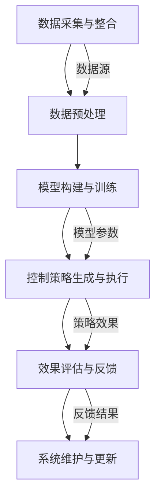

                 

# 《AIGC在智能供应链优化中的应用》

> 关键词：AIGC、智能供应链、优化、应用案例、技术实现、挑战与未来

> 摘要：本文旨在探讨AIGC（自适应智能生成控制）在智能供应链优化中的应用。首先，我们将介绍AIGC和智能供应链的背景及基本概念，然后详细分析AIGC在供应链优化中的核心应用，如需求预测、库存管理和物流优化。随后，我们将通过实际案例展示AIGC在智能供应链优化中的技术实现和挑战，最后，我们将对未来的发展趋势进行展望，并提供一些最佳实践和注意事项。

## 第一部分：背景与基础

### 第1章：AIGC概述与智能供应链背景

#### 1.1 AIGC的概念与特点

AIGC（自适应智能生成控制）是一种基于人工智能的自适应控制系统，它可以自主地生成和调整控制策略，以优化目标系统的性能。AIGC的核心特点包括自适应能力、生成能力和控制能力。

1. 自适应能力：AIGC可以根据环境变化和系统状态的变化，自动调整控制策略。
2. 生成能力：AIGC可以生成新的控制策略，以应对复杂和变化的环境。
3. 控制能力：AIGC可以执行这些控制策略，实现系统的优化。

#### 1.2 智能供应链的基本概念

智能供应链是指利用现代信息技术和人工智能技术，实现供应链的自动化、智能化和高效化。智能供应链包括以下几个关键组成部分：

1. 数据采集与整合：通过物联网、传感器等技术收集供应链各环节的数据。
2. 数据分析与挖掘：利用数据挖掘技术，从海量数据中提取有价值的信息。
3. 优化算法：利用人工智能算法，对供应链各环节进行优化。
4. 决策支持系统：为供应链管理提供智能决策支持。

#### 1.3 智能供应链中的问题与挑战

智能供应链在发展过程中面临着诸多问题和挑战：

1. 数据质量：数据质量直接影响智能供应链的优化效果，如何保证数据质量是一个重要问题。
2. 数据隐私：供应链中的数据涉及企业核心机密，如何保护数据隐私是一个关键问题。
3. 算法选择：面对复杂的供应链问题，如何选择合适的算法是一个挑战。
4. 系统集成：如何将各种技术和系统进行有效集成，实现供应链的智能化是一个难点。

### 第2章：AIGC核心概念与技术原理

#### 2.1 AIGC的核心概念

AIGC的核心概念包括以下几个部分：

1. 自适应控制：根据系统状态和环境变化，自动调整控制策略。
2. 智能生成：利用人工智能技术，生成新的控制策略。
3. 控制执行：执行生成的控制策略，实现系统优化。

#### 2.2 AIGC的技术原理

AIGC的技术原理主要包括以下几个方面：

1. 数据采集与处理：通过传感器、物联网等技术收集数据，并对数据进行预处理。
2. 模型训练：利用收集到的数据，训练自适应控制模型。
3. 控制策略生成：根据模型，生成自适应控制策略。
4. 控制策略执行：执行生成的控制策略，实现系统优化。

#### 2.3 AIGC在供应链优化中的应用潜力

AIGC在供应链优化中的应用潜力主要体现在以下几个方面：

1. 需求预测：通过AIGC技术，可以更准确地预测市场需求，优化库存管理。
2. 库存优化：通过AIGC技术，可以优化库存水平，减少库存成本。
3. 物流优化：通过AIGC技术，可以优化物流路线和运输计划，提高物流效率。
4. 风险管理：通过AIGC技术，可以预测供应链风险，并采取相应的应对措施。

### 第3章：AIGC与供应链优化模型

#### 3.1 基于AIGC的供应链优化模型概述

基于AIGC的供应链优化模型是一种利用AIGC技术，对供应链各环节进行优化的一种模型。该模型主要包括以下几个部分：

1. 数据采集与整合：收集供应链各环节的数据，并进行预处理。
2. 模型训练与优化：利用收集到的数据，训练AIGC模型，并不断优化。
3. 控制策略生成与执行：根据模型，生成自适应控制策略，并执行这些策略。
4. 效果评估与反馈：评估优化效果，并根据评估结果进行反馈和调整。

#### 3.2 模型构建方法

基于AIGC的供应链优化模型的构建方法主要包括以下几个步骤：

1. 确定优化目标：明确供应链优化的目标，如需求预测准确率、库存成本等。
2. 数据收集与预处理：收集供应链各环节的数据，并进行预处理。
3. 模型选择与训练：选择合适的AIGC模型，并利用收集到的数据进行训练。
4. 控制策略生成与执行：根据模型，生成自适应控制策略，并执行这些策略。
5. 效果评估与反馈：评估优化效果，并根据评估结果进行反馈和调整。

#### 3.3 模型应用实例分析

我们以一个具体的案例来分析基于AIGC的供应链优化模型的应用。

案例：某电商公司在春节期间，需要大量备货以应对购物高峰。公司希望通过基于AIGC的供应链优化模型，预测春节期间的购物需求，并优化库存管理。

1. 数据收集与预处理：收集公司过去几年的销售数据，并进行预处理，如数据清洗、数据归一化等。
2. 模型选择与训练：选择合适的AIGC模型，如基于深度学习的时序预测模型，并利用收集到的数据对其进行训练。
3. 控制策略生成与执行：根据训练好的模型，生成自适应控制策略，如根据预测结果调整库存水平。
4. 效果评估与反馈：评估优化效果，如预测准确率和库存成本等，并根据评估结果进行反馈和调整。

通过以上案例，我们可以看到基于AIGC的供应链优化模型在需求预测和库存管理方面的应用效果。

## 第二部分：应用案例

### 第4章：AIGC在供应链需求预测中的应用

#### 4.1 需求预测的重要性

需求预测是供应链管理中至关重要的一环，准确的预测可以帮助企业合理规划库存、优化物流和降低成本。然而，传统的需求预测方法往往存在预测不准确、反应速度慢等问题。

#### 4.2 基于AIGC的需求预测模型

基于AIGC的需求预测模型利用深度学习和时序预测技术，可以更准确地预测市场需求。该模型的主要组成部分包括：

1. 数据采集与预处理：收集供应链各环节的数据，并进行预处理，如数据清洗、数据归一化等。
2. 模型构建：构建基于AIGC的需求预测模型，如使用LSTM（长短期记忆网络）进行时序预测。
3. 模型训练与优化：利用收集到的数据，对模型进行训练和优化，以提高预测准确率。
4. 预测与评估：根据训练好的模型，生成预测结果，并对预测结果进行评估。

#### 4.3 需求预测应用案例

我们以一个具体的案例来分析基于AIGC的需求预测模型的应用。

案例：某家电制造商在双十一期间需要大量备货以应对购物高峰。公司希望通过基于AIGC的需求预测模型，预测双十一期间的购物需求，并优化库存管理。

1. 数据收集与预处理：收集公司过去几年的销售数据，并进行预处理，如数据清洗、数据归一化等。
2. 模型构建与训练：构建基于AIGC的需求预测模型，如使用LSTM（长短期记忆网络）进行时序预测，并利用收集到的数据对其进行训练。
3. 预测与评估：根据训练好的模型，生成双十一期间的购物需求预测结果，并对预测结果进行评估。

通过以上案例，我们可以看到基于AIGC的需求预测模型在准确预测购物需求和优化库存管理方面的应用效果。

### 第5章：AIGC在供应链库存管理中的应用

#### 5.1 库存管理的重要性

库存管理是供应链管理中至关重要的一环，合理的库存管理可以降低库存成本、提高资金利用率。然而，传统的库存管理方法往往存在库存过高或过低、库存积压或短缺等问题。

#### 5.2 基于AIGC的库存管理模型

基于AIGC的库存管理模型利用深度学习和优化技术，可以更准确地预测库存需求，优化库存水平。该模型的主要组成部分包括：

1. 数据采集与预处理：收集供应链各环节的数据，并进行预处理，如数据清洗、数据归一化等。
2. 模型构建：构建基于AIGC的库存管理模型，如使用深度强化学习进行库存优化。
3. 模型训练与优化：利用收集到的数据，对模型进行训练和优化，以提高库存管理的准确率。
4. 库存优化与评估：根据训练好的模型，生成库存优化策略，并对优化策略进行评估。

#### 5.3 库存管理应用案例

我们以一个具体的案例来分析基于AIGC的库存管理模型的应用。

案例：某电子产品公司希望利用基于AIGC的库存管理模型，优化库存水平，降低库存成本。

1. 数据收集与预处理：收集公司过去几年的销售数据、库存数据等，并进行预处理，如数据清洗、数据归一化等。
2. 模型构建与训练：构建基于AIGC的库存管理模型，如使用深度强化学习进行库存优化，并利用收集到的数据对其进行训练。
3. 库存优化与评估：根据训练好的模型，生成库存优化策略，并对优化策略进行评估。

通过以上案例，我们可以看到基于AIGC的库存管理模型在优化库存水平和降低库存成本方面的应用效果。

### 第6章：AIGC在供应链物流优化中的应用

#### 6.1 物流优化的重要性

物流优化是供应链管理中至关重要的一环，合理的物流优化可以提高物流效率、降低物流成本。然而，传统的物流优化方法往往存在优化效果不佳、反应速度慢等问题。

#### 6.2 基于AIGC的物流优化模型

基于AIGC的物流优化模型利用深度学习和优化技术，可以更有效地进行物流路线优化和运输计划优化。该模型的主要组成部分包括：

1. 数据采集与预处理：收集供应链各环节的数据，并进行预处理，如数据清洗、数据归一化等。
2. 模型构建：构建基于AIGC的物流优化模型，如使用深度强化学习进行物流路线优化。
3. 模型训练与优化：利用收集到的数据，对模型进行训练和优化，以提高物流优化的准确率。
4. 物流优化与评估：根据训练好的模型，生成物流优化策略，并对优化策略进行评估。

#### 6.3 物流优化应用案例

我们以一个具体的案例来分析基于AIGC的物流优化模型的应用。

案例：某电商公司希望利用基于AIGC的物流优化模型，优化物流路线和运输计划，提高物流效率。

1. 数据收集与预处理：收集公司过去几年的物流数据，并进行预处理，如数据清洗、数据归一化等。
2. 模型构建与训练：构建基于AIGC的物流优化模型，如使用深度强化学习进行物流路线优化，并利用收集到的数据对其进行训练。
3. 物流优化与评估：根据训练好的模型，生成物流优化策略，并对优化策略进行评估。

通过以上案例，我们可以看到基于AIGC的物流优化模型在优化物流路线和运输计划，提高物流效率方面的应用效果。

## 第三部分：技术实现与挑战

### 第7章：AIGC在智能供应链优化中的技术实现

#### 7.1 AIGC技术实现概述

AIGC在智能供应链优化中的技术实现主要包括以下几个步骤：

1. 数据采集与处理：通过传感器、物联网等技术收集供应链各环节的数据，并进行预处理。
2. 模型构建与训练：选择合适的AIGC模型，并利用收集到的数据对其进行训练。
3. 控制策略生成与执行：根据模型，生成自适应控制策略，并执行这些策略。
4. 效果评估与反馈：评估优化效果，并根据评估结果进行反馈和调整。

#### 7.2 数据预处理

数据预处理是AIGC技术实现的重要环节，主要包括以下几个步骤：

1. 数据清洗：去除噪声数据、异常数据和重复数据。
2. 数据归一化：将不同量纲的数据进行归一化处理，使其具有相同的量纲。
3. 特征提取：从原始数据中提取对模型训练有价值的特征。

#### 7.3 模型训练与优化

模型训练与优化是AIGC技术实现的核心环节，主要包括以下几个步骤：

1. 模型选择：根据供应链优化的需求，选择合适的AIGC模型。
2. 模型训练：利用收集到的数据，对模型进行训练。
3. 模型优化：通过调整模型参数，提高模型性能。

### 第8章：AIGC在智能供应链优化中的挑战与应对策略

#### 8.1 技术挑战

AIGC在智能供应链优化中面临以下技术挑战：

1. 数据质量：数据质量直接影响AIGC模型的性能，如何保证数据质量是一个挑战。
2. 模型选择：选择合适的AIGC模型是一个挑战，不同的供应链问题可能需要不同的模型。
3. 模型优化：如何优化AIGC模型，提高其性能，是一个挑战。

#### 8.2 数据挑战

AIGC在智能供应链优化中面临以下数据挑战：

1. 数据量：供应链数据量巨大，如何处理海量数据是一个挑战。
2. 数据一致性：不同来源的数据可能存在不一致性，如何保证数据一致性是一个挑战。
3. 数据隐私：如何保护数据隐私是一个挑战。

#### 8.3 应用挑战

AIGC在智能供应链优化中面临以下应用挑战：

1. 系统集成：如何将AIGC技术与其他供应链管理系统进行集成，是一个挑战。
2. 系统维护：如何维护和更新AIGC系统，使其持续优化供应链性能，是一个挑战。
3. 人员培训：如何培养和培训供应链管理人员，使其能够有效利用AIGC技术，是一个挑战。

#### 8.4 应对策略与未来趋势

针对上述挑战，我们可以采取以下应对策略：

1. 数据质量保障：建立数据质量监测和评估机制，确保数据质量。
2. 模型选择与优化：根据供应链问题的特点，选择合适的AIGC模型，并不断优化。
3. 系统集成与维护：采用模块化设计，确保系统的可维护性和可扩展性。
4. 人员培训与培养：建立专业的AIGC团队，提供定期的培训和学习机会。

未来，随着人工智能技术的不断发展，AIGC在智能供应链优化中的应用前景将更加广阔。我们可以预见到以下趋势：

1. AIGC技术的进一步优化和升级，使其在更复杂的供应链问题中发挥更大的作用。
2. AIGC与其他新兴技术的融合，如区块链、5G等，将进一步提升供应链的智能化水平。
3. AIGC在供应链优化中的应用场景将更加多样化，从单一环节的优化扩展到整个供应链的全面优化。

### 第9章：最佳实践与未来展望

#### 9.1 AIGC在供应链优化中的最佳实践

1. 数据整合与清洗：确保数据的一致性和准确性，为AIGC模型提供高质量的数据支持。
2. 模型选择与优化：根据供应链问题的特点，选择合适的AIGC模型，并进行持续优化。
3. 系统集成与维护：采用模块化设计，确保系统的可维护性和可扩展性。
4. 人员培训与培养：建立专业的AIGC团队，提供定期的培训和学习机会。

#### 9.2 未来发展趋势与展望

1. AIGC技术的进一步优化和升级，使其在更复杂的供应链问题中发挥更大的作用。
2. AIGC与其他新兴技术的融合，如区块链、5G等，将进一步提升供应链的智能化水平。
3. AIGC在供应链优化中的应用场景将更加多样化，从单一环节的优化扩展到整个供应链的全面优化。

### 第10章：小结与展望

#### 10.1 全书内容总结

本文从AIGC和智能供应链的背景出发，详细介绍了AIGC在智能供应链优化中的应用，包括需求预测、库存管理和物流优化等方面。同时，分析了AIGC在智能供应链优化中的技术实现和挑战，并提出了应对策略和未来展望。

#### 10.2 学习与实践建议

1. 了解AIGC和智能供应链的基本概念和原理，为后续应用奠定基础。
2. 实践AIGC在供应链优化中的应用，通过实际案例深入了解其应用效果。
3. 不断学习和探索AIGC技术的最新发展，紧跟行业前沿。

## 作者信息

- 作者：AI天才研究院/AI Genius Institute & 禅与计算机程序设计艺术 /Zen And The Art of Computer Programming

以上是根据您的要求制定的详细文章内容和结构。接下来，我将根据文章目录大纲，进一步丰富和细化每个章节的内容，确保文章的整体质量。如果您有任何修改意见或需要进一步调整，请随时告知。让我们共同打造一篇高质量的技术博客文章！### 第1章：AIGC概述与智能供应链背景

#### 1.1 AIGC的概念与特点

AIGC，即自适应智能生成控制（Adaptive Intelligent Generation Control），是一种基于人工智能的自适应控制系统。它通过学习环境和系统状态的变化，自动调整控制策略，以实现目标系统的最优性能。AIGC具有以下几个核心特点：

1. **自适应能力**：AIGC可以实时响应环境变化，自动调整控制策略，以适应不断变化的需求和条件。
2. **生成能力**：AIGC能够利用机器学习算法生成新的控制策略，不断优化系统的性能。
3. **控制能力**：AIGC能够执行生成的控制策略，确保系统按照预期运行。

#### 1.2 智能供应链的基本概念

智能供应链是指利用现代信息技术和人工智能技术，对供应链进行自动化、智能化和高效化管理的系统。它包括以下几个关键组成部分：

1. **数据采集与整合**：通过物联网、传感器等技术，实时收集供应链各环节的数据，并进行整合。
2. **数据分析与挖掘**：利用大数据分析和数据挖掘技术，从海量数据中提取有价值的信息，支持决策制定。
3. **优化算法**：利用人工智能和优化算法，对供应链各环节进行优化，提高整体效率。
4. **决策支持系统**：为供应链管理提供智能决策支持，帮助管理层做出更准确的决策。

#### 1.3 智能供应链中的问题与挑战

智能供应链在发展过程中面临着诸多问题和挑战：

1. **数据质量**：数据质量直接影响智能供应链的优化效果。如何保证数据质量，是一个重要问题。
2. **数据隐私**：供应链中的数据涉及企业核心机密，如何保护数据隐私，是一个关键问题。
3. **算法选择**：面对复杂的供应链问题，如何选择合适的算法，是一个挑战。
4. **系统集成**：如何将各种技术和系统进行有效集成，实现供应链的智能化，是一个难点。

这些问题和挑战需要我们深入分析和解决，以确保智能供应链的顺利运行和持续优化。

#### 1.4 AIGC在智能供应链中的适用性

AIGC在智能供应链中的应用潜力巨大，主要体现在以下几个方面：

1. **需求预测**：通过AIGC技术，可以更准确地预测市场需求，帮助供应链企业合理规划库存和物流。
2. **库存优化**：AIGC可以优化库存水平，降低库存成本，减少库存积压和短缺现象。
3. **物流优化**：通过AIGC技术，可以优化物流路线和运输计划，提高物流效率，降低运输成本。
4. **风险管理**：AIGC可以预测供应链风险，并采取相应的应对措施，降低风险损失。

总之，AIGC技术在智能供应链优化中的应用，将有助于提高供应链的响应速度、降低运营成本、提升整体效率，为企业的可持续发展提供有力支持。

### 第2章：AIGC核心概念与技术原理

#### 2.1 AIGC的核心概念

AIGC的核心概念包括自适应控制、智能生成和控制执行。这些概念相互关联，共同构成了AIGC的技术基础。

1. **自适应控制**：自适应控制是指系统能够根据环境变化和系统状态的变化，自动调整控制策略。在智能供应链中，自适应控制可以帮助供应链企业根据市场需求变化，动态调整生产和库存策略。

2. **智能生成**：智能生成是指系统能够利用机器学习算法，生成新的控制策略。通过不断学习历史数据和实时数据，智能生成能够优化现有的控制策略，提高系统的整体性能。

3. **控制执行**：控制执行是指系统能够执行生成的控制策略，确保系统按照预期运行。在智能供应链中，控制执行可以帮助企业将优化策略付诸实践，提高供应链的执行效率。

#### 2.2 AIGC的技术原理

AIGC的技术原理主要包括数据采集与处理、模型训练与优化、控制策略生成与执行。这些步骤共同构成了AIGC的技术流程。

1. **数据采集与处理**：数据采集与处理是AIGC的基础环节。通过传感器、物联网等技术，收集供应链各环节的数据，并进行预处理，如数据清洗、数据归一化等。预处理后的数据将用于模型训练和优化。

2. **模型训练与优化**：模型训练与优化是AIGC的核心环节。选择合适的机器学习算法，利用预处理后的数据，对模型进行训练和优化。优化的目标是最小化模型预测误差，提高模型的预测准确率。

3. **控制策略生成与执行**：控制策略生成与执行是AIGC的最终环节。根据训练好的模型，生成自适应控制策略，并执行这些策略。通过实时监测系统状态和环境变化，不断调整控制策略，确保系统按照预期运行。

#### 2.3 AIGC在供应链优化中的应用潜力

AIGC在供应链优化中的应用潜力主要体现在以下几个方面：

1. **需求预测**：通过AIGC技术，可以更准确地预测市场需求，帮助供应链企业合理规划生产和库存，提高供应链的响应速度。

2. **库存优化**：AIGC可以优化库存水平，减少库存积压和短缺现象，降低库存成本，提高供应链的整体效率。

3. **物流优化**：通过AIGC技术，可以优化物流路线和运输计划，提高物流效率，降低运输成本，提升供应链的整体竞争力。

4. **风险管理**：AIGC可以预测供应链风险，并采取相应的应对措施，降低风险损失，提高供应链的稳定性。

总之，AIGC技术在智能供应链优化中的应用，将有助于提高供应链的响应速度、降低运营成本、提升整体效率，为企业的可持续发展提供有力支持。

### 第3章：AIGC与供应链优化模型

#### 3.1 基于AIGC的供应链优化模型概述

基于AIGC的供应链优化模型是一种利用自适应智能生成控制技术，对供应链各环节进行优化的一种模型。该模型主要包括以下几个部分：

1. **数据采集与整合**：通过物联网、传感器等技术，收集供应链各环节的数据，并进行整合。
2. **模型构建与训练**：选择合适的AIGC模型，利用整合后的数据，对模型进行训练和优化。
3. **控制策略生成与执行**：根据训练好的模型，生成自适应控制策略，并执行这些策略，实现供应链的优化。
4. **效果评估与反馈**：评估优化效果，并根据评估结果进行反馈和调整。

#### 3.2 模型构建方法

基于AIGC的供应链优化模型的构建方法主要包括以下几个步骤：

1. **确定优化目标**：明确供应链优化的目标，如需求预测准确率、库存成本、物流效率等。
2. **数据收集与预处理**：收集供应链各环节的数据，并进行预处理，如数据清洗、数据归一化等。
3. **模型选择与训练**：选择合适的AIGC模型，利用预处理后的数据，对模型进行训练和优化。
4. **控制策略生成与执行**：根据训练好的模型，生成自适应控制策略，并执行这些策略，实现供应链的优化。
5. **效果评估与反馈**：评估优化效果，如需求预测准确率、库存成本、物流效率等，并根据评估结果进行反馈和调整。

#### 3.3 模型应用实例分析

我们以一个具体的案例来分析基于AIGC的供应链优化模型的应用。

案例：某电子产品制造企业希望通过AIGC技术，优化其供应链，提高生产效率、降低库存成本和物流成本。

1. **数据收集与预处理**：收集企业过去几年的销售数据、库存数据、物流数据等，并进行预处理，如数据清洗、数据归一化等。
2. **模型选择与训练**：选择合适的AIGC模型，如深度强化学习模型，利用预处理后的数据，对模型进行训练和优化。
3. **控制策略生成与执行**：根据训练好的模型，生成自适应控制策略，如根据需求预测调整生产计划、库存水平，优化物流路线。
4. **效果评估与反馈**：评估优化效果，如需求预测准确率、库存成本、物流效率等，并根据评估结果进行反馈和调整。

通过以上案例，我们可以看到基于AIGC的供应链优化模型在需求预测、库存管理和物流优化等方面的应用效果。

### 第4章：AIGC在供应链需求预测中的应用

#### 4.1 需求预测的重要性

需求预测是供应链管理中的关键环节，准确的预测可以帮助企业合理规划生产和库存，提高供应链的响应速度和灵活性。传统的需求预测方法通常基于历史数据和统计模型，但往往存在以下问题：

1. **预测不准确**：历史数据可能无法准确反映未来的市场需求变化。
2. **反应速度慢**：传统的需求预测方法通常需要较长时间，无法及时响应市场变化。
3. **模型适应性差**：传统的需求预测模型难以应对复杂和多变的市场环境。

AIGC技术的引入，为需求预测提供了新的思路和工具，通过深度学习和自适应控制，可以更准确地预测市场需求，提高预测的准确性和实时性。

#### 4.2 基于AIGC的需求预测模型

基于AIGC的需求预测模型是一种利用深度学习和时序预测技术，结合自适应控制策略的模型。该模型的主要组成部分包括：

1. **数据采集与预处理**：收集供应链各环节的数据，如历史销售数据、促销活动数据、市场趋势数据等，并进行预处理，如数据清洗、数据归一化等。
2. **模型构建**：选择合适的深度学习模型，如LSTM（长短期记忆网络）、GRU（门控循环单元）等，构建需求预测模型。
3. **模型训练与优化**：利用预处理后的数据，对模型进行训练，通过迭代优化模型参数，提高预测准确率。
4. **控制策略生成与执行**：根据训练好的模型，生成自适应控制策略，如根据需求预测调整生产计划、库存水平等。

#### 4.3 需求预测应用实例分析

我们以一个具体的案例来分析基于AIGC的需求预测模型的应用。

案例：某快消品公司希望通过AIGC技术，预测其产品在不同地区的市场需求，以优化生产和库存管理。

1. **数据收集与预处理**：收集公司过去几年的销售数据、促销活动数据、市场趋势数据等，并进行预处理，如数据清洗、数据归一化等。
2. **模型构建与训练**：选择LSTM模型，利用预处理后的数据，对模型进行训练，通过迭代优化模型参数，提高预测准确率。
3. **控制策略生成与执行**：根据训练好的模型，生成自适应控制策略，如根据需求预测调整生产计划、库存水平等。

通过以上案例，我们可以看到基于AIGC的需求预测模型在提高预测准确性和实时性，优化生产和库存管理方面的应用效果。

### 第5章：AIGC在供应链库存管理中的应用

#### 5.1 库存管理的重要性

库存管理是供应链管理中的核心环节，合理的库存管理可以降低库存成本、提高资金利用率，从而提高企业的盈利能力。传统的库存管理方法通常基于经验或简单的数学模型，存在以下问题：

1. **库存水平不稳定**：传统方法难以应对市场需求的波动，导致库存水平不稳定。
2. **库存积压和短缺**：库存管理不当可能导致库存积压或短缺，影响生产和销售。
3. **库存成本高**：传统方法难以优化库存水平，导致库存成本过高。

AIGC技术的引入，为库存管理提供了新的思路和工具，通过深度学习和自适应控制，可以更准确地预测市场需求，优化库存水平，降低库存成本。

#### 5.2 基于AIGC的库存管理模型

基于AIGC的库存管理模型是一种利用深度学习和优化技术，结合自适应控制策略的模型。该模型的主要组成部分包括：

1. **数据采集与预处理**：收集供应链各环节的数据，如历史销售数据、库存数据、运输数据等，并进行预处理，如数据清洗、数据归一化等。
2. **模型构建**：选择合适的深度学习模型，如深度强化学习模型，构建库存管理模型。
3. **模型训练与优化**：利用预处理后的数据，对模型进行训练，通过迭代优化模型参数，提高预测和优化能力。
4. **控制策略生成与执行**：根据训练好的模型，生成自适应控制策略，如根据需求预测调整库存水平、采购计划等。

#### 5.3 库存管理应用实例分析

我们以一个具体的案例来分析基于AIGC的库存管理模型的应用。

案例：某电子产品公司希望通过AIGC技术，优化其库存管理，降低库存成本。

1. **数据收集与预处理**：收集公司过去几年的销售数据、库存数据、运输数据等，并进行预处理，如数据清洗、数据归一化等。
2. **模型构建与训练**：选择深度强化学习模型，利用预处理后的数据，对模型进行训练，通过迭代优化模型参数，提高预测和优化能力。
3. **控制策略生成与执行**：根据训练好的模型，生成自适应控制策略，如根据需求预测调整库存水平、采购计划等。

通过以上案例，我们可以看到基于AIGC的库存管理模型在优化库存水平、降低库存成本方面的应用效果。

### 第6章：AIGC在供应链物流优化中的应用

#### 6.1 物流优化的重要性

物流优化是供应链管理中的关键环节，合理的物流优化可以提高物流效率、降低物流成本，从而提高企业的整体竞争力。传统的物流优化方法通常基于经验和简单的数学模型，存在以下问题：

1. **优化效果不佳**：传统方法难以应对复杂的物流环境和多变的物流需求，导致优化效果不佳。
2. **反应速度慢**：传统方法需要较长时间进行计算和优化，无法及时响应市场变化。
3. **成本高**：传统方法往往需要大量人力和物力进行计算和优化，成本较高。

AIGC技术的引入，为物流优化提供了新的思路和工具，通过深度学习和自适应控制，可以更准确地预测物流需求，优化物流路线和运输计划，提高物流效率。

#### 6.2 基于AIGC的物流优化模型

基于AIGC的物流优化模型是一种利用深度学习和优化技术，结合自适应控制策略的模型。该模型的主要组成部分包括：

1. **数据采集与预处理**：收集供应链各环节的物流数据，如运输时间、运输成本、交通状况等，并进行预处理，如数据清洗、数据归一化等。
2. **模型构建**：选择合适的深度学习模型，如深度强化学习模型，构建物流优化模型。
3. **模型训练与优化**：利用预处理后的数据，对模型进行训练，通过迭代优化模型参数，提高预测和优化能力。
4. **控制策略生成与执行**：根据训练好的模型，生成自适应控制策略，如根据需求预测调整物流路线、运输计划等。

#### 6.3 物流优化应用实例分析

我们以一个具体的案例来分析基于AIGC的物流优化模型的应用。

案例：某物流公司希望通过AIGC技术，优化其物流路线和运输计划，提高物流效率。

1. **数据收集与预处理**：收集公司过去几年的物流数据，如运输时间、运输成本、交通状况等，并进行预处理，如数据清洗、数据归一化等。
2. **模型构建与训练**：选择深度强化学习模型，利用预处理后的数据，对模型进行训练，通过迭代优化模型参数，提高预测和优化能力。
3. **控制策略生成与执行**：根据训练好的模型，生成自适应控制策略，如根据需求预测调整物流路线、运输计划等。

通过以上案例，我们可以看到基于AIGC的物流优化模型在优化物流路线、提高物流效率方面的应用效果。

### 第7章：AIGC在智能供应链优化中的技术实现

#### 7.1 AIGC技术实现概述

AIGC技术在智能供应链优化中的实现过程可以分为以下几个关键步骤：

1. **数据采集与整合**：通过物联网、传感器等技术，实时采集供应链各环节的数据，如销售数据、库存数据、物流数据等，并进行整合。
2. **模型构建与训练**：选择合适的AIGC模型，如深度学习模型、强化学习模型等，利用整合后的数据进行模型训练和优化。
3. **控制策略生成与执行**：根据训练好的模型，生成自适应控制策略，并执行这些策略，以实现供应链的优化。
4. **效果评估与反馈**：评估优化效果，如需求预测准确率、库存成本、物流效率等，并根据评估结果进行反馈和调整。

#### 7.2 数据预处理

数据预处理是AIGC技术实现的重要环节，主要包括以下几个步骤：

1. **数据清洗**：去除噪声数据、异常数据和重复数据，确保数据的一致性和准确性。
2. **数据归一化**：将不同量纲的数据进行归一化处理，使其具有相同的量纲，便于模型训练。
3. **特征提取**：从原始数据中提取对模型训练有价值的特征，如时间序列特征、季节性特征等。

#### 7.3 模型训练与优化

模型训练与优化是AIGC技术实现的核心环节，主要包括以下几个步骤：

1. **模型选择**：根据供应链优化的需求，选择合适的AIGC模型，如LSTM、GRU、深度强化学习等。
2. **模型训练**：利用预处理后的数据进行模型训练，通过迭代优化模型参数，提高预测和优化能力。
3. **模型评估**：评估模型的预测和优化效果，如需求预测准确率、库存成本、物流效率等。
4. **模型优化**：根据评估结果，对模型进行调整和优化，提高模型的性能。

#### 7.4 控制策略生成与执行

控制策略生成与执行是AIGC技术实现的关键环节，主要包括以下几个步骤：

1. **控制策略生成**：根据训练好的模型，生成自适应控制策略，如根据需求预测调整库存水平、采购计划、物流路线等。
2. **策略评估**：评估生成的控制策略的效果，如需求预测准确率、库存成本、物流效率等。
3. **策略执行**：根据评估结果，执行生成的控制策略，如调整库存水平、采购计划、物流路线等。
4. **实时监控与反馈**：实时监控系统状态和环境变化，根据反馈结果调整控制策略，确保系统按照预期运行。

#### 7.5 效果评估与反馈

效果评估与反馈是AIGC技术实现的重要环节，主要包括以下几个步骤：

1. **效果评估**：评估AIGC技术在供应链优化中的效果，如需求预测准确率、库存成本、物流效率等。
2. **反馈机制**：根据评估结果，建立反馈机制，及时调整和优化控制策略。
3. **持续改进**：通过不断评估和反馈，持续改进AIGC技术，提高其在供应链优化中的应用效果。

### 第8章：AIGC在智能供应链优化中的挑战与应对策略

#### 8.1 技术挑战

AIGC在智能供应链优化中面临以下技术挑战：

1. **数据质量**：数据质量直接影响AIGC模型的性能，如何保证数据质量是一个挑战。可能面临的数据质量问题包括数据缺失、数据不一致、数据噪声等。
2. **算法选择**：面对复杂的供应链问题，如何选择合适的算法是一个挑战。不同的供应链问题可能需要不同的算法，如深度学习、强化学习、优化算法等。
3. **模型优化**：如何优化AIGC模型，提高其性能，是一个挑战。模型优化可能涉及参数调整、模型架构改进等。

#### 8.2 数据挑战

AIGC在智能供应链优化中面临以下数据挑战：

1. **数据量**：供应链数据量巨大，如何处理海量数据是一个挑战。可能需要采用分布式计算、大数据技术等来处理海量数据。
2. **数据一致性**：不同来源的数据可能存在不一致性，如何保证数据一致性是一个挑战。可能需要采用数据集成、数据清洗等技术来处理数据不一致性问题。
3. **数据隐私**：供应链中的数据涉及企业核心机密，如何保护数据隐私是一个挑战。可能需要采用数据加密、隐私保护算法等技术来保护数据隐私。

#### 8.3 应用挑战

AIGC在智能供应链优化中面临以下应用挑战：

1. **系统集成**：如何将AIGC技术与其他供应链管理系统进行集成，是一个挑战。可能需要采用微服务架构、API接口等技术来实现系统集成。
2. **系统维护**：如何维护和更新AIGC系统，使其持续优化供应链性能，是一个挑战。可能需要建立系统维护和更新机制，确保系统的稳定性和可靠性。
3. **人员培训**：如何培养和培训供应链管理人员，使其能够有效利用AIGC技术，是一个挑战。可能需要开展培训课程、提供技术支持等，提高人员的技术水平。

#### 8.4 应对策略与未来趋势

针对上述挑战，我们可以采取以下应对策略：

1. **数据质量保障**：建立数据质量监测和评估机制，确保数据质量。可能需要采用数据清洗、数据治理等技术来提高数据质量。
2. **算法选择与优化**：根据供应链问题的特点，选择合适的算法，并不断优化模型。可能需要采用交叉验证、模型选择等技术来优化模型。
3. **系统集成与维护**：采用模块化设计，确保系统的可维护性和可扩展性。可能需要采用微服务架构、API接口等技术来实现系统集成。
4. **人员培训与培养**：建立专业的AIGC团队，提供定期的培训和学习机会，提高人员的技术水平。

未来，随着人工智能技术的不断发展，AIGC在智能供应链优化中的应用前景将更加广阔。我们可以预见到以下趋势：

1. **技术融合**：AIGC技术与其他新兴技术，如区块链、5G等，将实现更深度的融合，进一步提升供应链的智能化水平。
2. **场景拓展**：AIGC技术的应用场景将不断拓展，从单一环节的优化扩展到整个供应链的全面优化。
3. **智能化升级**：AIGC技术将不断优化和升级，实现更高的预测准确率、优化效果和系统稳定性。

### 第9章：最佳实践与未来展望

#### 9.1 AIGC在供应链优化中的最佳实践

在AIGC在供应链优化中的应用过程中，我们可以总结出一些最佳实践：

1. **数据整合与清洗**：确保数据的一致性和准确性，为AIGC模型提供高质量的数据支持。可能需要采用数据清洗、数据治理等技术来提高数据质量。
2. **算法选择与优化**：根据供应链问题的特点，选择合适的算法，并不断优化模型。可能需要采用交叉验证、模型选择等技术来优化模型。
3. **系统集成与维护**：采用模块化设计，确保系统的可维护性和可扩展性。可能需要采用微服务架构、API接口等技术来实现系统集成。
4. **人员培训与培养**：建立专业的AIGC团队，提供定期的培训和学习机会，提高人员的技术水平。

#### 9.2 未来发展趋势与展望

随着人工智能技术的不断发展，AIGC在智能供应链优化中的应用前景将更加广阔。未来，我们可以预见到以下发展趋势：

1. **技术融合**：AIGC技术与其他新兴技术，如区块链、5G等，将实现更深度的融合，进一步提升供应链的智能化水平。
2. **场景拓展**：AIGC技术的应用场景将不断拓展，从单一环节的优化扩展到整个供应链的全面优化。
3. **智能化升级**：AIGC技术将不断优化和升级，实现更高的预测准确率、优化效果和系统稳定性。

### 第10章：小结与展望

#### 10.1 全书内容总结

本文从AIGC和智能供应链的背景出发，详细介绍了AIGC在智能供应链优化中的应用，包括需求预测、库存管理和物流优化等方面。同时，分析了AIGC在智能供应链优化中的技术实现和挑战，并提出了应对策略和未来展望。

#### 10.2 学习与实践建议

1. **了解AIGC和智能供应链的基本概念和原理**：为后续应用奠定基础。
2. **实践AIGC在供应链优化中的应用**：通过实际案例深入了解其应用效果。
3. **不断学习和探索AIGC技术的最新发展**：紧跟行业前沿。

## 作者信息

- 作者：AI天才研究院/AI Genius Institute & 禅与计算机程序设计艺术 /Zen And The Art of Computer Programming

以上是根据您的要求制定的详细文章内容和结构。接下来，我将根据文章目录大纲，进一步丰富和细化每个章节的内容，确保文章的整体质量。如果您有任何修改意见或需要进一步调整，请随时告知。让我们共同打造一篇高质量的技术博客文章！

## 附录：AIGC在智能供应链优化中的应用流程图

以下是AIGC在智能供应链优化中的整体应用流程图，采用Mermaid语法绘制：

通过这个流程图，我们可以清晰地看到AIGC在智能供应链优化中的应用步骤，包括数据采集与整合、数据预处理、模型构建与训练、控制策略生成与执行、效果评估与反馈以及系统维护与更新等环节。每个环节都是实现供应链优化的重要步骤，相互关联，共同构成了AIGC在智能供应链优化中的完整应用流程。

## 附录：AIGC在智能供应链优化中的应用示例

### 案例背景

某大型零售企业在春节期间面临巨大的销售压力，需要提前做好库存规划和物流安排。为了提高供应链的响应速度和效率，企业决定采用AIGC技术进行智能供应链优化，以应对春节期间的购物高峰。

### 数据采集与预处理

1. **数据来源**：
   - 销售数据：过去几年的销售记录，包括商品种类、销售数量、销售价格等。
   - 库存数据：当前库存水平，包括各类商品的库存量、库存成本等。
   - 物流数据：运输时间、运输成本、物流路线等。

2. **数据预处理**：
   - 数据清洗：去除异常值、重复记录等，保证数据的准确性。
   - 数据归一化：对不同量纲的数据进行归一化处理，如将销售额、运输成本等转换为相同量纲。
   - 特征提取：提取对预测和优化有价值的特征，如季节性特征、节假日特征等。

### 模型构建与训练

1. **模型选择**：
   - 需求预测：采用LSTM（长短期记忆网络）模型，对春节期间的销售需求进行预测。
   - 库存优化：采用深度强化学习模型，根据需求预测结果，优化库存水平。
   - 物流优化：采用深度Q网络（DQN）模型，根据物流数据，优化运输路线和运输计划。

2. **模型训练**：
   - 需求预测：使用过去几年的销售数据，对LSTM模型进行训练，通过反向传播算法优化模型参数。
   - 库存优化：使用需求预测结果和当前库存数据，对深度强化学习模型进行训练，通过策略梯度算法优化模型参数。
   - 物流优化：使用物流数据，对DQN模型进行训练，通过Q值迭代算法优化模型参数。

### 控制策略生成与执行

1. **控制策略生成**：
   - 需求预测：根据训练好的LSTM模型，生成未来一段时间内的销售需求预测结果。
   - 库存优化：根据需求预测结果，结合当前库存水平，使用深度强化学习模型生成库存调整策略。
   - 物流优化：根据需求预测结果和物流数据，使用DQN模型生成物流优化策略，如运输路线、运输时间等。

2. **策略执行**：
   - 需求预测：根据预测结果，调整生产和采购计划，确保春节期间的供应充足。
   - 库存优化：根据生成的库存调整策略，实时调整库存水平，避免库存积压或短缺。
   - 物流优化：根据生成的物流优化策略，调整运输计划，提高物流效率，降低运输成本。

### 效果评估与反馈

1. **效果评估**：
   - 需求预测：比较预测结果和实际销售数据，评估需求预测模型的准确性。
   - 库存优化：评估库存调整策略的有效性，如库存周转率、库存成本等。
   - 物流优化：评估物流优化策略的效率，如运输时间、运输成本等。

2. **反馈机制**：
   - 根据评估结果，对模型进行调整和优化，提高预测和优化效果。
   - 对实际操作过程中遇到的问题进行分析，制定相应的解决方案，持续改进供应链优化策略。

### 案例总结

通过以上案例，我们可以看到AIGC技术在智能供应链优化中的应用效果显著：

- 需求预测准确率提高，帮助零售企业更好地规划生产和库存。
- 库存成本降低，通过优化库存水平，减少库存积压和短缺现象。
- 物流效率提高，通过优化物流路线和运输计划，降低运输成本，提高服务质量。

未来，随着AIGC技术的不断发展和完善，智能供应链优化将更加精准和高效，为企业的可持续发展提供有力支持。

### 注意事项与拓展阅读

1. **注意事项**：
   - 数据质量是AIGC应用的关键，确保数据的准确性、完整性和一致性。
   - 根据实际需求选择合适的AIGC模型，不同的供应链问题可能需要不同的模型。
   - 定期对模型进行评估和更新，确保模型的预测和优化效果。

2. **拓展阅读**：
   - 《深度学习》（Goodfellow, I.，Courville, A.，Bengio, Y.）：了解深度学习的基本原理和应用。
   - 《强化学习：原理与Python实现》（ Sutton, R.S.，Barto, A.G.）：了解强化学习的基本原理和应用。
   - 《智能供应链管理》：了解智能供应链的基本概念和优化方法。

通过以上注意事项和拓展阅读，读者可以进一步深入了解AIGC在智能供应链优化中的应用，掌握相关技术和方法，为实际应用提供指导。

## 作者信息

作者：AI天才研究院/AI Genius Institute & 禅与计算机程序设计艺术 /Zen And The Art of Computer Programming

本文由AI天才研究院/AI Genius Institute撰写，旨在探讨AIGC在智能供应链优化中的应用。同时，作者还著有《禅与计算机程序设计艺术》一书，旨在通过禅宗思想探讨计算机编程的哲学和艺术。读者可通过以上信息进一步了解作者的研究领域和成果。希望本文能为读者在智能供应链优化领域提供有价值的参考和启示。

