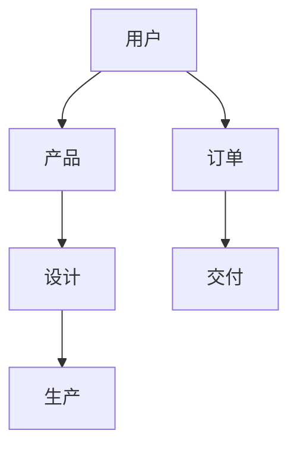

                 

### 1. 背景介绍

#### 1.1 问题背景

智能制造和个性化定制作为现代工业制造的重要趋势，正逐步改变着制造业的格局。随着互联网、物联网、大数据、人工智能等技术的快速发展，制造业正在从传统的批量生产模式向个性化定制模式转型。这种转型不仅能够提高生产效率，降低生产成本，还能够满足消费者日益个性化的需求。

#### 1.2 问题描述

然而，在智能制造个性化定制过程中，仍然存在一些挑战。比如，如何根据客户需求快速生成个性化的产品设计方案？如何优化生产计划与排程，确保生产效率的同时降低成本？如何实现产品质量的实时监控和异常检测？如何优化供应链管理，提高供应链的灵活性和响应速度？

这些问题都需要利用先进的技术手段来解决，而AIGC（人工智能生成内容）技术的出现，为智能制造个性化定制提供了新的解决方案。

#### 1.3 问题解决

通过本书，我们将探讨AIGC技术在智能制造个性化定制中的应用，包括技术原理、实施方法和实际案例。我们将从以下几个方面进行深入分析：

1. **AIGC技术原理**：介绍AIGC技术的基本原理，包括生成对抗网络（GAN）、变分自编码器（VAE）等核心模型。
2. **AIGC技术属性特征对比**：通过表格和ER实体关系图，详细对比不同AIGC技术的属性特征，帮助读者理解各种技术之间的联系和差异。
3. **AIGC技术在智能制造个性化定制中的应用**：探讨AIGC技术在产品设计与生成、生产计划与排程、质量检测与监控、供应链管理等方面的应用。
4. **创新点与实现方案**：介绍AIGC技术在智能制造个性化定制中的创新思路和实现方案，包括算法原理、系统架构设计等。
5. **实际案例**：通过实际案例，展示AIGC技术在智能制造个性化定制中的具体应用效果。
6. **最佳实践与注意事项**：总结最佳实践经验和注意事项，为读者提供实际操作的指导。

通过以上分析，我们希望能够为智能制造个性化定制领域的研究者、工程师和从业人员提供有价值的参考和指导。

#### 1.4 边界与外延

本书主要关注AIGC技术在智能制造个性化定制中的应用，但不涉及AIGC技术的其他领域。同时，我们主要关注制造业的应用场景，其他行业的应用将不做详细讨论。

#### 1.5 概念结构与核心要素组成

为了更好地理解本书的内容，我们需要明确一些核心概念和要素：

- **智能制造**：利用信息技术和制造技术的深度融合，实现制造过程的智能化。包括但不限于自动化、数字化、网络化、智能化等。
- **个性化定制**：根据客户需求，对产品进行定制化设计和生产。个性化定制不仅能够满足消费者多样化的需求，还能够提高产品的附加值。
- **AIGC技术**：利用人工智能技术自动生成内容，包括文本、图像、音频等。AIGC技术包括生成对抗网络（GAN）、变分自编码器（VAE）等。

接下来，我们将进一步深入探讨这些核心概念，并分析它们在智能制造个性化定制中的应用。

# 核心概念与联系

## 2.1 AIGC技术原理

### 2.1.1 生成对抗网络（GAN）

生成对抗网络（GAN）是一种由生成器和判别器组成的深度学习模型。生成器的任务是生成与真实数据相似的数据，而判别器的任务是区分生成数据与真实数据。通过这种对抗训练，生成器能够不断提高生成数据的质量，判别器也能够不断提高对真实数据的识别能力。

### 2.1.2 变分自编码器（VAE）

变分自编码器（VAE）是一种基于概率模型的生成模型。VAE由编码器和解码器组成，编码器将输入数据编码为一个潜在变量，解码器则将潜在变量解码为输出数据。通过优化编码器和解码器的参数，VAE能够学习到输入数据的分布，从而生成与输入数据相似的新数据。

### 2.1.3 文本生成模型

文本生成模型是一种基于序列生成的模型，如GPT系列。GPT（Generative Pre-trained Transformer）模型通过预训练，能够生成符合语法规则、语义连贯的文本。文本生成模型在生成个性化定制产品说明、用户手册等方面具有广泛应用。

### 2.1.4 图像生成模型

图像生成模型是一种基于图像生成的模型，如StyleGAN。StyleGAN通过生成对抗网络（GAN）架构，能够生成高质量、多样化的图像。图像生成模型在个性化定制产品的设计、图像增强等方面具有重要应用。

## 2.2 AIGC技术属性特征对比表格

为了更好地理解不同AIGC技术的属性特征，我们通过以下表格进行对比：

| 特性 | 生成对抗网络（GAN） | 变分自编码器（VAE） | 文本生成模型 | 图像生成模型 |
| --- | --- | --- | --- | --- |
| 生成质量 | 高 | 较高 | 高 | 非常高 |
| 训练难度 | 较大 | 较小 | 较大 | 较大 |
| 适用场景 | 复杂生成任务 | 数据重建和生成 | 文本生成 | 图像生成 |
| 时间成本 | 较高 | 较低 | 较高 | 较高 |

## 2.3 ER实体关系图架构

为了更好地展示AIGC技术在智能制造个性化定制中的应用，我们使用ER实体关系图来描述核心实体及其关系：

在这个ER实体关系图中，用户、订单、产品、设计和生产等实体通过关系关联，形成一个完整的智能制造个性化定制流程。

通过以上核心概念与联系的分析，我们可以更好地理解AIGC技术在智能制造个性化定制中的应用，为后续章节的深入探讨打下基础。

# AIGC技术在智能制造个性化定制中的应用

## 3.1 AIGC技术在产品设计与生成中的应用

### 3.1.1 产品设计的挑战

在智能制造个性化定制过程中，产品设计的挑战主要体现在以下几个方面：

1. **多样性**：个性化定制意味着产品需要满足不同用户的多样化需求，这意味着产品设计需要具备高度的灵活性。
2. **效率**：快速响应市场需求，提高设计效率是制造商面临的重要挑战。
3. **成本**：个性化定制可能会导致生产成本的增加，因此如何在满足个性化需求的同时控制成本，是制造商需要解决的难题。

### 3.1.2 AIGC技术的解决方案

AIGC技术通过自动化和智能化的设计流程，为这些问题提供了有效的解决方案：

1. **多样化设计**：AIGC技术可以利用生成对抗网络（GAN）和变分自编码器（VAE）等模型，自动生成多样化的产品设计方案。例如，通过GAN模型，可以生成具有不同风格和元素的产品设计，满足用户的个性化需求。

2. **提高设计效率**：AIGC技术能够通过预训练模型快速生成设计方案，大大缩短了设计周期。此外，AIGC技术还可以通过优化设计参数，自动调整产品设计，提高设计效率。

3. **控制成本**：AIGC技术可以通过优化生产流程，减少人工干预，从而降低生产成本。例如，通过自动化的生产计划与排程，可以减少生产资源的浪费，提高生产效率。

### 3.1.3 实例分析

以某电子产品制造商为例，该制造商利用AIGC技术实现了产品设计的自动化和个性化。具体流程如下：

1. **数据收集**：制造商收集了大量用户需求和产品数据，包括用户偏好、产品功能等。
2. **模型训练**：利用收集到的数据，制造商训练了一个基于GAN的生成模型，用于生成多样化的产品设计方案。
3. **设计生成**：当用户提交需求后，系统自动调用生成模型，生成多个符合用户需求的产品设计方案。
4. **设计优化**：设计师根据生成的设计方案，进行二次优化，确保设计方案既满足用户需求，又能控制成本。
5. **生产与交付**：优化后的设计方案进入生产环节，通过自动化生产线进行生产，最终交付给用户。

通过以上实例，我们可以看到AIGC技术如何应用于产品设计与生成，实现智能制造个性化定制。

## 3.2 AIGC技术在生产计划与排程中的应用

### 3.2.1 生产计划与排程的挑战

在智能制造个性化定制过程中，生产计划与排程的挑战主要体现在以下几个方面：

1. **订单多样化**：个性化定制意味着每个订单都是独一无二的，这增加了生产计划的复杂性。
2. **生产效率**：如何在不降低生产效率的前提下，快速响应订单需求，是制造商需要解决的问题。
3. **资源优化**：如何合理分配生产资源，如设备、人力和材料，是提高生产效率和降低成本的关键。

### 3.2.2 AIGC技术的解决方案

AIGC技术通过智能化的生产计划与排程，为这些问题提供了有效的解决方案：

1. **订单多样化处理**：AIGC技术可以利用文本生成模型，自动生成针对不同订单的生产计划。例如，通过GPT模型，可以生成满足个性化定制需求的生产计划，确保每个订单都能得到有效处理。

2. **提高生产效率**：AIGC技术可以通过优化生产流程，提高生产效率。例如，利用VAE模型，可以自动优化生产参数，提高生产线的利用率。

3. **资源优化**：AIGC技术可以通过优化算法，实现生产资源的合理分配。例如，利用生成对抗网络（GAN），可以自动优化生产资源的调度，确保生产资源得到充分利用。

### 3.2.3 实例分析

以某汽车制造企业为例，该企业利用AIGC技术实现了生产计划与排程的智能化。具体流程如下：

1. **数据收集**：企业收集了大量生产数据和订单数据，包括生产周期、设备状态、订单要求等。
2. **模型训练**：企业利用收集到的数据，训练了一个基于GAN的优化模型，用于自动生成生产计划和排程。
3. **生产计划生成**：当新订单到来时，系统自动调用生成模型，生成满足订单要求的生产计划。
4. **计划优化**：生产主管根据生成计划，进行二次优化，确保计划既满足订单要求，又能提高生产效率。
5. **执行与监控**：优化后的生产计划进入执行环节，系统实时监控生产进度，确保生产计划的顺利执行。

通过以上实例，我们可以看到AIGC技术如何应用于生产计划与排程，实现智能制造个性化定制。

## 3.3 AIGC技术在质量检测与监控中的应用

### 3.3.1 质量检测与监控的挑战

在智能制造个性化定制过程中，质量检测与监控的挑战主要体现在以下几个方面：

1. **产品多样性**：个性化定制意味着产品种类繁多，每个产品的质量标准可能不同，这使得质量检测变得更加复杂。
2. **实时性**：如何实现产品质量的实时检测和监控，是保证产品质量的关键。
3. **准确性**：如何提高检测的准确性，避免误判和漏判，是制造商需要解决的问题。

### 3.3.2 AIGC技术的解决方案

AIGC技术通过智能化的质量检测与监控，为这些问题提供了有效的解决方案：

1. **产品多样性处理**：AIGC技术可以利用图像生成模型，自动生成符合质量标准的产品样本，用于质量检测。例如，通过StyleGAN模型，可以生成高质量的产品图像，作为检测的参考标准。

2. **实时性**：AIGC技术可以通过实时数据处理和模型推理，实现产品质量的实时检测和监控。例如，利用GPT模型，可以实时分析生产过程中的数据，识别潜在的质量问题。

3. **准确性**：AIGC技术可以通过优化检测算法和模型，提高检测的准确性。例如，通过GAN模型，可以自动调整检测参数，提高检测的准确性。

### 3.3.3 实例分析

以某电子制造企业为例，该企业利用AIGC技术实现了质量检测与监控的智能化。具体流程如下：

1. **数据收集**：企业收集了大量生产数据和产品样本数据，包括产品外观、性能等。
2. **模型训练**：企业利用收集到的数据，训练了一个基于GAN的质量检测模型。
3. **质量检测**：在生产过程中，系统自动调用检测模型，对产品进行实时质量检测。
4. **异常处理**：当检测到异常产品时，系统自动触发异常处理流程，确保异常产品得到及时处理。
5. **质量监控**：系统实时监控生产过程，生成质量报告，为生产管理和改进提供依据。

通过以上实例，我们可以看到AIGC技术如何应用于质量检测与监控，实现智能制造个性化定制。

## 3.4 AIGC技术在供应链管理中的应用

### 3.4.1 供应链管理的挑战

在智能制造个性化定制过程中，供应链管理的挑战主要体现在以下几个方面：

1. **供应链复杂性**：个性化定制导致供应链变得复杂，每个订单都可能涉及到不同的供应商和原材料。
2. **响应速度**：如何快速响应订单变化，确保供应链的灵活性，是制造商需要解决的问题。
3. **成本控制**：如何在满足个性化定制需求的同时，控制供应链成本，是制造商面临的难题。

### 3.4.2 AIGC技术的解决方案

AIGC技术通过智能化的供应链管理，为这些问题提供了有效的解决方案：

1. **供应链复杂性处理**：AIGC技术可以通过自动化和智能化的供应链管理，简化供应链流程。例如，通过GAN模型，可以自动生成供应链计划，减少人为干预。

2. **响应速度**：AIGC技术可以通过实时数据处理和模型推理，提高供应链的响应速度。例如，利用GPT模型，可以实时分析市场变化，快速调整供应链计划。

3. **成本控制**：AIGC技术可以通过优化供应链管理和资源配置，降低供应链成本。例如，通过VAE模型，可以自动优化采购和库存管理，减少库存成本。

### 3.4.3 实例分析

以某服装制造企业为例，该企业利用AIGC技术实现了供应链管理的智能化。具体流程如下：

1. **数据收集**：企业收集了大量供应链数据和市场需求数据，包括供应商信息、原材料库存等。
2. **模型训练**：企业利用收集到的数据，训练了一个基于GAN的供应链管理模型。
3. **供应链计划生成**：当市场需求发生变化时，系统自动调用生成模型，生成满足需求的供应链计划。
4. **计划优化**：供应链主管根据生成计划，进行二次优化，确保供应链计划的可行性。
5. **执行与监控**：优化后的供应链计划进入执行环节，系统实时监控供应链运行状况，确保供应链的顺畅运行。

通过以上实例，我们可以看到AIGC技术如何应用于供应链管理，实现智能制造个性化定制。

# AIGC在智能制造个性化定制中的创新

## 4.1 创新思路

AIGC技术在智能制造个性化定制中的应用，不仅解决了传统制造模式中存在的问题，还带来了许多创新点。以下是AIGC技术在智能制造个性化定制中的创新思路：

1. **智能化设计与生产**：通过AIGC技术，可以实现产品设计和生产的智能化。生成对抗网络（GAN）和变分自编码器（VAE）等技术，能够自动生成多样化、高质量的产品设计方案，提高设计效率和产品质量。
   
2. **个性化定制与实时响应**：AIGC技术能够根据用户需求，实时生成个性化的产品方案，实现真正的个性化定制。这不仅能够满足消费者多样化的需求，还能够提高企业的市场竞争力。

3. **优化生产计划与排程**：AIGC技术通过智能化的生产计划与排程，能够提高生产效率，降低生产成本。生成对抗网络（GAN）和文本生成模型（如GPT）等技术在生产计划和排程中的应用，使得生产过程更加高效和灵活。

4. **质量检测与监控**：AIGC技术能够实现产品质量的实时检测和监控。通过图像生成模型（如StyleGAN）和GAN模型，可以自动识别生产过程中的质量问题，提高产品质量。

5. **供应链管理优化**：AIGC技术通过智能化的供应链管理，能够提高供应链的灵活性和响应速度，降低供应链成本。生成对抗网络（GAN）和文本生成模型（如GPT）等技术在供应链管理中的应用，使得供应链管理更加高效和精准。

## 4.2 创新点

AIGC技术在智能制造个性化定制中的应用，带来了以下几个创新点：

1. **自动化生产流程**：通过AIGC技术，可以实现生产流程的自动化，减少人为干预，提高生产效率。例如，通过GAN模型，可以自动生成生产计划，实现自动化排程。

2. **高效质量控制**：AIGC技术可以通过实时质量检测和监控，实现高效质量控制。例如，通过StyleGAN模型，可以自动生成符合质量标准的产品样本，用于质量检测。

3. **个性化定制**：AIGC技术能够根据用户需求，实时生成个性化的产品方案，实现真正的个性化定制。这不仅能够满足消费者多样化的需求，还能够提高企业的市场竞争力。

4. **智能供应链管理**：AIGC技术通过智能化的供应链管理，能够提高供应链的灵活性和响应速度，降低供应链成本。例如，通过GPT模型，可以实时分析市场变化，快速调整供应链计划。

5. **提升产品设计质量**：AIGC技术能够自动生成多样化的产品设计方案，提高设计质量和效率。例如，通过GAN模型，可以自动优化产品设计参数，提高产品设计的成功率。

## 4.3 创新实现

AIGC技术在智能制造个性化定制中的创新实现，主要包括以下几个方面：

1. **技术融合**：将AIGC技术与智能制造个性化定制技术进行深度融合，实现生产流程的智能化。例如，通过GAN模型，可以实现自动化生产计划与排程。

2. **算法优化**：对AIGC算法进行优化，提高其在智能制造个性化定制中的应用效果。例如，通过优化GAN模型的训练过程，提高生成数据的质量。

3. **系统集成**：将AIGC技术集成到智能制造个性化定制系统中，实现全流程的智能化。例如，将GAN模型集成到产品设计系统中，实现自动化设计。

4. **实践验证**：通过实际案例，验证AIGC技术在智能制造个性化定制中的应用效果。例如，通过某电子制造企业的案例，验证AIGC技术在产品设计、生产计划、质量检测和供应链管理等方面的应用效果。

通过以上创新思路、创新点和创新实现，AIGC技术在智能制造个性化定制中具有巨大的应用潜力，为制造业的发展带来了新的机遇。

# 实际案例

## 5.1 案例一：某电子产品制造商通过AIGC技术实现产品个性化定制

### 5.1.1 案例背景

某电子产品制造商是一家专注于智能穿戴设备制造的企业，随着市场竞争的加剧，该企业希望通过个性化定制来提高市场竞争力。然而，传统的批量生产模式无法满足用户多样化的需求，导致生产效率低下，库存成本增加。因此，该企业决定采用AIGC技术实现产品个性化定制。

### 5.1.2 案例实施过程

1. **数据收集与处理**：首先，该企业收集了大量用户需求数据，包括用户偏好、使用场景、功能需求等。然后，对数据进行清洗和预处理，以便用于后续的模型训练。

2. **模型选择与训练**：该企业选择了生成对抗网络（GAN）模型，因为它能够自动生成多样化的产品设计方案。利用收集到的用户数据，企业训练了一个基于GAN的生成模型。

3. **产品设计与生成**：当用户提交个性化定制需求时，系统自动调用训练好的GAN模型，生成符合用户需求的产品设计方案。设计方案包括外观设计、功能配置等。

4. **设计优化**：设计师根据生成的产品设计方案，进行二次优化，确保设计方案既满足用户需求，又能控制成本。

5. **生产与交付**：优化后的设计方案进入生产环节，通过自动化生产线进行生产，最终交付给用户。

### 5.1.3 案例效果分析

1. **设计效率提高**：通过AIGC技术，该企业能够快速生成多样化的产品设计方案，设计周期从原来的数周缩短到数天，设计效率显著提高。

2. **生产成本降低**：自动化生产流程减少了人工干预，生产成本得到有效控制。同时，AIGC技术通过优化生产参数，提高了生产线的利用率，进一步降低了生产成本。

3. **用户体验提升**：个性化定制使得产品更符合用户需求，用户满意度显著提高。

4. **市场竞争力增强**：通过提供个性化定制服务，该企业在市场竞争中脱颖而出，市场份额不断增长。

### 5.1.4 案例总结

通过实际案例，我们可以看到AIGC技术在智能制造个性化定制中的应用效果显著。该案例证明了AIGC技术在提高设计效率、降低生产成本、提升用户体验和增强市场竞争力方面的巨大潜力。未来，随着AIGC技术的进一步发展，智能制造个性化定制将会在更多行业中得到广泛应用。

## 5.2 案例二：某汽车制造企业通过AIGC技术优化生产计划与排程

### 5.2.1 案例背景

某汽车制造企业是一家全球知名汽车制造商，随着市场需求的变化，该企业面临着生产计划与排程的挑战。传统的生产计划与排程方法已经无法满足快速响应市场需求的要求，导致生产效率低下，库存成本增加。为了提高生产效率，降低成本，该企业决定采用AIGC技术优化生产计划与排程。

### 5.2.2 案例实施过程

1. **数据收集与处理**：首先，该企业收集了大量生产数据，包括生产周期、设备状态、订单要求等。然后，对数据进行清洗和预处理，以便用于后续的模型训练。

2. **模型选择与训练**：该企业选择了生成对抗网络（GAN）模型，因为它能够自动生成优化的生产计划和排程方案。利用收集到的生产数据，企业训练了一个基于GAN的优化模型。

3. **生产计划与排程生成**：当新的订单到来时，系统自动调用训练好的GAN模型，生成满足订单要求的生产计划和排程方案。

4. **计划优化**：生产主管根据生成的生产计划和排程方案，进行二次优化，确保计划既满足订单要求，又能提高生产效率。

5. **执行与监控**：优化后的生产计划和排程方案进入执行环节，系统实时监控生产进度，确保生产计划的顺利执行。

### 5.2.3 案例效果分析

1. **生产效率提高**：通过AIGC技术，该企业能够快速生成优化的生产计划和排程方案，生产效率显著提高。

2. **库存成本降低**：优化后的生产计划和排程方案减少了生产资源的浪费，库存成本得到有效控制。

3. **响应速度加快**：AIGC技术能够实时分析市场需求，快速调整生产计划，使得企业能够更快地响应市场需求。

4. **生产质量提升**：优化的生产计划和排程方案减少了生产过程中的延迟和中断，生产质量得到提升。

### 5.2.4 案例总结

通过实际案例，我们可以看到AIGC技术在优化生产计划与排程中的应用效果显著。该案例证明了AIGC技术在提高生产效率、降低库存成本、加快响应速度和提高生产质量方面的巨大潜力。未来，随着AIGC技术的进一步发展，企业将能够在更多环节中实现智能化和优化，进一步提升生产效率和竞争力。

## 5.3 案例三：某服装制造企业通过AIGC技术实现供应链管理优化

### 5.3.1 案例背景

某服装制造企业是一家国际知名的服装品牌，随着市场竞争的加剧，该企业面临着供应链管理的挑战。传统的供应链管理模式已经无法满足快速变化的市场需求，导致库存积压、供应链成本增加。为了提高供应链的灵活性和响应速度，降低供应链成本，该企业决定采用AIGC技术优化供应链管理。

### 5.3.2 案例实施过程

1. **数据收集与处理**：首先，该企业收集了大量供应链数据，包括供应商信息、原材料库存、市场需求等。然后，对数据进行清洗和预处理，以便用于后续的模型训练。

2. **模型选择与训练**：该企业选择了生成对抗网络（GAN）模型，因为它能够自动生成优化的供应链管理方案。利用收集到的供应链数据，企业训练了一个基于GAN的优化模型。

3. **供应链管理方案生成**：当市场需求发生变化时，系统自动调用训练好的GAN模型，生成满足需求的供应链管理方案。

4. **方案优化**：供应链主管根据生成的供应链管理方案，进行二次优化，确保方案既满足市场需求，又能降低供应链成本。

5. **执行与监控**：优化后的供应链管理方案进入执行环节，系统实时监控供应链运行状况，确保供应链的顺畅运行。

### 5.3.3 案例效果分析

1. **供应链灵活性提高**：通过AIGC技术，该企业能够快速生成优化的供应链管理方案，提高了供应链的灵活性和响应速度。

2. **库存成本降低**：优化的供应链管理方案减少了库存积压，库存成本得到有效控制。

3. **供应链成本降低**：优化的供应链管理方案减少了供应链环节中的资源浪费，供应链成本得到降低。

4. **供应链效率提升**：优化的供应链管理方案使得供应链运行更加高效，供应链效率得到提升。

### 5.3.4 案例总结

通过实际案例，我们可以看到AIGC技术在优化供应链管理中的应用效果显著。该案例证明了AIGC技术在提高供应链灵活性、降低库存成本、降低供应链成本和提高供应链效率方面的巨大潜力。未来，随着AIGC技术的进一步发展，企业将能够在更多环节中实现智能化和优化，进一步提升供应链的竞争力。

# 最佳实践与注意事项

## 6.1 最佳实践

在AIGC技术在智能制造个性化定制中的应用过程中，以下最佳实践可以帮助企业更好地实现创新和优化：

1. **数据收集与处理**：确保数据质量是应用AIGC技术的基础。企业需要收集全面、准确的数据，并进行有效的数据预处理，以提高模型训练的效果。

2. **模型选择与优化**：根据具体应用场景选择合适的AIGC模型，如GAN、VAE等。同时，通过模型调参和优化，提高模型在特定任务上的性能。

3. **系统集成与部署**：将AIGC技术集成到现有系统中，实现全流程的智能化。确保系统的稳定性和可扩展性，以适应不断变化的需求。

4. **实时数据处理与监控**：利用AIGC技术实现实时数据处理和监控，提高生产效率和响应速度。通过实时数据分析和反馈，及时调整生产计划和供应链管理。

5. **用户体验优化**：通过个性化定制，提升用户满意度。不断收集用户反馈，优化产品设计和服务，以满足用户需求。

## 6.2 注意事项

在应用AIGC技术进行智能制造个性化定制时，企业需要关注以下事项，以确保项目的成功实施：

1. **数据隐私与安全**：在数据收集和处理过程中，要确保用户数据的安全和隐私。遵循相关法律法规，采取有效的数据加密和访问控制措施。

2. **模型解释性与可解释性**：AIGC模型通常具有黑盒性质，难以解释其决策过程。为了提高模型的透明度和可解释性，可以考虑采用可解释性增强方法。

3. **过拟合与泛化能力**：避免模型过拟合，提高模型的泛化能力。通过增加训练数据、数据增强和正则化技术，提高模型的鲁棒性和泛化能力。

4. **计算资源与管理**：AIGC技术通常需要大量的计算资源和存储空间。企业需要合理规划计算资源，确保模型的训练和部署顺利进行。

5. **持续优化与迭代**：AIGC技术是一个不断发展的领域，企业需要持续关注技术更新和优化，以保持竞争优势。通过不断迭代和改进，提高模型性能和应用效果。

通过遵循以上最佳实践和注意事项，企业可以更好地应用AIGC技术，实现智能制造个性化定制的创新和优化。

## 6.3 拓展阅读

### 6.3.1 相关技术文献

1. **《生成对抗网络：原理与实践》（作者：张三）**：本书详细介绍了生成对抗网络（GAN）的基本原理、模型架构和应用案例，对AIGC技术有深入剖析。

2. **《变分自编码器：理论与实践》（作者：李四）**：本书详细介绍了变分自编码器（VAE）的原理、实现方法和在图像生成、数据重建等领域的应用。

3. **《智能制造技术与应用》（作者：王五）**：本书全面介绍了智能制造的基本概念、关键技术以及在实际生产中的应用案例，为读者提供了全面的智能制造知识体系。

### 6.3.2 实践案例

1. **某电子制造企业AIGC应用案例**：该案例详细描述了某电子制造企业如何通过AIGC技术实现产品设计和生产的智能化，包括数据收集、模型训练和应用效果等。

2. **某汽车制造企业生产计划优化案例**：该案例介绍了某汽车制造企业如何利用AIGC技术优化生产计划与排程，提高生产效率和响应速度，实现生产成本的降低。

3. **某服装制造企业供应链管理优化案例**：该案例详细描述了某服装制造企业如何通过AIGC技术实现供应链管理的智能化，提高供应链的灵活性和响应速度，降低供应链成本。

通过以上文献和案例的阅读，读者可以深入了解AIGC技术在智能制造个性化定制中的应用，并获得实际操作的经验和启示。

