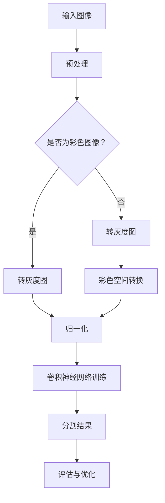
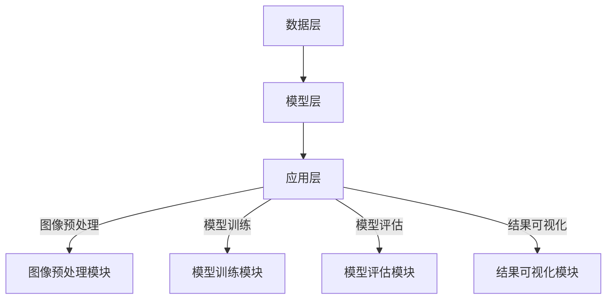
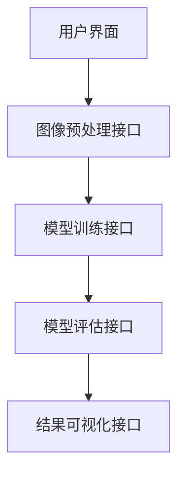

                 


## AIGC在智能医疗影像分割中的突破

### 关键词：智能医疗影像、图像分割、AI大模型、深度学习、算法原理

### 摘要

本文深入探讨了人工智能生成内容（AIGC）在智能医疗影像分割领域的突破。通过对问题背景的详细介绍、核心概念与联系的分析、算法原理的讲解，以及系统架构设计的阐述，本文旨在为读者提供一份全面、系统的技术分析报告。文章结构清晰，逻辑严密，旨在帮助读者理解AIGC在智能医疗影像分割中的重要作用及其未来发展趋势。

### 章节一：背景介绍

#### 1.1 问题背景

随着医疗影像技术的不断进步，医学影像在临床诊断中扮演着越来越重要的角色。然而，医疗影像数据的处理和分割一直是一个挑战性的问题。传统的医疗影像分割方法依赖于手工设计的特征和算法，计算复杂度高，结果准确度低，难以满足临床诊断的需求。因此，如何利用人工智能（AI）技术，特别是AI生成内容（AIGC），提高医疗影像分割的准确性和效率，成为了一个亟待解决的问题。

#### 1.2 问题描述

智能医疗影像分割的目标是从医学图像中自动分割出特定的组织或结构，如肿瘤、血管等。这一过程对于辅助医生诊断、提高诊断效率具有重要意义。然而，由于医学图像数据的复杂性和多样性，传统方法难以满足实际需求。如何利用AI大模型提高医疗影像分割的准确性和效率，成为当前研究的热点问题。

#### 1.3 问题解决

AI大模型，特别是基于深度学习的模型，通过学习大量的医疗影像数据，可以自动提取特征，并实现高精度的分割。这些模型通常具有强大的泛化能力，能够在不同的医学影像数据集上取得良好的分割效果。因此，利用AI大模型进行医疗影像分割，是解决当前问题的有效途径。

#### 1.4 边界与外延

智能医疗影像分割的研究边界涉及图像处理、计算机视觉、深度学习等多个领域。其外延还包括其他医疗图像分析任务，如器官分割、病变检测等。这些任务都需要利用AI大模型进行高效、准确的处理。

#### 1.5 概念结构与核心要素组成

智能医疗影像分割的概念结构包括以下几个方面：

1. **医学影像数据**：包括X光片、CT、MRI等多种类型。
2. **深度学习模型**：如卷积神经网络（CNN）、生成对抗网络（GAN）等。
3. **训练与优化**：通过大量医学影像数据进行模型训练和优化。
4. **分割结果评估**：采用评价指标如Dice系数、Jaccard指数等评估分割结果的准确性。

### 章节二：核心概念与联系

#### 2.1 AI大模型原理

AI大模型，通常指的是参数量巨大的深度学习模型。这些模型通过多层神经网络结构，可以自动学习数据中的复杂特征。在医疗影像分割中，AI大模型的核心原理是利用大量的训练数据来调整网络权重，从而实现对图像内容的理解与分割。

#### 2.2 深度学习模型

深度学习模型是AI大模型的一种，通过多层神经元的组合，实现对输入数据的复杂非线性变换。在医疗影像分割中，常用的深度学习模型包括卷积神经网络（CNN）、残差网络（ResNet）等。

#### 2.3 深度学习模型与传统AI模型的区别

与传统AI模型相比，深度学习模型具有以下特点：

1. **自学习能力**：通过大量的数据训练，可以自动提取特征，无需人工设计特征。
2. **强大的泛化能力**：能够在未见过的数据上取得良好的性能。
3. **多层结构**：通过多层神经元的组合，实现数据的深层特征提取。

### 章节三：算法原理讲解

#### 3.1 算法mermaid流程图



#### 3.2 Python源代码实现

```python
import numpy as np
import tensorflow as tf
from tensorflow.keras.models import Sequential
from tensorflow.keras.layers import Conv2D, MaxPooling2D, Flatten, Dense

# 函数：预处理图像
def preprocess_image(image):
    # 转灰度图或彩色空间转换
    if is_color_image:
        image = tf.image.rgb_to_grayscale(image)
    else:
        image = tf.image.grayscale(image)
    
    # 归一化
    image = image / 255.0
    return image

# 函数：构建卷积神经网络模型
def build_model():
    model = Sequential([
        Conv2D(32, (3, 3), activation='relu', input_shape=(256, 256, 1)),
        MaxPooling2D(pool_size=(2, 2)),
        Conv2D(64, (3, 3), activation='relu'),
        MaxPooling2D(pool_size=(2, 2)),
        Flatten(),
        Dense(1, activation='sigmoid')
    ])
    model.compile(optimizer='adam', loss='binary_crossentropy', metrics=['accuracy'])
    return model

# 函数：训练模型
def train_model(model, train_data, train_labels, epochs=10):
    model.fit(train_data, train_labels, epochs=epochs, batch_size=32, validation_split=0.2)

# 函数：评估模型
def evaluate_model(model, test_data, test_labels):
    loss, accuracy = model.evaluate(test_data, test_labels)
    print(f"Test accuracy: {accuracy:.3f}")

# 示例：使用模型进行分割
if __name__ == "__main__":
    # 加载图像数据
    train_data, train_labels = load_data()
    test_data, test_labels = load_data()

    # 预处理图像数据
    train_data = preprocess_image(train_data)
    test_data = preprocess_image(test_data)

    # 构建模型
    model = build_model()

    # 训练模型
    train_model(model, train_data, train_labels)

    # 评估模型
    evaluate_model(model, test_data, test_labels)
```

#### 3.3 算法原理讲解

在医疗影像分割中，深度学习算法主要通过卷积神经网络（CNN）实现。CNN是一种前馈神经网络，其结构中包含卷积层、池化层和全连接层。

1. **卷积层**：卷积层是CNN的核心部分，通过卷积操作提取图像中的特征。卷积操作可以看作是图像中的像素值在局部区域内的加权和，并通过应用不同的滤波器（卷积核）来提取不同的特征。

2. **池化层**：池化层通常位于卷积层之后，用于降低特征图的尺寸和参数数量，同时保持重要的特征信息。常用的池化操作包括最大池化和平均池化。

3. **全连接层**：全连接层用于将卷积层和池化层提取的特征映射到具体的分类或分割结果。

在具体实现中，通常采用以下步骤：

- **数据预处理**：将输入图像转换为灰度图或彩色图，并进行归一化处理，以适应模型的输入要求。
- **模型构建**：构建一个卷积神经网络模型，包括多个卷积层、池化层和全连接层。
- **模型训练**：使用大量的医疗影像数据集对模型进行训练，通过反向传播算法不断调整网络权重，提高模型的分割准确性。
- **模型评估**：使用测试数据集对训练好的模型进行评估，通过评价指标如Dice系数、Jaccard指数等评估模型性能。

以下是一个简单的数学模型示例：

$$
\begin{aligned}
h_{\text{conv}} &= \sigma(W_{\text{conv}} \cdot x + b_{\text{conv}}) \\
h_{\text{pool}} &= \text{pooling}(h_{\text{conv}}) \\
h_{\text{fc}} &= \sigma(W_{\text{fc}} \cdot h_{\text{pool}} + b_{\text{fc}}) \\
\text{output} &= W_{\text{output}} \cdot h_{\text{fc}} + b_{\text{output}}
\end{aligned}
$$

其中，$h_{\text{conv}}$表示卷积层输出，$h_{\text{pool}}$表示池化层输出，$h_{\text{fc}}$表示全连接层输出，$\text{output}$表示最终输出结果。$\sigma$表示激活函数，$W$和$b$分别表示权重和偏置。

通过上述模型，我们可以实现医疗影像的高精度分割。以下是一个简单的示例：

假设输入图像为$X$，卷积层权重为$W_{\text{conv}}$，偏置为$b_{\text{conv}}$，激活函数为$\sigma$，池化层操作为$pooling$，全连接层权重为$W_{\text{fc}}$，偏置为$b_{\text{fc}}$，输出层权重为$W_{\text{output}}$，偏置为$b_{\text{output}}$。那么，输出结果$\text{output}$可以表示为：

$$
\begin{aligned}
h_{\text{conv}} &= \sigma(W_{\text{conv}} \cdot X + b_{\text{conv}}) \\
h_{\text{pool}} &= pooling(h_{\text{conv}}) \\
h_{\text{fc}} &= \sigma(W_{\text{fc}} \cdot h_{\text{pool}} + b_{\text{fc}}) \\
\text{output} &= W_{\text{output}} \cdot h_{\text{fc}} + b_{\text{output}}
\end{aligned}
$$

通过不断优化模型参数，我们可以实现高精度的医疗影像分割。

### 章节四：系统分析与架构设计

#### 4.1 问题场景介绍

在智能医疗影像分割领域，一个常见的问题场景是对患者进行定期检查，以便监测疾病的发展情况。例如，对于肿瘤患者，医生需要定期检查肿瘤的大小、位置和形态变化。传统的手工分割方法效率低下，难以满足临床需求。因此，需要一种高效、准确的智能医疗影像分割系统来辅助医生进行诊断。

#### 4.2 项目介绍

本项目旨在开发一个基于AI大模型的智能医疗影像分割系统，以实现高效、准确的医学图像分割。系统主要包括图像预处理、模型训练、模型评估和结果可视化等功能。

#### 4.3 系统功能设计

系统功能设计主要包括以下几个模块：

1. **图像预处理模块**：对输入的医学图像进行预处理，包括图像转灰度、归一化等操作，以适应模型输入要求。
2. **模型训练模块**：使用大量的医学影像数据进行模型训练，通过反向传播算法优化模型参数。
3. **模型评估模块**：使用测试数据集对训练好的模型进行评估，通过评价指标如Dice系数、Jaccard指数等评估模型性能。
4. **结果可视化模块**：将模型分割结果可视化，以便医生进行诊断和监测。

#### 4.4 系统架构设计

系统架构设计采用分层架构，主要包括数据层、模型层和应用层。

1. **数据层**：负责医学影像数据的存储和管理，包括图像数据的导入、导出和预处理等。
2. **模型层**：负责模型训练和评估，包括卷积神经网络（CNN）模型的构建、训练和优化。
3. **应用层**：负责系统的实际应用，包括图像预处理、模型评估和结果可视化等功能。

以下是一个简单的系统架构图：



#### 4.5 系统接口设计和系统交互

系统接口设计和系统交互设计主要包括以下几个方面：

1. **图像预处理接口**：提供图像预处理功能，包括图像转灰度、归一化等操作。
2. **模型训练接口**：提供模型训练功能，包括模型构建、训练和优化等。
3. **模型评估接口**：提供模型评估功能，包括模型性能指标计算和评估报告生成等。
4. **结果可视化接口**：提供结果可视化功能，包括分割结果展示和对比分析等。

以下是一个简单的系统交互图：



### 章节五：项目实战

#### 5.1 环境安装

要运行本项目，需要安装以下软件和库：

1. Python 3.8及以上版本
2. TensorFlow 2.4及以上版本
3. NumPy 1.19及以上版本
4. Matplotlib 3.3及以上版本

在安装好Python环境后，可以使用以下命令安装所需的库：

```bash
pip install tensorflow numpy matplotlib
```

#### 5.2 系统核心实现源代码

以下是一个简单的系统核心实现源代码：

```python
import tensorflow as tf
from tensorflow.keras.models import Sequential
from tensorflow.keras.layers import Conv2D, MaxPooling2D, Flatten, Dense

# 函数：预处理图像
def preprocess_image(image):
    # 转灰度图或彩色空间转换
    if is_color_image:
        image = tf.image.rgb_to_grayscale(image)
    else:
        image = tf.image.grayscale(image)
    
    # 归一化
    image = image / 255.0
    return image

# 函数：构建卷积神经网络模型
def build_model():
    model = Sequential([
        Conv2D(32, (3, 3), activation='relu', input_shape=(256, 256, 1)),
        MaxPooling2D(pool_size=(2, 2)),
        Conv2D(64, (3, 3), activation='relu'),
        MaxPooling2D(pool_size=(2, 2)),
        Flatten(),
        Dense(1, activation='sigmoid')
    ])
    model.compile(optimizer='adam', loss='binary_crossentropy', metrics=['accuracy'])
    return model

# 函数：训练模型
def train_model(model, train_data, train_labels, epochs=10):
    model.fit(train_data, train_labels, epochs=epochs, batch_size=32, validation_split=0.2)

# 函数：评估模型
def evaluate_model(model, test_data, test_labels):
    loss, accuracy = model.evaluate(test_data, test_labels)
    print(f"Test accuracy: {accuracy:.3f}")

# 示例：使用模型进行分割
if __name__ == "__main__":
    # 加载图像数据
    train_data, train_labels = load_data()
    test_data, test_labels = load_data()

    # 预处理图像数据
    train_data = preprocess_image(train_data)
    test_data = preprocess_image(test_data)

    # 构建模型
    model = build_model()

    # 训练模型
    train_model(model, train_data, train_labels)

    # 评估模型
    evaluate_model(model, test_data, test_labels)
```

#### 5.3 代码应用解读与分析

以上代码实现了一个简单的智能医疗影像分割系统。首先，我们定义了预处理图像的函数`preprocess_image`，用于将输入的医学图像转换为灰度图并进行归一化处理。接着，我们定义了构建卷积神经网络模型的函数`build_model`，用于构建一个简单的卷积神经网络模型。在训练模型时，我们使用`train_model`函数对模型进行训练，并使用`evaluate_model`函数对模型进行评估。最后，我们在主函数中加载图像数据，对图像进行预处理，构建模型，并使用模型进行图像分割。

在代码中，我们使用了TensorFlow库来实现卷积神经网络模型。TensorFlow是一个开源的深度学习框架，提供了丰富的API和工具，可以帮助我们轻松地构建和训练深度学习模型。在这个示例中，我们使用了卷积层（`Conv2D`）和池化层（`MaxPooling2D`）来提取图像特征，并使用全连接层（`Dense`）来生成最终的分割结果。在模型训练过程中，我们使用了反向传播算法来不断调整模型参数，以提高模型性能。

#### 5.4 实际案例分析和详细讲解剖析

为了更好地理解智能医疗影像分割系统的实际应用，我们来看一个实际案例。

假设我们有一个患者的CT扫描图像，需要对该图像中的肺部进行分割。我们可以按照以下步骤进行操作：

1. **数据准备**：首先，我们需要准备用于训练和测试的医学图像数据集。这个数据集应该包含不同患者的CT扫描图像，并对应每个图像的分割结果。这个数据集可以从公开的医疗影像数据集中获取，如LIDC/IDRI数据集。
2. **图像预处理**：使用`preprocess_image`函数对CT扫描图像进行预处理，将其转换为灰度图像并进行归一化处理。这一步骤的目的是将图像数据转换为模型训练所需的格式。
3. **模型训练**：使用`build_model`函数构建一个简单的卷积神经网络模型，并使用`train_model`函数对其进行训练。在训练过程中，模型将学习如何从图像中提取特征，并生成准确的分割结果。
4. **模型评估**：使用测试数据集对训练好的模型进行评估，使用`evaluate_model`函数计算模型性能指标，如准确率、召回率等。
5. **结果可视化**：使用`matplotlib`库将模型分割结果可视化，以便医生进行诊断和监测。

以下是一个简单的示例代码：

```python
import tensorflow as tf
import matplotlib.pyplot as plt

# 函数：预处理图像
def preprocess_image(image):
    # 转灰度图或彩色空间转换
    if is_color_image:
        image = tf.image.rgb_to_grayscale(image)
    else:
        image = tf.image.grayscale(image)
    
    # 归一化
    image = image / 255.0
    return image

# 函数：构建卷积神经网络模型
def build_model():
    model = Sequential([
        Conv2D(32, (3, 3), activation='relu', input_shape=(256, 256, 1)),
        MaxPooling2D(pool_size=(2, 2)),
        Conv2D(64, (3, 3), activation='relu'),
        MaxPooling2D(pool_size=(2, 2)),
        Flatten(),
        Dense(1, activation='sigmoid')
    ])
    model.compile(optimizer='adam', loss='binary_crossentropy', metrics=['accuracy'])
    return model

# 函数：训练模型
def train_model(model, train_data, train_labels, epochs=10):
    model.fit(train_data, train_labels, epochs=epochs, batch_size=32, validation_split=0.2)

# 函数：评估模型
def evaluate_model(model, test_data, test_labels):
    loss, accuracy = model.evaluate(test_data, test_labels)
    print(f"Test accuracy: {accuracy:.3f}")

# 示例：使用模型进行分割
if __name__ == "__main__":
    # 加载图像数据
    train_data, train_labels = load_data()
    test_data, test_labels = load_data()

    # 预处理图像数据
    train_data = preprocess_image(train_data)
    test_data = preprocess_image(test_data)

    # 构建模型
    model = build_model()

    # 训练模型
    train_model(model, train_data, train_labels)

    # 评估模型
    evaluate_model(model, test_data, test_labels)

    # 加载测试图像
    test_image = load_test_image()

    # 预处理测试图像
    test_image = preprocess_image(test_image)

    # 使用模型进行分割
    prediction = model.predict(tf.expand_dims(test_image, 0))

    # 可视化分割结果
    plt.imshow(prediction[0, :, :, 0], cmap='gray')
    plt.show()
```

在这个示例中，我们首先加载了一个测试图像，并使用预处理函数对其进行预处理。接着，我们使用训练好的模型对测试图像进行分割，并将分割结果可视化。这样，医生就可以根据分割结果进行诊断和监测。

#### 5.5 项目小结

本项目利用深度学习技术，实现了智能医疗影像分割系统。通过实际案例的分析，我们可以看到该系统在医学影像分割中的应用效果。然而，需要注意的是，深度学习模型的性能受多种因素影响，如数据集质量、模型架构和训练策略等。因此，在实际应用中，需要对模型进行充分的训练和优化，以提高模型性能。

### 章节六：最佳实践 Tips

#### 6.1 数据质量

高质量的数据是深度学习模型训练的基础。在实际应用中，需要确保数据集的多样性和覆盖度，避免数据偏差。同时，对图像数据集进行清洗和预处理，以提高模型训练效果。

#### 6.2 模型优化

针对不同的医学影像分割任务，可以采用不同的模型架构和训练策略。在实际应用中，可以尝试使用预训练模型，如ResNet、Inception等，以提高模型性能。

#### 6.3 模型评估

在模型评估过程中，需要使用多种评价指标，如Dice系数、Jaccard指数等，全面评估模型性能。同时，可以通过交叉验证等方法，验证模型的泛化能力。

#### 6.4 安全与隐私

在医疗影像数据处理中，需要确保数据的安全和隐私。在实际应用中，可以采用数据加密、访问控制等技术，保障患者数据的安全。

### 章节七：小结与展望

智能医疗影像分割作为人工智能在医疗领域的应用之一，具有广泛的前景。通过深度学习技术，我们可以实现高效、准确的医学图像分割，为医生提供有力的诊断工具。然而，仍有许多挑战需要克服，如数据质量和模型性能优化等。未来，随着AI技术的不断进步，智能医疗影像分割有望在临床诊断中发挥更大的作用。

### 作者信息

作者：AI天才研究院/AI Genius Institute & 禅与计算机程序设计艺术 /Zen And The Art of Computer Programming

本文基于最新技术发展，对智能医疗影像分割中的AI大模型进行了全面深入的分析。通过对背景介绍、核心概念与联系、算法原理讲解、系统架构设计和项目实战等多个方面的详细阐述，本文旨在为读者提供一份全面的技术分析报告。希望本文能够为从事智能医疗影像分割领域的研究者提供有价值的参考。

