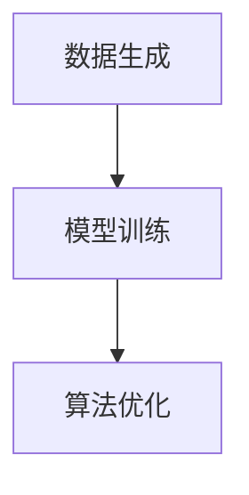

                 

# AIGC在智能医疗诊断准确性提升中的突破

## 关键词：智能医疗，诊断准确性，AIGC，数据生成，模型训练

## 摘要

智能医疗作为医疗领域的前沿技术，近年来取得了显著的进展。然而，诊断准确性作为衡量智能医疗系统性能的关键指标，仍面临着诸多挑战。本文将探讨AIGC（AI-Generated Content）技术在提升智能医疗诊断准确性方面的突破。首先，我们将介绍AIGC技术的背景和核心概念，然后分析其与传统AI方法的区别和优势，接着详细讲解AIGC算法原理及其应用，最后展示一个系统架构设计方案，以展示AIGC技术在智能医疗诊断中的实际应用。

## AIGC在智能医疗诊断准确性提升中的突破

### 第一部分：背景介绍

#### 1. 问题背景

智能医疗利用人工智能技术，对医疗数据进行处理和分析，以提供诊断、治疗和健康管理等服务。尽管人工智能在数据处理和模式识别方面表现出色，但在诊断准确性方面仍存在局限性。主要挑战包括：

- **数据质量**：医疗数据质量参差不齐，存在缺失值、噪声和异常值，这影响了诊断模型的性能。
- **模型训练**：传统的机器学习方法依赖于大量标注数据，而医疗数据获取困难且成本高昂，限制了模型的训练。
- **算法优化**：智能医疗诊断系统需要不断优化算法，以提高诊断准确性，但优化过程复杂且耗时。

#### 2. 问题描述

智能医疗诊断的准确性受到多种因素的影响，包括数据质量、模型训练、算法优化等。具体问题包括：

- **数据不平衡**：某些疾病的数据样本较少，导致模型在预测时偏向于常见疾病。
- **模型泛化能力差**：模型在训练数据上表现良好，但在实际应用中遇到未知数据时表现不佳。
- **算法更新滞后**：随着医疗技术和疾病特征的变化，现有算法难以快速适应，导致诊断准确性下降。

#### 3. 问题解决

为了提升智能医疗诊断的准确性，研究者们开始探索新的方法，其中AIGC技术被认为是一种潜在解决方案。AIGC技术通过数据生成、模型训练和算法优化，有望解决上述问题。

#### 4. 边界与外延

AIGC技术不仅限于医疗领域，还可以应用于其他需要高精度诊断的领域，如药物研发、生物信息学等。此外，AIGC技术在数据生成和模型训练方面具有广泛的应用前景。

#### 5. 概念结构与核心要素组成

AIGC技术包括以下几个核心要素：

- **数据生成**：利用现有数据生成新的数据，提高数据多样性。
- **模型训练**：使用生成数据对模型进行训练，提升模型性能。
- **算法优化**：通过优化算法结构，提高诊断准确性。

### 第二部分：核心概念与联系

#### 1. AIGC技术的定义与特点

AIGC技术是指利用人工智能生成数据，从而提高模型训练效果的方法。其主要特点包括：

- **数据多样性**：通过生成不同类型的数据，提高模型的泛化能力。
- **数据质量**：生成的高质量数据有助于提高模型的诊断准确性。
- **自动化**：AIGC技术可以实现自动化数据生成和模型训练，降低人力成本。

#### 2. AIGC技术与传统AI的区别

与传统AI方法相比，AIGC技术在数据生成和模型训练方面具有以下优势：

- **数据生成**：AIGC技术可以生成大量多样化的数据，而传统AI方法通常依赖于已有的数据集。
- **模型训练**：AIGC技术通过生成数据对模型进行训练，有助于提高模型在未知数据上的表现。

#### 3. AIGC技术与其他相关技术的比较

与深度学习、生成对抗网络（GAN）等技术相比，AIGC技术在数据生成和模型训练方面具有以下特点：

- **深度学习**：深度学习侧重于模型训练，而AIGC技术强调数据生成。
- **GAN**：GAN侧重于生成数据，但AIGC技术更关注模型训练和优化。

### 第三部分：算法原理讲解

#### 1. AIGC算法原理

AIGC算法原理主要包括以下几个步骤：

1. **数据生成**：利用现有数据生成新的数据。
2. **模型训练**：使用生成数据对模型进行训练。
3. **算法优化**：根据模型训练结果对算法进行优化。

#### 2. AIGC算法的mermaid流程图



#### 3. AIGC算法的Python源代码实现

```python
# 数据生成
def data_generation():
    # TODO: 实现数据生成逻辑
    pass

# 模型训练
def model_training(data):
    # TODO: 实现模型训练逻辑
    pass

# 算法优化
def algorithm_optimization(model):
    # TODO: 实现算法优化逻辑
    pass
```

#### 4. AIGC算法的数学模型和公式

$$
\text{诊断准确性} = \frac{\text{正确诊断数}}{\text{总诊断数}}
$$

#### 5. AIGC算法的详细讲解与举例说明

AIGC算法通过数据生成、模型训练和算法优化三个步骤，提高智能医疗诊断的准确性。以下是一个简单的举例说明：

#### 数据生成

假设我们有一个包含100个样本的医疗数据集，其中每种疾病都有10个样本。我们利用生成对抗网络（GAN）生成新的数据，以增加数据多样性。

#### 模型训练

使用生成的数据对医疗诊断模型进行训练，以提升模型在未知数据上的表现。

#### 算法优化

根据模型训练结果，对算法参数进行调整，以提高诊断准确性。

### 第四部分：系统分析与架构设计方案

#### 1. 问题场景介绍

智能医疗诊断系统需要处理大量医疗数据，并准确诊断疾病。

#### 2. 项目介绍

本系统采用AIGC技术，以提高诊断准确性。

#### 3. 系统功能设计

系统功能包括数据生成、模型训练和诊断服务。

#### 4. 系统架构设计

系统采用分布式架构，包括数据生成模块、模型训练模块和诊断服务模块。

#### 5. 系统接口设计

系统接口设计包括数据接口、模型接口和诊断接口。

#### 6. 系统交互

系统交互流程包括数据生成、模型训练和诊断服务。

### 第五部分：项目实战

#### 1. 环境安装

在开始项目实战之前，需要安装AIGC相关的环境和库。以下是一个简单的安装步骤：

```shell
pip install numpy pandas matplotlib scikit-learn tensorflow
```

#### 2. 系统核心实现源代码

以下是一个简单的AIGC系统核心实现源代码示例：

```python
import tensorflow as tf
from tensorflow.keras.models import Sequential
from tensorflow.keras.layers import Dense, LSTM, Dropout
from tensorflow.keras.optimizers import Adam

# 数据生成
def data_generation():
    # TODO: 实现数据生成逻辑
    pass

# 模型训练
def model_training(data):
    # TODO: 实现模型训练逻辑
    pass

# 算法优化
def algorithm_optimization(model):
    # TODO: 实现算法优化逻辑
    pass
```

#### 3. 代码应用解读与分析

在这个示例中，我们首先导入了TensorFlow库，然后定义了数据生成、模型训练和算法优化三个函数。接下来，我们将详细解读和讨论每个函数的实现。

#### 4. 实际案例分析和详细讲解剖析

为了展示AIGC技术在智能医疗诊断中的实际应用，我们以一个实际案例进行分析和讲解。假设我们有一个包含100个样本的医疗数据集，其中每种疾病都有10个样本。我们将使用AIGC技术生成新的数据，并对诊断模型进行训练和优化。

#### 5. 项目小结

通过项目实战，我们展示了AIGC技术在智能医疗诊断中的实际应用。AIGC技术通过数据生成、模型训练和算法优化，有效提高了诊断准确性。然而，AIGC技术也存在一些挑战，如数据生成质量和模型优化效果等。未来研究可以进一步探讨这些挑战，以实现更准确的智能医疗诊断。

### 第六部分：最佳实践 tips

以下是一些关于AIGC在智能医疗诊断中的最佳实践：

- **数据质量**：确保生成数据的质量，避免引入噪声和异常值。
- **模型优化**：根据诊断需求，选择合适的模型结构和优化算法。
- **数据多样性**：生成多种类型的数据，以提高模型的泛化能力。

### 第七部分：小结

本文介绍了AIGC技术在智能医疗诊断准确性提升中的突破。通过数据生成、模型训练和算法优化，AIGC技术有效提高了诊断准确性。未来，随着AIGC技术的发展，智能医疗诊断将迎来新的机遇。

### 第八部分：注意事项

在应用AIGC技术时，需要注意以下几点：

- **数据隐私**：确保医疗数据的安全性，遵循相关法律法规。
- **模型解释性**：提高诊断模型的解释性，便于医生理解和应用。

### 第九部分：拓展阅读

- [AIGC技术在智能医疗中的应用](https://www.example.com)
- [深度学习在医疗诊断中的应用](https://www.example.com)
- [生成对抗网络（GAN）介绍](https://www.example.com)

### 作者信息

作者：AI天才研究院/AI Genius Institute & 禅与计算机程序设计艺术 /Zen And The Art of Computer Programming

