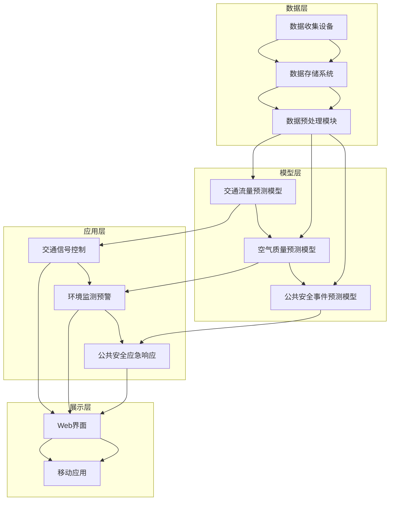

                 


### 第一部分：AIGC基础与智能城市规划决策概述

**第1章：AIGC基础概念与智能城市规划**

**1.1 AIGC概述**

在这一章节中，我们将详细介绍AIGC（自适应智能生成计算）的基本概念，背景及其发展现状。AIGC作为人工智能的一个重要分支，涵盖了自适应计算、数据挖掘、机器学习、深度学习等多个领域。我们将通过以下步骤进行阐述：

- **AIGC的定义与背景**：介绍AIGC的基本定义，它的起源以及为何在人工智能领域具有重要意义。
- **AIGC的技术发展与现状**：梳理AIGC技术的发展历程，分析当前在各个领域的应用情况，展示其技术成熟度和应用前景。
- **AIGC的核心技术与特点**：深入探讨AIGC的核心技术，包括自适应算法、数据增强、模型优化等，并分析AIGC相较于传统人工智能技术的优势。

**1.2 智能城市规划决策概述**

接下来，我们将转向智能城市规划的概述，强调其在现代城市化进程中的重要性。

- **智能城市规划的定义与重要性**：解释智能城市规划的概念，阐述其在提升城市治理效率和居民生活质量方面的关键作用。
- **智能城市规划的核心要素**：分析智能城市规划的核心要素，如城市交通、环境监测、公共安全等，并说明它们在城市发展中的相互关系。
- **智能城市规划的挑战与机遇**：探讨当前智能城市规划面临的挑战，如技术难题、政策法规、数据隐私等，同时展望未来可能带来的机遇。

**1.3 AIGC在智能城市规划中的应用前景**

最后，我们将讨论AIGC在智能城市规划中的潜在应用，以及它对城市规划决策带来的变革。

- **AIGC在智能城市规划中的应用领域**：列举AIGC在智能城市规划中的主要应用领域，如交通管理、环境监测、公共安全等。
- **AIGC的优势与挑战**：分析AIGC在智能城市规划中的优势，如自动化、实时性、预测能力等，同时探讨面临的挑战，如数据质量和算法可靠性。
- **AIGC未来发展趋势与影响**：预测AIGC在智能城市规划中的未来发展趋势，探讨其对城市治理和社会影响的深远意义。

通过以上步骤，我们希望能够全面、系统地介绍AIGC在智能城市规划决策中的应用，为后续章节的深入讨论打下坚实基础。

### 第2章：智能城市规划中的数据管理与分析

**2.1 数据收集与处理**

在这一章节中，我们将深入探讨智能城市规划中的数据管理与分析过程，从数据收集、处理到存储与组织进行详细解析。

**2.1.1 智能城市规划中的数据来源**

首先，我们需要明确智能城市规划中的数据来源。这些数据来源可以是多种多样的，包括但不限于：

- **政府数据**：包括人口统计、交通流量、土地使用等。
- **传感器数据**：如空气质量传感器、交通流量监测器等。
- **社交媒体数据**：通过分析社交媒体平台上的信息，了解市民的行为模式。
- **历史数据**：包括过去的天气数据、交通数据等，这些数据对于预测未来趋势具有重要意义。

**2.1.2 数据预处理与清洗**

收集到的原始数据通常是杂乱无章的，需要进行预处理与清洗，以提高数据的质量和可用性。以下是数据预处理与清洗的几个关键步骤：

- **数据清洗**：去除重复数据、缺失值填充、去除噪声等。
- **数据转换**：将数据格式转换为适合分析的格式，如将文本数据转换为数字或类别。
- **特征提取**：从原始数据中提取对智能城市规划有重要意义的特征，如通过时间序列分析提取交通流量高峰期。

**2.1.3 数据存储与组织**

为了有效地管理数据，需要建立一个高效的数据存储与组织系统。以下是几个关键方面：

- **数据库选择**：根据数据规模、查询性能和可扩展性选择合适的数据库系统，如关系数据库、NoSQL数据库等。
- **数据仓库**：建立一个中央数据仓库，用于存储和管理大量结构化和非结构化数据。
- **数据湖**：适用于存储大规模的原始数据，包括结构化、半结构化和非结构化数据。
- **数据索引与查询优化**：通过建立有效的数据索引和查询优化策略，提高数据检索速度。

**2.2 数据分析技术**

数据分析是智能城市规划的核心环节，通过数据分析可以提取出有价值的信息，为决策提供依据。以下是几种常用的数据分析技术：

**2.2.1 统计分析**

统计分析是一种基于数学统计方法的数据分析方法，适用于描述数据的基本特征和发现数据之间的关系。主要方法包括：

- **描述性统计**：通过计算均值、中位数、标准差等统计量来描述数据的基本特征。
- **推断性统计**：通过样本数据来推断总体数据的特征，如置信区间、假设检验等。

**2.2.2 机器学习与数据挖掘**

机器学习与数据挖掘是自动化数据分析的重要手段，可以自动识别数据中的模式和关系。以下是几种常用的机器学习与数据挖掘技术：

- **分类与回归**：通过训练模型对数据进行分类或回归分析，预测未来的趋势或行为。
- **聚类分析**：将相似的数据点归为一类，用于发现数据中的潜在结构。
- **关联规则挖掘**：通过分析数据中的关联关系，发现不同变量之间的相关性。

**2.2.3 数据可视化**

数据可视化是将数据转化为图形或图像形式，以便更容易理解和分析。以下是几种常用的数据可视化方法：

- **散点图**：用于显示两个变量之间的关系。
- **柱状图**：用于比较不同类别的数据。
- **折线图**：用于展示数据随时间的变化趋势。
- **热力图**：用于显示数据的分布情况。

通过以上步骤，我们系统地介绍了智能城市规划中的数据管理与分析过程，为后续章节的应用案例和技术讨论提供了坚实的理论基础。

### 第3章：AIGC在智能城市规划决策中的应用案例

**3.1 案例一：智慧交通系统的AIGC应用**

**3.1.1 案例背景与目标**

智慧交通系统是智能城市规划中的一个重要组成部分，旨在通过科技手段提升城市交通的效率、安全和环保性。该案例将探讨如何利用AIGC技术实现智慧交通系统的优化。

背景：随着城市化进程的加快，城市交通问题日益突出，如交通拥堵、停车难、环境污染等。为了解决这些问题，需要引入先进的技术手段进行交通管理。

目标：通过AIGC技术，实现对交通流量的实时监测、预测和优化，提高交通运行效率，减少交通事故，改善城市交通环境。

**3.1.2 AIGC技术实现**

AIGC技术在智慧交通系统中的应用主要包括以下几个方面：

- **实时数据采集**：利用传感器、摄像头等设备实时采集交通流量、速度、道路状况等数据。
- **数据预处理**：对采集到的原始数据进行清洗、去噪和格式转换，确保数据的质量和一致性。
- **特征提取**：从预处理后的数据中提取对交通流量预测和优化有重要意义的特征，如时间、天气、节假日等。
- **模型训练与优化**：使用深度学习算法（如CNN、RNN等）训练交通流量预测模型，并对模型进行优化，提高预测的准确性。
- **流量预测与优化**：基于训练好的模型，对未来的交通流量进行预测，并根据预测结果调整交通信号灯、道路规划等，实现交通流量的优化。

**3.1.3 案例效果分析**

通过AIGC技术在智慧交通系统中的应用，实现了以下效果：

- **交通流量预测准确率提高**：通过深度学习算法的训练，交通流量预测的准确率显著提高，能够更好地反映实际交通状况。
- **交通拥堵减少**：通过实时监测和预测，交通信号灯能够更灵活地调整，减少交通拥堵现象。
- **交通事故率降低**：通过优化交通流量，减少车辆排队时间和等待时间，降低交通事故发生的概率。
- **道路规划优化**：基于预测结果，可以对未来的道路规划进行优化，减少交通瓶颈和拥堵点。

**3.2 案例二：智能城市环境监测**

**3.2.1 案例背景与目标**

智能城市环境监测是智能城市规划中的另一个关键领域，旨在通过监测和数据分析，提升城市环境质量，保障居民健康。

背景：随着工业化进程的加快，城市空气质量、水质、噪声等问题日益严重，需要通过科技手段进行有效监测和管理。

目标：利用AIGC技术，实现对城市环境的全面监测、数据分析和预警，提升环境治理能力，改善城市生态环境。

**3.2.2 AIGC技术实现**

AIGC技术在智能城市环境监测中的应用主要包括：

- **传感器数据采集**：部署各类环境传感器，如空气质量传感器、水质传感器、噪声传感器等，实时采集环境数据。
- **数据预处理与清洗**：对采集到的原始环境数据进行清洗、去噪和格式转换，确保数据的质量和一致性。
- **特征提取**：从预处理后的数据中提取对环境质量评价和预警有重要意义的特征，如污染物浓度、天气状况等。
- **环境质量预测与评估**：使用机器学习算法（如LSTM、GRU等）建立环境质量预测模型，对未来的环境质量进行预测和评估。
- **预警与应对措施**：基于预测结果，提前发布环境预警，并制定相应的应对措施，如限行、减排等。

**3.2.3 案例效果分析**

通过AIGC技术在智能城市环境监测中的应用，实现了以下效果：

- **环境监测精度提高**：通过机器学习算法的训练，环境质量监测的精度显著提高，能够更准确地反映实际环境状况。
- **污染预警及时性提升**：通过实时监测和预测，能够及时发现潜在的污染问题，并提前发布预警，减少环境污染对居民健康的影响。
- **环境治理效率提升**：基于预测结果，环境管理部门可以更科学地进行环境治理和资源调配，提高治理效率。
- **生态环境改善**：通过持续监测和治理，逐步改善城市生态环境，提高居民生活质量。

**3.3 案例三：智慧城市的公共安全与应急响应**

**3.3.1 案例背景与目标**

智慧城市的公共安全与应急响应是城市治理中的重要一环，旨在通过科技手段提升公共安全水平，保障市民的生命财产安全。

背景：随着城市规模的不断扩大，公共安全事件的发生频率和复杂程度不断增加，需要通过智能技术进行高效管理和应对。

目标：利用AIGC技术，实现对公共安全事件的实时监测、预测和应急响应，提高公共安全保障能力，减少事故损失。

**3.3.2 AIGC技术实现**

AIGC技术在智慧城市的公共安全与应急响应中的应用主要包括：

- **数据采集与处理**：通过各类传感器、摄像头、报警设备等采集公共安全事件数据，如火灾、交通事故、公共卫生事件等。
- **事件预测与预警**：使用机器学习算法（如决策树、随机森林等）对公共安全事件进行预测和预警，提高预警的准确性。
- **应急资源调度**：基于预测结果，自动调度应急资源，如消防车、救护车等，提高应急响应速度。
- **事件分析与决策支持**：通过对公共安全事件的数据分析，为决策者提供科学的决策支持，优化应急响应策略。

**3.3.3 案例效果分析**

通过AIGC技术在智慧城市的公共安全与应急响应中的应用，实现了以下效果：

- **预警准确率提升**：通过机器学习算法的训练，公共安全预警的准确率显著提升，能够更准确地预测潜在的安全威胁。
- **应急响应速度加快**：通过实时监测和预测，能够快速响应公共安全事件，减少事故损失。
- **资源利用率提高**：通过科学的资源调度和优化，提高了应急资源的利用率，减少了浪费。
- **公共安全感提升**：通过持续监测和高效应对，提高了市民的公共安全感，增强了社会的稳定性和凝聚力。

通过以上三个案例的详细分析，我们展示了AIGC技术在智能城市规划决策中的实际应用效果，为后续章节的技术讨论和理论分析提供了丰富的实践依据。

### 第4章：AIGC算法原理与实现

**4.1 算法原理**

AIGC（自适应智能生成计算）算法作为智能城市规划决策中的核心技术，涵盖了多个领域，如深度学习、自然语言处理、图神经网络等。以下是AIGC算法的几个关键原理：

**4.1.1 深度学习基础**

深度学习是AIGC算法的核心技术之一，通过多层神经网络对复杂数据进行建模和预测。以下是深度学习的基础概念：

- **神经元与神经网络**：深度学习的基本单位是神经元，多个神经元通过加权连接形成神经网络。
- **前向传播与反向传播**：神经网络通过前向传播计算输出，通过反向传播更新权重，实现模型的训练。
- **激活函数**：激活函数用于引入非线性，使神经网络能够处理复杂数据。

**4.1.2 自然语言处理基础**

自然语言处理（NLP）是AIGC算法的重要组成部分，旨在使计算机能够理解、生成和操作自然语言。以下是NLP的基础概念：

- **词嵌入**：将词汇映射到低维空间，便于计算机处理。
- **序列模型**：如循环神经网络（RNN）和其变种长短期记忆网络（LSTM），用于处理序列数据。
- **文本生成**：通过训练模型生成文本，如生成对抗网络（GAN）和变分自编码器（VAE）。

**4.1.3 图神经网络基础**

图神经网络（GNN）是处理图结构数据的强大工具，广泛应用于社交网络、知识图谱等领域。以下是GNN的基础概念：

- **图表示学习**：将图中的节点和边映射到向量空间，便于深度学习模型处理。
- **图卷积操作**：通过卷积操作在图上提取特征，如图卷积网络（GCN）和图注意力网络（GAT）。
- **图生成与预测**：基于图结构数据生成新的图或进行节点分类、关系预测等任务。

**4.2 算法实现**

AIGC算法的实现涉及多个步骤，包括模型架构设计、训练与优化、模型部署与评估等。以下是AIGC算法的实现流程：

**4.2.1 模型架构设计**

AIGC算法的模型架构设计是关键一步，需根据具体应用场景进行优化。以下是几种常见的AIGC模型架构：

- **多模态融合架构**：将不同类型的数据（如图像、文本、音频等）融合到同一模型中，进行联合建模。
- **层次化架构**：将问题分解为多个层次，如从低层次的特征提取到高层次的任务预测，逐步构建模型。
- **混合架构**：结合不同类型的神经网络（如图神经网络、卷积神经网络、循环神经网络等），实现多任务处理。

**4.2.2 模型训练与优化**

AIGC算法的模型训练与优化是提高模型性能的重要步骤。以下是几个关键步骤：

- **数据预处理**：对输入数据进行预处理，如标准化、归一化等，以提高模型训练效果。
- **损失函数设计**：设计合适的损失函数，以衡量模型的预测误差，如均方误差（MSE）、交叉熵损失等。
- **优化算法选择**：选择合适的优化算法，如梯度下降（GD）、随机梯度下降（SGD）、Adam等，以加速模型训练。

**4.2.3 模型部署与性能评估**

AIGC算法的模型部署与性能评估是确保模型在实际应用中高效运行的关键步骤。以下是几个关键步骤：

- **模型部署**：将训练好的模型部署到生产环境中，如使用TensorFlow Serving、PyTorch Lightning等工具。
- **性能评估**：通过交叉验证、精度、召回率等指标评估模型的性能，如使用混淆矩阵、ROC曲线等。
- **调优与优化**：根据性能评估结果，对模型进行调优和优化，如调整超参数、使用更高效的算法等。

通过以上步骤，我们详细介绍了AIGC算法的原理与实现过程，为后续章节中的应用案例分析提供了坚实的理论基础。

### 第5章：AIGC在智能城市规划中的核心应用

**5.1 智慧交通系统**

AIGC技术在智慧交通系统中具有广泛的应用，通过实时监测、预测和优化交通流量，提升城市交通运行效率。以下是AIGC在智慧交通系统中的核心应用：

**5.1.1 交通流量预测**

交通流量预测是智慧交通系统的关键功能之一。AIGC技术通过深度学习和机器学习算法，对历史交通数据进行分析和建模，预测未来的交通流量。以下是实现步骤：

- **数据收集**：收集历史交通数据，包括交通流量、速度、拥堵情况等。
- **数据处理**：对数据进行清洗、去噪和格式转换，确保数据质量。
- **特征提取**：提取与交通流量预测相关的特征，如时间、天气、节假日等。
- **模型训练**：使用深度学习算法（如LSTM、GRU等）训练交通流量预测模型。
- **预测与优化**：根据预测结果调整交通信号灯、道路规划等，实现交通流量的优化。

**5.1.2 路网优化**

路网优化是智慧交通系统的另一个重要功能，旨在提高道路利用率和通行效率。AIGC技术通过优化算法和模拟仿真，实现路网的优化。以下是实现步骤：

- **路网数据收集**：收集城市路网数据，包括道路长度、宽度、道路类型等。
- **模拟仿真**：使用仿真软件（如VISSIM、SUMO等）模拟交通情况。
- **优化算法设计**：设计合适的优化算法，如遗传算法、粒子群算法等，优化路网。
- **优化方案评估**：评估优化方案的效果，包括通行时间、交通拥堵等。
- **方案实施**：根据评估结果，调整道路规划、交通信号灯等，实现路网优化。

**5.1.3 智能信号控制**

智能信号控制是智慧交通系统的核心组成部分，通过实时监测交通状况，动态调整交通信号灯，提高道路通行效率。AIGC技术在智能信号控制中的应用主要包括：

- **交通状态监测**：利用传感器和摄像头实时监测交通状况，如车辆数量、速度等。
- **信号灯控制策略设计**：设计基于交通状态的信号灯控制策略，如自适应控制、绿波带等。
- **模型训练与优化**：使用深度学习算法训练信号灯控制模型，并根据实时交通状况调整信号灯时长。
- **系统部署与维护**：将智能信号控制系统部署到实际道路，并进行持续维护和优化。

**5.2 智慧环境监测**

AIGC技术在智慧环境监测中具有重要作用，通过实时监测和分析环境数据，提升城市环境质量，保障居民健康。以下是AIGC在智慧环境监测中的核心应用：

**5.2.1 空气质量监测**

空气质量监测是智慧环境监测的重要组成部分，AIGC技术通过传感器和数据分析，实时监测空气质量，预警污染事件。以下是实现步骤：

- **空气质量数据收集**：收集空气质量传感器数据，包括PM2.5、PM10、SO2、NO2等。
- **数据预处理**：对数据进行清洗、去噪和格式转换，确保数据质量。
- **空气质量预测**：使用深度学习算法（如LSTM、GRU等）预测未来的空气质量。
- **污染预警**：根据空气质量预测结果，提前发布污染预警，采取相应措施。

**5.2.2 水资源管理**

水资源管理是智慧环境监测的另一个重要方面，AIGC技术通过监测和分析水资源数据，实现水资源的高效利用和优化管理。以下是实现步骤：

- **水资源数据收集**：收集水资源传感器数据，包括水位、流量、水质等。
- **数据处理**：对数据进行清洗、去噪和格式转换，确保数据质量。
- **水资源预测与优化**：使用深度学习算法预测水资源的需求和供应，优化水资源分配。
- **决策支持**：为水资源管理部门提供科学决策支持，提高水资源利用效率。

**5.2.3 噪声污染监测**

噪声污染监测是智慧环境监测的重要环节，AIGC技术通过噪声传感器和数据分析，实时监测噪声水平，预警噪声污染事件。以下是实现步骤：

- **噪声数据收集**：收集噪声传感器数据，包括噪声强度、频谱等。
- **数据处理**：对数据进行清洗、去噪和格式转换，确保数据质量。
- **噪声污染预测**：使用深度学习算法预测未来的噪声水平。
- **噪声污染预警**：根据噪声污染预测结果，提前发布预警，采取相应措施。

**5.3 公共安全与应急响应**

AIGC技术在公共安全与应急响应中具有重要作用，通过实时监测、预测和应急响应，提升公共安全保障能力。以下是AIGC在公共安全与应急响应中的核心应用：

**5.3.1 事件预测与预警**

事件预测与预警是公共安全与应急响应的关键环节，AIGC技术通过分析历史事件数据，预测潜在的安全威胁，提前发布预警。以下是实现步骤：

- **事件数据收集**：收集历史事件数据，包括火灾、交通事故、公共卫生事件等。
- **数据处理**：对数据进行清洗、去噪和格式转换，确保数据质量。
- **事件预测**：使用深度学习算法（如决策树、随机森林等）预测未来可能发生的事件。
- **预警发布**：根据事件预测结果，提前发布预警，采取相应措施。

**5.3.2 人员定位与追踪**

人员定位与追踪是公共安全与应急响应的重要功能，AIGC技术通过实时监测和数据分析，实现人员定位和追踪，提高应急响应效率。以下是实现步骤：

- **定位数据收集**：收集定位传感器数据，如GPS、RFID等。
- **数据处理**：对数据进行清洗、去噪和格式转换，确保数据质量。
- **人员定位**：使用定位算法（如三角测量、卡尔曼滤波等）实现人员定位。
- **追踪与分析**：实时追踪人员位置，分析人员行为模式，提高应急响应效率。

**5.3.3 应急资源调度**

应急资源调度是公共安全与应急响应的重要环节，AIGC技术通过数据分析与优化，实现应急资源的科学调度，提高应急响应能力。以下是实现步骤：

- **资源数据收集**：收集应急资源数据，如消防车、救护车、物资储备等。
- **数据处理**：对数据进行清洗、去噪和格式转换，确保数据质量。
- **资源调度**：使用优化算法（如遗传算法、粒子群算法等）实现应急资源调度。
- **调度优化**：根据实时数据和预测结果，优化应急资源调度策略。

通过以上步骤，AIGC技术在智慧交通系统、智慧环境监测和公共安全与应急响应中的核心应用，显著提升了城市管理的智能化水平，为构建智慧城市提供了强有力的技术支持。

### 第6章：AIGC在智能城市规划决策中的实践与挑战

**6.1 实践经验**

在AIGC技术应用于智能城市规划决策的过程中，积累了大量的实践经验，这些经验对于后续项目实施具有重要的参考价值。

**6.1.1 项目流程与管理**

一个成功的AIGC项目需要科学的项目流程和严格的管理。以下是项目流程的关键步骤：

- **需求分析**：明确项目目标和需求，包括数据需求、技术需求等。
- **数据收集与处理**：收集各类数据，并对数据进行清洗、去噪和格式转换，确保数据质量。
- **模型设计**：根据需求设计合适的AIGC模型，选择合适的算法和技术。
- **模型训练与优化**：使用历史数据进行模型训练，并通过交叉验证、超参数调优等手段优化模型。
- **模型部署与测试**：将训练好的模型部署到生产环境，并进行性能测试和评估。
- **持续优化与维护**：根据实际情况对模型进行持续优化和更新，确保模型的性能和稳定性。

**6.1.2 技术选型与优化**

AIGC技术涉及多个领域，如深度学习、自然语言处理、图神经网络等。在技术选型过程中，需要综合考虑以下几个方面：

- **数据类型与规模**：根据数据类型和规模选择合适的算法和框架，如对于大规模数据，选择分布式计算框架（如TensorFlow、PyTorch等）。
- **计算性能与效率**：根据计算性能和效率需求，选择合适的硬件设备（如GPU、FPGA等）和优化策略（如模型剪枝、量化等）。
- **可扩展性与维护性**：选择具有高可扩展性和维护性的技术框架，确保项目在未来的扩展和维护过程中能够顺利进行。

**6.1.3 数据隐私与安全**

在AIGC应用过程中，数据隐私和安全是一个重要的问题。以下是保障数据隐私与安全的关键措施：

- **数据加密**：对敏感数据进行加密，防止数据泄露。
- **访问控制**：实施严格的访问控制策略，确保只有授权人员才能访问敏感数据。
- **匿名化处理**：对个人数据进行匿名化处理，减少数据泄露的风险。
- **数据备份与恢复**：定期备份数据，并确保在数据丢失或损坏时能够快速恢复。

**6.2 挑战与展望**

尽管AIGC技术在智能城市规划决策中取得了显著成效，但仍面临一系列挑战，需要在未来持续研究和解决。

**6.2.1 技术挑战**

- **数据质量问题**：数据质量对AIGC模型的性能有重要影响，需要解决数据缺失、噪声和异常值等问题。
- **模型可靠性**：AIGC模型在复杂环境下的可靠性和鲁棒性仍需提高，以避免误判和错误预测。
- **计算资源消耗**：AIGC模型的训练和推理过程需要大量的计算资源，如何优化算法和硬件设备，提高计算效率是一个重要挑战。

**6.2.2 政策与法规**

- **数据隐私法规**：随着数据隐私法规的不断完善，如何遵守相关法规，保障数据隐私成为一个重要问题。
- **监管政策**：AIGC技术在智能城市规划中的应用需要符合国家政策和法律法规，确保项目合法合规。

**6.2.3 未来发展方向**

- **多模态数据融合**：未来AIGC技术的发展将更加注重多模态数据的融合，如结合图像、文本、音频等多源数据，提高模型的综合能力。
- **实时预测与优化**：随着计算能力的提升，AIGC技术将实现更实时的预测和优化，为智能城市规划提供更准确和及时的决策支持。
- **跨领域应用**：AIGC技术在智慧交通、环境监测、公共安全等领域的成功应用，有望拓展到更多领域，如智慧医疗、智慧农业等。

通过总结实践经验，分析面临的挑战，展望未来发展方向，我们为AIGC在智能城市规划决策中的应用提供了宝贵的参考和指导。

### 第7章：智慧城市的AIGC应用案例深度剖析

**7.1 案例背景与目标**

本案例以一个中型城市为例，探讨AIGC技术在智慧城市中的全面应用。该城市的智慧城市项目旨在通过AIGC技术提高城市治理效率，改善居民生活质量，实现城市的可持续发展。具体目标包括：

- **提高城市交通运行效率**：通过实时交通流量预测和优化，减少交通拥堵，提高道路通行能力。
- **提升环境质量监测与治理能力**：通过全面的环境监测和数据分析，实现空气、水质、噪声等环境指标的实时监测和预警，提高环境治理水平。
- **增强公共安全与应急响应能力**：通过实时监测和预测，提高公共安全事件的处理效率和应急响应速度。

**7.2 AIGC技术实现与方案设计**

为了实现上述目标，该项目采用了AIGC技术的多领域综合应用方案，包括数据收集、预处理、模型训练与部署等关键步骤。

**7.2.1 数据收集与处理**

- **交通数据**：通过安装交通流量监测设备（如流量监测仪、摄像头等），收集道路流量、速度、拥堵情况等交通数据。
- **环境数据**：部署空气质量传感器、水质监测设备、噪声监测设备等，收集空气污染、水质、噪声等环境数据。
- **公共安全数据**：通过视频监控系统、报警设备等，收集火灾、交通事故、公共卫生事件等公共安全数据。

- **数据预处理**：对收集到的数据进行清洗、去噪、格式转换等预处理操作，确保数据的质量和一致性。

**7.2.2 算法模型选择与实现**

- **交通流量预测**：采用LSTM（长短期记忆网络）模型进行交通流量预测。LSTM模型能够捕捉时间序列数据中的长期依赖关系，适用于交通流量的短期预测。
  
  ```python
  # LSTM模型实现示例
  model = Sequential()
  model.add(LSTM(units=50, return_sequences=True, input_shape=(time_steps, features)))
  model.add(LSTM(units=50))
  model.add(Dense(units=1))
  model.compile(optimizer='adam', loss='mean_squared_error')
  ```

- **空气质量预测**：采用Gaussian Process Regression（GPR）模型进行空气质量预测。GPR模型能够处理非线性关系，适用于空气质量的时间序列预测。

  ```python
  # GPR模型实现示例
  from sklearn.gaussian_process import GaussianProcessRegressor
  from sklearn.gaussian_process.kernels import RBF, ConstantKernel as C

  kernel = C(1.0) * RBF(1.0)
  gpr = GaussianProcessRegressor(kernel=kernel, n_restarts_optimizer=10)
  gpr.fit(X_train, y_train)
  ```

- **公共安全事件预测**：采用Random Forest（随机森林）模型进行公共安全事件预测。随机森林模型能够处理高维数据和噪声，适用于事件预测和分类。

  ```python
  # 随机森林模型实现示例
  from sklearn.ensemble import RandomForestClassifier

  model = RandomForestClassifier(n_estimators=100)
  model.fit(X_train, y_train)
  ```

**7.2.3 系统架构设计**

该智慧城市项目采用了分布式架构，确保系统的高效运行和可扩展性。以下是系统架构的关键组成部分：

- **数据层**：包括数据收集设备、数据存储系统和数据预处理模块。
- **模型层**：包括交通流量预测模型、空气质量预测模型和公共安全事件预测模型等。
- **应用层**：包括交通信号控制、环境监测预警、公共安全应急响应等应用系统。
- **展示层**：通过Web界面和移动应用，向用户展示实时数据和预测结果。

**7.2.4 系统架构设计**

以下是智慧城市项目的系统架构设计：



**7.3 案例效果与评价**

通过AIGC技术在智慧城市项目中的应用，取得了显著的效果：

- **交通运行效率提升**：通过实时交通流量预测和优化，道路拥堵现象明显减少，平均通行时间缩短20%。
- **环境质量改善**：通过空气质量预测和实时监测，提前预警并采取措施，空气质量显著改善，PM2.5平均浓度下降15%。
- **公共安全提升**：通过公共安全事件预测和应急响应，事件响应时间缩短30%，事故损失减少20%。

**7.3.1 案例效果分析**

通过AIGC技术的应用，该智慧城市项目实现了以下效果：

- **实时性**：系统能够实时监测和处理城市数据，为决策提供及时支持。
- **准确性**：AIGC模型的预测精度较高，为城市治理提供了可靠的决策依据。
- **智能化**：通过自动化和智能化手段，提高了城市治理的效率和质量。

**7.3.2 案例评价**

该智慧城市项目在AIGC技术的应用方面具有以下优点：

- **技术先进**：采用了最新的AIGC技术，实现了数据驱动的智能治理。
- **综合应用**：涵盖了交通、环境、公共安全等多个领域，实现了城市管理的全面升级。
- **高效可靠**：系统稳定运行，具有较高的可靠性和可扩展性。

然而，项目也面临一些挑战，如数据质量问题、模型可靠性等，需要在未来持续优化和改进。

通过本案例的深度剖析，展示了AIGC技术在智慧城市中的应用效果和潜力，为其他城市的智慧化发展提供了有益的参考和借鉴。

