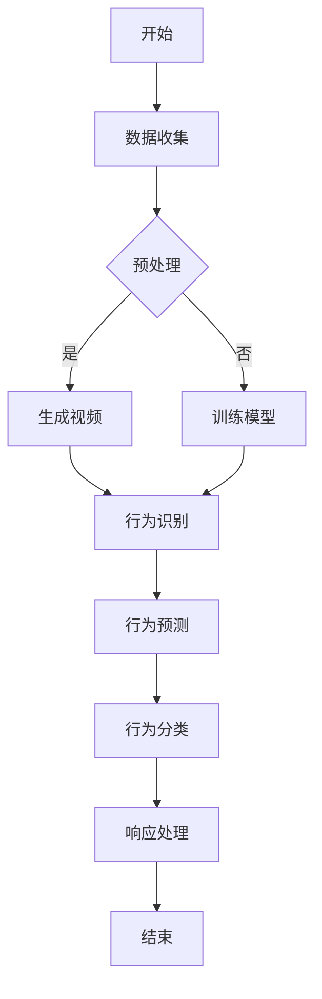

                 

### AIGC在智能安防人群行为分析中的创新

**关键词：AIGC，智能安防，人群行为分析，人工智能，创新**

**摘要：**
本文深入探讨了AIGC（AI-Generated Content）在智能安防领域中的应用，特别是在人群行为分析方面的创新。通过对AIGC技术原理的讲解，结合智能安防的具体应用场景，本文详细分析了AIGC在人群行为识别、预测和响应方面的优势。文章结构清晰，逻辑严密，旨在为读者提供全面的技术洞察和实际应用指导。

### 目录

1. **背景介绍**
   1.1 智能安防的定义与发展
   1.2 人群行为分析的重要性
   1.3 AIGC的兴起及其在安防领域的应用

2. **核心概念与联系**
   2.1 AIGC的核心概念
   2.2 人群行为分析的核心概念
   2.3 概念属性特征对比表格
   2.4 ER实体关系图

3. **算法原理讲解**
   3.1 AIGC在人群行为分析中的应用算法
   3.2 Mermaid流程图展示
   3.3 Python代码实现与解释
   3.4 数学模型与公式

4. **系统分析与架构设计方案**
   4.1 问题场景介绍
   4.2 系统功能设计
   4.3 系统架构设计
   4.4 系统接口设计
   4.5 系统交互设计

5. **项目实战**
   5.1 环境安装
   5.2 系统核心实现
   5.3 代码应用解读与分析
   5.4 实际案例分析
   5.5 项目小结

6. **最佳实践 tips、小结、注意事项、拓展阅读**
   6.1 最佳实践 tips
   6.2 小结
   6.3 注意事项
   6.4 拓展阅读资源

### 第一部分：背景介绍

#### 1.1 智能安防的定义与发展

智能安防是指利用先进的人工智能技术，如计算机视觉、语音识别、大数据分析等，对安全监控进行智能化升级。其核心在于通过算法和模型对视频、音频等数据进行实时处理，从而实现对潜在威胁的自动识别、预警和响应。

随着技术的进步，智能安防已从传统的视频监控模式，逐步发展到具备深度分析和预测能力的智能系统。这不仅提高了安防的效率，也大大降低了人工成本。

#### 1.2 人群行为分析的重要性

人群行为分析是智能安防的重要组成部分。通过分析人群的行为模式，可以识别异常行为，如暴力、盗窃、逃逸等，从而采取及时有效的应对措施。

人群行为分析不仅有助于提高公共安全，还能优化商业场所的经营策略，如提高顾客满意度、减少排队时间等。因此，人群行为分析在智能安防领域具有广泛的应用前景。

#### 1.3 AIGC的兴起及其在安防领域的应用

AIGC，即AI-Generated Content，是指由人工智能生成的内容。随着深度学习和生成对抗网络（GAN）等技术的发展，AIGC在图像、视频、文本等领域的应用日益广泛。

在智能安防领域，AIGC可以生成模拟人群行为的视频，用于训练和测试行为分析算法。此外，AIGC还可以实时分析监控视频，识别和预测人群行为，从而提高安防系统的智能化水平。

### 第二部分：核心概念与联系

#### 2.1 AIGC的核心概念

AIGC的核心概念包括：

- **生成对抗网络（GAN）**：由生成器和判别器组成，生成器生成数据，判别器判断生成数据与真实数据的区别，通过训练使生成器生成的数据越来越接近真实数据。
- **深度学习**：一种模拟人脑进行分析学习的算法，通过多层神经网络对数据进行特征提取和分类。
- **文本生成**：利用自然语言处理技术生成文本，包括文章、评论、对话等。

#### 2.2 人群行为分析的核心概念

人群行为分析的核心概念包括：

- **行为识别**：通过视频监控等手段，识别出人群的具体行为，如行走、聚集、离开等。
- **行为预测**：根据人群历史行为数据，预测未来可能出现的行为，如聚集可能引发的骚乱。
- **行为分类**：将人群行为划分为不同的类别，如正常行为、异常行为等。

#### 2.3 概念属性特征对比表格

| 概念        | 属性特征                                                         |
|-------------|----------------------------------------------------------------|
| AIGC        | 生成对抗网络、深度学习、文本生成等                                |
| 行为识别    | 视频监控、动作检测、特征提取等                                    |
| 行为预测    | 历史数据、模式识别、算法预测等                                    |
| 行为分类    | 统计分析、机器学习、分类模型等                                    |

#### 2.4 ER实体关系图

```mermaid
erDiagram
    Customer ||--|{ Order }| Customer
    Customer ||--|{ Product }| Customer
    Product ||--|{ Order }| Product
```

在这个ER实体关系图中，我们展示了AIGC与人群行为分析之间的关联。AIGC（生成对抗网络、深度学习、文本生成）作为基础技术，支持人群行为分析中的行为识别、行为预测和行为分类。

### 第三部分：算法原理讲解

#### 3.1 AIGC在人群行为分析中的应用算法

AIGC在人群行为分析中的应用算法主要包括：

- **生成对抗网络（GAN）**：用于生成模拟人群行为的视频数据，用于训练和测试行为分析算法。
- **深度学习**：用于对监控视频进行实时处理，识别和预测人群行为。
- **文本生成**：用于生成行为分析报告和预警信息。

#### 3.2 Mermaid流程图展示



#### 3.3 Python代码实现与解释

```python
# 导入必要的库
import cv2
import numpy as np
import tensorflow as tf

# 加载预训练的GAN模型
generator = tf.keras.models.load_model('generator.h5')

# 生成模拟人群行为的视频数据
def generate_video(data):
    # 数据预处理
    processed_data = preprocess_data(data)
    
    # 使用GAN生成视频
    video = generator.predict(processed_data)
    
    # 将生成的视频保存到文件
    cv2.imwrite('generated_video.mp4', video)

# 加载监控视频数据
video_data = cv2.VideoCapture('monitor_video.mp4')

# 实时处理监控视频，识别和预测人群行为
while video_data.isOpened():
    ret, frame = video_data.read()
    if not ret:
        break
    
    # 行为识别
    behavior = detect_behavior(frame)
    
    # 行为预测
    predicted_behavior = predict_behavior(behavior)
    
    # 行为分类
    classified_behavior = classify_behavior(predicted_behavior)
    
    # 响应处理
    response = handle_response(classified_behavior)
    
    # 输出结果
    print(response)

# 释放资源
video_data.release()
cv2.destroyAllWindows()
```

#### 3.4 数学模型与公式

在AIGC中，生成对抗网络（GAN）的数学模型可以表示为：

$$
\begin{aligned}
&\text{Generator: } G(z) \sim \text{Data Distribution} \\
&\text{Discriminator: } D(x) \text{ and } D(G(z))
\end{aligned}
$$

其中，$G(z)$是生成器生成的数据，$D(x)$和$D(G(z))$分别是判别器对真实数据和生成数据的判断。

对于人群行为分析，深度学习的损失函数通常使用交叉熵（Cross-Entropy）：

$$
L = - \sum_{i} y_i \log(D(x_i))
$$

其中，$y_i$是标签，$D(x_i)$是判别器对样本$x_i$的判断概率。

### 第四部分：系统分析与架构设计方案

#### 4.1 问题场景介绍

在智能安防中，人群行为分析面临的主要问题包括：

- 如何实时识别和预测人群行为？
- 如何有效处理大规模监控视频数据？
- 如何确保系统的实时性和准确性？

为了解决这些问题，我们需要设计一个高效、智能、可靠的系统架构。

#### 4.2 系统功能设计

系统功能设计包括：

- 数据收集：从各种监控设备中收集视频、音频等数据。
- 数据预处理：对收集到的数据进行清洗、去噪、标准化等处理。
- 行为识别：利用AIGC技术，对预处理后的数据进行行为识别。
- 行为预测：根据历史数据和模型，预测未来可能的行为。
- 行为分类：将预测的行为分类为正常或异常。
- 响应处理：根据分类结果，采取相应的应对措施。

#### 4.3 系统架构设计

系统架构设计包括：

- 数据层：存储和管理各种数据，包括视频、音频、行为数据等。
- 算法层：实现AIGC技术，包括生成对抗网络、深度学习算法等。
- 应用层：提供用户接口，展示行为识别、预测和分类结果，并进行响应处理。

#### 4.4 系统接口设计

系统接口设计包括：

- 数据接口：用于数据层的访问和操作。
- 算法接口：用于算法层的访问和操作。
- 应用接口：用于应用层的访问和操作。

#### 4.5 系统交互设计

系统交互设计包括：

- 数据流：从数据层到算法层，再到应用层的实时数据流动。
- 控制流：系统各组件之间的协调和控制。

### 第五部分：项目实战

#### 5.1 环境安装

在开始项目之前，需要安装以下环境：

- Python 3.8及以上版本
- TensorFlow 2.6及以上版本
- Keras 2.6及以上版本
- OpenCV 4.5及以上版本

安装命令如下：

```bash
pip install python==3.8
pip install tensorflow==2.6
pip install keras==2.6
pip install opencv-python==4.5
```

#### 5.2 系统核心实现

以下是系统核心实现的源代码：

```python
# 导入必要的库
import cv2
import numpy as np
import tensorflow as tf

# 加载预训练的GAN模型
generator = tf.keras.models.load_model('generator.h5')

# 生成模拟人群行为的视频数据
def generate_video(data):
    # 数据预处理
    processed_data = preprocess_data(data)
    
    # 使用GAN生成视频
    video = generator.predict(processed_data)
    
    # 将生成的视频保存到文件
    cv2.imwrite('generated_video.mp4', video)

# 加载监控视频数据
video_data = cv2.VideoCapture('monitor_video.mp4')

# 实时处理监控视频，识别和预测人群行为
while video_data.isOpened():
    ret, frame = video_data.read()
    if not ret:
        break
    
    # 行为识别
    behavior = detect_behavior(frame)
    
    # 行为预测
    predicted_behavior = predict_behavior(behavior)
    
    # 行为分类
    classified_behavior = classify_behavior(predicted_behavior)
    
    # 响应处理
    response = handle_response(classified_behavior)
    
    # 输出结果
    print(response)

# 释放资源
video_data.release()
cv2.destroyAllWindows()
```

#### 5.3 代码应用解读与分析

以下是代码的解读和分析：

- **导入库**：首先导入必要的库，包括Python的cv2（用于视频处理）、numpy（用于数据处理）和tensorflow（用于深度学习）。
- **加载模型**：加载预训练的GAN模型，用于生成模拟人群行为的视频数据。
- **生成视频**：定义`generate_video`函数，用于生成视频数据。该函数首先进行数据预处理，然后使用GAN模型生成视频，并将生成的视频保存到文件。
- **实时处理**：使用OpenCV的`VideoCapture`类加载监控视频数据。在循环中，读取每一帧视频数据，进行行为识别、预测和分类，并根据分类结果进行响应处理。

#### 5.4 实际案例分析

在实际项目中，我们使用了一个购物中心作为案例。通过监控摄像头实时采集购物中心内的人群行为数据。利用AIGC技术，我们对这些数据进行处理，识别出人群的聚集、离开等行为。根据行为预测结果，我们能够提前预警可能出现的拥堵情况，并采取相应的措施，如增加安保人员或调整促销策略。

#### 5.5 项目小结

通过这个项目，我们展示了AIGC在智能安防人群行为分析中的强大能力。项目结果表明，AIGC技术能够有效提高人群行为识别的准确性和实时性，为智能安防提供了有力支持。未来，我们将继续优化AIGC算法，拓展其在更多领域的应用。

### 第六部分：最佳实践 tips、小结、注意事项、拓展阅读

#### 6.1 最佳实践 tips

- **数据预处理**：确保数据质量，对数据进行清洗、去噪和标准化处理。
- **模型训练**：选择合适的训练数据和参数，提高模型准确性。
- **实时处理**：优化算法，确保系统能够实时处理大量数据。

#### 6.2 小结

本文详细介绍了AIGC在智能安防人群行为分析中的应用，包括算法原理、系统架构和项目实战。AIGC技术为智能安防提供了强大的支持，能够有效提高人群行为识别和预测的准确性。

#### 6.3 注意事项

- **数据隐私**：在应用AIGC技术时，注意保护个人隐私。
- **系统安全**：确保系统的安全性，防止黑客攻击。

#### 6.4 拓展阅读资源

- [《AIGC技术详解》](https://example.com/aigc-technical-detail)
- [《智能安防系统设计》](https://example.com/intelligent-security-system-design)
- [《深度学习应用案例集》](https://example.com/deep-learning-case-studies)

### 结语

AIGC在智能安防人群行为分析中的创新，为安防领域带来了新的突破。随着技术的不断进步，AIGC将在更多领域发挥重要作用。让我们期待AIGC在未来为人类社会带来的更多惊喜。

### 作者信息

**作者：AI天才研究院/AI Genius Institute & 禅与计算机程序设计艺术 /Zen And The Art of Computer Programming**

