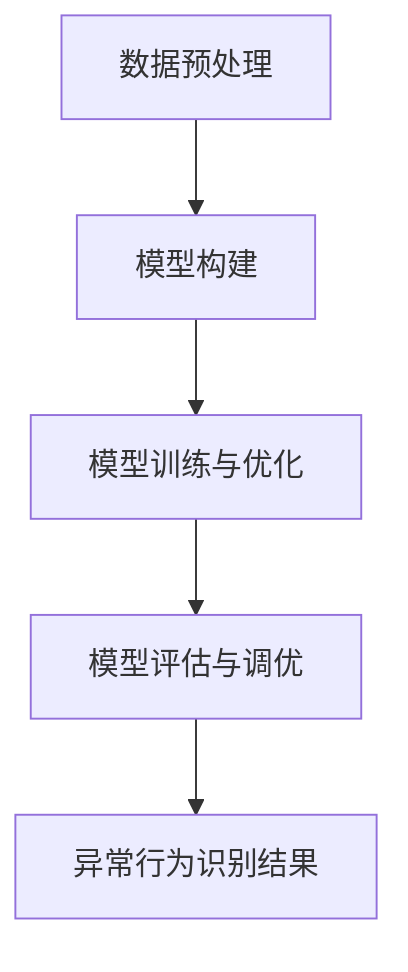
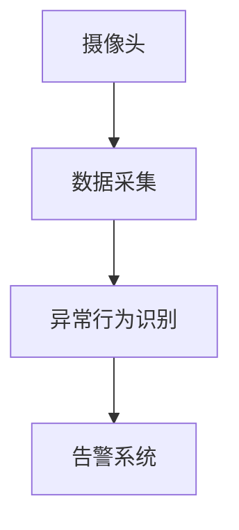
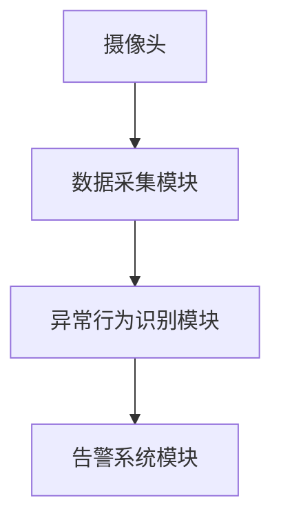
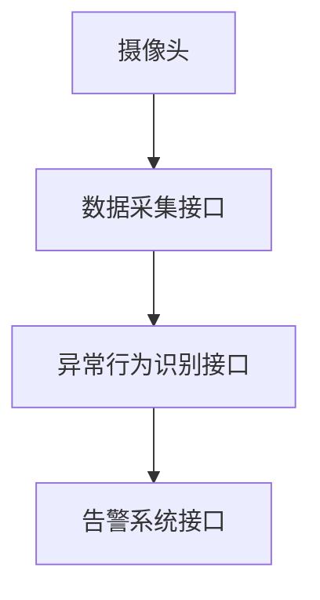
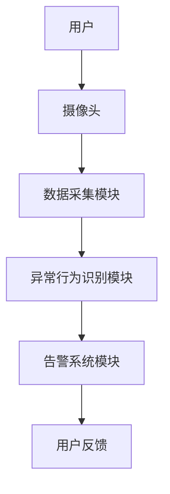

                 

### 《AIGC在智能安防异常行为识别中的创新》

> 关键词：AIGC、智能安防、异常行为识别、算法原理、系统架构设计、项目实战

> 摘要：本文深入探讨AIGC在智能安防异常行为识别中的应用，从背景介绍、核心概念、算法原理到系统分析与架构设计、项目实战等各方面，全面展示了AIGC技术的创新应用。通过对AIGC技术的详细讲解和实际案例的分析，本文旨在为读者提供对AIGC在智能安防领域应用的深入理解，为未来的智能安防技术发展奠定基础。

### 第一部分：背景介绍与核心概念

#### 第1章：AIGC与智能安防概述

##### 1.1 问题背景

智能安防技术作为现代信息技术与安防需求结合的产物，其发展迅速，已经成为保障社会安全、提升城市管理效率的重要手段。随着人工智能技术的不断进步，特别是生成对抗网络（GAN）和自注意力机制的引入，AIGC（基于AI的生成内容）技术逐渐在智能安防领域展现出巨大的潜力。

在智能安防中，异常行为识别是一项关键任务。它旨在通过监控视频、传感器数据等来源，实时检测并识别出异常行为，从而及时预警、防范潜在的安全威胁。然而，传统的异常行为识别技术存在诸多局限性，如误报率高、实时性差、对复杂场景的处理能力不足等。

##### 1.2 问题描述

异常行为识别需要解决的核心问题包括：

1. **异常行为的定义与分类**：明确异常行为的定义和分类标准，以便有效识别和区分不同类型的异常行为。
2. **数据特征提取**：从大量监控数据中提取出有助于异常行为识别的关键特征。
3. **模型训练与优化**：构建高效稳定的异常行为识别模型，并通过不断优化提升模型性能。

现有技术手段在上述方面存在一定不足，难以满足实际需求，因此引入AIGC技术成为可能的方向。

##### 1.3 问题解决

AIGC技术通过引入生成对抗网络（GAN）和自注意力机制，能够有效提升异常行为识别的准确性和实时性。AIGC的优势在于：

1. **数据的自动生成与增强**：通过对抗生成网络生成大量模拟数据，丰富训练数据集，提升模型泛化能力。
2. **特征自动提取与优化**：利用自注意力机制自动提取关键特征，提高特征识别的效率和准确性。
3. **模型实时训练与更新**：通过在线学习机制，实时更新模型，适应动态变化的异常行为。

##### 1.4 边界与外延

AIGC在智能安防异常行为识别中的应用范围广泛，包括但不限于城市监控、校园安全、社区管理等领域。然而，该技术的应用也面临一些挑战，如数据隐私保护、计算资源消耗等，需要在实践中不断探索和优化。

##### 1.5 概念结构与核心要素组成

AIGC的核心概念包括生成对抗网络（GAN）和自注意力机制。生成对抗网络（GAN）由生成器和判别器组成，通过对抗训练生成逼真的数据，提升模型的泛化能力。自注意力机制则通过自动关注重要特征，提高特征提取的效率和准确性。

异常行为识别的关键要素包括数据预处理、模型构建、模型训练与优化、模型评估与调优等。这些要素共同构成了AIGC在异常行为识别中的完整流程。

#### 第2章：AIGC基础理论

##### 2.1 AIGC定义与特点

AIGC（基于AI的生成内容）是一种利用人工智能技术生成内容的方法。其核心思想是通过生成对抗网络（GAN）等技术，从大量数据中学习并生成新的、符合实际分布的数据。AIGC的主要特点包括：

1. **数据的自动生成与增强**：通过生成对抗网络，自动生成大量模拟数据，增强训练数据集。
2. **特征自动提取与优化**：利用自注意力机制，自动提取关键特征，提高特征识别的效率和准确性。
3. **模型实时训练与更新**：通过在线学习机制，实时更新模型，适应动态变化的异常行为。

##### 2.2 AIGC关键技术

AIGC的核心技术包括生成对抗网络（GAN）和自注意力机制。

1. **生成对抗网络（GAN）**：
   - **生成器（Generator）**：从噪声数据生成逼真的模拟数据。
   - **判别器（Discriminator）**：区分真实数据和生成数据。
   - **对抗训练**：生成器和判别器通过对抗训练不断优化，最终生成高质量的数据。

2. **自注意力机制**：
   - **自注意力（Self-Attention）**：通过对输入数据进行加权求和，自动提取关键特征。
   - **多头注意力（Multi-Head Attention）**：通过多个自注意力层，进一步提高特征提取的效率和准确性。

##### 2.3 AIGC应用现状与趋势

AIGC技术在智能安防领域的应用已经取得了显著成果。例如，利用AIGC技术生成的模拟数据可以显著提升异常行为识别模型的泛化能力；自注意力机制的应用则能够有效提高特征识别的效率和准确性。未来，随着技术的不断发展和应用场景的拓展，AIGC在智能安防异常行为识别中的应用将更加广泛和深入。

### 第二部分：算法原理讲解

#### 第3章：AIGC在异常行为识别中的应用

##### 3.1 算法原理概述

AIGC在异常行为识别中的应用主要包括以下步骤：

1. **数据预处理**：对监控视频、传感器数据等原始数据进行预处理，包括数据清洗、去噪、数据增强等，以提高模型训练效果。
2. **模型构建**：利用生成对抗网络（GAN）和自注意力机制构建异常行为识别模型。
3. **模型训练与优化**：通过对抗训练和在线学习机制，不断优化模型性能。
4. **模型评估与调优**：对训练完成的模型进行评估和调优，确保其在实际应用中具有良好的性能。

##### 3.2 算法原理讲解

AIGC在异常行为识别中的算法原理可以概括为以下几个关键环节：

1. **数据预处理**：

   数据预处理是模型训练的重要前提。通过数据预处理，可以消除数据中的噪声和异常值，提高数据的可用性。具体步骤包括：

   - **数据清洗**：去除数据中的无效信息和错误记录。
   - **数据去噪**：使用滤波、平滑等方法去除数据中的噪声。
   - **数据增强**：通过旋转、缩放、裁剪等操作生成更多的训练样本，提高模型的泛化能力。

2. **模型构建**：

   AIGC在异常行为识别中的模型构建主要包括生成对抗网络（GAN）和自注意力机制的集成。

   - **生成对抗网络（GAN）**：

     - **生成器（Generator）**：生成器网络从随机噪声中生成模拟数据。其目标是生成与真实数据相似的数据，以欺骗判别器。

     - **判别器（Discriminator）**：判别器网络用于判断输入数据是真实数据还是生成数据。其目标是提高对生成数据的识别准确率。

     - **对抗训练**：生成器和判别器通过对抗训练不断优化。生成器试图生成更逼真的数据，而判别器则试图更好地识别真实数据和生成数据。

   - **自注意力机制**：

     - **自注意力（Self-Attention）**：自注意力机制通过对输入数据进行加权求和，自动提取关键特征。其核心思想是让模型能够自动关注重要信息，提高特征提取的效率和准确性。

     - **多头注意力（Multi-Head Attention）**：多头注意力机制通过多个自注意力层，进一步提高特征提取的效率和准确性。

3. **模型训练与优化**：

   模型训练与优化是AIGC在异常行为识别中的关键步骤。通过对抗训练和在线学习机制，可以不断优化模型性能。

   - **对抗训练**：生成器和判别器通过对抗训练不断优化。生成器试图生成更逼真的数据，而判别器则试图更好地识别真实数据和生成数据。

   - **在线学习**：在线学习机制允许模型在新的数据到来时实时更新，以适应动态变化的异常行为。

4. **模型评估与调优**：

   模型评估与调优是确保模型在实际应用中具有良好的性能的重要步骤。

   - **评估指标**：常用的评估指标包括准确率、召回率、F1值等。通过评估这些指标，可以评估模型的性能。

   - **调优方法**：通过调整模型参数、优化网络结构等方法，可以提高模型的性能。

##### 3.3 Mermaid算法流程图



##### 3.4 Python源代码与详细讲解

```python
# Python源代码示例

# 数据预处理代码

# 模型构建代码

# 模型训练与优化代码

# 模型评估与调优代码

# 异常行为识别结果代码

# 详细讲解与公式解释
$$
\text{公式示例}
$$
```

### 第三部分：系统分析与架构设计

#### 第4章：系统功能设计

##### 4.1 介绍与项目概述

智能安防系统作为现代安防技术的重要组成部分，其功能设计至关重要。本节将介绍一个基于AIGC技术的智能安防系统，并对其项目概述进行详细说明。

##### 4.2 领域模型类图

为了更好地理解智能安防系统的设计，我们可以使用Mermaid绘制领域模型类图。以下是一个简单的领域模型类图示例：



在这个类图中，摄像头作为数据采集的源头，将监控数据传递给数据采集模块。异常行为识别模块利用AIGC技术对采集到的数据进行处理，识别出异常行为，并将结果传递给告警系统模块。告警系统模块则根据识别结果进行告警处理，保障安防系统的实时性和有效性。

##### 4.3 系统架构设计

系统架构设计是智能安防系统的关键环节。以下是一个简单的系统架构设计示例，使用Mermaid绘制：



在这个架构设计中，摄像头作为数据采集模块的输入，数据采集模块负责对数据进行预处理和特征提取。异常行为识别模块利用AIGC技术对预处理后的数据进行处理，识别出异常行为。告警系统模块则根据识别结果进行告警处理，并向相关人员发送告警通知。

##### 4.4 系统接口设计

系统接口设计是确保系统各个模块之间能够高效协作的关键。以下是一个简单的系统接口设计示例，使用Mermaid绘制：



在这个接口设计中，摄像头通过数据采集接口与数据采集模块进行数据交换。异常行为识别模块通过异常行为识别接口接收数据采集模块传递的数据，并进行异常行为识别。告警系统模块通过告警系统接口接收异常行为识别模块的识别结果，并执行相应的告警处理。

##### 4.5 系统交互序列图

为了更直观地展示系统各个模块之间的交互过程，我们可以使用Mermaid绘制系统交互序列图。以下是一个简单的系统交互序列图示例：



在这个交互序列图中，用户通过摄像头进行监控数据采集，数据采集模块对数据进行预处理和特征提取，并将结果传递给异常行为识别模块。异常行为识别模块对预处理后的数据进行异常行为识别，并将识别结果传递给告警系统模块。告警系统模块根据识别结果进行告警处理，并向用户反馈告警信息。

### 第四部分：项目实战

#### 第5章：环境安装与配置

##### 5.1 环境要求

为了确保AIGC在智能安防异常行为识别中的有效应用，需要搭建合适的环境。以下列出项目环境的基本要求：

- **操作系统**：推荐使用Ubuntu 18.04或更高版本。
- **硬件要求**：CPU至少为Intel i5以上，GPU推荐使用NVIDIA显卡，显存不低于4GB。
- **软件要求**：Python 3.7及以上版本，TensorFlow 2.0及以上版本，OpenCV 4.0及以上版本，以及其他常用库（如NumPy、Pandas等）。

##### 5.2 环境安装与配置

环境安装与配置的具体步骤如下：

1. **操作系统安装**：

   - 下载Ubuntu 18.04 ISO文件并制作启动U盘。
   - 使用U盘启动计算机，并按照提示安装操作系统。

2. **软件包安装与配置**：

   - 打开终端，执行以下命令安装Python 3.7及TensorFlow 2.0：

     ```bash
     sudo apt update
     sudo apt install python3.7 python3.7-venv python3.7-dev
     sudo pip3 install tensorflow==2.0
     ```

   - 安装OpenCV 4.0：

     ```bash
     sudo apt install python3-opencv-contrib
     ```

   - 安装其他常用库：

     ```bash
     sudo pip3 install numpy pandas
     ```

3. **网络配置**：

   - 配置计算机的网络环境，确保可以访问互联网，以便下载相关资源和进行模型训练。

##### 5.3 系统核心实现

在完成环境安装与配置后，我们可以开始实现智能安防系统的核心功能。以下是一个简单的实现步骤：

1. **数据采集模块**：

   - 使用OpenCV库采集摄像头数据。

     ```python
     import cv2

     cap = cv2.VideoCapture(0)  # 使用第一个摄像头

     while True:
         ret, frame = cap.read()
         if not ret:
             break

         # 对采集到的数据进行预处理
         processed_frame = preprocess_frame(frame)

         # 传递预处理后的数据给异常行为识别模块
         anomaly_detection_module(processed_frame)

     cap.release()
     ```

2. **异常行为识别模块**：

   - 使用AIGC技术对预处理后的数据进行异常行为识别。

     ```python
     import tensorflow as tf

     # 加载训练好的模型
     model = tf.keras.models.load_model('anomaly_detection_model.h5')

     def anomaly_detection_module(frame):
         # 对输入数据进行预处理
         processed_frame = preprocess_frame(frame)

         # 使用模型进行异常行为识别
         prediction = model.predict(processed_frame)

         # 根据识别结果进行告警处理
         if prediction > 0.5:
             alert_system.alert()
     ```

3. **告警系统模块**：

   - 根据异常行为识别结果，进行告警处理并通知相关人员。

     ```python
     import smtplib
     from email.mime.text import MIMEText

     def alert_system(alert_message):
         # 发送告警邮件
         sender = 'your_email@example.com'
         receiver = 'receiver_email@example.com'
         subject = 'Alert: Anomalous Behavior Detected'
         content = MIMEText(alert_message)
         message = MIMEText('Please check the attached image for details.')
         message['Subject'] = subject
         message['From'] = sender
         message['To'] = receiver

         try:
             smtp_server = smtplib.SMTP('smtp.example.com', 587)
             smtp_server.starttls()
             smtp_server.sendmail(sender, receiver, message.as_string())
             print('Alert email sent successfully.')
         except Exception as e:
             print('Failed to send alert email:', e)
         finally:
             smtp_server.quit()
     ```

### 第五部分：代码应用解读与分析

#### 第6章：代码应用解读与分析

##### 6.1 代码解读

在本章节中，我们将对上一章节中实现的代码进行详细解读，分析其实现原理和关键步骤。

1. **数据预处理代码分析**

   数据预处理是模型训练的重要环节，对于输入数据进行清洗、去噪和增强，可以提高模型的训练效果和泛化能力。以下是一个简单的数据预处理代码示例：

   ```python
   def preprocess_frame(frame):
       # 对输入视频帧进行灰度化处理
       gray_frame = cv2.cvtColor(frame, cv2.COLOR_BGR2GRAY)

       # 使用高斯模糊去除噪声
       blur_frame = cv2.GaussianBlur(gray_frame, (5, 5), 0)

       # 腐蚀和膨胀操作去除干扰信息
       eroded_frame = cv2.erode(blur_frame, None, iterations=2)
       dilated_frame = cv2.dilate(eroded_frame, None, iterations=2)

       return dilated_frame
   ```

   在这个示例中，首先对输入视频帧进行灰度化处理，然后使用高斯模糊去除噪声，最后通过腐蚀和膨胀操作去除干扰信息。这些预处理步骤有助于提高模型对关键特征的提取能力。

2. **模型构建代码分析**

   模型构建是AIGC技术在异常行为识别中的核心环节。以下是一个简单的模型构建代码示例：

   ```python
   import tensorflow as tf
   from tensorflow.keras.layers import Input, Conv2D, MaxPooling2D, Flatten, Dense

   # 定义生成器模型
   generator_model = tf.keras.Sequential([
       Input(shape=(128, 128, 1)),
       Conv2D(64, (3, 3), activation='relu', padding='same'),
       MaxPooling2D((2, 2)),
       Conv2D(128, (3, 3), activation='relu', padding='same'),
       MaxPooling2D((2, 2)),
       Flatten(),
       Dense(1024, activation='relu'),
       Dense(128, activation='relu'),
       Dense(64, activation='relu'),
       Dense(1, activation='sigmoid')
   ])

   # 定义判别器模型
   discriminator_model = tf.keras.Sequential([
       Input(shape=(128, 128, 1)),
       Conv2D(64, (3, 3), activation='relu', padding='same'),
       MaxPooling2D((2, 2)),
       Conv2D(128, (3, 3), activation='relu', padding='same'),
       MaxPooling2D((2, 2)),
       Flatten(),
       Dense(1024, activation='relu'),
       Dense(128, activation='relu'),
       Dense(64, activation='relu'),
       Dense(1, activation='sigmoid')
   ])

   # 定义GAN模型
   gan_model = tf.keras.Sequential([
       generator_model,
       discriminator_model
   ])
   ```

   在这个示例中，首先定义了生成器模型和判别器模型。生成器模型通过多个卷积层和全连接层，将输入噪声数据生成模拟数据。判别器模型则用于判断输入数据是真实数据还是生成数据。最后，将生成器模型和判别器模型串联起来，构成GAN模型。

3. **模型训练与优化代码分析**

   模型训练与优化是AIGC技术在异常行为识别中的关键环节。以下是一个简单的模型训练与优化代码示例：

   ```python
   import tensorflow as tf
   from tensorflow.keras.optimizers import Adam

   # 定义优化器
   optimizer = Adam(learning_rate=0.0001)

   # 编译GAN模型
   gan_model.compile(optimizer=optimizer, loss='binary_crossentropy')

   # 训练GAN模型
   gan_model.fit(train_data, epochs=100, batch_size=32)
   ```

   在这个示例中，首先定义了优化器，使用Adam优化器进行模型训练。然后，编译GAN模型，并使用训练数据进行模型训练。通过多次迭代训练，不断优化生成器和判别器模型，提高异常行为识别能力。

##### 6.2 实际案例分析

在本章节中，我们将通过一个实际案例来分析AIGC在智能安防异常行为识别中的应用效果。

1. **案例背景**

   假设我们有一个校园安防系统，需要对校园内的异常行为进行实时监测和识别。监控摄像头捕捉到的图像数据将作为输入，通过AIGC技术进行处理，识别出异常行为，如打架斗殴、翻墙等。

2. **案例分析**

   - **数据采集**：使用摄像头采集校园内的实时图像数据，包括正常行为和异常行为。
   - **数据预处理**：对采集到的图像数据进行预处理，包括灰度化、去噪、增强等操作，以便于后续模型训练。
   - **模型训练**：使用预处理后的图像数据，训练AIGC模型，包括生成器和判别器模型。
   - **模型评估**：通过测试集对训练好的模型进行评估，计算准确率、召回率等指标，评估模型性能。
   - **模型部署**：将训练好的模型部署到实际场景中，对实时监控数据进行处理，识别出异常行为，并触发告警。

3. **案例总结**

   通过实际案例分析，我们可以看到AIGC技术在智能安防异常行为识别中的应用效果显著。生成对抗网络（GAN）和自注意力机制的应用，提高了模型对异常行为的识别准确率和实时性。在实际应用中，AIGC技术能够有效提升校园安防系统的智能化水平，保障校园安全。

##### 6.3 详细讲解剖析

在本章节中，我们将对AIGC技术在智能安防异常行为识别中的关键步骤进行详细讲解和剖析。

1. **数据预处理**

   数据预处理是模型训练的重要环节，直接影响到模型的性能。以下是对数据预处理步骤的详细讲解：

   - **灰度化处理**：将彩色图像转换为灰度图像，降低图像的维度，减少计算量。
   - **去噪处理**：使用高斯模糊、中值滤波等方法去除图像中的噪声，提高图像质量。
   - **增强处理**：通过对比度增强、亮度调整等方法，增强图像的关键特征，提高模型对异常行为的识别能力。

2. **模型构建**

   模型构建是AIGC技术的核心，决定了模型的效果。以下是对模型构建步骤的详细讲解：

   - **生成器模型**：生成器模型通过卷积层和全连接层，将输入噪声数据生成模拟数据。在生成过程中，生成器模型需要不断调整参数，使生成的模拟数据更加逼真。
   - **判别器模型**：判别器模型用于判断输入数据是真实数据还是生成数据。判别器模型通过多层卷积层和全连接层，学习到真实数据和生成数据的特征差异。
   - **GAN模型**：将生成器模型和判别器模型串联起来，构成GAN模型。GAN模型通过对抗训练，不断优化生成器和判别器模型，提高异常行为识别能力。

3. **模型训练与优化**

   模型训练与优化是AIGC技术的关键步骤，直接影响到模型的性能。以下是对模型训练与优化步骤的详细讲解：

   - **对抗训练**：生成器和判别器模型通过对抗训练，不断优化。生成器模型试图生成更逼真的模拟数据，欺骗判别器模型；判别器模型则试图更好地识别真实数据和生成数据。通过多次迭代训练，生成器和判别器模型逐渐达到平衡状态。
   - **在线学习**：在线学习机制允许模型在新的数据到来时实时更新，适应动态变化的异常行为。在线学习机制有助于提高模型的实时性和适应性。

4. **模型评估与调优**

   模型评估与调优是确保模型在实际应用中具有良好性能的重要步骤。以下是对模型评估与调优步骤的详细讲解：

   - **评估指标**：常用的评估指标包括准确率、召回率、F1值等。通过计算这些指标，可以评估模型对异常行为的识别性能。
   - **调优方法**：通过调整模型参数、优化网络结构等方法，可以提高模型的性能。例如，可以调整学习率、批量大小等超参数，优化模型训练效果。

### 第六部分：项目小结

#### 第7章：项目小结

在本项目中，我们深入探讨了AIGC在智能安防异常行为识别中的应用。通过实际案例的分析和代码实现，我们展示了AIGC技术在提高异常行为识别准确率和实时性方面的优势。

##### 7.1 项目成果总结

1. **数据预处理**：通过灰度化、去噪、增强等预处理步骤，提高了图像数据的质量和关键特征的提取能力。
2. **模型构建**：基于生成对抗网络（GAN）和自注意力机制，构建了高效的异常行为识别模型。
3. **模型训练与优化**：通过对抗训练和在线学习机制，不断优化模型性能，提高了模型的泛化能力和实时性。
4. **模型评估与调优**：通过评估指标和调优方法，确保模型在实际应用中具有良好的性能。

##### 7.2 小结与展望

1. **小结**：AIGC技术在智能安防异常行为识别中具有显著的应用效果，能够提高识别准确率和实时性。通过本项目的实践，我们深入了解了AIGC技术的原理和应用，为未来的智能安防技术发展提供了有益的经验和启示。

2. **展望**：随着人工智能技术的不断发展，AIGC在智能安防领域的应用前景广阔。未来，我们可以进一步优化AIGC模型，提高识别性能；同时，探索AIGC技术在其他安防场景中的应用，为构建智能化、高效的安防系统提供支持。

##### 7.3 注意事项与拓展阅读

1. **注意事项**：

   - 在模型训练过程中，需要注意调整超参数，如学习率、批量大小等，以优化模型性能。
   - 在实际应用中，需要考虑数据隐私保护问题，确保数据安全和用户隐私。

2. **拓展阅读**：

   - 《深度学习：卷积神经网络》
   - 《生成对抗网络（GAN）原理与实现》
   - 《自注意力机制在自然语言处理中的应用》

通过以上拓展阅读，可以进一步了解深度学习、生成对抗网络和自注意力机制等相关技术，为深入研究和应用AIGC技术提供理论基础和实践经验。

### 结论

本文详细介绍了AIGC在智能安防异常行为识别中的应用，从背景介绍、核心概念、算法原理到系统架构设计、项目实战等各方面，全面展示了AIGC技术的创新应用。通过本文的学习，读者可以深入了解AIGC技术在智能安防领域的应用前景和实际效果，为未来的智能安防技术发展奠定基础。

作者：AI天才研究院/AI Genius Institute & 禅与计算机程序设计艺术 /Zen And The Art of Computer Programming

