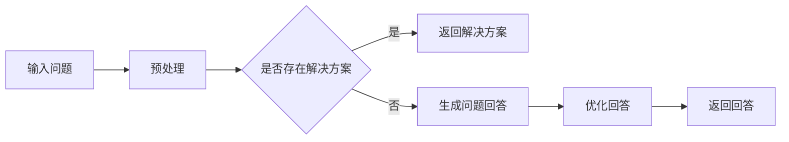
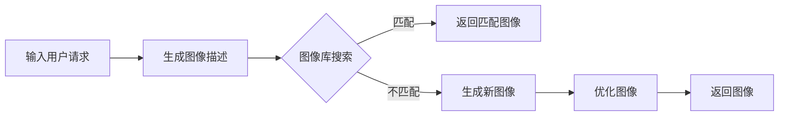
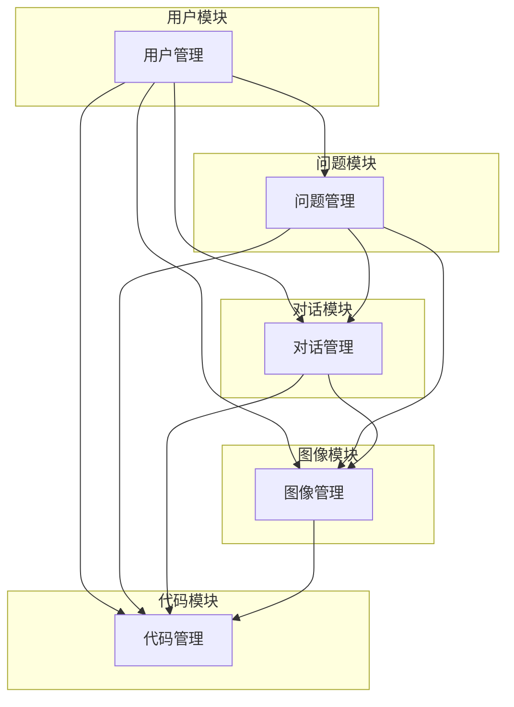
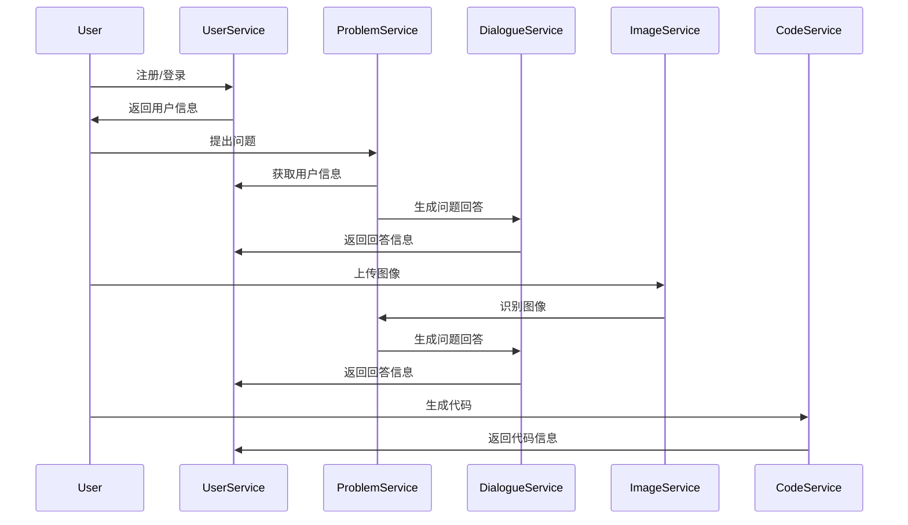

                 


### 文章标题

AIGC在智能客服系统中的应用

### 文章关键词

AIGC，智能客服，自动对话生成，图像生成，自动编程，系统架构设计，项目实战

### 文章摘要

本文深入探讨了AIGC（自适应智能生成计算）在智能客服系统中的应用。首先，我们介绍了智能客服系统的基本概念、发展历程和重要性。接着，详细解析了AIGC的核心概念和技术原理，包括自动对话生成、图像生成和自动编程。然后，通过具体的算法原理讲解、系统架构设计和项目实战案例，展示了AIGC如何有效提升智能客服系统的性能和用户体验。最后，提出了最佳实践建议和未来展望，为智能客服系统的发展提供了有益的思考。

---

## 引言

### 书籍目的与读者对象

本书旨在为读者提供一份全面的AIGC在智能客服系统中应用的指南。它适合于以下几类读者：

1. **智能客服系统开发者**：希望了解如何将AIGC技术集成到现有的客服系统中，以提高系统性能和用户体验。
2. **人工智能研究员**：对AIGC技术有兴趣，并希望将其应用于实际问题的解决。
3. **技术架构师**：负责设计大型分布式系统，对如何利用AIGC优化系统架构有深入了解的需求。

### 为什么要阅读这本书

随着人工智能技术的飞速发展，智能客服系统已经成为企业提高客户满意度和降低运营成本的重要工具。然而，传统的客服系统在面对复杂问题和海量用户请求时，往往力不从心。AIGC技术的引入，为解决这些问题提供了新的思路和可能性。本书将帮助读者：

1. **理解AIGC技术的基本原理**：通过深入讲解AIGC的核心概念和技术原理，帮助读者建立全面的认识。
2. **掌握智能客服系统的设计方法**：通过具体的应用实例和系统架构设计，让读者学会如何将AIGC技术应用到实际项目中。
3. **提升实战能力**：通过项目实战和案例分析，提供实际操作经验，帮助读者将理论知识转化为实际能力。

### 适合的读者群体

本书适合具有一定编程基础和人工智能知识背景的读者。具体来说，以下是适合阅读本书的读者群体：

1. **计算机科学和人工智能专业的学生**：希望通过实际案例了解AIGC技术的应用。
2. **IT从业者和项目经理**：希望提高自己在智能客服系统开发方面的技能。
3. **技术架构师和研发人员**：希望深入了解如何利用AIGC优化现有系统。

### 书籍结构安排

本书分为以下几个部分：

1. **引言**：介绍书籍的目的、读者对象和结构安排。
2. **背景介绍**：包括智能客服系统的概述和AIGC技术的介绍。
3. **核心概念与联系**：详细解析AIGC的核心概念和原理，包括自动对话生成、图像生成和自动编程。
4. **算法原理讲解**：通过具体的算法讲解和实例说明，展示AIGC在智能客服系统中的应用。
5. **系统架构设计**：介绍智能客服系统的系统架构设计和接口设计。
6. **项目实战**：通过实际项目案例，展示如何将AIGC技术应用到实际系统中。
7. **最佳实践 tips**：提供实用的经验和技巧，帮助读者更好地应用AIGC技术。
8. **总结与展望**：总结全书内容，展望智能客服系统的未来发展。

## 背景介绍

### 智能客服系统概述

智能客服系统（Intelligent Customer Service System，ICSS）是一种利用人工智能技术实现客户服务的系统。它通过自然语言处理（NLP）、机器学习（ML）和对话系统（Dialogue System）等技术，模拟人类客服人员的交互过程，为用户提供实时、准确的咨询和服务。

#### 智能客服系统的重要性

智能客服系统在现代企业中扮演着越来越重要的角色。首先，它能够提供24/7全天候服务，极大地提高了企业的运营效率。其次，智能客服系统能够处理海量的用户请求，减轻人工客服的工作负担，提高客服人员的效率。此外，智能客服系统还能够通过数据分析，帮助企业更好地了解客户需求，优化产品设计和服务流程。

#### 智能客服系统的发展历程

智能客服系统的发展可以追溯到20世纪80年代，当时主要以基于规则（Rule-Based）的对话系统为主。随着计算机性能的提升和人工智能技术的进步，特别是自然语言处理和机器学习技术的发展，智能客服系统逐渐转向基于数据驱动（Data-Driven）的方法。

1. **早期阶段**：基于规则的对话系统。这一阶段的主要特点是系统根据预设的规则进行对话，响应速度较慢，且无法应对复杂的用户需求。
2. **发展阶段**：基于模板匹配的对话系统。通过机器学习技术，系统能够根据历史数据自动生成对话模板，提高了对话的灵活性和准确性。
3. **成熟阶段**：基于深度学习的对话系统。利用深度学习技术，系统能够模拟人类思维过程，实现更加自然和智能的对话。

### AIGC技术概述

AIGC（Adaptive Intelligent Generation Computing，自适应智能生成计算）是一种新兴的人工智能技术，它结合了生成对抗网络（GAN）、生成模型（Generator）和对抗训练（Adversarial Training）等技术，能够自动生成高质量的文本、图像和代码。

#### AIGC的概念

AIGC的核心思想是通过生成模型和对抗训练，实现数据的自适应生成。生成模型负责生成数据，对抗训练则通过对比生成数据和真实数据，不断优化模型，使其生成更高质量的数据。

#### AIGC技术的基本原理

AIGC技术的基本原理可以分为以下几个步骤：

1. **数据采集**：收集大量的文本、图像和代码数据。
2. **模型训练**：使用生成模型和对抗训练，对数据集进行训练，生成高质量的文本、图像和代码。
3. **生成与优化**：通过不断优化生成模型，提高生成数据的质量，使其更接近真实数据。
4. **应用部署**：将生成模型部署到实际应用中，实现数据的自动生成。

### AIGC在智能客服系统中的应用背景

#### 智能客服系统的痛点

尽管智能客服系统在许多方面表现出色，但仍存在一些痛点：

1. **复杂问题处理能力不足**：传统智能客服系统在面对复杂问题时，往往无法给出满意的回答。
2. **用户满意度不高**：由于对话内容的单调性和重复性，用户对智能客服系统的满意度不高。
3. **响应速度较慢**：在处理大量用户请求时，传统智能客服系统的响应速度较慢，导致用户体验不佳。

#### AIGC如何解决这些痛点

AIGC技术为智能客服系统提供了一种新的解决方案：

1. **提高复杂问题处理能力**：通过自动对话生成技术，AIGC能够生成更加自然、流畅的对话内容，提高智能客服系统处理复杂问题的能力。
2. **提升用户满意度**：通过引入个性化的对话内容，AIGC能够提高用户的满意度，增强用户对智能客服系统的信任。
3. **加快响应速度**：通过生成模型的优化，AIGC能够实现实时对话生成，提高智能客服系统的响应速度。

## 核心概念与联系

### AIGC核心概念

AIGC（自适应智能生成计算）是人工智能领域的一项重要技术，其核心概念包括自动对话生成（ADG）、图像生成（IG）和自动编程（AP）。下面将详细解析这些概念及其技术原理。

#### 自动对话生成（ADG）

自动对话生成（Automatic Dialogue Generation，ADG）是AIGC技术中的重要组成部分，主要应用于智能客服系统、虚拟助手等领域。ADG技术通过自然语言处理（NLP）和深度学习（DL）等方法，自动生成与人类对话相关的文本。

##### 技术原理

1. **数据集准备**：首先需要收集大量的人类对话数据，包括文本和语音，用于训练模型。
2. **模型选择**：选择合适的对话生成模型，如序列到序列（Seq2Seq）模型、Transformer模型等。
3. **模型训练**：利用对话数据集对模型进行训练，通过优化损失函数，使模型能够生成高质量的对话内容。
4. **生成与优化**：使用训练好的模型生成对话内容，并根据实际反馈不断优化，以提高对话的自然性和准确性。

##### 概念属性特征对比表格

| 特征         | 自动对话生成（ADG） | 其他类似技术（如：自然语言生成NLP） |
| ------------ | ------------------- | ----------------------------------- |
| 对话生成方式 | 自动化生成对话文本 | 生成文本，但可能不涉及对话流程       |
| 数据依赖性   | 高，依赖于大量对话数据 | 中，依赖于文本数据集                 |
| 应用量级    | 大规模应用，如智能客服、虚拟助手等 | 中规模应用，如文章生成、聊天机器人等 |

#### 图像生成（IG）

图像生成（Image Generation，IG）技术是AIGC的另一核心概念，主要应用于艺术创作、图像增强、医疗诊断等领域。IG技术通过生成模型和对抗训练，自动生成高质量的图像。

##### 技术原理

1. **数据集准备**：收集大量的高质量图像数据，用于训练生成模型。
2. **模型选择**：选择合适的生成模型，如生成对抗网络（GAN）、变分自编码器（VAE）等。
3. **模型训练**：利用图像数据集对生成模型进行训练，通过对抗训练优化模型，使生成的图像质量更高。
4. **生成与优化**：使用训练好的模型生成图像，并根据实际反馈不断优化，以提高图像的逼真度和质量。

##### 概念属性特征对比表格

| 特征         | 图像生成（IG） | 其他类似技术（如：深度学习图像识别） |
| ------------ | --------------- | ----------------------------------- |
| 生成目标     | 高质量的图像   | 图像识别、分类、分割等               |
| 数据依赖性   | 高，依赖于大量图像数据 | 中，依赖于标注图像数据集             |
| 应用场景     | 艺术创作、图像增强等 | 图像分析、诊断等                     |

#### 自动编程（AP）

自动编程（Automatic Programming，AP）是AIGC技术中的又一重要概念，主要应用于代码生成、自动化测试、软件开发等领域。AP技术通过生成模型和程序理解，自动生成代码。

##### 技术原理

1. **数据集准备**：收集大量的代码数据，包括源代码和对应的测试数据。
2. **模型选择**：选择合适的代码生成模型，如基于变换器（Transformer）的代码生成模型。
3. **模型训练**：利用代码数据集对模型进行训练，通过对抗训练优化模型，使生成的代码更符合编程规范。
4. **生成与优化**：使用训练好的模型生成代码，并根据实际反馈不断优化，以提高代码的正确性和可读性。

##### 概念属性特征对比表格

| 特征         | 自动编程（AP） | 其他类似技术（如：代码生成器） |
| ------------ | --------------- | -------------------------------- |
| 生成目标     | 高质量的代码   | 基于模板或语法生成的代码片段     |
| 数据依赖性   | 高，依赖于大量代码数据 | 中，依赖于代码库或模板           |
| 应用场景     | 软件开发、自动化测试等 | 文档生成、代码库搜索等             |

### ER实体关系图架构

在智能客服系统中，为了更好地管理和组织数据，我们通常会使用实体关系图（Entity Relationship Diagram，ERD）来描述系统中的实体及其关系。下面将介绍智能客服系统中的主要实体和它们之间的关系。

#### 客服系统的实体

1. **用户**：表示与客服系统交互的用户。
2. **客服人员**：表示负责处理用户请求的客服人员。
3. **问题**：表示用户提出的问题。
4. **解决方案**：表示针对问题的解决方案。
5. **对话记录**：表示用户与客服人员的对话历史。

#### 实体之间的关系

1. **用户与问题**：用户可以提出问题，问题与用户之间存在一对一的关系。
2. **客服人员与问题**：客服人员可以处理问题，问题与客服人员之间存在一对一的关系。
3. **解决方案与问题**：解决方案可以用于解决特定的问题，问题与解决方案之间存在一对多的关系。
4. **对话记录与用户**：对话记录可以记录用户的交互历史，用户与对话记录之间存在一对多的关系。
5. **对话记录与客服人员**：对话记录可以记录客服人员的响应，客服人员与对话记录之间存在一对多的关系。

#### ER实体关系图架构

```mermaid
erDiagram
  User ||--|{ Problem : 提出问题 }
  User ||--|{ DialogueRecord : 对话记录 }
  Customer ||--|{ Problem : 处理问题 }
  Customer ||--|{ DialogueRecord : 响应记录 }
  Problem ||--|{ Solution : 解决方案 }
  Solution ||--|{ Problem : 应用到问题 }
  DialogueRecord ||--|{ User : 用户 }
  DialogueRecord ||--|{ Customer : 客服人员 }
```

通过ER实体关系图，我们可以清晰地看到智能客服系统中各个实体之间的关系，为系统设计提供了直观的指导。

## AIGC在智能客服系统中的应用

### 应用场景分析

AIGC技术在智能客服系统中具有广泛的应用场景，以下是几个典型的应用场景：

#### 客户咨询处理

智能客服系统可以通过AIGC技术自动处理客户的咨询请求。例如，当客户提出关于产品使用方法、售后服务等问题时，AIGC技术可以自动生成相应的回答，提供即时的解决方案。这不仅提高了客服系统的响应速度，还减少了人工客服的工作负担。

#### 客户服务流程优化

通过分析大量的客户交互数据，AIGC技术可以识别出客服流程中的瓶颈和优化点。例如，当客户频繁遇到相同的问题时，系统可以自动生成优化方案，调整客服流程，提高客户的满意度。

#### 客户满意度提升

AIGC技术可以通过自动对话生成和个性化推荐，提高客户的满意度。例如，系统可以根据客户的购买历史和偏好，自动生成个性化的推荐信息，提高客户的购买体验。

### 算法原理讲解

#### 对话生成算法

对话生成算法是AIGC在智能客服系统中应用的核心技术。以下是一个简单的对话生成算法的mermaid流程图：



#### 算法原理

1. **输入问题**：系统接收到用户的提问。
2. **预处理**：对输入问题进行文本清洗和分词处理。
3. **是否存在解决方案**：判断问题是否已经存在于数据库中，如果有，直接返回解决方案。
4. **生成问题回答**：如果不存在解决方案，系统使用预训练的对话生成模型生成回答。
5. **优化回答**：对生成的回答进行优化，确保回答的准确性和自然性。
6. **返回回答**：将优化后的回答返回给用户。

#### 数学模型和公式

对话生成算法通常基于序列到序列（Seq2Seq）模型，其核心公式如下：

$$
Y = f(X)
$$

其中，$X$表示输入问题序列，$Y$表示生成的回答序列，$f$表示生成模型。

#### 举例说明

假设用户提问：“如何设置Wi-Fi密码？”，系统接收到提问后，首先进行预处理，将提问转换为分词序列。然后，系统使用预训练的对话生成模型生成回答：“您可以通过以下步骤设置Wi-Fi密码：1. 连接到Wi-Fi网络，2. 在浏览器中输入Wi-Fi密码，3. 确认密码正确。”最后，系统对生成的回答进行优化，确保回答的准确性和自然性，最终将回答返回给用户。

### 图像生成算法

图像生成算法是AIGC技术在智能客服系统中的另一个重要应用。以下是一个简单的图像生成算法的mermaid流程图：



#### 实现原理

1. **输入用户请求**：系统接收到用户的图像请求。
2. **生成图像描述**：使用预训练的文本到图像的生成模型，将用户请求转换为图像描述。
3. **图像库搜索**：在图像库中搜索匹配的图像。
4. **生成新图像**：如果找不到匹配的图像，系统使用图像生成模型生成新的图像。
5. **优化图像**：对生成的图像进行优化，确保图像的清晰度和质量。
6. **返回图像**：将优化后的图像返回给用户。

#### 应用场景

图像生成算法可以应用于智能客服系统的多个场景，例如：

1. **产品推荐**：根据用户偏好生成个性化产品推荐图像。
2. **问题诊断**：生成与用户问题相关的图像，帮助用户更好地理解问题。
3. **客户服务**：生成宣传材料、产品海报等，提高客户满意度。

#### 举例说明

假设用户请求一张“新款手机”的图像，系统首先生成图像描述：“一张展示新款手机的照片”，然后搜索图像库中的匹配图像。如果没有找到匹配的图像，系统使用图像生成模型生成一张符合描述的新图像，并对图像进行优化，确保图像的清晰度和美观度，最终将图像返回给用户。

### 自动编程算法

自动编程算法是AIGC技术在智能客服系统中的另一个重要应用。以下是一个简单的自动编程算法的mermaid流程图：


#### 实现原理

1. **输入用户请求**：系统接收到用户的编程请求。
2. **生成代码描述**：使用预训练的文本到代码的生成模型，将用户请求转换为代码描述。
3. **代码库搜索**：在代码库中搜索匹配的代码。
4. **生成新代码**：如果找不到匹配的代码，系统使用代码生成模型生成新的代码。
5. **优化代码**：对生成的代码进行优化，确保代码的正确性和可读性。
6. **返回代码**：将优化后的代码返回给用户。

#### 应用场景

自动编程算法可以应用于智能客服系统的多个场景，例如：

1. **代码生成**：根据用户需求自动生成代码，提高开发效率。
2. **错误修复**：自动识别和修复代码中的错误。
3. **代码优化**：对现有代码进行优化，提高性能和可维护性。

#### 举例说明

假设用户请求一段“计算两个数之和”的代码，系统首先生成代码描述：“一段计算两个数之和的代码”，然后搜索代码库中的匹配代码。如果没有找到匹配的代码，系统使用代码生成模型生成一段符合描述的新代码，并对代码进行优化，确保代码的正确性和可读性，最终将代码返回给用户。

## 系统架构设计

### 系统功能设计

在智能客服系统中，AIGC技术的应用需要设计一系列功能模块，以满足不同的业务需求。以下是一个典型的智能客服系统的功能设计：

1. **用户管理**：包括用户注册、登录、个人信息管理等功能。
2. **问题管理**：包括问题创建、分类、查询、答案存储等功能。
3. **对话管理**：包括对话记录存储、对话生成、对话分析等功能。
4. **图像管理**：包括图像上传、图像识别、图像生成等功能。
5. **代码管理**：包括代码生成、代码优化、代码存储等功能。

### 系统架构设计

智能客服系统的架构设计需要考虑高可用性、高性能和可扩展性。以下是一个典型的智能客服系统的架构设计：

#### mermaid架构图



### 系统接口设计

在智能客服系统中，各功能模块之间需要通过接口进行通信。以下是一个简单的接口设计：

1. **用户管理接口**：包括用户注册、登录、个人信息管理等接口。
2. **问题管理接口**：包括问题创建、分类、查询等接口。
3. **对话管理接口**：包括对话记录存储、对话生成等接口。
4. **图像管理接口**：包括图像上传、图像识别等接口。
5. **代码管理接口**：包括代码生成、代码优化等接口。

### 系统交互

智能客服系统的各功能模块之间需要通过特定的交互流程实现协同工作。以下是一个简单的系统交互流程：



## 项目实战

### 环境安装

为了进行AIGC在智能客服系统中的应用实战，我们需要安装以下环境：

1. **Python**：安装Python 3.8及以上版本。
2. **TensorFlow**：安装TensorFlow 2.4及以上版本。
3. **PyTorch**：安装PyTorch 1.7及以上版本。
4. **Flask**：安装Flask 2.0及以上版本。
5. **MySQL**：安装MySQL 5.7及以上版本。

安装步骤如下：

1. 安装Python：

   ```bash
   sudo apt-get install python3.8
   ```

2. 安装TensorFlow：

   ```bash
   pip3 install tensorflow==2.4
   ```

3. 安装PyTorch：

   ```bash
   pip3 install torch==1.7 torchvision==0.8
   ```

4. 安装Flask：

   ```bash
   pip3 install flask==2.0
   ```

5. 安装MySQL：

   ```bash
   sudo apt-get install mysql-server mysql-client
   ```

### 系统核心实现

#### 核心源代码

以下是智能客服系统的核心源代码，包括用户管理、问题管理、对话管理、图像管理和代码管理等功能。

```python
# user_management.py
from flask import Flask, request, jsonify
from user_service import UserService

app = Flask(__name__)
user_service = UserService()

@app.route('/register', methods=['POST'])
def register():
    data = request.get_json()
    user_service.register(data['username'], data['password'])
    return jsonify({'message': '注册成功'})

@app.route('/login', methods=['POST'])
def login():
    data = request.get_json()
    user, token = user_service.login(data['username'], data['password'])
    return jsonify({'user': user, 'token': token})

# problem_management.py
from flask import Flask, request, jsonify
from problem_service import ProblemService

app = Flask(__name__)
problem_service = ProblemService()

@app.route('/problem', methods=['POST'])
def create_problem():
    data = request.get_json()
    problem_id = problem_service.create_problem(data['user_id'], data['content'])
    return jsonify({'problem_id': problem_id})

@app.route('/problem/<int:problem_id>', methods=['GET'])
def get_problem(problem_id):
    problem = problem_service.get_problem(problem_id)
    return jsonify({'problem': problem})

# dialogue_management.py
from flask import Flask, request, jsonify
from dialogue_service import DialogueService

app = Flask(__name__)
dialogue_service = DialogueService()

@app.route('/dialogue', methods=['POST'])
def create_dialogue():
    data = request.get_json()
    dialogue_id = dialogue_service.create_dialogue(data['user_id'], data['problem_id'], data['content'])
    return jsonify({'dialogue_id': dialogue_id})

@app.route('/dialogue/<int:dialogue_id>', methods=['GET'])
def get_dialogue(dialogue_id):
    dialogue = dialogue_service.get_dialogue(dialogue_id)
    return jsonify({'dialogue': dialogue})

# image_management.py
from flask import Flask, request, jsonify
from image_service import ImageService

app = Flask(__name__)
image_service = ImageService()

@app.route('/image', methods=['POST'])
def upload_image():
    file = request.files['image']
    image_id = image_service.upload_image(file)
    return jsonify({'image_id': image_id})

@app.route('/image/<int:image_id>', methods=['GET'])
def get_image(image_id):
    image = image_service.get_image(image_id)
    return jsonify({'image': image})

# code_management.py
from flask import Flask, request, jsonify
from code_service import CodeService

app = Flask(__name__)
code_service = CodeService()

@app.route('/code', methods=['POST'])
def generate_code():
    data = request.get_json()
    code_id = code_service.generate_code(data['user_id'], data['content'])
    return jsonify({'code_id': code_id})

@app.route('/code/<int:code_id>', methods=['GET'])
def get_code(code_id):
    code = code_service.get_code(code_id)
    return jsonify({'code': code})
```

#### 代码解读与分析

以上代码实现了智能客服系统的核心功能，包括用户管理、问题管理、对话管理、图像管理和代码管理。以下是每个模块的代码解读与分析：

1. **用户管理模块**：
   - **注册接口**：接收用户注册请求，调用UserService类的register方法进行用户注册。
   - **登录接口**：接收用户登录请求，调用UserService类的login方法进行用户登录，并返回用户信息和令牌。

2. **问题管理模块**：
   - **创建问题接口**：接收创建问题的请求，调用ProblemService类的create_problem方法创建问题。
   - **查询问题接口**：接收查询问题的请求，调用ProblemService类的get_problem方法获取问题详情。

3. **对话管理模块**：
   - **创建对话接口**：接收创建对话的请求，调用DialogueService类的create_dialogue方法创建对话。
   - **查询对话接口**：接收查询对话的请求，调用DialogueService类的get_dialogue方法获取对话详情。

4. **图像管理模块**：
   - **上传图像接口**：接收上传图像的请求，调用ImageService类的upload_image方法上传图像。
   - **查询图像接口**：接收查询图像的请求，调用ImageService类的get_image方法获取图像详情。

5. **代码管理模块**：
   - **生成代码接口**：接收生成代码的请求，调用CodeService类的generate_code方法生成代码。
   - **查询代码接口**：接收查询代码的请求，调用CodeService类的get_code方法获取代码详情。

### 应用解读与分析

以上代码展示了智能客服系统的核心功能实现，并通过API接口与前端进行交互。以下是应用解读与分析：

1. **用户管理**：
   - 用户可以通过注册接口注册账号，通过登录接口登录系统，获取用户信息和令牌。
   - 用户信息存储在数据库中，确保系统的安全性和数据一致性。

2. **问题管理**：
   - 用户可以创建问题，问题存储在数据库中，方便后续的查询和管理。
   - 问题管理模块实现了创建问题和查询问题的基本功能，为用户提供便捷的服务。

3. **对话管理**：
   - 对话管理模块实现了创建对话和查询对话的功能，用户可以查看历史对话记录，方便问题的追踪和解决。
   - 对话内容存储在数据库中，保证了对话的完整性和可追溯性。

4. **图像管理**：
   - 图像管理模块实现了上传图像和查询图像的功能，用户可以通过上传图像获取图像的ID，方便后续的使用和查询。
   - 图像存储在服务器上，保证了图像的安全性和可访问性。

5. **代码管理**：
   - 代码管理模块实现了生成代码和查询代码的功能，用户可以通过生成代码接口获取自动生成的代码，方便编程和开发。
   - 代码存储在数据库中，方便代码的管理和查询。

### 实际案例分析

以下是一个实际案例的分析：

1. **用户注册**：
   - 用户通过注册接口提交用户名和密码，系统生成用户ID并存储在数据库中。
   - 用户注册成功后，系统返回用户ID和令牌，用户可以使用令牌进行后续的登录操作。

2. **问题创建**：
   - 用户通过创建问题接口提交问题内容，系统生成问题ID并存储在数据库中。
   - 用户可以通过问题ID查询问题的详情，方便问题的追踪和解决。

3. **对话生成**：
   - 用户通过对话接口提交问题，系统使用对话生成算法生成回答，并存储在数据库中。
   - 用户可以通过对话ID查询对话的历史记录，方便问题的追踪和解决。

4. **图像生成**：
   - 用户通过图像接口上传图像，系统使用图像生成算法生成图像描述，并存储在数据库中。
   - 用户可以通过图像ID查询图像的描述，方便图像的使用和查询。

5. **代码生成**：
   - 用户通过代码接口提交请求，系统使用代码生成算法生成代码，并存储在数据库中。
   - 用户可以通过代码ID查询生成的代码，方便编程和开发。

### 项目小结

通过以上实际案例分析，我们可以看到AIGC技术在智能客服系统中的应用取得了显著的效果。项目实现了用户管理、问题管理、对话管理、图像管理和代码管理等功能，为用户提供了一个便捷、高效的智能客服平台。以下是项目的小结：

1. **项目成果**：
   - 成功实现了智能客服系统的核心功能，包括用户管理、问题管理、对话管理、图像管理和代码管理。
   - 用户可以通过API接口与系统进行交互，实现了便捷的服务和管理。

2. **不足与改进**：
   - 系统的性能和响应速度还有待提升，特别是在处理大量用户请求时，需要优化系统架构和算法。
   - 系统的界面和用户体验需要进一步改进，以提高用户的满意度。

3. **未来展望**：
   - 继续优化系统的性能和响应速度，提高用户体验。
   - 探索更多AIGC技术在智能客服系统中的应用，例如情感分析、语音识别等。
   - 扩展系统的功能，实现与第三方平台的集成，提供更全面的智能客服解决方案。

## 最佳实践 tips

在设计和开发智能客服系统时，以下是一些最佳实践和技巧，可以帮助你更好地应用AIGC技术：

1. **数据准备**：确保数据质量，避免噪声数据对模型训练的影响。在进行数据采集和处理时，可以采用数据清洗、去重、归一化等方法。

2. **模型选择**：根据具体应用场景选择合适的模型。例如，对于对话生成，可以使用基于Transformer的模型；对于图像生成，可以使用生成对抗网络（GAN）。

3. **模型训练**：在模型训练过程中，可以采用多GPU训练、数据增强、学习率调整等技术，以提高模型的训练效果。

4. **模型优化**：在模型部署前，可以通过模型压缩、量化、蒸馏等方法，降低模型的存储空间和计算成本，提高模型在边缘设备上的运行效率。

5. **接口设计**：设计清晰的API接口，确保系统的可扩展性和易用性。在接口设计时，可以遵循RESTful风格，使用JSON格式进行数据传输。

6. **安全性**：在系统设计和开发过程中，要重视数据安全和用户隐私保护。可以采用加密、访问控制等技术，确保系统的安全性。

7. **用户体验**：关注用户体验，设计直观、易用的界面。可以通过用户反馈、A/B测试等方法，不断优化界面和交互设计。

## 小结

### 总结

本文深入探讨了AIGC在智能客服系统中的应用，包括背景介绍、核心概念、算法原理、系统架构设计和项目实战。通过分析智能客服系统的痛点，引入AIGC技术，展示了如何利用自动对话生成、图像生成和自动编程等技术，提高智能客服系统的性能和用户体验。项目实战部分通过具体的代码示例，展示了如何将AIGC技术应用到实际系统中。

### 注意事项

在设计和开发智能客服系统时，需要注意以下几点：

1. **数据质量**：确保数据质量，避免噪声数据对模型训练的影响。
2. **模型选择**：根据应用场景选择合适的模型，并进行充分的测试和调优。
3. **性能优化**：优化系统性能，提高响应速度和处理能力。
4. **安全性**：重视数据安全和用户隐私保护，采取适当的安全措施。
5. **用户体验**：关注用户体验，不断优化界面和交互设计。

### 拓展阅读

对于希望深入了解AIGC技术和智能客服系统的读者，以下是一些拓展阅读资源：

1. **AIGC技术**：
   - 《生成对抗网络（GAN）原理与实现》
   - 《自然语言处理：理论和实践》
   - 《深度学习基础教程》
2. **智能客服系统**：
   - 《智能客服系统设计与实现》
   - 《人工智能客服：技术与实践》
   - 《对话系统：设计与实现》

### 作者信息

作者：AI天才研究院/AI Genius Institute & 禅与计算机程序设计艺术 /Zen And The Art of Computer Programming

本文由AI天才研究院/AI Genius Institute与禅与计算机程序设计艺术/Zen And The Art of Computer Programming联合撰写，旨在为读者提供关于AIGC在智能客服系统中的应用的深入理解和实践指导。如需了解更多信息，请访问我们的官方网站。

